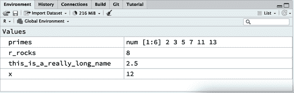

# 第二章：工作流：基础

现在你已经有一些运行 R 代码的经验了。我们没有给你太多细节，但显然你已经掌握了基础，否则你早就会因为挫败而扔掉这本书了！开始在 R 中编程时自然会感到挫折，因为它对标点符号要求严格，即使一个字符放错位置也会导致报错。但是，尽管你可能会有些挫折，要记住这是正常且暂时的经历：每个人都会经历，唯一的克服方法就是继续努力。

在我们继续之前，让我们确保你对运行 R 代码有坚实的基础，并且了解一些最有用的 RStudio 功能。

# 编码基础

让我们回顾一些基础知识，这些知识我们之前为了尽快让你绘图而省略了。你可以使用 R 进行基本的数学计算：

```
1 / 200 * 30
#> [1] 0.15
(59 + 73 + 2) / 3
#> [1] 44.66667
sin(pi / 2)
#> [1] 1
```

你可以用赋值操作符 `<-` 创建新的对象：

```
x <- 3 * 4
```

注意，变量 `x` 的值并不会被打印出来，它只是被存储起来了。如果你想查看这个值，在控制台输入 `x` 即可。

你可以使用 [`c()`](https://rdrr.io/r/base/c.xhtml) 将多个元素组合成一个向量：

```
primes <- c(2, 3, 5, 7, 11, 13)
```

对向量的基本算术运算会被应用到向量的每个元素上：

```
primes * 2
#> [1]  4  6 10 14 22 26
primes - 1
#> [1]  1  2  4  6 10 12
```

所有创建对象的 R 语句，*赋值* 语句，都具有相同的形式：

```
object_name <- value
```

在阅读代码时，可以在脑海中说 “对象名得到值”。

你会做很多赋值操作，而 `<-` 输入起来有些麻烦。你可以使用 RStudio 的键盘快捷键来节省时间：Alt+–（减号）。注意，RStudio 会自动在 `<-` 周围加上空格，这是良好的代码格式化实践。即使在好日子里阅读代码也可能令人沮丧，所以让你的眼睛休息一下，使用空格。

# 注释

R 将忽略每行中 `#` 后面的文本。这允许你编写 *注释*，这些文本会被 R 忽略，但是会被人类读取。我们有时在示例中包含注释来解释代码的执行过程。

注释可以帮助简要描述代码的功能：

```
# create vector of primes
primes <- c(2, 3, 5, 7, 11, 13)

# multiply primes by 2
primes * 2
#> [1]  4  6 10 14 22 26
```

对于像这样的短小代码，可能并不需要为每一行代码都留下注释。但是当你写的代码变得更加复杂时，注释可以节省你（和你的合作者）大量的时间，用来弄清楚代码的执行过程。

使用注释来解释代码的 *为什么* 而不是 *如何* 或 *什么*。代码的 *如何* 和 *什么* 总是可以通过仔细阅读来弄清楚，即使这可能有些繁琐。如果你在注释中描述每一个步骤，然后又改变了代码，你就必须记得更新注释，否则当你将来回到代码时会感到困惑。

弄清楚*为什么*做某事要困难得多，甚至不可能。例如，`geom_smooth()`有一个名为`span`的参数，用于控制曲线的平滑度，较大的值会产生更平滑的曲线。假设您决定将`span`的值从默认值 0.75 更改为 0.9：对于未来的读者来说，理解*正在发生什么*很容易，但除非您在注释中记录您的思考，否则没有人会理解*为什么*您更改了默认值。

对于数据分析代码，请使用注释来解释您的整体攻击计划，并在遇到重要见解时记录它们。无法从代码本身重新捕获这些知识。

# 名称的重要性？

对象名称必须以字母开头，只能包含字母、数字、`_`和`.`。您希望对象名称具有描述性，因此需要采用多词的约定。我们推荐使用*snake_case*，其中您用`_`分隔小写单词。

```
i_use_snake_case
otherPeopleUseCamelCase
some.people.use.periods
And_aFew.People_RENOUNCEconvention
```

我们将在讨论代码风格的第四章时再次谈到名称。

您可以通过输入其名称来检查对象：

```
x
#> [1] 12
```

再做一个赋值：

```
this_is_a_really_long_name <- 2.5
```

要检查此对象，请尝试使用 RStudio 的完成功能：输入*this*，按 Tab 键，添加字符直到有一个唯一的前缀，然后按 Enter 键。

假设您犯了一个错误，`this_is_a_really_long_name`的值应该是 3.5，而不是 2.5。您可以使用另一个键盘快捷键来帮助您进行更正。例如，您可以按↑键来获取您最后输入的命令并进行编辑。或者，输入*this*，然后按 Cmd/Ctrl+↑列出以这些字母开头的所有命令。使用箭头键进行导航，然后按 Enter 键重新输入命令。将 2.5 更改为 3.5 并重新运行。

再做一个赋值：

```
r_rocks <- 2³
```

让我们尝试检查它：

```
r_rock
#> Error: object 'r_rock' not found
R_rocks
#> Error: object 'R_rocks' not found
```

这说明了您与 R 之间的隐含契约：R 将为您执行繁琐的计算，但作为交换，您必须在指令中完全精确。如果不这样做，您可能会收到一个错误消息，指出您要查找的对象未找到。拼写错误很重要；R 无法猜测你的意图并说：“哦，他们在键入`r_rock`时可能指的是`r_rocks`。”大小写很重要；类似地，R 无法猜测你的意图并说：“哦，他们在键入`R_rocks`时可能指的是`r_rocks`。”

# 调用函数

R 具有大量内置函数，可以这样调用它们：

```
function_name(argument1 = value1, argument2 = value2, ...)
```

让我们尝试使用[`seq()`](https://rdrr.io/r/base/seq.xhtml)，它可以创建数字的*seq*序列，并且在我们进行学习 RStudio 的更多有用功能时。输入`se`并按 Tab 键。弹出窗口会显示可能的完成项。通过键入更多内容（如`q`）来明确或使用↑/↓箭头选择[`seq()`](https://rdrr.io/r/base/seq.xhtml)。注意浮动工具提示窗口，提醒您函数的参数和目的。如果需要更多帮助，请按 F1 键获取右下角帮助选项卡上的所有详细信息。

选择了您想要的函数后，再次按 Tab。RStudio 会为您添加匹配的开括号`(`和闭括号`)`。键入第一个参数`from`并设置为`1`。然后，键入第二个参数`to`并设置为`10`。最后，按回车。

```
seq(from = 1, to = 10)
#>  [1]  1  2  3  4  5  6  7  8  9 10
```

我们经常省略函数调用中前几个参数的名称，因此我们可以将其重写如下：

```
seq(1, 10)
#>  [1]  1  2  3  4  5  6  7  8  9 10
```

输入以下代码，并注意 RStudio 提供了与成对引号相似的帮助：

```
x <- "hello world"
```

引号和括号必须成对出现。RStudio 会尽力帮助您，但仍然有可能出错，导致括号不匹配。如果出现这种情况，R 会显示续行字符+：

```
> x <- "hello
+
```

`+`表示 R 正在等待更多输入；它认为您还没有完成。通常，这意味着您忘记了`"`或`)`。要么添加丢失的配对，要么按 Esc 中止表达式，然后重试。

注意，右上角的环境选项卡显示了您创建的所有对象：



# 练习

1.  为什么这段代码不起作用？

    ```
    my_variable <- 10
    my_varıable
    #> Error in eval(expr, envir, enclos): object 'my_varıable' not found
    ```

    仔细观察！（这可能看起来毫无意义，但是当您编程时，训练大脑注意甚至最微小的差异将会带来回报。）

1.  调整以下每个 R 命令，使其正确运行：

    ```
    libary(todyverse)

    ggplot(dTA = mpg) + 
      geom_point(maping = aes(x = displ y = hwy)) +
      geom_smooth(method = "lm)
    ```

1.  按 Option+Shift+K/Alt+Shift+K。会发生什么？如何使用菜单达到相同的位置？

1.  让我们回顾一下“保存您的图形”中的练习。运行以下代码行。哪个图表保存为`mpg-plot.png`？为什么？

    ```
    my_bar_plot <- ggplot(mpg, aes(x = class)) +
      geom_bar()
    my_scatter_plot <- ggplot(mpg, aes(x = cty, y = hwy)) +
      geom_point()
    ggsave(filename = "mpg-plot.png", plot = my_bar_plot)
    ```

# 摘要

现在您对 R 代码的工作原理有了更多了解，并获得了一些帮助您在未来回顾代码时理解的提示，在下一章中，我们将继续您的数据科学之旅，教您有关 dplyr 的内容，这是一个帮助您转换数据的 tidyverse 包，无论是选择重要变量，过滤感兴趣的行，还是计算摘要统计数据。
