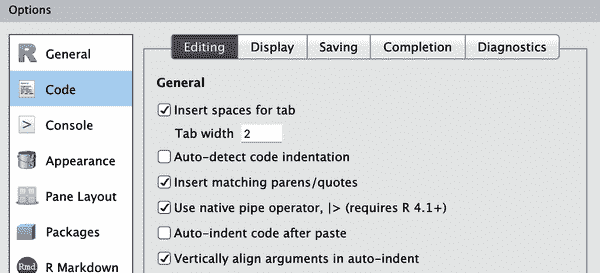
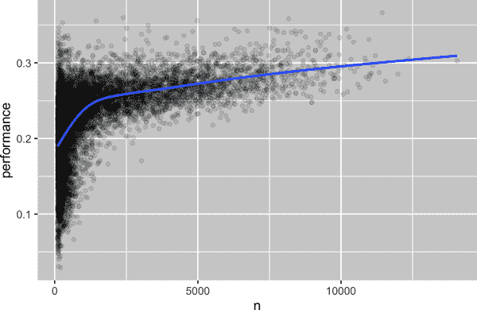

# 第三章：数据转换

# 简介

可视化是生成洞察力的重要工具，但很少有您能直接获取您需要的数据来制作想要的图形。通常，您需要创建一些新的变量或总结来回答您的数据问题，或者您可能只是想重新命名变量或重新排序观察以使数据更容易处理。在本章中，您将学习如何执行所有这些操作（以及更多！），介绍使用 dplyr 包和 2013 年离开纽约市的航班数据集进行数据转换。

本章的目标是为您概述转换数据框的所有关键工具。我们将从操作数据框行和列的函数开始，然后我们将回到更多讨论管道，这是一个重要的工具，用于组合动词。然后，我们将介绍如何使用分组进行工作。最后，我们将以一个展示这些功能实际应用的案例研究结束，并在后续章节中更详细地回顾这些函数，深入挖掘特定类型的数据（例如数字、字符串、日期）。

## 先决条件

在本章中，我们将专注于 dplyr 包，这是 tidyverse 的另一个核心成员。我们将使用 nycflights13 包的数据来说明关键思想，并使用 ggplot2 帮助我们理解数据。

```
library(nycflights13)
library(tidyverse)
#> ── Attaching core tidyverse packages ───────────────────── tidyverse 2.0.0 ──
#> ✔ dplyr     1.1.0.9000     ✔ readr     2.1.4 
#> ✔ forcats   1.0.0          ✔ stringr   1.5.0 
#> ✔ ggplot2   3.4.1          ✔ tibble    3.1.8 
#> ✔ lubridate 1.9.2          ✔ tidyr     1.3.0 
#> ✔ purrr     1.0.1 
#> ── Conflicts ─────────────────────────────────────── tidyverse_conflicts() ──
#> ✖ dplyr::filter() masks stats::filter()
#> ✖ dplyr::lag()    masks stats::lag()
#> ℹ Use the conflicted package (<http://conflicted.r-lib.org/>) to force all 
#>   conflicts to become errors
```

在加载 tidyverse 时，务必注意冲突信息消息的内容。它告诉您，dplyr 覆盖了 base R 中的某些函数。如果您希望在加载 dplyr 后使用这些函数的基本版本，则需要使用它们的全名：[`stats::filter()`](https://rdrr.io/r/stats/filter.xhtml) 和 [`stats::lag()`](https://rdrr.io/r/stats/lag.xhtml)。到目前为止，我们大多数时间忽略了函数来自哪个包，因为大多数情况下这并不重要。然而，知道包的来源可以帮助您找到帮助以及相关函数，因此当我们需要准确指定函数来自哪个包时，我们将使用与 R 相同的语法：`包名::函数名()`。

## nycflights13

要探索基本的 dplyr 动词，我们将使用[`nycflights13::flights`](https://rdrr.io/pkg/nycflights13/man/flights.xhtml)。此数据集包含了 2013 年从纽约市起飞的所有 336,776 架次航班。数据来自美国运输统计局，并在[`?flights`](https://rdrr.io/pkg/nycflights13/man/flights.xhtml)中有详细记录。

```
flights
#> # A tibble: 336,776 × 19
#>    year month   day dep_time sched_dep_time dep_delay arr_time sched_arr_time
#>   <int> <int> <int>    <int>          <int>     <dbl>    <int>          <int>
#> 1  2013     1     1      517            515         2      830            819
#> 2  2013     1     1      533            529         4      850            830
#> 3  2013     1     1      542            540         2      923            850
#> 4  2013     1     1      544            545        -1     1004           1022
#> 5  2013     1     1      554            600        -6      812            837
#> 6  2013     1     1      554            558        -4      740            728
#> # … with 336,770 more rows, and 11 more variables: arr_delay <dbl>,
#> #   carrier <chr>, flight <int>, tailnum <chr>, origin <chr>, dest <chr>, …
```

`flights` 是一个 tibble，这是 tidyverse 中用来避免一些常见问题的一种特殊数据框。tibble 和数据框之间最重要的区别是它们的打印方式；它们被设计用于大型数据集，因此只显示前几行和能在一个屏幕上显示的列。有几种方法可以查看所有内容。如果你使用 RStudio，最方便的可能是 `View(flights)`，它将打开一个交互式可滚动和可过滤的视图。否则，你可以使用 `print(flights, width = Inf)` 来显示所有列，或者使用 [`glimpse()`](https://pillar.r-lib.org/reference/glimpse.xhtml)。

```
glimpse(flights)
#> Rows: 336,776
#> Columns: 19
#> $ year           <int> 2013, 2013, 2013, 2013, 2013, 2013, 2013, 2013, 2013…
#> $ month          <int> 1, 1, 1, 1, 1, 1, 1, 1, 1, 1, 1, 1, 1, 1, 1, 1, 1, 1…
#> $ day            <int> 1, 1, 1, 1, 1, 1, 1, 1, 1, 1, 1, 1, 1, 1, 1, 1, 1, 1…
#> $ dep_time       <int> 517, 533, 542, 544, 554, 554, 555, 557, 557, 558, 55…
#> $ sched_dep_time <int> 515, 529, 540, 545, 600, 558, 600, 600, 600, 600, 60…
#> $ dep_delay      <dbl> 2, 4, 2, -1, -6, -4, -5, -3, -3, -2, -2, -2, -2, -2,…
#> $ arr_time       <int> 830, 850, 923, 1004, 812, 740, 913, 709, 838, 753, 8…
#> $ sched_arr_time <int> 819, 830, 850, 1022, 837, 728, 854, 723, 846, 745, 8…
#> $ arr_delay      <dbl> 11, 20, 33, -18, -25, 12, 19, -14, -8, 8, -2, -3, 7,…
#> $ carrier        <chr> "UA", "UA", "AA", "B6", "DL", "UA", "B6", "EV", "B6"…
#> $ flight         <int> 1545, 1714, 1141, 725, 461, 1696, 507, 5708, 79, 301…
#> $ tailnum        <chr> "N14228", "N24211", "N619AA", "N804JB", "N668DN", "N…
#> $ origin         <chr> "EWR", "LGA", "JFK", "JFK", "LGA", "EWR", "EWR", "LG…
#> $ dest           <chr> "IAH", "IAH", "MIA", "BQN", "ATL", "ORD", "FLL", "IA…
#> $ air_time       <dbl> 227, 227, 160, 183, 116, 150, 158, 53, 140, 138, 149…
#> $ distance       <dbl> 1400, 1416, 1089, 1576, 762, 719, 1065, 229, 944, 73…
#> $ hour           <dbl> 5, 5, 5, 5, 6, 5, 6, 6, 6, 6, 6, 6, 6, 6, 6, 5, 6, 6…
#> $ minute         <dbl> 15, 29, 40, 45, 0, 58, 0, 0, 0, 0, 0, 0, 0, 0, 0, 59…
#> $ time_hour      <dttm> 2013-01-01 05:00:00, 2013-01-01 05:00:00, 2013-01-0…
```

在两种视图中，变量名后面跟着缩写，告诉你每个变量的类型：`<int>` 代表整数，`<dbl>` 代表双精度数（也就是实数），`<chr>` 代表字符（也就是字符串），`<dttm>` 代表日期时间。这些很重要，因为你可以对列执行的操作很大程度上取决于它的“类型”。

## dplyr 基础

你即将学习到主要的 dplyr 动词（函数），这将使你能够解决绝大多数的数据操作挑战。但在讨论它们的个别差异之前，值得声明它们的共同点：

+   第一个参数始终是数据框。

+   后续的参数通常描述要操作的列，使用变量名（无需引号）。

+   输出始终是一个新的数据框。

因为每个动词都能做好一件事情，解决复杂问题通常需要结合多个动词，并且我们将使用管道 `|>` 进行操作。我们将在“管道”中详细讨论管道，但简单来说，管道接受左边的内容并将其传递给右边的函数，所以 `x |> f(y)` 等同于 `f(x, y)`，`x |> f(y) |> g(z)` 等同于 `g(f(x, y), z)`。最简单的方法是将管道读作“then”。这使得即使你尚未学习细节，也能对以下代码有所了解：

```
flights |>
  filter(dest == "IAH") |> 
  group_by(year, month, day) |> 
  summarize(
    arr_delay = mean(arr_delay, na.rm = TRUE)
  )
```

dplyr 的动词按照它们操作的内容分为四组：*行*、*列*、*组* 和 *表*。在接下来的章节中，你将学习行、列和组的最重要的动词；然后我们将回到在第十九章中操作表的连接动词。让我们开始吧！

# 行

操作数据集行的最重要动词是[`filter()`](https://dplyr.tidyverse.org/reference/filter.xhtml)，它更改出现的行而不更改它们的顺序，以及[`arrange()`](https://dplyr.tidyverse.org/reference/arrange.xhtml)，它更改行的顺序而不更改出现的行。这两个函数只影响行，而列保持不变。我们还将讨论[`distinct()`](https://dplyr.tidyverse.org/reference/distinct.xhtml)，它查找具有唯一值的行，但与[`arrange()`](https://dplyr.tidyverse.org/reference/arrange.xhtml)和[`filter()`](https://dplyr.tidyverse.org/reference/filter.xhtml)不同，它还可以选择修改列。

## `filter()`

[`filter()`](https://dplyr.tidyverse.org/reference/filter.xhtml)允许您基于列的值保留行。¹ 第一个参数是数据框。第二个及后续参数是必须为真的条件以保留行。例如，我们可以找到所有延误超过 120 分钟（两小时）的航班：

```
flights |> 
  filter(dep_delay > 120)
#> # A tibble: 9,723 × 19
#>    year month   day dep_time sched_dep_time dep_delay arr_time sched_arr_time
#>   <int> <int> <int>    <int>          <int>     <dbl>    <int>          <int>
#> 1  2013     1     1      848           1835       853     1001           1950
#> 2  2013     1     1      957            733       144     1056            853
#> 3  2013     1     1     1114            900       134     1447           1222
#> 4  2013     1     1     1540           1338       122     2020           1825
#> 5  2013     1     1     1815           1325       290     2120           1542
#> 6  2013     1     1     1842           1422       260     1958           1535
#> # … with 9,717 more rows, and 11 more variables: arr_delay <dbl>,
#> #   carrier <chr>, flight <int>, tailnum <chr>, origin <chr>, dest <chr>, …
```

除了 `>`（大于），您还可以使用 `>=`（大于或等于），`<`（小于），`<=`（小于或等于），`==`（等于）和 `!=`（不等于）。您还可以使用 `&` 或 `,` 结合条件表示“并且”（检查两个条件）或使用 `|` 表示“或”（检查任一条件）：

```
# Flights that departed on January 1
flights |> 
  filter(month == 1 & day == 1)
#> # A tibble: 842 × 19
#>    year month   day dep_time sched_dep_time dep_delay arr_time sched_arr_time
#>   <int> <int> <int>    <int>          <int>     <dbl>    <int>          <int>
#> 1  2013     1     1      517            515         2      830            819
#> 2  2013     1     1      533            529         4      850            830
#> 3  2013     1     1      542            540         2      923            850
#> 4  2013     1     1      544            545        -1     1004           1022
#> 5  2013     1     1      554            600        -6      812            837
#> 6  2013     1     1      554            558        -4      740            728
#> # … with 836 more rows, and 11 more variables: arr_delay <dbl>,
#> #   carrier <chr>, flight <int>, tailnum <chr>, origin <chr>, dest <chr>, …

# Flights that departed in January or February
flights |> 
  filter(month == 1 | month == 2)
#> # A tibble: 51,955 × 19
#>    year month   day dep_time sched_dep_time dep_delay arr_time sched_arr_time
#>   <int> <int> <int>    <int>          <int>     <dbl>    <int>          <int>
#> 1  2013     1     1      517            515         2      830            819
#> 2  2013     1     1      533            529         4      850            830
#> 3  2013     1     1      542            540         2      923            850
#> 4  2013     1     1      544            545        -1     1004           1022
#> 5  2013     1     1      554            600        -6      812            837
#> 6  2013     1     1      554            558        -4      740            728
#> # … with 51,949 more rows, and 11 more variables: arr_delay <dbl>,
#> #   carrier <chr>, flight <int>, tailnum <chr>, origin <chr>, dest <chr>, …
```

当您结合 `|` 和 `==` 时，有一个有用的快捷方式：`%in%`。它保留变量等于右侧值之一的行：

```
# A shorter way to select flights that departed in January or February
flights |> 
  filter(month %in% c(1, 2))
#> # A tibble: 51,955 × 19
#>    year month   day dep_time sched_dep_time dep_delay arr_time sched_arr_time
#>   <int> <int> <int>    <int>          <int>     <dbl>    <int>          <int>
#> 1  2013     1     1      517            515         2      830            819
#> 2  2013     1     1      533            529         4      850            830
#> 3  2013     1     1      542            540         2      923            850
#> 4  2013     1     1      544            545        -1     1004           1022
#> 5  2013     1     1      554            600        -6      812            837
#> 6  2013     1     1      554            558        -4      740            728
#> # … with 51,949 more rows, and 11 more variables: arr_delay <dbl>,
#> #   carrier <chr>, flight <int>, tailnum <chr>, origin <chr>, dest <chr>, …
```

我们将在第十二章中更详细地讨论这些比较和逻辑运算符。

运行[`filter()`](https://dplyr.tidyverse.org/reference/filter.xhtml)时，dplyr 执行过滤操作，创建一个新的数据框，然后将其打印出来。它不会修改现有的 `flights` 数据集，因为 dplyr 函数从不修改它们的输入。要保存结果，您需要使用赋值运算符 `<-`：

```
jan1 <- flights |> 
  filter(month == 1 & day == 1)
```

## 常见错误

在开始使用 R 时，最容易犯的错误是在测试相等性时使用 `=` 而不是 `==`。[`filter()`](https://dplyr.tidyverse.org/reference/filter.xhtml)会在发生这种情况时通知您：

```
flights |> 
  filter(month = 1)
#> Error in `filter()`:
#> ! We detected a named input.
#> ℹ This usually means that you've used `=` instead of `==`.
#> ℹ Did you mean `month == 1`?
```

另一个错误是像在英语中那样编写“或”语句：

```
flights |> 
  filter(month == 1 | 2)
```

这“有效”，意味着它不会报错，但它不会做你想要的事情，因为 `|` 首先检查条件 `month == 1`，然后检查条件 `2`，这不是一个明智的条件。我们将在“布尔运算”中详细了解这里发生的情况和原因。

## `arrange()`

[`arrange()`](https://dplyr.tidyverse.org/reference/arrange.xhtml)根据列的值更改行的顺序。 它接受数据框和一组列名（或更复杂的表达式）来排序。 如果提供多个列名，则每个额外的列将用于打破前面列值的关系。 例如，以下代码按出发时间排序，该时间分布在四列中。 我们首先得到最早的年份，然后在一年内得到最早的月份，等等。

```
flights |> 
  arrange(year, month, day, dep_time)
#> # A tibble: 336,776 × 19
#>    year month   day dep_time sched_dep_time dep_delay arr_time sched_arr_time
#>   <int> <int> <int>    <int>          <int>     <dbl>    <int>          <int>
#> 1  2013     1     1      517            515         2      830            819
#> 2  2013     1     1      533            529         4      850            830
#> 3  2013     1     1      542            540         2      923            850
#> 4  2013     1     1      544            545        -1     1004           1022
#> 5  2013     1     1      554            600        -6      812            837
#> 6  2013     1     1      554            558        -4      740            728
#> # … with 336,770 more rows, and 11 more variables: arr_delay <dbl>,
#> #   carrier <chr>, flight <int>, tailnum <chr>, origin <chr>, dest <chr>, …
```

您可以在[`arrange()`](https://dplyr.tidyverse.org/reference/arrange.xhtml)内部的列上使用[`desc()`](https://dplyr.tidyverse.org/reference/desc.xhtml)来按降序（从大到小）重新排序数据框。 例如，此代码按最长延误的航班排序：

```
flights |> 
  arrange(desc(dep_delay))
#> # A tibble: 336,776 × 19
#>    year month   day dep_time sched_dep_time dep_delay arr_time sched_arr_time
#>   <int> <int> <int>    <int>          <int>     <dbl>    <int>          <int>
#> 1  2013     1     9      641            900      1301     1242           1530
#> 2  2013     6    15     1432           1935      1137     1607           2120
#> 3  2013     1    10     1121           1635      1126     1239           1810
#> 4  2013     9    20     1139           1845      1014     1457           2210
#> 5  2013     7    22      845           1600      1005     1044           1815
#> 6  2013     4    10     1100           1900       960     1342           2211
#> # … with 336,770 more rows, and 11 more variables: arr_delay <dbl>,
#> #   carrier <chr>, flight <int>, tailnum <chr>, origin <chr>, dest <chr>, …
```

请注意，行数没有改变。 我们只是排列数据； 我们没有过滤它。

## distinct()

[`distinct()`](https://dplyr.tidyverse.org/reference/distinct.xhtml)在数据集中找到所有唯一的行，因此在技术上，它主要操作行。 大多数情况下，但是，您将希望某些变量的唯一组合，因此还可以选择提供列名：

```
# Remove duplicate rows, if any
flights |> 
  distinct()
#> # A tibble: 336,776 × 19
#>    year month   day dep_time sched_dep_time dep_delay arr_time sched_arr_time
#>   <int> <int> <int>    <int>          <int>     <dbl>    <int>          <int>
#> 1  2013     1     1      517            515         2      830            819
#> 2  2013     1     1      533            529         4      850            830
#> 3  2013     1     1      542            540         2      923            850
#> 4  2013     1     1      544            545        -1     1004           1022
#> 5  2013     1     1      554            600        -6      812            837
#> 6  2013     1     1      554            558        -4      740            728
#> # … with 336,770 more rows, and 11 more variables: arr_delay <dbl>,
#> #   carrier <chr>, flight <int>, tailnum <chr>, origin <chr>, dest <chr>, …

# Find all unique origin and destination pairs
flights |> 
  distinct(origin, dest)
#> # A tibble: 224 × 2
#>   origin dest 
#>   <chr>  <chr>
#> 1 EWR    IAH 
#> 2 LGA    IAH 
#> 3 JFK    MIA 
#> 4 JFK    BQN 
#> 5 LGA    ATL 
#> 6 EWR    ORD 
#> # … with 218 more rows
```

或者，如果您想在过滤唯一行时保留其他列，可以使用`.keep_all = TRUE`选项：

```
flights |> 
  distinct(origin, dest, .keep_all = TRUE)
#> # A tibble: 224 × 19
#>    year month   day dep_time sched_dep_time dep_delay arr_time sched_arr_time
#>   <int> <int> <int>    <int>          <int>     <dbl>    <int>          <int>
#> 1  2013     1     1      517            515         2      830            819
#> 2  2013     1     1      533            529         4      850            830
#> 3  2013     1     1      542            540         2      923            850
#> 4  2013     1     1      544            545        -1     1004           1022
#> 5  2013     1     1      554            600        -6      812            837
#> 6  2013     1     1      554            558        -4      740            728
#> # … with 218 more rows, and 11 more variables: arr_delay <dbl>,
#> #   carrier <chr>, flight <int>, tailnum <chr>, origin <chr>, dest <chr>, …
```

所有这些独特航班都是在 1 月 1 日，这并非偶然：[`distinct()`](https://dplyr.tidyverse.org/reference/distinct.xhtml)将找到数据集中唯一行的第一次出现并且丢弃其余。

如果您想要找到发生的次数，最好将[`distinct()`](https://dplyr.tidyverse.org/reference/distinct.xhtml)换成[`count()`](https://dplyr.tidyverse.org/reference/count.xhtml)，并且通过`sort = TRUE`参数，您可以按发生次数降序排列它们。 您将在“计数”中了解更多信息。

```
flights |>
  count(origin, dest, sort = TRUE)
#> # A tibble: 224 × 3
#>   origin dest      n
#>   <chr>  <chr> <int>
#> 1 JFK    LAX   11262
#> 2 LGA    ATL   10263
#> 3 LGA    ORD    8857
#> 4 JFK    SFO    8204
#> 5 LGA    CLT    6168
#> 6 EWR    ORD    6100
#> # … with 218 more rows
```

## 练习

1.  对于每个条件的单一管道，请查找满足条件的所有航班：

    +   到达延误两个或更多小时

    +   飞往休斯顿（`IAH`或`HOU`）

    +   由联合、美国或达美运营

    +   在夏季（7 月、8 月和 9 月）起飞

    +   到达晚于两小时，但未晚点离开

    +   起飞至少推迟了一个小时，但在飞行中超过 30 分钟

1.  对`flights`进行排序，以找到出发延误最长的航班。 找到早晨出发最早的航班。

1.  对`flights`进行排序，以找到最快的航班。（提示：尝试在函数内部包含数学计算。）

1.  2013 年每天都有航班吗？

1.  哪些航班飞行的距离最远？ 哪些飞行的距离最短？

1.  如果同时使用[`filter()`](https://dplyr.tidyverse.org/reference/filter.xhtml)和[`arrange()`](https://dplyr.tidyverse.org/reference/arrange.xhtml)，使用顺序是否重要？为什么？考虑结果以及函数需要执行的工作量。

# 列

有四个重要的动词会影响列而不改变行：[`mutate()`](https://dplyr.tidyverse.org/reference/mutate.xhtml)创建新列，这些列是从现有列派生出来的；[`select()`](https://dplyr.tidyverse.org/reference/select.xhtml)改变存在的列；[`rename()`](https://dplyr.tidyverse.org/reference/rename.xhtml)改变列的名称；以及[`relocate()`](https://dplyr.tidyverse.org/reference/relocate.xhtml)改变列的位置。

## mutate()

[`mutate()`](https://dplyr.tidyverse.org/reference/mutate.xhtml)的作用是添加新列，这些列是从现有列计算而来的。在后续的转换章节中，您将学习一系列函数，可以用来操作不同类型的变量。目前，我们将继续使用基本的代数，这样可以计算`gain`（延误航班在空中弥补的时间量）和以英里每小时计算的`speed`：

```
flights |> 
  mutate(
    gain = dep_delay - arr_delay,
    speed = distance / air_time * 60
  )
#> # A tibble: 336,776 × 21
#>    year month   day dep_time sched_dep_time dep_delay arr_time sched_arr_time
#>   <int> <int> <int>    <int>          <int>     <dbl>    <int>          <int>
#> 1  2013     1     1      517            515         2      830            819
#> 2  2013     1     1      533            529         4      850            830
#> 3  2013     1     1      542            540         2      923            850
#> 4  2013     1     1      544            545        -1     1004           1022
#> 5  2013     1     1      554            600        -6      812            837
#> 6  2013     1     1      554            558        -4      740            728
#> # … with 336,770 more rows, and 13 more variables: arr_delay <dbl>,
#> #   carrier <chr>, flight <int>, tailnum <chr>, origin <chr>, dest <chr>, …
```

默认情况下，[`mutate()`](https://dplyr.tidyverse.org/reference/mutate.xhtml)会在数据集的右侧添加新列，这使得难以理解正在发生的情况。我们可以使用`.before`参数将变量添加到左侧：

```
flights |> 
  mutate(
    gain = dep_delay - arr_delay,
    speed = distance / air_time * 60,
    .before = 1
  )
#> # A tibble: 336,776 × 21
#>    gain speed  year month   day dep_time sched_dep_time dep_delay arr_time
#>   <dbl> <dbl> <int> <int> <int>    <int>          <int>     <dbl>    <int>
#> 1    -9  370\.  2013     1     1      517            515         2      830
#> 2   -16  374\.  2013     1     1      533            529         4      850
#> 3   -31  408\.  2013     1     1      542            540         2      923
#> 4    17  517\.  2013     1     1      544            545        -1     1004
#> 5    19  394\.  2013     1     1      554            600        -6      812
#> 6   -16  288\.  2013     1     1      554            558        -4      740
#> # … with 336,770 more rows, and 12 more variables: sched_arr_time <int>,
#> #   arr_delay <dbl>, carrier <chr>, flight <int>, tailnum <chr>, …
```

`.`是一个标志，指示`.before`是函数的参数，而不是我们正在创建的第三个新变量的名称。您还可以使用`.after`在变量后添加，`.before`和`.after`都可以使用变量名而不是位置。例如，我们可以在`day`后添加新变量：

```
flights |> 
  mutate(
    gain = dep_delay - arr_delay,
    speed = distance / air_time * 60,
    .after = day
  )
```

或者，您可以使用`.keep`参数来控制保留哪些变量。特别有用的参数是`"used"`，它指定我们仅保留在[`mutate()`](https://dplyr.tidyverse.org/reference/mutate.xhtml)步骤中涉及或创建的列。例如，以下输出仅包含变量`dep_delay`、`arr_delay`、`air_time`、`gain`、`hours`和`gain_per_hour`：

```
flights |> 
  mutate(
    gain = dep_delay - arr_delay,
    hours = air_time / 60,
    gain_per_hour = gain / hours,
    .keep = "used"
  )
```

请注意，由于我们尚未将上述计算的结果分配回`flights`，新变量`gain`、`hours`和`gain_per_hour`只会被打印出来，并不会存储在数据框中。如果我们希望它们在未来的使用中可用于数据框，我们应该仔细考虑是否希望将结果分配回`flights`，覆盖原始数据框并添加更多变量，或者分配到一个新对象。通常情况下，正确答案是创建一个具有信息性命名的新对象，例如`delay_gain`，但您可能也有充分的理由覆盖`flights`。

## select()

很常见的情况是得到包含数百甚至数千个变量的数据集。在这种情况下，第一个挑战通常是集中精力处理你感兴趣的变量。[`select()`](https://dplyr.tidyverse.org/reference/select.xhtml)允许你通过基于变量名称的操作迅速缩小范围，聚焦于有用的子集：

+   根据名称选择列：

    ```
    flights |> 
      select(year, month, day)
    ```

+   选择从年到日之间的所有列（包括年和日）：

    ```
    flights |> 
      select(year:day)
    ```

+   选择除了年到日之间的所有列之外的列：

    ```
    flights |> 
      select(!year:day)
    ```

    你也可以使用`-`代替`!`（在实际应用中可能会看到），但我们建议使用`!`，因为它表示“非”，并且与`&`和`|`结合使用效果更佳。

+   选择所有字符类型的列

    ```
    flights |> 
      select(where(is.character))
    ```

在[`select()`](https://dplyr.tidyverse.org/reference/select.xhtml)中可以使用多个辅助函数：

`starts_with("abc")`

匹配以“abc”开头的名称

`ends_with("xyz")`

匹配以“xyz”结尾的名称

`contains("ijk")`

匹配包含“ijk”的名称

`num_range("x", 1:3)`

匹配`x1`、`x2`和`x3`

查看[`?select`](https://dplyr.tidyverse.org/reference/select.xhtml)获取更多细节。一旦你掌握了正则表达式（第十五章的主题），你还可以使用[`matches()`](https://tidyselect.r-lib.org/reference/starts_with.xhtml)选择与模式匹配的变量。

你可以在[`select()`](https://dplyr.tidyverse.org/reference/select.xhtml)中通过使用`=`来重命名变量。新名称显示在`=`的左侧，旧变量显示在右侧：

```
flights |> 
  select(tail_num = tailnum)
#> # A tibble: 336,776 × 1
#>   tail_num
#>   <chr> 
#> 1 N14228 
#> 2 N24211 
#> 3 N619AA 
#> 4 N804JB 
#> 5 N668DN 
#> 6 N39463 
#> # … with 336,770 more rows
```

## rename()

如果你想保留所有现有的变量，只想重新命名其中的几个，可以使用[`rename()`](https://dplyr.tidyverse.org/reference/rename.xhtml)，而不是[`select()`](https://dplyr.tidyverse.org/reference/select.xhtml)：

```
flights |> 
  rename(tail_num = tailnum)
#> # A tibble: 336,776 × 19
#>    year month   day dep_time sched_dep_time dep_delay arr_time sched_arr_time
#>   <int> <int> <int>    <int>          <int>     <dbl>    <int>          <int>
#> 1  2013     1     1      517            515         2      830            819
#> 2  2013     1     1      533            529         4      850            830
#> 3  2013     1     1      542            540         2      923            850
#> 4  2013     1     1      544            545        -1     1004           1022
#> 5  2013     1     1      554            600        -6      812            837
#> 6  2013     1     1      554            558        -4      740            728
#> # … with 336,770 more rows, and 11 more variables: arr_delay <dbl>,
#> #   carrier <chr>, flight <int>, tail_num <chr>, origin <chr>, dest <chr>, …
```

如果你有一堆命名不一致的列，并且手动修复它们都很麻烦，可以查看[`janitor::clean_names()`](https://rdrr.io/pkg/janitor/man/clean_names.xhtml)，它提供了一些有用的自动清理功能。

## relocate()

使用[`relocate()`](https://dplyr.tidyverse.org/reference/relocate.xhtml)移动变量。你可能希望将相关变量集中在一起或将重要变量移到前面。默认情况下，[`relocate()`](https://dplyr.tidyverse.org/reference/relocate.xhtml)将变量移到最前面：

```
flights |> 
  relocate(time_hour, air_time)
#> # A tibble: 336,776 × 19
#>   time_hour           air_time  year month   day dep_time sched_dep_time
#>   <dttm>                 <dbl> <int> <int> <int>    <int>          <int>
#> 1 2013-01-01 05:00:00      227  2013     1     1      517            515
#> 2 2013-01-01 05:00:00      227  2013     1     1      533            529
#> 3 2013-01-01 05:00:00      160  2013     1     1      542            540
#> 4 2013-01-01 05:00:00      183  2013     1     1      544            545
#> 5 2013-01-01 06:00:00      116  2013     1     1      554            600
#> 6 2013-01-01 05:00:00      150  2013     1     1      554            558
#> # … with 336,770 more rows, and 12 more variables: dep_delay <dbl>,
#> #   arr_time <int>, sched_arr_time <int>, arr_delay <dbl>, carrier <chr>, …
```

你还可以像在[`mutate()`](https://dplyr.tidyverse.org/reference/mutate.xhtml)中一样使用`.before`和`.after`参数指定它们放置的位置：

```
flights |> 
  relocate(year:dep_time, .after = time_hour)
flights |> 
  relocate(starts_with("arr"), .before = dep_time)
```

## 练习

1.  比较`dep_time`、`sched_dep_time`和`dep_delay`。你会预期这三个数字有什么关系？

1.  思考尽可能多的方法来从`flights`中选择`dep_time`、`dep_delay`、`arr_time`和`arr_delay`。

1.  如果在[`select()`](https://dplyr.tidyverse.org/reference/select.xhtml)调用中多次指定同一个变量的名称会发生什么？

1.  [`any_of()`](https://tidyselect.r-lib.org/reference/all_of.xhtml)函数的作用是什么？为什么它在与这个向量结合时可能有帮助？

    ```
    variables <- c("year", "month", "day", "dep_delay", "arr_delay")
    ```

1.  运行以下代码的结果是否让您惊讶？选择助手如何默认处理大写和小写？如何更改该默认设置？

    ```
    flights |> select(contains("TIME"))
    ```

1.  将`air_time`重命名为`air_time_min`以指示测量单位，并将其移到数据框的开头。

1.  为什么以下方法不起作用，错误的含义是什么？

    ```
    flights |> 
      select(tailnum) |> 
      arrange(arr_delay)
    #> Error in `arrange()`:
    #> ℹ In argument: `..1 = arr_delay`.
    #> Caused by error:
    #> ! object 'arr_delay' not found
    ```

# 管道

我们向您展示了管道的简单示例，但其真正的力量是当您开始组合多个动词时。

例如，想象一下，您想找到飞往休斯顿 IAH 机场的快速航班：您需要结合[`filter()`](https://dplyr.tidyverse.org/reference/filter.xhtml)、[`mutate()`](https://dplyr.tidyverse.org/reference/mutate.xhtml)、[`select()`](https://dplyr.tidyverse.org/reference/select.xhtml)和[`arrange()`](https://dplyr.tidyverse.org/reference/arrange.xhtml)：

```
flights |> 
  filter(dest == "IAH") |> 
  mutate(speed = distance / air_time * 60) |> 
  select(year:day, dep_time, carrier, flight, speed) |> 
  arrange(desc(speed))
#> # A tibble: 7,198 × 7
#>    year month   day dep_time carrier flight speed
#>   <int> <int> <int>    <int> <chr>    <int> <dbl>
#> 1  2013     7     9      707 UA         226  522.
#> 2  2013     8    27     1850 UA        1128  521.
#> 3  2013     8    28      902 UA        1711  519.
#> 4  2013     8    28     2122 UA        1022  519.
#> 5  2013     6    11     1628 UA        1178  515.
#> 6  2013     8    27     1017 UA         333  515.
#> # … with 7,192 more rows
```

尽管此管道有四个步骤，但它很容易浏览，因为每行的动词都在开头：从`flights`数据开始，然后过滤，然后变异，然后选择，最后安排。

如果没有管道会发生什么？我们可以将每个函数调用嵌套在前一个调用内：

```
arrange(
  select(
    mutate(
      filter(
        flights, 
        dest == "IAH"
      ),
      speed = distance / air_time * 60
    ),
    year:day, dep_time, carrier, flight, speed
  ),
  desc(speed)
)
```

或者我们可以使用一堆中间对象：

```
flights1 <- filter(flights, dest == "IAH")
flights2 <- mutate(flights1, speed = distance / air_time * 60)
flights3 <- select(flights2, year:day, dep_time, carrier, flight, speed)
arrange(flights3, desc(speed))
```

虽然两种形式各有各的时间和场合，但管道通常生成更容易编写和阅读的数据分析代码。

要将管道符添加到您的代码中，我们建议使用内置键盘快捷键 Ctrl/Cmd+Shift+M。您需要对您的 RStudio 选项进行一次更改，以使用`|>`代替`%>%`，如图 3-1 所示；稍后详细介绍`%>%`。



###### 图 3-1\. 要插入`|>`，请确保选中“使用本地管道运算符”选项。

# magrittr

如果您已经使用 tidyverse 一段时间，您可能已经熟悉 magrittr 包提供的`%>%`管道。magrittr 包包含在核心 tidyverse 中，因此您可以在加载 tidyverse 时使用`%>%`：

```
library(tidyverse)

mtcars %>% 
  group_by(cyl) %>%
  summarize(n = n())
```

对于简单的情况，`|>`和`%>%`行为完全相同。那么为什么我们推荐基本管道呢？首先，因为它是 base R 的一部分，所以您在不使用 tidyverse 时仍然可以使用它。其次，`|>`比`%>%`简单得多：在 2014 年发明`%>%`和在 2021 年 R 4.1.0 中包含`|>`之间的时间内，我们对管道有了更好的理解。这使得基本实现可以舍弃不常用和不重要的功能。

# 组

到目前为止，你已经学习了如何处理行和列的函数。当你添加对分组的处理能力时，dplyr 变得更加强大。在这一节中，我们将重点介绍最重要的函数：[`group_by()`](https://dplyr.tidyverse.org/reference/group_by.xhtml)，[`summarize()`](https://dplyr.tidyverse.org/reference/summarise.xhtml)以及切片函数系列。

## group_by()

使用[`group_by()`](https://dplyr.tidyverse.org/reference/group_by.xhtml)将数据集分成对你的分析有意义的组：

```
flights |> 
  group_by(month)
#> # A tibble: 336,776 × 19
#> # Groups:   month [12]
#>    year month   day dep_time sched_dep_time dep_delay arr_time sched_arr_time
#>   <int> <int> <int>    <int>          <int>     <dbl>    <int>          <int>
#> 1  2013     1     1      517            515         2      830            819
#> 2  2013     1     1      533            529         4      850            830
#> 3  2013     1     1      542            540         2      923            850
#> 4  2013     1     1      544            545        -1     1004           1022
#> 5  2013     1     1      554            600        -6      812            837
#> 6  2013     1     1      554            558        -4      740            728
#> # … with 336,770 more rows, and 11 more variables: arr_delay <dbl>,
#> #   carrier <chr>, flight <int>, tailnum <chr>, origin <chr>, dest <chr>, …
```

[`group_by()`](https://dplyr.tidyverse.org/reference/group_by.xhtml)不会改变数据，但如果你仔细观察输出，你会注意到输出表明它是按月份分组的（`Groups: month [12]`）。这意味着接下来的操作将按“月份”进行。[`group_by()`](https://dplyr.tidyverse.org/reference/group_by.xhtml)将这种分组特性（称为*class*）添加到数据框中，这会改变对数据应用后续动词时的行为。

## summarize()

最重要的分组操作是摘要，如果用于计算单一摘要统计量，则将数据框减少到每组一个行。在 dplyr 中，这个操作由[`summarize()`](https://dplyr.tidyverse.org/reference/summarise.xhtml)³执行，如下例所示，计算每月的平均出发延误：

```
flights |> 
  group_by(month) |> 
  summarize(
    avg_delay = mean(dep_delay)
  )
#> # A tibble: 12 × 2
#>   month avg_delay
#>   <int>     <dbl>
#> 1     1        NA
#> 2     2        NA
#> 3     3        NA
#> 4     4        NA
#> 5     5        NA
#> 6     6        NA
#> # … with 6 more rows
```

啊哦！出了点问题，我们所有的结果都变成了`NA`（读作“N-A”），R 中代表缺失值的符号。这是因为观察到的一些航班在延误列中有缺失数据，因此当我们计算包括这些值的均值时，得到了`NA`结果。我们将在第十八章中详细讨论缺失值，但现在我们告诉[`mean()`](https://rdrr.io/r/base/mean.xhtml)函数通过将参数`na.rm`设置为`TRUE`来忽略所有缺失值：

```
flights |> 
  group_by(month) |> 
  summarize(
    delay = mean(dep_delay, na.rm = TRUE)
  )
#> # A tibble: 12 × 2
#>   month delay
#>   <int> <dbl>
#> 1     1  10.0
#> 2     2  10.8
#> 3     3  13.2
#> 4     4  13.9
#> 5     5  13.0
#> 6     6  20.8
#> # … with 6 more rows
```

在单次调用[`summarize()`](https://dplyr.tidyverse.org/reference/summarise.xhtml)中，你可以创建任意数量的摘要。在接下来的章节中，你将学习到各种有用的摘要方式，但其中一个有用的摘要是[`n()`](https://dplyr.tidyverse.org/reference/context.xhtml)，它返回每个组中的行数：

```
flights |> 
  group_by(month) |> 
  summarize(
    delay = mean(dep_delay, na.rm = TRUE), 
    n = n()
  )
#> # A tibble: 12 × 3
#>   month delay     n
#>   <int> <dbl> <int>
#> 1     1  10.0 27004
#> 2     2  10.8 24951
#> 3     3  13.2 28834
#> 4     4  13.9 28330
#> 5     5  13.0 28796
#> 6     6  20.8 28243
#> # … with 6 more rows
```

在数据科学中，均值和计数可以帮助你走得更远！

## 切片函数

有五个便捷的函数允许你在每个组内提取特定的行：

`df |> slice_head(n = 1)`

取每个组的第一行。

`df |> slice_tail(n = 1)`

取每个组的最后一行

`df |> slice_min(x, n = 1)`

取`x`列中值最小的行。

`df |> slice_max(x, n = 1)`

取`x`列中值最大的行。

`df |> slice_sample(n = 1)`

取一个随机行。

您可以变化 `n` 以选择多于一个行，或者，您可以使用 `prop = 0.1` 代替 `n =` 来选择每个组中的，例如，10% 的行。例如，以下代码查找到达每个目的地时最延迟的航班：

```
flights |> 
  group_by(dest) |> 
  slice_max(arr_delay, n = 1) |>
  relocate(dest)
#> # A tibble: 108 × 19
#> # Groups:   dest [105]
#>   dest   year month   day dep_time sched_dep_time dep_delay arr_time
#>   <chr> <int> <int> <int>    <int>          <int>     <dbl>    <int>
#> 1 ABQ    2013     7    22     2145           2007        98      132
#> 2 ACK    2013     7    23     1139            800       219     1250
#> 3 ALB    2013     1    25      123           2000       323      229
#> 4 ANC    2013     8    17     1740           1625        75     2042
#> 5 ATL    2013     7    22     2257            759       898      121
#> 6 AUS    2013     7    10     2056           1505       351     2347
#> # … with 102 more rows, and 11 more variables: sched_arr_time <int>,
#> #   arr_delay <dbl>, carrier <chr>, flight <int>, tailnum <chr>, …
```

请注意，这里有 105 个目的地，但我们在这里得到了 108 行。怎么回事？[`slice_min()`](https://dplyr.tidyverse.org/reference/slice.xhtml) 和 [`slice_max()`](https://dplyr.tidyverse.org/reference/slice.xhtml) 保留相同的值，所以 `n = 1` 意味着给我们所有具有最高值的行。如果您希望每组确实只有一行，您可以设置 `with_ties = FALSE`。

这类似于使用 [`summarize()`](https://dplyr.tidyverse.org/reference/summarise.xhtml) 计算最大延迟，但您将得到整个相应的行（如果有并列的话，可能是多行），而不是单个摘要统计。

## 按多个变量分组

您可以使用多个变量创建分组。例如，我们可以为每个日期创建一个分组：

```
daily <- flights |>  
  group_by(year, month, day)
daily
#> # A tibble: 336,776 × 19
#> # Groups:   year, month, day [365]
#>    year month   day dep_time sched_dep_time dep_delay arr_time sched_arr_time
#>   <int> <int> <int>    <int>          <int>     <dbl>    <int>          <int>
#> 1  2013     1     1      517            515         2      830            819
#> 2  2013     1     1      533            529         4      850            830
#> 3  2013     1     1      542            540         2      923            850
#> 4  2013     1     1      544            545        -1     1004           1022
#> 5  2013     1     1      554            600        -6      812            837
#> 6  2013     1     1      554            558        -4      740            728
#> # … with 336,770 more rows, and 11 more variables: arr_delay <dbl>,
#> #   carrier <chr>, flight <int>, tailnum <chr>, origin <chr>, dest <chr>, …
```

当您对多个变量进行汇总后的表分组时，每个汇总都会去掉最后一个分组。事后看来，这不是使此函数工作的好方法，但如果不破坏现有代码，这很难更改。为了明确正在发生的事情，dplyr 显示一条消息，告诉您如何更改此行为：

```
daily_flights <- daily |> 
  summarize(n = n())
#> `summarise()` has grouped output by 'year', 'month'. You can override using
#> the `.groups` argument.
```

如果您对此行为感到满意，您可以显式请求它以抑制消息：

```
daily_flights <- daily |> 
  summarize(
    n = n(), 
    .groups = "drop_last"
  )
```

或者通过设置不同的值（例如 `"drop"` 以删除所有分组或 `"keep"` 以保留相同的分组）来改变默认行为：

## 取消分组

您可能还希望在不使用 [`summarize()`](https://dplyr.tidyverse.org/reference/summarise.xhtml) 的情况下从数据框中移除分组。您可以使用 [`ungroup()`](https://dplyr.tidyverse.org/reference/group_by.xhtml) 来做到这一点：

```
daily |> 
  ungroup()
#> # A tibble: 336,776 × 19
#>    year month   day dep_time sched_dep_time dep_delay arr_time sched_arr_time
#>   <int> <int> <int>    <int>          <int>     <dbl>    <int>          <int>
#> 1  2013     1     1      517            515         2      830            819
#> 2  2013     1     1      533            529         4      850            830
#> 3  2013     1     1      542            540         2      923            850
#> 4  2013     1     1      544            545        -1     1004           1022
#> 5  2013     1     1      554            600        -6      812            837
#> 6  2013     1     1      554            558        -4      740            728
#> # … with 336,770 more rows, and 11 more variables: arr_delay <dbl>,
#> #   carrier <chr>, flight <int>, tailnum <chr>, origin <chr>, dest <chr>, …
```

现在让我们看看当您对未分组的数据框进行汇总时会发生什么：

```
daily |> 
  ungroup() |>
  summarize(
    avg_delay = mean(dep_delay, na.rm = TRUE), 
    flights = n()
  )
#> # A tibble: 1 × 2
#>   avg_delay flights
#>       <dbl>   <int>
#> 1      12.6  336776
```

您会得到一行，因为 dplyr 将未分组的数据框的所有行视为属于一个组。

## .by

dplyr 1.1.0 包含一个新的、实验性的句法，用于每个操作的分组，即 `.by` 参数。[`group_by()`](https://dplyr.tidyverse.org/reference/group_by.xhtml) 和 [`ungroup()`](https://dplyr.tidyverse.org/reference/group_by.xhtml) 并未被淘汰，但现在你也可以使用 `.by` 参数在单个操作内进行分组：

```
flights |> 
  summarize(
    delay = mean(dep_delay, na.rm = TRUE), 
    n = n(),
    .by = month
  )
```

或者如果您想按多个变量分组：

```
flights |> 
  summarize(
    delay = mean(dep_delay, na.rm = TRUE), 
    n = n(),
    .by = c(origin, dest)
  )
```

`.by` 适用于所有动词，并且具有这样的优势，即您在完成时不需要使用 `.groups` 参数来抑制分组消息或使用 [`ungroup()`](https://dplyr.tidyverse.org/reference/group_by.xhtml)。

我们在本章中没有专注于此句法，因为在我们编写书籍时它是非常新的。我们想提一下它，因为我们认为它具有很大的潜力，并且很可能会相当受欢迎。您可以在 [dplyr 1.1.0 博客文章](https://oreil.ly/ySpmy) 中了解更多信息。

## 练习

1.  哪个承运商的平均延误最严重？挑战：你能分辨出恶劣机场与糟糕航空公司的影响吗？为什么/为什么不？（提示：思考`flights |> group_by(carrier, dest) |> summarize(n())`。）

1.  找出从每个目的地出发时延误最严重的航班。

1.  一天中延误如何变化。用图表说明你的答案。

1.  如果你给[`slice_min()`](https://dplyr.tidyverse.org/reference/slice.xhtml)等函数提供一个负的`n`会发生什么？

1.  解释[`count()`](https://dplyr.tidyverse.org/reference/count.xhtml)在你刚学习的 dplyr 动词中的作用。[`count()`](https://dplyr.tidyverse.org/reference/count.xhtml)中的`sort`参数有何作用？

1.  假设我们有以下微小的数据框：

    ```
    df <- tibble(
      x = 1:5,
      y = c("a", "b", "a", "a", "b"),
      z = c("K", "K", "L", "L", "K")
    )
    ```

    1.  写下你认为输出会是什么样子；然后检查你是否正确，并描述[`group_by()`](https://dplyr.tidyverse.org/reference/group_by.xhtml)的作用。

        ```
        df |>
          group_by(y)
        ```

    1.  写下你认为输出会是什么样子；然后检查你是否正确，并描述[`arrange()`](https://dplyr.tidyverse.org/reference/arrange.xhtml)的作用。还评论它与第（a）部分的[`group_by()`](https://dplyr.tidyverse.org/reference/group_by.xhtml)有何不同。

        ```
        df |>
          arrange(y)
        ```

    1.  写下你认为输出会是什么样子；然后检查你是否正确，并描述管道的作用。

        ```
        df |>
          group_by(y) |>
          summarize(mean_x = mean(x))
        ```

    1.  写下你认为输出会是什么样子；然后检查你是否正确，并描述管道的作用。然后，评论消息的内容。

        ```
        df |>
          group_by(y, z) |>
          summarize(mean_x = mean(x))
        ```

    1.  写下你认为输出会是什么样子；然后检查你是否正确，并描述管道的作用。输出与第（d）部分的有何不同？

        ```
        df |>
          group_by(y, z) |>
          summarize(mean_x = mean(x), .groups = "drop")
        ```

    1.  写下你认为输出会是什么样子；然后检查你是否正确，并描述每个管道的作用。这两个管道的输出有何不同？

        ```
        df |>
          group_by(y, z) |>
          summarize(mean_x = mean(x))

        df |>
          group_by(y, z) |>
          mutate(mean_x = mean(x))
        ```

# 案例研究：聚合和样本大小

每当进行任何聚合操作时，都建议包括一个计数（[`n()`](https://dplyr.tidyverse.org/reference/context.xhtml)）。这样，你可以确保不是基于非常少的数据得出结论。我们将使用 Lahman 包中的一些棒球数据来演示这一点。具体来说，我们将比较球员击中球（`H`）的次数与他们尝试击球（`AB`）的次数的比例：

```
batters <- Lahman::Batting |> 
  group_by(playerID) |> 
  summarize(
    performance = sum(H, na.rm = TRUE) / sum(AB, na.rm = TRUE),
    n = sum(AB, na.rm = TRUE)
  )
batters
#> # A tibble: 20,166 × 3
#>   playerID  performance     n
#>   <chr>           <dbl> <int>
#> 1 aardsda01      0          4
#> 2 aaronha01      0.305  12364
#> 3 aaronto01      0.229    944
#> 4 aasedo01       0          5
#> 5 abadan01       0.0952    21
#> 6 abadfe01       0.111      9
#> # … with 20,160 more rows
```

当我们将击球手的技能（以击球率`performance`衡量）与击球次数（以击球数`n`衡量）进行绘图时，我们看到两种模式：

+   在击球手的表现中，少量击球的球员变化较大。这种图形的形状非常特征化：每当你绘制平均值（或其他汇总统计信息）与组大小的关系时，你会看到随着样本大小增加，变化会减少。⁴

+   技能（`performance`）和击球机会（`n`）之间存在正相关，因为球队希望让他们最擅长击球的击球手获得最多的击球机会。

```
batters |> 
  filter(n > 100) |> 
  ggplot(aes(x = n, y = performance)) +
  geom_point(alpha = 1 / 10) + 
  geom_smooth(se = FALSE)
```



注意将 ggplot2 和 dplyr 结合的方便模式。你只需记住从`|>`用于数据集处理，转换成`+`用于添加图层到你的图表。

这对排名也有重要影响。如果你天真地按照`desc(performance)`排序，那些击球率最高的人显然是那些很少尝试击球但偶尔击中的人；他们不一定是最有技能的球员：

```
batters |> 
  arrange(desc(performance))
#> # A tibble: 20,166 × 3
#>   playerID  performance     n
#>   <chr>           <dbl> <int>
#> 1 abramge01           1     1
#> 2 alberan01           1     1
#> 3 banisje01           1     1
#> 4 bartocl01           1     1
#> 5 bassdo01            1     1
#> 6 birasst01           1     2
#> # … with 20,160 more rows
```

你可以在 [David Robinson](https://oreil.ly/OjOwY) 和 [Evan Miller](https://oreil.ly/wgS7U) 的博客文章中找到对这个问题及其解决方法的详细解释。

# 概要

在本章中，你学习了 dplyr 提供的用于处理数据框的工具。这些工具大致分为三类：操作行的（如[`filter()`](https://dplyr.tidyverse.org/reference/filter.xhtml)和[`arrange()`](https://dplyr.tidyverse.org/reference/arrange.xhtml)），操作列的（如[`select()`](https://dplyr.tidyverse.org/reference/select.xhtml)和[`mutate()`](https://dplyr.tidyverse.org/reference/mutate.xhtml)），以及操作分组的（如[`group_by()`](https://dplyr.tidyverse.org/reference/group_by.xhtml)和[`summarize()`](https://dplyr.tidyverse.org/reference/summarise.xhtml)）。在本章中，我们专注于这些“整个数据框”工具，但你还没有学到如何处理单个变量的内容。我们将在第三部分回到这个问题。

在下一章中，我们将回到工作流程，讨论代码风格的重要性，保持代码的良好组织，以便你和他人能够轻松地阅读和理解你的代码。

¹ 后来，你将学习到`slice_*()`系列函数，允许你根据它们的位置选择行。

² 请记住，在 RStudio 中，查看具有多列的数据集的最简单方法是使用[`View()`](https://rdrr.io/r/utils/View.xhtml)函数。

³ 或者如果你更喜欢英式英语，可以使用[`summarise()`](https://dplyr.tidyverse.org/reference/summarise.xhtml)。

⁴ *咳咳* 大数定律 *咳咳*
