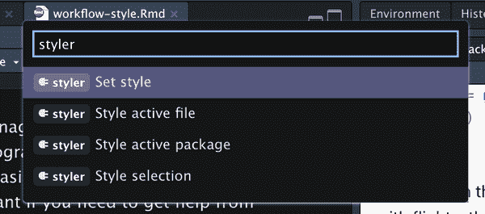
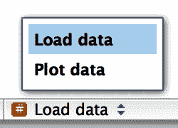

# 第四章：工作流：代码风格

良好的编码风格就像正确的标点符号一样重要：没有也能用，但它确实使事情更易读。即使是刚入门的程序员，也应该注意自己的代码风格。使用一致的风格可以让他人（包括未来的自己！）更容易阅读你的作品，如果需要从他人那里获得帮助，则尤为重要。本章将介绍《整洁宇宙风格指南》中的最重要内容点，该指南贯穿本书始终。

虽然一开始为代码添加样式会感觉有点乏味，但如果你练习一下，它很快就会变得自然。此外，有一些很棒的工具可以快速重置现有的代码格式，比如 Lorenz Walthert 的 [styler](https://oreil.ly/8_Z1c) 包。安装完毕后，你可以通过 RStudio 的 *命令面板* 很容易地使用它。命令面板让你使用任何内置的 RStudio 命令和许多包提供的插件。按下 Cmd/Ctrl+Shift+P 即可打开面板，然后输入 *styler*，以查看 styler 提供的所有快捷方式。图 4-1 展示了结果。



###### 图 4-1\. RStudio 的命令面板使得只用键盘就能轻松访问每一个 RStudio 命令。

在本章中，我们将使用 tidyverse 和 nycflights13 包作为代码示例。

```
library(tidyverse)
library(nycflights13)
```

# 名字

我们简要讨论了 “名字的重要性”。请记住，变量名（通过 `<-` 创建的和通过 [`mutate()`](https://dplyr.tidyverse.org/reference/mutate.xhtml) 创建的）应该只使用小写字母、数字和 `_`。用 `_` 分隔名称中的单词。

```
# Strive for:
short_flights <- flights |> filter(air_time < 60)

# Avoid:
SHORTFLIGHTS <- flights |> filter(air_time < 60)
```

一般而言，最好使用长而描述清晰的名称，而不是简短而便于输入的名称。在编写代码时，使用简短名称节约的时间相对较少（特别是因为自动完成会帮助你完成输入），但当你回到旧代码并被迫解决晦涩的缩写时，会耗费大量时间。

如果你有一堆相关事物的名称，请尽量保持一致。当你忘记之前的约定时，不一致很容易出现，所以如果需要，回过头重新命名并不可耻。一般来说，如果你有一堆变量，它们都是主题的变体，最好给它们一个共同的前缀，而不是一个共同的后缀，因为自动完成在变量的开头效果更好。

# 空格

数学运算符两侧都要加空格，除了 `^`（即 `+`、`-`、`==`、`<` 等等），并且赋值操作符（`<-`）的周围也要加空格。

```
# Strive for
z <- (a + b)² / d

# Avoid
z<-( a + b ) ^ 2/d
```

在常规函数调用的括号内外不要加空格。逗号后始终加一个空格，就像标准英语一样。

```
# Strive for
mean(x, na.rm = TRUE)

# Avoid
mean (x ,na.rm=TRUE)
```

如果加入额外的空格可以改善对齐，这是可以的。例如，如果你在 [`mutate()`](https://dplyr.tidyverse.org/reference/mutate.xhtml) 中创建多个变量，可能需要添加空格，以便所有的 `=` 对齐。¹ 这样做可以让代码更易于快速浏览。

```
flights |> 
  mutate(
    speed      = distance / air_time,
    dep_hour   = dep_time %/% 100,
    dep_minute = dep_time %%  100
  )
```

# 管道

`|>` 前应始终有一个空格，并且通常应该是行末的最后一个元素。这样可以更轻松地添加新步骤，重新排列现有步骤，修改步骤内的元素，并通过快速浏览左侧动词来获得全局视图。

```
# Strive for 
flights |>  
  filter(!is.na(arr_delay), !is.na(tailnum)) |> 
  count(dest)

# Avoid
flights|>filter(!is.na(arr_delay), !is.na(tailnum))|>count(dest)
```

如果你要传递到管道中的函数具有命名参数（如 [`mutate()`](https://dplyr.tidyverse.org/reference/mutate.xhtml) 或 [`summarize()`](https://dplyr.tidyverse.org/reference/summarise.xhtml)），每个参数放在新的一行上。如果函数没有命名参数（如 [`select()`](https://dplyr.tidyverse.org/reference/select.xhtml) 或 [`filter()`](https://dplyr.tidyverse.org/reference/filter.xhtml)），除非不适合，否则保持一行。在这种情况下，应将每个参数放在单独的行上。

```
# Strive for
flights |>  
  group_by(tailnum) |> 
  summarize(
    delay = mean(arr_delay, na.rm = TRUE),
    n = n()
  )

# Avoid
flights |>
  group_by(
    tailnum
  ) |> 
  summarize(delay = mean(arr_delay, na.rm = TRUE), n = n())
```

管道的第一步完成后，每行缩进两个空格。在 `|>` 后的换行符后，RStudio 会自动为你添加空格。如果你将每个参数放在单独的行上，额外缩进两个空格。确保 `)` 单独一行，并且不缩进以匹配函数名的水平位置。

```
# Strive for 
flights |>  
  group_by(tailnum) |> 
  summarize(
    delay = mean(arr_delay, na.rm = TRUE),
    n = n()
  )

# Avoid
flights|>
  group_by(tailnum) |> 
  summarize(
             delay = mean(arr_delay, na.rm = TRUE), 
             n = n()
           )

# Avoid
flights|>
  group_by(tailnum) |> 
  summarize(
  delay = mean(arr_delay, na.rm = TRUE), 
  n = n()
  )
```

如果你的管道可以轻松放在一行上，那么放弃一些规则是可以接受的。但根据我们的集体经验，短代码片段通常会变得更长，因此从一开始就使用所需的所有垂直空间通常能节省时间。

```
# This fits compactly on one line
df |> mutate(y = x + 1)

# While this takes up 4x as many lines, it's easily extended to 
# more variables and more steps in the future
df |> 
  mutate(
    y = x + 1
  )
```

最后，要注意编写非常长的管道，例如超过 10–15 行。尝试将其分解为更小的子任务，并为每个任务赋予一个信息性的名称。名称将帮助读者了解正在发生的事情，并且使得检查中间结果是否符合预期更加容易。每当可以为某个东西提供一个信息性的名称时，都应该这样做，例如在基本上改变数据结构后，例如在旋转或汇总之后。不要指望第一次就做对！这意味着如果有中间状态可以获得良好的名称，则应拆分长管道。

# ggplot2

与管道相同的基本规则也适用于 ggplot2；只需将 `+` 与 `|>` 一样处理：

```
flights |> 
  group_by(month) |> 
  summarize(
    delay = mean(arr_delay, na.rm = TRUE)
  ) |> 
  ggplot(aes(x = month, y = delay)) +
  geom_point() + 
  geom_line()
```

如果不能将所有函数的参数放在一行上，请将每个参数放在单独的行上：

```
flights |> 
  group_by(dest) |> 
  summarize(
    distance = mean(distance),
    speed = mean(distance / air_time, na.rm = TRUE)
  ) |> 
  ggplot(aes(x = distance, y = speed)) +
  geom_smooth(
    method = "loess",
    span = 0.5,
    se = FALSE, 
    color = "white", 
    linewidth = 4
  ) +
  geom_point()
```

注意从 `|>` 到 `+` 的过渡。我们希望这种过渡不是必需的，但不幸的是，ggplot2 是在发现管道之前编写的。

# 分段注释

当你的脚本变得更长时，可以使用*分段*注释将文件分解成可管理的片段：

```
# Load data --------------------------------------

# Plot data --------------------------------------
```

RStudio 提供了一个键盘快捷键来创建这些标题（Cmd/Ctrl+Shift+R），并会在编辑器左下角的代码导航下拉菜单中显示，如图 4-2 所示。



###### 图 4-2\. 在给脚本添加分区注释后，您可以使用脚本编辑器左下角的代码导航工具轻松导航到它们。

# 练习

1.  根据前面的准则重新设计以下流水线：

    ```
    flights|>filter(dest=="IAH")|>group_by(year,month,day)|>summarize(n=n(),
    delay=mean(arr_delay,na.rm=TRUE))|>filter(n>10)

    flights|>filter(carrier=="UA",dest%in%c("IAH","HOU"),sched_dep_time>
    0900,sched_arr_time<2000)|>group_by(flight)|>summarize(delay=mean(
    arr_delay,na.rm=TRUE),cancelled=sum(is.na(arr_delay)),n=n())|>filter(n>10)
    ```

# 摘要

在本章中，您学习了代码风格的最重要原则。这些可能一开始感觉像一套任意的规则（因为它们确实是！），但随着时间的推移，随着您编写更多的代码并与更多人分享代码，您将会意识到一致的风格是多么重要。而且不要忘记 styler 包：它是快速提高低质量代码质量的好方法。

在下一章中，我们将切换回数据科学工具，学习关于整洁数据的知识。整洁数据是一种一致的组织数据框的方式，贯穿于整洁宇宙。这种一致性使您的生活更轻松，因为一旦有了整洁的数据，它就能与大多数整洁宇宙函数完美配合。当然，生活从来不会轻松，你在野外遇到的大多数数据集都不会是整洁的。因此，我们还会教您如何使用 tidyr 包来整理您的混乱数据。

¹ 因为`dep_time`是以`HMM`或`HHMM`格式表示的，我们使用整数除法（`%/%`）来获取小时和余数（也称为模数，`%%`）来获取分钟。
