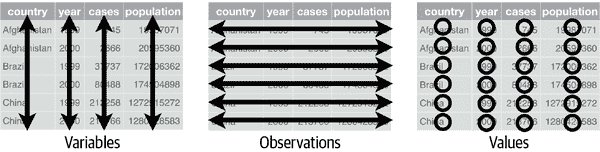
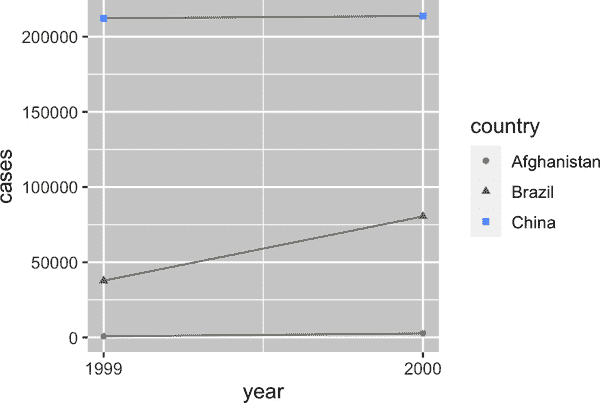
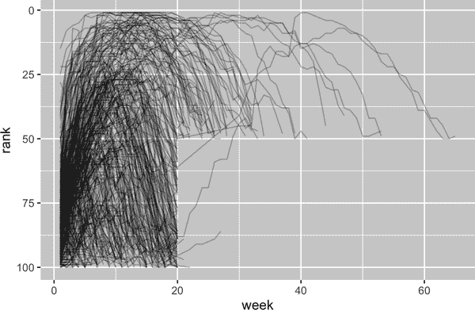
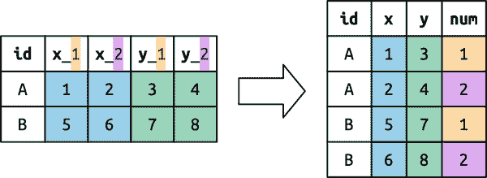

# 第五章：数据整理

# 介绍

> “所有幸福的家庭都是相似的；每个不幸的家庭都有各自的不幸。”
> 
> —列夫·托尔斯泰
> 
> “整洁的数据集都是相似的，但每个混乱的数据集都有其自身的混乱之处。”
> 
> —哈德利·威克姆

在本章中，您将学习使用一种称为*tidy 数据*的系统在 R 中组织数据的一致方式。将数据整理到这种格式需要一些前期工作，但长远来看会得到回报。一旦您有了整洁的数据和 tidyverse 包提供的整洁工具，您将花费更少的时间从一种表示转换数据，从而有更多时间处理您关心的数据问题。

在本章中，您将首先了解整洁数据的定义，并看到它应用于一个简单的玩具数据集。然后我们将深入研究您用于整理数据的主要工具：数据透视。数据透视允许您在不改变任何值的情况下改变数据的形式。

## 先决条件

在本章中，我们将专注于 tidyr，这是一个提供大量工具帮助您整理混乱数据集的包。tidyr 是核心 tidyverse 成员之一。

```
library(tidyverse)
```

从本章开始，我们将抑制来自[`library(tidyverse)`](https://tidyverse.tidyverse.org)的加载消息。

# 整洁数据

你可以用多种方式表示相同的基础数据。以下示例展示了相同数据以三种不同方式组织的情况。每个数据集显示了四个变量的相同值：*国家*、*年份*、*人口*和肺结核（TB）的记录*病例数*，但每个数据集以不同的方式组织这些值。

```
table1
#> # A tibble: 6 × 4
#>   country      year  cases population
#>   <chr>       <dbl>  <dbl>      <dbl>
#> 1 Afghanistan  1999    745   19987071
#> 2 Afghanistan  2000   2666   20595360
#> 3 Brazil       1999  37737  172006362
#> 4 Brazil       2000  80488  174504898
#> 5 China        1999 212258 1272915272
#> 6 China        2000 213766 1280428583

table2
#> # A tibble: 12 × 4
#>   country      year type           count
#>   <chr>       <dbl> <chr>          <dbl>
#> 1 Afghanistan  1999 cases            745
#> 2 Afghanistan  1999 population  19987071
#> 3 Afghanistan  2000 cases           2666
#> 4 Afghanistan  2000 population  20595360
#> 5 Brazil       1999 cases          37737
#> 6 Brazil       1999 population 172006362
#> # … with 6 more rows

table3
#> # A tibble: 6 × 3
#>   country      year rate 
#>   <chr>     <dbl>     <chr> 
#> 1 Afghanistan  1999 745/19987071 
#> 2 Afghanistan  2000 2666/20595360 
#> 3 Brazil       1999 37737/172006362 
#> 4 Brazil       2000 80488/174504898 
#> 5 China        1999 212258/1272915272
#> 6 China        2000 213766/1280428583
```

这些都是相同基础数据的表示，但它们并不同样易于使用。其中一个，`table1`，因为其是*整洁*的，将在 tidyverse 内部处理起来更容易。

有三条相互关联的规则使数据集变得整洁：

1.  每个变量是一列；每一列是一个变量。

1.  每个观测是一行；每一行是一个观测。

1.  每个值是一个单元格；每个单元格是一个单值。

图 5-1 以图像方式展示了规则。



###### 图 5-1\. 三条规则使数据集整洁：变量是列，观测是行，值是单元格。

为什么要确保您的数据是整洁的？有两个主要优点：

1.  选择一种一致的数据存储方式有普遍的优势。如果您有一种一致的数据结构，学习与其配套的工具会更容易，因为它们具有基础的统一性。

1.  -   将变量放在列中有一个特定的优势，因为这样可以展现 R 的向量化特性。就像你在“mutate()”和“summarize()”中学到的那样，大多数内置的 R 函数都可以处理值向量。这使得转换整洁数据感觉特别自然。

-   dplyr、ggplot2 和 tidyverse 中的所有其他包都设计用来处理整洁数据。

-   这里有几个小例子，展示了如何与`table1`一起工作：

```
# Compute rate per 10,000
table1 |>
  mutate(rate = cases / population * 10000)
#> # A tibble: 6 × 5
#>   country      year  cases population  rate
#>   <chr>       <dbl>  <dbl>      <dbl> <dbl>
#> 1 Afghanistan  1999    745   19987071 0.373
#> 2 Afghanistan  2000   2666   20595360 1.29 
#> 3 Brazil       1999  37737  172006362 2.19 
#> 4 Brazil       2000  80488  174504898 4.61 
#> 5 China        1999 212258 1272915272 1.67 
#> 6 China        2000 213766 1280428583 1.67

# Compute total cases per year
table1 |> 
  group_by(year) |> 
  summarize(total_cases = sum(cases))
#> # A tibble: 2 × 2
#>    year total_cases
#>   <dbl>       <dbl>
#> 1  1999      250740
#> 2  2000      296920

# Visualize changes over time
ggplot(table1, aes(x = year, y = cases)) +
  geom_line(aes(group = country), color = "grey50") +
  geom_point(aes(color = country, shape = country)) +
  scale_x_continuous(breaks = c(1999, 2000)) # x-axis breaks at 1999 and 2000
```



## -   练习

1.  -   对于每个样本表格，描述每个观察值和每列代表什么。

1.  -   描绘出你将用来计算`table2`和`table3`的`rate`的过程。你需要执行四个操作：

    1.  -   提取每个国家每年的结核病病例数。

    1.  -   提取每年每个国家的匹配人口。

    1.  -   将病例数除以人口，乘以 10,000。

    1.  -   存回适当的位置。

    -   你还没有学习到执行这些操作所需的所有函数，但你应该能够思考出你需要的转换过程。

# -   数据的长度

-   整洁数据的原则可能显得如此显而易见，以至于你会想知道是否会遇到不整洁的数据集。然而，不幸的是，大多数真实数据都是不整洁的。主要有两个原因：

1.  -   数据通常是为了促进除了分析以外的某个目标而组织的。例如，数据常常被结构化为便于数据输入，而不是分析。

1.  -   大多数人对整洁数据的原则不熟悉，而且除非你花费大量时间处理数据，否则很难自己推导出它们。

-   这意味着大多数真实分析都需要至少进行一点整理。你将首先确定基础变量和观察对象是什么。有时这很容易；其他时候你可能需要咨询最初生成数据的人。接下来，你将把数据*展开*成整洁形式，变量在列中，观察值在行中。

tidyr 提供了两个用于数据转置的函数：[`pivot_longer()`](https://tidyr.tidyverse.org/reference/pivot_longer.xhtml)和[`pivot_wider()`](https://tidyr.tidyverse.org/reference/pivot_wider.xhtml)。我们将首先从[`pivot_longer()`](https://tidyr.tidyverse.org/reference/pivot_longer.xhtml)开始，因为这是最常见的情况。让我们深入一些示例。

## 列名中的数据

`billboard`数据集记录了 2000 年歌曲的 Billboard 排名：

```
billboard
#> # A tibble: 317 × 79
#>   artist       track               date.entered   wk1   wk2   wk3   wk4   wk5
#>   <chr>        <chr>               <date>       <dbl> <dbl> <dbl> <dbl> <dbl>
#> 1 2 Pac        Baby Don't Cry (Ke… 2000-02-26      87    82    72    77    87
#> 2 2Ge+her      The Hardest Part O… 2000-09-02      91    87    92    NA    NA
#> 3 3 Doors Down Kryptonite          2000-04-08      81    70    68    67    66
#> 4 3 Doors Down Loser               2000-10-21      76    76    72    69    67
#> 5 504 Boyz     Wobble Wobble       2000-04-15      57    34    25    17    17
#> 6 98⁰         Give Me Just One N… 2000-08-19      51    39    34    26    26
#> # … with 311 more rows, and 71 more variables: wk6 <dbl>, wk7 <dbl>,
#> #   wk8 <dbl>, wk9 <dbl>, wk10 <dbl>, wk11 <dbl>, wk12 <dbl>, wk13 <dbl>, …
```

在这个数据集中，每个观察结果是一首歌曲。前三列（`artist`、`track`和`date.entered`）是描述歌曲的变量。然后我们有 76 列（`wk1`-`wk76`），描述了歌曲每周的排名。¹在这里，列名是一个变量（`week`），单元格值是另一个变量（`rank`）。

为了整理这些数据，我们将使用[`pivot_longer()`](https://tidyr.tidyverse.org/reference/pivot_longer.xhtml)：

```
billboard |> 
  pivot_longer(
    cols = starts_with("wk"), 
    names_to = "week", 
    values_to = "rank"
  )
#> # A tibble: 24,092 × 5
#>    artist track                   date.entered week   rank
#>    <chr>  <chr>                   <date>       <chr> <dbl>
#>  1 2 Pac  Baby Don't Cry (Keep... 2000-02-26   wk1      87
#>  2 2 Pac  Baby Don't Cry (Keep... 2000-02-26   wk2      82
#>  3 2 Pac  Baby Don't Cry (Keep... 2000-02-26   wk3      72
#>  4 2 Pac  Baby Don't Cry (Keep... 2000-02-26   wk4      77
#>  5 2 Pac  Baby Don't Cry (Keep... 2000-02-26   wk5      87
#>  6 2 Pac  Baby Don't Cry (Keep... 2000-02-26   wk6      94
#>  7 2 Pac  Baby Don't Cry (Keep... 2000-02-26   wk7      99
#>  8 2 Pac  Baby Don't Cry (Keep... 2000-02-26   wk8      NA
#>  9 2 Pac  Baby Don't Cry (Keep... 2000-02-26   wk9      NA
#> 10 2 Pac  Baby Don't Cry (Keep... 2000-02-26   wk10     NA
#> # … with 24,082 more rows
```

数据后，有三个关键参数：

`cols`

指定需要转置的列（即不是变量的列）。此参数使用与[`select()`](https://dplyr.tidyverse.org/reference/select.xhtml)相同的语法，因此在这里我们可以使用`!c(artist, track, date.entered)`或`starts_with("wk")`。

`names_to`

指定存储在列名中的变量；我们将该变量命名为`week`。

`values_to`

指定储存在单元格值中的变量名称；我们将该变量命名为`rank`。

请注意，在代码中`"week"`和`"rank"`被引号引用，因为这些是我们正在创建的新变量；在我们运行[`pivot_longer()`](https://tidyr.tidyverse.org/reference/pivot_longer.xhtml)调用时，它们在数据中尚不存在。

现在让我们转向生成的长数据框。如果一首歌在前 100 名不到 76 周会发生什么？以 2 Pac 的“Baby Don’t Cry”为例。先前的输出表明它只在前 100 名中停留了 7 周，其余的周数都填充了缺失值。这些`NA`实际上并不代表未知的观察结果；它们是由数据集结构强制存在的，²因此我们可以要求[`pivot_longer()`](https://tidyr.tidyverse.org/reference/pivot_longer.xhtml)通过设置`values_drop_na = TRUE`来去除它们：

```
billboard |> 
  pivot_longer(
    cols = starts_with("wk"), 
    names_to = "week", 
    values_to = "rank",
    values_drop_na = TRUE
  )
#> # A tibble: 5,307 × 5
#>   artist track                   date.entered week   rank
#>   <chr>  <chr>                   <date>       <chr> <dbl>
#> 1 2 Pac  Baby Don't Cry (Keep... 2000-02-26   wk1      87
#> 2 2 Pac  Baby Don't Cry (Keep... 2000-02-26   wk2      82
#> 3 2 Pac  Baby Don't Cry (Keep... 2000-02-26   wk3      72
#> 4 2 Pac  Baby Don't Cry (Keep... 2000-02-26   wk4      77
#> 5 2 Pac  Baby Don't Cry (Keep... 2000-02-26   wk5      87
#> 6 2 Pac  Baby Don't Cry (Keep... 2000-02-26   wk6      94
#> # … with 5,301 more rows
```

现在行数大大减少，表明许多带有`NA`的行已被删除。

你可能还想知道，如果一首歌在前 100 名超过 76 周会发生什么。从这些数据中我们无法得知，但你可能会猜测会向数据集添加额外的列，比如`wk77`、`wk78`等。

这些数据现在已经整洁了，但通过使用[`mutate()`](https://dplyr.tidyverse.org/reference/mutate.xhtml)和[`readr::parse_number()`](https://readr.tidyverse.org/reference/parse_number.xhtml)，将`week`的值从字符转换为数字，可以使未来的计算更加容易。[`parse_number()`](https://readr.tidyverse.org/reference/parse_number.xhtml)是一个方便的函数，可以从字符串中提取第一个数字，忽略所有其他文本。

```
billboard_longer <- billboard |> 
  pivot_longer(
    cols = starts_with("wk"), 
    names_to = "week", 
    values_to = "rank",
    values_drop_na = TRUE
  ) |> 
  mutate(
    week = parse_number(week)
  )
billboard_longer
#> # A tibble: 5,307 × 5
#>   artist track                   date.entered  week  rank
#>   <chr>  <chr>                   <date>       <dbl> <dbl>
#> 1 2 Pac  Baby Don't Cry (Keep... 2000-02-26       1    87
#> 2 2 Pac  Baby Don't Cry (Keep... 2000-02-26       2    82
#> 3 2 Pac  Baby Don't Cry (Keep... 2000-02-26       3    72
#> 4 2 Pac  Baby Don't Cry (Keep... 2000-02-26       4    77
#> 5 2 Pac  Baby Don't Cry (Keep... 2000-02-26       5    87
#> 6 2 Pac  Baby Don't Cry (Keep... 2000-02-26       6    94
#> # … with 5,301 more rows
```

现在我们已经将所有周数放在一个变量中，所有排名值放在另一个变量中，我们可以很好地可视化歌曲排名随时间的变化。这里显示了代码，结果在图 5-2 中。我们可以看到很少有歌曲在前 100 名停留超过 20 周。

```
billboard_longer |> 
  ggplot(aes(x = week, y = rank, group = track)) + 
  geom_line(alpha = 0.25) + 
  scale_y_reverse()
```



###### 图 5-2\. 显示了一条线图，展示了歌曲排名随时间变化的情况。

## 数据透视是如何工作的？

现在您已经看到了我们如何使用数据透视重塑数据，让我们花点时间直观地理解数据透视的作用。我们从一个简单的数据集开始，以便更容易看到发生了什么。假设我们有三个患者，其`id`分别为 A、B 和 C，每位患者测量了两次血压。我们将使用[`tribble()`](https://tibble.tidyverse.org/reference/tribble.xhtml)，这是一个方便的函数，可以手动构建小型的 tibble：

```
df <- tribble(
  ~id,  ~bp1, ~bp2,
   "A",  100,  120,
   "B",  140,  115,
   "C",  120,  125
)
```

我们希望我们的新数据集有三个变量：`id`（已存在），`measurement`（列名），和`value`（单元格值）。为了实现这一点，我们需要对`df`进行更长时间的数据透视：

```
df |> 
  pivot_longer(
    cols = bp1:bp2,
    names_to = "measurement",
    values_to = "value"
  )
#> # A tibble: 6 × 3
#>   id    measurement value
#>   <chr> <chr>       <dbl>
#> 1 A     bp1           100
#> 2 A     bp2           120
#> 3 B     bp1           140
#> 4 B     bp2           115
#> 5 C     bp1           120
#> 6 C     bp2           125
```

重塑工作原理是怎样的？如果我们逐列思考会更容易理解。如图 5-3 所示，原始数据集中已经是变量的列（`id`）的值需要重复，以适应每一列的数据透视。


###### 图 5-3\. 需要重复的已经是变量的列，以适应每一列的数据透视。

列名成为了一个新变量的值，其名称由`names_to`定义，如图 5-4 所示。它们需要针对原始数据集中的每一行重复一次。


###### 图 5-4\. 被轴线列的列名成为新列中的值。这些值需要在原始数据集的每一行中重复一次。

单元格的值也变成了一个新变量的值，这个变量的名称由`values_to`定义。它们按行展开。图 5-5 说明了这个过程。


###### 图 5-5\. 值的数量被保留（不重复），但按行展开。

## 列名中的多个变量

当列名中有多个信息塞入，并且希望将它们存储在单独的新变量中时，情况就变得更具挑战性。例如，看看`who2`数据集，`table1`的来源，以及之前看到的朋友们：

```
who2
#> # A tibble: 7,240 × 58
#>   country      year sp_m_014 sp_m_1524 sp_m_2534 sp_m_3544 sp_m_4554
#>   <chr>       <dbl>    <dbl>     <dbl>     <dbl>     <dbl>     <dbl>
#> 1 Afghanistan  1980       NA        NA        NA        NA        NA
#> 2 Afghanistan  1981       NA        NA        NA        NA        NA
#> 3 Afghanistan  1982       NA        NA        NA        NA        NA
#> 4 Afghanistan  1983       NA        NA        NA        NA        NA
#> 5 Afghanistan  1984       NA        NA        NA        NA        NA
#> 6 Afghanistan  1985       NA        NA        NA        NA        NA
#> # … with 7,234 more rows, and 51 more variables: sp_m_5564 <dbl>,
#> #   sp_m_65 <dbl>, sp_f_014 <dbl>, sp_f_1524 <dbl>, sp_f_2534 <dbl>, …
```

这个由世界卫生组织收集的数据集记录了关于结核病诊断的信息。有两列已经是变量并且容易解释：`country`和`year`。接下来是 56 列，如`sp_m_014`，`ep_m_4554`和`rel_m_3544`。如果你仔细看这些列足够长时间，你会注意到有一个模式。每个列名由三个由`_`分隔的部分组成。第一部分，`sp`/`rel`/`ep`，描述了诊断方法；第二部分，`m`/`f`，是性别（在这个数据集中编码为二进制变量）；第三部分，`014`/`1524`/`2534`/`3544`/`4554`/`65`，是年龄范围（例如`014`代表 0-14 岁）。

因此，在这种情况下，我们在`who2`中记录了六个信息片段：国家和年份（已经是列）；诊断方法、性别类别和年龄范围类别（包含在其他列名中）；以及该类别中的患者计数（单元格值）。为了将这六个信息片段组织成六个单独的列，我们使用[`pivot_longer()`](https://tidyr.tidyverse.org/reference/pivot_longer.xhtml)，其中包含`names_to`的列名向量和用于将原始变量名拆分为`names_sep`片段的指示符的列名：

```
who2 |> 
  pivot_longer(
    cols = !(country:year),
    names_to = c("diagnosis", "gender", "age"), 
    names_sep = "_",
    values_to = "count"
  )
#> # A tibble: 405,440 × 6
#>   country      year diagnosis gender age   count
#>   <chr>       <dbl> <chr>     <chr>  <chr> <dbl>
#> 1 Afghanistan  1980 sp        m      014      NA
#> 2 Afghanistan  1980 sp        m      1524     NA
#> 3 Afghanistan  1980 sp        m      2534     NA
#> 4 Afghanistan  1980 sp        m      3544     NA
#> 5 Afghanistan  1980 sp        m      4554     NA
#> 6 Afghanistan  1980 sp        m      5564     NA
#> # … with 405,434 more rows
```

除了`names_sep`，还有`names_pattern`的替代方法，你可以在学习第十五章中的正则表达式后，从更复杂的命名场景中提取变量。

从概念上讲，这只是你已经看过的更简单情况的一个小变化。图 5-6 展示了基本思想：现在，列名不再被轴线到单个列中，而是被轴线到多个列中。你可以想象这发生在两个步骤中（首先是轴向，然后是分离），但在底层，它是在一个步骤中发生的，因为这样更快。


###### 图 5-6\. 在列名中存在多个信息部分进行轴向变换意味着现在每个列名填充多个输出列的值。

## 列头中的数据和变量名

复杂度上升的下一步是当列名包含变量值和变量名的混合。例如，看看`household`数据集：

```
household
#> # A tibble: 5 × 5
#>   family dob_child1 dob_child2 name_child1 name_child2
#>    <int> <date>     <date>     <chr>       <chr> 
#> 1      1 1998-11-26 2000-01-29 Susan       Jose 
#> 2      2 1996-06-22 NA         Mark        <NA> 
#> 3      3 2002-07-11 2004-04-05 Sam         Seth 
#> 4      4 2004-10-10 2009-08-27 Craig       Khai 
#> 5      5 2000-12-05 2005-02-28 Parker      Gracie
```

这个数据集包含了五个家庭的数据，包括最多两个孩子的姓名和出生日期。这个数据集的新挑战在于列名包含两个变量的名称（`dob`，`name`），以及另一个变量（`child`，取值为 1 或 2）的值。为了解决这个问题，我们再次需要向`names_to`提供一个向量，但这次我们使用特殊的`".value"`标记；这不是一个变量名，而是告诉[`pivot_longer()`](https://tidyr.tidyverse.org/reference/pivot_longer.xhtml)要做一些不同的事情。这会覆盖通常的`values_to`参数，以使用旋转后的列名的第一个组件作为输出中的变量名。

```
household |> 
  pivot_longer(
    cols = !family, 
    names_to = c(".value", "child"), 
    names_sep = "_", 
    values_drop_na = TRUE
  )
#> # A tibble: 9 × 4
#>   family child  dob        name 
#>    <int> <chr>  <date>     <chr>
#> 1      1 child1 1998-11-26 Susan
#> 2      1 child2 2000-01-29 Jose 
#> 3      2 child1 1996-06-22 Mark 
#> 4      3 child1 2002-07-11 Sam 
#> 5      3 child2 2004-04-05 Seth 
#> 6      4 child1 2004-10-10 Craig
#> # … with 3 more rows
```

我们再次使用`values_drop_na = TRUE`，因为输入的形状导致必须创建显式的缺失变量（例如，只有一个孩子的家庭）。

Figure 5-7 用一个更简单的例子说明了基本思想。当您在`names_to`中使用`".value"`时，输入中的列名同时影响输出中的值和变量名。



###### 图 5-7\. 使用`names_to = c(".value", "num")`进行轴向变换将列名分为两个部分：第一部分确定输出列名（`x`或`y`），第二部分确定`num`列的值。

# 数据扩展

到目前为止，我们已经使用[`pivot_longer()`](https://tidyr.tidyverse.org/reference/pivot_longer.xhtml)解决了常见的问题类别，即值最终出现在列名中。接下来我们将（哈哈）转向[`pivot_wider()`](https://tidyr.tidyverse.org/reference/pivot_wider.xhtml)，这将通过增加列和减少行使数据集变得更*宽*，在处理一个观察跨越多行时非常有用。在野外似乎较少见，但在处理政府数据时确实经常遇到。

我们将从 Centers for Medicare and Medicaid Services 的`cms_patient_experience`数据集开始，该数据集收集有关患者体验的数据：

```
cms_patient_experience
#> # A tibble: 500 × 5
#>   org_pac_id org_nm                     measure_cd   measure_title   prf_rate
#>   <chr>      <chr>                      <chr>        <chr>              <dbl>
#> 1 0446157747 USC CARE MEDICAL GROUP INC CAHPS_GRP_1  CAHPS for MIPS…       63
#> 2 0446157747 USC CARE MEDICAL GROUP INC CAHPS_GRP_2  CAHPS for MIPS…       87
#> 3 0446157747 USC CARE MEDICAL GROUP INC CAHPS_GRP_3  CAHPS for MIPS…       86
#> 4 0446157747 USC CARE MEDICAL GROUP INC CAHPS_GRP_5  CAHPS for MIPS…       57
#> 5 0446157747 USC CARE MEDICAL GROUP INC CAHPS_GRP_8  CAHPS for MIPS…       85
#> 6 0446157747 USC CARE MEDICAL GROUP INC CAHPS_GRP_12 CAHPS for MIPS…       24
#> # … with 494 more rows
```

被研究的核心单元是一个组织，但每个组织分布在六行中，每一行对应调查组织中采取的一项测量。通过使用[`distinct()`](https://dplyr.tidyverse.org/reference/distinct.xhtml)，我们可以看到`measure_cd`和`measure_title`的完整数值集合。

```
cms_patient_experience |> 
  distinct(measure_cd, measure_title)
#> # A tibble: 6 × 2
#>   measure_cd   measure_title 
#>   <chr>        <chr> 
#> 1 CAHPS_GRP_1  CAHPS for MIPS SSM: Getting Timely Care, Appointments, and In…
#> 2 CAHPS_GRP_2  CAHPS for MIPS SSM: How Well Providers Communicate 
#> 3 CAHPS_GRP_3  CAHPS for MIPS SSM: Patient's Rating of Provider 
#> 4 CAHPS_GRP_5  CAHPS for MIPS SSM: Health Promotion and Education 
#> 5 CAHPS_GRP_8  CAHPS for MIPS SSM: Courteous and Helpful Office Staff 
#> 6 CAHPS_GRP_12 CAHPS for MIPS SSM: Stewardship of Patient Resources
```

这两列都不会成为特别好的变量名称：`measure_cd`不提示变量的含义，而`measure_title`是一个包含空格的长句子。我们暂时将使用`measure_cd`作为新列名的来源，但在实际分析中，您可能希望创建既简短又有意义的自定义变量名称。

[`pivot_wider()`](https://tidyr.tidyverse.org/reference/pivot_wider.xhtml)与[`pivot_longer()`](https://tidyr.tidyverse.org/reference/pivot_longer.xhtml)接口相反：我们需要提供定义数值（`values_from`）和列名（`names_from`）的现有列，而不是选择新的列名。

```
cms_patient_experience |> 
  pivot_wider(
    names_from = measure_cd,
    values_from = prf_rate
  )
#> # A tibble: 500 × 9
#>   org_pac_id org_nm                   measure_title   CAHPS_GRP_1 CAHPS_GRP_2
#>   <chr>      <chr>                    <chr>                 <dbl>       <dbl>
#> 1 0446157747 USC CARE MEDICAL GROUP … CAHPS for MIPS…          63          NA
#> 2 0446157747 USC CARE MEDICAL GROUP … CAHPS for MIPS…          NA          87
#> 3 0446157747 USC CARE MEDICAL GROUP … CAHPS for MIPS…          NA          NA
#> 4 0446157747 USC CARE MEDICAL GROUP … CAHPS for MIPS…          NA          NA
#> 5 0446157747 USC CARE MEDICAL GROUP … CAHPS for MIPS…          NA          NA
#> 6 0446157747 USC CARE MEDICAL GROUP … CAHPS for MIPS…          NA          NA
#> # … with 494 more rows, and 4 more variables: CAHPS_GRP_3 <dbl>,
#> #   CAHPS_GRP_5 <dbl>, CAHPS_GRP_8 <dbl>, CAHPS_GRP_12 <dbl>
```

输出看起来不太对；我们似乎仍然对每个组织有多行。这是因为我们还需要告诉[`pivot_wider()`](https://tidyr.tidyverse.org/reference/pivot_wider.xhtml)，哪些列包含唯一标识每行的值；在这种情况下，这些变量以`"org"`开头：

```
cms_patient_experience |> 
  pivot_wider(
    id_cols = starts_with("org"),
    names_from = measure_cd,
    values_from = prf_rate
  )
#> # A tibble: 95 × 8
#>   org_pac_id org_nm           CAHPS_GRP_1 CAHPS_GRP_2 CAHPS_GRP_3 CAHPS_GRP_5
#>   <chr>      <chr>                  <dbl>       <dbl>       <dbl>       <dbl>
#> 1 0446157747 USC CARE MEDICA…          63          87          86          57
#> 2 0446162697 ASSOCIATION OF …          59          85          83          63
#> 3 0547164295 BEAVER MEDICAL …          49          NA          75          44
#> 4 0749333730 CAPE PHYSICIANS…          67          84          85          65
#> 5 0840104360 ALLIANCE PHYSIC…          66          87          87          64
#> 6 0840109864 REX HOSPITAL INC          73          87          84          67
#> # … with 89 more rows, and 2 more variables: CAHPS_GRP_8 <dbl>,
#> #   CAHPS_GRP_12 <dbl>
```

这给了我们想要的输出。

## `pivot_wider()`如何工作？

要理解[`pivot_wider()`](https://tidyr.tidyverse.org/reference/pivot_wider.xhtml)的工作原理，让我们再次从一个简单的数据集开始。这次我们有两位患者，分别是`id`为 A 和 B；患者 A 有三次血压测量，患者 B 有两次：

```
df <- tribble(
  ~id, ~measurement, ~value,
  "A",        "bp1",    100,
  "B",        "bp1",    140,
  "B",        "bp2",    115, 
  "A",        "bp2",    120,
  "A",        "bp3",    105
)
```

我们将从`value`列获取值，从`measurement`列获取名称：

```
df |> 
  pivot_wider(
    names_from = measurement,
    values_from = value
  )
#> # A tibble: 2 × 4
#>   id      bp1   bp2   bp3
#>   <chr> <dbl> <dbl> <dbl>
#> 1 A       100   120   105
#> 2 B       140   115    NA
```

要开始这个过程，[`pivot_wider()`](https://tidyr.tidyverse.org/reference/pivot_wider.xhtml)首先需要弄清楚哪些内容将放在行和列中。新的列名将是`measurement`的唯一值：

```
df |> 
  distinct(measurement) |> 
  pull()
#> [1] "bp1" "bp2" "bp3"
```

默认情况下，输出中的行由不进入新名称或值的所有变量确定。这些称为`id_cols`。这里只有一列，但通常可以有任意数量：

```
df |> 
  select(-measurement, -value) |> 
  distinct()
#> # A tibble: 2 × 1
#>   id 
#>   <chr>
#> 1 A 
#> 2 B
```

[`pivot_wider()`](https://tidyr.tidyverse.org/reference/pivot_wider.xhtml)然后结合这些结果生成一个空数据框架：

```
df |> 
  select(-measurement, -value) |> 
  distinct() |> 
  mutate(x = NA, y = NA, z = NA)
#> # A tibble: 2 × 4
#>   id    x     y     z 
#>   <chr> <lgl> <lgl> <lgl>
#> 1 A     NA    NA    NA 
#> 2 B     NA    NA    NA
```

然后使用输入中的数据填充所有缺失的值。在这种情况下，输出中的每个单元格并没有对应的输入值，因为患者 B 没有第三次血压测量，所以该单元格保持缺失状态。我们将回到[`pivot_wider()`](https://tidyr.tidyverse.org/reference/pivot_wider.xhtml)可以在第十八章中“生成”缺失值的想法。

您可能还想知道，如果输入中有多行对应输出中的一个单元格会发生什么。以下示例有两行对应于`id A`和`measurement bp1`：

```
df <- tribble(
  ~id, ~measurement, ~value,
  "A",        "bp1",    100,
  "A",        "bp1",    102,
  "A",        "bp2",    120,
  "B",        "bp1",    140, 
  "B",        "bp2",    115
)
```

如果我们尝试转换此数据，我们将得到一个包含列表列的输出，有关此内容，您将在第二十三章中进一步了解：

```
df |>
  pivot_wider(
    names_from = measurement,
    values_from = value
  )
#> Warning: Values from `value` are not uniquely identified; output will contain
#> list-cols.
#> • Use `values_fn = list` to suppress this warning.
#> • Use `values_fn = {summary_fun}` to summarise duplicates.
#> • Use the following dplyr code to identify duplicates.
#>   {data} %>%
#>   dplyr::group_by(id, measurement) %>%
#>   dplyr::summarise(n = dplyr::n(), .groups = "drop") %>%
#>   dplyr::filter(n > 1L)
#> # A tibble: 2 × 3
#>   id    bp1       bp2 
#>   <chr> <list>    <list> 
#> 1 A     <dbl [2]> <dbl [1]>
#> 2 B     <dbl [1]> <dbl [1]>
```

由于您还不知道如何处理此类数据，您需要遵循警告中的提示来找出问题所在：

```
df |> 
  group_by(id, measurement) |> 
  summarize(n = n(), .groups = "drop") |> 
  filter(n > 1)
#> # A tibble: 1 × 3
#>   id    measurement     n
#>   <chr> <chr>       <int>
#> 1 A     bp1             2
```

现在，由您来找出数据出了什么问题，并修复底层损害或使用分组和汇总技能确保每个行和列值的组合只有一个行。

# 概要

在本章中，您学习了关于整洁数据的概念：数据中变量在列中，观察结果在行中。整洁数据使得在 tidyverse 中工作更容易，因为它是一个大多数函数都理解的一致结构；主要挑战在于将数据从接收到的任何结构转换为整洁格式。为此，您了解了[`pivot_longer()`](https://tidyr.tidyverse.org/reference/pivot_longer.xhtml)和[`pivot_wider()`](https://tidyr.tidyverse.org/reference/pivot_wider.xhtml)，这两个函数可以帮助您整理许多不整洁的数据集。我们在这里展示的示例是从[`vignette("pivot", package = "tidyr")`](https://tidyr.tidyverse.org/articles/pivot.xhtml)中选出的一部分，所以如果本章无法解决您遇到的问题，可以尝试阅读那个 vignette。

另一个挑战是，对于给定的数据集，将较长或较宽版本标记为“整洁”的一个版本可能是不可能的。这在一定程度上反映了我们对整洁数据的定义，其中我们说整洁数据每列有一个变量，但我们实际上没有定义变量是什么（这其实很难定义）。如果您在解决某些计算问题时遇到困难，可以考虑调整数据的组织方式；不要害怕需要时对数据进行整理、转换和重新整理！

如果您喜欢本章内容并希望进一步了解底层理论，您可以在[《整洁数据》论文](https://oreil.ly/86uxw)中了解更多历史和理论基础，该论文发表在《统计软件杂志》上。

现在您正在编写大量的 R 代码，是时候学习更多关于如何将代码组织到文件和目录中的信息了。在下一章中，您将学习有关脚本和项目的优势以及提供的许多工具，这些工具将使您的生活更轻松。

¹ 只要歌曲曾在 2000 年某个时刻进入过前 100 名，并且在出现后的 72 周内被跟踪，它就会被包括在内。

² 我们将在第十八章中回到这个概念。
