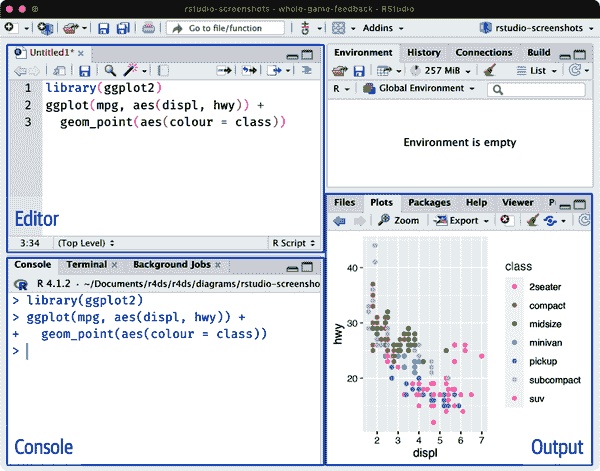
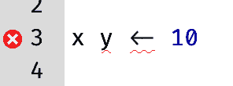
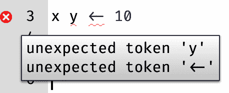
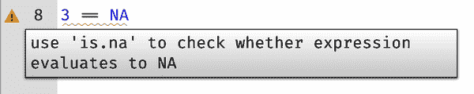
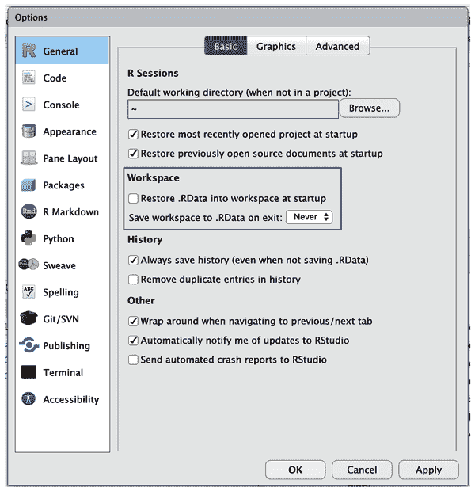
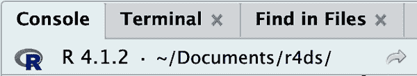
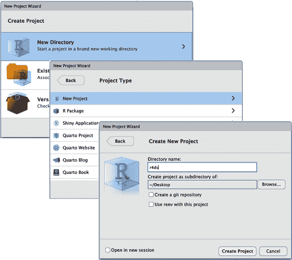

# 第六章：工作流程：脚本和项目

本章将向您介绍两种组织代码的基本工具：脚本和项目。

# 脚本

到目前为止，您已经使用控制台运行了代码。这是一个很好的开始，但随着创建更复杂的 ggplot2 图形和更长的 dplyr 管道，您会发现空间很快变得狭窄。为了获得更多的工作空间，请使用脚本编辑器。通过单击文件菜单，选择新建文件，然后选择 R 脚本，或使用键盘快捷键 Cmd/Ctrl+Shift+N 来打开它。现在您将看到四个窗格，如图 6-1 所示。脚本编辑器是实验代码的好地方。当您想要更改内容时，您不必重新键入整个内容；您只需编辑脚本并重新运行即可。一旦编写出符合要求并且正常运行的代码，您可以将其保存为脚本文件，以便以后轻松返回。



###### 图 6-1。打开脚本编辑器将在 IDE 的左上角添加一个新窗格。

## 运行代码

脚本编辑器非常适合构建复杂的 ggplot2 图或长序列的 dplyr 操作。有效使用脚本编辑器的关键是记住最重要的键盘快捷键之一：Cmd/Ctrl+Enter。这会在控制台中执行当前的 R 表达式。例如，看以下代码：

```
library(dplyr)
library(nycflights13)

not_cancelled <- flights |> 
  filter(!is.na(dep_delay)█, !is.na(arr_delay))

not_cancelled |> 
  group_by(year, month, day) |> 
  summarize(mean = mean(dep_delay))
```

如果光标在█处，按下 Cmd/Ctrl+Enter 将运行生成`not_cancelled`的完整命令。它还将移动光标到以下语句（以`not_cancelled |>`开头）。这样，通过反复按下 Cmd/Ctrl+Enter，您可以轻松地逐步执行完整的脚本。

不要逐个表达式地运行代码，您可以通过一步操作（Cmd/Ctrl+Shift+S）执行完整的脚本。定期执行此操作是确保您已捕获脚本中所有重要部分的好方法。

我们建议您始终从您需要的包开始编写脚本。这样，如果您与他人分享代码，他们可以轻松看到需要安装哪些包。但请注意，您不应在您分享的脚本中包含[`install.packages()`](https://rdrr.io/r/utils/install.packages.xhtml)。如果他们不小心操作，将在他们的计算机上安装东西是不礼貌的！

在未来的章节中工作时，我们强烈建议您从脚本编辑器开始，并练习键盘快捷键。随着时间的推移，以这种方式将代码发送到控制台将变得如此自然，以至于您甚至不会考虑它。

## RStudio 诊断

在脚本编辑器中，RStudio 会使用红色波浪线和侧边栏中的交叉标记突出显示语法错误：



将鼠标悬停在十字架上以查看问题所在：



RStudio 还会提醒您可能存在的问题：



## 保存和命名

RStudio 在退出时会自动保存脚本编辑器的内容，并在重新打开时自动重新加载。尽管如此，最好避免使用 Untitled1、Untitled2、Untitled3 等无意义的名称，而是使用信息丰富的名称保存脚本。

或许给文件命名为 `code.R` 或 `myscript.R` 看起来很诱人，但在选择文件名之前，你应该认真考虑一下。文件命名的三个重要原则如下：

1.  文件名应该是*机器*可读的：避免使用空格、符号和特殊字符。不要依赖大小写敏感性来区分文件。

1.  文件名应该是*人类*可读的：使用文件名描述文件中的内容。

1.  文件名应该与默认排序相容：以数字开头，以便按字母顺序排列它们的顺序。

例如，假设在项目文件夹中有以下文件：

```
alternative model.R
code for exploratory analysis.r
finalreport.qmd
FinalReport.qmd
fig 1.png
Figure_02.png
model_first_try.R
run-first.r
temp.txt
```

这里存在各种问题：难以找到应首先运行哪个文件，文件名包含空格，有两个文件同名但大小写不同（`finalreport` 与 `FinalReport`¹)，有些名称并未描述其内容（`run-first` 和 `temp`）。

这是同一组文件更好的命名和组织方式：

```
01-load-data.R
02-exploratory-analysis.R
03-model-approach-1.R
04-model-approach-2.R
fig-01.png
fig-02.png
report-2022-03-20.qmd
report-2022-04-02.qmd
report-draft-notes.txt
```

编号关键脚本使其运行顺序明显，而一致的命名方案则使得变量更易于识别。此外，图表采用类似的标签，报告则通过文件名中包含的日期进行区分，`temp` 被重命名为 `report-draft-notes` 以更好地描述其内容。如果目录中有大量文件，建议进一步组织，将不同类型的文件（脚本、图表等）放置在不同的目录中。

# 项目

终有一天，你将需要退出 R，去做其他事情，稍后回来继续分析。终有一天，你将同时处理多个分析，并希望将它们保持分隔。终有一天，你将需要将外界的数据带入 R 中，并将 R 的数值结果和图表发送回外界。

为了处理这些现实生活中的情况，你需要做出两个决定：

+   事实的来源是什么？你将保存什么作为记录下来发生了什么的持久记录？

+   你的分析在哪里？

## 真相之源是什么？

对于初学者，依赖当前环境包含你在分析中创建的所有对象是可以的。然而，为了更轻松地处理大型项目或与他人合作，你的真相之源应该是 R 脚本。有了你的 R 脚本（和数据文件），你可以重新创建环境。但如果只有环境而没有代码，重新创建你的 R 脚本就更加困难：你要么必须从记忆中重新输入大量代码（不可避免地会出错），要么必须仔细查看你的 R 历史记录。

为了帮助保持你的 R 脚本成为分析的真相之源，我们强烈建议你指示 RStudio 在会话之间不保留你的工作空间。你可以通过运行[`usethis::use_blank_slate()`](https://usethis.r-lib.org/reference/use_blank_slate.xhtml)²或者模仿 图 6-2 中显示的选项来实现这一点。这会带来一些短期的不便，因为现在当你重新启动 RStudio 时，它将不再记住你上次运行的代码，也不会保留你创建的对象或读取的数据集。但这种短期的不便可以避免长期的痛苦，因为它迫使你在代码中捕捉所有重要的过程。发现重要计算的结果只存储在你的环境中，而没有在你的代码中存储计算本身，三个月后再去发现这种情况是非常糟糕的。



###### 图 6-2\. 复制这些选项到你的 RStudio 选项中，以始终在启动时使用干净的环境。

有一组很棒的键盘快捷键可以一起使用，确保你在编辑器中捕捉到代码的重要部分：

1.  按下 Cmd/Ctrl+Shift+0/F10 来重新启动 R。

1.  按下 Cmd/Ctrl+Shift+S 来重新运行当前的脚本。

每周我们总共使用这种模式数百次。

或者，如果你不使用键盘快捷键，你可以选择会话 > 重新启动 R，然后重新运行你当前的脚本。

# RStudio Server

如果你正在使用 RStudio Server，默认情况下不会重新启动你的 R 会话。当你关闭 RStudio Server 标签页时，可能会感觉你关闭了 R，但实际上服务器会在后台继续运行。下次返回时，你将会回到你离开时的同样位置。这使得定期重启 R 变得更加重要，以确保你从一个干净的状态开始。

## 你的分析数据存放在哪里？

R 拥有一个强大的*工作目录*概念。这是 R 查找你要加载的文件和保存文件的地方。RStudio 在控制台顶部显示你当前的工作目录：



您可以通过运行[`getwd()`](https://rdrr.io/r/base/getwd.xhtml)在 R 代码中打印此内容：

```
getwd()
#> [1] "/Users/hadley/Documents/r4ds"
```

在此 R 会话中，当前工作目录（可以将其视为“主目录”）位于 Hadley 的*文档*文件夹中的一个名为*r4ds*的子文件夹中。当您运行此代码时，由于您的计算机具有不同的目录结构，此代码将返回不同的结果！

作为初学者的 R 用户，允许将工作目录设置为主目录、文档目录或计算机上任何其他奇怪的目录都是可以的。但是在本书的第七章中，您已经不再是初学者了。很快，您应该开始将项目组织到目录中，并在处理项目时将 R 的工作目录设置为相关目录。

您可以从 R 内设置工作目录，但*我们不建议这样做*：

```
setwd("/path/to/my/CoolProject")
```

有一种更好的方式——一种也能让您像专家一样管理您的 R 工作的方式。这种方式就是*RStudio 项目*。

## RStudio 项目

将与给定项目相关的所有文件（输入数据、R 脚本、分析结果和图表）放在一个目录中是一种明智且常见的做法，RStudio 通过*项目*内置支持此功能。在您阅读本书的其余部分时，让我们为您创建一个项目。选择“文件” > “新建项目”，然后按照图 6-3 中显示的步骤进行操作。



###### 图 6-3\. 创建新项目：（顶部）首先点击“新建目录”，然后（中部）点击“新建项目”，最后（底部）填写目录（项目）名称，选择一个适合其主目录的子目录，并点击“创建项目”。

将您的项目命名为`r4ds`，并仔细考虑将项目放在哪个子目录中。如果不将其存储在合理的位置，将来找到它将会很困难！

当此过程完成后，您将获得一个专门为本书而设的新的 RStudio 项目。确保您项目的“主目录”是当前工作目录：

```
getwd()
#> [1] /Users/hadley/Documents/r4ds
```

现在在脚本编辑器中输入以下命令并保存文件，命名为`diamonds.R`。然后，创建一个名为`data`的新文件夹。您可以在 RStudio 的文件面板中点击“新建文件夹”按钮来完成此操作。最后，运行完整的脚本，它将保存一个 PNG 和 CSV 文件到您的项目目录中。不必担心细节；您会在本书后面学到它们。

```
library(tidyverse)

ggplot(diamonds, aes(x = carat, y = price)) + 
  geom_hex()
ggsave("diamonds.png")

write_csv(diamonds, "data/diamonds.csv")
```

退出 RStudio。检查与你的项目相关联的文件夹——注意`.Rproj`文件。双击该文件重新打开项目。注意你回到了离开时的地方：同样的工作目录和命令历史记录，所有你正在工作的文件仍然是打开的。因为你遵循了我们的指示，你将有一个完全新鲜的环境，确保你是从一个干净的状态开始。

在你喜欢的操作系统特定方式中，搜索你的计算机中的`diamonds.png`，你会找到这个 PNG 文件（毫不奇怪），但*也会找到创建它的脚本*（`diamonds.R`）。这是一个巨大的胜利！总有一天，你会想要重新制作一个图表或者仅仅是理解它的来源。如果你严格地将图表保存为文件*带有 R 代码*，而不是使用鼠标或剪贴板，那么你将能够轻松地重现旧作品！

## 相对路径和绝对路径

一旦你进入一个项目，你应该只使用相对路径，而不是绝对路径。两者有什么区别呢？相对路径是相对于工作目录的，也就是项目的根目录。当 Hadley 之前写了`data/diamonds.csv`时，它是`/Users/hadley/Documents/r4ds/data/diamonds.csv`的一个快捷方式。但是重要的是，如果 Mine 在她的计算机上运行这段代码，它将指向`/Users/Mine/Documents/r4ds/data/diamonds.csv`。这就是为什么相对路径很重要的原因：它们将在 R 项目文件夹最终结束的任何地方都能够工作。

绝对路径指向相同的位置，不管你的工作目录在哪里。它们在不同的操作系统下看起来有些不同。在 Windows 上，它们以驱动器号开头（例如`C:`）或两个反斜杠（例如`\\servername`），而在 Mac/Linux 上，它们以斜杠`/`开头（例如`/users/hadley`）。你在脚本中*永远不应该*使用绝对路径，因为它们会阻碍分享：没有人会有完全相同的目录配置像你一样。

操作系统之间还有另一个重要的区别：路径组件的分隔符不同。Mac 和 Linux 使用斜杠（例如`data/diamonds.csv`），而 Windows 使用反斜杠（例如`data\diamonds.csv`）。R 可以处理任何类型的路径（无论你当前使用哪个平台），但不幸的是，反斜杠对于 R 来说有特殊意义，为了在路径中得到单个反斜杠，你需要输入两个反斜杠！这让生活变得很烦人，所以我们建议始终使用 Linux/Mac 风格的斜杠。

# 练习

1.  前往[RStudio Tips Twitter 账号](https://twitter.com/rstudiotips)，找到一个看起来有趣的提示。练习使用它！

1.  RStudio 诊断还会报告哪些其他常见的错误？阅读[这篇关于代码诊断的文章](https://oreil.ly/coili)去找出答案。

# 摘要

在本章中，你学会了如何将你的 R 代码组织成脚本（文件）和项目（目录）。就像代码风格一样，这起初可能感觉是繁琐的工作。但随着在多个项目中积累更多的代码，你会逐渐意识到，稍微前期的组织可以在以后节省大量时间。

总之，脚本和项目为你提供了一个稳固的工作流程，将在未来为你服务。

+   每个数据分析项目都应创建一个 RStudio 项目。

+   将你的脚本（用信息性的名称命名）保存在项目中，编辑它们，并逐部或整体运行它们。经常重新启动 R 以确保你已经捕获了脚本中的所有内容。

+   只使用相对路径，而不是绝对路径。

这样，你需要的一切都集中在一个地方，并与你正在进行的所有其他项目清晰分开。

到目前为止，我们已经使用了 R 包中捆绑的数据集。这使得在预准备的数据上练习变得更加容易，但显然你的数据不会以这种方式可用。因此，在下一章中，你将学习如何使用 readr 包将数据从磁盘加载到你的 R 会话中。

¹ 更不用说在名称中使用“final”会招来厄运。漫画《Piled Higher and Deeper》有一篇[有趣的条漫](https://oreil.ly/L9ip0)讲述了这一点。

² 如果你还没有安装这个包，你可以使用`install.packages("usethis")`来安装它。
