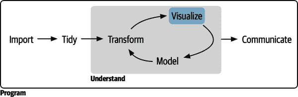

# 第二部分：可视化

在阅读本书的第一部分之后，您（至少表面上）理解了进行数据科学最重要的工具。现在是时候开始深入细节了。在本书的这一部分中，您将进一步深入了解数据可视化，包括图 II-1。

###### 图 II-1\. 数据可视化通常是数据探索的第一步。

每一章都涉及创建数据可视化的一个或几个方面：

+   在第九章中，您将学习关于图形的分层语法。

+   在第十章中，您将结合可视化与您的好奇心和怀疑精神，提出并回答有趣的关于数据的问题。

+   最后，在第十一章中，您将学习如何将您的探索性图形提升，并将它们转化为阐释性图形，这些图形可以帮助分析中的新手尽快轻松地理解正在发生的事情。

这三章让您开始进入可视化的世界，但还有更多要学习。学习更多的绝佳地方是《ggplot2: 数据分析的优雅图形》（Springer）[*ggplot2: Elegant Graphics for Data Analysis*](https://oreil.ly/SO1yG)。它更深入地讲解了底层理论，并有许多示例，展示如何组合单个组件来解决实际问题。另一个很好的资源是[ggplot2 扩展库](https://oreil.ly/m0OW5)。该网站列出了许多扩展 ggplot2 的包，其中包括新的 geoms 和 scales。如果您尝试使用 ggplot2 完成看似困难的任务，这是一个很好的起点。
