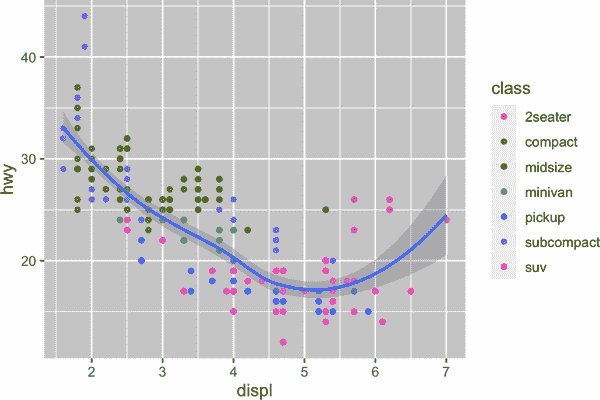
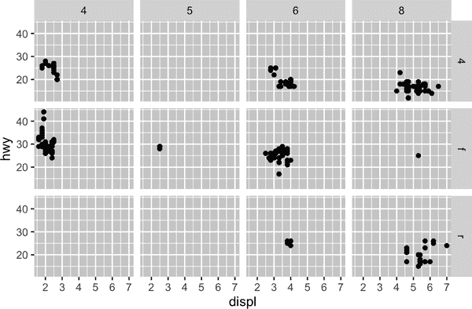
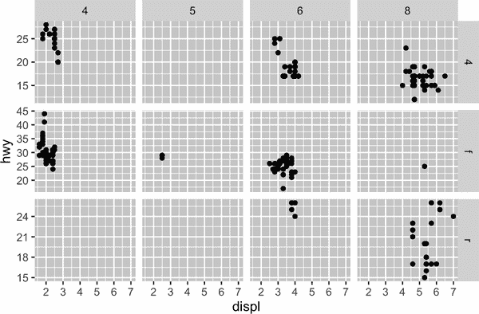
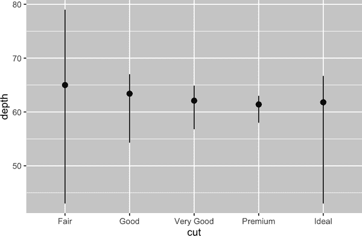
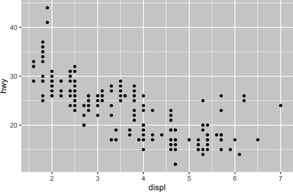
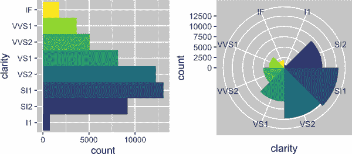

# 第九章：层

# 简介

在第一章中，您不仅学会了如何制作散点图、条形图和箱形图，还学会了可以使用 ggplot2 制作*任何*类型的图形的基础知识。

在本章中，您将深入了解图形语法的分层。我们将从对美学映射、几何对象和面板的深入探讨开始。接着，您将了解 ggplot2 在创建图时在幕后进行的统计变换。这些变换用于计算要绘制的新值，例如条形图中的条形高度或箱形图中的中位数。您还将了解位置调整，这些调整修改了如何在图中显示几何对象。最后，我们会简要介绍坐标系。

我们不会涵盖每个层的每个函数和选项，但我们会为您介绍 ggplot2 提供的最重要和常用的功能，并介绍扩展 ggplot2 的包。

## 先决条件

本章专注于 ggplot2。要访问本章中使用的数据集、帮助页面和函数，请通过运行以下代码加载 tidyverse：

```
library(tidyverse)
```

# 美学映射

> “一幅图片最大的价值在于它迫使我们注意到我们从未预料到的东西。” —约翰·图基

请记住，ggplot2 包中捆绑的 `mpg` 数据框包含了 38 个汽车型号的 234 个观测值。

```
mpg
#> # A tibble: 234 × 11
#>   manufacturer model displ  year   cyl trans      drv     cty   hwy fl 
#>   <chr>        <chr> <dbl> <int> <int> <chr>      <chr> <int> <int> <chr>
#> 1 audi         a4      1.8  1999     4 auto(l5)   f        18    29 p 
#> 2 audi         a4      1.8  1999     4 manual(m5) f        21    29 p 
#> 3 audi         a4      2    2008     4 manual(m6) f        20    31 p 
#> 4 audi         a4      2    2008     4 auto(av)   f        21    30 p 
#> 5 audi         a4      2.8  1999     6 auto(l5)   f        16    26 p 
#> 6 audi         a4      2.8  1999     6 manual(m5) f        18    26 p 
#> # … with 228 more rows, and 1 more variable: class <chr>
```

在 `mpg` 中的变量包括：

`displ`

一辆汽车的发动机大小，以升为单位。一个数值变量。

`hwy`

一辆汽车在高速公路上的燃油效率，以每加仑英里数（mpg）表示。当两辆车行驶相同距离时，燃油效率低的汽车消耗的燃料比燃油效率高的汽车多。一个数值变量。

`class`

车辆类型。一个分类变量。

让我们从可视化汽车不同 `class` 类别的 `displ` 和 `hwy` 之间的关系开始。我们可以通过散点图来实现这一点，其中数值变量被映射到 `x` 和 `y` 美学，而分类变量则被映射到美学如 `color` 或 `shape`。

```
# Left
ggplot(mpg, aes(x = displ, y = hwy, color = class)) +
  geom_point()

# Right
ggplot(mpg, aes(x = displ, y = hwy, shape = class)) +
  geom_point()
#> Warning: The shape palette can deal with a maximum of 6 discrete values
#> because more than 6 becomes difficult to discriminate; you have 7.
#> Consider specifying shapes manually if you must have them.
#> Warning: Removed 62 rows containing missing values (`geom_point()`).
```


当 `class` 被映射到 `shape` 时，我们会收到两个警告：

> 1：形状调色板最多可以处理 6 个离散值，因为超过 6 个会变得难以区分；你有 7 个。如果必须使用它们，请考虑手动指定形状。
> 
> 2: 删除了 62 行包含缺失值的观测（[`geom_point()`](https://ggplot2.tidyverse.org/reference/geom_point.xhtml)）。

由于 ggplot2 默认一次只使用六种形状，使用形状美学时，额外的分组将不会被绘制出来。第二个警告与此相关——数据集中有 62 辆 SUV，它们没有被绘制出来。

同样地，我们也可以将 `class` 映射到 `size` 或 `alpha` 美学，分别控制点的形状和透明度。

```
# Left
ggplot(mpg, aes(x = displ, y = hwy, size = class)) +
  geom_point()
#> Warning: Using size for a discrete variable is not advised.

# Right
ggplot(mpg, aes(x = displ, y = hwy, alpha = class)) +
  geom_point()
#> Warning: Using alpha for a discrete variable is not advised.
```


这两者也会产生警告：

> 不建议为离散变量使用 alpha。

将一个无序的离散（分类）变量(`class`)映射到有序的美学(`size`或`alpha`)通常不是一个好主意，因为它暗示了一个实际上并不存在的排名。

一旦映射了美学，ggplot2 会处理其余部分。它选择一个合理的比例尺与美学一起使用，并构建一个解释级别与值之间映射的图例。对于 x 和 y 美学，ggplot2 不会创建图例，但会创建带有刻度线和标签的坐标轴线。坐标轴线提供与图例相同的信息；它解释了位置与值之间的映射。

您还可以手动设置您的几何图形的视觉属性作为几何函数的参数（*不在* [`aes()`](https://ggplot2.tidyverse.org/reference/aes.xhtml) 内）。例如，我们可以将图中的所有点都设为蓝色：

```
ggplot(mpg, aes(x = displ, y = hwy)) + 
  geom_point(color = "blue")
```


在这里，颜色并不传达有关变量的信息；它只是改变了绘图的外观。您需要选择一个对该美学有意义的值：

+   颜色名称作为字符串，例如，`color = "blue"`

+   点的大小以毫米为单位，例如，`size = 1`

+   点的形状作为一个数字，例如，`shape = 1`，如 图 9-1 所示。


###### 图 9-1\. R 有 25 种内置形状，用数字标识。有些看起来重复：例如，0、15 和 22 都是正方形。区别在于 `color` 和 `fill` 美学的交互作用。空心形状（0–14）的边界由 `color` 决定；实心形状（15–20）填充有 `color`；填充形状（21–24）边界由 `color` 决定，填充有 `fill`。形状排列以保持相似形状相邻。

到目前为止，我们讨论了我们可以在散点图中映射或设置的美学，当使用点几何对象时。你可以在 [美学规范小册子](https://oreil.ly/SP6zV) 中了解更多所有可能的美学映射。

你可以用于图形的具体美学取决于你用来表示数据的几何对象。在接下来的部分中，我们将更深入地探讨几何对象。

## 练习

1.  创建一个散点图，其中 `hwy` 对 `displ`，点为粉色填充的三角形。

1.  为什么以下代码没有产生蓝色点的图形？

    ```
    ggplot(mpg) + 
      geom_point(aes(x = displ, y = hwy, color = "blue"))
    ```

1.  `stroke` 美学是做什么的？它适用于什么形状？（提示：参考 [`?geom_point`](https://ggplot2.tidyverse.org/reference/geom_point.xhtml)。）

1.  如果将美学映射到除变量名之外的东西，比如 `aes(color = displ < 5)`，会发生什么？注意，你还需要指定 x 和 y。

# 几何对象

这两个图形有何相似之处？


两个图都包含相同的 x 变量和相同的 y 变量，并且描述的都是相同的数据。但是这两个图并不相同。每个图使用不同的几何对象（geom）来表示数据。左边的图使用点几何对象（geom），右边的图使用平滑曲线几何对象（geom），这是根据数据拟合得到的平滑线。

要更改绘图中的几何对象，请更改添加到 [`ggplot()`](https://ggplot2.tidyverse.org/reference/ggplot.xhtml) 的几何函数。例如，要创建前面的图形，你可以使用以下代码：

```
# Left
ggplot(mpg, aes(x = displ, y = hwy)) + 
  geom_point()

# Right
ggplot(mpg, aes(x = displ, y = hwy)) + 
  geom_smooth()
#> `geom_smooth()` using method = 'loess' and formula = 'y ~ x'
```

ggplot2 中的每个几何函数都接受一个`mapping`参数，可以在几何图层内局部定义，也可以在全局的[`ggplot()`](https://ggplot2.tidyverse.org/reference/ggplot.xhtml)图层中定义。然而，并非每个美学特征都适用于每个几何图形。你可以设置点的形状，但不能设置线的“形状”。如果尝试设置，ggplot2 将默默忽略该美学映射。另一方面，*可以*设置线的线型。[`geom_smooth()`](https://ggplot2.tidyverse.org/reference/geom_smooth.xhtml)将为您映射到线型的每个唯一值绘制不同的线条。

```
# Left
ggplot(mpg, aes(x = displ, y = hwy, shape = drv)) + 
  geom_smooth()

# Right
ggplot(mpg, aes(x = displ, y = hwy, linetype = drv)) + 
  geom_smooth()
```


在这里，[`geom_smooth()`](https://ggplot2.tidyverse.org/reference/geom_smooth.xhtml)基于其`drv`值将汽车分为三条线。一条线描述所有具有`4`值的点，一条线描述所有具有`f`值的点，还有一条线描述所有具有`r`值的点。在此，`4`代表四轮驱动，`f`代表前轮驱动，`r`代表后轮驱动。

如果这听起来很奇怪，我们可以通过将线条叠加在原始数据之上并根据`drv`进行着色来使其更清晰。

```
ggplot(mpg, aes(x = displ, y = hwy, color = drv)) + 
  geom_point() +
  geom_smooth(aes(linetype = drv))
```


注意，此图包含同一图中的两个几何图形。

许多几何图形，例如[`geom_smooth()`](https://ggplot2.tidyverse.org/reference/geom_smooth.xhtml)，使用单个几何对象来显示多行数据。对于这些几何图形，可以将`group`美学设置为分类变量，以绘制多个对象。ggplot2 将为每个唯一的分组变量值绘制一个单独的对象。在实践中，每当将美学映射到离散变量（如`linetype`示例中）时，ggplot2 会自动对数据进行分组，依赖此特性非常方便。因为单独的`group`美学不会为几何图形添加图例或区分特征。

```
# Left
ggplot(mpg, aes(x = displ, y = hwy)) +
  geom_smooth()

# Middle
ggplot(mpg, aes(x = displ, y = hwy)) +
  geom_smooth(aes(group = drv))

# Right
ggplot(mpg, aes(x = displ, y = hwy)) +
  geom_smooth(aes(color = drv), show.legend = FALSE)
```


如果你将映射放置在 geom 函数中，ggplot2 将把它们视为该层的本地映射。它将使用这些映射来扩展或覆盖该层的全局映射*。这使得在不同的层中显示不同的美学成为可能。

```
ggplot(mpg, aes(x = displ, y = hwy)) + 
  geom_point(aes(color = class)) + 
  geom_smooth()
```



你可以使用相同的方法为每一层指定不同的`data`。在这里，我们使用红色点和空心圆圈来突出两座位汽车。[`geom_point()`](https://ggplot2.tidyverse.org/reference/geom_point.xhtml) 中的本地 data 参数仅覆盖了该层中 [`ggplot()`](https://ggplot2.tidyverse.org/reference/ggplot.xhtml) 的全局 data 参数。

```
ggplot(mpg, aes(x = displ, y = hwy)) + 
  geom_point() + 
  geom_point(
    data = mpg |> filter(class == "2seater"), 
    color = "red"
  ) +
  geom_point(
    data = mpg |> filter(class == "2seater"), 
    shape = "circle open", size = 3, color = "red"
  )
```


Geom 是 ggplot2 的基本构建块。通过改变其 geom，你可以完全改变图表的外观，并且不同的 geom 可以展示数据的不同特征。例如，以下直方图和密度图显示了高速公路里程分布是双峰性且右偏，而箱线图则显示了两个潜在的异常值：

```
# Left
ggplot(mpg, aes(x = hwy)) +
  geom_histogram(binwidth = 2)

# Middle
ggplot(mpg, aes(x = hwy)) +
  geom_density()

# Right
ggplot(mpg, aes(x = hwy)) +
  geom_boxplot()
```


ggplot2 提供了超过 40 种几何图形，但这些图形并不能涵盖所有可能的图表类型。如果你需要不同的几何图形，请先查看[扩展包](https://oreil.ly/ARL_4)，看看是否有其他人已经实现了。例如，[ggridges 包](https://oreil.ly/pPIuL)对制作脊线图很有用，这对于可视化数值变量在分类变量不同级别上的密度非常有用。在下图中，我们不仅使用了一个新的几何图形([`geom_density_ridges()`](https://wilkelab.org/ggridges/reference/geom_density_ridges.xhtml))，还将同一变量映射到多个美学属性(`drv`映射到`y`、`fill`和`color`)，并设置了一个美学属性(`alpha = 0.5`)来使密度曲线透明化。

```
library(ggridges)

ggplot(mpg, aes(x = hwy, y = drv, fill = drv, color = drv)) +
  geom_density_ridges(alpha = 0.5, show.legend = FALSE)
#> Picking joint bandwidth of 1.28
```


获取关于 ggplot2 提供的所有几何图形以及包中所有函数的全面概述的最佳途径是[参考页面](https://oreil.ly/cIFgm)。要了解有关任何单个几何图形的更多信息，请使用帮助（例如，[`?geom_smooth`](https://ggplot2.tidyverse.org/reference/geom_smooth.xhtml)）。

## 练习

1.  你会用什么几何图形来绘制线图？箱线图？直方图？面积图？

1.  本章前面我们使用了`show.legend`而没有解释它：

    ```
    ggplot(mpg, aes(x = displ, y = hwy)) +
      geom_smooth(aes(color = drv), show.legend = FALSE)
    ```

    这里的`show.legend = FALSE`是做什么用的？如果去掉它会发生什么？你认为我们之前为什么使用它？

1.  [`geom_smooth()`](https://ggplot2.tidyverse.org/reference/geom_smooth.xhtml)中的`se`参数是什么意思？

1.  重新创建生成以下图表所需的 R 代码。请注意，在图中使用分类变量时，它是`drv`。


# 多面板

在第一章中，您学习了如何使用[`facet_wrap()`](https://ggplot2.tidyverse.org/reference/facet_wrap.xhtml)进行分面，它将图表分成子图，每个子图根据分类变量显示一个数据子集。

```
ggplot(mpg, aes(x = displ, y = hwy)) + 
  geom_point() + 
  facet_wrap(~cyl)
```


要使用两个变量的组合分面绘制图表，请从[`facet_wrap()`](https://ggplot2.tidyverse.org/reference/facet_wrap.xhtml)切换到[`facet_grid()`](https://ggplot2.tidyverse.org/reference/facet_grid.xhtml)。[`facet_grid()`](https://ggplot2.tidyverse.org/reference/facet_grid.xhtml)的第一个参数也是一个公式，但现在是双向公式：`行 ~ 列`。

```
ggplot(mpg, aes(x = displ, y = hwy)) + 
  geom_point() + 
  facet_grid(drv ~ cyl)
```



默认情况下，每个子图在 x 轴和 y 轴上共享相同的比例和范围。这在您希望跨子图比较数据时非常有用，但在更好地可视化每个子图内关系时可能有所限制。将分面函数中的`scales`参数设置为`"free"`将允许跨行和列使用不同的轴标尺，`"free_x"`将允许跨行使用不同的标尺，`"free_y"`将允许跨列使用不同的标尺。

```
ggplot(mpg, aes(x = displ, y = hwy)) + 
  geom_point() + 
  facet_grid(drv ~ cyl, scales = "free_y")
```



## 练习

1.  如果在一个连续变量上进行分面会发生什么？

1.  在带有`facet_grid(drv ~ cyl)`的图中，空单元格代表什么？运行以下代码。这些单元格与结果图有何关系？

    ```
    ggplot(mpg) + 
      geom_point(aes(x = drv, y = cyl))
    ```

1.  以下代码生成了什么图形？`.`代表什么？

    ```
    ggplot(mpg) + 
      geom_point(aes(x = displ, y = hwy)) +
      facet_grid(drv ~ .)

    ggplot(mpg) + 
      geom_point(aes(x = displ, y = hwy)) +
      facet_grid(. ~ cyl)
    ```

1.  看一下本节的第一个分面图：

    ```
    ggplot(mpg) + 
      geom_point(aes(x = displ, y = hwy)) + 
      facet_wrap(~ class, nrow = 2)
    ```

    使用分面绘图而不是颜色美学有什么优点？有什么缺点？如果数据集更大会如何平衡？

1.  阅读[`?facet_wrap`](https://ggplot2.tidyverse.org/reference/facet_wrap.xhtml)。`nrow`是什么？`ncol`是什么？其他选项控制单个面板的布局吗？为什么[`facet_grid()`](https://ggplot2.tidyverse.org/reference/facet_grid.xhtml)没有`nrow`和`ncol`参数？

1.  以下哪种图表更容易比较不同驱动方式的汽车引擎大小（`displ`）？这反映了何时应该在行或列上放置分面变量？

    ```
    ggplot(mpg, aes(x = displ)) + 
      geom_histogram() + 
      facet_grid(drv ~ .)

    ggplot(mpg, aes(x = displ)) + 
      geom_histogram() +
      facet_grid(. ~ drv)
    ```

1.  使用 [`facet_wrap()`](https://ggplot2.tidyverse.org/reference/facet_wrap.xhtml) 重新创建以下图表，而不是使用 [`facet_grid()`](https://ggplot2.tidyverse.org/reference/facet_grid.xhtml)。分面标签的位置如何改变？

    ```
    ggplot(mpg) + 
      geom_point(aes(x = displ, y = hwy)) +
      facet_grid(drv ~ .)
    ```

# 统计变换

考虑使用 [`geom_bar()`](https://ggplot2.tidyverse.org/reference/geom_bar.xhtml) 或 [`geom_col()`](https://ggplot2.tidyverse.org/reference/geom_bar.xhtml) 绘制基本条形图。下图显示了`diamonds`数据集中按`cut`分组的钻石总数。`diamonds`数据集位于 ggplot2 包中，包括每颗钻石的 `price`、`carat`、`color`、`clarity` 和 `cut` 信息，约 54,000 颗钻石。该图表显示，高质量切割的钻石比低质量切割的钻石更多。

```
ggplot(diamonds, aes(x = cut)) + 
  geom_bar()
```


在 x 轴上，图表显示了来自 `diamonds` 的变量 `cut`。在 y 轴上，它显示 count，但 `diamonds` 中没有 count 变量！count 是从哪里来的？许多图表（如散点图）绘制数据集的原始值。其他图表（如条形图）计算新值以绘制：

+   条形图、直方图和频率多边形将数据进行分组，然后绘制每个分组的点数。

+   平滑曲线将模型拟合到您的数据，然后绘制模型预测。

+   箱线图计算分布的五数总结，然后以特殊格式显示该总结。

用于计算图表新值的算法称为 *stat*，即统计变换的简称。图 9-2 显示了使用 [`geom_bar()`](https://ggplot2.tidyverse.org/reference/geom_bar.xhtml) 的这一过程。


###### 图 9-2。创建条形图时，首先从原始数据开始，然后对数据进行汇总以计算每个条的观测次数，最后将这些计算的变量映射到绘图美学上。

你可以通过检查`stat`参数的默认值来了解一个几何对象使用的统计方法。例如，[`?geom_bar`](https://ggplot2.tidyverse.org/reference/geom_bar.xhtml)显示`stat`的默认值是`count`，这意味着[`geom_bar()`](https://ggplot2.tidyverse.org/reference/geom_bar.xhtml)使用[`stat_count()`](https://ggplot2.tidyverse.org/reference/geom_bar.xhtml)。[`stat_count()`](https://ggplot2.tidyverse.org/reference/geom_bar.xhtml)的文档可以在与[`geom_bar()`](https://ggplot2.tidyverse.org/reference/geom_bar.xhtml)同一页上找到。如果你向下滚动，标题为“计算变量”的部分解释了它计算两个新变量：`count`和`prop`。

每个几何对象都有一个默认的统计方法，而每个统计方法都有一个默认的几何对象。这意味着通常可以使用几何对象而不必担心底层的统计变换。但是，您可能需要显式地使用统计方法有以下三个原因：

1.  你可能希望覆盖默认的统计方法。在下面的代码中，我们将[`geom_bar()`](https://ggplot2.tidyverse.org/reference/geom_bar.xhtml)的统计方法从默认的计数改为标识。这样可以将柱状图的高度映射到 y 变量的原始值。

    ```
    diamonds |>
      count(cut) |>
      ggplot(aes(x = cut, y = n)) +
      geom_bar(stat = "identity")
    ```

    

1.  您可能希望覆盖从转换变量到美学属性的默认映射。例如，您可能希望显示比例柱状图，而不是计数：

    ```
    ggplot(diamonds, aes(x = cut, y = after_stat(prop), group = 1)) + 
      geom_bar()
    ```

    

    要查找统计方法可以计算的可能变量，请查看[`geom_bar()`](https://ggplot2.tidyverse.org/reference/geom_bar.xhtml)帮助文档中标题为“计算变量”的部分。

1.  你可能希望在你的代码中更加关注统计变换。例如，你可以使用[`stat_summary()`](https://ggplot2.tidyverse.org/reference/stat_summary.xhtml)，它可以对每个唯一的 x 值进行 y 值的总结，以便突出你正在计算的汇总信息：

    ```
    ggplot(diamonds) + 
      stat_summary(
        aes(x = cut, y = depth),
        fun.min = min,
        fun.max = max,
        fun = median
      )
    ```



ggplot2 提供了超过 20 种统计方法供您使用。每种统计方法都是一个函数，因此您可以像通常一样获取帮助，例如[`?stat_bin`](https://ggplot2.tidyverse.org/reference/geom_histogram.xhtml)。

## 练习

1.  默认与[`stat_summary()`](https://ggplot2.tidyverse.org/reference/stat_summary.xhtml)关联的几何对象是什么？你如何重写前面的图表以使用该几何函数代替统计函数？

1.  [`geom_col()`](https://ggplot2.tidyverse.org/reference/geom_bar.xhtml)的作用是什么？它与[`geom_bar()`](https://ggplot2.tidyverse.org/reference/geom_bar.xhtml)有什么不同？

1.  大多数几何对象和统计函数都成对出现，几乎总是一起使用。列出所有这些配对。它们有什么共同点？（提示：阅读文档。）

1.  [`stat_smooth()`](https://ggplot2.tidyverse.org/reference/geom_smooth.xhtml)计算哪些变量？控制它行为的参数是什么？

1.  在我们的比例条形图中，我们需要设置`group = 1`。为什么？换句话说，这两个图有什么问题？

    ```
    ggplot(diamonds, aes(x = cut, y = after_stat(prop))) + 
      geom_bar()
    ggplot(diamonds, aes(x = cut, fill = color, y = after_stat(prop))) + 
      geom_bar()
    ```

# 位置调整

条形图还有一个更神奇的功能。可以使用`color`美学或更实用的`fill`美学来着色条形图：

```
# Left
ggplot(mpg, aes(x = drv, color = drv)) + 
  geom_bar()

# Right
ggplot(mpg, aes(x = drv, fill = drv)) + 
  geom_bar()
```


注意一下，如果将填充美学映射到另一个变量，例如`class`，则条形将自动堆叠。每个彩色矩形代表了`drv`和`class`的组合。

```
ggplot(mpg, aes(x = drv, fill = class)) + 
  geom_bar()
```


自动堆叠是通过`position`参数指定的*位置调整*来完成的。如果不想要堆叠的条形图，可以使用三种其他选项之一：`"identity"`、`"dodge"`或`"fill"`。

+   `position = "identity"`会将每个对象放置在其在图形上下文中的确切位置。这对于条形图并不是很有用，因为它们会重叠。要查看重叠效果，我们需要通过将`alpha`设置为一个小值或通过设置`fill = NA`使条形图变得稍微透明或完全透明。

    ```
    # Left
    ggplot(mpg, aes(x = drv, fill = class)) + 
      geom_bar(alpha = 1/5, position = "identity")

    # Right
    ggplot(mpg, aes(x = drv, color = class)) + 
      geom_bar(fill = NA, position = "identity")
    ```

    

    身份位置调整对于二维几何对象（例如点）更有用，因为它是默认设置。

+   `position = "fill"`类似于堆叠，但使每组堆叠的条形图高度相同。这样可以更容易地比较不同组的比例。

+   `position = "dodge"`将重叠对象直接*相邻*放置。这样可以更容易地比较单个值。

    ```
    # Left
    ggplot(mpg, aes(x = drv, fill = class)) + 
      geom_bar(position = "fill")

    # Right
    ggplot(mpg, aes(x = drv, fill = class)) + 
      geom_bar(position = "dodge")
    ```

    

还有一种调整类型对条形图没有用处，但对散点图非常有用。回想一下我们的第一个散点图。您是否注意到，尽管数据集中有 234 个观测值，但图中仅显示了 126 个点？



`hwy`和`displ`的基础值被舍入，因此点位于网格上，并且许多点彼此重叠。这个问题被称为*重叠绘制*。这种排列使得难以看到数据的分布。数据点是否均匀分布在整个图表中，或者是否存在一个特定的`hwy`和`displ`组合包含 109 个值？

您可以通过将位置调整设置为`“jitter”`来避免此网格化。使用`position = "jitter"`会向每个点添加少量随机噪声。这会使点分散开，因为不太可能有两个点接收相同数量的随机噪声。

```
ggplot(mpg, aes(x = displ, y = hwy)) + 
  geom_point(position = "jitter")
```


添加随机性似乎是改善图形的奇怪方法，但这样做会使您的图形在小尺度上变得不太准确，在大尺度上却更加具有*显现*性。由于这是一个非常有用的操作，ggplot2 提供了`geom_point(position = "jitter")`的简写：[`geom_jitter()`](https://ggplot2.tidyverse.org/reference/geom_jitter.xhtml)。

要了解有关位置调整的更多信息，请查阅与每种调整相关联的帮助页面：

+   [`?position_dodge`](https://ggplot2.tidyverse.org/reference/position_dodge.xhtml)

+   [`?position_fill`](https://ggplot2.tidyverse.org/reference/position_stack.xhtml)

+   [`?position_identity`](https://ggplot2.tidyverse.org/reference/position_identity.xhtml)

+   [`?position_jitter`](https://ggplot2.tidyverse.org/reference/position_jitter.xhtml)

+   [`?position_stack`](https://ggplot2.tidyverse.org/reference/position_stack.xhtml)

## 练习

1.  下列图的问题是什么？您如何改进它？

    ```
    ggplot(mpg, aes(x = cty, y = hwy)) + 
      geom_point()
    ```

1.  这两个图有什么区别（如果有的话）？为什么？

    ```
    ggplot(mpg, aes(x = displ, y = hwy)) +
      geom_point()
    ggplot(mpg, aes(x = displ, y = hwy)) +
      geom_point(position = "identity")
    ```

1.  [`geom_jitter()`](https://ggplot2.tidyverse.org/reference/geom_jitter.xhtml)控制抖动量的参数是什么？

1.  比较和对比[`geom_jitter()`](https://ggplot2.tidyverse.org/reference/geom_jitter.xhtml)和[`geom_count()`](https://ggplot2.tidyverse.org/reference/geom_count.xhtml)。

1.  [`geom_boxplot()`](https://ggplot2.tidyverse.org/reference/geom_boxplot.xhtml)的默认位置调整是什么？创建一个`mpg`数据集的可视化示例来演示它。

# 坐标系统

坐标系统可能是 ggplot2 最复杂的部分。默认坐标系是笛卡尔坐标系，其中 x 和 y 位置独立作用于确定每个点的位置。偶尔还有两种其他有帮助的坐标系。

+   [`coord_quickmap()`](https://ggplot2.tidyverse.org/reference/coord_map.xhtml)可为地理地图设置正确的纵横比。这在使用 ggplot2 绘制空间数据时非常重要。我们在本书中无法详细讨论地图，但你可以在《ggplot2: Data Analysis》（Springer）的[地图章节](https://oreil.ly/45GHE)中了解更多。

    ```
    nz <- map_data("nz")

    ggplot(nz, aes(x = long, y = lat, group = group)) +
      geom_polygon(fill = "white", color = "black")

    ggplot(nz, aes(x = long, y = lat, group = group)) +
      geom_polygon(fill = "white", color = "black") +
      coord_quickmap()
    ```

    

    

+   [`coord_polar()`](https://ggplot2.tidyverse.org/reference/coord_polar.xhtml)使用极坐标。极坐标揭示了条形图和 Coxcomb 图之间的有趣联系。

    ```
    bar <- ggplot(data = diamonds) + 
      geom_bar(
        mapping = aes(x = clarity, fill = clarity), 
        show.legend = FALSE,
        width = 1
      ) + 
      theme(aspect.ratio = 1)

    bar + coord_flip()
    bar + coord_polar()
    ```



## 练习

1.  使用[`coord_polar()`](https://ggplot2.tidyverse.org/reference/coord_polar.xhtml)将堆叠条形图转换为饼图。

1.  [`coord_quickmap()`](https://ggplot2.tidyverse.org/reference/coord_map.xhtml)和[`coord_map()`](https://ggplot2.tidyverse.org/reference/coord_map.xhtml)有什么区别？

1.  以下图形告诉你城市和高速公路 mpg 之间的关系？[`coord_fixed()`](https://ggplot2.tidyverse.org/reference/coord_fixed.xhtml)的重要性是什么？[`geom_abline()`](https://ggplot2.tidyverse.org/reference/geom_abline.xhtml)的作用是什么？

    ```
    ggplot(data = mpg, mapping = aes(x = cty, y = hwy)) +
      geom_point() + 
      geom_abline() +
      coord_fixed()
    ```

# 图形语法的分层

我们可以在你在“ggplot2 Calls”学到的图形模板上扩展，添加位置调整、统计、坐标系和分面：

```
ggplot(data = <DATA>) + 
  <GEOM_FUNCTION>(
     mapping = aes(<MAPPINGS>),
     stat = <STAT>, 
     position = <POSITION>
  ) +
  <COORDINATE_FUNCTION> +
  <FACET_FUNCTION>
```

我们的新模板需要七个参数，即模板中出现的方括号内的单词。实际上，为了制作图表，你很少需要提供所有七个参数，因为 ggplot2 会为除数据、映射和几何函数之外的所有内容提供有用的默认值。

模板中的七个参数组成了图形语法，这是一种构建图形的形式系统。图形语法基于这样的洞察力：你可以将**任何**图形唯一地描述为数据集、几何对象、一组映射、统计函数、位置调整、坐标系、分面方案和主题的组合。

要了解其工作原理，考虑如何从头开始构建一个基本的图：你可以从一个数据集开始，然后将其转换为你想要显示的信息（使用一个统计函数）。接下来，你可以选择一个几何对象来表示转换后数据中的每个观测。然后，你可以使用这些几何对象的美学属性来表示数据中的变量。你会将每个变量的值映射到一个美学的层次上。这些步骤在图 9-3 中有所说明。然后，你可以选择一个坐标系将这些几何对象放置其中，利用对象的位置（本身就是美学属性）来显示 x 和 y 变量的值。


###### 图 9-3\. 这些是从原始数据到频率表到柱状图的步骤，其中柱子的高度代表频率。

在这一点上，你将拥有一个完整的图形，但你可以进一步调整几何对象在坐标系内的位置（位置调整）或将图形分成子图（分面）。你还可以通过添加一个或多个额外的图层来扩展图形，其中每个额外的图层使用一个数据集，一个几何对象，一组映射，一个统计函数和一个位置调整。

你可以使用这种方法构建*任何*你想象的图形。换句话说，你可以使用本章学到的代码模板来构建数十万个独特的图形。

如果你想更深入了解 ggplot2 的理论基础，可以阅读[“图形的分层语法”](https://oreil.ly/8fZzE)，这篇科学论文详细描述了 ggplot2 的理论。

# 概要

在本章中，你学习了图形的分层语法，从美学和几何开始构建一个简单的图形，将图形分割成子集的分面，理解如何计算几何对象的统计数据，控制几何对象重叠时的精细位置调整，以及允许你从根本上改变 x 和 y 含义的坐标系。我们还未触及的一层是主题，在“主题”中将进行介绍。

获取完整的 ggplot2 功能概述的两个非常有用的资源是[ggplot2 速查表](https://oreil.ly/NlKZF)和[ggplot2 包网站](https://oreil.ly/W6ci8)。

从本章中你应该学到的一条重要教训是，当你感觉到需要一个 ggplot2 没有提供的几何图形时，最好查看是否有人已经通过创建一个 ggplot2 扩展包来解决你的问题。
