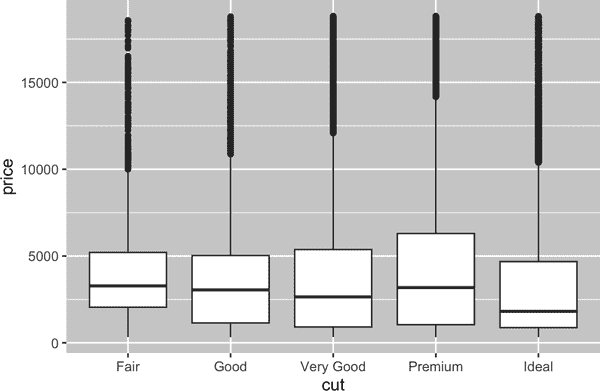
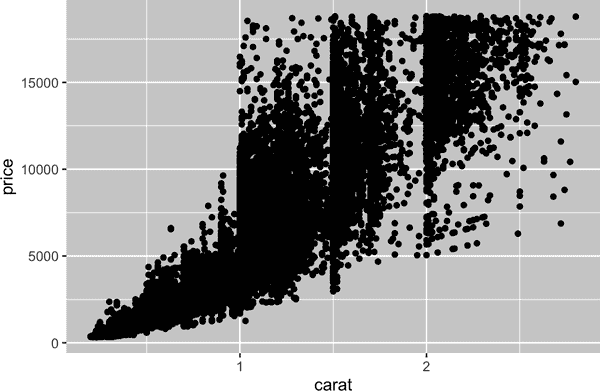

# 第十章：探索性数据分析

# 介绍

本章将向你展示如何系统地使用可视化和转换来探索你的数据，这是统计学家称之为*探索性数据分析*或简称 EDA 的任务。EDA 是一个迭代循环。你：

1.  提出关于你的数据的问题。

1.  通过视觉化、转换和建模数据来寻找答案。

1.  利用你所学到的知识来完善你的问题和/或生成新问题。

EDA 不是一个具有严格规则集的正式过程。比任何其他东西都重要的是，EDA 是一种心态。在 EDA 的初始阶段，你应该随心所欲地调查每一个想法。其中一些想法会得到验证，而另一些则是死胡同。随着探索的继续，你将聚焦于几个特别有生产力的见解，最终会将它们写下并传达给其他人。

EDA 是任何数据分析的重要部分，即使主要的研究问题已经摆在你面前，因为你始终需要调查数据的质量。数据清洗只是 EDA 的一个应用：你要问关于你的数据是否符合期望的问题。要进行数据清洗，你需要使用 EDA 的所有工具：视觉化、转换和建模。

## 先决条件

在本章中，我们将结合你已学到的 dplyr 和 ggplot2，以互动方式提出问题、用数据回答问题，然后提出新问题。

```
library(tidyverse)
```

# 问题

> “没有例行统计问题，只有可疑的统计惯例。” —David Cox 爵士
> 
> “对正确问题的近似答案要好得多，即使这些问题通常模糊，也要好过对错误问题的精确答案，因为后者总是可以被明确化。” —John Tukey

在 EDA 过程中，你的目标是深入了解你的数据。做到这一点最简单的方法是将问题作为指导调查的工具。当你提出一个问题时，问题会集中你的注意力在数据集的特定部分，并帮助你决定制作哪些图表、模型或转换。

EDA 从根本上讲是一个创造性的过程。就像大多数创造性过程一样，提出*高质量*问题的关键在于生成大量的*问题*。在分析开始时很难提出具有启发性的问题，因为你不知道数据集中可以获取什么洞见。另一方面，每个新问题的提出都会让你接触数据的一个新方面，并增加你发现的机会。如果你根据所发现的内容提出新问题，你可以迅速深入探究数据中最有趣的部分，并形成一系列发人深省的问题。

没有关于应该问什么问题来引导你的研究的规则。然而，有两种类型的问题将始终有助于在你的数据中发现新发现。你可以笼统地用以下问题表达这些问题：

1.  我的变量内部存在哪种类型的变异？

1.  我的变量之间发生了什么类型的协变？

本章的其余部分将探讨这两个问题。我们将解释变异和协变是什么，并展示几种回答每个问题的方式。

# 变异

*变异* 是变量值在测量之间变化的倾向。您可以很容易地在现实生活中看到变异；如果您两次测量任何连续变量，您将得到两个不同的结果。即使您测量恒定的量，如光速，也是如此。每次测量都会包括一小部分从测量到测量变化的误差。变量还可以因为在不同主体（例如，不同人的眼睛颜色）或不同时间（例如，电子的能级在不同时刻）上测量而变化。每个变量都有其自己的变异模式，这可以揭示关于它如何在同一观察的测量之间以及跨观察之间变化的有趣信息。理解该模式的最佳方法是可视化变量值的分布，这是您在第一章中学到的。

我们将通过可视化约 54,000 颗钻石的重量（`carat`）分布来开始我们的探索，来自`diamonds`数据集。由于`carat`是一个数值变量，我们可以使用直方图：

```
ggplot(diamonds, aes(x = carat)) +
  geom_histogram(binwidth = 0.5)
```


现在您可以可视化变异，您在图中应该寻找什么？以及您应该提出什么类型的后续问题？我们在下一节中列出了您将在图表中找到的最有用的信息类型及其相应的后续问题。提出良好后续问题的关键将是依靠您的好奇心（您想更多了解什么？）以及您的怀疑心（这可能是误导的方式？）。

## 典型值

在条形图和直方图中，高柱显示变量的常见值，而较短的柱显示不常见的值。没有柱的地方显示未在数据中看到的值。要将此信息转化为有用的问题，寻找任何意外的事物：

+   哪些值最常见？为什么？

+   哪些值是罕见的？为什么？这是否符合你的期望？

+   您能看到任何不寻常的模式吗？可能是什么原因？

让我们来看看较小钻石的`carat`分布：

```
smaller <- diamonds |> 
  filter(carat < 3)

ggplot(smaller, aes(x = carat)) +
  geom_histogram(binwidth = 0.01)
```


这幅直方图提出了几个有趣的问题：

+   为什么整数克拉和常见克拉分数的钻石较多？

+   为什么每个峰值右侧的钻石比左侧稍多？

可视化也可以显示出聚类，这表明数据中存在子群体。要理解这些子群体，可以问：

+   每个子群体内的观察结果如何相似？

+   分离聚类中的观察结果如何不同？

+   你如何解释或描述这些聚类？

+   为什么聚类的外观可能会误导？

其中一些问题可以通过数据回答，而一些则需要关于数据的领域专业知识。其中许多问题将促使你探索*变量之间*的关系，例如看看一个变量的值是否可以解释另一个变量的行为。我们很快就会讨论这个问题。

## 不寻常的值

离群值是不寻常的观察结果，换句话说，是不符合模式的数据点。有时离群值是数据输入错误，有时它们只是极端值在数据收集中被观察到，而有时则暗示重要的新发现。当你有大量数据时，在直方图中有时很难看到离群值。例如，看一下`diamonds`数据集中`y`变量的分布。唯一显示离群值的证据是 x 轴上异常宽的限制。

```
ggplot(diamonds, aes(x = y)) + 
  geom_histogram(binwidth = 0.5)
```


在常见箱中有很多观察结果，罕见箱非常短，使得很难看到它们（虽然也许如果你仔细盯着 0 看，你会发现一些东西）。为了便于看到不寻常的值，我们需要使用[`coord_cartesian()`](https://ggplot2.tidyverse.org/reference/coord_cartesian.xhtml)来缩小 y 轴的值：

```
ggplot(diamonds, aes(x = y)) + 
  geom_histogram(binwidth = 0.5) +
  coord_cartesian(ylim = c(0, 50))
```


[`coord_cartesian()`](https://ggplot2.tidyverse.org/reference/coord_cartesian.xhtml) 还有一个 [`xlim()`](https://ggplot2.tidyverse.org/reference/lims.xhtml) 参数，用于缩放 x 轴。ggplot2 还有 [`xlim()`](https://ggplot2.tidyverse.org/reference/lims.xhtml) 和 [`ylim()`](https://ggplot2.tidyverse.org/reference/lims.xhtml) 函数，它们的工作方式略有不同：它们会丢弃超出限制范围的数据。

这使我们看到有三个异常值：0、约 30 和约 60。我们使用 dplyr 将它们挑出：

```
unusual <- diamonds |> 
  filter(y < 3 | y > 20) |> 
  select(price, x, y, z) |>
  arrange(y)
unusual
#> # A tibble: 9 × 4
#>   price     x     y     z
#>   <int> <dbl> <dbl> <dbl>
#> 1  5139  0      0    0 
#> 2  6381  0      0    0 
#> 3 12800  0      0    0 
#> 4 15686  0      0    0 
#> 5 18034  0      0    0 
#> 6  2130  0      0    0 
#> 7  2130  0      0    0 
#> 8  2075  5.15  31.8  5.12
#> 9 12210  8.09  58.9  8.06
```

`y` 变量以毫米测量这些钻石的三个尺寸之一。我们知道钻石不能有 0 毫米的宽度，因此这些值必定是不正确的。通过探索数据分析，我们发现编码为 0 的缺失数据，这是我们仅仅搜索 `NA` 时无法发现的。未来，我们可能选择重新编码这些值为 `NA`，以防止误导性计算。我们还可能怀疑，32 毫米和 59 毫米的测量值是不可能的：这些钻石超过一英寸长，但价格不会成百上千美元！

反复进行分析，有无异常值。如果异常值对结果影响不大，并且您无法弄清楚它们存在的原因，则删除它们并继续是合理的。但是，如果它们对结果有重大影响，则不应在没有理由的情况下删除它们。您需要找出引起它们的原因（例如，数据输入错误），并在报告中披露您已删除它们。

## 练习

1.  探索 `diamonds` 中 `x`、`y` 和 `z` 变量的分布。您学到了什么？考虑一颗钻石，您可能如何确定长度、宽度和深度。

1.  探索 `price` 的分布。您发现了什么异常或令人惊讶的事情吗？（提示：仔细考虑 `binwidth` 并确保尝试一系列值。）

1.  有多少颗钻石是 0.99 克拉？有多少是 1 克拉？您认为造成这种差异的原因是什么？

1.  比较和对比 [`coord_cartesian()`](https://ggplot2.tidyverse.org/reference/coord_cartesian.xhtml) 和 [`xlim()`](https://ggplot2.tidyverse.org/reference/lims.xhtml) 或 [`ylim()`](https://ggplot2.tidyverse.org/reference/lims.xhtml) 在缩放直方图时的情况。如果不设置 `binwidth` 会发生什么？如果试图缩放以显示一半条柱子会发生什么？

# 异常值

如果您的数据集中出现异常值，并且只想继续分析剩余部分，则有两个选择：

1.  删除具有奇怪值的整行：

    ```
    diamonds2 <- diamonds |> 
      filter(between(y, 3, 20))
    ```

    我们不建议选择此选项，因为一个无效值并不意味着该观察的所有其他值也无效。此外，如果您的数据质量较低，当您将此方法应用于每个变量时，您可能会发现没有任何数据剩余！

1.  相反，我们建议将异常值替换为缺失值。最简单的方法是使用 [`mutate()`](https://dplyr.tidyverse.org/reference/mutate.xhtml) 来替换变量为修改后的副本。你可以使用 [`if_else()`](https://dplyr.tidyverse.org/reference/if_else.xhtml) 函数将异常值替换为 `NA`：

    ```
    diamonds2 <- diamonds |> 
      mutate(y = if_else(y < 3 | y > 20, NA, y))
    ```

不明显的是你应该在哪里绘制缺失值，因此 ggplot2 不会在图中包含它们，但会警告它们已被移除：

```
ggplot(diamonds2, aes(x = x, y = y)) + 
  geom_point()
#> Warning: Removed 9 rows containing missing values (`geom_point()`).
```


要消除该警告，请设置 `na.rm = TRUE`：

```
ggplot(diamonds2, aes(x = x, y = y)) + 
  geom_point(na.rm = TRUE)
```

有时候，你想了解带有缺失值的观测与带有记录值的观测有何不同。例如，在 [`nycflights13::flights`](https://rdrr.io/pkg/nycflights13/man/flights.xhtml)¹ 中，`dep_time` 变量中的缺失值表明航班被取消。因此，你可能想比较已取消和未取消航班的计划起飞时间。你可以通过创建一个新变量来实现此目的，使用 [`is.na()`](https://rdrr.io/r/base/NA.xhtml) 来检查 `dep_time` 是否缺失。

```
nycflights13::flights |> 
  mutate(
    cancelled = is.na(dep_time),
    sched_hour = sched_dep_time %/% 100,
    sched_min = sched_dep_time %% 100,
    sched_dep_time = sched_hour + (sched_min / 60)
  ) |> 
  ggplot(aes(x = sched_dep_time)) + 
  geom_freqpoly(aes(color = cancelled), binwidth = 1/4)
```


然而，这个图表并不理想，因为未取消航班比取消航班要多得多。在下一节中，我们将探讨一些改进这种比较的技术。

## 练习

1.  缺失值在直方图中会发生什么？缺失值在条形图中会发生什么？为什么直方图和条形图在处理缺失值时会有差异？

1.  在 [`mean()`](https://rdrr.io/r/base/mean.xhtml) 和 [`sum()`](https://rdrr.io/r/base/sum.xhtml) 中，`na.rm = TRUE` 是什么作用？

1.  重新创建 `scheduled_dep_time` 的频率图，并根据航班是否取消进行着色。还要按 `cancelled` 变量进行分面。尝试在分面函数中使用不同的 `scales` 变量值，以减轻未取消航班比取消航班更多的影响。

# 协变

如果变异描述了变量内部的行为，那么协变描述了变量之间的行为。*协变* 是两个或多个变量值一起以相关方式变化的倾向。发现协变的最佳方法是可视化两个或多个变量之间的关系。

## 一个分类变量和一个数值变量

例如，让我们探索一下钻石价格如何随其品质（由 `cut` 衡量）变化，使用 [`geom_freqpoly()`](https://ggplot2.tidyverse.org/reference/geom_histogram.xhtml)：

```
ggplot(diamonds, aes(x = price)) + 
  geom_freqpoly(aes(color = cut), binwidth = 500, linewidth = 0.75)
```


注意，ggplot2 对 `cut` 使用有序颜色比例尺，因为它在数据中被定义为有序因子变量。您将在“有序因子”中了解更多相关内容。

在这里，默认的 [`geom_freqpoly()`](https://ggplot2.tidyverse.org/reference/geom_histogram.xhtml) 外观并不那么有用，因为高度由总计决定，在 `cut` 中差异很大，使得难以看出它们分布形状的差异。

为了更容易比较，我们需要交换显示在 y 轴上的内容。而不是显示计数，我们将显示 *density*，这是将每个频率多边形下面积标准化为 1 的计数：

```
ggplot(diamonds, aes(x = price, y = after_stat(density))) + 
  geom_freqpoly(aes(color = cut), binwidth = 500, linewidth = 0.75)
```


请注意，我们将 `density` 映射到 `y` 轴，但由于 `density` 不是 `diamonds` 数据集中的变量，我们需要先计算它。我们使用 [`after_stat()`](https://ggplot2.tidyverse.org/reference/aes_eval.xhtml) 函数来完成这一点。

对于这幅图有一点令人惊讶：似乎低质量的 Fair 钻石拥有最高的平均价格！但也许这是因为频率多边形图有点难以解释；这幅图中有很多信息。

使用并排箱线图探索这种关系的可视化简化图：

```
ggplot(diamonds, aes(x = cut, y = price)) +
  geom_boxplot()
```



我们关于分布的信息要少得多，但是箱线图更为紧凑，因此我们可以更轻松地比较它们（并且在一幅图上容纳更多）。这支持了一个反直觉的发现，即更高质量的钻石通常更便宜！在练习中，您将被挑战找出其中原因。

`cut`是一个有序因子：fair 比 good 差，good 比 very good 差，依此类推。许多分类变量没有这种固有顺序，因此您可能希望重新排序它们以获得更具信息量的显示。一种方法是使用[`fct_reorder()`](https://forcats.tidyverse.org/reference/fct_reorder.xhtml)。您将在“修改因子顺序”中了解更多关于该函数的信息，但我们在这里提前为您展示它是如此有用。例如，考虑`mpg`数据集中的`class`变量。您可能想知道不同类别的汽车在公路里程上的变化：

```
ggplot(mpg, aes(x = class, y = hwy)) +
  geom_boxplot()
```


为了更容易看到趋势，我们可以基于`hwy`的中位数值重新排序`class`：

```
ggplot(mpg, aes(x = fct_reorder(class, hwy, median), y = hwy)) +
  geom_boxplot()
```


如果您有较长的变量名称，[`geom_boxplot()`](https://ggplot2.tidyverse.org/reference/geom_boxplot.xhtml)在将其翻转 90°后将表现得更好。您可以通过交换 x 和 y 的美学映射来实现：

```
ggplot(mpg, aes(x = hwy, y = fct_reorder(class, hwy, median))) +
  geom_boxplot()
```


### 练习

1.  利用所学知识改进取消与未取消航班的起飞时间可视化。

1.  基于探索性数据分析，钻石数据集中哪个变量似乎对预测钻石价格最重要？该变量与切割质量的相关性如何？为什么这两种关系的结合导致较低质量的钻石更昂贵？

1.  与交换变量相比，将[`coord_flip()`](https://ggplot2.tidyverse.org/reference/coord_flip.xhtml)作为垂直箱线图的新图层添加以创建水平箱线图。这与交换变量有何不同？

1.  箱线图的一个问题是它们是在数据集较小的时代开发的，往往显示出过多的“异常值”。解决这个问题的一种方法是使用字母值图。安装 lvplot 包，并尝试使用`geom_lv()`来显示价格与切割质量的分布。您从中学到了什么？如何解释这些图形？

1.  使用[`geom_violin()`](https://ggplot2.tidyverse.org/reference/geom_violin.xhtml)创建钻石价格与`diamonds`数据集中的分类变量的可视化，然后使用分面[`geom_histogram()`](https://ggplot2.tidyverse.org/reference/geom_histogram.xhtml)，接着使用着色的[`geom_freqpoly()`](https://ggplot2.tidyverse.org/reference/geom_histogram.xhtml)，最后使用着色的[`geom_density()`](https://ggplot2.tidyverse.org/reference/geom_density.xhtml)。比较和对比这四种可视化数值变量分布的方法。基于分类变量级别的优缺点是什么？

1.  如果数据集较小，有时使用[`geom_jitter()`](https://ggplot2.tidyverse.org/reference/geom_jitter.xhtml)可以避免过度绘制，更容易看到连续变量与分类变量之间的关系。ggbeeswarm 包提供了几种类似于[`geom_jitter()`](https://ggplot2.tidyverse.org/reference/geom_jitter.xhtml)的方法。列出它们并简要描述每种方法的作用。

## 两个分类变量

要可视化分类变量之间的协变量关系，您需要计算每个分类变量级别组合的观察次数。一种方法是依赖内置的[`geom_count()`](https://ggplot2.tidyverse.org/reference/geom_count.xhtml)：

```
ggplot(diamonds, aes(x = cut, y = color)) +
  geom_count()
```


图中每个圆圈的大小显示了每个值组合的观察次数。协变量将显示为特定 x 值和特定 y 值之间的强相关性。

另一种探索这些变量之间关系的方法是使用 dplyr 计算计数：

```
diamonds |> 
  count(color, cut)
#> # A tibble: 35 × 3
#>   color cut           n
#>   <ord> <ord>     <int>
#> 1 D     Fair        163
#> 2 D     Good        662
#> 3 D     Very Good  1513
#> 4 D     Premium    1603
#> 5 D     Ideal      2834
#> 6 E     Fair        224
#> # … with 29 more rows
```

然后使用[`geom_tile()`](https://ggplot2.tidyverse.org/reference/geom_tile.xhtml)和填充美学：

```
diamonds |> 
  count(color, cut) |>  
  ggplot(aes(x = color, y = cut)) +
  geom_tile(aes(fill = n))
```


如果分类变量无序，可能需要使用 seriation 包同时重新排序行和列，以更清晰地显示有趣的模式。对于较大的图表，您可以尝试使用 heatmaply 包，该包创建交互式图表。

### 练习

1.  如何重新调整先前的计数数据集以更清晰地显示切割在颜色内部的分布或颜色在切割内部的分布？

1.  如果将颜色映射到`x`美学，将`cut`映射到`fill`美学，分段条形图可以为您提供不同的数据洞见？计算落入每个段的计数。（在这一部分，我们将使用“smaller”数据集，专注于克拉数小于 3 的大部分钻石。）

1.  使用 [`geom_tile()`](https://ggplot2.tidyverse.org/reference/geom_tile.xhtml) 结合 dplyr 探索飞行延误平均时间如何随目的地和年份的月份变化。什么使得绘图难以阅读？您如何改进它？

## 两个数值变量

您已经看到了一个很好的方法来可视化两个数值变量之间的协变关系：使用 [`geom_point()`](https://ggplot2.tidyverse.org/reference/geom_point.xhtml) 绘制散点图。您可以将协变关系视为点的模式。例如，您可以看到钻石的克拉数与价格之间的正相关关系：克拉数更大的钻石价格更高。这种关系是指数的。

```
ggplot(smaller, aes(x = carat, y = price)) +
  geom_point()
```



（在这一部分，我们将使用`smaller`数据集，专注于克拉数小于 3 的大部分钻石。）

随着数据集的规模增长，散点图在数据重叠和堆积方面变得不那么有用，因为点开始堆积成均匀黑色的区域，这使得难以判断数据在二维空间中密度的差异，也难以发现趋势。您已经看到解决这个问题的一种方法：使用`alpha`美学添加透明度。

```
ggplot(smaller, aes(x = carat, y = price)) + 
  geom_point(alpha = 1 / 100)
```


但是对于非常大的数据集，使用透明度可能会很具挑战性。另一种解决方案是使用网格。之前您使用了[`geom_histogram()`](https://ggplot2.tidyverse.org/reference/geom_histogram.xhtml) 和 [`geom_freqpoly()`](https://ggplot2.tidyverse.org/reference/geom_histogram.xhtml) 在一个维度上进行网格化。现在您将学习如何使用 [`geom_bin2d()`](https://ggplot2.tidyverse.org/reference/geom_bin_2d.xhtml) 和 [`geom_hex()`](https://ggplot2.tidyverse.org/reference/geom_hex.xhtml) 在两个维度上进行网格化。

[`geom_bin2d()`](https://ggplot2.tidyverse.org/reference/geom_bin_2d.xhtml) 和 [`geom_hex()`](https://ggplot2.tidyverse.org/reference/geom_hex.xhtml) 将坐标平面分成 2D 网格，并使用填充颜色显示每个网格中有多少个点。[`geom_bin2d()`](https://ggplot2.tidyverse.org/reference/geom_bin_2d.xhtml) 创建矩形网格。[`geom_hex()`](https://ggplot2.tidyverse.org/reference/geom_hex.xhtml) 创建六角形网格。您需要安装 hexbin 包来使用 [`geom_hex()`](https://ggplot2.tidyverse.org/reference/geom_hex.xhtml)。

```
ggplot(smaller, aes(x = carat, y = price)) +
  geom_bin2d()

# install.packages("hexbin")
ggplot(smaller, aes(x = carat, y = price)) +
  geom_hex()
```


另一个选项是将一个连续变量分箱，使其像分类变量一样运行。然后，您可以使用您学到的技术之一来可视化分类和连续变量的组合。例如，您可以对`克拉`进行分箱，然后为每个组显示一个箱线图：

```
ggplot(smaller, aes(x = carat, y = price)) + 
  geom_boxplot(aes(group = cut_width(carat, 0.1)))
```


`cut_width(x, width)`，如此使用，将`x`分为宽度为`width`的箱子。默认情况下，除了异常值的数量不同外，箱线图看起来大致相同，因此很难告诉每个箱线图总结了不同数量的点。显示这一点的一种方法是使箱线图的宽度与点数成比例，使用`varwidth = TRUE`。

### 练习

1.  不使用箱线图总结条件分布，而是使用频率多边形。使用[`cut_width()`](https://ggplot2.tidyverse.org/reference/cut_interval.xhtml)与[`cut_number()`](https://ggplot2.tidyverse.org/reference/cut_interval.xhtml)时需要考虑什么？这如何影响`克拉`和`价格`的二维分布可视化？

1.  可视化按`价格`分区的`克拉`分布。

1.  很大钻石的价格分布与小钻石相比如何？是否符合您的预期，还是让您感到惊讶？

1.  结合你学到的两种技术，可视化切割、克拉和价格的联合分布。

1.  二维图表揭示了在一维图表中看不到的异常值。例如，以下图中的一些点具有不寻常的`x`和`y`值组合，这使得这些点在单独检查`x`和`y`值时看起来正常，但在散点图中则成为异常值。为什么散点图对于这种情况比分箱图更好？

    ```
    diamonds |> 
      filter(x >= 4) |> 
      ggplot(aes(x = x, y = y)) +
      geom_point() +
      coord_cartesian(xlim = c(4, 11), ylim = c(4, 11))
    ```

1.  不使用[`cut_width()`](https://ggplot2.tidyverse.org/reference/cut_interval.xhtml)创建等宽的箱子，而是使用[`cut_number()`](https://ggplot2.tidyverse.org/reference/cut_interval.xhtml)创建大致包含相同数量点的箱子。这种方法的优缺点是什么？

    ```
    ggplot(smaller, aes(x = carat, y = price)) + 
      geom_boxplot(aes(group = cut_number(carat, 20)))
    ```

# 模式和模型

如果两个变量之间存在系统关系，它将在数据中显示为一种模式。如果您发现了一个模式，请问自己：

+   这种模式可能是巧合造成的吗（即随机事件）？

+   您如何描述由模式暗示的关系？

+   这种模式所暗示的关系有多强？

+   其他变量可能会影响这种关系吗？

+   如果您查看数据的各个子组，关系是否会发生变化？

您数据中的模式提供了有关关系的线索；即，它们显示协变。如果您将变异视为创建不确定性的现象，协变则是减少不确定性的现象。如果两个变量协变，您可以使用一个变量的值来更好地预测第二个变量的值。如果协变是由因果关系引起的（一种特殊情况），则可以使用一个变量的值来控制第二个变量的值。

模型是从数据中提取模式的工具。例如，考虑钻石数据。要理解切割和价格之间的关系很困难，因为切割与克拉、克拉与价格之间紧密相关。可以使用模型去除价格和克拉之间非常强的关系，以探索剩余的微妙差异。以下代码拟合一个模型，预测`price`基于`carat`，然后计算残差（预测值与实际值之间的差异）。残差使我们能够看到钻石的价格，一旦克拉的影响被消除。请注意，我们不使用`price`和`carat`的原始值，而是先对它们进行对数变换，然后拟合对数变换后的值的模型。然后，我们将残差指数化，以将它们放回到原始价格的尺度。

```
library(tidymodels)

diamonds <- diamonds |>
  mutate(
    log_price = log(price),
    log_carat = log(carat)
  )

diamonds_fit <- linear_reg() |>
  fit(log_price ~ log_carat, data = diamonds)

diamonds_aug <- augment(diamonds_fit, new_data = diamonds) |>
  mutate(.resid = exp(.resid))

ggplot(diamonds_aug, aes(x = carat, y = .resid)) + 
  geom_point()
```


一旦消除了克拉与价格之间的强关系，您可以看到切割与价格之间的预期关系：相对于它们的大小，更高质量的钻石更贵。

```
ggplot(diamonds_aug, aes(x = cut, y = .resid)) + 
  geom_boxplot()
```


我们不在本书中讨论建模，因为理解模型及其工作方式最容易是在掌握了数据整理和编程工具之后。

# 概要

在本章中，你学习了各种工具，帮助你理解数据中的变异性。你看到了一种每次只处理一个变量或一对变量的技术。如果你的数据中有数十个甚至数百个变量，这可能看起来非常受限，但它们是所有其他技术构建的基础。

在下一章中，我们将专注于可以用来传达我们结果的工具。

¹ 请记住，当我们需要明确函数（或数据集）来自何处时，我们将使用特殊形式 `package::function()` 或 `package::dataset`。
