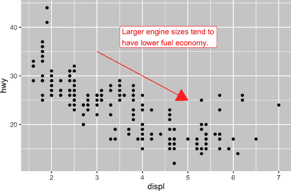
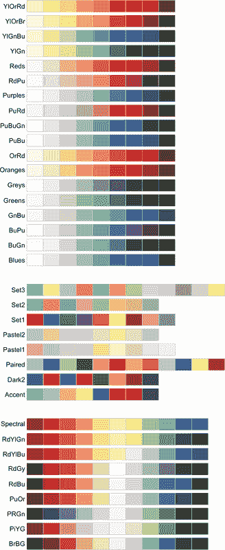
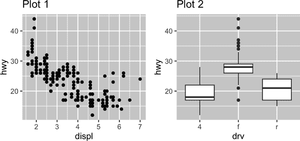

# 第十一章：传达

# 简介

在第十章中，您学习了如何将图表用作*探索*工具。在制作探索性图表时，您甚至在查看之前就知道图表将显示哪些变量。您为每个图表设定了特定目的，可以快速查看它，然后转移到下一个图表。在大多数分析过程中，您将生成数十甚至数百个图表，其中大多数立即被丢弃。

现在您了解了您的数据，需要*传达*给其他人您的理解。您的受众可能不会共享您的背景知识，也不会对数据深感兴趣。为了帮助他人快速建立起对数据的良好心理模型，您需要付出相当大的努力，使您的图形尽可能自解释。在本章中，您将学习到 ggplot2 提供的一些工具来实现这一点。

本章重点介绍创建优质图形所需的工具。我们假设您知道自己想要什么，只需知道如何做。因此，我们强烈建议将本章与一本优秀的通用可视化书籍配对。我们特别推荐阅读[*真实的艺术*](https://oreil.ly/QIr_w)，作者是阿尔伯特·开罗（New Riders）。它不会教授创建可视化图形的机制，而是专注于创建有效图形时需要考虑的内容。

## 先决条件

在本章中，我们再次专注于 ggplot2。我们还会使用一些 dplyr 进行数据操作；*scales*用于覆盖默认的间断、标签、转换和调色板；以及一些 ggplot2 扩展包，包括由卡米尔·斯洛维科夫斯基（Kamil Slowikowski）开发的[ggrepel](https://oreil.ly/IVSL4)和由托马斯·林·佩德森（Thomas Lin Pedersen）开发的[patchwork](https://oreil.ly/xWxVV)。不要忘记，如果您尚未安装这些包，您需要使用[`install.packages()`](https://rdrr.io/r/utils/install.packages.xhtml)来安装它们。

```
library(tidyverse)
library(scales)
library(ggrepel)
library(patchwork)
```

# 标签

将探索性图形转换为解释性图形的最简单方法是添加良好的标签。您可以使用[`labs()`](https://ggplot2.tidyverse.org/reference/labs.xhtml)函数添加标签：

```
ggplot(mpg, aes(x = displ, y = hwy)) +
  geom_point(aes(color = class)) +
  geom_smooth(se = FALSE) +
  labs(
    x = "Engine displacement (L)",
    y = "Highway fuel economy (mpg)",
    color = "Car type",
    title = "Fuel efficiency generally decreases with engine size",
    subtitle = "Two seaters (sports cars) are an exception because of their light weight",
    caption = "Data from fueleconomy.gov"
  )
```


图表标题的目的是总结主要发现。避免仅描述图表内容的标题，例如“引擎排量与燃油经济性的散点图”。

如果您需要添加更多文本，还有两个有用的标签：`subtitle` 在标题下方以较小的字体添加额外细节，`caption` 则在图的右下角添加文本，通常用于描述数据来源。您还可以使用 [`labs()`](https://ggplot2.tidyverse.org/reference/labs.xhtml) 替换坐标轴和图例标题。通常建议用更详细的描述替换简短的变量名，并包含单位。

可以使用数学方程替代文本字符串。只需将 `""` 替换为 [`quote()`](https://rdrr.io/r/base/substitute.xhtml)，并在 [`?plotmath`](https://rdrr.io/r/grDevices/plotmath.xhtml) 中了解可用选项：

```
df <- tibble(
  x = 1:10,
  y = cumsum(x²)
)

ggplot(df, aes(x, y)) +
  geom_point() +
  labs(
    x = quote(x[i]),
    y = quote(sum(x[i] ^ 2, i == 1, n))
  )
```


## 练习

1.  在燃油经济数据上创建一个图，自定义 `title`、`subtitle`、`caption`、`x`、`y` 和 `color` 标签。

1.  使用燃油经济数据重新创建以下图。请注意，点的颜色和形状都因驱动类型而异。

    

1.  取出您在上个月创建的探索性图形，并添加信息性标题，以便他人更容易理解。

# 注释

除了标记绘图的主要组件外，通常还有必要标记单个观察值或观察值组。您可以使用 [`geom_text()`](https://ggplot2.tidyverse.org/reference/geom_text.xhtml)。[`geom_text()`](https://ggplot2.tidyverse.org/reference/geom_text.xhtml) 类似于 [`geom_point()`](https://ggplot2.tidyverse.org/reference/geom_point.xhtml)，但具有额外的美学：`label`。这使得可以向绘图添加文本标签。

标签有两种可能的来源。首先，您可能有一个提供标签的 tibble。在以下图中，我们提取每种驱动类型中引擎尺寸最大的汽车，并将其信息保存为一个名为 `label_info` 的新数据框：

```
label_info <- mpg |>
  group_by(drv) |>
  arrange(desc(displ)) |>
  slice_head(n = 1) |>
  mutate(
    drive_type = case_when(
      drv == "f" ~ "front-wheel drive",
      drv == "r" ~ "rear-wheel drive",
      drv == "4" ~ "4-wheel drive"
    )
  ) |>
  select(displ, hwy, drv, drive_type)

label_info
#> # A tibble: 3 × 4
#> # Groups:   drv [3]
#>   displ   hwy drv   drive_type 
#>   <dbl> <int> <chr> <chr> 
#> 1   6.5    17 4     4-wheel drive 
#> 2   5.3    25 f     front-wheel drive
#> 3   7      24 r     rear-wheel drive
```

然后，我们使用这个新数据框直接标记三个组，以取代图例并直接放置在图上。使用 `fontface` 和 `size` 参数可以自定义文本标签的外观。它们比图上其余文本更大并加粗。(`theme(legend.position = "none"`) 关闭所有图例 — 我们将很快讨论更多内容。)

```
ggplot(mpg, aes(x = displ, y = hwy, color = drv)) +
  geom_point(alpha = 0.3) +
  geom_smooth(se = FALSE) +
  geom_text(
    data = label_info, 
    aes(x = displ, y = hwy, label = drive_type),
    fontface = "bold", size = 5, hjust = "right", vjust = "bottom"
  ) +
  theme(legend.position = "none")
#> `geom_smooth()` using method = 'loess' and formula = 'y ~ x'
```


注意使用 `hjust`（水平对齐）和 `vjust`（垂直对齐）来控制标签的对齐方式。

然而，我们刚刚制作的带注释的图表很难阅读，因为标签彼此重叠且与点重叠。我们可以使用 ggrepel 包中的[`geom_label_repel()`](https://rdrr.io/pkg/ggrepel/man/geom_text_repel.xhtml)函数来解决这两个问题。这个有用的包会自动调整标签，以避免重叠：

```
ggplot(mpg, aes(x = displ, y = hwy, color = drv)) +
  geom_point(alpha = 0.3) +
  geom_smooth(se = FALSE) +
  geom_label_repel(
    data = label_info, 
    aes(x = displ, y = hwy, label = drive_type),
    fontface = "bold", size = 5, nudge_y = 2
  ) +
  theme(legend.position = "none")
#> `geom_smooth()` using method = 'loess' and formula = 'y ~ x'
```


您还可以使用 ggrepel 包中的[`geom_text_repel()`](https://rdrr.io/pkg/ggrepel/man/geom_text_repel.xhtml)来突出显示图表上的某些点。注意这里使用的另一个有用技巧：我们添加了第二层大空心点以进一步突出标记点。

```
potential_outliers <- mpg |>
  filter(hwy > 40 | (hwy > 20 & displ > 5))

ggplot(mpg, aes(x = displ, y = hwy)) +
  geom_point() +
  geom_text_repel(data = potential_outliers, aes(label = model)) +
  geom_point(data = potential_outliers, color = "red") +
  geom_point(
    data = potential_outliers, 
    color = "red", size = 3, shape = "circle open"
  )
```


请记住，除了[`geom_text()`](https://ggplot2.tidyverse.org/reference/geom_text.xhtml)和[`geom_label()`](https://ggplot2.tidyverse.org/reference/geom_text.xhtml)，ggplot2 中还有许多其他 geoms 可用于帮助注释您的图表。一些想法：

+   使用[`geom_hline()`](https://ggplot2.tidyverse.org/reference/geom_abline.xhtml)和[`geom_vline()`](https://ggplot2.tidyverse.org/reference/geom_abline.xhtml)添加参考线。通常我们会将它们设置为粗线（`linewidth = 2`），白色（`color = white`），并在主数据层下绘制。这样可以使它们易于看见，而不会分散数据的注意力。

+   使用[`geom_rect()`](https://ggplot2.tidyverse.org/reference/geom_tile.xhtml)绘制围绕感兴趣点的矩形。矩形的边界由美学`xmin`、`xmax`、`ymin`和`ymax`定义。或者，可以查看[ggforce 包](https://oreil.ly/DZtL1)，特别是[`geom_mark_hull()`](https://ggforce.data-imaginist.com/reference/geom_mark_hull.xhtml)，它允许您使用凸包标注子集点。

+   使用[`geom_segment()`](https://ggplot2.tidyverse.org/reference/geom_segment.xhtml)和`arrow`参数来用箭头突出显示一个点。使用美学`x`和`y`定义起始位置，使用`xend`和`yend`定义结束位置。

添加注释到图表的另一个便捷函数是[`annotate()`](https://ggplot2.tidyverse.org/reference/annotate.xhtml)。一般而言，geoms 通常用于突出显示数据的子集，而[`annotate()`](https://ggplot2.tidyverse.org/reference/annotate.xhtml)则用于向图表添加一个或几个注释元素。

为了演示如何使用[`annotate()`](https://ggplot2.tidyverse.org/reference/annotate.xhtml)，让我们创建一些文本添加到我们的绘图中。文本有点长，所以我们将使用[`stringr::str_wrap()`](https://stringr.tidyverse.org/reference/str_wrap.xhtml)根据每行字符数自动添加换行符：

```
trend_text <- "Larger engine sizes tend to\nhave lower fuel economy." |>
  str_wrap(width = 30)
trend_text
#> [1] "Larger engine sizes tend to\nhave lower fuel economy."
```

然后，我们添加两层注释：一个使用标签 geom，另一个使用段 geom。两者中的`x`和`y`美学定义了注释的起始位置，而段注释中的`xend`和`yend`美学定义了段的结束位置。还请注意，该段被设计成箭头样式。

```
ggplot(mpg, aes(x = displ, y = hwy)) +
  geom_point() +
  annotate(
    geom = "label", x = 3.5, y = 38,
    label = trend_text,
    hjust = "left", color = "red"
  ) +
  annotate(
    geom = "segment",
    x = 3, y = 35, xend = 5, yend = 25, color = "red",
    arrow = arrow(type = "closed")
  )
```



注释是传达可视化主要观点和有趣特征的强大工具。唯一的限制是你的想象力（以及调整注释位置以美观地呈现的耐心）！

## 练习

1.  使用[`geom_text()`](https://ggplot2.tidyverse.org/reference/geom_text.xhtml)将文本放置在绘图的四个角落。

1.  使用[`annotate()`](https://ggplot2.tidyverse.org/reference/annotate.xhtml)在不需要创建 tibble 的情况下在最后一个绘图中添加一个点 geom。定制点的形状、大小或颜色。

1.  如何使用[`geom_text()`](https://ggplot2.tidyverse.org/reference/geom_text.xhtml)标签与分面互动？如何在单个分面中添加标签？如何在每个分面中放置不同的标签？（提示：考虑传递给[`geom_text()`](https://ggplot2.tidyverse.org/reference/geom_text.xhtml)的数据集。）

1.  控制背景框外观的[`geom_label()`](https://ggplot2.tidyverse.org/reference/geom_text.xhtml)的参数是什么？

1.  [`arrow()`](https://rdrr.io/r/grid/arrow.xhtml)的四个参数是什么？它们如何工作？创建一系列示例图来演示最重要的选项。

# 比例尺

第三种使图表更适合传达信息的方法是调整比例尺。比例尺控制美学映射在视觉上的表现方式。

## 默认比例尺

通常情况下，ggplot2 会自动为您添加比例尺。例如，当您输入：

```
ggplot(mpg, aes(x = displ, y = hwy)) +
  geom_point(aes(color = class))
```

ggplot2 在幕后自动添加默认比例尺：

```
ggplot(mpg, aes(x = displ, y = hwy)) +
  geom_point(aes(color = class)) +
  scale_x_continuous() +
  scale_y_continuous() +
  scale_color_discrete()
```

注意比例尺的命名方案：以`scale_`开头，然后是美学名称，接着是`_`，最后是比例尺名称。默认的比例尺根据其对齐的变量类型命名：连续型、离散型、日期时间型或日期型。[`scale_x_continuous()`](https://ggplot2.tidyverse.org/reference/scale_continuous.xhtml) 将`displ`的数值放置在 x 轴的连续数线上，[`scale_color_discrete()`](https://ggplot2.tidyverse.org/reference/scale_colour_discrete.xhtml) 为每个汽车`class`选择颜色等。还有许多非默认比例尺，接下来你将了解更多。

默认比例尺已经经过精心选择，以便为广泛的输入提供良好的效果。然而，由于两个原因你可能想要覆盖默认设置：

+   你可能想调整默认比例尺的一些参数。这使你可以做一些改变，比如更改轴上的刻度间断点或图例上的键标签。

+   你可能想完全替换比例尺并使用完全不同的算法。通常你可以优于默认设置，因为你对数据了解更多。

## 轴刻度和图例键

轴和图例总称为*guides*。轴用于`x`和`y`美学；图例用于其他所有内容。

有两个主要参数影响轴上刻度和图例上的键的外观：`breaks`和`labels`。`breaks`参数控制刻度的位置或与键相关联的值。`labels`参数控制与每个刻度/键关联的文本标签。最常见的`breaks`用法是覆盖默认选择：

```
ggplot(mpg, aes(x = displ, y = hwy, color = drv)) +
  geom_point() +
  scale_y_continuous(breaks = seq(15, 40, by = 5)) 
```


你可以以相同方式使用`labels`（一个与`breaks`长度相同的字符向量），但也可以将其设置为`NULL`以完全禁止标签。这对于地图或发布图表（不能共享绝对数字）非常有用。你还可以使用`breaks`和`labels`来控制图例的外观。对于分类变量的离散比例尺，`labels`可以是现有级别名称和所需标签的命名列表。

```
ggplot(mpg, aes(x = displ, y = hwy, color = drv)) +
  geom_point() +
  scale_x_continuous(labels = NULL) +
  scale_y_continuous(labels = NULL) +
  scale_color_discrete(labels = c("4" = "4-wheel", "f" = "front", "r" = "rear"))
```


`labels`参数与 scales 包中的标签函数结合使用，用于将数字格式化为货币、百分比等。左侧图显示了使用[`label_dollar()`](https://scales.r-lib.org/reference/label_dollar.xhtml)的默认标签，它添加了美元符号和千位分隔符逗号。右侧图通过将美元值除以 1,000 并添加后缀“K”（表示“千”），以及添加自定义刻度线进一步定制。请注意，`breaks`在原始数据的比例尺上。

```
# Left
ggplot(diamonds, aes(x = price, y = cut)) +
  geom_boxplot(alpha = 0.05) +
  scale_x_continuous(labels = label_dollar())

# Right
ggplot(diamonds, aes(x = price, y = cut)) +
  geom_boxplot(alpha = 0.05) +
  scale_x_continuous(
    labels = label_dollar(scale = 1/1000, suffix = "K"), 
    breaks = seq(1000, 19000, by = 6000)
  )
```


另一个方便的标签函数是[`label_percent()`](https://scales.r-lib.org/reference/label_percent.xhtml)：

```
ggplot(diamonds, aes(x = cut, fill = clarity)) +
  geom_bar(position = "fill") +
  scale_y_continuous(name = "Percentage", labels = label_percent())
```


当您的数据点较少且希望准确突出观察发生的位置时，`breaks`的另一个用途是。例如，以下图显示了每位美国总统任职的开始和结束时间：

```
presidential |>
  mutate(id = 33 + row_number()) |>
  ggplot(aes(x = start, y = id)) +
  geom_point() +
  geom_segment(aes(xend = end, yend = id)) +
  scale_x_date(name = NULL, breaks = presidential$start, date_labels = "'%y")
```


注意，对于`breaks`参数，我们将`start`变量作为一个向量从`presidential$start`中提取出来，因为我们无法对此参数进行美学映射。还要注意，日期和日期时间刻度的断点和标签规范略有不同：

+   `date_labels`采用与[`parse_datetime()`](https://readr.tidyverse.org/reference/parse_datetime.xhtml)相同格式规范。

+   `date_breaks`（此处未显示）接受像“2 days”或“1 month”这样的字符串。

## 图例布局

您最常使用`breaks`和`labels`来调整坐标轴。虽然它们也适用于图例，但您更有可能使用一些其他技术。

要控制图例的整体位置，需要使用[`theme()`](https://ggplot2.tidyverse.org/reference/theme.xhtml)设置。我们会在本章末尾回到主题，但简而言之，它们控制绘图的非数据部分。主题设置`legend.position`控制图例绘制位置：

```
base <- ggplot(mpg, aes(x = displ, y = hwy)) +
  geom_point(aes(color = class))

base + theme(legend.position = "right") # the default
base + theme(legend.position = "left")
base + 
  theme(legend.position = "top") +
  guides(col = guide_legend(nrow = 3))
base + 
  theme(legend.position = "bottom") +
  guides(col = guide_legend(nrow = 3))
```


如果您的图形短而宽，请将图例放置在顶部或底部；如果图形高而窄，请将图例放置在左侧或右侧。您还可以使用`legend.position = "none"`来完全隐藏图例的显示。

控制单个图例的显示，请使用[`guides()`](https://ggplot2.tidyverse.org/reference/guides.xhtml)，结合[`guide_legend()`](https://ggplot2.tidyverse.org/reference/guide_legend.xhtml)或[`guide_colorbar()`](https://ggplot2.tidyverse.org/reference/guide_colourbar.xhtml)。以下示例展示了两个重要设置：使用`nrow`控制图例使用的行数，以及覆盖一个美学元素使点变大。如果在图中使用了低`alpha`显示多个点，这尤其有用。

```
ggplot(mpg, aes(x = displ, y = hwy)) +
  geom_point(aes(color = class)) +
  geom_smooth(se = FALSE) +
  theme(legend.position = "bottom") +
  guides(color = guide_legend(nrow = 2, override.aes = list(size = 4)))
#> `geom_smooth()` using method = 'loess' and formula = 'y ~ x'
```


注意，在[`guides()`](https://ggplot2.tidyverse.org/reference/guides.xhtml)中的参数名与美学名字匹配，就像在[`labs()`](https://ggplot2.tidyverse.org/reference/labs.xhtml)中一样。

## 替换比例尺

而不仅仅是微调细节，您可以完全替换比例尺。您最有可能想要替换的两种比例尺是：连续位置比例尺和颜色比例尺。幸运的是，所有其他美学原则都适用于这些比例尺替换，因此一旦掌握了位置和颜色，您将能够快速掌握其他比例尺替换。

对您的变量进行转换是很有用的。例如，如果我们对`carat`和`price`进行对数转换，就更容易看到它们之间的精确关系：

```
# Left
ggplot(diamonds, aes(x = carat, y = price)) +
  geom_bin2d()

# Right
ggplot(diamonds, aes(x = log10(carat), y = log10(price))) +
  geom_bin2d()
```


然而，这种转换的缺点是轴现在标记为转换后的值，使得解释图形变得困难。与在美学映射中进行转换不同，我们可以使用比例尺进行转换。这在视觉上是相同的，只是轴标记在原始数据比例上。

```
ggplot(diamonds, aes(x = carat, y = price)) +
  geom_bin2d() + 
  scale_x_log10() + 
  scale_y_log10()
```


另一个经常定制的比例是颜色。默认的分类比例选择颜色均匀分布在色轮周围。有用的替代方案是 ColorBrewer 比例，这些比例经过手工调整，更适合普通类型的色盲人士。下面的两个图看起来相似，但红色和绿色的色调差异足够大，即使是红绿色盲的人也能区分右边的点。¹

```
ggplot(mpg, aes(x = displ, y = hwy)) +
  geom_point(aes(color = drv))

ggplot(mpg, aes(x = displ, y = hwy)) +
  geom_point(aes(color = drv)) +
  scale_color_brewer(palette = "Set1")
```


不要忘记更简单的技术来改善可访问性。如果只有几种颜色，您可以添加多余的形状映射。这也有助于确保您的图在黑白情况下也能被解读。

```
ggplot(mpg, aes(x = displ, y = hwy)) +
  geom_point(aes(color = drv, shape = drv)) +
  scale_color_brewer(palette = "Set1")
```


ColorBrewer 比例可以在[网上文档中查看](https://oreil.ly/LNHAy)，并通过 Erich Neuwirth 的 RColorBrewer 包在 R 中使用。图 11-1 展示了所有调色板的完整列表。顺序（顶部）和发散（底部）调色板特别适用于您的分类值有序或具有“中间”情况。如果您已使用[`cut()`](https://rdrr.io/r/base/cut.xhtml)将连续变量变成分类变量，这种情况经常发生。



###### 图 11-1\. 所有 ColorBrewer 比例。

当您有预定义的值与颜色之间的映射时，请使用[`scale_color_manual()`](https://ggplot2.tidyverse.org/reference/scale_manual.xhtml)。例如，如果我们将总统党派映射到颜色，我们希望使用标准的映射，即共和党人为红色，民主党人为蓝色。为分配这些颜色的一种方法是使用十六进制颜色代码：

```
presidential |>
  mutate(id = 33 + row_number()) |>
  ggplot(aes(x = start, y = id, color = party)) +
  geom_point() +
  geom_segment(aes(xend = end, yend = id)) +
  scale_color_manual(values = c(Republican = "#E81B23", Democratic = "#00AEF3"))
```


对于连续颜色，你可以使用内置的[`scale_color_gradient()`](https://ggplot2.tidyverse.org/reference/scale_gradient.xhtml)或者[`scale_fill_gradient()`](https://ggplot2.tidyverse.org/reference/scale_gradient.xhtml)。如果你有一个发散尺度，可以使用[`scale_color_gradient2()`](https://ggplot2.tidyverse.org/reference/scale_gradient.xhtml)。例如，这允许你给正负值赋予不同的颜色。有时候，这也非常有用，如果你想区分高于或低于平均值的点。

另一个选项是使用 viridis 颜色尺度。设计师 Nathaniel Smith 和 Stéfan van der Walt 精心设计了适合各种形式色盲人士感知的连续色彩方案，以及在彩色和黑白模式下都是感知均匀的尺度。这些尺度在 ggplot2 中作为连续(`c`)、离散(`d`)和分组(`b`)调色板可用。

```
df <- tibble(
  x = rnorm(10000),
  y = rnorm(10000)
)

ggplot(df, aes(x, y)) +
  geom_hex() +
  coord_fixed() +
  labs(title = "Default, continuous", x = NULL, y = NULL)

ggplot(df, aes(x, y)) +
  geom_hex() +
  coord_fixed() +
  scale_fill_viridis_c() +
  labs(title = "Viridis, continuous", x = NULL, y = NULL)

ggplot(df, aes(x, y)) +
  geom_hex() +
  coord_fixed() +
  scale_fill_viridis_b() +
  labs(title = "Viridis, binned", x = NULL, y = NULL)
```


注意所有颜色尺度都有两种变体：`scale_color_*()`和`scale_fill_*()`分别用于`color`和`fill`美学（颜色尺度在英国和美国拼写都可用）。

## 缩放

有三种控制绘图限制的方法：

+   调整绘制的数据

+   在每个尺度中设置限制

+   在[`coord_cartesian()`](https://ggplot2.tidyverse.org/reference/coord_cartesian.xhtml)中设置`xlim`和`ylim`。

我们将在一系列图中演示这些选项。左边的图显示了引擎尺寸与燃油效率之间的关系，按驱动类型着色。右边的图显示了相同的变量，但子集绘制的数据。子集数据影响了 x 和 y 轴的刻度以及平滑曲线。

```
# Left
ggplot(mpg, aes(x = displ, y = hwy)) +
  geom_point(aes(color = drv)) +
  geom_smooth()

# Right
mpg |>
  filter(displ >= 5 & displ <= 6 & hwy >= 10 & hwy <= 25) |>
  ggplot(aes(x = displ, y = hwy)) +
  geom_point(aes(color = drv)) +
  geom_smooth()
```


让我们将这些与下面的两个图进行比较，左边的图设置了各自刻度的`limits`，右边的图在[`coord_cartesian()`](https://ggplot2.tidyverse.org/reference/coord_cartesian.xhtml)中设置了它们。我们可以看到，减少限制等同于子集数据。因此，为了放大绘图区域，通常最好使用[`coord_cartesian()`](https://ggplot2.tidyverse.org/reference/coord_cartesian.xhtml)。

```
# Left
ggplot(mpg, aes(x = displ, y = hwy)) +
  geom_point(aes(color = drv)) +
  geom_smooth() +
  scale_x_continuous(limits = c(5, 6)) +
  scale_y_continuous(limits = c(10, 25))

# Right
ggplot(mpg, aes(x = displ, y = hwy)) +
  geom_point(aes(color = drv)) +
  geom_smooth() +
  coord_cartesian(xlim = c(5, 6), ylim = c(10, 25))
```


另一方面，如果要扩展限制（例如，使不同图形之间的比例尺匹配），则在单个比例尺上设置`limits`通常更有用。例如，如果我们提取两类汽车并分别绘制它们，由于三个比例尺（x 轴、y 轴和颜色美学）具有不同的范围，很难比较这些图形。

```
suv <- mpg |> filter(class == "suv")
compact <- mpg |> filter(class == "compact")

# Left
ggplot(suv, aes(x = displ, y = hwy, color = drv)) +
  geom_point()

# Right
ggplot(compact, aes(x = displ, y = hwy, color = drv)) +
  geom_point()
```


克服这个问题的一种方法是在多个图形之间共享比例尺，使用完整数据的`limits`训练比例尺。

```
x_scale <- scale_x_continuous(limits = range(mpg$displ))
y_scale <- scale_y_continuous(limits = range(mpg$hwy))
col_scale <- scale_color_discrete(limits = unique(mpg$drv))

# Left
ggplot(suv, aes(x = displ, y = hwy, color = drv)) +
  geom_point() +
  x_scale +
  y_scale +
  col_scale

# Right
ggplot(compact, aes(x = displ, y = hwy, color = drv)) +
  geom_point() +
  x_scale +
  y_scale +
  col_scale
```


在这种特定情况下，你可以简单地使用分面，但如果你想在报告的多个页面上分散绘图，这种技术通常也很有用。

## 练习

1.  为什么以下代码没有覆盖默认比例尺？

    ```
    df <- tibble(
      x = rnorm(10000),
      y = rnorm(10000)
    )

    ggplot(df, aes(x, y)) +
      geom_hex() +
      scale_color_gradient(low = "white", high = "red") +
      coord_fixed()
    ```

1.  每个比例尺的第一个参数是什么？它与[`labs()`](https://ggplot2.tidyverse.org/reference/labs.xhtml)有什么区别？

1.  更改总统任期的显示方法：

    1.  结合定制颜色和 x 轴分割的两个变体

    1.  改善 y 轴的显示

    1.  用总统姓名标记每个任期

    1.  添加信息丰富的图形标签

    1.  每隔四年设置分割点（这比看起来更复杂！）

1.  首先创建以下图形。然后，使用`override.aes`修改代码，以使图例更容易看到。

    ```
    ggplot(diamonds, aes(x = carat, y = price)) +
      geom_point(aes(color = cut), alpha = 1/20)
    ```

# 主题

最后，您可以使用主题定制图表的非数据元素：

```
ggplot(mpg, aes(x = displ, y = hwy)) +
  geom_point(aes(color = class)) +
  geom_smooth(se = FALSE) +
  theme_bw()
```


ggplot2 包含了八种主题，如 图 11-2 所示，其中 [`theme_gray()`](https://ggplot2.tidyverse.org/reference/ggtheme.xhtml) 是默认主题。² 还有许多其他主题包含在像 [ggthemes](https://oreil.ly/F1nga) 这样的附加包中，由 Jeffrey Arnold 提供。如果您想匹配特定的公司或期刊风格，您也可以创建自己的主题。


###### 图 11-2\. ggplot2 内置的八种主题。

您还可以控制每个主题的各个组件，例如用于 y 轴字体的大小和颜色。我们已经看到 `legend.position` 控制图例绘制的位置。还有许多其他图例的方面可以通过 [`theme()`](https://ggplot2.tidyverse.org/reference/theme.xhtml) 进行自定义。例如，在下面的图中，我们改变了图例的方向，并在其周围添加了黑色边框。请注意，主题的图例框和图表标题元素的自定义是使用 `element_*()` 函数完成的。这些函数指定非数据组件的样式；例如，标题文本在 [`element_text()`](https://ggplot2.tidyverse.org/reference/element.xhtml) 的 `face` 参数中加粗，图例边框颜色在 [`element_rect()`](https://ggplot2.tidyverse.org/reference/element.xhtml) 的 `color` 参数中定义。控制标题位置和说明的主题元素分别为 `plot.title.position` 和 `plot.caption.position`。在下面的图中，将它们设置为 `"plot"` 表示这些元素与整个图区对齐，而不是图面板（默认设置）。其他几个有用的 [`theme()`](https://ggplot2.tidyverse.org/reference/theme.xhtml) 组件用于更改标题和说明文本的格式和放置位置。

```
ggplot(mpg, aes(x = displ, y = hwy, color = drv)) +
  geom_point() +
  labs(
    title = "Larger engine sizes tend to have lower fuel economy",
    caption = "Source: https://fueleconomy.gov."
  ) +
  theme(
    legend.position = c(0.6, 0.7),
    legend.direction = "horizontal",
    legend.box.background = element_rect(color = "black"),
    plot.title = element_text(face = "bold"),
    plot.title.position = "plot",
    plot.caption.position = "plot",
    plot.caption = element_text(hjust = 0)
  )
```


要查看所有 [`theme()`](https://ggplot2.tidyverse.org/reference/theme.xhtml) 组件的概述，请参阅 [`?theme`](https://ggplot2.tidyverse.org/reference/theme.xhtml) 的帮助。此外，[ggplot2 书籍](https://oreil.ly/T4Jxn)也是获取主题详细信息的好地方。

## 练习

1.  选择 ggthemes 包提供的主题，并将其应用到您制作的最后一个图中。

1.  使您图的轴标签变为蓝色和粗体。

# 布局

到目前为止，我们讨论了如何创建和修改单个图。如果您有多个图想要以某种方式布局呢？patchwork 包允许您将单独的图合并到同一图形中。我们在本章前面加载了这个包。

要将两个图放置在一起，您可以简单地将它们添加到一起。请注意，您首先需要创建图并将它们保存为对象（在下面的示例中称为 `p1` 和 `p2`）。然后，您可以使用 `+` 将它们放置在一起。

```
p1 <- ggplot(mpg, aes(x = displ, y = hwy)) + 
  geom_point() + 
  labs(title = "Plot 1")
p2 <- ggplot(mpg, aes(x = drv, y = hwy)) + 
  geom_boxplot() + 
  labs(title = "Plot 2")
p1 + p2
```



在前面的代码块中，重要的是我们没有使用 patchwork 包的新功能。相反，该包向 `+` 操作符添加了新功能。

您还可以使用 patchwork 创建复杂的图形布局。在下面的示例中，`|` 将 `p1` 和 `p3` 并排放置，`/` 将 `p2` 移到下一行：

```
p3 <- ggplot(mpg, aes(x = cty, y = hwy)) + 
  geom_point() + 
  labs(title = "Plot 3")
(p1 | p3) / p2
```


此外，patchwork 还允许您将多个图的图例收集到一个共同的图例中，自定义图例的位置以及图的尺寸，并向您的图添加共同的标题、副标题、说明等。在这里，我们创建了五个图。我们关闭了箱线图和散点图的图例，并在图的顶部收集了密度图的图例，使用了 `& theme(legend.position = "top")`。请注意，这里使用的是 `&` 运算符，而不是通常的 `+`。这是因为我们要修改 patchwork 图的主题，而不是单个 ggplot 的主题。图例位于顶部，在 [`guide_area()`](https://patchwork.data-imaginist.com/reference/guide_area.xhtml) 内。最后，我们还自定义了 patchwork 的各个组件的高度——指南的高度为 1，箱线图为 3，密度图为 2，分面散点图为 4。Patchwork 使用此比例划分您为图分配的区域，并相应地放置组件。

```
p1 <- ggplot(mpg, aes(x = drv, y = cty, color = drv)) + 
  geom_boxplot(show.legend = FALSE) + 
  labs(title = "Plot 1")

p2 <- ggplot(mpg, aes(x = drv, y = hwy, color = drv)) + 
  geom_boxplot(show.legend = FALSE) + 
  labs(title = "Plot 2")

p3 <- ggplot(mpg, aes(x = cty, color = drv, fill = drv)) + 
  geom_density(alpha = 0.5) + 
  labs(title = "Plot 3")

p4 <- ggplot(mpg, aes(x = hwy, color = drv, fill = drv)) + 
  geom_density(alpha = 0.5) + 
  labs(title = "Plot 4")

p5 <- ggplot(mpg, aes(x = cty, y = hwy, color = drv)) + 
  geom_point(show.legend = FALSE) + 
  facet_wrap(~drv) +
  labs(title = "Plot 5")

(guide_area() / (p1 + p2) / (p3 + p4) / p5) +
  plot_annotation(
    title = "City and highway mileage for cars with different drivetrains",
    caption = "Source: https://fueleconomy.gov."
  ) +
  plot_layout(
    guides = "collect",
    heights = c(1, 3, 2, 4)
    ) &
  theme(legend.position = "top")
```


如果你想了解如何结合和布局多个图表，我们建议查阅[包网站](https://oreil.ly/xWxVV)上的指南。

## 练习

1.  如果你在以下图表布局中省略了括号会发生什么？你能解释为什么会发生这种情况吗？

    ```
    p1 <- ggplot(mpg, aes(x = displ, y = hwy)) + 
      geom_point() + 
      labs(title = "Plot 1")
    p2 <- ggplot(mpg, aes(x = drv, y = hwy)) + 
      geom_boxplot() + 
      labs(title = "Plot 2")
    p3 <- ggplot(mpg, aes(x = cty, y = hwy)) + 
      geom_point() + 
      labs(title = "Plot 3")

    (p1 | p2) / p3
    ```

使用前一练习中的三个图表，重新创建以下的 patchwork：


# 总结

在本章中，你学习了如何添加图表标签，如标题、副标题和说明，以及修改默认轴标签，使用注释添加信息文本到你的图表或突出显示特定数据点，定制轴标尺，以及改变图表的主题。你还学习了如何使用简单和复杂的图表布局将多个图表合并到单个图形中。

尽管你迄今已学习了如何制作许多不同类型的图表，并且如何使用各种技术进行定制，但我们仅仅触及了 ggplot2 能创造的冰山一角。如果你希望全面理解 ggplot2，我们建议阅读[*ggplot2: Elegant Graphics for Data Analysis*](https://oreil.ly/T4Jxn)（Springer）这本书。其他有用的资源包括 Winston Chang 的[*R Graphics Cookbook*](https://oreil.ly/CK_sd)（O’Reilly）以及 Claus Wilke 的[*Fundamentals of Data Visualization*](https://oreil.ly/uJRYK)（O’Reilly）。

¹ 你可以使用像[SimDaltonism](https://oreil.ly/i11yd)这样的工具来模拟色盲，以测试这些图像。

² 许多人想知道为什么默认主题有灰色背景。这是一个有意为之的选择，因为它突出了数据，同时使网格线可见。白色网格线是可见的（这很重要，因为它们显著地帮助位置判断），但它们在视觉上影响较小，我们可以轻松忽略它们。灰色背景使得绘图与文本的排版颜色相似，确保图形与文档流畅融合，而不是用明亮的白色背景突兀地跳出来。最后，灰色背景形成了连续的色彩场，确保绘图被感知为一个单一的视觉实体。
