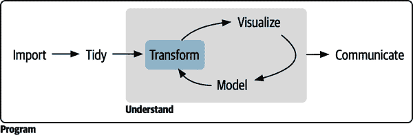

# 第三部分： 转换

本书的第二部分是对数据可视化的深入探讨。在本书的这一部分中，你将了解到数据框中遇到的最重要的变量类型，并学习可以用来处理它们的工具。

###### 图 III-1. 数据转换选项取决于涉及的数据类型，这本书的重点部分。

你可以按需阅读这些章节；它们被设计为基本上是独立的，因此可以无需顺序阅读。

+   第十二章教你逻辑向量。这些是最简单的向量类型，但它们非常强大。你将学习如何使用数值比较创建它们，如何用布尔代数组合它们，如何在摘要中使用它们，以及如何在条件转换中使用它们。

+   第十三章深入探讨了数字向量的工具，数据科学的核心。你将学到更多关于计数以及一些重要的转换和摘要函数。

+   第十四章提供了处理字符串的工具：你将切割它们，你将切块它们，你将它们重新组合在一起。本章主要关注 stringr 包，但你也将学习一些更多 tidyr 函数，专门用于从字符字符串中提取数据。

+   第十五章向你介绍了正则表达式，这是一个强大的字符串操作工具。本章将带你从认为键盘上走过一只猫的感觉，到读写复杂的字符串模式。

+   第十六章介绍了因子：R 用来存储分类数据的数据类型。当一个变量具有一组固定的可能值或者当你想要使用字符串的非字母顺序时，你使用因子。

+   第十七章提供了处理日期和日期时间的关键工具。不幸的是，你学习的日期时间越多，它们似乎就越复杂，但是有了 lubridate 包的帮助，你将学会如何克服最常见的挑战。

+   第十八章深入讨论了缺失值。我们之前在若干场合中讨论过它们，但现在是全面讨论的时候了，帮助你理解隐式和显式缺失值之间的区别，以及为什么以及如何在它们之间转换。

+   第十九章结束了本书的这一部分，为你提供了将两个（或更多）数据框连接在一起的工具。学习连接将促使你理解关键的概念，并考虑如何在数据集中识别每一行。
