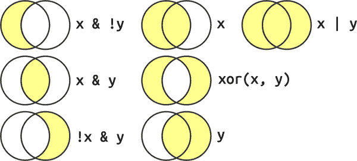

# 第十二章：逻辑向量

# 介绍

在本章中，您将学习处理逻辑向量的工具。逻辑向量是最简单的向量类型，因为每个元素只能是三个可能值之一：`TRUE`、`FALSE`和`NA`。在原始数据中找到逻辑向量相对较少，但在几乎每次分析过程中，您都会创建和操作它们。

我们将从讨论创建逻辑向量的最常见方法开始：使用数字比较。然后，您将了解如何使用布尔代数来组合不同的逻辑向量，以及一些有用的摘要。我们将以[`if_else()`](https://dplyr.tidyverse.org/reference/if_else.xhtml)和[`case_when()`](https://dplyr.tidyverse.org/reference/case_when.xhtml)两个使用逻辑向量进行条件更改的实用函数结束。

## 先决条件

您将在本章学习的大多数函数由基本 R 提供，因此我们不需要 tidyverse，但仍将加载它以便使用[`mutate()`](https://dplyr.tidyverse.org/reference/mutate.xhtml)、[`filter()`](https://dplyr.tidyverse.org/reference/filter.xhtml)和其伙伴处理数据框。我们还将继续从[`nycflights13::flights`](https://rdrr.io/pkg/nycflights13/man/flights.xhtml)数据集中提取示例。

```
library(tidyverse)
library(nycflights13)
```

然而，随着我们开始涵盖更多工具，就不会总是有一个完美的实际示例。因此，我们将开始使用[`c()`](https://rdrr.io/r/base/c.xhtml)创建一些虚拟数据：

```
x <- c(1, 2, 3, 5, 7, 11, 13)
x * 2
#> [1]  2  4  6 10 14 22 26
```

这样做可以更轻松地解释单个函数，但代价是更难看到它如何适用于您的数据问题。只需记住，我们对自由浮动向量进行的任何操作，您都可以通过[`mutate()`](https://dplyr.tidyverse.org/reference/mutate.xhtml)和其伙伴在数据框中对变量执行相同的操作。

```
df <- tibble(x)
df |> 
  mutate(y = x *  2)
#> # A tibble: 7 × 2
#>       x     y
#>   <dbl> <dbl>
#> 1     1     2
#> 2     2     4
#> 3     3     6
#> 4     5    10
#> 5     7    14
#> 6    11    22
#> # … with 1 more row
```

# 比较

创建逻辑向量的常见方法是通过与`<`、`<=`、`>`、`>=`、`!=`和`==`的数字比较。到目前为止，我们主要在[`filter()`](https://dplyr.tidyverse.org/reference/filter.xhtml)内部临时创建逻辑变量——它们被计算、使用，然后丢弃。例如，以下过滤器找到所有准时到达的白天出发航班：

```
flights |> 
  filter(dep_time > 600 & dep_time < 2000 & abs(arr_delay) < 20)
#> # A tibble: 172,286 × 19
#>    year month   day dep_time sched_dep_time dep_delay arr_time sched_arr_time
#>   <int> <int> <int>    <int>          <int>     <dbl>    <int>          <int>
#> 1  2013     1     1      601            600         1      844            850
#> 2  2013     1     1      602            610        -8      812            820
#> 3  2013     1     1      602            605        -3      821            805
#> 4  2013     1     1      606            610        -4      858            910
#> 5  2013     1     1      606            610        -4      837            845
#> 6  2013     1     1      607            607         0      858            915
#> # … with 172,280 more rows, and 11 more variables: arr_delay <dbl>,
#> #   carrier <chr>, flight <int>, tailnum <chr>, origin <chr>, dest <chr>, …
```

了解这是一个快捷方式是有用的，您可以使用[`mutate()`](https://dplyr.tidyverse.org/reference/mutate.xhtml)显式创建底层逻辑变量：

```
flights |> 
  mutate(
    daytime = dep_time > 600 & dep_time < 2000,
    approx_ontime = abs(arr_delay) < 20,
    .keep = "used"
  )
#> # A tibble: 336,776 × 4
#>   dep_time arr_delay daytime approx_ontime
#>      <int>     <dbl> <lgl>   <lgl> 
#> 1      517        11 FALSE   TRUE 
#> 2      533        20 FALSE   FALSE 
#> 3      542        33 FALSE   FALSE 
#> 4      544       -18 FALSE   TRUE 
#> 5      554       -25 FALSE   FALSE 
#> 6      554        12 FALSE   TRUE 
#> # … with 336,770 more rows
```

这对于更复杂的逻辑特别有用，因为命名中间步骤使您能够更轻松地阅读代码并检查每个步骤是否已正确计算。

总之，初始过滤相当于以下操作：

```
flights |> 
  mutate(
    daytime = dep_time > 600 & dep_time < 2000,
    approx_ontime = abs(arr_delay) < 20,
  ) |> 
  filter(daytime & approx_ontime)
```

## 浮点数比较

谨防使用`==`与数字。例如，看起来这个向量包含数字 1 和 2：

```
x <- c(1 / 49 * 49, sqrt(2) ^ 2)
x
#> [1] 1 2
```

但是，如果您将它们进行相等性测试，将会得到`FALSE`：

```
x == c(1, 2)
#> [1] FALSE FALSE
```

发生了什么？计算机以固定的小数位数存储数字，所以无法精确表示 1/49 或 `sqrt(2)`，随后的计算将会稍微偏离。我们可以通过调用 [`print()`](https://rdrr.io/r/base/print.xhtml) 并使用 `digits`¹ 参数来查看精确值：

```
print(x, digits = 16)
#> [1] 0.9999999999999999 2.0000000000000004
```

你可以看到为什么 R 默认四舍五入这些数字；它们确实非常接近你所期望的值。

现在你已经看到为什么 `==` 失败了，你能做些什么？一种选择是使用 [`dplyr::near()`](https://dplyr.tidyverse.org/reference/near.xhtml)，它忽略小差异：

```
near(x, c(1, 2))
#> [1] TRUE TRUE
```

## 缺失值

缺失值代表未知，因此它们是“传染性”的：几乎任何涉及未知值的操作也将是未知的：

```
NA > 5
#> [1] NA
10 == NA
#> [1] NA
```

最令人困惑的结果是这个：

```
NA == NA
#> [1] NA
```

如果我们人为地提供一点更多的上下文，就可以更容易理解这是为什么：

```
# We don't know how old Mary is
age_mary <- NA

# We don't know how old John is
age_john <- NA

# Are Mary and John the same age?
age_mary == age_john
#> [1] NA
# We don't know!
```

因此，如果你想找到所有 `dep_time` 缺失的航班，下面的代码不起作用，因为 `dep_time == NA` 会对每一行都返回 `NA`，而 [`filter()`](https://dplyr.tidyverse.org/reference/filter.xhtml) 会自动丢弃缺失值：

```
flights |> 
  filter(dep_time == NA)
#> # A tibble: 0 × 19
#> # … with 19 variables: year <int>, month <int>, day <int>, dep_time <int>,
#> #   sched_dep_time <int>, dep_delay <dbl>, arr_time <int>, …
```

相反，我们需要一个新的工具：[`is.na()`](https://rdrr.io/r/base/NA.xhtml)。

## is.na()

`is.na(x)` 适用于任何类型的向量，并返回缺失值为 `TRUE`，其他值为 `FALSE`：

```
is.na(c(TRUE, NA, FALSE))
#> [1] FALSE  TRUE FALSE
is.na(c(1, NA, 3))
#> [1] FALSE  TRUE FALSE
is.na(c("a", NA, "b"))
#> [1] FALSE  TRUE FALSE
```

我们可以使用 [`is.na()`](https://rdrr.io/r/base/NA.xhtml) 找到所有具有缺失 `dep_time` 的行：

```
flights |> 
  filter(is.na(dep_time))
#> # A tibble: 8,255 × 19
#>    year month   day dep_time sched_dep_time dep_delay arr_time sched_arr_time
#>   <int> <int> <int>    <int>          <int>     <dbl>    <int>          <int>
#> 1  2013     1     1       NA           1630        NA       NA           1815
#> 2  2013     1     1       NA           1935        NA       NA           2240
#> 3  2013     1     1       NA           1500        NA       NA           1825
#> 4  2013     1     1       NA            600        NA       NA            901
#> 5  2013     1     2       NA           1540        NA       NA           1747
#> 6  2013     1     2       NA           1620        NA       NA           1746
#> # … with 8,249 more rows, and 11 more variables: arr_delay <dbl>,
#> #   carrier <chr>, flight <int>, tailnum <chr>, origin <chr>, dest <chr>, …
```

[`is.na()`](https://rdrr.io/r/base/NA.xhtml) 在 [`arrange()`](https://dplyr.tidyverse.org/reference/arrange.xhtml) 中也很有用。[`arrange()`](https://dplyr.tidyverse.org/reference/arrange.xhtml) 通常将所有缺失值放在最后，但你可以通过首先按 [`is.na()`](https://rdrr.io/r/base/NA.xhtml) 排序来覆盖此默认行为：

```
flights |> 
  filter(month == 1, day == 1) |> 
  arrange(dep_time)
#> # A tibble: 842 × 19
#>    year month   day dep_time sched_dep_time dep_delay arr_time sched_arr_time
#>   <int> <int> <int>    <int>          <int>     <dbl>    <int>          <int>
#> 1  2013     1     1      517            515         2      830            819
#> 2  2013     1     1      533            529         4      850            830
#> 3  2013     1     1      542            540         2      923            850
#> 4  2013     1     1      544            545        -1     1004           1022
#> 5  2013     1     1      554            600        -6      812            837
#> 6  2013     1     1      554            558        -4      740            728
#> # … with 836 more rows, and 11 more variables: arr_delay <dbl>,
#> #   carrier <chr>, flight <int>, tailnum <chr>, origin <chr>, dest <chr>, …

flights |> 
  filter(month == 1, day == 1) |> 
  arrange(desc(is.na(dep_time)), dep_time)
#> # A tibble: 842 × 19
#>    year month   day dep_time sched_dep_time dep_delay arr_time sched_arr_time
#>   <int> <int> <int>    <int>          <int>     <dbl>    <int>          <int>
#> 1  2013     1     1       NA           1630        NA       NA           1815
#> 2  2013     1     1       NA           1935        NA       NA           2240
#> 3  2013     1     1       NA           1500        NA       NA           1825
#> 4  2013     1     1       NA            600        NA       NA            901
#> 5  2013     1     1      517            515         2      830            819
#> 6  2013     1     1      533            529         4      850            830
#> # … with 836 more rows, and 11 more variables: arr_delay <dbl>,
#> #   carrier <chr>, flight <int>, tailnum <chr>, origin <chr>, dest <chr>, …
```

我们将在 第十八章 中更深入地讨论缺失值。

## 练习

1.  [`dplyr::near()`](https://dplyr.tidyverse.org/reference/near.xhtml) 是如何工作的？输入 `near` 查看源代码。`sqrt(2)²` 是否接近于 2？

1.  使用 [`mutate()`](https://dplyr.tidyverse.org/reference/mutate.xhtml)，[`is.na()`](https://rdrr.io/r/base/NA.xhtml)，和 [`count()`](https://dplyr.tidyverse.org/reference/count.xhtml) 一起描述 `dep_time`，`sched_dep_time`，和 `dep_delay` 中缺失值的关联。

# 布尔代数

一旦你有了多个逻辑向量，你可以使用布尔代数将它们组合起来。在 R 中，`&` 表示“与”，`|` 表示“或”，`!` 表示“非”，而 [`xor()`](https://rdrr.io/r/base/Logic.xhtml) 是异或运算。² 例如，`df |> filter(!is.na(x))` 找到所有 `x` 不缺失的行，而 `df |> filter(x < -10 | x > 0)` 找到所有 `x` 小于 -10 或大于 0 的行。图 12-1 显示了完整的布尔操作集合及其工作原理。



###### 图 12-1\. 完整的布尔运算集合。`x` 是左圆圈，`y` 是右圆圈，阴影区域显示了每个运算符选择的部分。

除了 `&` 和 `|` 外，R 还有 `&&` 和 `||`。不要在 dplyr 函数中使用它们！这些被称为 *短路操作符*，只会返回一个单一的 `TRUE` 或 `FALSE`。它们对编程很重要，但不适合数据科学。

## 缺失值

布尔代数中缺失值的规则有点难以解释，因为乍看起来似乎不一致：

```
df <- tibble(x = c(TRUE, FALSE, NA))

df |> 
  mutate(
    and = x & NA,
    or = x | NA
  )
#> # A tibble: 3 × 3
#>   x     and   or 
#>   <lgl> <lgl> <lgl>
#> 1 TRUE  NA    TRUE 
#> 2 FALSE FALSE NA 
#> 3 NA    NA    NA
```

要理解发生了什么，请考虑 `NA | TRUE`。逻辑向量中的缺失值意味着该值可以是 `TRUE` 或 `FALSE`。`TRUE | TRUE` 和 `FALSE | TRUE` 都是 `TRUE`，因为至少其中一个是 `TRUE`。因此 `NA | TRUE` 也必须是 `TRUE`，因为 `NA` 可以是 `TRUE` 或 `FALSE`。然而，`NA | FALSE` 是 `NA`，因为我们不知道 `NA` 是 `TRUE` 还是 `FALSE`。类似的推理也适用于 `NA & FALSE`。

## 操作顺序

注意操作顺序与英语不同。考虑以下代码，找到所有在十一月或十二月出发的航班：

```
flights |> 
   filter(month == 11 | month == 12)
```

你可能会倾向于像用英语说的那样写：“找到所有在十一月或十二月出发的航班”：

```
flights |> 
   filter(month == 11 | 12)
#> # A tibble: 336,776 × 19
#>    year month   day dep_time sched_dep_time dep_delay arr_time sched_arr_time
#>   <int> <int> <int>    <int>          <int>     <dbl>    <int>          <int>
#> 1  2013     1     1      517            515         2      830            819
#> 2  2013     1     1      533            529         4      850            830
#> 3  2013     1     1      542            540         2      923            850
#> 4  2013     1     1      544            545        -1     1004           1022
#> 5  2013     1     1      554            600        -6      812            837
#> 6  2013     1     1      554            558        -4      740            728
#> # … with 336,770 more rows, and 11 more variables: arr_delay <dbl>,
#> #   carrier <chr>, flight <int>, tailnum <chr>, origin <chr>, dest <chr>, …
```

这段代码没有错误，但似乎也没有起作用。出了什么问题？在这里，R 首先评估 `month == 11` 创建一个逻辑向量，我们称之为 `nov`。它计算 `nov | 12`。当你在逻辑运算符中使用一个数字时，除了 0 外的所有内容都会转换为 `TRUE`，因此这相当于 `nov | TRUE`，这将始终为 `TRUE`，因此每一行都将被选中：

```
flights |> 
  mutate(
    nov = month == 11,
    final = nov | 12,
    .keep = "used"
  )
#> # A tibble: 336,776 × 3
#>   month nov   final
#>   <int> <lgl> <lgl>
#> 1     1 FALSE TRUE 
#> 2     1 FALSE TRUE 
#> 3     1 FALSE TRUE 
#> 4     1 FALSE TRUE 
#> 5     1 FALSE TRUE 
#> 6     1 FALSE TRUE 
#> # … with 336,770 more rows
```

## %in%

避免在正确顺序中使用 `==` 和 `|` 的简单方法是使用 `%in%`。`x %in% y` 返回与 `x` 相同长度的逻辑向量，只要 `x` 中的值在 `y` 中的任何位置，就为 `TRUE`。

```
1:12 %in% c(1, 5, 11)
#>  [1]  TRUE FALSE FALSE FALSE  TRUE FALSE FALSE FALSE FALSE FALSE  TRUE FALSE
letters[1:10] %in% c("a", "e", "i", "o", "u")
#>  [1]  TRUE FALSE FALSE FALSE  TRUE FALSE FALSE FALSE  TRUE FALSE
```

所以要找到所有在十一月和十二月出发的航班，我们可以写成：

```
flights |> 
  filter(month %in% c(11, 12))
```

注意 `%in%` 在处理 `NA` 时与 `==` 有不同的规则，因为 `NA %in% NA` 结果为 `TRUE`。

```
c(1, 2, NA) == NA
#> [1] NA NA NA
c(1, 2, NA) %in% NA
#> [1] FALSE FALSE  TRUE
```

这可以作为一个有用的快捷方式：

```
flights |> 
  filter(dep_time %in% c(NA, 0800))
#> # A tibble: 8,803 × 19
#>    year month   day dep_time sched_dep_time dep_delay arr_time sched_arr_time
#>   <int> <int> <int>    <int>          <int>     <dbl>    <int>          <int>
#> 1  2013     1     1      800            800         0     1022           1014
#> 2  2013     1     1      800            810       -10      949            955
#> 3  2013     1     1       NA           1630        NA       NA           1815
#> 4  2013     1     1       NA           1935        NA       NA           2240
#> 5  2013     1     1       NA           1500        NA       NA           1825
#> 6  2013     1     1       NA            600        NA       NA            901
#> # … with 8,797 more rows, and 11 more variables: arr_delay <dbl>,
#> #   carrier <chr>, flight <int>, tailnum <chr>, origin <chr>, dest <chr>, …
```

## 练习

1.  查找所有 `arr_delay` 缺失但 `dep_delay` 不缺失的航班。查找所有 `arr_time` 和 `sched_arr_time` 都不缺失，但 `arr_delay` 缺失的航班。

1.  有多少个航班的 `dep_time` 缺失？这些行中还有哪些变量缺失？这些行可能代表什么？

1.  假设缺失的 `dep_time` 表示航班取消，看一看每天取消的航班数。是否存在某种模式？取消航班的比例与非取消航班的平均延误之间是否有联系？

# 摘要

下面的章节描述了一些有用的逻辑向量摘要技术。除了专门用于逻辑向量的函数外，还可以使用适用于数值向量的函数。

## 逻辑摘要

主要有两种逻辑摘要：[`any()`](https://rdrr.io/r/base/any.xhtml) 和 [`all()`](https://rdrr.io/r/base/all.xhtml)。`any(x)` 相当于 `|`；如果 `x` 中有任何 `TRUE`，则返回 `TRUE`。`all(x)` 相当于 `&`；只有当 `x` 的所有值都是 `TRUE` 时才返回 `TRUE`。与所有摘要函数一样，如果存在任何缺失值，它们会返回 `NA`，通常你可以通过 `na.rm = TRUE` 来处理缺失值。

例如，我们可以使用 [`all()`](https://rdrr.io/r/base/all.xhtml) 和 [`any()`](https://rdrr.io/r/base/any.xhtml) 来查找是否每次航班的出发都延误不超过一小时，或者是否有航班的到达延误超过五小时。通过 [`group_by()`](https://dplyr.tidyverse.org/reference/group_by.xhtml) 允许我们按天来做到这一点：

```
flights |> 
  group_by(year, month, day) |> 
  summarize(
    all_delayed = all(dep_delay <= 60, na.rm = TRUE),
    any_long_delay = any(arr_delay >= 300, na.rm = TRUE),
    .groups = "drop"
  )
#> # A tibble: 365 × 5
#>    year month   day all_delayed any_long_delay
#>   <int> <int> <int> <lgl>       <lgl> 
#> 1  2013     1     1 FALSE       TRUE 
#> 2  2013     1     2 FALSE       TRUE 
#> 3  2013     1     3 FALSE       FALSE 
#> 4  2013     1     4 FALSE       FALSE 
#> 5  2013     1     5 FALSE       TRUE 
#> 6  2013     1     6 FALSE       FALSE 
#> # … with 359 more rows
```

在大多数情况下，[`any()`](https://rdrr.io/r/base/any.xhtml) 和 [`all()`](https://rdrr.io/r/base/all.xhtml) 太过粗糙，希望能够更详细地了解有多少值是 `TRUE` 或 `FALSE`。这引导我们进入了数值摘要的领域。

## 逻辑向量的数值摘要

当你在数值上下文中使用逻辑向量时，`TRUE` 变为 1，`FALSE` 变为 0。这使得 [`sum()`](https://rdrr.io/r/base/sum.xhtml) 和 [`mean()`](https://rdrr.io/r/base/mean.xhtml) 在逻辑向量中非常有用，因为 `sum(x)` 给出了 `TRUE` 的数量，`mean(x)` 给出了 `TRUE` 的比例（因为 [`mean()`](https://rdrr.io/r/base/mean.xhtml) 只是 [`sum()`](https://rdrr.io/r/base/sum.xhtml) 除以 [`length()`](https://rdrr.io/r/base/length.xhtml)）。

例如，这使我们可以查看在出发延误不超过一小时的航班中延误比例以及到达延误超过五小时的航班数量：

```
flights |> 
  group_by(year, month, day) |> 
  summarize(
    all_delayed = mean(dep_delay <= 60, na.rm = TRUE),
    any_long_delay = sum(arr_delay >= 300, na.rm = TRUE),
    .groups = "drop"
  )
#> # A tibble: 365 × 5
#>    year month   day all_delayed any_long_delay
#>   <int> <int> <int>       <dbl>          <int>
#> 1  2013     1     1       0.939              3
#> 2  2013     1     2       0.914              3
#> 3  2013     1     3       0.941              0
#> 4  2013     1     4       0.953              0
#> 5  2013     1     5       0.964              1
#> 6  2013     1     6       0.959              0
#> # … with 359 more rows
```

## 逻辑子集

逻辑向量在摘要中还有一种最终用途：你可以使用逻辑向量来过滤感兴趣的子集中的单个变量。这利用了基本的 ``（子集）运算符，你可以在 [“使用 `[` 选择多个元素” 中了解更多相关内容。

假设我们想要查看实际延误的航班的平均延误时间。一种方法是首先筛选航班，然后计算平均延误：

```
flights |> 
  filter(arr_delay > 0) |> 
  group_by(year, month, day) |> 
  summarize(
    behind = mean(arr_delay),
    n = n(),
    .groups = "drop"
  )
#> # A tibble: 365 × 5
#>    year month   day behind     n
#>   <int> <int> <int>  <dbl> <int>
#> 1  2013     1     1   32.5   461
#> 2  2013     1     2   32.0   535
#> 3  2013     1     3   27.7   460
#> 4  2013     1     4   28.3   297
#> 5  2013     1     5   22.6   238
#> 6  2013     1     6   24.4   381
#> # … with 359 more rows
```

这有效，但如果我们想要计算提前到达的航班的平均延误呢？我们需要执行一个单独的过滤步骤，然后找出如何将两个数据框合并在一起。³ 相反，您可以使用`[`来执行内联过滤：`arr_delay[arr_delay > 0]`将仅产生正到达延误。

这导致：

```
flights |> 
  group_by(year, month, day) |> 
  summarize(
    behind = mean(arr_delay[arr_delay > 0], na.rm = TRUE),
    ahead = mean(arr_delay[arr_delay < 0], na.rm = TRUE),
    n = n(),
    .groups = "drop"
  )
#> # A tibble: 365 × 6
#>    year month   day behind ahead     n
#>   <int> <int> <int>  <dbl> <dbl> <int>
#> 1  2013     1     1   32.5 -12.5   842
#> 2  2013     1     2   32.0 -14.3   943
#> 3  2013     1     3   27.7 -18.2   914
#> 4  2013     1     4   28.3 -17.0   915
#> 5  2013     1     5   22.6 -14.0   720
#> 6  2013     1     6   24.4 -13.6   832
#> # … with 359 more rows
```

还要注意群组大小的差异：在第一个块中，[`n()`](https://dplyr.tidyverse.org/reference/context.xhtml)给出每天延误航班的数量；在第二个块中，[`n()`](https://dplyr.tidyverse.org/reference/context.xhtml)给出总航班数。

## 练习

1.  `sum(is.na(x))`告诉你什么？`mean(is.na(x))`又会告诉你什么？

1.  当应用于逻辑向量时，[`prod()`](https://rdrr.io/r/base/prod.xhtml)返回什么？它等同于哪个逻辑汇总函数？当应用于逻辑向量时，[`min()`](https://rdrr.io/r/base/Extremes.xhtml)返回什么？它等同于哪个逻辑汇总函数？阅读文档并进行一些实验。

# 条件转换

逻辑向量最强大的特性之一是它们在条件变换中的使用，即针对条件 x 执行一件事，针对条件 y 执行另一件事。有两个重要的工具可以做到这一点：[`if_else()`](https://dplyr.tidyverse.org/reference/if_else.xhtml) 和 [`case_when()`](https://dplyr.tidyverse.org/reference/case_when.xhtml)。

## if_else()

如果你想要在条件为`TRUE`时使用一个值，在条件为`FALSE`时使用另一个值，你可以使用[`dplyr::if_else()`](https://dplyr.tidyverse.org/reference/if_else.xhtml)。⁴ 你总是会使用[`if_else()`](https://dplyr.tidyverse.org/reference/if_else.xhtml)的前三个参数。第一个参数`condition`是一个逻辑向量；第二个参数`true`在条件为真时输出；第三个参数`false`在条件为假时输出。

让我们从一个简单的例子开始，将数值向量标记为“+ve”（正数）或“-ve”（负数）：

```
x <- c(-3:3, NA)
if_else(x > 0, "+ve", "-ve")
#> [1] "-ve" "-ve" "-ve" "-ve" "+ve" "+ve" "+ve" NA
```

有一个可选的第四个参数，`missing`，如果输入为`NA`，将会使用它：

```
if_else(x > 0, "+ve", "-ve", "???")
#> [1] "-ve" "-ve" "-ve" "-ve" "+ve" "+ve" "+ve" "???"
```

你也可以使用向量作为`true`和`false`参数。例如，这使我们能够创建[`abs()`](https://rdrr.io/r/base/MathFun.xhtml)的最小实现：

```
if_else(x < 0, -x, x)
#> [1]  3  2  1  0  1  2  3 NA
```

到目前为止，所有参数都使用了相同的向量，但你当然可以混合和匹配。例如，您可以像这样实现[`coalesce()`](https://dplyr.tidyverse.org/reference/coalesce.xhtml)的简单版本：

```
x1 <- c(NA, 1, 2, NA)
y1 <- c(3, NA, 4, 6)
if_else(is.na(x1), y1, x1)
#> [1] 3 1 2 6
```

您可能已经注意到我们先前标记示例中的一个小错误：零既不是正数也不是负数。我们可以通过添加额外的[`if_else()`](https://dplyr.tidyverse.org/reference/if_else.xhtml)来解决这个问题：

```
if_else(x == 0, "0", if_else(x < 0, "-ve", "+ve"), "???")
#> [1] "-ve" "-ve" "-ve" "0"   "+ve" "+ve" "+ve" "???"
```

这已经有点难以阅读了，你可以想象如果有更多条件，阅读起来将变得更加困难。相反，你可以切换到[`dplyr::case_when()`](https://dplyr.tidyverse.org/reference/case_when.xhtml)。

## case_when()

dplyr 的[`case_when()`](https://dplyr.tidyverse.org/reference/case_when.xhtml)受 SQL 的`CASE`语句启发，并提供了一种灵活的方式根据不同条件执行不同的计算。它有一个特殊的语法，不幸的是看起来与 tidyverse 中的其他内容完全不同。它接受看起来像`condition ~ output`的成对输入。`condition`必须是一个逻辑向量；当它为`TRUE`时，将使用`output`。

这意味着我们可以将之前嵌套的[`if_else()`](https://dplyr.tidyverse.org/reference/if_else.xhtml)重新创建如下：

```
x <- c(-3:3, NA)
case_when(
  x == 0   ~ "0",
  x < 0    ~ "-ve", 
  x > 0    ~ "+ve",
  is.na(x) ~ "???"
)
#> [1] "-ve" "-ve" "-ve" "0"   "+ve" "+ve" "+ve" "???"
```

这是更多的代码，但也更加明确。

为了解释[`case_when()`](https://dplyr.tidyverse.org/reference/case_when.xhtml)的工作原理，让我们探索一些更简单的情况。如果没有一种情况匹配，输出将会是`NA`：

```
case_when(
  x < 0 ~ "-ve",
  x > 0 ~ "+ve"
)
#> [1] "-ve" "-ve" "-ve" NA    "+ve" "+ve" "+ve" NA
```

如果你想创建一个“默认”/捕获所有值，可以在左侧使用`TRUE`：

```
case_when(
  x < 0 ~ "-ve",
  x > 0 ~ "+ve",
  TRUE ~ "???"
)
#> [1] "-ve" "-ve" "-ve" "???" "+ve" "+ve" "+ve" "???"
```

注意，如果多个条件匹配，只会使用第一个：

```
case_when(
  x > 0 ~ "+ve",
  x > 2 ~ "big"
)
#> [1] NA    NA    NA    NA    "+ve" "+ve" "+ve" NA
```

就像使用[`if_else()`](https://dplyr.tidyverse.org/reference/if_else.xhtml)一样，你可以在`~`的两侧使用变量，并且可以根据问题需要混合和匹配变量。例如，我们可以使用[`case_when()`](https://dplyr.tidyverse.org/reference/case_when.xhtml)为到达延迟提供一些可读的标签：

```
flights |> 
  mutate(
    status = case_when(
      is.na(arr_delay)      ~ "cancelled",
      arr_delay < -30       ~ "very early",
      arr_delay < -15       ~ "early",
      abs(arr_delay) <= 15  ~ "on time",
      arr_delay < 60        ~ "late",
      arr_delay < Inf       ~ "very late",
    ),
    .keep = "used"
  )
#> # A tibble: 336,776 × 2
#>   arr_delay status 
#>       <dbl> <chr> 
#> 1        11 on time
#> 2        20 late 
#> 3        33 late 
#> 4       -18 early 
#> 5       -25 early 
#> 6        12 on time
#> # … with 336,770 more rows
```

当编写这种复杂的[`case_when()`](https://dplyr.tidyverse.org/reference/case_when.xhtml)语句时要小心；我的前两次尝试使用了`<`和`>`的混合，并且我不断地创建重叠的条件。

## 兼容的类型

注意，[`if_else()`](https://dplyr.tidyverse.org/reference/if_else.xhtml)和[`case_when()`](https://dplyr.tidyverse.org/reference/case_when.xhtml)在输出中需要*兼容的*类型。如果它们不兼容，你会看到类似这样的错误：

```
if_else(TRUE, "a", 1)
#> Error in `if_else()`:
#> ! Can't combine `true` <character> and `false` <double>.

case_when(
  x < -1 ~ TRUE,  
  x > 0  ~ now()
)
#> Error in `case_when()`:
#> ! Can't combine `..1 (right)` <logical> and `..2 (right)` <datetime<local>>.
```

总体上，兼容的类型相对较少，因为自动将一个类型的向量转换为另一种类型是常见的错误来源。以下是一些最重要的兼容情况：

+   数字和逻辑向量是兼容的，正如我们在“逻辑向量的数值摘要”中讨论的那样。

+   字符串和因子（第十六章）是兼容的，因为你可以将因子视为具有受限值集的字符串。

+   日期和日期时间，我们将在第十七章中讨论，因为你可以将日期视为日期时间的特殊情况，所以它们是兼容的。

+   `NA`，技术上是一个逻辑向量，因为每个向量都有表示缺失值的方式，所以它与所有其他类型兼容。

我们不希望你记住这些规则，但随着时间的推移，它们应该会变得自然而然，因为它们在整个 tidyverse 中应用得很一致。

## 练习

1.  如果一个数能被两整除，那么它是偶数，在 R 中你可以用`x %% 2 == 0`来判断。利用这个事实和[`if_else()`](https://dplyr.tidyverse.org/reference/if_else.xhtml)来确定 0 到 20 之间每个数是偶数还是奇数。

1.  给定一个类似`x <- c("Monday", "Saturday", "Wednesday")`的天数向量，使用[`ifelse()`](https://rdrr.io/r/base/ifelse.xhtml)语句将它们标记为周末或工作日。

1.  使用[`ifelse()`](https://rdrr.io/r/base/ifelse.xhtml)计算数值向量`x`的绝对值。

1.  编写一个[`case_when()`](https://dplyr.tidyverse.org/reference/case_when.xhtml)语句，使用`flights`中的`month`和`day`列来标记一些重要的美国节日（例如，新年、独立日、感恩节和圣诞节）。首先创建一个逻辑列，该列为`TRUE`或`FALSE`，然后创建一个字符列，该列要么给出假期的名称，要么是`NA`。

# 概要

逻辑向量的定义很简单，因为每个值必须是`TRUE`、`FALSE`或`NA`。但是逻辑向量提供了很大的功能。在这一章中，你学会了如何用`>`, `<`, `<=`, `=>`, `==`, `!=`和[`is.na()`](https://rdrr.io/r/base/NA.xhtml)创建逻辑向量；如何用`!`, `&`和`|`组合它们；以及如何用[`any()`](https://rdrr.io/r/base/any.xhtml)、[`all()`](https://rdrr.io/r/base/all.xhtml)、[`sum()`](https://rdrr.io/r/base/sum.xhtml)和[`mean()`](https://rdrr.io/r/base/mean.xhtml)对它们进行总结。你还学习了强大的[`if_else()`](https://dplyr.tidyverse.org/reference/if_else.xhtml)和[`case_when()`](https://dplyr.tidyverse.org/reference/case_when.xhtml)函数，它们允许你根据逻辑向量的值返回不同的值。

在接下来的章节中我们会反复看到逻辑向量。例如，在第十四章中，你将学习`str_detect(x, pattern)`，它返回一个逻辑向量，对于与`pattern`匹配的`x`元素为`TRUE`；在第十七章中，你将通过比较日期和时间创建逻辑向量。但现在，我们将继续讨论下一个最重要的向量类型：数值向量。

¹ 在 R 中，通常`print`函数会为你调用（即，`x`是`print(x)`的一种简写），但显式调用它在你想要提供其他参数时很有用。

² 也就是说，`xor(x, y)`在`x`为真或`y`为真时为真，但不是同时为真。这通常是我们在英语中使用“或”的方式。“两者都是”通常不是对于问题“你想要冰淇淋还是蛋糕？”的可接受回答。

³ 我们将在第十九章中讨论这个。

⁴ dplyr 的 [`if_else()`](https://dplyr.tidyverse.org/reference/if_else.xhtml) 类似于基础 R 的 [`ifelse()`](https://rdrr.io/r/base/ifelse.xhtml)。[`if_else()`](https://dplyr.tidyverse.org/reference/if_else.xhtml) 相较于 [`ifelse()`](https://rdrr.io/r/base/ifelse.xhtml) 有两个主要优势：你可以选择如何处理缺失值，并且如果变量类型不兼容，[`if_else()`](https://dplyr.tidyverse.org/reference/if_else.xhtml) 更有可能给出有意义的错误提示。
