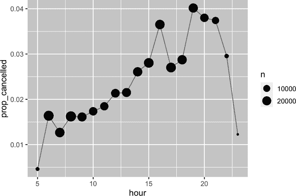

# 第十三章：数字

# 介绍

数值向量是数据科学的支柱，你已经在本书的前面多次使用过它们。现在是时候系统地调查你在 R 中可以用它们做什么，以确保你能够很好地解决涉及数值向量的任何未来问题。

我们将从几个工具开始，如果你有字符串，可以将它们转换为数字，然后更详细地讨论[`count()`](https://dplyr.tidyverse.org/reference/count.xhtml)。接下来，我们将深入探讨与[`mutate()`](https://dplyr.tidyverse.org/reference/mutate.xhtml)配对的各种数字转换，包括更一般的转换，这些转换可以应用于其他类型的向量，但通常与数字向量一起使用。最后，我们将介绍与[`summarize()`](https://dplyr.tidyverse.org/reference/summarise.xhtml)配对良好的汇总函数，并展示它们如何与[`mutate()`](https://dplyr.tidyverse.org/reference/mutate.xhtml)一起使用。

## 先决条件

本章主要使用基本的 R 函数，这些函数无需加载任何包。但我们仍然需要 tidyverse，因为我们将在 tidyverse 函数内部使用这些基本的 R 函数，比如[`mutate()`](https://dplyr.tidyverse.org/reference/mutate.xhtml)和[`filter()`](https://dplyr.tidyverse.org/reference/filter.xhtml)。就像在上一章中一样，我们将使用来自 nycflights13 的真实示例，以及使用[`c()`](https://rdrr.io/r/base/c.xhtml)和[`tribble()`](https://tibble.tidyverse.org/reference/tribble.xhtml)创建的玩具示例。

```
library(tidyverse)
library(nycflights13)
```

# 制作数字

在大多数情况下，你将得到已记录在 R 的数值类型（整数或双精度）中的数字。然而，在某些情况下，你可能会遇到它们作为字符串，可能是因为你通过列标题进行了旋转，或者是因为在数据导入过程中出了问题。

readr 提供了两个将字符串解析为数字的有用函数：[`parse_double()`](https://readr.tidyverse.org/reference/parse_atomic.xhtml)和[`parse_number()`](https://readr.tidyverse.org/reference/parse_number.xhtml)。当你有以字符串形式编写的数字时，请使用[`parse_double()`](https://readr.tidyverse.org/reference/parse_atomic.xhtml)：

```
x <- c("1.2", "5.6", "1e3")
parse_double(x)
#> [1]    1.2    5.6 1000.0
```

当字符串包含你想要忽略的非数值文本时，请使用[`parse_number()`](https://readr.tidyverse.org/reference/parse_number.xhtml)。这对货币数据和百分比特别有用：

```
x <- c("$1,234", "USD 3,513", "59%")
parse_number(x)
#> [1] 1234 3513   59
```

# 计数

仅仅通过计数和一点基本算术，你可以做多少数据科学工作，所以 dplyr 致力于通过[`count()`](https://dplyr.tidyverse.org/reference/count.xhtml)尽可能地简化计数。这个函数非常适合在分析过程中进行快速探索和检查：

```
flights |> count(dest)
#> # A tibble: 105 × 2
#>   dest      n
#>   <chr> <int>
#> 1 ABQ     254
#> 2 ACK     265
#> 3 ALB     439
#> 4 ANC       8
#> 5 ATL   17215
#> 6 AUS    2439
#> # … with 99 more rows
```

（尽管在第四章中的建议中，我们通常将[`count()`](https://dplyr.tidyverse.org/reference/count.xhtml)放在单行上，因为它通常用于控制台，用于快速检查计算是否按预期工作。）

如果您想查看最常见的值，请添加`sort = TRUE`：

```
flights |> count(dest, sort = TRUE)
#> # A tibble: 105 × 2
#>   dest      n
#>   <chr> <int>
#> 1 ORD   17283
#> 2 ATL   17215
#> 3 LAX   16174
#> 4 BOS   15508
#> 5 MCO   14082
#> 6 CLT   14064
#> # … with 99 more rows
```

要记住的是，如果想查看所有的值，可以使用`|> View()`或`|> print(n = Inf)`。

您可以使用[`group_by()`](https://dplyr.tidyverse.org/reference/group_by.xhtml)、[`summarize()`](https://dplyr.tidyverse.org/reference/summarise.xhtml)和[`n()`](https://dplyr.tidyverse.org/reference/context.xhtml)手动执行相同的计算。这很有用，因为它允许您同时计算其他摘要信息：

```
flights |> 
  group_by(dest) |> 
  summarize(
    n = n(),
    delay = mean(arr_delay, na.rm = TRUE)
  )
#> # A tibble: 105 × 3
#>   dest      n delay
#>   <chr> <int> <dbl>
#> 1 ABQ     254  4.38
#> 2 ACK     265  4.85
#> 3 ALB     439 14.4 
#> 4 ANC       8 -2.5 
#> 5 ATL   17215 11.3 
#> 6 AUS    2439  6.02
#> # … with 99 more rows
```

[`n()`](https://dplyr.tidyverse.org/reference/context.xhtml)是一个特殊的汇总函数，不接受任何参数，而是访问有关“当前”组的信息。这意味着它仅在 dplyr 动词内部工作：

```
n()
#> Error in `n()`:
#> ! Must only be used inside data-masking verbs like `mutate()`,
#>   `filter()`, and `group_by()`.
```

[`n()`](https://dplyr.tidyverse.org/reference/context.xhtml)和[`count()`](https://dplyr.tidyverse.org/reference/count.xhtml)有几个变体可能对您有用：

+   `n_distinct(x)`计算一个或多个变量的不同（唯一）值的数量。例如，我们可以弄清楚哪些目的地由最多的航空公司服务：

    ```
    flights |> 
      group_by(dest) |> 
      summarize(carriers = n_distinct(carrier)) |> 
      arrange(desc(carriers))
    #> # A tibble: 105 × 2
    #>   dest  carriers
    #>   <chr>    <int>
    #> 1 ATL          7
    #> 2 BOS          7
    #> 3 CLT          7
    #> 4 ORD          7
    #> 5 TPA          7
    #> 6 AUS          6
    #> # … with 99 more rows
    ```

+   加权计数是一个总和。例如，您可以“计算”每架飞机飞行的英里数：

    ```
    flights |> 
      group_by(tailnum) |> 
      summarize(miles = sum(distance))
    #> # A tibble: 4,044 × 2
    #>   tailnum  miles
    #>   <chr>    <dbl>
    #> 1 D942DN    3418
    #> 2 N0EGMQ  250866
    #> 3 N10156  115966
    #> 4 N102UW   25722
    #> 5 N103US   24619
    #> 6 N104UW   25157
    #> # … with 4,038 more rows
    ```

    加权计数是一个常见的问题，因此[`count()`](https://dplyr.tidyverse.org/reference/count.xhtml)具有`wt`参数，执行相同的操作：

    ```
    flights |> count(tailnum, wt = distance)
    ```

+   通过组合[`sum()`](https://rdrr.io/r/base/sum.xhtml)和[`is.na()`](https://rdrr.io/r/base/NA.xhtml)，可以统计缺失值。在`flights`数据集中，这表示取消的航班：

    ```
    flights |> 
      group_by(dest) |> 
      summarize(n_cancelled = sum(is.na(dep_time))) 
    #> # A tibble: 105 × 2
    #>   dest  n_cancelled
    #>   <chr>       <int>
    #> 1 ABQ             0
    #> 2 ACK             0
    #> 3 ALB            20
    #> 4 ANC             0
    #> 5 ATL           317
    #> 6 AUS            21
    #> # … with 99 more rows
    ```

## 练习

1.  您如何使用[`count()`](https://dplyr.tidyverse.org/reference/count.xhtml)计算具有给定变量的缺失值的行数？

1.  将以下对[`count()`](https://dplyr.tidyverse.org/reference/count.xhtml)的调用扩展为使用[`group_by()`](https://dplyr.tidyverse.org/reference/group_by.xhtml)、[`summarize()`](https://dplyr.tidyverse.org/reference/summarise.xhtml)和[`arrange()`](https://dplyr.tidyverse.org/reference/arrange.xhtml)：

    1.  `flights |> count(dest, sort = TRUE)`

    1.  `flights |> count(tailnum, wt = distance)`

# 数值转换

转换函数与[`mutate()`](https://dplyr.tidyverse.org/reference/mutate.xhtml)很搭配，因为它们的输出与输入长度相同。绝大多数转换函数已经内置在基础 R 中。列出它们是不切实际的，因此本节将展示最有用的函数。例如，虽然 R 提供了您可能梦想的所有三角函数，但我们在这里没有列出它们，因为在数据科学中很少需要它们。

## 算术和循环规则

我们在第二章中介绍了算术的基础（`+`, `-`, `*`, `/`, `^`），并在之后的很多地方使用过它们。这些函数不需要太多的解释，因为它们就是你在小学学到的内容。但我们需要简要谈谈*循环规则*，这些规则决定了当左右两侧的长度不同时会发生什么。这对于像 `flights |> mutate(air_time = air_time / 60)` 这样的操作非常重要，因为左侧有 336,776 个数字，但右侧只有 1 个。

R 通过 *循环* 或重复来处理不匹配的长度。如果我们在数据框之外创建一些向量，我们可以更容易地看到它的运作方式：

```
x <- c(1, 2, 10, 20)
x / 5
#> [1] 0.2 0.4 2.0 4.0
# is shorthand for
x / c(5, 5, 5, 5)
#> [1] 0.2 0.4 2.0 4.0
```

通常情况下，你只想要循环单个数字（即长度为 1 的向量），但 R 会循环任何较短的向量。如果较长的向量不是较短向量的整数倍，通常（但不总是）会给出一个警告：

```
x * c(1, 2)
#> [1]  1  4 10 40
x * c(1, 2, 3)
#> Warning in x * c(1, 2, 3): longer object length is not a multiple of shorter
#> object length
#> [1]  1  4 30 20
```

这些循环规则也适用于逻辑比较（`==`, `<`, `<=`, `>`, `>=`, `!=`），如果你意外地使用 `==` 而不是 `%in%`，并且数据框的行数不恰当，可能会导致令人惊讶的结果。例如，看下这段代码，试图找出所有一月和二月的航班：

```
flights |> 
  filter(month == c(1, 2))
#> # A tibble: 25,977 × 19
#>    year month   day dep_time sched_dep_time dep_delay arr_time sched_arr_time
#>   <int> <int> <int>    <int>          <int>     <dbl>    <int>          <int>
#> 1  2013     1     1      517            515         2      830            819
#> 2  2013     1     1      542            540         2      923            850
#> 3  2013     1     1      554            600        -6      812            837
#> 4  2013     1     1      555            600        -5      913            854
#> 5  2013     1     1      557            600        -3      838            846
#> 6  2013     1     1      558            600        -2      849            851
#> # … with 25,971 more rows, and 11 more variables: arr_delay <dbl>,
#> #   carrier <chr>, flight <int>, tailnum <chr>, origin <chr>, dest <chr>, …
```

代码可以无误地运行，但它并没有返回你想要的结果。因为循环规则的存在，它会找到奇数行中在一月出发的航班和偶数行中在二月出发的航班。不幸的是，由于 `flights` 有偶数行，所以并不会有任何警告。

为了保护你免受这种无声失败，大多数 tidyverse 函数使用一种更严格的循环形式，只会循环单个值。不幸的是，在这里或其他许多情况下，这并没有起到作用，因为关键的计算是由基本的 R 函数 `==` 而不是 [`filter()`](https://dplyr.tidyverse.org/reference/filter.xhtml) 执行的。

## 最小值和最大值

算术函数可以使用变量对。两个密切相关的函数是 [`pmin()`](https://rdrr.io/r/base/Extremes.xhtml) 和 [`pmax()`](https://rdrr.io/r/base/Extremes.xhtml)，当给定两个或多个变量时，它们将返回每行中的最小值或最大值：

```
df <- tribble(
  ~x, ~y,
  1,  3,
  5,  2,
  7, NA,
)

df |> 
  mutate(
    min = pmin(x, y, na.rm = TRUE),
    max = pmax(x, y, na.rm = TRUE)
  )
#> # A tibble: 3 × 4
#>       x     y   min   max
#>   <dbl> <dbl> <dbl> <dbl>
#> 1     1     3     1     3
#> 2     5     2     2     5
#> 3     7    NA     7     7
```

注意，这些函数与 [`min()`](https://rdrr.io/r/base/Extremes.xhtml) 和 [`max()`](https://rdrr.io/r/base/Extremes.xhtml) 这些汇总函数不同，后者取多个观察值并返回一个值。如果所有的最小值和最大值都相同，那么你可以知道已经选择了错误的形式：

```
df |> 
  mutate(
    min = min(x, y, na.rm = TRUE),
    max = max(x, y, na.rm = TRUE)
  )
#> # A tibble: 3 × 4
#>       x     y   min   max
#>   <dbl> <dbl> <dbl> <dbl>
#> 1     1     3     1     7
#> 2     5     2     1     7
#> 3     7    NA     1     7
```

## 模运算

模运算是你在学习小数位之前所做的数学的技术名称，即能够得到一个整数和余数的除法。在 R 语言中，`%/%` 执行整数除法，而 `%%` 计算余数：

```
1:10 %/% 3
#>  [1] 0 0 1 1 1 2 2 2 3 3
1:10 %% 3
#>  [1] 1 2 0 1 2 0 1 2 0 1
```

对于 `flights` 数据集来说，模运算对于解压 `sched_dep_time` 变量为 `hour` 和 `minute` 很方便：

```
flights |> 
  mutate(
    hour = sched_dep_time %/% 100,
    minute = sched_dep_time %% 100,
    .keep = "used"
  )
#> # A tibble: 336,776 × 3
#>   sched_dep_time  hour minute
#>            <int> <dbl>  <dbl>
#> 1            515     5     15
#> 2            529     5     29
#> 3            540     5     40
#> 4            545     5     45
#> 5            600     6      0
#> 6            558     5     58
#> # … with 336,770 more rows
```

我们可以将其与“总结”中的`mean(is.na(x))`技巧结合起来，以查看一天中取消航班的比例如何变化。结果显示在图 13-1 中。

```
flights |> 
  group_by(hour = sched_dep_time %/% 100) |> 
  summarize(prop_cancelled = mean(is.na(dep_time)), n = n()) |> 
  filter(hour > 1) |> 
  ggplot(aes(x = hour, y = prop_cancelled)) +
  geom_line(color = "grey50") + 
  geom_point(aes(size = n))
```



###### 图 13-1\. 一条折线图，x 轴为计划出发小时，y 轴为取消航班的比例。取消似乎随着一天的进行而累积，直到晚上 8 点，而非常晚的航班则取消的可能性要小得多。

## 对数

对数是处理跨越多个数量级的数据和将指数增长转换为线性增长的非常有用的转换。在 R 中，您可以选择三种对数：[`log()`](https://rdrr.io/r/base/Log.xhtml)（自然对数，以 e 为底），[`log2()`](https://rdrr.io/r/base/Log.xhtml)（以 2 为底），以及[`log10()`](https://rdrr.io/r/base/Log.xhtml)（以 10 为底）。我们推荐使用[`log2()`](https://rdrr.io/r/base/Log.xhtml)或[`log10()`](https://rdrr.io/r/base/Log.xhtml)。[`log2()`](https://rdrr.io/r/base/Log.xhtml)易于解释，因为对数尺度上的 1 的差异对应于原始尺度上的加倍，-1 的差异对应于减半，而[`log10()`](https://rdrr.io/r/base/Log.xhtml)易于反向转换，例如，3 是 10³ = 1000。[`log()`](https://rdrr.io/r/base/Log.xhtml)的反函数是[`exp()`](https://rdrr.io/r/base/Log.xhtml)；要计算[`log2()`](https://rdrr.io/r/base/Log.xhtml)或[`log10()`](https://rdrr.io/r/base/Log.xhtml)的反函数，您需要使用`2^`或`10^`。

## 舍入

使用`round(x)`将数字舍入到最近的整数：

```
round(123.456)
#> [1] 123
```

您可以使用第二个参数`digits`来控制舍入的精度。`round(x, digits)`会舍入到最近的`10^-n`，因此`digits = 2`将会舍入到最近的 0.01。这个定义很有用，因为它意味着`round(x, -3)`将会舍入到最近的千位数，实际上确实是这样：

```
round(123.456, 2)  # two digits
#> [1] 123.46
round(123.456, 1)  # one digit
#> [1] 123.5
round(123.456, -1) # round to nearest ten
#> [1] 120
round(123.456, -2) # round to nearest hundred
#> [1] 100
```

[`round()`](https://rdrr.io/r/base/Round.xhtml) 在第一次看起来似乎有些奇怪：

```
round(c(1.5, 2.5))
#> [1] 2 2
```

[`round()`](https://rdrr.io/r/base/Round.xhtml) 使用的是“四舍五入到偶数”或“银行家舍入”：如果一个数字正好处于两个整数之间，它将被舍入到*偶数*整数。这是一个很好的策略，因为它保持了舍入的公正性：所有的 0.5 都会被舍入为上整数和下整数的一半。

[`round()`](https://rdrr.io/r/base/Round.xhtml) 与[`floor()`](https://rdrr.io/r/base/Round.xhtml)（总是向下舍入）和[`ceiling()`](https://rdrr.io/r/base/Round.xhtml)（总是向上舍入）配对使用：

```
x <- 123.456

floor(x)
#> [1] 123
ceiling(x)
#> [1] 124
```

这些函数没有`digits`参数，因此您可以缩小、四舍五入，然后再放大：

```
# Round down to nearest two digits
floor(x / 0.01) * 0.01
#> [1] 123.45
# Round up to nearest two digits
ceiling(x / 0.01) * 0.01
#> [1] 123.46
```

如果你想要对一个数四舍五入到另一个数的倍数，可以使用相同的技巧：

```
# Round to nearest multiple of 4
round(x / 4) * 4
#> [1] 124

# Round to nearest 0.25
round(x / 0.25) * 0.25
#> [1] 123.5
```

## 将数字切割成范围

使用[`cut()`](https://rdrr.io/r/base/cut.xhtml)¹将数值向量分成离散的桶（又称*bin*）：

```
x <- c(1, 2, 5, 10, 15, 20)
cut(x, breaks = c(0, 5, 10, 15, 20))
#> [1] (0,5]   (0,5]   (0,5]   (5,10]  (10,15] (15,20]
#> Levels: (0,5] (5,10] (10,15] (15,20]
```

断点不需要均匀间隔：

```
cut(x, breaks = c(0, 5, 10, 100))
#> [1] (0,5]    (0,5]    (0,5]    (5,10]   (10,100] (10,100]
#> Levels: (0,5] (5,10] (10,100]
```

您可以选择提供自己的`labels`。注意`labels`应比`breaks`少一个。

```
cut(x, 
  breaks = c(0, 5, 10, 15, 20), 
  labels = c("sm", "md", "lg", "xl")
)
#> [1] sm sm sm md lg xl
#> Levels: sm md lg xl
```

超出断点范围的任何值将变为`NA`：

```
y <- c(NA, -10, 5, 10, 30)
cut(y, breaks = c(0, 5, 10, 15, 20))
#> [1] <NA>   <NA>   (0,5]  (5,10] <NA> 
#> Levels: (0,5] (5,10] (10,15] (15,20]
```

查看其他有用参数的文档，例如`right`和`include.lowest`，它们控制间隔是`[a, b)`还是`(a, b]`以及最低间隔是否应为`[a, b]`。

## 累积和滚动聚合

基础 R 提供[`cumsum()`](https://rdrr.io/r/base/cumsum.xhtml)，[`cumprod()`](https://rdrr.io/r/base/cumsum.xhtml)，[`cummin()`](https://rdrr.io/r/base/cumsum.xhtml)，以及[`cummax()`](https://rdrr.io/r/base/cumsum.xhtml)用于累积求和、乘积、最小值和最大值。dplyr 提供[`cummean()`](https://dplyr.tidyverse.org/reference/cumall.xhtml)用于累积均值。累积求和在实践中经常出现：

```
x <- 1:10
cumsum(x)
#>  [1]  1  3  6 10 15 21 28 36 45 55
```

如果需要更复杂的滚动或滑动聚合，请尝试[slider 包](https://oreil.ly/XPnjF)。

## 练习

1.  解释用于生成图 13-1 的每行代码的功能。

1.  R 提供哪些三角函数？猜测一些名称并查阅文档。它们使用角度还是弧度？

1.  目前`dep_time`和`sched_dep_time`方便查看，但难以计算，因为它们不是真正的连续数。可以通过运行以下代码看到基本问题；每个小时之间存在间隙：

    ```
    flights |> 
      filter(month == 1, day == 1) |> 
      ggplot(aes(x = sched_dep_time, y = dep_delay)) +
      geom_point()
    ```

    将它们转换为更真实的时间表示（分数小时或自午夜以来的分钟）。

1.  将`dep_time`和`arr_time`四舍五入到最接近的五分钟。

# 一般转换

下面的部分描述了一些通常用于数值向量的一般转换，但可以应用于所有其他列类型。

## 等级

dplyr 提供了许多受 SQL 启发的排名函数，但您应始终从[`dplyr::min_rank()`](https://dplyr.tidyverse.org/reference/row_number.xhtml)开始。它使用处理并列的典型方法，例如，第 1、第 2、第 2、第 4。

```
x <- c(1, 2, 2, 3, 4, NA)
min_rank(x)
#> [1]  1  2  2  4  5 NA
```

注意，最小值获得最低的等级；使用`desc(x)`将最大值获得最小的等级：

```
min_rank(desc(x))
#> [1]  5  3  3  2  1 NA
```

如果 [`min_rank()`](https://dplyr.tidyverse.org/reference/row_number.xhtml) 不符合你的需求，请查看其变体 [`dplyr::row_number()`](https://dplyr.tidyverse.org/reference/row_number.xhtml)，[`dplyr::dense_rank()`](https://dplyr.tidyverse.org/reference/row_number.xhtml)，[`dplyr::percent_rank()`](https://dplyr.tidyverse.org/reference/percent_rank.xhtml) 和 [`dplyr::cume_dist()`](https://dplyr.tidyverse.org/reference/percent_rank.xhtml)。详细信息请参阅文档。

```
df <- tibble(x = x)
df |> 
  mutate(
    row_number = row_number(x),
    dense_rank = dense_rank(x),
    percent_rank = percent_rank(x),
    cume_dist = cume_dist(x)
  )
#> # A tibble: 6 × 5
#>       x row_number dense_rank percent_rank cume_dist
#>   <dbl>      <int>      <int>        <dbl>     <dbl>
#> 1     1          1          1         0          0.2
#> 2     2          2          2         0.25       0.6
#> 3     2          3          2         0.25       0.6
#> 4     3          4          3         0.75       0.8
#> 5     4          5          4         1          1 
#> 6    NA         NA         NA        NA         NA
```

你可以通过选择适当的 `ties.method` 参数来实现与基础 R 的 [`rank()`](https://rdrr.io/r/base/rank.xhtml) 类似的结果；你可能还希望设置 `na.last = "keep"` 来保留 `NA` 作为 `NA`。

[`row_number()`](https://dplyr.tidyverse.org/reference/row_number.xhtml) 在 dplyr 动词内部没有任何参数时也可以使用。在这种情况下，它将给出“当前”行的编号。与 `%%` 或 `%/%` 结合使用时，这对于将数据分成大小相似的组是一个有用的工具：

```
df <- tibble(id = 1:10)

df |> 
  mutate(
    row0 = row_number() - 1,
    three_groups = row0 %% 3,
    three_in_each_group = row0 %/% 3
  )
#> # A tibble: 10 × 4
#>      id  row0 three_groups three_in_each_group
#>   <int> <dbl>        <dbl>               <dbl>
#> 1     1     0            0                   0
#> 2     2     1            1                   0
#> 3     3     2            2                   0
#> 4     4     3            0                   1
#> 5     5     4            1                   1
#> 6     6     5            2                   1
#> # … with 4 more rows
```

## 偏移

[`dplyr::lead()`](https://dplyr.tidyverse.org/reference/lead-lag.xhtml) 和 [`dplyr::lag()`](https://dplyr.tidyverse.org/reference/lead-lag.xhtml) 允许你引用“当前”值之前或之后的值。它们返回与输入相同长度的向量，在开头或结尾用 `NA` 填充：

```
x <- c(2, 5, 11, 11, 19, 35)
lag(x)
#> [1] NA  2  5 11 11 19
lead(x)
#> [1]  5 11 11 19 35 NA
```

+   `x - lag(x)` 给出当前值与前一个值之间的差异：

    ```
    x - lag(x)
    #> [1] NA  3  6  0  8 16
    ```

+   `x == lag(x)` 告诉你当前值何时发生变化：

    ```
    x == lag(x)
    #> [1]    NA FALSE FALSE  TRUE FALSE FALSE
    ```

你可以通过使用第二个参数 `n` 来引导或滞后超过一个位置：

## 连续标识符

有时候你希望在某个事件发生时开始一个新的组。例如，在查看网站数据时，常常希望将事件分割成会话，即在距离上次活动超过 `x` 分钟的间隔后开始一个新会话。例如，假设你有访问网站时间的记录：

```
events <- tibble(
  time = c(0, 1, 2, 3, 5, 10, 12, 15, 17, 19, 20, 27, 28, 30)
)
```

你已经计算了每个事件之间的时间，并找出是否存在足够大的间隙来满足条件：

```
events <- events |> 
  mutate(
    diff = time - lag(time, default = first(time)),
    has_gap = diff >= 5
  )
events
#> # A tibble: 14 × 3
#>    time  diff has_gap
#>   <dbl> <dbl> <lgl> 
#> 1     0     0 FALSE 
#> 2     1     1 FALSE 
#> 3     2     1 FALSE 
#> 4     3     1 FALSE 
#> 5     5     2 FALSE 
#> 6    10     5 TRUE 
#> # … with 8 more rows
```

但是，如何将逻辑向量转换为可以 [`group_by()`](https://dplyr.tidyverse.org/reference/group_by.xhtml) 的内容？[`cumsum()`](https://rdrr.io/r/base/cumsum.xhtml)，来自“Cumulative and Rolling Aggregates”，在存在间隙时，即 `has_gap` 为 `TRUE` 时，将组递增一次（“Numeric Summaries of Logical Vectors”](ch12.xhtml#sec-numeric-summaries-of-logicals)）：

```
events |> mutate(
  group = cumsum(has_gap)
)
#> # A tibble: 14 × 4
#>    time  diff has_gap group
#>   <dbl> <dbl> <lgl>   <int>
#> 1     0     0 FALSE       0
#> 2     1     1 FALSE       0
#> 3     2     1 FALSE       0
#> 4     3     1 FALSE       0
#> 5     5     2 FALSE       0
#> 6    10     5 TRUE        1
#> # … with 8 more rows
```

创建分组变量的另一种方法是 [`consecutive_id()`](https://dplyr.tidyverse.org/reference/consecutive_id.xhtml)，它在其参数变化时开始一个新的组。例如，受[这个 StackOverflow 问题](https://oreil.ly/swerV)的启发，假设你有一个包含大量重复值的数据框：

```
df <- tibble(
  x = c("a", "a", "a", "b", "c", "c", "d", "e", "a", "a", "b", "b"),
  y = c(1, 2, 3, 2, 4, 1, 3, 9, 4, 8, 10, 199)
)
```

如果你想保留每个重复的`x`的第一行，可以使用[`group_by()`](https://dplyr.tidyverse.org/reference/group_by.xhtml)、[`consecutive_id()`](https://dplyr.tidyverse.org/reference/consecutive_id.xhtml)和[`slice_head()`](https://dplyr.tidyverse.org/reference/slice.xhtml)：

```
df |> 
  group_by(id = consecutive_id(x)) |> 
  slice_head(n = 1)
#> # A tibble: 7 × 3
#> # Groups:   id [7]
#>   x         y    id
#>   <chr> <dbl> <int>
#> 1 a         1     1
#> 2 b         2     2
#> 3 c         4     3
#> 4 d         3     4
#> 5 e         9     5
#> 6 a         4     6
#> # … with 1 more row
```

## 练习

1.  使用排名函数找出延误最严重的 10 个航班。你想如何处理并列情况？仔细阅读[`min_rank()`](https://dplyr.tidyverse.org/reference/row_number.xhtml)的文档。

1.  哪架飞机（`tailnum`）的准点记录最差？

1.  如果你希望尽可能避免延误，你应该在一天中的什么时段飞行？

1.  `flights |> group_by(dest) |> filter(row_number() < 4)`是什么意思？`flights |> group_by(dest) |> filter(row_number(dep_delay) < 4)`又是什么意思？

1.  对于每个目的地，计算延误的总分钟数。对于每次航班，计算其目的地总延误的比例。

1.  延误通常具有时间相关性：即使解决了导致初始延误的问题，稍后的航班也会延误以便让早期的航班起飞。使用[`lag()`](https://dplyr.tidyverse.org/reference/lead-lag.xhtml)，探索每小时的平均航班延误与前一个小时的平均延误之间的关系。

    ```
    flights |> 
      mutate(hour = dep_time %/% 100) |> 
      group_by(year, month, day, hour) |> 
      summarize(
        dep_delay = mean(dep_delay, na.rm = TRUE),
        n = n(),
        .groups = "drop"
      ) |> 
      filter(n > 5)
    ```

1.  查看每个目的地。你能找到那些飞行速度异常快的航班吗（即可能表示数据输入错误的航班）？计算每个目的地的航空时间相对于最短航班的情况。哪些航班在空中延误最严重？

1.  找到所有由至少两家航空公司飞行的目的地。利用这些目的地来根据相同目的地的表现对航空公司进行相对排名。

# 数字摘要

仅仅使用我们已经介绍过的计数、均值和求和就可以走得很远，但是 R 提供了许多其他有用的摘要函数。以下是一些你可能会发现有用的选择。

## 中心

到目前为止，我们大多数使用[`mean()`](https://rdrr.io/r/base/mean.xhtml)来总结值向量的中心。正如我们在“案例研究：聚合和样本大小”中所看到的，因为均值是总和除以计数，它对于少数异常高或低值也很敏感。另一个选择是使用[`median()`](https://rdrr.io/r/stats/median.xhtml)，它找到一个位于向量“中间”的值，即有 50%的值高于它，50%的值低于它。根据你感兴趣的变量分布形状，均值或中位数可能是更好的中心测量。例如，对于对称分布，通常报告均值，而对于偏斜分布，通常报告中位数。

图 13-2 比较每个目的地的平均和中位离港延误时间（以分钟为单位）。中位数延误时间始终小于平均延误时间，因为航班有时会晚数小时，但它们不会提前数小时。

```
flights |>
  group_by(year, month, day) |>
  summarize(
    mean = mean(dep_delay, na.rm = TRUE),
    median = median(dep_delay, na.rm = TRUE),
    n = n(),
    .groups = "drop"
  ) |> 
  ggplot(aes(x = mean, y = median)) + 
  geom_abline(slope = 1, intercept = 0, color = "white", linewidth = 2) +
  geom_point()
```

![所有点都落在 45°线以下，这意味着中位数延误始终小于平均延误。大多数点聚集在平均值 [0, 20] 和中位数 [0, 5] 的密集区域。随着平均延误的增加，中位数的散布也增加。有两个离群点，平均延误约为 60，中位数约为 50，平均延误约为 85，中位数约为 55。](assets/rds2_1302.png)

###### 图 13-2\. 散点图显示了使用中位数而不是平均数总结每小时离港延误的差异。

您可能还想知道*众数*，即最常见的值。这是一个仅对非常简单情况有效的摘要（这就是为什么您可能在高中学习过它），但它不适用于许多实际数据集。如果数据是离散的，则可能存在多个最常见值，如果数据是连续的，则可能不存在最常见值，因为每个值都可能略有不同。因此，统计学家不倾向于使用众数，并且基本的 R 中也没有众数功能。²

## 最小值、最大值和分位数

如果您对中心以外的位置感兴趣，会怎样？[`min()`](https://rdrr.io/r/base/Extremes.xhtml) 和 [`max()`](https://rdrr.io/r/base/Extremes.xhtml) 将为您提供最大和最小值。另一个强大的工具是 [`quantile()`](https://rdrr.io/r/stats/quantile.xhtml)，它是中位数的一般化：`quantile(x, 0.25)` 将找到大于 25%值的 `x` 值，`quantile(x, 0.5)` 等同于中位数，而 `quantile(x, 0.95)` 将找到大于 95%值的值。

对于`flights`数据，您可能希望查看延误的 95%分位数，而不是最大值，因为它会忽略 5%的最延误航班，这可能相当极端。

```
flights |>
  group_by(year, month, day) |>
  summarize(
    max = max(dep_delay, na.rm = TRUE),
    q95 = quantile(dep_delay, 0.95, na.rm = TRUE),
    .groups = "drop"
  )
#> # A tibble: 365 × 5
#>    year month   day   max   q95
#>   <int> <int> <int> <dbl> <dbl>
#> 1  2013     1     1   853  70.1
#> 2  2013     1     2   379  85 
#> 3  2013     1     3   291  68 
#> 4  2013     1     4   288  60 
#> 5  2013     1     5   327  41 
#> 6  2013     1     6   202  51 
#> # … with 359 more rows
```

## 散布

有时您对数据的大部分位于何处不感兴趣，而是关心其如何分布。两个常用的摘要是标准差，`sd(x)`，和四分位距，[`IQR()`](https://rdrr.io/r/stats/IQR.xhtml)。我们不会在这里解释[`sd()`](https://rdrr.io/r/stats/sd.xhtml)，因为您可能已经熟悉它，但[`IQR()`](https://rdrr.io/r/stats/IQR.xhtml)可能是新的——它是`quantile(x, 0.75) - quantile(x, 0.25)`，给出包含数据中间 50%的范围。

我们可以使用这个来揭示`flights`数据中的一个小怪现象。您可能期望起始点和目的地之间的距离分布为零，因为机场始终在同一位置。但以下代码显示了有关机场[EGE](https://oreil.ly/Zse1Q)的数据异常：

```
flights |> 
  group_by(origin, dest) |> 
  summarize(
    distance_sd = IQR(distance), 
    n = n(),
    .groups = "drop"
  ) |> 
  filter(distance_sd > 0)
#> # A tibble: 2 × 4
#>   origin dest  distance_sd     n
#>   <chr>  <chr>       <dbl> <int>
#> 1 EWR    EGE             1   110
#> 2 JFK    EGE             1   103
```

## 分布

记住，前面描述的所有汇总统计都是将分布简化为一个单一数字的方法。这意味着它们基本上是还原的，如果选择了错误的汇总统计，可能会轻易地忽略掉不同组之间的重要差异。这就是为什么在确定汇总统计之前，始终建议先可视化分布的原因。

图 13-3 显示了出发延误的整体分布。分布如此倾斜，以至于我们必须放大才能看到大部分数据。这表明平均值不太可能是一个好的汇总，我们可能更喜欢中位数。


###### 图 13-3。 （左）完整数据的直方图极度偏斜，很难得到任何细节。（右）缩放到延误小于两小时，可以看到大部分观测数据的情况。

同时，检查子组的分布是否类似于整体分布也是一个好主意。在下面的图中，365 个`dep_delay`的频率多边形，每天一个，重叠在一起。分布似乎遵循一个共同的模式，表明可以为每天使用相同的汇总方法。

```
flights |>
  filter(dep_delay < 120) |> 
  ggplot(aes(x = dep_delay, group = interaction(day, month))) + 
  geom_freqpoly(binwidth = 5, alpha = 1/5)
```


不要害怕探索适用于你正在处理的数据的自定义汇总方法。在这种情况下，可能意味着分别汇总提前离开和延迟离开的航班，或者考虑到值非常倾斜，可以尝试对数转换。最后，不要忘记在“案例研究：聚合和样本大小”中学到的内容：每当创建数值汇总时，最好包括每个组中的观测数。

## 位置

还有一种最终的汇总类型对于数值向量很有用，但也适用于任何其他类型的值：提取特定位置的值：`first(x)`、`last(x)` 和 `nth(x, n)`。

例如，我们可以找到每天的第一个和最后一个出发时间：

```
flights |> 
  group_by(year, month, day) |> 
  summarize(
    first_dep = first(dep_time, na_rm = TRUE), 
    fifth_dep = nth(dep_time, 5, na_rm = TRUE),
    last_dep = last(dep_time, na_rm = TRUE)
  )
#> `summarise()` has grouped output by 'year', 'month'. You can override using
#> the `.groups` argument.
#> # A tibble: 365 × 6
#> # Groups:   year, month [12]
#>    year month   day first_dep fifth_dep last_dep
#>   <int> <int> <int>     <int>     <int>    <int>
#> 1  2013     1     1       517       554     2356
#> 2  2013     1     2        42       535     2354
#> 3  2013     1     3        32       520     2349
#> 4  2013     1     4        25       531     2358
#> 5  2013     1     5        14       534     2357
#> 6  2013     1     6        16       555     2355
#> # … with 359 more rows
```

（请注意，因为 dplyr 函数使用 `_` 来分隔函数和参数名称的组件，这些函数使用 `na_rm` 而不是 `na.rm`。）

如果您熟悉 ``，我们将在 [“使用 [ 选择多个元素” 中回到它，您可能会想知道是否需要这些函数。有三个理由：`default` 参数允许您在指定的位置不存在时提供默认值，`order_by` 参数允许您在本地覆盖行的顺序，`na_rm` 参数允许您删除缺失值。

在位置值提取与排名过滤互补。过滤会给您所有的变量，每个观察值分别在一行中：

```
flights |> 
  group_by(year, month, day) |> 
  mutate(r = min_rank(sched_dep_time)) |> 
  filter(r %in% c(1, max(r)))
#> # A tibble: 1,195 × 20
#> # Groups:   year, month, day [365]
#>    year month   day dep_time sched_dep_time dep_delay arr_time sched_arr_time
#>   <int> <int> <int>    <int>          <int>     <dbl>    <int>          <int>
#> 1  2013     1     1      517            515         2      830            819
#> 2  2013     1     1     2353           2359        -6      425            445
#> 3  2013     1     1     2353           2359        -6      418            442
#> 4  2013     1     1     2356           2359        -3      425            437
#> 5  2013     1     2       42           2359        43      518            442
#> 6  2013     1     2      458            500        -2      703            650
#> # … with 1,189 more rows, and 12 more variables: arr_delay <dbl>,
#> #   carrier <chr>, flight <int>, tailnum <chr>, origin <chr>, dest <chr>, …
```

## 使用 mutate()

正如名称所示，摘要函数通常与 [`summarize()`](https://dplyr.tidyverse.org/reference/summarise.xhtml) 配对使用。但是，由于我们在 “算术和回收规则” 中讨论的回收规则，它们也可以与 [`mutate()`](https://dplyr.tidyverse.org/reference/mutate.xhtml) 有用地配对使用，特别是当您想要进行某种组标准化时。例如：

`x / sum(x)`

计算总量的比例。

`(x - mean(x)) / sd(x)`

计算 Z 得分（标准化为均值 0 和标准偏差 1）。

`(x - min(x)) / (max(x) - min(x))`

标准化为范围 [0, 1]。

`x / first(x)`

基于第一个观察值计算指数。

## 练习

1.  对一组航班的典型延迟特征进行至少五种评估方式的头脑风暴。[`mean()`](https://rdrr.io/r/base/mean.xhtml) 什么时候有用？[`median()`](https://rdrr.io/r/stats/median.xhtml) 什么时候有用？什么时候可能需要使用其他方法？应该使用到达延误还是出发延误？为什么可能要使用 `planes` 的数据？

1.  哪些目的地显示出空速变化最大？

1.  创建一个图表来进一步探索 EGE 的冒险。您能找到机场是否搬迁的证据吗？您能找到另一个可能解释差异的变量吗？

# 摘要

您已经熟悉了许多处理数字的工具，在阅读本章后，您现在知道如何在 R 中使用它们。您还学习了一些有用的一般转换，这些转换通常但不专门应用于数值向量，例如排名和偏移量。最后，您处理了许多数字摘要，并讨论了一些您应该考虑的统计挑战。

在接下来的两章中，我们将深入介绍使用 stringr 包处理字符串。字符串是一个大主题，因此它们有两章，一章讲述字符串的基础知识，另一章讲述正则表达式。

¹ ggplot2 在 [`cut_interval()`](https://ggplot2.tidyverse.org/reference/cut_interval.xhtml)、[`cut_number()`](https://ggplot2.tidyverse.org/reference/cut_interval.xhtml) 和 [`cut_width()`](https://ggplot2.tidyverse.org/reference/cut_interval.xhtml) 中提供了一些常见情况的辅助功能。ggplot2 作为这些函数存在的地方确实有些奇怪，但它们作为直方图计算的一部分非常有用，并且在 tidyverse 的其他部分存在之前就已编写完成。

² [`mode()`](https://rdrr.io/r/base/mode.xhtml) 函数的功能完全不同！
