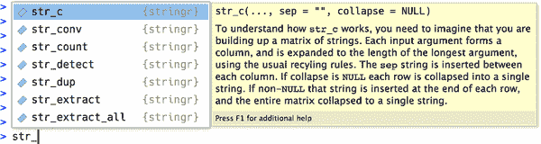

# 第十四章：字符串

# 引言

到目前为止，你已经使用了大量的字符串，但没有学到太多细节。现在是时候深入研究它们，了解字符串的工作原理，并掌握一些强大的字符串操作工具了。

我们将从创建字符串和字符向量的详细信息开始。然后，你将深入学习如何从数据创建字符串，然后是相反操作：从数据中提取字符串。然后我们将讨论处理单个字母的工具。本章最后讨论处理单个字母的函数，并简要讨论在处理其他语言时，你对英语的期望可能会导致错误。

我们将在下一章继续使用字符串，您将更多地了解正则表达式的威力。

## 先决条件

在本章中，我们将使用 stringr 包中的函数，这是核心 tidyverse 的一部分。我们还将使用 babynames 数据，因为它提供了一些有趣的字符串来操作。

```
library(tidyverse)
library(babynames)
```

你可以快速判断你是否在使用 stringr 函数，因为所有的 stringr 函数都以`str_`开头。如果你使用 RStudio 的话，这特别有用，因为输入`str_`将会触发自动完成，让你能够回忆起可用函数。



# 创建字符串

我们在本书的早些时候就创建了字符串，但没有讨论细节。首先，你可以使用单引号(`'`)或双引号(`"`)来创建字符串。两者之间在行为上没有区别，因此为了一致性起见，[tidyverse 风格指南](https://oreil.ly/_zF3d)建议使用`"`，除非字符串包含多个`"`。

```
string1 <- "This is a string"
string2 <- 'If I want to include a "quote" inside a string, I use single quotes'
```

如果你忘记关闭引号，你将看到`+`，即续行提示：

```
> "This is a string without a closing quote
+ 
+ 
+ HELP I'M STUCK IN A STRING
```

如果发生这种情况，你无法确定哪个引号是要关闭的，请按 Escape 键取消然后重试。

## 转义字符

要在字符串中包含字面的单引号或双引号，你可以使用`\`来“转义”它：

```
double_quote <- "\"" # or '"'
single_quote <- '\'' # or "'"
```

所以如果你想在字符串中包含字面的反斜杠，你需要转义它：`"\\"`：

```
backslash <- "\\"
```

注意，字符串的打印表示与字符串本身不同，因为打印表示会显示转义（换句话说，当你打印一个字符串时，你可以复制并粘贴输出来重新创建该字符串）。要查看字符串的原始内容，请使用[`str_view()`](https://stringr.tidyverse.org/reference/str_view.xhtml):¹

```
x <- c(single_quote, double_quote, backslash)
x
#> [1] "'"  "\"" "\\"

str_view(x)
#> [1] │ '
#> [2] │ "
#> [3] │ \
```

## 原始字符串

创建一个包含多个引号或反斜杠的字符串会很快令人困惑。为了说明这个问题，让我们创建一个包含代码块内容的字符串，其中定义了`double_quote`和`single_quote`变量：

```
tricky <- "double_quote <- \"\\\"\" # or '\"'
single_quote <- '\\'' # or \"'\""
str_view(tricky)
#> [1] │ double_quote <- "\"" # or '"'
#>     │ single_quote <- '\'' # or "'"
```

那是很多反斜杠！（有时这被称为[倾斜牙签综合症](https://oreil.ly/Fs-YL)。）为了消除转义，您可以使用*原始字符串*代替：²

```
tricky <- r"(double_quote <- "\"" # or '"'
single_quote <- '\'' # or "'")"
str_view(tricky)
#> [1] │ double_quote <- "\"" # or '"'
#>     │ single_quote <- '\'' # or "'"
```

原始字符串通常以`r"(`开始，以`)"`结束。但是，如果您的字符串包含`)"`，则可以使用`r"[]"`或`r"{}"`，如果这仍然不够，可以插入任意数量的破折号使开放和关闭对成对唯一，例如，`` `r"--()--" ``, `` `r"---()---" ``, 等等。原始字符串足够灵活，可以处理任何文本。

## 其他特殊字符

除了`\\"`、`\\'`和`\\\\`之外，还有一些其他可能会派上用场的特殊字符。最常见的是`\n`，表示换行，以及`\t`，表示制表符。有时您还会看到包含以`\u`或`\U`开头的 Unicode 转义序列的字符串。这是一种在所有系统上都能工作的写非英文字符的方式。您可以在[`“引用”`](https://rdrr.io/r/base/Quotes.xhtml)中查看其他特殊字符的完整列表。

```
x <- c("one\ntwo", "one\ttwo", "\u00b5", "\U0001f604")
x
#> [1] "one\ntwo" "one\ttwo" "µ"        "ߘ䢊str_view(x)
#> [1] │ one
#>     │ two
#> [2] │ one{\t}two
#> [3] │ µ
#> [4] │ ߘ伯
```

请注意，[`str_view()`](https://stringr.tidyverse.org/reference/str_view.xhtml)使用蓝色背景来突出显示制表符，以便更容易发现它们。处理文本的一个挑战是文本中可能存在各种空白字符，因此这种背景帮助您识别出正在发生某些奇怪的事情。

## 练习

1.  创建包含以下值的字符串：

    1.  `他说：“那太神奇了！”`

    1.  `\a\b\c\d`

    1.  `\\\\\\`

1.  在您的 R 会话中创建以下字符串并打印它。特殊字符`\u00a0`会发生什么？[`str_view()`](https://stringr.tidyverse.org/reference/str_view.xhtml)如何显示它？您能查找一下这个特殊字符是什么吗？

    ```
    x <- "This\u00a0is\u00a0tricky"
    ```

# 从数据创建多个字符串

现在您已经学会了手工创建一个或两个字符串的基础知识，我们将详细介绍如何从其他字符串创建字符串。这将帮助您解决一个常见问题，即您有一些您编写的文本，希望将其与数据帧中的字符串结合起来。例如，您可以将“Hello”与`name`变量结合起来创建一个问候语。我们将展示您如何使用[`str_c()`](https://stringr.tidyverse.org/reference/str_c.xhtml)和[`str_glue()`](https://stringr.tidyverse.org/reference/str_glue.xhtml)，以及如何将它们与[`mutate()`](https://dplyr.tidyverse.org/reference/mutate.xhtml)一起使用。这自然引出了您可能与[`summarise()`](https://dplyr.tidyverse.org/reference/summarise.xhtml)一起使用的 stringr 函数的问题，因此我们将在本节结束时讨论[`str_flatten()`](https://stringr.tidyverse.org/reference/str_flatten.xhtml)，这是字符串的汇总函数。

## str_c()

[`str_c()`](https://stringr.tidyverse.org/reference/str_c.xhtml)接受任意数量的向量作为参数，并返回一个字符向量：

```
str_c("x", "y")
#> [1] "xy"
str_c("x", "y", "z")
#> [1] "xyz"
str_c("Hello ", c("John", "Susan"))
#> [1] "Hello John"  "Hello Susan"
```

[`str_c()`](https://stringr.tidyverse.org/reference/str_c.xhtml) 类似于基础的 [`paste0()`](https://rdrr.io/r/base/paste.xhtml)，但设计用于与 [`mutate()`](https://dplyr.tidyverse.org/reference/mutate.xhtml) 结合使用，遵循通常的 tidyverse 规则进行循环使用和传播缺失值：

```
df <- tibble(name = c("Flora", "David", "Terra", NA))
df |> mutate(greeting = str_c("Hi ", name, "!"))
#> # A tibble: 4 × 2
#>   name  greeting 
#>   <chr> <chr> 
#> 1 Flora Hi Flora!
#> 2 David Hi David!
#> 3 Terra Hi Terra!
#> 4 <NA>  <NA>
```

如果你希望以另一种方式显示缺失值，请使用 [`coalesce()`](https://dplyr.tidyverse.org/reference/coalesce.xhtml) 进行替换。根据你的需求，你可以将它用在 [`str_c()`](https://stringr.tidyverse.org/reference/str_c.xhtml) 的内部或外部：

```
df |> 
  mutate(
    greeting1 = str_c("Hi ", coalesce(name, "you"), "!"),
    greeting2 = coalesce(str_c("Hi ", name, "!"), "Hi!")
  )
#> # A tibble: 4 × 3
#>   name  greeting1 greeting2
#>   <chr> <chr>     <chr> 
#> 1 Flora Hi Flora! Hi Flora!
#> 2 David Hi David! Hi David!
#> 3 Terra Hi Terra! Hi Terra!
#> 4 <NA>  Hi you!   Hi!
```

## `str_glue()`

如果你在使用 [`str_c()`](https://stringr.tidyverse.org/reference/str_c.xhtml) 混合许多固定和变量字符串时，会发现你需要输入许多 `"`，这使得难以看到代码的整体目标。一个替代方法由 [glue 包](https://oreil.ly/NHBNe) 提供，通过 [`str_glue()`](https://stringr.tidyverse.org/reference/str_glue.xhtml)。³ 你只需提供一个具有特殊特性的单个字符串：任何在 [`{}`](https://rdrr.io/r/base/Paren.xhtml) 内的内容将会被评估，就像在引号外一样：

```
df |> mutate(greeting = str_glue("Hi {name}!"))
#> # A tibble: 4 × 2
#>   name  greeting 
#>   <chr> <glue> 
#> 1 Flora Hi Flora!
#> 2 David Hi David!
#> 3 Terra Hi Terra!
#> 4 <NA>  Hi NA!
```

如你所见，[`str_glue()`](https://stringr.tidyverse.org/reference/str_glue.xhtml) 目前将缺失值转换为字符串 `"NA"`，这使其与 [`str_c()`](https://stringr.tidyverse.org/reference/str_c.xhtml) 不一致，遗憾的是：

你可能也会想知道，如果需要在字符串中包含普通的 `{` 或 `}` 会发生什么。如果你猜想需要以某种方式转义它们，你是对的。诀窍在于 glue 使用略有不同的转义技术：你需要将特殊字符连续双写：

```
df |> mutate(greeting = str_glue("{{Hi {name}!}}"))
#> # A tibble: 4 × 2
#>   name  greeting 
#>   <chr> <glue> 
#> 1 Flora {Hi Flora!}
#> 2 David {Hi David!}
#> 3 Terra {Hi Terra!}
#> 4 <NA>  {Hi NA!}
```

## `str_flatten()`

[`str_c()`](https://stringr.tidyverse.org/reference/str_c.xhtml) 和 [`str_glue()`](https://stringr.tidyverse.org/reference/str_glue.xhtml) 与 [`mutate()`](https://dplyr.tidyverse.org/reference/mutate.xhtml) 结合使用效果很好，因为它们的输出与它们的输入长度相同。如果你想要一个能够与 [`summarize()`](https://dplyr.tidyverse.org/reference/summarise.xhtml) 很好地配合的函数，即始终返回单个字符串的函数，那就是 [`str_flatten()`](https://stringr.tidyverse.org/reference/str_flatten.xhtml)：⁴ 它接受一个字符向量，并将向量的每个元素组合成单个字符串：

```
str_flatten(c("x", "y", "z"))
#> [1] "xyz"
str_flatten(c("x", "y", "z"), ", ")
#> [1] "x, y, z"
str_flatten(c("x", "y", "z"), ", ", last = ", and ")
#> [1] "x, y, and z"
```

这使得它与 [`summarize()`](https://dplyr.tidyverse.org/reference/summarise.xhtml) 很好地配合使用：

```
df <- tribble(
  ~ name, ~ fruit,
  "Carmen", "banana",
  "Carmen", "apple",
  "Marvin", "nectarine",
  "Terence", "cantaloupe",
  "Terence", "papaya",
  "Terence", "mandarin"
)
df |>
  group_by(name) |> 
  summarize(fruits = str_flatten(fruit, ", "))
#> # A tibble: 3 × 2
#>   name    fruits 
#>   <chr>   <chr> 
#> 1 Carmen  banana, apple 
#> 2 Marvin  nectarine 
#> 3 Terence cantaloupe, papaya, mandarin
```

## 练习

1.  比较并对比 [`paste0()`](https://rdrr.io/r/base/paste.xhtml) 和 [`str_c()`](https://stringr.tidyverse.org/reference/str_c.xhtml) 的结果，针对以下输入：

    ```
    str_c("hi ", NA)
    str_c(letters[1:2], letters[1:3])
    ```

1.  [`paste()`](https://rdrr.io/r/base/paste.xhtml)和[`paste0()`](https://rdrr.io/r/base/paste.xhtml)之间有什么区别？如何用[`str_c()`](https://stringr.tidyverse.org/reference/str_c.xhtml)重新创建[`paste()`](https://rdrr.io/r/base/paste.xhtml)的等效操作？

1.  将以下表达式从[`str_c()`](https://stringr.tidyverse.org/reference/str_c.xhtml)转换为[`str_glue()`](https://stringr.tidyverse.org/reference/str_glue.xhtml)或反之：

    1.  `str_c("The price of ", food, " is ", price)`

    1.  `str_glue("I'm {age} years old and live in {country}")`

    1.  `str_c("\\section{", title, "}")`

# 从字符串中提取数据

多个变量常常被挤在一个字符串中。在本节中，您将学习如何使用四个 tidyr 函数来提取它们：

+   `df |> separate_longer_delim(col, delim)`

+   `df |> separate_longer_position(col, width)`

+   `df |> separate_wider_delim(col, delim, names)`

+   `df |> separate_wider_position(col, widths)`

如果你仔细观察，你会发现这里有一个共同模式：`separate_`，然后是 `longer` 或 `wider`，然后 `_`，然后是 `delim` 或 `position`。这是因为这四个函数由两个更简单的基元组成：

+   就像[`pivot_longer()`](https://tidyr.tidyverse.org/reference/pivot_longer.xhtml)和[`pivot_wider()`](https://tidyr.tidyverse.org/reference/pivot_wider.xhtml)一样， `_longer` 函数通过创建新行使输入数据框变长，而 `_wider` 函数通过生成新列使输入数据框变宽。

+   `delim` 使用分隔符（例如 `", "` 或 `" "`）拆分字符串；`position` 根据指定的宽度（例如 `c(3, 5, 2)`）拆分。

我们将在第十五章中再次回到这个家族的最后一位成员 `separate_wider_regex()`。它是 `wider` 函数中最灵活的，但在使用之前需要了解一些正则表达式知识。

接下来的两个部分将为您介绍这些分隔函数背后的基本思想，首先是分为行（稍微简单一些），然后是分为列。我们最后讨论 `wider` 函数提供的工具来诊断问题。

## 分为行

将字符串分成行通常在每行的组件数量不同时最有用。最常见的情况是需要 [`separate_longer_delim()`](https://tidyr.tidyverse.org/reference/separate_longer_delim.xhtml) 根据分隔符进行拆分：

```
df1 <- tibble(x = c("a,b,c", "d,e", "f"))
df1 |> 
  separate_longer_delim(x, delim = ",")
#> # A tibble: 6 × 1
#>   x 
#>   <chr>
#> 1 a 
#> 2 b 
#> 3 c 
#> 4 d 
#> 5 e 
#> 6 f
```

在实际应用中较少见[`separate_longer_delim()`](https://tidyr.tidyverse.org/reference/separate_longer_delim.xhtml)，但某些旧数据集确实使用了一种紧凑的格式，其中每个字符用于记录一个值：

```
df2 <- tibble(x = c("1211", "131", "21"))
df2 |> 
  separate_longer_position(x, width = 1)
#> # A tibble: 9 × 1
#>   x 
#>   <chr>
#> 1 1 
#> 2 2 
#> 3 1 
#> 4 1 
#> 5 1 
#> 6 3 
#> # … with 3 more rows
```

## 分列

将字符串分隔成列在每个字符串中有固定数量的组件且您希望将它们展开到列中时，通常是最有用的。它们比其`longer`等效稍微复杂，因为您需要命名列。例如，在以下数据集中，`x`由代码、版本号和年份组成，它们用`.`分隔。要使用[`separate_wider_delim()`](https://tidyr.tidyverse.org/reference/separate_wider_delim.xhtml)，我们提供分隔符和名称的两个参数：

```
df3 <- tibble(x = c("a10.1.2022", "b10.2.2011", "e15.1.2015"))
df3 |> 
  separate_wider_delim(
    x,
    delim = ".",
    names = c("code", "edition", "year")
  )
#> # A tibble: 3 × 3
#>   code  edition year 
#>   <chr> <chr>   <chr>
#> 1 a10   1       2022 
#> 2 b10   2       2011 
#> 3 e15   1       2015
```

如果特定的片段无用，您可以使用`NA`名称将其从结果中省略：

```
df3 |> 
  separate_wider_delim(
    x,
    delim = ".",
    names = c("code", NA, "year")
  )
#> # A tibble: 3 × 2
#>   code  year 
#>   <chr> <chr>
#> 1 a10   2022 
#> 2 b10   2011 
#> 3 e15   2015
```

[`separate_wider_position()`](https://tidyr.tidyverse.org/reference/separate_wider_delim.xhtml)的工作方式有些不同，因为您通常希望指定每列的宽度。因此，您给它一个命名的整数向量，其中名称给出新列的名称，而值是它占据的字符数。您可以通过不命名它们来从输出中省略值：

```
df4 <- tibble(x = c("202215TX", "202122LA", "202325CA")) 
df4 |> 
  separate_wider_position(
    x,
    widths = c(year = 4, age = 2, state = 2)
  )
#> # A tibble: 3 × 3
#>   year  age   state
#>   <chr> <chr> <chr>
#> 1 2022  15    TX 
#> 2 2021  22    LA 
#> 3 2023  25    CA
```

## 诊断扩展问题

[`separate_wider_delim()`](https://tidyr.tidyverse.org/reference/separate_wider_delim.xhtml)⁵需要一个固定和已知的列集。如果某些行没有预期数量的片段会发生什么？存在两种可能的问题，片段过少或者片段过多，因此[`separate_wider_delim()`](https://tidyr.tidyverse.org/reference/separate_wider_delim.xhtml)提供了两个参数来帮助：`too_few`和`too_many`。让我们首先看一下具有以下示例数据集的`too_few`情况：

```
df <- tibble(x = c("1-1-1", "1-1-2", "1-3", "1-3-2", "1"))

df |> 
  separate_wider_delim(
    x,
    delim = "-",
    names = c("x", "y", "z")
  )
#> Error in `separate_wider_delim()`:
#> ! Expected 3 pieces in each element of `x`.
#> ! 2 values were too short.
#> ℹ Use `too_few = "debug"` to diagnose the problem.
#> ℹ Use `too_few = "align_start"/"align_end"` to silence this message.
```

您会注意到我们收到了一个错误，但错误会给出一些关于如何继续的建议。让我们从调试问题开始：

```
debug <- df |> 
  separate_wider_delim(
    x,
    delim = "-",
    names = c("x", "y", "z"),
    too_few = "debug"
  )
#> Warning: Debug mode activated: adding variables `x_ok`, `x_pieces`, and
#> `x_remainder`.
debug
#> # A tibble: 5 × 6
#>   x     y     z     x_ok  x_pieces x_remainder
#>   <chr> <chr> <chr> <lgl>    <int> <chr> 
#> 1 1-1-1 1     1     TRUE         3 "" 
#> 2 1-1-2 1     2     TRUE         3 "" 
#> 3 1-3   3     <NA>  FALSE        2 "" 
#> 4 1-3-2 3     2     TRUE         3 "" 
#> 5 1     <NA>  <NA>  FALSE        1 ""
```

当您使用调试模式时，将会在输出中添加三列额外的列：`x_ok`、`x_pieces`和`x_remainder`（如果您使用不同名称分隔变量，则会得到不同的前缀）。在这里，`x_ok`允许您快速找到失败的输入：

```
debug |> filter(!x_ok)
#> # A tibble: 2 × 6
#>   x     y     z     x_ok  x_pieces x_remainder
#>   <chr> <chr> <chr> <lgl>    <int> <chr> 
#> 1 1-3   3     <NA>  FALSE        2 "" 
#> 2 1     <NA>  <NA>  FALSE        1 ""
```

`x_pieces`告诉我们找到了多少个片段，与预期的三个（即`names`的长度）进行比较。当片段过少时，`x_remainder`并不有用，但我们很快会再次看到它。

有时查看此调试信息将显示出与您的定界策略有关的问题，或者建议您在分隔之前需要进行更多预处理。在这种情况下，请修复上游问题，并确保删除`too_few = "debug"`以确保新问题变为错误。

在其他情况下，您可能希望用`NA`填补缺失的部分并继续前进。这就是`too_few = "align_start"`和`too_few = "align_end"`的作用，它们允许您控制`NA`的放置位置：

```
df |> 
  separate_wider_delim(
    x,
    delim = "-",
    names = c("x", "y", "z"),
    too_few = "align_start"
  )
#> # A tibble: 5 × 3
#>   x     y     z 
#>   <chr> <chr> <chr>
#> 1 1     1     1 
#> 2 1     1     2 
#> 3 1     3     <NA> 
#> 4 1     3     2 
#> 5 1     <NA>  <NA>
```

如果片段过多，同样的原则适用：

```
df <- tibble(x = c("1-1-1", "1-1-2", "1-3-5-6", "1-3-2", "1-3-5-7-9"))

df |> 
  separate_wider_delim(
    x,
    delim = "-",
    names = c("x", "y", "z")
  )
#> Error in `separate_wider_delim()`:
#> ! Expected 3 pieces in each element of `x`.
#> ! 2 values were too long.
#> ℹ Use `too_many = "debug"` to diagnose the problem.
#> ℹ Use `too_many = "drop"/"merge"` to silence this message.
```

但现在，当我们调试结果时，您可以看到`x_remainder`的目的：

```
debug <- df |> 
  separate_wider_delim(
    x,
    delim = "-",
    names = c("x", "y", "z"),
    too_many = "debug"
  )
#> Warning: Debug mode activated: adding variables `x_ok`, `x_pieces`, and
#> `x_remainder`.
debug |> filter(!x_ok)
#> # A tibble: 2 × 6
#>   x         y     z     x_ok  x_pieces x_remainder
#>   <chr>     <chr> <chr> <lgl>    <int> <chr> 
#> 1 1-3-5-6   3     5     FALSE        4 -6 
#> 2 1-3-5-7-9 3     5     FALSE        5 -7-9
```

处理过多片段的选项略有不同：您可以悄悄地“丢弃”任何额外的片段，或者将它们全部“合并”到最后一列中：

```
df |> 
  separate_wider_delim(
    x,
    delim = "-",
    names = c("x", "y", "z"),
    too_many = "drop"
  )
#> # A tibble: 5 × 3
#>   x     y     z 
#>   <chr> <chr> <chr>
#> 1 1     1     1 
#> 2 1     1     2 
#> 3 1     3     5 
#> 4 1     3     2 
#> 5 1     3     5

df |> 
  separate_wider_delim(
    x,
    delim = "-",
    names = c("x", "y", "z"),
    too_many = "merge"
  )
#> # A tibble: 5 × 3
#>   x     y     z 
#>   <chr> <chr> <chr>
#> 1 1     1     1 
#> 2 1     1     2 
#> 3 1     3     5-6 
#> 4 1     3     2 
#> 5 1     3     5-7-9
```

# 字母

在这一部分，我们将介绍一些函数，允许您处理字符串中的每个字母。您将学习如何找出字符串的长度，提取子字符串，并处理图表和表格中的长字符串。

## 长度

[`str_length()`](https://stringr.tidyverse.org/reference/str_length.xhtml) 告诉您字符串中的字母数：

```
str_length(c("a", "R for data science", NA))
#> [1]  1 18 NA
```

您可以使用 [`count()`](https://dplyr.tidyverse.org/reference/count.xhtml) 查找美国婴儿姓名长度的分布，然后使用 [`filter()`](https://dplyr.tidyverse.org/reference/filter.xhtml) 查看最长的姓名，这些姓名恰好有 15 个字母:⁶

```
babynames |>
  count(length = str_length(name), wt = n)
#> # A tibble: 14 × 2
#>   length        n
#>    <int>    <int>
#> 1      2   338150
#> 2      3  8589596
#> 3      4 48506739
#> 4      5 87011607
#> 5      6 90749404
#> 6      7 72120767
#> # … with 8 more rows

babynames |> 
  filter(str_length(name) == 15) |> 
  count(name, wt = n, sort = TRUE)
#> # A tibble: 34 × 2
#>   name                n
#>   <chr>           <int>
#> 1 Franciscojavier   123
#> 2 Christopherjohn   118
#> 3 Johnchristopher   118
#> 4 Christopherjame   108
#> 5 Christophermich    52
#> 6 Ryanchristopher    45
#> # … with 28 more rows
```

## 子集

您可以使用 `str_sub(string, start, end)` 提取字符串的部分，其中 `start` 和 `end` 是子字符串应该开始和结束的位置。`start` 和 `end` 参数是包容的，因此返回字符串的长度将是 `end - start + 1`：

```
x <- c("Apple", "Banana", "Pear")
str_sub(x, 1, 3)
#> [1] "App" "Ban" "Pea"
```

您可以使用负值从字符串末尾开始计数：-1 是最后一个字符，-2 是倒数第二个字符，依此类推。

```
str_sub(x, -3, -1)
#> [1] "ple" "ana" "ear"
```

请注意，[`str_sub()`](https://stringr.tidyverse.org/reference/str_sub.xhtml) 如果字符串过短不会失败：它将尽可能返回尽可能多的内容：

```
str_sub("a", 1, 5)
#> [1] "a"
```

我们可以使用 [`str_sub()`](https://stringr.tidyverse.org/reference/str_sub.xhtml) 和 [`mutate()`](https://dplyr.tidyverse.org/reference/mutate.xhtml) 找出每个名称的第一个和最后一个字母：

```
babynames |> 
  mutate(
    first = str_sub(name, 1, 1),
    last = str_sub(name, -1, -1)
  )
#> # A tibble: 1,924,665 × 7
#>    year sex   name          n   prop first last 
#>   <dbl> <chr> <chr>     <int>  <dbl> <chr> <chr>
#> 1  1880 F     Mary       7065 0.0724 M     y 
#> 2  1880 F     Anna       2604 0.0267 A     a 
#> 3  1880 F     Emma       2003 0.0205 E     a 
#> 4  1880 F     Elizabeth  1939 0.0199 E     h 
#> 5  1880 F     Minnie     1746 0.0179 M     e 
#> 6  1880 F     Margaret   1578 0.0162 M     t 
#> # … with 1,924,659 more rows
```

## 练习

1.  在计算婴儿姓名长度的分布时，为什么我们使用 `wt = n`？

1.  使用 [`str_length()`](https://stringr.tidyverse.org/reference/str_length.xhtml) 和 [`str_sub()`](https://stringr.tidyverse.org/reference/str_sub.xhtml) 提取每个婴儿姓名的中间字母。如果字符串长度为偶数，您会怎么做？

1.  随着时间的推移，婴儿姓名的长度有什么主要趋势？名字的首尾字母的受欢迎程度如何？

# 非英文文本

到目前为止，我们专注于英语文本，这在两个方面特别容易处理。首先，英语字母表相对简单：只有 26 个字母。其次（也许更重要的是），我们今天使用的计算基础设施主要由英语使用者设计。不幸的是，我们没有足够的空间来全面处理非英语语言。尽管如此，我们希望引起您对可能遇到的一些最大挑战的注意：编码、字母变体和依赖于地区的函数。

## 编码

在处理非英文文本时，第一个挑战通常是*编码*。要理解发生了什么，我们需要深入了解计算机如何表示字符串。在 R 中，我们可以使用 [`charToRaw()`](https://rdrr.io/r/base/rawConversion.xhtml) 获取字符串的底层表示：

```
charToRaw("Hadley")
#> [1] 48 61 64 6c 65 79
```

每个十六进制数都代表一个字母：`48`代表 H，`61`代表 a，依此类推。从十六进制数到字符的映射称为编码，在这种情况下，编码称为 ASCII。ASCII 在表示英文字符方面表现出色，因为它是*美国*信息交换标准代码。

对于非英语的语言来说，事情并不那么简单。在计算机的早期阶段，有许多竞争的编码标准用于编码非英语字符。例如，欧洲有两种不同的编码：Latin1（也称为 ISO-8859-1）用于西欧语言，而 Latin2（也称为 ISO-8859-2）用于中欧语言。在 Latin1 中，字节`b1`是±，但在 Latin2 中，它是ą！幸运的是，今天几乎每个地方都支持一种标准：UTF-8。UTF-8 可以编码今天人类使用的几乎每个字符，以及许多额外的符号，如表情符号。

readr 在任何地方都使用 UTF-8。这是一个很好的默认设置，但对于不使用 UTF-8 的旧系统生成的数据，可能会失败。如果发生这种情况，在打印字符串时，它们会看起来很奇怪。有时可能只会出现一两个字符混乱，而其他时候则会得到完全无法理解的内容。例如，这里有两个内联 CSV 示例，使用了不同的编码：⁷

```
x1 <- "text\nEl Ni\xf1o was particularly bad this year"
read_csv(x1)
#> # A tibble: 1 × 1
#>   text 
#>   <chr> 
#> 1 "El Ni\xf1o was particularly bad this year"

x2 <- "text\n\x82\xb1\x82\xf1\x82\xc9\x82\xbf\x82\xcd"
read_csv(x2)
#> # A tibble: 1 × 1
#>   text 
#>   <chr> 
#> 1 "\x82\xb1\x82\xf1\x82\xc9\x82\xbf\x82\xcd"
```

要正确地读取这些内容，您可以通过`locale`参数指定编码：

```
read_csv(x1, locale = locale(encoding = "Latin1"))
#> # A tibble: 1 × 1
#>   text 
#>   <chr> 
#> 1 El Niño was particularly bad this year

read_csv(x2, locale = locale(encoding = "Shift-JIS"))
#> # A tibble: 1 × 1
#>   text 
#>   <chr> 
#> 1 こんにちは
```

如何找到正确的编码？如果幸运的话，它可能包含在数据文档的某处。不幸的是，这种情况很少见，所以 readr 提供了[`guess_encoding()`](https://readr.tidyverse.org/reference/encoding.xhtml)来帮助您找到答案。它不是绝对可靠的，在处理少量文本时效果较差，但作为一个合理的起点是可以接受的。预计在找到正确编码之前，您可能需要尝试几种不同的编码。

编码是一个丰富而复杂的主题；我们在这里只是浅尝辄止。如果您想了解更多信息，建议阅读[详细说明](https://oreil.ly/v8ZQf)。

## 字母变体

在使用带有重音的语言时，确定字母位置（例如，使用[`str_length()`](https://stringr.tidyverse.org/reference/str_length.xhtml)和[`str_sub()`](https://stringr.tidyverse.org/reference/str_sub.xhtml)）是一个重要挑战，因为重音字母可以被编码为一个单独的字符（例如，ü），或者通过结合未带重音的字母（例如，u）与变音符号（例如，¨）来编码为两个字符。例如，此代码展示了两种看起来相同的表示ü的方式：

```
u <- c("\u00fc", "u\u0308")
str_view(u)
#> [1] │ ü
#> [2] │ ü
```

但这两个字符串在长度上不同，并且它们的第一个字符也不同：

```
str_length(u)
#> [1] 1 2
str_sub(u, 1, 1)
#> [1] "ü" "u"
```

最后，请注意，使用`==`比较这些字符串时会将它们视为不同，而 stringr 中方便的[`str_equal()`](https://stringr.tidyverse.org/reference/str_equal.xhtml)函数会认识到它们具有相同的外观：

```
u[[1]] == u[[2]]
#> [1] FALSE

str_equal(u[[1]], u[[2]])
#> [1] TRUE
```

## 依赖区域设置的函数

最后，有一些 stringr 函数的行为取决于你的*语言环境*。语言环境类似于语言，但包括一个可选的地区标识符，以处理语言内的地区变化。语言环境由小写语言缩写指定，可选地跟着一个 `_` 和一个大写地区标识符。例如，“en” 是英语，“en_GB” 是英国英语，“en_US” 是美国英语。如果你还不知道你的语言的代码，[Wikipedia](https://oreil.ly/c1P2g) 有一个很好的列表，并且你可以查看哪些被 stringr 支持，通过查看 [`stringi::stri_locale_list()`](https://rdrr.io/pkg/stringi/man/stri_locale_list.xhtml)。

基础 R 字符串函数会自动使用操作系统设置的语言环境。这意味着基础 R 字符串函数会根据你的语言环境执行操作，但如果与其他国家的人共享代码，你的代码可能会有不同的运行结果。为了避免这个问题，stringr 默认使用英语规则，通过使用 “en” 语言环境，并要求你指定 `locale` 参数来覆盖它。幸运的是，有两组函数特别依赖于语言环境：大小写转换和排序。

不同语言的大小写转换规则各不相同。例如，土耳其语有两个 i：一个有点，一个没有点。因为它们是两个不同的字母，它们的大写形式也不同：

```
str_to_upper(c("i", "ı"))
#> [1] "I" "I"
str_to_upper(c("i", "ı"), locale = "tr")
#> [1] "İ" "I"
```

对字符串进行排序依赖于字母表的顺序，而不是每种语言都相同！⁸ 举个例子：在捷克语中，“ch” 是一个复合字母，按照字母表的顺序，它出现在 `h` 之后。

```
str_sort(c("a", "c", "ch", "h", "z"))
#> [1] "a"  "c"  "ch" "h"  "z"
str_sort(c("a", "c", "ch", "h", "z"), locale = "cs")
#> [1] "a"  "c"  "h"  "ch" "z"
```

当使用 [`dplyr::arrange()`](https://dplyr.tidyverse.org/reference/arrange.xhtml) 对字符串进行排序时也会遇到这个问题，这也是它有 `locale` 参数的原因。

# 总结

在本章中，你了解了 stringr 包的一些强大功能，如如何创建、组合和提取字符串，以及在处理非英语字符串时可能遇到的一些挑战。现在是时候学习处理字符串中最重要和最强大的工具之一了：正则表达式。正则表达式是一种简洁而表达力强的语言，用于描述字符串中的模式，并且是下一章的主题。

¹ 或者使用基础 R 函数 [`writeLines()`](https://rdrr.io/r/base/writeLines.xhtml)。

² 适用于 R 4.0.0 及更新版本。

³ 如果你不使用 stringr，也可以直接访问它，使用 [`glue::glue()`](https://glue.tidyverse.org/reference/glue.xhtml)。

⁴ 基础 R 的等效函数是 [`paste()`](https://rdrr.io/r/base/paste.xhtml)，使用 `collapse` 参数。

⁵ 相同的原则也适用于[`separate_wider_position()`](https://tidyr.tidyverse.org/reference/separate_wider_delim.xhtml)和[`separate_wider_regex()`](https://tidyr.tidyverse.org/reference/separate_wider_delim.xhtml)。

⁶ 查看这些条目，我们猜测 babynames 数据会删除空格或连字符，并在 15 个字母后截断。

⁷ 在这里，我正在使用特殊字符 `\x` 将二进制数据直接编码到字符串中。

⁸ 在像中文这样没有字母的语言中进行排序，问题就更加复杂了。
