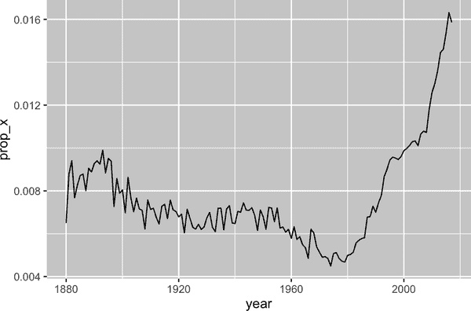

# 第十五章：正则表达式

# 介绍

在第十四章中，你学习了许多处理字符串的有用函数。本章将重点介绍使用*正则表达式*描述字符串模式的简洁而强大的语言的函数。术语*正则表达式*有点冗长，因此大多数人将其缩写为*regex*¹或*regexp*。

本章从正则表达式的基础知识和最有用的字符串分析函数开始。然后，我们将扩展您对模式的理解，并介绍七个重要的新主题（转义、锚定、字符类、简写类、量词、优先级和分组）。接下来，我们将讨论一些其他类型的模式，stringr 函数可以处理的以及各种“标志”，这些标志允许您调整正则表达式的操作。最后，我们将概述 tidyverse 和基础 R 中可能使用正则表达式的其他位置。

## 先决条件

在本章中，我们将使用来自 stringr 和 tidyr 的正则表达式函数，它们都是 tidyverse 的核心成员，以及来自 babynames 包的数据：

```
library(tidyverse)
library(babynames)
```

本章中，我们将使用简单的内联示例混合，以便您可以了解基本概念，以及来自 stringr 的婴儿姓名数据和三个字符向量：

+   `fruit` 包含 80 种水果的名称。

+   `words` 包含 980 个常见的英文单词。

+   `sentences` 包含 720 个短句子。

# 模式基础

我们将使用[`str_view()`](https://stringr.tidyverse.org/reference/str_view.xhtml)来学习正则表达式模式的工作原理。在前一章中，我们使用[`str_view()`](https://stringr.tidyverse.org/reference/str_view.xhtml)更好地理解了字符串与其打印表示之间的区别，现在我们将使用它的第二个参数，即正则表达式。当提供这个参数时，[`str_view()`](https://stringr.tidyverse.org/reference/str_view.xhtml)将仅显示与之匹配的字符串向量的元素，并用`<>`包围每个匹配项，并在可能时以蓝色突出显示匹配项。

最简单的模式由精确匹配这些字符的字母和数字组成：

```
str_view(fruit, "berry")
#>  [6] │ bil<berry>
#>  [7] │ black<berry>
#> [10] │ blue<berry>
#> [11] │ boysen<berry>
#> [19] │ cloud<berry>
#> [21] │ cran<berry>
#> ... and 8 more
```

字母和数字精确匹配并称为*字面字符*。大多数标点符号字符，如`.`、`+`、`*`、`[`、`]`和`?`，具有特殊含义²，称为*元字符*。例如，`.`将匹配任何字符³，因此`"a."`将匹配包含“a”后跟另一个字符的任何字符串：

```
str_view(c("a", "ab", "ae", "bd", "ea", "eab"), "a.")
#> [2] │ <ab>
#> [3] │ <ae>
#> [6] │ e<ab>
```

或者我们可以找到所有包含“a”后跟三个字母，再跟一个“e”的水果：

```
str_view(fruit, "a...e")
#>  [1] │ <apple>
#>  [7] │ bl<ackbe>rry
#> [48] │ mand<arine>
#> [51] │ nect<arine>
#> [62] │ pine<apple>
#> [64] │ pomegr<anate>
#> ... and 2 more
```

*量词*控制模式可以匹配多少次：

+   `?` 使模式变为可选的（即匹配 0 次或 1 次）。

+   `+` 允许模式重复（即至少匹配一次）。

+   `*` 允许模式是可选的或重复的（即匹配任意次数，包括 0 次）。

```
# ab? matches an "a", optionally followed by a "b".
str_view(c("a", "ab", "abb"), "ab?")
#> [1] │ <a>
#> [2] │ <ab>
#> [3] │ <ab>b

# ab+ matches an "a", followed by at least one "b".
str_view(c("a", "ab", "abb"), "ab+")
#> [2] │ <ab>
#> [3] │ <abb>

# ab* matches an "a", followed by any number of "b"s.
str_view(c("a", "ab", "abb"), "ab*")
#> [1] │ <a>
#> [2] │ <ab>
#> [3] │ <abb>
```

*字符类*由`[]`定义，允许您匹配一组字符；例如，`[abcd]`匹配“a”、“b”、“c”或“d”。您还可以通过使用`^`来反转匹配：`[^abcd]`匹配除了“a”、“b”、“c”或“d”之外的任何字符。我们可以利用这个思路来查找包含元音字母“x”或辅音字母“y”的单词：

```
str_view(words, "[aeiou]x[aeiou]")
#> [284] │ <exa>ct
#> [285] │ <exa>mple
#> [288] │ <exe>rcise
#> [289] │ <exi>st
str_view(words, "[^aeiou]y[^aeiou]")
#> [836] │ <sys>tem
#> [901] │ <typ>e
```

您可以使用*交替*，`|`，来选择一个或多个备选模式。例如，以下模式寻找包含“apple”、“melon”或“nut”或重复元音字母的水果：

```
str_view(fruit, "apple|melon|nut")
#>  [1] │ <apple>
#> [13] │ canary <melon>
#> [20] │ coco<nut>
#> [52] │ <nut>
#> [62] │ pine<apple>
#> [72] │ rock <melon>
#> ... and 1 more
str_view(fruit, "aa|ee|ii|oo|uu")
#>  [9] │ bl<oo>d orange
#> [33] │ g<oo>seberry
#> [47] │ lych<ee>
#> [66] │ purple mangost<ee>n
```

正则表达式非常紧凑，使用了许多标点字符，因此一开始可能看起来令人生畏且难以阅读。不要担心：通过练习，您会变得更好，简单的模式很快就会变得熟悉起来。让我们通过使用一些有用的 stringr 函数来开始这个过程。

# 关键功能

现在您已经了解了正则表达式的基础知识，让我们在一些 stringr 和 tidyr 函数中使用它们。在接下来的部分中，您将学习如何检测匹配的存在或不存在，如何计算匹配的数量，如何用固定文本替换匹配项，以及如何使用模式提取文本。

## 检测匹配项

[`str_detect()`](https://stringr.tidyverse.org/reference/str_detect.xhtml)返回一个逻辑向量，如果模式与字符向量的元素匹配，则为`TRUE`，否则为`FALSE`：

```
str_detect(c("a", "b", "c"), "[aeiou]")
#> [1]  TRUE FALSE FALSE
```

由于[`str_detect()`](https://stringr.tidyverse.org/reference/str_detect.xhtml)返回与初始向量相同长度的逻辑向量，因此它与[`filter()`](https://dplyr.tidyverse.org/reference/filter.xhtml)配合使用效果很好。例如，这段代码找出所有包含小写字母“x”的最流行的名字：

```
babynames |> 
  filter(str_detect(name, "x")) |> 
  count(name, wt = n, sort = TRUE)
#> # A tibble: 974 × 2
#>   name           n
#>   <chr>      <int>
#> 1 Alexander 665492
#> 2 Alexis    399551
#> 3 Alex      278705
#> 4 Alexandra 232223
#> 5 Max       148787
#> 6 Alexa     123032
#> # … with 968 more rows
```

我们还可以使用[`str_detect()`](https://stringr.tidyverse.org/reference/str_detect.xhtml)与[`summarize()`](https://dplyr.tidyverse.org/reference/summarise.xhtml)配合使用，再配合[`sum()`](https://rdrr.io/r/base/sum.xhtml)或[`mean()`](https://rdrr.io/r/base/mean.xhtml)：`sum(str_detect(x, pattern))`告诉您匹配的观测数量，而`mean(str_detect(x, pattern))`告诉您匹配的比例。例如，以下代码片段计算并可视化了包含“x”的婴儿姓名⁴的比例，按年份分解。看起来它们最近的流行度有了显著增加！

```
babynames |> 
  group_by(year) |> 
  summarize(prop_x = mean(str_detect(name, "x"))) |> 
  ggplot(aes(x = year, y = prop_x)) + 
  geom_line()
```



有两个与[`str_detect()`](https://stringr.tidyverse.org/reference/str_detect.xhtml)密切相关的函数：[`str_subset()`](https://stringr.tidyverse.org/reference/str_subset.xhtml)和[`str_which()`](https://stringr.tidyverse.org/reference/str_which.xhtml)。[`str_subset()`](https://stringr.tidyverse.org/reference/str_subset.xhtml)返回一个只包含匹配字符串的字符向量。[`str_which()`](https://stringr.tidyverse.org/reference/str_which.xhtml)返回一个整数向量，给出匹配的字符串位置。

## 计算匹配次数

比[`str_detect()`](https://stringr.tidyverse.org/reference/str_detect.xhtml)更复杂的下一个步骤是[`str_count()`](https://stringr.tidyverse.org/reference/str_count.xhtml)：它不像返回真或假，而是告诉你每个字符串中有多少匹配项。

```
x <- c("apple", "banana", "pear")
str_count(x, "p")
#> [1] 2 0 1
```

注意每个匹配从前一个匹配的末尾开始；即，正则表达式匹配不重叠。例如，在`"abababa"`中，模式`"aba"`会匹配多少次？正则表达式说是两次，而不是三次：

```
str_count("abababa", "aba")
#> [1] 2
str_view("abababa", "aba")
#> [1] │ <aba>b<aba>
```

自然而然地使用[`str_count()`](https://stringr.tidyverse.org/reference/str_count.xhtml)和[`mutate()`](https://dplyr.tidyverse.org/reference/mutate.xhtml)。以下示例使用[`str_count()`](https://stringr.tidyverse.org/reference/str_count.xhtml)和字符类来计算每个名称中元音和辅音的数量：

```
babynames |> 
  count(name) |> 
  mutate(
    vowels = str_count(name, "[aeiou]"),
    consonants = str_count(name, "[^aeiou]")
  )
#> # A tibble: 97,310 × 4
#>   name          n vowels consonants
#>   <chr>     <int>  <int>      <int>
#> 1 Aaban        10      2          3
#> 2 Aabha         5      2          3
#> 3 Aabid         2      2          3
#> 4 Aabir         1      2          3
#> 5 Aabriella     5      4          5
#> 6 Aada          1      2          2
#> # … with 97,304 more rows
```

如果你仔细观察，会发现我们的计算有些问题：“Aaban”包含三个 a，但我们的汇总报告只有两个元音。这是因为正则表达式区分大小写。我们有三种方法可以解决这个问题：

+   将大写元音添加到字符类中：`str_count(name, "[aeiouAEIOU]")`。

+   告诉正则表达式忽略大小写：`str_count(name, regex("[aeiou]", ignore_case = TRUE))`。我们将在“正则表达式标志”中详细讨论。

+   使用[`str_to_lower()`](https://stringr.tidyverse.org/reference/case.xhtml)将名称转换为小写：`str_count(str_to_lower(name), "[aeiou]")`。

处理字符串时，常见的方法有多种——通常可以通过使模式更复杂或对字符串进行预处理来达到目标。如果尝试一种方法时遇到困难，通常切换角度从不同的视角解决问题会更有用。

因为我们对名称应用了两个函数，我认为先将其转换会更容易：

```
babynames |> 
  count(name) |> 
  mutate(
    name = str_to_lower(name),
    vowels = str_count(name, "[aeiou]"),
    consonants = str_count(name, "[^aeiou]")
  )
#> # A tibble: 97,310 × 4
#>   name          n vowels consonants
#>   <chr>     <int>  <int>      <int>
#> 1 aaban        10      3          2
#> 2 aabha         5      3          2
#> 3 aabid         2      3          2
#> 4 aabir         1      3          2
#> 5 aabriella     5      5          4
#> 6 aada          1      3          1
#> # … with 97,304 more rows
```

## 替换值

除了检测和计数匹配项，我们还可以使用[`str_replace()`](https://stringr.tidyverse.org/reference/str_replace.xhtml)和[`str_replace_all()`](https://stringr.tidyverse.org/reference/str_replace.xhtml)修改它们。[`str_replace()`](https://stringr.tidyverse.org/reference/str_replace.xhtml)替换第一个匹配项，而[`str_replace_all()`](https://stringr.tidyverse.org/reference/str_replace.xhtml)则替换所有匹配项：

```
x <- c("apple", "pear", "banana")
str_replace_all(x, "[aeiou]", "-")
#> [1] "-ppl-"  "p--r"   "b-n-n-"
```

[`str_remove()`](https://stringr.tidyverse.org/reference/str_remove.xhtml)和[`str_remove_all()`](https://stringr.tidyverse.org/reference/str_remove.xhtml)是`str_replace(x, pattern, "")`的便捷快捷方式：

```
x <- c("apple", "pear", "banana")
str_remove_all(x, "[aeiou]")
#> [1] "ppl" "pr"  "bnn"
```

在数据清洗时，这些函数与[`mutate()`](https://dplyr.tidyverse.org/reference/mutate.xhtml)自然配对，你经常会重复应用它们来逐层去除不一致的格式。

## 提取变量

我们将讨论的最后一个函数使用正则表达式从一列中提取数据到一个或多个新列：[`separate_wider_regex()`](https://tidyr.tidyverse.org/reference/separate_wider_delim.xhtml)。它与你在“分列”章节学到的[`separate_wider_position()`](https://tidyr.tidyverse.org/reference/separate_wider_delim.xhtml)和[`separate_wider_delim()`](https://tidyr.tidyverse.org/reference/separate_wider_delim.xhtml)函数是同类。这些函数存在于 tidyr 中，因为它们操作（列的）数据框，而不是单个向量。

让我们创建一个简单的数据集来展示它的工作原理。这里有一些从`babynames`衍生出的数据，其中我们有一些人的姓名、性别和年龄，格式相当奇怪：⁵

```
df <- tribble(
  ~str,
  "<Sheryl>-F_34",
  "<Kisha>-F_45", 
  "<Brandon>-N_33",
  "<Sharon>-F_38", 
  "<Penny>-F_58",
  "<Justin>-M_41", 
  "<Patricia>-F_84", 
)
```

要使用[`separate_wider_regex()`](https://tidyr.tidyverse.org/reference/separate_wider_delim.xhtml)提取这些数据，我们只需构造一系列正则表达式，匹配每个片段。如果我们希望输出中出现该片段的内容，我们给它一个名称：

```
df |> 
  separate_wider_regex(
    str,
    patterns = c(
      "<", 
      name = "[A-Za-z]+", 
      ">-", 
      gender = ".", "_", 
      age = "[0-9]+"
    )
  )
#> # A tibble: 7 × 3
#>   name    gender age 
#>   <chr>   <chr>  <chr>
#> 1 Sheryl  F      34 
#> 2 Kisha   F      45 
#> 3 Brandon N      33 
#> 4 Sharon  F      38 
#> 5 Penny   F      58 
#> 6 Justin  M      41 
#> # … with 1 more row
```

如果匹配失败，你可以使用`too_short = "debug"`来找出问题所在，就像[`separate_wider_delim()`](https://tidyr.tidyverse.org/reference/separate_wider_delim.xhtml)和[`separate_wider_position()`](https://tidyr.tidyverse.org/reference/separate_wider_delim.xhtml)一样。

## 练习

1.  哪个婴儿名字有最多的元音？哪个名字的元音比例最高？（提示：分母是什么？）

1.  在`"a/b/c/d/e"`中用反斜杠替换所有正斜杠。如果尝试通过替换所有反斜杠为正斜杠来撤销转换，会发生什么？（我们很快会讨论这个问题。）

1.  使用[`str_replace_all()`](https://stringr.tidyverse.org/reference/str_replace.xhtml)实现一个简单版本的[`str_to_lower()`](https://stringr.tidyverse.org/reference/case.xhtml)。

1.  创建一个正则表达式，匹配你国家中常见的电话号码写法。

# 模式细节

现在你理解了模式语言的基础以及如何与一些 stringr 和 tidyr 函数一起使用它的基础，现在是时候深入探讨更多细节了。首先，我们将从*转义*开始，这允许你匹配本应特殊处理的元字符。接下来，你将了解*锚点*，它允许你匹配字符串的开始或结束。然后，你将更多地了解*字符类*及其快捷方式，它们允许你匹配来自集合的任何字符。接下来，你将学习*量词*的最后细节，它控制模式可以匹配的次数。然后，我们需要涵盖*运算符优先级*和括号这个重要（但复杂）的主题。最后，我们会详细讨论模式组件的*分组*细节。

这里使用的术语是每个组件的技术名称。它们并不总是最具感染力的用途，但如果以后你想要搜索更多细节，知道正确的术语是有帮助的。

## 转义

要匹配一个字面上的`.`，你需要进行*转义*，这告诉正则表达式匹配元字符⁶的字面意思。与字符串类似，正则表达式使用反斜杠进行转义。因此，要匹配`.`，你需要正则表达式`\.`。不幸的是，这会造成问题。我们使用字符串表示正则表达式，而`\`也用作字符串中的转义符号。因此，要创建正则表达式`\.`，我们需要字符串`"\\."`，如下面的示例所示：

```
# To create the regular expression \., we need to use \\.
dot <- "\\."

# But the expression itself only contains one \
str_view(dot)
#> [1] │ \.

# And this tells R to look for an explicit .
str_view(c("abc", "a.c", "bef"), "a\\.c")
#> [2] │ <a.c>
```

在本书中，我们通常会写出没有引号的正则表达式，例如`\.`。如果我们需要强调你实际上要输入的内容，我们会用引号括起来并添加额外的转义符号，例如`"\\."`。

如果`\`在正则表达式中用作转义字符，那么如何匹配一个字面上的`\`？嗯，你需要对它进行转义，创建正则表达式`\\`。要创建这样的正则表达式，你需要使用一个字符串，而在字符串中，你也需要转义`\`。这意味着要匹配一个字面上的`\`，你需要写成`"\\\\"`——你需要四个反斜杠来匹配一个！

```
x <- "a\\b"
str_view(x)
#> [1] │ a\b
str_view(x, "\\\\")
#> [1] │ a<\>b
```

或者，你可能会发现使用你在“原始字符串”中学到的原始字符串更容易些。这样可以避免一层转义：

```
str_view(x, r"{\\}")
#> [1] │ a<\>b
```

如果你尝试匹配一个字面上的`.`、`$`、`|`、`*`、`+`、`?`、`{`、`}`、`(`、`)`，使用反斜杠转义的替代方法。你可以使用字符类：`[.]`、`[$]`、`[|]`，...都可以匹配字面值：

```
str_view(c("abc", "a.c", "a*c", "a c"), "a[.]c")
#> [2] │ <a.c>
str_view(c("abc", "a.c", "a*c", "a c"), ".[*]c")
#> [3] │ <a*c>
```

## 锚点

默认情况下，正则表达式将匹配字符串的任何部分。如果你想匹配开头或结尾，你需要使用`^`锚定正则表达式的开始或使用`$`锚定结束：

```
str_view(fruit, "^a")
#> [1] │ <a>pple
#> [2] │ <a>pricot
#> [3] │ <a>vocado
str_view(fruit, "a$")
#>  [4] │ banan<a>
#> [15] │ cherimoy<a>
#> [30] │ feijo<a>
#> [36] │ guav<a>
#> [56] │ papay<a>
#> [74] │ satsum<a>
```

很诱人地认为`$`应该匹配字符串的开始，因为这是我们写金额的方式，但这并不是正则表达式想要的。

要强制正则表达式仅匹配整个字符串，请同时使用`^`和`$`锚定它：

```
str_view(fruit, "apple")
#>  [1] │ <apple>
#> [62] │ pine<apple>
str_view(fruit, "^apple$")
#> [1] │ <apple>
```

您还可以使用 `\b` 匹配单词边界（即单词的开始或结束）。在使用 RStudio 的查找和替换工具时，这可能特别有用。例如，要查找所有使用 [`sum()`](https://rdrr.io/r/base/sum.xhtml) 的地方，您可以搜索 `\bsum\b` 以避免匹配 `summarize`、`summary`、`rowsum` 等：

```
x <- c("summary(x)", "summarize(df)", "rowsum(x)", "sum(x)")
str_view(x, "sum")
#> [1] │ <sum>mary(x)
#> [2] │ <sum>marize(df)
#> [3] │ row<sum>(x)
#> [4] │ <sum>(x)
str_view(x, "\\bsum\\b")
#> [4] │ <sum>(x)
```

当单独使用时，锚点将产生零宽匹配：

```
str_view("abc", c("$", "^", "\\b"))
#> [1] │ abc<>
#> [2] │ <>abc
#> [3] │ <>abc<>
```

这帮助您了解替换独立锚点时会发生什么：

```
str_replace_all("abc", c("$", "^", "\\b"), "--")
#> [1] "abc--"   "--abc"   "--abc--"
```

## 字符类

*字符类* 或 *字符集* 允许您匹配集合中的任何字符。正如我们讨论过的，您可以使用 `[]` 构建自己的集合，其中 `[abc]` 匹配“a”、“b”或“c”，`[^abc]` 匹配除“a”、“b”或“c”之外的任何字符。除了 `^` 之外，还有两个其他在 `[]` 内具有特殊含义的字符：

+   `-` 定义一个范围；例如 `[a-z]` 匹配任何小写字母，`[0-9]` 匹配任何数字。

+   `\` 转义特殊字符，因此 `[\^\-\]]` 匹配 `^`、`-` 或 `]`。

这里有几个例子：

```
x <- "abcd ABCD 12345 -!@#%."
str_view(x, "[abc]+")
#> [1] │ <abc>d ABCD 12345 -!@#%.
str_view(x, "[a-z]+")
#> [1] │ <abcd> ABCD 12345 -!@#%.
str_view(x, "[^a-z0-9]+")
#> [1] │ abcd< ABCD >12345< -!@#%.>

# You need an escape to match characters that are otherwise
# special inside of []
str_view("a-b-c", "[a-c]")
#> [1] │ <a>-<b>-<c>
str_view("a-b-c", "[a\\-c]")
#> [1] │ <a><->b<-><c>
```

一些字符类使用得如此普遍，它们得到了自己的快捷方式。您已经看到了 `.`，它匹配除换行符之外的任何字符。还有另外三对特别有用的字符：⁷

+   `\d` 匹配任何数字字符。

    `\D` 匹配任何非数字字符。

+   `\s` 匹配任何空白字符（例如空格、制表符、换行符）。

    `\S` 匹配任何非空白字符。

+   `\w` 匹配任何“单词”字符，即字母和数字。

    `\W` 匹配任何“非单词”字符。

以下代码演示了六个快捷方式，包括一些字母、数字和标点符号的选择：

```
x <- "abcd ABCD 12345 -!@#%."
str_view(x, "\\d+")
#> [1] │ abcd ABCD <12345> -!@#%.
str_view(x, "\\D+")
#> [1] │ <abcd ABCD >12345< -!@#%.>
str_view(x, "\\s+")
#> [1] │ abcd< >ABCD< >12345< >-!@#%.
str_view(x, "\\S+")
#> [1] │ <abcd> <ABCD> <12345> <-!@#%.>
str_view(x, "\\w+")
#> [1] │ <abcd> <ABCD> <12345> -!@#%.
str_view(x, "\\W+")
#> [1] │ abcd< >ABCD< >12345< -!@#%.>
```

## 量词

*量词* 控制模式匹配的次数。在 “模式基础” 中，您学到了 `?`（0 或 1 次匹配）、`+`（1 次或多次匹配）和 `*`（0 次或多次匹配）。例如，`colou?r` 将匹配美式或英式拼写，`\d+` 将匹配一个或多个数字，`\s?` 将可选择匹配一个空格项。您还可以使用 `{}` 精确指定匹配次数：[`{}`](https://rdrr.io/r/base/Paren.xhtml)

+   `{n}` 精确匹配 n 次。

+   `{n,}` 至少匹配 n 次。

+   `{n,m}` 匹配 n 到 m 次。

## 运算符优先级和括号

`ab+` 匹配什么？它是匹配以一个或多个“b”后跟“a”，还是匹配任意次数重复的“ab”？`^a|b$` 匹配什么？它是匹配完整的字符串 a 或完整的字符串 b，还是匹配以 a 开头或以 b 结尾的字符串？

这些问题的答案取决于操作符优先级，类似于您可能在学校学到的 PEMDAS 或 BEDMAS 规则。您知道 `a + b * c` 等同于 `a + (b * c)` 而不是 `(a + b) * c`，因为 `*` 有更高的优先级，而 `+` 有较低的优先级：您在 `+` 之前计算 `*`。

同样，正则表达式有其自己的优先级规则：量词具有较高的优先级，而交替具有较低的优先级，这意味着`ab+`等价于`a(b+)`，`^a|b$`等价于`(^a)|(b$)`。就像代数一样，您可以使用括号来覆盖通常的顺序。但与代数不同的是，您不太可能记住正则表达式的优先级规则，因此请随意大量使用括号。

## 分组和捕获

除了覆盖运算符优先级外，括号还具有另一个重要的作用：它们创建*捕获组*，允许您使用匹配的子组件。

使用捕获组的第一种方法是在匹配中引用它：*反向引用* `\1` 指的是第一个括号中包含的匹配，`\2` 指的是第二个括号中的匹配，依此类推。例如，以下模式找到所有具有重复的字母对的水果：

```
str_view(fruit, "(..)\\1")
#>  [4] │ b<anan>a
#> [20] │ <coco>nut
#> [22] │ <cucu>mber
#> [41] │ <juju>be
#> [56] │ <papa>ya
#> [73] │ s<alal> berry
```

这个模式找到所有以相同的字母对开头和结尾的单词：

```
str_view(words, "^(..).*\\1$")
#> [152] │ <church>
#> [217] │ <decide>
#> [617] │ <photograph>
#> [699] │ <require>
#> [739] │ <sense>
```

您还可以在[`str_replace()`](https://stringr.tidyverse.org/reference/str_replace.xhtml)中使用反向引用。例如，此代码交换了`sentences`中第二个和第三个单词的顺序：

```
sentences |> 
  str_replace("(\\w+) (\\w+) (\\w+)", "\\1 \\3 \\2") |> 
  str_view()
#> [1] │ The canoe birch slid on the smooth planks.
#> [2] │ Glue sheet the to the dark blue background.
#> [3] │ It's to easy tell the depth of a well.
#> [4] │ These a days chicken leg is a rare dish.
#> [5] │ Rice often is served in round bowls.
#> [6] │ The of juice lemons makes fine punch.
#> ... and 714 more
```

如果要提取每个组的匹配项，可以使用[`str_match()`](https://stringr.tidyverse.org/reference/str_match.xhtml)。但[`str_match()`](https://stringr.tidyverse.org/reference/str_match.xhtml)返回一个矩阵，因此使用起来并不是特别方便：⁸

```
sentences |> 
  str_match("the (\\w+) (\\w+)") |> 
  head()
#>      [,1]                [,2]     [,3] 
#> [1,] "the smooth planks" "smooth" "planks"
#> [2,] "the sheet to"      "sheet"  "to" 
#> [3,] "the depth of"      "depth"  "of" 
#> [4,] NA                  NA       NA 
#> [5,] NA                  NA       NA 
#> [6,] NA                  NA       NA
```

您可以转换为一个 tibble 并命名列：

```
sentences |> 
  str_match("the (\\w+) (\\w+)") |> 
  as_tibble(.name_repair = "minimal") |> 
  set_names("match", "word1", "word2")
#> # A tibble: 720 × 3
#>   match             word1  word2 
#>   <chr>             <chr>  <chr> 
#> 1 the smooth planks smooth planks
#> 2 the sheet to      sheet  to 
#> 3 the depth of      depth  of 
#> 4 <NA>              <NA>   <NA> 
#> 5 <NA>              <NA>   <NA> 
#> 6 <NA>              <NA>   <NA> 
#> # … with 714 more rows
```

但这样你基本上重新创建了自己版本的[`separate_wider_regex()`](https://tidyr.tidyverse.org/reference/separate_wider_delim.xhtml)。事实上，[`separate_wider_regex()`](https://tidyr.tidyverse.org/reference/separate_wider_delim.xhtml)在幕后将您的模式向量转换为使用分组以捕获命名组件的单一正则表达式。

有时，您会想在不创建匹配组的情况下使用括号。您可以使用 `(?:)` 创建一个非捕获组。

```
x <- c("a gray cat", "a grey dog")
str_match(x, "gr(e|a)y")
#>      [,1]   [,2]
#> [1,] "gray" "a" 
#> [2,] "grey" "e"
str_match(x, "gr(?:e|a)y")
#>      [,1] 
#> [1,] "gray"
#> [2,] "grey"
```

## 练习

1.  如何匹配文字字符串`"'`？以及`"$^$"`？

1.  解释为什么以下每个模式都不匹配`\`：`"\"`，`"\\"`，`"\\\"`。

1.  给定[`stringr::words`](https://stringr.tidyverse.org/reference/stringr-data.xhtml)中的常用词库，创建正则表达式以找到所有满足以下条件的单词：

    1.  以“y”开头。

    1.  不以“y”开头。

    1.  以“x”结尾。

    1.  恰好长三个字母。（不要作弊使用[`str_length()`](https://stringr.tidyverse.org/reference/str_length.xhtml)！）

    1.  有七个或更多个字母。

    1.  包含元音辅音对。

    1.  至少包含两个元音辅音对。

    1.  只由重复的元音辅音对组成。

1.  创建 11 个正则表达式，匹配以下每个词的英式或美式拼写：airplane/aeroplane, aluminum/aluminium, analog/analogue, ass/arse, center/centre, defense/defence, donut/doughnut, gray/grey, modeling/modelling, skeptic/sceptic, summarize/summarise。尽量制作最短的正则表达式！

1.  切换`words`中的第一个和最后一个字母。哪些字符串仍然是`words`？

1.  用文字描述这些正则表达式匹配的内容（仔细阅读以查看每个条目是正则表达式还是定义正则表达式的字符串）：

    1.  `^.*$`

    1.  `"\\{.+\\}"`

    1.  `\d{4}-\d{2}-\d{2}`

    1.  `"\\\\{4}"`

    1.  `\..\..\..`

    1.  `(.)\1\1`

    1.  `"(..)\\1"`

1.  解决[初学者正则表达式跨字谜](https://oreil.ly/Db3NF)。

# 模式控制

通过使用模式对象而不仅仅是字符串，可以对匹配的详细信息进行额外控制。这允许你控制所谓的正则表达式标志，并匹配各种类型的固定字符串，如下所述。

## 正则表达式标志

可以使用多种设置来控制正则表达式的详细信息。这些设置在其他编程语言中通常称为*标志*。在 stringr 中，可以通过将模式包装在[`regex()`](https://stringr.tidyverse.org/reference/modifiers.xhtml)调用中来使用它们。可能最有用的标志是`ignore_case = TRUE`，因为它允许字符匹配它们的大写或小写形式：

```
bananas <- c("banana", "Banana", "BANANA")
str_view(bananas, "banana")
#> [1] │ <banana>
str_view(bananas, regex("banana", ignore_case = TRUE))
#> [1] │ <banana>
#> [2] │ <Banana>
#> [3] │ <BANANA>
```

如果你正在处理大量包含`\n`的多行字符串（即多行文本），`dotall`和`multiline`可能也会有用：

+   `dotall = TRUE`允许`.`匹配所有内容，包括`\n`：

    ```
    x <- "Line 1\nLine 2\nLine 3"
    str_view(x, ".Line")
    str_view(x, regex(".Line", dotall = TRUE))
    #> [1] │ Line 1<
    #>     │ Line> 2<
    #>     │ Line> 3
    ```

+   `multiline = TRUE`使得`^`和`$`分别匹配每行的开头和结尾，而不是整个字符串的开头和结尾：

    ```
    x <- "Line 1\nLine 2\nLine 3"
    str_view(x, "^Line")
    #> [1] │ <Line> 1
    #>     │ Line 2
    #>     │ Line 3
    str_view(x, regex("^Line", multiline = TRUE))
    #> [1] │ <Line> 1
    #>     │ <Line> 2
    #>     │ <Line> 3
    ```

最后，如果你正在编写复杂的正则表达式，并且担心将来可能不理解它，可以尝试使用`comments = TRUE`。它调整模式语言，忽略空格、换行以及`#`后的所有内容。这允许你使用注释和空白来使复杂的正则表达式更易于理解，⁹ 如下例所示：

```
phone <- regex(
  r"(
 \(?     # optional opening parens
 (\d{3}) # area code
 [)\-]?  # optional closing parens or dash
 \ ?     # optional space
 (\d{3}) # another three numbers
 [\ -]?  # optional space or dash
 (\d{4}) # four more numbers
 )", 
  comments = TRUE
)

str_extract(c("514-791-8141", "(123) 456 7890", "123456"), phone)
#> [1] "514-791-8141"   "(123) 456 7890" NA
```

如果你正在使用注释并希望匹配空格、换行或`#`，则需要用`\`转义它。

## 固定匹配

你可以通过使用[`fixed()`](https://stringr.tidyverse.org/reference/modifiers.xhtml)来退出正则表达式规则：

```
str_view(c("", "a", "."), fixed("."))
#> [3] │ <.>
```

[`fixed()`](https://stringr.tidyverse.org/reference/modifiers.xhtml)也允许你忽略大小写：

```
str_view("x X", "X")
#> [1] │ x <X>
str_view("x X", fixed("X", ignore_case = TRUE))
#> [1] │ <x> <X>
```

如果你处理非英文文本，可能需要使用[`coll()`](https://stringr.tidyverse.org/reference/modifiers.xhtml)而不是[`fixed()`](https://stringr.tidyverse.org/reference/modifiers.xhtml)，因为它按照指定的`locale`实现大写规则的完整规则。详见“非英文文本”获取更多关于 locales 的详细信息。

```
str_view("i İ ı I", fixed("İ", ignore_case = TRUE))
#> [1] │ i <İ> ı I
str_view("i İ ı I", coll("İ", ignore_case = TRUE, locale = "tr"))
#> [1] │ <i> <İ> ı I
```

# 练习

要将这些想法付诸实践，我们将接下来解决几个半真实的问题。我们将讨论三种常用的技术：

+   通过创建简单的正负控制来检查你的工作

+   将正则表达式与布尔代数结合使用

+   使用字符串操作创建复杂的模式

## 检查你的工作

首先，让我们找到所有以“The”开头的句子。仅使用`^`锚点是不够的：

```
str_view(sentences, "^The")
#>  [1] │ <The> birch canoe slid on the smooth planks.
#>  [4] │ <The>se days a chicken leg is a rare dish.
#>  [6] │ <The> juice of lemons makes fine punch.
#>  [7] │ <The> box was thrown beside the parked truck.
#>  [8] │ <The> hogs were fed chopped corn and garbage.
#> [11] │ <The> boy was there when the sun rose.
#> ... and 271 more
```

该模式还匹配以`They`或`These`开头的句子。我们需要确保“e”是单词的最后一个字母，可以通过添加单词边界来实现：

```
str_view(sentences, "^The\\b")
#>  [1] │ <The> birch canoe slid on the smooth planks.
#>  [6] │ <The> juice of lemons makes fine punch.
#>  [7] │ <The> box was thrown beside the parked truck.
#>  [8] │ <The> hogs were fed chopped corn and garbage.
#> [11] │ <The> boy was there when the sun rose.
#> [13] │ <The> source of the huge river is the clear spring.
#> ... and 250 more
```

如何找到所有以代词开头的句子？

```
str_view(sentences, "^She|He|It|They\\b")
#>  [3] │ <It>'s easy to tell the depth of a well.
#> [15] │ <He>lp the woman get back to her feet.
#> [27] │ <He>r purse was full of useless trash.
#> [29] │ <It> snowed, rained, and hailed the same morning.
#> [63] │ <He> ran half way to the hardware store.
#> [90] │ <He> lay prone and hardly moved a limb.
#> ... and 57 more
```

快速检查结果显示我们得到了一些误匹配。这是因为我们忘记使用括号：

```
str_view(sentences, "^(She|He|It|They)\\b")
#>   [3] │ <It>'s easy to tell the depth of a well.
#>  [29] │ <It> snowed, rained, and hailed the same morning.
#>  [63] │ <He> ran half way to the hardware store.
#>  [90] │ <He> lay prone and hardly moved a limb.
#> [116] │ <He> ordered peach pie with ice cream.
#> [127] │ <It> caught its hind paw in a rusty trap.
#> ... and 51 more
```

如果在最初几次匹配中没有出现这样的错误，你可能会想知道如何发现这样的错误。一个好的技巧是创建几个正面和负面的匹配，并使用它们来测试你的模式是否按预期工作：

```
pos <- c("He is a boy", "She had a good time")
neg <- c("Shells come from the sea", "Hadley said 'It's a great day'")

pattern <- "^(She|He|It|They)\\b"
str_detect(pos, pattern)
#> [1] TRUE TRUE
str_detect(neg, pattern)
#> [1] FALSE FALSE
```

通常，提供好的正面示例比负面示例更容易，因为在熟练掌握正则表达式之前，预测自己的弱点需要一段时间。尽管如此，负面示例仍然很有用：在解决问题时，您可以逐渐积累自己的错误集合，确保不再犯同样的错误。

## 布尔运算

假设我们想找到只包含辅音字母的单词。一种技术是创建一个包含所有字母但不包含元音字母的字符类（`[^aeiou]`），然后允许它匹配任意数量的字母（`[^aeiou]+`），然后通过锚定到字符串的开头和结尾来确保匹配整个字符串（`^[^aeiou]+$`）：

```
str_view(words, "^[^aeiou]+$")
#> [123] │ <by>
#> [249] │ <dry>
#> [328] │ <fly>
#> [538] │ <mrs>
#> [895] │ <try>
#> [952] │ <why>
```

但是，如果将问题稍微转变一下，你可以使这个问题变得更简单。我们不再寻找只包含辅音字母的单词，而是寻找不包含任何元音字母的单词：

```
str_view(words[!str_detect(words, "[aeiou]")])
#> [1] │ by
#> [2] │ dry
#> [3] │ fly
#> [4] │ mrs
#> [5] │ try
#> [6] │ why
```

这是一种在处理逻辑组合时特别有用的技术，特别是涉及“与”或“非”运算的情况。例如，想象一下，如果你想找到所有包含“a”和“b”的单词。正则表达式中没有“与”运算符，因此我们必须通过查找所有包含“a”后跟“b”或“b”后跟“a”的单词来解决这个问题：

```
str_view(words, "a.*b|b.*a")
#>  [2] │ <ab>le
#>  [3] │ <ab>out
#>  [4] │ <ab>solute
#> [62] │ <availab>le
#> [66] │ <ba>by
#> [67] │ <ba>ck
#> ... and 24 more
```

使用两次调用[`str_detect()`](https://stringr.tidyverse.org/reference/str_detect.xhtml)的结果组合起来更简单：

```
words[str_detect(words, "a") & str_detect(words, "b")]
#>  [1] "able"      "about"     "absolute"  "available" "baby"      "back" 
#>  [7] "bad"       "bag"       "balance"   "ball"      "bank"      "bar" 
#> [13] "base"      "basis"     "bear"      "beat"      "beauty"    "because" 
#> [19] "black"     "board"     "boat"      "break"     "brilliant" "britain" 
#> [25] "debate"    "husband"   "labour"    "maybe"     "probable"  "table"
```

如果我们想要查看是否有一个单词包含所有元音字母怎么办？如果我们使用模式来做，我们需要生成`5!`（120）种不同的模式：

```
words[str_detect(words, "a.*e.*i.*o.*u")]
# ...
words[str_detect(words, "u.*o.*i.*e.*a")]
```

使用[`str_detect()`](https://stringr.tidyverse.org/reference/str_detect.xhtml)的五次调用来组合要素显然更为简单：

```
words[
  str_detect(words, "a") &
  str_detect(words, "e") &
  str_detect(words, "i") &
  str_detect(words, "o") &
  str_detect(words, "u")
]
#> character(0)
```

一般来说，如果你试图创建一个单一的正则表达式来解决问题，而陷入困境，那么退一步思考一下，看看是否可以将问题分解成更小的部分，在解决每个挑战之前解决它们。

## 使用代码创建模式

如果我们想找出所有提到颜色的 `sentences`，基本思路很简单：我们只需将选择与单词边界结合起来：

```
str_view(sentences, "\\b(red|green|blue)\\b")
#>   [2] │ Glue the sheet to the dark <blue> background.
#>  [26] │ Two <blue> fish swam in the tank.
#>  [92] │ A wisp of cloud hung in the <blue> air.
#> [148] │ The spot on the blotter was made by <green> ink.
#> [160] │ The sofa cushion is <red> and of light weight.
#> [174] │ The sky that morning was clear and bright <blue>.
#> ... and 20 more
```

但随着颜色数量的增加，手动构建这个模式会很快变得乏味。如果我们能将颜色存储在一个向量中，那不是更好吗？

```
rgb <- c("red", "green", "blue")
```

好吧，我们可以！我们只需使用 [`str_c()`](https://stringr.tidyverse.org/reference/str_c.xhtml) 和 [`str_flatten()`](https://stringr.tidyverse.org/reference/str_flatten.xhtml) 从向量中创建模式：

```
str_c("\\b(", str_flatten(rgb, "|"), ")\\b")
#> [1] "\\b(red|green|blue)\\b"
```

如果我们有一个好的颜色列表，我们可以使这个模式更加全面。我们可以从 R 用于绘图的内置颜色列表开始：

```
str_view(colors())
#> [1] │ white
#> [2] │ aliceblue
#> [3] │ antiquewhite
#> [4] │ antiquewhite1
#> [5] │ antiquewhite2
#> [6] │ antiquewhite3
#> ... and 651 more
```

但让我们首先消除编号变体：

```
cols <- colors()
cols <- cols[!str_detect(cols, "\\d")]
str_view(cols)
#> [1] │ white
#> [2] │ aliceblue
#> [3] │ antiquewhite
#> [4] │ aquamarine
#> [5] │ azure
#> [6] │ beige
#> ... and 137 more
```

然后我们可以将这些内容整合成一个巨大的模式。我们不会在这里展示模式，因为它非常庞大，但你可以看到它在运行时的效果：

```
pattern <- str_c("\\b(", str_flatten(cols, "|"), ")\\b")
str_view(sentences, pattern)
#>   [2] │ Glue the sheet to the dark <blue> background.
#>  [12] │ A rod is used to catch <pink> <salmon>.
#>  [26] │ Two <blue> fish swam in the tank.
#>  [66] │ Cars and busses stalled in <snow> drifts.
#>  [92] │ A wisp of cloud hung in the <blue> air.
#> [112] │ Leaves turn <brown> and <yellow> in the fall.
#> ... and 57 more
```

在这个例子中，`cols` 只包含数字和字母，所以你不需要担心元字符。但通常情况下，当你从现有字符串创建模式时，最好通过 [`str_escape()`](https://stringr.tidyverse.org/reference/str_escape.xhtml) 确保它们的字面匹配。

## 练习

1.  对于以下每个挑战，尝试通过单个正则表达式和多个 [`str_detect()`](https://stringr.tidyverse.org/reference/str_detect.xhtml) 调用来解决它们：

    1.  找出所有以 `x` 开头或结尾的 `words`。

    1.  找出所有以元音开头并以辅音结尾的 `words`。

    1.  是否有任何包含每个不同元音字母的 `words`？

1.  构建模式以找到支持和反对“在 c 之后 e 之前的 i”规则的证据。

1.  [`colors()`](https://rdrr.io/r/grDevices/colors.xhtml) 包含一些修饰符，如“lightgray”和“darkblue”。你如何自动识别这些修饰符？（思考如何检测并删除被修饰的颜色。）

1.  创建一个正则表达式，可以找到任何基本的 R 数据集。你可以通过 [`data()`](https://rdrr.io/r/utils/data.xhtml) 函数的特殊用法获取这些数据集的列表：`data(package = "datasets")$results[, "Item"]`。请注意，一些旧的数据集是单独的向量；它们包含了带括号的分组“数据框”的名称，因此你需要去掉它们。

# 其他地方的正则表达式

就像在 stringr 和 tidyr 函数中一样，R 中有许多其他地方可以使用正则表达式。下面的章节描述了更广泛的 tidyverse 和 base R 中一些其他有用的函数。

## Tidyverse

还有三个特别有用的地方，你可能想使用正则表达式：

+   `matches(pattern)`将选择所有名称与提供的模式匹配的变量。这是一个“tidyselect”函数，您可以在选择变量的任何 tidyverse 函数中使用它（例如[`select()`](https://dplyr.tidyverse.org/reference/select.xhtml)、[`rename_with()`](https://dplyr.tidyverse.org/reference/rename.xhtml)和[`across()`](https://dplyr.tidyverse.org/reference/across.xhtml)）。

+   `pivot_longer()`的`names_pattern`参数接受正则表达式向量，就像[`separate_wider_regex()`](https://tidyr.tidyverse.org/reference/separate_wider_delim.xhtml)一样。在从具有复杂结构的变量名中提取数据时非常有用。

+   [`separate_longer_delim()`](https://tidyr.tidyverse.org/reference/separate_longer_delim.xhtml)和[`separate_wider_delim()`](https://tidyr.tidyverse.org/reference/separate_wider_delim.xhtml)中的`delim`参数通常匹配固定字符串，但您可以使用[`regex()`](https://stringr.tidyverse.org/reference/modifiers.xhtml)使其匹配模式。例如，如果您想匹配一个可能后跟空格的逗号，即`regex(", ?")`，这将非常有用。

## 基础 R

`apropos(pattern)`搜索全局环境中与给定模式匹配的所有可用对象。如果您记不清函数的名称，这将非常有用：

```
apropos("replace")
#> [1] "%+replace%"       "replace"          "replace_na" 
#> [4] "setReplaceMethod" "str_replace"      "str_replace_all" 
#> [7] "str_replace_na"   "theme_replace"
```

`list.files(path, pattern)`列出了路径`path`中与正则表达式`pattern`匹配的所有文件。例如，您可以在当前目录中找到所有 R Markdown 文件：

```
head(list.files(pattern = "\\.Rmd$"))
#> character(0)
```

值得注意的是，基础 R 使用的模式语言与 stringr 使用的略有不同。这是因为 stringr 建立在[stringi 包](https://oreil.ly/abQNx)的基础上，而 stringi 包则建立在[ICU 引擎](https://oreil.ly/A9Gbl)的基础上，而基础 R 函数则使用[TRE 引擎](https://oreil.ly/yGQ5U)或[PCRE 引擎](https://oreil.ly/VhVuy)，具体取决于您是否设置了`perl = TRUE`。幸运的是，正则表达式的基础已经非常成熟，所以在使用本书学到的模式时，您很少会遇到差异。只有在开始依赖像复杂的 Unicode 字符范围或使用`(?…)`语法的特殊功能时，您才需要注意这种差异。

# 概要

由于每个标点符号都可能具有多重含义，正则表达式是最紧凑的语言之一。起初它们确实令人困惑，但随着您的眼睛和大脑的训练，您将能够解读并理解它们，从而掌握一项在 R 和许多其他领域中都可以使用的强大技能。

在本章中，通过学习最有用的 stringr 函数和正则表达式语言的最重要组成部分，您已经开始了成为正则表达式大师的旅程。还有许多资源可以进一步学习。

一个很好的起点是 [`vignette("regular-expressions", package = "stringr")`](https://stringr.tidyverse.org/articles/regular-expressions.xhtml)：它记录了 stringr 支持的完整语法集。另一个有用的参考是 [*https://oreil.ly/MVwoC*](https://oreil.ly/MVwoC)。它并非专门针对 R，但你可以用它来了解正则表达式的最高级功能及其内部工作原理。

字符串包 stringr 是基于 Marek Gagolewski 的 stringi 包实现的。如果你在 stringr 中找不到需要的功能，不要害怕去看看 stringi。由于 stringr 遵循许多相同的约定，你会很容易掌握 stringi。

在下一章中，我们将讨论与字符串密切相关的数据结构：因子。因子用于在 R 中表示分类数据，即由字符串向量标识的具有固定和已知可能值集合的数据。

¹ 你可以用硬音 g（“reg-x”）或软音 g（“rej-x”）来发音它。

² 你将学会如何在 “转义” 中避免这些特殊含义。

³ 嗯，除了 `\n` 之外的任何字符。

⁴ 这给出了包含 “x” 的*名称*比例；如果你想要包含 “x” 的名字比例，你需要进行加权平均。

⁵ 我们希望能够向你保证，你在实际生活中不会看到这么奇怪的东西，但不幸的是，在你的职业生涯中，你可能会遇到更多奇怪的事情！

⁶ 元字符的完整集合是 `.^$\|*+?{}[]()`。

⁷ 记住，要创建包含 `\d` 或 `\s` 的正则表达式，你需要为字符串转义 `\`，因此你会输入 `"\\d"` 或 `"\\s"`。

⁸ 主要是因为我们在这本书中从未讨论过矩阵！

⁹ 在这里我们使用的原始字符串中，`comments = TRUE` 特别有效。
