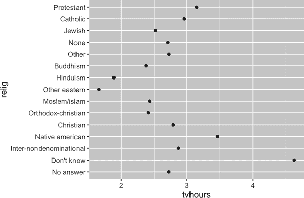
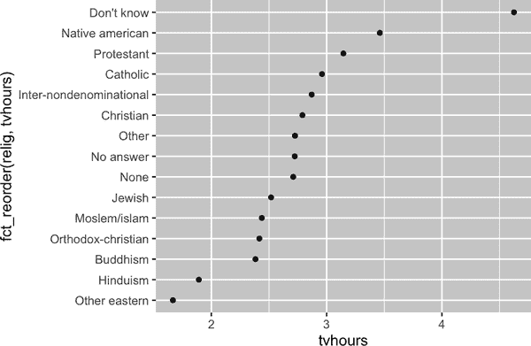
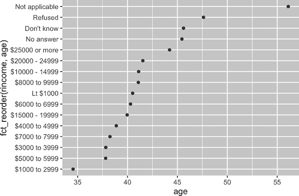
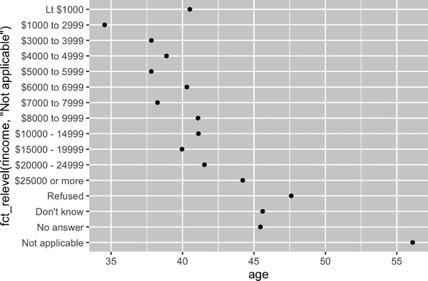
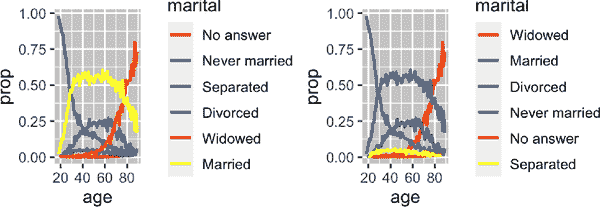
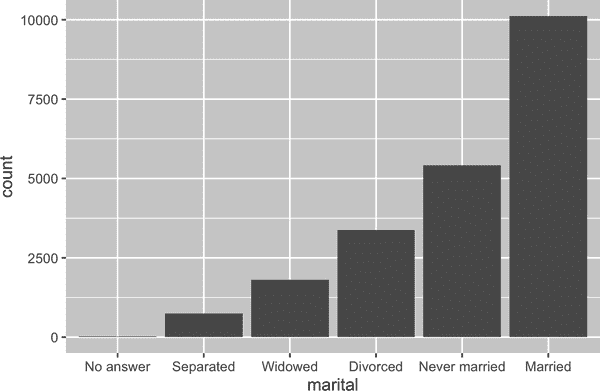

# 第十六章：因子

# 引言

因子用于分类变量，即具有固定和已知可能值集合的变量。当您希望以非字母顺序显示字符向量时，它们也很有用。

我们将首先阐明为什么在数据分析中需要因子¹，以及如何使用[`factor()`](https://rdrr.io/r/base/factor.xhtml)来创建它们。然后我们将向您介绍`gss_cat`数据集，其中包含一些分类变量供您进行实验。接下来，您将使用该数据集来练习修改因子的顺序和值，最后我们将讨论有序因子。

## 先决条件

基础 R 提供了一些基本工具来创建和操作因子。我们将通过 forcats 包进行补充，该包是核心 tidyverse 的一部分。它提供了处理*cat*egorical 变量的工具（并且它是因子的字谜！），使用各种助手处理因子。

```
library(tidyverse)
```

# 因子基础知识

想象一下，您有一个记录月份的变量：

```
x1 <- c("Dec", "Apr", "Jan", "Mar")
```

使用字符串记录此变量存在两个问题：

1.  只有 12 个可能的月份，没有任何东西可以防止您打字错误：

    ```
    x2 <- c("Dec", "Apr", "Jam", "Mar")
    ```

1.  它并不以有用的方式排序：

    ```
    sort(x1)
    #> [1] "Apr" "Dec" "Jan" "Mar"
    ```

您可以用一个因子来解决这两个问题。要创建一个因子，您必须首先创建一个有效*级别*的列表：

```
month_levels <- c(
  "Jan", "Feb", "Mar", "Apr", "May", "Jun", 
  "Jul", "Aug", "Sep", "Oct", "Nov", "Dec"
)
```

现在您可以创建一个因子：

```
y1 <- factor(x1, levels = month_levels)
y1
#> [1] Dec Apr Jan Mar
#> Levels: Jan Feb Mar Apr May Jun Jul Aug Sep Oct Nov Dec

sort(y1)
#> [1] Jan Mar Apr Dec
#> Levels: Jan Feb Mar Apr May Jun Jul Aug Sep Oct Nov Dec
```

不在级别中的任何值将会被静默转换为`NA`：

```
y2 <- factor(x2, levels = month_levels)
y2
#> [1] Dec  Apr  <NA> Mar 
#> Levels: Jan Feb Mar Apr May Jun Jul Aug Sep Oct Nov Dec
```

这看起来很冒险，所以你可能想使用[`forcats::fct()`](https://forcats.tidyverse.org/reference/fct.xhtml)代替：

```
y2 <- fct(x2, levels = month_levels)
#> Error in `fct()`:
#> ! All values of `x` must appear in `levels` or `na`
#> ℹ Missing level: "Jam"
```

如果省略级别，它们将按照字母顺序从数据中获取：

```
factor(x1)
#> [1] Dec Apr Jan Mar
#> Levels: Apr Dec Jan Mar
```

按字母顺序排序稍微有风险，因为不是每台计算机都会以相同的方式排序字符串。因此，[`forcats::fct()`](https://forcats.tidyverse.org/reference/fct.xhtml)根据首次出现顺序排序：

```
fct(x1)
#> [1] Dec Apr Jan Mar
#> Levels: Dec Apr Jan Mar
```

如果您需要直接访问有效级别集合，可以使用[`levels()`](https://rdrr.io/r/base/levels.xhtml)：

```
levels(y2)
#>  [1] "Jan" "Feb" "Mar" "Apr" "May" "Jun" "Jul" "Aug" "Sep" "Oct" "Nov" "Dec"
```

您还可以在使用 readr 读取数据时使用[`col_factor()`](https://readr.tidyverse.org/reference/parse_factor.xhtml)创建因子：

```
csv <- "
month,value
Jan,12
Feb,56
Mar,12"

df <- read_csv(csv, col_types = cols(month = col_factor(month_levels)))
df$month
#> [1] Jan Feb Mar
#> Levels: Jan Feb Mar Apr May Jun Jul Aug Sep Oct Nov Dec
```

# 普遍社会调查

在本章的其余部分，我们将使用[`forcats::gss_cat`](https://forcats.tidyverse.org/reference/gss_cat.xhtml)。这是来自[General Social Survey](https://oreil.ly/3qBI5)的数据样本，是由芝加哥大学的独立研究组织 NORC 长期进行的美国调查。该调查有成千上万个问题，所以在`gss_cat`中，Hadley 选择了一些将说明在处理因子时可能遇到的常见挑战。

```
gss_cat
#> # A tibble: 21,483 × 9
#>    year marital         age race  rincome        partyid 
#>   <int> <fct>         <int> <fct> <fct>          <fct> 
#> 1  2000 Never married    26 White $8000 to 9999  Ind,near rep 
#> 2  2000 Divorced         48 White $8000 to 9999  Not str republican
#> 3  2000 Widowed          67 White Not applicable Independent 
#> 4  2000 Never married    39 White Not applicable Ind,near rep 
#> 5  2000 Divorced         25 White Not applicable Not str democrat 
#> 6  2000 Married          25 White $20000 - 24999 Strong democrat 
#> # … with 21,477 more rows, and 3 more variables: relig <fct>, denom <fct>,
#> #   tvhours <int>
```

（记住，由于这个数据集是由一个包提供的，你可以通过[`?gss_cat`](https://forcats.tidyverse.org/reference/gss_cat.xhtml)获取关于变量的更多信息。）

当因子存储在 tibble 中时，您不能轻松地查看它们的级别。一种查看它们的方法是使用[`count()`](https://dplyr.tidyverse.org/reference/count.xhtml)：

```
gss_cat |>
  count(race)
#> # A tibble: 3 × 2
#>   race      n
#>   <fct> <int>
#> 1 Other  1959
#> 2 Black  3129
#> 3 White 16395
```

在处理因子时，最常见的两个操作是改变水平的顺序和改变水平的值。这些操作在以下部分中进行描述。

## 练习

1.  探索`rincome`（报告收入）的分布。默认的条形图为何难以理解？如何改进绘图？

1.  这项调查中最常见的`relig`是什么？最常见的`partyid`是什么？

1.  `denom`（教派）适用于哪种`relig`（宗教）？如何通过表格找出？如何通过可视化找出？

# 修改因子顺序

在可视化中改变因子水平的顺序通常很有用。例如，想象一下你想要探索每天平均看电视时间跨越宗教的情况：

```
relig_summary <- gss_cat |>
  group_by(relig) |>
  summarize(
    tvhours = mean(tvhours, na.rm = TRUE),
    n = n()
  )

ggplot(relig_summary, aes(x = tvhours, y = relig)) + 
  geom_point()
```



由于没有总体模式，阅读这个图很困难。我们可以通过使用[`fct_reorder()`](https://forcats.tidyverse.org/reference/fct_reorder.xhtml)重新排序`relig`的水平来改进它。[`fct_reorder()`](https://forcats.tidyverse.org/reference/fct_reorder.xhtml)有三个参数：

+   `f`，你想要修改其水平的因子。

+   `x`，你想要用来重新排序水平的数值向量。

+   可选，`fun`，如果每个`f`值有多个`x`值，则使用的函数。默认值是`median`。

```
ggplot(relig_summary, aes(x = tvhours, y = fct_reorder(relig, tvhours))) +
  geom_point()
```



重新排序宗教使得更容易看出，“不知道”类别的人看更多电视，印度教和其他东方宗教则看得较少。

当你开始进行更复杂的转换时，我们建议将它们从[`aes()`](https://ggplot2.tidyverse.org/reference/aes.xhtml)移出，放到单独的[`mutate()`](https://dplyr.tidyverse.org/reference/mutate.xhtml)步骤中。例如，你可以将前一个图重新编写为：

```
relig_summary |>
  mutate(
    relig = fct_reorder(relig, tvhours)
  ) |>
  ggplot(aes(x = tvhours, y = relig)) +
  geom_point()
```

如果我们创建一个类似的图，看看平均年龄如何随报告收入水平变化？

```
rincome_summary <- gss_cat |>
  group_by(rincome) |>
  summarize(
    age = mean(age, na.rm = TRUE),
    n = n()
  )

ggplot(rincome_summary, aes(x = age, y = fct_reorder(rincome, age))) + 
  geom_point()
```



在这里，任意重新排序水平不是一个好主意！这是因为`rincome`已经有一个原则性的顺序，我们不应该搞乱它。保留[`fct_reorder()`](https://forcats.tidyverse.org/reference/fct_reorder.xhtml)用于那些水平是任意排序的因子。

然而，将“不适用”与其他特殊级别一起移到前面确实有意义。您可以使用[`fct_relevel()`](https://forcats.tidyverse.org/reference/fct_relevel.xhtml)。它接受一个因子`f`，然后是您希望移到开头的任意数量级别。

```
ggplot(rincome_summary, aes(x = age, y = fct_relevel(rincome, "Not applicable"))) +
  geom_point()
```



您认为“不适用”的平均年龄为什么如此之高？

另一种重新排序类型在为绘图着色时非常有用。`fct_reorder2(f, x, y)`通过最大`x`值关联的`y`值重新排序因子`f`。这样做使得图表更易读，因为图表最右侧的线条颜色将与图例对齐。

```
by_age <- gss_cat |>
  filter(!is.na(age)) |> 
  count(age, marital) |>
  group_by(age) |>
  mutate(
    prop = n / sum(n)
  )

ggplot(by_age, aes(x = age, y = prop, color = marital)) +
  geom_line(linewidth = 1) + 
  scale_color_brewer(palette = "Set1")

ggplot(by_age, aes(x = age, y = prop, color = fct_reorder2(marital, age, prop))) +
  geom_line(linewidth = 1) +
  scale_color_brewer(palette = "Set1") + 
  labs(color = "marital") 
```



最后，对于条形图，您可以使用[`fct_infreq()`](https://forcats.tidyverse.org/reference/fct_inorder.xhtml)按降频顺序排列级别：这是最简单的重新排序类型，因为不需要额外变量。如果希望按增频顺序排列，可以与[`fct_rev()`](https://forcats.tidyverse.org/reference/fct_rev.xhtml)结合使用，这样在条形图中，最大值将位于右侧而不是左侧。

```
gss_cat |>
  mutate(marital = marital |> fct_infreq() |> fct_rev()) |>
  ggplot(aes(x = marital)) +
  geom_bar()
```



## 练习

1.  `tvhours`中有一些可疑的高数值。平均数是否是一个良好的摘要？

1.  对于`gss_cat`中的每个因子，确定级别的顺序是任意的还是有原则的。

1.  为什么将“不适用”移至级别的前面后，它会移动到绘图的底部？

# 修改因子级别

更改级别顺序比改变级别值更强大。这允许您在发布标签时澄清，并在高级显示中折叠级别。最通用和强大的工具是[`fct_recode()`](https://forcats.tidyverse.org/reference/fct_recode.xhtml)。它允许您重新编码或更改每个级别的值。例如，从`gss_cat`数据框架中获取`partyid`变量：

```
gss_cat |> count(partyid)
#> # A tibble: 10 × 2
#>   partyid                n
#>   <fct>              <int>
#> 1 No answer            154
#> 2 Don't know             1
#> 3 Other party          393
#> 4 Strong republican   2314
#> 5 Not str republican  3032
#> 6 Ind,near rep        1791
#> # … with 4 more rows
```

级别简洁且不一致。让我们将它们调整为更长并使用并列结构。像 tidyverse 中大多数重命名和重编码函数一样，新值放在左边，旧值放在右边：

```
gss_cat |>
  mutate(
    partyid = fct_recode(partyid,
      "Republican, strong"    = "Strong republican",
      "Republican, weak"      = "Not str republican",
      "Independent, near rep" = "Ind,near rep",
      "Independent, near dem" = "Ind,near dem",
      "Democrat, weak"        = "Not str democrat",
      "Democrat, strong"      = "Strong democrat"
    )
  ) |>
  count(partyid)
#> # A tibble: 10 × 2
#>   partyid                   n
#>   <fct>                 <int>
#> 1 No answer               154
#> 2 Don't know                1
#> 3 Other party             393
#> 4 Republican, strong     2314
#> 5 Republican, weak       3032
#> 6 Independent, near rep  1791
#> # … with 4 more rows
```

[`fct_recode()`](https://forcats.tidyverse.org/reference/fct_recode.xhtml)会保留未明确提及的级别，并在您意外引用不存在级别时发出警告。

要组合组，可以将多个旧级别分配到同一个新级别：

```
gss_cat |>
  mutate(
    partyid = fct_recode(partyid,
      "Republican, strong"    = "Strong republican",
      "Republican, weak"      = "Not str republican",
      "Independent, near rep" = "Ind,near rep",
      "Independent, near dem" = "Ind,near dem",
      "Democrat, weak"        = "Not str democrat",
      "Democrat, strong"      = "Strong democrat",
      "Other"                 = "No answer",
      "Other"                 = "Don't know",
      "Other"                 = "Other party"
    )
  )
```

要小心使用这种技术：如果将真正不同的级别分组，最终会导致误导性结果。

如果要折叠许多级别，[`fct_collapse()`](https://forcats.tidyverse.org/reference/fct_collapse.xhtml)是[`fct_recode()`](https://forcats.tidyverse.org/reference/fct_recode.xhtml)的有用变体。对于每个新变量，可以提供一个旧级别的向量：

```
gss_cat |>
  mutate(
    partyid = fct_collapse(partyid,
      "other" = c("No answer", "Don't know", "Other party"),
      "rep" = c("Strong republican", "Not str republican"),
      "ind" = c("Ind,near rep", "Independent", "Ind,near dem"),
      "dem" = c("Not str democrat", "Strong democrat")
    )
  ) |>
  count(partyid)
#> # A tibble: 4 × 2
#>   partyid     n
#>   <fct>   <int>
#> 1 other     548
#> 2 rep      5346
#> 3 ind      8409
#> 4 dem      7180
```

有时您只想将小组合并在一起，以使绘图或表格更简单。这就是`fct_lump_*()`函数族的工作。[`fct_lump_lowfreq()`](https://forcats.tidyverse.org/reference/fct_lump.xhtml)是一个简单的起点，它将最小组的类别逐渐合并为“Other”，始终将“Other”保持为最小类别。

```
gss_cat |>
  mutate(relig = fct_lump_lowfreq(relig)) |>
  count(relig)
#> # A tibble: 2 × 2
#>   relig          n
#>   <fct>      <int>
#> 1 Protestant 10846
#> 2 Other      10637
```

在这种情况下，它并不是很有帮助：虽然这次调查中大多数美国人是新教徒，但我们可能希望看到更多细节！相反，我们可以使用[`fct_lump_n()`](https://forcats.tidyverse.org/reference/fct_lump.xhtml)指定我们想要确切的 10 个组：

```
gss_cat |>
  mutate(relig = fct_lump_n(relig, n = 10)) |>
  count(relig, sort = TRUE)
#> # A tibble: 10 × 2
#>   relig          n
#>   <fct>      <int>
#> 1 Protestant 10846
#> 2 Catholic    5124
#> 3 None        3523
#> 4 Christian    689
#> 5 Other        458
#> 6 Jewish       388
#> # … with 4 more rows
```

阅读文档以了解有关[`fct_lump_min()`](https://forcats.tidyverse.org/reference/fct_lump.xhtml)和[`fct_lump_prop()`](https://forcats.tidyverse.org/reference/fct_lump.xhtml)的信息，它们在其他情况下非常有用。

## 练习

1.  随着时间的推移，认同民主党、共和党和独立派的人数比例如何变化？

1.  您如何将`rincome`合并为少量类别？

1.  注意在前述`fct_lump`示例中有 9 个组（不包括其他）。为什么不是 10 个？（提示：输入[`?fct_lump`](https://forcats.tidyverse.org/reference/fct_lump.xhtml)，找到参数`other_level`的默认值为“Other”。）

# 有序因子

在继续之前，需要简要提到一种特殊类型的因子：有序因子。使用[`ordered()`](https://rdrr.io/r/base/factor.xhtml)创建的有序因子暗示严格的排序和级别之间的等距：第一个级别“小于”第二个级别，与第二个级别“小于”第三个级别的量相同，依此类推。打印时可以通过级别之间的`<`来识别它们：

```
ordered(c("a", "b", "c"))
#> [1] a b c
#> Levels: a < b < c
```

在实践中，[`ordered()`](https://rdrr.io/r/base/factor.xhtml)因子的行为与常规因子类似。只有两个地方可能会注意到不同的行为：

+   如果您将有序因子映射到 ggplot2 中的颜色或填充，它将默认使用`scale_color_viridis()`/`scale_fill_viridis()`，这是一种暗示排名的颜色比例尺。

+   如果您在线性模型中使用有序函数，它将使用“多边形对比”。这些对比略有用处，但您可能从未听说过，除非您拥有统计学博士学位，即使如此，您可能也不会经常解释它们。如果您想了解更多信息，我们建议查阅`vignette("contrasts", package = "faux")`，作者是 Lisa DeBruine。

鉴于这些差异的争议性，我们通常不建议使用有序因子。

# 总结

本章向您介绍了用于处理因子的实用 forcats 包，并解释了最常用的函数。forcats 包含许多其他辅助工具，这里我们没有讨论的空间，因此每当您面临以前未遇到的因子分析挑战时，我强烈建议浏览[参考索引](https://oreil.ly/J_IIg)，看看是否有预设函数可以帮助解决您的问题。

如果您在阅读本章后想了解更多关于因子的知识，我们建议阅读 Amelia McNamara 和 Nicholas Horton 的论文，《在 R 中处理分类数据》（[“Wrangling categorical data in R”](https://oreil.ly/zPh8E)）。该论文概述了在[“stringsAsFactors: An unauthorized biography”](https://oreil.ly/Z9mkP)和[“stringsAsFactors = <sigh>”](https://oreil.ly/phWQo)中讨论的部分历史，并将本书中的整洁方法与基础 R 方法进行了比较。该论文的早期版本有助于激发并确定了 forcats 包的范围；感谢 Amelia 和 Nick！

在下一章中，我们将转换方向，开始学习 R 中的日期和时间。日期和时间看起来似乎很简单，但正如您很快会发现的那样，您学到的越多，它们似乎就变得越复杂！

¹ 对于建模来说，它们也非常重要。
