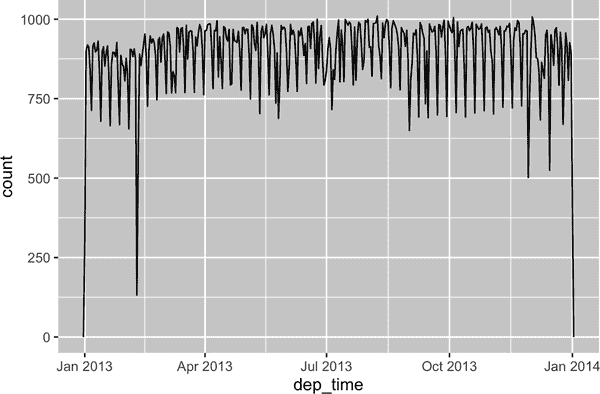
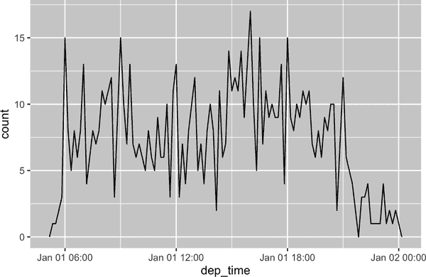
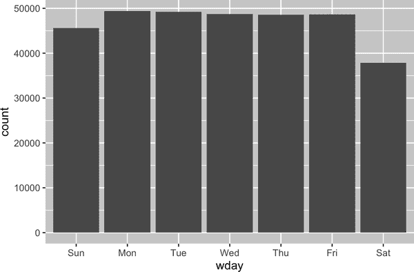
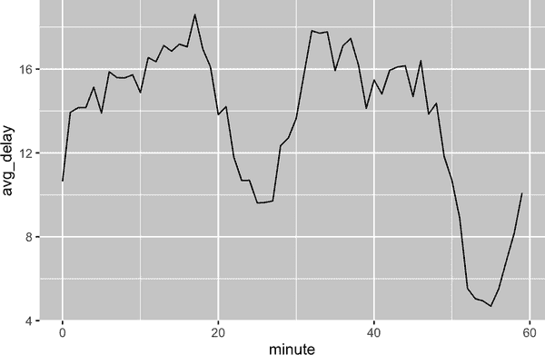
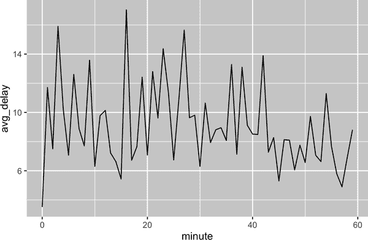
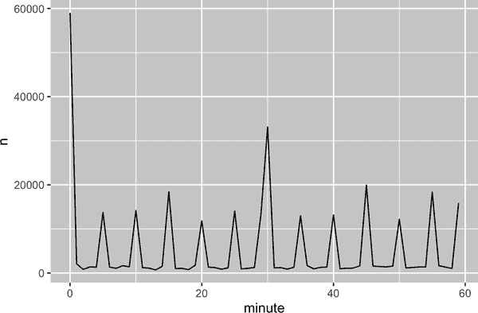
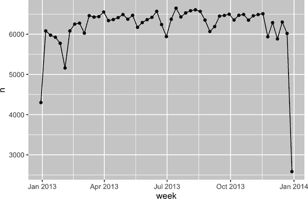
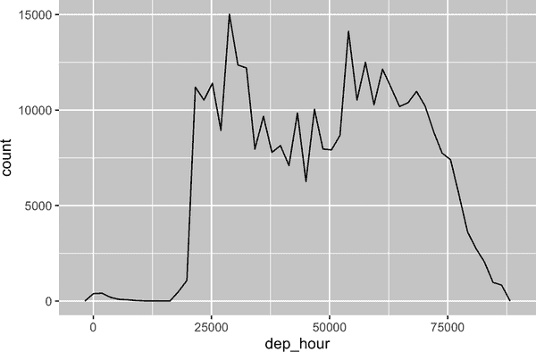
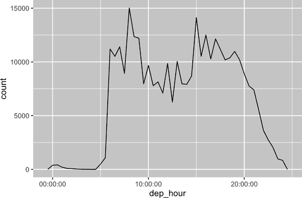

# 第十七章：日期和时间

# 介绍

本章将向您展示如何在 R 中处理日期和时间。乍一看，日期和时间似乎很简单。您在日常生活中经常使用它们，并且似乎并没有引起太多混淆。然而，您越了解日期和时间，它们似乎就越复杂！

为了热身，想想一年有多少天，一天有多少小时。你可能记得大多数年份有 365 天，但闰年有 366 天。你知道如何准确判断一个年份是否是闰年吗？¹ 一天有多少小时不那么明显：大多数日子有 24 小时，但在使用夏令时（DST）的地方，每年会有一天有 23 小时，另一天有 25 小时。

日期和时间之所以困难，是因为它们需要协调两个物理现象（地球的自转和绕太阳公转），以及一系列地缘政治现象，包括月份、时区和夏令时。本章不会教会您关于日期和时间的每一个细节，但它将为您提供实用技能的坚实基础，帮助您解决常见的数据分析挑战。

我们将从展示如何从不同输入创建日期时间开始，一旦您有了日期时间，您将学习如何提取年、月和日等组件。然后我们将深入讨论处理时间跨度的复杂主题，这取决于您尝试做什么，有多种不同的选择。最后我们将简要讨论时区带来的额外挑战。

## 先决条件

本章将专注于 lubridate 包，在 R 中更轻松地处理日期和时间。截至最新的 tidyverse 发布版本，lubridate 已成为核心 tidyverse 的一部分。我们还需要 nycflights13 作为实践数据。

```
library(tidyverse)
library(nycflights13)
```

# 创建日期/时间

有三种时间/日期数据类型指代某一时刻：

+   *日期*。Tibbles 打印为 `<date>`。

+   *一天内的时间*。Tibbles 打印为 `<time>`。

+   *日期时间*是日期加时间：它唯一标识一个时刻（通常精确到最近的秒）。Tibbles 打印为 `<dttm>`。基础 R 称之为 POSIXct，但这个术语不太口语化。

在本章中，我们将专注于日期和日期时间，因为 R 没有用于存储时间的本机类。如果需要，您可以使用 hms 包。

您应该始终使用最简单可能的数据类型来满足您的需求。这意味着如果可以使用日期而不是日期时间，您应该这样做。由于需要处理时区，日期时间要复杂得多，我们将在本章末尾回顾这一点。

要获取当前日期或日期时间，您可以使用[`today()`](https://lubridate.tidyverse.org/reference/now.xhtml)或[`now()`](https://lubridate.tidyverse.org/reference/now.xhtml)：

```
today()
#> [1] "2023-03-12"
now()
#> [1] "2023-03-12 13:07:31 CDT"
```

此外，以下各节描述了您可能会创建日期/时间的四种常见方式：

+   在使用 readr 读取文件时

+   从字符串

+   从单独的日期时间组件

+   从现有的日期/时间对象

## 在导入期间

如果您的 CSV 包含 ISO8601 日期或日期时间，则无需进行任何操作；readr 将自动识别它：

```
csv <- "
 date,datetime
 2022-01-02,2022-01-02 05:12
"
read_csv(csv)
#> # A tibble: 1 × 2
#>   date       datetime 
#>   <date>     <dttm> 
#> 1 2022-01-02 2022-01-02 05:12:00
```

如果您之前没有听说过*ISO8601*，它是一个[国际标准](https://oreil.ly/19K7t)，用于编写日期，其中日期的组成部分从最大到最小排列，用`-`分隔。例如，在 ISO8601 中，2022 年 5 月 3 日写作`2022-05-03`。ISO8601 日期还可以包括时间，其中小时、分钟和秒以`:`分隔，日期和时间组件以`T`或空格分隔。例如，您可以将 2022 年 5 月 3 日下午 4 点 26 分写为`2022-05-03 16:26`或`2022-05-03T16:26`。

对于其他日期时间格式，您需要使用`col_types`加上[`col_date()`](https://readr.tidyverse.org/reference/parse_datetime.xhtml)或[`col_datetime()`](https://readr.tidyverse.org/reference/parse_datetime.xhtml)，以及日期时间格式。readr 使用的日期时间格式是许多编程语言中通用的标准，描述日期组件的方式为`%`后跟单个字符。例如，`%Y-%m-%d`指定了一个日期，年份`-`月份（数字）`-`日。表 17-1 列出了所有选项。

表 17-1。readr 理解的所有日期格式

| 类型 | 代码 | 意义 | 示例 |
| --- | --- | --- | --- |
| 年份 | `%Y` | 4 位数年份 | 2021 |
|  | `%y` | 2 位数年份 | 21 |
| 月份 | `%m` | 数字 | 2 |
|  | `%b` | 缩写名 | 二月 |
|  | `%B` | 全名 | 二月 |
| 日 | `%d` | 两位数 | 02 |
|  | `%e` | 一位或两位数字 | 2 |
| 时间 | `%H` | 24 小时制小时 | 13 |
|  | `%I` | 12 小时制小时 | 1 |
|  | `%p` | 上午/下午 | 下午 |
|  | `%M` | 分钟 | 35 |
|  | `%S` | 秒数 | 45 |
|  | `%OS` | 带小数部分的秒 | 45.35 |
|  | `%Z` | 时区名称 | 美国/芝加哥 |
|  | `%z` | 与 UTC 的偏移 | +0800 |
| 其他 | `%.` | 跳过一个非数字 | : |
|  | `%*` | 跳过任意数量的非数字 |  |

此代码显示应用于非常模糊日期的几个选项：

```
csv <- "
 date
 01/02/15
"

read_csv(csv, col_types = cols(date = col_date("%m/%d/%y")))
#> # A tibble: 1 × 1
#>   date 
#>   <date> 
#> 1 2015-01-02

read_csv(csv, col_types = cols(date = col_date("%d/%m/%y")))
#> # A tibble: 1 × 1
#>   date 
#>   <date> 
#> 1 2015-02-01

read_csv(csv, col_types = cols(date = col_date("%y/%m/%d")))
#> # A tibble: 1 × 1
#>   date 
#>   <date> 
#> 1 2001-02-15
```

请注意，无论您如何指定日期格式，一旦将其输入到 R 中，它始终以相同的方式显示。

如果您使用`%b`或`%B`并处理非英文日期，则还需要提供[`locale()`](https://readr.tidyverse.org/reference/locale.xhtml)。请参阅[`date_names_langs()`](https://readr.tidyverse.org/reference/date_names.xhtml)中的内置语言列表，或使用[`date_names()`](https://readr.tidyverse.org/reference/date_names.xhtml)创建自己的语言。

## 从字符串

日期时间规范语言功能强大，但需要仔细分析日期格式。另一种方法是使用 lubridate 的辅助函数，它们会在你指定组件顺序后尝试自动确定格式。要使用它们，确定年、月和日在你的日期中的顺序；然后以相同的顺序排列“y”、“m”和“d”。这将为你提供一个 lubridate 函数的名称，该函数将解析你的日期。例如：

```
ymd("2017-01-31")
#> [1] "2017-01-31"
mdy("January 31st, 2017")
#> [1] "2017-01-31"
dmy("31-Jan-2017")
#> [1] "2017-01-31"
```

[`ymd()`](https://lubridate.tidyverse.org/reference/ymd.xhtml) 和其它函数用于创建日期。要创建日期时间，只需在解析函数的名称后面加上一个或多个“h”、“m”和“s”的下划线：

```
ymd_hms("2017-01-31 20:11:59")
#> [1] "2017-01-31 20:11:59 UTC"
mdy_hm("01/31/2017 08:01")
#> [1] "2017-01-31 08:01:00 UTC"
```

你也可以通过指定时区强制创建一个日期时间：

```
ymd("2017-01-31", tz = "UTC")
#> [1] "2017-01-31 UTC"
```

我使用的时区是 UTC²，你可能也知道它作为 GMT 或格林尼治标准时间，即 0°经线处的时间³。这个时区不使用夏令时，计算起来更加简单。

## 从个别组件

有时你会有日期时间的各个组件分布在多个列中，这就是我们在`flights`数据中遇到的情况：

```
flights |> 
  select(year, month, day, hour, minute)
#> # A tibble: 336,776 × 5
#>    year month   day  hour minute
#>   <int> <int> <int> <dbl>  <dbl>
#> 1  2013     1     1     5     15
#> 2  2013     1     1     5     29
#> 3  2013     1     1     5     40
#> 4  2013     1     1     5     45
#> 5  2013     1     1     6      0
#> 6  2013     1     1     5     58
#> # … with 336,770 more rows
```

要从这种输入创建日期/时间，请使用[`make_date()`](https://lubridate.tidyverse.org/reference/make_datetime.xhtml)用于日期，或使用[`make_datetime()`](https://lubridate.tidyverse.org/reference/make_datetime.xhtml)用于日期时间：

```
flights |> 
  select(year, month, day, hour, minute) |> 
  mutate(departure = make_datetime(year, month, day, hour, minute))
#> # A tibble: 336,776 × 6
#>    year month   day  hour minute departure 
#>   <int> <int> <int> <dbl>  <dbl> <dttm> 
#> 1  2013     1     1     5     15 2013-01-01 05:15:00
#> 2  2013     1     1     5     29 2013-01-01 05:29:00
#> 3  2013     1     1     5     40 2013-01-01 05:40:00
#> 4  2013     1     1     5     45 2013-01-01 05:45:00
#> 5  2013     1     1     6      0 2013-01-01 06:00:00
#> 6  2013     1     1     5     58 2013-01-01 05:58:00
#> # … with 336,770 more rows
```

让我们对`flights`中的四个时间列做同样的事情。这些时间以稍微奇怪的格式表示，因此我们使用模数运算来提取小时和分钟组件。创建了日期时间变量后，我们将重点放在本章余下部分将要探索的变量上。

```
make_datetime_100 <- function(year, month, day, time) {
  make_datetime(year, month, day, time %/% 100, time %% 100)
}

flights_dt <- flights |> 
  filter(!is.na(dep_time), !is.na(arr_time)) |> 
  mutate(
    dep_time = make_datetime_100(year, month, day, dep_time),
    arr_time = make_datetime_100(year, month, day, arr_time),
    sched_dep_time = make_datetime_100(year, month, day, sched_dep_time),
    sched_arr_time = make_datetime_100(year, month, day, sched_arr_time)
  ) |> 
  select(origin, dest, ends_with("delay"), ends_with("time"))

flights_dt
#> # A tibble: 328,063 × 9
#>   origin dest  dep_delay arr_delay dep_time            sched_dep_time 
#>   <chr>  <chr>     <dbl>     <dbl> <dttm>              <dttm> 
#> 1 EWR    IAH           2        11 2013-01-01 05:17:00 2013-01-01 05:15:00
#> 2 LGA    IAH           4        20 2013-01-01 05:33:00 2013-01-01 05:29:00
#> 3 JFK    MIA           2        33 2013-01-01 05:42:00 2013-01-01 05:40:00
#> 4 JFK    BQN          -1       -18 2013-01-01 05:44:00 2013-01-01 05:45:00
#> 5 LGA    ATL          -6       -25 2013-01-01 05:54:00 2013-01-01 06:00:00
#> 6 EWR    ORD          -4        12 2013-01-01 05:54:00 2013-01-01 05:58:00
#> # … with 328,057 more rows, and 3 more variables: arr_time <dttm>,
#> #   sched_arr_time <dttm>, air_time <dbl>
```

有了这些数据，我们可以可视化整年出发时间的分布情况：

```
flights_dt |> 
  ggplot(aes(x = dep_time)) + 
  geom_freqpoly(binwidth = 86400) # 86400 seconds = 1 day
```



或者在同一天内：

```
flights_dt |> 
  filter(dep_time < ymd(20130102)) |> 
  ggplot(aes(x = dep_time)) + 
  geom_freqpoly(binwidth = 600) # 600 s = 10 minutes
```



注意，当你在数值上下文中（比如直方图）使用日期时间时，1 代表 1 秒，因此 86400 的区间宽度代表一天。对于日期，1 表示 1 天。

## 从其他类型

您可能需要在日期时间和日期之间切换。这就是[`as_datetime()`](https://lubridate.tidyverse.org/reference/as_date.xhtml)和[`as_date()`](https://lubridate.tidyverse.org/reference/as_date.xhtml)的作用：

```
as_datetime(today())
#> [1] "2023-03-12 UTC"
as_date(now())
#> [1] "2023-03-12"
```

有时您会得到作为从“Unix 纪元”1970-01-01 开始的数值偏移的日期/时间。如果偏移以秒为单位，请使用[`as_datetime()`](https://lubridate.tidyverse.org/reference/as_date.xhtml)；如果以天数为单位，请使用[`as_date()`](https://lubridate.tidyverse.org/reference/as_date.xhtml)。

```
as_datetime(60 * 60 * 10)
#> [1] "1970-01-01 10:00:00 UTC"
as_date(365 * 10 + 2)
#> [1] "1980-01-01"
```

## 练习

1.  如果解析包含无效日期的字符串会发生什么？

    ```
    ymd(c("2010-10-10", "bananas"))
    ```

1.  [`today()`](https://lubridate.tidyverse.org/reference/now.xhtml)函数的`tzone`参数是做什么的？为什么它很重要？

1.  对于以下每个日期时间，展示您如何使用 readr 列规范和 lubridate 函数来解析它。

    ```
    d1 <- "January 1, 2010"
    d2 <- "2015-Mar-07"
    d3 <- "06-Jun-2017"
    d4 <- c("August 19 (2015)", "July 1 (2015)")
    d5 <- "12/30/14" # Dec 30, 2014
    t1 <- "1705"
    t2 <- "11:15:10.12 PM"
    ```

# 日期时间组件

现在您已经知道如何将日期时间数据输入到 R 的日期时间数据结构中，让我们探讨您可以用它们做什么。本节将重点介绍让您获取和设置单个组件的访问器函数。接下来的部分将介绍日期时间的算术运算如何工作。

## 获取组件

您可以使用访问器函数[`year()`](https://lubridate.tidyverse.org/reference/year.xhtml)、[`month()`](https://lubridate.tidyverse.org/reference/month.xhtml)、[`mday()`](https://lubridate.tidyverse.org/reference/day.xhtml)（月中的某一天）、[`yday()`](https://lubridate.tidyverse.org/reference/day.xhtml)（年中的某一天）、[`wday()`](https://lubridate.tidyverse.org/reference/day.xhtml)（星期几）、[`hour()`](https://lubridate.tidyverse.org/reference/hour.xhtml)、[`minute()`](https://lubridate.tidyverse.org/reference/minute.xhtml)和[`second()`](https://lubridate.tidyverse.org/reference/second.xhtml)来获取日期的各个部分。这些函数实际上是[`make_datetime()`](https://lubridate.tidyverse.org/reference/make_datetime.xhtml)的反向操作。

```
datetime <- ymd_hms("2026-07-08 12:34:56")

year(datetime)
#> [1] 2026
month(datetime)
#> [1] 7
mday(datetime)
#> [1] 8

yday(datetime)
#> [1] 189
wday(datetime)
#> [1] 4
```

对于[`month()`](https://lubridate.tidyverse.org/reference/month.xhtml)和[`wday()`](https://lubridate.tidyverse.org/reference/day.xhtml)，您可以设置`label = TRUE`以返回月份或星期几的缩写名称。将`abbr = FALSE`设置为返回完整名称。

```
month(datetime, label = TRUE)
#> [1] Jul
#> 12 Levels: Jan < Feb < Mar < Apr < May < Jun < Jul < Aug < Sep < ... < Dec
wday(datetime, label = TRUE, abbr = FALSE)
#> [1] Wednesday
#> 7 Levels: Sunday < Monday < Tuesday < Wednesday < Thursday < ... < Saturday
```

我们可以使用[`wday()`](https://lubridate.tidyverse.org/reference/day.xhtml)来查看工作日比周末更多的航班离港情况：

```
flights_dt |> 
  mutate(wday = wday(dep_time, label = TRUE)) |> 
  ggplot(aes(x = wday)) +
  geom_bar()
```



我们还可以查看每小时内按分钟计算的平均出发延误时间。有一个有趣的模式：在 20-30 分钟和 50-60 分钟离开的航班的延误要比整点其他时间段的航班低得多！

```
flights_dt |> 
  mutate(minute = minute(dep_time)) |> 
  group_by(minute) |> 
  summarize(
    avg_delay = mean(dep_delay, na.rm = TRUE),
    n = n()
  ) |> 
  ggplot(aes(x = minute, y = avg_delay)) +
  geom_line()
```



有趣的是，如果我们看的是*计划*出发时间，我们就看不到这样强烈的模式：

```
sched_dep <- flights_dt |> 
  mutate(minute = minute(sched_dep_time)) |> 
  group_by(minute) |> 
  summarize(
    avg_delay = mean(arr_delay, na.rm = TRUE),
    n = n()
  )

ggplot(sched_dep, aes(x = minute, y = avg_delay)) +
  geom_line()
```



那么为什么我们在实际出发时间中看到这样的模式呢？嗯，像许多由人类收集的数据一样，这些数据显示出对“好”出发时间的强烈偏好，如 图 17-1 所示。在处理涉及人类判断的数据时，务必警惕这种模式！



###### 图 17-1\. 一个频率多边形展示每小时计划出发的航班数量。可以看到对于 0 和 30 这样的整数以及通常为 5 的倍数有很强的偏好。

## 舍入

另一种绘制单独组件的方法是将日期四舍五入到附近的时间单位，使用 [`floor_date()`](https://lubridate.tidyverse.org/reference/round_date.xhtml)、[`round_date()`](https://lubridate.tidyverse.org/reference/round_date.xhtml) 和 [`ceiling_date()`](https://lubridate.tidyverse.org/reference/round_date.xhtml)。每个函数接受需要调整的日期向量，然后是要向下舍入（floor）、向上舍入（ceiling）或四舍五入到的单位名称。例如，这使我们可以绘制每周的航班数量：

```
flights_dt |> 
  count(week = floor_date(dep_time, "week")) |> 
  ggplot(aes(x = week, y = n)) +
  geom_line() + 
  geom_point()
```



你可以使用四舍五入来展示一天内航班的分布，方法是计算 `dep_time` 和当天最早时间的差：

```
flights_dt |> 
  mutate(dep_hour = dep_time - floor_date(dep_time, "day")) |> 
  ggplot(aes(x = dep_hour)) +
  geom_freqpoly(binwidth = 60 * 30)
#> Don't know how to automatically pick scale for object of type <difftime>.
#> Defaulting to continuous.
```



计算一对日期时间之间的差异会产生一个 difftime（关于此更多内容请参见“间隔”）。我们可以将其转换为一个`hms`对象以获得更有用的 x 轴：

```
flights_dt |> 
  mutate(dep_hour = hms::as_hms(dep_time - floor_date(dep_time, "day"))) |> 
  ggplot(aes(x = dep_hour)) +
  geom_freqpoly(binwidth = 60 * 30)
```



## 修改组件

你也可以使用每个访问函数来修改日期/时间的组件。这在数据分析中并不常见，但在清理明显错误日期的数据时可能很有用。

```
(datetime <- ymd_hms("2026-07-08 12:34:56"))
#> [1] "2026-07-08 12:34:56 UTC"

year(datetime) <- 2030
datetime
#> [1] "2030-07-08 12:34:56 UTC"
month(datetime) <- 01
datetime
#> [1] "2030-01-08 12:34:56 UTC"
hour(datetime) <- hour(datetime) + 1
datetime
#> [1] "2030-01-08 13:34:56 UTC"
```

或者，而不是修改现有的变量，你可以使用[`update()`](https://rdrr.io/r/stats/update.xhtml)创建一个新的日期时间。这还允许你一次设置多个值：

```
update(datetime, year = 2030, month = 2, mday = 2, hour = 2)
#> [1] "2030-02-02 02:34:56 UTC"
```

如果值太大，它们会回滚：

```
update(ymd("2023-02-01"), mday = 30)
#> [1] "2023-03-02"
update(ymd("2023-02-01"), hour = 400)
#> [1] "2023-02-17 16:00:00 UTC"
```

## 练习

1.  一年中一天内航班时间分布如何变化？

1.  比较`dep_time`、`sched_dep_time`和`dep_delay`。它们是否一致？解释你的发现。

1.  比较`air_time`和起飞到达之间的时间间隔。解释你的发现。（提示：考虑机场的位置。）

1.  一天中平均延误时间如何变化？应该使用`dep_time`还是`sched_dep_time`？为什么？

1.  如果想要最小化延误的机会，一周中哪一天应该出发？

1.  什么使得`diamonds$carat`和`flights$sched_dep_time`的分布类似？

1.  确认我们的假设，即航班在 20-30 分钟和 50-60 分钟的早期离开是由提前出发的计划航班引起的。提示：创建一个二元变量，告诉你航班是否延误。

# 时间跨度

接下来，你将学习日期运算的工作原理，包括减法、加法和除法。在此过程中，你将了解三个重要的表示时间跨度的类别：

持续时间

表示精确的秒数

时间段

表示像周和月这样的人类单位

间隔

表示起点和终点

在持续时间、时间段和间隔之间如何选择？与往常一样，选择最简单的数据结构来解决你的问题。如果你只关心物理时间，使用持续时间；如果你需要添加人类时间，使用时间段；如果你需要计算时间跨度的长度，则使用间隔。

## 持续时间

在 R 语言中，当你减去两个日期时，会得到一个`difftime`对象：

```
# How old is Hadley?
h_age <- today() - ymd("1979-10-14")
h_age
#> Time difference of 15855 days
```

`difftime`类对象记录以秒、分钟、小时、天或周为单位的时间跨度。这种模棱两可可能会使 difftime 对象在处理时有点麻烦，因此 lubridate 提供了一种始终使用秒的替代方案：*持续时间*。

```
as.duration(h_age)
#> [1] "1369872000s (~43.41 years)"
```

持续时间配有一系列便捷的构造函数：

```
dseconds(15)
#> [1] "15s"
dminutes(10)
#> [1] "600s (~10 minutes)"
dhours(c(12, 24))
#> [1] "43200s (~12 hours)" "86400s (~1 days)"
ddays(0:5)
#> [1] "0s"                "86400s (~1 days)"  "172800s (~2 days)"
#> [4] "259200s (~3 days)" "345600s (~4 days)" "432000s (~5 days)"
dweeks(3)
#> [1] "1814400s (~3 weeks)"
dyears(1)
#> [1] "31557600s (~1 years)"
```

持续时间总是以秒为单位记录时间跨度。较大的单位通过将分钟、小时、天、周和年转换为秒来创建：1 分钟 60 秒，1 小时 60 分钟，1 天 24 小时，1 周 7 天。较大的时间单位更加复杂。一年使用了“平均”每年的天数，即 365.25。没有办法将一个月转换为持续时间，因为变化太大。

您可以对持续时间进行加法和乘法运算：

```
2 * dyears(1)
#> [1] "63115200s (~2 years)"
dyears(1) + dweeks(12) + dhours(15)
#> [1] "38869200s (~1.23 years)"
```

您可以将持续时间加减到天数中：

```
tomorrow <- today() + ddays(1)
last_year <- today() - dyears(1)
```

但是，因为持续时间表示确切的秒数，有时您可能会得到意外的结果：

```
one_am <- ymd_hms("2026-03-08 01:00:00", tz = "America/New_York")

one_am
#> [1] "2026-03-08 01:00:00 EST"
one_am + ddays(1)
#> [1] "2026-03-09 02:00:00 EDT"
```

为什么 3 月 8 日凌晨 1 点后一天是 3 月 9 日凌晨 2 点？如果您仔细查看日期，您可能还会注意到时区已经发生了变化。3 月 8 日仅有 23 小时，因为这是夏令时开始的时候，因此如果我们增加一整天的秒数，最终得到的时间会有所不同。

## 时期

要解决这个问题，lubridate 提供了*时期*。时期是时间跨度，但没有固定的秒数长度；相反，它们处理像天和月这样的“人类”时间，这使它们以更直观的方式工作：

```
one_am
#> [1] "2026-03-08 01:00:00 EST"
one_am + days(1)
#> [1] "2026-03-09 01:00:00 EDT"
```

类似于持续时间，时期可以使用多个友好的构造函数创建：

```
hours(c(12, 24))
#> [1] "12H 0M 0S" "24H 0M 0S"
days(7)
#> [1] "7d 0H 0M 0S"
months(1:6)
#> [1] "1m 0d 0H 0M 0S" "2m 0d 0H 0M 0S" "3m 0d 0H 0M 0S" "4m 0d 0H 0M 0S"
#> [5] "5m 0d 0H 0M 0S" "6m 0d 0H 0M 0S"
```

您可以对时期进行加法和乘法运算：

```
10 * (months(6) + days(1))
#> [1] "60m 10d 0H 0M 0S"
days(50) + hours(25) + minutes(2)
#> [1] "50d 25H 2M 0S"
```

当然，也可以将它们添加到日期中。与持续时间相比，时期更有可能做出您所期望的事情：

```
# A leap year
ymd("2024-01-01") + dyears(1)
#> [1] "2024-12-31 06:00:00 UTC"
ymd("2024-01-01") + years(1)
#> [1] "2025-01-01"

# Daylight savings time
one_am + ddays(1)
#> [1] "2026-03-09 02:00:00 EDT"
one_am + days(1)
#> [1] "2026-03-09 01:00:00 EDT"
```

让我们使用时期来修正与我们的航班日期相关的奇怪现象。有些飞机似乎在从纽约市出发之前就已经到达了目的地：

```
flights_dt |> 
  filter(arr_time < dep_time) 
#> # A tibble: 10,633 × 9
#>   origin dest  dep_delay arr_delay dep_time            sched_dep_time 
#>   <chr>  <chr>     <dbl>     <dbl> <dttm>              <dttm> 
#> 1 EWR    BQN           9        -4 2013-01-01 19:29:00 2013-01-01 19:20:00
#> 2 JFK    DFW          59        NA 2013-01-01 19:39:00 2013-01-01 18:40:00
#> 3 EWR    TPA          -2         9 2013-01-01 20:58:00 2013-01-01 21:00:00
#> 4 EWR    SJU          -6       -12 2013-01-01 21:02:00 2013-01-01 21:08:00
#> 5 EWR    SFO          11       -14 2013-01-01 21:08:00 2013-01-01 20:57:00
#> 6 LGA    FLL         -10        -2 2013-01-01 21:20:00 2013-01-01 21:30:00
#> # … with 10,627 more rows, and 3 more variables: arr_time <dttm>,
#> #   sched_arr_time <dttm>, air_time <dbl>
```

这些是过夜航班。我们在出发时间和到达时间都使用了相同的日期信息，但这些航班到达时已经是第二天了。我们可以通过在每个过夜航班的到达时间上添加`days(1)`来修正这个问题：

```
flights_dt <- flights_dt |> 
  mutate(
    overnight = arr_time < dep_time,
    arr_time = arr_time + days(overnight),
    sched_arr_time = sched_arr_time + days(overnight)
  )
```

现在我们所有的航班都遵循物理定律：

```
flights_dt |> 
  filter(arr_time < dep_time) 
#> # A tibble: 0 × 10
# … with 10 variables: origin <chr>, dest <chr>, dep_delay <dbl>,
#   arr_delay <dbl>, dep_time <dttm>, sched_dep_time <dttm>, …
# ℹ Use `colnames()` to see all variable names
#> # … with 10,627 more rows, and 4 more variables: 
```

## 区间

`dyears(1) / ddays(365)`返回什么？它不完全是 1，因为`dyears()`被定义为平均每年的秒数，即 365.25 天。

`years(1) / days(1)`返回什么？好吧，如果是 2015 年，应该返回 365，但如果是 2016 年，应该返回 366！lubridate 没有足够的信息给出一个单一明确的答案。它所做的是给出一个估计值：

```
years(1) / days(1)
#> [1] 365.25
```

如果您想要更准确的测量结果，您将需要使用*区间*。区间是一对起始和结束日期时间，或者您可以将其视为具有起始点的持续时间。

您可以通过编写`start %--% end`来创建一个区间：

```
y2023 <- ymd("2023-01-01") %--% ymd("2024-01-01")
y2024 <- ymd("2024-01-01") %--% ymd("2025-01-01")

y2023
#> [1] 2023-01-01 UTC--2024-01-01 UTC
y2024
#> [1] 2024-01-01 UTC--2025-01-01 UTC
```

您可以通过[`days()`](https://lubridate.tidyverse.org/reference/period.xhtml)来将其除以，以找出一年中有多少天：

```
y2023 / days(1)
#> [1] 365
y2024 / days(1)
#> [1] 366
```

## 练习

1.  向刚开始学习 R 的人解释`days(!overnight)`和`days(overnight)`，你需要知道的关键事实是什么？

1.  创建一个向量，其中包含 2015 年每个月的第一天的日期。创建一个向量，其中包含*当前*年每个月的第一天的日期。

1.  编写一个函数，给定您的生日（作为日期），返回您的年龄。

1.  为什么 `(today() %--% (today() + years(1))) / months(1)` 不能工作？

# 时区

时区是一个极其复杂的主题，因为它们与地缘政治实体的互动。 幸运的是，我们不需要深入研究所有细节，因为它们对于数据分析并不都重要，但我们需要直面一些挑战。

第一个挑战是时区的日常名称往往是模糊的。 例如，如果您是美国人，您可能熟悉东部标准时间（EST）。 但是，澳大利亚和加拿大也都有 EST！ 为了避免混淆，R 使用国际标准 IANA 时区。 这些使用一致的命名方案 `{area}/{location}`，通常以 `{continent}/{city}` 或 `{ocean}/{city}` 的形式。 示例包括“America/New_York”、“Europe/Paris” 和 “Pacific/Auckland”。

您可能想知道为什么时区使用城市，而通常您认为时区与国家或国家内的地区相关联。 这是因为 IANA 数据库必须记录数十年的时区规则。 在几十年的时间里，国家经常更改名称（或分裂），但城市名称倾向于保持不变。 另一个问题是，名称需要反映不仅当前行为还完整的历史。 例如，有“America/New_York”和“America/Detroit”的时区。 这些城市目前都使用东部标准时间，但在 1969 年至 1972 年间，密歇根州（底特律所在的州）不遵循夏令时，因此需要不同的名称。 值得阅读 [原始时区数据库](https://oreil.ly/NwvsT) 以了解其中一些故事！

您可以使用 [`Sys.timezone()`](https://rdrr.io/r/base/timezones.xhtml) 找出 R 认为您当前的时区是什么：

```
Sys.timezone()
#> [1] "America/Chicago"
```

（如果 R 不知道，您将获得 `NA`。）

并查看带有 [`OlsonNames()`](https://rdrr.io/r/base/timezones.xhtml) 的所有时区名称的完整列表：

```
length(OlsonNames())
#> [1] 597
head(OlsonNames())
#> [1] "Africa/Abidjan"     "Africa/Accra"       "Africa/Addis_Ababa"
#> [4] "Africa/Algiers"     "Africa/Asmara"      "Africa/Asmera"
```

在 R 中，时区是仅控制打印的日期时间的属性。 例如，这三个对象代表相同的时间瞬间：

```
x1 <- ymd_hms("2024-06-01 12:00:00", tz = "America/New_York")
x1
#> [1] "2024-06-01 12:00:00 EDT"

x2 <- ymd_hms("2024-06-01 18:00:00", tz = "Europe/Copenhagen")
x2
#> [1] "2024-06-01 18:00:00 CEST"

x3 <- ymd_hms("2024-06-02 04:00:00", tz = "Pacific/Auckland")
x3
#> [1] "2024-06-02 04:00:00 NZST"
```

您可以通过减法验证它们是否是同一时间：

```
x1 - x2
#> Time difference of 0 secs
x1 - x3
#> Time difference of 0 secs
```

除非另有说明，否则 lubridate 总是使用 UTC。 UTC 是科学界使用的标准时区，大致相当于 GMT。 它没有夏令时，这使得它成为计算的方便表示。 像 [`c()`](https://rdrr.io/r/base/c.xhtml) 这样的组合日期时间的操作通常会丢弃时区。 在这种情况下，日期时间将以第一个元素的时区显示：

```
x4 <- c(x1, x2, x3)
x4
#> [1] "2024-06-01 12:00:00 EDT" "2024-06-01 12:00:00 EDT"
#> [3] "2024-06-01 12:00:00 EDT"
```

您可以以两种方式更改时区：

+   保持时间瞬间相同，更改其显示方式。 当瞬间是正确的，但您希望获得更自然的显示时，请使用此选项。

    ```
    x4a <- with_tz(x4, tzone = "Australia/Lord_Howe")
    x4a
    #> [1] "2024-06-02 02:30:00 +1030" "2024-06-02 02:30:00 +1030"
    #> [3] "2024-06-02 02:30:00 +1030"
    x4a - x4
    #> Time differences in secs
    #> [1] 0 0 0
    ```

    （这也说明了时区的另一个挑战：它们不全是整点偏移！）

+   更改底层的时间点。当你有一个带有错误时区标签的时间点，并且需要修正时使用这个选项。

    ```
    x4b <- force_tz(x4, tzone = "Australia/Lord_Howe")
    x4b
    #> [1] "2024-06-01 12:00:00 +1030" "2024-06-01 12:00:00 +1030"
    #> [3] "2024-06-01 12:00:00 +1030"
    x4b - x4
    #> Time differences in hours
    #> [1] -14.5 -14.5 -14.5
    ```

# 总结

本章向你介绍了 lubridate 提供的工具，帮助你处理日期时间数据。处理日期和时间可能比必要的更难，但我们希望这一章能帮助你看清楚原因——日期时间比一开始看起来的更复杂，处理每种可能的情况都增加了复杂性。即使你的数据从不跨越夏令时边界或涉及闰年，函数也需要能够处理。

下一章将总结缺失值。你已经在几个地方见过它们，并且无疑在自己的分析中遇到过，现在是时候提供一些有用的技术来处理它们了。

¹ 如果一个年份能被 4 整除，则是闰年，除非它也能被 100 整除，除非它也能被 400 整除。换句话说，在每 400 年的周期中，有 97 个闰年。

² 你可能想知道 UTC 是什么意思。它是英文“Coordinated Universal Time”和法文“Temps Universel Coordonné”的折衷结果。

³ 猜猜看是哪个国家提出了经度系统，答对没有奖励。
