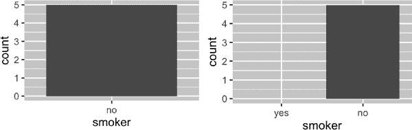

# 第十八章：缺失值

# 介绍

你在本书的前面已经学习了缺失值的基础知识。你首次在第一章中看到它们，在绘制图时会出现警告，以及在“summarize()”中看到它们干扰了计算汇总统计信息，还学会了它们的传染性以及如何检查它们在“缺失值”中的存在。现在我们将更深入地回顾它们，以便你能更详细地了解。

我们将首先讨论一些通用工具，用于处理记录为`NA`的缺失值。然后我们将探讨隐含缺失值的概念，即在数据中简单地缺失的值，并展示一些可以使它们显式的工具。最后，我们将讨论由于数据中不存在的因子水平而导致的空组的相关讨论。

## 先决条件

处理缺失数据的函数主要来自于 dplyr 和 tidyr，它们是 tidyverse 的核心成员之一。

```
library(tidyverse)
```

# 显式缺失值

首先，让我们探索一些方便的工具来创建或消除显式缺失值，即看到`NA`的单元格。

## 向前填充最后观测

缺失值的常见用途是作为数据输入的便利性。当数据手动输入时，缺失值有时表示前一行的值已重复（或向前填充）：

```
treatment <- tribble(
  ~person,           ~treatment, ~response,
  "Derrick Whitmore", 1,         7,
  NA,                 2,         10,
  NA,                 3,         NA,
  "Katherine Burke",  1,         4
)
```

你可以使用[`tidyr::fill()`](https://tidyr.tidyverse.org/reference/fill.xhtml)来填补这些缺失值。它的工作方式类似于[`select()`](https://dplyr.tidyverse.org/reference/select.xhtml)，接受一组列：

```
treatment |>
  fill(everything())
#> # A tibble: 4 × 3
#>   person           treatment response
#>   <chr>                <dbl>    <dbl>
#> 1 Derrick Whitmore         1        7
#> 2 Derrick Whitmore         2       10
#> 3 Derrick Whitmore         3       10
#> 4 Katherine Burke          1        4
```

这种处理有时称为“向前填充最后观测”，简称*locf*。你可以使用`.direction`参数来填补通过更奇特方式生成的缺失值。

## 固定值

有时缺失值代表某个固定和已知的值，最常见为 0。你可以使用[`dplyr::coalesce()`](https://dplyr.tidyverse.org/reference/coalesce.xhtml)来替换它们：

```
x <- c(1, 4, 5, 7, NA)
coalesce(x, 0)
#> [1] 1 4 5 7 0
```

有时你会遇到相反的问题，即某些具体值实际上表示缺失值。这通常出现在由旧软件生成的数据中，因为它没有适当的方法来表示缺失值，所以必须使用一些特殊值如 99 或-999。

如果可能，在读取数据时处理这些问题，例如通过在[`readr::read_csv()`](https://readr.tidyverse.org/reference/read_delim.xhtml)中使用`na`参数，例如`read_csv(path, na = "99")`。如果稍后才发现问题，或者你的数据源没有提供处理方法，你可以使用[`dplyr::na_if()`](https://dplyr.tidyverse.org/reference/na_if.xhtml)：

```
x <- c(1, 4, 5, 7, -99)
na_if(x, -99)
#> [1]  1  4  5  7 NA
```

## NaN

在我们继续之前，有一种特殊类型的缺失值你可能会遇到：`NaN`（读作“nan”），或称为非数字。虽然不那么重要，因为它通常的行为与`NA`类似：

```
x <- c(NA, NaN)
x * 10
#> [1]  NA NaN
x == 1
#> [1] NA NA
is.na(x)
#> [1] TRUE TRUE
```

在您需要区分`NA`和`NaN`的罕见情况下，您可以使用`is.nan(x)`。

当您执行具有不确定结果的数学运算时，通常会遇到`NaN`：

```
0 / 0 
#> [1] NaN
0 * Inf
#> [1] NaN
Inf - Inf
#> [1] NaN
sqrt(-1)
#> Warning in sqrt(-1): NaNs produced
#> [1] NaN
```

# 隐式缺失值

到目前为止，我们已经讨论了*显式*缺失的值；即，你可以在数据中看到`NA`。但是，如果整行数据在数据中完全缺失，缺失的值也可以是*隐式*的。让我们通过一个简单的数据集来说明它们的区别，该数据集记录了某只股票每个季度的价格：

```
stocks <- tibble(
  year  = c(2020, 2020, 2020, 2020, 2021, 2021, 2021),
  qtr   = c(   1,    2,    3,    4,    2,    3,    4),
  price = c(1.88, 0.59, 0.35,   NA, 0.92, 0.17, 2.66)
)
```

此数据集有两个缺失观测：

+   2020 年第四季度的`price`是显式缺失，因为其值为`NA`。

+   2021 年第一季度的`price`是隐式缺失，因为它在数据集中根本不存在。

用这个类似禅宗的公案来思考这种差异的一种方式是：

> 显式缺失值是缺失的存在。
> 
> 隐式缺失值是存在的缺失。

有时，您希望将隐式缺失变为显式以便进行物理处理。在其他情况下，显式缺失是由数据结构强加的，而您希望摆脱它们。以下几节讨论了在隐式和显式缺失之间切换的一些工具。

## 透视

您已经看到了一个工具，可以使隐式缺失变为显式，反之亦然：透视。通过使数据变得更宽，可以使隐式缺失的值变得显式，因为每一行和新列的组合必须具有某个值。例如，如果我们将`stocks`透视以将`quarter`放入列中，则两个缺失值都变得显式：

```
stocks |>
  pivot_wider(
    names_from = qtr, 
    values_from = price
  )
#> # A tibble: 2 × 5
#>    year   `1`   `2`   `3`   `4`
#>   <dbl> <dbl> <dbl> <dbl> <dbl>
#> 1  2020  1.88  0.59  0.35 NA 
#> 2  2021 NA     0.92  0.17  2.66
```

默认情况下，使数据更长会保留显式缺失值，但如果它们是结构性缺失值，仅因为数据不整洁而存在，您可以通过设置`values_drop_na = TRUE`来删除它们（使它们变为隐式）。有关更多详细信息，请参阅“整洁数据”中的示例。

## 完整

[`tidyr::complete()`](https://tidyr.tidyverse.org/reference/complete.xhtml)允许您通过提供一组定义应存在的行组合的变量来生成显式缺失值。例如，我们知道`stocks`数据中应存在所有`year`和`qtr`的组合：

```
stocks |>
  complete(year, qtr)
#> # A tibble: 8 × 3
#>    year   qtr price
#>   <dbl> <dbl> <dbl>
#> 1  2020     1  1.88
#> 2  2020     2  0.59
#> 3  2020     3  0.35
#> 4  2020     4 NA 
#> 5  2021     1 NA 
#> 6  2021     2  0.92
#> # … with 2 more rows
```

通常，您将使用现有变量的名称来调用[`complete()`](https://tidyr.tidyverse.org/reference/complete.xhtml)，填充缺失的组合。然而，有时个别变量本身就是不完整的，因此您可以提供自己的数据。例如，您可能知道`stocks`数据集应该从 2019 年到 2021 年运行，因此可以显式地为`year`提供这些值：

```
stocks |>
  complete(year = 2019:2021, qtr)
#> # A tibble: 12 × 3
#>    year   qtr price
#>   <dbl> <dbl> <dbl>
#> 1  2019     1 NA 
#> 2  2019     2 NA 
#> 3  2019     3 NA 
#> 4  2019     4 NA 
#> 5  2020     1  1.88
#> 6  2020     2  0.59
#> # … with 6 more rows
```

如果变量的范围是正确的，但并非所有值都存在，您可以使用`full_seq(x, 1)`来生成从`min(x)`到`max(x)`每隔 1 的所有值。

在某些情况下，一组简单的变量组合不能生成完整的观察结果。这时，你可以手动完成[`complete()`](https://tidyr.tidyverse.org/reference/complete.xhtml)的功能：创建一个数据框，包含所有应该存在的行（使用你需要的任何组合技术），然后与你的原始数据集使用[`dplyr::full_join()`](https://dplyr.tidyverse.org/reference/mutate-joins.xhtml)进行合并。

## 连接

这就引出了揭示隐式缺失观察的另一个重要方法：连接。你将在第十九章中学到更多关于连接的内容，但我们想在这里快速提到它们，因为当你比较两个数据集时，你经常会知道一个数据集中缺少的值仅仅是与另一个数据集的比较。

`dplyr::anti_join(x, y)` 在这里非常有用，因为它只选择在 `x` 中没有匹配的行。例如，我们可以使用两个[`anti_join()`s](https://dplyr.tidyverse.org/reference/filter-joins.xhtml)发现在 `flights` 中有 4 个机场和 722 架飞机的信息缺失：

```
library(nycflights13)

flights |> 
  distinct(faa = dest) |> 
  anti_join(airports)
#> Joining with `by = join_by(faa)`
#> # A tibble: 4 × 1
#>   faa 
#>   <chr>
#> 1 BQN 
#> 2 SJU 
#> 3 STT 
#> 4 PSE

flights |> 
  distinct(tailnum) |> 
  anti_join(planes)
#> Joining with `by = join_by(tailnum)`
#> # A tibble: 722 × 1
#>   tailnum
#>   <chr> 
#> 1 N3ALAA 
#> 2 N3DUAA 
#> 3 N542MQ 
#> 4 N730MQ 
#> 5 N9EAMQ 
#> 6 N532UA 
#> # … with 716 more rows
```

## 练习

1.  你能找到载体和在 `planes` 中缺失的行之间的任何关系吗？

# 因子和空组

最后一种类型的缺失是空组，即不包含任何观察结果的组，这可能在处理因子时出现。例如，想象我们有一个包含一些人员健康信息的数据集：

```
health <- tibble(
  name   = c("Ikaia", "Oletta", "Leriah", "Dashay", "Tresaun"),
  smoker = factor(c("no", "no", "no", "no", "no"), levels = c("yes", "no")),
  age    = c(34, 88, 75, 47, 56),
)
```

假设我们想要计算有多少吸烟者，可以使用 [`dplyr::count()`](https://dplyr.tidyverse.org/reference/count.xhtml)：

```
health |> count(smoker)
#> # A tibble: 1 × 2
#>   smoker     n
#>   <fct>  <int>
#> 1 no         5
```

这个数据集只包含非吸烟者，但我们知道吸烟者也存在；非吸烟者组是空的。我们可以通过使用 `.drop = FALSE` 来请求[`count()`](https://dplyr.tidyverse.org/reference/count.xhtml)保留所有分组，即使在数据中没有看到它们：

```
health |> count(smoker, .drop = FALSE)
#> # A tibble: 2 × 2
#>   smoker     n
#>   <fct>  <int>
#> 1 yes        0
#> 2 no         5
```

同样的原则也适用于 ggplot2 的离散轴，它们也会删除没有任何值的水平。你可以通过在适当的离散轴上提供 `drop = FALSE` 来强制显示它们：

```
ggplot(health, aes(x = smoker)) +
  geom_bar() +
  scale_x_discrete()

ggplot(health, aes(x = smoker)) +
  geom_bar() +
  scale_x_discrete(drop = FALSE)
```



与[`dplyr::group_by()`](https://dplyr.tidyverse.org/reference/group_by.xhtml)相似的问题也更为一般化地出现。同样，你可以使用 `.drop = FALSE` 来保留所有因子水平：

```
health |> 
  group_by(smoker, .drop = FALSE) |> 
  summarize(
    n = n(),
    mean_age = mean(age),
    min_age = min(age),
    max_age = max(age),
    sd_age = sd(age)
  )
#> # A tibble: 2 × 6
#>   smoker     n mean_age min_age max_age sd_age
#>   <fct>  <int>    <dbl>   <dbl>   <dbl>  <dbl>
#> 1 yes        0      NaN     Inf    -Inf   NA 
#> 2 no         5       60      34      88   21.6
```

我们在这里得到一些有趣的结果，因为当对一个空组进行汇总时，汇总函数会应用于长度为零的向量。空向量的长度为 0，而缺失值的长度为 1，这是一个重要的区别。

```
# A vector containing two missing values
x1 <- c(NA, NA)
length(x1)
#> [1] 2

# A vector containing nothing
x2 <- numeric()
length(x2)
#> [1] 0
```

所有汇总函数都可以处理长度为零的向量，但它们的结果可能会让人感到意外。在这里，我们看到`mean(age)`返回`NaN`，因为`mean(age)` = `sum(age)/length(age)`，在这种情况下是 0/0。[`max()`](https://rdrr.io/r/base/Extremes.xhtml) 和 [`min()`](https://rdrr.io/r/base/Extremes.xhtml) 对于空向量返回 -Inf 和 Inf，因此，如果你将这些结果与非空向量的新数据组合并重新计算，你将得到新数据的最小值或最大值。¹

有时，一个更简单的方法是进行汇总，然后使用[`complete()`](https://tidyr.tidyverse.org/reference/complete.xhtml)使隐式缺失变为显式缺失。

```
health |> 
  group_by(smoker) |> 
  summarize(
    n = n(),
    mean_age = mean(age),
    min_age = min(age),
    max_age = max(age),
    sd_age = sd(age)
  ) |> 
  complete(smoker)
#> # A tibble: 2 × 6
#>   smoker     n mean_age min_age max_age sd_age
#>   <fct>  <int>    <dbl>   <dbl>   <dbl>  <dbl>
#> 1 yes       NA       NA      NA      NA   NA 
#> 2 no         5       60      34      88   21.6
```

这种方法的主要缺点是计数为`NA`，即使你知道它应该是零。

# 总结

缺失值很奇怪！有时它们被记录为明确的`NA`，但有时你只能通过它们的缺席来注意到它们。本章为您提供了一些处理显式缺失值的工具，以及一些揭示隐式缺失值的工具，并且我们讨论了隐式变成显式的一些方式，反之亦然。

在接下来的章节中，我们将处理本书这部分的最后一章：连接操作。这与迄今为止的章节有些不同，因为我们将讨论与数据框整体相关的工具，而不是将某些内容放入数据框中。

¹ 换句话说，`min(c(x, y))`总是等于`min(min(x), min(y))`。
