# 第十九章：连接

# 介绍

数据分析很少仅涉及单个数据框。通常情况下，您会有多个数据框，并且必须将它们连接在一起以回答您感兴趣的问题。本章将向您介绍两种重要的连接类型：

+   变异连接是一种操作，它会从另一个数据框中匹配的观测中向一个数据框中添加新变量。

+   过滤连接是一种操作，它根据是否与另一个数据框中的观测相匹配来过滤观测。

我们将从讨论键开始，这些变量用于在连接操作中连接一对数据框。我们将通过检查来自 nycflights13 包中数据集中的键来巩固理论，并利用这些知识开始将数据框连接在一起。接下来，我们将讨论连接操作的工作原理，重点放在它们对行的影响上。最后，我们将讨论非等连接，这是一组提供更灵活的键匹配方式的连接操作，不同于默认的等式关系。

## 先决条件

在本章中，我们将使用 dplyr 中的连接函数来探索来自 nycflights13 的五个相关数据集。

```
library(tidyverse)
library(nycflights13)
```

# 键

要理解连接操作，首先需要了解如何通过两个表中的一对键连接它们。在本节中，您将学习关于两种类型的键的知识，并在 nycflights13 数据集中看到具体示例。您还将学习如何验证您的键是否有效，以及在表中缺少键时该如何处理。

## 主键和外键

每个连接都涉及一对键：一个主键和一个外键。*主键* 是一个变量或一组变量，可以唯一标识每个观测。当需要多个变量时，这个键被称为*复合键*。例如，在 nycflights13 中：

+   `airlines` 记录了每家航空公司的两个数据：其运营代码和全称。您可以通过两字母运营代码来识别每家航空公司，使 `carrier` 成为主键。

    ```
    airlines
    #> # A tibble: 16 × 2
    #>   carrier name 
    #>   <chr>   <chr> 
    #> 1 9E      Endeavor Air Inc. 
    #> 2 AA      American Airlines Inc. 
    #> 3 AS      Alaska Airlines Inc. 
    #> 4 B6      JetBlue Airways 
    #> 5 DL      Delta Air Lines Inc. 
    #> 6 EV      ExpressJet Airlines Inc.
    #> # … with 10 more rows
    ```

+   `airports` 记录了每个机场的数据。您可以通过三字母机场代码来识别每个机场，使 `faa` 成为主键。

    ```
    airports
    #> # A tibble: 1,458 × 8
    #>   faa   name                            lat   lon   alt    tz dst 
    #>   <chr> <chr>                         <dbl> <dbl> <dbl> <dbl> <chr>
    #> 1 04G   Lansdowne Airport              41.1 -80.6  1044    -5 A 
    #> 2 06A   Moton Field Municipal Airport  32.5 -85.7   264    -6 A 
    #> 3 06C   Schaumburg Regional            42.0 -88.1   801    -6 A 
    #> 4 06N   Randall Airport                41.4 -74.4   523    -5 A 
    #> 5 09J   Jekyll Island Airport          31.1 -81.4    11    -5 A 
    #> 6 0A9   Elizabethton Municipal Airpo…  36.4 -82.2  1593    -5 A 
    #> # … with 1,452 more rows, and 1 more variable: tzone <chr>
    ```

+   `planes` 记录了每架飞机的数据。您可以通过其尾号来识别一架飞机，从而使 `tailnum` 成为主键。

    ```
    planes
    #> # A tibble: 3,322 × 9
    #>   tailnum  year type              manufacturer    model     engines
    #>   <chr>   <int> <chr>             <chr>           <chr>       <int>
    #> 1 N10156   2004 Fixed wing multi… EMBRAER         EMB-145XR       2
    #> 2 N102UW   1998 Fixed wing multi… AIRBUS INDUSTR… A320-214        2
    #> 3 N103US   1999 Fixed wing multi… AIRBUS INDUSTR… A320-214        2
    #> 4 N104UW   1999 Fixed wing multi… AIRBUS INDUSTR… A320-214        2
    #> 5 N10575   2002 Fixed wing multi… EMBRAER         EMB-145LR       2
    #> 6 N105UW   1999 Fixed wing multi… AIRBUS INDUSTR… A320-214        2
    #> # … with 3,316 more rows, and 3 more variables: seats <int>,
    #> #   speed <int>, engine <chr>
    ```

+   `weather` 记录了起飞机场的天气数据。您可以通过位置和时间的组合来识别每个观测，从而使 `origin` 和 `time_hour` 成为复合主键。

    ```
    weather
    #> # A tibble: 26,115 × 15
    #>   origin  year month   day  hour  temp  dewp humid wind_dir
    #>   <chr>  <int> <int> <int> <int> <dbl> <dbl> <dbl>    <dbl>
    #> 1 EWR     2013     1     1     1  39.0  26.1  59.4      270
    #> 2 EWR     2013     1     1     2  39.0  27.0  61.6      250
    #> 3 EWR     2013     1     1     3  39.0  28.0  64.4      240
    #> 4 EWR     2013     1     1     4  39.9  28.0  62.2      250
    #> 5 EWR     2013     1     1     5  39.0  28.0  64.4      260
    #> 6 EWR     2013     1     1     6  37.9  28.0  67.2      240
    #> # … with 26,109 more rows, and 6 more variables: wind_speed <dbl>,
    #> #   wind_gust <dbl>, precip <dbl>, pressure <dbl>, visib <dbl>, …
    ```

*外键* 是一个变量（或一组变量），对应于另一张表中的主键。例如：

+   `flights$tailnum` 是一个外键，对应于主键 `planes$tailnum`。

+   `flights$carrier` 是一个外键，对应于主键 `airlines$carrier`。

+   `flights$origin` 是一个外键，对应于主键 `airports$faa`。

+   `flights$dest` 是一个外键，对应于主键 `airports$faa`。

+   `flights$origin`-`flights$time_hour` 是对应于 `weather$origin`-`weather$time_hour` 复合主键的复合外键。

这些关系在图 19-1 中以视觉方式总结。


###### 图 19-1\. nycflights13 包中所有五个数据框之间的连接。构成主键的变量为灰色，并用箭头连接到其对应的外键。

你会注意到这些键设计中的一个好特点：主键和外键几乎总是具有相同的名称，这将在稍后使得连接更加容易。还值得注意的是相反的关系：几乎每个在多个表中使用的变量名称在每个地方的含义都相同。只有一个例外：`year`在`flights`中表示起飞年份，在`planes`中表示制造年份。这在我们开始实际连接表格时将变得重要。

## 检查主键

现在我们已经确定了每个表中的主键，验证它们确实可以唯一标识每个观察值是一个好习惯。一种方法是使用[`count()`](https://dplyr.tidyverse.org/reference/count.xhtml)计算主键，并查找`n`大于一的条目。这显示`planes`和`weather`看起来都不错：

```
planes |> 
  count(tailnum) |> 
  filter(n > 1)
#> # A tibble: 0 × 2
#> # … with 2 variables: tailnum <chr>, n <int>

weather |> 
  count(time_hour, origin) |> 
  filter(n > 1)
#> # A tibble: 0 × 3
#> # … with 3 variables: time_hour <dttm>, origin <chr>, n <int>
```

您还应该检查主键中是否有缺失值——如果值丢失，那么它无法标识一个观察值！

```
planes |> 
  filter(is.na(tailnum))
#> # A tibble: 0 × 9
#> # … with 9 variables: tailnum <chr>, year <int>, type <chr>,
#> #   manufacturer <chr>, model <chr>, engines <int>, seats <int>, …

weather |> 
  filter(is.na(time_hour) | is.na(origin))
#> # A tibble: 0 × 15
#> # … with 15 variables: origin <chr>, year <int>, month <int>, day <int>,
#> #   hour <int>, temp <dbl>, dewp <dbl>, humid <dbl>, wind_dir <dbl>, …
```

## 代理键

到目前为止，我们还没有讨论`flights`的主键。在这里它并不是特别重要，因为没有数据框将其用作外键，但仍然有必要考虑，因为如果我们有一些方法可以向其他人描述观察值，那么工作起来会更容易。

经过一点思考和实验，我们确定有三个变量联合唯一标识每次航班：

```
flights |> 
  count(time_hour, carrier, flight) |> 
  filter(n > 1)
#> # A tibble: 0 × 4
#> # … with 4 variables: time_hour <dttm>, carrier <chr>, flight <int>, n <int>
```

缺少重复项是否自动使`time_hour`-`carrier`-`flight`成为主键？这当然是个好开始，但不能保证。例如，海拔和纬度是否适合作为`airports`的主键？

```
airports |>
  count(alt, lat) |> 
  filter(n > 1)
#> # A tibble: 1 × 3
#>     alt   lat     n
#>   <dbl> <dbl> <int>
#> 1    13  40.6     2
```

通过海拔和纬度来识别机场显然是个坏主意，总体而言，仅凭数据无法知道组合变量是否构成一个良好的主键。但对于航班来说，`time_hour`、`carrier`和`flight`的组合似乎是合理的，因为如果有多个相同航班号的航班同时在空中，对航空公司及其乘客来说会非常混乱。

话虽如此，引入一个简单的数值代理键，使用行号：

```
flights2 <- flights |> 
  mutate(id = row_number(), .before = 1)
flights2
#> # A tibble: 336,776 × 20
#>      id  year month   day dep_time sched_dep_time dep_delay arr_time
#>   <int> <int> <int> <int>    <int>          <int>     <dbl>    <int>
#> 1     1  2013     1     1      517            515         2      830
#> 2     2  2013     1     1      533            529         4      850
#> 3     3  2013     1     1      542            540         2      923
#> 4     4  2013     1     1      544            545        -1     1004
#> 5     5  2013     1     1      554            600        -6      812
#> 6     6  2013     1     1      554            558        -4      740
#> # … with 336,770 more rows, and 12 more variables: sched_arr_time <int>,
#> #   arr_delay <dbl>, carrier <chr>, flight <int>, tailnum <chr>, …
```

当与其他人沟通时，代理键特别有用：告诉别人查看 2001 航班要比说查看 2013 年 1 月 3 日上午 9 点起飞的 UA430 航班容易得多。

## 练习

1.  我们忘记在图 19-1 中绘制`weather`和`airports`之间的关系。这种关系是什么，图示应该如何呈现？

1.  `weather`仅包含纽约市三个起飞机场的信息。如果它包含了美国所有机场的天气记录，它将对`flights`有什么额外的连接？

1.  `year`、`month`、`day`、`hour`和`origin`变量几乎形成了`weather`的复合键，但有一个小时有重复的观测值。你能找出这个小时有什么特别之处吗？

1.  我们知道一年中有些特别的日子，人们会比平常少乘坐飞机（例如，圣诞节前夕和圣诞节）。你会如何将这些数据表示为一个数据框？主键将是什么？它将如何连接到现有的数据框？

1.  绘制一个图示，展示`Batting`、`People`和`Salaries`数据框之间的连接。再画一个图示，展示`People`、`Managers`和`AwardsManagers`之间的关系。你如何描述`Batting`、`Pitching`和`Fielding`数据框之间的关系？

# 基本连接

现在你了解了如何通过键连接数据框，我们可以开始使用连接操作更好地理解`flights`数据集。dplyr 提供了六个连接函数：

+   [`left_join()`](https://dplyr.tidyverse.org/reference/mutate-joins.xhtml)

+   [`inner_join()`](https://dplyr.tidyverse.org/reference/mutate-joins.xhtml)

+   [`right_join()`](https://dplyr.tidyverse.org/reference/mutate-joins.xhtml)

+   [`full_join()`](https://dplyr.tidyverse.org/reference/mutate-joins.xhtml)

+   [`semi_join()`](https://dplyr.tidyverse.org/reference/filter-joins.xhtml)

+   [`anti_join()`](https://dplyr.tidyverse.org/reference/filter-joins.xhtml)

它们都有相同的接口：它们接受一对数据框（`x`和`y`），并返回一个数据框。输出中的行和列的顺序主要由`x`决定。

在本节中，您将学习如何使用一个变异连接[`left_join()`](https://dplyr.tidyverse.org/reference/mutate-joins.xhtml)，以及两个过滤连接[`semi_join()`](https://dplyr.tidyverse.org/reference/filter-joins.xhtml)和[`anti_join()`](https://dplyr.tidyverse.org/reference/filter-joins.xhtml)。在下一节中，您将了解这些函数的确切工作方式，以及关于剩余的[`inner_join()`](https://dplyr.tidyverse.org/reference/mutate-joins.xhtml)、[`right_join()`](https://dplyr.tidyverse.org/reference/mutate-joins.xhtml)和[`full_join()`](https://dplyr.tidyverse.org/reference/mutate-joins.xhtml)。

## 变异连接

*变异连接*允许您从两个数据框中合并变量：它首先通过它们的键匹配观测值，然后从一个数据框复制变量到另一个数据框。与[`mutate()`](https://dplyr.tidyverse.org/reference/mutate.xhtml)类似，连接函数将变量添加到右侧，因此如果您的数据集有很多变量，您将看不到新变量。为了这些示例，我们将创建一个只有六个变量的更窄的数据集，以便更容易看到发生了什么：¹

```
flights2 <- flights |> 
  select(year, time_hour, origin, dest, tailnum, carrier)
flights2
#> # A tibble: 336,776 × 6
#>    year time_hour           origin dest  tailnum carrier
#>   <int> <dttm>              <chr>  <chr> <chr>   <chr> 
#> 1  2013 2013-01-01 05:00:00 EWR    IAH   N14228  UA 
#> 2  2013 2013-01-01 05:00:00 LGA    IAH   N24211  UA 
#> 3  2013 2013-01-01 05:00:00 JFK    MIA   N619AA  AA 
#> 4  2013 2013-01-01 05:00:00 JFK    BQN   N804JB  B6 
#> 5  2013 2013-01-01 06:00:00 LGA    ATL   N668DN  DL 
#> 6  2013 2013-01-01 05:00:00 EWR    ORD   N39463  UA 
#> # … with 336,770 more rows
```

有四种类型的变异连接，但几乎所有时间您都会使用一种：[`left_join()`](https://dplyr.tidyverse.org/reference/mutate-joins.xhtml)。它很特别，因为输出将始终与`x`具有相同的行。² [`left_join()`](https://dplyr.tidyverse.org/reference/mutate-joins.xhtml)的主要用途是添加额外的元数据。例如，我们可以使用[`left_join()`](https://dplyr.tidyverse.org/reference/mutate-joins.xhtml)将完整的航空公司名称添加到`flights2`数据中：

```
flights2 |>
  left_join(airlines)
#> Joining with `by = join_by(carrier)`
#> # A tibble: 336,776 × 7
#>    year time_hour           origin dest  tailnum carrier name 
#>   <int> <dttm>              <chr>  <chr> <chr>   <chr>   <chr> 
#> 1  2013 2013-01-01 05:00:00 EWR    IAH   N14228  UA      United Air Lines In…
#> 2  2013 2013-01-01 05:00:00 LGA    IAH   N24211  UA      United Air Lines In…
#> 3  2013 2013-01-01 05:00:00 JFK    MIA   N619AA  AA      American Airlines I…
#> 4  2013 2013-01-01 05:00:00 JFK    BQN   N804JB  B6      JetBlue Airways 
#> 5  2013 2013-01-01 06:00:00 LGA    ATL   N668DN  DL      Delta Air Lines Inc.
#> 6  2013 2013-01-01 05:00:00 EWR    ORD   N39463  UA      United Air Lines In…
#> # … with 336,770 more rows
```

或者我们可以找出每架飞机起飞时的温度和风速：

```
flights2 |> 
  left_join(weather |> select(origin, time_hour, temp, wind_speed))
#> Joining with `by = join_by(time_hour, origin)`
#> # A tibble: 336,776 × 8
#>    year time_hour           origin dest  tailnum carrier  temp wind_speed
#>   <int> <dttm>              <chr>  <chr> <chr>   <chr>   <dbl>      <dbl>
#> 1  2013 2013-01-01 05:00:00 EWR    IAH   N14228  UA       39.0       12.7
#> 2  2013 2013-01-01 05:00:00 LGA    IAH   N24211  UA       39.9       15.0
#> 3  2013 2013-01-01 05:00:00 JFK    MIA   N619AA  AA       39.0       15.0
#> 4  2013 2013-01-01 05:00:00 JFK    BQN   N804JB  B6       39.0       15.0
#> 5  2013 2013-01-01 06:00:00 LGA    ATL   N668DN  DL       39.9       16.1
#> 6  2013 2013-01-01 05:00:00 EWR    ORD   N39463  UA       39.0       12.7
#> # … with 336,770 more rows
```

或者飞机的尺寸是多少：

```
flights2 |> 
  left_join(planes |> select(tailnum, type, engines, seats))
#> Joining with `by = join_by(tailnum)`
#> # A tibble: 336,776 × 9
#>    year time_hour           origin dest  tailnum carrier type 
#>   <int> <dttm>              <chr>  <chr> <chr>   <chr>   <chr> 
#> 1  2013 2013-01-01 05:00:00 EWR    IAH   N14228  UA      Fixed wing multi en…
#> 2  2013 2013-01-01 05:00:00 LGA    IAH   N24211  UA      Fixed wing multi en…
#> 3  2013 2013-01-01 05:00:00 JFK    MIA   N619AA  AA      Fixed wing multi en…
#> 4  2013 2013-01-01 05:00:00 JFK    BQN   N804JB  B6      Fixed wing multi en…
#> 5  2013 2013-01-01 06:00:00 LGA    ATL   N668DN  DL      Fixed wing multi en…
#> 6  2013 2013-01-01 05:00:00 EWR    ORD   N39463  UA      Fixed wing multi en…
#> # … with 336,770 more rows, and 2 more variables: engines <int>, seats <int>
```

当[`left_join()`](https://dplyr.tidyverse.org/reference/mutate-joins.xhtml)无法在`x`中找到某一行的匹配时，它会用缺失值填充新变量。例如，关于机尾号为`N3ALAA`的飞机没有信息，因此`type`、`engines`和`seats`将会缺失：

```
flights2 |> 
  filter(tailnum == "N3ALAA") |> 
  left_join(planes |> select(tailnum, type, engines, seats))
#> Joining with `by = join_by(tailnum)`
#> # A tibble: 63 × 9
#>    year time_hour           origin dest  tailnum carrier type  engines seats
#>   <int> <dttm>              <chr>  <chr> <chr>   <chr>   <chr>   <int> <int>
#> 1  2013 2013-01-01 06:00:00 LGA    ORD   N3ALAA  AA      <NA>       NA    NA
#> 2  2013 2013-01-02 18:00:00 LGA    ORD   N3ALAA  AA      <NA>       NA    NA
#> 3  2013 2013-01-03 06:00:00 LGA    ORD   N3ALAA  AA      <NA>       NA    NA
#> 4  2013 2013-01-07 19:00:00 LGA    ORD   N3ALAA  AA      <NA>       NA    NA
#> 5  2013 2013-01-08 17:00:00 JFK    ORD   N3ALAA  AA      <NA>       NA    NA
#> 6  2013 2013-01-16 06:00:00 LGA    ORD   N3ALAA  AA      <NA>       NA    NA
#> # … with 57 more rows
```

我们将在本章的其余部分多次回到这个问题。

## 指定连接键

默认情况下，[`left_join()`](https://dplyr.tidyverse.org/reference/mutate-joins.xhtml)将使用两个数据框中出现的所有变量作为连接键，即所谓的*自然*连接。这是一种有用的启发式方法，但并不总是有效。例如，如果我们尝试使用完整的`planes`数据集来连接`flights2`会发生什么？

```
flights2 |> 
  left_join(planes)
#> Joining with `by = join_by(year, tailnum)`
#> # A tibble: 336,776 × 13
#>    year time_hour           origin dest  tailnum carrier type  manufacturer
#>   <int> <dttm>              <chr>  <chr> <chr>   <chr>   <chr> <chr> 
#> 1  2013 2013-01-01 05:00:00 EWR    IAH   N14228  UA      <NA>  <NA> 
#> 2  2013 2013-01-01 05:00:00 LGA    IAH   N24211  UA      <NA>  <NA> 
#> 3  2013 2013-01-01 05:00:00 JFK    MIA   N619AA  AA      <NA>  <NA> 
#> 4  2013 2013-01-01 05:00:00 JFK    BQN   N804JB  B6      <NA>  <NA> 
#> 5  2013 2013-01-01 06:00:00 LGA    ATL   N668DN  DL      <NA>  <NA> 
#> 6  2013 2013-01-01 05:00:00 EWR    ORD   N39463  UA      <NA>  <NA> 
#> # … with 336,770 more rows, and 5 more variables: model <chr>,
#> #   engines <int>, seats <int>, speed <int>, engine <chr>
```

我们得到很多缺失的匹配，因为我们的连接尝试使用 `tailnum` 和 `year` 作为复合键。`flights` 和 `planes` 都有一个 `year` 列，但它们的含义不同：`flights$year` 是飞行发生的年份，而 `planes$year` 是飞机建造的年份。我们只想在 `tailnum` 上进行连接，因此我们需要使用 [`join_by()`](https://dplyr.tidyverse.org/reference/join_by.xhtml) 提供显式规范：

```
flights2 |> 
  left_join(planes, join_by(tailnum))
#> # A tibble: 336,776 × 14
#>   year.x time_hour           origin dest  tailnum carrier year.y
#>    <int> <dttm>              <chr>  <chr> <chr>   <chr>    <int>
#> 1   2013 2013-01-01 05:00:00 EWR    IAH   N14228  UA        1999
#> 2   2013 2013-01-01 05:00:00 LGA    IAH   N24211  UA        1998
#> 3   2013 2013-01-01 05:00:00 JFK    MIA   N619AA  AA        1990
#> 4   2013 2013-01-01 05:00:00 JFK    BQN   N804JB  B6        2012
#> 5   2013 2013-01-01 06:00:00 LGA    ATL   N668DN  DL        1991
#> 6   2013 2013-01-01 05:00:00 EWR    ORD   N39463  UA        2012
#> # … with 336,770 more rows, and 7 more variables: type <chr>,
#> #   manufacturer <chr>, model <chr>, engines <int>, seats <int>, …
```

注意输出中的 `year` 变量使用后缀（`year.x` 和 `year.y`）进行消歧义，告诉您变量是来自 `x` 还是 `y` 参数。您可以使用 `suffix` 参数覆盖默认后缀。

`join_by(tailnum)` 是 `join_by(tailnum == tailnum)` 的简写。了解这种更完整的形式有两个原因很重要。首先，它描述了两个表之间的关系：键必须相等。这就是为什么这种连接通常被称为*等连接*。您将在“过滤连接”中了解非等连接。

第二，这是您如何在每个表中指定不同的连接键。例如，有两种方法可以将 `flight2` 表和 `airports` 表连接起来：要么通过 `dest`，要么通过 `origin`：

```
flights2 |> 
  left_join(airports, join_by(dest == faa))
#> # A tibble: 336,776 × 13
#>    year time_hour           origin dest  tailnum carrier name 
#>   <int> <dttm>              <chr>  <chr> <chr>   <chr>   <chr> 
#> 1  2013 2013-01-01 05:00:00 EWR    IAH   N14228  UA      George Bush Interco…
#> 2  2013 2013-01-01 05:00:00 LGA    IAH   N24211  UA      George Bush Interco…
#> 3  2013 2013-01-01 05:00:00 JFK    MIA   N619AA  AA      Miami Intl 
#> 4  2013 2013-01-01 05:00:00 JFK    BQN   N804JB  B6      <NA> 
#> 5  2013 2013-01-01 06:00:00 LGA    ATL   N668DN  DL      Hartsfield Jackson …
#> 6  2013 2013-01-01 05:00:00 EWR    ORD   N39463  UA      Chicago Ohare Intl 
#> # … with 336,770 more rows, and 6 more variables: lat <dbl>, lon <dbl>,
#> #   alt <dbl>, tz <dbl>, dst <chr>, tzone <chr>

flights2 |> 
  left_join(airports, join_by(origin == faa))
#> # A tibble: 336,776 × 13
#>    year time_hour           origin dest  tailnum carrier name 
#>   <int> <dttm>              <chr>  <chr> <chr>   <chr>   <chr> 
#> 1  2013 2013-01-01 05:00:00 EWR    IAH   N14228  UA      Newark Liberty Intl
#> 2  2013 2013-01-01 05:00:00 LGA    IAH   N24211  UA      La Guardia 
#> 3  2013 2013-01-01 05:00:00 JFK    MIA   N619AA  AA      John F Kennedy Intl
#> 4  2013 2013-01-01 05:00:00 JFK    BQN   N804JB  B6      John F Kennedy Intl
#> 5  2013 2013-01-01 06:00:00 LGA    ATL   N668DN  DL      La Guardia 
#> 6  2013 2013-01-01 05:00:00 EWR    ORD   N39463  UA      Newark Liberty Intl
#> # … with 336,770 more rows, and 6 more variables: lat <dbl>, lon <dbl>,
#> #   alt <dbl>, tz <dbl>, dst <chr>, tzone <chr>
```

在旧代码中，您可能会看到使用字符向量指定连接键的不同方法：

+   `by = "x"` 对应于 `join_by(x)`。

+   `by = c("a" = "x")` 对应于 `join_by(a == x)`。

现在有了 [`join_by()`](https://dplyr.tidyverse.org/reference/join_by.xhtml)，我们更喜欢它，因为它提供了更清晰和更灵活的规范。

[`inner_join()`](https://dplyr.tidyverse.org/reference/mutate-joins.xhtml)，[`right_join()`](https://dplyr.tidyverse.org/reference/mutate-joins.xhtml) 和 [`full_join()`](https://dplyr.tidyverse.org/reference/mutate-joins.xhtml) 与 [`left_join()`](https://dplyr.tidyverse.org/reference/mutate-joins.xhtml) 拥有相同的接口。它们之间的区别在于它们保留的行数：左连接保留 `x` 中的所有行，右连接保留 `y` 中的所有行，全连接保留 `x` 或 `y` 中的所有行，而内连接仅保留同时出现在 `x` 和 `y` 中的行。我们稍后会更详细地回到这些。

## 过滤连接

正如您可能猜到的那样，*过滤连接*的主要操作是过滤行。有两种类型：半连接和反连接。*半连接*保留 `x` 中与 `y` 中匹配的所有行。例如，我们可以使用半连接来过滤 `airports` 数据集，只显示起始机场：

```
airports |> 
  semi_join(flights2, join_by(faa == origin))
#> # A tibble: 3 × 8
#>   faa   name                  lat   lon   alt    tz dst   tzone 
#>   <chr> <chr>               <dbl> <dbl> <dbl> <dbl> <chr> <chr> 
#> 1 EWR   Newark Liberty Intl  40.7 -74.2    18    -5 A     America/New_York
#> 2 JFK   John F Kennedy Intl  40.6 -73.8    13    -5 A     America/New_York
#> 3 LGA   La Guardia           40.8 -73.9    22    -5 A     America/New_York
```

或者只需目的地：

```
airports |> 
  semi_join(flights2, join_by(faa == dest))
#> # A tibble: 101 × 8
#>   faa   name                     lat    lon   alt    tz dst   tzone 
#>   <chr> <chr>                  <dbl>  <dbl> <dbl> <dbl> <chr> <chr> 
#> 1 ABQ   Albuquerque Internati…  35.0 -107\.   5355    -7 A     America/Denver 
#> 2 ACK   Nantucket Mem           41.3  -70.1    48    -5 A     America/New_Yo…
#> 3 ALB   Albany Intl             42.7  -73.8   285    -5 A     America/New_Yo…
#> 4 ANC   Ted Stevens Anchorage…  61.2 -150\.    152    -9 A     America/Anchor…
#> 5 ATL   Hartsfield Jackson At…  33.6  -84.4  1026    -5 A     America/New_Yo…
#> 6 AUS   Austin Bergstrom Intl   30.2  -97.7   542    -6 A     America/Chicago
#> # … with 95 more rows
```

*反连接*则相反：它们返回 `x` 中没有在 `y` 中找到匹配的所有行。它们对于查找数据中*隐式*缺失值很有用，这是“隐式缺失值”的主题。隐式缺失值不显示为 `NA`，而是仅存在于缺失。例如，我们可以通过查找没有与目的地机场匹配的航班来找到缺少的行：

```
flights2 |> 
  anti_join(airports, join_by(dest == faa)) |> 
  distinct(dest)
#> # A tibble: 4 × 1
#>   dest 
#>   <chr>
#> 1 BQN 
#> 2 SJU 
#> 3 STT 
#> 4 PSE
```

或者我们可以找出哪些`tailnum`在`planes`中不存在：

```
flights2 |>
  anti_join(planes, join_by(tailnum)) |> 
  distinct(tailnum)
#> # A tibble: 722 × 1
#>   tailnum
#>   <chr> 
#> 1 N3ALAA 
#> 2 N3DUAA 
#> 3 N542MQ 
#> 4 N730MQ 
#> 5 N9EAMQ 
#> 6 N532UA 
#> # … with 716 more rows
```

## 练习

1.  找出全年中**最严重延误**的 48 小时（以全年为单位）。与`weather`数据进行交叉参考。你能看到任何规律吗？

1.  想象一下，你已经使用了这段代码找到了前 10 个最受欢迎的目的地：

    ```
    top_dest <- flights2 |>
      count(dest, sort = TRUE) |>
      head(10)
    ```

    你如何找到所有飞往那些目的地的航班？

1.  每一个出发的航班都有对应的那一小时的天气数据吗？

1.  那些在`planes`中没有匹配记录的尾号有什么共同点？（提示：一个变量解释了大约 90%的问题。）

1.  在`planes`中添加一列，列出每个飞机已经飞过的每个`carrier`。你可能会预期每架飞机与航空公司之间有一个隐含的关系，因为每架飞机只由一家航空公司飞行。使用你在前几章学到的工具来确认或者拒绝这个假设。

1.  向`flights`添加起飞和目的地机场的纬度和经度。在连接之前还是之后更容易重命名列名？

1.  计算每个目的地的平均延误时间，然后在`airports`数据框上进行连接，以便展示延误的空间分布。这里有一个绘制美国地图的简单方法：

    ```
    airports |>
      semi_join(flights, join_by(faa == dest)) |>
      ggplot(aes(x = lon, y = lat)) +
        borders("state") +
        geom_point() +
        coord_quickmap()
    ```

    你可能想要使用点的`size`或`color`来显示每个机场的平均延误时间。

1.  2013 年 6 月 13 日发生了什么？绘制延误地图，然后使用 Google 进行与天气的交叉参考。

# 连接是如何工作的？

现在你已经多次使用了连接，是时候学习更多关于它们如何工作的知识了，重点是`x`中的每一行如何与`y`中的行匹配。我们将首先介绍连接的视觉表示，使用接下来定义并在图 19-2 中显示的简单数据框。

```
x <- tribble(
  ~key, ~val_x,
     1, "x1",
     2, "x2",
     3, "x3"
)
y <- tribble(
  ~key, ~val_y,
     1, "y1",
     2, "y2",
     4, "y3"
)
```

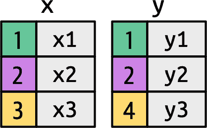

###### 图 19-2\. 两个简单表格的图形表示。有颜色的`key`列将背景颜色映射到关键值。灰色列表示伴随旅行的“value”列。

图 19-3 介绍了我们视觉表示的基础。它展示了`x`和`y`之间所有潜在的匹配，即从`x`的每一行到`y`的每一行的交集。输出中的行和列主要由`x`决定，因此`x`表是水平的，并与输出对齐。

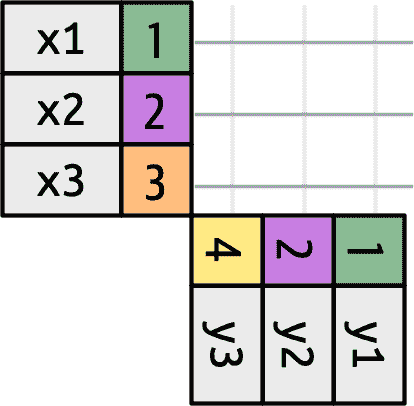

###### 图 19-3\. 要理解连接操作的工作原理，考虑每种可能的匹配是很有用的。这里我们展示了一个连接线网格。

要描述特定类型的连接，我们用点表示匹配。这些匹配确定了输出中的行，即一个包含键、x 值和 y 值的新数据框。例如，图 19-4 显示了一个内连接，仅当键相等时保留行。

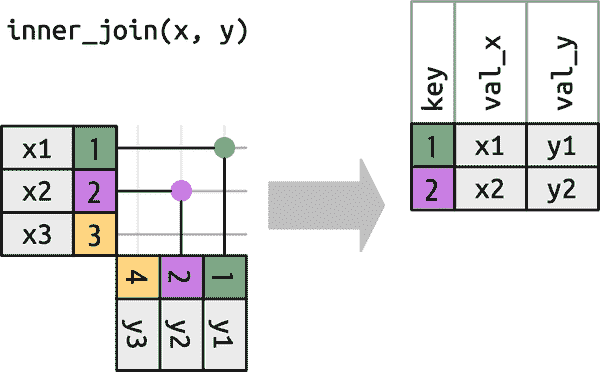

###### 图 19-4\. 内连接将`x`中的每一行与具有相同`key`值的`y`中的行匹配。每个匹配项成为输出中的一行。

我们可以应用相同的原则来解释*外连接*，它保留出现在至少一个数据框中的观测值。这些连接通过向每个数据框添加一个额外的“虚拟”观测值来工作。如果没有其他键匹配，则此观测值具有与之匹配的键，以及填充了`NA`的值。外连接有三种类型：

+   *左连接*保留`x`中的所有观测值，如图 19-5 所示。输出中保留了`x`的每一行，因为它可以回退到在`y`中匹配到一行`NA`的情况。

    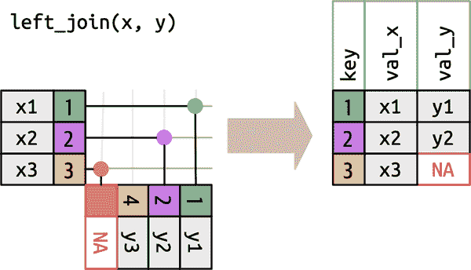

    ###### 图 19-5\. 左连接的可视化表示，`x`中的每一行都出现在输出中。

+   *右连接*保留`y`中的所有观测值，如图 19-6 所示。输出中保留了`y`的每一行，因为它可以回退到在`x`中匹配到一行`NA`的情况。输出仍然尽可能与`x`匹配；任何额外来自`y`的行都添加到最后。

    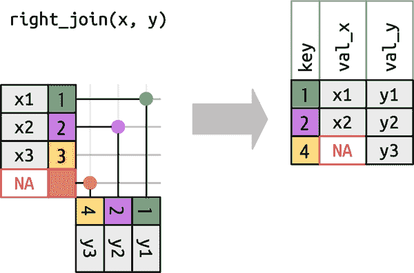

    ###### 图 19-6\. 右连接的可视化表示，`y`的每一行都出现在输出中。

+   *完全连接*保留出现在`x`或`y`中的所有观测值，如图 19-7 所示。输出中包含了`x`和`y`的每一行，因为`x`和`y`都有一行`NA`的备用。同样，输出从`x`的所有行开始，然后是剩余未匹配的`y`行。

    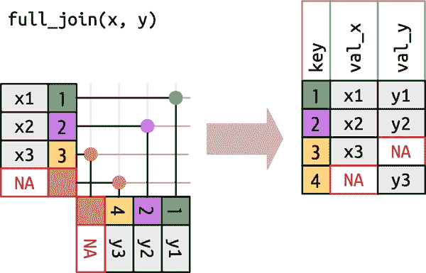

    ###### 图 19-7\. 全连接的视觉表示，其中 `x` 和 `y` 中的每一行都出现在输出中。

另一种显示外连接类型不同的方式是使用维恩图，如图 19-8。然而，这并不是一个很好的表示，因为虽然它可能会唤起你对保留哪些行的记忆，但它未能说明列中发生了什么。

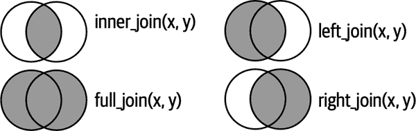

###### 图 19-8\. 维恩图显示内连接、左连接、右连接和全连接的区别。

这里显示的是所谓的*等连接*，其中如果键相等，则行匹配。等连接是最常见的连接类型，因此我们通常会省略等前缀，只说“内连接”而不是“等内连接”。我们将在“过滤连接”中回到非等连接。

## 行匹配

到目前为止，我们已经探讨了如果行在 `y` 中匹配零或一行会发生什么。如果它匹配多于一行会发生什么？要理解正在发生的情况，让我们首先将焦点缩小到[`inner_join()`](https://dplyr.tidyverse.org/reference/mutate-joins.xhtml)，然后绘制一幅图，如图 19-9 所示。

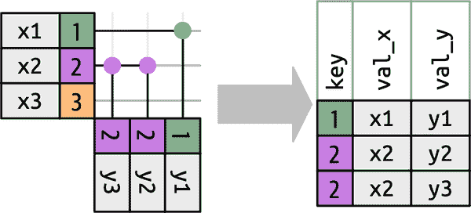

###### 图 19-9\. 行 `x` 匹配的三种方式。`x1` 匹配 `y` 中的一行，`x2` 匹配 `y` 中的两行，`x3` 不匹配 `y` 中的任何行。请注意，虽然 `x` 中有三行且输出中也有三行，但行之间没有直接的对应关系。

一行在 `x` 中有三种可能的结果：

+   如果它没有匹配项，它将被丢弃。

+   如果它在 `y` 中匹配一行，它将被保留。

+   如果它在 `y` 中匹配多于一行，它将被复制，每个匹配一次。

原则上，这意味着输出中的行与 `x` 中的行之间没有保证的对应关系，但实际上，这很少会引起问题。然而，有一种特别危险的情况可能会导致行的组合爆炸。想象一下，联接以下两个表：

```
df1 <- tibble(key = c(1, 2, 2), val_x = c("x1", "x2", "x3"))
df2 <- tibble(key = c(1, 2, 2), val_y = c("y1", "y2", "y3"))
```

尽管 `df1` 中的第一行仅与 `df2` 中的一行匹配，但第二行和第三行都与两行匹配。这有时被称为*多对多*连接，并将导致 dplyr 发出警告：

```
df1 |> 
  inner_join(df2, join_by(key))
#> Warning in inner_join(df1, df2, join_by(key)): 
#> Detected an unexpected many-to-many relationship between `x` and `y`.
#> ℹ Row 2 of `x` matches multiple rows in `y`.
#> ℹ Row 2 of `y` matches multiple rows in `x`.
#> ℹ If a many-to-many relationship is expected, set `relationship =
#>   "many-to-many"` to silence this warning.
#> # A tibble: 5 × 3
#>     key val_x val_y
#>   <dbl> <chr> <chr>
#> 1     1 x1    y1 
#> 2     2 x2    y2 
#> 3     2 x2    y3 
#> 4     2 x3    y2 
#> 5     2 x3    y3
```

如果你是故意这样做的，你可以设置 `relationship = "many-to-many"`，就像警告建议的那样。

## 过滤连接

匹配的数量还决定了过滤连接的行为。半连接保留在 y 中具有一个或多个匹配项的 x 中的行，如图 19-10。反连接保留在 y 中没有匹配项的 x 中的行，如图 19-11。在这两种情况下，只有匹配的存在性是重要的；它不关心匹配了多少次。这意味着过滤连接不会像变异连接那样重复行。

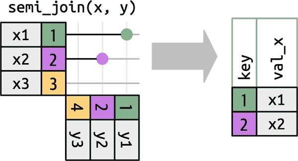

###### 图 19-10\. 在半连接中，只有匹配的存在性是重要的；否则，y 中的值不会影响输出。

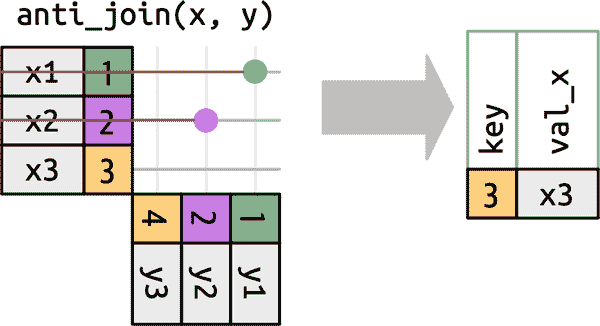

###### 图 19-11\. 反连接是半连接的反向操作，从 x 中删除在 y 中具有匹配项的行。

# 非等值连接

到目前为止，您只看到了等值连接，即只有在 x 的键等于 y 的键时才匹配的连接。现在我们将放宽这个限制，讨论确定一对行是否匹配的其他方法。

但在此之前，我们需要重新审视先前所做的简化。在等值关联中，x 的键和 y 总是相等的，因此我们只需要在输出中显示一个。我们可以请求 dplyr 保留两个键，使用`keep = TRUE`，导致以下代码和重新绘制的[`inner_join()`](https://dplyr.tidyverse.org/reference/mutate-joins.xhtml)在图 19-12 中。

```
x |> left_join(y, by = "key", keep = TRUE)
#> # A tibble: 3 × 4
#>   key.x val_x key.y val_y
#>   <dbl> <chr> <dbl> <chr>
#> 1     1 x1        1 y1 
#> 2     2 x2        2 y2 
#> 3     3 x3       NA <NA>
```

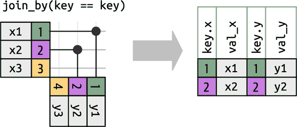

###### 图 19-12\. 一个内连接显示了输出中的 x 和 y 两个键。

当我们移开从等值连接时，我们总是显示键，因为键值通常会有所不同。例如，不再只匹配 x$key 和 y$key 相等时，而是当 x$key 大于或等于 y$key 时匹配，这会导致图 19-13。dplyr 的连接函数理解等值连接和非等值连接之间的区别，因此在执行非等值连接时始终会显示两个键。

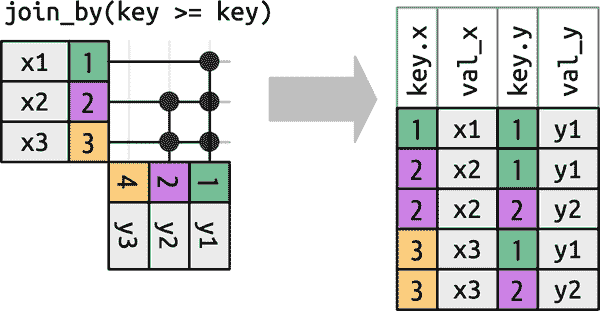

###### 图 19-13\. 非等值连接，其中 x 键必须大于或等于 y 键。许多行会生成多个匹配项。

非等连接并不是一个特别有用的术语，因为它只告诉你这个连接不是什么，而不是什么。

交叉连接

匹配每一对行。

不等连接

使用 `<`、`<=`、`>` 和 `>=` 而不是 `==`。

滚动连接

类似于不等连接，但只找到最接近的匹配。

重叠连接

一种特殊类型的不等连接，设计用于处理范围。

下面的各个连接类型将在接下来的章节中详细描述。

## 交叉连接

交叉连接匹配所有内容，如 图 19-14 所示，生成行的笛卡尔积。这意味着输出将有 `nrow(x) * nrow(y)` 行。


###### 图 19-14\. 交叉连接将`x`中的每一行与`y`中的每一行匹配。

交叉连接在生成排列时非常有用。例如，以下代码生成了每对名称的所有可能组合。由于我们将 `df` 与自身连接，这有时被称为*自连接*。交叉连接使用不同的连接函数，因为在匹配每一行时不存在内部/左侧/右侧/完整的区别。

```
df <- tibble(name = c("John", "Simon", "Tracy", "Max"))
df |> cross_join(df)
#> # A tibble: 16 × 2
#>   name.x name.y
#>   <chr>  <chr> 
#> 1 John   John 
#> 2 John   Simon 
#> 3 John   Tracy 
#> 4 John   Max 
#> 5 Simon  John 
#> 6 Simon  Simon 
#> # … with 10 more rows
```

## 不等连接

不等连接使用 `<`、`<=`、`>=` 或 `>` 来限制可能匹配的集合，如 图 19-13 和 图 19-15 中所示。


###### 图 19-15\. 不等连接，其中 `x` 与 `y` 在 `x` 的键小于 `y` 的键的行上连接。这在左上角形成一个三角形。

不等连接非常普遍，以至于很难想出有意义的具体用例。一个小而有用的技巧是使用它们来限制交叉连接，以便不生成所有排列，而是生成所有组合：

```
df <- tibble(id = 1:4, name = c("John", "Simon", "Tracy", "Max"))

df |> left_join(df, join_by(id < id))
#> # A tibble: 7 × 4
#>    id.x name.x  id.y name.y
#>   <int> <chr>  <int> <chr> 
#> 1     1 John       2 Simon 
#> 2     1 John       3 Tracy 
#> 3     1 John       4 Max 
#> 4     2 Simon      3 Tracy 
#> 5     2 Simon      4 Max 
#> 6     3 Tracy      4 Max 
#> # … with 1 more row
```

## 滚动连接

滚动连接是一种特殊类型的不等连接，不是获取满足不等式的每一行，而是获取最接近的行，如 图 19-16 所示。你可以通过添加 `closest()` 将任何不等连接转换为滚动连接。例如，`join_by(closest(x <= y))` 匹配大于或等于 `x` 的最小 `y`，而 `join_by(closest(x > y))` 匹配小于 `x` 的最大 `y`。

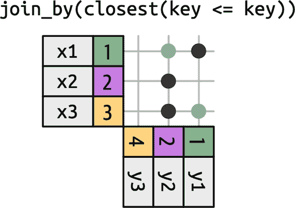

###### 图 19-16\. 滚动连接类似于大于或等于的不等连接，但只匹配第一个值。

滚动连接在你有两个日期表格并且它们不完全对齐时特别有用，你想要找到例如第一个表格中在第二个表格某个日期之前（或之后）的最接近的日期。

例如，想象一下，您负责办公室派对策划委员会。您的公司相当吝啬，所以没有单独的派对，每季度只举办一次派对。确定何时举行派对的规则有点复杂：派对总是在星期一举行，您跳过一月份的第一周，因为很多人在度假，2022 年第三季度的第一个星期一是 7 月 4 日，所以必须推迟一周。这导致以下派对日期：

```
parties <- tibble(
  q = 1:4,
  party = ymd(c("2022-01-10", "2022-04-04", "2022-07-11", "2022-10-03"))
)
```

现在想象一下，您有一个员工生日表：

```
employees <- tibble(
  name = sample(babynames::babynames$name, 100),
  birthday = ymd("2022-01-01") + (sample(365, 100, replace = TRUE) - 1)
)
employees
#> # A tibble: 100 × 2
#>   name    birthday 
#>   <chr>   <date> 
#> 1 Case    2022-09-13
#> 2 Shonnie 2022-03-30
#> 3 Burnard 2022-01-10
#> 4 Omer    2022-11-25
#> 5 Hillel  2022-07-30
#> 6 Curlie  2022-12-11
#> # … with 94 more rows
```

对于每位员工，我们希望找到在他们生日之后（或者当天）的第一个派对日期。我们可以通过滚动连接来表达这一点：

```
employees |> 
  left_join(parties, join_by(closest(birthday >= party)))
#> # A tibble: 100 × 4
#>   name    birthday       q party 
#>   <chr>   <date>     <int> <date> 
#> 1 Case    2022-09-13     3 2022-07-11
#> 2 Shonnie 2022-03-30     1 2022-01-10
#> 3 Burnard 2022-01-10     1 2022-01-10
#> 4 Omer    2022-11-25     4 2022-10-03
#> 5 Hillel  2022-07-30     3 2022-07-11
#> 6 Curlie  2022-12-11     4 2022-10-03
#> # … with 94 more rows
```

然而，这种方法有一个问题：在 1 月 10 日之前过生日的人就不能参加派对：

```
employees |> 
  anti_join(parties, join_by(closest(birthday >= party)))
#> # A tibble: 0 × 2
#> # … with 2 variables: name <chr>, birthday <date>
```

要解决这个问题，我们需要以不同的方式处理它，采用重叠连接的方法。

## 重叠连接

重叠连接提供了三个助手函数，使用不等连接使得处理间隔更加容易：

+   `between(x, y_lower, y_upper)` 的意思是 `x >= y_lower, x <= y_upper`。

+   `within(x_lower, x_upper, y_lower, y_upper)` 的意思是 `x_lower >= y_lower, x_upper <= y_upper`。

+   `overlaps(x_lower, x_upper, y_lower, y_upper)` 的意思是 `x_lower <= y_upper, x_upper >= y_lower`。

让我们继续使用生日的例子来看看您可能如何使用它们。我们之前使用的策略有一个问题：没有派对在 1 月 1 日到 9 日的生日之前。因此，最好明确每个派对跨越的日期范围，并为这些早期生日制定一个特殊情况：

```
parties <- tibble(
  q = 1:4,
  party = ymd(c("2022-01-10", "2022-04-04", "2022-07-11", "2022-10-03")),
  start = ymd(c("2022-01-01", "2022-04-04", "2022-07-11", "2022-10-03")),
  end = ymd(c("2022-04-03", "2022-07-11", "2022-10-02", "2022-12-31"))
)
parties
#> # A tibble: 4 × 4
#>       q party      start      end 
#>   <int> <date>     <date>     <date> 
#> 1     1 2022-01-10 2022-01-01 2022-04-03
#> 2     2 2022-04-04 2022-04-04 2022-07-11
#> 3     3 2022-07-11 2022-07-11 2022-10-02
#> 4     4 2022-10-03 2022-10-03 2022-12-31
```

哈德利在数据输入方面非常糟糕，因此他还想检查派对期间是否重叠。一种方法是使用自连接来检查任何开始-结束间隔是否与另一个重叠：

```
parties |> 
  inner_join(parties, join_by(overlaps(start, end, start, end), q < q)) |> 
  select(start.x, end.x, start.y, end.y)
#> # A tibble: 1 × 4
#>   start.x    end.x      start.y    end.y 
#>   <date>     <date>     <date>     <date> 
#> 1 2022-04-04 2022-07-11 2022-07-11 2022-10-02
```

糟糕，有重叠，让我们修复这个问题并继续：

```
parties <- tibble(
  q = 1:4,
  party = ymd(c("2022-01-10", "2022-04-04", "2022-07-11", "2022-10-03")),
  start = ymd(c("2022-01-01", "2022-04-04", "2022-07-11", "2022-10-03")),
  end = ymd(c("2022-04-03", "2022-07-10", "2022-10-02", "2022-12-31"))
)
```

现在我们可以将每位员工与他们的派对匹配。这是一个使用 `unmatched = "error"` 的好地方，因为我们想要快速找出是否有任何员工没有被分配到派对：

```
employees |> 
  inner_join(parties, join_by(between(birthday, start, end)), unmatched = "error")
#> # A tibble: 100 × 6
#>   name    birthday       q party      start      end 
#>   <chr>   <date>     <int> <date>     <date>     <date> 
#> 1 Case    2022-09-13     3 2022-07-11 2022-07-11 2022-10-02
#> 2 Shonnie 2022-03-30     1 2022-01-10 2022-01-01 2022-04-03
#> 3 Burnard 2022-01-10     1 2022-01-10 2022-01-01 2022-04-03
#> 4 Omer    2022-11-25     4 2022-10-03 2022-10-03 2022-12-31
#> 5 Hillel  2022-07-30     3 2022-07-11 2022-07-11 2022-10-02
#> 6 Curlie  2022-12-11     4 2022-10-03 2022-10-03 2022-12-31
#> # … with 94 more rows
```

## 练习

1.  您能解释这个等连接中键发生了什么吗？它们为什么不同？

    ```
    x |> full_join(y, by = "key")
    #> # A tibble: 4 × 3
    #>     key val_x val_y
    #>   <dbl> <chr> <chr>
    #> 1     1 x1    y1 
    #> 2     2 x2    y2 
    #> 3     3 x3    <NA> 
    #> 4     4 <NA>  y3

    x |> full_join(y, by = "key", keep = TRUE)
    #> # A tibble: 4 × 4
    #>   key.x val_x key.y val_y
    #>   <dbl> <chr> <dbl> <chr>
    #> 1     1 x1        1 y1 
    #> 2     2 x2        2 y2 
    #> 3     3 x3       NA <NA> 
    #> 4    NA <NA>      4 y3
    ```

1.  在查找是否有任何派对期间重叠时，我们在[`join_by()`](https://dplyr.tidyverse.org/reference/join_by.xhtml)中使用了`q < q`，为什么？如果删除这个不等式会发生什么？

# 摘要

在本章中，您学会了如何使用变异和过滤连接来合并来自一对数据框的数据。在此过程中，您学会了如何识别键，以及主键和外键之间的区别。您还了解了连接的工作原理以及如何确定输出将有多少行。最后，您深入了解了非等连接的强大功能，并看到了一些有趣的用例。

本章结束了本书“转换”部分的内容，重点是你可以使用的工具，包括处理单独列和 tibble 的 dplyr 和基础函数；处理逻辑向量、数字和完整表格的 base 函数；处理字符串的 stringr 函数；处理日期时间的 lubridate 函数；以及处理因子的 forcats 函数。

本书的下一部分将进一步学习如何以整洁的形式将各种类型的数据导入到 R 中。

¹ 请记住，在 RStudio 中，你也可以使用[`View()`](https://rdrr.io/r/utils/View.xhtml)来避免这个问题。

² 这并非百分之百正确，但如果不是的话，你会收到警告。
