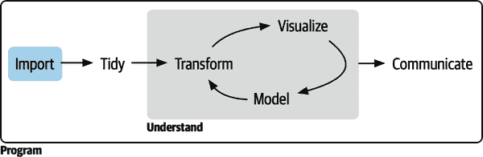

# 第四部分：导入

在本书的这一部分，您将学习如何将更广泛范围的数据导入到 R 中，并将其转换为便于分析的形式。有时这只是调用适当的数据导入包中的函数的问题。但在更复杂的情况下，可能需要进行整理和转换，以获得您希望使用的整洁矩形数据。

###### 图 IV-1。数据导入是数据科学过程的开始；没有数据就无法进行数据科学！

在本书的这一部分，您将学习如何访问以下方式存储的数据：

+   在第二十章中，您将学习如何从 Excel 电子表格和 Google Sheets 中导入数据。

+   在第二十一章中，您将学习如何从数据库中获取数据并将其导入到 R 中（还将学习一些如何从 R 中获取数据并将其导入到数据库中的知识）。

+   在第二十二章中，您将学习 Arrow，这是一个强大的工具，用于处理大内存数据，特别是存储在 parquet 格式中的数据。

+   在第二十三章中，您将学习如何处理分层数据，包括存储在 JSON 格式中数据产生的深度嵌套列表。

+   在第二十四章中，您将学习网页“抓取”，即从网页中提取数据的艺术和科学。

在这里我们没有讨论的两个重要的 tidyverse 包是 haven 和 xml2。如果你正在处理来自 SPSS、Stata 和 SAS 文件的数据，请查看[haven 包](https://oreil.ly/cymF4)。如果你正在处理 XML 数据，请查看[xml2 包](https://oreil.ly/lQNBa)。否则，您需要做一些研究来确定需要使用哪个包；在这里，Google 是您的朋友。
