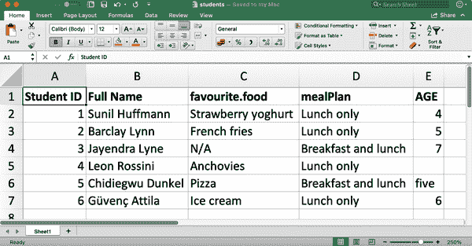
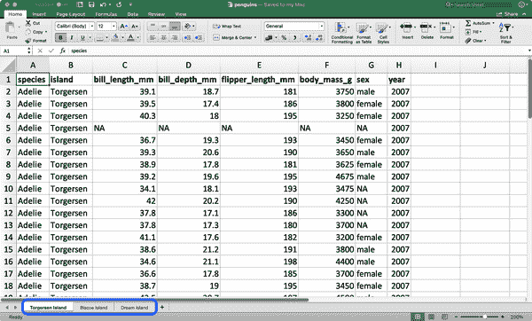
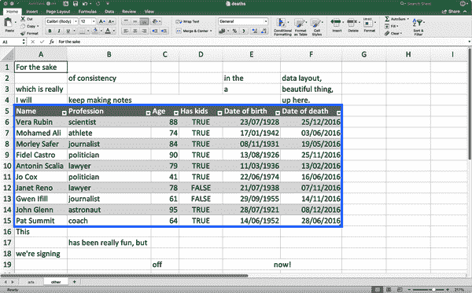
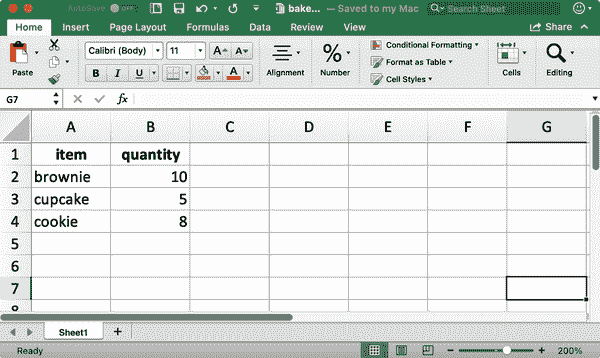
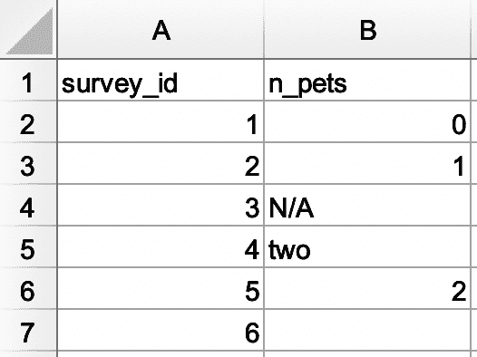
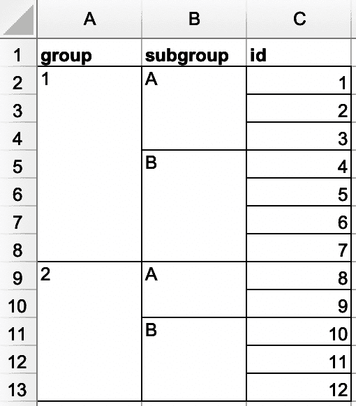
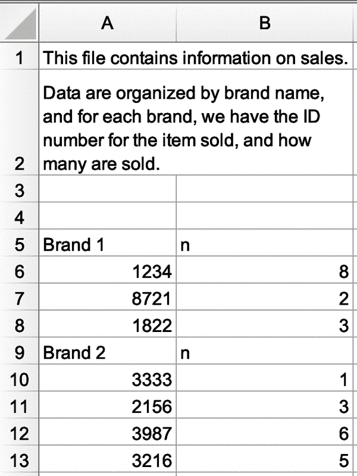
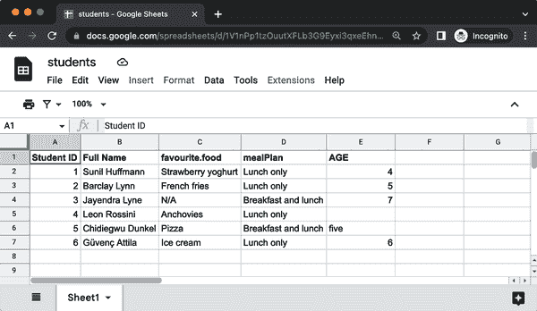

# 第二十章：电子表格

# 简介

在第七章中，你学习了如何从纯文本文件（如 `.csv` 和 `.tsv`）导入数据。现在是学习如何从电子表格（无论是 Excel 电子表格还是 Google 表格）中获取数据的时候了。这将基于你在第七章学到的内容，但我们还将讨论在处理电子表格数据时的其他注意事项和复杂性。

如果你或你的合作者使用电子表格来组织数据，强烈推荐阅读卡尔·布罗曼和卡拉·吴的论文[《电子表格中的数据组织》](https://oreil.ly/Ejuen)。这篇论文中提出的最佳实践将在你将数据从电子表格导入到 R 进行分析和可视化时节省大量麻烦。

# Excel

Microsoft Excel 是一款广泛使用的电子表格软件程序，数据以工作表的形式存储在电子表格文件中。

## 先决条件

在本节中，你将学习如何使用 readxl 包在 R 中从 Excel 电子表格中加载数据。这个包不是 tidyverse 的核心包，因此你需要显式加载它，但在安装 tidyverse 包时它会被自动安装。稍后，我们还将使用 writexl 包，它允许我们创建 Excel 电子表格。

```
library(readxl)
library(tidyverse)
library(writexl)
```

## 入门指南

大多数 readxl 的函数允许你将 Excel 电子表格加载到 R 中：

+   [`read_xls()`](https://readxl.tidyverse.org/reference/read_excel.xhtml) 用于读取 `XLS` 格式的 Excel 文件。

+   [`read_xlsx()`](https://readxl.tidyverse.org/reference/read_excel.xhtml) 用于读取 `XLSX` 格式的 Excel 文件。

+   [`read_excel()`](https://readxl.tidyverse.org/reference/read_excel.xhtml) 可以读取 `XLS` 和 `XLSX` 格式的文件。它会根据输入自动猜测文件类型。

这些函数的语法与我们之前介绍的读取其他类型文件的函数类似，例如[`read_csv()`](https://readr.tidyverse.org/reference/read_delim.xhtml)，[`read_table()`](https://readr.tidyverse.org/reference/read_table.xhtml)，等等。本章的其余部分将重点介绍使用[`read_excel()`](https://readxl.tidyverse.org/reference/read_excel.xhtml)。

## 读取 Excel 电子表格

图 20-1 展示了我们将要在 R 中读取的电子表格在 Excel 中的样子。



###### 图 20-1\. Excel 中名为 `students.xlsx` 的电子表格。

[`read_excel()`](https://readxl.tidyverse.org/reference/read_excel.xhtml) 的第一个参数是要读取的文件路径。

```
students <- read_excel("data/students.xlsx")
```

[`read_excel()`](https://readxl.tidyverse.org/reference/read_excel.xhtml) 将文件读取为一个 tibble。

```
students
#> # A tibble: 6 × 5
#>   `Student ID` `Full Name`      favourite.food     mealPlan            AGE 
#>          <dbl> <chr>            <chr>              <chr>               <chr>
#> 1            1 Sunil Huffmann   Strawberry yoghurt Lunch only          4 
#> 2            2 Barclay Lynn     French fries       Lunch only          5 
#> 3            3 Jayendra Lyne    N/A                Breakfast and lunch 7 
#> 4            4 Leon Rossini     Anchovies          Lunch only          <NA> 
#> 5            5 Chidiegwu Dunkel Pizza              Breakfast and lunch five 
#> 6            6 Güvenç Attila    Ice cream          Lunch only          6
```

我们的数据中有六名学生，每名学生有五个变量。然而，在这个数据集中可能有一些需要解决的问题：

1.  列名乱七八糟。你可以提供遵循一致格式的列名；我们建议使用 `col_names` 参数，采用 `snake_case`。

    ```
    read_excel(
      "data/students.xlsx",
      col_names = c(
        "student_id", "full_name", "favourite_food", "meal_plan", "age")
    )
    #> # A tibble: 7 × 5
    #>   student_id full_name        favourite_food     meal_plan           age 
    #>   <chr>      <chr>            <chr>              <chr>               <chr>
    #> 1 Student ID Full Name        favourite.food     mealPlan            AGE 
    #> 2 1          Sunil Huffmann   Strawberry yoghurt Lunch only          4 
    #> 3 2          Barclay Lynn     French fries       Lunch only          5 
    #> 4 3          Jayendra Lyne    N/A                Breakfast and lunch 7 
    #> 5 4          Leon Rossini     Anchovies          Lunch only          <NA> 
    #> 6 5          Chidiegwu Dunkel Pizza              Breakfast and lunch five 
    #> 7 6          Güvenç Attila    Ice cream          Lunch only          6
    ```

    不幸的是，这也没能达到效果。现在我们有了想要的变量名，但以前的标题行现在显示为数据的第一个观察结果。你可以使用 `skip` 参数显式跳过该行。

    ```
    read_excel(
      "data/students.xlsx",
      col_names = c("student_id", "full_name", "favourite_food", "meal_plan", "age"),
      skip = 1
    )
    #> # A tibble: 6 × 5
    #>   student_id full_name        favourite_food     meal_plan           age 
    #>        <dbl> <chr>            <chr>              <chr>               <chr>
    #> 1          1 Sunil Huffmann   Strawberry yoghurt Lunch only          4 
    #> 2          2 Barclay Lynn     French fries       Lunch only          5 
    #> 3          3 Jayendra Lyne    N/A                Breakfast and lunch 7 
    #> 4          4 Leon Rossini     Anchovies          Lunch only          <NA> 
    #> 5          5 Chidiegwu Dunkel Pizza              Breakfast and lunch five 
    #> 6          6 Güvenç Attila    Ice cream          Lunch only          6
    ```

1.  在 `favourite_food` 列中，其中一个观察结果是 `N/A`，表示“不可用”，但目前没有被识别为 `NA`（请注意这个 `N/A` 与列表中第四个学生的年龄之间的对比）。你可以使用 `na` 参数指定应该将哪些字符串识别为 `NA`。默认情况下，仅会将 `""`（空字符串，或者在从电子表格中读取时，空单元格或带有 `=NA()` 公式的单元格）识别为 `NA`。

    ```
    read_excel(
      "data/students.xlsx",
      col_names = c("student_id", "full_name", "favourite_food", "meal_plan", "age"),
      skip = 1,
      na = c("", "N/A")
    )
    #> # A tibble: 6 × 5
    #>   student_id full_name        favourite_food     meal_plan           age 
    #>        <dbl> <chr>            <chr>              <chr>               <chr>
    #> 1          1 Sunil Huffmann   Strawberry yoghurt Lunch only          4 
    #> 2          2 Barclay Lynn     French fries       Lunch only          5 
    #> 3          3 Jayendra Lyne    <NA>               Breakfast and lunch 7 
    #> 4          4 Leon Rossini     Anchovies          Lunch only          <NA> 
    #> 5          5 Chidiegwu Dunkel Pizza              Breakfast and lunch five 
    #> 6          6 Güvenç Attila    Ice cream          Lunch only          6
    ```

1.  另一个剩下的问题是，`age` 被读取为字符变量，但实际上应该是数值型的。就像使用 [`read_csv()`](https://readr.tidyverse.org/reference/read_delim.xhtml) 和其它用于从平面文件中读取数据的函数一样，你可以给 [`read_excel()`](https://readxl.tidyverse.org/reference/read_excel.xhtml) 提供一个 `col_types` 参数，并指定你要读取的变量的列类型。尽管语法有点不同。你的选项有 `"skip"`、`"guess"`、`"logical"`、`"numeric"`、`"date"`、`"text"` 或 `"list"`。

    ```
    read_excel(
      "data/students.xlsx",
      col_names = c("student_id", "full_name", "favourite_food", "meal_plan", "age"),
      skip = 1,
      na = c("", "N/A"),
      col_types = c("numeric", "text", "text", "text", "numeric")
    )
    #> Warning: Expecting numeric in E6 / R6C5: got 'five'
    #> # A tibble: 6 × 5
    #>   student_id full_name        favourite_food     meal_plan             age
    #>        <dbl> <chr>            <chr>              <chr>               <dbl>
    #> 1          1 Sunil Huffmann   Strawberry yoghurt Lunch only              4
    #> 2          2 Barclay Lynn     French fries       Lunch only              5
    #> 3          3 Jayendra Lyne    <NA>               Breakfast and lunch     7
    #> 4          4 Leon Rossini     Anchovies          Lunch only             NA
    #> 5          5 Chidiegwu Dunkel Pizza              Breakfast and lunch    NA
    #> 6          6 Güvenç Attila    Ice cream          Lunch only              6
    ```

    然而，这样做也没有完全产生期望的结果。通过指定 `age` 应该是数值型，我们已经将包含非数值条目（其值为 `five`）的单元格转换为了 `NA`。在这种情况下，我们应该将 age 读取为 `"text"`，然后在数据加载到 R 后进行更改。

    ```
    students <- read_excel(
      "data/students.xlsx",
      col_names = c("student_id", "full_name", "favourite_food", "meal_plan", "age"),
      skip = 1,
      na = c("", "N/A"),
      col_types = c("numeric", "text", "text", "text", "text")
    )

    students <- students |>
      mutate(
        age = if_else(age == "five", "5", age),
        age = parse_number(age)
      )

    students
    #> # A tibble: 6 × 5
    #>   student_id full_name        favourite_food     meal_plan             age
    #>        <dbl> <chr>            <chr>              <chr>               <dbl>
    #> 1          1 Sunil Huffmann   Strawberry yoghurt Lunch only              4
    #> 2          2 Barclay Lynn     French fries       Lunch only              5
    #> 3          3 Jayendra Lyne    <NA>               Breakfast and lunch     7
    #> 4          4 Leon Rossini     Anchovies          Lunch only             NA
    #> 5          5 Chidiegwu Dunkel Pizza              Breakfast and lunch     5
    #> 6          6 Güvenç Attila    Ice cream          Lunch only              6
    ```

我们花了多个步骤和反复试验才成功以期望的格式加载数据，这并不奇怪。数据科学是一个迭代过程，与从其他纯文本、矩形数据文件中读取数据相比，从电子表格中读取数据的迭代过程可能更加繁琐，因为人们倾向于将数据输入到电子表格中，并使用它们不仅仅作为数据存储，还用于分享和交流。

在加载和查看数据之前，没有办法确切地知道数据的样子。嗯，其实还有一种方式。你可以在 Excel 中打开文件并窥视一下。如果你要这样做，我们建议在打开和浏览交互式地进行的同时，制作 Excel 文件的副本，以便保持原始数据文件的不变，并从未更改的文件中读入 R。这样做可以确保你在检查时不会意外地覆盖任何电子表格中的内容。你也不必害怕像我们在这里所做的那样：加载数据，查看一下，对代码进行调整，再次加载，如此反复，直到你满意为止。

## 读取工作表

电子表格与平面文件的一个重要特征是多工作表的概念，称为*工作表*。 图 20-2 显示了一个包含多个工作表的 Excel 电子表格。数据来自 palmerpenguins 包。每个工作表包含从不同岛屿收集到的企鹅信息。

您可以通过 [`read_excel()`](https://readxl.tidyverse.org/reference/read_excel.xhtml) 中的 `sheet` 参数读取电子表格中的单个工作表。直到现在，我们一直依赖的是默认的第一个工作表。

```
read_excel("data/penguins.xlsx", sheet = "Torgersen Island")
#> # A tibble: 52 × 8
#>   species island    bill_length_mm     bill_depth_mm      flipper_length_mm
#>   <chr>   <chr>     <chr>              <chr>              <chr> 
#> 1 Adelie  Torgersen 39.1               18.7               181 
#> 2 Adelie  Torgersen 39.5               17.399999999999999 186 
#> 3 Adelie  Torgersen 40.299999999999997 18                 195 
#> 4 Adelie  Torgersen NA                 NA                 NA 
#> 5 Adelie  Torgersen 36.700000000000003 19.3               193 
#> 6 Adelie  Torgersen 39.299999999999997 20.6               190 
#> # … with 46 more rows, and 3 more variables: body_mass_g <chr>, sex <chr>,
#> #   year <dbl>
```



###### 图 20-2\. Excel 中名为 `penguins.xlsx` 的电子表格包含三个工作表。

由于字符字符串 `"NA"` 不被识别为真正的 `NA`，一些看起来包含数值数据的变量被读取为字符。

```
penguins_torgersen <- read_excel(
  "data/penguins.xlsx", sheet = "Torgersen Island", na = "NA"
)

penguins_torgersen
#> # A tibble: 52 × 8
#>   species island    bill_length_mm bill_depth_mm flipper_length_mm
#>   <chr>   <chr>              <dbl>         <dbl>             <dbl>
#> 1 Adelie  Torgersen           39.1          18.7               181
#> 2 Adelie  Torgersen           39.5          17.4               186
#> 3 Adelie  Torgersen           40.3          18                 195
#> 4 Adelie  Torgersen           NA            NA                  NA
#> 5 Adelie  Torgersen           36.7          19.3               193
#> 6 Adelie  Torgersen           39.3          20.6               190
#> # … with 46 more rows, and 3 more variables: body_mass_g <dbl>, sex <chr>,
#> #   year <dbl>
```

或者，您可以使用 [`excel_sheets()`](https://readxl.tidyverse.org/reference/excel_sheets.xhtml) 获取 Excel 电子表格中所有工作表的信息，然后读取您感兴趣的一个或多个工作表。

```
excel_sheets("data/penguins.xlsx")
#> [1] "Torgersen Island" "Biscoe Island"    "Dream Island"
```

一旦您知道工作表的名称，您可以使用 [`read_excel()`](https://readxl.tidyverse.org/reference/read_excel.xhtml) 单独读取它们。

```
penguins_biscoe <- read_excel("data/penguins.xlsx", sheet = "Biscoe Island", na = "NA")
penguins_dream  <- read_excel("data/penguins.xlsx", sheet = "Dream Island", na = "NA")
```

在这种情况下，完整的企鹅数据集分布在电子表格的三个工作表中。每个工作表具有相同数量的列，但不同数量的行。

```
dim(penguins_torgersen)
#> [1] 52  8
dim(penguins_biscoe)
#> [1] 168   8
dim(penguins_dream)
#> [1] 124   8
```

我们可以使用 [`bind_rows()`](https://dplyr.tidyverse.org/reference/bind_rows.xhtml) 将它们合并在一起：

```
penguins <- bind_rows(penguins_torgersen, penguins_biscoe, penguins_dream)
penguins
#> # A tibble: 344 × 8
#>   species island    bill_length_mm bill_depth_mm flipper_length_mm
#>   <chr>   <chr>              <dbl>         <dbl>             <dbl>
#> 1 Adelie  Torgersen           39.1          18.7               181
#> 2 Adelie  Torgersen           39.5          17.4               186
#> 3 Adelie  Torgersen           40.3          18                 195
#> 4 Adelie  Torgersen           NA            NA                  NA
#> 5 Adelie  Torgersen           36.7          19.3               193
#> 6 Adelie  Torgersen           39.3          20.6               190
#> # … with 338 more rows, and 3 more variables: body_mass_g <dbl>, sex <chr>,
#> #   year <dbl>
```

在 第二十六章 中，我们将讨论如何在不重复编码的情况下执行此类任务的方法。

## 读取工作表的部分内容

由于许多人将 Excel 电子表格用于演示和数据存储，因此在电子表格中找到不属于您想读入 R 的数据的单元格条目是非常常见的。 图 20-3 展示了这样一张电子表格：表中间看起来像是数据框架，但是在数据上方和下方的单元格中有多余的文本。



###### 图 20-3\. Excel 中名为 `deaths.xlsx` 的电子表格。

此电子表格是 readxl 包提供的示例电子表格之一。你可以使用 [`readxl_example()`](https://readxl.tidyverse.org/reference/readxl_example.xhtml) 函数在安装包的目录中找到电子表格。该函数返回电子表格的路径，你可以像往常一样在 [`read_excel()`](https://readxl.tidyverse.org/reference/read_excel.xhtml) 中使用它。

```
deaths_path <- readxl_example("deaths.xlsx")
deaths <- read_excel(deaths_path)
#> New names:
#> • `` -> `...2`
#> • `` -> `...3`
#> • `` -> `...4`
#> • `` -> `...5`
#> • `` -> `...6`
deaths
#> # A tibble: 18 × 6
#>   `Lots of people`    ...2       ...3  ...4     ...5          ...6 
#>   <chr>               <chr>      <chr> <chr>    <chr>         <chr> 
#> 1 simply cannot resi… <NA>       <NA>  <NA>     <NA>          some notes 
#> 2 at                  the        top   <NA>     of            their spreadsh…
#> 3 or                  merging    <NA>  <NA>     <NA>          cells 
#> 4 Name                Profession Age   Has kids Date of birth Date of death 
#> 5 David Bowie         musician   69    TRUE     17175         42379 
#> 6 Carrie Fisher       actor      60    TRUE     20749         42731 
#> # … with 12 more rows
```

前三行和后四行不属于数据框。可以使用 `skip` 和 `n_max` 参数消除这些多余的行，但我们建议使用单元格范围。在 Excel 中，左上角的单元格是 `A1`。随着你向右移动列，单元格标签向字母表的下面移动，即 `B1`、`C1` 等。当你向下移动一列时，单元格标签中的数字增加，即 `A2`、`A3` 等。

我们想要读取的数据从单元格 `A5` 开始，到单元格 `F15` 结束。在电子表格表示法中，这是 `A5:F15`，我们将其提供给 `range` 参数：

```
read_excel(deaths_path, range = "A5:F15")
#> # A tibble: 10 × 6
#>   Name          Profession   Age `Has kids` `Date of birth` 
#>   <chr>         <chr>      <dbl> <lgl>      <dttm> 
#> 1 David Bowie   musician      69 TRUE       1947-01-08 00:00:00
#> 2 Carrie Fisher actor         60 TRUE       1956-10-21 00:00:00
#> 3 Chuck Berry   musician      90 TRUE       1926-10-18 00:00:00
#> 4 Bill Paxton   actor         61 TRUE       1955-05-17 00:00:00
#> 5 Prince        musician      57 TRUE       1958-06-07 00:00:00
#> 6 Alan Rickman  actor         69 FALSE      1946-02-21 00:00:00
#> # … with 4 more rows, and 1 more variable: `Date of death` <dttm>
```

## 数据类型

在 CSV 文件中，所有的值都是字符串。这并不完全符合数据本身，但却很简单：一切皆为字符串。

Excel 电子表格中的底层数据更加复杂。一个单元格可以是以下四种类型之一：

+   布尔值，比如 `TRUE`、`FALSE` 或 `NA`

+   数字，例如 “10” 或 “10.5”

+   日期时间，也可以包括时间，如 “11/1/21” 或 “11/1/21 下午 3:00”

+   文本字符串，比如 “ten”

当处理电子表格数据时，重要的是要记住底层数据可能与单元格中所见的内容非常不同。例如，Excel 没有整数的概念。所有的数字都以浮点数存储，但你可以选择以可定制的小数位数显示数据。类似地，日期实际上以数字形式存储，具体来说是自 1970 年 1 月 1 日以来的秒数。你可以通过在 Excel 中应用格式设置来自定义日期的显示方式。令人困惑的是，有时你可能看到的是一个看似数字的东西，实际上是一个字符串（例如，在 Excel 中输入 `'10`）。

底层数据存储方式与显示方式之间的这些差异可能会在将数据加载到 R 中时引起意外。默认情况下，readxl 将猜测给定列的数据类型。建议的工作流程是让 readxl 猜测列类型，确认你对猜测的列类型满意，如果不满意，可以返回并重新导入，指定 `col_types`，如 “读取 Excel 电子表格” 中所示。

另一个挑战是当你的 Excel 电子表格中有一列混合了这些类型，例如，有些单元格是数值，其他是文本，还有日期。在将数据导入 R 时，readxl 必须做出一些决策。在这些情况下，你可以将此列的类型设置为 `"list"`，这将把列加载为长度为 1 的向量列表，其中猜测每个元素的类型。

###### 注意

*有时数据以更多样的方式存储，例如单元格背景的颜色或文本是否加粗。在这种情况下，您可能会发现 [tidyxl 包](https://oreil.ly/CU5XP) 很有用。有关处理来自 Excel 的非表格数据的更多策略，请参见 [*https://oreil.ly/jNskS*](https://oreil.ly/jNskS)。*  *## 写入 Excel

让我们创建一个小数据框，然后将其写出。请注意，`item` 是一个因子，而 `quantity` 是一个整数。

```
bake_sale <- tibble(
  item     = factor(c("brownie", "cupcake", "cookie")),
  quantity = c(10, 5, 8)
)

bake_sale
#> # A tibble: 3 × 2
#>   item    quantity
#>   <fct>      <dbl>
#> 1 brownie       10
#> 2 cupcake        5
#> 3 cookie         8
```

您可以使用 [`write_xlsx()`](https://docs.ropensci.org/writexl/reference/write_xlsx.xhtml) 函数从 [writexl 包](https://oreil.ly/Gzphe)将数据写回磁盘作为 Excel 文件：

```
write_xlsx(bake_sale, path = "data/bake-sale.xlsx")
```

图 20-4 展示了 Excel 中数据的外观。请注意，列名已包括并加粗显示。通过将 `col_names` 和 `format_headers` 参数设置为 `FALSE`，可以关闭这些列名。



###### 图 20-4\. Excel 中名为 `bake_sale.xlsx` 的电子表格。

就像从 CSV 文件中读取一样，当我们重新读取数据时，数据类型的信息会丢失。这使得 Excel 文件在缓存中间结果时不可靠。有关替代方法，请参见“写入文件”。

```
read_excel("data/bake-sale.xlsx")
#> # A tibble: 3 × 2
#>   item    quantity
#>   <chr>      <dbl>
#> 1 brownie       10
#> 2 cupcake        5
#> 3 cookie         8
```

## 格式化输出

writexl 包是写入简单 Excel 电子表格的轻量级解决方案，但如果您对写入到电子表格内不同工作表以及设置样式等附加功能感兴趣，则需要使用 [openxlsx 包](https://oreil.ly/JtHOt)。我们不会在此详细讨论使用该包的细节，但我们建议阅读 [*https://oreil.ly/clwtE*](https://oreil.ly/clwtE)，详细讨论使用 openxlsx 从 R 向 Excel 中进一步格式化数据的功能。

请注意，此包不属于 tidyverse，因此其函数和工作流可能感觉不熟悉。例如，函数名称采用驼峰命名法，多个函数无法组合在管道中，参数的顺序也与 tidyverse 中的不同。但这没关系。随着您在 R 的学习和使用扩展到本书之外，您将会遇到许多不同的风格，这些风格可能会用于各种 R 包中，以完成 R 中特定目标的任务。熟悉新包中使用的编码风格的一个好方法是运行函数文档中提供的示例，以了解语法、输出格式以及阅读可能附带的任何小册子。

## 练习

1.  在一个 Excel 文件中创建以下数据集，并将其另存为 `survey.xlsx`。或者，您可以将其作为[Excel 文件](https://oreil.ly/03oQy)下载。

    

    然后，将其读入 R 中，其中 `survey_id` 是字符变量，`n_pets` 是数值变量。

    ```
    #> # A tibble: 6 × 2
    #>   survey_id n_pets
    #>     <chr>  <dbl>
    #>   1 1      0
    #>   2 2      1
    #>   3 3     NA
    #>   4 4      2
    #>   5 5      2
    #>   6 6     NA
    ```

1.  在另一个 Excel 文件中创建以下数据集，并将其保存为 `roster.xlsx`。或者，您可以将其下载为 [Excel 文件](https://oreil.ly/E4dIi)。

    

    然后，将其读入 R。生成的数据框应该称为 `roster`，并应如下所示：

    ```
    #> # A tibble: 12 × 3
    #>    group subgroup    id
    #>    <dbl> <chr>    <dbl>
    #>  1     1 A            1
    #>  2     1 A            2
    #>  3     1 A            3
    #>  4     1 B            4
    #>  5     1 B            5
    #>  6     1 B            6
    #>  7     1 B            7
    #>  8     2 A            8
    #>  9     2 A            9
    #> 10     2 B           10
    #> 11     2 B           11
    #> 12     2 B           12
    ```

1.  在一个新的 Excel 文件中创建以下数据集，并将其保存为 `sales.xlsx`。或者，您可以将其下载为 [Excel 文件](https://oreil.ly/m6q7i)。

    

    a. 读取 `sales.xlsx` 并保存为 `sales`。数据框应如下所示，其中 `id` 和 `n` 是列名，共有九行：

    ```
    #> # A tibble: 9 × 2
    #>   id      n    
    #>   <chr>   <chr>
    #> 1 Brand 1 n    
    #> 2 1234    8    
    #> 3 8721    2    
    #> 4 1822    3    
    #> 5 Brand 2 n    
    #> 6 3333    1    
    #> 7 2156    3    
    #> 8 3987    6    
    #> 9 3216    5
    ```

    b. 进一步修改 `sales`，使其达到以下整洁的格式，包括三列（`brand`、`id` 和 `n`）和七行数据。请注意，`id` 和 `n` 是数值型变量，`brand` 是字符型变量。

    ```
    #> # A tibble: 7 × 3
    #>   brand      id     n
    #>   <chr>   <dbl> <dbl>
    #> 1 Brand 1  1234     8
    #> 2 Brand 1  8721     2
    #> 3 Brand 1  1822     3
    #> 4 Brand 2  3333     1
    #> 5 Brand 2  2156     3
    #> 6 Brand 2  3987     6
    #> 7 Brand 2  3216     5
    ```

1.  重新创建 `bake_sale` 数据框，并使用 openxlsx 包的 `write.xlsx()` 函数将其写入 Excel 文件。

1.  在 第七章 中，您学习了 [`janitor::clean_names()`](https://rdrr.io/pkg/janitor/man/clean_names.xhtml) 函数，将列名转换为蛇形命名法。请阅读我们在本节早些时候介绍的 `students.xlsx` 文件，并使用此函数“清理”列名。

1.  如果尝试使用 [`read_xls()`](https://readxl.tidyverse.org/reference/read_excel.xhtml) 函数读取一个带有 `.xlsx` 扩展名的文件会发生什么？*  *# Google Sheets

Google Sheets 是另一种广泛使用的电子表格程序。它是免费的，基于 Web。就像 Excel 一样，Google Sheets 中的数据是组织在工作表（也称为 *sheets*）中的。

## 先决条件

本节还将关注电子表格，但这次您将使用 googlesheets4 包从 Google Sheets 中加载数据。这个包也不是 tidyverse 的核心包，因此您需要显式加载它：

```
library(googlesheets4)
library(tidyverse)
```

关于包名称的简短说明：googlesheets4 使用 [Sheets API v4](https://oreil.ly/VMlBY) 提供 R 接口以访问 Google Sheets。

## 入门指南

googlesheets4 包的主要函数是 [`read_sheet()`](https://googlesheets4.tidyverse.org/reference/range_read.xhtml)，它从 URL 或文件 ID 读取 Google Sheet。此函数也被称为 [`range_read()`](https://googlesheets4.tidyverse.org/reference/range_read.xhtml)。

您也可以使用 [`gs4_create()`](https://googlesheets4.tidyverse.org/reference/gs4_create.xhtml) 创建一个新工作表，或者使用 [`sheet_write()`](https://googlesheets4.tidyverse.org/reference/sheet_write.xhtml) 和相关函数向现有工作表写入内容。

在本节中，我们将与 Excel 部分中相同的数据集一起工作，以突出显示从 Excel 和 Google Sheets 中读取数据的工作流程之间的相似性和差异。readxl 和 googlesheets4 包都旨在模仿 readr 包的功能，该包提供了您在 第七章 中看到的 [`read_csv()`](https://readr.tidyverse.org/reference/read_delim.xhtml) 函数。因此，许多任务可以简单地用 [`read_sheet()`](https://googlesheets4.tidyverse.org/reference/range_read.xhtml) 替换 [`read_excel()`](https://readxl.tidyverse.org/reference/read_excel.xhtml) 完成。但是您也会发现 Excel 和 Google Sheets 的行为方式不同，因此，其他任务可能需要进一步更新函数调用。

## 读取 Google Sheets

图 20-5 显示了我们将要在 R 中读取的电子表格的外观。这与 图 20-1 中的数据集相同，只是它存储在 Google Sheets 中而不是 Excel 中。



###### 图 20-5\. Google Sheets 中名为 students 的电子表格在浏览器窗口中显示。

[`read_sheet()`](https://googlesheets4.tidyverse.org/reference/range_read.xhtml) 的第一个参数是要读取的文件的 URL，它返回一个 [tibble](https://oreil.ly/c7DEP)。

这些网址不好操作，因此您通常会想要通过其 ID 来识别一个工作表。

```
students_sheet_id <- "1V1nPp1tzOuutXFLb3G9Eyxi3qxeEhnOXUzL5_BcCQ0w"
students <- read_sheet(students_sheet_id)
#> ✔ Reading from students.
#> ✔ Range Sheet1.
students
#> # A tibble: 6 × 5
#>   `Student ID` `Full Name`      favourite.food     mealPlan            AGE 
#>          <dbl> <chr>            <chr>              <chr>               <list>
#> 1            1 Sunil Huffmann   Strawberry yoghurt Lunch only          <dbl> 
#> 2            2 Barclay Lynn     French fries       Lunch only          <dbl> 
#> 3            3 Jayendra Lyne    N/A                Breakfast and lunch <dbl> 
#> 4            4 Leon Rossini     Anchovies          Lunch only          <NULL>
#> 5            5 Chidiegwu Dunkel Pizza              Breakfast and lunch <chr> 
#> 6            6 Güvenç Attila    Ice cream          Lunch only          <dbl>
```

就像我们在 [`read_excel()`](https://readxl.tidyverse.org/reference/read_excel.xhtml) 中所做的那样，我们可以为 [`read_sheet()`](https://googlesheets4.tidyverse.org/reference/range_read.xhtml) 提供列名、`NA` 字符串和列类型。

```
students <- read_sheet(
  students_sheet_id,
  col_names = c("student_id", "full_name", "favourite_food", "meal_plan", "age"),
  skip = 1,
  na = c("", "N/A"),
  col_types = "dcccc"
)
#> ✔ Reading from students.
#> ✔ Range 2:10000000.

students
#> # A tibble: 6 × 5
#>   student_id full_name        favourite_food     meal_plan           age 
#>        <dbl> <chr>            <chr>              <chr>               <chr>
#> 1          1 Sunil Huffmann   Strawberry yoghurt Lunch only          4 
#> 2          2 Barclay Lynn     French fries       Lunch only          5 
#> 3          3 Jayendra Lyne    <NA>               Breakfast and lunch 7 
#> 4          4 Leon Rossini     Anchovies          Lunch only          <NA> 
#> 5          5 Chidiegwu Dunkel Pizza              Breakfast and lunch five 
#> 6          6 Güvenç Attila    Ice cream          Lunch only          6
```

请注意，我们在这里稍微不同地定义了列类型，使用了简短的代码。例如，“dcccc”代表“双精度、字符、字符、字符、字符”。

还可以从 Google Sheets 中读取单独的表格。让我们从[penguins Google Sheet](https://oreil.ly/qgKTY)中读取“Torgersen Island”表格：

```
penguins_sheet_id <- "1aFu8lnD_g0yjF5O-K6SFgSEWiHPpgvFCF0NY9D6LXnY"
read_sheet(penguins_sheet_id, sheet = "Torgersen Island")
#> ✔ Reading from penguins.
#> ✔ Range ''Torgersen Island''.
#> # A tibble: 52 × 8
#>   species island    bill_length_mm bill_depth_mm flipper_length_mm
#>   <chr>   <chr>     <list>         <list>        <list> 
#> 1 Adelie  Torgersen <dbl [1]>      <dbl [1]>     <dbl [1]> 
#> 2 Adelie  Torgersen <dbl [1]>      <dbl [1]>     <dbl [1]> 
#> 3 Adelie  Torgersen <dbl [1]>      <dbl [1]>     <dbl [1]> 
#> 4 Adelie  Torgersen <chr [1]>      <chr [1]>     <chr [1]> 
#> 5 Adelie  Torgersen <dbl [1]>      <dbl [1]>     <dbl [1]> 
#> 6 Adelie  Torgersen <dbl [1]>      <dbl [1]>     <dbl [1]> 
#> # … with 46 more rows, and 3 more variables: body_mass_g <list>, sex <chr>,
#> #   year <dbl>
```

您可以使用[`sheet_names()`](https://googlesheets4.tidyverse.org/reference/sheet_properties.xhtml)获取 Google Sheet 中所有表格的列表：

```
sheet_names(penguins_sheet_id)
#> [1] "Torgersen Island" "Biscoe Island"    "Dream Island"
```

最后，就像使用[`read_excel()`](https://readxl.tidyverse.org/reference/read_excel.xhtml)一样，我们可以通过在[`read_sheet()`](https://googlesheets4.tidyverse.org/reference/range_read.xhtml)中定义一个`range`来读取 Google Sheet 的一部分。请注意，我们还使用[`gs4_example()`](https://googlesheets4.tidyverse.org/reference/gs4_examples.xhtml)函数来找到一个包含 googlesheets4 包的示例 Google Sheet：

```
deaths_url <- gs4_example("deaths")
deaths <- read_sheet(deaths_url, range = "A5:F15")
#> ✔ Reading from deaths.
#> ✔ Range A5:F15.
deaths
#> # A tibble: 10 × 6
#>   Name          Profession   Age `Has kids` `Date of birth` 
#>   <chr>         <chr>      <dbl> <lgl>      <dttm> 
#> 1 David Bowie   musician      69 TRUE       1947-01-08 00:00:00
#> 2 Carrie Fisher actor         60 TRUE       1956-10-21 00:00:00
#> 3 Chuck Berry   musician      90 TRUE       1926-10-18 00:00:00
#> 4 Bill Paxton   actor         61 TRUE       1955-05-17 00:00:00
#> 5 Prince        musician      57 TRUE       1958-06-07 00:00:00
#> 6 Alan Rickman  actor         69 FALSE      1946-02-21 00:00:00
#> # … with 4 more rows, and 1 more variable: `Date of death` <dttm>
```

## 向 Google Sheets 写入

您可以使用[`write_sheet()`](https://googlesheets4.tidyverse.org/reference/sheet_write.xhtml)将 R 中的数据写入 Google Sheets。第一个参数是要写入的数据框，第二个参数是要写入的 Google Sheet 的名称（或其他标识符）：

```
write_sheet(bake_sale, ss = "bake-sale")
```

如果您想将数据写入 Google Sheet 中的特定（工作）表中，您也可以使用 `sheet` 参数指定：

```
write_sheet(bake_sale, ss = "bake-sale", sheet = "Sales")
```

## 认证

尽管您可以在不使用 Google 帐号进行认证的情况下从公共 Google Sheet 中读取，但要读取私人表格或向表格写入，需要认证，以便 googlesheets4 可以查看和管理*您的* Google Sheets。

当您尝试读取需要认证的表格时，googlesheets4 将引导您进入一个网页浏览器，并提示您登录到您的 Google 帐号，并授予权限代表您使用 Google Sheets 进行操作。但是，如果您想指定特定的 Google 帐号、认证范围等，您可以使用[`gs4_auth()`](https://googlesheets4.tidyverse.org/reference/gs4_auth.xhtml)，例如，`gs4_auth(email = "mine@example.com")`，这将强制使用与特定电子邮件相关联的令牌。有关进一步的认证细节，我们建议阅读[googlesheets4 认证文档](https://oreil.ly/G28nV)。

## 练习

1.  从本章前面的 Excel 和 Google Sheets 中读取`students`数据集，[`read_excel()`](https://readxl.tidyverse.org/reference/read_excel.xhtml)和[`read_sheet()`](https://googlesheets4.tidyverse.org/reference/range_read.xhtml)函数没有提供额外的参数。在 R 中生成的数据框是否完全相同？如果不同，它们有什么不同之处？

1.  读取[名为 survey 的 Google Sheet](https://oreil.ly/PYENq)，其中`survey_id`为字符变量，`n_pets`为数值变量。

1.  读取[名为 roster 的 Google Sheet](https://oreil.ly/sAjBM)。生成的数据框应命名为`roster`，并且应如下所示：

    ```
    #> # A tibble: 12 × 3
    #>    group subgroup    id
    #>    <dbl> <chr>    <dbl>
    #>  1     1 A            1
    #>  2     1 A            2
    #>  3     1 A            3
    #>  4     1 B            4
    #>  5     1 B            5
    #>  6     1 B            6
    #>  7     1 B            7
    #>  8     2 A            8
    #>  9     2 A            9
    #> 10     2 B           10
    #> 11     2 B           11
    #> 12     2 B           12
    ```

# 总结

Microsoft Excel 和 Google Sheets 是两种最流行的电子表格系统。直接从 R 中与存储在 Excel 和 Google Sheets 文件中的数据交互，是一种超级能力！在本章中，您学习了如何使用 [`read_excel()`](https://readxl.tidyverse.org/reference/read_excel.xhtml) 函数（来自 readxl 包）从 Excel 读取电子表格中的数据，并使用 [`read_sheet()`](https://googlesheets4.tidyverse.org/reference/range_read.xhtml) 函数（来自 googlesheets4 包）从 Google Sheets 中读取数据。这两个函数的工作方式非常相似，并且在指定列名、`NA` 字符串、要跳过的顶部行等方面具有类似的参数。此外，这两个函数都可以读取电子表格中的单个工作表。

另一方面，要将数据写入 Excel 文件则需要使用不同的包和函数（[`writexl::write_xlsx()`](https://docs.ropensci.org/writexl/reference/write_xlsx.xhtml)），而要将数据写入 Google Sheets 则可以使用 googlesheets4 包中的 [`write_sheet()`](https://googlesheets4.tidyverse.org/reference/sheet_write.xhtml) 函数。

在下一章中，您将学习另一种数据源——数据库，以及如何将该数据源中的数据读取到 R 中。
