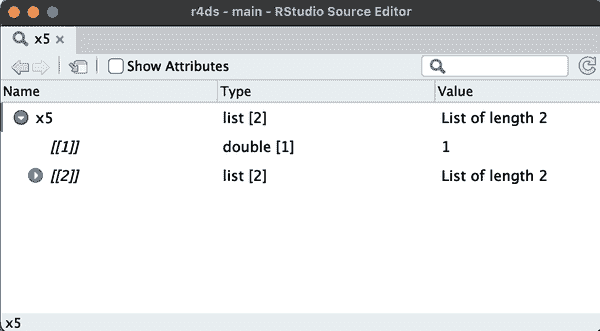
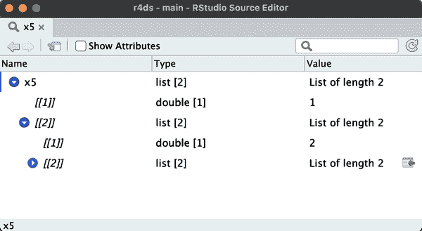
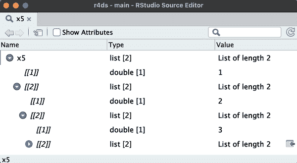

# 第二十三章：层次数据

# 介绍

在本章中，您将学习数据*矩形化*的艺术，将基本上是分层或类似树状的数据转换为由行和列组成的矩形数据框。这很重要，因为分层数据出人意料地常见，特别是在处理来自网络的数据时。

要了解矩形化，您首先需要了解列表，这种数据结构使得分层数据成为可能。然后您将学习两个关键的 tidyr 函数：[`tidyr::unnest_longer()`](https://tidyr.tidyverse.org/reference/unnest_longer.xhtml)和[`tidyr::unnest_wider()`](https://tidyr.tidyverse.org/reference/unnest_wider.xhtml)。接着，我们将展示几个案例研究，一遍又一遍地应用这些简单函数来解决实际问题。最后，我们将讨论 JSON，这是分层数据集的最常见来源，也是网络数据交换的常见格式。

## 先决条件

在本章中，我们将使用许多来自 tidyr 的函数，这是 tidyverse 的核心成员之一。我们还将使用*repurrrsive*提供一些有趣的数据集用于矩形化练习，并且最后使用*jsonlite*将 JSON 文件读入 R 列表。

```
library(tidyverse)
library(repurrrsive)
library(jsonlite)
```

# 列表

到目前为止，您已经处理过包含简单向量（例如整数、数字、字符、日期时间和因子）的数据框。这些向量之所以简单，是因为它们是同构的：每个元素都是相同的数据类型。如果您想在同一个向量中存储不同类型的元素，您将需要一个*列表*，可以使用[`list()`](https://rdrr.io/r/base/list.xhtml)来创建：

```
x1 <- list(1:4, "a", TRUE)
x1
#> [[1]]
#> [1] 1 2 3 4
#> 
#> [[2]]
#> [1] "a"
#> 
#> [[3]]
#> [1] TRUE
```

命名列表的组成部分或*子级*通常很方便，您可以像命名 tibble 的列一样做：

```
x2 <- list(a = 1:2, b = 1:3, c = 1:4)
x2
#> $a
#> [1] 1 2
#> 
#> $b
#> [1] 1 2 3
#> 
#> $c
#> [1] 1 2 3 4
```

即使对于这些简单的列表，打印也会占用相当多的空间。一个有用的替代方法是[`str()`](https://rdrr.io/r/utils/str.xhtml)，它会生成一个*str*ucture 的紧凑显示，弱化内容：

```
str(x1)
#> List of 3
#>  $ : int [1:4] 1 2 3 4
#>  $ : chr "a"
#>  $ : logi TRUE
str(x2)
#> List of 3
#>  $ a: int [1:2] 1 2
#>  $ b: int [1:3] 1 2 3
#>  $ c: int [1:4] 1 2 3 4
```

正如您所见，[`str()`](https://rdrr.io/r/utils/str.xhtml)会在单独的行上显示列表的每个子级。如果存在名称，则显示名称；然后是类型的缩写；然后是前几个值。

## 层次结构

列表可以包含任何类型的对象，包括其他列表。这使它们适合表示分层（类似树状）结构：

```
x3 <- list(list(1, 2), list(3, 4))
str(x3)
#> List of 2
#>  $ :List of 2
#>   ..$ : num 1
#>   ..$ : num 2
#>  $ :List of 2
#>   ..$ : num 3
#>   ..$ : num 4
```

这与[`c()`](https://rdrr.io/r/base/c.xhtml)明显不同，后者生成一个平面向量：

```
c(c(1, 2), c(3, 4))
#> [1] 1 2 3 4

x4 <- c(list(1, 2), list(3, 4))
str(x4)
#> List of 4
#>  $ : num 1
#>  $ : num 2
#>  $ : num 3
#>  $ : num 4
```

随着列表变得更复杂，[`str()`](https://rdrr.io/r/utils/str.xhtml)变得更有用，因为它让您能一目了然地看到层次结构：

```
x5 <- list(1, list(2, list(3, list(4, list(5)))))
str(x5)
#> List of 2
#>  $ : num 1
#>  $ :List of 2
#>   ..$ : num 2
#>   ..$ :List of 2
#>   .. ..$ : num 3
#>   .. ..$ :List of 2
#>   .. .. ..$ : num 4
#>   .. .. ..$ :List of 1
#>   .. .. .. ..$ : num 5
```

随着列表变得越来越大和更复杂，[`str()`](https://rdrr.io/r/utils/str.xhtml)最终会开始失败，您将需要切换到[`View()`](https://rdrr.io/r/utils/View.xhtml)。¹ 图 23-1 展示了调用`View(x5)`的结果。查看器首先显示列表的顶层，但您可以交互地展开任何组件以查看更多内容，如图 23-2 所示。RStudio 还会显示访问该元素所需的代码，如图 23-3 所示。我们将在“使用 $ 和 [[ 选择单个元素”]中回到这些代码的工作方式。



###### 图 23-1。RStudio 视图允许您交互式地探索复杂列表。查看器开始时只显示列表的顶层。



###### 图 23-2。单击右向三角形展开列表的该组件，以便您还可以看到其子元素。



###### 图 23-3。您可以重复此操作多次以获取您感兴趣的数据。请注意左下角：如果单击列表的元素，RStudio 将给出访问它所需的子集代码，在本例中为`x5[[2]][[2]][[2]]`。

## 列表列

列表也可以存在于一个数据框中，我们称之为列表列。列表列非常有用，因为它允许您将对象放置在数据框中，这些对象通常不属于数据框。特别是在[tidymodels 生态系统](https://oreil.ly/0giAa)中，列表列被广泛使用，因为它们允许您存储诸如模型输出或重采样之类的东西在数据框中。

这里是一个列表列的简单示例：

```
df <- tibble(
  x = 1:2, 
  y = c("a", "b"),
  z = list(list(1, 2), list(3, 4, 5))
)
df
#> # A tibble: 2 × 3
#>       x y     z 
#>   <int> <chr> <list> 
#> 1     1 a     <list [2]>
#> 2     2 b     <list [3]>
```

在数据框中，列表没有任何特殊之处；它们的行为就像任何其他列一样：

```
df |> 
  filter(x == 1)
#> # A tibble: 1 × 3
#>       x y     z 
#>   <int> <chr> <list> 
#> 1     1 a     <list [2]>
```

使用列表列进行计算更加困难，但这是因为通常情况下使用列表进行计算本身就比较困难；我们将在第二十六章回到这个话题。在本章中，我们将专注于将列表列展开成常规变量，这样您就可以在其上使用现有的工具。

默认打印方法只显示内容的粗略摘要。列表列可能非常复杂，因此没有好的打印方法。如果您想查看它，您需要提取出一个列表列，并应用您之前学到的技术之一，例如`df |> pull(z) |> str()`或`df |> pull(z) |> View()`。

# 基础 R

可以将列表放入`data.frame`的列中，但操作起来更复杂，因为[`data.frame()`](https://rdrr.io/r/base/data.frame.xhtml)将列表视为列的列表：

```
data.frame(x = list(1:3, 3:5))
#>   x.1.3 x.3.5
#> 1     1     3
#> 2     2     4
#> 3     3     5
```

你可以通过将其包装在列表[`I()`](https://rdrr.io/r/base/AsIs.xhtml)中，强制[`data.frame()`](https://rdrr.io/r/base/data.frame.xhtml)将列表视为行列表，但结果并不打印得特别好：

```
data.frame(
  x = I(list(1:2, 3:5)), 
  y = c("1, 2", "3, 4, 5")
)
#>         x       y
#> 1    1, 2    1, 2
#> 2 3, 4, 5 3, 4, 5
```

使用 tibbles 更容易使用列表列，因为[`tibble()`](https://tibble.tidyverse.org/reference/tibble.xhtml)将列表视为向量，并且打印方法已经设计了列表的处理方式。

# 展开列表

现在你已经了解了列表和列表列的基础知识，让我们探讨如何将它们转换回常规的行和列。这里我们将使用简单的样本数据，以便你可以基本了解；在下一节中，我们将切换到真实数据。

列表列通常有两种基本形式：命名和未命名。当子元素是*命名*时，在每一行中它们往往具有相同的名称。例如，在`df1`中，列表列`y`的每个元素都有两个名为`a`和`b`的元素。命名列表列自然地展开为列：每个命名元素成为一个新的命名列。

```
df1 <- tribble(
  ~x, ~y,
  1, list(a = 11, b = 12),
  2, list(a = 21, b = 22),
  3, list(a = 31, b = 32),
)
```

当子元素是*未命名*时，元素的数量往往会从一行到另一行变化。例如，在`df2`中，列表列`y`的元素是未命名的，并且在长度上从一到三不等。未命名列表列自然地展开为行：每个子元素都会得到一行。

```
df2 <- tribble(
  ~x, ~y,
  1, list(11, 12, 13),
  2, list(21),
  3, list(31, 32),
)
```

tidyr 为这两种情况提供了两个函数：[`unnest_wider()`](https://tidyr.tidyverse.org/reference/unnest_wider.xhtml)和[`unnest_longer()`](https://tidyr.tidyverse.org/reference/unnest_longer.xhtml)。下面的部分将解释它们的工作原理。

## unnest_wider()

当每一行具有相同数量和相同名称的元素时，比如`df1`，使用[`unnest_wider()`](https://tidyr.tidyverse.org/reference/unnest_wider.xhtml)将每个组件自然地放入自己的列中：

```
df1 |> 
  unnest_wider(y)
#> # A tibble: 3 × 3
#>       x     a     b
#>   <dbl> <dbl> <dbl>
#> 1     1    11    12
#> 2     2    21    22
#> 3     3    31    32
```

默认情况下，新列的名称仅来自列表元素的名称，但您可以使用`names_sep`参数要求它们结合列名和元素名。这对于消除重复名称很有用。

```
df1 |> 
  unnest_wider(y, names_sep = "_")
#> # A tibble: 3 × 3
#>       x   y_a   y_b
#>   <dbl> <dbl> <dbl>
#> 1     1    11    12
#> 2     2    21    22
#> 3     3    31    32
```

## unnest_longer()

当每一行包含一个未命名列表时，最自然的做法是使用[`unnest_longer()`](https://tidyr.tidyverse.org/reference/unnest_longer.xhtml)将每个元素放入自己的行中：

```
df2 |> 
  unnest_longer(y)
#> # A tibble: 6 × 2
#>       x     y
#>   <dbl> <dbl>
#> 1     1    11
#> 2     1    12
#> 3     1    13
#> 4     2    21
#> 5     3    31
#> 6     3    32
```

注意`x`如何对每个`y`内部的元素重复：我们为列表列内的每个元素获得一行输出。但是如果其中一个元素为空会发生什么，如下例所示？

```
df6 <- tribble(
  ~x, ~y,
  "a", list(1, 2),
  "b", list(3),
  "c", list()
)
df6 |> unnest_longer(y)
#> # A tibble: 3 × 2
#>   x         y
#>   <chr> <dbl>
#> 1 a         1
#> 2 a         2
#> 3 b         3
```

我们在输出中得到零行，因此行实际上消失了。如果想保留该行，在`y`中添加`NA`，设置`keep_empty = TRUE`。

## 不一致的类型

如果你展开一个包含不同类型向量的列表列会发生什么？例如，考虑以下数据集，列表列`y`包含两个数字，一个字符和一个逻辑，通常不能混合在单个列中：

```
df4 <- tribble(
  ~x, ~y,
  "a", list(1),
  "b", list("a", TRUE, 5)
)
```

[`unnest_longer()`](https://tidyr.tidyverse.org/reference/unnest_longer.xhtml)始终保持列集不变，同时更改行数。所以会发生什么？[`unnest_longer()`](https://tidyr.tidyverse.org/reference/unnest_longer.xhtml)如何在保持`y`中所有内容的同时产生五行？

```
df4 |> 
  unnest_longer(y)
#> # A tibble: 4 × 2
#>   x     y 
#>   <chr> <list> 
#> 1 a     <dbl [1]>
#> 2 b     <chr [1]>
#> 3 b     <lgl [1]>
#> 4 b     <dbl [1]>
```

正如你所见，输出包含一个列表列，但列表列的每个元素都包含一个单一元素。因为[`unnest_longer()`](https://tidyr.tidyverse.org/reference/unnest_longer.xhtml)找不到一个共同类型的向量，它将保留列表列中的原始类型。你可能会想知道这是否违反了每列元素必须是相同类型的命令。它不会：每个元素都是一个列表，尽管内容是不同类型的。

处理不一致类型是具有挑战性的，详细信息取决于问题的确切性质和你的目标，但你可能需要来自第二十六章的工具。

## 其他函数

tidyr 还有一些其他有用的矩形函数，本书不打算覆盖：

+   [`unnest_auto()`](https://tidyr.tidyverse.org/reference/unnest_auto.xhtml)根据列表列的结构自动选择[`unnest_longer()`](https://tidyr.tidyverse.org/reference/unnest_longer.xhtml)和[`unnest_wider()`](https://tidyr.tidyverse.org/reference/unnest_wider.xhtml)之间的操作。这对于快速探索很有用，但最终这是一个不好的想法，因为它不强制你理解数据结构，使你的代码更难理解。

+   [`unnest()`](https://tidyr.tidyverse.org/reference/unnest.xhtml)扩展行和列。当你有一个列表列包含像数据框这样的二维结构时，这是有用的，尽管本书未涉及，但如果你使用[tidymodels 生态系统](https://oreil.ly/ytJvP)可能会遇到。

当你阅读他人的代码或处理较少见的矩形化挑战时，你会遇到这些函数。

## 练习

1.  当你像`df2`这样使用[`unnest_wider()`](https://tidyr.tidyverse.org/reference/unnest_wider.xhtml)时，没有命名列表列会发生什么？现在需要什么参数？缺失值会发生什么？

1.  当你像`df1`这样使用[`unnest_longer()`](https://tidyr.tidyverse.org/reference/unnest_longer.xhtml)时，名为列表列会发生什么？输出中有什么额外信息？如何抑制这些额外细节？

1.  不时地，您会遇到具有多个列表列和对齐值的数据框。例如，在以下数据框中，`y` 和 `z` 的值是对齐的（即 `y` 和 `z` 在同一行内始终具有相同的长度，`y` 的第一个值对应于 `z` 的第一个值）。如果您对此数据框应用两次 [`unnest_longer()`](https://tidyr.tidyverse.org/reference/unnest_longer.xhtml)，会发生什么？如何保持 `x` 和 `y` 之间的关系？（提示：仔细阅读文档。）

    ```
    df4 <- tribble(
      ~x, ~y, ~z,
      "a", list("y-a-1", "y-a-2"), list("z-a-1", "z-a-2"),
      "b", list("y-b-1", "y-b-2", "y-b-3"), list("z-b-1", "z-b-2", "z-b-3")
    )
    ```

# 案例研究

早期使用的简单示例与真实数据之间的主要区别在于，真实数据通常包含多层嵌套，需要多次调用 [`unnest_longer()`](https://tidyr.tidyverse.org/reference/unnest_longer.xhtml) 和/或 [`unnest_wider()`](https://tidyr.tidyverse.org/reference/unnest_wider.xhtml)。为了展示实际情况，本节将通过 repurrrsive 包中的数据集解决三个真实的矩形化挑战。

## 非常广泛的数据

我们将从 `gh_repos` 开始。这是一个列表，其中包含使用 GitHub API 检索的一组 GitHub 仓库的数据。它是一个深度嵌套的列表，所以在本书中很难展示其结构；我们建议在继续之前稍微自行探索一下，使用 `View(gh_repos)`。

`gh_repos` 是一个列表，但我们的工具适用于列表列，因此我们将首先将其放入一个 tibble 中。出于后续原因，我们称此列为 `json`。

```
repos <- tibble(json = gh_repos)
repos
#> # A tibble: 6 × 1
#>   json 
#>   <list> 
#> 1 <list [30]>
#> 2 <list [30]>
#> 3 <list [30]>
#> 4 <list [26]>
#> 5 <list [30]>
#> 6 <list [30]>
```

这个 tibble 包含六行，每一行都包含一个未命名列表，其中每个列表包含 26 或 30 行。由于这些未命名，我们将使用 [`unnest_longer()`](https://tidyr.tidyverse.org/reference/unnest_longer.xhtml) 将每个子元素放入自己的行中：

```
repos |> 
  unnest_longer(json)
#> # A tibble: 176 × 1
#>   json 
#>   <list> 
#> 1 <named list [68]>
#> 2 <named list [68]>
#> 3 <named list [68]>
#> 4 <named list [68]>
#> 5 <named list [68]>
#> 6 <named list [68]>
#> # … with 170 more rows
```

乍一看，可能会觉得我们没有改进情况：虽然我们有了更多的行（176 行而不是 6 行），但 `json` 的每个元素仍然是一个列表。然而，有一个重要的区别：现在每个元素都是一个 *具名* 列表，所以我们可以使用 [`unnest_wider()`](https://tidyr.tidyverse.org/reference/unnest_wider.xhtml) 将每个元素放入自己的列中：

```
repos |> 
  unnest_longer(json) |> 
  unnest_wider(json) 
#> # A tibble: 176 × 68
#>         id name        full_name         owner        private html_url 
#>      <int> <chr>       <chr>             <list>       <lgl>   <chr> 
#> 1 61160198 after       gaborcsardi/after <named list> FALSE   https://github…
#> 2 40500181 argufy      gaborcsardi/argu… <named list> FALSE   https://github…
#> 3 36442442 ask         gaborcsardi/ask   <named list> FALSE   https://github…
#> 4 34924886 baseimports gaborcsardi/base… <named list> FALSE   https://github…
#> 5 61620661 citest      gaborcsardi/cite… <named list> FALSE   https://github…
#> 6 33907457 clisymbols  gaborcsardi/clis… <named list> FALSE   https://github…
#> # … with 170 more rows, and 62 more variables: description <chr>,
#> #   fork <lgl>, url <chr>, forks_url <chr>, keys_url <chr>, …
```

这种方法有效，但结果有点令人不知所措：列太多，tibble 甚至无法打印全部！我们可以使用 [`names()`](https://rdrr.io/r/base/names.xhtml) 来查看它们，并且我们在这里查看前 10 个：

```
repos |> 
  unnest_longer(json) |> 
  unnest_wider(json) |> 
  names() |> 
  head(10)
#>  [1] "id"          "name"        "full_name"   "owner"       "private" 
#>  [6] "html_url"    "description" "fork"        "url"         "forks_url"
```

让我们挑几个看起来有趣的出来：

```
repos |> 
  unnest_longer(json) |> 
  unnest_wider(json) |> 
  select(id, full_name, owner, description)
#> # A tibble: 176 × 4
#>         id full_name               owner             description 
#>      <int> <chr>                   <list>            <chr> 
#> 1 61160198 gaborcsardi/after       <named list [17]> Run Code in the Backgro…
#> 2 40500181 gaborcsardi/argufy      <named list [17]> Declarative function ar…
#> 3 36442442 gaborcsardi/ask         <named list [17]> Friendly CLI interactio…
#> 4 34924886 gaborcsardi/baseimports <named list [17]> Do we get warnings for …
#> 5 61620661 gaborcsardi/citest      <named list [17]> Test R package and repo…
#> 6 33907457 gaborcsardi/clisymbols  <named list [17]> Unicode symbols for CLI…
#> # … with 170 more rows
```

您可以使用此方法回溯以了解 `gh_repos` 的结构：每个子元素都是一个 GitHub 用户，包含他们创建的最多 30 个 GitHub 仓库的列表。

`owner` 是另一个列表列，由于它包含一个具名列表，我们可以使用 [`unnest_wider()`](https://tidyr.tidyverse.org/reference/unnest_wider.xhtml) 获取其值：

```
repos |> 
  unnest_longer(json) |> 
  unnest_wider(json) |> 
  select(id, full_name, owner, description) |> 
  unnest_wider(owner)
#> Error in `unnest_wider()`:
#> ! Can't duplicate names between the affected columns and the original
#>   data.
#> ✖ These names are duplicated:
#>   ℹ `id`, from `owner`.
#> ℹ Use `names_sep` to disambiguate using the column name.
#> ℹ Or use `names_repair` to specify a repair strategy.
```

啊哦，这个列表列还包含一个 `id` 列，而且在同一个数据框中我们不能有两个 `id` 列。建议使用 `names_sep` 来解决这个问题：

```
repos |> 
  unnest_longer(json) |> 
  unnest_wider(json) |> 
  select(id, full_name, owner, description) |> 
  unnest_wider(owner, names_sep = "_")
#> # A tibble: 176 × 20
#>         id full_name               owner_login owner_id owner_avatar_url 
#>      <int> <chr>                   <chr>          <int> <chr> 
#> 1 61160198 gaborcsardi/after       gaborcsardi   660288 https://avatars.gith…
#> 2 40500181 gaborcsardi/argufy      gaborcsardi   660288 https://avatars.gith…
#> 3 36442442 gaborcsardi/ask         gaborcsardi   660288 https://avatars.gith…
#> 4 34924886 gaborcsardi/baseimports gaborcsardi   660288 https://avatars.gith…
#> 5 61620661 gaborcsardi/citest      gaborcsardi   660288 https://avatars.gith…
#> 6 33907457 gaborcsardi/clisymbols  gaborcsardi   660288 https://avatars.gith…
#> # … with 170 more rows, and 15 more variables: owner_gravatar_id <chr>,
#> #   owner_url <chr>, owner_html_url <chr>, owner_followers_url <chr>, …
```

这给了另一个宽数据集，但你可以感觉到 `owner` 包含了关于“拥有”仓库的人的大量额外数据。

## 关系数据

嵌套数据有时用于表示通常分布在多个数据框之间的数据。例如，考虑 `got_chars`，其中包含关于出现在 *权力的游戏* 书籍和电视系列中的角色的数据。像 `gh_repos` 一样，它是一个列表，因此我们首先将其转换为一个 tibble 的列表列：

```
chars <- tibble(json = got_chars)
chars
#> # A tibble: 30 × 1
#>   json 
#>   <list> 
#> 1 <named list [18]>
#> 2 <named list [18]>
#> 3 <named list [18]>
#> 4 <named list [18]>
#> 5 <named list [18]>
#> 6 <named list [18]>
#> # … with 24 more rows
```

`json` 列包含命名元素，因此我们将从扩展它开始：

```
chars |> 
  unnest_wider(json)
#> # A tibble: 30 × 18
#>   url                    id name            gender culture    born 
#>   <chr>               <int> <chr>           <chr>  <chr>      <chr> 
#> 1 https://www.anapio…  1022 Theon Greyjoy   Male   "Ironborn" "In 278 AC or …
#> 2 https://www.anapio…  1052 Tyrion Lannist… Male   ""         "In 273 AC, at…
#> 3 https://www.anapio…  1074 Victarion Grey… Male   "Ironborn" "In 268 AC or …
#> 4 https://www.anapio…  1109 Will            Male   ""         "" 
#> 5 https://www.anapio…  1166 Areo Hotah      Male   "Norvoshi" "In 257 AC or …
#> 6 https://www.anapio…  1267 Chett           Male   ""         "At Hag's Mire"
#> # … with 24 more rows, and 12 more variables: died <chr>, alive <lgl>,
#> #   titles <list>, aliases <list>, father <chr>, mother <chr>, …
```

然后我们选择几列以便阅读更轻松：

```
characters <- chars |> 
  unnest_wider(json) |> 
  select(id, name, gender, culture, born, died, alive)
characters
#> # A tibble: 30 × 7
#>      id name              gender culture    born              died 
#>   <int> <chr>             <chr>  <chr>      <chr>             <chr> 
#> 1  1022 Theon Greyjoy     Male   "Ironborn" "In 278 AC or 27… "" 
#> 2  1052 Tyrion Lannister  Male   ""         "In 273 AC, at C… "" 
#> 3  1074 Victarion Greyjoy Male   "Ironborn" "In 268 AC or be… "" 
#> 4  1109 Will              Male   ""         ""                "In 297 AC, at…
#> 5  1166 Areo Hotah        Male   "Norvoshi" "In 257 AC or be… "" 
#> 6  1267 Chett             Male   ""         "At Hag's Mire"   "In 299 AC, at…
#> # … with 24 more rows, and 1 more variable: alive <lgl>
```

这个数据集还包含许多列表列：

```
chars |> 
  unnest_wider(json) |> 
  select(id, where(is.list))
#> # A tibble: 30 × 8
#>      id titles    aliases    allegiances books     povBooks tvSeries playedBy
#>   <int> <list>    <list>     <list>      <list>    <list>   <list>   <list> 
#> 1  1022 <chr [2]> <chr [4]>  <chr [1]>   <chr [3]> <chr>    <chr>    <chr> 
#> 2  1052 <chr [2]> <chr [11]> <chr [1]>   <chr [2]> <chr>    <chr>    <chr> 
#> 3  1074 <chr [2]> <chr [1]>  <chr [1]>   <chr [3]> <chr>    <chr>    <chr> 
#> 4  1109 <chr [1]> <chr [1]>  <NULL>      <chr [1]> <chr>    <chr>    <chr> 
#> 5  1166 <chr [1]> <chr [1]>  <chr [1]>   <chr [3]> <chr>    <chr>    <chr> 
#> 6  1267 <chr [1]> <chr [1]>  <NULL>      <chr [2]> <chr>    <chr>    <chr> 
#> # … with 24 more rows
```

让我们探索 `titles` 列。它是一个未命名的列表列，因此我们将其展开为行：

```
chars |> 
  unnest_wider(json) |> 
  select(id, titles) |> 
  unnest_longer(titles)
#> # A tibble: 59 × 2
#>      id titles 
#>   <int> <chr> 
#> 1  1022 Prince of Winterfell 
#> 2  1022 Lord of the Iron Islands (by law of the green lands)
#> 3  1052 Acting Hand of the King (former) 
#> 4  1052 Master of Coin (former) 
#> 5  1074 Lord Captain of the Iron Fleet 
#> 6  1074 Master of the Iron Victory 
#> # … with 53 more rows
```

你可能希望看到这些数据在自己的表中，因为可以根据需要轻松地与字符数据连接。我们来做这个，需要进行一些清理：删除包含空字符串的行，并将 `titles` 重命名为 `title`，因为现在每行只包含一个标题。

```
titles <- chars |> 
  unnest_wider(json) |> 
  select(id, titles) |> 
  unnest_longer(titles) |> 
  filter(titles != "") |> 
  rename(title = titles)
titles
#> # A tibble: 52 × 2
#>      id title 
#>   <int> <chr> 
#> 1  1022 Prince of Winterfell 
#> 2  1022 Lord of the Iron Islands (by law of the green lands)
#> 3  1052 Acting Hand of the King (former) 
#> 4  1052 Master of Coin (former) 
#> 5  1074 Lord Captain of the Iron Fleet 
#> 6  1074 Master of the Iron Victory 
#> # … with 46 more rows
```

你可以想象为每个列表列创建这样的表，并使用连接将它们与字符数据结合起来，根据需要使用。

## 深度嵌套

我们将以一个非常深度嵌套的列表列结束这些案例研究，需要重复使用 [`unnest_wider()`](https://tidyr.tidyverse.org/reference/unnest_wider.xhtml) 和 [`unnest_longer()`](https://tidyr.tidyverse.org/reference/unnest_longer.xhtml) 来解开：`gmaps_cities`。这是一个包含五个城市名称及其使用 Google 的 [geocoding API](https://oreil.ly/cdBWZ) 确定位置的结果的两列 tibble：

```
gmaps_cities
#> # A tibble: 5 × 2
#>   city       json 
#>   <chr>      <list> 
#> 1 Houston    <named list [2]>
#> 2 Washington <named list [2]>
#> 3 New York   <named list [2]>
#> 4 Chicago    <named list [2]>
#> 5 Arlington  <named list [2]>
```

`json` 是一个包含内部名称的列表列，因此我们从 [`unnest_wider()`](https://tidyr.tidyverse.org/reference/unnest_wider.xhtml) 开始：

```
gmaps_cities |> 
  unnest_wider(json)
#> # A tibble: 5 × 3
#>   city       results    status
#>   <chr>      <list>     <chr> 
#> 1 Houston    <list [1]> OK 
#> 2 Washington <list [2]> OK 
#> 3 New York   <list [1]> OK 
#> 4 Chicago    <list [1]> OK 
#> 5 Arlington  <list [2]> OK
```

这给我们了 `status` 和 `results`。我们将删除 `status` 列，因为它们都是 `OK`；在实际分析中，你还需要捕获所有 `status != "OK"` 的行，并找出问题所在。`results` 是一个未命名的列表，其中有一个或两个元素（我们很快就会看到原因），所以我们将其展开为行：

```
gmaps_cities |> 
  unnest_wider(json) |> 
  select(-status) |> 
  unnest_longer(results)
#> # A tibble: 7 × 2
#>   city       results 
#>   <chr>      <list> 
#> 1 Houston    <named list [5]>
#> 2 Washington <named list [5]>
#> 3 Washington <named list [5]>
#> 4 New York   <named list [5]>
#> 5 Chicago    <named list [5]>
#> 6 Arlington  <named list [5]>
#> # … with 1 more row
```

现在 `results` 是一个命名列表，因此我们将使用 [`unnest_wider()`](https://tidyr.tidyverse.org/reference/unnest_wider.xhtml)：

```
locations <- gmaps_cities |> 
  unnest_wider(json) |> 
  select(-status) |> 
  unnest_longer(results) |> 
  unnest_wider(results)
locations
#> # A tibble: 7 × 6
#>   city       address_compone…¹ formatted_address geometry     place_id 
#>   <chr>      <list>            <chr>             <list>       <chr> 
#> 1 Houston    <list [4]>        Houston, TX, USA  <named list> ChIJAYWNSLS4QI…
#> 2 Washington <list [2]>        Washington, USA   <named list> ChIJ-bDD5__lhV…
#> 3 Washington <list [4]>        Washington, DC, … <named list> ChIJW-T2Wt7Gt4…
#> 4 New York   <list [3]>        New York, NY, USA <named list> ChIJOwg_06VPwo…
#> 5 Chicago    <list [4]>        Chicago, IL, USA  <named list> ChIJ7cv00DwsDo…
#> 6 Arlington  <list [4]>        Arlington, TX, U… <named list> ChIJ05gI5NJiTo…
#> # … with 1 more row, 1 more variable: types <list>, and abbreviated variable
#> #   name ¹address_components
```

现在我们可以看到为什么两个城市得到了两个结果：Washington 匹配了华盛顿州和华盛顿特区，Arlington 匹配了弗吉尼亚州的阿灵顿和德克萨斯州的阿灵顿。

现在 `geometry` 列中存储的是匹配项的确切位置，我们可以从这里几个不同的地方开始。

```
locations |> 
  select(city, formatted_address, geometry) |> 
  unnest_wider(geometry)
#> # A tibble: 7 × 6
#>   city       formatted_address   bounds           location     location_type
#>   <chr>      <chr>               <list>           <list>       <chr> 
#> 1 Houston    Houston, TX, USA    <named list [2]> <named list> APPROXIMATE 
#> 2 Washington Washington, USA     <named list [2]> <named list> APPROXIMATE 
#> 3 Washington Washington, DC, USA <named list [2]> <named list> APPROXIMATE 
#> 4 New York   New York, NY, USA   <named list [2]> <named list> APPROXIMATE 
#> 5 Chicago    Chicago, IL, USA    <named list [2]> <named list> APPROXIMATE 
#> 6 Arlington  Arlington, TX, USA  <named list [2]> <named list> APPROXIMATE 
#> # … with 1 more row, and 1 more variable: viewport <list>
```

这给我们新的 `bounds`（一个矩形区域）和 `location`（一个点）。我们可以展开 `location` 看到纬度（`lat`）和经度（`lng`）：

```
locations |> 
  select(city, formatted_address, geometry) |> 
  unnest_wider(geometry) |> 
  unnest_wider(location)
#> # A tibble: 7 × 7
#>   city       formatted_address   bounds             lat    lng location_type
#>   <chr>      <chr>               <list>           <dbl>  <dbl> <chr> 
#> 1 Houston    Houston, TX, USA    <named list [2]>  29.8  -95.4 APPROXIMATE 
#> 2 Washington Washington, USA     <named list [2]>  47.8 -121\.  APPROXIMATE 
#> 3 Washington Washington, DC, USA <named list [2]>  38.9  -77.0 APPROXIMATE 
#> 4 New York   New York, NY, USA   <named list [2]>  40.7  -74.0 APPROXIMATE 
#> 5 Chicago    Chicago, IL, USA    <named list [2]>  41.9  -87.6 APPROXIMATE 
#> 6 Arlington  Arlington, TX, USA  <named list [2]>  32.7  -97.1 APPROXIMATE 
#> # … with 1 more row, and 1 more variable: viewport <list>
```

提取边界需要几个步骤：

```
locations |> 
  select(city, formatted_address, geometry) |> 
  unnest_wider(geometry) |> 
  # focus on the variables of interest
  select(!location:viewport) |>
  unnest_wider(bounds)
#> # A tibble: 7 × 4
#>   city       formatted_address   northeast        southwest 
#>   <chr>      <chr>               <list>           <list> 
#> 1 Houston    Houston, TX, USA    <named list [2]> <named list [2]>
#> 2 Washington Washington, USA     <named list [2]> <named list [2]>
#> 3 Washington Washington, DC, USA <named list [2]> <named list [2]>
#> 4 New York   New York, NY, USA   <named list [2]> <named list [2]>
#> 5 Chicago    Chicago, IL, USA    <named list [2]> <named list [2]>
#> 6 Arlington  Arlington, TX, USA  <named list [2]> <named list [2]>
#> # … with 1 more row
```

然后我们重命名 `southwest` 和 `northeast`（矩形的角），这样我们可以使用 `names_sep` 创建简短但富有表现力的名称：

```
locations |> 
  select(city, formatted_address, geometry) |> 
  unnest_wider(geometry) |> 
  select(!location:viewport) |>
  unnest_wider(bounds) |> 
  rename(ne = northeast, sw = southwest) |> 
  unnest_wider(c(ne, sw), names_sep = "_") 
#> # A tibble: 7 × 6
#>   city       formatted_address   ne_lat ne_lng sw_lat sw_lng
#>   <chr>      <chr>                <dbl>  <dbl>  <dbl>  <dbl>
#> 1 Houston    Houston, TX, USA      30.1  -95.0   29.5  -95.8
#> 2 Washington Washington, USA       49.0 -117\.    45.5 -125\. 
#> 3 Washington Washington, DC, USA   39.0  -76.9   38.8  -77.1
#> 4 New York   New York, NY, USA     40.9  -73.7   40.5  -74.3
#> 5 Chicago    Chicago, IL, USA      42.0  -87.5   41.6  -87.9
#> 6 Arlington  Arlington, TX, USA    32.8  -97.0   32.6  -97.2
#> # … with 1 more row
```

注意如何通过向[`unnest_wider()`](https://tidyr.tidyverse.org/reference/unnest_wider.xhtml)提供变量名的向量来同时展开两列。

一旦发现了获取感兴趣组件的路径，你可以使用另一个 tidyr 函数[`hoist()`](https://tidyr.tidyverse.org/reference/hoist.xhtml)直接提取它们：

```
locations |> 
  select(city, formatted_address, geometry) |> 
  hoist(
    geometry,
    ne_lat = c("bounds", "northeast", "lat"),
    sw_lat = c("bounds", "southwest", "lat"),
    ne_lng = c("bounds", "northeast", "lng"),
    sw_lng = c("bounds", "southwest", "lng"),
  )
```

如果这些案例研究激起了你进一步了解实际整理的兴趣，你可以在`vignette("rectangling", package = "tidyr")`中看到更多例子。

## 练习

1.  大致估计`gh_repos`的创建时间。为什么你只能大致估计日期？

1.  `gh_repo`的`owner`列包含大量重复信息，因为每个所有者可以有多个仓库。你能构建一个包含每个所有者一行的`owners`数据框吗？（提示：`distinct()`与`list-cols`一起使用会起作用吗？）

1.  按照用于`titles`的步骤来创建相似的表格，以列举*权力的游戏*角色的别名、效忠、书籍和电视系列。

1.  逐行解释以下代码。为什么它有趣？为什么它对`got_chars`起作用但在一般情况下可能不起作用？

    ```
    tibble(json = got_chars) |> 
      unnest_wider(json) |> 
      select(id, where(is.list)) |> 
      pivot_longer(
        where(is.list), 
        names_to = "name", 
        values_to = "value"
      ) |>  
      unnest_longer(value)
    ```

1.  在`gmaps_cities`中，`address_components`包含什么？为什么长度在行之间变化？适当展开它来找出答案。（提示：`types`似乎总是包含两个元素。使用[`unnest_wider()`](https://tidyr.tidyverse.org/reference/unnest_wider.xhtml)比[`unnest_longer()`](https://tidyr.tidyverse.org/reference/unnest_longer.xhtml)更容易处理吗？）

# JSON

前一节中的所有案例研究都来自野生 JSON。JSON 是 JavaScript 对象表示法的简称，是大多数 Web API 返回数据的方式。了解它很重要，因为虽然 JSON 和 R 的数据类型非常相似，但并没有完美的一对一映射，所以如果出现问题，了解 JSON 的一些内容是很有帮助的。

## 数据类型

JSON 是一种简单的格式，设计成易于机器读写，而不是人类。它有六种关键的数据类型。其中四种是标量：

+   最简单的类型是空值（`null`），在 R 中扮演与`NA`相同的角色。它表示数据的缺失。

+   字符串类似于 R 中的字符串，但必须始终使用双引号。

+   数字类似于 R 的数字：它们可以使用整数（例如 123）、小数（例如 123.45）或科学计数法（例如 1.23e3）表示。JSON 不支持`Inf`、`-Inf`或`NaN`。

+   布尔值类似于 R 的`TRUE`和`FALSE`，但使用小写的`true`和`false`。

JSON 的字符串、数字和布尔值与 R 的字符、数值和逻辑向量非常相似。主要区别在于 JSON 的标量只能表示单个值。要表示多个值，需要使用其余两种类型之一：数组和对象。

数组和对象在 R 中类似于列表；它们的区别在于是否命名。*数组* 类似于未命名的列表，并用 `[]` 写出。例如，`[1, 2, 3]` 是一个包含三个数字的数组，`[null, 1, "string", false]` 是一个包含 null、数字、字符串和布尔值的数组。*对象* 类似于命名列表，并用 [`{}`](https://rdrr.io/r/base/Paren.xhtml) 写出。名称（在 JSON 术语中称为键）是字符串，因此必须用引号括起来。例如，`{"x": 1, "y": 2}` 是一个将 `x` 映射到 1 而 `y` 映射到 2 的对象。

请注意，JSON 没有任何本地方式来表示日期或日期时间，因此它们通常作为字符串存储，您需要使用 [`readr::parse_date()`](https://readr.tidyverse.org/reference/parse_datetime.xhtml) 或 [`readr::parse_datetime()`](https://readr.tidyverse.org/reference/parse_datetime.xhtml) 将它们转换为正确的数据结构。同样，JSON 对浮点数的表示规则有些不精确，因此有时您会发现数字存储为字符串。根据需要应用 [`readr::parse_double()`](https://readr.tidyverse.org/reference/parse_atomic.xhtml) 来获取正确的变量类型。

## jsonlite

要将 JSON 转换为 R 数据结构，我们推荐 Jeroen Ooms 的 jsonlite 包。我们仅使用两个 jsonlite 函数：[`read_json()`](https://rdrr.io/pkg/jsonlite/man/read_json.xhtml) 和 [`parse_json()`](https://rdrr.io/pkg/jsonlite/man/read_json.xhtml)。在实际中，您会使用 [`read_json()`](https://rdrr.io/pkg/jsonlite/man/read_json.xhtml) 从磁盘读取 JSON 文件。例如，repurrsive 包还提供了 `gh_user` 的源作为 JSON 文件，您可以使用 [`read_json()`](https://rdrr.io/pkg/jsonlite/man/read_json.xhtml) 读取它：

```
# A path to a json file inside the package:
gh_users_json()
#> [1] "/Users/hadley/Library/R/arm64/4.2/library/repurrrsive/extdata/gh_users.json"

# Read it with read_json()
gh_users2 <- read_json(gh_users_json())

# Check it's the same as the data we were using previously
identical(gh_users, gh_users2)
#> [1] TRUE
```

在本书中，我们还将使用[`parse_json()`](https://rdrr.io/pkg/jsonlite/man/read_json.xhtml)，因为它接受包含 JSON 的字符串，非常适合生成简单的示例。要开始，这里有三个简单的 JSON 数据集，首先是一个数字，然后将几个数字放入数组中，最后将该数组放入对象中：

```
str(parse_json('1'))
#>  int 1
str(parse_json('[1, 2, 3]'))
#> List of 3
#>  $ : int 1
#>  $ : int 2
#>  $ : int 3
str(parse_json('{"x": [1, 2, 3]}'))
#> List of 1
#>  $ x:List of 3
#>   ..$ : int 1
#>   ..$ : int 2
#>   ..$ : int 3
```

jsonlite 还有另一个重要的函数叫做 [`fromJSON()`](https://rdrr.io/pkg/jsonlite/man/fromJSON.xhtml)。我们这里没有使用它，因为它执行自动简化 (`simplifyVector = TRUE`)。这在简单情况下通常效果良好，但我们认为最好自己进行矩形化，这样您就可以准确知道发生了什么，并且更容易处理最复杂的嵌套结构。

## 开始矩形化过程

在大多数情况下，JSON 文件包含一个顶级数组，因为它们旨在提供关于多个“事物”的数据，例如多个页面、多个记录或多个结果。在这种情况下，您将以 `tibble(json)` 开始您的矩形化，以便每个元素成为一行：

```
json <- '[
 {"name": "John", "age": 34},
 {"name": "Susan", "age": 27}
]'
df <- tibble(json = parse_json(json))
df
#> # A tibble: 2 × 1
#>   json 
#>   <list> 
#> 1 <named list [2]>
#> 2 <named list [2]>

df |> 
  unnest_wider(json)
#> # A tibble: 2 × 2
#>   name    age
#>   <chr> <int>
#> 1 John     34
#> 2 Susan    27
```

在更罕见的情况下，JSON 文件由单个顶级 JSON 对象组成，代表一个“事物”。在这种情况下，您需要通过将其包装在列表中来启动矩形化过程，然后将其放入一个 tibble 中：

```
json <- '{
 "status": "OK", 
 "results": [
 {"name": "John", "age": 34},
 {"name": "Susan", "age": 27}
 ]
}
'
df <- tibble(json = list(parse_json(json)))
df
#> # A tibble: 1 × 1
#>   json 
#>   <list> 
#> 1 <named list [2]>

df |> 
  unnest_wider(json) |> 
  unnest_longer(results) |> 
  unnest_wider(results)
#> # A tibble: 2 × 3
#>   status name    age
#>   <chr>  <chr> <int>
#> 1 OK     John     34
#> 2 OK     Susan    27
```

或者，您可以深入解析的 JSON 并从您实际关心的部分开始：

```
df <- tibble(results = parse_json(json)$results)
df |> 
  unnest_wider(results)
#> # A tibble: 2 × 2
#>   name    age
#>   <chr> <int>
#> 1 John     34
#> 2 Susan    27
```

## 练习

1.  矩形化以下 `df_col` 和 `df_row`。它们代表了在 JSON 中编码数据框的两种方式。

    ```
    json_col <- parse_json('
     {
     "x": ["a", "x", "z"],
     "y": [10, null, 3]
     }
    ')
    json_row <- parse_json('
     [
     {"x": "a", "y": 10},
     {"x": "x", "y": null},
     {"x": "z", "y": 3}
     ]
    ')

    df_col <- tibble(json = list(json_col)) 
    df_row <- tibble(json = json_row)
    ```

# 总结

在本章中，您学习了什么是列表，如何从 JSON 文件生成列表，以及如何将它们转换为矩形数据框。令人惊讶的是，我们只需要两个新函数：[`unnest_longer()`](https://tidyr.tidyverse.org/reference/unnest_longer.xhtml) 将列表元素放入行中，以及 [`unnest_wider()`](https://tidyr.tidyverse.org/reference/unnest_wider.xhtml) 将列表元素放入列中。不管列表列嵌套多深，您只需重复调用这两个函数即可。

JSON 是 Web API 返回的最常见数据格式。如果网站没有 API，但您可以在网站上看到所需数据，会发生什么？这是下一章节的主题：Web 抓取，从 HTML 网页中提取数据。

¹ 这是一个 RStudio 的特性。
