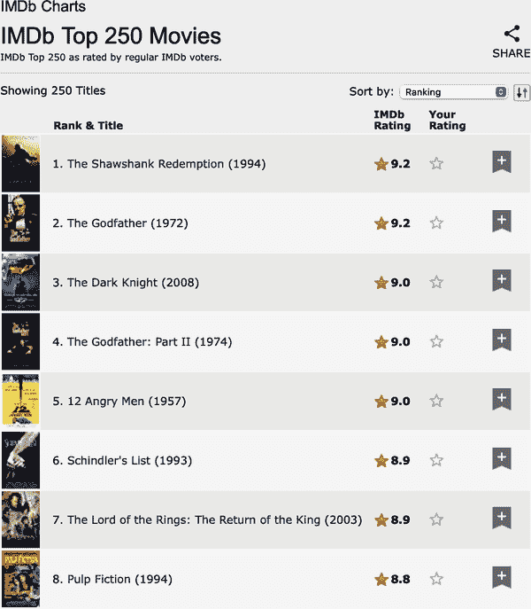

# 第二十四章：网络抓取

# 介绍

本章将向您介绍使用[rvest](https://oreil.ly/lUNa6)进行网络抓取的基础知识。网络抓取是从网页中提取数据的有用工具。一些网站会提供 API，这是一组结构化的 HTTP 请求，返回 JSON 格式的数据，您可以使用第二十三章中介绍的技术处理这些数据。在可能的情况下，应该使用 API，¹ 因为通常它会提供更可靠的数据。不过，本书的范围不包括使用 Web API 进行编程。相反，我们正在教授抓取技术，这是一种无论网站是否提供 API 都可以使用的技术。

在本章中，我们将首先讨论抓取的道德和法律问题，然后深入讨论 HTML 的基础知识。然后，您将学习 CSS 选择器的基础知识，以定位页面上的特定元素，并了解如何使用 rvest 函数将数据从 HTML 的文本和属性中提取出来，并将其导入到 R 中。接着，我们将讨论一些确定您需要的 CSS 选择器的技术，最后，通过几个案例研究和对动态网站的简要讨论，结束本章。

## 先决条件

在本章中，我们将专注于 rvest 提供的工具。rvest 是 tidyverse 的成员之一，但不是核心成员，因此您需要显式加载它。我们还将加载完整的 tidyverse，因为在处理我们抓取的数据时，它通常会很有用。

```
library(tidyverse)
library(rvest)
```

# 抓取的道德和法律问题

在讨论您需要执行网页抓取的代码之前，我们需要讨论这样做是否合法和道德。总体而言，涉及这两者的情况都很复杂。

法律问题在很大程度上取决于您所在的地方。然而，作为一个通用原则，如果数据是公开的、非个人的和事实性的，您可能不会有问题。² 这三个因素很重要，因为它们与网站的条款和条件、个人可识别信息以及版权有关，我们将在后文讨论。

如果数据不是公开的、非个人的或不是事实性的，或者如果您抓取数据是为了盈利，您需要咨询律师。无论如何，您都应该尊重托管网页的服务器资源。最重要的是，如果您正在抓取许多页面，应该确保在每个请求之间等待一会儿。一个简单的方法是使用[Dmytro Perepolkin 的 polite 包](https://oreil.ly/rlujg)，它将自动在请求之间暂停，并缓存结果，以便您不会重复请求同一页面。

## 服务条款

如果您仔细查看，会发现许多网站在页面的某个位置包含“条款和条件”或“服务条款”的链接，如果您仔细阅读该页面，您通常会发现该网站明确禁止网络抓取。这些页面往往是公司做出非常广泛声明的法律攫取。在可能的情况下，遵守这些服务条款是一种礼貌，但要对任何主张保持怀疑态度。

美国法院通常认为，仅仅将服务条款放在网站页脚中是不足以使您受其约束的，例如，[*HiQ Labs v. LinkedIn*](https://oreil.ly/mDAin)案件。一般来说，要受到服务条款的约束，您必须采取一些明确的行动，比如创建账户或勾选一个框框。这就是为什么数据是否*公开*如此重要；如果您无需账户即可访问它们，那么您很可能不受服务条款的约束。但请注意，在欧洲情况大不相同，法院认为即使您没有明确同意，服务条款也是可以强制执行的。

## 个人可识别信息

即使数据是公开的，您也应该非常小心地收集个人可识别信息，如姓名、电子邮件地址、电话号码、出生日期等。欧洲对此类数据的收集和存储有着特别严格的法律（[GDPR](https://oreil.ly/nzJwO)），而不论您身处何地，您都可能陷入伦理泥潭。例如，在 2016 年，一组研究人员从约 7 万名 OkCupid 约会网站用户的公开资料（例如用户名、年龄、性别、位置等）中收集了数据，并公开发布，而且并未尝试匿名化这些数据。虽然研究人员认为这没有什么问题，因为这些数据已经是公开的，但由于涉及用户可识别性的伦理问题，这项工作遭到了广泛谴责。如果您的工作涉及收集个人可识别信息，我们强烈建议您阅读关于 OkCupid 研究³以及涉及获取和发布个人可识别信息的类似研究，这些研究在研究伦理方面存在争议。

## 版权

最后，您还需要担心版权法。版权法很复杂，但值得看一看的是美国法律（https://oreil.ly/OqUgO），它明确了什么受到保护：“[…]以任何有形表现形式固定的原创作品，[…]”，然后进一步描述了适用于此类作品的具体类别，如文学作品、音乐作品、电影等。版权保护不包括的显著缺失的是数据。这意味着只要您将抓取限制在事实上，版权保护就不适用。（但请注意，欧洲有一个独立的[“独创性”权利](https://oreil.ly/0ewJe)，用于保护数据库。）

举个简单的例子，在美国，成分列表和说明书不受版权保护，因此版权不能用于保护食谱。但如果该食谱列表伴随着大量独特的文学内容，那就是受版权保护的。这就是为什么当您在互联网上寻找食谱时，总是会有这么多内容出现的原因。

如果您确实需要抓取原始内容（如文本或图像），您可能仍然受到[公平使用原则](https://oreil.ly/oFh0-)的保护。公平使用不是一个严格的规则，而是权衡多个因素。如果您是为研究或非商业目的收集数据，并且限制您抓取的内容仅限于您所需的内容，那么公平使用更有可能适用。

# HTML 基础知识

要抓取网页，您首先需要了解一些关于 *HTML* 的知识，这是描述网页的语言。HTML 代表超文本标记语言，看起来像这样：

```
<html>
<head>
  <title>Page title</title>
</head>
<body>
  <h1 id='first'>A heading</h1>
  <p>Some text &amp; <b>some bold text.</b></p>
  
</body>
```

HTML 由 *元素* 组成的分层结构，包括开始标签（例如 `<tag>`），可选的 *属性*（`id='first'`），结束标签⁴（如 `</tag>`）和 *内容*（开始和结束标签之间的所有内容）。

由于 `<` 和 `>` 用于开始和结束标签，您不能直接写入它们。相反，您必须使用 HTML *转义* `&gt;`（大于）和 `&lt;`（小于）。而且，由于这些转义使用 `&`，如果您需要一个字面上的和符号 `&`，您必须将其转义为 `&amp;`。有各种可能的 HTML 转义，但您不需要过多担心，因为 rvest 会自动处理它们。

Web 抓取是可能的，因为大多数包含您想要抓取数据的页面通常具有一致的结构。

## 元素

HTML 元素超过 100 种。其中一些最重要的包括：

+   每个 HTML 页面必须位于 `<html>` 元素中，并且必须有两个子元素：`<head>`，其中包含文档元数据，如页面标题，以及 `<body>`，其中包含在浏览器中看到的内容。

+   块标签如 `<h1>`（标题 1），`<section>`（章节），`<p>`（段落）和 `<ol>`（有序列表）构成页面的整体结构。

+   内联标签如 `<b>`（粗体），`<i>`（斜体）和 `<a>`（链接）会在块标签内部格式化文本。

如果您遇到一个以前从未见过的标签，您可以通过一点搜索找出它的用途。另一个很好的起点是 [MDN Web 文档](https://oreil.ly/qIgHp)，该文档描述了网页编程的几乎所有方面。

大多数元素可以在它们的开始和结束标签之间有内容。此内容可以是文本或更多元素。例如，以下 HTML 包含了一个文本段落，其中有一个词是粗体的：

```
<p>
  Hi! My <b>name</b> is Hadley.
</p>
```

*子元素* 是它包含的元素，因此前面的 `<p>` 元素有一个子元素，即 `<b>` 元素。`<b>` 元素没有子元素，但它确实有内容（文本“name”）。

## 属性

标签可以有命名的*属性*，看起来像`name1='value1' name2='value2'`。其中两个最重要的属性是`id`和`class`，它们与层叠样式表（CSS）结合使用来控制页面的视觉外观。在从页面抓取数据时，这些属性通常很有用。属性还用于记录链接的目标（`<a>`元素的`href`属性）和图像的源（``元素的`src`属性）。

# 提取数据

要开始抓取数据，你需要页面的 URL，通常可以从浏览器中复制。然后你需要使用[`read_html()`](http://xml2.r-lib.org/reference/read_xml.xhtml)将该页面的 HTML 读入 R。这将返回一个`xml_document`⁵对象，然后你可以使用 rvest 函数对其进行操作：

```
html <- read_html("http://rvest.tidyverse.org/")
html
#> {html_document}
#> <html lang="en">
#> [1] <head>\n<meta http-equiv="Content-Type" content="text/html; charset=UT ...
#> [2] <body>\n    <a href="#container" class="visually-hidden-focusable">Ski ...
```

rvest 还包括一个允许你在行内编写 HTML 的函数。在本章中，我们将使用这个函数来演示各种 rvest 函数如何与简单示例配合使用。

```
html <- minimal_html("
 <p>This is a paragraph</p>
 <ul>
 <li>This is a bulleted list</li>
 </ul>
")
html
#> {html_document}
#> <html>
#> [1] <head>\n<meta http-equiv="Content-Type" content="text/html; charset=UT ...
#> [2] <body>\n<p>This is a paragraph</p>\n<p>\n  </p>\n<ul>\n<li>This is a b ...
```

现在你已经在 R 中有了 HTML，是时候提取感兴趣的数据了。你首先会学习到 CSS 选择器，它们允许你识别感兴趣的元素以及可以用来从中提取数据的 rvest 函数。然后我们简要介绍一下 HTML 表格，它们有一些特殊工具。

## 查找元素

CSS 是用于定义 HTML 文档视觉样式的工具。CSS 包括一种用于选择页面上元素的迷你语言，称为*CSS 选择器*。CSS 选择器定义了定位 HTML 元素的模式，对于抓取数据很有用，因为它们提供了一种简洁的描述想要提取哪些元素的方式。

我们将在“找到正确的选择器”中更详细地讨论 CSS 选择器，但幸运的是，你可以只用三种就能走得很远：

`p`

选择所有`<p>`元素。

`.title`

选择所有`class`为“title”的元素。

`#title`

选择具有`id`属性等于“title”的元素。`id`属性在文档内必须是唯一的，因此这将仅选择单个元素。

让我们用一个简单的例子来尝试这些选择器：

```
html <- minimal_html("
 <h1>This is a heading</h1>
 <p id='first'>This is a paragraph</p>
 <p class='important'>This is an important paragraph</p>
")
```

使用[`html_elements()`](https://rvest.tidyverse.org/reference/html_element.xhtml)来查找所有匹配该选择器的元素：

```
html |> html_elements("p")
#> {xml_nodeset (2)}
#> [1] <p id="first">This is a paragraph</p>
#> [2] <p class="important">This is an important paragraph</p>
html |> html_elements(".important")
#> {xml_nodeset (1)}
#> [1] <p class="important">This is an important paragraph</p>
html |> html_elements("#first")
#> {xml_nodeset (1)}
#> [1] <p id="first">This is a paragraph</p>
```

另一个重要的函数是[`html_element()`](https://rvest.tidyverse.org/reference/html_element.xhtml)，它始终返回与输入相同数量的输出。如果将其应用于整个文档，它将给出第一个匹配项：

```
html |> html_element("p")
#> {html_node}
#> <p id="first">
```

当你使用一个不匹配任何元素的选择器时，[`html_element()`](https://rvest.tidyverse.org/reference/html_element.xhtml) 和 [`html_elements()`](https://rvest.tidyverse.org/reference/html_element.xhtml) 之间有一个重要的区别。[`html_elements()`](https://rvest.tidyverse.org/reference/html_element.xhtml) 返回长度为 0 的向量，而 [`html_element()`](https://rvest.tidyverse.org/reference/html_element.xhtml) 返回一个缺失值。这很快就会变得重要。

```
html |> html_elements("b")
#> {xml_nodeset (0)}
html |> html_element("b")
#> {xml_missing}
#> <NA>
```

## 嵌套选择

在大多数情况下，您将一起使用 [`html_elements()`](https://rvest.tidyverse.org/reference/html_element.xhtml) 和 [`html_element()`](https://rvest.tidyverse.org/reference/html_element.xhtml)，通常使用 [`html_elements()`](https://rvest.tidyverse.org/reference/html_element.xhtml) 标识将成为观察值的元素，然后使用 [`html_element()`](https://rvest.tidyverse.org/reference/html_element.xhtml) 查找将成为变量的元素。让我们通过一个简单的例子来看看这一点。这里我们有一个无序列表（`<ul>`），其中每个列表项（`<li>`）包含一些关于四个 *Star Wars* 角色的信息：

```
html <- minimal_html("
 <ul>
 <li><b>C-3PO</b> is a <i>droid</i> that weighs <span class='weight'>167 kg</span></li>
 <li><b>R4-P17</b> is a <i>droid</i></li>
 <li><b>R2-D2</b> is a <i>droid</i> that weighs <span class='weight'>96 kg</span></li>
 <li><b>Yoda</b> weighs <span class='weight'>66 kg</span></li>
 </ul>
 ")
```

我们可以使用 [`html_elements()`](https://rvest.tidyverse.org/reference/html_element.xhtml) 创建一个向量，其中每个元素对应不同的字符：

```
characters <- html |> html_elements("li")
characters
#> {xml_nodeset (4)}
#> [1] <li>\n<b>C-3PO</b> is a <i>droid</i> that weighs <span class="weight"> ...
#> [2] <li>\n<b>R4-P17</b> is a <i>droid</i>\n</li>
#> [3] <li>\n<b>R2-D2</b> is a <i>droid</i> that weighs <span class="weight"> ...
#> [4] <li>\n<b>Yoda</b> weighs <span class="weight">66 kg</span>\n</li>
```

要提取每个角色的名称，我们使用 [`html_element()`](https://rvest.tidyverse.org/reference/html_element.xhtml)，因为当应用于 [`html_elements()`](https://rvest.tidyverse.org/reference/html_element.xhtml) 的输出时，它保证每个元素都会返回一个响应：

```
characters |> html_element("b")
#> {xml_nodeset (4)}
#> [1] <b>C-3PO</b>
#> [2] <b>R4-P17</b>
#> [3] <b>R2-D2</b>
#> [4] <b>Yoda</b>
```

对于名称来说，[`html_element()`](https://rvest.tidyverse.org/reference/html_element.xhtml) 和 [`html_elements()`](https://rvest.tidyverse.org/reference/html_element.xhtml) 的区别并不重要，但对于权重来说很重要。我们希望每个角色都有一个权重，即使没有权重 `<span>`。这就是 [`html_element()`](https://rvest.tidyverse.org/reference/html_element.xhtml) 的作用：

```
characters |> html_element(".weight")
#> {xml_nodeset (4)}
#> [1] <span class="weight">167 kg</span>
#> [2] <NA>
#> [3] <span class="weight">96 kg</span>
#> [4] <span class="weight">66 kg</span>
```

[`html_elements()`](https://rvest.tidyverse.org/reference/html_element.xhtml) 查找 `characters` 的所有权重 `<span>`，只有三个，因此我们失去了名称与权重之间的连接：

```
characters |> html_elements(".weight")
#> {xml_nodeset (3)}
#> [1] <span class="weight">167 kg</span>
#> [2] <span class="weight">96 kg</span>
#> [3] <span class="weight">66 kg</span>
```

现在您已经选择了感兴趣的元素，需要从文本内容或某些属性中提取数据。

## 文本和属性

[`html_text2()`](https://rvest.tidyverse.org/reference/html_text.xhtml)⁶ 提取 HTML 元素的纯文本内容：

```
characters |> 
  html_element("b") |> 
  html_text2()
#> [1] "C-3PO"  "R4-P17" "R2-D2"  "Yoda"

characters |> 
  html_element(".weight") |> 
  html_text2()
#> [1] "167 kg" NA       "96 kg"  "66 kg"
```

请注意，任何转义都将自动处理；您只会在源 HTML 中看到 HTML 转义，而不会在 rvest 返回的数据中看到。

[`html_attr()`](https://rvest.tidyverse.org/reference/html_attr.xhtml) 提取属性中的数据：

```
html <- minimal_html("
 <p><a href='https://en.wikipedia.org/wiki/Cat'>cats</a></p>
 <p><a href='https://en.wikipedia.org/wiki/Dog'>dogs</a></p>
")

html |> 
  html_elements("p") |> 
  html_element("a") |> 
  html_attr("href")
#> [1] "https://en.wikipedia.org/wiki/Cat" "https://en.wikipedia.org/wiki/Dog"
```

[`html_attr()`](https://rvest.tidyverse.org/reference/html_attr.xhtml)总是返回一个字符串，所以如果你要提取数字或日期，你需要进行一些后处理。

## 表格

如果你很幸运，你的数据可能已经存储在一个 HTML 表中，那么读取数据只是从那个表中读取就可以了。通常在浏览器中很容易识别表格：它通常具有行和列的矩形结构，你可以复制粘贴到像 Excel 这样的工具中。

HTML 表格由四个主要元素构成：`<table>`、`<tr>`（表行）、`<th>`（表头）和`<td>`（表格数据）。以下是一个简单的 HTML 表格，有两列和三行：

```
html <- minimal_html("
 <table class='mytable'>
 <tr><th>x</th>   <th>y</th></tr>
 <tr><td>1.5</td> <td>2.7</td></tr>
 <tr><td>4.9</td> <td>1.3</td></tr>
 <tr><td>7.2</td> <td>8.1</td></tr>
 </table>
 ")
```

rvest 提供了一个函数，它知道如何读取这种类型的数据：[`html_table()`](https://rvest.tidyverse.org/reference/html_table.xhtml)。它返回一个列表，包含页面上找到的每个表的 tibble。使用[`html_element()`](https://rvest.tidyverse.org/reference/html_element.xhtml)来识别你想要提取的表：

```
html |> 
  html_element(".mytable") |> 
  html_table()
#> # A tibble: 3 × 2
#>       x     y
#>   <dbl> <dbl>
#> 1   1.5   2.7
#> 2   4.9   1.3
#> 3   7.2   8.1
```

请注意，`x`和`y`已经自动转换为数字。这种自动转换并不总是有效，因此在更复杂的情况下，你可能希望使用`convert = FALSE`来关闭它，然后自己进行转换。

# 查找正确的选择器

弄清楚你需要的数据选择器通常是问题中最难的部分。你通常需要进行一些实验来找到既具体（即不选择你不关心的事物）又敏感（即选择你关心的一切）的选择器。大量的试验和错误是这个过程中的正常部分！有两个主要工具可以帮助你解决这个问题：SelectorGadget 和你浏览器的开发者工具。

[SelectorGadget](https://oreil.ly/qui0z)是一个 JavaScript 书签工具，它根据你提供的正负例自动生成 CSS 选择器。它并不总是有效，但当有效时，它就像魔术一样！你可以通过阅读[用户指南](https://oreil.ly/qui0z)或观看[我的视频](https://oreil.ly/qNv6l)来学习如何安装和使用 SelectorGadget。

每个现代浏览器都带有一些开发工具包，但我们推荐使用 Chrome，即使它不是你常用的浏览器：它的 Web 开发者工具是最好的，而且它们立即可用。右键单击页面上的一个元素，然后选择检查。这将打开一个可展开的视图，显示完整的 HTML 页面，以所点击的元素为中心。你可以使用这个工具来探索页面，了解哪些选择器可能有效。特别注意`class`和`id`属性，因为它们通常用于形成页面的视觉结构，从而为提取你寻找的数据提供良好的工具。

在 Elements 视图中，你还可以右键单击一个元素，选择 Copy as Selector 来生成一个可以唯一标识感兴趣元素的选择器。

如果 SelectorGadget 或 Chrome DevTools 生成了你不理解的 CSS 选择器，请尝试 [Selectors Explained](https://oreil.ly/eD6eC)，该网站将 CSS 选择器翻译为简单的英语。如果你经常需要这样做，可能需要更多地了解 CSS 选择器的知识。我们建议从有趣的 [CSS dinner](https://oreil.ly/McJtu) 教程开始，然后参考 [MDN web docs](https://oreil.ly/mpfMF)。

# 将所有内容汇总起来

让我们把这些内容整合起来，爬取一些网站。这些示例在你运行时可能不再起作用，这是网络爬取的基本挑战；如果网站的结构发生变化，你将不得不改变你的爬取代码。

## 星球大战

rvest 在 [`vignette("starwars")`](https://rvest.tidyverse.org/articles/starwars.xhtml) 中包含了一个非常简单的例子。这是一个具有最少 HTML 的简单页面，非常适合入门。我们鼓励你现在转到该页面，使用检查元素工具检查一个 *Star Wars* 电影的标题，使用键盘或鼠标探索 HTML 的层次结构，看看能否理解每部电影所使用的共享结构。

你应该能看到，每部电影都有一个共享的结构，看起来像这样：

```
<section>
  <h2 data-id="1">The Phantom Menace</h2>
  <p>Released: 1999-05-19</p>
  <p>Director: <span class="director">George Lucas</span></p>

  <div class="crawl">
    <p>...</p>
    <p>...</p>
    <p>...</p>
  </div>
</section>
```

我们的目标是将这些数据转换为一个包含 `title`、`year`、`director` 和 `intro` 变量的七行数据框架。我们将从读取 HTML 并提取所有 `<section>` 元素开始：

```
url <- "https://rvest.tidyverse.org/articles/starwars.xhtml"
html <- read_html(url)

section <- html |> html_elements("section")
section
#> {xml_nodeset (7)}
#> [1] <section><h2 data-id="1">\nThe Phantom Menace\n</h2>\n<p>\nReleased: 1 ...
#> [2] <section><h2 data-id="2">\nAttack of the Clones\n</h2>\n<p>\nReleased: ...
#> [3] <section><h2 data-id="3">\nRevenge of the Sith\n</h2>\n<p>\nReleased:  ...
#> [4] <section><h2 data-id="4">\nA New Hope\n</h2>\n<p>\nReleased: 1977-05-2 ...
#> [5] <section><h2 data-id="5">\nThe Empire Strikes Back\n</h2>\n<p>\nReleas ...
#> [6] <section><h2 data-id="6">\nReturn of the Jedi\n</h2>\n<p>\nReleased: 1 ...
#> [7] <section><h2 data-id="7">\nThe Force Awakens\n</h2>\n<p>\nReleased: 20 ...
```

这将检索出与该页面上找到的七部电影相匹配的七个元素，表明使用 `section` 作为选择器是很好的。提取单个元素非常简单，因为数据总是在文本中。只需找到正确的选择器即可：

```
section |> html_element("h2") |> html_text2()
#> [1] "The Phantom Menace"      "Attack of the Clones" 
#> [3] "Revenge of the Sith"     "A New Hope" 
#> [5] "The Empire Strikes Back" "Return of the Jedi" 
#> [7] "The Force Awakens"

section |> html_element(".director") |> html_text2()
#> [1] "George Lucas"     "George Lucas"     "George Lucas" 
#> [4] "George Lucas"     "Irvin Kershner"   "Richard Marquand"
#> [7] "J. J. Abrams"
```

一旦我们对每个组件都做完这些操作，我们可以将所有结果汇总到一个 tibble 中：

```
tibble(
  title = section |> 
    html_element("h2") |> 
    html_text2(),
  released = section |> 
    html_element("p") |> 
    html_text2() |> 
    str_remove("Released: ") |> 
    parse_date(),
  director = section |> 
    html_element(".director") |> 
    html_text2(),
  intro = section |> 
    html_element(".crawl") |> 
    html_text2()
)
#> # A tibble: 7 × 4
#>   title                   released   director         intro 
#>   <chr>                   <date>     <chr>            <chr> 
#> 1 The Phantom Menace      1999-05-19 George Lucas     "Turmoil has engulfed …
#> 2 Attack of the Clones    2002-05-16 George Lucas     "There is unrest in th…
#> 3 Revenge of the Sith     2005-05-19 George Lucas     "War! The Republic is …
#> 4 A New Hope              1977-05-25 George Lucas     "It is a period of civ…
#> 5 The Empire Strikes Back 1980-05-17 Irvin Kershner   "It is a dark time for…
#> 6 Return of the Jedi      1983-05-25 Richard Marquand "Luke Skywalker has re…
#> # … with 1 more row
```

我们对 `released` 做了更多处理，以获得一个稍后在分析中易于使用的变量。

## IMDb Top Films

对于我们的下一个任务，我们将处理一些更复杂的事情，从 IMDb 提取前 250 部电影。在我们撰写本章时，该页面看起来像 Figure 24-1。



###### 图 24-1\. 2022-12-05 拍摄的 IMDb 最佳电影网页。

这些数据具有明确的表格结构，因此值得从 [`html_table()`](https://rvest.tidyverse.org/reference/html_table.xhtml) 开始：

```
url <- "https://www.imdb.com/chart/top"
html <- read_html(url)

table <- html |> 
  html_element("table") |> 
  html_table()
table
#> # A tibble: 250 × 5
#>   ``    `Rank & Title`                    `IMDb Rating` `Your Rating`   `` 
#>   <lgl> <chr>                                     <dbl> <chr>           <lgl>
#> 1 NA    "1.\n      The Shawshank Redempt…           9.2 "12345678910\n… NA 
#> 2 NA    "2.\n      The Godfather\n      …           9.2 "12345678910\n… NA 
#> 3 NA    "3.\n      The Dark Knight\n    …           9   "12345678910\n… NA 
#> 4 NA    "4.\n      The Godfather Part II…           9   "12345678910\n… NA 
#> 5 NA    "5.\n      12 Angry Men\n       …           9   "12345678910\n… NA 
#> 6 NA    "6.\n      Schindler's List\n   …           8.9 "12345678910\n… NA 
#> # … with 244 more rows
```

这包括一些空列，但总体上可以很好地捕捉表格中的信息。然而，我们需要做一些额外的处理以使其更易于使用。首先，我们将使用 [`select()`](https://dplyr.tidyverse.org/reference/select.xhtml)（而不是 [`rename()`](https://dplyr.tidyverse.org/reference/rename.xhtml)）重命名列名，并在一个步骤中选择这两列。然后，我们将删除换行符和额外的空格，并应用 [`separate_wider_regex()`](https://tidyr.tidyverse.org/reference/separate_wider_delim.xhtml)（来自 “提取变量”）将标题、年份和排名分离为它们自己的变量。

```
ratings <- table |>
  select(
    rank_title_year = `Rank & Title`,
    rating = `IMDb Rating`
  ) |> 
  mutate(
    rank_title_year = str_replace_all(rank_title_year, "\n +", " ")
  ) |> 
  separate_wider_regex(
    rank_title_year,
    patterns = c(
      rank = "\\d+", "\\. ",
      title = ".+", " +\\(",
      year = "\\d+", "\\)"
    )
  )
ratings
#> # A tibble: 250 × 4
#>   rank  title                    year  rating
#>   <chr> <chr>                    <chr>  <dbl>
#> 1 1     The Shawshank Redemption 1994     9.2
#> 2 2     The Godfather            1972     9.2
#> 3 3     The Dark Knight          2008     9 
#> 4 4     The Godfather Part II    1974     9 
#> 5 5     12 Angry Men             1957     9 
#> 6 6     Schindler's List         1993     8.9
#> # … with 244 more rows
```

即使在大部分数据来自表格单元的情况下，查看原始 HTML 仍然是值得的。如果您这样做，您将发现我们可以通过使用其中的一个属性添加一些额外的数据。这是值得花一点时间来探索页面源代码的原因之一；您可能会发现额外的数据或稍微更容易的解析路径。

```
html |> 
  html_elements("td strong") |> 
  head() |> 
  html_attr("title")
#> [1] "9.2 based on 2,712,990 user ratings"
#> [2] "9.2 based on 1,884,423 user ratings"
#> [3] "9.0 based on 2,685,826 user ratings"
#> [4] "9.0 based on 1,286,204 user ratings"
#> [5] "9.0 based on 801,579 user ratings" 
#> [6] "8.9 based on 1,370,458 user ratings"
```

我们可以将这与表格数据结合起来，并再次应用 [`separate_wider_regex()`](https://tidyr.tidyverse.org/reference/separate_wider_delim.xhtml) 来提取我们关心的数据片段：

```
ratings |>
  mutate(
    rating_n = html |> html_elements("td strong") |> html_attr("title")
  ) |> 
  separate_wider_regex(
    rating_n,
    patterns = c(
      "[0-9.]+ based on ",
      number = "[0-9,]+",
      " user ratings"
    )
  ) |> 
  mutate(
    number = parse_number(number)
  )
#> # A tibble: 250 × 5
#>   rank  title                    year  rating  number
#>   <chr> <chr>                    <chr>  <dbl>   <dbl>
#> 1 1     The Shawshank Redemption 1994     9.2 2712990
#> 2 2     The Godfather            1972     9.2 1884423
#> 3 3     The Dark Knight          2008     9   2685826
#> 4 4     The Godfather Part II    1974     9   1286204
#> 5 5     12 Angry Men             1957     9    801579
#> 6 6     Schindler's List         1993     8.9 1370458
#> # … with 244 more rows
```

# 动态网站

到目前为止，我们专注于网站，[`html_elements()`](https://rvest.tidyverse.org/reference/html_element.xhtml) 返回您在浏览器中看到的内容，并讨论了如何解析它返回的内容，以及如何在整洁的数据框中组织这些信息。然而，偶尔会遇到一个网站，[`html_elements()`](https://rvest.tidyverse.org/reference/html_element.xhtml) 和相关方法返回的内容与浏览器中看到的内容差异很大。在许多情况下，这是因为您试图抓取的网站使用 JavaScript 动态生成页面内容。目前 rvest 无法处理这种情况，因为 rvest 只下载原始 HTML，不执行任何 JavaScript。

网站的这些类型仍然可以进行抓取，但 rvest 需要使用一种更昂贵的过程：完全模拟包括运行所有 JavaScript 在内的 Web 浏览器。在撰写本文时，这个功能尚不可用，但我们正在积极开发中，并可能在您阅读此文时提供。它使用了 [chromote 软件包](https://oreil.ly/xaHTf)，实际上在后台运行 Chrome 浏览器，并提供额外的工具与网站进行交互，如人类输入文本和点击按钮。请查看 [rvest 网站](https://oreil.ly/YoxV7) 获取更多详细信息。

# 总结

在本章中，你学到了从网页中抓取数据的原因、不适合的情况以及如何操作。首先，你了解了 HTML 的基础知识以及使用 CSS 选择器引用特定元素，然后学习了如何使用 rvest 包将数据从 HTML 中提取到 R。接着，我们通过两个案例研究演示了网页抓取：一个是从 rvest 包网站抓取 *星球大战* 电影数据的简单情况，另一个是从 IMDb 抓取前 250 部电影数据的复杂情况。

从网页上抓取数据的技术细节可能很复杂，特别是处理网站时；然而，法律和道德考虑可能更加复杂。在开始抓取数据之前，了解这两者非常重要。

这使我们来到了书中关于从数据源（电子表格、数据库、JSON 文件和网站）中获取数据并在 R 中整理成整洁形式的重要部分的结束。现在是时候把目光转向一个新话题了：充分利用 R 作为一种编程语言。

¹ 许多流行的 API 已经有 CRAN 包装，因此首先进行一些研究！

² 显然我们不是律师，这也不是法律建议。但这是我们在这个话题上读了很多后能给出的最好总结。

³ OkCupid 研究的一篇文章例子由 [Wired](https://oreil.ly/rzd7z) 发表。

⁴ 一些标签（包括 `<p>` 和 `<li>`）不需要结束标签，但我们认为最好包括它们，因为这样可以更容易地看到 HTML 的结构。

⁵ 这个类来自于 [xml2 包](https://oreil.ly/lQNBa)。xml2 是一个 rvest 基于其上构建的低级包。

⁶ rvest 还提供了 [`html_text()`](https://rvest.tidyverse.org/reference/html_text.xhtml)，但你几乎总是应该使用 [`html_text2()`](https://rvest.tidyverse.org/reference/html_text.xhtml)，因为它更好地将嵌套的 HTML 转换为文本。
