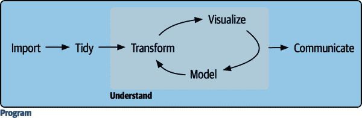

# 第五部分： 程序

在本书的这一部分，你将提高你的编程技能。编程是所有数据科学工作都需要的横向技能：你必须使用计算机来进行数据科学；你无法仅凭头脑或纸和笔来做到这一点。

###### 图 V-1. 编程是所有其他组件都依赖的基础。

编程产生代码，而代码是沟通的工具。显然，代码告诉计算机你想让它做什么。但它也向其他人类传达意义。考虑代码作为沟通工具是重要的，因为你做的每个项目本质上都是协作的。即使你不与其他人合作，你肯定会与未来的自己合作！编写清晰的代码很重要，这样其他人（比如未来的你）可以理解你为什么以这种方式进行分析。这意味着提高编程技能也包括提高沟通能力。随着时间的推移，你希望你的代码不仅更容易编写，而且更容易被他人阅读理解。

在接下来的三章中，你将学习提升编程技能的技巧：

+   复制粘贴是一个强大的工具，但是你应该避免超过两次。在代码中重复自己是危险的，因为这很容易导致错误和不一致性。相反，在第二十五章中，你将学习如何编写*函数*，它可以让你提取重复的 tidyverse 代码，从而可以轻松重用。

+   函数可以提取重复的代码，但是你经常需要在不同的输入上重复相同的操作。你需要*迭代*工具，它可以让你一遍又一遍地做类似的事情。这些工具包括 for 循环和函数式编程，你将在第二十六章中学习到。

+   随着你阅读其他人编写的代码越来越多，你会看到更多不使用 tidyverse 的代码。在第二十七章中，你将学习到一些在实践中最重要的基础 R 函数。

这些章节的目标是教会你进行数据科学所需的最低限度的编程技能。一旦你掌握了这里的材料，我们强烈建议你继续投资于你的编程技能。我们写了两本可能对你有帮助的书籍。[*Hands on Programming with R*](https://oreil.ly/LBFUN) 由 Garrett Grolemund（O’Reilly）编写，介绍 R 作为编程语言，如果 R 是你的第一门编程语言，这是一个很好的起点。[*Advanced R*](https://oreil.ly/I2wE0) 由 Hadley Wickham（CRC Press）编写，深入探讨 R 编程语言的细节；如果你有现有的编程经验，并且在这些章节中内化了相关思想后，这是一个很好的下一步。
