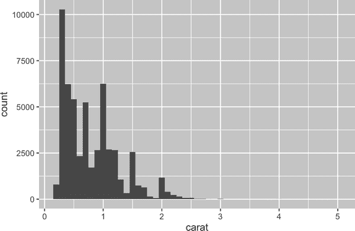
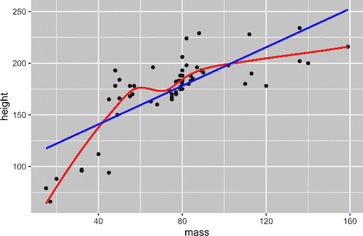
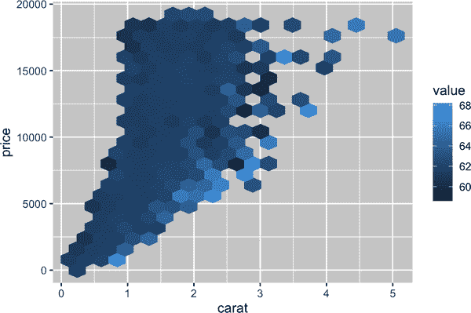
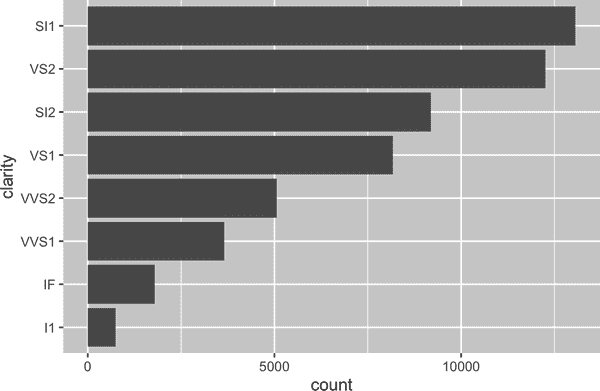
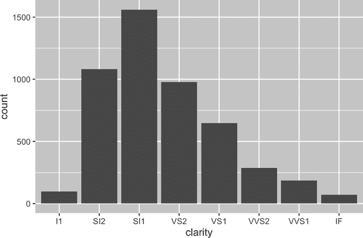
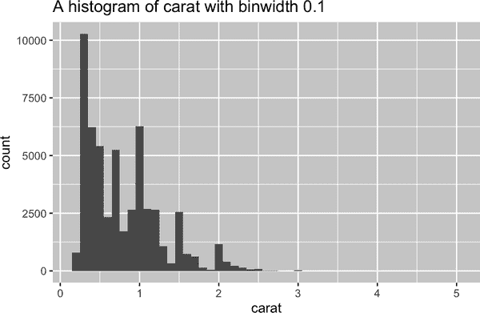

# 第二十五章：函数

# 介绍

提高作为数据科学家的影响力的最佳方式之一是编写函数。函数允许您以比复制粘贴更强大和通用的方式自动执行常见任务。编写函数比使用复制和粘贴具有三个重大优势：

+   您可以为函数指定一个富有表现力的名称，使您的代码更易于理解。

+   随着需求的变化，您只需要在一个地方更新代码，而不是在多个地方更新。

+   当您复制粘贴时，消除发生偶然错误的可能性（即在一个地方更新变量名称，但在另一个地方没有更新）。

+   它使得您可以从项目到项目中重复使用工作，随着时间的推移提高您的生产力。

一个很好的经验法则是每当您复制并粘贴一个代码块超过两次（即现在您有三个相同的代码副本），就考虑编写一个函数。在本章中，您将学习三种有用的函数类型：

+   向量函数以一个或多个向量作为输入，并返回一个向量作为输出。

+   数据框函数以数据框作为输入，并返回数据框作为输出。

+   绘图函数以数据框作为输入，并返回绘图作为输出。

每个部分都包含许多示例，以帮助您总结所见到的模式。这些示例没有 Twitter 的帮助就不可能存在，我们鼓励您跟随评论中的链接查看原始灵感。您可能还想阅读关于[通用函数](https://oreil.ly/Ymcmk)和[绘图函数](https://oreil.ly/mXy2q)的原始推文，以查看更多函数。

## 先决条件

我们将汇总来自 tidyverse 的各种函数。我们还将使用 nycflights13 作为熟悉数据源来使用我们的函数：

```
library(tidyverse)
library(nycflights13)
```

# 向量函数

我们将从向量函数开始：这些函数接受一个或多个向量，并返回一个向量结果。例如，看一下这段代码。它做什么？

```
df <- tibble(
  a = rnorm(5),
  b = rnorm(5),
  c = rnorm(5),
  d = rnorm(5),
)

df |> mutate(
  a = (a - min(a, na.rm = TRUE)) / 
    (max(a, na.rm = TRUE) - min(a, na.rm = TRUE)),
  b = (b - min(b, na.rm = TRUE)) / 
    (max(b, na.rm = TRUE) - min(a, na.rm = TRUE)),
  c = (c - min(c, na.rm = TRUE)) / 
    (max(c, na.rm = TRUE) - min(c, na.rm = TRUE)),
  d = (d - min(d, na.rm = TRUE)) / 
    (max(d, na.rm = TRUE) - min(d, na.rm = TRUE)),
)
#> # A tibble: 5 × 4
#>       a     b     c     d
#>   <dbl> <dbl> <dbl> <dbl>
#> 1 0.339  2.59 0.291 0 
#> 2 0.880  0    0.611 0.557
#> 3 0      1.37 1     0.752
#> 4 0.795  1.37 0     1 
#> 5 1      1.34 0.580 0.394
```

您可能能够猜出这会将每列重新调整为 0 到 1 的范围。但是您发现错误了吗？当 Hadley 编写这段代码时，他在复制粘贴时犯了一个错误，并忘记将 `a` 更改为 `b`。学习如何编写函数的一个很好的理由是防止这种类型的错误。

## 编写函数

要编写一个函数，您需要首先分析您重复的代码，以确定哪些部分是常量，哪些部分是变化的。如果我们将前面的代码提取到 [`mutate()`](https://dplyr.tidyverse.org/reference/mutate.xhtml) 外部，那么更容易看到模式，因为每次重复现在都是一行：

```
(a - min(a, na.rm = TRUE)) / (max(a, na.rm = TRUE) - min(a, na.rm = TRUE))
(b - min(b, na.rm = TRUE)) / (max(b, na.rm = TRUE) - min(b, na.rm = TRUE))
(c - min(c, na.rm = TRUE)) / (max(c, na.rm = TRUE) - min(c, na.rm = TRUE))
(d - min(d, na.rm = TRUE)) / (max(d, na.rm = TRUE) - min(d, na.rm = TRUE))  
```

为了使这更清晰一些，我们可以用 `█` 替换那部分变化的内容：

```
(█ - min(█, na.rm = TRUE)) / (max(█, na.rm = TRUE) - min(█, na.rm = TRUE))
```

要将其转换为函数，您需要三件事：

+   一个 *名称*。这里我们将使用 `rescale01`，因为这个函数将一个向量重新调整到 0 到 1 之间。

+   *参数*。参数是在调用之间变化的内容，我们的分析告诉我们只有一个。我们将其称为`x`，因为这是数字向量的传统名称。

+   *主体*。主体是在所有调用中重复的代码。

然后按照模板创建一个函数：

```
name <- function(arguments) {
  body
}
```

对于这种情况，结果是：

```
rescale01 <- function(x) {
  (x - min(x, na.rm = TRUE)) / (max(x, na.rm = TRUE) - min(x, na.rm = TRUE))
}
```

在此时，您可能会使用几个简单的输入进行测试，以确保正确捕获逻辑：

```
rescale01(c(-10, 0, 10))
#> [1] 0.0 0.5 1.0
rescale01(c(1, 2, 3, NA, 5))
#> [1] 0.00 0.25 0.50   NA 1.00
```

然后，您可以将对[`mutate()`](https://dplyr.tidyverse.org/reference/mutate.xhtml)的调用重写为：

```
df |> mutate(
  a = rescale01(a),
  b = rescale01(b),
  c = rescale01(c),
  d = rescale01(d),
)
#> # A tibble: 5 × 4
#>       a     b     c     d
#>   <dbl> <dbl> <dbl> <dbl>
#> 1 0.339 1     0.291 0 
#> 2 0.880 0     0.611 0.557
#> 3 0     0.530 1     0.752
#> 4 0.795 0.531 0     1 
#> 5 1     0.518 0.580 0.394
```

（在第二十六章中，您将学习如何使用[`across()`](https://dplyr.tidyverse.org/reference/across.xhtml)来进一步减少重复，因此您只需要`df |> mutate(across(a:d, rescale01))`。）

## 改进我们的函数

您可能会注意到`rescale01()`函数做了一些不必要的工作——与其两次计算[`min()`](https://rdrr.io/r/base/Extremes.xhtml)和一次计算[`max()`](https://rdrr.io/r/base/Extremes.xhtml)相比，我们可以使用[`range()`](https://rdrr.io/r/base/range.xhtml)一次计算最小值和最大值：

```
rescale01 <- function(x) {
  rng <- range(x, na.rm = TRUE)
  (x - rng[1]) / (rng[2] - rng[1])
}
```

或者您可能会尝试在包含无限值的向量上使用此函数：

```
x <- c(1:10, Inf)
rescale01(x)
#>  [1]   0   0   0   0   0   0   0   0   0   0 NaN
```

结果并不特别有用，所以我们可以要求[`range()`](https://rdrr.io/r/base/range.xhtml)忽略无限值：

```
rescale01 <- function(x) {
  rng <- range(x, na.rm = TRUE, finite = TRUE)
  (x - rng[1]) / (rng[2] - rng[1])
}

rescale01(x)
#>  [1] 0.0000000 0.1111111 0.2222222 0.3333333 0.4444444 0.5555556 0.6666667
#>  [8] 0.7777778 0.8888889 1.0000000       Inf
```

这些更改说明了函数的一个重要好处：因为我们将重复的代码移到函数中，所以我们只需要在一个地方进行更改。

## 变异函数

现在您理解了函数的基本概念，让我们看看一堆示例。我们将从“mutate”函数开始，即在[`mutate()`](https://dplyr.tidyverse.org/reference/mutate.xhtml)和[`filter()`](https://dplyr.tidyverse.org/reference/filter.xhtml)内部运行良好的函数，因为它们返回与输入长度相同的输出。

让我们从`rescale01()`的简单变化开始。也许您想计算 Z 分数，将向量重新缩放为均值为 0，标准差为 1：

```
z_score <- function(x) {
  (x - mean(x, na.rm = TRUE)) / sd(x, na.rm = TRUE)
}
```

或者您可能想包装一个直接的[`case_when()`](https://dplyr.tidyverse.org/reference/case_when.xhtml)并为其命名。例如，此`clamp()`函数确保向量的所有值位于最小值或最大值之间：

```
clamp <- function(x, min, max) {
  case_when(
    x < min ~ min,
    x > max ~ max,
    .default = x
  )
}

clamp(1:10, min = 3, max = 7)
#>  [1] 3 3 3 4 5 6 7 7 7 7
```

当然，函数不仅仅需要处理数值变量。您可能希望进行一些重复的字符串操作。也许您需要将第一个字符大写：

```
first_upper <- function(x) {
  str_sub(x, 1, 1) <- str_to_upper(str_sub(x, 1, 1))
  x
}

first_upper("hello")
#> [1] "Hello"
```

或者您可能希望从字符串中删除百分号、逗号和美元符号，然后将其转换为数字：

```
# https://twitter.com/NVlabormarket/status/1571939851922198530
clean_number <- function(x) {
  is_pct <- str_detect(x, "%")
  num <- x |> 
    str_remove_all("%") |> 
    str_remove_all(",") |> 
    str_remove_all(fixed("$")) |> 
    as.numeric(x)
  if_else(is_pct, num / 100, num)
}

clean_number("$12,300")
#> [1] 12300
clean_number("45%")
#> [1] 0.45
```

有时，您的函数可能会高度专门化，适用于一个数据分析步骤。例如，如果您有一堆变量，记录缺失值为 997、998 或 999，您可能希望编写一个函数来将它们替换为`NA`：

```
fix_na <- function(x) {
  if_else(x %in% c(997, 998, 999), NA, x)
}
```

我们关注的例子主要是针对单个向量的，因为我们认为这是最常见的情况。但你的函数也可以接受多个向量输入，没有任何理由不这样做。

## 汇总函数

另一个重要的向量函数族是汇总函数，即返回单个值以供在[`summarize()`](https://dplyr.tidyverse.org/reference/summarise.xhtml)中使用的函数。有时候这可能只是设置一个或两个默认参数的问题：

```
commas <- function(x) {
  str_flatten(x, collapse = ", ", last = " and ")
}

commas(c("cat", "dog", "pigeon"))
#> [1] "cat, dog and pigeon"
```

或者你可以包装一个简单的计算，比如变异系数，它将标准差除以均值：

```
cv <- function(x, na.rm = FALSE) {
  sd(x, na.rm = na.rm) / mean(x, na.rm = na.rm)
}

cv(runif(100, min = 0, max = 50))
#> [1] 0.5196276
cv(runif(100, min = 0, max = 500))
#> [1] 0.5652554
```

或者也许你只是想通过给它起一个容易记住的名字来使一个常见模式更容易记住：

```
# https://twitter.com/gbganalyst/status/1571619641390252033
n_missing <- function(x) {
  sum(is.na(x))
} 
```

你也可以编写接受多个向量输入的函数。例如，也许你想计算平均绝对预测误差，以帮助你将模型预测与实际值进行比较：

```
# https://twitter.com/neilgcurrie/status/1571607727255834625
mape <- function(actual, predicted) {
  sum(abs((actual - predicted) / actual)) / length(actual)
}
```

# RStudio

一旦你开始编写函数，有两个非常有用的 RStudio 快捷键：

+   要查找你编写的函数的定义，请将光标放在函数名称上，然后按 F2。

+   要快速跳转到一个函数，按 Ctrl+.来打开模糊文件和函数查找器，并输入函数名称的前几个字母。你也可以导航到文件、Quarto 章节等，使其成为一个便捷的导航工具。

## 练习

1.  练习将以下代码片段转换为函数。考虑每个函数的作用是什么。你会如何命名它？它需要多少个参数？

    ```
    mean(is.na(x))
    mean(is.na(y))
    mean(is.na(z))

    x / sum(x, na.rm = TRUE)
    y / sum(y, na.rm = TRUE)
    z / sum(z, na.rm = TRUE)

    round(x / sum(x, na.rm = TRUE) * 100, 1)
    round(y / sum(y, na.rm = TRUE) * 100, 1)
    round(z / sum(z, na.rm = TRUE) * 100, 1)
    ```

1.  在`rescale01()`的第二个变体中，无穷大的值保持不变。你能否重写`rescale01()`，使得`-Inf`映射为 0，而`Inf`映射为 1？

1.  给定一个生日向量，编写一个函数来计算年龄（以年为单位）。

1.  编写你自己的函数来计算数值向量的方差和偏度。你可以在维基百科或其他地方查找定义。

1.  编写`both_na()`，一个汇总函数，接受两个长度相同的向量，并返回两个向量中都有`NA`的位置数。

1.  阅读文档以弄清楚以下函数的作用。尽管它们很短，但它们为什么很有用？

    ```
    is_directory <- function(x) {
      file.info(x)$isdir
    }
    is_readable <- function(x) {
      file.access(x, 4) == 0
    }
    ```

# 数据框函数

向量函数对于从 dplyr 动词中重复的代码很有用。但通常你也会重复使用动词本身，特别是在大型流水线中。当你注意到自己多次复制粘贴多个动词时，你可以考虑编写一个数据框函数。数据框函数类似于 dplyr 动词：它们将数据框作为第一个参数，并接受一些额外的参数来指定要对其执行什么操作，并返回一个数据框或向量。

为了让你编写一个使用 dplyr 动词的函数，我们将首先向你介绍间接引用的挑战，以及如何通过引入`{{ }}`来克服它。然后，我们将展示一些例子来说明你可以如何使用它。

## 间接引用和整洁评估

当你开始编写使用 dplyr 动词的函数时，你会迅速遇到间接性的问题。让我们通过一个简单的函数 `grouped_mean()` 来说明这个问题。这个函数的目标是按 `group_var` 分组计算 `mean_var` 的平均值：

```
grouped_mean <- function(df, group_var, mean_var) {
  df |> 
    group_by(group_var) |> 
    summarize(mean(mean_var))
}
```

如果我们尝试使用它，会出现错误：

```
diamonds |> grouped_mean(cut, carat)
#> Error in `group_by()`:
#> ! Must group by variables found in `.data`.
#> ✖ Column `group_var` is not found.
```

为了更清楚地说明问题，我们可以使用一个虚构的数据框：

```
df <- tibble(
  mean_var = 1,
  group_var = "g",
  group = 1,
  x = 10,
  y = 100
)

df |> grouped_mean(group, x)
#> # A tibble: 1 × 2
#>   group_var `mean(mean_var)`
#>   <chr>                <dbl>
#> 1 g                        1
df |> grouped_mean(group, y)
#> # A tibble: 1 × 2
#>   group_var `mean(mean_var)`
#>   <chr>                <dbl>
#> 1 g                        1
```

无论我们如何调用 `grouped_mean()`，它总是执行 `df |> group_by(group_var) |> summarize(mean(mean_var))`，而不是 `df |> group_by(group) |> summarize(mean(x))` 或 `df |> group_by(group) |> summarize(mean(y))`。这是一个间接性的问题，它是因为 dplyr 使用 *tidy evaluation* 允许你在不特殊处理的情况下引用数据框内变量的名称。

Tidy evaluation 在大多数情况下非常棒，因为它使得你的数据分析非常简洁，你不需要指明变量来自哪个数据框；从上下文中显而易见。然而，tidy evaluation 的缺点在于当我们想将重复使用的 tidyverse 代码封装成函数时会显现出来。在这种情况下，我们需要一些方法来告诉 `group_mean()` 和 [`summarize()`](https://dplyr.tidyverse.org/reference/summarise.xhtml) 不要把 `group_var` 和 `mean_var` 当作变量名，而是要查找我们实际想要使用的变量。

Tidy evaluation 包含了一个称为 *embracing* 的解决方案来解决这个问题。Embrace 一个变量意味着用大括号包裹它，因此，例如 `var` 变成 `{{ var }}`。Embrace 一个变量告诉 dplyr 使用参数内存储的值，而不是将参数作为字面变量名。记住正在发生的事情的一种方法是把 `{{ }}` 想象成看下一个隧道 — `{{ var }}` 会使得 dplyr 函数查找 `var` 内部的值，而不是查找一个名为 `var` 的变量。

因此，为了使 `grouped_mean()` 起作用，我们需要用 `{{ }}` 包裹 `group_var` 和 `mean_var`：

```
grouped_mean <- function(df, group_var, mean_var) {
  df |> 
    group_by({{ group_var }}) |> 
    summarize(mean({{ mean_var }}))
}

df |> grouped_mean(group, x)
#> # A tibble: 1 × 2
#>   group `mean(x)`
#>   <dbl>     <dbl>
#> 1     1        10
```

成功！

## 何时接受？

编写数据框函数的关键挑战是确定哪些参数需要被 embrace。幸运的是，这很容易，因为你可以在文档中查找。文档中有两个术语对应两种最常见的 tidy evaluation 子类型的解决方案：

数据屏蔽

这用于诸如 [`arrange()`](https://dplyr.tidyverse.org/reference/arrange.xhtml)、[`filter()`](https://dplyr.tidyverse.org/reference/filter.xhtml) 和 [`summarize()`](https://dplyr.tidyverse.org/reference/summarise.xhtml) 这样计算变量的函数中。

Tidy selection

这用于诸如 [`select()`](https://dplyr.tidyverse.org/reference/select.xhtml)、[`relocate()`](https://dplyr.tidyverse.org/reference/relocate.xhtml) 和 [`rename()`](https://dplyr.tidyverse.org/reference/rename.xhtml) 这样选择变量的函数中。

对于许多常见的函数，你关于哪些参数使用 tidy evaluation 的直觉应该是正确的 — 只需考虑你是否可以计算（例如 `x + 1`）或选择（例如 `a:x`）。

在接下来的几节中，我们将探讨一旦理解拥抱，您可能编写的便捷函数类型。

## 常见用例

如果在进行初始数据探索时经常执行相同的摘要集合，您可以考虑将它们包装在辅助函数中：

```
summary6 <- function(data, var) {
  data |> summarize(
    min = min({{ var }}, na.rm = TRUE),
    mean = mean({{ var }}, na.rm = TRUE),
    median = median({{ var }}, na.rm = TRUE),
    max = max({{ var }}, na.rm = TRUE),
    n = n(),
    n_miss = sum(is.na({{ var }})),
    .groups = "drop"
  )
}

diamonds |> summary6(carat)
#> # A tibble: 1 × 6
#>     min  mean median   max     n n_miss
#>   <dbl> <dbl>  <dbl> <dbl> <int>  <int>
#> 1   0.2 0.798    0.7  5.01 53940      0
```

（每当您在辅助函数中包装[`summarize()`](https://dplyr.tidyverse.org/reference/summarise.xhtml)时，我们认为将`.groups = "drop"`设置为良好的实践，以避免消息并使数据保持未分组状态。）

此函数的好处在于，因为它包装了[`summarize()`](https://dplyr.tidyverse.org/reference/summarise.xhtml)，所以您可以在分组数据上使用它：

```
diamonds |> 
  group_by(cut) |> 
  summary6(carat)
#> # A tibble: 5 × 7
#>   cut         min  mean median   max     n n_miss
#>   <ord>     <dbl> <dbl>  <dbl> <dbl> <int>  <int>
#> 1 Fair       0.22 1.05    1     5.01  1610      0
#> 2 Good       0.23 0.849   0.82  3.01  4906      0
#> 3 Very Good  0.2  0.806   0.71  4    12082      0
#> 4 Premium    0.2  0.892   0.86  4.01 13791      0
#> 5 Ideal      0.2  0.703   0.54  3.5  21551      0
```

此外，由于总结的参数是数据屏蔽，因此`summary6()`函数的`var`参数也是数据屏蔽。这意味着您还可以总结计算变量：

```
diamonds |> 
  group_by(cut) |> 
  summary6(log10(carat))
#> # A tibble: 5 × 7
#>   cut          min    mean  median   max     n n_miss
#>   <ord>      <dbl>   <dbl>   <dbl> <dbl> <int>  <int>
#> 1 Fair      -0.658 -0.0273  0      0.700  1610      0
#> 2 Good      -0.638 -0.133  -0.0862 0.479  4906      0
#> 3 Very Good -0.699 -0.164  -0.149  0.602 12082      0
#> 4 Premium   -0.699 -0.125  -0.0655 0.603 13791      0
#> 5 Ideal     -0.699 -0.225  -0.268  0.544 21551      0
```

要总结多个变量，您需要等到“修改多列”部分，那里您将学习如何使用[`across()`](https://dplyr.tidyverse.org/reference/across.xhtml)。

另一个流行的[`summarize()`](https://dplyr.tidyverse.org/reference/summarise.xhtml)辅助函数是[`count()`](https://dplyr.tidyverse.org/reference/count.xhtml)的一个版本，还计算比例：

```
# https://twitter.com/Diabb6/status/1571635146658402309
count_prop <- function(df, var, sort = FALSE) {
  df |>
    count({{ var }}, sort = sort) |>
    mutate(prop = n / sum(n))
}

diamonds |> count_prop(clarity)
#> # A tibble: 8 × 3
#>   clarity     n   prop
#>   <ord>   <int>  <dbl>
#> 1 I1        741 0.0137
#> 2 SI2      9194 0.170 
#> 3 SI1     13065 0.242 
#> 4 VS2     12258 0.227 
#> 5 VS1      8171 0.151 
#> 6 VVS2     5066 0.0939
#> # … with 2 more rows
```

此函数有三个参数：`df`、`var`和`sort`。只需拥抱`var`，因为它传递给[`count()`](https://dplyr.tidyverse.org/reference/count.xhtml)，该函数对所有变量使用数据屏蔽。请注意，我们对`sort`使用默认值，因此如果用户未提供自己的值，它将默认为`FALSE`。

或者，您可能希望查找变量的排序唯一值，用于数据子集。而不是提供一个变量和一个值来进行过滤，我们允许用户提供一个条件：

```
unique_where <- function(df, condition, var) {
  df |> 
    filter({{ condition }}) |> 
    distinct({{ var }}) |> 
    arrange({{ var }})
}

# Find all the destinations in December
flights |> unique_where(month == 12, dest)
#> # A tibble: 96 × 1
#>   dest 
#>   <chr>
#> 1 ABQ 
#> 2 ALB 
#> 3 ATL 
#> 4 AUS 
#> 5 AVL 
#> 6 BDL 
#> # … with 90 more rows
```

在这里，我们拥抱`condition`，因为它传递给[`filter()`](https://dplyr.tidyverse.org/reference/filter.xhtml)，并且拥抱`var`，因为它传递给[`distinct()`](https://dplyr.tidyverse.org/reference/distinct.xhtml)和[`arrange()`](https://dplyr.tidyverse.org/reference/arrange.xhtml)。

我们已经做了所有这些示例，将数据框作为第一个参数，但是如果您反复使用相同的数据，硬编码它可能是有意义的。例如，以下函数始终使用`flights`数据集，并且始终选择`time_hour`、`carrier`和`flight`，因为它们形成复合主键，使您能够识别行：

```
subset_flights <- function(rows, cols) {
  flights |> 
    filter({{ rows }}) |> 
    select(time_hour, carrier, flight, {{ cols }})
}
```

## 数据屏蔽与整洁选择

有时您希望在使用数据屏蔽的函数中选择变量。例如，想象一下，您希望编写一个`count_missing()`方法，用于计算行中缺失观测的数量。您可以尝试编写如下内容：

```
count_missing <- function(df, group_vars, x_var) {
  df |> 
    group_by({{ group_vars }}) |> 
    summarize(
      n_miss = sum(is.na({{ x_var }})),
      .groups = "drop"
    )
}

flights |> 
  count_missing(c(year, month, day), dep_time)
#> Error in `group_by()`:
#> ℹ In argument: `c(year, month, day)`.
#> Caused by error:
#> ! `c(year, month, day)` must be size 336776 or 1, not 1010328.
```

这不起作用，因为[`group_by()`](https://dplyr.tidyverse.org/reference/group_by.xhtml) 使用的是数据屏蔽，而不是整洁选择。我们可以通过使用方便的[`pick()`](https://dplyr.tidyverse.org/reference/pick.xhtml) 函数来解决这个问题，该函数允许您在数据屏蔽函数内部使用整洁选择：

```
count_missing <- function(df, group_vars, x_var) {
  df |> 
    group_by(pick({{ group_vars }})) |> 
    summarize(
      n_miss = sum(is.na({{ x_var }})),
      .groups = "drop"
  )
}

flights |> 
  count_missing(c(year, month, day), dep_time)
#> # A tibble: 365 × 4
#>    year month   day n_miss
#>   <int> <int> <int>  <int>
#> 1  2013     1     1      4
#> 2  2013     1     2      8
#> 3  2013     1     3     10
#> 4  2013     1     4      6
#> 5  2013     1     5      3
#> 6  2013     1     6      1
#> # … with 359 more rows
```

另一个方便的使用[`pick()`](https://dplyr.tidyverse.org/reference/pick.xhtml) 的方法是制作一个计数的二维表格。在这里，我们使用 `rows` 和 `columns` 中的所有变量进行计数，然后使用[`pivot_wider()`](https://tidyr.tidyverse.org/reference/pivot_wider.xhtml) 将计数重新排列为网格：

```
# https://twitter.com/pollicipes/status/1571606508944719876
count_wide <- function(data, rows, cols) {
  data |> 
    count(pick(c({{ rows }}, {{ cols }}))) |> 
    pivot_wider(
      names_from = {{ cols }}, 
      values_from = n,
      names_sort = TRUE,
      values_fill = 0
    )
}

diamonds |> count_wide(c(clarity, color), cut)
#> # A tibble: 56 × 7
#>   clarity color  Fair  Good `Very Good` Premium Ideal
#>   <ord>   <ord> <int> <int>       <int>   <int> <int>
#> 1 I1      D         4     8           5      12    13
#> 2 I1      E         9    23          22      30    18
#> 3 I1      F        35    19          13      34    42
#> 4 I1      G        53    19          16      46    16
#> 5 I1      H        52    14          12      46    38
#> 6 I1      I        34     9           8      24    17
#> # … with 50 more rows
```

虽然我们的例子主要集中在 dplyr 上，整洁评估也支持 tidyr，如果您查看[`pivot_wider()`](https://tidyr.tidyverse.org/reference/pivot_wider.xhtml) 文档，您会发现 `names_from` 使用整洁选择。

## 练习

1.  使用来自 nycflights13 的数据集，编写一个函数，该函数能够：

    1.  找到所有被取消（即`is.na(arr_time)`）或延误超过一小时的航班：

        ```
        flights |> filter_severe()
        ```

    1.  计算取消航班的数量和延误超过一小时的航班数量：

        ```
        flights |> group_by(dest) |> summarize_severe()
        ```

    1.  找到所有因用户提供的超过一定小时数而取消或延误的航班：

        ```
        flights |> filter_severe(hours = 2)
        ```

    1.  总结天气情况，计算用户提供变量的最小值、平均值和最大值：

        ```
        weather |> summarize_weather(temp)
        ```

    1.  将使用时钟时间的用户提供的变量（例如`dep_time`，`arr_time`等）转换为十进制时间（即小时 + [分钟 / 60]）：

        ```
        weather |> standardize_time(sched_dep_time)
        ```

1.  对于以下每个函数，请列出所有使用整洁评估的参数，并描述它们是否使用数据屏蔽或整洁选择：[`distinct()`](https://dplyr.tidyverse.org/reference/distinct.xhtml)，[`count()`](https://dplyr.tidyverse.org/reference/count.xhtml)，[`group_by()`](https://dplyr.tidyverse.org/reference/group_by.xhtml)，[`rename_with()`](https://dplyr.tidyverse.org/reference/rename.xhtml)，[`slice_min()`](https://dplyr.tidyverse.org/reference/slice.xhtml)，[`slice_sample()`](https://dplyr.tidyverse.org/reference/slice.xhtml)。

1.  泛化以下函数，以便您可以提供任意数量的变量来计数：

    ```
    count_prop <- function(df, var, sort = FALSE) {
      df |>
        count({{ var }}, sort = sort) |>
        mutate(prop = n / sum(n))
    }
    ```

# 绘图函数

您可能不想返回数据框，而是希望返回一个图。幸运的是，您可以使用 ggplot2 的相同技术，因为[`aes()`](https://ggplot2.tidyverse.org/reference/aes.xhtml) 是一个数据屏蔽函数。例如，想象一下你正在制作许多直方图：

```
diamonds |> 
  ggplot(aes(x = carat)) +
  geom_histogram(binwidth = 0.1)

diamonds |> 
  ggplot(aes(x = carat)) +
  geom_histogram(binwidth = 0.05)
```

如果您可以将这些内容封装到直方图函数中会很好吗？一旦您知道[`aes()`](https://ggplot2.tidyverse.org/reference/aes.xhtml) 是一个数据屏蔽函数，并且您需要接受：

```
histogram <- function(df, var, binwidth = NULL) {
  df |> 
    ggplot(aes(x = {{ var }})) + 
    geom_histogram(binwidth = binwidth)
}

diamonds |> histogram(carat, 0.1)
```



请注意，`histogram()` 返回一个 ggplot2 绘图，这意味着您仍然可以添加组件（如果需要的话）。只需记住从 `|>` 切换到 `+`：

```
diamonds |> 
  histogram(carat, 0.1) +
  labs(x = "Size (in carats)", y = "Number of diamonds")
```

## 更多变量

将更多变量简单地添加到混合中也很简单。例如，也许您想要通过叠加平滑线和直线来轻松地检视数据集是否线性：

```
# https://twitter.com/tyler_js_smith/status/1574377116988104704
linearity_check <- function(df, x, y) {
  df |>
    ggplot(aes(x = {{ x }}, y = {{ y }})) +
    geom_point() +
    geom_smooth(method = "loess", formula = y ~ x, color = "red", se = FALSE) +
    geom_smooth(method = "lm", formula = y ~ x, color = "blue", se = FALSE) 
}

starwars |> 
  filter(mass < 1000) |> 
  linearity_check(mass, height)
```



或者您可能希望针对非常大的数据集，其中超过绘图是一个问题，寻找彩色散点图的替代方案：

```
# https://twitter.com/ppaxisa/status/1574398423175921665
hex_plot <- function(df, x, y, z, bins = 20, fun = "mean") {
  df |> 
    ggplot(aes(x = {{ x }}, y = {{ y }}, z = {{ z }})) + 
    stat_summary_hex(
      aes(color = after_scale(fill)), # make border same color as fill
      bins = bins, 
      fun = fun,
    )
}

diamonds |> hex_plot(carat, price, depth)
```



## 与其他 Tidyverse 包结合使用

一些最有用的辅助工具将少量数据操作与 ggplot2 结合起来。例如，您可能希望做一个垂直条形图，其中使用 [`fct_infreq()`](https://forcats.tidyverse.org/reference/fct_inorder.xhtml) 自动按频率排序条形。由于条形图是垂直的，我们还需要反转通常的顺序以便将最高值放在顶部：

```
sorted_bars <- function(df, var) {
  df |> 
    mutate({{ var }} := fct_rev(fct_infreq({{ var }})))  |>
    ggplot(aes(y = {{ var }})) +
    geom_bar()
}

diamonds |> sorted_bars(clarity)
```



我们必须在这里使用一个新的运算符，`:=`，因为我们根据用户提供的数据生成变量名。变量名位于 `=` 的左边，但是 R 的语法除了单个字面名称之外，不允许在 `=` 的左边放置任何东西。为了解决这个问题，我们使用特殊的运算符 `:=`，tidy evaluation 将其视为与 `=` 相同的方式处理。

或者你可能想要为数据的子集轻松绘制条形图：

```
conditional_bars <- function(df, condition, var) {
  df |> 
    filter({{ condition }}) |> 
    ggplot(aes(x = {{ var }})) + 
    geom_bar()
}

diamonds |> conditional_bars(cut == "Good", clarity)
```



您还可以发挥创意，并以其他方式显示数据汇总信息。您可以在 [*https://oreil.ly/MV4kQ*](https://oreil.ly/MV4kQ) 找到一个很酷的应用程序；它使用轴标签显示最高值。随着您对 ggplot2 的了解增加，您的函数的功能也将不断增强。

我们将以一个更复杂的情况结束：为创建的图表标记。

## 标签

还记得我们之前展示给你的直方图函数吗？

```
histogram <- function(df, var, binwidth = NULL) {
  df |> 
    ggplot(aes(x = {{ var }})) + 
    geom_histogram(binwidth = binwidth)
}
```

如果我们能够用变量和使用的 bin 宽度标记输出就太好了？为了做到这一点，我们需要深入了解 tidy evaluation 并使用 tidyverse 中尚未讨论的包中的函数：rlang。rlang 是一个低级别的包，因为它实现了 tidy evaluation（以及许多其他有用的工具），所以几乎每个 tidyverse 中的其他包都在使用它。

要解决标签问题，我们可以使用[`rlang::englue()`](https://rlang.r-lib.org/reference/englue.xhtml)。它的工作方式类似于[`str_glue()`](https://stringr.tidyverse.org/reference/str_glue.xhtml)，因此任何包含在[`{ }`](https://rdrr.io/r/base/Paren.xhtml)中的值都将插入到字符串中。但它还理解`{{ }}`，它会自动插入适当的变量名：

```
histogram <- function(df, var, binwidth) {
  label <- rlang::englue("A histogram of {{var}} with binwidth {binwidth}")

  df |> 
    ggplot(aes(x = {{ var }})) + 
    geom_histogram(binwidth = binwidth) + 
    labs(title = label)
}

diamonds |> histogram(carat, 0.1)
```



您可以在希望在 ggplot2 绘图中提供字符串的任何其他地方使用相同的方法。

## 练习

通过逐步实现以下每个步骤来构建丰富的绘图函数：

1.  给定数据集和`x`和`y`变量，绘制散点图。

1.  添加最佳拟合线（即无标准误的线性模型）。

1.  添加标题。

# 样式

R 不关心您的函数或参数叫什么，但是对于人类来说，名称对于理解很重要。理想情况下，函数的名称应该简短而清楚地描述函数的作用。这很难！但是清晰比简短更重要，因为 RStudio 的自动完成使得输入长名称变得容易。

一般来说，函数名应该是动词，参数应该是名词。有些例外情况：如果函数计算一个众所周知的名词，则[`mean()`](https://rdrr.io/r/base/mean.xhtml)比`compute_mean()`更好，或者访问对象的某些属性（即[`coef()`](https://rdrr.io/r/stats/coef.xhtml)比`get_coefficients()`更好）。请自行判断，如果后来发现更好的名称，不要害怕重命名函数。

```
# Too short
f()

# Not a verb, or descriptive
my_awesome_function()

# Long, but clear
impute_missing()
collapse_years()
```

R 对函数中的空白使用方式并不关心，但是未来的读者会关心。继续遵循来自第四章的规则。此外，`function()` 应始终后跟大括号（[`{}`](https://rdrr.io/r/base/Paren.xhtml)），内容应缩进两个额外的空格。这样可以通过浏览左边缘更容易地看到代码的层次结构。

```
# Missing extra two spaces
density <- function(color, facets, binwidth = 0.1) {
diamonds |> 
  ggplot(aes(x = carat, y = after_stat(density), color = {{ color }})) +
  geom_freqpoly(binwidth = binwidth) +
  facet_wrap(vars({{ facets }}))
}

# Pipe indented incorrectly
density <- function(color, facets, binwidth = 0.1) {
  diamonds |> 
  ggplot(aes(x = carat, y = after_stat(density), color = {{ color }})) +
  geom_freqpoly(binwidth = binwidth) +
  facet_wrap(vars({{ facets }}))
}
```

正如您所见，我们建议在`{{ }}`内部放置额外的空格。这样很明显，表示发生了一些不同寻常的事情。

## 练习

1.  阅读以下两个函数的源代码，弄清它们的作用，然后为它们想出更好的名称：

    ```
    f1 <- function(string, prefix) {
      str_sub(string, 1, str_length(prefix)) == prefix
    }

    f3 <- function(x, y) {
      rep(y, length.out = length(x))
    }
    ```

1.  取一个你最近编写的函数，并花五分钟为它及其参数想一个更好的名称。

1.  为什么`norm_r()`、`norm_d()`等比[`rnorm()`](https://rdrr.io/r/stats/Normal.xhtml)和[`dnorm()`](https://rdrr.io/r/stats/Normal.xhtml)更好？为相反的情况辩护。如何使名称更清晰？

# 摘要

在本章中，您学习了如何为三种有用的情景编写函数：创建向量、创建数据框或创建图表。在此过程中，您看到了许多例子，这些例子理想情况下应该激发您的创造力，并为您的分析代码提供了一些想法。

我们只向您展示了开始使用函数的最基本内容，还有很多东西等待学习。要了解更多信息，请参考以下几个地方：

+   要了解有关使用整洁评估进行编程的更多信息，请参阅 [使用 dplyr 进行编程](https://oreil.ly/8xygI) 和 [使用 tidyr 进行编程](https://oreil.ly/QGH9n)，并了解有关理论的更多信息请参阅 [“数据蒙版是什么以及为什么我需要{{?“](https://oreil.ly/eecUd)。

+   要了解如何减少 ggplot2 代码中的重复内容，请阅读 ggplot2 书籍的 [“使用 ggplot2 编程” 章节](https://oreil.ly/Vvt6k)。

+   欲了解更多有关函数风格的建议，请查看 [tidyverse 风格指南](https://oreil.ly/rLKSn)。

在接下来的章节中，我们将深入探讨迭代，为您提供进一步减少代码重复的工具。
