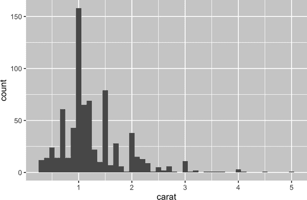

# 第二十六章：迭代

# 简介

在本章中，您将学习迭代工具，重复对不同对象执行相同操作。在 R 中，迭代通常看起来与其他编程语言大不相同，因为其中很多都是隐含的并且我们可以免费获取。例如，如果您想在 R 中将数值向量 `x` 加倍，您只需写 `2 * x`。而在大多数其他语言中，您需要使用某种循环显式地将 `x` 的每个元素加倍。

本书已经为您提供了一些小而强大的工具，用于对多个“事物”执行相同操作：

+   [`facet_wrap()`](https://ggplot2.tidyverse.org/reference/facet_wrap.xhtml) 和 [`facet_grid()`](https://ggplot2.tidyverse.org/reference/facet_grid.xhtml) 分别为每个子集绘制图表。

+   [`group_by()`](https://dplyr.tidyverse.org/reference/group_by.xhtml) 加上 [`summarize()`](https://dplyr.tidyverse.org/reference/summarise.xhtml) 为每个子集计算汇总统计信息。

+   [`unnest_wider()`](https://tidyr.tidyverse.org/reference/unnest_wider.xhtml) 和 [`unnest_longer()`](https://tidyr.tidyverse.org/reference/unnest_longer.xhtml) 分别为列表列的每个元素创建新的行和列。

现在是时候学习一些更通用的工具了，通常称为*函数式编程*工具，因为它们围绕接受其他函数作为输入的函数构建。学习函数式编程很容易偏向抽象，但在本章中，我们将通过专注于三个常见任务来保持具体性：修改多个列、读取多个文件和保存多个对象。

## 先决条件

在本章中，我们将专注于 tidyverse 的核心成员 dplyr 和 purrr 提供的工具。您之前见过 dplyr，但是[purrr](https://oreil.ly/f0HWP)是新的。在本章中，我们只会使用 purrr 的一些函数，但随着您提高编程技能，它是一个探索的好工具包：

```
library(tidyverse)
```

# 修改多个列

假设您有一个简单的 tibble，并且您想计算每列的观察数量并计算中位数：

```
df <- tibble(
  a = rnorm(10),
  b = rnorm(10),
  c = rnorm(10),
  d = rnorm(10)
)
```

你可以通过复制粘贴来完成：

```
df |> summarize(
  n = n(),
  a = median(a),
  b = median(b),
  c = median(c),
  d = median(d),
)
#> # A tibble: 1 × 5
#>       n      a      b       c     d
#>   <int>  <dbl>  <dbl>   <dbl> <dbl>
#> 1    10 -0.246 -0.287 -0.0567 0.144
```

这违反了我们的经验法则，即不要复制粘贴超过两次，您可以想象，如果您有数十甚至数百列，这将变得很乏味。相反，您可以使用 [`across()`](https://dplyr.tidyverse.org/reference/across.xhtml)：

```
df |> summarize(
  n = n(),
  across(a:d, median),
)
#> # A tibble: 1 × 5
#>       n      a      b       c     d
#>   <int>  <dbl>  <dbl>   <dbl> <dbl>
#> 1    10 -0.246 -0.287 -0.0567 0.144
```

[`across()`](https://dplyr.tidyverse.org/reference/across.xhtml) 有三个特别重要的参数，我们将在以下部分详细讨论。每次使用 [`across()`](https://dplyr.tidyverse.org/reference/across.xhtml) 时，您都会使用前两个参数：第一个参数 `.cols` 指定要迭代的列，第二个参数 `.fns` 指定要对每列执行的操作。当您在 [`mutate()`](https://dplyr.tidyverse.org/reference/mutate.xhtml) 中使用 [`across()`](https://dplyr.tidyverse.org/reference/across.xhtml) 时，使用 `.names` 参数能够对输出列的名称进行额外控制，这尤其重要。我们还将讨论两个重要的变体，[`if_any()`](https://dplyr.tidyverse.org/reference/across.xhtml) 和 [`if_all()`](https://dplyr.tidyverse.org/reference/across.xhtml)，它们与 [`filter()`](https://dplyr.tidyverse.org/reference/filter.xhtml) 一起使用。

## 使用 `.cols` 选择列

[`across()`](https://dplyr.tidyverse.org/reference/across.xhtml) 的第一个参数 `.cols` 选择要转换的列。这使用与 [`select()`](https://dplyr.tidyverse.org/reference/select.xhtml) 相同的规范，所以您可以使用诸如 [`starts_with()`](https://tidyselect.r-lib.org/reference/starts_with.xhtml) 和 [`ends_with()`](https://tidyselect.r-lib.org/reference/starts_with.xhtml) 的函数根据列名选择列。

有两种额外的选择技术特别适用于[`across()`](https://dplyr.tidyverse.org/reference/across.xhtml)：[`everything()`](https://tidyselect.r-lib.org/reference/everything.xhtml) 和 [`where()`](https://tidyselect.r-lib.org/reference/where.xhtml)。[`everything()`](https://tidyselect.r-lib.org/reference/everything.xhtml) 很简单：它选择每个（非分组）列：

```
df <- tibble(
  grp = sample(2, 10, replace = TRUE),
  a = rnorm(10),
  b = rnorm(10),
  c = rnorm(10),
  d = rnorm(10)
)

df |> 
  group_by(grp) |> 
  summarize(across(everything(), median))
#> # A tibble: 2 × 5
#>     grp       a       b     c     d
#>   <int>   <dbl>   <dbl> <dbl> <dbl>
#> 1     1 -0.0935 -0.0163 0.363 0.364
#> 2     2  0.312  -0.0576 0.208 0.565
```

注意分组列（此处为 `grp`）不包括在 [`across()`](https://dplyr.tidyverse.org/reference/across.xhtml) 中，因为它们会被 [`summarize()`](https://dplyr.tidyverse.org/reference/summarise.xhtml) 自动保留。

[`where()`](https://tidyselect.r-lib.org/reference/where.xhtml) 允许您根据列的类型进行选择：

`where(is.numeric)`

选择所有数值列。

`where(is.character)`

选择所有字符串列。

`where(is.Date)`

选择所有日期列。

`where(is.POSIXct)`

选择所有日期时间列。

`where(is.logical)`

选择所有逻辑列。

就像其他选择器一样，您可以将它们与布尔代数结合使用。例如，`!where(is.numeric)` 选择所有非数值列，而 `starts_with("a") & where(is.logical)` 选择所有名称以“a”开头的逻辑列。

## 调用单个函数

[`across()`](https://dplyr.tidyverse.org/reference/across.xhtml) 的第二个参数定义了每一列将如何转换。在简单的情况下，如上所示，这将是一个单一的现有函数。这是 R 的一个非常特殊的功能：我们将一个函数（`median`，`mean`，`str_flatten`，…）传递给另一个函数（`across`）。

需要注意的是，我们将这个函数传递给[`across()`](https://dplyr.tidyverse.org/reference/across.xhtml)，所以[`across()`](https://dplyr.tidyverse.org/reference/across.xhtml) 可以调用它；我们不是自己调用它。这意味着函数名后面不应跟着`()`。如果忘记了，会收到一个错误：

```
df |> 
  group_by(grp) |> 
  summarize(across(everything(), median()))
#> Error in `summarize()`:
#> ℹ In argument: `across(everything(), median())`.
#> Caused by error in `is.factor()`:
#> ! argument "x" is missing, with no default
```

这个错误的原因是您在没有输入的情况下调用了函数，例如：

```
median()
#> Error in is.factor(x): argument "x" is missing, with no default
```

## 调用多个函数

在更复杂的情况下，您可能需要提供额外的参数或执行多个转换。让我们用一个简单的例子来激发这个问题：如果我们的数据中有一些缺失值会发生什么？[`median()`](https://rdrr.io/r/stats/median.xhtml) 会传播这些缺失值，给我们一个次优的输出：

```
rnorm_na <- function(n, n_na, mean = 0, sd = 1) {
  sample(c(rnorm(n - n_na, mean = mean, sd = sd), rep(NA, n_na)))
}

df_miss <- tibble(
  a = rnorm_na(5, 1),
  b = rnorm_na(5, 1),
  c = rnorm_na(5, 2),
  d = rnorm(5)
)
df_miss |> 
  summarize(
    across(a:d, median),
    n = n()
  )
#> # A tibble: 1 × 5
#>       a     b     c     d     n
#>   <dbl> <dbl> <dbl> <dbl> <int>
#> 1    NA    NA    NA  1.15     5
```

如果我们能够将`na.rm = TRUE`传递给[`median()`](https://rdrr.io/r/stats/median.xhtml)来删除这些缺失值就好了。为了做到这一点，我们需要创建一个新的函数，该函数使用所需的参数调用[`median()`](https://rdrr.io/r/stats/median.xhtml)而不是直接调用它：

```
df_miss |> 
  summarize(
    across(a:d, function(x) median(x, na.rm = TRUE)),
    n = n()
  )
#> # A tibble: 1 × 5
#>       a     b      c     d     n
#>   <dbl> <dbl>  <dbl> <dbl> <int>
#> 1 0.139 -1.11 -0.387  1.15     5
```

这有点啰嗦，所以 R 提供了一个方便的快捷方式：对于这种一次性（或*匿名*）¹函数，您可以用`\`代替`function`：²

```
df_miss |> 
  summarize(
    across(a:d, \(x) median(x, na.rm = TRUE)),
    n = n()
  )
```

无论哪种情况，[`across()`](https://dplyr.tidyverse.org/reference/across.xhtml) 实际上会扩展为以下代码：

```
df_miss |> 
  summarize(
    a = median(a, na.rm = TRUE),
    b = median(b, na.rm = TRUE),
    c = median(c, na.rm = TRUE),
    d = median(d, na.rm = TRUE),
    n = n()
  )
```

当我们从[`median()`](https://rdrr.io/r/stats/median.xhtml)中移除缺失值时，了解被移除的值的数量是很有用的。我们可以通过向[`across()`](https://dplyr.tidyverse.org/reference/across.xhtml)提供两个函数来实现：一个用于计算中位数，另一个用于计算缺失值的数量。您可以使用命名列表`.fns`来提供多个函数：

```
df_miss |> 
  summarize(
    across(a:d, list(
      median = \(x) median(x, na.rm = TRUE),
      n_miss = \(x) sum(is.na(x))
    )),
    n = n()
  )
#> # A tibble: 1 × 9
#>   a_median a_n_miss b_median b_n_miss c_median c_n_miss d_median d_n_miss
#>      <dbl>    <int>    <dbl>    <int>    <dbl>    <int>    <dbl>    <int>
#> 1    0.139        1    -1.11        1   -0.387        2     1.15        0
#> # … with 1 more variable: n <int>
```

如果您仔细观察，您可能会直觉到列名是使用一个 glue 规范（“str_glue()”）命名的，例如 `{.col}_{.fn}`，其中`.col`是原始列的名称，`.fn`是函数的名称。这不是巧合！正如您将在下一节中了解到的那样，您可以使用`.names`参数来提供自己的 glue 规范。

## 列名

[`across()`](https://dplyr.tidyverse.org/reference/across.xhtml) 的结果根据`.names`参数中提供的规范命名。如果需要，我们可以指定自己的规范，使函数名首先出现：³

```
df_miss |> 
  summarize(
    across(
      a:d,
      list(
        median = \(x) median(x, na.rm = TRUE),
        n_miss = \(x) sum(is.na(x))
      ),
      .names = "{.fn}_{.col}"
    ),
    n = n(),
  )
#> # A tibble: 1 × 9
#>   median_a n_miss_a median_b n_miss_b median_c n_miss_c median_d n_miss_d
#>      <dbl>    <int>    <dbl>    <int>    <dbl>    <int>    <dbl>    <int>
#> 1    0.139        1    -1.11        1   -0.387        2     1.15        0
#> # … with 1 more variable: n <int>
```

当您在[`mutate()`](https://dplyr.tidyverse.org/reference/mutate.xhtml)中使用[`across()`](https://dplyr.tidyverse.org/reference/across.xhtml)时，`.names`参数尤为重要。默认情况下，[`across()`](https://dplyr.tidyverse.org/reference/across.xhtml)的输出与输入具有相同的名称。这意味着在[`mutate()`](https://dplyr.tidyverse.org/reference/mutate.xhtml)中使用的[`across()`](https://dplyr.tidyverse.org/reference/across.xhtml)将替换现有列。例如，在这里我们使用[`coalesce()`](https://dplyr.tidyverse.org/reference/coalesce.xhtml)将`NA`替换为`0`：

```
df_miss |> 
  mutate(
    across(a:d, \(x) coalesce(x, 0))
  )
#> # A tibble: 5 × 4
#>        a      b      c     d
#>    <dbl>  <dbl>  <dbl> <dbl>
#> 1  0.434 -1.25   0     1.60 
#> 2  0     -1.43  -0.297 0.776
#> 3 -0.156 -0.980  0     1.15 
#> 4 -2.61  -0.683 -0.785 2.13 
#> 5  1.11   0     -0.387 0.704
```

如果您想创建新的列，可以使用`.names`参数为输出命名：

```
df_miss |> 
  mutate(
    across(a:d, \(x) abs(x), .names = "{.col}_abs")
  )
#> # A tibble: 5 × 8
#>        a      b      c     d  a_abs  b_abs  c_abs d_abs
#>    <dbl>  <dbl>  <dbl> <dbl>  <dbl>  <dbl>  <dbl> <dbl>
#> 1  0.434 -1.25  NA     1.60   0.434  1.25  NA     1.60 
#> 2 NA     -1.43  -0.297 0.776 NA      1.43   0.297 0.776
#> 3 -0.156 -0.980 NA     1.15   0.156  0.980 NA     1.15 
#> 4 -2.61  -0.683 -0.785 2.13   2.61   0.683  0.785 2.13 
#> 5  1.11  NA     -0.387 0.704  1.11  NA      0.387 0.704
```

## 过滤

[`across()`](https://dplyr.tidyverse.org/reference/across.xhtml)非常适合与[`summarize()`](https://dplyr.tidyverse.org/reference/summarise.xhtml)和[`mutate()`](https://dplyr.tidyverse.org/reference/mutate.xhtml)配对使用，但与[`filter()`](https://dplyr.tidyverse.org/reference/filter.xhtml)一起使用时则比较尴尬，因为通常需要使用`|`或`&`组合多个条件。显然，[`across()`](https://dplyr.tidyverse.org/reference/across.xhtml)可以帮助创建多个逻辑列，但接下来呢？因此，dplyr 提供了两个变体的[`across()`](https://dplyr.tidyverse.org/reference/across.xhtml)称为[`if_any()`](https://dplyr.tidyverse.org/reference/across.xhtml)和[`if_all()`](https://dplyr.tidyverse.org/reference/across.xhtml)：

```
# same as df_miss |> filter(is.na(a) | is.na(b) | is.na(c) | is.na(d))
df_miss |> filter(if_any(a:d, is.na))
#> # A tibble: 4 × 4
#>        a      b      c     d
#>    <dbl>  <dbl>  <dbl> <dbl>
#> 1  0.434 -1.25  NA     1.60 
#> 2 NA     -1.43  -0.297 0.776
#> 3 -0.156 -0.980 NA     1.15 
#> 4  1.11  NA     -0.387 0.704

# same as df_miss |> filter(is.na(a) & is.na(b) & is.na(c) & is.na(d))
df_miss |> filter(if_all(a:d, is.na))
#> # A tibble: 0 × 4
#> # … with 4 variables: a <dbl>, b <dbl>, c <dbl>, d <dbl>
```

## across()中的函数

[`across()`](https://dplyr.tidyverse.org/reference/across.xhtml)在编程中特别有用，因为它允许您操作多个列。例如，[Jacob Scott](https://oreil.ly/6vVc4)使用了一个小助手，该助手将一系列 lubridate 函数包装起来，以将所有日期列扩展为年、月和日列：

```
expand_dates <- function(df) {
  df |> 
    mutate(
      across(where(is.Date), list(year = year, month = month, day = mday))
    )
}

df_date <- tibble(
  name = c("Amy", "Bob"),
  date = ymd(c("2009-08-03", "2010-01-16"))
)

df_date |> 
  expand_dates()
#> # A tibble: 2 × 5
#>   name  date       date_year date_month date_day
#>   <chr> <date>         <dbl>      <dbl>    <int>
#> 1 Amy   2009-08-03      2009          8        3
#> 2 Bob   2010-01-16      2010          1       16
```

[`across()`](https://dplyr.tidyverse.org/reference/across.xhtml)还可以轻松地在单个参数中提供多列，因为第一个参数使用 tidy-select；您只需记住在该参数周围加上括号，正如我们在“何时使用括号？”中讨论的那样。例如，此函数将默认计算数值列的均值。但通过提供第二个参数，您可以选择仅总结所选列：

```
summarize_means <- function(df, summary_vars = where(is.numeric)) {
  df |> 
    summarize(
      across({{ summary_vars }}, \(x) mean(x, na.rm = TRUE)),
      n = n()
    )
}
diamonds |> 
  group_by(cut) |> 
  summarize_means()
#> # A tibble: 5 × 9
#>   cut       carat depth table price     x     y     z     n
#>   <ord>     <dbl> <dbl> <dbl> <dbl> <dbl> <dbl> <dbl> <int>
#> 1 Fair      1.05   64.0  59.1 4359\.  6.25  6.18  3.98  1610
#> 2 Good      0.849  62.4  58.7 3929\.  5.84  5.85  3.64  4906
#> 3 Very Good 0.806  61.8  58.0 3982\.  5.74  5.77  3.56 12082
#> 4 Premium   0.892  61.3  58.7 4584\.  5.97  5.94  3.65 13791
#> 5 Ideal     0.703  61.7  56.0 3458\.  5.51  5.52  3.40 21551

diamonds |> 
  group_by(cut) |> 
  summarize_means(c(carat, x:z))
#> # A tibble: 5 × 6
#>   cut       carat     x     y     z     n
#>   <ord>     <dbl> <dbl> <dbl> <dbl> <int>
#> 1 Fair      1.05   6.25  6.18  3.98  1610
#> 2 Good      0.849  5.84  5.85  3.64  4906
#> 3 Very Good 0.806  5.74  5.77  3.56 12082
#> 4 Premium   0.892  5.97  5.94  3.65 13791
#> 5 Ideal     0.703  5.51  5.52  3.40 21551
```

## 与 pivot_longer()相比

在继续之前，值得指出[`across()`](https://dplyr.tidyverse.org/reference/across.xhtml)与[`pivot_longer()`](https://tidyr.tidyverse.org/reference/pivot_longer.xhtml)（“数据扩展”）之间有一个有趣的关联。在许多情况下，您通过首先将数据进行透视，然后按组而不是按列执行操作，来执行相同的计算。例如，看看这个多功能摘要：

```
df |> 
  summarize(across(a:d, list(median = median, mean = mean)))
#> # A tibble: 1 × 8
#>   a_median a_mean b_median b_mean c_median c_mean d_median d_mean
#>      <dbl>  <dbl>    <dbl>  <dbl>    <dbl>  <dbl>    <dbl>  <dbl>
#> 1   0.0380  0.205  -0.0163 0.0910    0.260 0.0716    0.540  0.508
```

我们可以通过更长的透视来计算相同的值，然后进行总结：

```
long <- df |> 
  pivot_longer(a:d) |> 
  group_by(name) |> 
  summarize(
    median = median(value),
    mean = mean(value)
  )
long
#> # A tibble: 4 × 3
#>   name   median   mean
#>   <chr>   <dbl>  <dbl>
#> 1 a      0.0380 0.205 
#> 2 b     -0.0163 0.0910
#> 3 c      0.260  0.0716
#> 4 d      0.540  0.508
```

如果您希望与[`across()`](https://dplyr.tidyverse.org/reference/across.xhtml)相同的结构，您可以再次进行数据透视：

```
long |> 
  pivot_wider(
    names_from = name,
    values_from = c(median, mean),
    names_vary = "slowest",
    names_glue = "{name}_{.value}"
  )
#> # A tibble: 1 × 8
#>   a_median a_mean b_median b_mean c_median c_mean d_median d_mean
#>      <dbl>  <dbl>    <dbl>  <dbl>    <dbl>  <dbl>    <dbl>  <dbl>
#> 1   0.0380  0.205  -0.0163 0.0910    0.260 0.0716    0.540  0.508
```

这是一个有用的技术，因为有时您会遇到一个问题，目前使用[`across()`](https://dplyr.tidyverse.org/reference/across.xhtml)无法解决：当您有一组列，想要同时进行计算时。例如，假设我们的数据框同时包含值和权重，并且我们想计算加权平均值：

```
df_paired <- tibble(
  a_val = rnorm(10),
  a_wts = runif(10),
  b_val = rnorm(10),
  b_wts = runif(10),
  c_val = rnorm(10),
  c_wts = runif(10),
  d_val = rnorm(10),
  d_wts = runif(10)
)
```

目前没有办法使用[`across()`](https://dplyr.tidyverse.org/reference/across.xhtml)来做到这一点，⁴但使用[`pivot_longer()`](https://tidyr.tidyverse.org/reference/pivot_longer.xhtml)却相对简单：

```
df_long <- df_paired |> 
  pivot_longer(
    everything(), 
    names_to = c("group", ".value"), 
    names_sep = "_"
  )
df_long
#> # A tibble: 40 × 3
#>   group    val   wts
#>   <chr>  <dbl> <dbl>
#> 1 a      0.715 0.518
#> 2 b     -0.709 0.691
#> 3 c      0.718 0.216
#> 4 d     -0.217 0.733
#> 5 a     -1.09  0.979
#> 6 b     -0.209 0.675
#> # … with 34 more rows

df_long |> 
  group_by(group) |> 
  summarize(mean = weighted.mean(val, wts))
#> # A tibble: 4 × 2
#>   group    mean
#>   <chr>   <dbl>
#> 1 a      0.126 
#> 2 b     -0.0704
#> 3 c     -0.360 
#> 4 d     -0.248
```

如果需要，您可以使用[`pivot_wider()`](https://tidyr.tidyverse.org/reference/pivot_wider.xhtml)将其转换回原始形式。

## 练习

1.  通过以下方式练习您的[`across()`](https://dplyr.tidyverse.org/reference/across.xhtml)技能：

    1.  计算[`palmerpenguins::penguins`](https://allisonhorst.github.io/palmerpenguins/reference/penguins.xhtml)中每一列的唯一值数量。

    1.  计算`mtcars`中每一列的平均值。

    1.  通过`cut`、`clarity`和`color`对`diamonds`进行分组，并计算每个数值列的观测数和平均值。

1.  如果在[`across()`](https://dplyr.tidyverse.org/reference/across.xhtml)中使用一个函数列表，但不给它们命名，会发生什么？输出会如何命名？

1.  调整`expand_dates()`函数以在展开日期列后自动移除它们。您需要使用哪些参数吗？

1.  解释这个函数中每个步骤的管道是做什么的。我们利用了[`where()`](https://tidyselect.r-lib.org/reference/where.xhtml)的哪个特殊特性？

    ```
    show_missing <- function(df, group_vars, summary_vars = everything()) {
      df |> 
        group_by(pick({{ group_vars }})) |> 
        summarize(
          across({{ summary_vars }}, \(x) sum(is.na(x))),
          .groups = "drop"
        ) |>
        select(where(\(x) any(x > 0)))
    }
    nycflights13::flights |> show_missing(c(year, month, day))
    ```

# 读取多个文件

在上一节中，您学会了如何使用[`dplyr::across()`](https://dplyr.tidyverse.org/reference/across.xhtml)在多列上重复转换。在本节中，您将学习如何使用[`purrr::map()`](https://purrr.tidyverse.org/reference/map.xhtml)来对目录中的每个文件执行某些操作。让我们先看一些动机：想象一下，您有一个充满 Excel 电子表格的目录⁵，您想要读取。您可以通过复制粘贴来完成：

```
data2019 <- readxl::read_excel("data/y2019.xlsx")
data2020 <- readxl::read_excel("data/y2020.xlsx")
data2021 <- readxl::read_excel("data/y2021.xlsx")
data2022 <- readxl::read_excel("data/y2022.xlsx")
```

然后使用[`dplyr::bind_rows()`](https://dplyr.tidyverse.org/reference/bind_rows.xhtml)将它们全部合并：

```
data <- bind_rows(data2019, data2020, data2021, data2022)
```

你可以想象，如果有数百个文件而不仅仅是四个，这将很快变得乏味。接下来的章节将向你展示如何自动化这类任务。有三个基本步骤：使用[`list.files()`](https://rdrr.io/r/base/list.files.xhtml)来列出目录中的所有文件，然后使用[`purrr::map()`](https://purrr.tidyverse.org/reference/map.xhtml)将它们中的每一个读入列表，最后使用[`purrr::list_rbind()`](https://purrr.tidyverse.org/reference/list_c.xhtml)将它们合并成一个单一的数据框。然后我们将讨论如何处理日益多样化的情况，即你不能对每个文件都采取相同的操作。

## 列出目录中的文件

正如其名，[`list.files()`](https://rdrr.io/r/base/list.files.xhtml)会列出目录中的文件。你几乎总是会使用三个参数：

+   第一个参数`path`是要查找的目录。

+   `pattern`是用于过滤文件名的正则表达式。最常见的模式之一是类似于`[.]xlsx$`或`[.]csv$`，用于查找具有特定扩展名的所有文件。

+   `full.names`决定了是否包括目录名在输出中。你几乎总是希望这个参数为`TRUE`。

为了使我们的示例更具体化，本书包含一个包含来自 gapminder 包的数据的文件夹，其中有 12 个 Excel 电子表格文件。每个文件包含 142 个国家一年的数据。我们可以使用适当的[`list.files()`](https://rdrr.io/r/base/list.files.xhtml)调用列出它们所有：

```
paths <- list.files("data/gapminder", pattern = "[.]xlsx$", full.names = TRUE)
paths
#>  [1] "data/gapminder/1952.xlsx" "data/gapminder/1957.xlsx"
#>  [3] "data/gapminder/1962.xlsx" "data/gapminder/1967.xlsx"
#>  [5] "data/gapminder/1972.xlsx" "data/gapminder/1977.xlsx"
#>  [7] "data/gapminder/1982.xlsx" "data/gapminder/1987.xlsx"
#>  [9] "data/gapminder/1992.xlsx" "data/gapminder/1997.xlsx"
#> [11] "data/gapminder/2002.xlsx" "data/gapminder/2007.xlsx"
```

## 列表

现在我们有了这 12 个路径，我们可以调用`read_excel()` 12 次来获取 12 个数据框：

```
gapminder_1952 <- readxl::read_excel("data/gapminder/1952.xlsx")
gapminder_1957 <- readxl::read_excel("data/gapminder/1957.xlsx")
gapminder_1962 <- readxl::read_excel("data/gapminder/1962.xlsx")
 ...,
gapminder_2007 <- readxl::read_excel("data/gapminder/2007.xlsx")
```

但是，将每个工作表放入自己的变量中将使得稍后的几个步骤变得难以处理。相反，如果我们将它们放入一个单一对象中，那么它们将更容易处理。列表就是这项工作的完美工具：

```
files <- list(
  readxl::read_excel("data/gapminder/1952.xlsx"),
  readxl::read_excel("data/gapminder/1957.xlsx"),
  readxl::read_excel("data/gapminder/1962.xlsx"),
  ...,
  readxl::read_excel("data/gapminder/2007.xlsx")
)
```

现在你把这些数据框都放在一个列表里了，那么怎么取出其中一个呢？你可以使用`files[[i]]`来提取第*i*个元素：

```
files[[3]]
#> # A tibble: 142 × 5
#>   country     continent lifeExp      pop gdpPercap
#>   <chr>       <chr>       <dbl>    <dbl>     <dbl>
#> 1 Afghanistan Asia         32.0 10267083      853.
#> 2 Albania     Europe       64.8  1728137     2313.
#> 3 Algeria     Africa       48.3 11000948     2551.
#> 4 Angola      Africa       34    4826015     4269.
#> 5 Argentina   Americas     65.1 21283783     7133.
#> 6 Australia   Oceania      70.9 10794968    12217.
#> # … with 136 more rows
```

我们稍后会更详细地讨论`[`，见[“使用 $ 和 [[ 选择单个元素”。

## purrr::map() 和 list_rbind()

“手动”收集这些数据框的代码基本上和逐个读取文件的代码一样乏味。幸运的是，我们可以使用[`purrr::map()`](https://purrr.tidyverse.org/reference/map.xhtml)更好地利用我们的`paths`向量。[`map()`](https://purrr.tidyverse.org/reference/map.xhtml)类似于[`across()`](https://dplyr.tidyverse.org/reference/across.xhtml)，但不是对数据框中的每一列进行操作，而是对向量中的每一个元素进行操作。`map(x, f)`是以下代码的简写：

```
list(
  f(x[[1]]),
  f(x[[2]]),
  ...,
  f(x[[n]])
)
```

因此，我们可以使用[`map()`](https://purrr.tidyverse.org/reference/map.xhtml)来获得一个包含 12 个数据框的列表：

```
files <- map(paths, readxl::read_excel)
length(files)
#> [1] 12

files[[1]]
#> # A tibble: 142 × 5
#>   country     continent lifeExp      pop gdpPercap
#>   <chr>       <chr>       <dbl>    <dbl>     <dbl>
#> 1 Afghanistan Asia         28.8  8425333      779.
#> 2 Albania     Europe       55.2  1282697     1601.
#> 3 Algeria     Africa       43.1  9279525     2449.
#> 4 Angola      Africa       30.0  4232095     3521.
#> 5 Argentina   Americas     62.5 17876956     5911.
#> 6 Australia   Oceania      69.1  8691212    10040.
#> # … with 136 more rows
```

（这是另一种数据结构，使用[`str()`](https://rdrr.io/r/utils/str.xhtml)显示时并不特别紧凑，因此您可能希望将其加载到 RStudio 中，并使用[`View()`](https://rdrr.io/r/utils/View.xhtml)进行检查）。

现在我们可以使用[`purrr::list_rbind()`](https://purrr.tidyverse.org/reference/list_c.xhtml)将这些数据框的列表合并成一个单独的数据框：

```
list_rbind(files)
#> # A tibble: 1,704 × 5
#>   country     continent lifeExp      pop gdpPercap
#>   <chr>       <chr>       <dbl>    <dbl>     <dbl>
#> 1 Afghanistan Asia         28.8  8425333      779.
#> 2 Albania     Europe       55.2  1282697     1601.
#> 3 Algeria     Africa       43.1  9279525     2449.
#> 4 Angola      Africa       30.0  4232095     3521.
#> 5 Argentina   Americas     62.5 17876956     5911.
#> 6 Australia   Oceania      69.1  8691212    10040.
#> # … with 1,698 more rows
```

或者我们可以一次在管道中完成两个步骤：

```
paths |> 
  map(readxl::read_excel) |> 
  list_rbind()
```

如果我们想要传递额外的参数给`read_excel()`怎么办？我们使用与[`across()`](https://dplyr.tidyverse.org/reference/across.xhtml)相同的技术。例如，使用`n_max = 1`查看数据的前几行通常是有用的：

```
paths |> 
  map(\(path) readxl::read_excel(path, n_max = 1)) |> 
  list_rbind()
#> # A tibble: 12 × 5
#>   country     continent lifeExp      pop gdpPercap
#>   <chr>       <chr>       <dbl>    <dbl>     <dbl>
#> 1 Afghanistan Asia         28.8  8425333      779.
#> 2 Afghanistan Asia         30.3  9240934      821.
#> 3 Afghanistan Asia         32.0 10267083      853.
#> 4 Afghanistan Asia         34.0 11537966      836.
#> 5 Afghanistan Asia         36.1 13079460      740.
#> 6 Afghanistan Asia         38.4 14880372      786.
#> # … with 6 more rows
```

这清楚地表明缺少了一些内容：没有`year`列，因为该值记录在路径中，而不是单独的文件中。我们将在下一步解决这个问题。

## 路径中的数据

有时文件的名称本身就是数据。在这个例子中，文件名包含年份，这在单独的文件中没有记录。为了将该列添加到最终的数据框中，我们需要做两件事。

首先，我们给路径向量命名。最简单的方法是使用[`set_names()`](https://rlang.r-lib.org/reference/set_names.xhtml)函数，它可以使用函数。在这里，我们使用[`basename()`](https://rdrr.io/r/base/basename.xhtml)从完整路径中提取文件名：

```
paths |> set_names(basename) 
#>                  1952.xlsx                  1957.xlsx 
#> "data/gapminder/1952.xlsx" "data/gapminder/1957.xlsx" 
#>                  1962.xlsx                  1967.xlsx 
#> "data/gapminder/1962.xlsx" "data/gapminder/1967.xlsx" 
#>                  1972.xlsx                  1977.xlsx 
#> "data/gapminder/1972.xlsx" "data/gapminder/1977.xlsx" 
#>                  1982.xlsx                  1987.xlsx 
#> "data/gapminder/1982.xlsx" "data/gapminder/1987.xlsx" 
#>                  1992.xlsx                  1997.xlsx 
#> "data/gapminder/1992.xlsx" "data/gapminder/1997.xlsx" 
#>                  2002.xlsx                  2007.xlsx 
#> "data/gapminder/2002.xlsx" "data/gapminder/2007.xlsx"
```

这些名称将自动通过所有的映射函数传递，因此数据框的列表将具有相同的名称：

```
files <- paths |> 
  set_names(basename) |> 
  map(readxl::read_excel)
```

这使得对[`map()`](https://purrr.tidyverse.org/reference/map.xhtml)的调用成为一种简写形式：

```
files <- list(
  "1952.xlsx" = readxl::read_excel("data/gapminder/1952.xlsx"),
  "1957.xlsx" = readxl::read_excel("data/gapminder/1957.xlsx"),
  "1962.xlsx" = readxl::read_excel("data/gapminder/1962.xlsx"),
  ...,
  "2007.xlsx" = readxl::read_excel("data/gapminder/2007.xlsx")
)
```

您还可以使用`[[`按名称提取元素：

```
files[["1962.xlsx"]]
#> # A tibble: 142 × 5
#>   country     continent lifeExp      pop gdpPercap
#>   <chr>       <chr>       <dbl>    <dbl>     <dbl>
#> 1 Afghanistan Asia         32.0 10267083      853.
#> 2 Albania     Europe       64.8  1728137     2313.
#> 3 Algeria     Africa       48.3 11000948     2551.
#> 4 Angola      Africa       34    4826015     4269.
#> 5 Argentina   Americas     65.1 21283783     7133.
#> 6 Australia   Oceania      70.9 10794968    12217.
#> # … with 136 more rows
```

然后我们使用`names_to`参数来告诉[`list_rbind()`](https://purrr.tidyverse.org/reference/list_c.xhtml)将名称保存到一个名为`year`的新列中，然后使用[`readr::parse_number()`](https://readr.tidyverse.org/reference/parse_number.xhtml)从字符串中提取数字：

```
paths |> 
  set_names(basename) |> 
  map(readxl::read_excel) |> 
  list_rbind(names_to = "year") |> 
  mutate(year = parse_number(year))
#> # A tibble: 1,704 × 6
#>    year country     continent lifeExp      pop gdpPercap
#>   <dbl> <chr>       <chr>       <dbl>    <dbl>     <dbl>
#> 1  1952 Afghanistan Asia         28.8  8425333      779.
#> 2  1952 Albania     Europe       55.2  1282697     1601.
#> 3  1952 Algeria     Africa       43.1  9279525     2449.
#> 4  1952 Angola      Africa       30.0  4232095     3521.
#> 5  1952 Argentina   Americas     62.5 17876956     5911.
#> 6  1952 Australia   Oceania      69.1  8691212    10040.
#> # … with 1,698 more rows
```

在更复杂的情况下，目录名称中可能存储有其他变量，或者文件名包含多个数据位。在这种情况下，使用[`set_names()`](https://rlang.r-lib.org/reference/set_names.xhtml)（不带任何参数）记录完整路径，然后使用[`tidyr::separate_wider_delim()`](https://tidyr.tidyverse.org/reference/separate_wider_delim.xhtml)等函数将它们转换为有用的列：

```
paths |> 
  set_names() |> 
  map(readxl::read_excel) |> 
  list_rbind(names_to = "year") |> 
  separate_wider_delim(year, delim = "/", names = c(NA, "dir", "file")) |> 
  separate_wider_delim(file, delim = ".", names = c("file", "ext"))
#> # A tibble: 1,704 × 8
#>   dir       file  ext   country     continent lifeExp      pop gdpPercap
#>   <chr>     <chr> <chr> <chr>       <chr>       <dbl>    <dbl>     <dbl>
#> 1 gapminder 1952  xlsx  Afghanistan Asia         28.8  8425333      779.
#> 2 gapminder 1952  xlsx  Albania     Europe       55.2  1282697     1601.
#> 3 gapminder 1952  xlsx  Algeria     Africa       43.1  9279525     2449.
#> 4 gapminder 1952  xlsx  Angola      Africa       30.0  4232095     3521.
#> 5 gapminder 1952  xlsx  Argentina   Americas     62.5 17876956     5911.
#> 6 gapminder 1952  xlsx  Australia   Oceania      69.1  8691212    10040.
#> # … with 1,698 more rows
```

## 保存你的工作

现在你已经完成了所有这些艰苦的工作，得到了一个整洁的数据框，现在是保存你的工作的好时机：

```
gapminder <- paths |> 
  set_names(basename) |> 
  map(readxl::read_excel) |> 
  list_rbind(names_to = "year") |> 
  mutate(year = parse_number(year))

write_csv(gapminder, "gapminder.csv")
```

现在当您将来再次遇到这个问题时，您可以读取一个单独的 CSV 文件。对于大型和更丰富的数据集，使用 Parquet 格式可能比`.csv`更好，如"Parquet 格式"中讨论的那样。

如果您正在一个项目中工作，我们建议称呼执行这种数据准备工作的文件为`0-cleanup.R`之类的名称。文件名中的`0`表示应在任何其他操作之前运行。

如果你的输入数据文件随时间变化，你可能考虑学习像[targets](https://oreil.ly/oJsOo)这样的工具，以便将你的数据清理代码设置为在输入文件修改时自动重新运行。

## 许多简单的迭代

在这里，我们直接从磁盘加载数据，幸运地获得了一个整洁的数据集。在大多数情况下，你需要做一些额外的整理工作，你有两个基本选择：你可以用一个复杂的函数做一轮迭代，或者用简单的函数做多轮迭代。根据我们的经验，大多数人首先选择一次复杂的迭代，但你通常最好选择多次简单的迭代。

例如，假设你想读入一堆文件，过滤掉缺失值，进行数据透视，然后组合。解决问题的一种方法是编写一个接受文件并执行所有这些步骤的函数，然后只调用[`map()`](https://purrr.tidyverse.org/reference/map.xhtml)一次：

```
process_file <- function(path) {
  df <- read_csv(path)

  df |> 
    filter(!is.na(id)) |> 
    mutate(id = tolower(id)) |> 
    pivot_longer(jan:dec, names_to = "month")
}

paths |> 
  map(process_file) |> 
  list_rbind()
```

或者，你可以对每个文件执行`process_file()`的每一步：

```
paths |> 
  map(read_csv) |> 
  map(\(df) df |> filter(!is.na(id))) |> 
  map(\(df) df |> mutate(id = tolower(id))) |> 
  map(\(df) df |> pivot_longer(jan:dec, names_to = "month")) |> 
  list_rbind()
```

我们推荐这种方法，因为它可以防止你在处理第一个文件之前陷入固定思维。在整理和清理数据时，考虑所有数据，你更有可能进行全面思考，并获得更高质量的结果。

在这个特定的例子中，你可以进行另一种优化，即更早地将所有数据框架绑定在一起。然后你可以依赖于正常的 dplyr 行为：

```
paths |> 
  map(read_csv) |> 
  list_rbind() |> 
  filter(!is.na(id)) |> 
  mutate(id = tolower(id)) |> 
  pivot_longer(jan:dec, names_to = "month")
```

## 异构数据

不幸的是，有时从[`map()`](https://purrr.tidyverse.org/reference/map.xhtml)直接转到[`list_rbind()`](https://purrr.tidyverse.org/reference/list_c.xhtml)是不可能的，因为数据框架之间差异很大，[`list_rbind()`](https://purrr.tidyverse.org/reference/list_c.xhtml)可能会失败，或者生成一个没有用的数据框架。在这种情况下，最好还是从加载所有文件开始：

```
files <- paths |> 
  map(readxl::read_excel) 
```

然后，一个有用的策略是捕捉数据框架的结构，这样你就可以利用你的数据科学技能进行探索。一种方法是使用这个方便的`df_types`函数⁶，它返回一个 tibble，每列为一个行：

```
df_types <- function(df) {
  tibble(
    col_name = names(df), 
    col_type = map_chr(df, vctrs::vec_ptype_full),
    n_miss = map_int(df, \(x) sum(is.na(x)))
  )
}

df_types(gapminder)
#> # A tibble: 6 × 3
#>   col_name  col_type  n_miss
#>   <chr>     <chr>      <int>
#> 1 year      double         0
#> 2 country   character      0
#> 3 continent character      0
#> 4 lifeExp   double         0
#> 5 pop       double         0
#> 6 gdpPercap double         0
```

然后，你可以将此函数应用于所有文件，也许进行一些数据透视以便更容易看到差异的位置。例如，这使得验证我们一直在处理的 gapminder 电子表格是相当同质的变得容易：

```
files |> 
  map(df_types) |> 
  list_rbind(names_to = "file_name") |> 
  select(-n_miss) |> 
  pivot_wider(names_from = col_name, values_from = col_type)
#> # A tibble: 12 × 6
#>   file_name country   continent lifeExp pop    gdpPercap
#>   <chr>     <chr>     <chr>     <chr>   <chr>  <chr> 
#> 1 1952.xlsx character character double  double double 
#> 2 1957.xlsx character character double  double double 
#> 3 1962.xlsx character character double  double double 
#> 4 1967.xlsx character character double  double double 
#> 5 1972.xlsx character character double  double double 
#> 6 1977.xlsx character character double  double double 
#> # … with 6 more rows
```

如果文件具有异构格式，您可能需要在成功合并它们之前进行更多处理。不幸的是，我们现在要让您自己来解决这个问题，但您可能需要阅读关于[`map_if()`](https://purrr.tidyverse.org/reference/map_if.xhtml)和[`map_at()`](https://purrr.tidyverse.org/reference/map_if.xhtml)的内容。[`map_if()`](https://purrr.tidyverse.org/reference/map_if.xhtml)允许您基于其值选择性地修改列表的元素；[`map_at()`](https://purrr.tidyverse.org/reference/map_if.xhtml)允许您基于其名称选择性地修改元素。

## 处理失败

有时候您的数据结构可能非常复杂，甚至无法使用单个命令读取所有文件。然后您会遇到`map()`的一个缺点：它要么全部成功，要么全部失败。[`map()`](https://purrr.tidyverse.org/reference/map.xhtml)要么成功读取目录中的所有文件，要么出现错误，一无所获。这很烦人：为什么一个失败会阻止您访问所有其他成功的文件呢？

幸运的是，purrr 提供了一个助手来解决这个问题：[`possibly()`](https://purrr.tidyverse.org/reference/possibly.xhtml)。[`possibly()`](https://purrr.tidyverse.org/reference/possibly.xhtml)是一个称为*函数操作符*的东西：它接受一个函数并返回一个具有修改行为的函数。特别地，[`possibly()`](https://purrr.tidyverse.org/reference/possibly.xhtml)将一个会出错的函数改变成返回您指定的值的函数：

```
files <- paths |> 
  map(possibly(\(path) readxl::read_excel(path), NULL))

data <- files |> list_rbind()
```

这在这里特别有效，因为[`list_rbind()`](https://purrr.tidyverse.org/reference/list_c.xhtml)等许多 tidyverse 函数会自动忽略`NULL`。

现在您已经可以轻松读取所有数据了，是时候着手解决难点了，弄清楚为什么某些文件加载失败以及如何处理。首先，获取失败的路径：

```
failed <- map_vec(files, is.null)
paths[failed]
#> character(0)
```

然后对每个失败再次调用导入函数，并找出出了什么问题。

# 保存多个输出

在前一节中，您学习了[`map()`](https://purrr.tidyverse.org/reference/map.xhtml)，它用于将多个文件读取到单个对象中。在本节中，我们将探讨相反的问题：如何将一个或多个 R 对象保存到一个或多个文件中？我们将使用三个示例来探讨这个挑战：

+   将多个数据框保存到一个数据库中

+   将多个数据框保存为多个`.csv`文件

+   将多个图表保存为多个`.png`文件

## 写入数据库

有时候一次处理多个文件时，不可能一次将所有数据装入内存，也不能使用`map(files, read_csv)`。解决这个问题的一种方法是将数据加载到数据库中，这样你就可以使用 dbplyr 仅访问你需要的部分。

如果您很幸运，您正在使用的数据库包将提供一个方便的函数，它接受一个路径向量并将它们全部加载到数据库中。这在 duckdb 的`duckdb_read_csv()`中就是这种情况：

```
con <- DBI::dbConnect(duckdb::duckdb())
duckdb::duckdb_read_csv(con, "gapminder", paths)
```

这种方法在这里很有效，但我们没有 CSV 文件；相反，我们有 Excel 电子表格。因此，我们将不得不手工进行操作。学会手动操作还将帮助您处理一堆 CSV 文件和您正在使用的数据库没有可以加载它们全部的功能的情况。

我们需要首先创建一个将填充数据的表格。这样做的最简单方法是创建一个模板，一个虚拟的数据框，包含我们想要的所有列，但只有部分数据。对于 gapminder 数据，我们可以通过读取一个文件并将年份添加到其中来制作该模板：

```
template <- readxl::read_excel(paths[[1]])
template$year <- 1952
template
#> # A tibble: 142 × 6
#>   country     continent lifeExp      pop gdpPercap  year
#>   <chr>       <chr>       <dbl>    <dbl>     <dbl> <dbl>
#> 1 Afghanistan Asia         28.8  8425333      779\.  1952
#> 2 Albania     Europe       55.2  1282697     1601\.  1952
#> 3 Algeria     Africa       43.1  9279525     2449\.  1952
#> 4 Angola      Africa       30.0  4232095     3521\.  1952
#> 5 Argentina   Americas     62.5 17876956     5911\.  1952
#> 6 Australia   Oceania      69.1  8691212    10040\.  1952
#> # … with 136 more rows
```

现在我们可以连接到数据库并使用[`DBI::dbCreateTable()`](https://dbi.r-dbi.org/reference/dbCreateTable.xhtml)将我们的模板转换为数据库表：

```
con <- DBI::dbConnect(duckdb::duckdb())
DBI::dbCreateTable(con, "gapminder", template)
```

`dbCreateTable()`不使用`template`中的数据，只使用变量名和类型。因此，如果现在检查`gapminder`表，您将看到它是空的，但具有我们需要的变量和我们期望的类型：

```
con |> tbl("gapminder")
#> # Source:   table<gapminder> [0 x 6]
#> # Database: DuckDB 0.6.1 [root@Darwin 22.3.0:R 4.2.1/:memory:]
#> # … with 6 variables: country <chr>, continent <chr>, lifeExp <dbl>,
#> #   pop <dbl>, gdpPercap <dbl>, year <dbl>
```

接下来，我们需要一个函数，它接受一个文件路径，将其读入 R，并将结果添加到`gapminder`表中。我们可以通过结合`read_excel()`和[`DBI::dbAppendTable()`](https://dbi.r-dbi.org/reference/dbAppendTable.xhtml)来实现这一点：

```
append_file <- function(path) {
  df <- readxl::read_excel(path)
  df$year <- parse_number(basename(path))

  DBI::dbAppendTable(con, "gapminder", df)
}
```

现在我们需要为`paths`的每个元素调用`append_file()`一次。使用[`map()`](https://purrr.tidyverse.org/reference/map.xhtml)肯定是可能的：

```
paths |> map(append_file)
```

但是我们不关心`append_file()`的输出，所以与其使用[`map()`](https://purrr.tidyverse.org/reference/map.xhtml)，使用[`walk()`](https://purrr.tidyverse.org/reference/map.xhtml)会稍微更好一些。[`walk()`](https://purrr.tidyverse.org/reference/map.xhtml)与[`map()`](https://purrr.tidyverse.org/reference/map.xhtml)完全相同，但会丢弃输出：

```
paths |> walk(append_file)
```

现在我们可以看看我们的表中是否有所有数据：

```
con |> 
  tbl("gapminder") |> 
  count(year)
#> # Source:   SQL [?? x 2]
#> # Database: DuckDB 0.6.1 [root@Darwin 22.3.0:R 4.2.1/:memory:]
#>    year     n
#>   <dbl> <dbl>
#> 1  1952   142
#> 2  1957   142
#> 3  1962   142
#> 4  1967   142
#> 5  1972   142
#> 6  1977   142
#> # … with more rows
```

## 写入 CSV 文件

如果我们想为每个组编写多个 CSV 文件，同样的基本原则适用。让我们想象一下，我们想要取[`ggplot2::diamonds`](https://ggplot2.tidyverse.org/reference/diamonds.xhtml)数据，并为每个`clarity`保存一个 CSV 文件。首先，我们需要制作这些单独的数据集。有许多方法可以做到这一点，但有一种方法我们特别喜欢：[`group_nest()`](https://dplyr.tidyverse.org/reference/group_nest.xhtml)。

```
by_clarity <- diamonds |> 
  group_nest(clarity)

by_clarity
#> # A tibble: 8 × 2
#>   clarity               data
#>   <ord>   <list<tibble[,9]>>
#> 1 I1               [741 × 9]
#> 2 SI2            [9,194 × 9]
#> 3 SI1           [13,065 × 9]
#> 4 VS2           [12,258 × 9]
#> 5 VS1            [8,171 × 9]
#> 6 VVS2           [5,066 × 9]
#> # … with 2 more rows
```

这给了我们一个新的 tibble，有八行和两列。`clarity`是我们的分组变量，`data`是一个列表列，包含每个`clarity`唯一值的一个 tibble：

```
by_clarity$data[[1]]
#> # A tibble: 741 × 9
#>   carat cut       color depth table price     x     y     z
#>   <dbl> <ord>     <ord> <dbl> <dbl> <int> <dbl> <dbl> <dbl>
#> 1  0.32 Premium   E      60.9    58   345  4.38  4.42  2.68
#> 2  1.17 Very Good J      60.2    61  2774  6.83  6.9   4.13
#> 3  1.01 Premium   F      61.8    60  2781  6.39  6.36  3.94
#> 4  1.01 Fair      E      64.5    58  2788  6.29  6.21  4.03
#> 5  0.96 Ideal     F      60.7    55  2801  6.37  6.41  3.88
#> 6  1.04 Premium   G      62.2    58  2801  6.46  6.41  4 
#> # … with 735 more rows
```

在这里的同时，让我们创建一个列，它给出输出文件的名称，使用[`mutate()`](https://dplyr.tidyverse.org/reference/mutate.xhtml)和[`str_glue()`](https://stringr.tidyverse.org/reference/str_glue.xhtml)：

```
by_clarity <- by_clarity |> 
  mutate(path = str_glue("diamonds-{clarity}.csv"))

by_clarity
#> # A tibble: 8 × 3
#>   clarity               data path 
#>   <ord>   <list<tibble[,9]>> <glue> 
#> 1 I1               [741 × 9] diamonds-I1.csv 
#> 2 SI2            [9,194 × 9] diamonds-SI2.csv 
#> 3 SI1           [13,065 × 9] diamonds-SI1.csv 
#> 4 VS2           [12,258 × 9] diamonds-VS2.csv 
#> 5 VS1            [8,171 × 9] diamonds-VS1.csv 
#> 6 VVS2           [5,066 × 9] diamonds-VVS2.csv
#> # … with 2 more rows
```

因此，如果我们要手动保存这些数据框，我们可以编写如下内容：

```
write_csv(by_clarity$data[[1]], by_clarity$path[[1]])
write_csv(by_clarity$data[[2]], by_clarity$path[[2]])
write_csv(by_clarity$data[[3]], by_clarity$path[[3]])
...
write_csv(by_clarity$by_clarity[[8]], by_clarity$path[[8]])
```

这与我们之前使用[`map()`](https://purrr.tidyverse.org/reference/map.xhtml)的用法有些不同，因为有两个参数在变化，而不只是一个。这意味着我们需要一个新的函数：[`map2()`](https://purrr.tidyverse.org/reference/map2.xhtml)，它同时变化第一个和第二个参数。因为我们再次不关心输出，所以我们想要[`walk2()`](https://purrr.tidyverse.org/reference/map2.xhtml)而不是[`map2()`](https://purrr.tidyverse.org/reference/map2.xhtml)。这给我们带来了：

```
walk2(by_clarity$data, by_clarity$path, write_csv)
```

## 保存图表

我们可以采用相同的基本方法来创建多个图表。首先让我们创建一个绘制所需图表的函数：

```
carat_histogram <- function(df) {
  ggplot(df, aes(x = carat)) + geom_histogram(binwidth = 0.1)  
}

carat_histogram(by_clarity$data[[1]])
```



现在我们可以使用[`map()`](https://purrr.tidyverse.org/reference/map.xhtml)来创建许多图表的列表⁷及其最终文件路径：

```
by_clarity <- by_clarity |> 
  mutate(
    plot = map(data, carat_histogram),
    path = str_glue("clarity-{clarity}.png")
  )
```

然后使用[`walk2()`](https://purrr.tidyverse.org/reference/map2.xhtml)和[`ggsave()`](https://ggplot2.tidyverse.org/reference/ggsave.xhtml)来保存每个图表：

```
walk2(
  by_clarity$path,
  by_clarity$plot,
  \(path, plot) ggsave(path, plot, width = 6, height = 6)
)
```

这是一个简写：

```
ggsave(by_clarity$path[[1]], by_clarity$plot[[1]], width = 6, height = 6)
ggsave(by_clarity$path[[2]], by_clarity$plot[[2]], width = 6, height = 6)
ggsave(by_clarity$path[[3]], by_clarity$plot[[3]], width = 6, height = 6)
...
ggsave(by_clarity$path[[8]], by_clarity$plot[[8]], width = 6, height = 6)
```

# 总结

在本章中，你学习了如何使用显式迭代来解决数据科学中经常遇到的三个问题：操作多列、读取多个文件和保存多个输出。但总体而言，迭代是一种超能力：如果你掌握了正确的迭代技巧，你可以轻松地从解决一个问题过渡到解决所有问题。一旦你掌握了本章的技巧，我们强烈建议通过阅读《*Advanced R*》的[“Functionals”章节](https://oreil.ly/VmXg4)和咨询[purrr 网站](https://oreil.ly/f0HWP)来进一步学习。

如果你对其他语言中的迭代了解很多，你可能会对我们没有讨论 `for` 循环感到惊讶。这是因为 R 对数据分析的取向改变了我们如何进行迭代：在大多数情况下，你可以依赖现有的惯用语来对每一列或每一组执行某些操作。当你无法做到这一点时，你通常可以使用函数式编程工具如[`map()`](https://purrr.tidyverse.org/reference/map.xhtml)，它可以对列表的每个元素执行某些操作。然而，在野外捕获的代码中，你会看到 `for` 循环，所以我们会在下一章讨论一些重要的基础 R 工具时学习它们。

¹ 匿名的，因为我们从未用 `<-` 明确地给它命名。程序员用的另一个术语是*lambda 函数*。

² 在旧代码中，你可能会看到类似 `~ .x + 1` 的语法。这是另一种匿名函数的写法，但它只在 tidyverse 函数内部起作用，并始终使用变量名 `.x`。我们现在推荐使用基本语法 `\(x) x + 1`。

³ 目前无法更改列的顺序，但可以在事后使用[`relocate()`](https://dplyr.tidyverse.org/reference/relocate.xhtml)或类似方法重新排序。

⁴ 或许有一天会有，但目前我们看不出来怎么做。

⁵ 如果你有一个具有相同格式的 CSV 文件目录，可以使用来自“从多个文件读取数据”的技术。

⁶ 我们不会解释它的工作原理，但如果你查看使用的函数文档，应该能够自己弄清楚。

⁷ 你可以打印`by_clarity$plot`来获得一个简单的动画 —— 每个`plots`元素对应一个图表。
