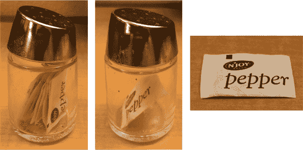
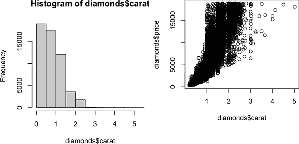

# 第二十七章：基础 R 实用指南

# 介绍

为了完成编程部分，我们将快速介绍一下在本书中未详细讨论的最重要的基础 R 函数。随着您进行更多编程，这些工具将特别有用，并将帮助您阅读在实际应用中遇到的代码。

这是一个提醒您的好地方，整洁宇宙（tidyverse）并不是解决数据科学问题的唯一途径。我们在本书中教授整洁宇宙的原因是整洁宇宙包共享一个共同的设计理念，增加了函数之间的一致性，并使每个新的函数或包都更容易学习和使用。不可能在不使用基础 R 的情况下使用整洁宇宙，因此我们实际上已经教过您很多基础 R 函数，包括 [`library()`](https://rdrr.io/r/base/library.xhtml) 用于加载包；[`sum()`](https://rdrr.io/r/base/sum.xhtml) 和 [`mean()`](https://rdrr.io/r/base/mean.xhtml) 用于数字汇总；因子、日期和 POSIXct 数据类型；当然还包括所有基本运算符，如 `+`, `-`, `/`, `*`, `|`, `&` 和 `!`。到目前为止，我们还没有专注于基础 R 工作流程，所以我们将在本章节中突出几个重点。

在您阅读本书后，您将学习使用基础 R、data.table 和其他包解决同一问题的其他方法。当您开始阅读他人编写的 R 代码时，特别是在使用 StackOverflow 时，您无疑会遇到这些其他方法。编写混合使用各种方法的代码完全没问题，不要让任何人告诉您其他！

在本章中，我们将专注于四个主要主题：使用 `[` 进行子集化、使用 `[[` 和 `$` 进行子集化、使用 apply 函数族以及使用 `for` 循环。最后，我们将简要讨论两个必要的绘图函数。

## 先决条件

本包专注于基础 R，因此没有任何真正的先决条件，但我们将加载整洁宇宙以解释一些差异：

```
library(tidyverse)
```

# 选择多个元素的方式 [

`[` 用于从向量和数据框中提取子组件，像 `x[i]` 或 `x[i, j]` 这样调用。在本节中，我们将向您介绍 `[` 的强大功能，首先展示如何在向量中使用它，然后展示相同的原理如何直接扩展到数据框等二维结构。然后，我们将通过展示各种 dplyr 动词如何是 `[` 的特殊情况来帮助您巩固这些知识。

## 子集向量

有五种主要类型的东西，您可以使用向量进行子集化，即可以作为 `x[i]` 中的 `i`：

+   *正整数向量*。使用正整数进行子集化将保留这些位置的元素：

    ```
    x <- c("one", "two", "three", "four", "five")
    x[c(3, 2, 5)]
    #> [1] "three" "two"   "five"
    ```

    通过重复位置，您实际上可以生成比输入更长的输出，使术语“子集”有点不准确：

    ```
    x[c(1, 1, 5, 5, 5, 2)]
    #> [1] "one"  "one"  "five" "five" "five" "two"
    ```

+   *负整数向量*。负值将删除指定位置的元素：

    ```
    x[c(-1, -3, -5)]
    #> [1] "two"  "four"
    ```

+   *逻辑向量*。使用逻辑向量进行子集化会保留所有对应于 `TRUE` 值的数值。这在与比较函数一起使用时通常非常有用：

    ```
    x <- c(10, 3, NA, 5, 8, 1, NA)

    # All non-missing values of x
    x[!is.na(x)]
    #> [1] 10  3  5  8  1

    # All even (or missing!) values of x
    x[x %% 2 == 0]
    #> [1] 10 NA  8 NA
    ```

    与 [`filter()`](https://dplyr.tidyverse.org/reference/filter.xhtml) 不同，`NA` 索引将作为 `NA` 包含在输出中。

+   *字符向量*。如果你有一个命名向量，你可以用字符向量对其进行子集化：

    ```
    x <- c(abc = 1, def = 2, xyz = 5)
    x[c("xyz", "def")]
    #> xyz def 
    #>   5   2
    ```

    与使用正整数进行子集化一样，可以使用字符向量复制单个条目。

+   *空白*。最后一种子集化类型是什么都不做，`x[]`，它返回完整的 `x`。这对于子集化向量并不有用，但正如我们后面将看到的，当子集化 2D 结构如 tibbles 时是有用的。

## 子集化数据框

有很多不同的方法¹ 可以使用 `[` 与数据框，但最重要的方法是独立选择行和列，使用 `df[rows, cols]`。这里 `rows` 和 `cols` 是前面描述的向量。例如，`df[rows, ]` 和 `df[, cols]` 仅选择行或列，使用空子集来保留其他维度。

这里有几个例子：

```
df <- tibble(
  x = 1:3, 
  y = c("a", "e", "f"), 
  z = runif(3)
)

# Select first row and second column
df[1, 2]
#> # A tibble: 1 × 1
#>   y 
#>   <chr>
#> 1 a

# Select all rows and columns x and y
df[, c("x" , "y")]
#> # A tibble: 3 × 2
#>       x y 
#>   <int> <chr>
#> 1     1 a 
#> 2     2 e 
#> 3     3 f

# Select rows where `x` is greater than 1 and all columns
df[df$x > 1, ]
#> # A tibble: 2 × 3
#>       x y         z
#>   <int> <chr> <dbl>
#> 1     2 e     0.834
#> 2     3 f     0.601
```

不久我们会回到 `$`，但你应该能猜出 `df$x` 在上下文中的作用：它从 `df` 中提取 `x` 变量。我们需要在这里使用它，因为 `[` 不使用整洁评估，所以你需要明确 `x` 变量的来源。

当涉及 `[` 时，tibble 和数据框之间有重要的区别。在本书中，我们主要使用了 tibble，它们 *是* 数据框，但它们调整了一些行为以使您的生活更轻松。在大多数情况下，您可以互换使用“tibble”和“数据框”，因此当我们想特别注意 R 内置数据框时，我们将写 `data.frame`。如果 `df` 是 `data.frame`，那么 `df[, cols]` 将在选择单个列时返回一个向量，并在选择多个列时返回一个数据框。如果 `df` 是一个 tibble，那么 `[` 将始终返回一个 tibble。

```
df1 <- data.frame(x = 1:3)
df1[, "x"]
#> [1] 1 2 3

df2 <- tibble(x = 1:3)
df2[, "x"]
#> # A tibble: 3 × 1
#>       x
#>   <int>
#> 1     1
#> 2     2
#> 3     3
```

避免与 `data.frame` 的这种歧义的一种方法是显式指定 `drop = FALSE`：

```
df1[, "x" , drop = FALSE]
#>   x
#> 1 1
#> 2 2
#> 3 3
```

## dplyr 等价操作

几个 dplyr 动词是 `[` 的特殊情况之一：

+   [`filter()`](https://dplyr.tidyverse.org/reference/filter.xhtml) 等同于使用逻辑向量对行进行子集化，注意排除缺失值：

    ```
    df <- tibble(
      x = c(2, 3, 1, 1, NA), 
      y = letters[1:5], 
      z = runif(5)
    )
    df |> filter(x > 1)

    # same as
    df[!is.na(df$x) & df$x > 1, ]
    ```

    在实际应用中另一种常见技术是使用 [`which()`](https://rdrr.io/r/base/which.xhtml)，它有副作用可以删除缺失值：`df[which(df$x > 1), ]`。

+   [`arrange()`](https://dplyr.tidyverse.org/reference/arrange.xhtml) 相当于使用整数向量对行进行子集化，通常使用 [`order()`](https://rdrr.io/r/base/order.xhtml) 创建：

    ```
    df |> arrange(x, y)

    # same as
    df[order(df$x, df$y), ]
    ```

    你可以使用 `order(decreasing = TRUE)` 对所有列按降序排序，或者使用 `-rank(col)` 以递减顺序单独排序列。

+   [`select()`](https://dplyr.tidyverse.org/reference/select.xhtml) 和 [`relocate()`](https://dplyr.tidyverse.org/reference/relocate.xhtml) 与使用字符向量子集化列类似：

    ```
    df |> select(x, z)

    # same as
    df[, c("x", "z")]
    ```

基础 R 还提供了一个结合了 [`filter()`](https://dplyr.tidyverse.org/reference/filter.xhtml) 和 [`select()`](https://dplyr.tidyverse.org/reference/select.xhtml)² 功能的函数，称为 [`subset()`](https://rdrr.io/r/base/subset.xhtml)：

```
df |> 
  filter(x > 1) |> 
  select(y, z)
#> # A tibble: 2 × 2
#>   y           z
#>   <chr>   <dbl>
#> 1 a     0.157 
#> 2 b     0.00740
```

```
# same as
df |> subset(x > 1, c(y, z))
```

这个函数启发了 dplyr 很多的语法。

## 练习

1.  创建接受向量作为输入并返回的函数：

    1.  偶数位置的元素

    1.  除最后一个值外的每个元素

    1.  只有偶数值（且无缺失值）

1.  为什么 `x[-which(x > 0)]` 不等同于 `x[x <= 0]`？阅读 [`which()`](https://rdrr.io/r/base/which.xhtml) 的文档并进行一些实验来弄清楚。

# 使用 $ 和 [[ 选择单个元素

`[` 选择多个元素，与 `[[` 和 `$` 配对使用，这两者提取单个元素。在本节中，我们将展示如何使用 `[[` 和 `$` 从数据框中提取列，并讨论 `data.frames` 和 tibbles 之间的一些区别，并强调使用列表时 `[` 和 `[[` 之间的一些重要区别。

## 数据框

`[[` 和 `$` 可用于从数据框中提取列。`[[` 可以按位置或名称访问，而 `$` 则专门用于按名称访问：

```
tb <- tibble(
  x = 1:4,
  y = c(10, 4, 1, 21)
)

# by position
tb[[1]]
#> [1] 1 2 3 4

# by name
tb[["x"]]
#> [1] 1 2 3 4
tb$x
#> [1] 1 2 3 4
```

它们还可以用于创建新列，这是基础 R 中 [`mutate()`](https://dplyr.tidyverse.org/reference/mutate.xhtml) 的等效操作：

```
tb$z <- tb$x + tb$y
tb
#> # A tibble: 4 × 3
#>       x     y     z
#>   <int> <dbl> <dbl>
#> 1     1    10    11
#> 2     2     4     6
#> 3     3     1     4
#> 4     4    21    25
```

使用基础 R 中的几种方法创建新列，包括 [`transform()`](https://rdrr.io/r/base/transform.xhtml)，[`with()`](https://rdrr.io/r/base/with.xhtml)，以及 [`within()`](https://rdrr.io/r/base/with.xhtml)。Hadley 收集了一些 [示例](https://oreil.ly/z6vyT)。

在进行快速汇总时，直接使用 `$` 很方便。例如，如果只想找到最大钻石的大小或`cut`的可能值，则无需使用 [`summarize()`](https://dplyr.tidyverse.org/reference/summarise.xhtml)：

```
max(diamonds$carat)
#> [1] 5.01

levels(diamonds$cut)
#> [1] "Fair"      "Good"      "Very Good" "Premium"   "Ideal"
```

dplyr 还提供了一个与 `[`/`$` 等效的函数，在 [第三章 中未提到：[`pull()`](https://dplyr.tidyverse.org/reference/pull.xhtml)。[`pull()`](https://dplyr.tidyverse.org/reference/pull.xhtml) 接受变量名或变量位置，仅返回该列。这意味着我们可以重写以使用管道的先前代码：

```
diamonds |> pull(carat) |> mean()
#> [1] 0.7979397

diamonds |> pull(cut) |> levels()
#> [1] "Fair"      "Good"      "Very Good" "Premium"   "Ideal"
```

## Tibbles

tibbles 和基础 `data.frame`s 之间在使用 `$` 时有几个重要区别。数据框会匹配任何变量名称的前缀（所谓的*部分匹配*），如果列不存在也不会报错：

```
df <- data.frame(x1 = 1)
df$x
#> Warning in df$x: partial match of 'x' to 'x1'
#> [1] 1
df$z
#> NULL
```

Tibbles 更严格：它们只匹配变量名的确切名称，并且如果尝试访问不存在的列，则会生成警告：

```
tb <- tibble(x1 = 1)

tb$x
#> Warning: Unknown or uninitialised column: `x`.
#> NULL
tb$z
#> Warning: Unknown or uninitialised column: `z`.
#> NULL
```

因此，我们有时开玩笑说 tibble 懒惰又暴躁：它们做得少，抱怨得多。

## 列表

`[[`和`$`在处理列表时也非常重要，理解它们与`[`的区别至关重要。让我们通过一个名为`l`的列表来说明它们的不同：

```
l <- list(
  a = 1:3, 
  b = "a string", 
  c = pi, 
  d = list(-1, -5)
)
```

+   `[`提取一个子列表。不管你提取多少元素，结果始终是一个列表。

    ```
    str(l[1:2])
    #> List of 2
    #>  $ a: int [1:3] 1 2 3
    #>  $ b: chr "a string"

    str(l[1])
    #> List of 1
    #>  $ a: int [1:3] 1 2 3

    str(l[4])
    #> List of 1
    #>  $ d:List of 2
    #>   ..$ : num -1
    #>   ..$ : num -5
    ```

    就像向量一样，你可以使用逻辑、整数或字符向量来进行子集选择。

+   `[[`和`$`从列表中提取单个组件。它们从列表中删除一个层级。

    ```
    str(l[[1]])
    #>  int [1:3] 1 2 3

    str(l[[4]])
    #> List of 2
    #>  $ : num -1
    #>  $ : num -5

    str(l$a)
    #>  int [1:3] 1 2 3
    ```

``和`[[`之间的区别对于列表尤其重要，因为`[[`会深入到列表中，而`[`会返回一个新的、较小的列表。为了帮助你记住这个区别，看看在 [图 27-1 中展示的不寻常的胡椒瓶。如果这个胡椒瓶是你的列表`pepper`，那么`pepper[1]`是一个装有单个胡椒包的胡椒瓶。`pepper[2]`看起来一样，但是会包含第二个胡椒包。`pepper[1:2]`是一个装有两个胡椒包的胡椒瓶。`pepper[[1]]`会提取胡椒包本身。



###### 图 27-1\. (左) Hadley 在他的酒店房间里找到的一个胡椒瓶。 (中) `pepper[1]`。 (右) `pepper[[1]]`。

当你在数据框中使用 1D `[`时，这个原则也适用：`df["x"]`返回一个一列的数据框，而`df[["x"]]`返回一个向量。

## 练习

1.  当你用正整数作为`[[`的索引，这个整数大于向量长度时会发生什么？当你用一个不存在的名称作为子集时会发生什么？

1.  `pepper[[1]][1]`会是什么？`pepper[[1]][[1]]`又会是什么？

# 应用家族

在 第 26 章 中，你学到了迭代的 tidyverse 技术，比如 [`dplyr::across()`](https://dplyr.tidyverse.org/reference/across.xhtml) 和 map 函数族。在本节中，你将学习它们的基本等效物，即 *apply family*。在这个上下文中，apply 和 map 是同义词，因为另一种说法是“在每个向量元素上映射一个函数”。我们将为你快速概述这个家族，以便你在实际中能够识别它们。

这个家族中最重要的成员是[`lapply()`](https://rdrr.io/r/base/lapply.xhtml)，它类似于[`purrr::map()`](https://purrr.tidyverse.org/reference/map.xhtml)³。实际上，因为我们没有使用任何[`map()`](https://purrr.tidyverse.org/reference/map.xhtml)的更高级特性，你可以在第二十六章中用[`lapply()`](https://rdrr.io/r/base/lapply.xhtml)替换每个[`map()`](https://purrr.tidyverse.org/reference/map.xhtml)调用。

在 base R 中没有与[`across()`](https://dplyr.tidyverse.org/reference/across.xhtml)完全等效的函数，但可以通过使用[`lapply()`](https://rdrr.io/r/base/lapply.xhtml)和`[`接近。这是因为在底层，数据框架是列的列表，所以在数据框架上调用[`lapply()`](https://rdrr.io/r/base/lapply.xhtml)会将函数应用到每一列。

```
df <- tibble(a = 1, b = 2, c = "a", d = "b", e = 4)

# First find numeric columns
num_cols <- sapply(df, is.numeric)
num_cols
#>     a     b     c     d     e 
#>  TRUE  TRUE FALSE FALSE  TRUE

# Then transform each column with lapply() then replace the original values
df[, num_cols] <- lapply(df[, num_cols, drop = FALSE], \(x) x * 2)
df
#> # A tibble: 1 × 5
#>       a     b c     d         e
#>   <dbl> <dbl> <chr> <chr> <dbl>
#> 1     2     4 a     b         8
```

上面的代码使用了一个新函数[`sapply()`](https://rdrr.io/r/base/lapply.xhtml)。它类似于[`lapply()`](https://rdrr.io/r/base/lapply.xhtml)，但它总是尝试简化结果，这就是其名称中`s`的原因，在这里产生一个逻辑向量而不是列表。我们不建议在编程中使用它，因为简化可能会失败并给出意外的类型，但通常在交互使用中是可以的。purrr 有一个类似的函数叫[`map_vec()`](https://purrr.tidyverse.org/reference/map.xhtml)，我们在第二十六章没有提到它。

Base R 提供了一个更严格的版本的[`sapply()`](https://rdrr.io/r/base/lapply.xhtml)，称为[`vapply()`](https://rdrr.io/r/base/lapply.xhtml)，简称*v*ector apply。它接受一个额外的参数，指定了期望的类型，确保简化的方式与输入无关。例如，我们可以用这个[`vapply()`](https://rdrr.io/r/base/lapply.xhtml)替换之前的[`sapply()`](https://rdrr.io/r/base/lapply.xhtml)调用，其中我们指定我们期望[`is.numeric()`](https://rdrr.io/r/base/numeric.xhtml)返回一个长度为 1 的逻辑向量：

```
vapply(df, is.numeric, logical(1))
#>     a     b     c     d     e 
#>  TRUE  TRUE FALSE FALSE  TRUE
```

当它们在函数内部时，[`sapply()`](https://rdrr.io/r/base/lapply.xhtml)和[`vapply()`](https://rdrr.io/r/base/lapply.xhtml)之间的区别真的很重要（因为对于异常输入，这对函数的鲁棒性有很大影响），但在数据分析中通常并不重要。

apply 家族的另一个重要成员是[`tapply()`](https://rdrr.io/r/base/tapply.xhtml)，它计算单个分组摘要：

```
diamonds |> 
  group_by(cut) |> 
  summarize(price = mean(price))
#> # A tibble: 5 × 2
#>   cut       price
#>   <ord>     <dbl>
#> 1 Fair      4359.
#> 2 Good      3929.
#> 3 Very Good 3982.
#> 4 Premium   4584.
#> 5 Ideal     3458.

tapply(diamonds$price, diamonds$cut, mean)
#>      Fair      Good Very Good   Premium     Ideal 
#>  4358.758  3928.864  3981.760  4584.258  3457.542
```

不幸的是，[`tapply()`](https://rdrr.io/r/base/tapply.xhtml)返回其结果为命名向量，如果你想将多个摘要和分组变量收集到数据框中，则需要进行一些技巧（当然也可以选择不这样做，只是与自由浮动的向量一起工作，但根据我们的经验，这只会延迟工作）。如果你想看看如何使用[`tapply()`](https://rdrr.io/r/base/tapply.xhtml)或其他基本技术来执行其他分组摘要，Hadley 在[gist](https://oreil.ly/evpcw)中收集了一些技术。

apply 家族的最后一位成员是名义上的[`apply()`](https://rdrr.io/r/base/apply.xhtml)，它与矩阵和数组一起工作。特别是要注意`apply(df, 2, something)`，这是做`lapply(df, something)`的一种缓慢且潜在危险的方式。在数据科学中很少遇到这种情况，因为我们通常使用数据框而不是矩阵。

# 对于循环

`for`循环是迭代的基本构建块，apply 和 map 系列在幕后使用。`for`循环是强大且通用的工具，作为你成为更有经验的 R 程序员时学习的重要工具。`for`循环的基本结构如下：

```
for (element in vector) {
  # do something with element
}
```

`for`循环最直接的用法是实现与[`walk()`](https://purrr.tidyverse.org/reference/map.xhtml)相同的效果：对列表的每个元素调用具有副作用的某个函数。例如，在“写入数据库”中，可以不使用`walk()`：

```
paths |> walk(append_file)
```

我们本可以使用`for`循环：

```
for (path in paths) {
  append_file(path)
}
```

如果你想保存`for`循环的输出，例如像我们在第二十六章中读取目录中所有的 Excel 文件一样，情况就会变得有些棘手：

```
paths <- dir("data/gapminder", pattern = "\\.xlsx$", full.names = TRUE)
files <- map(paths, readxl::read_excel)
```

有几种不同的技术可以使用，但我们建议提前明确输出的形式。在这种情况下，我们将需要一个与`paths`相同长度的列表，可以使用[`vector()`](https://rdrr.io/r/base/vector.xhtml)创建：

```
files <- vector("list", length(paths))
```

然后，我们不是迭代`paths`的元素，而是迭代它们的索引，使用[`seq_along()`](https://rdrr.io/r/base/seq.xhtml)为`paths`的每个元素生成一个索引：

```
seq_along(paths)
#>  [1]  1  2  3  4  5  6  7  8  9 10 11 12
```

使用索引很重要，因为它允许我们将输入中的每个位置链接到输出中的相应位置：

```
for (i in seq_along(paths)) {
  files[[i]] <- readxl::read_excel(paths[[i]])
}
```

要将 tibbles 列表合并为单个 tibble，可以使用[`do.call()`](https://rdrr.io/r/base/do.call.xhtml) + [`rbind()`](https://rdrr.io/r/base/cbind.xhtml)：

```
do.call(rbind, files)
#> # A tibble: 1,704 × 5
#>   country     continent lifeExp      pop gdpPercap
#>   <chr>       <chr>       <dbl>    <dbl>     <dbl>
#> 1 Afghanistan Asia         28.8  8425333      779.
#> 2 Albania     Europe       55.2  1282697     1601.
#> 3 Algeria     Africa       43.1  9279525     2449.
#> 4 Angola      Africa       30.0  4232095     3521.
#> 5 Argentina   Americas     62.5 17876956     5911.
#> 6 Australia   Oceania      69.1  8691212    10040.
#> # … with 1,698 more rows
```

与其制作列表并在进行保存的同时保存结果，一个更简单的方法是逐步构建数据框：

```
out <- NULL
for (path in paths) {
  out <- rbind(out, readxl::read_excel(path))
}
```

我们建议避免这种模式，因为当向量很长时可能会变慢。这是关于`for`循环速度慢的持久谬论的根源：实际上不是这样，但是当迭代增长向量时会变慢。

# 图形

许多不使用 tidyverse 的 R 用户更喜欢 ggplot2 进行绘图，因为它具有诸如合理的默认设置、自动图例和现代外观等有用功能。然而，基础 R 绘图函数仍然很有用，因为它们非常简洁——进行基本的探索性绘图所需的输入很少。

野外常见的两种基础绘图类型是散点图和直方图，分别使用[`plot()`](https://rdrr.io/r/graphics/plot.default.xhtml)和[`hist()`](https://rdrr.io/r/graphics/hist.xhtml)生成。这里是来自`diamonds`数据集的一个快速示例：

```
# Left
hist(diamonds$carat)

# Right
plot(diamonds$carat, diamonds$price)
```



注意基础绘图函数使用向量，因此您需要使用`$`或其他技术从数据框中提取列。

# 摘要

在本章中，我们向您展示了一些对子集和迭代有用的基础 R 函数。与本书其他部分讨论的方法相比，这些函数更倾向于“向量”风格，而不是“数据框”风格，因为基础 R 函数往往处理单独的向量，而不是数据框和某些列规范。这通常使编程更容易，因此在编写更多函数并开始编写自己的包时变得更加重要。

本章结束了本书的编程部分。您已经在成为不仅仅使用 R 的数据科学家，而是能够在 R 中编程的数据科学家的旅程上取得了坚实的开端。我们希望这些章节激发了您对编程的兴趣，并且您期待在本书之外继续学习更多。

¹ 阅读《Advanced R》中的[选择多个元素部分](https://oreil.ly/VF0sY)，看看您如何将数据框子集化为 1D 对象，以及如何使用矩阵对其进行子集化。

² 但它不会区别处理分组数据框，并且不支持像[`starts_with()`](https://tidyselect.r-lib.org/reference/starts_with.xhtml)这样的选择辅助函数。

³ 它只是缺乏方便的功能，比如进度条和报告哪个元素引起了问题（如果有错误的话）。
