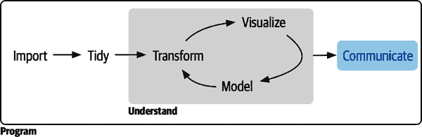

# 第六部分： 交流

到目前为止，您已经学会了将数据导入 R、整理成方便分析的形式，然后通过转换和可视化了解数据。然而，除非您能够向他人解释，否则您的分析再好也没有用：您需要*交流*您的结果。

###### 图 VI-1. 交流是数据科学过程的最后一部分；如果您不能将结果传达给其他人，那么您的分析再好也没有用。

交流是接下来两章的主题：

+   在第二十八章，您将学习到关于 Quarto 的内容，这是一个将散文、代码和结果整合在一起的工具。您可以将 Quarto 用于分析师与分析师之间的交流，也可以用于分析师与决策者之间的交流。由于 Quarto 格式的强大功能，您甚至可以在同一个文档中实现这两种目的。

+   在第二十九章，您将了解到使用 Quarto 可以生成的许多其他输出形式，包括仪表板、网站和书籍等。

这些章节主要关注通信的技术机制，而不是将您的想法传达给其他人时遇到的真正困难的问题。不过，有很多其他关于交流的好书，我们会在每章末尾为您指引。
