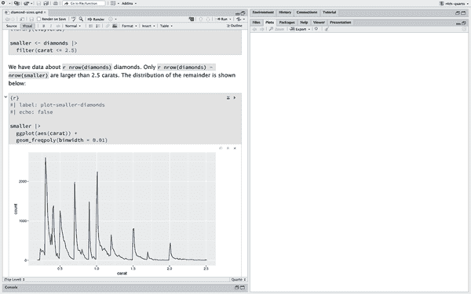
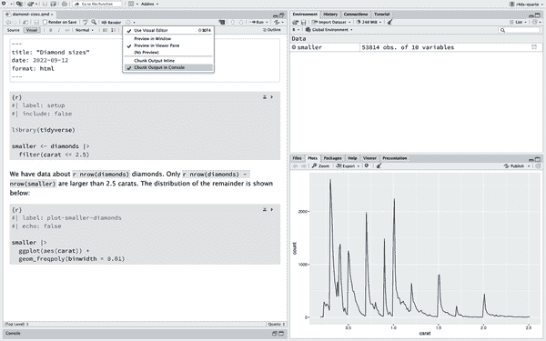
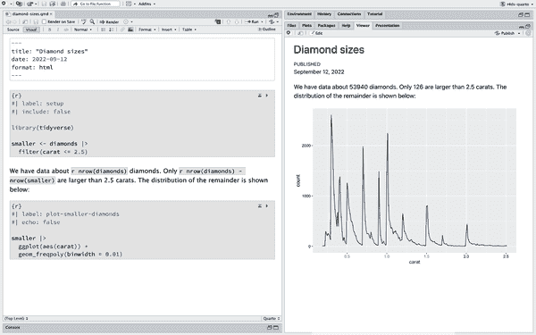
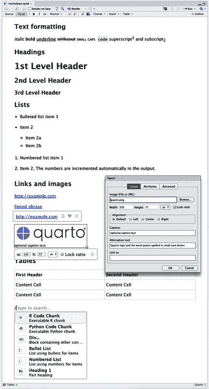
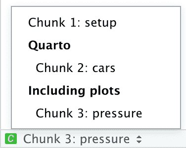
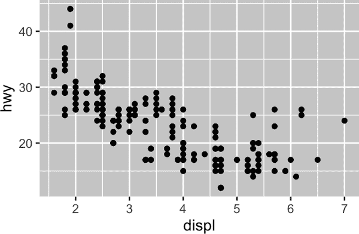
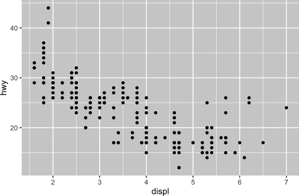
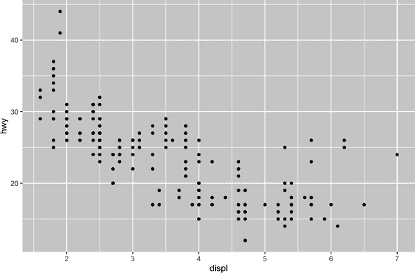

# 第二十八章：Quarto

# 简介

Quarto 为数据科学提供了一个统一的创作框架，结合了您的代码、其结果和您的文本。Quarto 文档完全可重现，并支持多种输出格式，如 PDF、Word 文件、演示文稿等。

Quarto 文件设计用于三种方式：

+   为了向决策者传达重点结论，而非分析背后的代码

+   为了与其他数据科学家（包括未来的自己）合作，他们对您的结论和您达到这些结论的方式（即代码）都感兴趣

+   作为一个环境，用于*进行*数据科学，作为一个现代化的实验笔记本，在这里您不仅可以记录您的操作，还可以记录您的思考过程

Quarto 是一个命令行界面工具，而不是一个 R 包。这意味着帮助通常不能通过`?`获得。因此，在您阅读本章并在将来使用 Quarto 时，您应参考[Quarto 文档](https://oreil.ly/_6LNH)。

如果您是 R Markdown 用户，您可能会想：“Quarto 听起来很像 R Markdown。” 您没有错！ Quarto 将 R Markdown 生态系统中许多包的功能统一到一个一致的系统中，并通过本地支持多种编程语言（例如 Python 和 Julia，除了 R）来扩展它。在某种程度上，Quarto 反映了十年来扩展和支持 R Markdown 生态系统所学到的一切。

## 先决条件

您需要使用 Quarto 命令行界面（Quarto CLI），但不需要显式安装或加载它，因为 RStudio 在需要时会自动完成。

# Quarto 基础

这是一个 Quarto 文件，即扩展名为`.qmd`的纯文本文件：

```
---
title: "Diamond sizes"
date: 2022-09-12
format: html
---

```{r}

#| label: setup

#| include: false

library(tidyverse)

smaller <- diamonds |>

filter(carat <= 2.5)

```

We have data about `r nrow(diamonds)` diamonds.
Only `r nrow(diamonds) - nrow(smaller)` are larger than 2.5 carats.
The distribution of the remainder is shown below:

```{r}

#| label: plot-smaller-diamonds

#| echo: false

smaller |>

ggplot(aes(x = carat)) +

geom_freqpoly(binwidth = 0.01)

```
```

它包含三种重要类型的内容：

+   由`---`包围的（可选的）*YAML 头部*

+   R 代码*块*，用```` ``` ````包围

+   文本与简单文本格式化，如`# heading`和 `_italics_`

图 28-1 显示了在 RStudio 中具有笔记本界面的`.qmd`文档，其中代码和输出交错显示。您可以通过单击代码块顶部的播放按钮（看起来像一个播放按钮）或按下 Cmd/Ctrl+Shift+Enter 来运行每个代码块。 RStudio 会执行代码并将结果与代码内联显示。



###### 图 28-1\. 在 RStudio 中显示的 Quarto 文档。代码和输出交错显示，绘图输出紧跟在代码下方。

如果您不喜欢在文档中看到图表和输出，并且宁愿使用 RStudio 的 Console 和 Plot 窗格，您可以单击“Render”旁边的齿轮图标，切换到 Console 中显示块输出选项，如 图 28-2 所示。



###### 图 28-2\. 在 RStudio 中显示的带有绘图输出的 Quarto 文档。

要生成包含所有文本、代码和结果的完整报告，请单击“Render”或按下 Cmd/Ctrl+Shift+K。您还可以使用 `quarto::quarto_render("diamond-sizes.qmd")` 进行编程方式操作。这将在 图 28-3 中显示报告，并创建一个 HTML 文件。



###### 图 28-3\. 在 RStudio 中使用渲染后的 Viewer 窗格显示的 Quarto 文档。

当您渲染文档时，Quarto 将 `.qmd` 文件发送到 [knitr](https://oreil.ly/HvFDz)，后者执行所有代码块并创建包含代码及其输出的新 Markdown（`.md`）文档。knitr 生成的 Markdown 文件随后由 [pandoc](https://oreil.ly/QxUsn) 处理，负责创建最终的文件。图 28-4 展示了这一过程。这种两步工作流的优势在于您可以创建多种输出格式，详细内容请参见 第二十九章。


###### 图 28-4\. Quarto 工作流程图，从 qmd 到 knitr，再到 md，最后由 pandoc 输出为 PDF、MS Word 或 HTML 格式。

要开始使用您自己的 `.qmd` 文件，请在菜单栏中选择“文件 > 新建文件 > Quarto 文档…”。RStudio 将启动一个向导，您可以使用它来预填充文件，以提醒您 Quarto 的关键功能如何工作。

下面的章节详细介绍了 Quarto 文档的三个组成部分：Markdown 文本、代码块和 YAML 头部。

## 练习

1.  通过选择 文件 > 新文件 > Quarto 文档 创建一个新的 Quarto 文档。阅读说明。练习逐个运行代码块。然后通过单击适当的按钮以及使用适当的键盘快捷键来渲染文档。验证您可以修改代码、重新运行它并查看修改后的输出。

1.  为每种内置格式（HTML、PDF 和 Word）创建一个新的 Quarto 文档。渲染这三个文档。它们的输出有什么不同？它们的输入又有什么不同？（如果需要，您可能需要安装 LaTeX 来构建 PDF 输出 —— 如果需要，RStudio 将提示您。）

# 可视化编辑器

RStudio 中的可视化编辑器为编写 Quarto 文档提供了所见即所得的界面。在幕后，Quarto 文档（`.qmd` 文件）中的文本是用 Markdown 编写的，这是一种用于格式化纯文本文件的轻量级约定。事实上，Quarto 使用 Pandoc markdown（Quarto 理解的略微扩展版本的 Markdown），包括表格、引用、交叉引用、脚注、div/span、定义列表、属性、原始 HTML/TeX 等，以及支持执行代码单元格并在行内查看其输出。虽然 Markdown 设计成易于阅读和书写，正如您将在 “源编辑器” 中看到的那样，但仍然需要学习新的语法。因此，如果您是新手，对于像 `.qmd` 文件这样的计算文档但有使用 Google Docs 或 MS Word 等工具的经验，开始使用 RStudio 中的 Quarto 最简单的方法是使用可视化编辑器。

在可视化编辑器中，您可以使用菜单栏上的按钮来插入图片、表格、交叉引用等，或者您可以使用全能的 `Cmd/Ctrl+/` 快捷键来插入几乎任何内容。如果您在一行的开头（如在 图 28-5 中所示），您还可以仅输入 `/` 来调用该快捷方式。



###### 图 28-5\. Quarto 可视化编辑器。

插入图像并自定义其显示方式也可以通过视觉编辑器轻松完成。您可以直接将图像从剪贴板粘贴到视觉编辑器中（RStudio 将在项目目录中放置该图像的副本并链接到它），或者您可以使用视觉编辑器的插入 > 图片/图形菜单浏览要插入的图像或粘贴其 URL。此外，使用相同的菜单，您还可以调整图像的大小，并添加标题、替代文本和链接。

视觉编辑器有许多我们未在此列出的功能，当您使用它撰写文稿时，您可能会发现它们非常有用。

最重要的是，虽然视觉编辑器显示带有格式的内容，但在幕后，它会将您的内容保存为纯 Markdown，并且您可以在视觉和源编辑器之间切换，以查看和编辑您的内容。

## 练习

1.  使用视觉编辑器重新创建图 28-5 中的文档。

1.  使用视觉编辑器，使用插入菜单和插入任何工具插入代码块。

1.  使用视觉编辑器，找出如何：

    1.  添加一个脚注。

    1.  添加一个水平分隔线。

    1.  添加一个块引用。

1.  在视觉编辑器中，选择插入 > 引用，并使用其数字对象标识符（DOI）插入标题为[“欢迎来到 Tidyverse”](https://oreil.ly/I9_I7)的论文的引用，其 DOI 是[10.21105/joss.01686](https://oreil.ly/H_Xn-)。渲染文档并观察引用如何显示在文档中。您在文档的 YAML 中观察到了什么变化？

# 源编辑器

您还可以在 RStudio 中使用源编辑器编辑 Quarto 文档，无需视觉编辑器的帮助。虽然对于那些习惯于使用 Google Docs 等工具进行编写的人来说，视觉编辑器会感觉很熟悉，但对于那些有编写 R 脚本或 R Markdown 文档经验的人来说，源编辑器会更为熟悉。源编辑器还可以用于调试任何 Quarto 语法错误，因为通常更容易在纯文本中捕捉这些错误。

以下指南展示了如何在源编辑器中使用 Pandoc 的 Markdown 来撰写 Quarto 文档：

```
## Text formatting

*italic* **bold** ~~strikeout~~ `code`

superscript²^ subscript~2~

[underline]{.underline} [small caps]{.smallcaps}

## Headings

# 1st Level Header

## 2nd Level Header

### 3rd Level Header

## Lists

-   Bulleted list item 1

-   Item 2

    -   Item 2a

    -   Item 2b

1\.  Numbered list item 1

2\.  Item 2.
    The numbers are incremented automatically in the output.

## Links and images

<http://example.com>

[linked phrase](http://example.com)

{
  fig-alt="Quarto logo and the word quarto spelled in small case letters"}

## Tables

| First Header | Second Header |
|--------------|---------------|
| Content Cell | Content Cell  |
| Content Cell | Content Cell  |
```

学习这些内容的最佳方式就是简单地尝试它们。这可能需要几天时间，但很快它们就会成为第二天性，您不需要再去考虑它们。如果您忘记了，您可以通过帮助 > Markdown 快速参考来获取便捷的参考表。

## 练习

1.  通过创建一个简要的简历来实践所学内容。标题应为您的姓名，并包括至少教育或就业的标题。每个部分应包括职位/学位的项目列表。用粗体标出年份。

1.  使用源编辑器和 Markdown 快速参考，找出如何：

    1.  添加一个脚注。

    1.  添加一个水平分隔线。

    1.  添加一个块引用。

1.  将[`diamond-sizes.qmd`](https://oreil.ly/Auuh2)的内容复制并粘贴到本地的 R Quarto 文档中。检查是否可以运行它，然后在频率多边形之后添加文本，描述其最引人注目的特点。

1.  在 Google Docs 或 MS Word 中创建文档（或找到之前创建的文档），其中包含标题、超链接、格式化文本等内容。将此文档的内容复制并粘贴到视觉编辑器中的 Quarto 文档中。然后切换到源编辑器并检查源代码。

# 代码块

要在 Quarto 文档中运行代码，您需要插入一个代码块。有三种方法可以做到这一点：

+   按下键盘快捷键 Cmd+Option+I/Ctrl+Alt+I

+   点击编辑器工具栏中的插入按钮图标

+   手动键入代码块界定符```` ```{r} ````和```` ``` ````

我们建议您学习这个键盘快捷键。长远来看，这将为您节省大量时间！

您可以继续使用键盘快捷键运行代码，到现在为止（我们希望如此！）您已经熟悉并喜爱：Cmd/Ctrl+Enter。然而，代码块有一个新的键盘快捷键，Cmd/Ctrl+Shift+Enter，它运行代码块中的所有代码。将代码块视为函数。代码块应该相对独立，并围绕单个任务进行重点。

下面的部分描述了由```` ```{r} ````组成的代码块头部，后跟可选的代码块标签和各种其他代码块选项，每个选项占据一行，由`#|`标记。

## 代码块标签

代码块可以有一个可选的标签：

```
```{r}

#| 标签：simple-addition

1 + 1

```
```

```
#> [1] 2
```

这有三个优点：

+   您可以更轻松地使用位于脚本编辑器左下角的下拉式代码导航器导航到特定的代码块：

    

+   由代码块生成的图形将具有有用的名称，使它们更容易在其他地方使用。更多信息请参阅“图形”。

+   您可以设置缓存代码块的网络，以避免在每次运行时重新执行昂贵的计算。更多信息请参阅“缓存”。

您的代码块标签应该简短而富有启发性，并且不应包含空格。我们建议使用破折号（`-`）来分隔单词（而不是下划线`_`），并避免在代码块标签中使用其他特殊字符。

通常可以自由地对代码块进行标记，但有一个特殊行为的代码块名称：`setup`。当您处于笔记本模式时，名为`setup`的代码块将在运行任何其他代码之前自动运行一次。

另外，代码块标签不能重复。每个代码块标签必须是唯一的。

## 代码块选项

代码块输出可以通过 *选项* 自定义，这些选项是提供给代码块标题的字段。Knitr 提供了近 60 个选项，您可以使用它们来自定义代码块。在这里，我们将涵盖您经常使用的最重要的代码块选项。您可以在 [这里](https://oreil.ly/38bld) 查看完整列表。

最重要的一组选项控制代码块是否执行以及在最终报告中插入的结果：

`eval: false`

防止代码被评估。（显然，如果代码未运行，则不会生成结果。）这对显示示例代码或禁用大块代码而不是每行注释非常有用。

`include: false`

运行代码，但不在最终文档中显示代码或结果。用于不想在报告中看到的设置代码。

`echo: false`

防止代码，但结果不会出现在最终文件中。用于写给不想看到底层 R 代码的人的报告。

`message: false` 或 `warning: false`

防止消息或警告出现在最终文件中。

`results: hide`

隐藏打印输出。

`fig-show: hide`

隐藏绘图。

`error: true`

导致渲染继续即使代码返回错误。这在最终版本的报告中很少出现，但如果需要调试 `.qmd` 中发生的情况，则非常有用。如果您正在教学 R 并希望故意包含错误，则也很有用。默认情况下，`error: false` 会导致文档中有一个错误时渲染失败。

每个代码块选项都添加到代码块标题后面，例如，在下面的代码块中，由于 `eval` 设置为 false，结果不会打印：

```
```{r}

#| label: simple-multiplication

#| eval: false

2 * 2

```
```

下表总结了每个选项抑制的输出类型：

| 选项 | 运行代码 | 显示代码 | 输出 | 绘图 | 消息 | 警告 |
| --- | --- | --- | --- | --- | --- | --- |
| `eval: false` | X |   | X | X | X | X |
| `include: false` |   | X | X | X | X | X |
| `echo: false` |   | X |   |   |   |   |
| `results: hide` |   |   | X |   |   |   |
| `fig-show: hide` |   |   |   | X |   |   |
| `message: false` |   |   |   |   | X |   |
| `warning: false` |   |   |   |   |   | X |

## 全局选项

随着您与 knitr 的更多工作，您会发现一些默认代码块选项不符合您的需求，您希望更改它们。

您可以通过在文档 YAML 下的 `execute` 中添加首选选项来实现此目的。例如，如果您正在为一个不需要看到您的代码但只需要看到结果和叙述的受众准备报告，可以在文档级别设置 `echo: false`。这将默认隐藏代码，并仅显示您选择显示的块（`echo: true`）。您可能考虑设置 `message: false` 和 `warning: false`，但这会使调试问题更困难，因为您在最终文档中看不到任何消息。

```
title: "My report"
execute:
  echo: false
```

由于 Quarto 被设计为多语言（它与 R 以及其他语言如 Python，Julia 等一起工作），文档执行级别上并不可用所有的 knitr 选项，因为其中一些只能与 knitr 一起使用，并不能与 Quarto 用于其他语言的引擎（例如 Jupyter）一起使用。然而，您仍然可以将它们作为文档的全局选项设置在 `knitr` 字段下的 `opts_chunk` 下。例如，在编写书籍和教程时，我们设置：

```
title: "Tutorial"
knitr:
  opts_chunk:
    comment: "#>"
    collapse: true
```

这使用了我们首选的注释格式，并确保代码和输出紧密相关。

## 内联代码

有另一种方法可以将 R 代码嵌入到 Quarto 文档中：直接在文本中使用 `` `r ` ``。如果您在文本中提及数据的属性，这将非常有用。例如，在本章开头使用的示例文档中有：

> 我们有关于 `` `r nrow(diamonds)` `` 颗钻石的数据。只有 `` `r nrow(diamonds) - nrow(smaller)` `` 颗大于 2.5 克拉。其余的分布如下所示：

当报告被渲染时，这些计算结果将插入到文本中：

> 我们有关于 53940 颗钻石的数据。只有 126 颗大于 2.5 克拉。其余的分布如下所示：

当将数字插入文本时，[`format()`](https://rdrr.io/r/base/format.xhtml) 是你的好帮手。它允许你设置 `digits` 的数量，以避免打印到荒谬的精度，并且你可以使用 `big.mark` 使数字更容易阅读。你可以将它们组合成一个辅助函数：

```
comma <- function(x) format(x, digits = 2, big.mark = ",")
comma(3452345)
#> [1] "3,452,345"
comma(.12358124331)
#> [1] "0.12"
```

## 练习

1.  添加一个部分，探讨钻石尺寸如何根据切割，颜色和净度变化。假设你为一个不懂 R 语言的人写报告，而不是在每个块上设置 `echo: false`，可以设置一个全局选项。

1.  下载 [`diamond-sizes.qmd`](https://oreil.ly/Auuh2)。添加一个部分，描述最大的 20 颗钻石，包括显示它们最重要属性的表格。

1.  修改 `diamonds-sizes.qmd` 使用 `label_comma()` 生成格式良好的输出。还包括大于 2.5 克拉的钻石百分比。

# 图形

Quarto 文档中的图形可以嵌入（例如 PNG 或 JPEG 文件）或作为代码块的结果生成。

要嵌入来自外部文件的图像，您可以在 RStudio 的可视化编辑器中使用“插入”菜单，选择“图像”。这将弹出一个菜单，您可以浏览到要插入的图像，并添加替代文本或标题，并调整其大小。在可视化编辑器中，您还可以简单地将图像从剪贴板粘贴到文档中，RStudio 将在项目文件夹中放置该图像的副本。

如果你包含一个生成图形的代码块（例如包含`ggplot()`调用），生成的图形将自动包含在你的 Quarto 文档中。

## 图形大小

在 Quarto 中图形的最大挑战是使您的图形大小和形状正确。有五个主要选项可以控制图形大小：`fig-width`、`fig-height`、`fig-asp`、`out-width`和`out-height`。图像大小具有挑战性，因为存在两种尺寸（由 R 创建的图形大小以及它在输出文档中插入的大小），以及多种指定大小的方式（即高度、宽度和纵横比：选择三个中的两个）。

我们推荐五个选项中的三个：

+   如果图形具有一致的宽度，通常更美观。为了实现这一点，在默认情况下设置`fig-width: 6`（6 英寸）和`fig-asp: 0.618`（黄金比例）。然后在单个代码块中，仅调整`fig-asp`。

+   使用`out-width`控制输出大小，并将其设置为输出文档正文宽度的百分比。我们建议使用`out-width: "70%"`和`fig-align: center`。这样可以使图形有足够的空间呼吸，而不会占用太多空间。

+   要在单行中放置多个图形，请将`layout-ncol`设置为 2（两个图形）、3（三个图形）等。根据您试图说明的内容（例如显示数据或显示图形变化），您可能还需要调整`fig-width`，如下所讨论的。

如果发现您需要眯起眼睛才能阅读图中的文本，则需要调整`fig-width`。如果`fig-width`大于图形在最终文档中呈现的大小，则文本将太小；如果`fig-width`较小，则文本将太大。通常需要进行一些实验来找出`fig-width`与文档最终宽度之间的正确比例。为了说明这个原则，以下三个图的`fig-width`分别为 4、6 和 8：



如果您希望确保所有图形的字体大小保持一致，每当您设置`out-width`时，您还需要调整`fig-width`以保持与默认`out-width`相同的比例。例如，如果您的默认`fig-width`为 6，而`out-width`为“70%”，当您设置`out-width: "50%"`时，您需要将`fig-width`设置为 4.3（6 * 0.5 / 0.7）。

图片的大小和缩放是一门艺术和科学，正确调整可能需要迭代的试错方法。您可以在[“控制绘图缩放”博客文章](https://oreil.ly/EfKFq)中了解更多关于图片大小的信息。

## 其他重要选项

在像本书这样混合代码和文本的情况下，您可以设置`fig-show: hold`，以便在代码后显示绘图。这样做的一个愉快的副作用是强迫您用解释来打破大块的代码。

要向图表添加标题，请使用`fig-cap`。在 Quarto 中，这将使图表从内联变为“浮动”。

如果您要生成 PDF 输出，则默认的图形类型是 PDF。这是一个很好的默认设置，因为 PDF 是高质量的矢量图形。但是，如果您显示数千个点，则可能会产生大型和缓慢的绘图。在这种情况下，设置`fig-format: "png"`以强制使用 PNG。它们的质量略低，但文件会更紧凑。

即使您不经常标记其他块，为生成图形的代码块命名是一个好主意。代码块标签用于生成磁盘上图形的文件名，因此为代码块命名使得在其他情况下（例如，如果您想快速将单个图形插入电子邮件中），更容易选择和重用图形。

## 练习

1.  在视觉编辑器中打开`diamond-sizes.qmd`，找到一张钻石的图像，复制并粘贴到文档中。双击图像并添加标题。调整图像大小并渲染您的文档。观察图像如何保存在当前工作目录中。

1.  编辑生成绘图的`diamond-sizes.qmd`中代码块的标签，以`fig-`作为前缀开始，并通过插入 > 交叉引用在代码块上面的文本中添加一个标题。然后，编辑代码块上方的文本，添加到图表的交叉引用。

1.  使用以下代码块选项之一更改图形的大小；渲染您的文档；并描述图形的变化。

    1.  `fig-width: 10`

    1.  `fig-height: 3`

    1.  `out-width: "100%"`

    1.  `out-width: "20%"`

# 表格

与图表类似，您可以在 Quarto 文档中包含两种类型的表格。它们可以是您直接在 Quarto 文档中创建的 Markdown 表格（使用插入表格菜单），也可以是作为代码块结果生成的表格。在本节中，我们将重点放在后者上，即通过计算生成的表格。

默认情况下，Quarto 将数据框架和矩阵打印为您在控制台中看到的样子。

```
mtcars[1:5, ]
#>                    mpg cyl disp  hp drat    wt  qsec vs am gear carb
#> Mazda RX4         21.0   6  160 110 3.90 2.620 16.46  0  1    4    4
#> Mazda RX4 Wag     21.0   6  160 110 3.90 2.875 17.02  0  1    4    4
#> Datsun 710        22.8   4  108  93 3.85 2.320 18.61  1  1    4    1
#> Hornet 4 Drive    21.4   6  258 110 3.08 3.215 19.44  1  0    3    1
#> Hornet Sportabout 18.7   8  360 175 3.15 3.440 17.02  0  0    3    2
```

如果你希望数据显示带有额外的格式，可以使用[`knitr::kable()`](https://rdrr.io/pkg/knitr/man/kable.xhtml)函数。下面的代码生成 Table 28-1：

```
knitr::kable(mtcars[1:5, ], )
```

表 28-1\. 一个 knitr kable

|   | mpg | cyl | disp | hp | drat | wt | qsec | vs | am | gear | carb |
| --- | --- | --- | --- | --- | --- | --- | --- | --- | --- | --- | --- |
| Mazda RX4 | 21.0 | 6 | 160 | 110 | 3.90 | 2.620 | 16.46 | 0 | 1 | 4 | 4 |
| Mazda RX4 Wag | 21.0 | 6 | 160 | 110 | 3.90 | 2.875 | 17.02 | 0 | 1 | 4 | 4 |
| Datsun 710 | 22.8 | 4 | 108 | 93 | 3.85 | 2.320 | 18.61 | 1 | 1 | 4 | 1 |
| Hornet 4 Drive | 21.4 | 6 | 258 | 110 | 3.08 | 3.215 | 19.44 | 1 | 0 | 3 | 1 |
| Hornet Sportabout | 18.7 | 8 | 360 | 175 | 3.15 | 3.440 | 17.02 | 0 | 0 | 3 | 2 |

阅读[`?knitr::kable`](https://rdrr.io/pkg/knitr/man/kable.xhtml)的文档，了解如何使用其他方式自定义表格。要进行更深入的定制，考虑使用 gt、huxtable、reactable、kableExtra、xtable、stargazer、pander、tables 和 ascii 包。每个包都提供了一套工具，用于从 R 代码返回格式化的表格。

## 练习

1.  在可视编辑器中打开`diamond-sizes.qmd`，插入一个代码块，并使用[`knitr::kable()`](https://rdrr.io/pkg/knitr/man/kable.xhtml)创建一个显示`diamonds`数据帧前五行的表格。

1.  使用[`gt::gt()`](https://gt.rstudio.com/reference/gt.xhtml)显示相同的表格。

1.  添加一个以`tbl-`前缀开头的块标签，并使用块选项`tbl-cap`为表格添加标题。然后，编辑代码块上方的文本，使用插入 > 交叉引用来引用表格。

# 缓存

通常，文档的每次渲染都从一个完全干净的状态开始。这对于可重现性很重要，因为它确保你已经在代码中捕获了每一个重要的计算过程。然而，如果有一些需要很长时间的计算，这可能会很痛苦。解决方案是`cache: true`。

您可以使用标准的 YAML 选项在文档级别启用 knitr 缓存，用于缓存文档中所有计算的结果：

```
---
title: "My Document"
execute: 
  cache: true
---
```

您还可以在块级别启用缓存，用于缓存特定块中计算的结果：

```
```{r}

#| cache: true

# 长时间计算的代码...

```
```

设置后，这将把块的输出保存到一个特别命名的文件中。在后续运行中，knitr 会检查代码是否发生了变化，如果没有，它将重用缓存的结果。

缓存系统必须小心使用，因为默认情况下仅基于代码而不是其依赖项。例如，这里的`processed_data`块依赖于`raw-data`块：

```
```{r}

#| label: raw-data

#| cache: true

rawdata <- readr::read_csv("a_very_large_file.csv")

```

```{r}

#| label: processed_data

#| cache: true

processed_data <- rawdata |>

filter(!is.na(import_var)) |>

mutate(new_variable = complicated_transformation(x, y, z))

```
```

缓存`processed_data`块意味着如果 dplyr 管道发生更改，它将重新运行，但如果`read_csv()`调用发生更改，则不会重新运行。您可以使用`dependson`块选项避免这个问题：

```
```{r}

#| label: processed-data

#| cache: true

#| dependson: "raw-data"

processed_data <- rawdata |>

filter(!is.na(import_var)) |>

mutate(new_variable = complicated_transformation(x, y, z))

```
```

`dependson`应该包含一个字符向量，其中包含缓存块依赖的*每个*块。Knitr 会在检测到其依赖项发生更改时更新缓存块的结果。

注意，如果`a_very_large_file.csv`发生更改，块将不会更新，因为 knitr 缓存仅跟踪`.qmd`文件内的更改。如果您还想跟踪该文件的更改，可以使用`cache.extra`选项。这是一个任意的 R 表达式，每当它更改时都会使缓存无效。可以使用一个好的函数[`file.mtime()`](https://rdrr.io/r/base/file.info.xhtml)：它返回文件的最后修改时间。然后您可以写：

```
```{r}

#| label: raw-data

#| cache: true

#| cache.extra: !expr file.mtime("a_very_large_file.csv")

rawdata <- readr::read_csv("a_very_large_file.csv")

```
```

我们遵循了[David Robinson](https://oreil.ly/yvPFt)的建议，为这些块命名：每个块都以它创建的主要对象命名。这样更容易理解`dependson`规范。

随着您的缓存策略变得越来越复杂，定期使用[`knitr::clean_cache()`](https://rdrr.io/pkg/knitr/man/clean_cache.xhtml)清除所有缓存是一个好主意。

## 练习

1.  设置一个基于网络块的网络，其中`d`依赖于`c`和`b`，而`b`和`c`都依赖于`a`。让每个块打印[`lubridate::now()`](https://lubridate.tidyverse.org/reference/now.xhtml)，设置`cache: true`，然后验证你对缓存的理解。

# 故障排除

调试 Quarto 文档可能会很具有挑战性，因为您不再处于交互式 R 环境中，您需要学习一些新技巧。此外，错误可能是由于 Quarto 文档本身的问题或 Quarto 文档中的 R 代码引起的。

代码块中常见的一个错误是重复的块标签，如果您的工作流程涉及复制和粘贴代码块，则这种错误尤其普遍。要解决此问题，您只需更改其中一个重复的标签即可。

如果错误是由文档中的 R 代码引起的，你应该尝试的第一件事是在交互式会话中重新创建问题。重新启动 R，然后从代码菜单下的运行区域或按键盘快捷键 Ctrl+Alt+R 选择“运行所有块”。如果你幸运的话，这将重新创建问题，然后你可以进行交互式的问题排查。

如果这没有帮助，可能是您的交互环境与 Quarto 环境之间有所不同。您需要系统地探索选项。最常见的差异是工作目录：Quarto 的工作目录是它所在的目录。通过在一个代码块中包含 [`getwd()`](https://rdrr.io/r/base/getwd.xhtml) 来检查您所期望的工作目录是否正确。

接下来，列出可能导致错误的所有事项。您需要系统地检查这些事项在您的 R 会话和 Quarto 会话中是否相同。完成这项工作的最简单方法是在引起问题的代码块上设置 `error: true`，然后使用 [`print()`](https://rdrr.io/r/base/print.xhtml) 和 [`str()`](https://rdrr.io/r/utils/str.xhtml) 检查设置是否符合您的期望。

# YAML 头部

通过调整 YAML 头部参数，您可以控制许多其他“整个文档”设置。您可能会好奇 YAML 是什么意思：它代表“YAML Ain’t Markup Language”，旨在以一种易于人类阅读和编写的方式表示分层数据。Quarto 使用它来控制输出的许多细节。在这里，我们将讨论三个方面：自包含文档、文档参数和文献目录。

## 自包含

HTML 文档通常具有许多外部依赖项（例如图片、CSS 样式表、JavaScript 等），默认情况下，Quarto 将这些依赖项放在与您的 `.qmd` 文件相同目录下的 `_files` 文件夹中。如果您将 HTML 文件发布到托管平台（例如 [QuartoPub](https://oreil.ly/SF3Pm)），此目录中的依赖项将与您的文档一起发布，因此在发布的报告中可用。然而，如果您希望将报告通过电子邮件发送给同事，您可能更喜欢拥有一个单一的、自包含的 HTML 文档，其中嵌入了所有的依赖项。您可以通过指定 `embed-resources` 选项来实现这一点。

```
format:
  html:
    embed-resources: true
```

生成的文件将是自包含的，因此它将不需要外部文件，也不需要通过互联网访问才能由浏览器正确显示。

## 参数

Quarto 文档可以包含一个或多个参数，这些参数的值可以在渲染报告时设置。当您希望使用不同的值重新渲染相同的报告以获取各种关键输入时，参数非常有用。例如，您可能正在生成分部门的销售报告，按学生的考试成绩报告，或者按国家的人口统计摘要报告。要声明一个或多个参数，请使用 `params` 字段。

本示例使用一个 `my_class` 参数来确定要显示哪个车型类别：

```
---
format: html
params:
  my_class: "suv"
---

```{r}

#| 标签: setup

#| 包含: false

library(tidyverse)

class <- mpg |> filter(class == params$my_class)

```

# Fuel economy for `r params$my_class`s

```{r}

#| 消息: false

ggplot(class, aes(x = displ, y = hwy)) +

geom_point() +

geom_smooth(se = FALSE)

```
```

正如您所看到的，参数在代码块内部作为一个名为 `params` 的只读列表可用。

您可以直接将原子向量写入 YAML 头文件中。您还可以通过在参数值前加上 `!expr` 来运行任意的 R 表达式。这是指定日期/时间参数的好方法。

```
params:
  start: !expr lubridate::ymd("2015-01-01")
  snapshot: !expr lubridate::ymd_hms("2015-01-01 12:30:00")
```

## 参考文献和引文

Quarto 可以自动以多种样式生成引文和参考文献。向 Quarto 文档添加引文和参考文献的最简单方式是使用 RStudio 中的视觉编辑器。

要在视觉编辑器中添加引用，请选择插入 > 引用。可以从多种来源插入引用：

+   [DOI](https://oreil.ly/sxxlC) 引用

+   [Zotero](https://oreil.ly/BDpHv) 个人或群组库。

+   [Crossref](https://oreil.ly/BpPdW)、[DataCite](https://oreil.ly/vSwdK) 或 [PubMed](https://oreil.ly/Hd2Ey) 的搜索。

+   你的文档参考文献（位于文档目录中的 `.bib` 文件）

在视觉模式下，使用标准的 Pandoc Markdown 表示来引用（例如，`[@citation]`）。

如果使用前三种方法之一添加引用，视觉编辑器将自动为您创建一个 `bibliography.bib` 文件，并将引用添加到其中。它还将在文档 YAML 中添加一个 `bibliography` 字段。随着您添加更多引用，该文件将填充其引文。您还可以直接使用包括 BibLaTeX、BibTeX、EndNote 和 Medline 在内的多种常见参考文献格式编辑此文件。

要在源编辑器中的 `.qmd` 文件中创建引用，请使用由参考文献文件中引用标识符组成的键。然后将引用放在方括号内。以下是一些示例：

```
Separate multiple citations with a `;`: Blah blah [@smith04; @doe99].

You can add arbitrary comments inside the square brackets: 
Blah blah [see @doe99, pp. 33-35; also @smith04, ch. 1].

Remove the square brackets to create an in-text citation: @smith04 
says blah, or @smith04 [p. 33] says blah.

Add a `-` before the citation to suppress the author's name: 
Smith says blah [-@smith04].
```

当 Quarto 渲染您的文件时，它将构建并附加参考文献到文档的末尾。参考文献将包含您的参考文献文件中每个引用的引文，但不会包含章节标题。因此，通常建议在文档的末尾加上一个参考文献的章节标题，例如 `# References` 或 `# Bibliography`。

你可以通过引用引文样式语言（CSL）文件中的 `csl` 字段来更改引文和参考文献的样式：

```
bibliography: rmarkdown.bib
csl: apa.csl
```

与参考文献字段一样，您的 CSL 文件应包含指向文件的路径。在这里，我们假设 CSL 文件与 `.qmd` 文件在同一个目录中。查找常见参考文献样式的 CSL 样式文件的好地方是 [citation styles 的官方仓库](https://oreil.ly/bYJez)。

# 工作流程

早些时候，我们讨论了一个捕获您的 R 代码的基本工作流程，您可以在其中以交互方式在 *控制台* 中工作，然后在 *脚本编辑器* 中捕获有效的内容。Quarto 将控制台和脚本编辑器结合在一起，模糊了交互式探索和长期代码捕获之间的界限。您可以在一个代码块内快速迭代，编辑并重新执行，快捷键为 Cmd/Ctrl+Shift+Enter。当您满意时，可以继续并开始一个新的代码块。

Quarto 也很重要，因为它紧密集成了文本和代码。这使它成为一个很棒的*分析笔记本*，因为它允许你开发代码并记录你的想法。分析笔记本与物理科学中的经典实验室笔记有许多相同的目标。它：

+   记录你做了什么以及为什么这样做。无论你的记忆力有多好，如果不记录你的行动，总会有一天你会忘记重要的细节。记下来，这样你就不会忘记！

+   支持严谨的思维。如果你记录下你的思考过程并持续反思，你很可能会得出一个强大的分析结果。这也会节省你在最终撰写分析报告时的时间，以便与他人分享。

+   帮助他人理解你的工作。很少有人单独进行数据分析，你经常会作为团队的一部分工作。实验室笔记帮助你与同事或实验室伙伴分享你做了什么以及为什么这样做。

许多关于有效使用实验室笔记的好建议也可以转化为分析笔记。我们借鉴了我们自己的经验和 Colin Purrington 关于[实验室笔记](https://oreil.ly/n1pLD)的建议，提出以下几点建议：

+   确保每个笔记本都有一个描述性的标题，一个唤起兴趣的文件名，以及一个简要描述分析目标的第一个段落。

+   使用 YAML 头部的日期字段记录你开始在笔记本上工作的日期：

    ```
    date: 2016-08-23
    ```

    使用 ISO8601 的 YYYY-MM-DD 格式以消除任何歧义。即使你平时不以这种方式写日期也要使用它！

+   如果你花费了大量时间在一个分析想法上，结果发现是死胡同，不要删除它！写下一个简短的说明，解释为什么失败，并将其留在笔记本中。这样做将有助于你在未来回到分析时避免陷入同样的死胡同。

+   一般来说，最好在 R 之外进行数据输入。但如果你确实需要记录一小段数据，清晰地使用[`tibble::tribble()`](https://tibble.tidyverse.org/reference/tribble.xhtml)布局它。

+   如果你发现数据文件中的错误，永远不要直接修改它，而是编写代码来更正值。解释为什么进行了修正。

+   在一天结束前，确保你可以渲染笔记本。如果你使用了缓存，请确保清除缓存。这样做可以让你在代码还在脑海中清晰时解决任何问题。

+   如果你希望你的代码长期可复制（即，你可以在下个月或明年回来运行它），你需要追踪你的代码使用的包的版本。一个严谨的方法是使用[*renv*](https://oreil.ly/_I4xb)，它将包存储在你的项目目录中。一个快速而不太正式的方法是包含一个运行[`sessionInfo()`](https://rdrr.io/r/utils/sessionInfo.xhtml)的代码块——这不会让你轻松地重新创建今天的包，但至少你会知道它们是什么。

+   在您的职业生涯中，您将创建许多分析笔记本。您要如何组织它们以便将来再次找到？我们建议将它们存储在单独的项目中，并制定一个良好的命名方案。

# 总结

本章为您介绍了 Quarto，用于编写和发布包含代码和文本的可重现计算文档。您了解了如何在 RStudio 中使用可视化或源代码编辑器编写 Quarto 文档，代码块的工作原理以及如何自定义其选项，如何在 Quarto 文档中包含图形和表格，以及计算缓存的选项。此外，您还学习了如何调整 YAML 头部选项以创建自包含或参数化文档，以及如何包含引用和参考文献。我们还为您提供了一些故障排除和工作流程提示。

尽管本介绍足以让您开始使用 Quarto，但还有很多内容需要学习。Quarto 目前仍然比较年轻，并且正在快速发展中。保持最新的最佳方式是访问官方[Quarto 网站](https://oreil.ly/_6LNH)。

还有两个重要的主题我们在这里没有涉及到：协作和准确传达您的想法细节给其他人。协作是现代数据科学的重要组成部分，您可以通过使用像 Git 和 GitHub 这样的版本控制工具大大简化生活。我们推荐由 Jenny Bryan 撰写的《Happy Git with R》，这是一本面向 R 用户的用户友好的介绍 Git 和 GitHub 的书籍，可以在[网上免费阅读](https://oreil.ly/bzjrw)。

我们还没有讨论您实际应该写什么来清楚地传达分析结果。为了提高您的写作水平，我们强烈推荐阅读约瑟夫·M·威廉姆斯和约瑟夫·比扎普合著的《风格：清晰与优雅的写作课程》（Pearson），或者乔治·戈彭的《结构的感觉：从读者的角度写作》（Pearson）。这两本书将帮助您理解句子和段落的结构，并为您提供使写作更清晰的工具。（这些书籍如果新购买会比较昂贵，但很多英语课程使用，因此有很多便宜的二手复印本。）乔治·戈彭还有一些关于写作的[短文](https://oreil.ly/qS7tS)，虽然主要面向律师，但几乎所有内容也适用于数据科学家。
