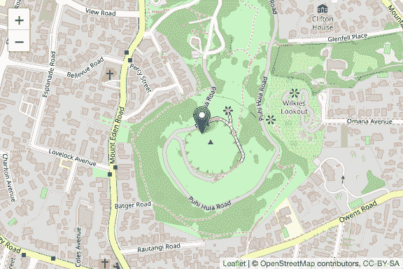
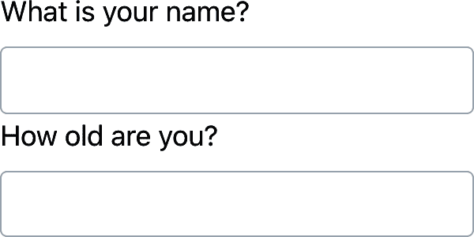

# 第二十九章：Quarto 格式

# 简介

到目前为止，您已经看到 Quarto 用于生成 HTML 文档。本章简要概述了 Quarto 可以生成的许多其他类型的输出。

有两种设置文档输出的方法：

+   永久地，通过修改 YAML 头部：

    ```
    title: "Diamond sizes"
    format: html
    ```

+   临时地，通过手动调用 `quarto::quarto_render()`：

    ```
    quarto::quarto_render("diamond-sizes.qmd", output_format = "docx")
    ```

    如果要以编程方式生成多种类型的输出，这是很有用的，因为 `output_format` 参数也可以接受一个值列表：

    ```
    quarto::quarto_render(
      "diamond-sizes.qmd", output_format = c("docx", "pdf")
    )
    ```

# 输出选项

Quarto 提供了多种输出格式。你可以在[Quarto 文档中查看所有格式](https://oreil.ly/mhYNQ)的完整列表。许多格式共享一些输出选项（例如，`toc: true`用于包含目录），但其他格式具有特定于格式的选项（例如，`code-fold: true`将代码块折叠到 HTML 输出的 `<details>` 标签中，用户可以按需显示；在 PDF 或 Word 文档中不适用）。

覦盖默认选项，需要使用扩展的 `format` 字段。例如，如果要呈现带有浮动目录的 HTML 文档，可以使用：

```
format:
  html:
    toc: true
    toc_float: true
```

通过提供格式列表，甚至可以呈现多个输出：

```
format:
  html:
    toc: true
    toc_float: true
  pdf: default
  docx: default
```

注意特殊语法（`pdf: default`），如果不想覆盖任何默认选项。

要将文档中 YAML 中指定的所有格式呈现出来，可以使用 `output_format = "all"`：

```
quarto::quarto_render("diamond-sizes.qmd", output_format = "all")
```

# 文档

前一章重点介绍了默认的 `html` 输出。有几种基本的变体，生成不同类型的文档。例如：

+   使用 LaTeX 制作 PDF（一种开源文档布局系统），您需要安装。如果尚未安装，RStudio 会提示您。

+   用于 Microsoft Word（`.docx`）文档的 `docx`。

+   用于 OpenDocument Text（`.odt`）文档的 `odt`。

+   用于 Rich Text Format（`.rtf`）文档的 `rtf`。

+   用于 GitHub Flavored Markdown（`.md`）文档的 `gfm`。

+   用于 Jupyter Notebooks（`.ipynb`）的 `ipynb`。

请记住，在生成要与决策者分享的文档时，您可以通过在文档的 YAML 中设置全局选项来关闭默认显示代码。

```
execute:
  echo: false
```

对于 HTML 文档，另一种选择是默认隐藏代码块，但可以通过点击显示：

```
format:
  html:
    code: true
```

# 演示文稿

您还可以使用 Quarto 制作演示文稿。与 Keynote 或 PowerPoint 等工具相比，您的视觉控制较少，但自动将 R 代码的结果插入演示文稿可以节省大量时间。演示文稿通过将内容分成幻灯片来工作，每个第二级标题（`##`）开始一个新幻灯片。此外，第一级标题（`#`）指示新部分的开始，具有默认情况下在中间居中的部分标题幻灯片。

Quarto 支持多种演示文稿格式，包括：

`revealjs`

使用 revealjs 制作 HTML 演示文稿

`pptx`

PowerPoint 演示文稿

`beamer`

使用 LaTeX Beamer 制作 PDF 演示文稿

您可以阅读更多关于使用 [Quarto](https://oreil.ly/Jg7T9) 创建演示文稿的信息。

# 交互性

就像任何 HTML 文档一样，使用 Quarto 创建的 HTML 文档也可以包含交互组件。这里我们介绍两种在 Quarto 文档中包含交互性的选项：htmlwidgets 和 Shiny。

## htmlwidgets

HTML 是一种交互格式，您可以利用 *htmlwidgets* 来实现交互式 HTML 可视化。例如，下面显示的 *leaflet* 地图。如果您在网页上查看此页面，可以拖动地图，放大和缩小等操作。在书籍中当然无法做到这一点，因此 Quarto 会自动为您插入静态截图。

```
library(leaflet)
leaflet() |>
  setView(174.764, -36.877, zoom = 16) |> 
  addTiles() |>
  addMarkers(174.764, -36.877, popup = "Maungawhau") 
```



htmlwidgets 的一个很棒之处在于，您不需要了解 HTML 或 JavaScript 就能使用它们。所有细节都封装在包内部，因此您无需担心这些。

有许多提供 htmlwidgets 的包，包括：

+   [dygraphs](https://oreil.ly/SE3qV) 用于交互式时间序列可视化

+   [DT](https://oreil.ly/l3tFl) 用于交互式表格

+   [threejs](https://oreil.ly/LQZud) 用于交互式 3D 绘图

+   [DiagrammeR](https://oreil.ly/gQork) 用于制作图表（如流程图和简单的节点链接图）

要了解更多关于 htmlwidgets 并查看提供它们的完整包列表，请访问 [*https://oreil.ly/lmdha*](https://oreil.ly/lmdha)。

## Shiny

htmlwidgets 提供 *客户端* 交互性——所有交互都在浏览器中完成，与 R 独立运行。这很棒，因为您可以在没有与 R 的任何连接的情况下分发 HTML 文件。但这基本上限制了您只能做那些已经在 HTML 和 JavaScript 中实现的事情。另一种方法是使用 shiny，这是一个允许您使用 R 代码创建交互性的包，而不是 JavaScript。

要从 Quarto 文档调用 Shiny 代码，请在 YAML 头部添加 `server: shiny`：

```
title: "Shiny Web App"
format: html
server: shiny
```

然后，您可以使用“input”功能向文档添加交互组件：

```
library(shiny)

textInput("name", "What is your name?")
numericInput("age", "How old are you?", NA, min = 0, max = 150)
```



您还需要一个带有选项 `context: server` 的代码块，其中包含需要在 Shiny 服务器中运行的代码。

您可以通过 `input$name` 和 `input$age` 引用值，并且每当它们更改时，使用它们的代码将自动重新运行。

我们无法在这里展示一个实时的 Shiny 应用程序，因为 Shiny 的交互发生在*服务器端*。这意味着您可以在不了解 JavaScript 的情况下编写交互式应用程序，但您需要一个服务器来运行它们。这引入了一个后勤问题：Shiny 应用程序需要 Shiny 服务器才能在线运行。当您在自己的计算机上运行 Shiny 应用程序时，Shiny 会自动为您设置一个 Shiny 服务器，但如果您想要发布此类交互性在线，您需要一个面向公众的 Shiny 服务器。这就是 Shiny 的基本权衡：您可以在 Shiny 文档中做任何在 R 中可以做的事情，但它需要有人在运行 R。

要了解更多关于 Shiny 的信息，我们建议阅读[*Mastering Shiny*](https://oreil.ly/4Id6V)，由 Hadley Wickham 撰写。

# 网站和书籍

借助一些额外的基础设施，您可以使用 Quarto 生成一个完整的网站或书籍：

+   将您的`.qmd`文件放在一个单独的目录中。`index.qmd`将成为主页。

+   添加一个名为`_quarto.yml`的 YAML 文件，为网站提供导航。在此文件中，将`project`类型设置为`book`或`website`，例如：

    ```
    project:
      type: book
    ```

例如，以下`_quarto.yml`文件从三个源文件创建一个网站：`index.qmd`（主页）、`viridis-colors.qmd`和`terrain-colors.qmd`。

```
project:
  type: website

website:
  title: "A website on color scales"
  navbar:
    left:
      - href: index.qmd
        text: Home
      - href: viridis-colors.qmd
        text: Viridis colors
      - href: terrain-colors.qmd
        text: Terrain colors
```

你需要为书籍准备的`_quarto.yml`文件结构类似。下面的示例展示了如何创建一个包含四章的书籍，可以渲染为三种不同的输出（`html`，`pdf`和`epub`）。再次强调，源文件是`.qmd`文件。

```
project:
  type: book

book:
  title: "A book on color scales"
  author: "Jane Coloriste"
  chapters:
    - index.qmd
    - intro.qmd
    - viridis-colors.qmd
    - terrain-colors.qmd

format:
  html:
    theme: cosmo
  pdf: default
  epub: default
```

我们建议您为您的网站和书籍使用 RStudio 项目。基于`_quarto.yml`文件，RStudio 将识别您正在处理的项目类型，并添加一个“Build”选项卡到 IDE，您可以使用它来渲染和预览您的网站和书籍。网站和书籍也可以使用`quarto::render()`来渲染。

了解更多关于[Quarto 网站](https://oreil.ly/P-n37)和[书籍](https://oreil.ly/fiB1h)的信息。

# 其他格式

Quarto 提供了更多的输出格式：

+   您可以使用[Quarto Journal Templates](https://oreil.ly/ovWgb)来撰写期刊文章。

+   您可以使用[`format: ipynb`](https://oreil.ly/q-E7l)将 Quarto 文档输出为 Jupyter 笔记本。

查看[Quarto 格式文档](https://oreil.ly/-iGxF)以获取更多格式的列表。

# 总结

在本章中，我们为您介绍了使用 Quarto 与外界交流结果的多种选择，从静态和交互式文档到演示文稿、网站和书籍。

要了解这些不同格式中的有效沟通更多信息，我们推荐以下资源：

+   要提高您的演讲技能，尝试[*Presentation Patterns*](https://oreil.ly/JnOwJ)，由 Neal Ford、Matthew McCollough 和 Nathaniel Schutta 撰写。它提供了一组有效的模式（低级和高级），可供您应用于改进您的演示文稿。

+   如果您进行学术演讲，您可能会喜欢[“The Leek group guide to giving talks”](https://oreil.ly/ST4yc)。

+   我们自己并没有参加过，但我们听说过 Matt McGarrity 关于[公众演讲](https://oreil.ly/lXY9u)的在线课程很受好评。

+   如果你正在创建许多仪表板，请务必阅读斯蒂芬·费的*《信息仪表板设计：有效的视觉数据沟通》*（O’Reilly 出版社）。它将帮助你创建真正有用的仪表板，而不仅仅是好看的外表。

+   有效地传达你的思想通常受益于一些关于图形设计的知识。罗宾·威廉姆斯的*《非设计师的设计书》*（Peachpit 出版社）是一个很好的入门书籍。
