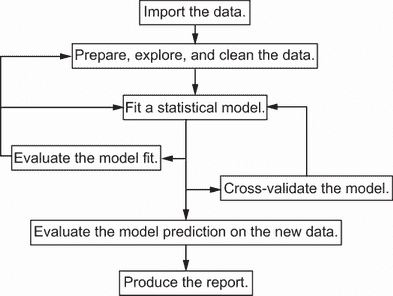
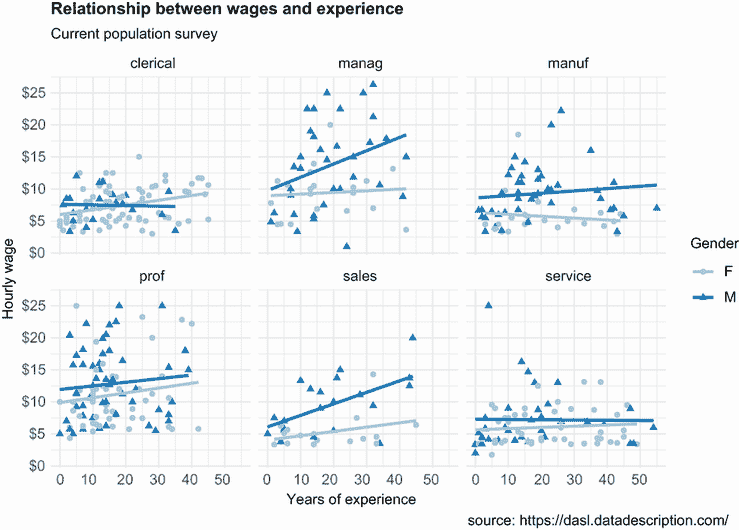
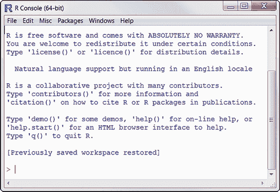
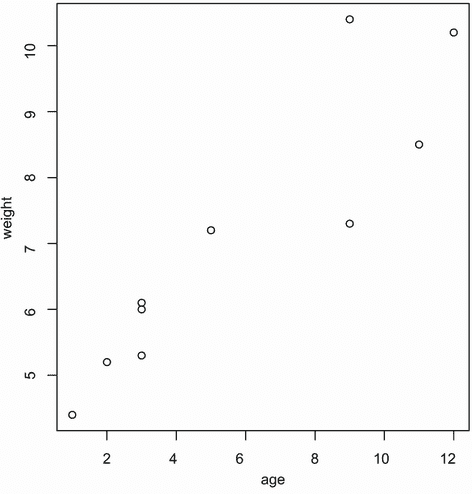
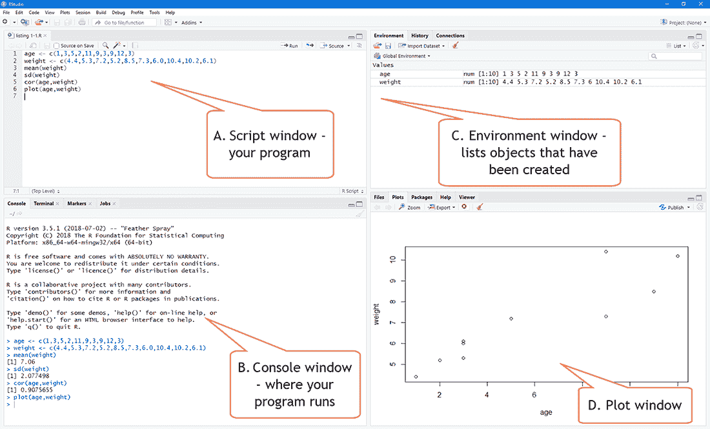
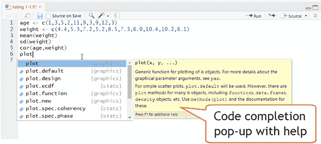
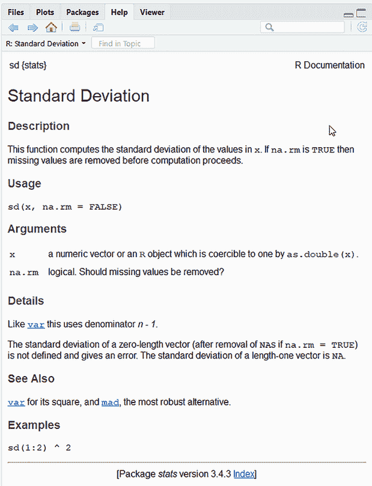
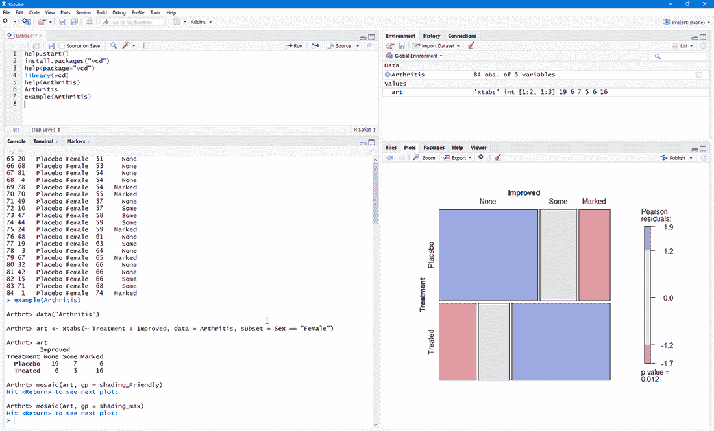

# 1 R 简介

本章涵盖

+   安装 R 和 RStudio

+   理解 R 语言

+   运行程序

近年来，我们分析数据的方式发生了巨大的变化。随着个人电脑和互联网的出现，我们可用的数据量急剧增长。公司拥有与消费者互动的数 TB 数据，政府、学术和私人研究机构在各个研究主题上都有广泛的存档和调查数据。从这些庞大的数据存储中获取信息（更不用说智慧）已经成为一个行业。同时，以易于访问和易于消化的方式呈现信息变得越来越具有挑战性。

数据分析的科学（统计学、心理测量学、计量经济学和机器学习）与数据的爆炸性增长保持了同步。在个人电脑和互联网出现之前，学术研究人员开发了新的统计方法，并将它们作为理论论文发表在专业期刊上。程序员可能需要数年才能适应这些方法，并将它们纳入广泛可用的统计软件包中。现在，新的方法每天都在出现。统计研究人员在易于访问的网站上发布新的和改进的方法，以及产生它们的代码。

个人电脑的出现对我们分析数据的方式产生了另一种影响。当在大型机上进行数据分析时，计算机时间宝贵且难以获得。分析师们会仔细设置计算机运行，包括他们认为可能需要的所有参数和选项。该程序产生的输出可能长达数十或数百页。分析师会筛选这些输出，提取有用材料并丢弃其余部分。许多流行的统计软件包（如 SAS 和 SPSS）最初是在这个时期开发的，并且在某种程度上仍然遵循这种方法。

由于个人电脑提供的廉价和便捷的访问，现代数据分析的模式已经发生了转变。而不是一次性设置完整的数据分析，这个过程已经变得高度交互式，每个阶段的输出都作为下一阶段的输入。图 1.1 显示了典型的分析。在任何时候，循环可能包括转换数据、填补缺失值、添加或删除变量、拟合统计模型，并再次通过整个流程。当分析师认为他们已经深入理解了数据并回答了所有可以回答的相关问题时，这个过程才会停止。



图 1.1 典型数据分析步骤

个人电脑（尤其是高分辨率显示器的可用性）的出现也影响了结果的理解和展示方式。一张图片确实可以胜过千言万语，人类擅长从视觉展示中提取有用信息。现代数据分析越来越多地依赖于图形展示来揭示意义和传达结果。

数据分析师现在需要从广泛的数据源（数据库管理系统、文本文件、统计软件包、电子表格和网页）中获取数据，合并数据片段，清洗和注释它们，使用最新的方法进行分析，以有意义和图形吸引人的方式展示结果，并将结果纳入吸引人的报告中，以便分发给利益相关者和公众。正如你将在本章中看到的，R 是一个综合性的软件包，非常适合实现这些目标。

## 1.1 为什么使用 R？

R 是一种用于统计计算和图形的语言和环境，类似于最初在贝尔实验室开发的 S 语言。它是一个开源的数据分析解决方案，得到了一个庞大且活跃的全球研究社区的支撑。但许多流行的统计和绘图软件包也都可以使用（例如 Microsoft Excel、SAS、IBM SPSS、Stata 和 Minitab）。为什么选择 R？

R 有许多值得推荐的特点：

+   大多数商业统计软件平台的价格是数千美元，如果不是数万美元。R 是免费的！如果你是教师或学生，这些好处是显而易见的。

+   R 是一个全面的统计平台，提供了各种数据分析技术。几乎任何类型的数据分析都可以在 R 中完成。

+   R 包含了其他软件包中尚未提供的先进统计程序。实际上，每周都会有新的方法可供下载。如果你是 SAS 用户，想象一下每隔几天就有一个新的 SAS PROC。

+   R 拥有最先进的图形功能。如果你想可视化复杂的数据，R 拥有最全面和强大的功能集。

+   R 是一个强大的交互式数据分析和平滑探索的平台。从其诞生之初，它就被设计来支持图 1.1 中概述的方法。例如，任何分析步骤的结果都可以轻松保存、操作，并用作其他分析的输入。

+   从多个来源获取可用的数据可能具有挑战性。R 可以轻松地从各种来源导入数据，包括文本文件、数据库管理系统、统计软件包和专门的数据存储。它还可以将这些系统中的数据写出来。R 还可以直接从网页、社交媒体网站和广泛的在线数据服务中访问数据。

+   R 提供了一个无与伦比的编程新统计方法的平台，方式简单直接。它易于扩展，并提供了一种自然语言，可以快速编程最近发表的方法。

+   R 的功能可以集成到用其他语言编写的应用程序中，包括 C++、Java、Python、PHP、Pentaho、SAS 和 SPSS。这允许你在熟悉的语言中继续工作，同时将 R 的功能添加到你的应用程序中。

+   R 可以在包括 Windows、Unix 和 macOS 在内的多种平台上运行。它很可能在你的任何一台电脑上都能运行。（我甚至见过安装 R 在 iPhone 上的指南，这很令人印象深刻，但可能不是一个好主意。）

+   如果你不想学习一门新语言，有许多图形用户界面（GUIs）可供选择，它们通过菜单和对话框提供 R 的强大功能。

你可以在图 1.2 中看到 R 的图形功能示例。这张图描述了六个行业中男性和女性工作经验与工资之间的关系，数据来自 1985 年的美国人口普查。从技术上讲，这是一个散点矩阵图，性别通过颜色和符号来表示。趋势是通过线性回归线来描述的。如果你对“散点图”和“回归线”这些术语不熟悉，不要担心。我们将在后面的章节中介绍它们。



图 1.2 六个行业中男性和女性工资与工作经验之间的关系。这样的图表可以用 R 中几行代码轻松创建（使用`mosaicData`包创建的图表）。

从这张图中可以得出的更有趣的发现是

+   经验与工资之间的关系因性别和行业而异。

+   在服务业，无论是男性还是女性，工资似乎并不随着经验的增加而提高。

+   在管理职位上，男性的工资往往随着经验的增加而提高，但女性的工资则不然。

这些差异是真实的，还是可以解释为随机抽样变异？我们将在第八章中进一步讨论这个问题。重要的是，R 允许你以简单直接的方式创建优雅、信息丰富、高度定制的图表。在其他统计语言中创建类似的图表可能会很困难、耗时或不可能。

不幸的是，R 的学习曲线可能很陡峭。因为它可以做很多事情，所以文档和帮助文件非常庞大。此外，由于许多功能来自独立贡献者创建的可选模块，这些文档可能分散且难以找到。实际上，掌握 R 能做什么是一项挑战。

这本书的目标是让访问 R 变得快速和简单。我们将浏览 R 的许多功能，涵盖足够的材料来帮助你开始数据处理，并提供当你需要学习更多时去哪里学习的指南。让我们从安装程序开始吧。

## 1.2 获取和安装 R

R 可从综合 R 存档网络（CRAN）免费获得，网址为 [`cran.r-project.org`](https://cran.r-project.org)。预编译的二进制文件适用于 Linux、macOS 和 Windows。请按照你选择平台上的安装说明安装基本产品。稍后，我们将讨论通过可选模块（也称为包）添加功能，这些包也来自 CRAN。

## 1.3 使用 R

R 是一个区分大小写的解释型语言。你可以在命令提示符（`>`）中逐个输入命令，或者从一个源文件中运行一组命令。它有各种各样的数据类型，包括向量、矩阵、数据框（类似于数据集）和列表（对象的集合）。我将在第二章中讨论这些数据类型。

大多数功能都是通过内置和用户创建的函数以及对象的创建和操作来提供的。一个 *对象* 基本上是可以赋予值的任何东西。对于 R 来说，这几乎包括一切（数据、函数、图表、分析结果等等）。每个对象都有一个 *类属性*（基本上是一个或多个相关的文本描述符），它告诉 R 如何打印、绘图、总结或以其他方式操作该对象。

在交互式会话期间，所有对象都保存在内存中。基本函数默认可用。其他函数包含在可以按需附加到当前会话的包中。

语句由函数和赋值组成。R 使用 `<-` 符号进行赋值，而不是典型的 `=` 符号。例如，以下语句

```
x <- rnorm(5)
```

创建一个名为 `x` 的向量对象，其中包含来自标准正态分布的五个随机偏差值。

注意 R 允许使用 `=` 符号进行对象赋值。尽管如此，你不会发现很多程序是这样编写的，因为这不是标准语法，在某些情况下可能无法工作，而且 R 程序员会取笑你。你还可以反转赋值方向。例如，`rnorm(5)` `->` `x` 等同于前面的语句。再次强调，这样做并不常见，本书也不推荐这样做。

注释以 `#` 符号开头。R 解释器会忽略 `#` 符号后面的任何文本。一个示例程序在第 1.3.1 节中给出。

### 1.3.1 开始使用

使用 R 的第一步当然是安装它。安装说明可在 CRAN 上找到。一旦安装了 R，启动它。如果你使用 Windows，可以从开始菜单启动 R。在 Mac 上，双击应用程序文件夹中的 R 图标。在 Linux 上，在终端窗口的命令提示符中输入 `R`。这些操作中的任何一个都会启动 R 界面（见图 1.3 中的示例）。



图 1.3 Windows 上 R 界面的示例

为了了解界面，让我们通过一个简单的例子来操作。假设你正在研究身体发展，并且你已经收集了 10 个婴儿的年龄和体重

他们生命中的第一年（见表 1.1）。你感兴趣的是体重的分布及其与年龄的关系。

表 1.1 10 名婴儿的年龄和体重

| 年龄（月） | 体重（kg） |
| --- | --- |
| 01 | 4.4 |
| 03 | 5.3 |
| 05 | 7.2 |
| 02 | 5.2 |
| 11 | 8.5 |
| 09 | 7.3 |
| 03 | 6.0 |
| 09 | 10.4 |
| 12 | 10.2 |
| 03 | 6.1 |
| 注意：这些数据是虚构的。 |

列表 1.1 展示了分析。年龄和体重数据使用函数 `c()` 作为向量输入，该函数将其参数组合成一个向量或列表。体重的平均值和标准差，以及年龄和体重之间的相关性，分别由函数 `mean()`、`sd()` 和 `cor()` 提供。最后，使用 `plot()` 函数将年龄与体重绘制在一起，允许你直观地检查趋势。`q()` 函数结束会话并允许你退出。

列表 1.1 一个示例 R 会话

```
> age <- c(1,3,5,2,11,9,3,9,12,3)
> weight <- c(4.4,5.3,7.2,5.2,8.5,7.3,6.0,10.4,10.2,6.1)
> mean(weight)
[1] 7.06
> sd(weight)
[1] 2.077498
> cor(age,weight)
[1] 0.9075655
> plot(age,weight)
```

从列表 1.1 可以看出，这 10 名婴儿的平均体重为 7.06 千克，标准差为 2.08 千克，年龄（以月为单位）和体重（以千克为单位）之间存在强烈的线性关系（相关系数 = 0.91）。这种关系也可以在图 1.4 的散点图中看到。不出所料，随着婴儿的成长，他们往往会变得更重。



图 1.4 婴儿体重（kg）与年龄（月）的散点图

图 1.4 中的散点图很有信息量，但有些实用且不够吸引人。在后面的章节中，你将了解到如何创建更吸引人和复杂的图表。

提示：为了了解 R 在图形方面的能力，请参阅《使用 R 进行数据可视化》（[`rkabacoff.github.io/datavis`](http://rkabacoff.github.io/datavis)）和《Top 50 ggplot2 可视化 – 主列表》（[`r-statistics.co/Top50-Ggplot2-Visualizations-MasterList-R-Code.html`](http://r-statistics.co/Top50-Ggplot2-Visualizations-MasterList-R-Code.html)）中描述的图表。

### 1.3.2 使用 RStudio

R 的标准接口非常基础，仅提供用于输入代码行的命令提示符。对于实际项目，你可能需要一个更全面的工具来编写代码和查看输出。为 R 开发了几个这样的工具，称为集成开发环境（IDE），包括带有 StatET 的 Eclipse、R 的 Visual Studio 和 RStudio 桌面版。

RStudio 桌面版（[`www.rstudio.com`](https://www.rstudio.com)）无疑是最受欢迎的选择。它提供了一个多窗口、多标签的环境，包括导入数据、编写整洁代码、调试错误、可视化输出和编写报告的工具。

RStudio 作为开源产品免费提供，并且可以轻松安装在 Windows、Mac 和 Linux 上。由于 RStudio 是 R 的接口，因此在安装 RStudio 桌面版之前，请确保已安装 R。

TIP 您可以通过从菜单栏中选择工具>全局选项...来自定义 RStudio 界面。在常规选项卡中，我建议取消选中启动时恢复 .RData 到工作区，并将保存工作区到 .RData 设置为永不。这将确保每次运行 RStudio 时都有一个干净的启动。

让我们使用 RStudio 重新运行列表 1.1 中的代码。如果您使用的是 Windows，请从开始菜单启动 RStudio。在 Mac 上，双击应用程序文件夹中的 RStudio 图标。在 Linux 上，在终端窗口的命令提示符中输入 `rstudio`。这三个平台都将显示相同的界面（见图 1.5）。



图 1.5 RStudio 桌面

脚本窗口

从文件菜单中选择新建文件> R 脚本。一个新的脚本窗口将在屏幕的右上角打开（见图 1.5 A）。将列表 1.1 中的代码输入到这个窗口中。

当您键入时，编辑器提供语法高亮和代码补全（见图 1.6）。例如，当您键入 `plot` 时，将出现一个弹出窗口，显示所有以您已键入的字母开头的函数。您可以使用上箭头和下箭头键从列表中选择一个函数，并按 Tab 键选择它。在函数（括号内）中按 Tab 键查看函数选项。在引号内按 Tab 键完成文件路径。



图 1.6 脚本窗口

要执行代码，请突出显示/选择它并点击运行按钮或按 Ctrl+Enter。按 Ctrl+Shift+Enter 将运行整个脚本。

要保存脚本，请按保存图标或从菜单栏中选择文件>保存。从打开的对话框中选择名称和位置。按照惯例，脚本文件以 .R 扩展名结尾。如果当前版本尚未保存，脚本文件名将以红色带星号的形式出现在窗口选项卡中。

控制台窗口

代码在控制台窗口中运行（见图 1.5 B）。这基本上与您使用基本 R 界面时看到的控制台相同。您可以使用运行命令从脚本窗口提交代码，或者直接在此窗口的命令提示符（>）中输入交互式命令。

如果命令提示符变为加号（+），则解释器正在等待一个完整的语句。如果语句太长而无法在一行中显示，或者代码中有不匹配的括号，这通常会发生。按 Esc 键可以返回到命令提示符。

此外，按上箭头和下箭头键将循环显示过去的命令。您可以使用 Enter 键编辑一个命令并重新提交它。点击扫帚图标将清除窗口中的文本。

环境和历史窗口

创建的任何对象（例如，本例中的 `age` 和 `weight`）将出现在环境窗口中（见图 1.5 C）。执行命令的记录将被保存在历史窗口中（环境选项卡右侧）。

绘图窗口

从脚本中创建的任何图表都将出现在图表窗口中（图 1.5 D）。此窗口的工具栏允许您在已创建的图表之间切换。此外，您还可以打开缩放窗口以查看不同大小的图表，以多种格式导出图表，以及删除您迄今为止创建的一个或所有图表。

### 1.3.3 获取帮助

R 提供了广泛的帮助功能，学会如何导航这些功能将大大有助于您的编程工作。内置的帮助系统提供了当前已安装包中任何函数的详细信息、参考和示例。您可以通过执行表 1.2 中列出的任何函数来获取帮助。

帮助信息也通过 RStudio 界面提供。在脚本窗口中，将光标放在函数名上并按 F1 键可打开帮助窗口。

表 1.2 R 帮助函数

| 函数 | 操作 |
| --- | --- |
| `help.start()` | 通用帮助 |
| `help("*foo*")` 或 `?*foo*` | 关于函数 `foo` 的帮助 |
| `help(package = "*foo*")` | 帮助信息，关于名为 `foo` 的包 |
| `help.search("*foo*")` 或 `??*foo*` | 在帮助系统中搜索字符串 `foo` 的实例 |
| `example("*foo*")` | 函数 `foo` 的示例（引号可选） |
| `data()` | 列出当前已加载包中包含的所有可用示例数据集 |
| `vignette()` | 列出当前已安装包中所有可用的 vignette |
| `vignette("*foo*")` | 显示特定于主题 `foo` 的 vignette |

函数 `help.start()` 打开一个浏览器窗口，可以访问入门和高级手册、常见问题解答和参考材料。或者，从菜单中选择帮助 > R 帮助。`vignette()` 函数返回的 vignette 是以 PDF 或 HTML 格式提供的实用入门文章。并非所有包都有 vignette。

所有帮助文件都有类似的格式（见图 1.7）。帮助页面包含标题和简要描述，随后是函数的语法和选项。计算细节在“详细信息”部分提供。在“相关内容”部分描述并链接到相关函数。帮助页面几乎总是以说明函数典型用法的示例结束。



图 1.7 帮助窗口

如您所见，学会如何导航 R 的广泛帮助功能无疑将有助于您的编程工作。我很少不使用 `?` 来查找某些函数的功能（如选项或返回值）。

### 1.3.4 工作空间

工作空间是当前 R 工作环境，包括任何用户定义的对象（向量、矩阵、函数、数据框和列表）。当前工作目录是 R 将从中读取文件并将结果默认保存到的目录。你可以使用`getwd()`函数来识别当前工作目录。你可以使用`setwd()`函数来设置当前工作目录。如果你需要输入不在当前工作目录中的文件，请在调用中使用完整的路径名。始终用引号括起来自操作系统的文件和目录名称。表 1.3 列出了一些管理工作空间的标准命令。

表 1.3 管理 R 工作空间的函数

| 函数 | 操作 |
| --- | --- |
| `getwd()` | 列出当前工作目录 |
| `setwd("*mydirectory*")` | 将当前工作目录更改为 *`mydirectory`* |
| `ls()` | 列出当前工作空间中的对象 |
| `rm(*objectlist*)` | 删除（删除）一个或多个对象 |
| `help(*options*)` | 提供有关可用选项的信息 |
| `options()` | 允许你查看或设置当前选项 |
| `save.image("*myfile*")` | 将工作空间保存到 *`myfile`*（默认 = .RData） |
| `save(*objectlist*, file="*myfile*")` | 将特定对象保存到文件 |
| `load("*myfile*")` | 将工作空间加载到当前会话 |

要查看这些命令的实际效果，请查看以下列表。

列表 1.2 管理 R 工作空间所使用的命令示例

```
setwd("C:/myprojects/project1")
options()                                 
options(digits=3)                         
```

首先，将当前工作目录设置为 C:/myprojects/project1\. 然后，显示当前选项设置，数字格式化为小数点后三位打印。

注意`setwd()`命令路径名中的正斜杠。R 将反斜杠（\）视为转义字符。即使你在 Windows 平台上使用 R，也应在路径名中使用正斜杠。此外，请注意`setwd()`函数不会创建不存在的目录。如果需要，你可以使用`dir.create()`函数创建目录，然后使用`setwd()`更改到其位置。

### 1.3.5 项目

将你的项目保存在单独的目录中是个好主意。RStudio 为此提供了一个简单的机制。选择文件 > 新建项目 ... 并指定新建目录以在全新的工作目录中开始一个项目，或者选择现有目录以将项目与现有工作目录关联。你所有的程序文件、命令历史、报告输出、图表和数据都将保存在项目目录中。你可以通过使用 RStudio 应用右上角的“项目”下拉菜单轻松地在项目之间切换。

项目文件很容易让人感到不知所措。我建议在主项目文件夹内创建几个子文件夹。我通常创建一个 *data* 文件夹来存放原始数据文件，一个 *img* 文件夹用于图像文件和图形输出，一个 *docs* 文件夹用于项目文档，以及一个 *reports* 文件夹用于报告。我将 R 脚本和 README 文件放在主目录中。如果 R 脚本有顺序，我会给它们编号（例如，01_import_data.R、02_clean_data.R 等）。README 是一个包含作者、日期、利益相关者和他们的联系方式以及项目目的的文本文件。六个月之后，这将提醒我我做了什么以及为什么这么做。

## 1.4 软件包

R 默认就提供了广泛的功能，但其中一些最令人兴奋的功能作为可选模块提供，你可以下载并安装它们。有超过 10,000 个用户贡献的模块，称为 *软件包*，你可以从 [`cran.r-project.org/web/packages`](http://cran.r-project.org/web/packages) 下载。它们提供了极其广泛的新功能，从地理空间数据分析到蛋白质质量光谱处理，再到心理测试分析！你将在本书中使用许多这些可选软件包。

一组被称为 *tidyverse* 的软件包集合特别值得关注。这是一个相对较新的集合，它提供了一种简明、一致且直观的数据操作和分析方法。tidyverse 软件包（如 *tidyr*、*dplyr*、*lubridate*、*stringr* 和 *ggplot2*）提供的优势正在改变数据科学家在 R 中编写代码的方式，我们将会经常使用这些软件包。实际上，描述如何使用这些软件包进行数据分析和可视化的机会是撰写本书第三版的主要动机。

### 1.4.1 什么是软件包？

软件包是一组以良好定义的格式组织的 R 函数、数据和编译代码。存储软件包的计算机目录称为 *库*。函数 `.libPaths()` 会显示你的库在哪里，而函数 `library()` 会显示你已保存到库中的软件包。

R 默认提供了一套标准软件包（包括 `base`、`datasets`、`utils`、`gr-Devices`、`graphics`、`stats` 和 `methods`）。它们提供了广泛的功能和默认可用的数据集。其他软件包可供下载和安装。一旦安装，它们必须被加载到会话中才能使用。命令 `search()` 会告诉你哪些软件包已加载并准备好使用。

### 1.4.2 安装软件包

几个 R 函数允许你操作软件包。要首次安装软件包，使用 `install.packages()` 命令。例如，`gclus` 软件包包含用于创建增强散点图的函数。你可以使用命令 `install.packages("gclus")` 下载并安装该软件包。

你只需要安装一次包。但像任何软件一样，包通常会被其作者更新。使用`update.packages()`命令更新你已安装的任何包。要查看你的包的详细信息，你可以使用`installed.packages()`命令。它列出了你拥有的包，包括它们的版本号、依赖关系和其他信息。

你也可以使用 RStudio 界面安装和更新包。选择“包”选项卡（从右下角的窗口）。在上右角的选项卡窗口中的搜索框中输入名称（或部分名称）。在要安装的包旁边放置勾选标记，然后点击安装按钮。或者，点击更新按钮来更新已安装的包。

### 1.4.3 加载包

安装包会从 CRAN 镜像站点下载它并将其放置在你的库中。要在 R 会话中使用它，你需要使用`library()`命令来加载包。例如，要使用`gclus`包，输入命令`library(gclus)`。

当然，在加载包之前，你必须已经安装了它。在给定会话中，你只需要加载一次包。如果你愿意，你可以自定义启动环境，以便自动加载你最常用的包。附录 B 解释了如何自定义启动。

### 1.4.4 了解包

当你加载一个包时，一组新的函数和数据集变得可用。提供了小型示例数据集和示例代码，让你可以尝试新功能。帮助系统包含每个函数的描述（包括示例）以及包含的每个数据集的信息。输入`help(package="package_name")`会提供包的简要描述以及包含的函数和数据集索引。使用`help()`加上任何这些函数或数据集的名称可以提供更多详细信息。相同的信息可以从 CRAN 下载为 PDF 手册。要使用 RStudio 界面获取包的帮助，请点击“包”选项卡（右下角的窗口），在搜索窗口中输入包的名称，然后点击包的名称。

R 编程中的常见错误

初学者和经验丰富的 R 程序员经常犯一些常见的错误。如果你的程序生成错误，请务必检查以下内容：

+   使用错误的字母大小写——`help()`, `Help()`, 和 `HELP()` 是三个不同的函数（只有第一个会起作用）。

+   忘记在需要时使用引号——`install.packages("gclus")` 是有效的，而 `install.packages(gclus)` 会生成错误。

+   在函数调用中忘记包含括号——例如，`help()` 是有效的，但 `help` 则不行。即使没有选项，你仍然需要括号。

+   在 Windows 的路径名中使用反斜杠（\）——R 将反斜杠字符视为转义字符。`setwd("c:\mydata")` 会生成错误。请使用 `setwd("c:/mydata")` 或 `setwd("c:\\mydata")` 代替。

+   使用未加载的包中的函数——函数 `order .clusters()` 包含在 `gclus` 包中。如果你在加载包之前尝试使用它，你会得到一个错误。

R 中的错误消息可能难以理解，但如果你注意以下几点，你应该可以避免看到很多错误。

## 1.5 将输出作为输入：重用结果

R 最有用的设计特性之一是分析输出可以轻松保存并用作其他分析的输入。让我们通过一个例子来了解一下，使用 R 预先安装的数据集之一。如果你不理解涉及的统计，不要担心。我们在这里关注的是一般原则。

R 随带了许多内置数据集，可用于练习数据分析。其中一个名为 `mtcars` 的数据集包含了从 *Motor Trend* 杂志道路测试收集的 32 辆汽车的信息。假设我们感兴趣的是描述汽车的燃油效率与重量之间的关系。

首先，我们可以运行一个简单的线性回归，预测每加仑英里数（`mpg`）与汽车重量（`wt`）之间的关系。这是通过以下函数调用实现的：

```
lm(mpg~wt, data=mtcars)
```

结果显示在屏幕上，并且没有保存任何信息。

或者，运行回归，但将结果存储在对象中：

```
lmfit <- lm(mpg~wt, data=mtcars) 
```

赋值创建了一个名为 `lmfit` 的列表对象，其中包含分析的大量信息（包括预测值、残差、回归系数等）。尽管没有输出到屏幕，但结果可以显示并进一步操作。

输入 `summary(lmfit)` 会显示结果摘要，而 `plot(lmfit)` 会生成诊断图。语句 `cook<-cooks.distance(lmfit)` 生成并存储影响统计量，而 `plot(cook)` 则将它们绘制成图。要从新数据集中的汽车重量预测每加仑英里数，你会使用 `predict(lmfit, mynewdata)`。

要查看函数返回的内容，请查看该函数的 R 帮助页面的值部分。这里你会查看 `help(lm)` 或 `?lm`。这会告诉你当你将函数的结果赋给对象时，保存了什么信息。

## 1.6 与大数据集一起工作

程序员经常问我 R 是否可以处理大数据问题。通常，他们处理来自网络研究、气候学或遗传学的海量数据。由于 R 在内存中存储对象，你通常受限于可用的 RAM 量。例如，在我的 9 年老 Windows PC 上，它有 2 GB 的 RAM，我可以轻松处理包含 1000 万个元素（100 个变量和 10 万个观测值）的数据集。在 4 GB RAM 的 iMac 上，我通常可以轻松处理 1 亿个元素。

但有两个问题需要考虑：数据集的大小和将要应用的统计方法。R 可以处理从千兆到太字节范围的数据分析问题，但需要专门的程序。附录 F 讨论了非常大数据集的管理和分析。

## 1.7 通过示例进行工作

我们将以一个示例结束本章，该示例将许多这些想法联系起来。这里是任务：

1.  打开一般帮助并查看 R 简介部分。

1.  安装 `vcd` 包（一个用于可视化分类数据的包，你将在第十一章中使用）。

1.  列出此包中可用的函数和数据集。

1.  加载包并阅读数据集 `Arthritis` 的描述。

1.  打印出 `Arthritis` 数据集（输入对象名称将列出它）。

1.  运行随 `Arthritis` 数据集提供的示例。如果你不理解结果，不用担心；它基本上显示接受治疗的关节炎患者改善程度远大于接受安慰剂的患者。

所需的代码在以下列表中提供，结果样本显示在图 1.8 中。正如这个简短练习所展示的，你可以用很少的代码完成很多事情。

列表 1.3 使用新包

```
help.start()
install.packages("vcd")
help(package="vcd")
library(vcd)
help(Arthritis)
Arthritis
example(Arthritis)
```



图 1.8 执行列表 1.3 中的代码时的 RStudio 窗口

在本章中，我们探讨了使 R 成为试图理解其数据含义的学生、研究人员、统计学家和数据分析师有吸引力的选择的一些优势。我们介绍了程序的安装，并讨论了如何通过下载额外的包来增强 R 的功能。我们探索了基本界面并制作了一些简单的图表。由于 R 可以是一个复杂的程序，我们花了些时间来看如何访问广泛可用的帮助。希望你能感受到这款免费软件的强大之处。

现在，你已经安装并运行了 R 和 RStudio，是时候将你的数据添加进来了。在下一章中，我们将探讨 R 可以处理的数据类型以及如何从文本文件、其他程序和数据库管理系统导入它们。

## 摘要

+   R 提供了一个全面、高度交互的环境，用于分析和可视化数据。

+   RStudio 是一个集成开发环境，它使 R 编程更容易、更高效。

+   包是免费的可添加模块，可以极大地扩展 R 平台的功能。

+   R 有一个广泛的支持系统，学习如何使用它将极大地促进你有效编程的能力。
