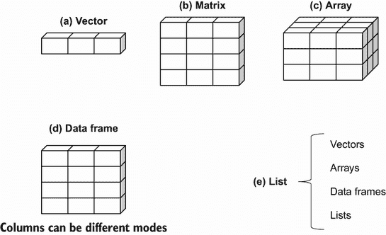
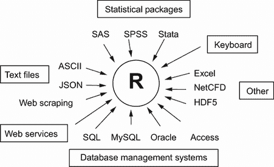
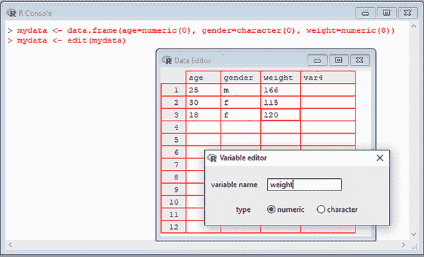
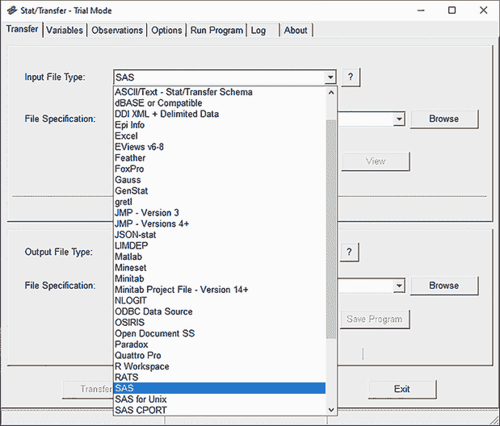

# 2 创建数据集

本章涵盖

+   探索 R 数据结构

+   使用数据输入

+   导入数据

+   数据集标注

任何数据分析的第一步是创建一个包含所需研究信息的数据集，并以满足您需求的形式组织。在 R 中，这项任务涉及

+   选择用于存储数据的数据结构

+   将数据输入或导入到数据结构中

本章的 2.1 和 2.2 节描述了 R 可以用来存储数据的丰富结构。特别是，2.2 节描述了向量、因子、矩阵、数据框、列表和 tibbles。熟悉这些结构（以及用于访问其中元素的符号）将极大地帮助您理解 R 的工作原理。您可能需要花时间仔细研究这一节。

第 2.3 节涵盖了将数据导入 R 的许多方法。数据可以手动输入或从外部来源导入。这些数据源可以包括文本文件、电子表格、统计软件包和数据库管理系统。例如，我处理的数据通常以逗号分隔的文本文件或 Excel 电子表格的形式出现。不过，有时我也会收到 SAS 和 SPSS 数据集或通过连接 SQL 数据库的数据。你很可能只需要使用本节中描述的方法中的一两种，因此请随意选择适合您情况的方法。

创建数据集后，您通常会对其进行标注，为变量和变量代码添加描述性标签。本章的 2.4 节探讨了数据集的标注，而 2.5 节回顾了一些用于处理数据集的有用函数。让我们从基础知识开始。

## 2.1 理解数据集

数据集通常是一个矩形数组，行代表观测值，列代表变量。表 2.1 提供了一个假设的患者数据集示例。

表 2.1 患者数据集

| PatientID | AdmDate | Age | Diabetes | Status |
| --- | --- | --- | --- | --- |
| 1 | 10/15/2018 | 25 | Type1 | Poor |
| 2 | 11/01/2018 | 34 | Type2 | Improved |
| 3 | 10/21/2018 | 28 | Type1 | Excellent |
| 4 | 10/28/2018 | 52 | Type1 | Poor |

不同的传统对数据集的行和列有不同的称呼。统计学家称它们为观测值和变量，数据库分析师称它们为记录和字段，而数据挖掘和机器学习领域的专家称它们为示例和属性。我在本书中使用了 *观测值* 和 *变量* 这两个术语。

您可以区分数据集的结构（在这种情况下，一个矩形数组）和包含的内容或数据类型。在表 2.1 所示的数据集中，`PatientID` 是行或案例标识符，`AdmDate` 是日期变量，`Age` 是连续（定量）变量，`Diabetes` 是名义变量，而 `Status` 是有序变量。名义变量和有序变量都是分类变量，但有序变量中的类别具有自然顺序。

R 拥有多种用于存储数据的结构，包括标量、向量、数组、数据框和列表。表 2.1 对应于 R 中的数据框。这种结构的多样性为 R 语言在处理数据方面提供了很大的灵活性。

R 可以处理的数据类型包括数值、字符、逻辑（`TRUE`/`FALSE`）、复数（虚数）和原始（字节）。在 R 中，`PatientID`、`AdmDate`和`Age`是数值变量，而`Diabetes`和`Status`是字符变量。此外，您需要告诉 R `PatientID`是一个案例标识符，`AdmDate`包含日期，以及`Diabetes`和`Status`分别是名义变量和有序变量。R 将案例标识符称为`rownames`，将分类变量（名义、有序）称为`factors`。我们将在下一节中介绍这些内容。您将在第三章中了解日期。

## 2.2 数据结构

R 拥有多种用于存储数据的对象，包括标量、向量、矩阵、数组、数据框和列表。它们在可以存储的数据类型、创建方式、结构复杂性和用于标识和访问单个元素的符号方面有所不同。图 2.1 显示了这些数据结构的图解。让我们依次查看每个结构，从向量开始。



图 2.1 R 数据结构

一些定义

一些术语是 R 特有的，因此对新用户来说可能会感到困惑。

在 R 中，任何可以分配给变量的东西都是对象。这包括常量、数据结构、函数，甚至是图表。对象有一个模式（描述对象如何存储）和一个*类*（告诉通用函数如`print`如何处理它）。

R 中的数据框是一种结构，用于存储数据，类似于标准统计软件包（例如 SAS、SPSS 和 Stata）中找到的数据集。列是变量，行是观测值。你可以在同一个数据框中拥有不同类型的变量（例如，数值或字符）。数据框是您存储数据集的主要结构。

*因子*是名义或有序变量。在 R 中，它们被存储和处理得特别。你将在 2.2.5 节中了解因子。

R 中使用的其他大多数术语都应该对你来说很熟悉，并且遵循统计学和计算中的一般术语。

### 2.2.1 向量

向量是一维数组，可以存储数值数据、字符数据或逻辑数据。组合函数 c()用于形成向量。以下是每种类型向量的示例：

```
a <- c(1, 2, 5, 3, 6, -2, 4)
b <- c("one", "two", "three")
c <- c(TRUE, TRUE, TRUE, FALSE, TRUE, FALSE)
```

在这里，`a`是数值向量，`b`是字符向量，`c`是逻辑向量。请注意，向量中的数据必须只属于一种类型或模式（数值、字符或逻辑）。你无法在同一个向量中混合模式。

注意：*标量*是单元素向量。例如，`f <- 3`、`g <- "US"`和`h <- TRUE`。它们用于存储常量。

你可以使用方括号内的位置数值向量来引用向量的元素。与 C++、Java 和 Python 等编程语言不同，R 的位置索引从 1 开始而不是从 0 开始。例如，`a[c(1, 3)]` 指的是向量 `a` 的第一个和第三个元素。以下是一些额外的示例：

```
> a <- c("k", "j", "h", "a", "c", "m")
> a[3]
[1] "h"
> a[c(1, 3, 5)]
[1] "k" "h" "c"
> a[2:6]  
[1]  "j" "h" "a" "c" "m"
```

最后一条语句中使用的冒号运算符生成一个数字序列。例如，`a <- c(2:6)` 等同于 `a <- c(2, 3, 4, 5, 6)`。

### 2.2.2 矩阵

矩阵是一个二维数组，其中每个元素具有相同的模式（数值、字符或逻辑）。矩阵使用 `matrix` 函数创建。一般格式为

```
*myymatrix* <- matrix(vector, *nrow=number_of_rows, ncol=number_of_columns,*
 *byrow=logical_value, dimnames=list(* 
 *char_vector_rownames, char_vector_colnames))*
```

其中 `vector` 包含矩阵的元素，`nrow` 和 `ncol` 指定行和列的维度，而 `dimnames` 包含可选的行和列标签，这些标签存储在字符向量中。选项 `byrow` 表示矩阵是按行填充（`byrow=TRUE`）还是按列填充（`byrow=FALSE`）。默认是按列填充。以下列表展示了 `matrix` 函数的用法。

列表 2.1 创建矩阵

```
> y <- matrix(1:20, nrow=5, ncol=4)                       ❶
> y
     [,1] [,2] [,3] [,4]
[1,]    1    6   11   16
[2,]    2    7   12   17
[3,]    3    8   13   18
[4,]    4    9   14   19
[5,]    5   10   15   20
> cells    <- c(1,26,24,68)    
> rnames   <- c("R1", "R2")
> cnames   <- c("C1", "C2")     
> mymatrix <- matrix(cells, nrow=2, ncol=2, byrow=TRUE,
                     dimnames=list(rnames, cnames))       ❷
> mymatrix
   C1 C2
R1  1 26
R2 24 68
> mymatrix <- matrix(cells, nrow=2, ncol=2, byrow=FALSE,    
                     dimnames=list(rnames, cnames))       ❸
> mymatrix   
  C1 C2
R1  1 24
R2 26 68
```

❶ 创建一个 5 × 4 矩阵

❷ 按行填充的 2 × 2 矩阵

❸ 按列填充的 2 × 2 矩阵

首先，你创建一个 5 × 4 矩阵 ❶。然后你创建一个带有标签的 2 × 2 矩阵并按行填充 ❷。最后，你创建一个 2 × 2 矩阵并按列填充 ❸。

你可以通过使用子脚本和方括号来识别矩阵的行、列或元素。`X[i,]` 指的是矩阵 X 的第 *i* 行，`X[,j]` 指的是第 *j* 列，而 `X[i,j]` 分别指的是第 *ij* 个元素。子脚本 *i* 和 *j* 可以是数值向量，以选择多行或多列，如下面的列表所示。

列表 2.2 使用矩阵子脚本

```
> x <- matrix(1:10, nrow=2)
> x
     [,1] [,2] [,3] [,4] [,5]
[1,]    1    3    5    7    9
[2,]    2    4    6    8   10
> x[2,]                                         
  [1]  2  4  6  8 10
> x[,2]                                          
[1] 3 4
> x[1,4]                                         
[1] 7
> x[1, c(4,5)]                                   
[1] 7 9
```

首先，你创建一个包含数字 1 到 10 的 2 x 5 矩阵。默认情况下，矩阵是按列填充的。然后选择第二行的元素，接着选择第二列的元素。接下来，选择第一行和第四列的元素。最后，选择第一行和第四、第五列的元素。

矩阵是二维的，并且像向量一样，只能包含一种数据类型。当维度超过两个时，你使用数组（参见 2.2.3 节）。当存在多种数据模式时，你使用数据框（参见 2.2.4 节）。

### 2.2.3 数组

数组与矩阵类似，但可以具有超过两个维度。它们使用以下形式的 `array` 函数创建：

```
*myarray <- array(vector, dimensions, dimnames*)
```

其中 `vector` 包含数组的元素，`dimensions` 是一个数值向量，给出每个维度的最大索引，而 `dimnames` 是一个可选的维度标签列表。以下列表给出了创建一个三维（2 × 3 × 4）数字数组的示例。

列表 2.3 创建数组

```
> dim1 <- c("A1", "A2")
> dim2 <- c("B1", "B2", "B3")
> dim3 <- c("C1", "C2", "C3", "C4")
> z <- array(1:24, c(2, 3, 4), dimnames=list(dim1, dim2, dim3))
> z
, , C1
   B1 B2 B3
A1  1  3  5
A2  2  4  6

, , C2
   B1 B2 B3
A1  7  9 11
A2  8 10 12

, , C3
   B1 B2 B3
A1 13 15 17
A2 14 16 18

, , C4
   B1 B2 B3
A1 19 21 23
A2 20 22 24
```

如您所见，数组是矩阵的自然扩展。它们在创建执行统计计算的函数时可能很有用。像矩阵一样，它们必须是单一模式。识别元素遵循您之前看到的矩阵方法。在前面的例子中，`z[1,2,3]`元素是 15。

### 2.2.4 数据框

与矩阵相比，*数据框*更通用，因为不同的列可以包含不同模式的数据（数值、字符等）。它类似于您通常在 SAS、SPSS 和 Stata 中看到的数据集。数据框是您在 R 中处理的最常见的数据结构。

表 2.1 中的患者数据集包含数值和字符数据。由于存在多种数据模式，您不能将数据包含在矩阵中。在这种情况下，数据框是首选的结构。

数据框是通过`data.frame()`函数创建的：

```
mydata <- data.frame(*col1, col2, col3,...*)
```

其中`col1`、`col2`、`col3`等是任何类型的列向量（如字符、数值或逻辑）。可以使用`names`函数提供每列的名称。以下列表清楚地说明了这一点。

列表 2.4 创建数据框

```
> patientID <- c(1, 2, 3, 4)
> age <- c(25, 34, 28, 52)
> diabetes <- c("Type1", "Type2", "Type1", "Type1")
> status <- c("Poor", "Improved", "Excellent", "Poor")
> patientdata <- data.frame(patientID, age, diabetes, status)
> patientdata
  patientID age diabetes    status
1         1  25    Type1      Poor
2         2  34    Type2  Improved
3         3  28    Type1 Excellent
4         4  52    Type1      Poor
```

每列必须只包含一种模式（例如，数值、字符、逻辑），但您可以组合不同模式的列来形成数据框。因为数据框接近分析师通常认为的数据集，所以在讨论数据框时，我们将交替使用*列*和*变量*这两个术语。

有几种方法可以识别数据框的元素。您可以使用之前使用的下标符号（例如，使用矩阵），或者指定列名。使用之前创建的`patientdata`数据框，以下列表演示了这些方法。

列表 2.5 指定数据框的元素

```
> patientdata[1:2]
  patientID age
1         1  25
2         2  34
3         3  28
4         4  52
> patientdata[c("diabetes", "status")]
  diabetes    status
1    Type1      Poor
2    Type2  Improved
3    Type1 Excellent    
4    Type1      Poor
 > patientdata$age        ❶
[1] 25 34 28 52
```

❶ 表示患者数据框中的年龄变量

第三个例子中的`$`符号是新的。它用于指明给定数据框中的特定变量。例如，如果您想按状态交叉表糖尿病类型，可以使用以下代码：

```
> table(patientdata$diabetes, patientdata$status)

        Excellent Improved Poor
  Type1         1        0    2
  Type2         0        1    0 
```

每次在变量名开头输入`patientdata$`可能会感到繁琐，但有一些快捷方式可用。例如，`with()`函数可以简化您的代码。

使用 with

考虑内置的数据框`mtcars`，它包含 32 辆汽车的燃油效率数据。以下代码

```
  summary(mtcars$mpg)
  plot(mtcars$mpg, mtcars$disp)
  plot(mtcars$mpg, mtcars$wt)
```

提供了每加仑英里数(`mpg`)变量的摘要，以及 mpg 与发动机排量和汽车重量的图表。您可以将此代码简洁地写成

```
with(mtcars, {
  summary(mpg)
  plot(mpg, disp)
  plot(mpg, wt)
})
```

`{}`括号内的语句是相对于`mtcars`数据框进行评估的。如果只有一个语句（例如，`summary(mpg)`），则`{}`括号是可选的。

`with()`函数的限制在于赋值仅存在于函数括号内。考虑

```
> with(mtcars, {
   stats <- summary(mpg)
   stats
  })
   Min. 1st Qu. Median    Mean 3rd Qu.   Max. 
  10.40   15.43   19.20   20.09   22.80   33.90 
> stats
Error: object 'stats' not found
```

如果你需要创建在`with()`结构之外存在的对象，请使用特殊的赋值运算符（<<-）而不是标准的一个（<-）。它将对象保存到`with()`调用之外的全球环境中。这可以通过以下代码演示：

```
> with(mtcars, {
   nokeepstats <- summary(mpg)
   keepstats <<- summary(mpg)
})
> nokeepstats
Error: object 'nokeepstats' not found
> keepstats
   Min. 1st Qu. Median    Mean 3rd Qu.   Max. 
    10.40   15.43   19.20   20.09   22.80   33.90
```

案例标识符

在患者数据示例中，`patientID`用于识别数据集中的观测值。在 R 中，案例标识符可以通过`data.frame()`函数中的`rowname`选项进行指定。例如，以下语句

```
patientdata <- data.frame(patientID, age, diabetes, 
                          status, row.names=patientID)
```

指定`patientID`为在 R 生成的各种打印输出和图表中用于标记案例的变量。

### 2.2.5 因素

正如你所看到的，变量可以被描述为名义的、有序的或连续的。名义变量是分类的，没有隐含的顺序。`Diabetes`（`Type1`，`Type2`）是一个名义变量的例子。即使`Type1`在数据中编码为 1，`Type2`编码为 2，也没有隐含的顺序。有序变量隐含着顺序，但没有数量。`Status`（`poor`，`improved`，`excellent`）是有序变量的一个好例子。你知道一个状况较差的患者不如状况改善的患者，但不知道差多少。连续变量可以取某个范围内的任何值，并且隐含着顺序和数量。`Age`（年）是一个连续变量，可以取如`14.5`或`22.8`以及介于两者之间的任何值。你知道 15 岁的人比 14 岁的人年长 1 岁。

在 R 中，分类（名义）和有序分类（有序）变量被称为*因子*。因子在 R 中至关重要，因为它们决定了数据如何被分析和以视觉方式呈现。你将在本书的各个部分看到这方面的例子。

`factor()`函数将分类值存储为范围在[1... *k*]（其中*k*是名义变量中唯一值的数量）的整数向量，以及一个映射到这些整数的字符字符串内部向量（原始值）。

例如，假设你有以下向量：

```
diabetes <- c("Type1", "Type2", "Type1", "Type1")
```

语句`diabetes <- factor(diabetes)`将此向量存储为`(1,` `2,` `1,` `1)`，并将其与内部关联的`1=Type1`和`2=Type2`（赋值是按字母顺序的）相关联。对`diabetes`向量进行的任何分析都将将该变量视为名义变量，并选择适合此测量水平的统计方法。

对于表示有序变量的向量，你需要在`factor()`函数中添加参数`ordered=TRUE`。给定以下向量

```
status <- c("Poor", "Improved", "Excellent", "Poor")
```

语句`status` `<-` `factor(status,` `ordered=TRUE)`将向量编码为`(3,` `2,` `1,` `3)`，并将其内部关联的值设置为`1=Excellent`，`2=Improved`和`3=Poor`。此外，对这一向量进行的任何分析都将将该变量视为有序变量，并选择适当的统计方法。

默认情况下，字符向量的因子等级按字母顺序创建。这对于 `status` 因子来说有效，因为“Excellent”、“Improved”、“Poor”的顺序是有意义的。如果“Poor”被编码为“Ailing”，则会出现问题，因为顺序将是“Ailing”、“Excellent”、“Improved”。如果期望的顺序是“Poor”、“Improved”、“Excellent”，则也会存在类似的问题。对于有序因子，字母顺序的默认值很少足够。

你可以通过指定等级选项来覆盖默认设置。例如，

```
status <- factor(status, order=TRUE, 
                 levels=c("Poor", "Improved", "Excellent"))
```

将等级分配为 `1=Poor`、`2=Improved` 和 `3=Excellent`。确保指定的等级与您的实际数据值相匹配。任何不在列表中的数据值将被设置为 `missing`。

数值变量可以使用 `levels` 和 `labels` 选项编码为因子。如果原始数据中将性别编码为 `1` 表示男性，`2` 表示女性，那么

```
sex <- factor(sex, levels=c(1, 2), labels=c("Male", "Female"))
```

将变量转换为无序因子。注意标签的顺序必须与等级的顺序相匹配。在这个例子中，性别将被视为分类变量，输出中将出现 `"Male"` 和 `"Female"` 标签而不是 `1` 和 `2`，任何最初未编码为 `1` 或 `2` 的性别值将被设置为 `missing`。

以下列表演示了指定因子和有序因子如何影响数据分析。

列表 2.6 使用因子

```
> patientID <- c(1, 2, 3, 4)                                      ❶
> age <- c(25, 34, 28, 52)
> diabetes <- c("Type1", "Type2", "Type1", "Type1")
> status <- c("Poor", "Improved", "Excellent", "Poor")
> diabetes <- factor(diabetes)                                          
> status <- factor(status, order=TRUE)
> patientdata <- data.frame(patientID, age, diabetes, status)
> str(patientdata)                                                ❷
‘data.frame’:   4 obs. of  4 variables:                                      
 $ patientID: num  1 2 3 4                               
 $ age      : num  25 34 28 52
 $ diabetes : Factor w/ 2 levels "Type1","Type2": 1 2 1 1
 $ status   : Ord.factor w/ 3 levels "Excellent"<"Improved"<..: 3 2 1 3
> summary(patientdata)                                            ❸
   patientID         age         diabetes       status 
 Min.  :1.00   Min.  :25.00   Type1:3   Excellent:1     
 1st Qu.:1.75   1st Qu.:27.25   Type2:1   Improved :1  
 Median :2.50   Median :31.00             Poor     :2  
 Mean   :2.50   Mean   :34.75                          
 3rd Qu.:3.25   3rd Qu.:38.50                          
 Max.  :4.00   Max.  :52.00                          
```

❶ 将数据作为向量输入

❷ 显示对象结构

❸ 显示对象摘要

首先，你将数据作为向量输入 ❶。然后指定 `diabetes` 是一个因子，`status` 是一个有序因子。最后，将数据组合到一个数据框中。函数 `str(object)` 提供了有关 R 中对象（在这种情况下是数据框）的信息。输出表明 `diabetes` 是一个因子，`status` 是一个有序因子，以及它们是如何内部编码的。请注意，`summary()` 函数对变量有不同的处理方式 ❸。它为连续变量 `age` 提供最小值、最大值、平均值和四分位数，为分类变量 `diabetes` 和 `status` 提供频率计数。

### 2.2.6 列表

列表是 R 数据类型中最复杂的。基本上，列表是有序对象（组件）的集合。列表允许你将各种（可能无关的）对象汇集在一个名称下。例如，列表可以包含向量、矩阵、数据框甚至其他列表的组合。你可以使用 `list()` 函数创建列表：

```
mylist <- list(*object1*, *object2*, ...)
```

其中对象是迄今为止看到的任何结构。可选地，你可以在列表中命名对象：

```
mylist <- list(*name1=object1*, *name2=object2*, ...)
```

以下列表显示了一个示例。

列表 2.7 创建列表

```
> g <- "My First List"
> h <- c(25, 26, 18, 39)
> j <- matrix(1:10, nrow=5)
> k <- c("one", "two", "three")
> mylist <- list(title=g, ages=h, j, k)       ❶
> mylist                                      ❷
$title
[1] "My First List"

$ages
[1] 25 26 18 39

[[3]]
     [,1] [,2]
[1,]    1    6
[2,]    2    7
[3,]    3    8
[4,]    4    9
[5,]    5   10

[[4]]
[1] "one"   "two"   "three"

> mylist[[2]]                                 ❸
[1] 25 26 18 39
> mylist[["ages"]]
[[1] 25 26 18 39
```

❶ 创建列表

❷ 打印整个列表

❸ 打印第二个组件

在这个例子中，你创建了一个包含四个组件的列表：一个字符串、一个数值向量、一个矩阵和一个字符向量。你可以组合任意数量的对象并将它们保存为列表。

您也可以通过指定组件编号或双括号内的名称来指定列表的元素。在这个例子中，`mylist[[2]]` 和 `mylist [["ages"]]` 都指向同一个包含四个元素的数值向量。对于命名组件，`mylist$ages` 也会起作用。列表是重要的 R 结构，原因有两个。首先，它们允许您以简单的方式组织和回忆不同的信息。其次，许多 R 函数的结果返回列表。分析员需要提取所需的组件。您将在后面的章节中看到许多返回列表的函数的例子。

### 2.2.7 Tibbles

在继续之前，值得提一下 tibbles，它们是具有专门行为的数据框，旨在使它们更有用。它们可以通过 `tibble()` 或 `as_tibble()` 函数从 `tibble` 包中创建。要安装 `tibble` 包，请使用 `install.packages("tibble")`。以下是一些它们吸引人的特性描述。

Tibbles 打印的格式比标准数据框更紧凑。此外，变量标签描述了每列的数据类型：

```
library(tibble)
mtcars <- as_tibble(mtcars)
mtcars

# A tibble: 32 x 11
     mpg   cyl  disp    hp  drat    wt  qsec    vs    am  gear  carb
 * <dbl> <dbl> <dbl> <dbl> <dbl> <dbl> <dbl> <dbl> <dbl> <dbl> <dbl>
 1  21       6  160    110  3.9   2.62  16.5     0     1     4     4
 2  21       6  160    110  3.9   2.88  17.0     0     1     4     4
 3  22.8     4  108     93  3.85  2.32  18.6     1     1     4     1
 4  21.4     6  258    110  3.08  3.22  19.4     1     0     3     1
 5  18.7     8  360    175  3.15  3.44  17.0     0     0     3     2
 6  18.1     6  225    105  2.76  3.46  20.2     1     0     3     1
 7  14.3     8  360   245  3.21  3.57  15.8     0     0     3     4
 8  24.4     4  147\.   62  3.69  3.19  20       1     0     4     2
 9  22.8     4  141\.   95  3.92  3.15  22.9     1     0     4     2
10  19.2     6  168\.  123  3.92  3.44  18.3     1     0     4     4
# ... with 22 more rows
```

Tibbles 从不将字符变量转换为因子。在 R 的旧版本（R 4.0 之前），函数如 `read.table()`、`data.frame()` 和 `as.data.frame()` 默认将字符数据转换为因子。您必须向这些函数添加 `stringsAsFactors` `=` `FALSE` 选项来抑制此行为。

Tibbles 从不更改变量的名称。如果正在导入的数据集有一个名为 `Last` `Address` 的变量，基础 R 函数会将名称转换为 `Last.Address`，因为 R 变量名称不使用空格。Tibbles 会保持名称不变，并使用反引号（例如，`` `Last `` `` Address` ``）使变量名称在语法上正确。

对 tibble 进行子集操作总是返回一个 tibble。例如，使用 `mtcars[,"mpg"]` 对 `mtcars` 数据框进行子集操作会返回一个向量，而不是一个单列数据框。R 会自动简化结果。要获取一个单列数据框，您必须包含 `drop` `=` `FALSE` 选项（`mtcars[,` `"mpg",` `drop` `=` `FALSE]`）。相比之下，如果 `mtcars` 是一个 tibble，那么 `mtcars[,` `"mpg"]` 会返回一个单列的 tibble。结果不会被简化，这使得您可以轻松预测子集操作的结果。

最后，tibbles 不支持行名。可以使用 `rownames_to_column()` 函数将数据框中的行名转换为 tibble 中的变量。

Tibbles 很重要，因为许多流行的包，如 `readr`、`tidyr`、`dplyr` 和 `purr`，将数据框保存为 tibbles。虽然 tibbles 被设计成“数据框的现代版本”，但请注意，它们可以与数据框互换使用。任何需要数据框的函数都可以接受 tibble，反之亦然。要了解更多信息，请参阅 [`r4ds.had.co.nz/tibbles.html`](https://r4ds.had.co.nz/tibbles.html)。

程序员注意事项

经验丰富的程序员通常会发现 R 语言的一些方面很独特。以下是您应该注意的语言特性：

+   逗号 (.) 在对象名称中没有特殊意义。美元符号 ($) 在其他面向对象的语言中与逗号有类似的意义，可以用来标识数据框或列表的部分。例如，`A$x` 指的是数据框 `A` 中的变量 `x`。

+   R 不提供多行或块注释。您必须以 `#` 开头每一行多行注释。为了调试目的，您还可以用语句 `if(FALSE){...}` 将您希望解释器忽略的代码包围起来。将 `FALSE` 改为 `TRUE` 允许代码执行。

+   将值分配给向量、矩阵、数组或列表中不存在的元素会扩展该结构以容纳新值。例如，考虑以下情况：

    ```
    > x <- c(8, 6, 4) 
    > x[7] <- 10
    > x
    [1]  8  6  4 NA NA NA 10
    ```

向量 `x` 通过赋值从 3 个元素扩展到 7 个元素。`x <- x[1:3]` 会将其缩小回 7 个元素。

+   R 没有标量值。标量值表示为一元素向量。

+   R 中的索引从 1 开始，而不是从 0 开始。在之前的向量中，`x[1]` 的值是 8。

+   变量不能声明。它们在第一次赋值时才会存在。

要了解更多信息，请参阅 John Cook 的优秀博客文章，“R Language for Programmers” ([`mng.bz/6NwQ`](http://mng.bz/6NwQ))。寻找风格指导的程序员也可能想查看 Hadley Wickham 的 The Tidyverse Style Guide ([`style.tidyverse.org/`](https://style.tidyverse.org/))。

## 2.3 数据输入

现在您有了数据结构，您需要将一些数据放入其中。作为一名数据分析师，您通常面临来自各种来源和格式的数据。您的任务是导入数据到您的工具中，分析数据，并报告结果。R 提供了广泛的数据导入工具。R 中导入数据的 definitive guide 是可在 [`mng.bz/urwn`](http://mng.bz/urwn) 获取的 *R Data Import/Export* 手册。

如图 2.2 所示，R 可以从键盘、文本文件、Microsoft Excel 和 Access、流行的统计软件包、各种关系型数据库管理系统、专用数据库、以及网站和在线服务导入数据。由于您永远不知道数据会从哪里来，我们将在这里介绍它们。您只需阅读您将要使用的内容。



图 2.2 可以导入 R 的数据源

### 2.3.1 从键盘输入数据

输入数据最简单的方法可能是从键盘输入。有两种常见方法：通过 R 的内置文本编辑器输入数据和直接将数据嵌入到您的代码中。我们首先考虑编辑器。

R 中的 `edit()` 函数调用一个文本编辑器，允许您手动输入数据。以下是步骤：

1.  创建一个空的数据框（或矩阵），其中包含您希望在最终数据集中拥有的变量名称和模式。

1.  在此数据对象上调用文本编辑器，输入您的数据，并将结果保存到数据对象中。

以下示例创建了一个名为`mydata`的数据框，包含三个变量：`age`（数值）、`gender`（字符）和`weight`（数值）。然后您调用文本编辑器，添加您的数据，并保存结果：

```
mydata <- data.frame(age=numeric(0), gender=character(0),  
                     weight=numeric(0))
mydata <- edit(mydata)
```

类似于`age=numeric(0)`的赋值创建了一个特定模式但无实际数据的变量。请注意，编辑的结果会赋值回对象本身。`edit()`函数在对象的副本上操作。如果您不指定目的地，您所做的所有编辑都将丢失。

图 2.3 展示了在 Windows 平台上调用`edit()`函数的结果。在此图中，我添加了一些数据。如果您点击列标题，编辑器会为您提供更改变量名称和类型的选项（数值或字符）。您可以通过点击未使用列的标题来添加变量。当文本编辑器关闭时，结果将保存到指定的对象中（在本例中为`mydata`）。再次调用`mydata` `<-` `edit(mydata)`允许您编辑已输入的数据并添加新数据。`mydata` `<-` `edit(mydata)`的快捷键是`fix(mydata)`。



图 2.3 在 Windows 平台上通过内置编辑器输入数据

或者，您可以直接在程序中嵌入数据。例如，以下代码创建了一个与使用`edit()`函数创建的数据框相同的数据框：

```
mydatatxt <- "
age gender weight
25 m 166
30 f 115
18 f 120
"
mydata <- read.table(header=TRUE, text=mydatatxt)
```

创建了一个包含原始数据的字符串，并使用`read.table()`函数处理该字符串，返回一个数据框。`read.table()`函数将在下一节中详细介绍。

当您处理小型数据集时，键盘数据输入可能很方便。对于大型数据集，您将想要使用下一节中描述的方法从现有的文本文件、Excel 电子表格、统计软件包或数据库管理系统导入数据。

### 2.3.2 从分隔符文本文件导入数据

您可以使用`read.table()`函数从分隔符文本文件导入数据，该函数读取表格格式的文件并将其保存为数据框。表格的每一行在文件中表现为一行。语法是

```
*mydataframe* <- read.table(*file*, *options*)
```

其中*`file`*是一个分隔符 ASCII 文件，而*`options`*是控制数据处理方式的参数。表 2.2 列出了最常见的选项。

表 2.2 `read.table()`选项

| 选项 | 描述 |
| --- | --- |
| `header` | 一个逻辑值，指示文件是否在第一行包含变量名称。 |
| `sep` | 分隔数据值的分隔符。默认为`sep=""`，表示一个或多个空格、制表符、换行符或回车符。使用`sep=","`读取逗号分隔的文件，使用`sep="\t"`读取制表符分隔的文件。 |
| `row.names` | 一个可选参数，指定一个或多个变量作为行标识符。 |
| `col.names` | 如果数据文件的第一行不包含变量名（`header=FALSE`），可以使用 `col.names` 指定包含变量名的字符向量。如果 `header=FALSE` 且省略了 `col.names` 选项，变量将被命名为 `V1`、`V2` 等等。 |
| `na.strings` | 一个可选的字符向量，指示缺失值代码。例如，`na.strings=c("-9", "?")` 将读取数据时每个 `-9` 和 `?` 值转换为 `NA`。 |
| `colClasses` | 一个可选的向量，用于指定列的类别。例如，`colClasses=c("numeric", "numeric", "character", "NULL", "numeric")` 将前两列读取为数值型，将第三列读取为字符型，跳过第四列，并将第五列读取为数值型。如果数据中有超过五列，`colClasses` 中的值将循环使用。当你读取大型文本文件时，包括 `colClasses` 选项可以显著加快处理速度。 |
| `quote` | 用于分隔包含特殊字符的字符串的字符（或字符序列）。默认情况下，这是双引号（`"`）或单引号（`'`）。 |
| `skip` | 在开始读取数据之前要跳过的数据文件中的行数。此选项对于跳过文件中的标题注释很有用。 |
| `stringsAsFactors` | 一个逻辑值，指示字符变量是否应转换为因子。在 R 4.0 之前，默认值为 `TRUE`。对于更近期的版本，默认值现在是 `FALSE`，除非被 `colClasses` 覆盖。当你处理大型文本文件时，设置 `stringsAsFactors=FALSE` 可以加快处理速度。 |
| `text` | 指定要处理的文本字符串的字符字符串。如果指定了 `text`，则留空 `file`。第 2.3.1 节提供了一个示例。 |

考虑一个名为 studentgrades.csv 的文本文件，其中包含学生的数学、科学和社会研究成绩。文件的每一行代表一个学生。第一行包含变量名，用逗号分隔。随后的每一行包含一个学生的信息，也用逗号分隔。文件的前几行如下所示：

```
StudentID,First,Last,Math,Science,Social Studies
011,Bob,Smith,90,80,67
012,Jane,Weary,75,,80
010,Dan,"Thornton, III",65,75,70
040,Mary,"O'Leary",90,95,92
```

可以使用以下代码将文件导入数据框：

```
grades <- read.table("studentgrades.csv", header=TRUE, 
    row.names="StudentID", sep=",") 
```

结果是

```
> grades

   First             Last Math Science Social.Studies
11   Bob            Smith   90      80             67
12  Jane            Weary   75      NA             80
10   Dan    Thornton, III   65      75             70
40  Mary          O'Leary   90      95             92

> str(grades)

'data.frame':   4 obs. of  5 variables:
 $ First         : chr  "Bob" "Jane" "Dan" "Mary"
 $ Last          : chr  "Smith" "Weary" "Thornton, III" "O'Leary"
 $ Math          : int  90 75 65 90
 $ Science       : int  80 NA 75 95
 $ Social.Studies: int  67 80 70 92
```

关于数据导入的几个有趣之处需要注意。变量名 `Social` `Studies` 会自动重命名为遵循 R 规范的名称。`StudentID` 列现在是行名，不再有标签，并且丢失了前导零。Jane 缺失的科学成绩被正确地读取为缺失值。我不得不在 Dan 的姓氏 `Thornton` 和 `III` 之间的逗号周围加上引号以避免 R 将其视为七个值而不是六个。我还必须在 `O'Leary` 周围加上引号。否则，R 会将单引号读取为字符串分隔符，这不是我想要的。

stringsAsFactors 选项

在 `read.table()`、`data.frame()` 和 `as.data.frame()` 函数中，`stringsAsFactors` 选项控制字符变量是否自动转换为因子。在 R 版本 4.0.0 之前，默认值为 `TRUE`。从 R 4.0.0 开始，默认值为 `FALSE`。如果您使用的是 R 的较旧版本，则前一个示例中的 `First` 和 `Last` 变量现在是因子而不是字符变量。

将字符变量转换为因子可能并不总是希望的。例如，将包含受访者评论的字符变量转换为因子几乎没有理由。此外，您可能想要操作或挖掘变量中的文本，一旦转换为因子，这就会变得很困难。

您可以通过多种方式来抑制这种行为。包括 `stringsAsFactors=FALSE` 选项将关闭所有字符变量的此行为。或者，您可以使用 `colClasses` 选项为每一列指定一个类（例如，逻辑、数值、字符或因子）。

让我们指定每个变量的类来导入相同的数据：

```
grades <- read.table("studentgrades.csv", header=TRUE,
             row.names="StudentID", sep=",",
             colClasses=c("character", "character", "character",  
                           "numeric", "numeric", "numeric"))
> grades

    First             Last Math Science Social.Studies
011   Bob            Smith   90      80             67
012  Jane            Weary   75      NA             80
010   Dan    Thornton, III   65      75             70
040  Mary          O'Leary   90      95             92

> str(grades)

'data.frame':   4 obs. of  5 variables:
 $ First         : chr  "Bob" "Jane" "Dan" "Mary"
 $ Last          : chr  "Smith" "Weary" "Thornton, III" "O'Leary"
 $ Math          : num  90 75 65 90
 $ Science       : num  80 NA 75 95
 $ Social.Studies: num  67 80 70 92
```

现在行名保留了前导零，并且 `First` 和 `Last` 不是因子（即使在 R 的早期版本中）。此外，成绩以实数值而不是整数值存储。

`read.table()` 函数提供了许多选项来微调数据导入。有关详细信息，请参阅 `help(read.table)`。

通过连接导入数据

本章中的许多示例都是从您计算机上存在的文件导入数据。R 还提供了几种机制来通过连接访问数据。例如，可以使用 `file()`、`gzfile()`、`bzfile()`、`xzfile()`、`unz()` 和 `url()` 函数来代替文件名。`file()` 函数允许您访问文件、剪贴板和 C 级标准输入。`gzfile()`、`bzfile()`、`xzfile()` 和 `unz()` 函数允许您读取压缩文件。

`url()` 函数允许您通过包含 http://, ftp:// 或 file:// 的完整 URL 访问互联网文件。对于 HTTP 和 FTP，可以指定代理。为了方便，通常可以直接使用带双引号的完整 URL 来代替文件名。有关详细信息，请参阅 `help(file)`。

基础 R 还提供了 `read.csv()` 和 `read.delim()` 函数来导入矩形文本文件。这些函数只是调用 `read.table()` 并使用特定默认值的包装函数。例如，`read.csv()` 使用 `header =TRUE` 和 `sep=","` 调用 `read.table()`，而 `read.delim()` 使用 `header=TRUE` 和 `sep="\t"` 调用 `read.table()`。详细信息请参阅 `read.table()` 帮助。

`readr` 包为读取矩形文本文件提供了对基础 R 函数的强大替代。主要函数是 `read_delim()`，辅助函数 `read_csv()` 和 `read_tsv()` 分别用于读取逗号分隔和制表符分隔的文件。安装该包后，可以使用以下代码读取之前的数据：

```
library(readr)
grades <- read_csv("studentgrades.csv")
```

该包还提供了导入固定宽度文件（数据出现在特定列中）、表格文件（列由空白字符分隔）和网页日志文件的功能。

`readr` 包中的函数在速度上比基础 R 的函数有显著优势。当读取大型数据文件时，这可以是一个巨大的优势。此外，它们非常擅长猜测每列的正确数据类型（数值、字符、日期和日期时间）。最后，与 R 4.0.0 之前的 base R 函数不同，它们不会默认将字符数据转换为因子。`readr` 包中的函数将数据作为 tibbles（具有一些特殊功能的数据框）返回。要了解更多信息，请参阅 [`readr.tidyverse.org`](https://readr.tidyverse.org)。

### 2.3.3 从 Excel 导入数据

读取 Excel 文件的最佳方式是将它从 Excel 导出为逗号分隔的文件，然后使用前面描述的方法将其导入 R。或者，您可以直接使用 `readxl` 包导入 Excel 工作表。在使用之前，请确保已下载并安装它。

`readxl` 包可以用来读取 Excel 文件的 .xls 和 .xlsx 版本。`read_excel()` 函数将工作表导入数据框作为 tibble。最简单的格式是 `read_excel(file,` `n)`，其中 `file` 是 Excel 工作簿的路径，`n` 是要导入的工作表编号，工作表的第一行包含变量名。例如，在 Windows 平台上，代码

```
library(readxl)
workbook <- "c:/myworkbook.xlsx"
mydataframe <- read_xlsx(workbook, 1)
```

从存储在 C: 驱动的 myworkbook.xlsx 工作簿中导入第一个工作表，并将其保存为数据框 `mydataframe`。

`read_excel()` 函数提供了选项，允许您指定特定的单元格范围（例如，`range` `=` `"Mysheet!B2:G14"`），以及每列的类别（`col_types`）。有关详细信息，请参阅 `help(read_excel)`。

其他可以帮助您处理 Excel 文件的包包括 `xlsx`、`XLConnect` 和 `openxlsx`。`xlsx` 和 `XLConnect` 包依赖于 Java，而 `openxlsx` 不依赖。与 `readxl` 不同，这些包不仅可以导入工作表，还可以创建和操作 Excel 文件。需要开发 R 与 Excel 之间接口的程序员应该检查这些包中的一个或多个。

### 2.3.4 从 JSON 导入数据

越来越多的数据以 JSON（JavaScript 对象表示法）格式提供。R 有几个用于处理 JSON 的包。例如，`jsonlite` 包允许您读取、写入和操作 JSON 对象。数据可以直接从 JSON 文件导入到 R 数据框中。关于 JSON 的内容超出了本文的范围；如果您感兴趣，请参阅 `jsonlite` 的示例文档 ([`cran.r-project.org/web/packages/jsonlite/`](https://cran.r-project.org/web/packages/jsonlite/))).

### 2.3.5 从网络导入数据

数据可以通过网络爬虫或使用应用程序编程接口 (APIs) 获取。网络爬虫用于提取特定网页中嵌入的信息，而 APIs 允许您与网络服务和在线数据存储进行交互。

通常，网络爬虫用于从网页中提取数据并将其保存到 R 结构中以便进一步分析。例如，网页上的文本可以使用 `readLines()` 函数下载到 R 字符向量，并使用 `grep()` 和 `gsub()` 等函数进行操作。`rvest` 包提供了可以简化从网页中提取数据的函数。它受到了 Python 库 Beautiful Soup 的启发。`RCurl` 和 `XML` 包也可以用来提取信息。有关更多信息，包括示例，请参阅网站 *ProgrammingR* 上的“使用 R 进行网络爬虫的示例”（[www.programmingr.com](http://www.programmingr.com)）。

APIs 指定了软件组件之间应该如何交互。几个 R 包使用这种方法从可访问的 Web 资源中提取数据。这些数据源包括生物学、医学、地球科学、物理科学、经济学和商业、金融、文学、营销、新闻和体育。

例如，如果您对社交媒体感兴趣，可以通过 `twitteR` 访问 Twitter 数据，通过 `Rfacebook` 访问 Facebook 数据，通过 `Rflickr` 访问 Flickr 数据。其他包允许您访问由 Google、Amazon、Dropbox、Salesforce 等提供的流行网络服务。有关可以帮助您访问基于 Web 资源的 R 包的完整列表，请参阅 CRAN 任务视图“Web 技术和服务”（[`mng.bz/370r`](http://mng.bz/370r)）。

### 2.3.6 从 SPSS 导入数据

可以通过 `haven` 包中的 `read_spss()` 函数将 IBM SPSS 数据集导入 R。首先，下载并安装该包：

```
install.packages("haven")
```

然后使用以下代码导入数据：

```
library(haven)
mydataframe <- read_spss("mydata.sav")
```

导入的数据集是一个数据框（作为 tibble），包含导入的 SPSS 值标签的变量被分配了 `labelled` 类。您可以使用以下代码将这些标记变量转换为 R 因子：

```
labelled_vars <- names(mydataframe)[sapply(mydataframe, is.labelled)]
for (vars in labelled_vars){
  mydataframe[[vars]] = as_factor(mydataframe[[vars]])
}
```

`haven` 包提供了读取压缩的 (.zsav) 或传输格式 (.por) 的 SPSS 文件的附加功能。

### 2.3.7 从 SAS 导入数据

可以使用 `haven` 包中的 `read_sas()` 函数导入 SAS 数据集。安装包后，使用以下命令导入数据：

```
library(haven)
mydataframe <- read_sas("mydata.sas7bdat")
```

如果用户还有一个变量格式的目录，它们也可以导入并应用于数据：

```
mydataframe <- read_sas("mydata.sas7bdat", 
                             catalog_file = "mydata.sas7bcat") 
```

在任何情况下，结果都是一个保存为 tibble 的数据框。

或者，有一个名为 Stat/Transfer 的商业产品（在第 2.3.10 节中描述），它能够出色地将 SAS 数据集（包括任何现有的变量格式）保存为 R 数据框。

### 2.3.8 从 Stata 导入数据

从 Stata 导入 R 数据非常直接。再次使用 `haven` 包：

```
library(haven)
mydataframe <- read_dta("mydata.dta")
```

在这里，`mydata.dta`是 Stata 数据集，而`mydataframe`是结果 R 数据框，保存为 tibble 格式。

### 2.3.9 访问数据库管理系统

R 可以与各种关系型数据库管理系统（DBMSs）接口，包括 Microsoft SQL Server、Microsoft Access、MySQL、Oracle、PostgreSQL、DB2、Sybase、Teradata 和 SQLite。一些包通过本地数据库驱动程序提供访问，而其他包则通过 ODBC 或 JDBC 提供访问。使用 R 访问存储在外部 DBMS 中的数据可以是一种分析大型数据集的有效方法（参见附录 F），并且可以利用 SQL 和 R 的双重力量。

ODBC 接口

在 R 中访问 DBMS 最流行的方法可能是通过`RODBC`包，该包允许 R 连接到任何具有 ODBC 驱动程序的 DBMS。这包括前面列出的所有 DBMS。

第一步是安装并配置适合您平台和数据库的适当 ODBC 驱动程序（这些驱动程序不是 R 的一部分）。如果所需的驱动程序尚未安装到您的机器上，网络搜索应为您提供选项（可以从[`db.rstudio.com/best-practices/drivers/`](https://db.rstudio.com/best-practices/drivers/)开始）。

一旦为所选数据库安装并配置了相应的驱动程序，请安装`RODBC`包。您可以使用`install.packages("RODBC")`命令进行安装。表 2.3 列出了`RODBC`包含的主要函数。

表 2.3 `RODBC`函数

| 函数 | 描述 |
| --- | --- |
| `odbcConnect(*dsn*,uid="",pwd="")` | 打开与 ODBC 数据库的连接 |
| `sqlFetch(*channel,sqltable*)` | 从 ODBC 数据库读取表到数据框 |
| `sqlQuery(*channel,query*)` | 向 ODBC 数据库提交查询并返回结果 |
| `sqlSave(*channel,mydf,*tablename = *sqltable*,append=FALSE)` | 将数据框写入或更新到 ODBC 数据库中的表（如果`append=TRUE`） |
| `sqlDrop(*channel,sqltable*)` | 从 ODBC 数据库中删除表 |
| `close(*channel*)` | 关闭连接 |

`RODBC`包允许 R 与 ODBC 连接的 SQL 数据库之间进行双向通信。这意味着您不仅可以从连接的数据库中读取数据到 R，还可以使用 R 更改数据库本身的内容。假设您想从 DBMS 中导入两个表（Crime 和 Punishment）到两个名为`crimedat`和`pundat`的 R 数据框中。您可以使用类似以下代码来完成此操作：

```
library(RODBC)                            
myconn <-odbcConnect("mydsn", uid="Rob", pwd="aardvark")        
crimedat <- sqlFetch(myconn, Crime)                
pundat <- sqlQuery(myconn, "select * from Punishment")        
close(myconn) 
```

在这里，您加载`RODBC`包并通过注册的数据源名称（`mydsn`）、安全 UID（`rob`）和密码（`aardvark`）打开与 ODBC 数据库的连接。连接字符串传递给`sqlFetch`，它将表 Crime 复制到 R 数据框`crimedat`中。然后，您对表 Punishment 运行 SQL `select`语句并将结果保存到数据框`pundat`中。最后，您关闭连接。

`sqlQuery()` 函数功能强大，因为可以插入任何有效的 SQL 语句。这种灵活性允许你选择特定的变量，对数据进行子集化，创建新变量，以及重新编码和重命名现有变量。

与 DBI 相关的包

`DBI`包提供了一个通用的、一致的客户端接口到 DBMS。在这个框架的基础上，`RJDBC`包通过 JDBC 驱动程序提供对 DBMS 的访问。请确保为你的平台和数据库安装必要的 JDBC 驱动程序。其他有用的基于 DBI 的包包括`RMySQL`、`ROracle`、`RPostgreSQL`和`RSQLite`。这些包为它们各自的数据库提供原生数据库驱动程序，但可能并非所有平台都可用。有关详细信息，请参阅 CRAN 上的文档([`cran.r-project.org`](https://cran.r-project.org))。

### 2.3.10 通过 Stat/Transfer 导入数据

在我们结束对导入数据的讨论之前，值得提一下一个可以显著简化任务的商业产品。Stat/Transfer ([`www.stattransfer.com`](https://www.stattransfer.com)) 是一个独立的应用程序，可以在 34 种数据格式之间传输数据，包括 R（见图 2.4）。



图 2.4 Stat/Transfer 在 Windows 中的主对话框

Stat/Transfer 适用于 Windows、Mac 和 Unix 平台。它支持我们之前讨论过的统计软件的最新版本，以及通过 ODBC 访问的 DBMS，如 Oracle、Sybase、Informix 和 DB/2。

## 2.4 数据集标注

数据分析师通常会对数据集进行标注，以便更容易解释结果。标注通常包括向变量名添加描述性标签，以及对用于分类变量的代码添加值标签。例如，对于变量`age`，你可能希望附加更描述性的标签“Age at hospitalization (in years)。”对于变量`gender`，编码为 1 或 2，你可能希望关联标签“male”和“female。”

### 2.4.1 变量标签

不幸的是，R 处理变量标签的能力有限。一种方法是将变量标签用作变量的名称，然后通过其位置索引来引用变量。考虑之前的例子，其中有一个包含患者数据的 data frame。第二列，`age`，包含个人首次住院时的年龄。以下代码

```
names(patientdata)[2] <- "Age at hospitalization (in years)"
```

将`age`重命名为`"Age at hospitalization (in years)"`。显然，这个新名字太长了，重复输入会很麻烦。相反，你可以将这个变量称为`patientdata[2]`，而字符串`"Age at hospitalization (in years)"`将打印在原本显示年龄的地方。显然，这不是一个理想的方法，你可能更愿意尝试想出更好的变量名（例如，`admissionAge`）。

### 2.4.2 值标签

`factor()` 函数可以用来为分类变量创建值标签。继续上面的例子，假设你有一个名为 `gender` 的变量，男性编码为 1，女性编码为 2。你可以使用以下代码创建值标签

```
patientdata$gender <- factor(patientdata$gender,
                             levels = c(1,2),
                             labels = c("male", "female"))
```

在这里，`levels` 表示变量的实际值，而 `labels` 指的是包含所需标签的字符向量。

## 2.5 用于处理数据对象的有用函数

我们将本章以对在处理数据对象时有用的函数的简要总结结束（见表 2.4）。

表 2.4 处理数据对象函数

| 函数 | 目的 |
| --- | --- |
| `length(*object*)` | 返回元素/组件的数量 |
| `dim(*object*)` | 返回对象的维度 |
| `str(*object*)` | 返回对象的结构。 |
| `class(*object*)` | 返回对象的类 |
| `mode(*object*)` | 确定对象是如何存储的 |
| `names(*object*)` | 返回对象中组件的名称 |
| `c(*object, object,*...)` | 将对象组合成一个向量。 |
| `cbind(*object, object,* ...)` | 将对象作为列组合 |
| `rbind(*object, object,*...)` | 将对象作为行组合 |
| `object` | 打印对象 |
| `head(*object*)` | 列出对象的第一个部分 |
| `tail(object)` | 列出对象的最后一个部分 |
| `ls()` | 列出当前对象 |
| `rm(*object, object,* ...)` | 删除一个或多个对象。`rm(list = ls())` 语句从工作环境中删除大多数对象。 |
| `*newobject* <- edit(*object*)` | 编辑 `object` 并将其保存为 `newobject` |
| `fix(*object*)` | 在原地编辑对象 |

我们已经讨论了这些函数中的大部分。`head()` 和 `tail()` 对于快速扫描大型数据集非常有用。例如，`head(patientdata)` 列出了数据框的前六行，而 `tail(patientdata)` 列出了最后六行。我们将在下一章中介绍 `length()`、`cbind()` 和 `rbind()` 等函数；它们在这里作为参考。

正如你所看到的，R 提供了丰富的函数来访问外部数据。附录 C 介绍了将数据从 R 导出为其他格式的方法，附录 F 介绍了处理大型数据集（千兆到太字节范围）的方法。

一旦你将数据集导入 R，你很可能需要将它们转换成更便于使用的格式。在第三章中，我们将探讨创建新变量、转换和重新编码现有变量、合并数据集和选择观察值的方法。

## 摘要

+   R 提供了各种用于存储数据的对象，包括向量、矩阵、数据框和列表。

+   你可以从外部源导入数据到 R 数据框中，包括文本文件、Excel 工作表、Web API、统计软件包和数据库。

+   有大量的函数用于描述、修改和组合数据结构。
