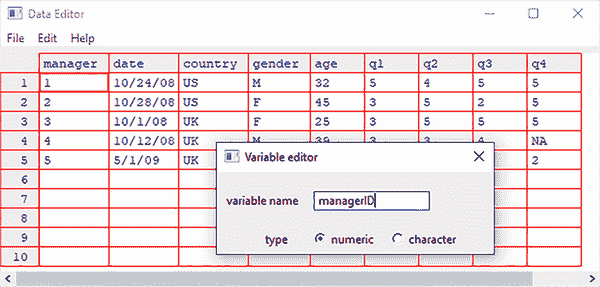

# 3 基本数据管理

本章涵盖

+   操作日期和缺失值

+   理解数据类型转换

+   创建和重新编码变量

+   排序、合并和子集数据集

+   选择和删除变量

在第二章中，我们介绍了将数据导入 R 的各种方法。不幸的是，将数据以矩阵或数据框的矩形排列形式准备好，只是分析准备的第一步。为了引用《星际迷航》中“末日审判的滋味”一集中队长柯克的台词（并最终证明我的极客身份），“数据是一团糟——非常非常糟糕的一团糟。”在我的工作中，任何数据分析项目 60%的时间都花在清理和组织数据上。我敢打赌，大多数现实世界的数据分析师也是如此。让我们来看一个例子。

## 3.1 一个工作示例

我目前在工作中研究的一个主题是男性和女性在领导组织的方式上存在哪些差异。典型的问题可能包括

+   管理职位上的男性和女性在向上级让步的程度上是否存在差异？

+   这是否因国家而异，还是这些性别差异是普遍存在的？

解决这些问题的方法之一是让多个国家的上司使用以下问题对他们的经理的顺从行为进行评分。

| 这位经理在做出人事决策之前会征求我的意见。 |
| --- |
| 1 | 2 | 3 | 4 | 5 |
| 强烈不同意 | 不同意 | 既不同意也不反对 | 同意 | 强烈同意 |

结果数据可能类似于表 3.1 中的数据。每一行代表上司对经理给出的评分。

表 3.1 领导行为中的性别差异

| 经理 | 日期 | 国家 | 性别 | 年龄 | q1 | q2 | q3 | q4 | q5 |
| --- | --- | --- | --- | --- | --- | --- | --- | --- | --- |
| 1 | 10/24/14 | US | M | 32 | 5 | 4 | 5 | 5 | 5 |
| 2 | 10/28/14 | US | F | 45 | 3 | 5 | 2 | 5 | 5 |
| 3 | 10/01/14 | US | F | 25 | 3 | 5 | 5 | 5 | 2 |
| 4 | 10/12/14 | US | M | 39 | 3 | 3 | 4 |  |  |
| 5 | 05/01/14 | US | F | 99 | 2 | 2 | 1 | 2 | 1 |

在这里，每位经理根据与其相关的五个陈述（q1 至 q5）对其权威的顺从程度进行评分。例如，经理 1 是一位 32 岁的男性，在美国工作，并被其上司评价为顺从，而经理 5 是一位年龄不详的女性（99 可能表示信息缺失），在英国工作，并在顺从行为上得分较低。日期列捕捉了评分的时间。

尽管数据集可能有数十个变量和数千个观测值，但我只包括了 10 列和 5 行来简化示例。此外，我还将涉及经理顺从行为的条目限制为 5 个。在现实世界的研究中，你可能会使用 10 到 20 个这样的条目来提高结果的可靠性和有效性。你可以使用以下代码创建包含表 3.1 中数据的数据框。

列表 3.1 创建领导数据框

```
leadership <- data.frame(
   manager = c(1, 2, 3, 4, 5),
   date    = c("10/24/08", "10/28/08", "10/1/08", "10/12/08", "5/1/09"),
   country = c("US", "US", "UK", "UK", "UK"),
   gender  = c("M", "F", "F", "M", "F"),
   age     = c(32, 45, 25, 39, 99),
   q1      = c(5, 3, 3, 3, 2),
   q2      = c(4, 5, 5, 3, 2),
   q3      = c(5, 2, 5, 4, 1),
   q4      = c(5, 5, 5, NA, 2),
   q5      = c(5, 5, 2, NA, 1)
)
```

为了解决感兴趣的问题，你必须首先处理几个数据管理问题。以下是一个部分列表：

+   五个评分（q1 到 q5）需要合并，从而从每个经理那里得到一个单一的均值差异分数。

+   在调查中，受访者经常跳过问题。例如，老板对经理的 4 分评价跳过了问题 4 和 5。你需要一种处理不完整数据的方法。你还需要将像 99 这样的年龄值重新编码为*缺失*。

+   数据集中可能有数百个变量，但你可能只对其中几个感兴趣。为了简化问题，你将想要创建一个只包含感兴趣变量的新数据集。

+   过去的研究表明，领导行为可能会随着管理者年龄的变化而变化。为了检验这一点，你可能想将当前年龄值重新编码到一个新的年龄分类中（例如，年轻、中年、老年）。

+   领导行为可能会随时间而改变。你可能想专注于最近全球金融危机期间的差异行为。为此，你可能想将研究限制在特定时间段收集的数据（例如，2009 年 1 月 1 日至 2009 年 12 月 31 日）。

我们将在本章中逐一解决这些问题，以及其他基本的数据管理任务，例如合并和排序数据集。然后，在第五章中，我们将探讨一些高级主题。

## 3.2 创建新变量

在典型的研究项目中，你需要创建新变量和转换现有变量。这是通过以下形式的语句完成的：

```
*variable <- expression*
```

可以在语句的`expression`部分包含各种运算符和函数。表 3.2 列出了 R 的算术运算符。

表 3.2 算术运算符

| 运算符 | 描述 |
| --- | --- |
| `+` | 加法 |
| `-` | 减法 |
| `*` | 乘法 |
| `/` | 除法 |
| `^`或`**` | 幂运算 |
| `x%%y` | 模数（x mod y）：例如，`5%%2`是`1` |
| `x%/%y` | 整数除法：例如，`5%/%2`是`2` |

给定数据框`leadership`，假设你想创建一个新变量`total_score`，它将变量 q1 到 q5 相加，并创建一个名为`mean_score`的新变量，该变量平均这些变量。如果你使用以下代码

```
total_score  <-  q1 + q2 + q3 + q4 + q5
mean_score <- (q1 + q2 + q3 + q4 + q5)/5
```

你会得到一个错误，因为 R 不知道`q1`、`q2`、`q3`、`q4`和`q5`是从数据框`leadership`中来的。如果你使用下面的代码代替

```
total_score  <-  leadership$q1 + leadership$q2 + leadership$q3 + 
                   leadership$q4 + leadership$q5
mean_score <- (leadership$q1 + leadership$q2 + leadership$q3 + 
                   leadership$q4 + leadership$q5)/5
```

这些语句将成功，但你最终会得到一个数据框（`leadership`）和两个单独的向量（`total_score`和`mean_score`）。这可能不是你想要的结果。最终，你想要将新变量纳入原始数据框中。以下列表提供了两种实现这一目标的方法。你可以选择其中一种；结果将是相同的。

列表 3.2 创建新变量

```
leadership$total_score  <-  leadership$q1 + leadership$q2 + leadership$q3 + 
                              leadership$q4 + leadership$q5
leadership$mean_score <- (leadership$q1 + leadership$q2 + leadership$q3 + 
                            leadership$q4 + leadership$q5)/5

leadership <- transform(leadership,
                    total_score  =  q1 + q2 + q3 + q4 + q5,
                    mean_score = (q1 + q2 + q3 + q4 + q5)/5)
```

个人而言，我更喜欢第二种方法，即使用`transform()`函数的例子。它简化了包含尽可能多的新变量，并将结果保存到数据框中。

## 3.3 重新编码变量

`重新编码`涉及根据同一变量和/或其他变量的现有值创建变量的新值。例如，你可能想要

+   将连续变量转换为一系列类别

+   将错误编码的值替换为正确值

+   根据一组截止分数创建通过/失败变量

要重新编码数据，你可以使用一个或多个 R 的逻辑运算符（见表 3.3）。逻辑运算符是返回 `TRUE` 或 `FALSE` 的表达式。

表 3.3 逻辑运算符

| 运算符 | 描述 |
| --- | --- |
| `<` | 小于 |
| `<=` | 小于或等于 |
| `>` | 大于 |
| `>=` | 大于或等于 |
| `==` | 精确等于 |
| `!=` | 不等于 |
| `!x` | 非 `x` |
| `x | y` | `x` 或 `y` |
| `x & y` | `x` 和 `y` |
| `isTRUE(x)` | 测试 `x` 是否为 `TRUE` |

假设你想要将领导数据集中管理员的年龄从连续变量 `age` 重新编码为分类变量 `agecat`（`Young`，`Middle Aged`，`Elder`）。首先，你必须将 `age` 的值 `99` 重新编码，以表示该值缺失，可以使用如下代码

```
leadership$age[leadership$age  == 99]     <- NA
```

语句 `variable[condition] <- expression` 只有在 `condition` 为 `TRUE` 时才会进行赋值。

一旦指定了 `age` 的缺失值，然后你可以使用以下代码创建 `agecat` 变量：

```
leadership$agecat[leadership$age  > 75]   <- “Elder”
leadership$agecat[leadership$age >= 55 & 
                  leadership$age <= 75]   <- “Middle Aged”
leadership$agecat[leadership$age  < 55]   <- “Young”
```

你在 `leadership$agecat` 中包含数据框名称，以确保新变量被保存回数据框。 （我将中年定义为 55 至 75，这样我就不会觉得那么老了。）请注意，如果你没有首先将 99 重新编码为 `age` 的 *缺失*，经理 5 就会被错误地赋予 `agecat` 的值“Elder”。

这段代码可以更紧凑地写成

```
leadership <- within(leadership,{
                     agecat <- NA
                     agecat[age > 75]              <- "Elder"
                     agecat[age >= 55 & age <= 75] <- "Middle Aged"
                     agecat[age < 55]              <- "Young" })
```

`within()` 函数与 `with()` 函数（第 2.2.4 节）类似，但它允许你修改数据框。首先，创建变量 `agecat` 并将其设置为数据框每一行的缺失值。然后，执行花括号内的剩余语句。记住，`agecat` 是一个字符变量；你很可能想要将其转换为有序因子，如第 2.2.5 节所述。

几个包提供了有用的重新编码函数；特别是，`car` 包的 `recode()` 函数可以非常简单地重新编码数值和字符向量以及因子。`doBy` 包提供了 `recodeVar()`，另一个流行的函数。最后，R 内置了 `cut()` 函数，它允许你将数值变量的范围划分为区间，并返回一个因子。

## 3.4 重命名变量

如果你对自己的变量名不满意，你可以交互式地或以编程方式更改它们。假设你想要将变量 `manager` 改为 `managerID`，将 `date` 改为 `testDate`。你可以使用以下语句调用交互式编辑器：

```
fix(leadership)
```

然后，你点击变量名，并在显示的对话框中重命名它们（见图 3.1）。



图 3.1 使用 `fix()` 函数交互式重命名变量

通过编程方式，您可以通过 `names()` 函数重命名变量。例如，以下语句

```
names(leadership)[2] <- "testDate"
```

如以下代码所示，将 `date` 重命名为 `testDate`：

```
> names(leadership)
 [1] "manager" "date"    "country" "gender"  "age"     "q1"      "q2"     
 [8] "q3"      "q4"      "q5"    
> names(leadership)[2] <- "testDate"
> leadership
  manager testDate country gender age q1 q2 q3 q4 q5
1       1 10/24/08      US      M  32  5  4  5  5  5
2       2 10/28/08      US      F  45  3  5  2  5  5
3       3  10/1/08      UK      F  25  3  5  5  5  2
4       4 10/12/08      UK      M  39  3  3  4 NA NA
5       5   5/1/09      UK      F  99  2  2  1  2  1
```

以类似的方式，以下语句

```
names(leadership)[6:10] <- c("item1", "item2", "item3", "item4", "item5")
```

将 q1 到 q5 重命名为 item1 到 item5。

## 3.5 缺失值

在任何规模的项目中，由于漏题、设备故障或数据编码不当，数据很可能会不完整。在 R 中，缺失值用符号 `NA`（不可用）表示。与 SAS 等程序不同，R 使用相同的缺失值符号来表示字符和数值数据。

R 提供了多个函数用于识别包含缺失值的观测值。函数 `is.na()` 允许您测试是否存在缺失值。假设您有如下向量：

```
y <- c(1, 2, 3, NA)
```

然后以下函数返回 `c(FALSE, FALSE, FALSE, TRUE)`：

```
is.na(y) 
```

注意 `is.na()` 函数在对象上的工作方式。它返回一个大小相同的对象，如果元素是缺失值，则条目被替换为 `TRUE`，如果元素不是缺失值，则条目被替换为 `FALSE`。以下列表将此应用于领导力示例。

列表 3.3 应用 `is.na()` 函数

```
> is.na(leadership[,6:10])
        q1    q2    q3    q4    q5
[1,] FALSE FALSE FALSE FALSE FALSE
[2,] FALSE FALSE FALSE FALSE FALSE
[3,] FALSE FALSE FALSE FALSE FALSE
[4,] FALSE FALSE FALSE  TRUE  TRUE
[5,] FALSE FALSE FALSE FALSE FALSE 
```

在这里，`leadership[,6:10]` 限制了数据框到第 6 到 10 列，而 `is.na()` 识别了哪些值是缺失的。

当您在 R 中处理缺失值时，需要记住两个重要的事情。首先，缺失值被认为是不可比较的，即使是与自身比较。这意味着您不能使用比较运算符来测试缺失值的存在。例如，逻辑测试 `myvar` `==` `NA` 永远不会返回 `TRUE`。相反，您必须使用缺失值函数（如 `is.na()`）来识别 R 数据对象中的缺失值。

其次，R 不将无限或不可能的值表示为缺失值。这与其他程序（如 SAS）处理此类数据的方式不同。正无穷和负无穷分别用符号 `Inf` 和 `–Inf` 表示。因此，`5/0` 返回 `Inf`。不可能的值（例如，`sin(Inf)`）用符号 `NaN`（非数字）表示。要识别这些值，您需要使用 `is .infinite()` 或 `is.nan()`。

### 3.5.1 将值重新编码为缺失

如我们在 3.3 节中看到的，您可以使用赋值来将值重新编码为 *缺失*。在领导力示例中，缺失的 `age` 值被编码为 99。在分析此数据集之前，您必须让 R 知道在这种情况下值 `99` 代表 *缺失*——否则，这个老板样本的平均年龄将会偏差很大。您可以通过重新编码变量来完成此操作：

```
leadership$age[leadership$age == 99] <- NA
```

任何等于 `99` 的年龄值都更改为 `NA`。在分析数据之前，请确保任何缺失数据都正确编码为缺失值，否则结果将没有意义。

### 3.5.2 从分析中排除缺失值

一旦你确定了缺失值，在进一步分析数据之前，你需要以某种方式消除它们。原因是包含缺失值的算术表达式和函数会产生缺失值。例如，考虑以下代码：

```
x <- c(1, 2, NA, 3)
y <- x[1] + x[2] + x[3] + x[4]
z <- sum(x)
```

由于`x`的第三个元素缺失，`y`和`z`都将为`NA`（缺失）。

幸运的是，大多数数值函数都有一个`na.rm=TRUE`选项，该选项在计算之前删除缺失值，并将函数应用于剩余的值：

```
x <- c(1, 2, NA, 3)
y <- sum(x, na.rm=TRUE)
```

在这里，`y`等于 6。

当使用包含不完整数据的函数时，务必通过查看其在线帮助（例如，`help(sum)`）来检查该函数如何处理缺失数据。`sum()`函数是我们将在第五章考虑的许多函数之一。函数允许你以灵活和简便的方式转换数据。

你可以使用`na.omit()`函数删除任何包含缺失数据的观测值，该函数会删除任何包含缺失数据的行。让我们在下面的列表中将此应用于领导力数据集。

列表 3.4 使用`na.omit()`删除不完整观测值

```
> leadership    
  manager     date country gender age q1 q2 q3 q4 q5      ❶
1       1 10/24/08      US      M  32  5  4  5  5  5      ❶
2       2 10/28/08      US      F  40  3  5  2  5  5      ❶
3       3 10/01/08      UK      F  25  3  5  5  5  2      ❶
4       4 10/12/08      UK      M  39  3  3  4 NA NA      ❶
5       5 05/01/09      UK      F  NA  2  2  1  2  1      ❶

> newdata <- na.omit(leadership)    
> newdata    
  manager     date country gender age q1 q2 q3 q4 q5      ❷
1       1 10/24/08      US      M  32  5  4  5  5  5      ❷
2       2 10/28/08      US      F  40  3  5  2  5  5      ❷
3       3 10/01/08      UK      F  25  3  5  5  5  2      ❷
```

❶ 包含缺失数据的数据框

❷ 仅包含完整案例的数据框

在将结果保存到`newdata`之前，任何包含缺失数据的行都会从领导力数据集中删除。

删除所有包含缺失数据的观测值（称为*列表删除*）是处理不完整数据集的几种方法之一。如果只有少数值缺失，或者它们集中在少数观测值中，列表删除可以提供解决缺失值问题的良好解决方案。但如果缺失值分布在整个数据中，或者少数变量中有大量数据缺失，列表删除可能会排除大量数据。我们将在第十八章中探讨处理缺失值的几种更复杂的方法。接下来，让我们看看日期。

## 3.6 日期值

日期通常以字符字符串的形式输入到 R 中，然后转换为存储为数值的日期变量。`as.Date()`函数用于进行这种转换。语法是`as.Date(x, "input_format")`，其中`x`是字符数据，`input_format`给出了读取日期的适当格式（见表 3.4）。

表 3.4 日期格式

| 符号 | 含义 | 示例 |
| --- | --- | --- |
| `%d` | 日期作为数字（0–31） | 01–31 |
| `%a` `%A` | 简写星期非简写星期 | MonMonday |
| `%m` | 月份（01–12） | 01–12 |
| `%b` `%B` | 简写月份非简写月份 | JanJanuary |
| `%y` `%Y` | 两位数年份四位数字年份 | 072007 |

输入日期的默认格式是 yyyy-mm-dd。以下语句

```
mydates <- as.Date(c("2007-06-22", "2004-02-13"))
```

使用此默认格式将字符数据转换为日期。相比之下，

```
strDates <- c("01/05/1965", "08/16/1975")
dates <- as.Date(strDates, "%m/%d/%Y")
```

使用 mm/dd/yyyy 格式读取数据。

在领导力数据集中，日期以 mm/dd/yy 格式编码为字符变量。因此

```
myformat <- "%m/%d/%y"
leadership$date <- as.Date(leadership$date, myformat)
```

使用指定的格式读取字符变量并将其替换为数据帧中的日期变量。一旦变量以日期格式存在，你就可以使用后面章节中涵盖的广泛分析技术来分析和绘制日期。

两个函数特别适用于时间戳数据。`Sys.Date()`返回今天的日期，而`date()`返回当前的日期和时间。在我写这篇文章的时候，是 2021 年 7 月 7 日晚上 6:43。执行这些函数会产生

```
> Sys.Date()
[1] "2021-07-20"
> date()
[1] "Tue Jul 20 18:43:40 2021"
```

你可以使用`format(x, format="output_format")`函数以指定格式输出日期并提取日期的部分：

```
> today <- Sys.Date()
> format(today, format="%B %d %Y")
[1] "July 20 2021"
> format(today, format="%A")
[1] "Tuesday"
```

`format()`函数接受一个参数（在这种情况下是一个日期）并应用一个输出格式（在这种情况下，由表 3.4 中的符号组成）。这里的重要结果是，距离周末只剩两天了！

当 R 内部存储日期时，它们被表示为自 1970 年 1 月 1 日起的天数，较早的日期使用负值。这意味着你可以对它们进行算术运算。例如，

```
> startdate <- as.Date("2020-02-13")
> enddate   <- as.Date("2021-01-22")
> days      <- enddate - startdate
> days
Time difference of 344 days 
```

显示了 2020 年 2 月 13 日和 2021 年 1 月 22 日之间的天数。

最后，你也可以使用`difftime()`函数来计算时间间隔，并以秒、分钟、小时、天或周的形式表示。假设我是在 1956 年 10 月 12 日出生的。我多大了？：

```
> today <- Sys.Date()
> dob   <- as.Date("1956-10-12")
> difftime(today, dob, units="weeks")
Time difference of 3380 weeks  
```

显然，我已经 3,380 周大了。谁知道呢？额外加分：我是在星期几出生的？

### 3.6.1 将日期转换为字符变量

你还可以将日期变量转换为字符变量。可以使用`as.character()`函数将日期值转换为字符值：

```
strDates <- as.character(dates)
```

这种转换允许你将一系列字符函数应用于数据值（子集、替换、连接等）。我们将在第 5.2.4 节中详细讨论字符函数。

### 3.6.2 进一步学习

要了解更多关于将字符数据转换为日期的信息，请查看`help(as.Date)`和`help(strftime)`。要了解更多关于日期和时间的格式化信息，请参阅`help(ISOdatetime)`。`lubridate`包包含许多简化日期处理的函数，包括用于识别和解析日期时间数据、提取日期时间组件（例如，年、月、日、小时和分钟）以及在对日期时间进行算术计算。如果你需要使用日期进行复杂计算，`timeDate`包也可以提供帮助。它提供了一系列处理日期的函数，可以同时处理多个时区，并提供复杂的日历操作，识别工作日、周末和假日。

## 3.7 类型转换

我们刚刚讨论了如何将字符数据转换为日期值以及相反的操作。R 提供了一套函数来识别对象的数据类型并将其转换为不同的数据类型。

R 中的类型转换与其他统计编程语言中的转换类似。例如，将字符字符串添加到数值向量会将向量中的所有元素转换为字符值。你可以使用表 3.5 中列出的函数来测试数据类型并将其转换为给定类型。

表 3.5 类型转换函数

| 测试 | 转换 |
| --- | --- |
| `is.numeric()` | `as.numeric()` |
| `is.character()` | `as.character()` |
| `is.vector()` | `as.vector()` |
| `is.matrix()` | `as.matrix()` |
| `is.data.frame()` | `as.data.frame()` |
| `is.factor()` | `as.factor()` |
| `is.logical()` | `as.logical()` |

形式为 `is.datatype()` 的函数返回 `TRUE` 或 `FALSE`，而 `as.datatype()` 将参数转换为该类型。以下列表提供了一个示例。

列表 3.5 从一种数据类型转换为另一种数据类型

```
> a <- c(1,2,3)
> a
[1] 1 2 3
> is.numeric(a)
[1] TRUE
> is.vector(a)
[1] TRUE
> a <- as.character(a)
> a
[1] "1" "2" "3"
> is.numeric(a)
[1] FALSE
> is.vector(a)
[1] TRUE
> is.character(a)
[1] TRUE
```

当与第五章中将要讨论的流程控制（如 `if-then`）结合使用时，`is.datatype()` 函数可以成为一个强大的工具，允许你根据数据类型以不同的方式处理数据。此外，一些 R 函数需要特定类型的数据（字符或数值、矩阵或数据框），而 `as.datatype()` 允许你在分析之前将数据转换为所需的格式。

## 3.8 排序数据

有时，以排序顺序查看数据集可以告诉你很多关于数据的信息。例如，哪些经理最谦逊？在 R 中，你使用 `order()` 函数对数据框进行排序。默认情况下，排序顺序是升序。在排序变量前加一个负号以表示降序。以下示例说明了使用领导数据框进行排序。

语句

```
newdata <- leadership[order(leadership$age),]
```

创建一个新的数据集，其中包含按经理年龄从年轻到老排序的行。语句

```
newdata <- leadership[order(leadership$gender, leadership$age),]
```

将行按女性排序，然后在每个性别内按年龄从年轻到老排序。

最后，

```
newdata <-leadership[order(leadership$gender, -leadership$age),]
```

按性别排序行，然后在每个性别内按年龄从老到少排序经理。

## 3.9 合并数据集

如果你的数据存在于多个位置，在继续之前你需要将其合并。本节将向你展示如何向数据框添加列（变量）和行（观测值）。

### 3.9.1 向数据框添加列

要水平合并两个数据框（数据集），你使用 `merge()` 函数。在大多数情况下，两个数据框通过一个或多个公共键变量（即内部连接）连接。例如，

```
total <- merge(dataframeA, dataframeB, by="ID")
```

通过 ID 合并 `dataframeA` 和 `dataframeB`。同样，

```
total <- merge(dataframeA, dataframeB, by=c("ID","Country")) 
```

通过 `ID` 和 `Country` 合并两个数据框。这种类型的水平连接通常用于向数据框添加变量。

使用 cbind() 进行水平连接

如果你水平连接两个矩阵或数据框，并且不需要指定公共键，你可以使用 `cbind()` 函数：

```
total <- cbind(A, B)
```

此函数水平连接对象 `A` 和 `B`。为了使函数正常工作，每个对象必须具有相同数量的行，并且必须按相同的顺序排序。

### 3.9.2 向数据框添加行

要垂直连接两个数据框（数据集），请使用`rbind()`函数：

```
total <- rbind(dataframeA, dataframeB) 
```

两个数据框必须具有相同的变量，但它们不必按相同的顺序排列。如果`dataframeA`有`dataframeB`没有的变量，那么在连接它们之前，你可以执行以下操作之一：

+   删除`dataframeA`中的额外变量。

+   在`dataframeB`中创建额外的变量并将它们设置为`NA`（缺失）。

垂直连接通常用于向数据框中添加观测值。

## 3.10 子集数据集

R 具有强大的索引功能，用于访问对象的元素。这些功能可以用来选择和排除变量、观测值或两者。以下几节将演示几种保留或删除变量和观测值的方法。

### 3.10.1 选择变量

从较大的数据集中选择有限数量的变量来创建新的数据集是很常见的。第二章展示了数据框的元素是通过使用表示法`dataframe[row indices, column indices]`来访问的。你可以使用这个表示法来选择变量。例如，

```
newdata <- leadership[, c(6:10)] 
```

从领导数据框中选择变量`q1`、`q2`、`q3`、`q4`和`q5`，并将它们保存到数据框`newdata`中。留空行索引（`()`）默认选择所有行。

以下语句

```
vars <- c("q1", "q2", "q3", "q4", "q5")
newdata <-leadership[, vars]
```

实现相同的变量选择。在这里，变量名（用引号括起来）作为列索引输入，从而选择相同的列。

如果为数据框提供了一个索引集，R 假定你正在子集化列。在以下语句中，逗号被假定为

```
newdata <- leadership[vars]
```

并对相同的变量集进行子集化。

最后，你可以使用

```
myvars <- paste("q", 1:5, sep="") 
newdata <- leadership[myvars]
```

此示例使用`paste()`函数创建与上一个示例相同的字符向量。`paste()`函数将在第五章中介绍。

### 3.10.2 删除变量

有许多原因需要排除变量。例如，如果一个变量有很多缺失值，你可能在进一步分析之前想要删除它。让我们看看一些排除变量的方法。

你可以使用以下语句排除变量`q3`和`q4`：

```
myvars <- names(leadership) %in% c("q3", "q4") 
newdata <- leadership[!myvars]
```

要理解为什么这样做有效，你需要将其分解：

1.  `names(leadership)`生成一个包含变量名的字符向量：

    ```
    c("managerID","testDate","country","gender","age","q1","q2","q3","q4","q5")
    ```

1.  `names(leadership)%in%c("q3", "q4")`返回一个逻辑向量，对于`names(leadership)`中与`q3`或`q4`匹配的每个元素返回`TRUE`，否则返回`FALSE`：

    ```
    c(FALSE, FALSE, FALSE, FALSE, FALSE, FALSE, FALSE, TRUE, TRUE, FALSE)
    ```

1.  非（`!`）运算符反转逻辑值：

    ```
    c(TRUE, TRUE, TRUE, TRUE, TRUE, TRUE, TRUE, FALSE, FALSE, TRUE)
    ```

1.  `leadership[c(TRUE, TRUE, TRUE, TRUE, TRUE, TRUE, TRUE, FALSE, FALSE, TRUE)]`选择具有`TRUE`逻辑值的列，因此排除了`q3`和`q4`。

知道`q3`和`q4`是第八和第九个变量，你可以使用以下语句来排除它们：

```
newdata <- leadership[c(-8,-9)]
```

这之所以有效，是因为在列索引前加上负号（-）可以排除该列。

最后，同样的删除操作可以通过以下方式完成：

```
leadership$q3 <- leadership$q4 <- NULL
```

在这里，你将列`q3`和`q4`设置为未定义的（`NULL`）。请注意，`NULL`与`NA`（缺失）不同。

删除变量是保留变量的逆过程。选择哪种方式取决于哪种方式更容易编码。如果有许多变量需要删除，可能更容易保留剩下的变量，反之亦然。

### 3.10.3 选择观测值

选择或排除观测值（行）通常是成功数据准备和分析的关键方面。以下列表中给出了几个示例。

列表 3.6 选择观测值

```
newdata <- leadership[1:3,]                        ❶

newdata <- leadership[leadership$gender=="M" &   ❷❸
                      leadership$age > 30,]        ❸
```

❶ 询问第 1 至 3 行（前三个观测值）

❸ 选择所有 30 岁以上的男性

这些示例中的每一个都提供了行索引，并留出列索引空白（因此选择所有列）。让我们分析 ❷ 中的代码行来理解它：

1.  逻辑比较 `leadership$gender=="M"` 产生向量 `c(TRUE, FALSE, FALSE, TRUE, FALSE)`。

1.  逻辑比较 `leadership$age > 30` 产生向量 `c(TRUE, TRUE, FALSE, TRUE, TRUE)`。

1.  逻辑比较 `c(TRUE, FALSE, FALSE, TRUE, FALSE) & c(TRUE, TRUE, FALSE, TRUE, TRUE)` 产生向量 `c(TRUE, FALSE, FALSE, TRUE, FALSE)`。

1.  `leadership[c(TRUE, FALSE, FALSE, TRUE, FALSE),]` 从数据框中选择第一个和第四个观测值（当行索引为 `TRUE` 时，行被包含；当它是 `FALSE` 时，行被排除）。这符合选择标准（30 岁以上的男性）。

在本章的开头，我建议您可能希望将您的分析限制在 2009 年 1 月 1 日至 2009 年 12 月 31 日期间收集的观测值。您如何做到这一点？这里有一个解决方案：

```
leadership$date <- as.Date(leadership$date, "%m/%d/%y")     ❶

startdate <- as.Date("2009-01-01")                          ❷
enddate   <- as.Date("2009-12-31")                          ❸

newdata <- leadership[which(leadership$date >= startdate &  ❹
           leadership$date <= enddate),]                    ❹
```

❶ 将最初以字符值读入的日期值转换为日期值，格式为 mm/dd/yy

❷ 创建起始日期

❸ 创建结束日期

❹ 选择符合您所需标准的情况，如前一个示例所示

注意，`as.Date()` 函数的默认格式是 yyyy-mm-dd，因此您在这里不需要提供它。

### 3.10.4 subset() 函数

前两个示例中的例子很重要，因为它们有助于描述在 R 中逻辑向量和比较运算符是如何被解释的。理解这些例子的工作方式将有助于您一般地解释 R 代码。既然您已经用困难的方式完成了这些事情，让我们看看一种捷径。

subset() 函数可能是选择变量和观测值的最简单方法。以下有两个示例：

```
newdata <- subset(leadership, age >= 35 | age < 23,    ❶
                  select=c(q1, q2, q3, q4))            ❶

newdata <- subset(leadership, gender=="M" & age > 25,  ❷
                  select=gender:q4)                    ❷
```

❶ 选择所有年龄大于或等于 35 或小于 23 的行。保留变量 q1 至 q4。

❷ 选择所有 25 岁以上的男性，并保留变量 gender 通过 q4（gender、q4 以及它们之间的所有列）。

您在第二章中看到了冒号运算符用于生成数字序列。在 subset 函数中，`from:to` 返回数据框中 `from` 变量和 `to` 变量之间的所有变量，包括这两个变量。

### 3.10.5 随机样本

在数据挖掘和机器学习中，从更大的数据集中进行抽样是很常见的。例如，你可能想要选择两个随机样本，从一个样本中创建预测模型，并在另一个样本上验证其有效性。`sample()` 函数允许你从一个数据集中随机抽取大小为 `n` 的样本（带或不带替换）。

你可以使用以下语句从领导数据集中随机抽取大小为 3 的样本：

```
mysample <- leadership[sample(1:nrow(leadership), 3, replace=FALSE),] 
```

`sample()` 的第一个参数是从中选择元素的向量。在这里，向量是从 1 到数据框中观测值的数量。第二个参数是要选择的元素数量，第三个参数表示不进行替换的抽样。`sample()` 返回随机抽取的元素，然后用于从数据框中选择行。

R 提供了广泛的抽样功能，包括绘制和校准调查样本（参见 `sampling` 包）以及分析复杂的调查数据（参见 `survey` 包）。第十二章描述了依赖于抽样的其他方法，包括自助法和重抽样统计。

## 3.11 使用 dplyr 操作数据框

到目前为止，我们已经使用基础 R 函数操作了 R 数据框。`dplyr` 包提供了一系列快捷方式，允许你以简化的方式完成相同的数据管理任务。它正迅速成为最受欢迎的 R 数据管理包之一。

### 3.11.1 基本 dplyr 函数

`dplyr` 包提供了一组函数，可用于选择变量和观测值、转换变量、重命名变量以及排序行。表 3.6 列出了相关函数。

表 3.6 `dplyr` 用于操作数据框的函数

| 函数 | 用途 |
| --- | --- |
| `select()` | 选择变量/列 |
| `filter()` | 选择观测值/行 |
| `mutate()` | 转换或重新编码变量 |
| `rename()` | 重命名变量/列 |
| `recode()` | 重新编码变量值 |
| `arrange()` | 按变量值排序行 |

让我们回到表 3.1 中创建的数据框，并在表 3.7 中重现以方便起见。

表 3.7 领导行为中的性别差异

| 经理 | 日期 | 国家 | 性别 | 年龄 | q1 | q2 | q3 | q4 | q5 |
| --- | --- | --- | --- | --- | --- | --- | --- | --- | --- |
| 1 | 10/24/14 | 美国 | M | 32 | 5 | 4 | 5 | 5 | 5 |
| 2 | 10/28/14 | 美国 | F | 45 | 3 | 5 | 2 | 5 | 5 |
| 3 | 10/01/14 | 英国 | F | 25 | 3 | 5 | 5 | 5 | 2 |
| 4 | 10/12/14 | 英国 | M | 39 | 3 | 3 | 4 |  |  |
| 5 | 05/01/14 | 英国 | F | 99 | 2 | 2 | 1 | 2 | 1 |

这次，我们将使用 `dplyr` 函数来操作数据集。代码在列表 3.7 中提供。由于 `dplyr` 不是 R 基础包的一部分，首先需要安装它（`install.packages("dplyr")`）。

列表 3.7 使用 `dplyr` 操作数据

```
leadership <- data.frame(
   manager = c(1, 2, 3, 4, 5),
   date    = c("10/24/08", "10/28/08", "10/1/08", "10/12/08", "5/1/09"),
   country = c("US", "US", "UK", "UK", "UK"),
   gender  = c("M", "F", "F", "M", "F"),
   age     = c(32, 45, 25, 39, 99),
   q1      = c(5, 3, 3, 3, 2),
   q2      = c(4, 5, 5, 3, 2),
   q3      = c(5, 2, 5, 4, 1),
   q4      = c(5, 5, 5, NA, 2),
   q5      = c(5, 5, 2, NA, 1)
   )   

library(dplyr)                                                  ❶

leadership <- mutate(leadership,                                ❷
                     total_score = q1 + q2 + q3 + q4 + q5,      ❷
                     mean_score = total_score / 5)              ❷

leadership$gender <- recode(leadership$gender,                  ❸
                            "M" = "male", "F" = "female")       ❸

leadership <- rename(leadership, ID = "manager", sex = "gender")❹

leadership <- arrange(leadership, sex, total_score)             ❺

leadership_ratings <- select(leadership, ID, mean_score)        ❻

leadership_men_high <- filter(leadership,                       ❼
                              sex == "male" & total_score > 10) ❼
```

❶ 加载 dplyr 包。

❷ 创建两个汇总变量。

❸ 将 M 和 F 重新编码为男性和女性。

❹ 重命名经理和性别变量。

❺ 按性别排序数据，然后在性别内按总分排序。

❻ 创建包含评分变量的新数据框。

❼ 创建一个新的数据框，包含总分超过 10 的男性。

首先，加载 `dplyr` 包。然后使用 `mutate()` 函数创建总分和平均分。格式是

```
*dataframe* <- mutate(*dataframe,* 
                    *newvar1 = expression,* 
                    *newvar2 = expression, ...*).
```

新变量被添加到数据框中。

接下来，使用 `recode()` 函数修改 `gender` 变量的值。格式是

```
*vector* <- recode(*vector,* 
                 *oldvalue1 = newvalue2,* 
                 *oldvalue2 = newvalue2, ...*).
```

没有给定新值的向量值保持不变。例如，

```
x <- c("a", "b", "c")
x <- recode(x, "a" = "apple", "b" = "banana")
x
[1] "apple" "banana" "c"
```

对于数值，使用反引号来引用原始值：

```
> y <- c(1, 2, 3)
> y <- recode(y, `1` = 10, `2` = 15)
> y
[1] 10 15 3
```

接下来，使用 `rename()` 函数更改变量名。格式是

```
*dataframe* <- rename(*dataframe,* 
                    *newname1 = "oldname1",* 
                    *newname2 = "oldname2", ...*).
```

然后使用 `arrange()` 函数对数据进行排序。首先，按 `sex` 升序排序行（女性随后是男性）。接下来，在每组性别内按 `total_score` 升序排序行（低分到高分）。使用 `desc()` 函数来反转排序顺序。例如，

```
leadership <- arrange(leadership, sex, desc(total_score))   
```

将按 `sex` 升序排序数据，并在每个性别内按降序（高分到低分 `total_scores`）排序。

`select` 语句用于选择或排除变量。在这种情况下，选择了变量 `ID` 和 `mean_score`。

`select()` 函数的格式是

```
*dataframe* <- select(dataframe, *variablelist1, variablelist2, ...*) 
```

变量列表通常是变量名，不带引号。可以使用冒号运算符（:）来选择变量范围。此外，可以使用函数来选择包含特定文本字符串的变量。例如，以下语句

```
leadership_subset <- select(leadership, 
                             ID, country:age, starts_with("q")) 
```

将选择变量 `ID`、`country`、`sex`、`age`、`q1`、`q2`、`q3`、`q4` 和 `q5`。有关可用于辅助变量选择的函数列表，请参阅 `help(select_helpers)`。

使用负号（`-`）来排除变量。该语句

```
leadership_subset <- select(leadership, -sex, -age)
```

会包括所有变量，**除了** `sex` 和 `age`。

最后，使用 `filter()` 函数选择满足给定一组标准的数据框中的观测值或行。在这里，保留总分大于 10 的男性。格式是

```
*dataframe* <- filter(*dataframe, expression*)
```

如果表达式为 `TRUE`，则保留行。可以使用表 3.3 中的任何逻辑运算符，并且可以使用括号来澄清这些运算符的优先级。例如，

```
extreme_men <- filter(leadership, 
                       sex == "male" & 
                       (mean_score < 2 | mean_score > 4))
```

将创建一个包含所有平均分低于 2 或高于 4 的男性经理的数据框。

### 3.11.2 使用管道运算符链式调用语句

`dplyr` 包允许您使用 `magrittr` 包提供的管道运算符（`%>%`）以紧凑的格式编写代码。考虑以下三个语句：

```
high_potentials <- filter(leadership, total_score > 10)
high_potentials <- select(high_potential, ID, country, mean_score)
high_potentials <- arrange(high_potential, country, mean_score)  
```

这些语句可以使用管道运算符重写为单个语句：

```
high_potentials <- filter(leadership, total_score > 10) %>%
   select(ID, country, mean_score) %>%
   arrange(country, mean_score)  
```

`%>%` 运算符（发音为 THEN）将左侧的结果传递到右侧函数的第一个参数。以这种方式重写的语句通常更容易阅读。

虽然我们已经介绍了基本的 `dplyr` 函数，但该包还包含用于汇总、组合和重构数据的函数。这些附加函数将在第五章中讨论。

## 3.12 使用 SQL 语句操作数据框

到目前为止，您一直在使用 R 语句和函数来操作数据。但许多数据分析师在熟悉结构化查询语言（SQL）的情况下来到 R。失去所有这些积累的知识将是一件遗憾的事情。因此，在我们结束之前，让我简要地提及 `sqldf` 软件包。（如果您不熟悉 SQL，请随意跳过本节。）

下载并安装该软件包（`install.packages("sqldf")`）后，您可以使用 `sqldf()` 函数将 SQL `SELECT` 语句应用于数据框。以下列出两个示例。

列表 3.8 使用 SQL 语句操作数据框

```
> library(sqldf)                                                   ❶
> newdf <- sqldf("select * from mtcars where carb=1 order by mpg", ❶
                  row.names=TRUE)                                  ❶
> newdf                                                            ❶
                mpg cyl  disp  hp drat   wt qsec vs am gear carb
Valiant        18.1   6 225.0 105 2.76 3.46 20.2  1  0    3    1
Hornet 4 Drive 21.4   6 258.0 110 3.08 3.21 19.4  1  0    3    1
Toyota Corona  21.5   4 120.1  97 3.70 2.46 20.0  1  0    3    1
Datsun 710     22.8   4 108.0  93 3.85 2.32 18.6  1  1    4    1
Fiat X1-9      27.3   4  79.0  66 4.08 1.94 18.9  1  1    4    1
Fiat 128       32.4   4  78.7  66 4.08 2.20 19.5  1  1    4    1
Toyota Corolla 33.9   4  71.1  65 4.22 1.83 19.9  1  1    4    1

> sqldf("select avg(mpg) as avg_mpg, avg(disp) as avg_disp, gear   ❷
              from mtcars where cyl in (4, 6) group by gear")      ❷
  avg_mpg avg_disp gear
1    20.3      201    3
2    24.5      123    4
3    25.4      120    5
```

❶ 从数据框 mtcars 中选择所有变量（列），仅保留有一个化油器（carb）的汽车（行），按 mpg 升序排序，并将结果保存为数据框 newdf。选项 row.names=TRUE 将原始数据框的行名传递到新数据框中。

❷ 打印具有四个或六个气缸（cyl）的汽车在每个变速器级别（gear）内的平均 mpg 和 disp。

经验丰富的 SQL 用户会发现 `sqldf` 软件包是 R 中数据管理的有用补充。更多详情请参阅项目主页 ([`github.com/ggrothendieck/sqldf`](https://github.com/ggrothendieck/sqldf))。

## 概述

+   创建新变量和重新编码现有变量是数据管理的重要部分。

+   函数允许您存储和操作缺失值和日期值。

+   变量可以从一种类型（例如，数值）转换为另一种类型（例如，字符）。

+   根据一组标准，您可以保留（或删除）观测值和变量。

+   可以水平合并数据集（添加变量）或垂直合并数据集（添加观测值）。
