# 4 开始使用图形

本章涵盖

+   介绍`ggplot2`包

+   创建一个简单的双变量（两个变量）图

+   使用分组和分面创建多变量图

+   以多种格式保存图形

在许多场合，我向客户展示了精心制作的以数字和文本形式呈现的统计结果，但他们的眼睛却变得空洞，房间里充满了蝉鸣。然而，当我把同样的信息以图表的形式呈现给他们时，那些客户却有了热情的“啊哈！”时刻。通常，通过观察图表，我可以看到数据中的模式或检测到数据值中的异常——这些模式或异常在我进行更正式的统计分析时完全忽略了。

人类在从视觉表示中辨别关系方面非常擅长。一个精心制作的图表可以帮助您在成千上万的信息中进行有意义的比较，提取其他方法难以找到的模式。这也是统计图形领域的进步对数据分析产生如此重大影响的原因之一。数据分析师需要*查看*他们的数据，而 R 在这方面表现出色。

R 语言通过许多独立软件开发者的贡献在多年中自然增长。这导致了 R 中创建图形的四种不同方法的产生——`base`、`lattice`、`ggplot2`和`grid`图形。在本章以及剩余章节的大部分内容中，我们将重点关注`ggplot2`，这是目前 R 中最强大和最受欢迎的方法。

由 Hadley Wickham（2009a）编写的`ggplot2`包提供了一种基于 Wilkinson（2005）描述的图形语法和 Wickham（2009b）扩展的系统来创建图形。`ggplot2`包旨在提供一个全面、基于语法的系统，以统一和连贯的方式生成图形，使用户能够创建新的和创新的数据可视化。

本章将指导您通过使用可视化来解答以下问题，了解创建`ggplot2`图形的主要概念和函数：

+   工人的过去经验和他们的薪水之间有什么关系？

+   我们如何简单地总结这种关系？

+   这种关系对男性和女性是否不同？

+   工作人员的行业是否重要？

我们将从显示工人经验和工资之间关系的简单散点图开始。然后在每个部分中，我们将添加新的功能，直到我们制作出一个单一的高质量出版物图表，以解决这些问题。在每一步中，我们将对这些问题有更深入的了解。

为了回答这些问题，我们将使用包含在 `mosaicData` 包中的 `CPS85` 数据框。该数据框包含从 1985 年 *当前人口调查* 中随机选取的 534 个个体，包括他们的工资、人口统计信息和工作经验。在继续之前，请确保已安装 `mosaicData` 和 `ggplot2` 包 `(install.packages(c("mosaicData", "ggplot2"))`).

## 4.1 使用 ggplot2 创建图表

`ggplot2` 包使用一系列函数分层构建图表。我们将从一个简单的图表开始，逐步添加元素来构建一个复杂的图表。默认情况下，`ggplot2` 图表显示在灰色背景上，带有白色参考线。

### 4.1.1 ggplot

构建图表的第一个函数是 `ggplot(`) 函数。它指定以下内容：

+   包含要绘制数据的 DataFrame。

+   将变量映射到图表的视觉属性。映射放置在 `aes()` 函数中（代表美学或“你可以看到的东西”）。

以下代码生成了图 4.1 中的图表：

```
library(ggplot2)
library(mosaicData)
ggplot(data = CPS85, mapping = aes(x = exper, y = wage))
```

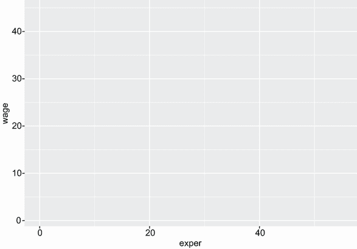

图 4.1 将工人经验和工资映射到 x 轴和 y 轴

为什么图表是空的？我们指定了 `exper` 变量应映射到 *x* 轴，而 `wage` 变量应映射到 *y* 轴，但我们还没有指定要在图上放置 *什么*。在这种情况下，我们希望用点来表示每个参与者。

### 4.1.2 几何对象

*几何对象* 是可以放置在图上的几何形状（点、线、条形和阴影区域）。它们通过以 `geom_` 开头的函数添加。目前，有 37 种不同的几何对象可用，且列表正在增长。表 4.1 描述了更常见的几何对象，以及每个几何对象常用的选项。

表 4.1 几何函数

| 函数 | 添加 | 选项 |
| --- | --- | --- |
| `geom_bar()` | 条形图 | `color`, `fill`, `alpha` |
| `geom_boxplot()` | 箱线图 | `color`, `fill`, `alpha`, `notch`, `width` |
| `geom_density()` | 密度图 | `color`, `fill`, `alpha`, `linetype` |
| `geom_histogram()` | 直方图 | `color`, `fill`, `alpha`, `linetype`, `binwidth` |
| `geom_hline()` | 水平线 | `color`, `alpha`, `linetype`, `size` |
| `geom_jitter()` | 振荡点 | `color`, `size`, `alpha`, `shape` |
| `geom_line()` | 折线图 | `colorvalpha`, `linetype`, `size` |
| `geom_point()` | 散点图 | `color`, `alpha`, `shape`, `size` |
| `geom_rug()` | 针状图 | `color`, `side` |
| `geom_smooth()` | 拟合线 | `method`, `formula`, `color`, `fill`, `linetype`, `size` |
| `geom_text()` | 文本注释 | 许多；请参阅该函数的帮助文档 |
| `geom_violin()` | 小提琴图 | `color`, `fill`, `alpha`, `linetype` |
| `geom_vline()` | 垂直线 | `color`, `alpha`, `linetype`, `size` |

我们将使用 `geom_point()` 函数添加点，创建散点图。在 `ggplot2` 图表中，函数通过使用 `+` 符号链接在一起来构建最终的图表：

```
library(ggplot2)
library(mosaicData)
ggplot(data = CPS85, mapping = aes(x = exper, y = wage)) +
  geom_point()
```

图 4.2 显示了结果。

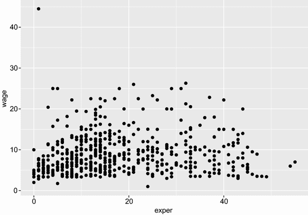

图 4.2 工作经验与工资的散点图

看起来，随着经验的增加，工资也会增加，但关系较弱。图表还表明存在一个异常值。有一个人工资远高于其他人。我们将删除这个案例并重新绘制图表：

```
CPS85 <- CPS85[CPS85$wage < 40, ] 
ggplot(data = CPS85, mapping = aes(x = exper, y = wage)) +
  geom_point()
```

图 4.3 显示了新的图表。

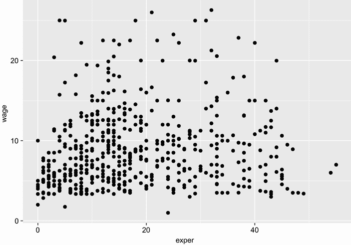

图 4.3 删除异常值后的工作经验与工资的散点图

在`geom_`函数中可以指定多个选项（见表 4.1）。`geom_point()`的选项包括`color`、`size`、`shape`和`alpha`。这些分别控制点的颜色、大小、形状和透明度。颜色可以通过名称或十六进制代码指定。形状和线型可以通过表示图案或符号的名称或数字指定。点的大小用从 0 开始的正实数指定。大数字产生更大的点大小。透明度从 0（完全透明）到 1（完全不透明）。添加一定程度的透明度可以帮助可视化重叠的点。这些选项的更详细描述在第十九章中。

让我们将图 4.3 中的点放大，半透明，并改为蓝色。我们还将使用`theme`（在第 4.1.7 节和第十九章中描述）将灰色背景改为白色。以下代码生成了图 4.4 中的图表：

```
ggplot(data = CPS85, mapping = aes(x = exper, y = wage)) +
  geom_point(color = "cornflowerblue", alpha = .7, size = 1.5) +
  theme_bw()
```

我可能会说，这个图表更吸引人（至少如果你有彩色输出），但它并没有增加我们的见解。如果图表中有一条总结经验与工资之间趋势的线，那将是有帮助的。

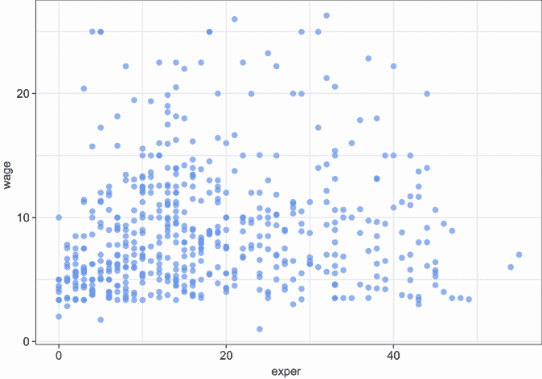

图 4.4 删除异常值后的工作经验与工资的散点图，修改了点的颜色、透明度和点的大小。应用了`bw`主题（深色背景）。

我们可以使用`geom_smooth()`函数添加这一行。选项控制线的类型（线性、二次、非参数），线的粗细，线的颜色，以及置信区间的存在与否。这些内容在第十一章中都有讨论。在这里，我们请求一个线性回归线（`method` `=` `lm`，其中`lm`代表线性模型）：

```
ggplot(data = CPS85, mapping = aes(x = exper, y = wage)) +
  geom_point(color = "cornflowerblue", alpha = .7, size = 1.5) +
  geom_smooth(method = "lm") +
  theme_bw()
```

结果显示在图 4.5 中。

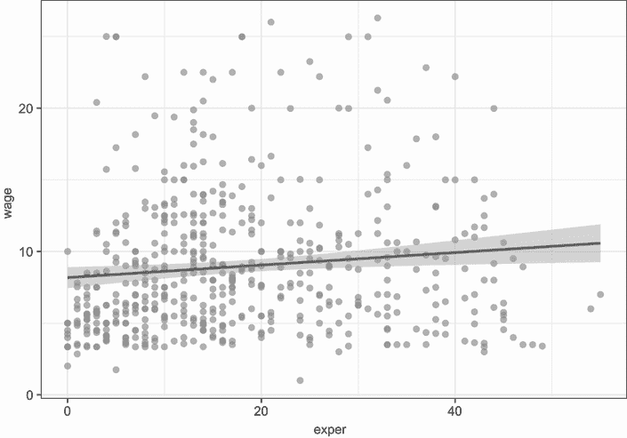

图 4.5 工作经验与工资的散点图，带有最佳拟合线

从这条线我们可以看出，平均而言，工资似乎随着经验的增加而适度增加。本章只使用了两个 geom。在未来的章节中，我们将使用其他 geom 来创建各种图表类型，包括条形图、直方图、箱线图、密度图等。

### 4.1.3 分组

在上一节中，我们将图形特征如颜色和透明度设置为 *常量* 值。然而，我们也可以将变量值映射到几何对象的颜色、形状、大小、透明度、线型和其他视觉特征。这使得多个观测值可以在单个图形中叠加（称为 *分组*）。

让我们在图形中添加 `sex` 并通过 `color`、`shape` 和 `linetype:` 来表示它：

```
ggplot(data = CPS85, 
       mapping = aes(x = exper, y = wage, 
                     color = sex, shape = sex, linetype = sex)) +
  geom_point(alpha = .7, size = 1.5) +
  geom_smooth(method = "lm", se = FALSE, size = 1.5) +
  theme_bw()
```

默认情况下，第一组（女性）由粉色填充的圆圈和实线粉色表示，而第二组（男性）由青色填充的三角形和虚线青色表示。图 4.6 显示了新的图形。

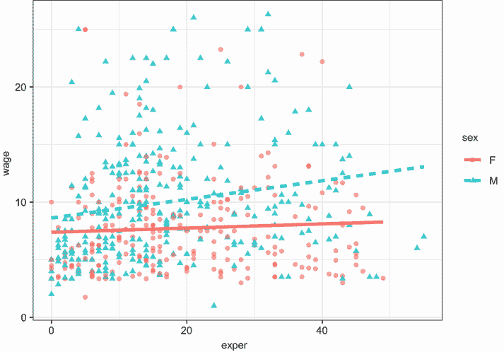

图 4.6 工作经验与工资的散点图，点按性别着色，并为男性和女性分别绘制最佳拟合线

注意，`color=sex,`、`shape=sex,` 和 `linetype=sex` 选项放置在 `aes()` 函数中，因为我们正在将一个变量映射到一个美学。添加 `geom_smooth` 选项（`se` `=` `FALSE`）用于抑制置信区间，使图形不那么复杂，更容易阅读。`size` `=` `1.5` 选项使线条略粗。

简化图形

通常，我们的目标是创建尽可能简单的图形，同时准确传达信息。在本章的图形中，我可能会将性别映射到颜色。将映射添加到形状和线型会使图形显得过于复杂。我添加它们是为了创建在本书的颜色（电子书）和灰度（印刷）格式中更容易阅读的图形。

现在看起来男性比女性赚的钱更多（更高的线）。此外，男性和工资之间的关系可能比女性更强（线更陡）。

### 4.1.4 尺度

如我们所见，`aes()` 函数用于将变量映射到图形的视觉特征。尺度指定了这些映射如何发生。例如，`ggplot2` 自动创建带有刻度标记、刻度标记标签和轴标签的图形轴。通常它们看起来很好，但偶尔您可能希望对其外观有更大的控制权。代表组别的颜色是自动选择的，但您可能希望根据您的品味或出版物的要求选择不同的颜色集。

尺度函数（以 `scale_` 开头）允许您修改默认的缩放。表 4.2 列出了一些常见的缩放函数。

表 4.2 一些常见的尺度函数

| 函数 | 描述 |
| --- | --- |
| `scale_x_continuous(), scale_y_continuous()` | 对定量变量的 *x* 和 *y* 轴进行缩放。选项包括 `breaks` 用于指定刻度标记，`labels` 用于指定刻度标记标签，以及 `limits` 用于控制显示值的范围。 |
| `scale_x_discrete(), scale_y_discrete()` | 与上述用于表示分类变量的轴相同。 |
| `scale_color_manual()` | 指定用于表示分类变量级别的颜色。`values`选项指定颜色。颜色表可以在[www.stat.columbia.edu/~tzheng/files/Rcolor.pdf](http://www.stat.columbia.edu/~tzheng/files/Rcolor.pdf)找到。 |

在下一个图表中，我们将更改 x 轴和 y 轴的缩放比例以及代表男性和女性的颜色。代表`exper`的 x 轴将从 0 到 60 以 10 为增量，代表`wage`的 y 轴将从 0 到 30 以 5 为增量。女性将被编码为偏红色，男性将被编码为偏蓝色。以下代码生成了图 4.7 中的图表：

```
ggplot(data = CPS85,
       mapping = aes(x = exper, y = wage, 
                     color = sex, shape=sex, linetype=sex)) +
   geom_point(alpha = .7, size = 3) +
   geom_smooth(method = "lm", se = FALSE, size = 1.5) +
   scale_x_continuous(breaks = seq(0, 60, 10)) +
   scale_y_continuous(breaks = seq(0, 30, 5)) +
   scale_color_manual(values = c("indianred3", "cornflowerblue")) +
 theme_bw()
```

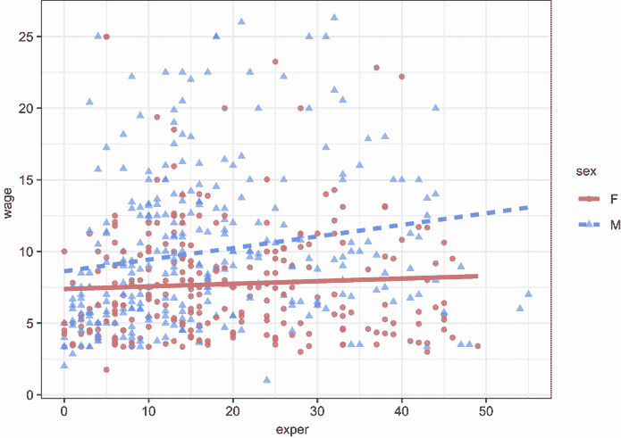

图 4.7 展示了工人经验与工资的散点图，具有自定义的 x 轴和 y 轴以及针对性别的自定义颜色映射

断点由值向量定义。在这里，`seq()`函数提供了一个快捷方式。例如，`seq(0, 60, 10)`生成一个从 0 开始，以 10 为增量，到 60 结束的数值向量。

x 轴和 y 轴上的数字更好，颜色也更吸引人（个人看法）。然而，工资是以美元计算的。我们可以使用`scale`包更改 y 轴上的标签，以表示美元，该包为美元、欧元、百分比等提供了标签格式化。

安装`scales`包（`install.packages("scales")`），然后运行以下代码：

```
ggplot(data = CPS85,
       mapping = aes(x = exper, y = wage, 
                                   color = sex, shape=sex, linetype=sex)) +
     geom_point(alpha = .7, size = 3) +
     geom_smooth(method = "lm", se = FALSE, size = 1.5) +
     scale_x_continuous(breaks = seq(0, 60, 10)) +
     scale_y_continuous(breaks = seq(0, 30, 5),
                        label = scales::dollar) +
     scale_color_manual(values = c("indianred3", "cornflowerblue")) +
  theme_bw()
```

图 4.8 提供了结果。

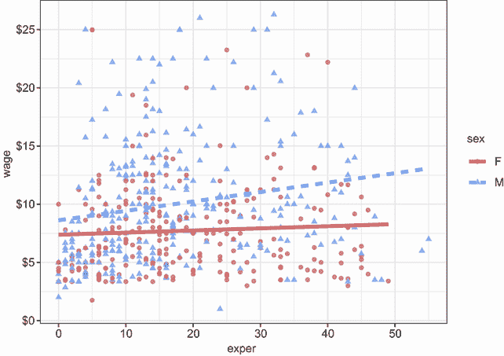

图 4.8 展示了工人经验与工资的散点图，具有自定义的 x 轴和 y 轴以及针对性别的自定义颜色映射。工资以美元格式打印。

我们肯定正在取得进展。下一个问题是经验、工资和性别之间的关系是否在每个工作部门都是相同的。让我们为每个工作部门重复这个图表一次来探索这一点。

### 4.1.5 分面

如果组在并排的图表中而不是在单个图表中重叠，关系可能更清晰。分面会为给定变量的每个级别（或变量的组合）复制一个图表。您可以使用`facet_wrap()`和`facet_grid()`函数创建分面图表。语法在表 4.3 中给出，其中`var`、`rowvar`和`colvar`是因子。

表 4.3 `ggplot2`分面函数

| 语法 | 结果 |
| --- | --- |
| `facet_wrap(~var, ncol=n)` | 将`var`的每个级别分别排列成 n 列 |
| `facet_wrap(~var, nrow=n)` | 将`var`的每个级别分别排列成 n 行 |
| `facet_grid(rowvar~colvar)` | 为`rowvar`和`colvar`的每个组合创建单独的图表，其中`rowvar`代表行，`colvar`代表列 |
| `facet_grid(rowvar~.)` | 为`rowvar`的每个级别创建单独的图表，排列成单列 |
| `facet_grid(.~colvar)` | 为`colvar`的每个级别创建单独的图表，排列成单行 |

在这里，面元将由职业变量的八个级别定义。由于每个面元都将比单独一个面板图更小，我们将从 `geom_point()` 中省略 `size=3`，从 `geom_smooth()` 中省略 `size=1.5`。这将减小点的大小和线的大小，与之前的图表相比，在分面图中看起来更好。以下代码生成了图 4.9：

```
ggplot(data = CPS85,
       mapping = aes(x = exper, y = wage, 
                     color = sex, shape = sex, linetype = sex)) +
  geom_point(alpha = .7) +
  geom_smooth(method = "lm", se = FALSE) +
  scale_x_continuous(breaks = seq(0, 60, 10)) +
  scale_y_continuous(breaks = seq(0, 30, 5),
                     label = scales::dollar) +
  scale_color_manual(values = c("indianred3", "cornflowerblue")) +
  facet_wrap(~sector) +
  theme_bw()
```

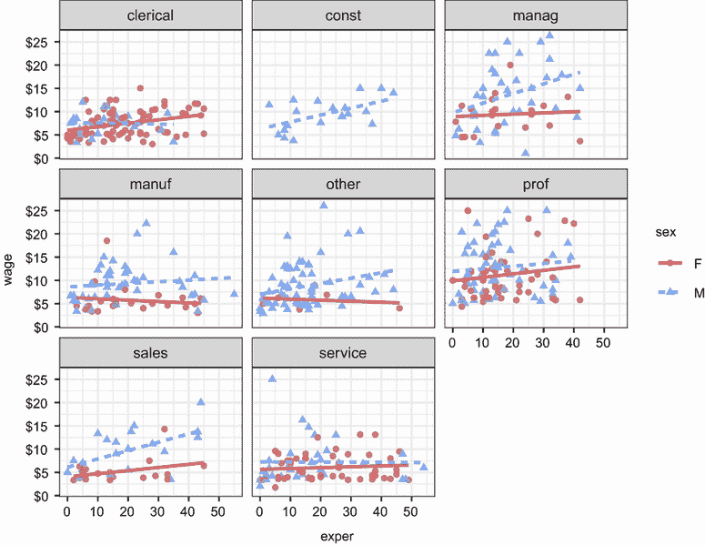

图 4.9 展示了工人经验与工资的关系散点图，具有自定义的 x 轴和 y 轴以及针对性别的自定义颜色映射。为八个职业领域的每个领域提供了单独的图表（面元）。

看起来，男性和女性之间的差异取决于考虑的职业领域。例如，对于男性经理来说，经验和工资之间存在强烈的正相关关系，但对于女性经理则没有。在某种程度上，这一点也适用于销售人员。对于男性和女性服务人员来说，似乎不存在经验和工资之间的关系。在任何情况下，男性赚得稍微多一些。对于女性文职人员来说，工资随着经验的增加而上升，但对于男性文职人员来说可能会下降（这里的关系可能不显著）。到目前为止，我们已经对工资与经验之间的关系有了深刻的见解。

### 4.1.6 标签

图表应该易于解释，并且信息标签是实现这一目标的关键元素。`labs()` 函数为坐标轴和图例提供自定义标签。此外，还可以添加自定义标题、副标题和说明。让我们在以下代码中修改每个部分：

```
ggplot(data = CPS85, 
       mapping = aes(x = exper, y = wage,
                 color = sex, shape=sex, linetype=sex)) +
    geom_point(alpha = .7) +
    geom_smooth(method = "lm", se = FALSE) +
    scale_x_continuous(breaks = seq(0, 60, 10)) +
    scale_y_continuous(breaks = seq(0, 30, 5),
                       label = scales::dollar) +
    scale_color_manual(values = c("indianred3", 
                                "cornflowerblue")) +
    facet_wrap(~sector) +
    labs(title = "Relationship between wages and experience",
       subtitle = "Current Population Survey",
       caption = "source: http://mosaic-web.org/",
       x = " Years of Experience",
       y = "Hourly Wage",
       color = "Gender", shape = "Gender", linetype = "Gender") +
  theme_bw()
```

图 4.10 展示了该图。

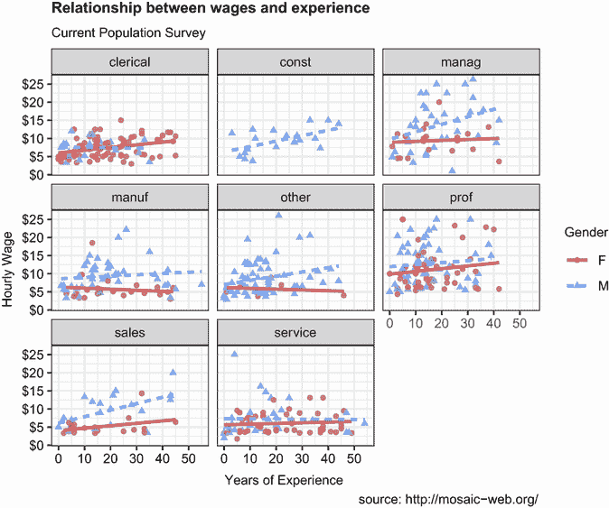

图 4.10 展示了八个职业领域的工人经验与工资的关系散点图，每个领域都有单独的图表（面元）和自定义标题和标签

现在查看者不需要猜测标签 `expr` 和 `wage` 的含义或数据来源。

### 4.1.7 主题

最后，我们可以使用主题来微调图表的外观。主题函数（以 `theme_` 开头）控制背景颜色、字体、网格线、图例位置和其他与数据无关的图表特征。让我们使用一个更简洁的主题。从图 4.4 开始，我们使用了一个产生白色背景和浅灰色参考线的主题。让我们尝试一个更简约的主题。以下代码生成了图 4.11：

```
ggplot(data = CPS85, 
       mapping = aes(x = exper, y = wage,
                 color = sex, shape=sex, linetype=sex)) +
    geom_point(alpha = .7) +
    geom_smooth(method = "lm", se = FALSE) +
    scale_x_continuous(breaks = seq(0, 60, 10)) +
    scale_y_continuous(breaks = seq(0, 30, 5),
                       label = scales::dollar) +
    scale_color_manual(values = c("indianred3", 
                                "cornflowerblue")) +
    facet_wrap(~sector) +
    labs(title = "Relationship between wages and experience",
       subtitle = "Current Population Survey",
       caption = "source: http://mosaic-web.org/",
       x = " Years of Experience",
       y = "Hourly Wage",
       color = "Gender", shape = "Gender", linetype = "Gender") +
  theme_minimal()
```

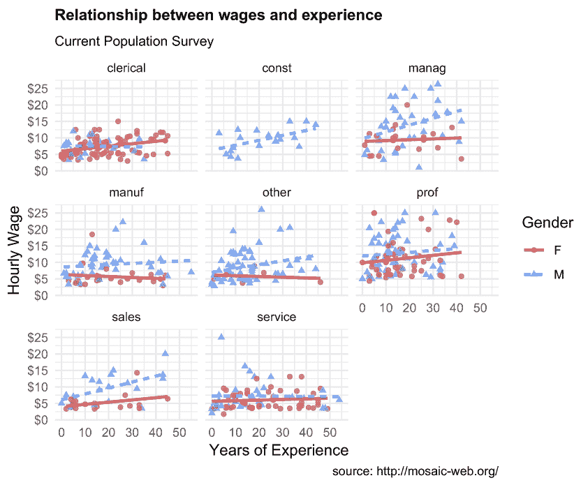

图 4.11 展示了工人经验与工资的关系散点图，每个八个职业领域都有单独的图表（面元），自定义标题和标签，以及更简洁的主题

这是我们完成的图表，准备发布。当然，这些发现是初步的。它们基于一个有限的样本量，并且没有进行统计测试来评估差异是否可能是由于偶然变化。第八章将描述适用于此类数据的适当测试。主题在第十九章中更详细地描述。

## 4.2 ggplot2 详细信息

在结束本章之前，有三个重要主题需要考虑：`aes()`函数的位置，将`ggplot2`图形作为 R 对象处理，以及将您的图形保存用于报告和网页的各种方法。

### 4.2.1 放置数据和映射选项

使用`ggplot2`创建的图始终以`ggplot`函数开始。在先前的示例中，`data=`和`mapping=`选项放置在这个函数中。在这种情况下，它们适用于随后的每个`geom`函数。

您也可以直接在 geom 中放置这些选项。在这种情况下，它们只适用于该*特定* geom。考虑以下图形：

```
ggplot(CPS85, aes(x = exper, y = wage, color = sex)) +
           geom_point(alpha = .7, size = 1.5) + 
           geom_smooth(method = "lm", se = FALSE, size = 1)  +
           scale_color_manual(values = c("lightblue", "midnightblue")) +
           theme_bw()
```

图 4.12 显示了结果图。

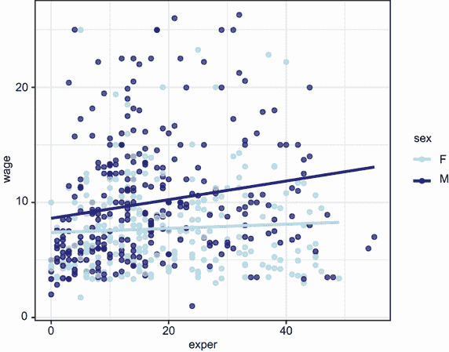

图 4.12 按性别显示经验和工资的散点图，其中`aes(color=sex)`放置在`ggplot()`函数中。映射应用于`geom_point()`和`geom_smooth()`，为男性和女性产生单独的点颜色，以及为所有工人产生单独的最佳拟合线。

由于性别到颜色的映射出现在`ggplot()`函数中，因此它适用于`geom_point`和`geom_smooth`。点的颜色表示性别，并为男性和女性产生单独的彩色趋势线。与以下内容比较

```
ggplot(CPS85,   aes(x = exper, y = wage)) +            
          geom_point(aes(color = sex), alpha = .7, size = 1.5) +             
          geom_smooth(method = "lm", se = FALSE, size = 1) + 
          scale_color_manual(values = c("lightblue", "midnightblue")) +   
          theme_bw()
```

图 4.13 显示了结果图。

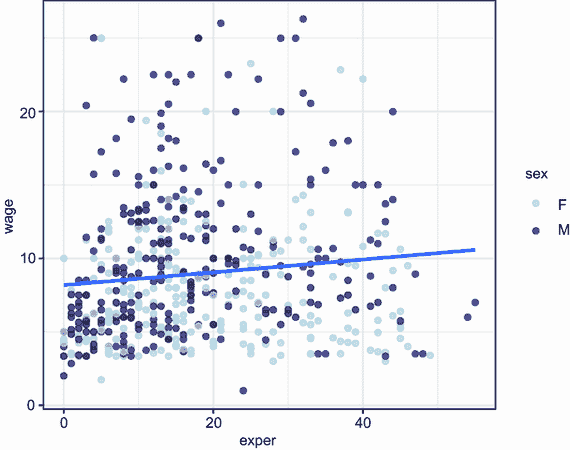

图 4.13 按性别显示经验和工资的散点图，其中`aes(color=sex)`放置在`geom_point()`函数中。映射应用于点颜色，为男性和女性产生单独的点颜色，但为所有工人产生单独的最佳拟合线。

由于性别到颜色的映射只出现在`geom_point()`函数中，因此它只在那里使用。为所有观测值创建一条趋势线。

本书中的大多数示例都将数据和映射选项放置在`ggplot`函数中。此外，省略了`data=`和`mapping=`短语，因为第一个选项始终指数据，第二个选项始终指映射。

### 4.2.2 图形作为对象

`ggplot2`图形可以保存为命名的 R 对象（列表），进一步操作，然后打印或保存到磁盘。考虑以下列表中的代码。

列表 4.1 使用`ggplot2`图形作为对象

```
data(CPS85 , package = "mosaicData")                      ❶
CPS85 <- CPS85[CPS85$wage < 40,]                          ❶

myplot <- ggplot(data = CPS85,                            ❷
            aes(x = exper, y = wage)) +                   ❷
       geom_point()                                       ❷

myplot                                                    ❸

myplot2 <- myplot + geom_point(size = 3, color = "blue")  ❹
myplot2                                                   ❹

myplot + geom_smooth(method = "lm") +                     ❺
  labs(title = "Mildly interesting graph")                ❺
```

❶ 准备数据。

❷ 创建散点图并将其保存为 myplot。

❸ 显示 myplot。

❹ 将点放大并变为蓝色，保存为 myplot2，并显示图形。

❺ 显示带有最佳拟合线和标题的 myplot。

首先，导入数据并移除异常值。然后，创建一个简单的经验与工资的散点图，并将其保存为 myplot。接下来，打印该图。然后通过改变点的大小和颜色修改该图，保存为 myplot2，并打印。最后，给原始图添加最佳拟合线和标题，并打印。请注意，这些更改不会被保存。

将图表保存为对象的能力允许您继续使用和修改它们。这可以节省大量时间（并帮助您避免腕管综合征）。在下一节中，我们将看到，当以编程方式保存图表时，这也很方便。

### 4.2.3 保存图表

您可以通过 RStudio 图形用户界面或通过您的代码保存由 `ggplot2` 创建的图表。要使用 RStudio 菜单保存图表，请转到“图表”选项卡并选择“导出”（见图 4.14）。

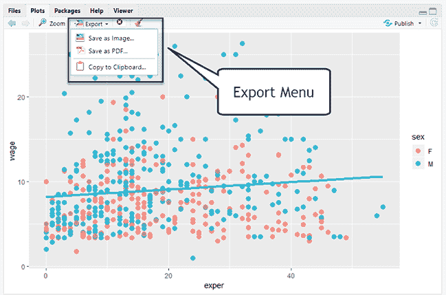

图 4.14 使用 RStudio 界面保存图表

可以使用 `ggsave()` 函数通过代码保存图表。您可以指定要保存的图表、其大小和格式以及保存位置。考虑以下示例：

```
ggsave(file="mygraph.png", plot=myplot, width=5, height=4)
```

这将 `myplot` 保存为当前工作目录中名为 mygraph.png 的 5" × 4" PNG 文件。您可以通过更改文件扩展名以不同的格式保存图表。表 4.4 列出了最常见的格式描述。

表 4.4 图像文件格式

| 扩展名 | 格式 |
| --- | --- |
| pdf | 可移植文档格式 |
| jpeg | JPEG |
| tiff | 标签图像文件格式 |
| png | 可移植网络图形 |
| svg | 可缩放矢量图形 |
| wmf | Windows 元文件 |

PDF、SVG 和 WMF 格式是矢量格式——它们可以无模糊或像素化地缩放。其他格式是位图——它们在缩放时将像素化。这在将小图像放大时尤为明显。PNG 格式是网页图像的常用格式。JPEG 和 TIF 格式通常保留用于照片。

WMF 格式通常推荐用于将在 Microsoft Word 或 PowerPoint 文档中出现的图表。MS Office 不支持 PDF 或 SVG 文件，WMF 格式可以很好地缩放。然而，WMF 文件将丢失任何已设置的透明度设置。

如果省略了 `plot=` 选项，则保存最近创建的图表。以下代码是有效的，并将图表保存为磁盘上的 PDF 文档：

```
ggplot(data=mtcars, aes(x=mpg)) + geom_histogram()
ggsave(file="mygraph.pdf")
```

查看 `help(ggsave)` 获取更多详细信息。

### 4.2.4 常见错误

在使用 `ggplot2` 几年后，我发现经常犯两个错误。第一个是省略或放置了错误的闭括号。这种情况最常发生在 `aes()` 函数之后。考虑以下代码：

```
ggplot(CPS85, aes(x = exper, y = wage, color = sex) +
  geom_point()
```

注意第一行末尾缺少一个闭括号。我无法告诉你我犯了多少次这样的错误。

第二个错误是将赋值与映射混淆。以下代码生成了图 4.15 中的图表：

```
ggplot(CPS85, aes(x = exper, y = wage, color = "blue")) +
  geom_point() 
```

`aes()` 函数用于将 *变量* 映射到图表的视觉特征。分配常量值应在 `aes()` 函数外部完成。正确的代码应该是

```
ggplot(CPS85, aes(x = exper, y = wage) +
  geom_point(color = "blue")
```

点是红色（而不是蓝色），图例也很奇怪。发生了什么？

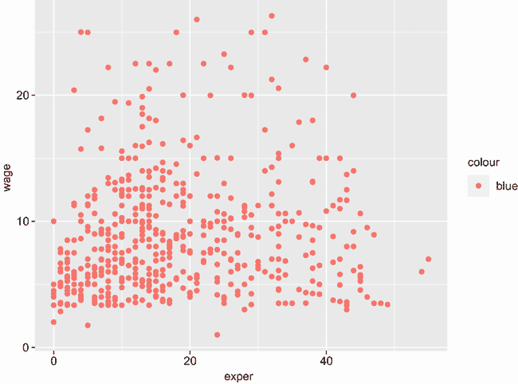

图 4.15 在 `aes()` 函数中放置赋值语句

## 摘要

+   `ggplot2` 软件包提供了一种语言和语法，用于创建全面的数据可视化。

+   散点图描述了两个定量变量之间的关系。

+   趋势线可以添加到散点图中以总结其关系。

+   您可以使用颜色、形状和大小来表示观察组的集合。

+   分面图对于绘制多个组的数据非常有用。

+   您可以使用刻度、标签和主题自定义图表。

+   图表可以保存为多种格式。
