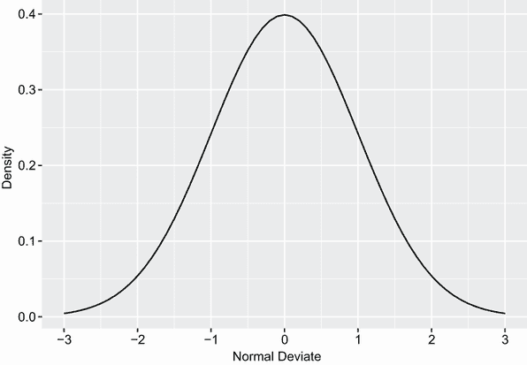

# 5 高级数据管理

本章涵盖

+   使用数学和统计函数

+   利用字符函数

+   循环和条件执行

+   编写自己的函数

+   聚合和重塑数据

在第三章中，我们回顾了在 R 中管理数据集的基本技术。在本章中，我们将关注高级主题。本章分为三个基本部分。在第一部分，我们将快速浏览 R 中用于数学、统计和字符操作的许多函数。为了使这一部分具有相关性，我们从可以使用这些函数解决的问题的数据管理问题开始。在介绍函数本身之后，我们将查看数据管理问题的可能解决方案之一。

接下来，我们将介绍如何编写自己的函数来完成数据管理和分析任务。首先，我们将探讨控制程序流程的方法，包括循环和条件语句的执行。然后，我们将研究用户编写的函数的结构以及如何创建后调用它们。

然后，我们将探讨聚合和汇总数据的方法，以及重塑和重新结构化数据集的方法。在聚合数据时，你可以指定使用任何适当的内置或用户编写的函数来完成汇总，因此你在本章前两部分学到的主题将真正对你有所帮助。

## 5.1 数据管理挑战

为了开始我们关于数值和字符函数的讨论，让我们考虑一个数据管理问题。一群学生在数学、科学和英语科目中参加了考试。你想要将这些分数合并，以确定每个学生的单个表现指标。此外，你想要将 A 等级分配给前 20% 的学生，B 等级分配给下一个 20%，依此类推。最后，你想要按字母顺序排序学生。表 5.1 展示了数据。

表 5.1 学生考试成绩

| 学生 | 数学 | 科学 | 英语 |
| --- | --- | --- | --- |
| 约翰·戴维斯 | 502 | 95 | 25 |
| 安吉拉·威廉姆斯 | 600 | 99 | 22 |
| 比尔温克尔·麋鹿 | 412 | 80 | 18 |
| 大卫·琼斯 | 358 | 82 | 15 |
| 詹妮斯·马克哈默 | 495 | 75 | 20 |
| 谢丽尔·卡辛 | 512 | 85 | 28 |
| 雷温·伊茨拉克 | 410 | 80 | 15 |
| 格雷格·诺克斯 | 625 | 95 | 30 |
| 乔尔·英格兰 | 573 | 89 | 27 |
| 玛丽·雷伯恩 | 522 | 86 | 18 |

当你查看这个数据集时，几个障碍立即显现。首先，三门考试的分数不可比。它们的平均值和标准差差异很大，所以平均它们没有意义。在合并之前，你必须将考试分数转换为可比单位。其次，你需要一种方法来确定学生在这些分数上的百分位数排名，以分配等级。第三，有一个单独的姓名字段，这使排序学生的任务复杂化。你需要将他们的名字拆分为名和姓，才能正确排序。

每个这些任务都可以通过巧妙地使用 R 的数值和字符函数来完成。在下一节中描述的函数工作完毕后，我们将考虑这个数据管理挑战的可能解决方案。

## 5.2 数值和字符函数

在本节中，我们将回顾 R 中的函数，这些函数可以用作操作数据的基本构建块。它们可以分为数值（数学、统计、概率）和字符函数。在我回顾每种类型之后，我将向您展示如何将函数应用于矩阵和数据框的列（变量）和行（观测值）（参见 5.2.6 节）。|

### 5.2.1 数学函数

表 5.2 列出了常见的数学函数及其简短示例。

表 5.2 数学函数

| 函数 | 描述 |
| --- | --- |
| `abs(*X*)` | 绝对值`abs(-4)` 返回 `4`。 |
| `sqrt(*X*)` | 平方根`sqrt(25)` 返回 `5`。这等同于 `25^(0.5)`。 |
| `ceiling(*X*)` | 不小于 *`x`* 的最小整数`ceiling(3.475)` 返回 `4`。 |
| `floor(*X*)` | 不大于 *`x`* 的最大整数`floor(3.475)` 返回 `3`。 |
| `trunc(*X*)` | 将 *`x`* 中的值截断到 0 的整数`trunc(5.99)` 返回 `5`。 |
| ``round(*X*, digits=*`n`*)`` | 将 *`x`* 四舍五入到指定的十进制位数`round(3.475, digits=2)` 返回 `3.48`。 |
| ``signif(*X*, digits=*`n`*)`` | 将 *`x`* 四舍五入到指定的有效数字位数`signif(3.475, digits=2)` 返回 `3.5`。 |
| `cos(*X*)`, `sin(*X*)`, `tan(*X*)` | 余弦，正弦和正切`cos(2)` 返回 `–0.416`。 |
| `acos(*X*)`, `asin(*X*)`, `atan(*X*)` | 反余弦，反正弦和反正切`acos(-0.416)` 返回 `2`。 |
| `cosh(*X*)`, `sinh(*X*)`, `tanh(*X*)` | 双曲余弦，双曲正弦和双曲正切`sinh(2)` 返回 `3.627`。 |
| `acosh(*X*)`, `asinh(*X*)`, `atanh(*X*)` | 双曲反余弦，双曲反正弦和双曲反正切`asinh(3.627)` 返回 `2`。 |

| ``log(*X*,base=*`n`*)```log(*X*)``log10(*X*)` | Logarithm of *`x`* to the base *`n`*For convenience: 
*   `log(*X*)` is the natural logarithm.

*   `log10(*X*)` is the common logarithm.

*   `log(10)` returns `2.3026`.

*   `log10(10)` returns `1`.

 |
| `exp(*X*)` | Exponential function`exp(2.3026)` returns `10`. |

Data transformation is one of the primary uses for these functions. For example, you often transform positively skewed variables such as income to a log scale before further analyses. Mathematical functions are also used as components in formulas, in plotting functions (for example, `x` `versus` `sin(x))`, and in formatting numerical values prior to printing.

The examples in table 5.2 apply mathematical functions to *scalars* (individual numbers). When these functions are applied to numeric vectors, matrices, or data frames, they operate on each individual value; for example: s`qrt(c(4,` `16,` `25))` returns `c(2,` `4,` `5)`.

### 5.2.2 Statistical functions

Table 5.3 presents common statistical functions. Many of these functions have optional parameters that affect the outcome. For example,

```

y <- mean(x)

```

provides the arithmetic mean of the elements in object `x`, and

```

z <- mean(x, trim = 0.05, na.rm=TRUE)

```

provides the trimmed mean, dropping the highest and lowest 5% of scores and any missing values. Use the `help()` function to learn more about each function and its arguments.

Table 5.3 Statistical functions

| Function | Description |
| `mean(*X*)` | Mean`mean(c(1,2,3,4))` returns `2.5`. |
| `median(*X*)` | Median`median(c(1,2,3,4))` returns `2.5`. |
| `sd(*X*)` | Standard deviation`sd(c(1,2,3,4))` returns `1.29`. |
| `var(*X*)` | Variance`var(c(1,2,3,4))` returns `1.67`. |
| `mad(*X*)` | Median absolute deviation`mad(c(1,2,3,4))` returns `1.48`. |
| `quantile(*X*, probs)` | Quantiles where *`x`* is the numeric vector, where quantiles are desired and `probs` is a numeric vector with probabilities in [0,1]`# 30th and 84th percentiles of x``y <- quantile(x, c(.3,.84))` |
| `range(*X*)` | Range`x <- c(1,2,3,4)``range(x)` returns `c(1,4)`.`diff(range(x))` returns `3`. |
| `sum(*X*)` | Sum`sum(c(1,2,3,4))` returns `10`. |
| `diff(*X*, lag=*n*)` | Lagged differences, with `lag` indicating which lag to use. The default lag is 1.`x<- c(1, 5, 23, 29)``diff(x)` returns `c(4, 18, 6)`. |
| `min(*X*)` | Minimum`min(c(1,2,3,4))` returns `1`. |
| `max(*X*)` | Maximum`max(c(1,2,3,4))` returns `4`. |
| `scale(x, center=TRUE,``scale=TRUE)` | Column center (`center=TRUE`) or standardize (`center=TRUE,` `scale=TRUE`) data object `x`. An example is given in listing 5.6. |

To see these functions in action, look at the next listing. This example demonstrates two ways to calculate the mean and standard deviation of a vector of numbers.

Listing 5.1 Calculating the mean and standard deviation

```

> x <- c(1,2,3,4,5,6,7,8)
> 
> mean(x)                     ❶

[1] 4.5                       ❶

> sd(x)                       ❶

[1] 2.449490                  ❶

> n <- length(x)              ❷
> 
> meanx <- sum(x)/n           ❷
> 
> css <- sum((x - meanx)²)   ❷
> 
> sdx <- sqrt(css / (n-1))    ❷
> 
> meanx                       ❷

[1] 4.5                       ❷

> sdx                         ❷

[1] 2.449490                  ❷

```

❶ Short way

❷ Long way

It’s instructive to view how the corrected sum of squares (`css`) is calculated in the second approach:

1.  `x` equals `c(1,` `2,` `3,` `4,` `5,` `6,` `7,` `8)`, and mean `x` equals 4.5 (`length(x)` returns the number of elements in `x`).

2.  `(x` `–` `meanx)` subtracts 4.5 from each element of `x`, resulting in `c(-3.5,` `-2.5,` `-1.5,` `-0.5,` `0.5,` `1.5,` `2.5,` `3.5)`

3.  `(x` `–` `meanx)²` squares each element of `(x` `-` `meanx)`, resulting in

    ```

    c(12.25, 6.25, 2.25, 0.25, 0.25, 2.25, 6.25, 12.25)

    ```

4.  `sum((x` `-` `meanx)²)` sums each of the elements of `(x` `-` `meanx)²)`, resulting in 42.

Writing formulas in R has much in common with matrix-manipulation languages such as MATLAB (we’ll look more specifically at solving matrix algebra problems in appendix D).

Standardizing data

By default, the `scale()` function standardizes the specified columns of a matrix or data frame to a mean of 0 and a standard deviation of 1:

```

newdata <- scale(mydata)

```

To standardize each column to an arbitrary mean and standard deviation, you can use code similar to the following:

```

newdata <- scale(mydata)*SD + M

```

where `M` is the desired mean and `SD` is the desired standard deviation. Using the `scale()` function on non-numeric columns produces an error. To standardize a specific column rather than an entire matrix or data frame, you can use code such as this:

```

newdata <- transform(mydata, myvar = scale(myvar)*10+50)

```

This code standardizes the variable `myvar` to a mean of 50 and standard deviation of 10\. You’ll use the `scale()` function in the solution to the data management challenge in section 5.3.

### 5.2.3 Probability functions

You may wonder why probability functions aren’t listed with the statistical functions (that was really bothering you, wasn’t it?). Although probability functions are statistical by definition, they’re unique enough to deserve their own section. Probability functions are often used to generate simulated data with known characteristics and to calculate probability values within user-written statistical functions.

In R, probability functions take the form

```

[dpqr]*distribution_abbreviation*()

```

where the first letter refers to the aspect of the *distribution* returned:

`d` = Density

`p` = Distribution function

`q` = Quantile function

`r` = Random generation (random deviates)

Table 5.4 lists the common probability functions.

Table 5.4 Probability distributions

| Distribution | Abbreviation | Distribution | Abbreviation |
| Beta | `beta` | Logistic | `logis` |
| Binomial | `binom` | Multinomial | `multinom` |
| Cauchy | `cauchy` | Negative binomial | `nbinom` |
| Chi-squared (noncentral) | `chisq` | Normal | `norm` |
| Exponential | `exp` | Poisson | `pois` |
| F | `f` | Wilcoxon signed rank | `signrank` |
| Gamma | `gamma` | T | `t` |
| Geometric | `geom` | Uniform | `unif` |
| Hypergeometric | `hyper` | Weibull | `weibull` |
| Lognormal | `lnorm` | Wilcoxon rank sum | `wilcox` |

To see how these work, let’s look at functions related to the normal distribution. If you don’t specify a mean and a standard deviation, the standard normal distribution is assumed (`mean=0`, `sd=1`). Table 5.5 gives examples of the density (`dnorm`), distribution (`pnorm`), quantile (`qnorm`), and random deviate generation (`rnorm`) functions.

Table 5.5 Normal distribution functions

| Problem | Solution |
| Plot the standard normal curve on the interval [–3,3] (see figure below). |  
```

library(ggplot2)

x <- seq(from = -3, to = 3, by = 0.1)

y = dnorm(x)

data <- data.frame(x = x, y=y)

ggplot(data, aes(x, y)) +

    geom_line()  +

    labs(x = "正态偏差",

            y = "密度") +

    scale_x_continuous(

        breaks = seq(-3, 3, 1))

```

 |
| What is the area under the standard normal curve to the left of z=1.96? | `pnorm(1.96)` equals `0.975`. |
| What is the value of the 90th percentile of a normal distribution with a mean of 500 and a standard deviation of 100? | `qnorm(.9, mean=500, sd=100)` equals `628.16`. |
| Generate 50 random normal deviates with a mean of 50 and a standard deviation of 10. | `rnorm(50, mean=50, sd=10)` |

Setting the seed for random number generation

Each time you generate pseudo-random deviates, a different seed, and therefore different results, are produced. To make your results reproducible, you can specify the seed explicitly using the `set.seed()` function. An example is given in the next listing. Here, the `runif()` function is used to generate pseudo-random numbers from a uniform distribution on the interval 0 to 1.

Listing 5.2 Generating pseudo-random numbers from a uniform distribution

```

> runif(5)

[1] 0.8725344 0.3962501 0.6826534 0.3667821 0.9255909

> runif(5)

[1] 0.4273903 0.2641101 0.3550058 0.3233044 0.6584988

> set.seed(1234)
> 
> runif(5)

[1] 0.1137034 0.6222994 0.6092747 0.6233794 0.8609154

> set.seed(1234)
> 
> runif(5)

[1] 0.1137034 0.6222994 0.6092747 0.6233794 0.8609154

```

By setting the seed manually, you’re able to reproduce your results. This ability can be helpful in creating examples you can access in the future and share with others.

Generating multivariate normal data

In simulation research and Monte Carlo studies, you often want to draw data from a multivariate normal distribution with a given mean vector and covariance matrix. The `draw.d.variate.normal()` function in the `MultiRNG` package makes this easy. After installing and loading the package, the function call is

```

draw.d.variate.normal(n, nvar, mean, sigma)

```

where `n` is the desired sample size, `nvar` is the number of variables, `mean` is the vector of means, and `sigma` is the variance-covariance (or correlation) matrix. Listing 5.3 samples 500 observations from a three-variable multivariate normal distribution for which the following are true:

| Mean vector | `230.7` | `146.7` | `3.6` |
| Covariance matrix | `15360.8` | `6721.2` | `-47.1` |
| `6721.2` | `4700.9` | `-16.5` |
| `-47.1` | `-16.5` | `0.3` |

Listing 5.3 Generating data from a multivariate normal distribution

```

> install.packages("MultiRNG")
> 
> library(MultiRNG)
> 
> options(digits=3)
> 
> set.seed(1234)                                                ❶
> 
> mean <- c(230.7, 146.7, 3.6)
> 
> sigma <- matrix(c(15360.8, 6721.2, -47.1,

                    6721.2, 4700.9, -16.5,                     ❷

                    -47.1,  -16.5,   0.3), nrow=3, ncol=3)    ❷

> mydata <- draw.d.variate.normal(500, 3, mean, sigma)          ❸
> 
> mydata <- as.data.frame(mydata)                               ❸
> 
> names(mydata) <- c("y","x1","x2")                             ❸
> 
> dim(mydata)                                                   ❹

[1] 500 3                                                       ❹

> head(mydata, n=10)                                            ❹

    y    x1   x2

1   81.1 122.6 3.69

2  265.1 110.4 3.49

3  365.1 235.3 2.67

4  -60.0  14.9 4.72

5  283.9 244.8 3.88

6  293.4 163.9 2.66

7  159.5  51.5 4.03

8  163.0 137.7 3.77

9  160.7 131.0 3.59

10 120.4  97.7 4.11

```

❶ Sets the random number seed

❷ Specifies the mean vector and covariance matrix

❸ Generates data

❹ Views the results

In listing 5.3, you set a random number seed so you can reproduce the results at a later time. You specify the desired mean vector and variance-covariance matrix and generate 500 pseudo-random observations. For convenience, the results are converted from a matrix to a data frame, and the variables are given names. Finally, you confirm that you have 500 observations and 3 variables, and you print out the first 10 observations. Note that because a correlation matrix is also a covariance matrix, you could have specified the correlation structure directly.

The `MultiRNG` package allows you to generate random data from 10 other multivariate distributions, including multivariate versions of the T, uniform, Bernoulli, hypergeometric, beta, multinomial, Laplace, and Wishart distributions.

The probability functions in R allow you to generate simulated data, sampled from distributions with known characteristics. Statistical methods that rely on simulated data have grown exponentially in recent years, and you’ll see several examples of these in later chapters.

### 5.2.4 Character functions

Whereas mathematical and statistical functions operate on numerical data, character functions extract information from textual data or reformat textual data for printing and reporting. For example, you may want to concatenate a person’s first name and last name, ensuring that the first letter of each is capitalized. Or you may want to count the instances of obscenities in open-ended feedback. Table 5.6 lists some of the most useful character functions.

Table 5.6 Character functions

| Function | Description |
| `nchar(*X*)` | Counts the number of characters of *`x`*.`x <- c("ab", "cde", "fghij")``length(x)` returns `3` (see table 5.7).`nchar(x[3])` returns `5`. |
| `substr(*X*, *start*, *stop*)` | Extracts or replaces substrings in a character vector.`x <- "abcdef"``substr(x, 2, 4)` returns `bcd`.`substr(x, 2, 4) <- "22222"` (`x` is now `"a222ef")`. |
| `grep(*pattern*, *X*, ignore.case=FALSE, fixed=FALSE)` | Searches for *`pattern`* in *X*. If `fixed=FALSE`, then *`pattern`* is a regular expression. If `fixed=TRUE`, then *`pattern`* is a text string. Returns the matching indices.`grep("A", c("b","A","ac", "Aw"), fixed=TRUE)` returns `c(2, 4)`. |
| `sub(*pattern*, *replacement*, *X*, ignore.case=FALSE, fixed=FALSE)` | Finds *`pattern`* in *`x`* and substitutes the *`replacement`* text. If `fixed=FALSE`, then *`pattern`* is a regular expression. If `fixed=TRUE`, then *`pattern`* is a text string.`sub("\\s",".","Hello There")` returns `Hello.There`. Note that `"\s"` is a regular expression for finding whitespace; use `"\\s"` instead, because `"\"` is R’s escape character (see section 1.3.4). |
| `strsplit(*X*, *split,* fixed=FALSE)` | Splits the elements of character vector *`x`* at *split*. If `fixed=FALSE`, then *`pattern`* is a regular expression. If `fixed=TRUE`, then *`pattern`* is a text string.`y <- strsplit("abc", "")` returns a one-component, three-element list containing`"a" "b" "c"``unlist(y)[2]` and `sapply(y, "[", 2)` both return `"b"`. |
| `paste(..., sep="")` | Concatenates strings after using the *sep* string to separate them.`paste("x",` `1:3,` `sep="")` returns `c("x1", "x2", "x3")`.`paste("x",1:3,sep="M")` returns `c("xM1","xM2"` `"xM3")`.`paste("Today is", date())` returns`Today is Thu Jul 22 10:36:14 2021` |
| `toupper(*X*)` | Uppercase.`toupper("abc")` returns `"ABC"`. |
| `tolower(*X*)` | Lowercase.`tolower("ABC")` returns `"abc"`. |

Note that the functions `grep()`, `sub()`, and `strsplit()` can search for a text string (`fixed=TRUE`) or a regular expression (`fixed=FALSE`); `FALSE` is the default. Regular expressions provide a clear and concise syntax for matching a pattern of text. For example, the regular expression

```

^[hc]?at

```

matches any string that starts with zero or one occurrences of h or c, followed by at. The expression therefore matches *hat*, *cat*, and *at*, but not *bat*. To learn more, see the *regular expression* entry in Wikipedia. Helpful tutorials include Ryans Regular Expression Tutorial ([`ryanstutorials.net/regular-expressions-tutorial/`](https://ryanstutorials.net/regular-expressions-tutorial/)) and an engaging interactive tutorial from RegexOne ([`regexone.com`](https://regexone.com)).

### 5.2.5 Other useful functions

The functions in table 5.7 are also quite useful for data management and manipulation, but they don’t fit cleanly into the other categories.

Table 5.7 Other useful functions

| Function | Description |
| `length(*X*)` | Returns the length of object *x.*`x <- c(2, 5, 6, 9)``length(x)` returns `4`. |
| `seq(*from*,` *to*`,` *by*`)` | Generates a sequence.`indices <- seq(1,10,2)``indices` is `c(1, 3, 5, 7, 9)`. |
| `rep(*X*,` *`n`*`)` | Repeats *`x`* *`n`* times.`y <- rep(1:3, 2)``y` is `c(1, 2, 3, 1, 2, 3)`. |
| `cut(*X*,` *`n`*`)` | Divides the continuous variable *`x`* into a factor with *`n`* levels. To create an ordered factor, include the option `ordered_result = TRUE`. |
| `cat(... , file = "myfile", append = FALSE)` | Concatenates the objects in ... and outputs them to the screen or to a file (if one is declared).`name <- c("Jane")``cat("Hello" , name, "\n")` |

The last example in the table demonstrates the use of escape characters in printing. Use `\n` for new lines, `\t` for tabs, `\'` for a single quote, `\b` for backspace, and so forth (type `?Quotes` for more information). For example, the code

```

name <- "Bob"

cat( "Hello", name, "\b.\n", "Isn\'t R", "\t", "GREAT?\n")

```

produces

```

Hello Bob.

Isn't R        GREAT?

```

Note that the second line is indented one space. When `cat` concatenates objects for output, it separates each by a space. That’s why you include the backspace (`\b`) escape character before the period. Otherwise, it would produce `"Hello` `Bob"`.

How you apply the functions covered so far to numbers, strings, and vectors is intuitive and straightforward, but how do you apply them to matrices and data frames? That’s the subject of the next section.

### 5.2.6 Applying functions to matrices and data frames

One of the interesting features of R functions is that they can be applied to a variety of data objects (scalars, vectors, matrices, arrays, and data frames). The following listing provides an example.

Listing 5.4 Applying functions to data objects

```

> a <- 5
> 
> sqrt(a)

[1] 2.236068

> b <- c(1.243, 5.654, 2.99)
> 
> round(b)

[1] 1 6 3

> c <- matrix(runif(12), nrow=3)
> 
> c

    [,1]  [,2]  [,3]  [,4]

[1,] 0.4205 0.355 0.699 0.323

[2,] 0.0270 0.601 0.181 0.926

[3,] 0.6682 0.319 0.599 0.215

> log(c)

    [,1]   [,2]   [,3]   [,4]

[1,] -0.866 -1.036 -0.358 -1.130

[2,] -3.614 -0.508 -1.711 -0.077

[3,] -0.403 -1.144 -0.513 -1.538

> mean(c)

[1] 0.444

```

Notice that the mean of matrix `c` in listing 5.4 results in a scalar (0.444). The `mean()` function takes the average of all 12 elements in the matrix. But what if you want the three row means or the four column means?

R provides a function, `apply()`, that allows you to `apply` an arbitrary function to any dimension of a matrix, array, or data frame. The format for the `apply()` function is

```

apply(x, MARGIN, FUN, ...)

```

where `x` is the data object, `MARGIN` is the dimension index, `FUN` is a function you specify, and `...` are any parameters you want to pass to `FUN`. In a matrix or data frame, `MARGIN=1` indicates rows and `MARGIN=2` indicates columns. Look at the following examples.

Listing 5.5 Applying a function to the rows (columns) of a matrix

```

> mydata <- matrix(rnorm(30), nrow=6)              ❶

> mydata

        [,1]   [,2]    [,3]   [,4]   [,5]

[1,]  0.71298  1.368 -0.8320 -1.234 -0.790

[2,] -0.15096 -1.149 -1.0001 -0.725  0.506

[3,] -1.77770  0.519 -0.6675  0.721 -1.350

[4,] -0.00132 -0.308  0.9117 -1.391  1.558

[5,] -0.00543  0.378 -0.0906 -1.485 -0.350

[6,] -0.52178 -0.539 -1.7347  2.050  1.569

> apply(mydata, 1, mean)                           ❷

[1] -0.155 -0.504 -0.511  0.154 -0.310  0.165

> apply(mydata, 2, mean)                           ❸

[1] -0.2907  0.0449 -0.5688 -0.3442  0.1906

> apply(mydata, 2, mean, trim=0.2)                 ❹

[1] -0.1699  0.0127 -0.6475 -0.6575  0.2312

```

❶ Generates data

❷ Calculates the row means

❸ Calculates the column means

❹ Calculates the trimmed column means

You start by generating a 6 × 5 matrix containing random normal variates ❶. Then you calculate the six row means ❷ and five column means ❸. Finally, you calculate the trimmed column means (in this case, means based on the middle 60% of the data, with the bottom 20% and top 20% of the values discarded) ❹.

Because `FUN` can be any R function, including a function that you write yourself (see section 5.4), `apply()` is a powerful mechanism. Whereas `apply()` applies a function over the margins of an array, `lapply()` and `sapply(`) apply a function over a list. You’ll see an example of `sapply()` (which is a user-friendly version of `lapply())` in the next section.

You now have all the tools you need to solve the data challenge presented in section 5.1, so let’s give it a try.

### 5.2.7 A solution for the data management challenge

Your challenge from section 5.1 is to combine subject test scores into a single performance indicator for each student, grade each student from A to F based on their relative standing (top 20%, next 20%, and so on), and sort the roster by last name followed by first name. The following listing gives a solution.

Listing 5.6 A solution to the learning example

```

> options(digits=2)                                                 ❶
> 
> Student <- c("John Davis", "Angela Williams", "Bullwinkle Moose",

            "David Jones", "Janice Markhammer", "Cheryl Cushing",

            "Reuven Ytzrhak", "Greg Knox", "Joel England",

            "Mary Rayburn")

> Math <- c(502, 600, 412, 358, 495, 512, 410, 625, 573, 522)
> 
> Science <- c(95, 99, 80, 82, 75, 85, 80, 95, 89, 86)
> 
> English <- c(25, 22, 18, 15, 20, 28, 15, 30, 27, 18)
> 
> roster <- data.frame(Student, Math, Science, English,

                    stringsAsFactors=FALSE)

> z <- scale(roster[,2:4])                                          ❷❹
> 
> score <- apply(z, 1, mean)                                        ❸❹
> 
> roster <- cbind(roster, score)                                    ❸❹
> 
> y <- quantile(score, c(.8,.6,.4,.2))                              ❺❼
> 
> roster$grade <- NA                                                ❻❼
> 
> roster$grade[score >= y[1]] <- "A"                                ❻❼
> 
> roster$grade[score < y[1] & score >= y[2]] <- "B"                 ❻❼
> 
> roster$grade[score < y[2] & score >= y[3]] <- "C"                 ❻❼
> 
> roster$grade[score < y[3] & score >= y[4]] <- "D"                 ❻❼
> 
> roster$grade[score < y[4]] <- "F"                                 ❻❼
> 
> name <- strsplit((roster$Student), " ")                           ❽❿
> 
> Lastname <- sapply(name, "[", 2)                                  ❾❿
> 
> Firstname <- sapply(name, "[", 1)                                 ❾❿
> 
> roster <- cbind(Firstname,Lastname, roster[,-1])                  ❾❿
> 
> roster <- roster[order(Lastname,Firstname),]                      ⓫⓬
> 
> roster

    Firstname   Lastname 数学 科学 英语 分数 等级

6      Cheryl    Cushing  512      85      28  0.35     C

1        John      Davis  502      95      25  0.56     B

9        Joel    England  573      89      27  0.70     B

4       David      Jones  358      82      15 -1.16     F

8        Greg       Knox  625      95      30  1.34     A

5      Janice Markhammer  495      75      20 -0.63     D

3  Bullwinkle      Moose  412      80      18 -0.86     D

10       Mary    Rayburn  522      86      18 -0.18     C

2      Angela   Williams  600      99      22  0.92     A

7      Reuven    Ytzrhak  410      80      15 -1.05     F

```

❶ Step 1

❷ Step 2

❸ Step 3

❹ Obtains the performance scores

❺ Step 4

❻ Step 5

❼ Grades the students

❽ Step 6

❾ Step 7

❿ Extracts the last and first names

⓫ Step 8

⓬ Sorts by last and first names

The code is dense, so let’s walk through the solution step by step.

1.  The original student roster is given. `options(digits=2)` limits the number of digits printed after the decimal place and makes the printouts easier to read:

    ```

    > 选项(数字=2)
    > 
    > roster

                学生 数学 科学

    1         John Davis  502      95      25

    2    Angela Williams  600      99      22

    3   Bullwinkle Moose  412      80      18

    4        David Jones  358      82      15

    5  Janice Markhammer  495      75      20

    6     Cheryl Cushing  512      85      28

    7     Reuven Ytzrhak  410      80      15

    8          Greg Knox  625      95      30

    9       Joel England  573      89      27

    10      Mary Rayburn  522      86      18

    ```

2.  Because the math, science, and English tests are reported on different scales (with widely differing means and standard deviations), you need to make them comparable before combining them. One way to do this is to standardize the variables so that each test is reported in standard deviation units rather than in their original scales. You can do this with the `scale()` function:

    ```

    > z <- scale(roster[,2:4])
    > 
    > z

            数学 科学 英语

    [1,]  0.013   1.078    0.587

    [2,]  1.143   1.591    0.037

    [3,] -1.026  -0.847   -0.697

    [4,] -1.649  -0.590   -1.247

    [5,] -0.068  -1.489   -0.330

    [6,]  0.128  -0.205    1.137

    [7,] -1.049  -0.847   -1.247

    [8,]  1.432   1.078    1.504

    [9,]  0.832   0.308    0.954

    [10,]  0.243  -0.077   -0.697

    ```

3.  You can then get a performance score for each student by calculating the row means using the `mean()` function and adding them to the roster using the `cbind()` function:

    ```

    > score <- apply(z, 1, mean)
    > 
    > roster <- cbind(roster, score)
    > 
    > roster

                学生 数学 科学 英语 分数

    1         John Davis  502      95      25  0.56

    2    Angela Williams  600      99      22  0.92

    3   Bullwinkle Moose  412      80      18 -0.86

    4        David Jones  358      82      15 -1.16

    5  Janice Markhammer  495      75      20 -0.63

    6     Cheryl Cushing  512      85      28  0.35

    7     Reuven Ytzrhak  410      80      15

    8          Greg Knox  625      95      30  1.34

    9       Joel England  573      89      27  0.70

    10      Mary Rayburn  522      86      18 -0.18

    ```

4.  The `quantile()` function gives you the percentile rank of each student’s performance score. You see that the cutoff for an A is 0.74, for a B is 0.44, and so on:

    ```

    > y <- quantile(roster$score, c(.8,.6,.4,.2))
    > 
    > y

    80%   60%   40%   20%

    0.74  0.44 -0.36 -0.89

    ```

5.  Using logical operators, you can recode students’ percentile ranks into a new categorical grade variable. This code creates the variable `grade` in the `roster` data frame:

    ```

    > roster$grade <- NA
    > 
    > roster$grade[score >= y[1]] <- "A"
    > 
    > roster$grade[score < y[1] & score >= y[2]] <- "B"
    > 
    > 罗列$等级[score < y[2] & score >= y[3]] <- "C"
    > 
    > 罗列$等级[score < y[3] & score >= y[4]] <- "D"
    > 
    > 罗列$等级[score < y[4]] <- "F"
    > 
    > 罗列

                学生 数学 科学 英语 分数 等级

    1         John Davis  502      95      25  0.56     B

    2    Angela Williams  600      99      22  0.92     A

    3   Bullwinkle Moose  412      80      18 -0.86     D

    4        David Jones  358      82      15 -1.16     F

    5  Janice Markhammer  495      75      20 -0.63     D

    6     Cheryl Cushing  512      85      28  0.35     C

    7     Reuven Ytzrhak  410      80      15 -1.05     F

    8          Greg Knox  625      95      30  1.34     A

    9       Joel England  573      89      27  0.70     B

    10      Mary Rayburn  522      86      18 -0.18     C

    ```

6.  You use the `strsplit()` function to break the student names into first name and last name at the space character. Applying `strsplit()` to a vector of strings returns a list:

    ```

    > name <- strsplit((roster$Student), " ")
    > 
    > name

    [[1]]

    [1] "John"  "Davis"

    [[2]]

    [1] "Angela"   "Williams"

    [[3]]

    [1] "Bullwinkle" "Moose"

    [[4]]

    [1] "David" "Jones"

    [[5]]

    [1] "Janice"     "Markhammer"

    [[6]]

    [1] "Cheryl"  "Cushing"

    [[7]]

    [1] "Reuven"  "Ytzrhak"

    [[8]]

    [1] "Greg" "Knox"

    [[9]]

    [1] "Joel"    "England"

    [[10]]

    [1] "Mary"    "Rayburn"

    ```

7.  You use the `sapply()` function to take the first element of each component and put it in a `Firstname` vector, and the second element of each component and put it in a `Lastname` vector. `"["` is a function that extracts part of an object—here the first or second component of the list name. You use `cbind()` to add these elements to the roster. Because you no longer need the `student` variable, you drop it (with the `–1` in the roster index):

    ```

    > 名字 <- sapply(name, "[", 1)
    > 
    > 姓氏 <- sapply(name, "[", 2)
    > 
    > 罗列 <- cbind(名字, 姓氏, 罗列[,-1])
    > 
    > 罗列

        名字   姓氏 数学 科学 英语 分数 等级

    1        John      Davis  502      95      25  0.56     B

    2      Angela   Williams  600      99      22  0.92     A

    3  Bullwinkle      Moose  412      80      18 -0.86     D

    4       David      Jones  358      82      15 -1.16     F

    5      Janice Markhammer  495      75      20 -0.63     D

    6      Cheryl    Cushing  512      85      28  0.35     C

    7      Reuven    Ytzrhak  410      80      15 -1.05     F

    8        Greg       Knox  625      95      30  1.34     A

    9        Joel    England  573      89      27  0.70     B

    10       Mary    Rayburn  522      86      18 -0.18     C

    ```

8.  Finally, you sort the dataset by first and last name using the `order()` function:

    ```

    > 罗列[order(姓氏,名字),]

        名字   姓氏 数学 科学 英语 分数 等级

    6      Cheryl    Cushing  512      85      28  0.35     C

    1        John      Davis  502      95      25  0.56     B

    9        Joel    England  573      89      27  0.70     B

    4       David      Jones  358      82      15 -1.16     F

    8        Greg       Knox  625      95      30  1.34     A

    5      Janice Markhammer  495      75      20 -0.63     D

    3  Bullwinkle      Moose  412      80      18 -0.86     D

    10       Mary    Rayburn  522      86      18 -0.18     C

    2      Angela   Williams  600      99      22  0.92     A

    7      Reuven    Ytzrhak  410      80      15 -1.05     F

    ```

Voilà! Piece of cake!

There are many other ways to accomplish these tasks, but this code helps capture the flavor of these functions. Now it’s time to look at control structures and user-written functions.

## 5.3 Control flow

In the normal course of events, the statements in an R program are executed sequentially from the top of the program to the bottom. But there are times that you’ll want to execute some statements repetitively while executing other statements only if certain conditions are met. This is where control-flow constructs come in.

R has the standard control structures you’d expect to see in a modern programming language. First, we’ll go through the constructs used for conditional execution, followed by the constructs used for looping.

For the syntax examples throughout this section, keep the following in mind:

*   `statement` is a single R statement or a compound statement (a group of R statements enclosed in curly braces {} and separated by semicolons).

*   `cond` is an expression that resolves to `TRUE` or `FALSE`.

*   `expr` is a statement that evaluates to a number or character string.

*   `seq` is a sequence of numbers or character strings.

After we discuss control-flow constructs, you’ll learn how to write your own functions.

### 5.3.1 Repetition and looping

Looping constructs repetitively execute a statement or series of statements until a condition isn’t true. These include the `for` and `while` structures.

for

The `for` loop executes a `statement` repetitively for each value in the vector `seq`. The syntax is

```

for (var in seq) 语句

```

In this example,

```

for (i in 1:10)  print("Hello")

```

the word *Hello* is printed 10 times.

while

A `while` loop executes a `statement` repetitively until the condition is no longer true. The syntax is

```

while (cond) statement

```

In a second example, the code

```

i <- 10

while (i > 0) {print("Hello"); i <- i - 1}

```

once again prints the word *Hello* 10 times. Make sure the statements inside the brackets modify the `while` condition so that sooner or later, it’s no longer true—otherwise, the loop will never end! In the previous example, the statement

```

i <- i – 1

```

subtracts 1 from object `i` on each loop, so that after the tenth loop, it’s no longer larger than 0\. If you instead added 1 on each loop, R would never stop saying *Hello*. This is why `while` loops can be more dangerous than other looping constructs.

Looping in R can be inefficient and time consuming when you’re processing the rows or columns of large datasets. Whenever possible, it’s better to use R’s built-in numerical and character functions in conjunction with the `apply` family of functions.

### 5.3.2 Conditional execution

In conditional execution, a statement or statements are executed only if a specified condition is met. These constructs include `if-else`, `ifelse`, and `switch`.

if-else

The `if-else` control structure executes a statement if a given condition is true. Optionally, a different statement is executed if the condition is false. The syntax is

```

if (cond) statement

if (cond) statement1 else statement2

```

Here are some examples:

```

if (is.character(等级)) 等级 <- as.factor(等级)

if (!is.factor(等级)) 等级 <- as.factor(等级) else print(“Grade already

    is a factor”)

```

In the first instance, if `grade` is a character vector, it’s converted into a factor. In the second instance, one of two statements is executed. If grade isn’t a factor (note the ! symbol), it’s turned into one. If it’s a factor, then the message is printed.

ifelse

The `ifelse` construct is a compact and vectorized version of the `if-else` construct. The syntax is

```

ifelse(cond, statement1, statement2)

```

The first statement is executed if `cond` is `TRUE`. If `cond` is `FALSE`, the second statement is executed. Here are some examples:

```

ifelse(score > 0.5, print("Passed"), print("Failed"))

outcome <- ifelse (score > 0.5, "Passed", "Failed")

```

Use `ifelse` when you want to take a binary action or when you want to input and output vectors from the construct.

switch

`switch` chooses statements based on the value of an expression. The syntax is

```

switch(expr, ...)

```

where `...` represents statements tied to the possible outcome values of `expr`. It’s easiest to understand how `switch` works by looking at the example in the following listing.

Listing 5.7 A `switch` example

```

> feelings <- c("sad", "afraid")
> 
> for (i in feelings)

    print(

    switch(i,

        happy  = "I am glad you are happy",

        afraid = "There is nothing to fear",

        sad    = "Cheer up",

        angry  = "Calm down now"

    )

    )

[1] "Cheer up"

[1] "There is nothing to fear"

```

This is a silly example, but it shows the main features. You’ll learn how to use `switch` in user-written functions in the next section.

## 5.4 User-written functions

One of R’s greatest strengths is the user’s ability to add functions. In fact, many of R’s functions are functions of existing functions. The structure of a function looks like this:

```

myfunction <- function(arg1, arg2, ... ){

statements

return(object)

}

```

Objects in the function are local to the function. The object returned can be any data type, from scalar to list. Let’s look at an example.

Say you’d like to have a function that calculates the central tendency and spread of data objects. The function should give you a choice between parametric (mean and standard deviation) and nonparametric (median and median absolute deviation) statistics. The results should be returned as a named list. Additionally, the user should have the choice of automatically printing the results or not. Unless otherwise specified, the function’s default behavior should be to calculate parametric statistics and not print the results. One solution is given in the following listing.

Listing 5.8 `mystats()`: a user-written function for summary statistics

```

mystats <- function(x, parametric=TRUE, print=FALSE) {

if (parametric) {

    center <- mean(x); spread <- sd(x)

} else {

    center <- median(x); spread <- mad(x)

}

if (print & parametric) {

    cat("Mean=", center, "\n", "SD=", spread, "\n")

} else if (print & !parametric) {

    cat("Median=", center, "\n", "MAD=", spread, "\n")

}

result <- list(center=center, spread=spread)

return(result)

}

```

To see this function in action, first generate some data (a random sample of size `500` from a normal distribution):

```

set.seed(1234)

x <- rnorm(500)

```

After executing the statement

```

y <- mystats(x)

```

`y$center` contains the mean (0.00184), and `y$spread` contains the standard deviation (1.03). No output is produced. If you execute the statement

```

y <- mystats(x, parametric=FALSE, print=TRUE)

```

`y$center` contains the median (–0.0207), and `y$spread` contains the median absolute deviation (1.001). In addition, the following output is produced:

```

Median= -0.0207

MAD= 1

```

Next, let’s look at a user-written function that uses the `switch` construct. This function gives the user a choice regarding the format of today’s date. Values that are assigned to parameters in the function declaration are taken as defaults. In the `mydate()` function, `long` is the default format for dates if `type` isn’t specified:

```

mydate <- function(type="long") {

switch(type,

    long =  format(Sys.time(), "%A %B %d %Y"),

    short = format(Sys.time(), "%m-%d-%y"),

    cat(type, "is not a recognized type\n")

)

}

```

Here’s the function in action:

```

> mydate("long")

[1] "Saturday July 24 2021"

> mydate("short")

[1] "07-24-21"

> mydate()

[1] "Saturday July 24 2021"

> mydate("medium")

medium is not a recognized type

```

Note that the `cat()` function is executed only if the entered type doesn’t match `"long"` or `"short"`. It’s usually a good idea to have an expression that catches user-supplied arguments that have been entered incorrectly.

Several functions can help add error trapping and correction to your functions. You can use the function `warning``()` to generate a warning message, `message()` to generate a diagnostic message, and `stop()` to stop execution of the current expression and carry out an error action. I will discuss error trapping and debugging more fully in section 20.6.

After creating your own functions, you may want to make them available in every session. Appendix B describes how to customize the R environment so that user-written functions are loaded automatically at startup. We’ll look at additional examples of user-written functions in later chapters.

You can accomplish a great deal using the basic techniques provided in this section. Control flow and other programming topics are covered in greater detail in chapter 20\. Creating a package is covered in chapter 22\. If you’d like to explore the subtleties of function writing, or you want to write professional-level code that you can distribute to others, I recommend reading these two chapters and then reviewing three excellent books listed in the References section: Venables and Ripley (2000), Chambers (2008), and Wickham(2019). Together, they provide a significant level of detail and breadth of examples.

Now that we’ve covered user-written functions, we’ll end this chapter with a discussion of data aggregation and reshaping.

## 5.5 Reshaping data

When you *reshape* data, you alter the structure (rows and columns) determining how the data is organized. The three most common reshaping tasks are (1) transposing a dataset; (2) converting a wide dataset to a long dataset; and (3) converting a long dataset to a wide dataset. Each is described in the following sections.

### 5.5.1 Transposing

*Transposing* (reversing rows and columns) is perhaps the simplest method of reshaping a dataset. Use the `t()` function to transpose a matrix or a data frame. In the latter case, the data frame is converted to a matrix first, and row names become variable (column) names.

We’ll illustrate transposing using the `mtcars` data frame that’s included with the base installation of R. This dataset, extracted from *Motor Trend* magazine (1974), describes the design and performance characteristics (number of cylinders, displacement, horsepower, mpg, and so on) for 34 automobiles. To learn more about the dataset, see `help(mtcars)`.

The following listing shows an example of the transpose operation. A subset of the dataset in used to conserve space on the page.

Listing 5.9 Transposing a dataset

```

> cars <- mtcars[1:5,1:4]
> 
> cars

                mpg cyl disp  hp

Mazda RX4         21.0   6  160 110

Mazda RX4 Wag     21.0   6  160 110

Datsun 710        22.8   4  108  93

Hornet 4 Drive    21.4   6  258 110

Hornet Sportabout 18.7   8  360 175

> t(cars)

    Mazda RX4 Mazda RX4 Wag Datsun 710 Hornet 4 Drive Hornet Sportabout

mpg         21            21       22.8           21.4              18.7

cyl          6             6        4.0            6.0               8.0

disp       160           160      108.0          258.0             360.0

hp         110           110       93.0          110.0             175.0

```

The `t()` function always returns a matrix. Since a matrix can only have one type (numeric, character, or logical), the transpose operation works best when all the variables in the original dataset are numeric or logical. If there are any character variables in the dataset, the *entire* dataset will be converted to character values in the resulting transpose.

### 5.5.2 Converting from wide to long dataset formats

A rectangular dataset is typically in either wide or long format. In *wide format*, each row represents a unique *observation*. Table 5.8 shows an example. The table contains the life expectancy estimates for four countries in 1990, 2000, and 2010\. It is part of a much larger dataset obtained from Our World in Data ([`ourworldindata.org/life-expectancy`](https://ourworldindata.org/life-expectancy)). Note that each row represents the data gathered on a country.

Table 5.8 Life expectancy by year and country—wide format

| ID | Country | LExp1990 | LExp2000 | LExp2010 |
| AU | Australia | 76.9 | 79.6 | 82.0 |
| CN | China | 69.3 | 72.0 | 75.2 |
| PRK | North Korea | 69.9 | 65.3 | 69.6 |

In *long format*, each row represents a unique *measurement*. Table 5.9 shows an example with the same data in long format.

Table 5.9 Life expectancy by year and country—long format

| ID | Country | Variable | LifeExp |
| AU | Australia | LExp1990 | 76.9 |
| CN | China | LExp1990 | 69.3 |
| PRK | North Korea | LExp1990 | 69.9 |
| AU | Australia | LExp2000 | 79.6 |
| CN | China | LExp2000 | 72.0 |
| PRK | North Korea | LExp2000 | 65.3 |
| AU | Australia | LExp2010 | 82.0 |
| CN | China | LExp2010 | 75.2 |
| PRK | North Korea | LExp2010 | 69.6 |

Different types of data analysis can require different data formats. For example, if you want to identify countries that have similar life expectancy trends over time, you could use cluster analysis (chapter 16). Cluster analysis requires data that is in wide format. On the other hand, you may want to predict life expectancy from country and year using multiple regression (chapter 8). In this case, the data would have to be in long format.

While most R functions expect wide format data frames, some require the data to be in a long format. Fortunately, the `tidyr` package provides functions that can easily convert data frames from one format to the other. Use `install.packages("tidyr")` to install the package before continuing.

The `gather()` function in the `tidyr` package converts a wide format data frame to a long format data frame. The syntax is

```

longdata <- gather(widedata, key, value, variable list)

```

where

*   `widedata` is the data frame to be converted.

*   `key` specifies the name to be used for the variable column (Variable in this example).

*   `value` specifies the name to be used for the value column (LifeExp in this example).

*   `variable list` specifies the variables to be stacked (LExp1990, LExp2000, LExp2010 in this example).

The following listing shows an example.

Listing 5.10 Converting a wide format data frame to a long format

```

> library(tidyr)
> 
> data_wide <- data.frame(ID = c("AU", "CN", "PRK"),

                        Country = c("Australia", "China", "North Korea"),

                        LExp1990 = c(76.9, 69.3, 69.9),

                        LExp2000 = c(79.6, 72.0, 65.3),

                        LExp2010 = c(82.0, 75.2, 69.6))

> data_wide

ID     Country LExp1990 LExp2000 LExp2010

1  AU   Australia     76.9     79.6     82.0

2  CN       China     69.3     72.0     75.2

3 PRK North Korea     69.9     65.3     69.6

> data_long <- gather(data_wide, key="Variable", value="Life_Exp",

                    c(LExp1990, LExp2000, LExp2010))

> data_long

ID     Country Variable Life_Exp

1  AU   Australia LExp1990     76.9

2  CN       China LExp1990     69.3

3 PRK North Korea LExp1990     69.9

4  AU   Australia LExp2000     79.6

5  CN       China LExp2000     72.0

6 PRK North Korea LExp2000     65.3

7  AU   Australia LExp2010     82.0

8  CN       China LExp2010     75.2

9 PRK North Korea LExp2010     69.6

```

The `spread()` function in the `tidyr` package converts a long format data frame to a wide format data frame. The format is

```

widedata <- spread(longdata, key, value)

```

where

*   `longdata` is the data frame to be converted.

*   `key` is the column containing the variable names.

*   `value` is the column containing the variable values.

Continuing the example, the code in the following listing is used to convert the long format data frame back to a wide format.

Listing 5.11 Converting a long format data frame to a wide format

```

> data_wide <- spread(data_long, key=Variable, value=Life_Exp)
> 
> data_wide

ID     Country Variable Life_Exp

1  AU   Australia     76.9     79.6     82.0

2  CN       China     69.3     72.0     75.2

3 PRK North Korea     69.9     65.3     69.6

```

To learn more about the long and wide data formats, see Simon Ejdemyr’s excellent tutorial ([`sejdemyr.github.io/r-tutorials/basics/wide-and-long/`](https://sejdemyr.github.io/r-tutorials/basics/wide-and-long/)).

## 5.6 Aggregating data

When you aggregate data, you replace groups of observations with summary statistics based on those observations. Data aggregation can be a precursor to statistical analyses or a method of summarizing data for presentation in tables or graphs.

It’s relatively easy to collapse data in R using one or more `by` variables and a defined function. In base R, the `aggregate()` is typically used. The format is

```

aggregate(x, by, FUN)

```

where `x` is the data object to be collapsed, `by` is a list of variables that will be crossed to form the new observations, and `FUN` is a function used to calculate the summary statistics that will make up the new observation values. The `by` variables must be enclosed in a list (even if there’s only one).

As an example, let’s aggregate the `mtcars` data by number of cylinders and gears, returning means for each of the numeric variables.

Listing 5.12 Aggregating data with the `aggregate()` function

```

> options(digits=3)
> 
> aggdata <-aggregate(mtcars,

                    通过以下方式分组：by=list(mtcars$cyl,mtcars$gear),

                    FUN=mean, na.rm=TRUE)

> aggdata

Group.1 Group.2  mpg cyl disp  hp drat   wt qsec  vs   am gear carb

1       4       3 21.5   4  120  97 3.70 2.46 20.0 1.0 0.00    3 1.00

2       6       3 19.8   6  242 108 2.92 3.34 19.8 1.0 0.00    3 1.00

3       8       3 15.1   8  358 194 3.12 4.10 17.1 0.0 0.00    3 3.08

4       4       4 26.9   4  103  76 4.11 2.38 19.6 1.0 0.75    4 1.50

5       6       4 19.8   6  164 116 3.91 3.09 17.7 0.5 0.50    4 4.00

6       4       5 28.2   4  108 102 4.10 1.83 16.8 0.5 1.00    5 2.00

7       6       5 19.7   6  145 175 3.62 2.77 15.5 0.0 1.00    5 6.00

8       8       5 15.4   8  326 300 3.88 3.37 14.6 0.0 1.00    5 6.00

```

In these results, `Group.1` represents the number of cylinders (4, 6, or 8), and `Group.2` represents the number of gears (3, 4, or 5). For example, cars with 4 cylinders and 3 gears have a mean of 21.5 miles per gallon (`mpg`). Here we used the mean function, but any function in R or any user-defined function that computes summary statistics can be used.

There are two limitations to this code. First, `Group.1` and `Group.2` are terribly uninformative variable names. Second, the original `cyl` and `gear` variables are included in the aggregated data frame. These columns are now redundant.

You can declare custom names for the grouping variables from within the list. For instance, `by=list(Cylinders=cyl,` `Gears=gear` will replace `Group.1` and `Group.2` with `Cylinders` and `Gears`. The redundant columns can be dropped from the input data frame using bracket notation `(mtcars[-c(2,` `10])`. The following listing shows an improved version.

Listing 5.13 Improved code for aggregating data with `aggregate()`

```

> aggdata <-aggregate(mtcars[-c(2, 10)],

            通过以下方式分组：by=list(Cylinders=mtcars$cyl, Gears=mtcars$gear),

            FUN=mean, na.rm=TRUE)

> aggdata

气缸数 汽轮齿数 英里/加仑 排量 马力 比例传动比 重量 四分之一英里加速时间 燃油喷射方式 发动机类型 匹配器

1         4     3 21.5  120  97 3.70 2.46 20.0 1.0 0.00 1.00

2         6     3 19.8  242 108 2.92 3.34 19.8 1.0 0.00 1.00

3         8     3 15.1  358 194 3.12 4.10 17.1 0.0 0.00 3.08

4         4     4 26.9  103  76 4.11 2.38 19.6 1.0 0.75 1.50

5         6     4 19.8  164 116 3.91 3.09 17.7 0.5 0.50 4.00

6         4     5 28.2  108 102 4.10 1.83 16.8 0.5 1.00 2.00

7         6     5 19.7  145 175 3.62 2.77 15.5 0.0 1.00 6.00

8         8     5 15.4  326 300 3.88 3.37 14.6 0.0 1.00 6.00

```

The `dplyr` package provides a more natural method of aggregating data. Consider the code in the next listing.

Listing 5.14 Aggregating data with the `dplyr` package

```

> mtcars %>%

    group_by(cyl, gear) %>%

    summarise_all(list(mean), na.rm=TRUE)

# 一个 tibble：8 x 11

# 分组：   cyl [3]

    cyl  gear   mpg  disp    hp  drat    wt  qsec    vs    am  carb

<dbl> <dbl> <dbl> <dbl> <dbl> <dbl> <dbl> <dbl> <dbl> <dbl> <dbl>

1     4     3  21.5  120\.   97   3.7   2.46  20.0   1    0     1

2     4     4  26.9  103\.   76   4.11  2.38  19.6   1    0.75  1.5

3     4     5  28.2  108\.  102   4.1   1.83  16.8   0.5  1     2

4     6     3  19.8  242\.  108\.  2.92  3.34  19.8   1    0     1

5     6     4  19.8  164\.  116\.  3.91  3.09  17.7   0.5  0.5   4

6     6     5  19.7  145   175   3.62  2.77  15.5   0    1     6

7     8     3  15.0  358\.  194\.  3.12  4.10  17.1   0    0     3.08

8     8     5  15.4  326   300\.  3.88  3.37  14.6   0    1     6

```

分组变量保留其名称，并且在数据中不重复。我们将在第七章讨论汇总统计时，进一步探讨`dplyr`强大的汇总功能。

现在你已经收集了你需要的工具来整理你的数据（没有开玩笑），你准备好告别第一部分，进入令人兴奋的数据分析世界！在接下来的章节中，我们将开始探索将数据转化为信息的许多统计和图形方法。

## 摘要

+   基础 R 包含数百个数学、统计和概率函数，这些函数对于操作数据非常有用。它们可以应用于各种数据对象，包括向量、矩阵和数据框。

+   条件执行和循环的函数允许你重复执行某些语句，并在满足特定条件时执行其他语句。

+   你可以轻松编写自己的函数，极大地增强你程序的功能。

+   在进行进一步分析之前，数据通常需要聚合和/或重构。
