# 6 基本图表

本章涵盖

+   使用条形图、箱线图和点图绘制数据

+   创建饼图和树状图

+   使用直方图和核密度图

每当我们分析数据时，我们首先应该做的是*查看*它。对于每个变量，最常见的值是什么？存在多少可变性？是否有任何异常观测值？R 提供了丰富的数据可视化函数。在本章中，我们将探讨有助于您理解单个分类或连续变量的图表。这个主题包括

+   可视化变量的分布

+   比较两个或多个组中变量的分布

在这两种情况下，变量可以是连续的（例如，汽车里程作为每加仑英里数）或分类的（例如，治疗结果作为无、一些或明显）。在后面的章节中，我们将探讨显示变量之间更复杂关系的图表。

以下章节探讨了条形图、饼图、树状图、直方图、核密度图、箱线图、小提琴图和点图的用法。其中一些可能您已经熟悉，而其他一些（如树状图或小提琴图）可能对您来说是新的。目标，一如既往，是更好地理解您的数据，并将这种理解传达给他人。让我们从条形图开始。

## 6.1 条形图

条形图通过垂直或水平条形显示分类变量的分布（频率）。使用`ggplot2`包，我们可以使用以下代码创建条形图

```
ggplot(*data*, aes(*x=catvar*) + geom_bar()
```

其中`data`是一个数据框，`catvar`是一个分类变量。

在以下示例中，您将绘制一项研究新治疗类风湿性关节炎的结果。数据包含在`vcd`包中分发的`Arthritis`数据框中。此包不包括在默认 R 安装中，因此在使用之前请安装它（`install.packages("vcd")`）。请注意，`vcd`包不是创建条形图所必需的。您安装它是为了访问`Arthritis`数据集。

### 6.1.1 简单条形图

在关节炎研究中，变量`Improved`记录了接受安慰剂或药物的患者结果：

```
> data(Arthritis, package="vcd")
> table(Arthritis$Improved)

  None   Some Marked 
    42     14     28
```

在这里，您可以看到 28 名患者显示出明显的改善，14 名患者显示出一些改善，而 42 名患者没有改善。我们将在第七章中更全面地讨论使用`table()`函数来获取单元格计数。

您可以使用垂直或水平条形图来绘制这些计数。以下列表显示了代码，图 6.1 显示了生成的图形。

列表 6.1 简单条形图

```
library(ggplot2)
ggplot(Arthritis, aes(x=Improved)) + geom_bar() +      ❶
  labs(title="Simple Bar chart",                       ❶
       x="Improvement",                                ❶
       y="Frequency")                                  ❶

ggplot(Arthritis, aes(x=Improved)) + geom_bar() +      ❷
  labs(title="Horizontal Bar chart",                   ❷
       x="Improvement",                                ❷
       y="Frequency") +                                ❷
  coord_flip()                                         ❷
```

❶ 简单条形图

❷ 水平条形图

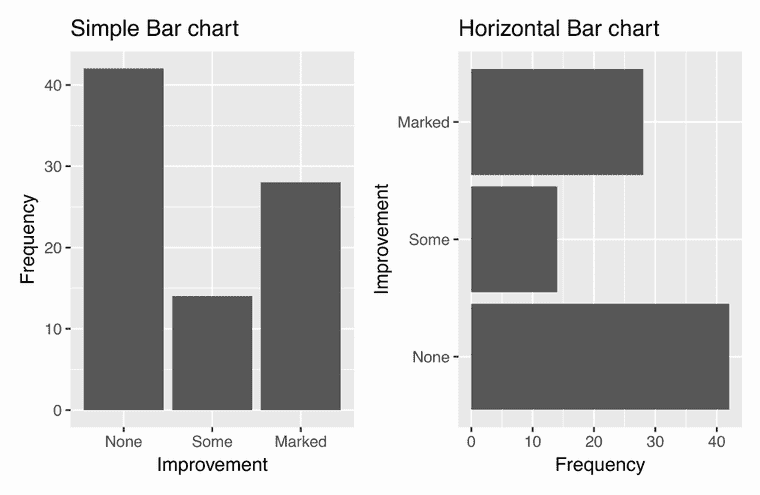

图 6.1 简单的垂直和水平条形图

如果您有很长的标签会发生什么？在第 6.1.4 节中，您将看到如何调整标签以避免重叠。

### 6.1.2 堆叠、分组和填充条形图

关节炎研究中的核心问题是，“安慰剂组和治疗组的改善水平之间是如何变化的？”`table()`函数可以用来生成变量的交叉表：

```
> table(Arthritis$Improved, Arthritis$Treatment)

        Treatment
Improved Placebo Treated
  None        29      13
  Some         7       7
  Marked       7      21
```

虽然交叉表很有帮助，但条形图使结果更容易理解。两个分类变量之间的关系可以用*堆叠*、*分组*或*填充*条形图来绘制。接下来的列表提供了代码，图 6.2 显示了图表。

列表 6.2  堆叠、分组和填充条形图

```
library(ggplot2)
ggplot(Arthritis, aes(x=Treatment, fill=Improved)) +    ❶
  geom_bar(position = "stack") +                        ❶
  labs(title="Stacked Bar chart",                       ❶
       x="Treatment",                                   ❶
       y="Frequency")                                   ❶

ggplot(Arthritis, aes(x=Treatment, fill=Improved)) +    ❷
  geom_bar(position = "dodge") +                        ❷
  labs(title="Grouped Bar chart",                       ❷
       x="Treatment",                                   ❷
       y="Frequency")                                   ❷

ggplot(Arthritis, aes(x=Treatment, fill=Improved)) +    ❸
  geom_bar(position = "fill") +                         ❸
  labs(title="Filled Bar chart",                        ❸
       x="Treatment",                                   ❸
       y="Proportion")                                  ❸
```

❶ 堆叠条形图

❷ 分组条形图

❸ 填充条形图

在堆叠条形图中，每个部分代表给定治疗（安慰剂、治疗）和改善（无、一些、显著）水平组合内案例的频率或比例。每个治疗水平分别堆叠这些部分。分组条形图在每个治疗水平内将代表改善的部分并排放置。填充条形图是一个重新缩放的堆叠条形图，使得每个条形的高度为 1，部分高度代表比例。

填充条形图特别适用于比较一个分类变量的比例在另一个分类变量的水平上的变化。例如，图 6.2 中的填充条形图清楚地显示了与接受安慰剂的病人相比，有显著改善的治疗病人的比例更高。

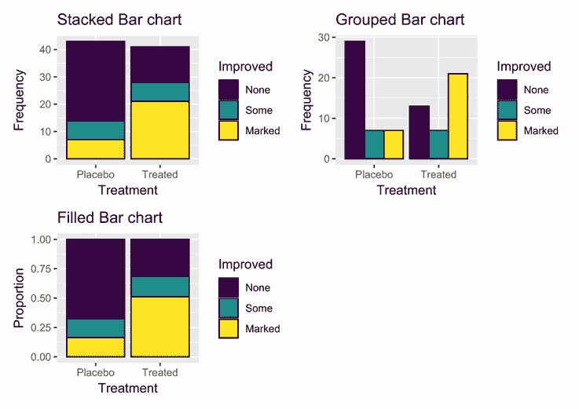

图 6.2 堆叠、分组和填充条形图

### 6.1.3 平均条形图

条形图不必基于计数或频率。你可以通过使用适当的统计量总结数据，并将结果传递给`ggplot2`来创建表示平均值、中位数、百分比、标准差等条形图。

在以下图表中，我们将绘制 1970 年美国各地区的平均文盲率。内置的 R 数据集`state.x77`包含了各州的文盲率，数据集`state.region`包含了各州的地区名称。以下列表提供了创建图 6.3 中图表所需的代码。

列表 6.3  按排序平均值绘制的条形图

```
> states <- data.frame(state.region, state.x77)    
> library(dplyr)                                   
> plotdata <- states %>% 
    group_by(state.region) %>%                                    ❶
    summarize(mean = mean(Illiteracy))                            ❶
  plotdata                                                        ❶

# A tibble: 4 x 2
  state.region   mean
  <fct>         <dbl>
1 Northeast      1   
2 South          1.74
3 North Central  0.7 
4 West           1.02

> ggplot(plotdata, aes(x=reorder(state.region, mean), y=mean)) +  ❷
    geom_bar(stat="identity") +                                   ❷
    labs(x="Region",                                              ❷
         y="",                                                    ❷
         title = "Mean Illiteracy Rate")                          ❷
```

❶ 按地区生成平均值

❷ 在排序条形图中绘制平均值

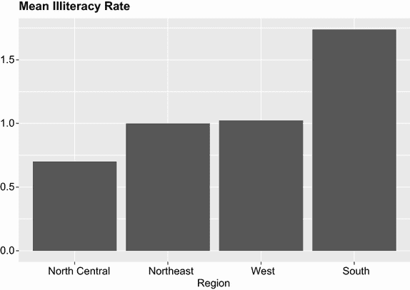

图 6.3 按文盲率排序的美国地区平均文盲率条形图

首先，计算每个地区的平均文盲率 ❶。接下来，按升序排序平均值，并以条形的形式绘制 ❷。通常，`geom_bar()`函数计算并绘制单元格计数，但添加`stat="identity"`选项会强制函数绘制提供的数字（在这种情况下是平均值）。使用`reorder()`函数按递增的平均文盲率对条形进行排序。

当绘制均值等汇总统计量时，指出涉及估计的变异性是一种良好的做法。变异性的一种度量是统计量的标准误差——对统计量在假设重复样本中预期变化的估计。以下图形（图 6.4）使用均值的标准误差添加了误差线。

列表 6.4  带有误差线的均值条形图

```
> plotdata <- states %>%                                           ❶
    group_by(state.region) %>%                                     ❶
    summarize(n=n(),                                               ❶
              mean = mean(Illiteracy),                             ❶
              se = sd(Illiteracy)/sqrt(n))                         ❶

> plotdata

# A tibble: 4 x 4
  state.region      n  mean     se
  <fct>         <int> <dbl>  <dbl>
1 Northeast         9  1    0.0928
2 South            16  1.74 0.138 
3 North Central    12  0.7  0.0408
4 West             13  1.02 0.169 

> ggplot(plotdata, aes(x=reorder(state.region, mean), y=mean)) +   ❷
    geom_bar(stat="identity", fill="skyblue") +
    geom_errorbar(aes(ymin=mean-se, ymax=mean+se), width=0.2) +    ❸
    labs(x="Region",
         y="",
         title = "Mean Illiteracy Rate",
         subtitle = "with standard error bars")
```

❶ 按地区生成均值和标准误差

❷ 在排序条形图中绘制均值

❸ 添加误差线

为每个地区计算了均值和标准误差 ❶。然后按文盲率升序绘制条形。颜色从默认的深灰色变为较浅的色调（天蓝色），以便在下一步添加的误差线更加突出 ❷。最后，绘制误差线 ❸。`geom_errorbar()`函数中的`width`选项控制误差线的水平宽度，纯粹是美学上的——它没有统计意义。除了显示平均文盲率外，我们还可以看到，中北部地区的均值最可靠（变异性最小），而西部地区的均值最不可靠（变异性最大）。

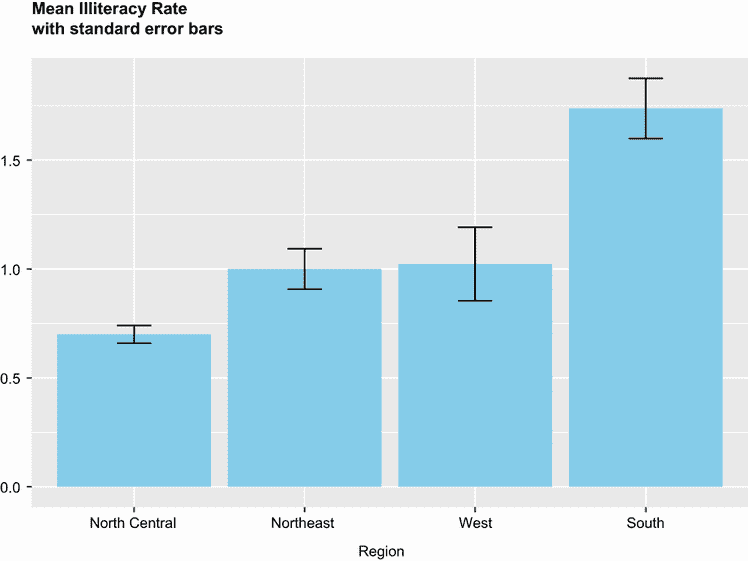

图 6.4 按比率排序的美国地区平均文盲率条形图。每个条形都添加了均值的标准误差。

### 6.1.4 调整条形图

有几种方法可以调整条形图的外观。最常见的是自定义条形颜色和标签。我们将逐一查看。

条形图颜色

可以为条形图的区域和边框选择自定义颜色。在`geom_bar()`函数中，选项`fill="color"`为区域分配颜色，而`color="color"`为边框分配颜色。

填充与颜色

通常，`ggplot2`使用填充来指定具有面积（如条形、饼图切片、箱形）的几何对象的颜色，当提到没有面积（如线条、点和边框）的几何对象的颜色时使用颜色。

例如，以下代码

```
data(Arthritis, package="vcd")
ggplot(Arthritis, aes(x=Improved)) + 
   geom_bar(fill="gold", color="black") +
   labs(title="Treatment Outcome")
```

生成图 6.5 中的图形。

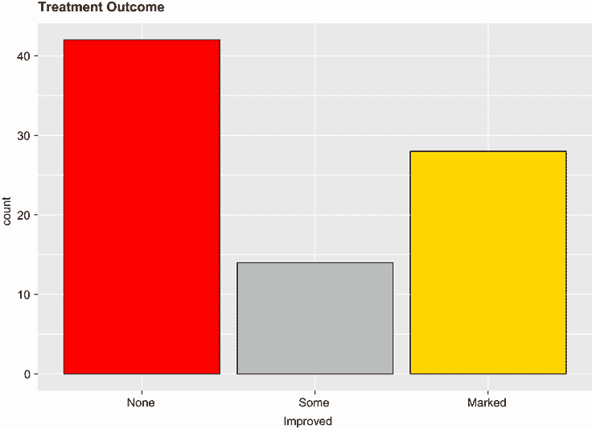

图 6.5 带有自定义填充和边框颜色的条形图

在上一个示例中，分配了单色。颜色也可以映射到分类变量的级别。例如，以下代码

```
ggplot(Arthritis, aes(x=Treatment, fill=Improved)) +    
  geom_bar(position = "stack", color="black") +  
  scale_fill_manual(values=c("red", "grey", "gold")) +                      
  labs(title="Stacked Bar chart",                       
       x="Treatment",                                   
       y="Frequency")                                   
```

生成图 6.6 中的图形。

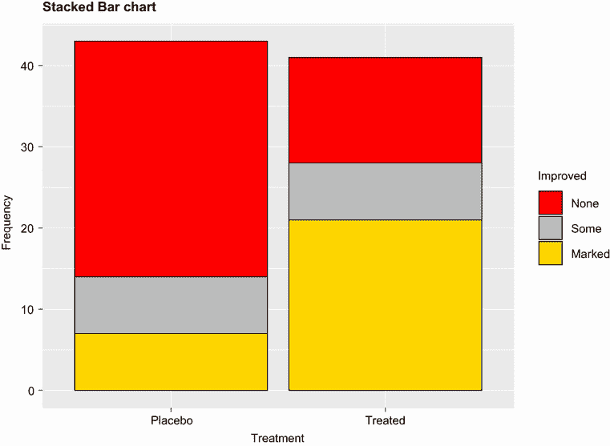

图 6.6 按改进映射的自定义填充颜色的堆叠条形图

在这里，条形填充颜色映射到变量`Improved`的级别。`scale_fill_manual()`函数指定`None`为红色，`Some`为灰色，`Marked` improvement 为金色。颜色名称可以从[`www.stat.columbia.edu/~tzheng/files/Rcolor.pdf`](http://www.stat.columbia.edu/~tzheng/files/Rcolor.pdf)获取。第十九章讨论了选择颜色的其他方法。

条形图标签

当有多个条形或长标签时，条形图标签往往会重叠并变得难以阅读。考虑以下示例。`ggplot2`包中的`mpg`数据集描述了 1999 年和 2008 年 38 种流行汽车模型的燃油经济数据。每个模型都有几种配置（传动类型、气缸数量等）。假设我们想要统计数据集中每种模型的实例数量。以下代码

```
ggplot(mpg, aes(x=model)) + 
   geom_bar() +
   labs(title="Car models in the mpg dataset", 
        y="Frequency", x="")
```

生成图 6.7。

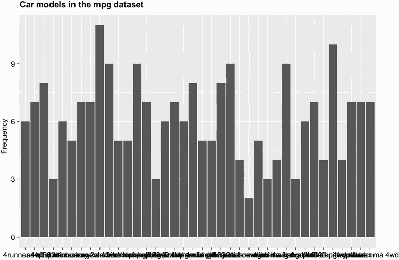

图 6.7 带重叠标签的条形图

即使戴上眼镜（或一杯酒），我也无法阅读这个。两个简单的调整可以使标签可读。首先，我们可以将数据作为水平条形图绘制（图 6.8）：

```
ggplot(mpg, aes(x=model)) + 
   geom_bar() +
   labs(title="Car models in the mpg dataset", 
        y="Frequency", x="") +
   coord_flip()
```

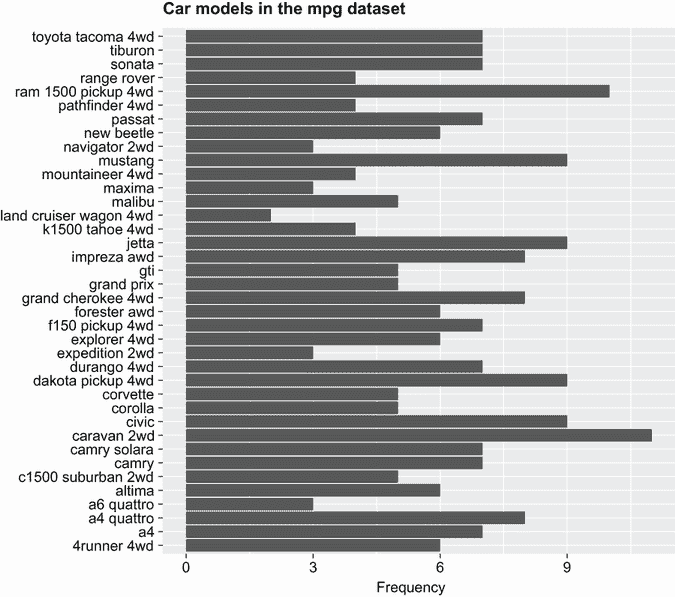

图 6.8 水平条形图避免标签重叠。

第二，我们可以倾斜标签文本并使用较小的字体（图 6.9）：

```
ggplot(mpg, aes(x=model)) + 
   geom_bar() +
   labs(title="Model names in the mpg dataset", 
        y="Frequency", x="") +
   theme(axis.text.x = element_text(angle = 45, hjust = 1, size=8))
```


图 6.9 倾斜标签文本和较小标签字体的条形图

第十九章更详细地讨论了`theme()`函数。除了条形图外，饼图也是显示分类变量分布的流行工具。我们将在下一节考虑它们。

## 6.2 饼图

饼图在商业世界中无处不在，但大多数统计学家，包括 R 文档的作者，都对其不屑一顾。他们推荐使用条形图或点图而不是饼图，因为人们能够更准确地判断长度而不是体积。也许正因为如此，R 中的饼图选项与其他统计平台相比严重受限。

然而，有时饼图是有用的。特别是，它们可以很好地捕捉部分与整体的关系。例如，饼图可以用来显示大学中终身教授中女性的百分比。

您可以使用`pie()`函数在基础 R 中创建饼图，但正如我所说的，功能有限，且图形不吸引人。为了解决这个问题，我创建了一个名为`ggpie`的包，允许您使用`ggplot2`创建各种饼图（请勿发送愤怒邮件！）。您可以使用以下代码从我的 GitHub 仓库安装它：

```
if(!require(remotes)) install.packages("remotes")
remotes::install_github("rkabacoff/ggpie")
```

基本语法是

```
ggpie(data, x, by, offset, percent, legend, title)
```

其中

+   `data`是数据框。

+   `x`是要绘制的分类变量。

+   `by`是可选的第二分类变量。如果存在，将为该变量的每个级别生成一个饼图。

+   `offset`表示饼图标签与原点的距离。值为`0.5`时，标签将放置在切片的中心，而值大于`1.0`时，标签将放置在切片外部。

+   `percent`是逻辑值。如果为`FALSE`，则抑制百分比打印。

+   `legend`是逻辑值。如果为`FALSE`，则省略图例，每个饼图切片将进行标注。

+   `title`是可选的标题。

其他选项（在`ggpie`网站上描述）允许您自定义饼图的外观。让我们创建一个显示`mpg`数据集中汽车类别分布的饼图：

```
library(ggplot2)
library(ggpie)
ggpie(mpg, class)
```

图 6.10 显示了结果。从图中我们可以看到，26%的汽车是 SUV，而只有 2%是双座车。

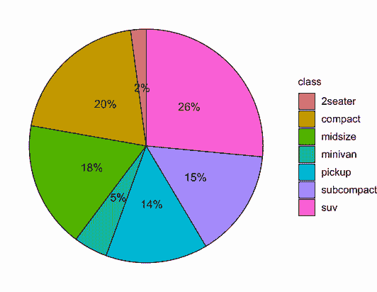

图 6.10 显示`mpg`数据帧中每个汽车类别的百分比的饼图

在下一个版本（图 6.11）中，移除了图例，并为每个饼图切片添加了标签。此外，标签放置在饼图区域外，并添加了一个标题：

```
ggpie(mpg, class, legend=FALSE, offset=1.3, 
         title="Automobiles by Car Class")

```

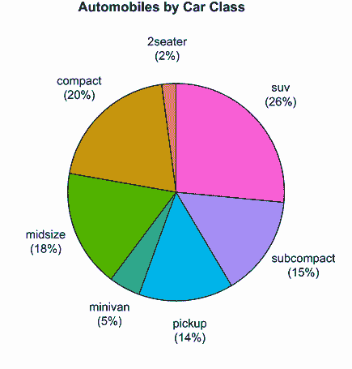

图 6.11 饼图标签显示在饼图外

在最后的例子（图 6.12）中，按年份显示了汽车类别的分布。

```
ggpie(mpg, class, year, 
      legend=FALSE, offset=1.3, title="Car Class by Year")
```

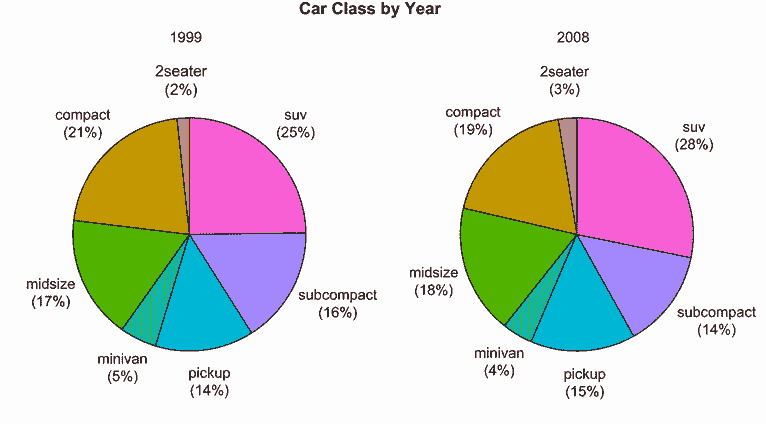

图 6.12 按年份显示汽车类别分布的饼图

在 1999 年至 2008 年之间，汽车类别的分布似乎保持相当稳定。`ggpie`包可以创建更复杂和定制的饼图。有关详细信息，请参阅文档([`rkabacoff.github.io/ggpie`](https://rkabacoff.github.io/ggpie))。

## 6.3 树状图

饼图的一个替代方案是树状图，它使用与变量级别成比例的矩形来显示分类变量的分布。我们将使用`treemapify`包创建树状图。在继续之前，请确保安装它（`install.packages("treemapify")`）。

我们将首先创建一个显示`mpg`数据帧中汽车制造商分布的树状图。以下列表显示了代码，图 6.13 显示了生成的图表。

列表 6.5  简单的树状图

```
library(ggplot2)
library(dplyr)
library(treemapify)

plotdata <- mpg %>% count(manufacturer)     ❶

ggplot(plotdata,                            ❷
       aes(fill = manufacturer,             ❷
           area = n,                        ❷
           label = manufacturer)) +         ❷
geom_treemap() +                            ❷
geom_treemap_text() +                       ❷
theme(legend.position = "none")             ❷
```

❶ 总结数据

❷ 创建树状图

首先，我们计算`manufacturer`变量每个级别的频率计数❶。这些信息传递给`ggplot2`以创建图表❷。在`aes()`函数中，`fill`指的是分类变量，`area`是每个级别的计数，而`label`是用于标记单元格的选项变量。`geom_treemap()`函数创建树状图，`geom_treemap_text()`函数为每个单元格添加标签。`theme()`函数用于抑制图例，在这里它是多余的，因为每个单元格都有标签。

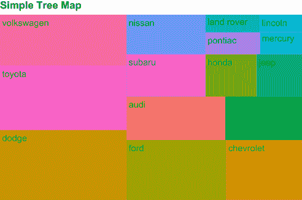

图 6.13 显示`mpg`数据集中汽车制造商分布的树状图。矩形大小与每个制造商的汽车数量成比例。

如您所见，树状图可以用来可视化具有*许多*级别的分类变量（与饼图不同）。在下一个例子中，添加了第二个变量——`drivetrain`。绘制了前轮驱动、后轮驱动和四轮驱动的制造商的汽车数量。下一个列表提供了代码，图 6.14 显示了该图。

列表 6.6  具有子分组的树状图

```
library(ggplot2)
library(dplyr)
library(treemapify)
plotdata <- mpg %>%                                                    ❶
  count(manufacturer, drv)                                             ❶
  plotdata$drv <- factor(plotdata$drv,                                 ❷
                       levels=c("4", "f", "r"),                        ❷
                       labels=c("4-wheel", "front-wheel", "rear"))     ❷

ggplot(plotdata,                                                       ❸
       aes(fill = manufacturer,                                        ❸
           area = n,                                                   ❸
           label = manufacturer,                                       ❸
           subgroup=drv)) +                                            ❸
  geom_treemap() +                                                     ❸
  geom_treemap_subgroup_border() +                                     ❸
  geom_treemap_subgroup_text(                                          ❸
    place = "middle",                                                  ❸
    colour = "black",                                                  ❸
    alpha = 0.5,                                                       ❸
    grow = FALSE) +                                                    ❸
  geom_treemap_text(colour = "white",                                  ❸
                    place = "centre",                                  ❸
                    grow=FALSE) +                                      ❸
  theme(legend.position = "none")                                      ❸
```

❶ 计算单元格计数

❷ 提供了更好的传动系统标签

❸ 创建树状图

首先，计算每个制造商-驱动方式组合的频率 ❶。接下来，为`drivetrain`变量提供更好的标签 ❷。将新的数据框传递给`ggplot2`以生成树状图 ❸。`aes()`函数中的子组选项为每种`drivetrain`类型创建单独的子图。`geom_treemap_border()`和`geom_treemap_subgroup_text()`分别添加子组的边框和标签。每个函数中的选项控制其外观。子组文本居中，并赋予一定的透明度（`alpha=0.5`）。文本字体保持恒定大小，而不是填充区域（`grow=FALSE`）。树状图单元格文本以白色字体打印，在每个单元格中居中，并且不会填充盒子。

从图 6.14 的图形中可以看出，例如，现代有前轮驱动汽车，但没有后轮驱动或四轮驱动汽车。主要拥有后轮驱动汽车的生产商是福特和雪佛兰。许多四轮驱动汽车由道奇制造。

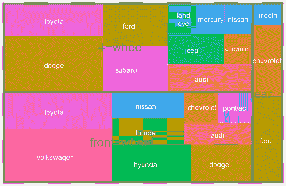

图 6.14 按驱动方式分类的汽车制造商树状图

现在我们已经介绍了饼图和树状图，让我们继续讨论直方图。与条形图、饼图和树状图不同，直方图描述了连续变量的分布。

## 6.4 直方图

直方图通过将分数范围分为指定数量的箱，并在 x 轴上显示每个箱的频率，来显示连续变量的分布。您可以使用以下方式创建直方图：

```
ggplot(data, aes(x = *contvar*)) + geom_histogram()
```

其中`data`是一个数据框，`contvar`是一个连续变量。使用`ggplot`包中的`mpg`数据集，我们将检查 2008 年 117 种汽车配置的城市每加仑英里数（`cty`）的分布。以下列表创建了直方图的四个变体，图 6.15 显示了结果图形。

列表 6.7  直方图

```
library(ggplot2)
library(scales)

data(mpg)
cars2008 <- mpg[mpg$year == 2008, ]

ggplot(cars2008, aes(x=cty)) +                                  ❶
   geom_histogram() +                                           ❶
   labs(title="Default histogram")                              ❶

ggplot(cars2008, aes(x=hwy)) +                                  ❷
   geom_histogram(bins=20, color="white", fill="steelblue") +   ❷
   labs(title="Colored histogram with 20 bins",                 ❷
       x="City Miles Per Gallon",                               ❷
       y="Frequency")

ggplot(cars2008, aes(x=hwy, y=..density..)) +                   ❸
   geom_histogram(bins=20, color="white", fill="steelblue") +   ❸
   scale_y_continuous(labels=scales::percent) +                 ❸
  labs(title="Histogram with percentages",                      ❸
       y= "Percent".                                            ❸
       x="City Miles Per Gallon")                               ❸

ggplot(cars2008, aes(x=cty, y=..density..)) +                   ❹
   geom_histogram(bins=20, color="white", fill="steelblue") +   ❹
   scale_y_continuous(labels=scales::percent) +                 ❹
   geom_density(color="red", size=1) +                          ❹
   labs(title="Histogram with density curve",                   ❹
        y="Percent" ,                                           ❹
       x="Highway Miles Per Gallon")                            ❹
```

❶ 简单直方图

❷ 带有 20 个箱的彩色直方图

❸ 带有百分比的直方图

❹ 带有密度曲线的直方图

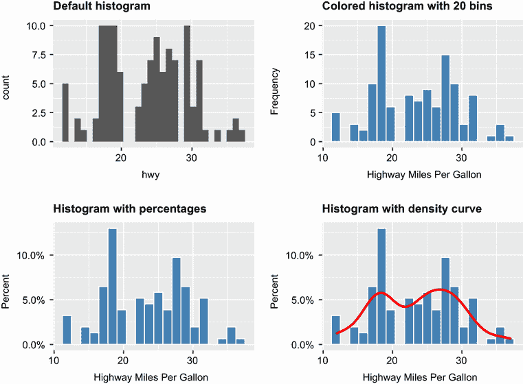

图 6.15 直方图示例

第一个直方图 ❶ 展示了未指定任何选项时的默认绘图。在这种情况下，创建了 30 个箱。对于第二个直方图 ❷，指定了 20 个箱、深蓝色填充和白色边框颜色。此外，还添加了更详细标签。箱的数量可以显著影响直方图的外观。尝试调整`bins`值，直到找到一个能够很好地捕捉分布的值是个好主意。使用 20 个箱时，分布似乎有两个峰值——一个在 13 mpg 左右，另一个在 20.5 mpg 左右。

第三个直方图 ❸ 以百分比而不是频率绘制数据。这是通过将内置变量 `..density..` 分配给 y 轴来实现的。使用 `scales` 包格式化 y 轴为百分比。在运行此代码部分之前，请确保安装该包（`install.packages("scales")`）。

第四个直方图 ❹ 与之前的图表相似，但增加了密度曲线。密度曲线是核密度估计，将在下一节中描述。它提供了对分数分布的更平滑的描述。使用 `geom_density()` 函数以红色和略大于默认线条厚度的宽度绘制核曲线。密度曲线还暗示了双峰分布（两个峰值）。

## 6.5 核密度图

在上一节中，您看到了一个叠加在直方图上的核密度图。从技术上讲，核密度估计是估计随机变量概率密度函数的非参数方法。基本上，我们试图绘制一个平滑的直方图，其中曲线下的面积等于 1。尽管数学超出了本文的范围，但密度图可以是一种有效查看连续变量分布的方法。密度图的格式为

```
ggplot(data, aes(x = *contvar*)) + geom_density()
```

其中 `data` 是一个数据框，`contvar` 是一个连续变量。再次，让我们绘制 2008 年汽车的城市每加仑英里数（`cty`）的分布。下一列表提供了三个核密度示例，图 6.16 显示了结果。

列表 6.8  核密度图

```
library(ggplot2)
data(mpg)
cars2008 <- mpg[mpg$year == 2008, ]

ggplot(cars2008, aes(x=cty)) +                   ❶
   geom_density() +                              ❶
   labs(title="Default kernel density plot")     ❶

ggplot(cars2008, aes(x=cty)) +                   ❷
   geom_density(fill="red") +                    ❷
   labs(title="Filled kernel density plot",      ❷
        x="City Miles Per Gallon)                ❷

> bw.nrd0(cars2008$cty)                          ❸
1.408                                            ❸

ggplot(cars2008, aes(x=cty)) +                   ❹
   geom_density(fill="red", bw=.5) +             ❹
   labs(title="Kernel density plot with bw=0.5", ❹
        x="City Miles Per Gallon")               ❹
```

❶ 默认密度图

❷ 填充密度图

❸ 打印默认带宽

❹ 使用较小带宽的密度图

首先给出默认核密度图 ❶。在第二个示例中，曲线下的面积用红色填充。曲线的平滑度由带宽参数控制，该参数从正在绘制的数据中计算得出 ❷。代码 `bw.nrd0(cars2008$cty)` 显示此值（`1.408`）❸。使用较大的带宽将给出更平滑的曲线，但细节较少。较小的值将给出更锯齿状的曲线。第三个示例使用较小的带宽（`bw=.5`），使我们能够看到更多细节 ❹。与直方图的 `bins` 参数一样，尝试几个带宽值以查看哪个值可以帮助您最有效地可视化数据是个好主意。

核密度图可以用于比较组。这是一个高度未被充分利用的方法，可能是因为普遍缺乏易于访问的软件。幸运的是，`ggplot2` 包很好地填补了这一空白。

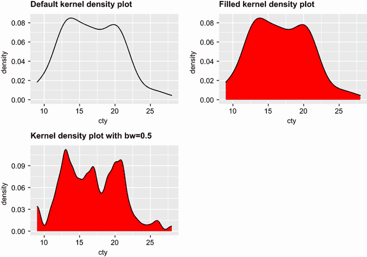

图 6.16 核密度图

对于这个例子，我们将比较四缸、六缸和八缸汽车的 2008 年城市油耗估计。只有少数几辆汽车有五缸，因此我们将它们从分析中排除。下一列表展示了代码。图 6.17 和 6.18 显示了生成的图表。

列表 6.9  比较核密度图

```
data(mpg, package="ggplot2")                                          ❶
cars2008 <- mpg[mpg$year == 2008 & mpg$cyl != 5,]                     ❶
cars2008$Cylinders <- factor(cars2008$cyl)                            ❶

ggplot(cars2008, aes(x=cty, color=Cylinders, linetype=Cylinders)) +   ❷
  geom_density(size=1)  +                                             ❷
  labs(title="Fuel Efficiecy by Number of Cylinders",                 ❷
       x = "City Miles per Gallon")                                   ❷

ggplot(cars2008, aes(x=cty, fill=Cylinders)) + 
  geom_density(alpha=.4) +                                            ❸
  labs(title="Fuel Efficiecy by Number of Cylinders",                 ❸
       x = "City Miles per Gallon")                                   ❸
```

❶ 准备数据

❷ 绘制密度曲线

❸ 绘制填充密度曲线

首先，加载数据的副本，并保留四、六或八缸汽车 2008 年的数据 ❶。气缸数（`cyl`）被保存为分类因子（`Cylinders`）。这种转换是必要的，因为`ggplot2`期望分组变量是分类的（而`cyl`被存储为连续变量）。

为`Cylinders`变量的每个级别绘制一个核密度曲线 ❷。颜色（红色、绿色、蓝色）和线型（实线、点线、虚线）都映射到气缸数。最后，用填充曲线生成相同的图表 ❸。添加了透明度（`alpha=0.4`），因为填充曲线重叠，我们希望能够看到每一个。

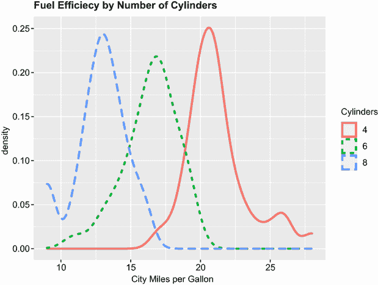

图 6.17 按气缸数划分的城市 mpg 值的核密度曲线

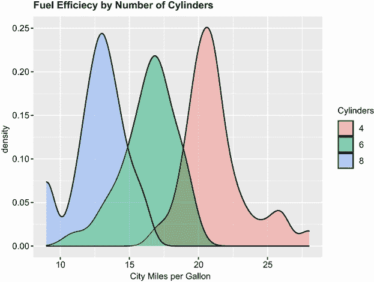

图 6.18 城市 mpg 值的填充核密度曲线，按气缸数划分

以灰度打印

默认情况下，`ggplot2`选择的颜色在以灰度打印时可能难以区分。这是本书硬拷贝版本中图 6.18 的情况。当需要灰度图表时，您可以在代码中添加`scale_fill_grey()`和`scale_color_grey()`函数。这将产生一种在黑白打印时效果良好的颜色方案。或者，您可以使用`sp`包中的`bpy.colors()`函数选择颜色。这将选择一种蓝色-粉色-黄色颜色方案，这种颜色方案在彩色和黑白打印机上打印效果都很好。然而，您必须喜欢蓝色、粉色和黄色！

重叠的核密度图可以是一种强大的方法，用于比较结果变量上的观测组。在这里，您可以同时看到分布的形状和组之间的重叠程度。（故事的寓意是，我的下一辆车将有四个气缸——或者一个电池。）

箱线图也是可视化分布和组间差异的一种奇妙（且更常用的）图形方法。我们将在下一节讨论它们。

## 6.6 箱线图

*箱线图*通过绘制其五个数值摘要来描述连续变量的分布：最小值、下四分位数（25 百分位数）、中位数（50 百分位数）、上四分位数（75 百分位数）和最大值。它还可以显示可能为异常值（值在± 1.5 × QR 范围之外，其中 IQR 是四分位距，定义为上四分位数减去下四分位数）的观测值。例如，以下代码生成了图 6.19 所示的图表：

```
ggplot(mtcars, aes(x="", y=mpg)) +
  geom_boxplot() +
  labs(y = "Miles Per Gallon", x="", title="Box Plot")
```

在图 6.19 中，我手动添加了注释来展示组成部分。默认情况下，每根胡须延伸到最极端的数据点，这不超过箱子的四分位距的 1.5 倍。超出此范围的值被描绘为点。

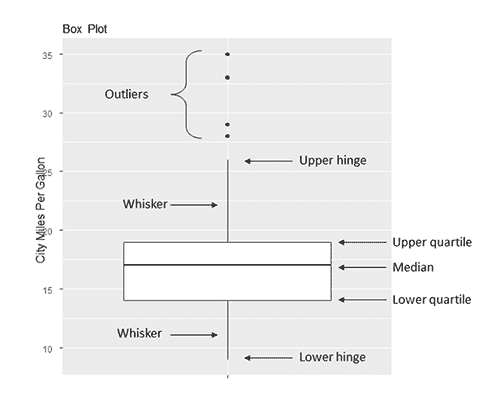

图 6.19 添加了手写注释的箱线图

例如，在这个汽车样本中，中位数的 mpg 是 17，50%的分数在 14 到 19 之间，最小值是 9，最大值是 35。我是如何从图中如此精确地读取这些信息的？运行`boxplot.stats(mtcars$mpg)`会打印出构建图形所使用的统计数据（换句话说，我作弊了）。有四个异常值（大于上四分位数 26）。在正态分布中，这些值预期发生的概率不到 1%。

### 6.6.1 使用平行箱线图比较组

箱线图是用于比较定量变量在分类变量水平上的分布的有用方法。再次，让我们比较四缸、六缸和八缸汽车的城市油耗，但这次我们将使用 1999 年和 2008 年的数据。由于只有少数五缸汽车，我们将删除它们。我们还将把`year`和`cyl`从连续的数值变量转换为分类（分组）因素：

```
library(ggplot2)
cars <- mpg[mpg$cyl != 5, ]
cars$Cylinders <- factor(cars$cyl)
cars$Year <- factor(cars$year)
```

代码

```
ggplot(cars, aes(x=Cylinders, y=cty)) + 
  geom_boxplot() +
  labs(x="Number of Cylinders", 
       y="Miles Per Gallon", 
       title="Car Mileage Data")
```

生成图 6.20 所示的图形。你可以看到，基于油耗，组间有很好的分离，随着汽缸数的增加，燃油效率下降。四缸组中也有四个异常值（油耗异常高的汽车）。

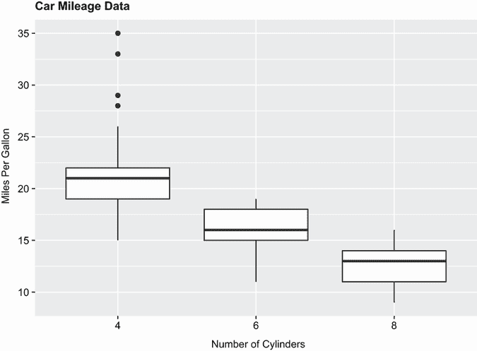

图 6.20 汽车油耗与汽缸数的箱线图

箱线图非常灵活。通过添加`notch=TRUE`，你可以得到带凹槽的箱线图。如果两个箱子的凹槽不重叠，那么有强有力的证据表明它们的均值不同（Chambers et al., 1983, p. 62）。以下代码为油耗示例创建了带凹槽的箱线图：

```
ggplot(cars, aes(x=Cylinders, y=cty)) + 
  geom_boxplot(notch=TRUE, 
               fill="steelblue",
               varwidth=TRUE) +
  labs(x="Number of Cylinders", 
       y="Miles Per Gallon", 
       title="Car Mileage Data")
```

`fill`选项用深色填充箱线图。在标准箱线图中，箱宽没有意义。添加`varwidth=TRUE`会根据每个组中观测值的平方根绘制箱宽。

你可以在图 6.21 中看到，四缸、六缸和八缸汽车的汽车中位数的油耗不同。油耗显然随着汽缸数的增加而减少。此外，八缸汽车的数量比四缸或六缸汽车少（尽管差异微妙）。

最后，你可以为多个分组因素生成箱线图。以下代码提供了城市每加仑英里数与汽缸数按年份的箱线图（见图 6.21）。已添加`scale_fill_manual()`函数来自定义填充颜色：

```
ggplot(cars, aes(x=Cylinders, y=cty, fill=Year)) +           
  geom_boxplot() +                                           
  labs(x="Number of Cylinders",                              
       y="Miles Per Gallon",                                 
       title="City Mileage by # Cylinders and Year") +    
  scale_fill_manual(values=c("gold", "green"))      
```

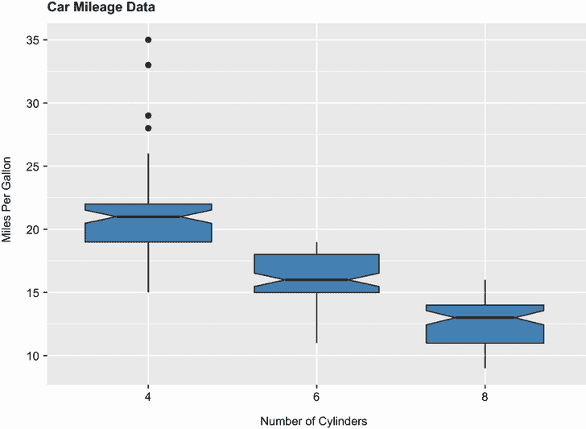

图 6.21 汽车油耗与汽缸数的带凹槽箱线图

如图 6.22 所示，再次清楚地表明，中位数的油耗随着汽缸数的增加而减少。此外，对于每个组，1999 年至 2008 年间油耗都有所增加。

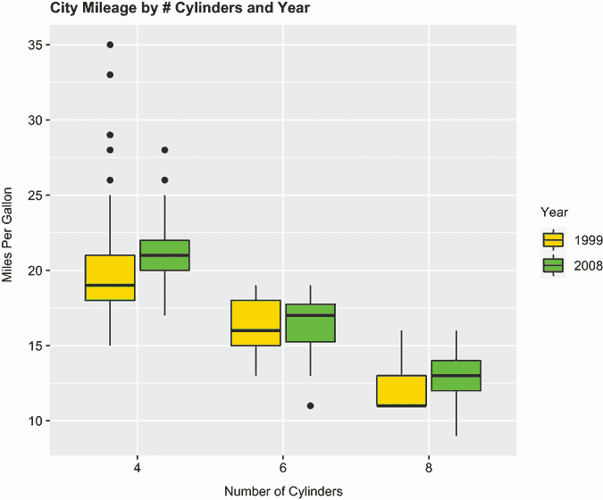

图 6.22 汽车油耗与年份和汽缸数的箱线图

### 6.6.2 小提琴图

在我们结束对箱线图的讨论之前，值得考察一种称为 *小提琴图* 的变体。小提琴图是箱线图和核密度图的组合。你可以使用 `geom_violin()` 函数创建一个。在下面的列表中，我们将向图 6.23 中的箱线图添加小提琴图。

列表 6.10  小提琴图

```
library(ggplot2)
cars <- mpg[mpg$cyl != 5, ]
cars$Cylinders <- factor(cars$cyl)

ggplot(cars, aes(x=Cylinders, y=cty)) + 
  geom_boxplot(width=0.2, 
              fill="green") +
  geom_violin(fill="gold", 
              alpha=0.3) +
  labs(x="Number of Cylinders", 
       y="City Miles Per Gallon", 
       title="Violin Plots of Miles Per Gallon")

```

箱线图的宽度设置为 `0.2`，以便它们可以适合在小提琴图中。小提琴图设置为图 6.23 的透明度级别为 `0.3`，以便箱线图仍然可见。

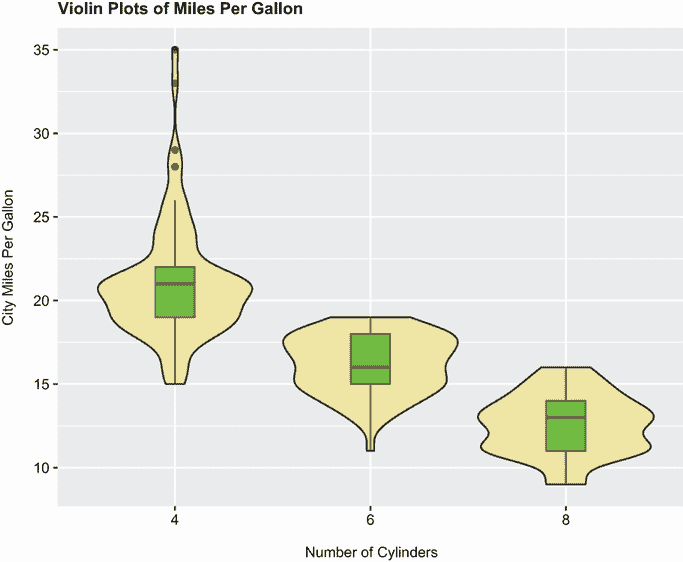

图 6.23 mpg 与汽缸数的对比小提琴图

小提琴图基本上是在箱线图上以镜像方式叠加的核密度图。中间的线是中位数，黑色方框从下四分位数到上四分位数，细黑线代表触须。点代表异常值。外部形状提供了核密度图。在这里我们可以看到，八缸车的油耗分布可能是双峰的——这是一个仅使用箱线图就无法揭示的事实。小提琴图尚未真正流行起来。再次强调，这可能是由于缺乏易于访问的软件；时间会证明一切。

我们将以查看点图结束本章。与之前看到的图表不同，点图绘制了变量的每个值。

## 6.7 点图

点图提供了一种在简单水平尺度上绘制大量标记值的方法。你可以使用 `dotchart()` 函数创建它们，格式如下

```
ggplot(*data*, aes(x=*contvar*, y=c*atvar*)) + geom_point()
```

`data` 是一个数据框，`contvar` 是一个连续变量，而 `catvar` 是一个分类变量。以下是一个使用 `mpg` 数据集中 2008 年汽车的高速油耗的例子。高速油耗按车型平均：

```
library(ggplot2)
library(dplyr)
plotdata <- mpg %>%
  filter(year == "2008") %>%
  group_by(model) %>%
  summarize(meanHwy=mean(hwy))

> plotdata

# A tibble: 38 x 2
   model              meanHwy
   *<chr>*                *<dbl>*
 1 4runner 4wd           18.5
 2 a4                    29.3
 3 a4 quattro            26.2
 4 a6 quattro            24  
 5 altima                29  
 6 c1500 suburban 2wd    18  
 7 camry                 30  
 8 camry solara          29.7
 9 caravan 2wd           22.2
10 civic                 33.8
# ... with 28 more rows

ggplot(plotdata, aes(x=meanHwy, y=model)) + 
  geom_point() +
  labs(x="Miles Per Gallon", 
       y="", 
       title="Gas Mileage for Car Models")
```

结果图显示在图 6.24 中。

此图允许你看到每个车型在相同水平轴上的 mpg。点图通常在排序后最有用。以下代码按最低到最高里程对汽车进行排序：

```
ggplot(plotdata, aes(x=meanHwy, y=reorder(model, meanHwy))) + 
  geom_point() +
  labs(x="Miles Per Gallon", 
       y="", 
       title="Gas Mileage for Car Models")
```

结果图见图 6.25。要按降序绘图，请使用 `reorder (model, -meanHwy)`。

你可以从这个例子中的点图中获得显著的洞察力，因为每个点都有标签，每个点的值本身就有意义，而且点以促进比较的方式排列。但随着数据点的数量增加，点图的效用会降低。

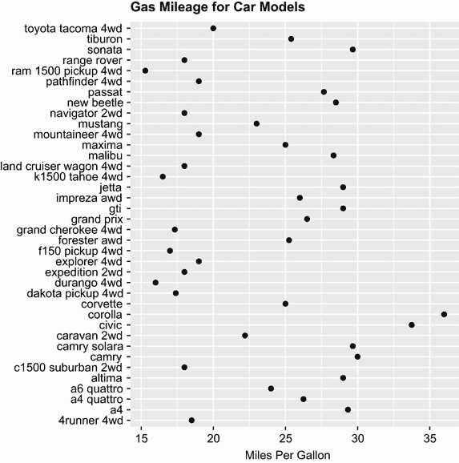

图 6.24 每个车型 mpg 的点图

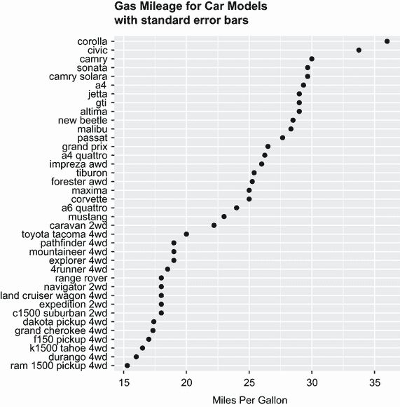

图 6.25 按里程排序的车型 mpg 的点图

## 摘要

+   条形图（以及在一定程度上饼图和树状图）可以用来了解分类变量的分布。

+   堆叠、分组和填充条形图可以帮助你了解组在分类结果上的差异。

+   直方图、箱线图、小提琴图和点图可以帮助你可视化连续变量的分布。

+   重叠的核密度图和平行箱线图可以帮助你可视化连续结果变量上的组间差异。
