# 8 回归

本章涵盖

+   配置和解释线性模型

+   评估模型假设

+   在竞争模型中选择

在许多方面，回归分析是统计学的核心。这是一个广泛的术语，用于描述一组用于从一个或多个预测变量（也称为独立或解释变量）预测响应变量（也称为依赖、标准或结果变量）的方法。一般来说，回归分析可以用来识别与响应变量相关的解释变量，描述涉及的关系形式，并提供一个从解释变量预测响应变量的方程。

例如，一位运动生理学家可能会使用回归分析来开发一个预测人在跑步机上锻炼时预期燃烧的卡路里数量的方程。响应变量是燃烧的卡路里（从消耗的氧气量计算得出），预测变量可能包括锻炼持续时间（分钟）、在目标心率下花费的时间百分比、平均速度（英里/小时）、年龄（年）、性别和体质指数（BMI）。

从理论的角度来看，分析将有助于回答以下问题：

+   锻炼持续时间与燃烧的卡路里之间有什么关系？它是线性的还是曲线的？例如，在某个点之后，锻炼对燃烧的卡路里的影响是否会减少？

+   努力（在目标心率的时间百分比，平均行走速度）如何影响？

+   这些关系对年轻人和老年人、男性和女性、胖人和瘦人是否相同？

从实际的角度来看，分析将有助于回答以下问题：

+   一个 BMI 为 28.7 的 30 岁男性，如果他以每小时 4 英里的平均速度行走 45 分钟，并且 80%的时间保持在目标心率范围内，他可以预期燃烧多少卡路里？

+   你需要收集多少变量才能准确预测一个人在行走时燃烧的卡路里数量？

+   你的预测将有多准确？

由于回归分析在现代统计学中扮演着如此核心的角色，我们将在本章中对其进行深入探讨。首先，我们将探讨如何配置和解释回归模型。接下来，我们将回顾一系列用于识别这些模型潜在问题及其解决方法的技术。第三，我们将探讨变量选择的问题。在所有潜在的预测变量中，你如何决定哪些变量应该包含在你的最终模型中？第四，我们将讨论一般化的问题。当你将模型应用于现实世界时，它将如何表现？最后，我们将考虑相对重要性。在你的模型中，哪个预测变量最重要，第二个最重要的，以及最不重要的？

如您所见，我们覆盖了大量的内容。有效的回归分析是一个交互式、整体的过程，包含许多步骤，并且需要相当多的技巧。而不是将其拆分成多个章节，我选择在一个章节中呈现这个主题，以捕捉这种风味。因此，这将是有史以来最长和最复杂的章节。坚持到最后，您将拥有解决各种研究问题所需的所有工具。我保证！

## 8.1 回归的多种面貌

术语“回归”可能会令人困惑，因为存在许多专门的品种（见表 8.1）。此外，R 具有强大的全面功能来拟合回归模型，众多的选项可能会令人困惑。例如，在 2005 年，Vito Ricci 创建了一个包含超过 205 个 R 函数的列表，这些函数用于生成回归分析（[`mng.bz/NJhu`](http://mng.bz/NJhu)）。

表 8.1 回归分析种类

| 回归类型 | 典型用途 |
| --- | --- |
| 简单线性 | 从一个定量解释变量预测定量响应变量 |
| 多项式 | 从一个定量解释变量预测定量响应变量，其中关系被建模为 n 次多项式 |
| 多元线性 | 从两个或更多解释变量预测定量响应变量 |
| 多层 | 从具有层次结构的数据预测响应变量（例如，学校内的班级内的学生）。也称为层次、嵌套或混合模型。 |
| 多变量 | 从一个或多个解释变量预测多个响应变量 |
| 逻辑 | 从一个或多个解释变量预测分类响应变量 |
| 泊松 | 从一个或多个解释变量预测表示计数的响应变量 |
| Cox 比例风险 | 从一个或多个解释变量预测事件发生的时间（死亡、故障、复发） |
| 时间序列 | 使用相关误差对时间序列数据进行建模 |
| 非线性 | 从一个或多个解释变量预测定量响应变量，其中模型的形式是非线性的 |
| 非参数 | 从一个或多个解释变量预测定量响应变量，其中模型的形式是从数据中推导出来的，而不是事先指定的 |
| 鲁棒 | 使用一种对有影响观测值效应具有抵抗力的方法从一个或多个解释变量预测定量响应变量 |

在本章中，我们将关注属于普通最小二乘法（OLS）回归范畴的回归方法，包括简单线性回归、多项式回归和多元线性回归。第十三章将涵盖其他类型的回归模型，包括逻辑回归和泊松回归。

### 8.1.1 使用 OLS 回归的场景

在 OLS 回归中，定量因变量是从预测变量的加权和中预测出来的，其中权重是从数据中估计的参数。让我们看看一个具体的例子（无意中提到），这个例子是从 Fwa（2006 年）那里松散改编的。

工程师希望识别与桥梁退化（如年龄、交通量、桥梁设计、建筑材料和方法、施工质量和天气条件）相关的最重要因素，并确定这些关系的数学形式。她从代表性桥梁样本中收集了这些变量的数据，并使用 OLS 回归模型对这些数据进行建模。

该方法高度互动。她拟合了一系列模型，检查它们是否符合潜在统计假设，探索任何意外或异常发现，并最终从众多可能模型中选择“最佳”模型。如果成功，结果将帮助她

+   通过确定众多收集到的变量中哪些对预测桥梁退化有用，以及它们的相对重要性，来关注重要变量。

+   通过提供一个可以用于预测新案例（预测变量的值已知，但桥梁退化的程度未知）的桥梁退化预测方程，寻找可能陷入麻烦的桥梁。

+   通过识别不寻常的桥梁来利用偶然性。如果她发现某些桥梁的退化速度比模型预测的要快或慢得多，对这些异常值的研究可能会得出重要的发现，这有助于她理解桥梁退化的机制。

桥梁可能对你没有吸引力。我是一个临床心理学家和统计学家，我对土木工程知之甚少。但一般原则适用于物理、生物和社会科学中惊人的广泛问题。以下每个问题也可以使用 OLS 方法来解决：

+   地表径流盐度和铺砌道路表面积之间的关系是什么？（Montgomery，2007 年）

+   用户体验的哪些方面导致了大型多人在线角色扮演游戏（MMORPGs）的过度使用？（Hsu，Wen 和 Wu，2009 年）

+   哪些教育环境的质量与更高的学生成绩分数最密切相关？

+   血压、盐摄入量和年龄之间的关系形式是什么？这对男性和女性是否相同？

+   体育场和专业运动对大都市区发展的影响是什么？（Baade 和 Dye，1990 年）

+   什么因素导致了州际间啤酒价格的差异？（Culbertson 和 Bradford，1991 年）（这个问题引起了你的注意！）

我们的主要限制是我们提出有趣问题、设计有用的响应变量来衡量以及收集适当数据的能力。

### 8.1.2 你需要知道什么

在本章的剩余部分，我将描述如何使用 R 函数来拟合 OLS 回归模型，评估拟合度，检验假设，并在竞争模型之间进行选择。我假设你已经接触过通常在大学二年级统计学课程中教授的最小二乘回归。但我已经努力将数学符号保持在最低限度，并关注实际问题而不是理论问题。有几本优秀的教材涵盖了本章概述的统计材料。我最喜欢的是 John Fox 的 *应用回归分析和广义线性模型*（2008 年版）（用于理论）和 *R 和 S-Plus 应用回归指南*（2002 年版）（用于应用）。它们都为本章的主要来源。Licht（1995 年）提供了一个很好的非技术性概述。

## 8.2 OLS 回归

在本章的大部分内容中，我们将使用 OLS 从一组预测变量（也称为将响应变量回归到预测变量——因此得名）预测响应变量。OLS 回归拟合形式为，其中 *n* 是观测数，*`k`* 是预测变量的数量。（尽管我已经尽力将方程式排除在这些讨论之外，但这确实是简化事情的地方之一。）在这个方程中：

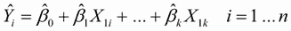

+   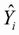是第 *i* 个观测值的因变量预测值（具体来说，它是基于预测值集合的 *Y* 分布的估计均值）。

+   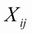是第 *i* 个观测值的第 *j* 个预测值。

+   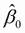是截距（当所有预测变量都等于零时 *Y* 的预测值）。

+   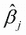是第 *j* 个预测值的回归系数（表示 *X[j]* 单位变化时 *Y* 的变化）。

我们的目标是选择模型参数（截距和斜率）以最小化实际响应值与模型预测值之间的差异。具体来说，模型参数的选择是为了最小化残差平方和：

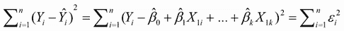

正确解释 OLS 模型的系数，你必须满足一系列统计假设：

+   *正态性*—对于固定的自变量值，因变量呈正态分布。

+   *独立性*—*Y[i]* 值彼此独立。

+   *线性关系*—因变量与自变量呈线性关系。

+   *同方差性*—因变量的方差不随独立变量水平的改变而改变。（我本可以称之为常数方差，但使用同方差性这个词让我感觉更聪明。）

如果违反这些假设，你的统计显著性检验和置信区间可能不准确。请注意，OLS 回归还假设独立变量是固定的且无误差测量，但在实践中通常放宽此假设。

### 8.2.1 使用 lm() 拟合回归模型

在 R 中，拟合线性模型的基本函数是 `lm()`。其格式为

```
myfit <- lm(*formula, data*)
```

其中 *`formula`* 描述要拟合的模型，而 *`data`* 是包含用于拟合模型的数据的数据框。结果对象（在本例中为 `myfit`）是一个包含有关拟合模型大量信息的列表。公式通常写作

```
Y ~ X1 + X2 + ... + Xk
```

其中 ~ 将左侧的响应变量与右侧的预测变量分开，预测变量由加号分隔。其他符号可以以各种方式修改公式（见表 8.2）。

表 8.2 R 公式中常用符号

| 符号 | 用法 |
| --- | --- |
| `~` | 将左侧的响应变量与右侧的解释变量分开。例如，从 `x`、`z` 和 `w` 预测 `y` 的代码为 `y` `~` `x` `+` `z` `+` `w`。 |
| `+` | 分隔预测变量 |
| `:` | 表示预测变量之间的交互。从 `x`、`z` 和 `x` 与 `z` 之间的交互预测 `y` 的代码为 `y` `~` `x` `+` `z` `+` `x:z`。 |
| `*` | 表示所有可能交互的快捷方式。代码 `y` `~` `x` `*` `z` `*` `w` 展开为 `y` `~` `x` `+` `z` `+` `w` `+` `x:z` `+` `x:w` `+` `z:w` `+` `x:z:w`。 |
| `^` | 表示直到指定程度的交互。代码 `y` `~` `(x` `+` `z` `+` `w)²` 展开为 `y` `~` `x` `+` `z` `+` `w` `+` `x:z` `+` `x:w` `+` `z:w`。 |
| `.` | 数据框中除因变量外的所有其他变量的占位符。例如，如果数据框包含变量 `x`、`y`、`z` 和 `w`，则代码 `y ~` 会展开为 `y` `~` `x` `+` `z` `+` `w`。 |
| `-` | 减号从方程中删除变量。例如，`y` `~` `(x` `+` `z` `+` `w)²` `–` `x:w` 展开为 `y` `~` `x` `+` `z` `+` `w` `+` `x:z` `+` `z:w`。 |
| `-1` | 抑制截距。例如，公式 `y` `~` `x` `-1` 拟合 `y` 对 `x` 的回归，并强制直线通过原点 `x=0`。 |
| `I()` | 括号内的元素按算术方式解释。例如，`y` `~` `x` `+` `(z +` `w)²` 展开为 `y` `~` `x` `+` `z` `+` `w` `+` `z:w`。相比之下，代码 `y` `~` `x` `+` `I((z` `+` `w)²)` 展开为 `y` `~` `x` `+` `h`，其中 h 是通过平方 `z` 和 `w` 的和创建的新变量。 |
| `function` | 公式中可以使用数学函数。例如，`log(y)` `~` `x` `+` `z` `+` `w` 从 `x`、`z` 和 `w` 预测 `log(y)`。 |

除了`lm()`之外，表 8.3 还列出了在生成简单或多元回归分析时有用的几个函数。这些函数中的每一个都是应用于`lm()`返回的对象，以基于该拟合模型生成更多信息。

表 8.3 在拟合线性模型时有用的其他函数

| 函数 | 操作 |
| --- | --- |
| `summary()` | 显示拟合模型的详细结果 |
| `coefficients()` | 列出拟合模型的模型参数（截距和斜率） |
| `confint()` | 提供模型参数的置信区间（默认为 95%） |
| `fitted()` | 列出拟合模型中的预测值 |
| `residuals()` | 列出拟合模型中的残差值 |
| `anova()` | 为拟合模型生成 ANOVA 表或比较两个或多个拟合模型的 ANOVA 表 |
| `vcov()` | 列出模型参数的协方差矩阵 |
| `AIC()` | 打印赤池信息准则 |
| `plot()` | 生成用于评估模型拟合的诊断图 |
| `predict()` | 使用拟合模型对新数据集的响应值进行预测 |

当回归模型包含一个因变量和一个自变量时，这种方法被称为*简单线性回归*。当只有一个预测变量但包含变量的幂（例如，`X`，`X²`，`X³`）时，它被称为*多项式回归*。当有多个预测变量时，它被称为多元线性回归。我们将从一个简单线性回归的例子开始，然后过渡到多项式和多元线性回归的例子，最后以一个包含预测变量之间交互作用的多元回归例子结束。

### 8.2.2 简单线性回归

让我们通过一个简单的回归示例来查看表 8.3 中的函数。基础安装中的`women`数据集提供了 15 名 30 至 39 岁女性的身高和体重。假设你想根据身高预测体重。拥有从身高预测体重的方程可以帮助你识别超重或体重不足的个人。以下列表提供了分析，图 8.1 显示了结果图。

列表 8.1 简单线性回归

```
> fit <- lm(weight ~ height, data=women)
> summary(fit)

Call:
lm(formula=weight ~ height, data=women)

Residuals:
   Min     1Q Median     3Q    Max 
-1.733 -1.133 -0.383  0.742  3.117 

Coefficients:                                                   
            Estimate Std. Error t value Pr(>|t|)    
(Intercept) -87.5167     5.9369   -14.7  1.7e-09 ***
height        3.4500     0.0911    37.9  1.1e-14 ***
---
Signif. codes:  0 '***' 0.001 '**' 0.01 '*' 0.05 '.' 0.1 '' 1 

Residual standard error: 1.53 on 13 degrees of freedom
Multiple R-squared: 0.991,      Adjusted R-squared: 0.99 
F-statistic: 1.43e+03 on 1 and 13 DF,  p-value: 1.09e-14 

> women$weight

 [1] 115 117 120 123 126 129 132 135 139 142 146 150 154 159 164

> fitted(fit)

     1      2      3      4      5      6      7      8      9 
112.58 116.03 119.48 122.93 126.38 129.83 133.28 136.73 140.18 
    10     11     12     13     14     15 
143.63 147.08 150.53 153.98 157.43 160.88 

> residuals(fit)

    1     2     3     4     5     6     7     8     9    10    11 
 2.42  0.97  0.52  0.07 -0.38 -0.83 -1.28 -1.73 -1.18 -1.63 -1.08 
   12    13    14    15 
-0.53  0.02  1.57  3.12

> plot(women$height,women$weight, 
       xlab="Height (in inches)", 
       ylab="Weight (in pounds)")
> abline(fit)
```

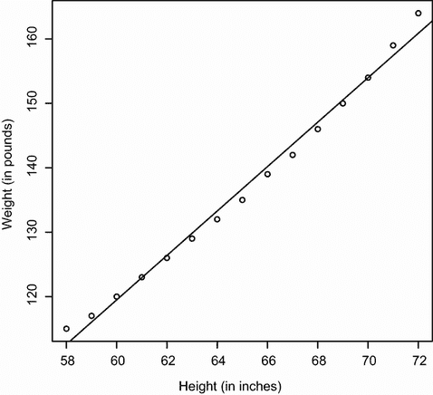

图 8.1 从身高预测体重的散点图和回归线

从输出中，你可以看到预测方程是

*体重* = −87.52 + 3.45×*身高*

由于身高为 0 是不可能的，你不会尝试对截距给出物理解释。它仅仅成为一个调整常数。从 `Pr(>|t|)` 列中，你可以看到回归系数（3.45）与零显著不同（p < 0.001），这表明每增加 1 英寸身高，预期体重将增加 3.45 磅。多重 R 平方（0.991）表明该模型解释了体重变化的 99.1%。多重 R 平方也是实际值和预测值之间的相关系数的平方（即 *R*² = *r[ŷv]*）。残差标准误差（1.53 磅）可以被视为使用此模型从身高预测体重的平均误差。F 统计量测试预测变量是否一起预测响应变量高于随机水平。由于简单回归中只有一个预测变量，在这个例子中，F 测试等同于对高度回归系数的 t 测试。

为了演示目的，我们打印出了实际值、预测值和残差值。显然，最大残差出现在身高低和高的地方，这也可以在图中（图 8.1）看到。

图表明，你可能可以通过使用一条有弯曲的线来提高预测。例如，形式为

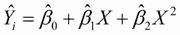

可能会更好地拟合数据。多项式回归允许你从一个解释变量预测响应变量，其中关系的形式是 *n* 次多项式。

### 8.2.3 多项式回归

图 8.1 中的图表明，你可能可以通过使用带有二次项的回归（即 *X*²）来提高你的预测。你可以使用以下语句拟合二次方程

```
fit2 <- lm(weight ~ height + I(height²), data=women)
```

新术语 `I(height²)` 需要解释。`height²` 将一个高度平方项添加到预测方程中。`I()` 函数将括号内的内容视为一个 R 表达式。你需要这样做，因为 `^` 运算符在公式中有特殊含义，你不想在这里调用它（见表 8.2）。

下面的列表显示了拟合二次方程的结果。

列表 8.2 多项式回归

```
> fit2 <- lm(weight ~ height + I(height²), data=women)
> summary(fit2)

Call:
lm(formula=weight ~ height + I(height²), data=women)

Residuals:
    Min      1Q  Median      3Q     Max 
-0.5094 -0.2961 -0.0094  0.2862  0.5971 

Coefficients:
             Estimate Std. Error t value Pr(>|t|)    
(Intercept) 261.87818   25.19677   10.39  2.4e-07 ***
height       -7.34832    0.77769   -9.45  6.6e-07 ***
I(height²)   0.08306    0.00598   13.89  9.3e-09 ***
---
Signif. codes:  0 '***' 0.001 '**' 0.01 '*' 0.05 '.' 0.1 ' ' 1 

Residual standard error: 0.384 on 12 degrees of freedom
Multiple R-squared: 0.999,      Adjusted R-squared: 0.999 
F-statistic: 1.14e+04 on 2 and 12 DF,  p-value: <2e-16 

> plot(women$height,women$weight,
       xlab="Height (in inches)",
       ylab="Weight (in lbs)")
> lines(women$height,fitted(fit2))
```

从这个新的分析中，预测方程是

*weight* = 261.88 − 7.35×*height* + 0.083×*height*²

并且两个回归系数在 p < 0.0001 的水平上都是显著的。解释的方差量增加到了 99.9%。平方项的显著性（t = 13.89，p < .001）表明包含二次项提高了模型拟合度。如果你看 `fit2` 的图（图 8.2），你可以看到曲线确实提供了更好的拟合。


图 8.2 根据身高预测的重量二次回归

线性模型与非线性模型

注意，这个多项式方程仍然属于线性回归的范畴。它是线性的，因为方程涉及预测变量的加权总和（在这个例子中是身高和身高的平方）。即使是如下模型

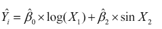

被认为是参数意义上的线性模型，并使用以下公式进行拟合


相比之下，这里有一个真正非线性模型的例子：


这种形式的非线性模型可以用 `nls()` 函数拟合。

通常，一个 *n* 次方的多项式会产生一个有 *n* - 1 个弯曲的曲线。要拟合一个三次多项式，你会使用

```
fit3 <- lm(weight ~ height + I(height²) +I(height³), data=women)
```

虽然可能存在更高次的多项式，但我很少发现超过三次方的项是必要的。

### 8.2.4 多元线性回归

当存在多个预测变量时，简单线性回归变为多元线性回归，分析变得更加复杂。从技术上讲，多项式回归是多元回归的一个特例。二次回归有两个预测变量（*X* 和 *X*²），三次回归有三个预测变量（*X*，*X*² 和 *X*³）。让我们看一个更一般的例子。

我们将使用基础包中的 `state.x77` 数据集来演示这个例子。假设你想探索一个州的谋杀率与其他特征之间的关系，包括人口、文盲率、平均收入和霜冻水平（低于冰点的天数平均值）。

因为 `lm()` 函数需要一个数据框（并且 `state.x77` 数据集包含在一个矩阵中），你可以用以下代码简化你的生活：

```
states <- as.data.frame(state.x77[,c("Murder", "Population", 
                        "Illiteracy", "Income", "Frost")])
```

此代码创建了一个名为 `states` 的数据框，其中包含你感兴趣的变量。你将在本章的剩余部分使用这个新的数据框。

在多元回归中，一个好的第一步是检查变量之间的关系，一次检查两个变量。双变量相关系数由 `cor()` 函数提供，散点图由 `car` 包中的 `scatterplotMatrix()` 函数生成（见以下列表和图 8.3）。

列表 8.3 检查双变量关系

```
> states <- as.data.frame(state.x77[,c("Murder", "Population", 
                          "Illiteracy", "Income", "Frost")])

> cor(states)
           Murder Population Illiteracy Income Frost
Murder       1.00       0.34       0.70  -0.23 -0.54
Population   0.34       1.00       0.11   0.21 -0.33
Illiteracy   0.70       0.11       1.00  -0.44 -0.67
Income      -0.23       0.21      -0.44   1.00  0.23
Frost       -0.54      -0.33      -0.67   0.23  1.00

> library(car)
> scatterplotMatrix(states, smooth=FALSE, main="Scatter Plot Matrix")
```

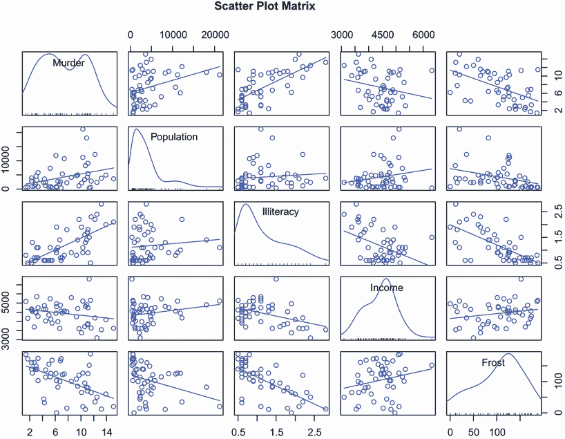

图 8.3 `states` 数据的因变量和自变量的散点矩阵，包括线性拟合和平滑拟合，以及边缘分布（核密度图和地毯图）

默认情况下，`scatterplotMatrix()` 函数在非对角线位置提供变量的散点图，并在这些图上叠加平滑（loess）和线性拟合线。主对角线包含每个变量的密度和地毯图。通过 `smooth=FALSE` 参数抑制平滑线。

您可以看到谋杀率可能是双峰的，并且每个预测变量都有一定程度上的偏斜。谋杀率随着人口和文盲率的增加而上升，随着收入水平和霜冻的减少而下降。同时，较冷州的文盲率较低，人口较少，收入较高。

现在让我们使用 `lm()` 函数拟合多元回归模型。

列表 8.4 多元线性回归

```
> states <- as.data.frame(state.x77[,c("Murder", "Population", 
                          "Illiteracy", "Income", "Frost")])

> fit <- lm(Murder ~ Population + Illiteracy + Income + Frost, 
            data=states)
> summary(fit)

Call:
lm(formula=Murder ~ Population + Illiteracy + Income + Frost, 
    data=states)

Residuals:
    Min      1Q  Median      3Q     Max 
-4.7960 -1.6495 -0.0811  1.4815  7.6210 

Coefficients:
            Estimate Std. Error t value Pr(>|t|)    
(Intercept) 1.23e+00   3.87e+00    0.32    0.751    
Population  2.24e-04   9.05e-05    2.47    0.017 *  
Illiteracy  4.14e+00   8.74e-01    4.74  2.2e-05 ***
Income      6.44e-05   6.84e-04    0.09    0.925    
Frost       5.81e-04   1.01e-02    0.06    0.954    
---
Signif. codes:  0 '***' 0.001 '**' 0.01 '*' 0.05 '.v 0.1 'v' 1 

Residual standard error: 2.5 on 45 degrees of freedom
Multiple R-squared: 0.567,      Adjusted R-squared: 0.528 
F-statistic: 14.7 on 4 and 45 DF,  p-value: 9.13e-08
```

当存在多个预测变量时，回归系数表示在保持所有其他预测变量不变的情况下，预测变量单位变化导致的因变量增加。例如，`Illiteracy` 的回归系数为 4.14，这意味着文盲率增加 1% 与谋杀率增加 4.14% 相关，在控制人口、收入和温度的情况下。该系数在 p < .0001 的水平上与零有显著差异。另一方面，`Frost` 的系数与零没有显著差异（p = 0.954），这意味着在控制其他预测变量的情况下，`Frost` 和 `Murder` 之间没有线性关系。综合来看，预测变量解释了各州谋杀率变异的 57%。

到目前为止，我们假设预测变量之间没有交互作用。在下一节中，我们将考虑它们确实存在交互作用的案例。

### 8.2.5 带有交互作用的多元线性回归

最有趣的研究发现之一涉及预测变量之间的交互作用。考虑 `mtcars` 数据框中的汽车数据。假设您对汽车重量和马力对里程的影响感兴趣。您可以拟合一个包含这两个预测变量及其交互作用的回归模型，如下一列表所示。

列表 8.5 带有显著交互项的多元线性回归

```
> fit <- lm(mpg ~ hp + wt + hp:wt, data=mtcars)
> summary(fit)

Call:
lm(formula=mpg ~ hp + wt + hp:wt, data=mtcars)

Residuals:
   Min     1Q Median     3Q    Max 
-3.063 -1.649 -0.736  1.421  4.551 

Coefficients:
            Estimate Std. Error t value Pr(>|t|)    
(Intercept) 49.80842    3.60516   13.82  5.0e-14 ***
hp          -0.12010    0.02470   -4.86  4.0e-05 ***
wt          -8.21662    1.26971   -6.47  5.2e-07 ***
hp:wt        0.02785    0.00742    3.75  0.00081 ***
---
Signif. codes:  0 '***' 0.001 '**' 0.01 '*' 0.05 '.' 0.1 ' ' 1 

Residual standard error: 2.1 on 28 degrees of freedom
Multiple R-squared: 0.885,      Adjusted R-squared: 0.872 
F-statistic: 71.7 on 3 and 28 DF,  p-value: 2.98e-13
```

您可以从 `Pr(>|t|)` 列中看到，马力和汽车重量之间的交互作用是显著的。这意味着什么？两个预测变量之间的显著交互作用表明，一个预测变量与响应变量之间的关系取决于另一个预测变量的水平。在这里，这意味着每加仑行驶里程与马力之间的关系取决于汽车重量。

预测`mpg`的模型是`mpg` = 49.81 – 0.12 × `hp` – 8.22 × `wt` + 0.03 × `hp` × `wt`。为了解释交互作用，你可以插入不同的`wt`值并简化方程。例如，你可以尝试`wt`的均值（3.2）以及均值上下一个标准差（分别为 2.2 和 4.2）。对于`wt`=2.2，方程简化为`mpg` = 49.81 – 0.12 × `hp` – 8.22 × (2.2) + 0.03 × `hp` × (2.2) = 31.41 – 0.06 × `hp`。对于`wt`=3.2，这变为`mpg` = 23.37 – 0.03 × `hp`。最后，对于`wt`=4.2，方程变为`mpg` = 15.33 – 0.003 × `hp`。你可以看到，随着重量增加（2.2，3.2，4.2），从单位增加`hp`带来的`mpg`的预期变化减少（0.06，0.03，0.003）。

你可以使用`effects`包中的`effect()`函数来可视化交互作用。格式是

```
plot(effect(*term, mod,, xlevels*), multiline=TRUE)
```

其中*`term`*是要绘制的引用模型项，*`mod`*是`lm()`返回的拟合模型，*`xlevels`*是一个指定要设置为常数值的变量及其值的列表。`multiline=TRUE`选项将叠加正在绘制的线，而`lines`选项指定每条线的类型（其中 1 = 实线，2 = 虚线，3 = 点线等）。对于前面的模型，这变为

```
library(effects)
plot(effect("hp:wt", fit,, list(wt=c(2.2,3.2,4.2))), 
     lines=c(1,2,3), multiline=TRUE)
```

图 8.4 显示了生成的图形。

从这张图中你可以看到，随着汽车重量的增加，马力与每加仑英里数之间的关系减弱。对于`wt=4.2`，线几乎水平，这表明随着`hp`的增加，`mpg`不会改变。

不幸的是，拟合模型只是分析的第一步。一旦你拟合了一个回归模型，在你可以对所得到的推断有信心之前，你需要评估你是否已经满足了你方法背后的统计假设。这是下一节的主题。

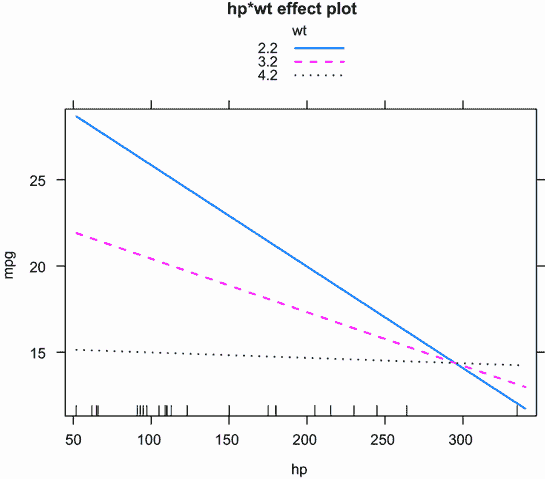

图 8.4 `hp*wt`的交互作用图。此图显示了在三个`wt`值下`mpg`与`hp`之间的关系。

## 8.3 回归诊断

在上一节中，你使用了`lm()`函数来拟合一个 OLS 回归模型，并使用`summary()`函数来获取模型参数和摘要统计信息。不幸的是，这个打印输出中没有任何东西告诉你你拟合的模型是否合适。你对回归参数推断的信心取决于你满足 OLS 模型统计假设的程度。尽管列表 8.4 中的`summary()`函数描述了模型，但它没有提供有关满足模型统计假设程度的信息。

这为什么很重要？数据中的不规则性或预测变量与响应变量之间关系的误指定可能导致你选择一个极其不准确的模型。一方面，你可能会得出结论，预测变量和响应变量之间没有关系，而实际上它们是有关系的。另一方面，你可能会得出结论，预测变量和响应变量之间有关系，而实际上它们没有关系。你也可能得到一个在现实世界应用时预测效果不佳的模型，伴随着重大且不必要的误差。

让我们看看应用于第 8.2.4 节中`states`多重回归问题的`confint()`函数的输出：

```
> states <- as.data.frame(state.x77[,c("Murder", "Population", 
                          "Illiteracy", "Income", "Frost")])
> fit <- lm(Murder ~ Population + Illiteracy + Income + Frost, data=states)
> confint(fit)
                2.5 %   97.5 %
(Intercept) -6.55e+00 9.021318
Population   4.14e-05 0.000406
Illiteracy   2.38e+00 5.903874
Income      -1.31e-03 0.001441
Frost       -1.97e-02 0.020830
```

结果表明，你可以有 95%的信心认为，在文盲率上升 1%的情况下，区间[2.38, 5.90]包含了谋杀率的真实变化。此外，由于`Frost`的置信区间包含 0，你可以得出结论，温度的变化与谋杀率无关，其他变量保持不变。但你对这些结果的信心强度仅取决于你拥有的证据，证明你的数据满足模型背后的统计假设。

一套称为*回归诊断*的技术提供了评估回归模型适当性的必要工具，可以帮助你发现并纠正问题。我们将从使用 R 的基础安装中提供的函数的标准方法开始。然后我们将探讨通过`car`包提供的更新、改进的方法。

### 8.3.1 一种典型的方法

R 的基础安装提供了许多评估回归分析中统计假设的方法。最常见的方法是将`plot()`函数应用于`lm()`函数返回的对象。这样做会产生四个图表，这些图表对于评估模型拟合很有用。将这种方法应用于简单的线性回归示例

```
fit <- lm(weight ~ height, data=women)
par(mfrow=c(2,2))
plot(fit)
par(mfrow=c(1,1))
```

产生了图 8.5 所示的图表。`par(mfrow=c(2,2))`语句用于将`plot()`函数产生的四个图表组合成一个大的两行两列图表。第二个`par()`函数将你带回到单个图表。

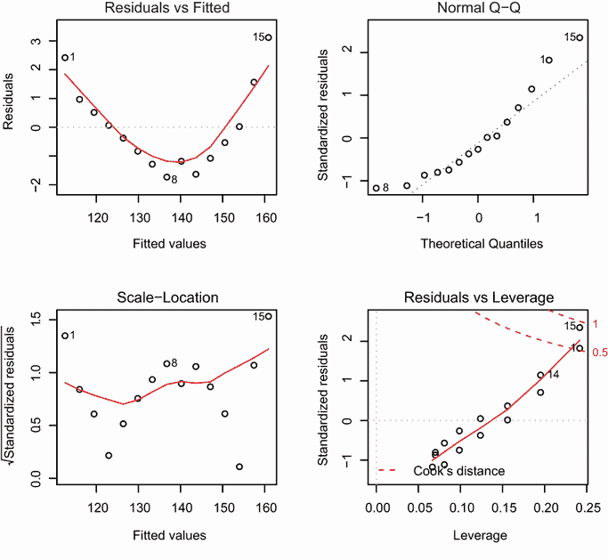

图 8.5 关于体重对身高的回归诊断图

要理解这些图表，请考虑 OLS 回归的假设：

+   *正态性*——如果对于一组固定的预测值，因变量是正态分布的，那么残差值应该以 0 为均值正态分布。正态 Q-Q 图（右上角）是标准化残差与在正态性下预期的值之间的概率图。如果你已经满足了正态性假设，那么这个图上的点应该落在 45 度直线上。因为它们没有，所以你显然违反了正态性假设。

+   *独立性*——你不能从这些图中判断依赖变量值是否独立。你必须使用你对数据收集方式的理解。没有先验理由相信一个女性的体重会影响另一个女性的体重。如果你发现数据是从家庭中抽取的，你可能需要调整你的独立性假设。

+   *线性关系*——如果依赖变量与独立变量呈线性关系，那么残差与预测值（即拟合值）之间不应存在系统性关系。换句话说，模型应该捕捉数据中存在的所有系统性方差，留下只有随机噪声。在残差与拟合图（左上角）中，你看到明显的曲线关系，这表明你可能需要在回归中添加一个二次项。

+   *同方差性*——如果你已经满足了常数方差假设，那么在尺度-位置图（左下角）中的点应该是在水平线周围的一个随机带。你似乎满足了这一假设。

最后，残差与杠杆图（右下角）提供了关于你可能希望关注的单个观测值的信息。该图识别了异常值、高杠杆点和有影响力的观测值。具体来说，

+   异常值是指那些拟合回归模型预测不佳的观测值（即具有较大的正或负残差）。

+   具有高杠杆值的观测值具有不寻常的预测值组合。也就是说，它在预测空间中是一个异常值。依赖变量值不用于计算观测值的杠杆值。

+   有影响力的观测值是指对模型参数确定有不成比例影响的观测值。有影响力的观测值是通过称为 Cook 距离或 Cook D 的统计量来识别的。

老实说，我发现残差与杠杆图难以阅读且没有用。你将在后面的章节中看到这个信息的更好表示。

尽管这些标准诊断图很有帮助，但现在 R 中已经有了更好的工具，我推荐使用它们而不是`plot(fit)`方法。

### 8.3.2 一种改进的方法

`car`包提供了一些函数，这些函数可以显著提高你拟合和评估回归模型的能力（见表 8.4）。

表 8.4 回归诊断的有用函数（`car`包）

| 函数 | 目的 |
| --- | --- |
| `qqPlot()` | 分位数比较图 |
| `durbinWatsonTest()` | 自相关误差的 Durbin-Watson 测试 |
| `crPlots()` | 组成加残差图 |
| `ncvTest()` | 非常数误差方差得分测试 |
| `spreadLevelPlot()` | 扩散水平图 |
| `outlierTest()` | 博费里尼异常值测试 |
| `avPlots()` | 添加变量图 |
| `influencePlot()` | 回归影响图 |
| `vif()` | 方差膨胀因子 |

让我们逐一查看它们，通过将它们应用于我们的多元回归示例来应用它们。

正态性

`qqPlot()` 函数提供了比基础包中 `plot()` 函数提供的方法更准确的方法来评估正态性假设。它将学生化残差（也称为 *学生化删除残差* 或 *刀切残差*）与具有 *n* – *p* – 1 个自由度的 t 分布进行比较，其中 *n* 是样本大小，*p* 是回归参数的数量（包括截距）。代码如下：

```
library(car)
states <- as.data.frame(state.x77[,c("Murder", "Population",
                        "Illiteracy", "Income", "Frost")])
fit <- lm(Murder ~ Population + Illiteracy + Income + Frost, data=states)
qqPlot(fit, labels=row.names(states), id=list(method="identify"),
       simulate=TRUE, main="Q-Q Plot")
```

`qqPlot()` 函数生成了图 8.6 所示的概率图。选项 `id=list(method="identify")` 使得图形交互式——在图形绘制后，鼠标点击图中的点会使用函数 `labels` 选项中指定的值对其进行标记。按下 Esc 键或图形右上角的完成按钮可以关闭这种交互模式。在这里，我识别了内华达州。当 `simulate=TRUE` 时，使用参数化自助法生成 95% 置信区间。（自助法在第十二章中讨论。）

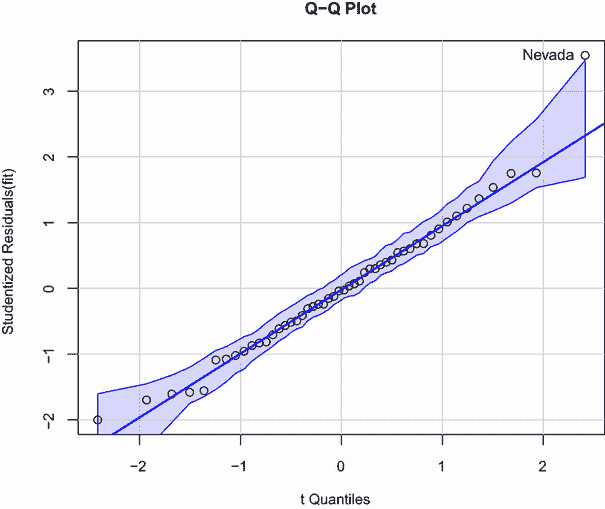

图 8.6 学生化残差 Q-Q 图

除了内华达州之外，所有点都接近直线，并且位于置信区间内，这表明你相当好地满足了正态性假设。但你应该肯定地看看内华达州。它有一个大的正残差（实际值减去预测值），表明该模型低估了该州的谋杀率。具体来说，

```
> states["Nevada",]

       Murder Population Illiteracy Income Frost
Nevada   11.5        590        0.5   5149   188

> fitted(fit)["Nevada"]

  Nevada 
3.878958 

> residuals(fit)["Nevada"]

  Nevada 
7.621042 

> rstudent(fit)["Nevada"]

  Nevada 
3.542929 
```

在这里，你可以看到谋杀率是 11.5%，但模型预测的谋杀率是 3.9%。你需要问的问题是，“为什么内华达州的谋杀率比根据人口、收入、文盲率和温度预测的要高？”任何（没有看过 *Casino*）的人想猜一猜吗？

误差独立性

如前所述，评估因变量值（以及因此残差）是否独立的最佳方式是依据你对数据收集方式的了解。例如，时间序列数据通常表现出自相关性——时间上更接近的观测值彼此之间比与时间上较远的观测值更相关。`car` 包提供了一个用于检测此类序列相关错误的 Durbin-Watson 测试函数。你可以使用以下代码将 Durbin-Watson 测试应用于多重回归问题：

```
> durbinWatsonTest(fit)
 lag Autocorrelation D-W Statistic p-value
   1          -0.201          2.32   0.282
 Alternative hypothesis: rho != 0
```

非显著 p 值（p = 0.282）表明不存在自相关性，反之，误差是独立的。滞后值（本例中为 1）表示每个观测值正在与数据集中相邻的观测值进行比较。尽管适用于时间依赖性数据，但对于这种方式的集群数据，该测试的适用性较低。请注意，`durbinWatsonTest()` 函数使用自助法（见第十二章）来推导 p 值。除非你添加选项 `simulate=FALSE`，否则每次运行测试时都会得到一个略有不同的值。

线性

你可以通过使用成分加残差图（也称为*部分残差图*）来寻找依赖变量与独立变量之间关系的非线性证据。该图由`car`包中的`crPlots()`函数生成。你正在寻找任何与指定的线性模型有系统的偏离。

要为变量*k*创建一个成分加残差图，你绘制以下点

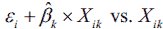

其中残差基于完整模型（包含所有预测因子），且*i* = 1 ... *n*。每个图中直线由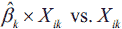给出。每个图还提供了一个局部加权回归线（loess 线，一种平滑的非参数拟合线）。第十一章将描述 loess 线。生成这些图的代码如下：

```
> library(car)
> crPlots(fit)
```

图 8.7 提供了结果图。这些图中的任何非线性都表明，你可能没有充分地模拟该预测因子的函数形式在回归中。如果是这样，你可能需要添加曲线成分，如多项式项，变换一个或多个变量（例如，使用`log(X)`而不是`X`），或者放弃线性回归，转而使用其他回归变体。变换将在本章后面讨论。

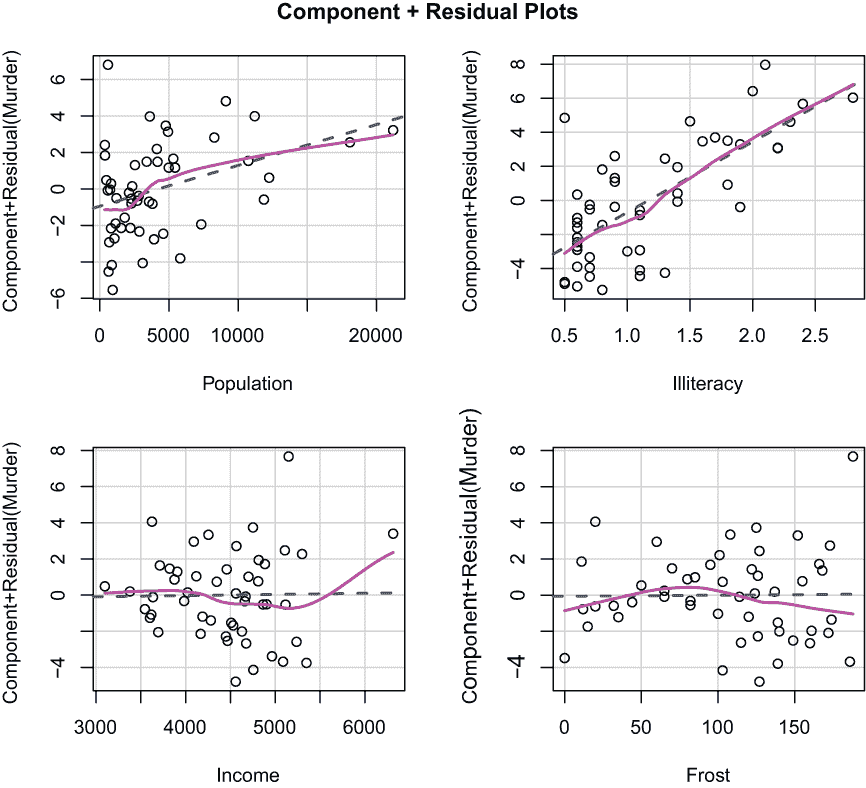

图 8.7 回归中谋杀率与州特征成分加残差图

成分加残差图确认你已经满足了线性假设。线性模型的形态似乎适用于这个数据集。

同方差性

`car`包还提供了两个用于识别非恒定误差方差的实用函数。`ncvTest()`函数产生一个关于恒定误差方差假设的得分检验，与误差方差随拟合值水平变化的备择假设相对。显著结果表明异方差性（非恒定误差方差）。

`spreadLevelPlot()`函数创建一个绝对标准化残差与拟合值的散点图，并叠加最佳拟合线。这两个函数将在下一列表中演示。

列表 8.6 评估同方差性

```
> library(car)
> ncvTest(fit)

Non-constant Variance Score Test 
Variance formula: ~ fitted.values 
Chisquare=1.7    Df=1     p=0.19 

> spreadLevelPlot(fit)

Suggested power transformation:  1.2 
```

分数检验是非显著的（p = 0.19），这表明您已经满足了常数方差假设。您也可以在散点图水平（图 8.8）中看到这一点。点围绕最佳拟合线的水平线形成一个随机的水平带。如果您违反了这一假设，您会期望看到一条非水平线。列表 8.6 中建议的幂变换是建议的幂 p (*Y*^p)，它将稳定非常数误差方差。例如，如果图显示了非水平趋势，并且建议的幂变换是 0.5，那么在回归方程中使用√*Y*而不是*Y*可能会导致满足同方差性的模型。如果建议的幂是 0，您将使用对数变换。在当前示例中，没有异方差性的证据，建议的幂接近 1（不需要变换）。

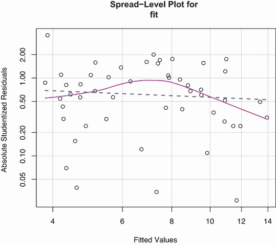

图 8.8 用于评估常数误差方差的散点图水平

### 8.3.3 多重共线性

在离开回归诊断这一节之前，让我们关注一个与统计假设无直接关系但有助于您解释多元回归结果的问题。想象一下，您正在进行一项关于握力的研究。您的自变量包括出生日期（DOB）和年龄。您将握力对 DOB 和年龄进行回归，并发现 F 检验在 p < .001 时具有显著的整体效果。但当您查看 DOB 和年龄的个体回归系数时，您发现它们都是非显著的（也就是说，没有证据表明它们与握力相关）。发生了什么？

问题在于 DOB 和年龄在舍入误差范围内完全相关。回归系数衡量一个预测变量对响应变量的影响，同时保持所有其他预测变量不变。这相当于在保持年龄不变的情况下观察握力和年龄的关系。这个问题被称为多重共线性。它导致模型参数的置信区间很大，使得对单个系数的解释变得困难。

可以使用一个称为方差膨胀因子（VIF）的统计量来检测多重共线性。对于任何预测变量，VIF 的平方根表示该变量的回归参数置信区间相对于无相关预测变量的模型扩展的程度（因此得名）。VIF 值由`car`包中的`vif()`函数提供。一般来说，VIF > 10 表示存在多重共线性问题。以下列表提供了代码。结果表明，这些预测变量不存在多重共线性问题。

列表 8.7 评估多重共线性

```
> library(car)
> vif(fit) 

Population Illiteracy     Income      Frost 
       1.2        2.2        1.3        2.1 

> vif(fit) > 10 # problem?

Population Illiteracy     Income      Frost 
     FALSE      FALSE      FALSE      FALSE
```

## 8.4 不寻常的观测值

综合回归分析还将包括对异常观测值的筛选——异常值、高杠杆观测值和有影响力的观测值。这些数据点需要进一步调查，要么是因为它们在某种程度上与其他观测值不同，要么是因为它们对结果产生了不成比例的影响。让我们逐一查看。

### 8.4.1 异常值

异常值是模型预测不佳的观测值。它们具有异常大的正或负残差（*Y[i]* − *Ŷ[i]*）。正残差表示模型低估了响应值，而负残差表示高估。

你已经看到了一种识别异常值的方法。图 8.6 的 Q-Q 图中位于置信带之外的点被认为是异常值。一个粗略的规则是，标准化残差大于 2 或小于-2 的值得注意。

`car` 包还提供了一种用于异常值的统计测试。`outlierTest()` 函数报告最大绝对学生化残差的 Bonferroni 调整后的 p 值：

```
  > library(car) 
  > outlierTest(fit)
       rstudent unadjusted p-value Bonferroni p
Nevada      3.5            0.00095        0.048
```

在这里，你可以看到内华达州被识别为异常值（p = 0.048）。请注意，此函数测试单个最大（正或负）残差是否作为异常值具有显著性。如果不显著，数据集中没有异常值。如果显著，你必须删除它并重新运行测试，以查看是否存在其他异常值。

### 8.4.2 高杠杆点

具有高杠杆作用的观测值是相对于其他预测因子的异常值。换句话说，它们具有不寻常的预测值组合。响应值不涉及确定杠杆。

通过帽子统计量识别具有高杠杆作用的观测值。对于给定的数据集，平均帽子值是 *p/n*，其中 *p* 是模型中估计的参数数量（包括截距）和 *n* 是样本大小。粗略地说，帽子值大于平均帽子值两倍或三倍的观测值应该进行检查。下面的代码绘制了 `hat` 值：

```
hat.plot <- function(fit) {
              p <- length(coefficients(fit))
              n <- length(fitted(fit))
              plot(hatvalues(fit), main="Index Plot of Hat Values")
              abline(h=c(2,3)*p/n, col="red", lty=2)
              identify(1:n, hatvalues(fit), names(hatvalues(fit)))
            }
hat.plot(fit)
```

图 8.9 显示了结果图。

在平均帽子值的两倍和三倍处画水平线。定位函数将图形置于交互模式。点击感兴趣的点，直到用户按下 Esc 键或图形右上角的完成按钮。

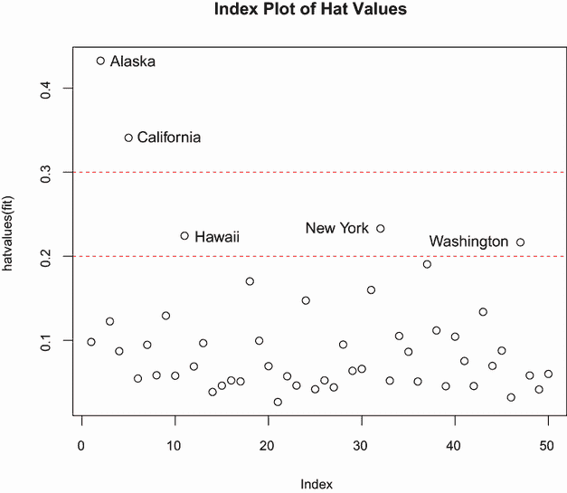

图 8.9 用于评估具有高杠杆作用的观测值的帽子值索引图

在这里，你可以看到阿拉斯加和加利福尼亚在预测值方面特别不寻常。阿拉斯加的收入比其他州高得多，而人口和温度较低。加利福尼亚的人口比其他州高得多，而收入和温度也更高。与其他 48 个观测值相比，这些州是不典型的。

高杠杆观察值可能是有影响力的观察值，也可能不是。这取决于它们是否也是异常值。

### 8.4.3 有影响力的观察值

*有影响力的*观察对模型参数的值有不成比例的影响。想象一下，如果你发现你的模型在移除单个观察值后发生了显著变化。正是这种担忧促使你检查你的数据以寻找有影响力的点。

识别有影响力的观察值有两种方法：Cook 距离（或 D 统计量）和添加变量图。粗略地说，Cook 的 D 值大于 4/(*n* – *k* – 1)，其中*n*是样本大小，*k*是预测变量的数量，表明有影响力的观察值。你可以使用以下代码创建 Cook 的 D 图（图 8.10）：

```
cutoff <- 4/(nrow(states)-length(fit$coefficients)-2)
plot(fit, which=4, cook.levels=cutoff)
abline(h=cutoff, lty=2, col="red")
```

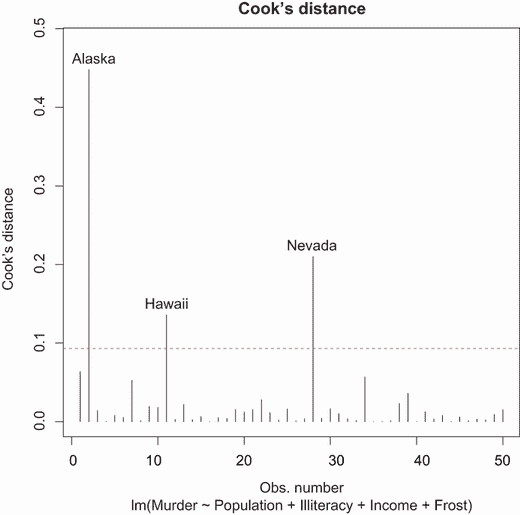

图 8.10 Cook’s D 图用于识别有影响力的观察值

该图表识别出阿拉斯加、夏威夷和内华达是有影响力的观察值。删除这些州将对回归模型中截距和斜率的值产生显著影响。请注意，尽管在寻找有影响力的观察值时撒网广泛是有用的，但我通常发现 1 的截止点比 4/(*n* – *k* – 1)更普遍有用。给定 D = 1 的标准，数据集中的观察值似乎都不会显得有影响力。

Cook’s D 图可以帮助识别有影响力的观察值，但它们不提供有关这些观察值如何影响模型的信息。添加变量图在这方面有所帮助。对于单个响应变量和*k*个预测变量，你会创建*k*个添加变量图，如下所示。

对于每个预测变量*Xk*，绘制响应变量对其他*k* – 1 个预测变量的回归残差与*Xk*对其他*k* – 1 个预测变量的回归残差之间的图。可以使用`car`包中的`avPlots()`函数创建添加变量图：

```
library(car)
avPlots(fit, ask=FALSE, d=list(method="identify"))
```

图 8.11 提供了相应的图表。图表一个接一个地生成，用户可以点击点来识别它们。按 Esc 键或图表右上角的完成按钮以移动到下一个图表。在这里，我在左下角的图表中识别了阿拉斯加。

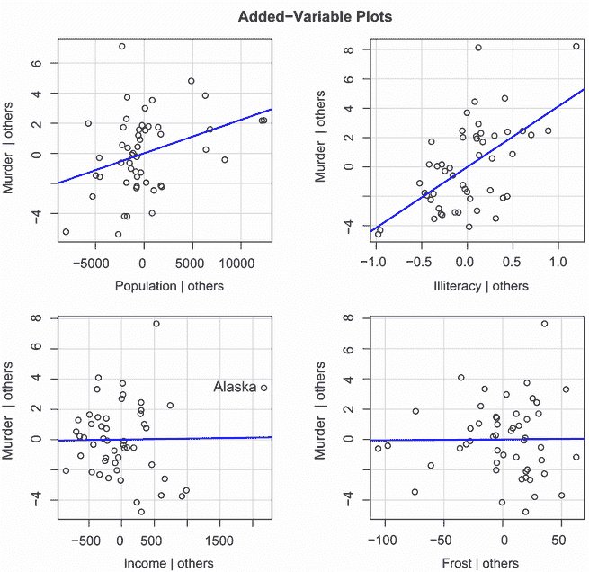

图 8.11 评估有影响力的观察值影响的添加变量图

每个图中的直线是该预测变量的实际回归系数。你可以通过想象如果删除代表该观察值的点，这条线会如何变化来看到有影响力的观察值的影响。例如，看看左下角的 Murder | Others 与 Income | Others 的图表。你可以看到，消除标记为阿拉斯加的点会将线向负方向移动。实际上，删除阿拉斯加将收入回归系数从正的（.00006）变为负的（–.00085）。

您可以使用 `car` 包中的 `influencePlot()` 函数将异常值、杠杆和影响力图的信息合并到一个高度信息化的图中：

```
library(car)
influencePlot(fit, id="noteworthy", main="Influence Plot",
              sub="Circle size is proportional to Cook's distance")
```

结果图（图 8.12）识别了特别值得注意的观测值。特别是，它显示内华达州和罗德岛是异常值，加利福尼亚州和夏威夷有高杠杆作用，内华达州和阿拉斯加是具有影响力的观测值。

将 `id="noteworthy"` 替换为 `id=list(method="identify")` 允许您通过鼠标点击交互式地识别点（结束于 ESC 或按下完成按钮）。

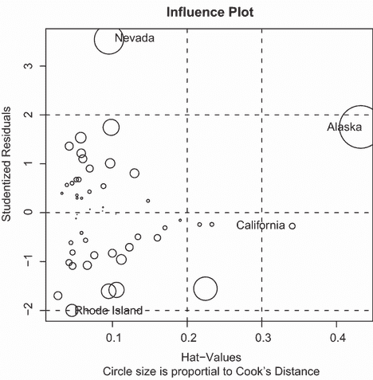

图 8.12 影响图。垂直轴上+2 或-2 以上的州被认为是异常值。水平轴上 0.2 或 0.3 以上的州具有高杠杆作用（预测值的不寻常组合）。圆圈大小与影响力成正比。由大圆圈表示的观测值可能对模型的参数估计有不成比例的影响。

## 8.5 纠正措施

在过去 16 页中学习了回归诊断之后，您可能会问，“如果你发现了问题，你会怎么做？”处理回归假设违反有四种方法：

+   删除观测值

+   变量转换

+   添加或删除变量

+   使用另一种回归方法

让我们逐一看看。

### 8.5.1 删除观测值

删除异常值可以经常改善数据集对正态性假设的拟合。具有影响力的观测值通常也会被删除，因为它们对结果有不成比例的影响。删除最大的异常值或具有影响力的观测值，并重新拟合模型。如果仍然存在异常值或具有影响力的观测值，则重复此过程，直到获得可接受的拟合。

再次，我强烈建议在考虑删除观测值时要谨慎。有时您可以确定观测值是异常值，因为记录数据时的错误，或者因为未遵循协议，或者因为测试对象误解了指示。在这些情况下，删除有问题的观测值似乎是完全合理的。

在其他情况下，异常观测值可能是您收集的数据中最有趣的事情。揭示为什么一个观测值与其他观测值不同可以为当前的主题以及您可能没有考虑到的其他主题提供深刻的见解。我们的一些最大进步来自于偶然注意到某些事情不符合我们的先入之见（请原谅我的夸张）。

### 8.5.2 变量转换

当模型不符合正态性、线性或同方差性假设时，转换一个或多个变量通常可以改善或纠正这种情况。转换通常涉及将变量 *Y* 替换为 *Y^λ*。表 8.5 给出了常见的 *λ* 值及其解释。如果 *Y* 是一个比例，则通常使用对数变换 `[loge (Y/1-Y)]`。当 *Y* 极度偏斜时，对数变换通常很有帮助。

表 8.5 常见转换

| *λ* | -2 | -1 | -0.5 | 0 | 0.5 | 1 | 2 |
| --- | --- | --- | --- | --- | --- | --- | --- |
| 转换 | 1/*Y*² | 1/*Y* | 1/√*Y* | log(*Y*) | √*Y* | 无 | *Y*² |

当模型违反了正态性假设时，你通常会尝试对响应变量进行转换。你可以使用 `car` 包中的 `powerTransform()` 函数来生成最可能使变量 *X^λ* 正态化的幂 *λ* 的最大似然估计。这种转换称为 Box-Cox 转换。在下一个列表中，这种转换应用于 `states` 数据。

列表 8.8 Box-Cox 转换到正态性

```
> library(car)
> summary(powerTransform(states$Murder))
bcPower Transformation to Normality 

              Est.Power Std.Err. Wald Lower Bound Wald Upper Bound
states$Murder       0.6     0.26            0.088              1.1

Likelihood ratio tests about transformation parameters
                      LRT df  pval
LR test, lambda=(0) 5.7  1 0.017
LR test, lambda=(1) 2.1  1 0.145
```

结果表明，你可以通过将其替换为 `Murder0.6` 来标准化变量 `Murder`。因为 0.6 接近 0.5，你可以尝试平方根转换来改善模型对正态性的拟合。但在这个情况下，*λ* = 1 的假设不能被拒绝（p = 0.145），因此没有强有力的证据表明在这种情况下需要转换。这与图 8.9 中的 Q-Q 图的结果一致。

解释对数转换

对数转换通常用于使高度偏斜的分布变得不那么偏斜。例如，变量 `income` 通常右偏斜，有更多的人位于刻度较低的一端，而少数人收入非常高。当响应变量已被对数转换时，我们如何解释回归系数？

我们通常将 *X* 的回归系数解释为 *Y* 在 *X* 单位变化时的预期变化。考虑模型 *Y* = 3 + 0.6*X*。我们预测当 *X* 增加 1 个单位时，*Y* 将增加 0.6。同样，*X* 增加 10 个单位将与 *Y* 增加 0.6(10)或 6 个点的变化相关联。

然而，如果模型是 loge(*Y*) = 3 + 0.6*X*，那么 *X* 的一个单位变化会使 *Y* 的预期值乘以 *e*^(0.6) = 1.06。因此，*X* 增加 1 个单位将预测 *Y* 增加 6%。*X* 增加 10 个单位将使 *Y* 的预期值乘以 *e*^(0.6(10)) = 1.82。因此，*X* 增加 10 个单位将预测 *Y* 增加 82%。

要了解更多关于线性回归中解释对数转换的信息，请参阅 Kenneth Benoit 的优秀指南 ([`kenbenoit.net/assets/courses/ME104/logmodels2.pdf`](https://kenbenoit.net/assets/courses/ME104/logmodels2.pdf))。

当线性假设被违反时，转换预测变量通常有助于解决问题。`car` 包中的 `boxTidwell()` 函数可以用来生成预测变量幂的最大似然估计，这可以改善线性。以下是一个将 Box-Tidwell 转换应用于从人口和文盲率预测州谋杀率的模型的例子：

```
> library(car)
> boxTidwell(Murder~Population+Illiteracy,data=states)

           MLE of lambda Score Statistic (z) Pr(>|z|)
Population       0.86939             -0.3228   0.7468
Illiteracy       1.35812              0.6194   0.5357
```

结果表明尝试变换`Population`^(0.87)和`Population`^(1.36)以实现更大的线性。但`Population`（p = .75）和`Illiteracy`（p = .54）的得分检验表明，这两个变量都不需要变换。再次强调，这些结果与图 8.7 中的成分加残差图一致。

最后，响应变量的变换可以帮助处理异方差性（非恒定误差方差）的情况。您在列表 8.8 中看到，`car`包中的`spreadLevel Plot()`函数提供了一个用于提高同方差性的幂变换。同样，在`states`示例中，常数误差方差假设得到满足，因此不需要进行变换。

关于变换的注意事项

统计学中有一个古老的笑话：如果你不能证明 A，就证明 B，然后假装它是 A。（对于统计学家来说，这相当有趣。）这里的相关性在于，如果你变换了变量，你的解释必须基于变换后的变量，而不是原始变量。如果变换有意义，例如收入的对数或距离的倒数，解释就更容易。但你怎么解释自杀意念频率与抑郁立方根之间的关系？如果变换没有意义，你应该避免它。

### 8.5.3 添加或删除变量

改变模型中的变量将影响模型的拟合度。有时，添加一个重要变量可以纠正我们讨论过的许多问题。删除一个麻烦的变量也可以达到同样的效果。

删除变量对于处理多重共线性尤为重要。如果你的唯一目标是进行预测，那么多重共线性不是一个问题。但如果你想要对个体预测变量进行解释，那么你必须处理它。最常见的方法是删除一个参与多重共线性的变量（即 VIF > 10 的变量之一）。另一种选择是使用 lasso 或 ridge 回归，这些是旨在处理多重共线性情况的多重回归的变体。

### 8.5.4 尝试不同的方法

正如您刚才看到的，处理多重共线性的一种方法是通过拟合不同类型的模型（在本例中为岭回归或 lasso 回归）。如果有异常值和/或影响性观测值，您可以拟合一个稳健回归模型，而不是 OLS 回归。如果您违反了正态性假设，您可以拟合一个非参数回归模型。如果存在显著的非线性，您可以尝试非线性回归模型。如果您违反了误差独立性的假设，您可以拟合一个特别考虑误差结构的模型，例如时间序列模型或多级回归模型。最后，您可以考虑广义线性模型，以拟合在 OLS 回归假设不成立的情况下广泛的各种模型。

我们将在第十三章讨论这些替代方法中的一些。何时尝试改进 OLS 回归模型的拟合度，何时尝试不同的方法，这是一个复杂的问题。这通常基于对主题知识的了解和对哪种方法将提供最佳结果的评估。

说到最佳结果，现在让我们转向决定将哪些预测变量包含在回归模型中的问题。

## 8.6 选择“最佳”回归模型

在开发回归方程时，你隐含地面临从许多可能的模型中进行选择的问题。你应该包含所有研究变量，还是删除对预测没有显著贡献的变量？你应该添加多项式和/或交互项来提高拟合度？最终回归模型的选择总是涉及预测精度（尽可能好地拟合数据的模型）和简洁性（简单且可复制的模型）之间的折衷。在所有条件相同的情况下，如果你有两个具有大致相等预测精度的模型，你更倾向于选择更简单的一个。本节描述了在竞争模型之间进行选择的方法。单词“最佳”用引号括起来，因为没有单一的标准可以用来做出决定。最终的决定需要调查者的判断。（把它想象成职业保障。）

### 8.6.1 比较模型

你可以使用基础安装中的`anova()`函数比较两个嵌套模型的拟合度。嵌套模型是指其项完全包含在另一个模型中的模型。在`states`多元回归模型中，你发现`Income`和`Frost`的回归系数不显著。你可以测试一个不包含这两个变量的模型是否与包含它们的模型一样好（见以下列表）。

列表 8.9 使用`anova()`函数比较嵌套模型

```
> states <- as.data.frame(state.x77[,c("Murder", "Population", 
                          "Illiteracy", "Income", "Frost")])
> fit1 <- lm(Murder ~ Population + Illiteracy + Income + Frost,
          data=states)
> fit2 <- lm(Murder ~ Population + Illiteracy, data=states)
> anova(fit2, fit1)

Analysis of Variance Table

Model 1: Murder ~ Population + Illiteracy
Model 2: Murder ~ Population + Illiteracy + Income + Frost
  Res.Df     RSS  Df     Sum of Sq      F Pr(>F)
1     47 289.246                           
2     45 289.167  2     0.079 0.0061     0.994
```

在这里，模型 1 嵌套在模型 2 中。`anova()`函数提供了一个同时测试，即`Income`和`Frost`是否在`Population`和`Illiteracy`之上增加了线性预测。由于测试不显著（p = .994），你得出结论，它们没有增加线性预测，因此你有理由从模型中删除它们。

阿卡伊克信息准则（AIC）为比较模型提供了另一种方法。该指数考虑了模型的统计拟合度和实现这种拟合所需的参数数量。具有较小 AIC 值的模型——表示使用较少参数即可达到适当的拟合——更受欢迎。该准则由`AIC()`函数提供（见以下列表）。

列表 8.10 使用 AIC 比较模型

```
> fit1 <- lm(Murder ~ Population + Illiteracy + Income + Frost,
          data=states)
> fit2 <- lm(Murder ~ Population + Illiteracy, data=states)
> AIC(fit1,fit2)

     df      AIC
fit1  6 241.6429
fit2  4 237.6565
```

AIC 值表明，没有`Income`和`Frost`的模型是更好的模型。请注意，尽管 ANOVA 方法需要嵌套模型，但 AIC 方法不需要。

比较两个模型相对简单，但当有 4 个、10 个或 100 个可能的模型需要考虑时，你该怎么办？这就是下一节的主题。

### 8.6.2 变量选择

从更大的候选变量池中选择最终预测变量集的两种流行方法是逐步方法和所有子集回归。

逐步回归

在逐步选择中，变量一次添加到或从模型中删除，直到达到某个停止标准。例如，在*正向逐步*回归中，你一次添加一个预测变量到模型中，直到添加变量不再提高模型质量为止。在*反向逐步*回归中，你从一个包含所有预测变量的模型开始，然后逐个删除它们，直到删除变量会降低模型质量为止。在*逐步逐步*回归（通常称为逐步以避免听起来愚蠢）中，你结合了正向和反向*逐步*方法。变量一次添加到模型中，但在每一步，模型中的变量都会重新评估，并且那些对模型没有贡献的变量会被删除。预测变量可能在最终解决方案达到之前被多次添加到和从模型中删除。

步骤回归方法的实现因用于进入或删除变量的标准而异。基础 R 中的`step()`函数使用 AIC 标准执行逐步模型选择（正向、反向或逐步）。下面的列表将反向逐步回归应用于多元回归问题。

列表 8.11 反向逐步回归

```
> states <- as.data.frame(state.x77[,c("Murder", "Population", 
                          "Illiteracy", "Income", "Frost")])

> fit <- lm(Murder ~ Population + Illiteracy + Income + Frost,
          data=states)
> step(fit, direction="backward")

Start:  AIC=97.75
Murder ~ Population + Illiteracy + Income + Frost

             Df Sum of Sq    RSS     AIC
- Frost       1     0.021 289.19  95.753
- Income      1     0.057 289.22  95.759
<none>                    289.17  97.749
- Population  1    39.238 328.41 102.111
- Illiteracy  1   144.264 433.43 115.986

Step:  AIC=95.75
Murder ~ Population + Illiteracy + Income

             Df Sum of Sq    RSS     AIC
- Income      1     0.057 289.25  93.763
<none>                    289.19  95.753
- Population  1    43.658 332.85 100.783
- Illiteracy  1   236.196 525.38 123.605

Step:  AIC=93.76
Murder ~ Population + Illiteracy

             Df Sum of Sq    RSS     AIC
<none>                    289.25  93.763
- Population  1    48.517 337.76  99.516
- Illiteracy  1   299.646 588.89 127.311

Call:
lm(formula = Murder ~ Population + Illiteracy, data = states)

Coefficients:
(Intercept)   Population   Illiteracy  
  1.6515497    0.0002242    4.0807366  
```

你从模型中的所有四个预测变量开始。对于每一步，AIC 列提供了删除该行中列出的变量后得到的模型 AIC。`<none>`的 AIC 值是如果没有变量被删除的模型 AIC。在第一步中，`Frost`被删除，AIC 从 97.75 降至 95.75。在第二步中，`Income`被删除，AIC 降至 93.76。删除更多变量会增加 AIC，因此过程停止。

逐步回归是有争议的。尽管它可能找到一个好的模型，但无法保证它会找到“最佳”模型，因为并非每个可能模型都被评估。试图克服这一局限性的方法是“所有子集回归”。

所有子集回归

在所有子集回归中，检查了每个可能模型。分析师可以选择显示所有可能的结果，或者要求显示每个子集大小的`nbest`模型（一个预测变量、两个预测变量，等等）。例如，如果`nbest=2`，则显示两个最佳的单预测变量模型，然后是两个最佳的二预测变量模型，然后是两个最佳的三预测变量模型，直到包含所有预测变量的模型。

所有子集回归是通过`leaps`包中的`regsubsets()`函数执行的。你可以选择 R-squared、调整后的 R-squared 或 Mallows Cp 统计量作为报告“最佳”模型的准则。

正如你所见，R-squared 是预测变量在响应变量中解释的方差量。调整后的 R-squared 与此类似，但考虑了模型中的参数数量。随着预测变量的增加，R-squared 总是增加。当预测变量的数量相对于样本量很大时，这可能导致显著的过拟合。调整后的 R-squared 试图提供一个更诚实的总体 R-squared 估计——一个不太可能利用数据中偶然变化的估计。

在下面的列表中，我们将对所有子集回归应用于`states`数据。`leaps`包以图表的形式展示结果，但我发现很多人对此图表感到困惑。下面的代码以表格的形式展示了相同的结果，我认为这将更容易理解。

列表 8.12 所有子集回归

```
library(leaps)
states <- as.data.frame(state.x77[,c("Murder", "Population", 
                        "Illiteracy", "Income", "Frost")])

leaps <-regsubsets(Murder ~ Population + Illiteracy + Income +
                   Frost, data=states, nbest=4)

subsTable <- function(obj, scale){
  x <- summary(leaps)
  m <- cbind(round(x[[scale]],3), x$which[,-1])
  colnames(m)[1] <- scale
  m[order(m[,1]), ]
}

subsTable(leaps, scale="adjr2)

  adjr2 Population Illiteracy Income Frost
1 0.033          0          0      1     0
1 0.100          1          0      0     0
1 0.276          0          0      0     1
2 0.292          1          0      0     1
3 0.309          1          0      1     1
3 0.476          0          1      1     1
2 0.480          0          1      1     0
2 0.481          0          1      0     1
1 0.484          0          1      0     0
4 0.528          1          1      1     1
3 0.539          1          1      1     0
3 0.539          1          1      0     1
2 0.548          1          1      0     0
```

表格中的每一行代表一个模型。第一列表示模型中的预测变量数量。第二列是用于描述每个模型拟合度的尺度（在本例中为调整后的 R-squared），行按此尺度排序。（注意：可以使用其他尺度值代替`adjr2`。有关选项列表，请参阅`?regsubsets`。）行中的 1 和 0 表示哪些变量被包含或排除在模型之外。

例如，基于单一预测变量`Income`的模型具有 0.033 的调整后的 R-square。具有预测变量`Population`、`Illiteracy`和`Income`的模型具有 0.539 的调整后的 R-square。相比之下，仅使用预测变量`Population`和`Illiteracy`的模型具有 0.548 的调整后的 R-square。在这里，你可以看到具有较少预测变量的模型实际上具有更大的调整后的 R-square（这是未经调整的 R-square 不可能发生的情况）。表格表明，双预测变量模型（`Population`和`Illiteracy`）是最好的。

在大多数情况下，所有子集回归比逐步回归更可取，因为考虑了更多的模型。但当预测变量的数量很大时，该过程可能需要大量的计算时间。一般来说，自动变量选择方法应被视为模型选择的辅助工具，而不是主导力量。一个拟合良好但无意义的模型并不能帮助你。最终，你应该根据你对主题知识的了解来指导自己。

## 8.7 深入分析

我们将通过考虑评估模型泛化能力和预测变量相对重要性的方法来结束对回归的讨论。

### 8.7.1 交叉验证

在上一节中，我们探讨了选择回归方程中包含的变量的方法。当描述是你的主要目标时，选择和解释回归模型标志着你工作的结束。但是，当你的目标是预测时，你可以合理地询问，“这个方程在现实世界中表现如何？”

根据定义，回归技术获得的是针对给定数据集最优的模型参数。在 OLS 回归中，模型参数被选择以最小化预测（残差）的平方误差之和，反之，最大化响应变量（R 平方）中解释的方差量。因为方程已经针对给定数据集进行了优化，所以它不太可能在新数据集上表现良好。

我们本章以一个研究生理学家为例开始，他想要预测个体从运动持续时间、强度、年龄、性别和 BMI 中燃烧的卡路里数量。如果你将 OLS 回归方程拟合到这些数据上，你会得到一组独特的模型参数，这些参数最大化了这一特定观察集的 R 平方。但我们的研究人员想要使用这个方程来预测一般个体的卡路里消耗，而不仅仅是原始研究中的个体。你知道这个方程在新观察样本中表现不会那么好，但你会损失多少？交叉验证是评估回归方程泛化能力的一种有用方法。

在交叉验证中，一部分数据被选为训练样本，另一部分被选为保留样本。在训练样本上开发回归方程，然后将其应用于保留样本。因为保留样本没有参与模型参数的选择，所以在这个样本上的表现是对模型在新数据上运行特性的更准确估计。

在 k 折交叉验证中，样本被分为*k*个子样本。每个*k*个子样本都作为保留组，而从剩余*k* - 1 个子样本中合并的观察值作为训练组。记录应用于*k*个保留样本的*k*个预测方程的性能，然后取平均值。（当*k*等于*n*，即观察值的总数时，这种方法称为“刀切法”。）

你可以使用`bootstrap`包中的`crossval()`函数执行 k 折交叉验证。以下列表提供了一个函数（称为`shrinkage()`），用于使用 k 折交叉验证交叉验证模型的 R 平方统计量。

列表 8.13：k 折交叉验证 R 平方函数

```
shrinkage <- function(fit, k=10, seed=1){
  require(bootstrap)

  theta.fit <- function(x,y){lsfit(x,y)}                     
  theta.predict <- function(fit,x){cbind(1,x)%*%fit$coef}     

  x <- fit$model[,2:ncol(fit$model)]                         
  y <- fit$model[,1] 

  set.seed(seed)
  results <- crossval(x, y, theta.fit, theta.predict, ngroup=k)  
  r2    <- cor(y, fit$fitted.values)²                         
  r2cv  <- cor(y, results$cv.fit)²
  cat("Original R-square =", r2, "\n")
  cat(k, "Fold Cross-Validated R-square =", r2cv, "\n")
}
```

使用这个列表，你可以定义你的函数，创建一个预测值和预测值的矩阵，获取原始的 R 平方和残差标准误差，以及获取交叉验证的 R 平方和残差标准误差。（第十二章详细介绍了自助法。）

然后使用`shrinkage()`函数对`states`数据进行 10 折交叉验证，使用包含所有四个预测变量的模型：

```
> states <- as.data.frame(state.x77[,c("Murder", "Population", 
         "Illiteracy", "Income", "Frost")])
> fit <- lm(Murder ~ Population + Income + Illiteracy + Frost, data=states)
> shrinkage(fit)

Original R-square = 0.567 
10 Fold Cross-Validated R-square = 0.356 
```

你可以看到，基于样本的 R-square（0.567）过于乐观。对于这个模型将用新数据解释的谋杀率变化量的更好估计是交叉验证的 R-square（0.356）。（注意，观测值是随机分配到 k 个组中的，因此提供了一个随机数种子以使结果可重复。）

你可以在变量选择中使用交叉验证，通过选择一个表现出更好泛化能力的模型。例如，具有两个预测变量（人口和`Illiteracy`）的模型比完整模型具有更小的 R-square 缩减：

```
> fit2 <- lm(Murder ~ Population + Illiteracy,data=states)
> shrinkage(fit2)

Original R-square = 0.567 
10 Fold Cross-Validated R-square = 0.515 
```

这可能使得双预测器模型成为一个更有吸引力的替代方案。

在所有其他条件相同的情况下，基于更大训练样本且更能代表目标人群的回归方程将具有更好的交叉验证效果。你将获得更小的 R-squared 缩减，并做出更准确的预测。

### 8.7.2 相对重要性

到目前为止，在本章中，我们一直在问，“哪些变量对预测结果有用？”但通常你的真正兴趣是，“哪些变量在预测结果中最为重要？”你隐含地希望根据相对重要性对预测变量进行排序。提出第二个问题可能有实际依据。例如，如果你可以根据相对重要性对领导实践进行排序，以组织成功为标准，你就可以帮助管理者专注于他们最需要发展的行为。

如果预测变量不相关，这将很简单。你会根据预测变量与响应变量的相关性对预测变量进行排序。然而，在大多数情况下，预测变量彼此相关，这显著增加了任务的复杂性。

已经尝试了许多方法来开发一种评估预测变量相对重要性的手段。最简单的方法是比较标准化回归系数，它描述了预测变量标准差变化时响应变量的预期变化（以标准差单位表示），同时保持其他预测变量不变。你可以在 R 中使用`scale()`函数将你的数据集中的每个变量标准化到均值为 0 和标准差为 1，然后将数据集提交给回归分析之前获得标准化回归系数。（注意，因为`scale()`函数返回一个矩阵，而`lm()`函数需要一个数据框，你需要在中间步骤中进行转换。）多回归问题的代码和结果如下所示：

```
> states <- as.data.frame(state.x77[,c("Murder", "Population", 
                          "Illiteracy", "Income", "Frost")])
> zstates <- as.data.frame(scale(states))
> zfit <- lm(Murder~Population + Income + Illiteracy + Frost, data=zstates)
> coef(zfit)

(Intercept)  Population      Income  Illiteracy       Frost 
 -9.406e-17   2.705e-01   1.072e-02   6.840e-01   8.185e-03
```

在这里，你可以看到在控制人口、收入和温度的情况下，文盲率的每增加一个标准差会导致谋杀率增加 0.68 个标准差。使用标准化回归系数作为指导，`文盲率` 是最重要的预测因子，而 `霜冻` 是最不重要的。

已经尝试了许多其他方法来量化相对重要性，这可以被认为是每个预测因子对 R-square 的贡献，无论是单独还是与其他预测因子结合。几种可能的相对重要性方法被 Ulrike Grömping 编写的 `relaimpo` 包所捕捉（[`mng.bz/KDYF`](http://mng.bz/KDYF)）。

一种名为相对权重的新的方法显示出显著的潜力。该方法紧密地近似了通过添加预测变量到所有可能的子模型中获得的平均 R-square 增加量（Johnson，2004；Johnson 和 LeBreton，2004；LeBreton 和 Tonidandel，2008）。下一个列表中提供了一个生成相对权重的函数。

列表 8.14 `relweights()` 用于计算预测因子的相对重要性

```
relweights <- function(fit,...){                         
  R <- cor(fit$model)   
  nvar <- ncol(R)          
  rxx <- R[2:nvar, 2:nvar] 
  rxy <- R[2:nvar, 1]      
  svd <- eigen(rxx)        
  evec <- svd$vectors                           
  ev <- svd$values         
  delta <- diag(sqrt(ev))  
  lambda <- evec %*% delta %*% t(evec)        
  lambdasq <- lambda ^ 2   
  beta <- solve(lambda) %*% rxy           
  rsquare <- colSums(beta ^ 2)                   
  rawwgt <- lambdasq %*% beta ^ 2    
  import <- (rawwgt / rsquare) * 100 
  import <- as.data.frame(import)
  row.names(import) <- names(fit$model[2:nvar])   
  names(import) <- "Weights"
  import <- import[order(import),1, drop=FALSE]
  dotchart(import$Weights, labels=row.names(import),
     xlab="% of R-Square", pch=19,
     main="Relative Importance of Predictor Variables", 
     sub=paste("Total R-Square=", round(rsquare, digits=3)),
     ...)  
return(import)
}
```

注意：列表 8.16 中的代码是从 Johnson 博士慷慨提供的 SPSS 程序中改编的。有关相对权重的推导解释，请参阅 Johnson，2000。

在下一个列表中，`relweights()` 函数被应用于 `states` 数据，其中谋杀率由人口、文盲率、收入和温度预测。

列表 8.15 应用 `relweights()` 函数

```
> states <- as.data.frame(state.x77[,c("Murder", "Population", 
         "Illiteracy", "Income", "Frost")])
> fit <- lm(Murder ~ Population + Illiteracy + Income + Frost, data=states)
> relweights(fit, col="blue")

           Weights
Income        5.49
Population   14.72
Frost        20.79
Illiteracy   59.00
```

从结果图（图 8.13）中可以看出，模型解释的总方差（R-square = 0.567）被分配给了预测变量。`文盲率` 解释了 59% 的 R-square，`霜冻` 解释了 20.79%，等等。根据相对权重方法，`文盲率` 具有最大的相对重要性，其次是 `霜冻`、`人口` 和 `收入`，顺序如下。

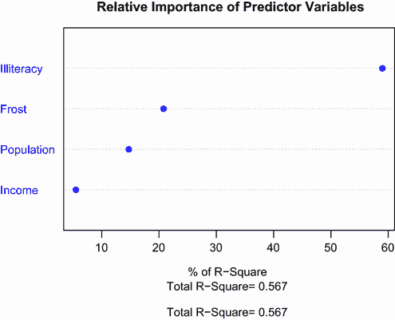

图 8.13 `states` 多元回归问题的相对权重点图。较大的权重表示相对更重要的预测因子。例如，`文盲率` 解释了总解释方差（0.567）的 59%，而 `收入` 只解释了 5.49%。因此，在这个模型中，`文盲率` 的相对重要性大于 `收入`。

相对重要性度量（特别是相对权重方法）具有广泛的应用。它们比标准化回归系数更接近我们对于相对重要性的直观理解，我预计在未来的几年里它们的使用将会显著增加。

## 摘要

+   回归分析是一种高度交互和迭代的分析方法，涉及拟合模型、评估其与统计假设的拟合度、修改数据和模型，并重新拟合以达到最终结果。

+   回归诊断用于评估数据与统计假设的拟合程度，并选择修改模型或数据以更接近这些假设的方法。

+   可用于选择最终回归模型中包含的变量的方法有很多，包括使用显著性检验、拟合统计量以及自动化解决方案，如逐步回归和所有子集回归。

+   交叉验证可用于评估预测模型在新数据样本上的可能性能。

+   相对权重法可用于解决变量重要性这一棘手问题：确定哪些变量对于预测结果最为重要。
