# 9 方差分析

本章涵盖了

+   使用 R 模拟基本实验设计

+   拟合和解释 ANOVA 类型模型

+   评估模型假设

在第八章中，我们探讨了用于从定量预测变量预测定量响应变量的回归模型，但并没有理由我们不能将名义或有序因素作为预测变量包括在内。当因素作为解释变量时，我们的焦点通常从预测转移到理解组间差异，这种方法被称为 *方差分析（ANOVA）*。ANOVA 方法用于分析各种实验和准实验设计。本章提供了 R 函数分析常见研究设计的概述。

首先，我们将探讨设计术语，然后一般性地讨论 R 拟合 ANOVA 模型的方法。接着，我们将探索几个示例，以说明常见设计的分析。在这个过程中，你将治疗焦虑症、降低血液胆固醇水平、帮助怀孕的老鼠生下胖宝宝、确保猪长牙、促进植物的呼吸，并了解哪些货架需要避免。

除了基本安装之外，在示例中你将使用 `car`、`rrcov`、`multcomp`、`effects`、`MASS`、`dplyr`、`ggplot2` 和 `mvoutlier` 这些包。在尝试示例代码之前，请确保安装它们。

## 9.1 术语速成课程

实验设计一般而言，尤其是方差分析（ANOVA）有其特定的语言。在讨论这些设计的分析之前，我们将快速回顾一些重要术语。我们将通过一系列越来越复杂的实验设计来介绍最重要的概念。

假设你对焦虑症的治疗感兴趣。两种流行的焦虑症治疗方法是认知行为疗法（CBT）和眼动脱敏与再加工（EMDR）。你招募了 10 名焦虑症患者，并将其中一半随机分配接受五周的 CBT 治疗，另一半接受五周的 EMDR 治疗。在治疗结束时，每位患者都被要求完成状态-特质焦虑量表（STAI），这是一种焦虑的自我报告测量工具。图 9.1A 概述了该设计。

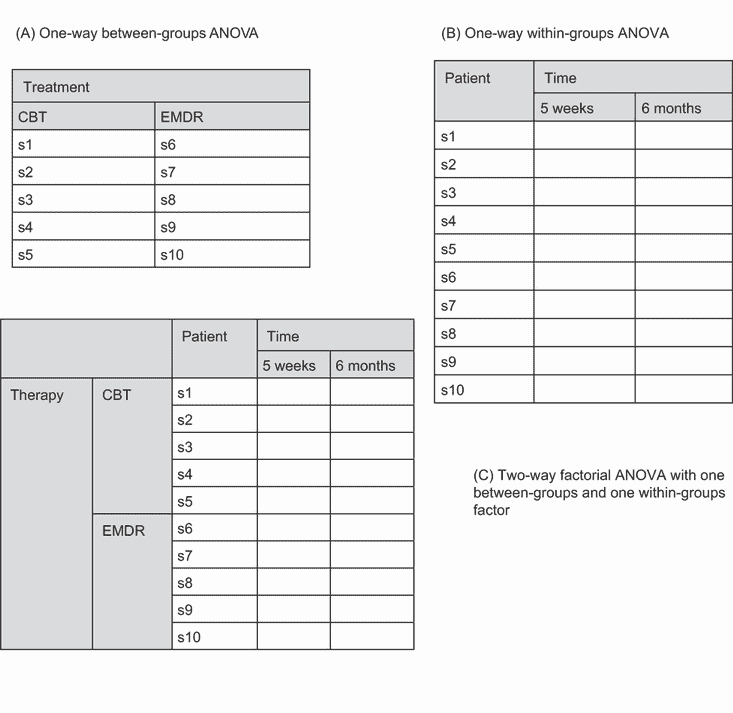

图 9.1 三种方差分析（ANOVA）设计

在这个设计中，治疗是一个 *组间* 因素，有两个水平（CBT、EMDR）。它被称为组间因素，因为患者被分配到一组，并且只有一组。没有患者同时接受 CBT 和 EMDR。*s* 字符代表受试者（患者）。STAI 是 *因变量*，而治疗是 *自变量*。由于每个治疗条件中的观察数量相等，你有一个 *平衡设计*。当设计中的单元格样本量不相等时，你有一个 *不平衡设计*。

图 9.1A 中的统计设计被称为**单因素方差分析**，因为有一个单一的分类变量。具体来说，它是一个单因素组间方差分析。在方差分析设计中，效应主要通过 F 检验来评估。如果治疗因素的 F 检验显著，你可以得出结论，两种治疗在五周治疗后平均 STAI 分数存在差异。

如果你感兴趣的是 CBT 对焦虑随时间的影响，你可以将所有 10 名患者都放在 CBT 组中，并在治疗结束时以及六个月后再次评估他们。图 9.1B 显示了这种设计。

时间是一个**组内**因素，有两个水平（五周，六个月）。它被称为组内因素，因为每个患者在两个水平下都被测量。统计设计是一个**单因素组内方差分析**。由于每个受试者被测量多次，该设计也被称为**重复测量方差分析**。如果时间因素的 F 检验显著，你可以得出结论，患者的平均 STAI 分数在五周和六个月之间发生了变化。

如果你既对治疗差异**以及**时间变化感兴趣，你可以结合前两种研究设计，随机分配五名患者到认知行为治疗（CBT）组和五名患者到眼动脱敏与再加工（EMDR）组，并在治疗结束（五周）和六个月后评估他们的 STAI 结果（见图 9.1C）。

通过将治疗和时间都作为因素，你可以检查治疗（时间平均），时间（治疗类型平均），以及治疗和时间的交互作用的影响。前两者被称为**主效应**，而交互作用（不出所料）被称为**交互效应**。

当你交叉两个或更多因素，就像这里所做的那样，你有一个**因子方差分析**设计。交叉两个因素产生一个双向方差分析，交叉三个因素产生一个三向方差分析，依此类推。当一个因子设计包括组间和组内因素时，它也被称为**混合模型方差分析**。当前的设计是一个双向混合模型因子方差分析（哇！）。

在这种情况下，你将有三项 F 检验：一项用于治疗，一项用于时间，一项用于治疗×时间的交互作用。治疗因素显著表明 CBT 和 EMDR 在影响焦虑方面存在差异。时间因素显著表明焦虑从第五周到六个月随访期间发生了变化。治疗×时间交互作用显著表明两种焦虑治疗方法在时间上的影响存在差异（即，从五周到六个月焦虑的变化对两种治疗方法来说是不同的）。

现在让我们稍微扩展一下设计。众所周知，抑郁症可能会影响治疗效果，并且抑郁症和焦虑症常常同时发生。尽管受试者被随机分配到治疗条件中，但在研究开始时，两个治疗组的患者抑郁症水平可能存在差异。任何治疗后的差异可能是由预先存在的抑郁症差异造成的，而不是由于你的实验操作。因为抑郁症也可能解释依赖变量的组间差异，所以它是一个*混杂*因素。而且因为你对抑郁症不感兴趣，所以它被称为*干扰*变量。

如果你使用自我报告的抑郁症量表（如招募患者时的贝克抑郁量表 BDI）记录了抑郁症水平，你可以在评估治疗效果的影响之前对任何治疗组的抑郁症差异进行统计调整。在这种情况下，BDI 被称为*协变量*，设计被称为*协方差分析（ANCOVA）*。

最后，你在这项研究中记录了一个单一的依赖变量（STAI）。你可以通过包括额外的焦虑测量（如家庭评估、治疗师评估以及评估焦虑对日常生活功能影响的测量）来提高这项研究的有效性。当存在多个依赖变量时，设计被称为*多变量方差分析（MANOVA）*。如果存在协变量，则称为*多变量协方差分析（MANCOVA）*。

现在你已经掌握了基本术语，你准备好让你的朋友们惊叹，让新认识的人眼花缭乱，并学习如何使用 R 拟合 ANOVA/ANCOVA/MANOVA 模型。

## 9.2 拟合 ANOVA 模型

虽然 ANOVA 和回归方法分别发展，但在功能上它们都是一般线性模型的特殊情况。你可以使用第八章中用于回归的相同`lm()`函数来分析 ANOVA 模型。但本章你将主要使用`aov()`函数。`lm()`和`aov()`的结果是等效的，但`aov()`函数以 ANOVA 方法学家更熟悉的方式呈现这些结果。为了完整性，我将在本章末尾提供一个使用`lm()`的示例。

### 9.2.1 `aov()`函数

`aov()`函数的语法是`aov(formula, data=dataframe)`。表 9.1 描述了可以在公式中使用的特殊符号。在这个表中，`y`是依赖变量，字母`A`、`B`和`C`代表因素。

表 9.1 R 公式中使用的特殊符号

| 符号 | 用法 |
| --- | --- |
| `~` | 将左侧的响应变量与右侧的解释变量分开。例如，从`A`、`B`和`C`预测`y`的编码为`y ~ A + B + C` |
| `:` | 表示变量之间的交互作用。从`A`、`B`以及`A`和`B`之间的交互作用预测`y`的编码为`y ~ A + B + A:B` |
| `*` | 表示变量的完全交叉。代码 `y ~ A*B*C` 展开为 `y ~ A + B + C + A:B + A:C + B:C + A:B:C` |
| `^` | 表示到指定程度的交叉。代码 `y ~ (A+B+C)²` 展开为 `y ~ A + B + C + A:B + A:C + A:B` |
| `.` | 表示所有剩余变量。代码 `y ~ .` 展开为 `y ~ A + B + C` |

表 9.2 提供了几个常见研究设计的公式。在此表中，小写字母是定量变量，大写字母是分组因子，`Subject` 是受试者的唯一标识变量。

表 9.2 常见研究设计的公式

| 设计 | 公式 |
| --- | --- |
| 单因素方差分析 | `y ~ A` |
| 具有一个协变量的单因素协方差分析 | `y ~ x + A` |
| 双因素方差分析 | `y ~ A * B` |
| 具有两个协变量的双因素协方差分析 | `y ~ x1 + x2 + A * B` |
| 随机区组 | `y ~ B + A` (其中 `B` 是一个区组因子) |
| 单因素组内方差分析 | `y ~ A + Error(Subject/A)` |
| 具有一个组内因子 `(W)` 和一个组间因子 `(B)` 的重复测量方差分析 | `y ~ B * W + Error(Subject/W)` |

我们将在本章后面深入探讨这些设计的几个示例。

### 9.2.2 公式项的顺序

当公式中存在多个因子且设计不平衡或存在协变量时，公式中效应出现的顺序很重要。当这两种条件中的任何一种存在时，方程右侧的变量将相互关联。在这种情况下，没有明确的方法来划分它们对因变量的影响。例如，在一个具有不等数量观察值的处理组合的两因素方差分析中，模型 `y` `~` `A*B` *不会*产生与模型 `y` `~` `B*A` 相同的结果。

默认情况下，R 使用类型 I（顺序）方法计算方差分析效应（见侧边栏“顺序很重要！”）。第一个模型可以写成 `y` `~` `A` `+` `B` `+ A:B`。生成的 R 方差分析表将评估

+   `A` 对 `y` 的影响

+   在控制 `A` 的情况下，`B` 对 `y` 的影响

+   在控制 `A` 和 `B` 的主效应的情况下，`A` 和 `B` 的交互作用

顺序很重要！

当自变量相互关联或与协变量关联时，没有明确的方法来评估这些变量对因变量的独立贡献。考虑一个具有 `A` 和 `B` 因子和因变量 `y` 的不平衡两因素设计。该设计有三个效应：`A` 和 `B` 的主效应以及 `A` `×` `B` 的交互作用。假设你正在使用公式 `Y` `~` `A` `+` `B` `+` `A:B` 来建模数据，那么在方程右侧的效应中划分 `y` 的方差有三个典型方法。

类型 I（顺序）

效应会调整那些在公式中较早出现的效应。`A` 是未调整的。`B` 调整了 `A`。`A:B` 交互作用调整了 `A` 和 `B`。

类型 II (分层)

效应调整以适应同一或更低级别的其他效应。`A` 调整以适应 `B`。`B` 调整以适应 `A`。`A:B` 交互作用调整以适应 `A` 和 `B`。

III 类（边际）

模型中的每个效应都会调整以适应模型中的其他效应。`A` 调整以适应 `B` 和 `A:B`。`B` 调整以适应 `A` 和 `A:B`。`A:B` 交互作用调整以适应 `A` 和 `B`。

R 默认采用 I 类方法。其他程序如 SAS 和 SPSS 默认采用 III 类方法。

样本大小不平衡程度越大，项的顺序对结果的影响就越大。一般来说，更基本的效果应该更早地列在公式中。特别是，协变量应该首先列出，然后是主效应，接着是双向交互作用，然后是三向交互作用，依此类推。对于主效应，更基本的变量应该首先列出。因此，性别应该列在治疗之前。底线是：当研究设计不是正交的（即，当因素和/或协变量相关时），在指定效应顺序时要小心。

在具体示例之前，请注意，`car` 包中的 `Anova()` 函数（不要与标准 `anova()` 函数混淆）提供了使用 II 类或 III 类方法而不是 `aov()` 函数使用的 I 类方法的选择。如果你担心将你的结果与 SAS 和 SPSS 等其他包提供的结果相匹配，你可能想使用 `Anova()` 函数。有关详细信息，请参阅 `help(Anova, package="car")`。

## 9.3 单因素方差分析

在单因素方差分析中，你感兴趣的是比较由分类分组因素定义的两个或多个组的因变量均值。此例来自 `multcomp` 包中的 `cholesterol` 数据集，由 Westfall、Tobias、Rom 和 Hochberg（1999）提供。50 名患者接受了五种胆固醇降低药物方案之一（`trt`）。三种治疗方案涉及相同的药物，每天一次 20 毫克（`1time`）、每天两次 10 毫克（`2times`）或每天四次 5 毫克（`4times`）。剩下的两种条件（`drugD` 和 `drugE`）代表竞争性药物。哪种药物方案产生了最大的胆固醇降低（响应）？以下列表提供了分析。

列表 9.1 单因素方差分析（ANOVA）

```
> library(dplyr)
> data(cholesterol, package="multcomp")
> plotdata <- cholesterol %>%                             ❶
    group_by(trt) %>%                                     ❶
    summarize(n = n(),                                    ❶
              mean = mean(response),                      ❶
              sd = sd(response),                          ❶
              ci = qt(0.975, df = n - 1) * sd / sqrt(n))  ❶
> plotdata                                        

  trt        n  mean    sd    ci
  <fct>  <int> <dbl> <dbl> <dbl>
1 1time     10  5.78  2.88  2.06
2 2times    10  9.22  3.48  2.49
3 4times    10 12.4   2.92  2.09
4 drugD     10 15.4   3.45  2.47
5 drugE     10 20.9   3.35  2.39

> fit <- aov(response ~ trt, data=cholesterol)            ❷

> summary(fit)    

            Df Sum Sq   Mean Sq    F value           Pr(>F)    
trt          4   1351       338       32.4     9.8e-13  ***
Residuals   45    469        10                    
--- 
Signif. codes:  0 '***' 0.001 '**' 0.01 '*' 0.05 '.' 0.1 ' ' 1    

> library(ggplot2)                                        ❸
> ggplot(plotdata,                                        ❸
       aes(x = trt, y = mean, group = 1)) +               ❸
    geom_point(size = 3, color="red") +                   ❸
    geom_line(linetype="dashed", color="darkgrey") +      ❸
    geom_errorbar(aes(ymin = mean - ci,                   ❸
                      ymax = mean + ci),                  ❸
                  width = .1) +                           ❸
    theme_bw() +                                          ❸
    labs(x="Treatment",                                   ❸
         y="Response",                                    ❸
         title="Mean Plot with 95% Confidence Interval")  ❸
```

❶ 组样本大小、均值、标准差和 95% 置信区间

❷ 组间差异检验（ANOVA）

❸ 绘制组均值和置信区间

观察输出结果，你可以看到每种药物方案都有 10 名患者接受治疗 ❶。从均值来看，`drugE` 产生了最大的胆固醇降低效果，而 `1time` 产生了最小的效果 ❷。标准差在五个组中相对恒定，范围从 2.88 到 3.48。我们假设我们研究的每个治疗组都是可能接受治疗的更大潜在患者群体中的一个样本。对于每种治疗，样本均值 +/– `ci` 给我们一个区间，我们 95% 置信这个区间包含真实的总体均值。治疗 ANOVA F 检验（`trt`）是显著的（p < .0001），提供了证据表明五种治疗并不都同样有效 ❷。

使用 `ggplot2` 函数创建一个显示组均值及其置信区间的图表 ❸ 图 9.2 提供了带有 95% 置信限的治疗均值图，允许你清楚地看到这些治疗差异。

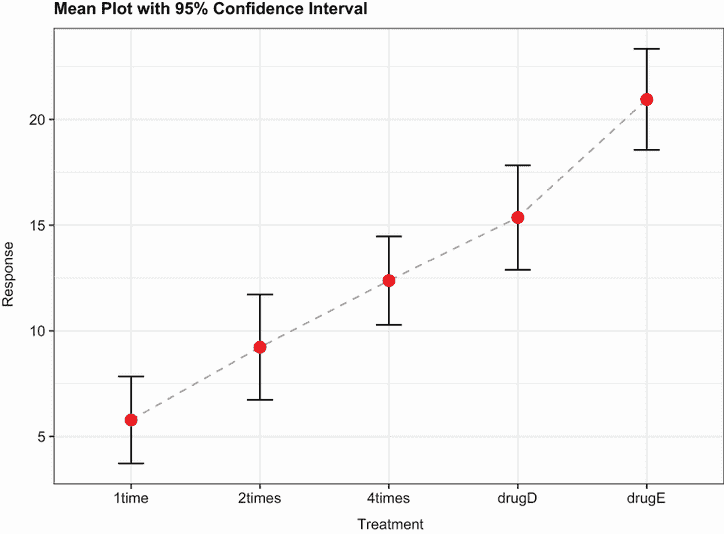

图 9.2 五种降胆固醇药物方案的 95% 置信区间治疗组均值

通过在图 9.2 中包含置信区间，我们展示了我们对总体均值估计的确定性（或不确定性）程度。

### 9.3.1 多重比较

治疗 ANOVA F 检验告诉你五种药物方案并不都同样有效，但它并没有告诉你 *哪些* 治疗方案彼此不同。你可以使用多重比较程序来回答这个问题。例如，`TukeyHSD()` 函数提供了组均值之间所有配对差异的检验，如下一列表所示。

列表 9.2 Tukey HSD 配对组比较

```
> pairwise <- TukeyHSD(fit)                                     ❶
> pairwise

Fit: aov(formula = response ~ trt)

$trt
               diff    lwr   upr p adj
2times-1time   3.44 -0.658  7.54 0.138
4times-1time   6.59  2.492 10.69 0.000
drugD-1time    9.58  5.478 13.68 0.000
drugE-1time   15.17 11.064 19.27 0.000
4times-2times  3.15 -0.951  7.25 0.205
drugD-2times   6.14  2.035 10.24 0.001
drugE-2times  11.72  7.621 15.82 0.000
drugD-4times   2.99 -1.115  7.09 0.251
drugE-4times   8.57  4.471 12.67 0.000
drugE-drugD    5.59  1.485  9.69 0.003

> plotdata <- as.data.frame(pairwise[[1]])                       ❷
> plotdata$conditions <- row.names(plotdata)                     ❷

> library(ggplot2)                                               ❸
> ggplot(data=plotdata, aes(x=conditions, y=diff)) +             ❸
    geom_point(size=3, color="red") +                            ❸
    geom_errorbar(aes(ymin=lwr, ymax=upr, width=.2)) +           ❸
    geom_hline(yintercept=0, color="red", linetype="dashed") +   ❸
       labs(y="Difference in mean levels", x="",                 ❸
         title="95% family-wise confidence level") +             ❸
    theme_bw() +                                                 ❸
    coord_flip()                                                 ❸
```

❶ 计算配对比较

❷ 创建结果数据集

❸ 绘制结果

例如，`1time` 和 `2times` 的平均胆固醇降低量之间没有显著差异（p = 0.138），而 `1time` 和 `4times` 之间的差异是显著的（p < .001）。

图 9.3 绘制了配对比较。在这个图中，包含 0 的置信区间表示治疗之间没有显著差异（p > 0.5）。在这里，我们可以看到最大的均值差异是在 `drugE` 和 `1time` 之间，并且差异是显著的（置信区间不包括 0）。

在继续之前，我应该指出，我们本可以使用基础图形创建图 9.3 中的图表。在这种情况下，代码将简单为 `plot(pairwise)`。使用 `ggplot2` 方法的优点是它创建了一个更吸引人的图表，并允许你完全自定义图表以满足你的需求。

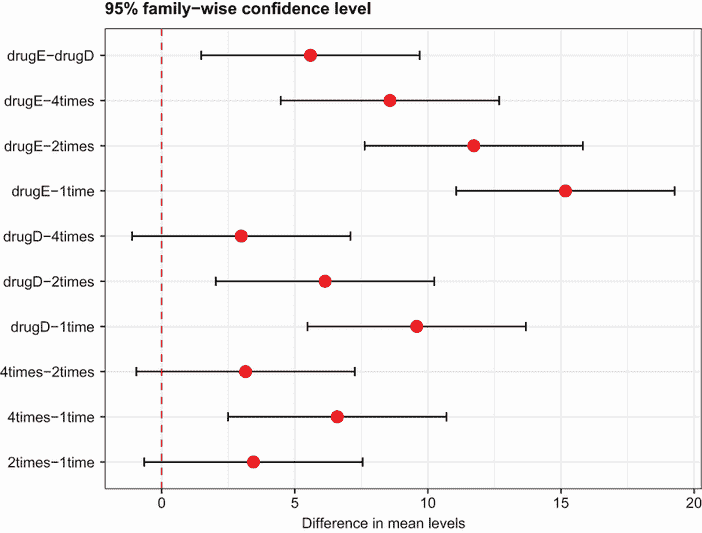

图 9.3 Tukey HSD 配对均值比较图

`multcomp`包中的`glht()`函数提供了一套更全面的多种均值比较方法，你可以用于线性模型（如本章所述）和广义线性模型（在第十三章中介绍）。以下代码重现了 Tukey HSD 检验，以及结果的不同图形表示（图 9.4）：

```
> tuk <- glht(fit, linfct=mcp(trt="Tukey")) 
> summary(tuk)

     Simultaneous Tests for General Linear Hypotheses

Multiple Comparisons of Means: Tukey Contrasts

Fit: aov(formula = response ~ trt, data = cholesterol)

Linear Hypotheses:
                     Estimate Std. Error t value Pr(>|t|)    
2times - 1time == 0     3.443      1.443   2.385  0.13812    
4times - 1time == 0     6.593      1.443   4.568  < 0.001 ***
drugD - 1time == 0      9.579      1.443   6.637  < 0.001 ***
drugE - 1time == 0     15.166      1.443  10.507  < 0.001 ***
4times - 2times == 0    3.150      1.443   2.182  0.20504    
drugD - 2times == 0     6.136      1.443   4.251  < 0.001 ***
drugE - 2times == 0    11.723      1.443   8.122  < 0.001 ***
drugD - 4times == 0     2.986      1.443   2.069  0.25120    
drugE - 4times == 0     8.573      1.443   5.939  < 0.001 ***
drugE - drugD == 0      5.586      1.443   3.870  0.00308 ** 
---
Signif. codes:  0 ‘***’ 0.001 ‘**’ 0.01 ‘*’ 0.05 ‘.’ 0.1 ‘ ’ 1
(Adjusted p values reported -- single-step method)

> labels1 <- cld(tuk, level=.05)$mcletters$Letters
> labels2 <- paste(names(labels1), "\n", labels1)
> ggplot(data=fit$model, aes(x=trt, y=response)) +
    scale_x_discrete(breaks=names(labels1), labels=labels2) +
    geom_boxplot(fill="lightgrey") +
    theme_bw() +
    labs(x="Treatment",
         title="Distribution of Response Scores by Treatment",
         subtitle="Groups without overlapping letters differ significantly 
         (p < .05)")
```

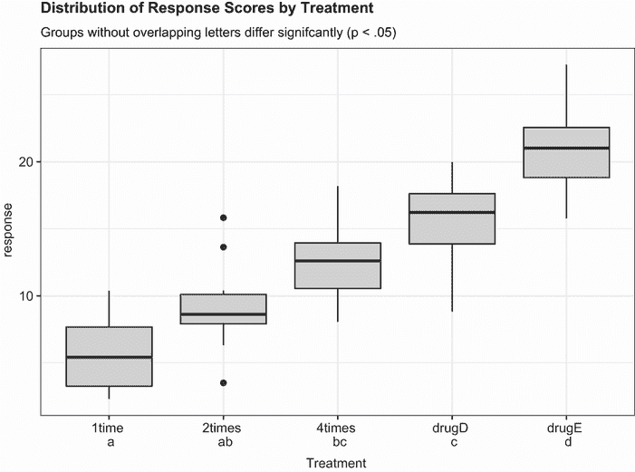

图 9.4 展示了`multcomp`包提供的 Tukey HSD 检验

`cld()`函数中的`level`选项提供了要使用的显著性水平（在本例中为 0.05，或 95%的置信度）。

具有相同字母的组（由箱线图表示）没有显著不同的均值。你可以看到`1time`和`2times`没有显著差异（它们都有字母`a`），以及`2times`和`4times`也没有显著差异（它们都有字母`b`），但`1time`和`4times`是不同的（它们没有共享相同的字母）。我个人觉得图 9.4 比图 9.3 更容易阅读。它还有提供每个组内分数分布信息的优势。

从这些结果中，你可以看到每天四次服用 5 毫克剂量的降胆固醇药物比每天一次服用 20 毫克剂量更好。竞争对手`drugD`并不优于这种每天四次的治疗方案。但竞争对手`drugE`优于`both` `drugD`和针对目标药物的三个剂量策略。

多重比较方法是一个复杂且快速发展的研究领域。要了解更多信息，请参阅 Bretz, Hothorn, and Westfall (2010)。

### 9.3.2 评估测试假设

正如你在上一章中看到的，结果的置信度取决于你的数据满足统计检验假设的程度。在一元方差分析（ANOVA）中，假设因变量呈正态分布，并且在每个组中具有相等的方差。你可以使用 Q-Q 图来评估正态性假设：

```
> library(car)
> fit <- aov(response ~ trt, data=cholesterol)
> qqPlot(fit, simulate=TRUE, main="Q-Q Plot")
```

图 9.5 提供了图表。默认情况下，具有最高标准化残差的两项观测值通过数据框的行号识别。数据落在 95%置信区间内，表明正态性假设得到了较好的满足。

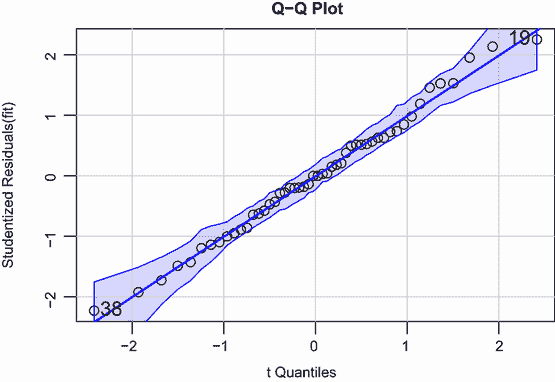

图 9.5 展示了学生化残差的正态性检验。残差是实际值与预测值的差，而学生化残差则是这些残差除以其标准差的估计值。如果学生化残差呈正态分布，它们应该围绕直线聚集。

R 提供了几个用于方差（同质性）相等的测试。例如，你可以使用以下代码执行 Bartlett 测试：

```
> bartlett.test(response ~ trt, data=cholesterol)

        Bartlett test of homogeneity of variances

data:  response by trt 
Bartlett's K-squared = 0.5797, df = 4, p-value = 0.9653
```

Bartlett 检验表明，五个组之间的方差没有显著差异（p = 0.97）。其他可能的检验包括 Fligner-Killeen 检验（由`fligner.test()`函数提供）和 Brown-Forsythe 检验（由`HH`包中的`hov()`函数提供）。尽管没有展示，其他两个检验也得出相同的结论。

最后，方差分析方法对异常值的存在可能很敏感。你可以使用`car`包中的`outlierTest()`函数来测试异常值：

```
> library(car)
> outlierTest(fit)

No Studentized residuals with Bonferroni  p < 0.05
Largest |rstudent|:
   rstudent unadjusted p-value Bonferroni p
19 2.251149           0.029422           NA
```

从输出结果中，你可以看到胆固醇数据中没有异常值（当 p > 1 时出现`NA`）。结合 Q-Q 图、Bartlett 检验和异常值检验，数据似乎很好地符合方差分析模型。这反过来又增加了你对结果的信心。

## 9.4 一元方差分析协方差（ANCOVA）

一元方差分析协方差（ANCOVA）将一元方差分析扩展到包括一个或多个定量协变量。此例来自`multcomp`包中的`litter`数据集（参见 Westfall 等，1999）。怀孕的雌鼠被分为四个治疗组；每个组接受不同剂量的药物（0、5、50 或 500）。每个窝的平均出生体重是因变量，妊娠时间被包括为协变量。以下列表给出了分析。

列表 9.3 一元方差分析协方差（ANCOVA）

```
> library(multcomp)
> library(dplyr)
> litter %>%
    group_by(dose) %>%
    summarise(n=n(), mean=mean(gesttime), sd=sd(gesttime))

  dose      n  mean    sd
  <fct> <int> <dbl> <dbl>
1 0        20  22.1 0.438
2 5        19  22.2 0.451
3 50       18  21.9 0.404
4 500      17  22.2 0.431

> fit <- aov(weight ~ gesttime + dose, data=litter)                             
> summary(fit)
            Df Sum Sq Mean Sq F value  Pr(>F)   
gesttime     1  134.3  134.30   8.049 0.00597 **
dose         3  137.1   45.71   2.739 0.04988 * 
Residuals   69 1151.3   16.69                   
---
Signif. codes:  0 ‘***’ 0.001 ‘**’ 0.01 ‘*’ 0.05 ‘.’ 0.1 ‘ ’ 1
```

从`summarise()`函数中，你可以看到每个剂量水平上的窝数不等，零剂量（无药物）有 20 窝，剂量 500 有 17 窝。根据组均值，*无药物*组的平均窝重最高（32.3）。ANCOVA F 检验表明，在控制妊娠时间后，(a)妊娠时间与出生体重相关，(b)药物剂量与出生体重相关。在控制妊娠时间后，不同药物剂量的平均出生体重并不相同。

由于你使用了协变量，你可能希望获得调整后的组均值——也就是说，在部分消除协变量影响后得到的组均值。你可以使用`effects`库中的`effect()`函数来计算调整后的均值：

```
> library(effects)
> effect("dose", fit)

 dose effect
dose
   0    5   50  500 
32.4 28.9 30.6 29.3
```

这些是每个治疗剂量的平均窝重，在统计调整了妊娠时间初始差异后得到的。在这种情况下，调整后的均值与`summarise()`函数产生的未调整均值差异很大。`effects`包提供了一种强大的方法，用于获取复杂研究设计的调整均值并直观地展示它们。有关更多详细信息，请参阅 CRAN 上的包文档。

与上一节中提到的一元方差分析示例类似，剂量 F 检验表明处理组之间的平均出生重量不同，但它并没有告诉你哪些平均值彼此不同。再次强调，你可以使用`multcomp`包提供的多重比较程序来计算所有成对平均值的比较。此外，`multcomp`包还可以用来测试关于平均值的具体用户定义假设。

假设你对无药条件是否与三药条件不同感兴趣。以下列表中的代码可以用来测试这个假设。

列表 9.4 使用用户提供的对比进行多重比较

```
> library(multcomp)
> contrast <- rbind("no drug vs. drug" = c(3, -1, -1, -1))
> summary(glht(fit, linfct=mcp(dose=contrast)))

Multiple Comparisons of Means: User-defined Contrasts

Fit: aov(formula = weight ~ gesttime + dose)

Linear Hypotheses:
                      Estimate Std. Error t value Pr(>|t|)  
no drug vs. drug == 0    8.284      3.209   2.581   0.0120 *
---
Signif. codes:  0 '***' 0.001 '**' 0.01 '*' 0.05 '.' 0.1 ' ' 1 
```

对比`c(3, -1, -1, -1)`指定了第一组与其他三组的平均值进行比较。具体来说，正在测试的假设是

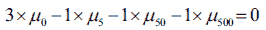

或者

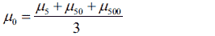

其中*μ[n]*是剂量*n*的平均窝重。该假设通过 t 统计量（本例中为 2.581）进行测试，该统计量在 p < .05 水平上是显著的。因此，你可以得出结论，无药组比药物条件下的出生重量更高。可以添加其他对比到`rbind()`函数中（有关详细信息，请参阅`help(glht)`）。

### 9.4.1 评估测试假设

ANCOVA 设计对 ANOVA 设计中描述的相同正态性和方差齐性假设，并且你可以使用本节 9.3.2 中描述的相同程序来测试这些假设。此外，标准的 ANCOVA 设计假设回归斜率同质性。在这种情况下，假设预测出生重量与妊娠时间之间的回归斜率在四个处理组中是相同的。可以通过在 ANCOVA 模型中包含妊娠×剂量交互项来获得回归斜率同质性的检验。显著的交互作用将意味着妊娠与出生重量之间的关系取决于剂量变量的水平。以下列表提供了代码和结果。

列表 9.5 检验回归斜率的同质性

```
> library(multcomp)
> fit2 <- aov(weight ~ gesttime*dose, data=litter)
> summary(fit2)
              Df Sum Sq Mean Sq F value Pr(>F)   
gesttime       1    134     134    8.29 0.0054 **
dose           3    137      46    2.82 0.0456 * 
gesttime:dose  3     82      27    1.68 0.1789   
Residuals     66   1069      16                  
---
Signif. codes:  0 '***' 0.001 '**' 0.01 '*' 0.05 '.' 0.1 ' ' 1 
```

交互作用不显著，支持斜率相等的假设。如果假设不可行，你可以尝试转换协变量或因变量，使用考虑单独斜率的模型，或者采用不需要回归斜率同质性的非参数 ANCOVA 方法。有关后者的示例，请参阅`sm`包中的`sm.ancova()`函数。

### 9.4.2 可视化结果

我们可以使用`ggplot2`来可视化因变量、协变量和因素之间的关系。例如，

```
pred <- predict(fit)
library(ggplot2)
ggplot(data = cbind(litter, pred),
       aes(gesttime, weight)) + geom_point() +
   facet_wrap(~ dose, nrow=1) + geom_line(aes(y=pred)) +
   labs(title="ANCOVA for weight by gesttime and dose") +
   theme_bw() +
   theme(axis.text.x = element_text(angle=45, hjust=1),
         legend.position="none")
```

生成如图 9.6 所示的图表。

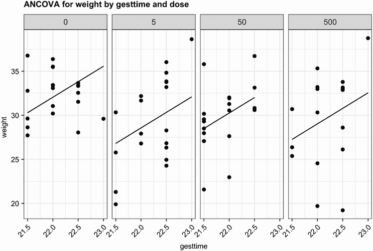

图 9.6 展示了四个药物处理组中妊娠时间与出生重量的关系图

在这里，您可以看到预测出生重量的回归线在每个组中都是平行的，但截距不同。随着妊娠时间的增加，出生重量增加。此外，您还可以看到零剂量组的截距最大，而五剂量组的截距最低。这些线是平行的，因为它们被指定为平行的。如果您使用了代码

```
ggplot(data = litter, aes(gesttime, weight)) + 
       geom_point() + geom_smooth(method="lm", se=FALSE) +
       facet_wrap(~ dose, nrow=1)
```

相反，您会生成一个允许斜率和截距按组变化的图表。这种方法对于可视化回归斜率同质性不成立的情况很有用。

## 9.5 双因素方差分析

在双因素方差分析中，受试者被分配到由两个因素的交叉分类形成的组。本例使用基础安装中的`ToothGrowth`数据集来演示双因素组间方差分析。六十只豚鼠被随机分配到接受三种水平的抗坏血酸（0.5 毫克、1 毫克或 2 毫克）和两种递送方法（橙汁或维生素 C）之一，限制条件是每种治疗组合有 10 只豚鼠。因变量是牙齿长度。以下列表显示了分析的代码。

列表 9.6 双因素方差分析

```
> library(dplyr)
> data(ToothGrowth)
> ToothGrowth$dose <- factor(ToothGrowth$dose)             ❶
> stats <- ToothGrowth %>%                                 ❷
    group_by(supp, dose) %>%                               ❷
    summarise(n=n(), mean=mean(len), sd=sd(len),           ❷
              ci = qt(0.975, df = n - 1) * sd / sqrt(n))   ❷
> stats

# A tibble: 6 x 6
# Groups:   supp [2]
  supp  dose      n  mean    sd    ci
  <fct> <fct> <int> <dbl> <dbl> <dbl>
1 OJ    0.5      10 13.2   4.46  3.19
2 OJ    1        10 22.7   3.91  2.80
3 OJ    2        10 26.1   2.66  1.90
4 VC    0.5      10  7.98  2.75  1.96
5 VC    1        10 16.8   2.52  1.80
6 VC    2        10 26.1   4.80  3.43

> fit <- aov(len ~ supp*dose, data=ToothGrowth)            ❸
> summary(fit)

            Df Sum Sq Mean Sq F value   Pr(>F)    
supp         1  205.4   205.4  15.572 0.000231 ***
dose         2 2426.4  1213.2  92.000  < 2e-16 ***
supp:dose    2  108.3    54.2   4.107 0.021860 *  
Residuals   54  712.1    13.2                     
---
Signif. codes:  0 ‘***’ 0.001 ‘**’ 0.01 ‘*’ 0.05 ‘.’ 0.1 ‘ ’ 1
```

❶ 准备数据

❷ 计算摘要统计量

❸ 拟合双因素方差分析模型

首先，将`剂量`变量转换为因子，这样`aov()`函数会将其视为分组变量而不是数值协变量 ❶。接下来，计算每种治疗组合的摘要统计量（样本量、均值、标准差和均值的置信区间） ❷。样本量表明您有一个平衡的设计（设计中每个单元格的样本量相等）。将双因素方差分析模型拟合到数据 ❸，`summary()`函数表明主效应（`supp`和`dose`）以及这些因素之间的交互作用都是显著的。

您可以通过多种方式可视化结果，包括基础 R 中的`interaction.plot()`函数、`gplots`包中的`plotmeans()`函数以及`HH`包中的`interaction2wt()`函数。在图 9.7 之后的代码中，我们将使用`ggplot2`来绘制这个双因素方差分析的均值和均值的 95%置信区间。使用`ggplot2`的一个优点是我们可以根据我们的研究和美学需求自定义图表。图 9.7\.展示了生成的图表。

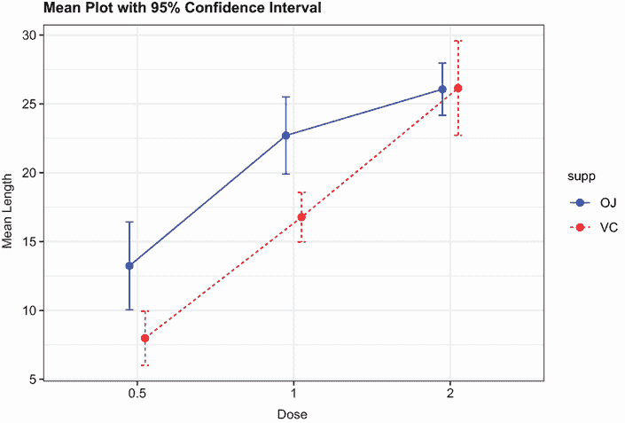

图 9.7 显示了剂量和递送机制对牙齿生长的交互作用。均值图是使用`ggplot2`代码创建的。

```
library(ggplot2)
pd <- position_dodge(0.2)
ggplot(data=stats, 
       aes(x = dose, y = mean, 
           group=supp, 
           color=supp, 
           linetype=supp)) +
  geom_point(size = 2, 
             position=pd) +
  geom_line(position=pd) +
  geom_errorbar(aes(ymin = mean - ci, ymax = mean + ci), 
                width = .1, 
                position=pd) +
  theme_bw() + 
  scale_color_manual(values=c("blue", "red")) +
  labs(x="Dose",
       y="Mean Length",
       title="Mean Plot with 95% Confidence Interval")
```

图表显示，无论是橙汁还是维生素 C，牙齿生长都与抗坏血酸剂量成正比。对于 0.5 毫克和 1 毫克的剂量，橙汁产生的牙齿生长比维生素 C 多。对于 2 毫克的抗坏血酸，两种递送方法产生的生长相同。

虽然我没有涵盖模型假设检验和均值比较程序，但它们是您迄今为止看到的方法的自然扩展。此外，设计是平衡的，因此您不必担心效应的顺序。

## 9.6 重复测量方差分析

在重复测量方差分析中，受试者被测量多次。本节重点介绍一个包含一个组内因素和一个组间因素的重复测量方差分析（这是一种常见的设计）。我们将从生理生态学领域取例。生理生态学家研究生物系统的生理和生化过程如何对环境因素的变异做出反应（鉴于全球变暖的现实，这是一个关键的研究领域）。包含在基本安装中的`CO2`数据集包含了对草种*Echinochloa crus-galli*（Potvin，Lechowicz 和 Tardif，1990）南北植物耐寒性研究的结果。冷却植物的光合速率与在几个环境 CO[2]浓度下的非冷却植物的光合速率进行了比较。一半的植物来自魁北克，另一半来自密西西比。

在本例中，我们将关注冷却植物。因变量是二氧化碳吸收量（`uptake`）以毫升/升为单位，自变量是`Type`（魁北克与密西西比）和周围 CO[2]浓度（`conc`），共有七个水平（从 95 到 1000 微摩尔/平方米秒）。`Type`是组间因素，而`conc`是组内因素。`Type`已经存储为因素，但您需要将`conc`转换为因素才能继续。分析将在下一列表中展示。

列表 9.7 具有组间和组内因素的重复测量方差分析

```
> data(CO2)
> CO2$conc <- factor(CO2$conc)
> w1b1 <- subset(CO2, Treatment=='chilled')
> fit <- aov(uptake ~ conc*Type + Error(Plant/(conc)), w1b1)
> summary(fit)

Error: Plant
          Df Sum Sq Mean Sq F value Pr(>F)   
Type       1   2667    2667    60.4 0.0015 **
Residuals  4    177      44                  
---
Signif. codes:  0 '***' 0.001 '**' 0.01 '*' 0.05 '.' 0.1 ' ' 1

Error: Plant:conc
          Df Sum Sq Mean Sq F value  Pr(>F)    
conc       6   1472   245.4    52.5 1.3e-12 ***
conc:Type  6    429    71.5    15.3 3.7e-07 ***
Residuals 24    112     4.7                    
---
Signif. codes:  0 '***' 0.001 '**' 0.01 '*' 0.05 '.' 0.1 ' ' 1               

> library(dplyr)
> stats <- CO2 %>%
   group_by(conc, Type) %>%
   summarise(mean_conc = mean(uptake))

> library(ggplot2)
> ggplot(data=stats, aes(x=conc, y=mean_conc, 
          group=Type, color=Type, linetype=Type)) +
   geom_point(size=2) +
   geom_line(size=1) +
   theme_bw() + theme(legend.position="top") +
   labs(x="Concentration", y="Mean Uptake", 
        title="Interaction Plot for Plant Type and Concentration")       
```

方差分析表表明，`Type`和浓度的主效应以及`Type` × 浓度的交互作用在 0.01 水平上均显著。图 9.8 显示了交互作用的图示。在这种情况下，我省略了置信区间，以避免图表过于复杂。

为了展示交互作用的另一种表示，使用了`geom_boxplot()`函数来绘制相同的数据。图 9.9 提供了结果：

```
library(ggplot2)
ggplot(data=CO2, aes(x=conc, y=uptake, fill=Type)) +
  geom_boxplot() +
  theme_bw() + theme(legend.position="top") +
  scale_fill_manual(values=c("aliceblue", "deepskyblue"))+
  labs(x="Concentration", y="Uptake", 
       title="Chilled Quebec and Mississippi Plants")
```

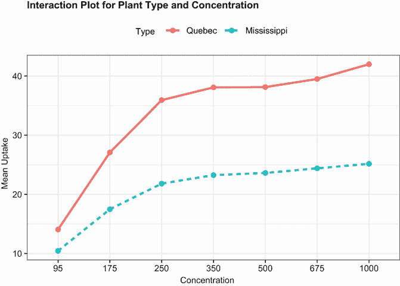

图 9.8 环境 CO[2]浓度和植物类型对 CO[2]吸收的交互作用

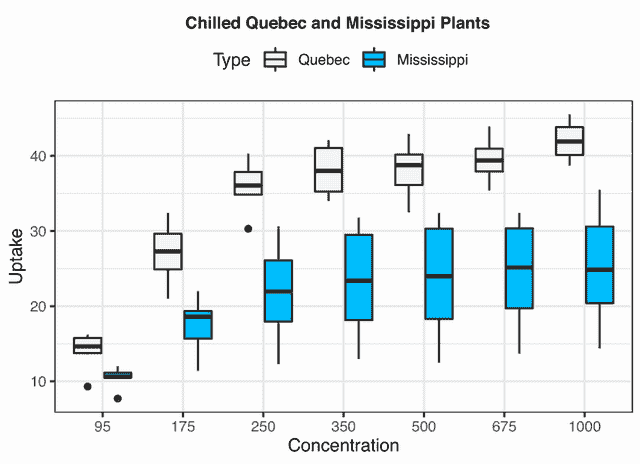

图 9.9 环境 CO[2]浓度和植物类型对 CO[2]吸收的交互作用

从任一图表中，您都可以看到来自魁北克的植物比密西西比州的植物有更高的二氧化碳吸收量。在较高的环境 CO[2]浓度下，这种差异更为明显。

注意数据集通常是*宽格式*，其中列是变量，行是观测值，每个受试者有一个单独的行。9.4 节中的`litter`数据框是一个很好的例子。在处理重复测量设计时，通常在拟合模型之前需要将数据转换为*长格式*。在长格式中，因变量的每个测量值都放在自己的行中。`CO2`数据集遵循这种形式。幸运的是，第五章（5.5.2 节）中描述的`tidyr`包可以轻松地将您的数据重新组织成所需的格式。

混合模型设计的多种方法

本节中的 CO[2]示例使用传统的重复测量方差分析（ANOVA）进行分析。该方法假设任何组内因素的协方差矩阵遵循称为球性的特定形式。具体来说，它假设组内因素任何两个水平之间的差异的方差是相等的。在现实世界的数据中，这个假设不太可能成立。这导致了许多替代方法，包括以下几种：

+   使用`lme4`包中的`lmer()`函数来拟合线性混合模型（Bates，2005）

+   使用`car`包中的`Anova()`函数调整传统的测试统计量以考虑球性不足（例如，Geisser-Greenhouse 校正）

+   使用`nlme`包中的`gls()`函数来拟合具有指定方差-协方差结构的广义最小二乘模型（UCLA，2009）

+   使用多元方差分析来建模重复测量数据（Hand，1987）

这些方法的覆盖范围超出了本文的范围。如果您想了解更多信息，请参阅 Pinheiro 和 Bates（2000）以及 Zuur 等人（2009）。

到目前为止，本章中介绍的所有方法都假设存在一个单一的因变量。在下一节中，我们将简要讨论包括多个结果变量的设计。

## 9.7 多元方差分析（MANOVA）

如果存在多个因变量（结果变量），您可以使用多元方差分析（MANOVA）同时测试它们。以下示例基于`MASS`包中的`UScereal`数据集。数据集来自 Venables 和 Ripley（1999）。在这个例子中，您感兴趣的是美国谷物的卡路里、脂肪和糖含量是否因货架位置而异，其中 1 是底层货架，2 是中间货架，3 是顶层货架。"Calories"、"fat"和"sugars"是因变量，"shelf"是自变量，有三个水平（1、2 和 3）。以下列表展示了分析。

列表 9.8 一元 MANOVA

```
> data(UScereal, package="MASS")
> shelf <- factor(UScereal$shelf) 
> shelf <- factor(shelf)
> y <- cbind(UScereal$calories, UScereal$fat, UScereal$sugars)
> colnames(y) <- c("calories", "fat", "sugars")
> aggregate(y, by=list(shelf=shelf), FUN=mean)

    shelf calories   fat sugars
1       1      119 0.662    6.3
2       2      130 1.341   12.5
3       3      180 1.945   10.9

> cov(y)

         calories   fat sugars
calories   3895.2 60.67 180.38
fat          60.7  2.71   4.00
sugars      180.4  4.00  34.05

> fit <- manova(y ~ shelf)
> summary(fit)

          Df Pillai approx F num Df den Df Pr(>F)    
shelf      2  0.402     5.12      6    122  1e-04 ***
Residuals 62                                         
---
Signif. codes:  0 '***' 0.001 '**' 0.01 '*' 0.05 '.' 0.1 ' ' 1 

> summary.aov(fit)          ❶

Response calories :
            Df Sum Sq Mean Sq F value  Pr(>F)    
shelf        2  50435   25218    7.86 0.00091 ***
Residuals   62 198860    3207                    
---
Signif. codes:  0 '***' 0.001 '**' 0.01 '*' 0.05 '.' 0.1 ' ' 1

 Response fat :
            Df Sum Sq Mean Sq F value Pr(>F)  
shelf        2   18.4    9.22    3.68  0.031 *
Residuals   62  155.2    2.50                 
---
Signif. codes:  0 '***' 0.001 '**' 0.01 '*' 0.05 '.' 0.1 ' ' 1

 Response sugars :
            Df Sum Sq Mean Sq F value Pr(>F)   
shelf        2    381     191    6.58 0.0026 **
Residuals   62   1798      29                  
---
Signif. codes:  0 '***' 0.001 '**' 0.01 '*' 0.05 '.' 0.1 ' ' 1
```

❶ 打印单变量结果

首先，将货架变量转换为因子，以便在分析中代表分组变量。接下来，使用`cbind()`函数形成三个依赖变量（`calories`、`fat`和`sugars`）的矩阵。`aggregate()`函数提供货架均值，`cov()`函数提供谷物之间的方差和协方差。

`manova()`函数提供了组间差异的多元测试。显著的 F 值表明三个组在营养指标集合上有所不同。请注意，货架变量被转换为因子，以便它可以表示分组变量。

由于多元测试是显著的，您可以使用`summary.aov()`函数来获取单因素方差分析。在这里，您可以看到三个组在单独考虑的每个营养指标上都有所不同。最后，您可以使用均值比较程序（如`TukeyHSD`）来确定三个因变量中哪些货架彼此不同（此处省略以节省空间）。

### 9.7.1 评估测试假设

一元方差分析（MANOVA）的两个基本假设是多元正态性和方差协方差矩阵的同质性。第一个假设指出，依赖变量的向量共同遵循多元正态分布。您可以使用 Q-Q 图来评估此假设（有关如何工作的统计解释，请参阅侧边栏“理论插曲”）。

理论插曲

如果您有一个 p × 1 的多元正态随机向量*x*，其均值为*µ*，协方差矩阵为*∑*，那么*x*与*µ*之间的马氏距离的平方是具有 p 个自由度的卡方分布。Q-Q 图将样本的卡方分布分位数与马氏 D 平方值进行绘图。在多大程度上，点沿着斜率为 1、截距为 0 的直线分布，就有证据表明数据是多元正态的。

代码显示在下一条列表中，结果图显示在图 9.10 中。

列表 9.9 评估多元正态性

```
> center <- colMeans(y)
> n <- nrow(y)
> p <- ncol(y)
> cov <- cov(y)
> d <- mahalanobis(y,center,cov)
> coord <- qqplot(qchisq(ppoints(n),df=p),
    d, main="Q-Q Plot Assessing Multivariate Normality",
    ylab="Mahalanobis D2")
> abline(a=0,b=1)
> identify(coord$x, coord$y, labels=row.names(UScereal))
```

如果数据遵循多元正态分布，则点将落在直线上。`identify()`函数允许您交互式地识别图中的点。点击每个感兴趣的点，然后按 ESC 键或完成按钮。在这里，数据集似乎违反了多元正态性，这主要是由于 Wheaties Honey Gold 和 Wheaties 的观测值。您可能想要删除这两个案例并重新运行分析。


图 9.10 评估多元正态性的 Q-Q 图

方差-协方差矩阵同质性的假设要求每个组的协方差矩阵相等。这个假设通常使用 Box 的 M 测试来评估。R 不包括 Box 的 M 测试函数，但网络搜索将提供适当的代码。不幸的是，该测试对正态性的违反很敏感，导致在大多数典型情况下被拒绝。这意味着我们还没有一个很好的方法来评估这个重要的假设（但请参阅 Anderson (2006) 和 Silva 等人 (2008) 的有趣替代方法，这些方法在 R 中尚未提供）。

最后，你可以使用 `mvoutlier` 包中的 `aq.plot()` 函数来测试多元异常值。这个例子中的代码看起来是这样的：

```
library(mvoutlier)
outliers <- aq.plot(y)
outliers
```

尝试一下，看看你得到什么！

### 9.7.2 稳健 MANOVA

如果多元正态性或方差-协方差矩阵同质性的假设不可靠，或者如果你担心多元异常值，你可能想考虑使用稳健或非参数版本的 MANOVA 测试。`rrcov` 包中的 `Wilks.test()` 函数提供了一个稳健的单因素 MANOVA 版本。`vegan` 包中的 `adonis()` 函数可以提供相当于非参数 MANOVA 的结果。以下列表将 `Wilks.test()` 应用于示例。

列表 9.10 稳健单因素 MANOVA

```
> library(rrcov)
> Wilks.test(y,shelf,method="mcd")

        Robust One-way MANOVA (Bartlett Chi2)

data:  x
Wilks' Lambda = 0.511, Chi2-Value = 23.96, DF = 4.98, p-value =
0.0002167
sample estimates:
  calories    fat  sugars
1      120  0.701    5.66
2      128  1.185   12.54
3      161  1.652   10.35
```

从结果中，你可以看到使用对异常值和 MANOVA 假设违反都不敏感的稳健测试仍然表明，位于顶部、中间和底部货架上的谷物在营养特征上有所不同。

## 9.8 ANOVA 作为回归

在 9.2 节中，我们指出 ANOVA 和回归都是同一通用线性模型的特殊情况。因此，本章中的设计可以使用 `lm()` 函数进行分析。但要理解输出，你需要了解 R 在拟合模型时如何处理分类变量。

考虑 9.3 节中的一元 ANOVA 问题，它比较了五种降低胆固醇的药物方案（`trt`）的影响：

```
> library(multcomp)
> levels(cholesterol$trt)

[1] "1time"  "2times" "4times" "drugD"  "drugE"
```

首先，让我们使用 `aov()` 函数拟合模型：

```
> fit.aov <- aov(response ~ trt, data=cholesterol)
> summary(fit.aov)

            Df   Sum Sq  Mean Sq  F value     Pr(>F)    
trt          4  1351.37   337.84   32.433  9.819e-13 ***
Residuals   45   468.75    10.42
```

现在，让我们使用 `lm()` 拟合相同的模型。在这种情况下，你得到的结果将在下一个列表中显示。

列表 9.11 9.3 节中 ANOVA 问题的回归方法

```
> fit.lm <- lm(response ~ trt, data=cholesterol)
> summary(fit.lm)

Coefficients:
            Estimate Std. Error t value   Pr(>|t|)    
(Intercept)    5.782      1.021   5.665   9.78e-07 ***
trt2times      3.443      1.443   2.385     0.0213 *  
trt4times      6.593      1.443   4.568   3.82e-05 ***
trtdrugD       9.579      1.443   6.637   3.53e-08 ***
trtdrugE      15.166      1.443  10.507   1.08e-13 ***

Residual standard error: 3.227 on 45 degrees of freedom
Multiple R-squared: 0.7425,     Adjusted R-squared: 0.7196 
F-statistic: 32.43 on 4 and 45 DF,  p-value: 9.819e-13
```

你在看什么？因为线性模型需要数值预测变量，当 `lm()` 函数遇到因子时，它会用表示水平之间对比的数值变量集替换该因子。如果因子有 *k* 个水平，就会创建 *k* - 1 个对比变量。R 提供了五种内置方法来创建这些对比变量（见表 9.3）。你也可以创建自己的（我们在这里不会介绍这一点）。默认情况下，对于无序因子使用处理对比，对于有序因子使用正交多项式。

表 9.3 内置对比

| 对比 | 描述 |
| --- | --- |
| `contr.helmert` | 将第二级与第一级对立，第三级与前两级平均值对立，第四级与前三级平均值对立，依此类推。 |
| `contr.poly` | 对立性用于基于正交多项式的趋势分析（线性、二次、三次等）。用于具有等距水平的有序因素。 |
| `contr.sum` | 对立性被限制为总和为零。也称为*偏差对立性*，它们比较每个级别的平均值与所有级别的总体平均值。 |
| `contr.treatment` | 将每个水平与基线水平（默认为第一级）对立。也称为*虚拟编码*。 |
| `contr.SAS` | 与`contr.treatment`类似，但基线水平是最后一个水平。这会产生类似于大多数 SAS 过程所使用的对立性系数。 |

在处理对立性中，因素的第一级成为参考组，每个后续级别都与它进行比较。您可以通过`contrasts()`函数查看编码方案：

```
> contrasts(cholesterol$trt)
       2times  4times  drugD  drugE
1time       0       0      0      0
2times      1       0      0      0
4times      0       1      0      0
drugD       0       0      1      0
drugE       0       0      0      1
```

如果患者处于`drugD`状态，则变量`drugD`等于 1，而变量`2times`、`4times`和`drugE`各自等于零。对于第一组，您不需要变量，因为四个指标变量中的每一个为零可以唯一确定患者处于`1times`状态。

在列表 9.11 中，变量`trt2times`代表`1time`和`2times`级别之间的对立性。同样，`trt4times`是`1time`和`4times`之间的对立性，依此类推。您可以从输出中的概率值中看到，每种药物状态都与第一级（`1time`）有显著差异。

您可以通过指定`contrasts`选项来更改`lm()`中使用的默认对立性。例如，您可以通过使用

```
fit.lm <- lm(response ~ trt, data=cholesterol, contrasts="contr.helmert")
```

您可以通过`options()`函数在 R 会话期间更改默认对立性。例如，

```
options(contrasts = c("contr.SAS", "contr.helmert"))
```

将无序因素的默认对立性设置为`contr.SAS`，有序因素设置为`contr.helmert`。尽管我们已将讨论限制在对线性模型中使用对立性的应用，但请注意，它们适用于 R 中的其他建模函数。这包括第十三章中涵盖的广义线性模型。

## 摘要

+   方差分析（ANOVA）是一组在分析实验和准实验研究数据时经常使用的统计方法。

+   ANOVA 方法在研究定量结果变量与一个或多个分类解释变量之间的关系时特别有用。

+   如果定量结果变量与具有*多于*两个水平的分类解释变量相关，则进行事后检验以确定哪些水平/组在该结果上有所不同。

+   当有两个或更多分类解释变量时，可以使用因子方差分析（ANOVA）来研究它们对结果变量的独特和联合影响。

+   当一个或多个定量干扰变量的影响在统计上得到控制（消除）时，这种设计被称为协方差分析（ANCOVA）。

+   当存在多个结果变量时，这种设计被称为多元方差分析或协方差分析。

+   方差分析（ANOVA）和多元回归是广义线性模型的两种等价表达。这两种方法的不同术语、R 函数和输出格式反映了它们在不同研究领域中各自独立的起源。当研究关注组间差异时，ANOVA 的结果通常更容易理解和向他人传达。
