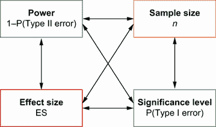
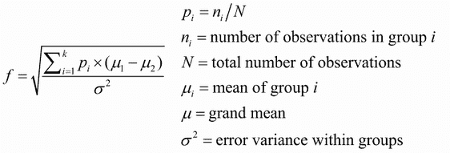
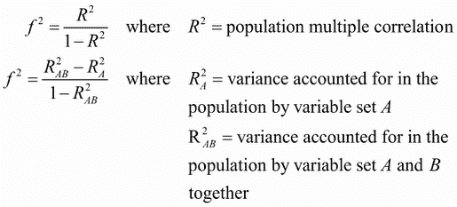
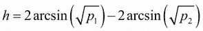
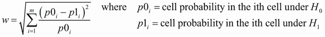
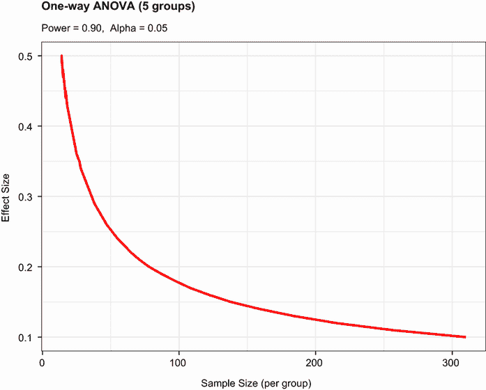
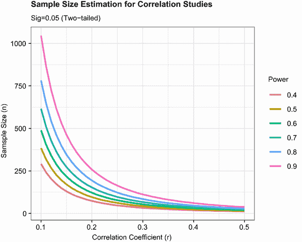

# 10 效力分析

本章涵盖

+   确定样本量需求

+   计算效应量

+   评估统计效力

作为一名统计顾问，我经常被问到，“我需要多少个受试者来进行我的研究？”有时问题是这样表达的：“我有 *x* 个可用于这项研究的人。这项研究值得做吗？”类似的问题可以通过 *效力分析* 来回答，这是实验设计中一套重要的技术。

效力分析允许你确定在给定置信度下检测到给定大小效应所需的样本量。相反，它允许你在样本量限制下确定在给定置信度水平下检测到给定大小效应的概率。如果概率过低，你明智地改变或放弃实验将是明智的。

在本章中，你将学习如何进行各种统计检验的效力分析，包括比例检验、t 检验、卡方检验、平衡单因素方差分析、相关检验和线性模型。由于效力分析适用于假设检验情况，我们将从对零假设显著性检验（NHST）的简要回顾开始。然后，我们将回顾在 R 中执行效力分析的方法，主要关注`pwr`包。最后，我们将考虑 R 中可用的其他效力分析方法。

## 10.1 假设检验的快速回顾

为了帮助你理解效力分析的步骤，我们将简要回顾一般的统计假设检验。如果你有统计背景，可以自由跳到第 10.2 节。

在统计假设检验中，你指定关于总体参数的假设（你的 *零假设*，或 *H*[0]）。然后，你从这个总体中抽取一个样本，并计算一个用于对总体参数进行推断的统计量。假设零假设是真实的，你计算获得观察到的样本统计量或更极端的统计量的概率。如果概率足够小，你将拒绝零假设，转而支持其对立面（称为 *备择* 或 *研究* 假设，*H*[1]）。

以下是一个说明过程的例子。假设你感兴趣的是评估手机使用对驾驶员反应时间的影响。你的零假设是 *H*[0]: *µ*[1] – *µ*[2] = 0，其中 *µ*[1] 是使用手机的驾驶员的平均反应时间，*µ*[2] 是无手机的驾驶员的平均反应时间（在这里，*µ*[1] – *µ*[2] 是感兴趣的总体参数）。如果你拒绝这个零假设，你将剩下备择或研究假设：*H*[1]: *µ*[1] – *µ*[2] ≠ 0。这相当于 *µ*[1] ≠ *µ*[2]，即两种条件下的平均反应时间不相等。

从个体中选取样本并随机分配到两种条件之一。在第一种条件下，参与者在一个模拟器中应对一系列驾驶挑战，同时使用手机通话。在第二种条件下，参与者完成相同的挑战，但不使用手机。对每个个体的总体反应时间进行评估。

根据样本数据，你可以计算统计量(X̄[1] − X̄[2])/(*s* − √*n*)，其中 X̄[1]和 X̄[2]是两种条件下的样本反应时间均值，s 是合并样本标准差，*n*是每个条件下的参与者数量。如果零假设是真的，并且你可以假设反应时间是正态分布的，那么这个样本统计量将遵循具有 2*n* – 2 个自由度的 t 分布。利用这一事实，你可以计算得到如此大或更大的样本统计量的概率。如果概率(p)小于某个预定的截止值（例如 p < .05），你将拒绝零假设，支持备择假设。这个预定的截止值（0.05）被称为检验的*显著性水平*。

注意，你使用*样本*数据来对从中抽取的*总体*进行推断。你的零假设是所有使用手机的驾驶员的平均反应时间与所有未使用手机的驾驶员的平均反应时间没有差异，而不仅仅是你的样本中的驾驶员。你决策的四个可能结果如下：

+   如果零假设是错误的，并且统计检验导致你拒绝它，那么你做出了正确的决定。你正确地确定反应时间受到手机使用的影响。

+   如果零假设是真的，而你没有拒绝它，那么你又做出了正确的决定。反应时间不受手机使用的影响。

+   如果零假设是真的，但你拒绝了它，那么你犯了第一类错误。你得出结论说手机使用会影响反应时间，但实际上并没有。

+   如果零假设是错误的，但你未能拒绝它，那么你犯了第二类错误。手机使用会影响反应时间，但你未能察觉这一点。

表 10.1 中展示了这些结果的每一个。

表 10.1 假设检验

|  |  | 决策 |
| --- | --- | --- |
|  |  | 拒绝 *H*[0] | 未拒绝 *H*[0] |
| 实际 | *H*[0] true | 第一类错误 | 正确 |
| *H*[0] false | 正确 | 第二类错误 |

零假设显著性检验的争议

零假设显著性检验并非没有争议，批评者提出了许多关于它的担忧，尤其是在心理学领域。他们指出，对 p 值的广泛误解、对统计显著性而非实际显著性的依赖、零假设永远不会完全正确，并且对于足够大的样本量总会被拒绝的事实，以及 NHST 实践中存在的一些逻辑不一致。

对这个主题的深入讨论超出了本书的范围。对此感兴趣的读者可参考 Harlow, Mulaik, 和 Steiger（1997）。

在规划研究时，研究人员通常会特别关注四个数量（见图 10.1）*：*

+   **样本量**指的是实验设计中每个条件/组的观测数量。

+   **显著性水平**（也称为**alpha**）定义为犯第一类错误的概率。显著性水平也可以理解为发现不存在的效果的概率。

+   **功效**定义为犯第二类错误的概率的补数。功效可以理解为发现存在效应的概率。

+   **效应量**是指在备择或研究假设下的效应大小。效应量的公式取决于假设检验中使用的统计方法。



图 10.1 研究设计功效分析中考虑的四个主要数量。给定任意三个，你可以计算出第四个。

尽管研究人员直接控制样本量和显著性水平，但功效和效应量受到更间接的影响。例如，当你放宽显著性水平（换句话说，使拒绝零假设更容易），功效会增加。同样，增加样本量也会增加功效。

你的研究目标通常是最大化统计测试的功效，同时保持可接受的显著性水平，并尽可能使用最小的样本量。也就是说，你希望最大限度地提高发现真实效应的机会，同时最大限度地减少发现不存在效应的机会，同时将研究成本控制在合理范围内。

四个数量（样本量、显著性水平、功效和效应量）之间有着密切的关系。**给定任意三个，你可以确定第四个**。你将使用这一事实在本章的剩余部分进行各种功效分析。在下一节中，我们将探讨使用 R 包 `pwr` 实现功效分析的方法。稍后，我们将简要介绍一些在生物学和遗传学中使用的非常专业的功效函数。

## 10.2 使用 pwr 包实现功效分析

由 Stéphane Champely 开发的 `pwr` 包实现了 Cohen（1988）概述的功效分析。表 10.2 列出了一些较为重要的函数。对于每个函数，用户可以指定四个数量中的三个（样本量、显著性水平、功效、效应量），第四个将被计算。

表 10.2 `pwr` 包函数

| 函数 | ... 的功效计算 |
| --- | --- |
| `pwr.2p.test` | 双样本比例（样本量相等） |
| `pwr.2p2n.test` | 双样本比例（样本量不等） |
| `pwr.anova.test` | 平衡单因素方差分析 |
| `pwr.chisq.test` | 卡方检验 |
| `pwr.f2.test` | 一般线性模型 |
| `pwr.p.test` | 比例（单样本） |
| `pwr.r.test` | 相关系数 |
| `pwr.t.test` | T 检验（单样本，双样本，配对） |
| `pwr.t2n.test` | T 检验（两个样本，n 不等） |

在这四个量中，效应量通常是最难指定的。计算效应量通常需要一些与所涉及的措施相关的经验和对以往研究的了解。但如果你对给定研究中预期的效应量一无所知，你能做什么呢？你将在第 10.2.7 节中探讨这个难题。在本节的其余部分，你将了解`pwr`函数在常见统计检验中的应用。在调用这些函数之前，请确保安装并加载`pwr`包。

### 10.2.1 T 检验

当你将要使用的统计检验是 t 检验时，`pwr.t.test()` 函数提供了一系列有用的功效分析选项。其格式为

```
pwr.t.test(n=, d=, sig.level=, power=, alternative=)
```

其中

+   `n` 是样本大小。

+   `d` 是效应量，定义为标准化均值差异。


+   `sig.level` 是显著性水平（默认为 0.05）。

+   `power` 是功效水平。

+   `type` 是双样本 t 检验（`"two.sample"`）、单样本 t 检验（`"one.sample"`）或配对样本 t 检验（`"paired"`）。默认情况下是双样本检验。

+   `alternative` 表示统计检验是双尾（`"two.sided"`）还是单尾（`"less"` 或 `"greater"`）。默认情况下是双尾检验。

让我们通过一个例子来分析。继续第 10.1 节中关于手机使用和驾驶反应时间的实验，假设你将使用双尾独立样本 t 检验来比较手机条件下参与者的平均反应时间与未受干扰驾驶的参与者的平均反应时间。

假设你从以往的经验中知道反应时间有 1.25 秒的标准差。此外，假设反应时间差 1 秒被认为是一个重要的差异。因此，你希望进行一项研究，能够检测到效应量 d = 1/1.25 = 0.8 或更大的效应。此外，你想要有 90%的把握检测到这种差异（如果存在），并且有 95%的把握不会宣布差异是显著的，而实际上它是由随机变异性引起的。你的研究中需要多少参与者？

将这些信息输入到`pwr.t.test()` 函数中，你将得到以下结果：

```
> library(pwr)
> pwr.t.test(d=.8, sig.level=.05, power=.9, type="two.sample",         
             alternative="two.sided")

     Two-sample t test power calculation 

              n = 34
              d = 0.8
      sig.level = 0.05
          power = 0.9
    alternative = two.sided

 NOTE: n is number in *each* group
```

结果表明，你需要每组有 34 名参与者（总共 68 名参与者）才能以 90%的确定性检测到 0.8 的效应量，并且错误地得出存在差异的结论的概率不超过 5%，而实际上并不存在差异。

让我们改变问题。假设在比较两种条件时，你想要能够检测到总体均值之间 0.5 个标准差差异。你想要将错误声明总体均值不同的几率限制在 100 分之 1。此外，你只能负担得起在研究中包含 40 名参与者。在这些限制条件下，你能够检测到这种大差异的概率是多少？

假设每个条件下将放置相同数量的参与者，你有

```
> pwr.t.test(n=20, d=.5, sig.level=.01, type="two.sample", 
             alternative="two.sided")

     Two-sample t test power calculation 

              n = 20
              d = 0.5
      sig.level = 0.01
          power = 0.14
    alternative = two.sided

 NOTE: n is number in *each* group
```

每组有 20 名参与者，先验显著性水平为 0.01，以及因变量标准差为 1.25 秒，声明 0.625 秒或更小差异不显著的几率小于 14%（d = 0.5 = 0.625/1.25）。相反，有 86%的几率你会错过你正在寻找的效果。你可能需要认真重新考虑是否投入时间和精力进行这项研究。

之前的例子假设两组的样本大小相等。如果两组的样本大小不相等，函数

```
pwr.t2n.test(n1=, n2=, d=, sig.level=, power=, alternative=)
```

可以使用。在这里，`n1`和`n2`是样本大小，其他参数与`pwer.t.test`相同。尝试改变输入到`pwr.t2n.test`函数的值，看看对输出的影响。

### 10.2.2 ANOVA

`pwr.anova.test()`函数为平衡单因素方差分析提供了功效分析选项。格式是

```
pwr.anova.test(k=, n=, f=, sig.level=, power=) 
```

其中`k`是组数，`n`是每组中共同的样本大小。

对于单因素方差分析（ANOVA），效应大小通过`f`来衡量，其中



让我们尝试一个例子。对于比较五个组的单因素方差分析，当效应大小为 0.25 且采用显著性水平为 0.05 时，计算每组所需的样本大小以获得 0.80 的功效。代码如下：

```
> pwr.anova.test(k=5, f=.25, sig.level=.05, power=.8)

     Balanced one-way analysis of variance power calculation 

              k = 5
              n = 39
              f = 0.25
      sig.level = 0.05
          power = 0.8

 NOTE: n is number in each group
```

因此，总样本大小是 5 × 39，即 195。请注意，此示例要求你估计五个组的均值以及共同方差。当你不知道预期什么时，第 10.2.7 节中描述的方法可能会有所帮助。

### 10.2.3 相关系数

`pwr.r.test()`函数为相关系数的检验提供了功效分析。格式是

```
pwr.r.test(n=, r=, sig.level=, power=, alternative=)
```

其中`n`是观测值的数量，`r`是效应大小（通过线性相关系数衡量），`sig.level`是显著性水平，`power`是功效水平，而`alternative`指定了双尾（`"two.sided"`）或单尾（`"less"`或`"greater"`）的显著性检验。

例如，假设你正在研究抑郁和孤独感之间的关系。你的零假设和备择假设是

*H*[0]: ρ ≤ 0.25 对比 *H*[1]: ρ > 0.25

其中ρ是这两个心理变量之间的总体相关系数。你已将显著性水平设置为 0.05，并希望以 90%的置信度拒绝*H*[0]（如果它是错误的）。你需要多少个观测值？以下代码提供了答案：

```
> pwr.r.test(r=.25, sig.level=.05, power=.90, alternative="greater")

     approximate correlation power calculation (arctangh transformation) 

              n = 134
              r = 0.25
      sig.level = 0.05
          power = 0.9
    alternative = greater
```

因此，你需要评估 134 名参与者的抑郁和孤独感，以 90%的置信度确保你将拒绝错误的零假设。

### 10.2.4 线性模型

对于线性模型（如多元回归），可以使用`pwr.f2.test()`函数进行功效分析。格式如下

```
pwr.f2.test(u=, v=, f2=, sig.level=, power=) 
```

其中`u`和`v`是分子和分母自由度，`f2`是效应大小。



`f2`的第一个公式适用于评估一组预测变量对结果的影响。第二个公式适用于评估一组预测变量（或协变量）对另一组预测变量（或协变量）的影响。

假设你对老板的领导风格是否会影响员工满意度超过与工作相关的工资和福利感兴趣。领导风格通过四个变量进行评估，而工资和福利与三个变量相关。以往的经验表明，工资和福利大约占员工满意度变化的 30%。从实际的角度来看，如果领导风格至少比这个数字高 5%，将会很有趣。假设显著性水平为 0.05，为了以 90%的置信度识别这种贡献，需要多少名受试者？

在这里，`sig.level`=0.05，`power`=0.90，`u`=3（总预测变量数减去集合 B 中预测变量的数量），效应大小为`f2` = (.35 – .30)/(1 – .35) = 0.0769。将此输入函数中，得到以下结果：

```
> pwr.f2.test(u=3, f2=0.0769, sig.level=0.05, power=0.90)

     Multiple regression power calculation 

              u = 3
              v = 184.2426
             f2 = 0.0769
      sig.level = 0.05
          power = 0.9
```

在多元回归中，分母自由度等于*N* – *k* – 1，其中*N*是观测数，*k*是预测变量的数量。在这种情况下，*N* – 7 – 1 = 185，这意味着所需的样本量是*N* = 185 + 7 + 1 = 193。

### 10.2.5 比例检验

可以使用`pwr.2p.test()`函数对比较两个比例进行功效分析。格式如下

```
pwr.2p.test(h=, n=, sig.level=, power=) 
```

其中`h`是效应大小，`n`是每组中共同的样本大小。效应大小`h`定义为



可以使用函数`ES.h(p1, p2)`计算。

对于不等的`n`，所需的函数是

```
pwr.2p2n.test(h =, n1 =, n2 =, sig.level=, power=)
```

可以使用`alternative=`选项来指定双尾（`"two.sided"`）或单尾（`"less"`或"`greater"`）检验。双尾检验是默认选项。

假设你怀疑一种流行的药物可以使 60%的用户症状缓解。如果一种新的（且更昂贵的）药物可以使 65%的用户症状改善，那么如果你想要检测这种大的差异，你需要在比较这两种药物的研究中包含多少名参与者？

假设你想要以 90% 的置信度得出结论，新药比现有药物更好，并且以 95% 的置信度确信你不会错误地得出这个结论。你将使用单尾检验，因为你只对评估新药是否比标准药物更好感兴趣。代码如下：

```
> pwr.2p.test(h=ES.h(.65, .6), sig.level=.05, power=.9, 
              alternative="greater")

     Difference of proportion power calculation for binomial 
     distribution (arcsine transformation) 

              h = 0.1033347
              n = 1604.007
      sig.level = 0.05
          power = 0.9
    alternative = greater

 NOTE: same sample sizes
```

根据这些结果，你需要进行一项研究，其中 1,605 人接受新药，1,605 人接受现有药物，以满足标准。

### 10.2.6 卡方检验

卡方检验通常用于评估两个分类变量之间的关系。零假设通常是变量之间是独立的，而研究假设则认为它们不是独立的。`pwr.chisq.test()` 函数可用于在应用卡方检验时评估功效、效应量或所需的样本量。格式如下：

```
pwr.chisq.test(w =, N = , df = , sig.level =, power = ) 
```

其中 `w` 是效应量，`N` 是总样本量，`df` 是自由度。在这里，效应量 `w` 定义为



求和从 1 到 *m*，其中 *m* 是列联表中的单元格数。`ES.w2(P)` 函数可用于计算在双向列联表中对应于备择假设的效应量。在这里，`P` 是假设的双向概率表。

作为一个简单的例子，让我们假设你正在研究种族与提拔之间的关系。你预计你的样本中 70% 将是白人，10% 将是非裔美国人，20% 将是西班牙裔。此外，你认为 60% 的白人倾向于被提拔，而 30% 的非裔美国人和 50% 的西班牙裔则不是。你的研究假设是提拔的概率遵循表 10.3 中的值。

表 10.3 基于研究假设预期被提拔的个人比例

| 种族 | 提拔 | 未提拔 |
| --- | --- | --- |
| 白人 | 0.42 | 0.28 |
| 非裔美国人 | 0.03 | 0.07 |
| 西班牙裔 | 0.10 | 0.10 |

例如，你预计人口中有 42% 将是提拔的白人（.42 = .70 × .60）和 7% 将是未被提拔的非裔美国人（.07 = .10 × .70）。假设显著性水平为 0.05，并且你希望的功效水平为 0.90。双向列联表中的自由度是 (`r` – 1) × (`c` – 1)，其中 `r` 是行数，`c` 是列数。你可以使用以下代码计算假设的效应量：

```
> prob <- matrix(c(.42, .28, .03, .07, .10, .10), byrow=TRUE, nrow=3)
> ES.w2(prob)

[1] 0.1853198
```

使用这些信息，你可以这样计算所需的样本量：

```
> pwr.chisq.test(w=.1853, df=2, sig.level=.05, power=.9)

     Chi squared power calculation 

              w = 0.1853
              N = 368.5317
             df = 2
      sig.level = 0.05
          power = 0.9

 NOTE: N is the number of observations
```

结果表明，一个有 369 名参与者的研究将足以在给定的效应量、功效和显著性水平下检测种族与提拔之间的关系。

### 10.2.7 在新情况下选择适当效应量

在功效分析中，预期效应量是最难确定的参数。通常需要你对主题领域和采用的措施有经验。例如，可以使用过去研究的数据来计算效应量，然后可以用这些效应量来规划未来的研究。

但当研究情况完全新颖且你没有经验可以借鉴时，你能做什么呢？在行为科学中，Cohen（1988 年）试图为各种统计检验的“小”、“中”和“大”效应量提供基准。表 10.4 提供了这些指南。

表 10.4 Cohen 的效应量基准

| 统计方法 | 效应量度量 | 效应量建议指南 |
| --- | --- | --- |
|  |  | 小 | 中 | 大 |
| t 检验 | `d` | 0.20 | 0.50 | 0.80 |
| ANOVA | `f` | 0.10 | 0.25 | 0.40 |
| 线性模型 | `f2` | 0.02 | 0.15 | 0.35 |
| 比例检验 | `h` | 0.20 | 0.50 | 0.80 |
| 卡方检验 | `w` | 0.10 | 0.30 | 0.50 |

当你不知道可能存在什么效应量时，这张表可能提供一些指导。例如，如果你使用的是包含 5 个组、每组 25 个受试者的一元方差分析，显著性水平为 0.05，拒绝错误零假设（即发现真实效应）的概率是多少？

使用`pwr.anova.test()`函数和表 10.3 中的`f`行建议，得到以下结果：

```
pwr.anova.test(k=5, n=25, sig.level=0.05, f=c(.10, .25, .40))

     Balanced one-way analysis of variance power calculation 
              k = 5
              n = 25
              f = 0.10, 0.25, 0.40
      sig.level = 0.05
          power = 0.1180955, 0.5738000, 0.9569163

       NOTE: n is number in each group
```

功效为检测小效应为 0.118，检测中等效应为 0.574，检测大效应为 0.957。鉴于样本量限制，你只有在效应量很大时才有可能发现效应。

重要的是要记住，Cohen 的基准只是从一系列社会研究研究中得出的普遍建议，可能不适用于你的特定研究领域。一种替代方法是改变研究参数，并注意对样本量和功效等事物的影响。例如，再次假设你想使用一元方差分析和 0.05 的显著性水平来比较五个组。以下列表计算了检测各种效应量所需的样本量，并将结果绘制在图 10.2 中。

列表 10.1 在一元方差分析中检测显著效应的样本量

```
library(pwr)
es <- seq(.1, .5, .01)                                               
nes <- length(es)

samsize <- NULL                                                      
for (i in 1:nes){                                                    
    result <- pwr.anova.test(k=5, f=es[i], sig.level=.05, power=.9)  
    samsize[i] <- ceiling(result$n)                                  
}                                                                    

plotdata <- data.frame(es, samsize)
library(ggplot2)
ggplot(plotdata, aes(x=samsize, y=es)) +
  geom_line(color="red", size=1) +
  theme_bw() +
  labs(title="One Way ANOVA (5 groups)",
       subtitle="Power = 0.90,  Alpha = 0.05",
       x="Sample Size (per group)",
       y="Effect Size") 
```



图 10.2 在一个包含五个组的一元方差分析中检测各种效应量所需的样本量（假设功效为 0.90，显著性水平为 0.05）

这样的图表可以帮助你估计各种条件对实验设计的影响。例如，增加每组 200 个以上的观察值似乎没有带来多少效益。我们将在下一节中查看另一个绘图示例。

## 10.3 创建功效分析图

在离开 `pwr` 包之前，让我们看看一个更复杂的绘图示例。假设你想查看在一系列效应大小和功率水平下，声明相关系数统计显著的必要样本量。你可以使用 `pwr.r.test()` 函数和 `for` 循环来完成此任务，如下面的列表所示。

列表 10.2 检测各种大小相关性的样本量曲线

```
library(pwr)
r <- seq(.1,.5,.01)                                             ❶
p <- seq(.4,.9,.1)                                              ❶

df <- expand.grid(r, p)
colnames(df) <- c("r", "p")

for (i in 1:nrow(df)){                                          ❷
    result <- pwr.r.test(r = df$r[i],                           ❷
                         sig.level = .05, power = df$p[i],      ❷
                         alternative = "two.sided")             ❷
    df$n[i] <- ceiling(result$n)                                ❷
}                                                               ❷

library(ggplot2)                                                ❸
ggplot(data=df,                                                 ❸
       aes(x=r, y=n, color=factor(p))) +                        ❸
  geom_line(size=1) +                                           ❸
  theme_bw() +                                                  ❸
  labs(title="Sample Size Estimation for Correlation Studies",  ❸
       subtitle="Sig=0.05 (Two-tailed)",                        ❸
       x="Correlation Coefficient (r)",                         ❸
       y="Samsple Size (n)",                                    ❸
       color="Power")                                           ❸
```

❶ 设置相关性和功率值的范围

❷ 获取样本量

❸ 绘制功率曲线

列表 10.2 使用 `seq()` 函数生成一系列效应大小 `r`（在 *H*[1] 下的相关系数）和功率水平 `p` ❶。`expand.grid()` 函数创建一个包含这两个变量所有组合的数据框。然后，一个 `for` 循环遍历数据框的行，计算该行的相关性和功率水平的样本量（`n`），并将结果保存 ❷。`ggplot2` 包为每个功率水平绘制样本量与相关性的曲线图 ❸。图 10.3 显示了生成的图表。如果你以灰度阅读此章节，线条颜色可能难以区分。从底部开始，线条代表功率为 0.4、0.5、0.6，直到 0.9。

如图表所示，你需要大约 75 个样本量来检测 0.20 的相关性，置信度为 40%。你需要大约 185 个额外的观察值（*n* = 260）来检测相同的相关性，置信度为 90%。通过简单的修改，这种方法可以用于创建广泛统计测试的样本量和功率曲线图。



图 10.3 在各种功率水平下检测显著相关性的样本量曲线

我们将简要回顾本章中其他对功率分析有用的 R 函数。

## 10.4 其他包

R 中的许多其他包在研究规划阶段可能很有用。表 10.5 列出了几个。其中一些包含通用工具，而另一些则高度专业化。表中最后四个特别关注遗传研究中的功率分析。全基因组关联研究（GWAS）用于识别与可观察性状的遗传关联。例如，这些研究将关注为什么有些人会患上特定类型的心脏病。

表 10.5 专业的功率分析包

| 包 | 目的 |
| --- | --- |
| `asypow` | 通过渐近似然比方法进行功率计算 |
| `longpower` | 长期数据的样本量计算 |
| `PwrGSD` | 组成序列设计的功率分析 |
| `pamm` | 混合模型中随机效应的功率分析 |
| `powerSurvEpi` | 在流行病学研究中进行生存分析的功率和样本量计算 |
| `powerMediation` | 线性、逻辑、泊松和 Cox 回归中中介效应的功率和样本量计算 |
| `semPower` | 结构方程模型（SEM）的功率分析 |
| `powerpkg` | 影响同胞对和传递不平衡检验（TDT）设计的功率分析 |
| `powerGWASinteraction` | GWAS 交互作用的功率计算 |
| `gap` | 用于病例-队列设计中功率和样本量计算的函数 |
| `ssize.fdr` | 用于微阵列实验的样本量计算 |

最后，MBESS 和`WebPower`包包含了一系列可用于各种形式功率分析和样本量确定的函数。这些函数特别适用于行为学、教育学和社会科学的研究者。

## 摘要

+   功率分析有助于确定在给定置信度下区分给定大小效果所需的样本量。它还可以告诉你，对于给定样本量检测这种效果的几率。你可以直接看到限制错误地宣布效果显著的可能性（I 型错误）与正确识别真实效果的几率（功率）之间的权衡。

+   `pwr`包提供的函数可用于执行常见统计方法（包括 t 检验、卡方检验和比例检验、方差分析和回归）的功率和样本量确定。第 10.4 节最后介绍了更多专业的方法。

+   功率分析通常是一个交互过程。研究者会改变样本量、效果大小、期望的显著性水平和期望的功率等参数，以观察它们之间的相互影响。这些结果被用来规划更有可能产生有意义结果的研究。来自过去研究（尤其是关于效应量）的信息可用于设计更有效和高效的未来研究。

+   功率分析的一个重要附带好处是它鼓励人们从单一关注二元假设检验（即效果是否存在）转向对所考虑效果**大小**的欣赏。期刊编辑越来越多地要求作者在报告研究结果时包括效应量和 p 值。这有助于你确定研究的应用意义，并提供可用于规划未来研究的信息。
