# 11 中级图表

本章涵盖

+   可视化双变量和多变量关系

+   使用散点和折线图进行工作

+   理解 corrgrams

+   使用马赛克图

在第六章（基本图表）中，我们考虑了广泛的各种图表类型，用于显示单个分类或连续变量的分布。第八章（回归）回顾了在从一组预测变量预测连续结果变量时有用的图形方法。在第九章（方差分析）中，我们考虑了特别适用于可视化组在连续结果变量上的差异的技术。在许多方面，本章是我们之前讨论主题的延续和扩展。

在本章中，我们将专注于显示两个变量（双变量关系）和多个变量（多变量关系）之间关系的图形方法。例如：

+   汽车油耗与汽车重量之间有什么关系？这是否会因汽车气缸数量而变化？

+   您如何在一张图上展示汽车的油耗、重量、排量和后轴比之间的关系？

+   当绘制来自大型数据集（例如，10,000 个观测值）的两个变量的关系图时，您如何处理您可能会看到的巨大数据点重叠？换句话说，当您的图表变成一大团模糊时，您该怎么办？

+   您如何在一次可视化中同时展示三个变量之间的多变量关系（给定一个 2D 计算机屏幕或一张纸，以及略低于最新《星球大战》电影的预算）？

+   您如何显示几棵树随时间增长的情况？

+   您如何在一张图上可视化十几个变量之间的相关性？这如何帮助您理解数据的结构？

+   您如何可视化“泰坦尼克号”乘客生存与阶级、性别和年龄之间的关系？从这样的图表中您可以学到什么？

这些是本章描述的方法可以回答的问题类型。我们将使用的数据集是可能性的示例。一般技术是最重要的。如果您对汽车特性或树木生长不感兴趣，请插入您自己的数据。

我们将从散点图和散点图矩阵开始。然后我们将探索各种类型的折线图。这些方法在研究中是众所周知的，并且被广泛使用。接下来，我们将回顾 corrgrams 在可视化相关性以及马赛克图在可视化分类变量间的多变量关系中的应用。这些方法也很有用，但在研究人员和数据分析师中却知之甚少。您将看到如何使用这些方法中的每一个来更好地理解您的数据，并将这些发现传达给他人。

## 11.1 散点图

如你所见，散点图描述了两个连续变量之间的关系。在本节中，我们将从一个双变量关系的描述开始（*x*与*y*）。然后，我们将探讨通过叠加额外信息来增强此图的方法。接下来，你将学习如何将多个散点图组合成散点图矩阵，以便一次查看多个双变量关系。我们还将回顾许多数据点重叠的特殊情况，这限制了你对数据的描绘能力，并讨论几种克服这种困难的方法。最后，我们将通过添加第三个连续变量将二维图扩展到三维，这将包括 3D 散点图和气泡图。每种都可以帮助你一次理解三个变量之间的多变量关系。

我们将首先可视化汽车重量与燃油效率之间的关系。以下列表提供了一个示例。

列表 11.1 一个带有最佳拟合线的散点图

```
data(mtcars)                                                  ❶ 
ggplot(mtcars, aes(x=wt, y=mpg)) +  geom_point()              ❷  
  geom_smooth(method="lm", se=FALSE, color="red") +           ❸ 
  geom_smooth(method="loess", se=FALSE,                       ❹ 
              color="blue", linetype="dashed") +
  labs(title = "Basic Scatter Plot of MPG vs. Weight",        ❺
       x = "Car Weight (lbs/1000)",
       y = "Miles Per Gallon")     
```

❶ 加载数据

❷ 创建散点图

❸ 添加线性拟合

❹ 添加局部加权回归拟合

❺ 添加注释

图 11.1 显示了结果图。

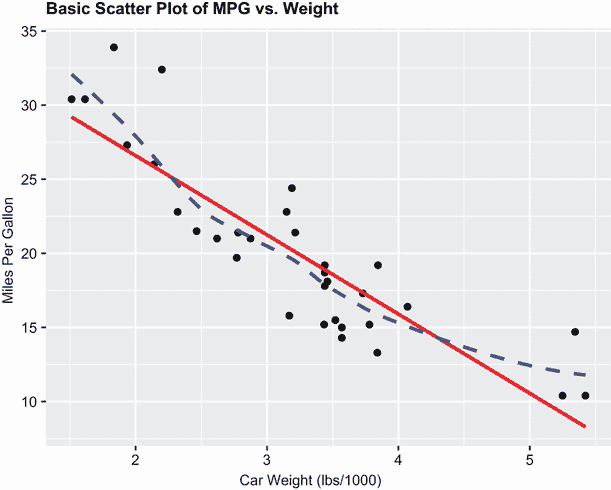

图 11.1 汽车里程与重量的散点图，叠加线性拟合和 loess 拟合线

列表 11.1 中的代码加载了内置数据框`mtcars`的新副本 ❶，并使用填充圆圈作为绘图符号创建了一个基本的散点图 ❷。正如预期的那样，随着汽车重量的增加，每加仑英里数减少，尽管这种关系并不完全线性。第一个`geom_smooth()`函数添加了一条线性拟合线（实线红色） ❸。`se=FALSE`选项抑制了线的 95%置信区间。第二个`geom_smooth()`函数添加了一条*局部加权回归（loess）*拟合线（虚线蓝色） ❹。loess 线是一种基于局部加权多项式回归的非参数拟合线，为数据提供了一个平滑的趋势线。有关算法的技术细节，请参阅 Cleveland (1981)。Josh Starmer 在 YouTube 上提供了一个高度直观的 loess 拟合线解释([www.youtube.com/watch?v=Vf7oJ6z2LCc](http://www.youtube.com/watch?v=Vf7oJ6z2LCc))。

如果我们想分别查看 4、6 和 8 缸汽车的重量与燃油效率之间的关系，这可以通过`ggplot2`和少量对先前代码的简单修改轻松完成。图 11.2 提供了该图。

列表 11.2 一个带有单独最佳拟合线的散点图

```
ggplot(mtcars, 
       aes(x=wt, y=mpg, 
           color=factor(cyl), 
           shape=factor(cyl))) +
  geom_point(size=2) +
  geom_smooth(method="lm", se=FALSE) +
  geom_smooth(method="loess", se=FALSE, linetype="dashed") +
  labs(title = "Scatter Plot of MPG vs. Weight",
       subtitle = "By Number of Cylinders",
       x = "Car Weight (lbs/1000)",
       y = "Miles Per Gallon",
       color = "Number of \nCylinders",
       shape = "Number of \nCylinders") +
  theme_bw()                                                     
```

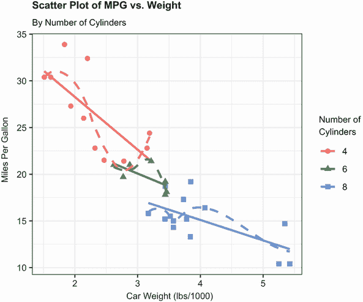

图 11.2 带有子组和单独估计拟合线的散点图

通过在`aes()`函数中将气缸数映射到颜色和形状，三个组（4、6 或 8 个气缸）通过颜色和绘图符号以及单独的线性拟合和 loess 拟合线进行区分。由于`cyl`变量是数值型的，因此使用`factor(cyl)`将变量转换为离散类别。

您可以使用`span`参数控制 loess 线的平滑度。默认值为`geom_smooth(method="loess", span=0.75)`。较大的值会导致更平滑的拟合。在本例中，loess 线过度拟合了数据（过于紧密地跟随点）。`span=4`（未显示）的值提供了一个更平滑的拟合。

散点图有助于您一次可视化两个定量变量之间的关系，但如果你想要查看汽车油耗、重量、排量（立方英寸）和后轴比之间的双变量关系呢？当存在多个定量变量时，您可以使用散点图矩阵来表示它们之间的关系。

### 11.1.1 散点图矩阵

R 中提供了许多用于创建散点图矩阵的有用函数。基础 R 提供了`pairs()`函数来创建简单的散点图矩阵。第 8.2.4 节（多重线性回归）展示了使用`scatterplotMatrix`函数从`car`包创建散点图矩阵的方法。

在本节中，我们将使用`GGally`包中的`ggpairs()`函数创建散点图矩阵的`ggplot2`版本。正如您将看到的，这种方法提供了创建高度定制图形的选项。在继续之前，请确保安装`GGally`包（`install.packages("GGally")`）。

首先，让我们为`mtcars`数据框中的`mpg`、`disp`、`drat`和`wt`变量创建一个默认的散点图矩阵：

```
library(GGally)
ggpairs(mtcars[c("mpg","disp","drat", "wt")])
```

图 11.3 显示了生成的图形。

默认情况下，矩阵的主对角线包含每个变量的核密度曲线（详细信息请参阅第 6.5 节）。每加仑英里数呈右偏态（有几个高值），后轴比似乎呈双峰分布。六个散点图位于主对角线下方。每加仑英里数与发动机排量的散点图位于这两个变量的交叉点（第二行，第一列），表明存在负相关关系。每对变量之间的皮尔逊相关系数位于主对角线上方。每加仑英里数与发动机排量之间的相关系数为-0.848（第一行，第二列），支持我们的结论：随着发动机排量的增加，油耗会降低。

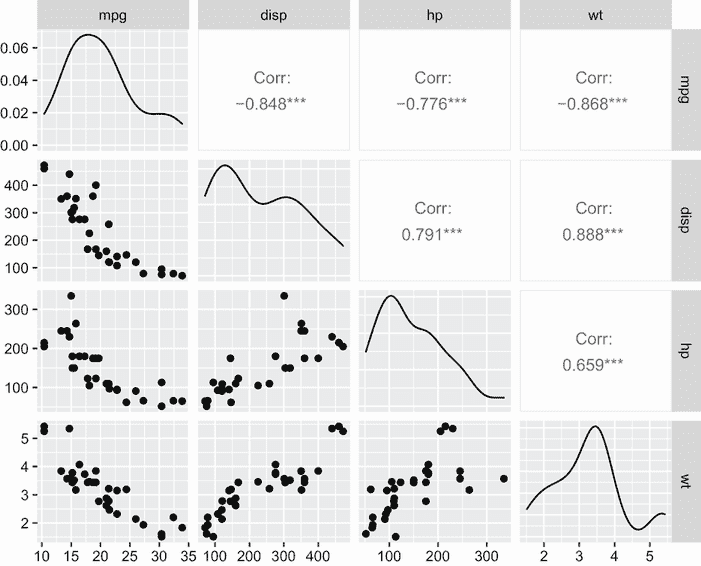

图 11.3 由`ggpairs()`函数创建的散点图矩阵

接下来，我们将创建一个高度定制的散点图矩阵，添加拟合线、直方图和个性化主题。`ggpairs()`函数允许您为创建主对角线、主对角线下方和主对角线上方的绘图指定单独的函数。以下列表提供了代码。

列表 11.3 带拟合线、直方图和相关性系数的散点图矩阵

```
library(GGally)

diagplots <- function(data, mapping) {                                     ❶
  ggplot(data = data, mapping = mapping) +                                 ❶
    geom_histogram(fill="lightblue", color="black")                        ❶
}                                                                          ❶

lowerplots <- function(data, mapping) {                                    ❷
    ggplot(data = data, mapping = mapping) +                               ❷
      geom_point(color="darkgrey") +                                       ❷
      geom_smooth(method = "lm", color = "steelblue", se=FALSE) +          ❷
      geom_smooth(method="loess", color="red", se=FALSE, linetype="dashed")❷
}                                                                          ❷
upperplots <- function(data, mapping) {                                    ❸
    ggally_cor(data=data, mapping=mapping,                                 ❸
               display_grid=FALSE, size=3.5, color="black")                ❸
}                                                                          ❸

mytheme <-  theme(strip.background = element_blank(),                      ❹
                  panel.grid       = element_blank(),                      ❹
                  panel.background = element_blank(),                      ❹
                  panel.border = element_rect(color="grey20", fill=NA))    ❹

ggpairs(mtcars,                                                            ❺
        columns=c("mpg","disp", "drat", "wt"),                             ❺
        columnLabels=c("MPG", "Displacement",                              ❺
                       "R Axle Ratio", "Weight"),                          ❺
        title = "Scatterplot Matrix with Linear and Loess Fits",           ❺
        lower = list(continuous = lowerplots),                             ❺
        diag =  list(continuous = diagplots),                              ❺
        upper = list(continuous = upperplots)) +                           ❺
        mytheme                                                            ❺
```

❶ 主对角线上的绘图函数

❷ 主对角线下方的绘图函数

❸ 主对角线上方的绘图函数

❹ 定制主题

❺ 生成散点图矩阵

首先，定义了一个函数用于使用浅蓝色条带和黑色边框创建直方图 ❶。接下来，创建了一个函数用于生成带有深灰色点的散点图，最佳拟合线为钢蓝色，以及一条虚线红色洛伦兹平滑线。置信区间被抑制（`se=FALSE`） ❷。指定了第三个函数用于显示相关系数 ❸。此函数使用 `ggally_cor()` 函数获取并打印系数，而大小和颜色选项影响外观，`displayGrid` 选项抑制网格线。还添加了一个自定义主题 ❹。此可选步骤消除了面元条和网格线，并将每个单元格包围在一个灰色框中。

最后，`ggpairs()` 函数 ❺ 使用这些函数在图 11.4 中创建自定义图形。`columns` 选项指定变量，`columnLabels` 选项提供描述性名称。`lower`、`diag` 和 `upper` 选项指定用于创建矩阵每个部分的单元格图的函数。这种方法在设计最终图形时提供了很大的灵活性。

R 提供了许多创建散点图矩阵的其他方法。你可能想探索 `lattice` 包中的 `splom()` 函数，`TeachingDemos` 包中的 `pairs2()` 函数，`HH` 包中的 `xysplom()` 函数，`ResourceSelection` 包中的 `kdepairs()` 函数，以及 `SMPracticals` 包中的 `pairs.mod()`。每个都添加了自己的独特风格。分析师们一定喜欢散点图矩阵！

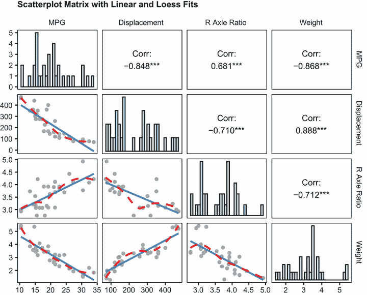

图 11.4 使用 `ggpairs()` 函数创建的散点图矩阵和用户提供的散点图、直方图和相关性函数

### 11.1.2 高密度散点图

当数据点之间存在显著重叠时，散点图在观察关系方面变得不那么有用。考虑以下虚构的例子，其中 10,000 个观测值落入两个重叠的数据点集群：

```
set.seed(1234)
n <- 10000
c1 <- matrix(rnorm(n, mean=0, sd=.5), ncol=2)
c2 <- matrix(rnorm(n, mean=3, sd=2), ncol=2)
mydata <- rbind(c1, c2)
mydata <- as.data.frame(mydata)
names(mydata) <- c("x", "y")
```

如果你使用以下代码在这些变量之间生成一个标准的散点图

```
ggplot(mydata, aes(x=x, y=y)) + geom_point() +
  ggtitle("Scatter Plot with 10,000 Observations")
```

你将获得图 11.5 中的图形。

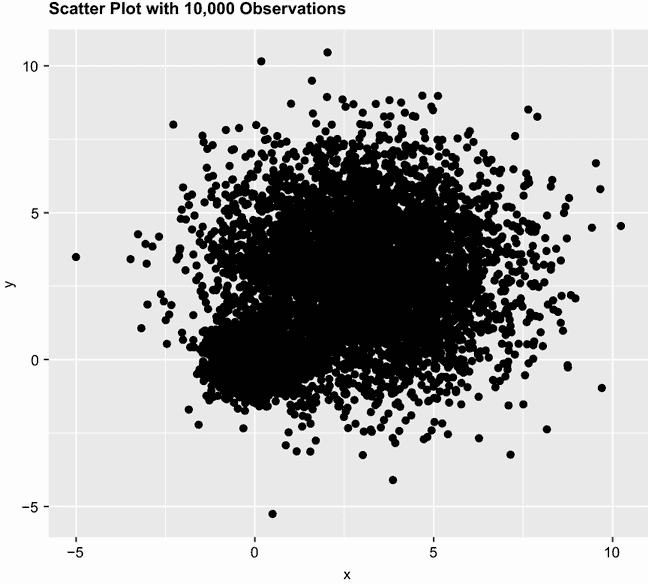

图 11.5 包含 10,000 个观测值和显著重叠数据点的散点图。请注意，数据点的重叠使得难以辨别数据浓度最大的地方。

图 11.5 中数据点的重叠使得难以辨别 *x* 和 *y* 之间的关系。R 提供了几种图形方法，当这种情况发生时可以使用，包括分箱、颜色和透明度来指示图上任何点的重叠数据点的数量。

`smoothScatter()` 函数使用核密度估计来生成散点图的平滑颜色密度表示。代码

```
with(mydata,
     smoothScatter(x, y, 
                   main="Scatter Plot Colored by Smoothed Densities"))
```

生成了图 11.6 中的图形。

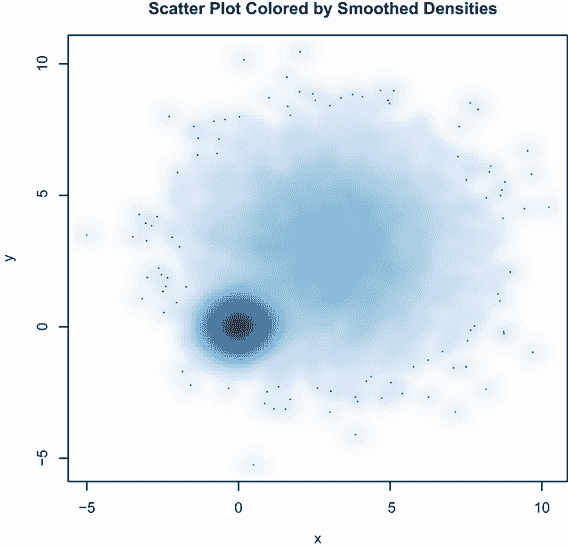

图 11.6 使用 `smoothScatter()` 绘制平滑密度估计的散点图。密度很容易从图中读取。

使用另一种方法，`ggplot2` 包中的 `geom_hex()` 函数提供了双变量分箱到六边形单元格（听起来比看起来好）。基本上，绘图区域被分成一个六边形网格，每个单元格中的点数使用颜色或阴影显示。将此函数应用于数据集

```
ggplot(mydata, aes(x=x, y=y)) + 
  geom_hex(bins=50) +
  scale_fill_continuous(trans = 'reverse') +
  ggtitle("Scatter Plot with 10,000 Observations")
```

给出图 11.7 中的散点图。

默认情况下，`geom_hex()` 使用较浅的颜色来表示更高的密度。在您的代码中，函数 `scale_fill_continuous(trans` `=` `'reverse')` 确保使用较深的颜色来表示密度更高的区域。我认为这更直观，并且与用于可视化大型数据集的其他 R 函数的方法相匹配。

注意，`hexbin` 包中的 `hexbin()` 函数以及 `IDPmisc` 包中的 `iplot()` 函数可以用来为大型数据集创建可读的散点图矩阵。请参阅 `?hexbin` 和 `?iplot` 以获取示例。

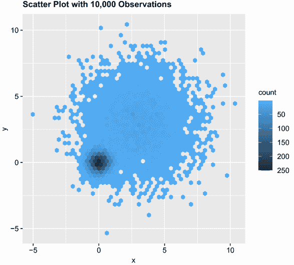

图 11.7 使用六边形分箱显示每个点的观测数。数据集中度容易看出，并且可以从图例中读取计数。

### 11.1.3 3D 散点图

散点图和散点图矩阵显示双变量关系。如果您想同时可视化三个定量变量的交互作用，可以使用 3D 散点图。

例如，假设你对汽车油耗、重量和排量之间的关系感兴趣。您可以使用 `scatterplot3d` 包中的 `scatterplot3d()` 函数来描绘它们之间的关系。格式如下

```
scatterplot3d(*x, y, z*) 
```

其中 *`x`* 在水平轴上绘制，*`y`* 在垂直轴上绘制，*`z`* 以透视方式绘制。继续上述示例，

```
library(scatterplot3d)
with(mtcars,
     scatterplot3d(wt, disp, mpg,
                      main="Basic 3D Scatter Plot"))
```

生成图 11.8 中的 3D 散点图。

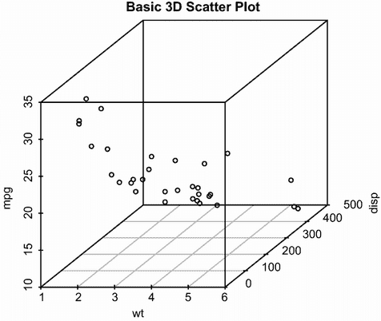

图 11.8 3D 散点图：每加仑英里数、汽车重量和排量

`scatterplot3d()` 函数提供了许多选项，包括指定符号、坐标轴、颜色、线条、网格、突出显示和角度。例如，以下代码

```
library(scatterplot3d) 
with(mtcars,
     scatterplot3d(wt, disp, mpg,
                   pch=16,
                   highlight.3d=TRUE,
                   type="h",
                   main="3D Scatter Plot with Vertical Lines"))              
```

生成一个带有突出显示的 3D 散点图，增强了深度印象，并且有垂直线将点连接到水平平面（见图 11.9）。

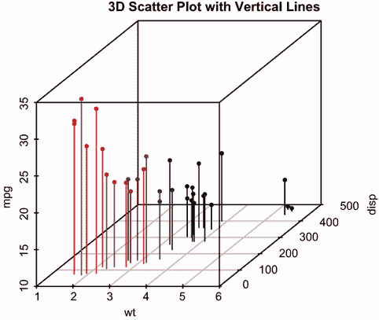

图 11.9 带有垂直线和阴影的 3D 散点图

作为最后的例子，让我们将之前的图形添加一个回归平面。代码如下

```
library(scatterplot3d) 
s3d <-with(mtcars,
           scatterplot3d(wt, disp, mpg,
                         pch=16,
                         highlight.3d=TRUE,
                         type="h",
          main="3D Scatter Plot with Vertical Lines and Regression Plane"))
fit <- lm(mpg ~ wt+disp, data=mtcars)
s3d$plane3d(fit)
```

图 11.10 显示了结果图形。

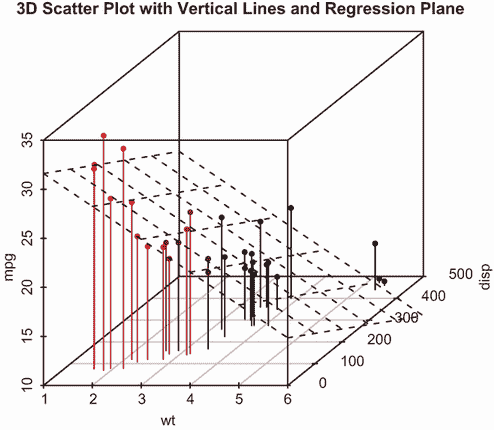

图 11.10 带有垂直线、阴影和叠加回归平面的 3D 散点图

该图表允许您通过多重回归方程从汽车重量和排量来可视化每加仑英里数的预测。平面代表预测值，点代表实际值。平面到点的垂直距离是残差。位于平面以上的点是预测不足，而位于线以下的点是预测过度。第八章介绍了多重回归。

### 11.1.4 旋转 3D 散点图

如果您能够与三维散点图进行交互，那么三维散点图就更容易解释。R 提供了多种机制来旋转图表，这样您就可以从多个角度看到绘制的点。

例如，您可以使用 `rgl` 包中的 `plot3d()` 函数创建一个交互式 3D 散点图。它创建了一个可以鼠标旋转的旋转 3D 散点图。其格式为

```
plot3d(*x, y, z*)
```

其中 *`x`*、*`y`* 和 *`z`* 是表示点的数值向量。您还可以添加 `col` 和 `size` 等选项来分别控制点的颜色和大小。继续上面的例子，尝试以下代码：

```
library(rgl)
with(mtcars,
     plot3d(wt, disp, mpg, col="red", size=5))
```

您应该得到图 11.11 中描述的图表。使用鼠标旋转坐标轴。我认为您会发现能够在三维空间中旋转散点图使得图表更容易理解。


图 11.11 由 `rgl` 包中的 `plot3d()` 函数生成的旋转 3D 散点图

您可以使用 `car` 包中的 `scatter3d()` 函数执行类似的功能：

```
library(car)
with(mtcars,
     scatter3d(wt, disp, mpg))
```

图 11.12 显示了结果。

`scatter3d()` 函数可以包括各种回归曲面，如线性、二次、平滑和加性。线性曲面是默认选项。此外，还有交互式识别点的选项。有关更多详细信息，请参阅 `help(scatter3d)`。

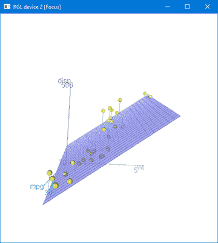

图 11.12 由 `car` 包中的 `scatter3d()` 函数生成的旋转 3D 散点图

### 11.1.5 气泡图

在上一节中，我们使用三维散点图显示了三个定量变量之间的关系。另一种方法是创建一个二维散点图，并使用绘制点的尺寸来表示第三个变量的值。这种方法称为 *气泡图*。

这里给出了气泡图的一个简单示例：

```
ggplot(mtcars, 
   aes(x = wt, y = mpg, size = disp)) +
   geom_point() +
   labs(title="Bubble Plot with point size proportional to displacement",
        x="Weight of Car (lbs/1000)",
        y="Miles Per Gallon")
```

生成的散点图显示了汽车重量与燃油效率之间的关系，其中点的大小与每辆车的发动机排量成比例。图 11.13 展示了该图表。

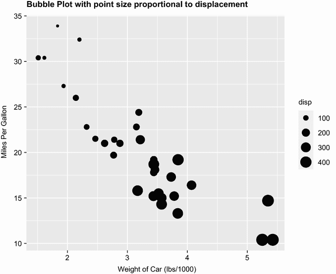

图 11.13 汽车重量与每加仑英里数的气泡图，其中点的大小与发动机排量成比例

我们可以通过选择不同的点形状和颜色，并添加透明度来处理点重叠，来改善默认的外观。我们还将增加气泡大小的可能范围，以便更容易区分。最后，我们将使用颜色来添加气缸数作为第四个变量。以下列表给出了代码，图 11.14 显示了图表。在灰度图中颜色难以区分，但在彩色图中很容易辨认。

列表 11.4 改进的气泡图

```
ggplot(mtcars, 
       aes(x = wt, y = mpg, size = disp, fill=factor(cyl))) +
  geom_point(alpha = .5, 
             color = "black", 
             shape = 21) +
  scale_size_continuous(range = c(1, 10)) +
  labs(title = "Auto mileage by weight and horsepower",
       subtitle = "Motor Trend US Magazine (1973-74 models)",
       x = "Weight (1000 lbs)",
       y = "Miles/(US) gallon",
       size = "Engine\ndisplacement",
       fill = "Cylinders") +
  theme_minimal()  
```

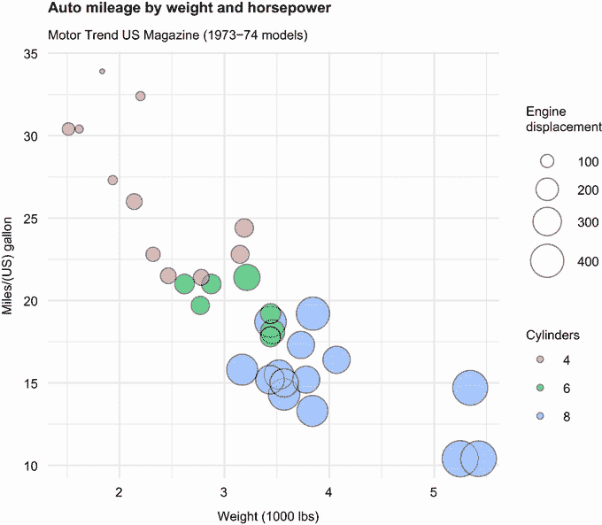

图 11.14 改进的气泡图。拥有更多发动机气缸的汽车往往重量更大，发动机排量更大，燃油效率更差。

通常，使用 R 的统计学家倾向于避免气泡图，原因与避免饼图相同：人类通常在判断体积方面比距离更困难。但气泡图在商业界很受欢迎，所以我在这里包括它们。

我确实有很多关于散点图要说的。这种对细节的关注部分原因是散点图在数据分析中的核心地位。尽管简单，但它们可以帮助你立即以直接的方式可视化数据，揭示可能被忽视的关系。

## 11.2 折线图

如果你从左到右连接散点图中的点，你就得到了一个折线图。随基础安装提供的 `Orange` 数据集包含五棵橙树的年龄和周长数据。考虑第一棵橙树的生长情况，如图 11.15 所示。左边的图是散点图，右边的图是折线图。正如你所见，折线图特别适合传达变化。图 11.15 中的图表是用列表 11.5 中的代码创建的。

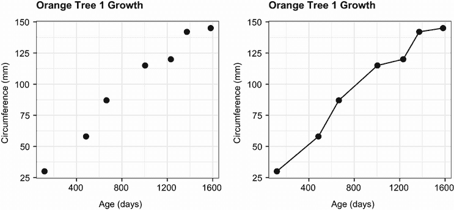

图 11.15 散点图与折线图比较。折线图有助于读者看到数据中的增长和趋势。

列表 11.5 散点图与折线图

```
library(ggplot2)
tree1 <- subset(Orange, Tree == 1)
ggplot(data=tree1, 
       aes(x=age, y=circumference)) +
  geom_point(size=2) +
  labs(title="Orange Tree 1 Growth",
       x = "Age (days)",
       y = "Circumference (mm)") +
  theme_bw()

ggplot(data=tree1, 
       aes(x=age, y=circumference)) +
  geom_point(size=2) +
  geom_line() +
  labs(title="Orange Tree 1 Growth",
       x = "Age (days)",
       y = "Circumference (mm)") +
  theme_bw()
```

两个图表的代码之间唯一的区别是添加了 `geom_line()` 函数。表 11.1 给出了该函数的常见选项。每个选项都可以分配一个值或映射到一个分类变量。

表 11.1 `geom_line()` 选项

| 选项 | 影响 |
| --- | --- |
| `size` | 线条厚度 |
| `color` | 线条颜色 |
| `linetype` | 线型模式（例如，虚线） |

图 11.16 显示了可能的线型。

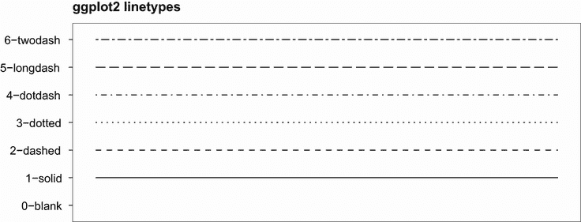

图 11.16 `ggplot2` 线型。你可以指定名称或编号。

为了演示创建更复杂的折线图，让我们绘制五棵橙树随时间增长的情况。每棵树将有自己的独特线条和颜色。代码在下一列表中显示，结果在图 11.17 中。

列表 11.6 显示五棵橙树随时间增长的折线图

```
library(ggplot2)
ggplot(data=Orange,
        aes(x=age, y=circumference, linetype=Tree, color=Tree)) +
  geom_point() +
  geom_line(size=1) +
  scale_color_brewer(palette="Set1") +
  labs(title="Orange Tree Growth",
       x = "Age (days)",
       y = "Circumference (mm)") +
  theme_bw()

```

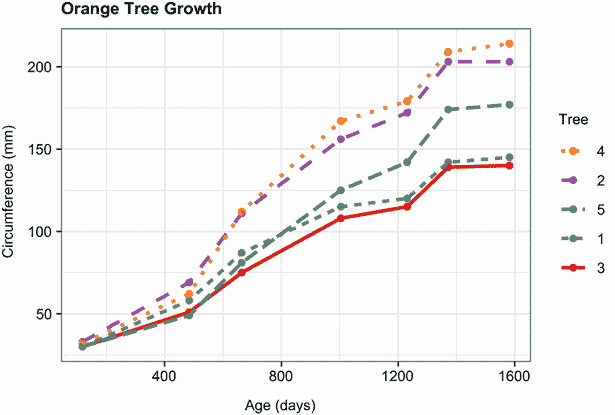

图 11.17 显示五棵橙树随时间增长的折线图

在列表 11.6 中，`aes()`函数将树编号映射到线型和颜色。`scale_color_brewer()`函数用于选择调色板。由于我在色彩选择上存在困难（即，我非常擅长选择好的颜色），我严重依赖预定义的调色板，如`RColorBrewer`包提供的那些。第十九章（高级图形）详细描述了调色板。

你可以从图中看到，树 4 和树 2 在测量的整个范围内表现出最大的增长，并且树 4 在大约 664 天时超过了树 2。默认情况下，图例列出的线条顺序与图表中出现的顺序相反（图例中从上到下是图表中从下到上）。为了使顺序从上到下匹配，请添加

```
+ guides(color = guide_legend(reverse = TRUE), 
         linetype = guide_legend(reverse = TRUE))
```

列表 11.6 中的代码。在下一节中，你将探索一次性检查多个相关系数的方法。

## 11.3 相关图

相关矩阵是多变量统计的一个基本方面。哪些变量彼此强烈相关，哪些不相关？某些变量簇是否以特定方式相关？随着变量数量的增加，这些问题可能更难回答。"相关图"是用于可视化相关矩阵数据的一个相对较新的工具。

一旦你看过一次相关图，解释它就会变得容易。考虑`mtcars`数据框中变量的相关性。这里有 11 个变量，每个变量测量 32 辆汽车的一些方面。你可以使用以下代码获取相关性：

```
> round(cor(mtcars), 2)
       mpg   cyl  disp    hp  drat    wt  qsec    vs    am  gear  carb
mpg   1.00 -0.85 -0.85 -0.78  0.68 -0.87  0.42  0.66  0.60  0.48 -0.55
cyl  -0.85  1.00  0.90  0.83 -0.70  0.78 -0.59 -0.81 -0.52 -0.49  0.53
disp -0.85  0.90  1.00  0.79 -0.71  0.89 -0.43 -0.71 -0.59 -0.56  0.39
hp   -0.78  0.83  0.79  1.00 -0.45  0.66 -0.71 -0.72 -0.24 -0.13  0.75
drat  0.68 -0.70 -0.71 -0.45  1.00 -0.71  0.09  0.44  0.71  0.70 -0.09
wt   -0.87  0.78  0.89  0.66 -0.71  1.00 -0.17 -0.55 -0.69 -0.58  0.43
qsec  0.42 -0.59 -0.43 -0.71  0.09 -0.17  1.00  0.74 -0.23 -0.21 -0.66
vs    0.66 -0.81 -0.71 -0.72  0.44 -0.55  0.74  1.00  0.17  0.21 -0.57
am    0.60 -0.52 -0.59 -0.24  0.71 -0.69 -0.23  0.17  1.00  0.79  0.06
gear  0.48 -0.49 -0.56 -0.13  0.70 -0.58 -0.21  0.21  0.79  1.00  0.27
carb -0.55  0.53  0.39  0.75 -0.09  0.43 -0.66 -0.57  0.06  0.27  1.00
```

哪些变量最相关？哪些变量相对独立？是否存在任何模式？没有显著的时间和精力（以及可能还需要一套彩色笔来标注），仅从相关矩阵中是无法轻易判断的。

你可以使用`corrgram`包中的`corrgram()`函数显示相同的相关矩阵（见图 11.18）。代码如下：

```
library(corrgram)
corrgram(mtcars, order=TRUE, lower.panel=panel.shade,
         upper.panel=panel.pie, text.panel=panel.txt,
         main="Corrgram of mtcars intercorrelations")
```

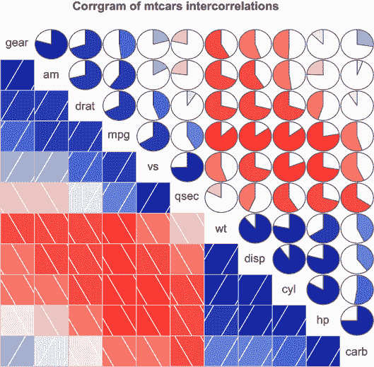

图 11.18 `mtcars`数据框中变量之间的相关图。行和列已使用主成分分析重新排序。

要解释这个图表，首先从单元格的下半部分（主对角线以下的单元格）开始。默认情况下，蓝色和从左下到右上的网格表示两个在该单元格相遇的变量之间的正相关。相反，红色和从左上到右下的网格表示负相关。颜色越深、饱和度越高，相关性的幅度就越大。接近零的弱相关性看起来较淡。在当前图表中，行和列已重新排序（使用第十四章将要讨论的主成分分析）以将具有相似相关模式的变量聚集在一起。

您可以从阴影单元格中看到，`gear`、`am`、`drat`和`mpg`彼此之间呈正相关。您还可以看到，`wt`、`disp`、`cyl`、`hp`和`carb`彼此之间呈正相关。但第一组变量与第二组变量呈负相关。您还可以看到，`carb`与`am`之间的相关性较弱，`vs`与`gear`、`vs`与`am`以及`drat`与`qsec`之间的相关性也较弱。

单元格的上三角使用饼图显示相同的信息。在这里，颜色扮演着同样的角色，但相关性的强度由填充饼图的切片大小表示。正相关从 12 点开始顺时针填充饼图。负相关逆时针填充饼图。

`corrgram()`函数的格式是

```
corrgram(*x*, order=, panel=, text.panel=, diag.panel=)
```

其中*`x`*是一个数据框，每行有一个观测值。当`order=TRUE`时，使用相关矩阵的主成分分析对变量进行重新排序。重新排序可以帮助使双变量关系的模式更加明显。

选项`panel`指定要使用的非对角面板类型。或者，您可以使用`lower.panel`和`upper.panel`选项来选择主对角线以上和以下的不同选项。`text.panel`和`diag.panel`选项指的是主对角线。表 11.2 描述了允许的值。

表 11.2 `corrgram()`函数的面板选项

| 放置 | 面板选项 | 描述 |
| --- | --- | --- |
| 非对角线 | `panel.pie` | 饼图的填充部分表示相关性的大小。 |
|  | `panel.shade` | 阴影的深度表示相关性的大小。 |
|  | `panel.ellipse` | 绘制置信椭圆和光滑线 |
|  | `panel.pts` | 绘制散点图 |
|  | `panel.conf` | 打印相关系数及其置信区间 |
|  | `panel.cor` | 打印相关系数，但不包括其置信区间 |
| 主对角线 | `panel.txt` | 打印变量名 |
|  | `panel.minmax` | 打印最小值、最大值和变量名 |
|  | `panel.density` | 打印核密度图和变量名 |

让我们尝试第二个例子。代码

```
library(corrgram)
corrgram(mtcars, order=TRUE, lower.panel=panel.ellipse,
         upper.panel=panel.pts, text.panel=panel.txt,
         diag.panel=panel.minmax, 
         main="Corrgram of mtcars data using scatter plots 
               and ellipses")
```

生成图 11.19 中的图形。在这里，您在下半三角使用光滑拟合线和使用置信椭圆，在上半三角使用散点图。

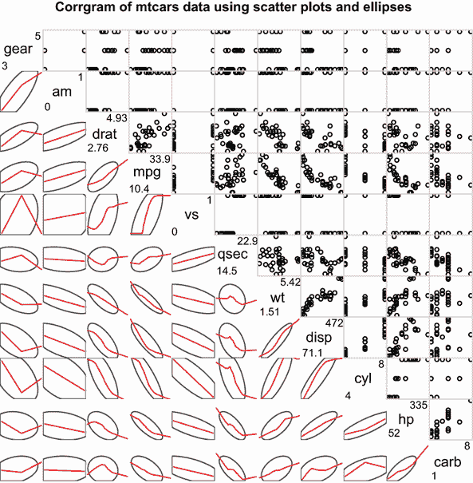

图 11.19 `mtcars`数据框中变量之间的相关性的 Corrgram。下三角包含光滑的最佳拟合线和置信椭圆，上三角包含散点图。对角面板包含最小值和最大值。行和列已使用主成分分析重新排序。

为什么散点图看起来很奇怪？

图 11.19 中绘制的几个变量具有有限的允许值。例如，齿轮的数量是 3、4 或 5。汽缸的数量是 4、6 或 8。`am`（变速器类型）和`vs`（V/S）都是二元的。这解释了上对角线中看起来奇怪的散点图。

总是小心选择适合数据形式的统计方法。将这些变量指定为有序或无序因素可以作为有用的检查。当 R 知道一个变量是分类或有序的，它会尝试应用适合该测量水平的统计方法。

我们将以另一个示例结束。以下代码

```
corrgram(mtcars, order=TRUE, lower.panel=panel.shade,
         upper.panel=panel.cor,
         main="Corrgram of mtcars data using shading and coefficients")
```

产生图 11.20 中的图形。在这里，你使用下三角的着色和变量顺序来强调相关性模式，并在上三角打印相关值。


图 11.20 `mtcars`数据框中变量的相关性的 Corrgram。下三角被着色以表示相关性的大小和方向。行和列已使用主成分分析重新排序。相关系数打印在上三角。

在继续之前，我应该指出，你可以通过`corrgram()`函数控制使用的颜色。为此，在`colorRampPalette()`函数中指定四种颜色，并使用`col.regions`选项包含结果。以下是一个示例：

```
library(corrgram) 
cols <- colorRampPalette(c("darkgoldenrod4", "burlywood1",
                           "darkkhaki", "darkgreen"))
corrgram(mtcars, order=TRUE, col.regions=cols,
         lower.panel=panel.shade, 
         upper.panel=panel.conf, text.panel=panel.txt,
         main="A Corrgram (or Horse) of a Different Color")
```

尝试一下，看看你得到什么结果。

Corrgrams 可以用来检查大量定量变量之间的双变量关系。由于它们相对较新，最大的挑战是教育接收者如何解释它们。了解更多信息，请参阅 Michael Friendly 的“Corrgrams: Exploratory Displays for Correlation Matrices”，[`www.datavis.ca/papers/corrgram.pdf`](https://www.datavis.ca/papers/corrgram.pdf)。

## 11.4 网状图

到目前为止，我们一直在探索可视化定量/连续变量之间关系的方法。但如果你的变量是分类的呢？当你查看单个分类变量时，你可以使用条形图或饼图。如果有两个分类变量，你可以使用堆叠条形图（第 6.1.2 节）。但如果有超过两个分类变量，你该怎么办呢？

一种方法是使用*网状图*，其中多维列联表中的频率由与其单元格频率成比例的嵌套矩形区域表示。可以使用颜色和/或阴影来表示拟合模型的残差。有关详细信息，请参阅 Meyer、Zeileis 和 Hornick（2006）或 Michael Friendly 的优秀教程([`cran.r-project.org/web/packages/vcdExtra/vignettes/vcd-tutorial.pdf`](https://cran.r-project.org/web/packages/vcdExtra/vignettes/vcd-tutorial.pdf))。

马赛克图可以使用 `vcd` 库中的 `mosaic()` 函数创建（R 的基本安装中有一个 `mosaicplot()` 函数，但我推荐使用 `vcd` 包，因为它具有更丰富的功能）。作为一个例子，考虑基本安装中可用的 `Titanic` 数据集。它描述了乘客的生存或死亡数量，按舱位（1 级、2 级、3 级、船员）、性别（男性、女性）和年龄（儿童、成人）进行交叉分类。这是一个经过充分研究的数据集。你可以使用以下代码查看交叉分类：

```
> ftable(Titanic)
                   Survived  No Yes
Class Sex    Age                   
1st   Male   Child            0   5
             Adult          118  57
      Female Child            0   1
             Adult            4 140
2nd   Male   Child            0  11
             Adult          154  14
      Female Child            0  13
             Adult           13  80
3rd   Male   Child           35  13
             Adult          387  75
      Female Child           17  14
             Adult           89  76
Crew  Male   Child            0   0
             Adult          670 192
      Female Child            0   0
             Adult            3  20
```

`mosaic()` 函数可以调用如下

```
mosaic(*table*)
```

其中 *`表格`* 是以数组形式表示的列联表，

```
mosaic(*formula*, *data*=)
```

其中 *`公式`* 是标准的 R 公式，而 *`数据`* 指定了一个数据框或表格。添加选项 `shade=TRUE` 会根据拟合模型的 Pearson 残差（默认为独立性）给图形着色，而选项 `legend=TRUE` 会显示这些残差的图例。

例如，两者都

```
library(vcd)
mosaic(Titanic, shade=TRUE, legend=TRUE)
```

和

```
library(vcd)
mosaic(~Class+Sex+Age+Survived, data=Titanic, shade=TRUE, legend=TRUE)
```

将生成图 11.21 中所示的图形。公式版本让你对图中变量选择和位置的控制能力更强。

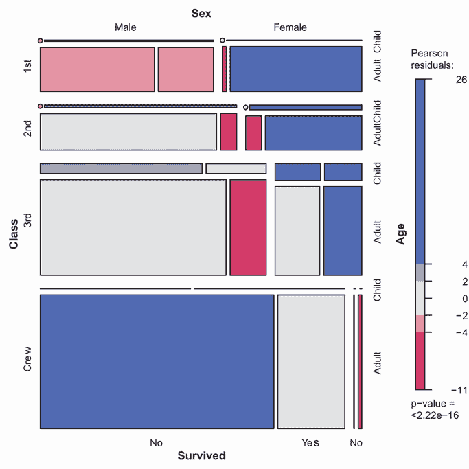

图 11.21 描述了根据舱位、性别和年龄划分的泰坦尼克号幸存者马赛克图

这张图片中包含了大量的信息。例如，当一个人从经济舱升到头等舱时，生存率急剧上升。大多数孩子都在三等舱和二等舱。头等舱中的大多数女性都幸存了下来，而只有大约一半的三等舱女性幸存。船员中的女性很少，导致图表底部的“Survived”（否，是）标签在这个群体中重叠。继续观察，你会看到更多有趣的事实。记得要观察矩形的相对宽度和高度。你还能从那个夜晚学到什么？

扩展马赛克图通过颜色和阴影来表示拟合模型的残差。在这个例子中，蓝色阴影表示比预期更频繁发生的交叉分类，假设生存与舱位、性别和年龄无关。红色阴影表示在独立性模型下比预期更少发生的交叉分类。务必运行示例，以便你可以看到彩色结果。该图表明，与独立性模型相比，头等舱女性幸存者更多，男性船员死亡者更多。与舱位、性别和年龄独立的情况下相比，三等舱男性幸存者更少。如果你想更详细地探索马赛克图，尝试运行 `example(mosaic)`。

在本章中，我们考虑了多种显示两个或多个变量之间关系的技巧，包括二维和三维散点图、散点图矩阵、气泡图、折线图、corrgrams 和马赛克图。其中一些方法是标准技术，而其他方法则不太为人所知。

结合展示单变量分布（第六章）、探索回归模型（第八章）和可视化组间差异（第九章）的方法，你现在拥有了一个全面的工具箱，用于可视化和从你的数据中提取意义（而且 fame and fortune is surely near at hand！）。在后面的章节中，你将通过额外的专业技巧来扩展你的技能，包括潜在变量模型的图形（第十四章）、时间序列（第十五章）、聚类数据（第十六章）、缺失数据（第十八章）以及创建基于一个或多个变量的图形的技术（第十九章）。

## 摘要

+   散点图和散点图矩阵允许你一次可视化两个定量变量之间的关系。这些图可以通过显示趋势的线性拟合线和局部加权回归拟合线来增强。

+   当你基于大量数据创建散点图时，那些绘制密度而不是点的绘图方法尤其有用。

+   可以使用 3D 散点图或 2D 气泡图来探索三个定量变量之间的关系。

+   时间变化可以通过折线图有效地描述。

+   大型相关系数矩阵以表格形式表示难以理解，但通过 corrgrams——相关系数矩阵的视觉图示，则易于探索。

+   可以使用马赛克图来可视化两个或更多分类变量之间的关系。
