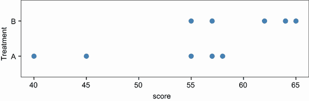
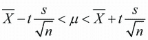
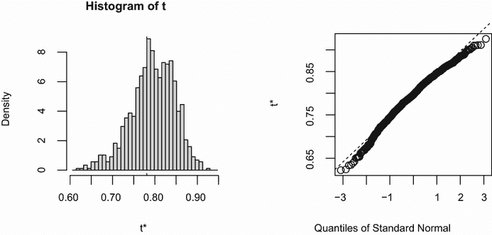
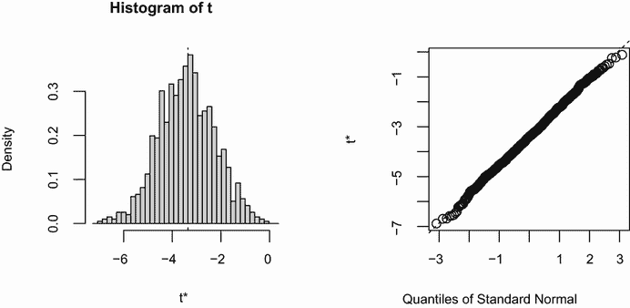

# 12 重抽样统计和自助法

本章涵盖

+   理解排列检验的逻辑

+   将排列检验应用于线性模型

+   使用自助法获得置信区间

在第七章、第八章和第九章中，我们回顾了假设观察数据来自正态分布或某些其他已知理论分布的统计方法，这些方法用于检验假设并估计总体参数的置信区间。但在许多情况下，这种假设是不合理的。基于随机化和重抽样的统计方法可以用于数据来自未知或混合分布的情况，样本量较小，异常值是一个问题，或者基于理论分布设计适当的测试过于复杂且数学上难以处理。

在本章中，我们将探讨两种使用随机化的广泛统计方法：排列检验和自助法。从历史上看，这些方法仅对经验丰富的程序员和专家统计学家可用。R 中的贡献包现在使它们对更广泛的数据分析人员变得容易获得。

我们还将重新审视最初使用传统方法（例如，t 检验、卡方检验、方差分析和回归）分析的问题，并看看它们如何使用这些稳健、计算密集型的方法来处理。要充分利用 12.2 节，请务必先阅读第七章。第八章和第九章作为 12.3 节的前提。

## 12.1 排列检验

*排列*检验，也称为*随机化*或*重新随机化*检验，已经存在了几十年，但直到高速计算机的出现才使其变得实用。要理解排列检验的逻辑，考虑一个假设问题：10 名受试者被随机分配到两种治疗条件之一（A 或 B），并记录了一个结果变量（得分）。实验结果在表 12.1 中呈现。

表 12.1 假设的双组问题

| 治疗 A | 治疗 B |
| --- | --- |
| 40 | 57 |
| 57 | 64 |
| 45 | 55 |
| 55 | 62 |
| 58 | 65 |

图 12.1 也显示了数据。是否有足够的证据得出结论，治疗的影响不同？



图 12.1 表 12.1 中假设治疗数据的条形图

在参数方法中，你可能会假设数据来自具有相同方差的正态总体，并应用双尾独立组 t 检验。零假设是治疗 A 的总体均值等于治疗 B 的总体均值。你会从数据中计算 t 统计量，并将其与理论分布进行比较。如果观察到的 t 统计量足够极端，比如说在理论分布中间 95%的值之外，你会拒绝零假设，并宣布在 0.05 的显著性水平上两组的总体均值不相等。

置换检验采用不同的方法。如果两种治疗方法真正等效，则分配给观察到的分数的标签（治疗 A 或治疗 B）是任意的。为了检验两种治疗方法之间的差异，你可以遵循以下步骤：

1.  按照参数方法计算观察到的 t 统计量；称这个为 t0。

1.  将所有 10 个分数放在一个单独的组中。

1.  随机分配 5 个分数给治疗 A 和 5 个分数给治疗 B。

1.  计算并记录新的观察到的 t 统计量。

1.  对将 5 个分数分配给治疗 A 和 5 个分数分配给治疗 B 的每一种可能方式重复步骤 3-4。共有 252 种可能的排列。

1.  将 252 个 t 统计量按升序排列。这是基于（或基于）样本数据的经验分布。

1.  如果 t0 落在经验分布中间 95%之外，则在 0.05 的显著性水平上拒绝两个处理组的总体均值相等的零假设。

注意，在置换和参数方法中都计算了相同的 t 统计量。但与将统计量与理论分布比较以确定它是否足够极端以拒绝零假设不同，它是与从观察数据排列中创建的经验分布进行比较。这种逻辑可以扩展到大多数经典统计检验和线性模型。

在前面的例子中，经验分布是基于数据的所有可能排列。在这种情况下，置换检验被称为*精确*检验。随着样本量的增加，形成所有可能排列所需的时间可能会变得难以承受。在这种情况下，你可以使用蒙特卡洛模拟从所有可能的排列中进行抽样。这样做提供了一个近似检验。

如果你觉得假设数据是正态分布的不可靠，担心异常值的影响，或者觉得数据集太小，不适合标准参数方法，那么置换检验提供了一个极好的替代方案。R 有一些目前可用的最全面和复杂的包来执行置换检验。本节剩余部分将重点介绍两个贡献包：`coin`包和`lmPerm`包。`coin`包提供了一个全面的框架，用于应用于独立性问题的置换检验，而`lmPerm`包提供了用于方差分析和回归设计的置换检验。我们将依次考虑每个包。在继续之前，请确保安装它们（`install.packages(c("coin", "lmPerm"))`）。

设置随机数种子

在继续之前，重要的是要记住排列检验在执行近似测试时使用伪随机数从所有可能的排列中进行抽样。因此，每次执行测试时结果都会改变。在 R 中设置随机数种子允许你固定生成的随机数。这在你想与他人分享示例时特别有用，因为如果使用相同的种子进行调用，结果总是会相同。将随机数种子设置为`1234`（即`set.seed(1234)`）将允许你复制本章中展示的结果。

## 12.2 使用 coin 包进行排列检验

`coin`包提供了一个通用的框架，用于将排列检验应用于独立性问题。使用此包，你可以回答以下问题：

+   响应是否独立于分组分配？

+   两个数值变量是否独立？

+   两个分类变量是否独立？

使用包中提供的便利函数（见表 12.2），你可以执行大多数在第七章中涵盖的传统统计测试的排列检验等效。

表 12.2 提供排列检验替代传统测试的`coin`函数

| 测试 | `coin`函数 |
| --- | --- |
| 双样本和 K 样本排列检验 | `oneway_test( y ~ A``)` |
| 威尔科克森-曼-惠特尼秩和检验 | `wilcox_test( y ~ A )` |
| 克鲁斯卡尔-沃利斯检验 | `kruskal_test( y ~ A` `)` |
| 皮尔逊卡方检验 | `chisq_test( A ~ B` `)` |
| 科克伦-曼特尔-汉森检验 | `cmh_test( A ~ B &#124; C` `)` |
| 线性-线性关联检验 | `lbl_test( D ~ E``)` |
| 斯皮尔曼检验 | `spearman_test( y ~ x` `)` |
| 弗里德曼检验 | `friedman_test( y ~ A &#124; C` `)` |
| 威尔科克森符号秩检验 | `wilcoxsign_test( y1 ~ y2` `)` |

在`coin`函数列中，`y`和`x`是数值变量，`A`和`B`是分类因素，`C`是分类分组变量，`D`和`E`是有序因素，而`y1`和`y2`是匹配的数值变量。

表 12.2 中列出的每个函数都采用以下形式

```
*function_name*( *formula*, *data*, distribution= )
```

其中

+   *`formula`*描述了要测试的变量之间的关系。示例在表中给出。

+   *`data`*标识一个数据框。

+   `distribution`指定了在零假设下经验分布应该如何推导。可能的值是`exact`、`asymptotic`和`approximate`。

如果`distribution="exact"`，则零假设下的分布是精确计算的（即，从所有可能的排列中）。分布也可以通过其渐近分布（`distribution="asymptotic"`）或通过蒙特卡洛重采样（`distribution="approximate(nresample=n)"`）来近似，其中`n`表示用于近似精确分布的随机重复次数。默认值为 10,000 次重复。目前，`distribution="exact"`仅适用于双样本问题。

注意：在`coin`包中，分类变量和有序变量必须分别编码为因子和有序因子。此外，数据必须存储在数据框中。

在本节的剩余部分，你将应用表 12.2 中描述的几个排列检验来解决前几章的问题。这将允许你将结果与更传统的参数和非参数方法进行比较。我们将通过考虑高级扩展来结束对`coin`包的讨论。

### 12.2.1 独立双样本和 k 样本检验

首先，让我们比较一下独立样本 t 检验与应用于表 12.2 中假设数据的单因素精确检验。结果如下所示。

列表 12.1 假设数据的 t 检验与单因素排列检验

```
> library(coin)
> score <- c(40, 57, 45, 55, 58, 57, 64, 55, 62, 65)
> treatment <- factor(c(rep("A",5), rep("B",5)))
> mydata <- data.frame(treatment, score)
> t.test(score~treatment, data=mydata, var.equal=TRUE)

        Two Sample t-test

data:  score by treatment
t = -2.345, df = 8, p-value = 0.04705
alternative hypothesis: true difference in means is not equal to 0
95 percent confidence interval:
 -19.0405455  -0.1594545
sample estimates:
mean in group A mean in group B 
           51.0            60.6 

> oneway_test(score~treatment, data=mydata, distribution="exact")

        Exact Two-Sample Fisher-Pitman Permutation Test

data:  score by treatment (A, B)
Z = -1.9147, p-value = 0.07143
alternative hypothesis: true mu is not equal to 0
```

传统 t 检验表明存在显著的组间差异（p < .05），而精确检验则没有（p > 0.071）。只有 10 个观测值，我更倾向于相信排列检验的结果，并在得出最终结论之前尝试收集更多数据。

接下来，考虑 Wilcoxon–Mann–Whitney U 检验。在第七章中，我们使用`wilcox.test()`函数考察了南方与南方以外美国各州监禁概率的差异。使用精确的 Wilcoxon 秩和检验，你会得到

```
> library(MASS)
> UScrime$So <- factor(UScrime$So)
> wilcox_test(Prob ~ So, data=UScrime, distribution="exact")

        Exact Wilcoxon Mann-Whitney Rank Sum Test

data:  Prob by So (0, 1) 
Z = -3.7, p-value = 8.488e-05
alternative hypothesis: true mu is not equal to 0
```

这表明在南方各州监禁的可能性更大。注意，在前面的代码中，数值变量`So`被转换为因子。这是因为`coin`包要求所有分类变量都被编码为因子。此外，你可能已经注意到这些结果与第七章中`wilcox.test()`函数的结果完全一致。这是因为`wilcox.test()`默认情况下也计算精确分布。

最后，考虑 k 样本检验。在第九章中，你使用单因素方差分析来评估五种药物方案对 50 名患者胆固醇降低的影响。可以使用此代码进行近似的 k 样本排列检验：

```
> library(multcomp)
> set.seed(1234)
> oneway_test(response~trt, data=cholesterol, 
  distribution=approximate(nresample=9999))

            Approximative K-Sample Fisher-Pitman Permutation Test

data:  response by trt (1time, 2times, 4times, drugD, drugE)
chi-squared = 36.381, p-value < 1e-04
```

在这里，参考分布基于数据的 9,999 次排列。随机数种子被设置为使你的结果与我的相同。显然，不同组别中的患者反应存在明显差异。

### 12.2.2 列联表中的独立性

你可以使用排列检验通过`chisq_test()`或`cmh_test()`函数来评估两个分类变量的独立性。后者函数用于数据在第三个分类变量上分层时。如果两个变量都是有序的，你可以使用`lbl_test()`函数来测试线性趋势。

在第七章中，你使用卡方检验来评估关节炎治疗与改善之间的关系。治疗有两个水平（安慰剂和治疗组），改善有三个水平（无、一些和显著）。改善变量被编码为有序因子。

如果你想要执行卡方检验的排列版本，可以使用以下代码：

```
> library(coin)
> library(vcd)
> Arthritis <- transform(Arthritis, 
  Improved=as.factor(as.numeric(Improved)))
> set.seed(1234)
> chisq_test(Treatment~Improved, data=Arthritis,
             distribution=approximate(nresample=9999))

                    Approximative Pearson Chi-Squared Test

data:  Treatment by Improved (1, 2, 3)
chi-squared = 13.055, p-value = 0.0018
```

这给出了基于 9999 次重复的近似卡方检验。你可能会问为什么将变量`Improved`从有序因子转换为分类因子。（好问题！）如果你保留它为有序因子，`coin()`将生成线性×线性趋势检验而不是卡方检验。尽管在这种情况下趋势检验可能是一个好的选择，但保持为卡方检验允许你将结果与第七章中的结果进行比较。

### 12.2.3 数字变量之间的独立性

`spearman_test()`函数提供了两个数值变量独立性的排列检验。在第七章中，我们考察了美国各州文盲率和谋杀率之间的相关性。你可以通过排列检验来测试这种关联，以下代码：

```
> states <- as.data.frame(state.x77)
> set.seed(1234)
> spearman_test(Illiteracy~Murder, data=states, 
                distribution=approximate(B=9999))

            Approximative Spearman Correlation Test

data:  Illiteracy by Murder
Z = 4.7065, p-value < 1e-04
alternative hypothesis: true rho is not equal to 0
```

基于约 9999 次重复的近似排列检验，可以拒绝独立性假设。注意，`state.x77`是一个矩阵。它必须被转换成数据框才能在`coin`包中使用。

### 12.2.4 依赖的双样本和 k 样本检验

当不同组别的观测值已经匹配或使用了重复测量时，使用依赖样本检验。对于两个配对组的排列检验，可以使用`wilcoxsign_test()`函数。对于超过两个组的情况，使用`friedman_test()`函数。

在第七章中，我们比较了 14 至 24 岁城市男性的失业率（`U1`）与 35 至 39 岁城市男性的失业率（`U2`）。由于这两个变量针对美国的每个州都有报告，你有一个两个依赖组的实验设计（`state`是匹配变量）。你可以使用精确的 Wilcoxon 符号秩检验来查看两个年龄组的失业率是否相等：

```
> library(coin)
> library(MASS)
> wilcoxsign_test(U1~U2, data=UScrime, distribution="exact")

        Exact Wilcoxon-Signed-Rank Test

data:  y by x (neg, pos) 
         stratified by block 
Z = 5.9691, p-value = 1.421e-14
alternative hypothesis: true mu is not equal to 0
```

根据结果，你会得出结论：失业率存在差异。

### 12.2.5 进一步探讨

`coin`包提供了一个通用的框架，用于测试一组变量是否独立于另一组变量（可选地在阻断变量上进行分层）相对于任意备择假设，通过近似排列检验。特别是，`independence_test()`函数让你可以从排列的角度接近大多数传统检验，并为传统方法未涵盖的情况创建新的和独特的统计检验。这种灵活性是有代价的：需要高水平的统计知识才能恰当地使用该函数。请参阅包附带的小册子（通过`vignette("coin")`访问）以获取更多详细信息。

在下一节中，你将了解`lmPerm`包。此包提供了一种排列方法来处理线性模型，包括回归和方差分析。

## 12.3 使用 lmPerm 包进行排列检验

`lmPerm`包提供了对线性模型排列方法的支撑。特别是，`lmp()`和`aovp()`函数是经过修改的`lm()`和`aov()`函数，用于执行排列检验而不是常规理论检验。

`lmp()`和`aovp()`函数的参数与`lm()`和`aov()`函数的参数相似，增加了`perm=`参数。`perm=`选项可以取`Exact`、`Prob`或`SPR`的值。`Exact`基于所有可能的排列产生精确检验。`Prob`从所有可能的排列中进行抽样。抽样会继续进行，直到估计的标准差低于估计 p 值的 0.1。停止规则由可选的`Ca`参数控制。最后，`SPR`使用顺序概率比检验来决定何时停止抽样。请注意，如果观测值的数量大于 10，`perm="Exact"`将自动默认为`perm="Prob"`。精确检验仅适用于小问题。

为了了解这是如何工作的，您将应用排列方法于简单回归、多项式回归、多元回归、单因素方差分析、单因素协方差分析和双向因子设计。

### 12.3.1 简单和多项式回归

在第八章中，您使用线性回归研究了 15 名女性的体重与身高之间的关系。使用`lmp()`而不是`lm()`会生成以下列表中的排列检验结果。

列表 12.2 简单线性回归的排列检验

```
> library(lmPerm)
> set.seed(1234)
> fit <- lmp(weight~height, data=women, perm="Prob")
[1] "Settings:  unique SS : numeric variables centered"
> summary(fit)

Call:
lmp(formula = weight ~ height, data = women, perm = "Prob")

Residuals:
   Min     1Q Median     3Q    Max 
-1.733 -1.133 -0.383  0.742  3.117 

Coefficients:
       Estimate Iter Pr(Prob)    
height     3.45 5000   <2e-16 ***
---
Signif. codes:  0 '***' 0.001 '**' 0.01 '*' 0.05 '.' 0.1 ' ' 1 

Residual standard error: 1.5 on 13 degrees of freedom
Multiple R-Squared: 0.991,      Adjusted R-squared: 0.99 
F-statistic: 1.43e+03 on 1 and 13 DF,  p-value: 1.09e-14 
```

要拟合一个二次方程，您可以使用下一列表中的代码。

列表 12.3 多项式回归的排列检验

```
> library(lmPerm)
> set.seed(1234)
> fit <- lmp(weight~height + I(height²), data=women, perm="Prob")
[1] "Settings:  unique SS : numeric variables centered"
> summary(fit)

Call:
lmp(formula = weight ~ height + I(height²), data = women, perm = "Prob")

Residuals:
    Min      1Q  Median      3Q     Max 
-0.5094 -0.2961 -0.0094  0.2862  0.5971 

Coefficients:
            Estimate Iter Pr(Prob)    
height       -7.3483 5000   <2e-16 ***
I(height²)   0.0831 5000   <2e-16 ***
---
Signif. codes:  0 '***' 0.001 '**' 0.01 '*' 0.05 '.' 0.1 ' ' 1 

Residual standard error: 0.38 on 12 degrees of freedom
Multiple R-Squared: 0.999,      Adjusted R-squared: 0.999 
F-statistic: 1.14e+04 on 2 and 12 DF,  p-value: <2e-16
```

如您所见，使用排列检验测试这些回归非常简单，并且对底层代码的改变很小。输出结果也与`lm()`函数产生的结果相似。请注意，增加了一个`Iter`列，表示达到停止规则所需的迭代次数。

### 12.3.2 多元回归

在第八章中，使用多元回归预测了 50 个美国州的人口、文盲率、收入和霜冻对谋杀率的影响。将`lmp()`函数应用于此问题会产生以下列表。

列表 12.4 多元回归的排列检验

```
> library(lmPerm)
> set.seed(1234)
> states <- as.data.frame(state.x77)
> fit <- lmp(Murder~Population + Illiteracy+Income+Frost,
             data=states, perm="Prob")
[1] "Settings:  unique SS : numeric variables centered"
> summary(fit)

Call:
lmp(formula = Murder ~ Population + Illiteracy + Income + Frost, 
    data = states, perm = "Prob")

Residuals:
     Min       1Q   Median       3Q      Max 
-4.79597 -1.64946 -0.08112  1.48150  7.62104 

Coefficients:
            Estimate Iter Pr(Prob)    
Population 2.237e-04   51   1.0000    
Illiteracy 4.143e+00 5000   0.0004 ***
Income     6.442e-05   51   1.0000    
Frost      5.813e-04   51   0.8627    
---
Signif. codes:  0 '***' 0.001 '**' 0.01 '*' 0.05 '. ' 0.1 ' ' 1 

Residual standard error: 2.535 on 45 degrees of freedom
Multiple R-Squared: 0.567,      Adjusted R-squared: 0.5285 
F-statistic: 14.73 on 4 and 45 DF,  p-value: 9.133e-08  
```

回顾第八章，当使用常规理论时，`Population`和`Illiteracy`都是显著的（p < 0.05）。基于排列检验，`Population`变量不再显著。当两种方法不一致时，您应该更仔细地查看您的数据。可能是不变性假设不可靠，或者存在异常值。

### 12.3.3 单因素方差分析和协方差分析

第九章中讨论的每个方差分析设计都可以通过排列检验来完成。首先，让我们看看第 9.1 节中关于治疗方案对胆固醇降低影响的单因素方差分析问题。代码和结果将在下一列表中给出。

列表 12.5 一因素方差分析的排列检验

```
> library(lmPerm)
> library(multcomp)
> set.seed(1234)
> fit <- aovp(response~trt, data=cholesterol, perm="Prob")
[1] "Settings:  unique SS "
> anova(fit)
Component 1 :
            Df R Sum Sq R Mean Sq Iter  Pr(Prob)    
trt          4  1351.37    337.84 5000 < 2.2e-16 ***
Residuals   45   468.75     10.42                   
---
Signif. codes:  0 '***' 0.001 '**' 0.01 '*' 0.05 '. ' 0.1 ' ' 1 
```

结果表明，治疗效应并不都是相等的。

本节中的第二个例子将排列检验应用于单因素协方差分析。这个问题来自第九章，其中你研究了在控制妊娠时间的情况下，四种药物剂量对大鼠窝重量的影响。下一列表显示了排列检验和结果。

列表 12.6 单因素协方差分析的排列检验

```
> library(lmPerm)
> set.seed(1234)
> fit <- aovp(weight ~ gesttime + dose, data=litter, perm="Prob")
[1] "Settings:  unique SS : numeric variables centered"
> anova(fit)
Component 1 :
            Df R Sum Sq R Mean Sq Iter Pr(Prob)    
gesttime     1   161.49   161.493 5000   0.0006 ***
dose         3   137.12    45.708 5000   0.0392 *  
Residuals   69  1151.27    16.685                  
---
Signif. codes:  0 '***' 0.001 '**' 0.01 '*' 0.05 '.' 0.1 ' ' 1
```

根据 p 值，在控制妊娠时间的情况下，四种药物剂量对窝重量的影响并不相等。

### 12.3.4 双因素方差分析

你将通过应用排列检验来结束本节内容。在第九章中，你研究了维生素 C 对豚鼠牙齿生长的影响。两个操纵因素是剂量（三个水平）和递送方式（两个水平）。每个治疗组合放置了 10 只豚鼠，从而形成了一个平衡的 3×2 因子设计。排列检验将在下一列表中提供。

列表 12.7 双因素方差分析的排列检验

```
> library(lmPerm)
> set.seed(1234)
> fit <- aovp(len~supp*dose, data=ToothGrowth, perm="Prob")
[1] "Settings:  unique SS : numeric variables centered"
> anova(fit)
Component 1 :
            Df R Sum Sq R Mean Sq Iter Pr(Prob)    
supp         1   205.35    205.35 5000  < 2e-16 ***
dose         1  2224.30   2224.30 5000  < 2e-16 ***
supp:dose    1    88.92     88.92 2032  0.04724 *  
Residuals   56   933.63     16.67                  
---
Signif. codes:  0 '***' 0.001 '**' 0.01 '*' 0.05 '.' 0.1 ' ' 1 
```

在显著性水平为 0.05 时，所有三个效应在统计上都与零不同。在显著性水平为 0.01 时，只有主效应是显著的。

重要的是要注意，当`aovp()`应用于方差分析设计时，它默认使用唯一平方和（也称为*SAS Type III 平方和*）。每个效应都会调整以适应其他每个效应。R 中参数方差分析设计的默认值是顺序平方和（*SAS Type I 平方和*）。每个效应都会调整以适应那些在模型中*出现较早*的效应。对于平衡设计，两种方法将达成一致，但对于不平衡设计，每个单元的观测数不相等，它们就不会。不平衡程度越大，不一致性越大。如果需要，在`aovp()`函数中指定`seqs=TRUE`将产生顺序平方和。有关第一类和第三类平方和的更多信息，请参阅第 9.2 节。

## 12.4 对排列检验的附加评论

排列检验为依赖于对潜在抽样分布的了解的检验提供了一个强大的替代方案。在这些排列检验中的每一个，你都能够测试统计假设，而不必依赖于正态、t、F 或卡方分布。

你可能已经注意到，基于正态理论的测试结果与之前章节中排列方法的测试结果非常接近。这些问题中的数据表现良好，方法之间的一致性是对正态理论方法在这种情况下工作得有多好的证明。

排列检验在数据明显非正态（例如，高度偏斜）、存在异常值、样本量小或不存在参数检验的情况下表现得尤为出色。但如果原始样本是对感兴趣人群的糟糕代表，那么没有任何测试，包括排列检验，能够改善生成的推断。

排列检验主要用于生成可以用来检验零假设的 p 值。它们可以帮助回答“是否存在效应？”的问题。使用排列方法来获得置信区间和测量精度的估计比较困难。幸运的是，这是自助法擅长的领域。

## 12.5 自助法

*自助法*通过从原始样本中重复随机有放回抽样来生成一个测试统计量或一组测试统计量的经验分布。它允许你在不需要假设特定潜在理论分布的情况下生成置信区间和测试统计假设。

用一个例子最容易展示自助法的逻辑。比如说，你想计算样本均值的 95%置信区间。你的样本有 10 个观测值，样本均值为 40，样本标准差为 5。如果你愿意假设均值的抽样分布是正态分布的，那么(1 – *α*/2)%的置信区间可以使用以下公式计算：



其中 *t* 是具有 *n* – 1 个自由度的 *t* 分布的上 1 – α/2 临界值。对于 95%的置信区间，你有 40 – 2.262(5/3.163) < *µ* < 40 + 2.262 -(5/3.162) 或 36.424 < *µ* < 43.577。你预计以这种方式创建的 95%置信区间将围绕真实的总体均值。

但如果你不愿意假设均值的抽样分布是正态分布的怎么办？你可以使用自助法：

1.  从样本中随机选择 10 个观测值，每次选择后进行有放回抽样。一些观测值可能被选择多次，而一些可能一次也没有被选择。

1.  计算并记录样本均值。

1.  重复前两步 1,000 次。

1.  将 1,000 个样本均值按从小到大的顺序排列。

1.  找到代表 2.5%和 97.5%百分位的样本均值。在这种情况下，这是从底部和顶部数的第 25 个数。这些就是你的 95%置信极限。

在这种情况下，如果样本均值很可能呈正态分布，那么自助法带来的好处很少。然而，在许多情况下，自助法是有优势的。如果你想要样本中位数或两个样本中位数之差的置信区间怎么办？这里没有简单的正态理论公式，而自助法是首选的方法。如果潜在分布未知；如果异常值是一个问题；如果样本量小；或者如果参数方法不存在，自助法通常可以是一个有用的方法来生成置信区间和检验假设。

## 12.6 使用 boot 包进行自助法

`boot` 包提供了广泛的用于自举和相关重采样方法的设施。您可以自举单个统计量（例如，中位数）或一组统计量（例如，回归系数集）。在使用之前，请确保下载并安装 `boot` 包（`install.packages("boot")`）。

自举过程可能看起来很复杂，但一旦您回顾了示例，它应该就会变得有意义。

通常，自举涉及三个主要步骤：

1.  编写一个函数，该函数返回感兴趣的统计量或统计量。如果有一个单个统计量（例如，中位数），则该函数应返回一个数字。如果有多个统计量（例如，回归系数集），则该函数应返回一个向量。

1.  通过 `boot()` 函数处理此函数以生成统计量（s）的 R 自举重复。

1.  使用 `boot.ci()` 函数获取步骤 2 中生成的统计量（s）的置信区间。

现在具体来说。主要的自举函数是 `boot()`。其格式为

```
*bootobject* <- boot(data=, statistic=, R=, ...) 
```

表 12.3 描述了参数。

表 12.3 `boot()` 函数的参数

| 参数 | 描述 |
| --- | --- |
| `data` | 一个向量、矩阵或数据框 |
| `statistic` | 产生要自举的 *k* 个统计量的函数（如果自举单个统计量，则 k = 1）。该函数应包含一个索引参数，`boot()` 函数可以使用该参数为每个重复选择案例（请参阅文本中的示例）。 |
| `R` | 自举重复的数量 |
| `...` | 传递给产生感兴趣统计量的函数的附加参数 |

`boot()` 函数调用统计函数 `R` 次。每次，它从整数 `1:nrow(data)` 中生成一组有放回的随机索引。这些索引用于统计函数以选择样本。在样本上计算统计量，并将结果累积在 `bootobject` 中。表 12.4 描述了 `bootobject` 结构。

表 12.4 `boot()` 函数返回的对象的元素

| 元素 | 描述 |
| --- | --- |
| `t0` | 应用到原始数据的 *k* 个统计量的观测值 |
| `t` | 一个 *R × k* 矩阵，其中每一行是 *k* 个统计量的自举重复 |

您可以通过 `bootobject$t0` 和 `bootobject$t`*.* 访问这些元素。

一旦生成了自举样本，您可以使用 `print()` 和 `plot()` 来检查结果。如果结果看起来合理，您可以使用 `boot.ci()` 函数来获取统计量（s）的置信区间。格式为

```
boot.ci(*bootobject*, conf=, type= ) 
```

表 12.5 给出了参数。

表 12.5 `boot.ci()` 函数的参数

| 参数 | 描述 |
| --- | --- |
| `bootobject` | `boot()` 函数返回的对象。 |
| `conf` | 所需的置信区间（默认：`conf`=0.95） |
| `type` | 返回的置信区间的类型。可能的值是 `norm`、`basic`、`stud`、`perc`、`bca` 和 `all`（默认：`type="all"`） |

`type` 参数指定了获取置信限的方法。`perc` 方法（百分位法）在样本均值示例中进行了演示。`bca` 提供了一个对偏差进行简单调整的区间。我发现 `bca` 在大多数情况下更可取。参见 Mooney 和 Duval（1993）以了解这些方法。

在接下来的几节中，我们将探讨重抽样单一统计量和一系列统计量。

### 12.6.1 重抽样单一统计量

`mtcars` 数据集包含了 1974 年《*Motor Trend*》杂志报道的 32 辆汽车的信息。假设你正在使用多元回归来预测汽车的油耗（每 1000 磅的重量和发动机排量（立方英寸））。除了标准的回归统计量之外，你希望得到 R 平方值（由预测变量解释的响应变量变异百分比）的 95%置信区间。可以使用非参数重抽样法来获得置信区间。

第一个任务是编写一个获取 R 平方值的函数：

```
rsq <- function(formula, data, indices) {
         d <- data[indices,]
         fit <- lm(formula, data=d)
         return(summary(fit)$r.square)
} 
```

该函数从回归中返回 R 平方值。`d <- data[indices,]` 语句对于 `boot()` 能够选择样本是必需的。

你可以使用以下代码绘制大量重抽样重复（例如，1000 次）：

```
library(boot)
set.seed(1234)
results <- boot(data=mtcars, statistic=rsq, 
                R=1000, formula=mpg~wt+disp)
```

可以使用以下方式打印 `boot` 对象：

```
> print(results)

ORDINARY NONPARAMETRIC BOOTSTRAP

Call:
boot(data = mtcars, statistic = rsq, R = 1000, formula = mpg ~ 
    wt + disp)

Bootstrap Statistics :
     original      bias     std. error
t1* 0.7809306  0.01333670   0.05068926
```

并使用 `plot(results)` 进行绘图。图 12.2 显示了结果图。



图 12.2 重抽样 R 平方值的分布

在图 12.2 中，你可以看到重抽样 R 平方值的分布不是正态分布的。可以使用以下方法获得 R 平方值的 95%置信区间：

```
> boot.ci(results, type=c("perc", "bca"))
BOOTSTRAP CONFIDENCE INTERVAL CALCULATIONS
Based on 1000 bootstrap replicates

CALL : 
boot.ci(boot.out = results, type = c("perc", "bca"))

Intervals : 
Level     Percentile            BCa          
95%   ( 0.6753,  0.8835 )   ( 0.6344,  0.8561 )
Calculations and Intervals on Original Scale
Some BCa intervals may be unstable
```

从这个例子中你可以看到，不同的生成置信区间的方法会导致不同的区间。在这种情况下，偏差调整区间与百分位法中等程度不同。在任何情况下，零假设 *H*[0]: R-square = 0 都会被拒绝，因为零不在置信区间内。

在本节中，你估计了一个单一统计量的置信限。在下一节中，你将估计多个统计量的置信区间。

### 12.6.2 重抽样多个统计量

在前面的例子中，重抽样被用来估计单一统计量（R 平方）的置信区间。继续这个例子，让我们获得一系列统计量的 95%置信区间。具体来说，让我们获取三个模型回归系数（截距、汽车重量和发动机排量）的置信区间。

首先，创建一个返回回归系数向量的函数：

```
bs <- function(formula, data, indices) {                
        d <- data[indices,]
        fit <- lm(formula, data=d)
        return(coef(fit))                                    
}
```

然后，使用此函数进行 1000 次重抽样：

```
library(boot)
set.seed(1234)
results <- boot(data=mtcars, statistic=bs,
                R=1000, formula=mpg~wt+disp)
> print(results)
ORDINARY NONPARAMETRIC BOOTSTRAP
Call:
boot(data = mtcars, statistic = bs, R = 1000, formula = mpg ~ 
    wt + disp)

Bootstrap Statistics :
    original   bias    std. error
t1*  34.9606  0.137873     2.48576
t2*  -3.3508 -0.053904     1.17043
t3*  -0.0177 -0.000121     0.00879
```

当对多个统计量进行自助法时，需要向`plot()`和`boot.ci()`函数添加一个索引参数，以指示分析`bootobject$t`的哪一列。在这个例子中，索引 1 代表截距，索引 2 是汽车重量，索引 3 是发动机排量。要绘制汽车重量的结果，请使用

```
plot(results, index=2)
```

图 12.3 显示了图表。



图 12.3 汽车重量自助回归系数的分布

要获取汽车重量和发动机排量的 95%置信区间，请使用

```
> boot.ci(results, type="bca", index=2)
BOOTSTRAP CONFIDENCE INTERVAL CALCULATIONS
Based on 1000 bootstrap replicates

CALL : 
boot.ci(boot.out = results, type = "bca", index = 2)

Intervals : 
Level       Bca          
95%   (-5.477, -0.937 )
Calculations and Intervals on Original Scale 

> boot.ci(results, type="bca", index=3) 

BOOTSTRAP CONFIDENCE INTERVAL CALCULATIONS
Based on 1000 bootstrap replicates

CALL : 
boot.ci(boot.out = results, type = "bca", index = 3)

Intervals : 
Level       BCa          
95%   (-0.0334, -0.0011 )   
Calculations and Intervals on Original Scale
```

注意：前一个例子每次都重新抽取整个数据样本。如果你可以假设预测变量具有固定水平（这在计划实验中很典型），那么你最好只重新抽取残差项。参见 Mooney 和 Duval（1993，第 16-17 页）的简单解释和算法。

在我们离开自助法之前，值得解决两个经常出现的问题：

+   原始样本需要多大？

+   需要多少次重复？

对于第一个问题，没有简单的答案。有些人认为，只要样本能够代表总体，原始样本量在 20-30 之间就足够了。从感兴趣的总体中进行随机抽样是确保原始样本代表性的最可靠方法。至于第二个问题，我发现大多数情况下 1000 次重复就足够了。计算机能力便宜，如果你需要，总是可以增加重复次数。

关于排列检验和自助法有许多有用的信息来源。一个很好的起点是 Yu（2003）的一篇在线文章。Good（2006）提供了关于重抽样的全面概述，并包括 R 代码。Mooney 和 Duval（1993）提供了关于自助法的良好、易于理解的介绍。关于自助法的权威来源是 Efron 和 Tibshirani（1998）。最后，还有一些优秀的在线资源，包括 Simon（1997）、Canty（2002）、Shah（2005）和 Fox（2002）。

## 摘要

+   重抽样统计量和自助法是计算密集型方法，允许你在不参考已知理论分布的情况下测试假设和形成置信区间。

+   当你的数据来自未知的总体分布，当存在严重的异常值，当样本量小，以及当没有现有的参数方法来回答感兴趣的假设时，它们尤其有价值。

+   它们特别令人兴奋，因为它们提供了一种在标准数据假设显然不成立或当你没有其他方法来处理问题时回答问题的途径。

+   然而，它们并不是万能的。它们不能将差数据变成好数据。如果你的原始样本不能代表感兴趣的总体，或者样本量太小，无法准确反映总体，那么这些技术将无济于事。
