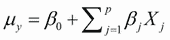
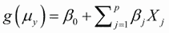
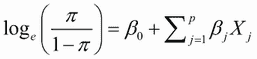
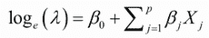
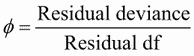
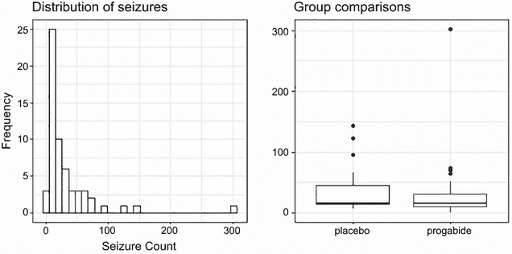
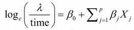

# 13 广义线性模型

本章涵盖

+   构建广义线性模型

+   预测分类结果

+   模型计数数据

在第八章（回归）和第九章（方差分析）中，我们探讨了可以用来从一组连续和/或分类预测变量预测正态分布响应变量的线性模型。但在许多情况下，假设因变量是正态分布的（甚至连续的）是不合理的。例如：

+   结果变量可能是分类的。二元变量（例如，是/否、通过/失败、活着/死去）和多分类变量（例如，差/好/优秀、共和党/民主党/独立）显然不是正态分布的。

+   结果变量可能是一个计数（例如，一周内发生的交通事故数量，每天饮酒的数量）。这样的变量只取有限数量的值，永远不会是负数。此外，它们的均值和方差通常相关（这对于正态分布变量来说是不成立的）。

*广义线性模型* 将线性模型框架扩展到包括明显非正态的因变量。

在本章中，我们将从广义线性模型和用于估计它们的 `glm()` 函数的简要概述开始。然后我们将关注该框架中两种流行的模型：*逻辑回归*（其中因变量是分类的）和*泊松回归*（其中因变量是计数变量）。

为了激发讨论，你将应用广义线性模型来解决两个标准线性模型难以解决的问题：

+   哪些个人、人口统计和关系变量可以预测婚外情？在这种情况下，结果变量是二元的（有外遇/无外遇）。

+   抗癫痫药物对在八周期间经历的癫痫发作次数有什么影响？在这种情况下，结果变量是一个计数（癫痫发作次数）。

你将应用逻辑回归来解决第一个问题，并使用泊松回归来解决第二个问题。在这个过程中，我们将考虑每种技术的扩展。

## 13.1 广义线性模型和 glm()函数

许多流行的数据分析方法都包含在广义线性模型的框架内。在本节中，我们将简要探讨这种方法的背后的一些理论。如果你愿意，可以安全地跳过这一节，稍后再回来。

假设你想建立一个响应变量 *Y* 与一组 *p* 个预测变量 *X*[1] ... *X[p]* 之间的关系模型。在标准线性模型中，你假设 *Y* 是正态分布的，并且关系的形式是



该方程表示反应变量的条件均值是预测变量的线性组合。*β*[j] 是指定 *X*[j] 单位变化时 *Y* 预期变化的参数，*β*[0] 是所有预测变量均为 0 时 *Y* 的预期值。你可以说，通过应用适当的权重到 *X* 变量并将它们相加，你可以预测具有给定 *X* 值的观察值的 *Y* 分布的均值。

注意，你没有对预测变量 *X*[j] 做出分布假设。与 *Y* 不同，没有要求它们必须是正态分布的。事实上，它们通常是分类的（例如，方差分析设计）。此外，允许预测变量的非线性函数。你经常将此类预测变量包括为 *X*² 或 *X*[1] × *X*[2]。重要的是，方程在参数（*β*[0]，*β*[1]，...，*β*[p]）上是线性的。

在广义线性模型中，你拟合形式为的模型



其中 *g*(*µ[Y]*) 是条件均值（称为 *连接函数*）的函数。此外，你放宽了 *Y* 是正态分布的假设。相反，你假设 *Y* 遵循指数族成员的分布。你指定连接函数和概率分布，并通过迭代最大似然估计过程推导出参数。

### 13.1.1 glm() 函数

广义线性模型通常通过 R 中的 `glm()` 函数进行拟合（尽管还有其他专门的函数可用）。该函数的形式类似于 `lm()`，但包含额外的参数。函数的基本格式如下

```
glm(*formula*, family=*family*(link=*function*), data=)
```

其中，概率分布（*`family`*）和相应的默认连接函数（*`function`*）在表 13.1 中给出。

表 13.1 `glm()` 参数

| Family | Default link function |
| --- | --- |
| `binomial` | `(link = "logit")` |
| `gaussian` | `(link = "identity")` |
| `gamma` | `(link = "inverse")` |
| `inverse.gaussian` | `(link = "1/mu²")` |
| `poisson` | `(link = "log")` |
| `quasi` | `(link = "identity", variance = "constant")` |
| `quasibinomial` | `(link = "logit")` |
| `quasipoisson` | `(link = "log")` |

`glm()` 函数允许你拟合多种流行的模型，包括逻辑回归、泊松回归和生存分析（此处未考虑）。你可以如下演示前两种模型。假设你有一个单一的反应变量（`Y`），三个预测变量（`X1,` `X2,` `X3`），以及包含数据的 `mydata` 数据框。

逻辑回归适用于反应变量为二分（0 或 1）的情况。模型假设 `Y` 遵循二项分布，并且你可以拟合形式为的线性模型



其中 *π* = *µ[Y]* 是 *Y* 的条件均值（即给定一组 *X* 值时 *Y* = 1 的概率），(*π*/1 – *π*) 是 *Y* = 1 的几率，log(*π*/1 – *π*) 是对数几率，或 *logit*。在这种情况下，log(*π*/1 – *π*) 是连接函数，概率分布是二项分布，逻辑回归模型可以使用

```
glm(Y~X1+X2+X3, family=binomial(link="logit"), data=mydata)
```

逻辑回归在 13.2 节中描述得更详细。

泊松回归适用于响应变量是在给定时间段内发生事件数量的情况。泊松回归模型假设 *Y* 符合泊松分布，并且可以拟合形式为的线性模型



中的相同结果，其中 *λ* 是 *Y* 的均值（和方差）。在这种情况下，连接函数是 *λ* 的对数，概率分布是泊松分布，泊松回归模型可以使用

```
glm(Y~X1+X2+X3, family=poisson(link="log"), data=mydata)
```

泊松回归在 13.3 节中描述。

值得注意的是，标准线性模型也是广义线性模型的一个特例。如果你让连接函数 *g*(*µ[Y]*) = *µ[Y]* 或恒等函数，并指定概率分布是正态分布（高斯分布），那么

```
glm(Y~X1+X2+X3, family=gaussian(link="identity"), data=mydata)
```

将产生与

```
lm(Y~X1+X2+X3, data=mydata)
```

总结来说，广义线性模型通过拟合条件均值响应的 *函数*（而不是条件均值响应）并假设响应变量遵循 *指数* 分布族（而不是仅限于正态分布）来扩展标准线性模型。参数估计是通过最大似然而不是最小二乘法得到的。

### 13.1.2 支持函数

当分析标准线性模型时，你与 `lm()` 一起使用的许多函数都有 `glm()` 的对应版本。表 13.2 给出了一些常用函数。

表 13.2 支持的 `glm()` 函数

| 函数 | 描述 |
| --- | --- |
| `summary()` | 显示拟合模型的详细结果 |
| `coefficients(), coef()` | 列出拟合模型的模型参数（截距和斜率） |
| `confint()` | 提供模型参数的置信区间（默认为 95%） |
| `residuals()` | 列出拟合模型的残差值 |
| `anova()` | 生成比较两个拟合模型的方差分析表 |
| `plot()` | 生成用于评估模型拟合的诊断图 |
| `predict()` | 使用拟合模型预测新数据集的响应值 |
| `deviance()` | 拟合模型的偏差 |
| `df.residual()` | 拟合模型的残差自由度 |

我们将在后面的章节中探讨这些函数的示例。在下一节中，我们将简要考虑模型充分性的评估。

### 13.1.3 模型拟合和回归诊断

模型充分性的评估对于广义线性模型和标准（OLS）线性模型同样重要。不幸的是，在统计界关于适当的评估程序上存在较少的共识。一般来说，你可以使用第八章中描述的技术，但要注意以下事项。

在评估模型充分性时，你通常会希望绘制以原始响应变量的度量单位表示的预测值与偏差类型残差的关系图。例如，一个常见的诊断图可以是

```
plot(predict(model, type="response"), 
    residuals(model, type= "deviance"))  
```

其中 `model` 是 `glm()` 函数返回的对象。

R 提供的帽子值、学生化残差和 Cook 的 D 统计量将是近似值。此外，在确定识别问题观察值的截止值上没有普遍共识。值必须相对判断。一种方法是为每个统计量创建索引图，并寻找异常大的值。例如，你可以使用以下代码创建三个诊断图：

```
plot(hatvalues(*model*))
plot(rstudent(*model*))
plot(cooks.distance(*model*))
```

或者，你可以使用以下代码

```
library(car)
influencePlot(*model*)
```

创建一个综合图。在后一个图中，水平轴是杠杆，垂直轴是学生化残差，绘制的符号与 Cook 距离成正比。

当响应变量具有许多值时，诊断图通常最有帮助。当响应变量只能取有限数量的值（例如，逻辑回归）时，这些图的效用会降低。

关于广义线性模型的回归诊断的更多信息，请参阅 Fox（2008）和 Faraway（2006）。在本章的其余部分，我们将详细考虑两种最流行的广义线性模型形式：逻辑回归和泊松回归。

## 13.2 逻辑回归

当你需要从一组连续和/或分类预测变量预测二元结果时，逻辑回归是有用的。为了演示这一点，让我们探索包含在`Affairs`数据框中的不忠数据，该数据框由`AER`包提供。在使用之前，请确保下载并安装该包（使用`install.packages("AER")`）。

不忠数据，被称为 Fair 的 Affairs，基于 1969 年由《心理学今天》进行的横断面调查，并在 Greene（2003）和 Fair（1978）中描述。它包含 9 个变量，收集于 601 名参与者，包括过去一年中受访者参与婚外性交的频率，以及他们的性别、年龄、结婚年限、是否有孩子、他们的宗教性（从 1 = 反对到 5 = 非常反对的 5 点量表），教育、职业（Hollingshead 7 点分类，反向编号）以及他们对婚姻的数值自我评价（从 1 = 非常不幸福到 5 = 非常幸福）。

让我们看看一些描述性统计：

```
> data(Affairs, package="AER")
> summary(Affairs)
    affairs          gender         age         yearsmarried    children 
 Min.   : 0.000   female:315   Min.   :17.50   Min.   : 0.125   no :171  
 1st Qu.: 0.000   male  :286   1st Qu.:27.00   1st Qu.: 4.000   yes:430  
 Median : 0.000                Median :32.00   Median : 7.000            
 Mean   : 1.456                Mean   :32.49   Mean   : 8.178            
 3rd Qu.: 0.000                3rd Qu.:37.00   3rd Qu.:15.000            
 Max.   :12.000                Max.   :57.00   Max.   :15.000            
 religiousness     education       occupation        rating     
 Min.   :1.000   Min.   : 9.00   Min.   :1.000   Min.   :1.000  
 1st Qu.:2.000   1st Qu.:14.00   1st Qu.:3.000   1st Qu.:3.000  
 Median :3.000   Median :16.00   Median :5.000   Median :4.000  
 Mean   :3.116   Mean   :16.17   Mean   :4.195   Mean   :3.932  
 3rd Qu.:4.000   3rd Qu.:18.00   3rd Qu.:6.000   3rd Qu.:5.000  
 Max.   :5.000   Max.   :20.00   Max.   :7.000   Max.   :5.000  

> table(Affairs$affairs)
  0   1   2   3   7  12 
451  34  17  19  42  38
```

从这些统计数据中，你可以看到，52%的受访者是女性，72%有孩子，样本的中位年龄为 32 岁。关于响应变量，75%的受访者表示在过去一年中没有不忠行为（451/601）。报告的邂逅次数最多的是 12 次（6%）。

虽然记录了不检点的*数量*，但你的兴趣在于二进制结果（是否出轨/没有出轨）。你可以使用以下代码将出轨转换为一个名为`ynaffair`的二分因素：

```
> Affairs$ynaffair <- ifelse(Affairs$affairs > 0, 1, 0) 
> Affairs$ynaffair <- factor(Affairs$ynaffair, 
                             levels=c(0,1), 
                             labels=c("No","Yes"))
> table(Affairs$ynaffair)
No Yes 
451 150
```

这个二分因素现在可以用作逻辑回归模型中的结果变量：

```
> fit.full <- glm(ynaffair ~ gender + age + yearsmarried + children + 
                  religiousness + education + occupation +rating,
                  data=Affairs, family=binomial())
> summary(fit.full)

Call:
glm(formula = ynaffair ~ gender + age + yearsmarried + children + 
    religiousness + education + occupation + rating, family = binomial(), 
    data = Affairs)

Deviance Residuals: 
   Min      1Q  Median      3Q     Max  
-1.571  -0.750  -0.569  -0.254   2.519  

Coefficients:
              Estimate Std. Error z value Pr(>|z|)    
(Intercept)     1.3773     0.8878    1.55  0.12081    
gendermale      0.2803     0.2391    1.17  0.24108    
age            -0.0443     0.0182   -2.43  0.01530 *  
yearsmarried    0.0948     0.0322    2.94  0.00326 ** 
childrenyes     0.3977     0.2915    1.36  0.17251    
religiousness  -0.3247     0.0898   -3.62  0.00030 ***
education       0.0211     0.0505    0.42  0.67685    
occupation      0.0309     0.0718    0.43  0.66663    
rating         -0.4685     0.0909   -5.15  2.6e-07 ***
---
Signif. codes:  0 '***' 0.001 '**' 0.01 '*' 0.05 '.' 0.1 ' ' 1 

(Dispersion parameter for binomial family taken to be 1)

    Null deviance: 675.38  on 600  degrees of freedom
Residual deviance: 609.51  on 592  degrees of freedom
AIC: 627.5

Number of Fisher Scoring iterations: 4
```

从回归系数的 p 值（最后一列）中，你可以看到性别、孩子是否存在、教育和职业可能对等式没有显著的贡献（你不能拒绝参数为 0 的假设）。让我们拟合一个没有它们的第二个等式，并测试这个简化模型是否与数据拟合得一样好：

```
> fit.reduced <- glm(ynaffair ~ age + yearsmarried + religiousness +
                     rating, data=Affairs, family=binomial())
> summary(fit.reduced)
Call:
glm(formula = ynaffair ~ age + yearsmarried + religiousness + rating, 
    family = binomial(), data = Affairs)

Deviance Residuals: 
   Min      1Q  Median      3Q     Max  
-1.628  -0.755  -0.570  -0.262   2.400  

Coefficients:
              Estimate Std. Error z value Pr(>|z|)    
(Intercept)     1.9308     0.6103    3.16  0.00156 ** 
age            -0.0353     0.0174   -2.03  0.04213 *  
yearsmarried    0.1006     0.0292    3.44  0.00057 ***
religiousness  -0.3290     0.0895   -3.68  0.00023 ***
rating         -0.4614     0.0888   -5.19  2.1e-07 ***
---
Signif. codes:  0 '***' 0.001 '**' 0.01 '*' 0.05 '.' 0.1 ' ' 1 

(Dispersion parameter for binomial family taken to be 1)

    Null deviance: 675.38  on 600  degrees of freedom
Residual deviance: 615.36  on 596  degrees of freedom
AIC: 625.4

Number of Fisher Scoring iterations: 4
```

简化模型中的每个回归系数都具有统计学意义（p < .05）。因为两个模型是嵌套的（`fit.reduced`是`fit.full`的子集），你可以使用`anova()`函数来比较它们。对于广义线性模型，你将想要一个卡方版本的这个测试：

```
> anova(fit.reduced, fit.full, test="Chisq")
Analysis of Deviance Table

Model 1: ynaffair ~ age + yearsmarried + religiousness + rating
Model 2: ynaffair ~ gender + age + yearsmarried + children + 
    religiousness + education + occupation + rating
  Resid. Df Resid. Dev Df Deviance P(>|Chi|)
1       596        615                      
2       592        610  4     5.85      0.21
```

非显著的卡方值（p = 0.21）表明，具有四个预测变量的简化模型与具有九个预测变量的完整模型拟合得一样好，这加强了你认为性别、孩子、教育和职业不会显著增加预测的信念，除了方程中的其他变量。因此，你可以基于这个更简单的模型进行解释。

### 13.2.1 解释模型参数

让我们看看回归系数：

```
> coef(fit.reduced)
  (Intercept)           age  yearsmarried religiousness        rating 
        1.931        -0.035         0.101        -0.329        -0.461
```

在逻辑回归中，被建模的响应是*Y* = 1 的对数几率。回归系数给出了预测变量单位变化时响应对数几率的改变，同时保持所有其他预测变量不变。

因为对数几率难以解释，你可以对它们进行指数化，以便将结果放在几率尺度上：

```
> exp(coef(fit.reduced))
  (Intercept)           age  yearsmarried religiousness        rating 
        6.895         0.965         1.106         0.720         0.630
```

现在，你可以看到，已婚年限增加一年，婚外邂逅的几率会增加 1.106 倍（保持年龄、宗教信仰和婚姻评级不变）。相反，每增加一年年龄，婚外情事的几率会乘以 0.965 倍。婚外情事的几率随着已婚年限的增加而增加，随着年龄、宗教信仰和婚姻评级的降低而减少。因为预测变量不能等于 0，所以截距在这种情况下没有意义。

如果需要，你可以使用`confint()`函数来获取系数的置信区间。例如，`exp(confint(fit.reduced))`将打印出每个系数在几率尺度上的 95%置信区间。

最后，预测变量中的一个单位的变化可能本身并不有趣。对于二元逻辑回归，当预测变量变化 *n* 个单位时，响应变量上更高值的几率变化为 exp*(β[j])^n*。如果结婚年限增加 1 年将婚外情的几率乘以 1.106，那么增加 10 年会将几率乘以 1.106¹⁰，即 2.7，保持其他预测变量不变。

### 13.2.2 评估预测变量对结果概率的影响

对于我们中的许多人来说，用概率而不是几率来思考更容易。你可以使用`predict()`函数来观察改变预测变量的水平对结果概率的影响。第一步是创建一个包含你感兴趣的预测变量值的一个人工数据集。然后你可以使用这个人工数据集与`predict()`函数一起预测这些值发生结果事件的概率。

让我们应用这个策略来评估婚姻评级对婚外情概率的影响。首先，创建一个人工数据集，其中年龄、结婚年限和宗教信仰设置为它们的平均值，婚姻评级从 1 到 5 变化：

```
> testdata <- data.frame(rating=c(1, 2, 3, 4, 5), age=mean(Affairs$age),
                         yearsmarried=mean(Affairs$yearsmarried),
                         religiousness=mean(Affairs$religiousness))
> testdata
  rating  age yearsmarried religiousness
1      1 32.5         8.18          3.12
2      2 32.5         8.18          3.12
3      3 32.5         8.18          3.12
4      4 32.5         8.18          3.12 
5      5 32.5         8.18          3.12
```

接下来，使用测试数据集和预测方程来获取概率：

```
> testdata$prob <- predict(fit.reduced, newdata=testdata, type="response")
  testdata
  rating  age yearsmarried religiousness  prob
1      1 32.5         8.18          3.12 0.530
2      2 32.5         8.18          3.12 0.416
3      3 32.5         8.18          3.12 0.310
4      4 32.5         8.18          3.12 0.220
5      5 32.5         8.18          3.12 0.151
```

从这些结果中，你可以看到，当婚姻被评为 1 = 非常不幸福时，婚外情的概率从 0.53 下降到当婚姻被评为 5 = 非常幸福时的 0.15（保持年龄、结婚年限和宗教信仰不变）。现在看看年龄的影响：

```
> testdata <- data.frame(rating=mean(Affairs$rating),
                         age=seq(17, 57, 10),                 
                         yearsmarried=mean(Affairs$yearsmarried),
                         religiousness=mean(Affairs$religiousness))
> testdata
  rating age yearsmarried religiousness
1   3.93  17         8.18          3.12
2   3.93  27         8.18          3.12
3   3.93  37         8.18          3.12
4   3.93  47         8.18          3.12
5   3.93  57         8.18          3.12

> testdata$prob <- predict(fit.reduced, newdata=testdata, type="response")
> testdata
  rating age yearsmarried religiousness    prob
1   3.93  17         8.18          3.12   0.335
2   3.93  27         8.18          3.12   0.262
3   3.93  37         8.18          3.12   0.199
4   3.93  47         8.18          3.12   0.149
5   3.93  57         8.18          3.12   0.109
```

在这里，你可以看到，随着年龄从 17 岁增加到 57 岁，婚外遇的概率从 0.34 下降到 0.11，保持其他变量不变。使用这种方法，你可以探索每个预测变量对结果的影响。

### 13.2.3 过度离散

从二项分布中抽取数据的预期方差为 *σ*² = *n**π*(1 − *π*)，其中 *n* 是观测数的数量，*π* 是属于 *Y* = 1 组的概率。*过度离散*发生在响应变量的观察方差大于从二项分布中预期的方差。过度离散可能导致测试标准误差扭曲和显著性测试不准确。

当存在过度离散时，你仍然可以使用`glm()`函数拟合逻辑回归，但在这个情况下，你应该使用准二项分布而不是二项分布。

检测过度离散的一种方法是将二项模型的残差偏差与残差自由度进行比较。如果这个比率



比较大于 1，你有过度离散的证据。应用这个方法到“婚外情”的例子中，你有

```
> deviance(fit.reduced)/df.residual(fit.reduced)
[1] 1.032
```

这接近于 1，表明没有过度离散。

您还可以测试过度离散。为此，您需要拟合模型两次，但在第一次拟合中，您使用`family="binomial"`，在第二次拟合中，您使用`family="quasibinomial"`。如果第一次情况中返回的`glm()`对象称为`fit`，而第二次情况中返回的对象称为`fit.od`，那么

```
pchisq(summary(fit.od)$dispersion * fit$df.residual,  
       fit$df.residual, lower = F)
```

提供了检验零假设 *H*[0]: φ = 1 与备择假设 *H*[1]: φ ≠ 1 的 p 值。如果 *p* 值较小（例如，小于 0.05），则拒绝零假设。

将此应用于`Affairs`数据集，您有

```
> fit <- glm(ynaffair ~ age + yearsmarried + religiousness + 
             rating, family = binomial(), data = Affairs)
> fit.od <- glm(ynaffair ~ age + yearsmarried + religiousness +
                rating, family = quasibinomial(), data = Affairs)
> pchisq(summary(fit.od)$dispersion * fit$df.residual,  
         fit$df.residual, lower = F)

[1] 0.34
```

得到的 p 值（0.34）显然不显著（p > 0.05），这加强了您对过度离散不是问题的信念。当我们讨论 Poisson 回归时，我们将回到过度离散的问题。

### 13.2.4 扩展

R 中提供了几个逻辑回归扩展和变体：

+   *稳健逻辑回归*——`robustbase`包中的`glmRob()`函数可以用来拟合稳健广义线性模型，包括稳健逻辑回归。当拟合包含异常值和有影响力的观察值的逻辑回归模型时，稳健逻辑回归可能很有帮助。

+   *多项逻辑回归*——如果响应变量有超过两个无序类别（例如，已婚/丧偶/离婚），您可以使用`mlogit`包中的`mlogit()`函数拟合多项逻辑回归。或者，您可以使用`nnet`包中的`multinom()`函数。

+   *有序逻辑回归*——如果响应变量是一组有序类别（例如，信用风险为差/好/优秀），您可以使用`MASS`包中的`polyr()`函数拟合有序逻辑回归。

能够用多个类别（有序和无序）建模响应变量是一个重要的扩展，但它以更大的解释复杂性为代价。在这些情况下评估模型拟合和回归诊断也将更加复杂。

在`Affairs`示例中，婚外联系的数量被二分化为是/否响应变量，因为我们的兴趣集中在受访者过去一年是否有婚外情。如果我们对数量——过去一年的遭遇次数——感兴趣，我们会直接分析计数数据。分析计数数据的一种流行方法是 Poisson 回归，这是我们接下来要讨论的主题。

## 13.3 Poisson 回归

Poisson 回归在预测由一组连续和/或分类预测变量表示的计数结果变量时非常有用。Coxe、West 和 Aiken（2009）提供了一个全面且易于理解的 Poisson 回归介绍。

为了说明泊松回归模型的拟合以及分析中可能出现的一些问题，我们将使用`robustbase`包中提供的 Breslow 癫痫数据（Breslow，1993）。具体来说，我们将考虑抗癫痫药物治疗对治疗开始后八周内发生的癫痫发作次数的影响。在继续之前，请确保已安装`robustbase`包。

在随机分配到药物或安慰剂条件之前和之后，对患有简单或复杂部分性癫痫的患者在八周期间内报告的年龄和癫痫发作次数进行了收集。`Ysum`（随机化后八周期间的癫痫发作次数）是响应变量。治疗条件（`Trt`）、年龄（`Age`）和基线八周期间报告的癫痫发作次数（`Base`）是预测变量。基线癫痫发作次数和年龄包括在内，因为它们可能对响应变量有影响。我们感兴趣的是，在考虑这些协变量后，是否存在药物治疗减少癫痫发作的证据。

首先，让我们看看数据集的摘要统计：

```
> data(epilepsy, package="robustbase")
> names(epilepsy)
 [1] "ID"    "Y1"    "Y2"    "Y3"    "Y4"    "Base"  "Age"   "Trt"   "Ysum" 
[10] "Age10" "Base4"

> summary(breslow.dat[6:9])
      Base            Age              Trt          Ysum      
 Min.   :  6.0   Min.   :18.0   placebo  :28   Min.   :  0.0  
 1st Qu.: 12.0   1st Qu.:23.0   progabide:31   1st Qu.: 11.5  
 Median : 22.0   Median :28.0                  Median : 16.0  
 Mean   : 31.2   Mean   :28.3                  Mean   : 33.1  
 3rd Qu.: 41.0   3rd Qu.:32.0                  3rd Qu.: 36.0  
 Max.   :151.0   Max.   :42.0                  Max.   :302.0  
```

注意，尽管数据集中有 11 个变量，但我们只关注前面描述的 4 个变量。基线和随机化后的癫痫发作次数都高度偏斜。让我们更详细地看看响应变量。以下代码生成了图 13.1 中的图形：

```
library(ggplot2)
   ggplot(epilepsy, aes(x=Ysum)) +
  geom_histogram(color="black", fill="white") + 
  labs(title="Distribution of seizures", 
       x="Seizure Count",
       y="Frequency") + 
  theme_bw()
ggplot(epilepsy, aes(x=Trt, y=Ysum)) +
  geom_boxplot() + 
  labs(title="Group comparisons", x="", y="") + 
  theme_bw()
```



图 13.1 治疗后癫痫发作次数的分布（来源：Breslow 癫痫数据）

你可以清楚地看到因变量的偏斜性质和可能存在的异常值。乍一看，药物条件下的癫痫发作次数似乎较少，方差也较小。（你可能会期望泊松分布的数据伴随较小的均值会有较小的方差。）与标准 OLS 回归不同，这种方差的异质性在泊松回归中不是问题。

下一步是拟合泊松回归：

```
> fit <- glm(Ysum ~ Base + Age + Trt, data=epilepsy, family=poisson())
> summary(fit)

Call:
glm(formula = Ysum ~ Base + Age + Trt, family = poisson(), data = epilepsy)

Deviance Residuals: 
   Min      1Q  Median      3Q     Max  
-6.057  -2.043  -0.940   0.793  11.006  

Coefficients:
              Estimate Std. Error z value Pr(>|z|)    
(Intercept)   1.948826   0.135619   14.37  < 2e-16 ***
Base          0.022652   0.000509   44.48  < 2e-16 ***
Age           0.022740   0.004024    5.65  1.6e-08 ***
Trtprogabide -0.152701   0.047805   -3.19   0.0014 ** 
---
Signif. codes:  0 '***' 0.001 '**' 0.01 '*' 0.05 '.' 0.1 ' ' 1 

(Dispersion parameter for poisson family taken to be 1)

    Null deviance: 2122.73  on 58  degrees of freedom
Residual deviance:  559.44  on 55  degrees of freedom
AIC: 850.7

Number of Fisher Scoring iterations: 5
```

输出提供了偏差、回归参数、标准误差以及这些参数是否为 0 的检验。请注意，每个预测变量在*p* < 0.05 的水平上都是显著的。

### 13.3.1 解释模型参数

模型系数是通过`coef()`函数获得的，或者在`summary()`函数输出中的`系数`表中查看：

```
> coef(fit)
 (Intercept)         Base          Age Trtprogabide 
      1.9488       0.0227       0.0227      -0.1527 
```

在泊松回归中，被建模的因变量是条件均值对数 log*e*。`Age` 的回归参数 0.0227 表示，在基线癫痫发作和治疗条件不变的情况下，年龄每增加一年，对数平均癫痫发作次数增加 0.02。截距是当每个预测变量等于 0 时的对数平均癫痫发作次数。由于年龄不能为零，且所有参与者基线癫痫发作次数都不是零，因此在这种情况下截距没有意义。

通常，在因变量的原始尺度（癫痫发作次数，而不是对数癫痫发作次数）上解释回归系数要容易得多。为了完成这个任务，需要将系数进行指数化：

```
> exp(coef(fit))
 (Intercept)         Base          Age Trtprogabide 
       7.020        1.023        1.023        0.858 
```

现在，你可以看到，在保持其他变量不变的情况下，年龄每增加一年会将预期癫痫发作次数乘以 1.023。这意味着年龄增加与癫痫发作次数增加有关。更重要的是，`Trt`（即从安慰剂转换为普瑞巴林）的每单位变化将预期癫痫发作次数乘以 0.86。在保持基线癫痫发作次数和年龄不变的情况下，你预计药物组与安慰剂组相比，癫痫发作次数将减少 14%（即，1-0.86）。

重要的是要记住，与逻辑回归中的指数化参数一样，泊松模型中的指数化参数对响应变量有乘法效应，而不是加法效应。此外，与逻辑回归一样，你必须评估你的模型是否存在过度离散。

### 13.3.2 过度离散

在泊松分布中，方差和均值是相等的。当响应变量的观测方差大于泊松分布预测的方差时，泊松回归中就会发生过度离散。由于在处理计数数据时经常遇到过度离散，并且可能会对结果的解释产生负面影响，我们将花一些时间来讨论它。

过度离散可能发生的原因有几个（Coxe 等人，2009 年）：

+   忽略一个重要的预测变量可能导致过度离散。

+   过度离散也可能由称为 *状态依赖性* 的现象引起。在观测值中，假设计数中的每个事件都是独立的。对于癫痫数据，这意味着对于任何患者，癫痫发作的概率与其他癫痫发作的概率是独立的。但这种假设通常是不成立的。对于一个给定个体，第一次癫痫发作的概率不太可能与已经发作了 39 次的 40 次癫痫发作的概率相同。

+   在纵向研究中，过度离散可能由重复测量数据中固有的聚类引起。我们在这里不会讨论纵向泊松模型。

如果存在过度离散，而你又没有在模型中考虑它，你将得到标准误差和置信区间太小，显著性检验太宽松（也就是说，你会发现实际上并不存在的影响）。

与逻辑回归一样，如果残差偏差与残差自由度的比率远大于 1，则表明存在过度离散。对于癫痫数据，这个比率是

```
> deviance(fit)/df.residual(fit)
[1] 10.17
```

这显然远大于 1。

`qcc`包提供了泊松情况下的过度离散测试。（务必在首次使用前下载并安装此包。）你可以使用以下代码对癫痫数据进行过度离散测试：

```
> library(qcc)
> qcc.overdispersion.test(breslow.dat$sumY, type="poisson")
Overdispersion test Obs.Var/Theor.Var Statistic p-value
       poisson data              62.9      3646       0
```

毫不奇怪，显著性检验的 p 值小于 0.05，强烈表明存在过度离散。

你仍然可以使用`glm()`函数拟合数据模型，只需将`family="poisson"`替换为`family="quasipoisson"`。这样做与存在过度离散时的逻辑回归方法类似：

```
> fit.od <- glm(sumY ~ Base + Age + Trt, data=breslow.dat,
                family=quasipoisson())
> summary(fit.od)

Call:
glm(formula = sumY ~ Base + Age + Trt, family = quasipoisson(), 
    data = breslow.dat)

Deviance Residuals: 
   Min      1Q  Median      3Q     Max  
-6.057  -2.043  -0.940   0.793  11.006  

Coefficients:
             Estimate Std. Error t value Pr(>|t|)    
(Intercept)   1.94883    0.46509    4.19  0.00010 ***
Base          0.02265    0.00175   12.97  < 2e-16 ***
Age           0.02274    0.01380    1.65  0.10509    
Trtprogabide -0.15270    0.16394   -0.93  0.35570    
---
Signif. codes:  0 '***' 0.001 '**' 0.01 '*' 0.05 '.' 0.1 ' ' 1 

(Dispersion parameter for quasipoisson family taken to be 11.8)

    Null deviance: 2122.73  on 58  degrees of freedom
Residual deviance:  559.44  on 55  degrees of freedom
AIC: NA

Number of Fisher Scoring iterations: 5
```

注意，准泊松方法中的参数估计与泊松方法产生的估计相同，但标准误差要大得多。在这种情况下，较大的标准误差导致了`Trt`（和`Age`）的 p 值大于 0.05。当你考虑过度离散时，没有足够的证据表明药物方案在控制基线癫痫发作率和年龄后能比接受安慰剂减少癫痫发作次数。

请记住，这个例子仅用于演示目的。结果不应被用来推断关于 progabide 在现实世界中的有效性的任何内容。我不是医生——至少不是医学医生——我甚至不在电视上扮演医生。

我们将通过对一些重要变体和扩展的讨论来结束对泊松回归的探索。

### 13.3.3 扩展

R 为基本的泊松回归模型提供了几个有用的扩展，包括允许变化时间段的模型、纠正过多零值的模型以及当数据包括异常值和有影响力的观测值时有用的稳健模型。我将分别描述每个。

带有不同时间段的泊松回归

我们对泊松回归的讨论仅限于测量固定时间段内计数的响应变量（例如，八周期间的癫痫发作次数，过去一年的交通事故次数，或一天内的亲社会行为次数）。时间长度在观测值之间是恒定的。但你可以拟合泊松回归模型，允许每个观测值的时间段变化。在这种情况下，结果变量是一个比率。

要分析比率，你必须包括一个变量（例如，时间），该变量记录每个观测值计数发生的时间长度。然后你将模型从


到



或者，等价地，


为了拟合这个新模型，你需要在`glm()`函数中使用`offset`选项。例如，假设在 Breslow 研究中，患者在随机分组后参与的时间从 14 天到 60 天不等。你可以使用癫痫发作的频率作为因变量（假设你已经记录了每个患者的天数），并拟合以下模型

```
fit <- glm(Ysum ~ Base + Age + Trt, data=epilepsy, 
           offset= log(time), family=poisson)
```

其中`Ysum`是患者在研究期间随机分组后发生的癫痫发作次数。在这种情况下，你假设这种频率不会随时间变化（例如，4 天发生 2 次癫痫发作等同于 20 天发生 10 次癫痫发作）。

零膨胀泊松回归

有时，数据集中零计数的数量大于泊松模型预测的数量。这可能发生在人口中有一个永远不会参与所计数行为的子群体时。例如，在逻辑回归部分中描述的`Affairs`数据集中，原始结果变量（婚外情）计算了参与者过去一年中经历的婚外性交次数。很可能有一个忠诚的婚姻伴侣群体，无论研究的时间长短，他们都不会有婚外情。这些被称为*结构零*（主要是由该群体中的摇摆者）。

在这种情况下，你可以使用一种称为*零膨胀泊松回归*的方法来分析数据，该方法同时拟合两个模型——一个预测谁会或不会出轨，另一个预测如果排除了始终忠诚的人，参与者会有多少次出轨。想象一下，这是一个结合了逻辑回归（用于预测结构零）和泊松回归模型（预测非结构零的观察值的计数）的模型。零膨胀泊松回归可以使用`pscl`包中的`zeroinfl()`函数进行拟合。

稳健泊松回归

最后，`robustbase`包中的`glmRob()`函数可以用来拟合稳健的广义线性模型，包括稳健的泊松回归。如前所述，这在存在异常值和有影响力的观察值时可能很有帮助。

进一步探讨

广义线性模型是一个复杂且数学上复杂的主题，但有许多优秀的资源可以帮助你了解它们。关于这个主题的一个很好的简短介绍是 Dunteman 和 Ho（2006）。关于广义线性模型的经典（和高级）文本由 McCullagh 和 Nelder（1989）提供。Dobson 和 Barnett（2008）以及 Fox（2008）提供了全面且易于理解的表达。Faraway（2006）和 Fox（2002）在 R 的背景下提供了出色的介绍。

## 摘要

+   广义线性模型允许你分析决定性非正态的响应变量，包括分类结果和离散计数。

+   当分析具有二分（是/否）结果的调查时，可以使用逻辑回归。

+   Poisson 回归可用于分析当结果以计数或比率进行测量时的研究。

+   与第八章中描述的线性模型相比，回归诊断在广义线性模型中可能更困难。特别是，你应该评估逻辑回归和 Poisson 回归模型是否存在过度分散。如果发现过度分散，在拟合模型时考虑使用如准二项分布或准泊松分布等其他误差分布。
