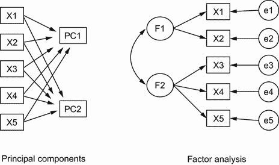
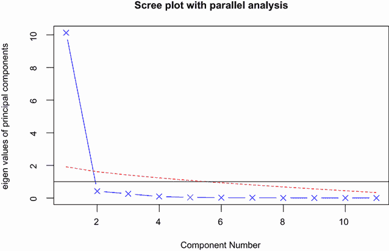
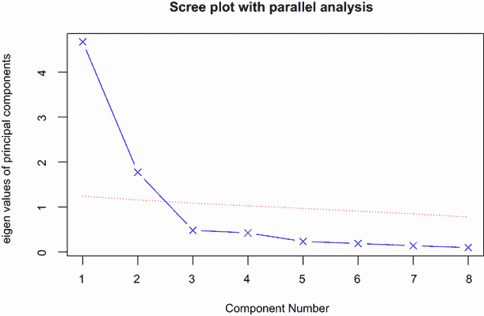
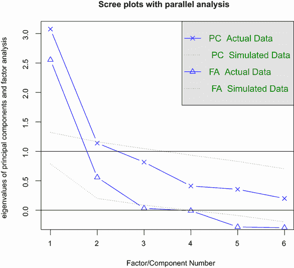
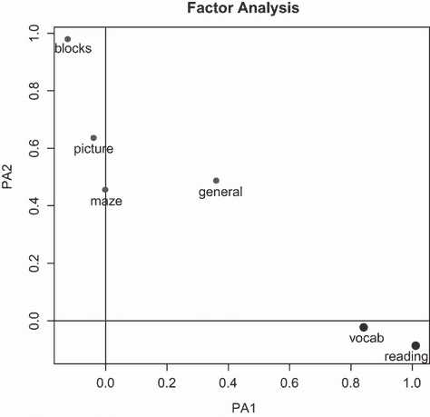
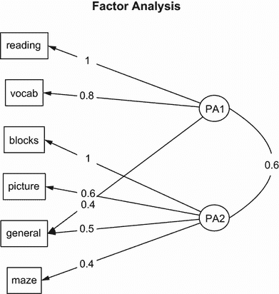

# 14 主成分分析与因子分析

本章涵盖

+   主成分分析

+   探索性因子分析

+   理解其他潜在变量模型

多变量数据中最具挑战性的方面之一是信息的纯粹复杂性。如果你有一个包含 100 个变量的数据集，你如何理解所有存在的相互关系？即使有 20 个变量，当你试图理解各个变量之间的关系时，也需要考虑 190 对相关系数。探索和简化复杂多变量数据的两种相关但不同的方法是主成分分析和探索性因子分析。

*主成分分析 (PCA)* 是一种数据降维技术，它将大量相关变量转换成一组较小的、不相关的变量，称为 *主成分*。例如，你可能使用 PCA 将 30 个相关（可能冗余）的环境变量转换成 5 个不相关的综合变量，尽可能保留原始变量集中的信息。

相比之下，*探索性因子分析 (EFA)* 是一套旨在揭示给定变量集中潜在结构的方法。它寻找一组较小的潜在或 *潜在* 变量，这些变量可以解释观测或 *显性* 变量之间的关系。例如，数据集 `Harman74.cor` 包含了 145 名七年级和八年级儿童接受的 24 项心理测试之间的相关性。如果你对这份数据应用 EFA，结果建议 276 个测试相关性可以由儿童在 4 个潜在因素（语言能力、处理速度、推理和记忆）上的能力来解释。这 24 项心理测试是观测或显性变量，而四个潜在因素或潜在变量是从这些观测变量的相关性中推导出来的。

图 14.1 展示了 PCA 和 EFA 模型的差异。主成分（PC1 和 PC2）是观测变量（X1 到 X5）的线性组合。用于形成线性组合的权重被选择以最大化每个主成分所解释的方差，同时保持这些成分不相关。



图 14.1 比较主成分分析和因子分析模型。图示显示了观测变量（X1 到 X5）、主成分（PC1、PC2）、因子（F1、F2）和误差（e1 到 e5）。

相反，因素（F1 和 F2）被认为是观察变量的基础或“原因”，而不是它们的线性组合。误差（e1 到 e5）代表由因素未解释的观察变量的方差。圆圈表示因素和误差不是直接可观察的，而是从变量之间的相关性中推断出来的。在这个例子中，因素之间的弯曲箭头表示它们是相关的。在 EFA 模型中，相关因素是常见的，但不是必需的。

本章中描述的方法需要大量样本以推导出稳定的解。构成适当样本大小的问题有些复杂。直到最近，分析师使用诸如“因子分析需要比变量多 5-10 倍的主题”之类的经验法则。最近的研究表明，所需的样本大小取决于因素的个数、与每个因素相关的变量的个数以及因素集如何解释变量的方差（Bandalos 和 Boehm-Kaufman，2009）。我敢说，如果你有几百个观测值，你可能是安全的。在本章中，我们将研究人工小问题，以保持输出（和页数）可管理。

我们将首先回顾 R 中可用于执行 PCA 或 EFA 的函数，并简要概述涉及步骤。然后我们将仔细研究两个 PCA 示例，接着是一个扩展的 EFA 示例。本章末尾提供了 R 中可用于拟合潜在变量模型的其它包的简要概述。这次讨论包括用于验证性因子分析、结构方程建模、对应分析和潜在类别分析的包。

## 14.1 R 中的主成分分析和因子分析

在 R 的基础安装中，PCA 和 EFA 的函数分别是`princomp()`和`factanal()`。在本章中，我们将关注`psych`包中提供的函数。它们提供了比基础版本更多的有用选项。此外，结果将以社会科学家更熟悉的度量标准报告，更有可能与其他统计软件包（如 SAS 和 IBM SPSS）中相应程序提供的输出相匹配。

表 14.1 列出了与`psych`包最相关的函数。在尝试本章中的示例之前，请务必安装该包。

表 14.1 `psych`包中有用的因子分析函数

| 函数 | 描述 |
| --- | --- |
| `principal()` | 带有可选旋转的主成分分析 |
| `fa()` | 通过主轴、最小残差、加权最小二乘或最大似然进行因子分析 |
| `fa.parallel()` | 平行分析的光谱图 |
| `factor.plot()` | 绘制因子或主成分分析的结果 |
| `fa.diagram()` | 绘制因素或主成分加载矩阵的图形 |
| `scree``()` | 因子和主成分分析的 Scree 图 |

EFA（以及在一定程度上 PCA）对于新用户来说常常令人困惑，因为它们描述了广泛的方法，每种方法都需要几个步骤（和决策）才能达到最终结果。最常见的步骤如下：

1.  准备数据。PCA 和 EFA 都是从观测变量之间的相关性中推导出它们的解。你可以将原始数据矩阵或相关矩阵输入到 `principal``()` 和 `fa()` 函数中。如果输入原始数据，相关矩阵将自动计算。在继续之前，务必筛选数据中的缺失值。默认情况下，`psych` 包在计算相关性时使用成对删除。

1.  选择一个因子模型。决定 PCA（数据降维）或 EFA（揭示潜在结构）更适合你的研究目标。如果你选择 EFA 方法，你还需要选择一个特定的因子方法（例如，最大似然法）。

1.  决定提取多少个成分/因子。

1.  提取成分/因子。

1.  旋转成分/因子。

1.  解释结果。

1.  计算成分或因子得分。

在本章的剩余部分，我们将仔细考虑每个步骤，从 PCA 开始。在本章末尾，你将找到 PCA/EFA 可能步骤的详细流程图（图 14.7）。一旦你阅读了中间的材料，这张图将更有意义。

## 14.2 主成分

PCA 的目标是用尽可能多的信息替换大量相关变量，同时用更少的无关变量。这些派生变量，称为 *主成分*，是观测变量的线性组合。具体来说，第一个主成分

*PC*[1] = *a*[1]*X*[1] + *a*[2]*X*[2] + ...+ *a[k] X[k]*

是 k 个观测变量的加权组合，它解释了原始变量集中最大的方差。第二个主成分是在约束条件下解释原始变量最大方差的最小组合，即它与第一个主成分 *正交*（不相关）。每个后续成分都最大化解释的方差量，同时保持与所有先前成分的不相关性。从理论上讲，你可以提取与变量数量一样多的主成分。但从实际观点来看，你希望可以用一个更小的成分集来近似整个变量集。让我们看一个简单的例子。

数据集 `USJudgeRatings` 包含了美国州高级法院法官的律师评级。数据框包含 43 个观测值和 12 个数值变量。表 14.2 列出了这些变量。

表 14.2 `USJudgeRatings` 数据集中的变量

| 变量 | 描述 | 变量 | 描述 |
| --- | --- | --- | --- |
| `CONT` | 律师与法官的接触次数 | `PREP` | 诉讼准备 |
| `INTG` | 司法诚信 | `FAMI` | 熟悉法律 |
| `DMNR` | 行为 | `ORAL` | 声音良好的口头裁决 |
| `DILG` | 勤奋 | `WRIT` | 声音良好的书面裁决 |
| `CFMG` | 案件流程管理 | `PHYS` | 体能 |
| `DECI` | 快速决策 | `RTEN` | 值得保留 |

从实际的角度来看，你能用更少的组合变量来总结 11 个评估评分（从`INTG`到`RTEN`）吗？如果是这样，你需要多少个，它们将如何定义？因为目标是简化数据，所以你会使用 PCA 来解决这个问题。数据是原始分数格式，没有缺失值。因此，你的下一步是决定你需要多少个主成分。

### 14.2.1 选择提取成分的数量

在决定在主成分分析（PCA）中保留多少个成分时，有几个标准可供选择。它们包括

+   根据先前经验和理论确定成分数量

+   选择需要解释变量中某些阈值累积方差数量的成分数量（例如，80%）

+   通过检查变量之间的`k` × `k`相关矩阵的特征值来选择保留成分的数量

最常见的方法是基于特征值。每个成分都与相关矩阵的特征值相关联。第一个主成分与最大的特征值相关联，第二个主成分与第二大的特征值相关联，依此类推。*凯撒-哈里斯标准*建议保留特征值大于 1 的成分。特征值小于 1 的成分解释的方差少于单个变量所包含的方差。在*卡特尔斯克皮尔测试*中，特征值与它们的成分编号相对应。此类图通常显示一个弯曲或肘部，并且保留此尖锐断裂点以上的成分。最后，你可以运行模拟，从与原始矩阵大小相同的随机数据矩阵中提取特征值。如果一个基于真实数据的特征值大于一组随机数据矩阵中相应平均特征值，则保留该成分。这种方法称为*平行分析*（参见 Hayton, Allen, 和 Scarpello，2004 年，以获取更多详细信息）。

你可以通过`fa.parallel()`函数同时评估所有三个特征值标准。对于 11 个评分（不包括`CONT`变量），必要的代码如下：

```
library(psych)
fa.parallel(USJudgeRatings[,-1], fa="pc", n.iter=100, 
            show.legend=FALSE, main="Scree plot with parallel analysis")
abline(h=1)
```

此代码生成了图 14.2 所示的图形。该图显示了基于观察到的特征值的斯克皮尔测试（以直线段和 x 表示），从 100 个随机数据矩阵中推导出的平均特征值（以虚线表示），以及大于 1 的特征值标准（以 y = 1 的水平线表示）。使用`abline()`函数在 y = 1 处添加水平线。



图 14.2 评估保留`USJudgeRatings`示例中主成分的数量。折线图（带 x 的线）、大于 1 的特征值标准（水平线）和 100 次模拟的平行分析（虚线）表明应保留单个成分。

所有三个标准都表明，单个成分适合总结这个数据集。你的下一步是使用`principal()`函数提取主成分。

### 14.2.2 提取主成分

如前所述，`principal()`函数从原始数据矩阵或相关矩阵开始执行主成分分析。其格式为

```
principal(*r*, nfactors=, rotate=, scores=)
```

其中

+   `r`是一个相关矩阵或原始数据矩阵。

+   `nfactors`指定要提取的主成分数量（默认为 1）。

+   `rotate`表示要应用的旋转（默认为 varimax；见 14.2.3 节）。

+   `scores`指定是否计算主成分得分（默认为 false）。

要提取第一个主成分，你可以使用以下列表中的代码。

列表 14.1 `USJudgeRatings`的主成分分析

```
> library(psych)
> pc <- principal(USJudgeRatings[,-1], nfactors=1)
> pc

Principal Components Analysis
Call: principal(r = USJudgeRatings[, -1], nfactors=1)
Standardized loadings based upon correlation matrix
      PC1   h2    u2
INTG 0.92 0.84 0.157
DMNR 0.91 0.83 0.166
DILG 0.97 0.94 0.061
CFMG 0.96 0.93 0.072
DECI 0.96 0.92 0.076
PREP 0.98 0.97 0.030
FAMI 0.98 0.95 0.047
ORAL 1.00 0.99 0.009
WRIT 0.99 0.98 0.020
PHYS 0.89 0.80 0.201
RTEN 0.99 0.97 0.028

                 PC1
SS loadings    10.13
Proportion Var  0.92
[... additional output omitted ...]
```

在这里，你正在输入不带`CONT`变量的原始数据，并指定应提取一个未旋转的成分。（旋转在 14.3.3 节中解释。）因为 PCA 是在相关矩阵上进行的，所以在提取成分之前，原始数据会自动转换为相关矩阵。

标有 PC1 的列包含成分的*载荷*，即观察变量与主成分（s）的相关性。如果你提取了多个主成分，则会有 PC2、PC3 等列。成分载荷用于解释成分的意义。你可以看到每个变量都与第一个成分（PC1）高度相关。因此，它似乎是一个一般评估维度。

标有 h2 的列包含成分的*共同性*——每个变量由成分解释的方差量。u2 列包含成分的独特性——未由成分解释的方差量（或 1 – h2）。例如，物理能力（`PHYS`）评分的 80%的方差由第一个主成分解释，而 20%则不是。`PHYS`是单个成分解决方案表示最差的变量。

标有 SS Loadings 的行包含与成分相关的特征值。特征值是与特定成分相关的标准化方差（在这种情况下，第一个成分的值为`10`）。最后，标有 Proportion Var 的行表示每个成分解释的方差量。在这里，你可以看到第一个主成分解释了 11 个变量中的 92%的方差。

让我们考虑第二个例子，这个例子导致解决方案包含多个主成分。数据集`Harman23.cor`包含 305 名女孩的八个身体测量数据。在这种情况下，数据集由变量之间的相关性组成，而不是原始数据（见表 14.3）。

表 14.3 305 名女孩的身体测量之间的相关性（`Harman23.cor`）

|  | 身高 | 臂展 | 前臂 | 下肢 | 体重 | 比特罗直径 | 胸围 | 胸围宽度 |
| --- | --- | --- | --- | --- | --- | --- | --- | --- |
| 身高 | 1.00 | 0.85 | 0.80 | 0.86 | 0.47 | 0.40 | 0.30 | 0.38 |
| 臂展 | 0.85 | 1.00 | 0.88 | 0.83 | 0.38 | 0.33 | 0.28 | 0.41 |
| 前臂 | 0.80 | 0.88 | 1.00 | 0.80 | 0.38 | 0.32 | 0.24 | 0.34 |
| 下肢 | 0.86 | 0.83 | 0.8 | 1.00 | 0.44 | 0.33 | 0.33 | 0.36 |
| 体重 | 0.47 | 0.38 | 0.38 | 0.44 | 1.00 | 0.76 | 0.73 | 0.63 |
| 比特罗直径 | 0.40 | 0.33 | 0.32 | 0.33 | 0.76 | 1.00 | 0.58 | 0.58 |
| 胸围 | 0.30 | 0.28 | 0.24 | 0.33 | 0.73 | 0.58 | 1.00 | 0.54 |
| 胸围 | 0.38 | 0.41 | 0.34 | 0.36 | 0.63 | 0.58 | 0.54 | 1.00 |
| 来源：H. H. Harman，《现代因子分析》，第三版修订版（芝加哥大学出版社，1976 年），表 2.3。 |

再次，你希望用更少的派生变量替换原始的物理测量。你可以使用以下代码确定要提取的成分数量。在这种情况下，你需要识别相关矩阵（`Harman23.cor`对象的`cov`组件）并指定样本大小（`n.obs`）：

```
library(psych)
fa.parallel(Harman23.cor$cov, n.obs=302, fa="pc", n.iter=100,
            show.legend=FALSE, main="Scree plot with parallel analysis")
abline(h=1)
```

图 14.3 显示了结果图。



图 14.3 评估保留身体测量示例的主成分数量。斯克里普图（带有 x 的线条）、特征值大于 1 的标准（水平线）以及与 100 次模拟的平行分析（虚线）表明应保留两个成分。

从图中可以看出，建议使用两个成分的解决方案。与第一个例子一样，凯撒-哈里斯标准、斯克里普测试和平行分析意见一致。这并不总是如此，你可能需要提取不同数量的成分，并选择看起来最有用的解决方案。下一个列表从相关矩阵中提取了前两个主成分。

列表 14.2 身体测量的主成分分析

```
> library(psych)
> pc <- principal(Harman23.cor$cov, nfactors=2, rotate="none")
> pc

Principal Components Analysis
Call: principal(r = Harman23.cor$cov, nfactors = 2, rotate = "none")
Standardized loadings based upon correlation matrix
                PC1   PC2   h2    u2
height         0.86 -0.37 0.88 0.123
arm.span       0.84 -0.44 0.90 0.097
forearm        0.81 -0.46 0.87 0.128
lower.leg      0.84 -0.40 0.86 0.139
weight         0.76  0.52 0.85 0.150
bitro.diameter 0.67  0.53 0.74 0.261
chest.girth    0.62  0.58 0.72 0.283
chest.width    0.67  0.42 0.62 0.375

                PC1  PC2
SS loadings    4.67 1.77
Proportion Var 0.58 0.22
Cumulative Var 0.58 0.81

[... additional output omitted ...]
```

如果你检查列表 14.2 中的 PC1 和 PC2 列，你会看到第一个成分解释了物理测量中 58%的方差，而第二个成分解释了 22%。这两个成分共同解释了 81%的方差。这两个成分共同解释了身高变量中 88%的方差。

通过检查载荷来解释成分和因子。第一个成分与每个物理测量值呈正相关，看起来是一个一般的大小因子。第二个成分对比前四个变量（身高、臂展、前臂和下肢），与后四个变量（体重、比特直径、胸围和胸宽）。因此，它似乎是一个长度与体积的因子。从概念上讲，这不是一个容易处理的构造。每当提取了两个或更多成分时，你可以旋转解决方案以使其更易于解释。这是我们接下来要讨论的主题。

### 14.2.3 旋转主成分

*旋转*是一组数学技术，用于将成分载荷矩阵转换为一个更易于解释的矩阵。它们通过尽可能*净化*成分来实现这一点。旋转方法在结果成分是否保持不相关（*正交旋转*）或允许相关（*斜交旋转*）方面有所不同。它们在净化定义上也有所不同。最流行的正交旋转是*Varimax 旋转*，它试图净化载荷矩阵的列，使得每个成分由一个有限的变量集定义（也就是说，每一列有几个大的载荷和许多非常小的载荷）。将 Varimax 旋转应用于身体测量数据，你将得到下一列表中提供的结果。你将在 14.4 节中看到一个斜交旋转的例子。

列表 14.3 使用 Varimax 旋转的主成分分析

```
> rc <- principal(Harman23.cor$cov, nfactors=2, rotate="varimax")
> rc

Principal Components Analysis
Call: principal(r = Harman23.cor$cov, nfactors = 2, rotate = "varimax")
Standardized loadings based upon correlation matrix
                RC1  RC2   h2    u2
height         0.90 0.25 0.88 0.123
arm.span       0.93 0.19 0.90 0.097
forearm        0.92 0.16 0.87 0.128
lower.leg      0.90 0.22 0.86 0.139
weight         0.26 0.88 0.85 0.150
bitro.diameter 0.19 0.84 0.74 0.261
chest.girth    0.11 0.84 0.72 0.283
chest.width    0.26 0.75 0.62 0.375

                RC1  RC2
SS loadings    3.52 2.92
Proportion Var 0.44 0.37
Cumulative Var 0.44 0.81

[... additional output omitted ...]
```

列名从 PC 变为 RC，以表示旋转后的成分。查看 RC1 列的载荷，可以看到第一个成分主要是由前四个变量（长度变量）定义的。RC2 列的载荷表明第二个成分主要是由第 5 个到第 8 个变量（体积变量）定义的。请注意，这两个成分仍然是不相关的，并且它们共同解释了变量，效果相同。你可以看到旋转后的解决方案同样好地解释了变量，因为变量的共同度没有变化。此外，两个成分旋转解决方案解释的累积方差（81%）没有变化。但是，每个单独成分解释的方差比例已经改变（第 1 个成分从 58%变为 44%，第 2 个成分从 22%变为 37%）。这种方差在成分间的分散是常见的，技术上，你现在应该称它们为成分而不是主成分（因为单个成分的方差最大化特性已经保留）。

最终目标是用一个较小的派生变量集替换一个较大的相关变量集。为此，你需要获得每个观察值在成分上的得分。

### 14.2.4 获取主成分得分

在`USJudgeRatings`示例中，你从原始数据中提取了一个描述律师对 11 个变量评分的单个主成分。`principal()`函数使得获取每个参与者在此派生变量上的得分变得容易（见下一列表）。

列表 14.4 从原始数据中获取成分得分

```
> library(psych)
> pc <- principal(USJudgeRatings[,-1], nfactors=1, score=TRUE)
> head(pc$scores)
                      PC1
AARONSON,L.H. -0.1857981
ALEXANDER,J.M. 0.7469865
ARMENTANO,A.J. 0.0704772
BERDON,R.I.   1.1358765
BRACKEN,J.J. -2.1586211
BURNS,E.B.    0.7669406
```

当`principal()`函数的选项`scores=TRUE`时，主成分得分保存在返回对象中的`scores`元素中。如果你愿意，现在你可以通过以下方式获取律师和法官之间发生的联系次数与他们对法官评价之间的相关性

```
> cor(USJudgeRatings$CONT, pc$score)
              PC1
[1,] -0.008815895
```

显然，律师的熟悉程度和他们的意见之间没有关系！

当主成分分析基于相关矩阵且原始数据不可用时，显然无法为每个观测值获得主成分得分。但你可以获得用于计算主成分的系数。

在身体测量数据中，你拥有身体测量之间的相关性，但你没有这些 305 个女孩的个体测量数据。你可以使用以下列表中的代码来获取评分系数。

列表 14.5 获取主成分评分系数

```
> library(psych)
> rc <- principal(Harman23.cor$cov, nfactors=2, rotate="varimax")
> round(unclass(rc$weights), 2)
                 RC1   RC2
height          0.28 -0.05
arm.span        0.30 -0.08
forearm         0.30 -0.09
lower.leg       0.28 -0.06
weight         -0.06  0.33
bitro.diameter -0.08  0.32
chest.girth    -0.10  0.34
chest.width    -0.04  0.27
```

组件得分是通过以下公式获得的

```
PC1 = 0.28*height + 0.30*arm.span + 0.30*forearm + 0.29*lower.leg - 
      0.06*weight - 0.08*bitro.diameter - 0.10*chest.girth - 
      0.04*chest.width 
```

和

```
PC2 = -0.05*height - 0.08*arm.span - 0.09*forearm - 0.06*lower.leg + 
       0.33*weight + 0.32*bitro.diameter + 0.34*chest.girth +    
       0.27*chest.width
```

这些方程假设物理测量已经被标准化（均值=0，标准差=1）。请注意，PC1 的权重倾向于在 0.3 或 0.0 左右。PC2 也是如此。作为一个实际问题，你可以通过将第一个复合变量作为前四个变量标准化得分的平均值来进一步简化你的方法。同样，你可以将第二个复合变量定义为第二个四个变量标准化得分的平均值。在实践中，我通常会这样做。

小吉夫征服了世界

在数据分析师中，关于 PCA 和 EFA 存在相当多的混淆。其中一个原因是历史的，可以追溯到一个小程序叫做 Little Jiffy（不是开玩笑）。Little Jiffy 是最受欢迎的早期因子分析程序之一，它默认为主成分分析，提取特征值大于 1 的成分，并将它们旋转到方差最大化解。这个程序被广泛使用，以至于许多社会科学家认为这种默认行为等同于 EFA。后来的许多统计软件包也将这些默认值纳入它们的 EFA 程序中。

如我在下一节中希望您看到的，PCA 和 EFA 之间存在重要和根本性的差异。要了解更多关于 PCA/EFA 混淆的信息，请参阅 Hayton、Allen 和 Scarpello（2004）。

如果你的目标是寻找解释你的观测变量的潜在潜在变量，你可以转向因子分析。这是下一节的主题。

## 14.3 探索性因子分析

EFA（主成分分析）的目标是通过揭示数据下更基本的未观察到的变量集合来解释一组观察变量的相关性。这些假设的、未观察到的变量被称为*因子*。（每个因子被假定为解释两个或多个观察变量之间的方差，所以技术上它们被称为*共同因子*。）

模型可以表示为

*X[i]* = *a*[1]*F*[1] + *a*[2]*F*[2] + ... + *a[p]F[p]* + *U[i]*

其中 *X[i]* 是第 *i* 个观察变量 (*i* = 1... *k*), *F[j]* 是共同因子 (*j* = 1...*p*), 且 *p* < *k*. *U*[i] 是变量 *X[i]* 中独特于该变量的部分（不是由共同因子解释的）。*a[i]* 是每个因子对观察变量组成的贡献程度。如果我们回到本章开头的`Harman74.cor`示例，我们会说，个人在 24 个观察到的心理测试中的得分是由于他们 4 个潜在心理结构能力的加权组合。

虽然 PCA 和 EFA 模型不同，但许多步骤看起来很相似。为了说明这个过程，你将应用 EFA 到六个心理测试之间的相关性。112 个人接受了六个测试，包括一个非言语的一般智力测量（一般）、一个图片完成测试（图片）、一个积木设计测试（积木）、一个迷宫测试（迷宫）、一个阅读理解测试（阅读）和一个词汇测试（词汇）。你能用更少的潜在或潜在心理结构来解释这些测试的参与者得分吗？

变量之间的协方差矩阵在数据集`ability.cov`中提供。你可以使用`cov2cor()`函数将其转换为相关矩阵：

```
> options(digits=2)
> covariances <- ability.cov$cov
> correlations <- cov2cor(covariances)
> correlations
        general picture blocks maze reading vocab
general    1.00    0.47   0.55 0.34    0.58  0.51
picture    0.47    1.00   0.57 0.19    0.26  0.24
blocks     0.55    0.57   1.00 0.45    0.35  0.36
maze       0.34    0.19   0.45 1.00    0.18  0.22
reading    0.58    0.26   0.35 0.18    1.00  0.79
vocab      0.51    0.24   0.36 0.22    0.79  1.00
```

因为你在寻找解释数据的假设结构，所以你会使用 EFA 方法。与 PCA 一样，下一个任务是决定提取多少个因子。

### 14.3.1 决定提取多少个共同因子

要决定提取多少个因子，请转向`fa.parallel()`函数：

```
> library(psych)
> covariances <- ability.cov$cov
> correlations <- cov2cor(covariances)
> fa.parallel(correlations, n.obs=112, fa="both", n.iter=100,
              main="Scree plots with parallel analysis")
> abline(h=c(0, 1))
```

图 14.4 显示了结果图。注意你已经要求函数显示主成分分析和共同因子方法的结果，以便你可以进行比较（`fa = "both"`）。

在这个图表中要注意几个方面。如果你采用了 PCA 方法，你可能选择了其中一个成分（特征值测试，平行分析）或两个成分（特征值大于 1）。当不确定时，通常最好是过度因子化而不是不足因子化，因为过度因子化往往会导致对“真实”解的扭曲减少。

观察 EFA 结果，一个两因子解决方案明显指示。前两个特征值（三角形）在斯克里测试的弯曲点之上，并且也高于基于 100 个模拟数据矩阵的平均特征值。对于 EFA，Kaiser-Harris 标准是特征值超过 0 的数量，而不是 1。\(（大多数人没有意识到这一点，所以在聚会上打赌是个好方法。）在这种情况下，Kaiser-Harris 标准也建议两个因子。



图 14.4 评估心理测试示例中保留的因子数量。PCA 和 EFA 的结果都显示出来。PCA 结果建议一个或两个成分。EFA 结果建议两个因子。

### 14.3.2 提取共同因子

现在你已经决定提取两个因子，你可以使用`fa()`函数来获得你的解决方案。`fa()`函数的格式是

```
fa(*r*, nfactors=, n.obs=, rotate=, scores=, fm=)
```

其中

+   `r`是相关矩阵或原始数据矩阵。

+   `nfactors`指定要提取的因子数量（默认为 1）。

+   `n.obs`是观测数量（如果输入相关矩阵）。

+   `rotate`指定要应用的旋转（默认为 oblimin）。

+   `scores`指定是否计算因子得分（默认为 false）。

+   `fm`指定因子化方法（默认为 minres）。

与 PCA 不同，有许多提取共同因子的方法，包括最大似然（`ml`）、迭代主轴（`pa`）、加权最小二乘（`wls`）、广义加权最小二乘（`gls`）和最小残差（`minres`）。统计学家倾向于更喜欢最大似然方法，因为它有一个定义良好的统计模型。有时这种方法无法收敛，在这种情况下，迭代主轴选项通常效果很好。要了解更多关于不同方法的信息，请参阅 Mulaik (2009)和 Gorsuch (1983)。 

对于这个例子，你将使用迭代主轴法（`fm` `=` `"pa"`)提取未旋转的因子。下一个列表给出了结果。

列表 14.6 无旋转的主轴因子化

```
> fa <- fa(correlations, nfactors=2, rotate="none", fm="pa")
> fa
Factor Analysis using method =  pa
Call: fa(r = correlations, nfactors = 2, rotate = "none", fm = "pa")
Standardized loadings based upon correlation matrix
         PA1   PA2   h2   u2
general 0.75  0.07 0.57 0.43
picture 0.52  0.32 0.38 0.62
blocks  0.75  0.52 0.83 0.17
maze    0.39  0.22 0.20 0.80
reading 0.81 -0.51 0.91 0.09
vocab   0.73 -0.39 0.69 0.31
                PA1  PA2
SS loadings    2.75 0.83
Proportion Var 0.46 0.14
Cumulative Var 0.46 0.60
[... additional output deleted ...]
```

你可以看到，这两个因子解释了六个心理测试中 60%的方差。然而，当你检查载荷时，它们并不容易解释。旋转它们应该会有所帮助。

### 14.3.3 旋转因子

你可以使用正交旋转或斜交旋转从 14.3.2 节中的两因子解决方案进行旋转。让我们尝试两种方法，这样你可以看到它们之间的区别。首先，尝试正交旋转（在下一个列表中）。

列表 14.7 使用正交旋转进行因子提取

```
> fa.varimax <- fa(correlations, nfactors=2, rotate="varimax", fm="pa")
> fa.varimax
Factor Analysis using method =  pa
Call: fa(r = correlations, nfactors = 2, rotate = "varimax", fm = "pa")
Standardized loadings based upon correlation matrix
         PA1  PA2   h2   u2
general 0.49 0.57 0.57 0.43
picture 0.16 0.59 0.38 0.62
blocks  0.18 0.89 0.83 0.17
maze    0.13 0.43 0.20 0.80
reading 0.93 0.20 0.91 0.09
vocab   0.80 0.23 0.69 0.31

                PA1  PA2
SS loadings    1.83 1.75
Proportion Var 0.30 0.29
Cumulative Var 0.30 0.60

[... additional output omitted ...]
```

观察因子载荷，因子确实更容易解释。阅读和词汇负荷在第一个因子上，而图片完成、块设计和迷宫负荷在第二个因子上。一般非言语智力测量负荷在两个因子上。这表明六个心理测试（显变量）之间的相关性可能由两个潜在的潜在变量（言语智力因子和非言语智力因子）解释。

通过使用正交旋转，你人为地迫使两个因子不相关。如果你允许两个因子相关，你会找到什么？你可以尝试斜旋转，如`promax`（见下一列表）。

列表 14.8 斜旋转因子提取

```
> fa.promax <- fa(correlations, nfactors=2, rotate="promax", fm="pa")
> fa.promax
Factor Analysis using method =  pa
Call: fa(r = correlations, nfactors = 2, rotate = "promax", fm = "pa")
Standardized loadings based upon correlation matrix
          PA1   PA2   h2   u2
general  0.36  0.49 0.57 0.43
picture -0.04  0.64 0.38 0.62
blocks  -0.12  0.98 0.83 0.17
maze    -0.01  0.45 0.20 0.80
reading  1.01 -0.11 0.91 0.09
vocab    0.84 -0.02 0.69 0.31

                PA1  PA2
SS loadings    1.82 1.76
Proportion Var 0.30 0.29
Cumulative Var 0.30 0.60

 With factor correlations of 
     PA1  PA2
PA1 1.00 0.57
PA2 0.57 1.00
[... additional output omitted ...]
```

正交解和斜解之间存在几个差异。在正交解中，注意力集中在*因子结构矩阵*（变量与因子的相关性）。在斜解中，需要考虑三个矩阵：因子结构矩阵、因子模式矩阵和因子互相关矩阵。

*因子模式矩阵*是一个标准化的回归系数矩阵。它们提供了从因子预测变量的权重。*因子互相关矩阵*给出了因子之间的相关性。

在列表 14.8 中，PA1 和 PA2 列中的值构成了因子模式矩阵。它们是标准化的回归系数，而不是相关性。检查这个矩阵的列仍然用于命名因子（尽管这里有一些争议）。再次，你会找到一个言语因子和非言语因子。

因子互相关矩阵表明两个因子之间的相关性为 0.57，这是一个相当大的数值。如果因子互相关性较低，你可能需要回到正交解以保持简单。

*因子结构矩阵*（或因子载荷矩阵）未提供，但你可以使用公式 *F* = *P* × *Phi* 容易地计算出它，其中 *F* 是因子载荷矩阵，*P* 是因子模式矩阵，*Phi* 是因子互相关矩阵。执行乘法的一个简单函数如下：

```
fsm <- function(oblique) {
if (class(oblique)[2]=="fa" & is.null(oblique$Phi)) {
    warning("Object doesn't look like oblique EFA")
} else {    
    P <- unclass(oblique$loading)
    F <- P %*% oblique$Phi
    colnames(F) <- c("PA1", "PA2")
    return(F)    
}
}
```

将此应用于示例，你得到

```
> fsm(fa.promax)
         PA1  PA2
general 0.64 0.69
picture 0.33 0.61
blocks  0.44 0.91
maze    0.25 0.45
reading 0.95 0.47
vocab   0.83 0.46
```

现在，你可以回顾变量与因子之间的相关性。将它们与正交解中的因子载荷矩阵进行比较，你会发现这些列并不那么纯粹。这是因为你允许潜在因子相关。尽管斜方法更复杂，但它通常是数据的更现实模型。

你可以使用`factor.plot()`或`fa.diagram()`函数绘制正交或斜解。以下代码

```
factor.plot(fa.promax, labels=rownames(fa.promax$loadings))
```

生成图 14.5 中的图形。



图 14.5 `ability.cov.vocab` 和 `reading` 在第一个因子（PA1）上加载，而 `blocks`、`picture` 和 `maze` 在第二个因子（PA2）上加载。一般智力测试同时加载在两个因子上。

以下代码

```
fa.diagram(fa.promax, simple=FALSE)
```

生成图 14.6。如果你设置 `simple=TRUE`，则只显示每个项目的最大载荷。该图显示了每个因子的最大载荷以及因子之间的相关性。当存在多个因子时，此类图很有帮助。



图 14.6 `ability.cov` 心理测试数据的斜两因子解图

当你处理现实生活中的数据时，你不太可能将因子分析应用于变量如此少的数据库。我们在这里这样做是为了保持事情的可管理性。如果你想测试你的技能，尝试对包含在 `Harman74.cor` 中的 24 个心理测试进行因子分析。以下代码

```
library(psych)
fa.24tests <- fa(Harman74.cor$cov, nfactors=4, rotate="promax") 
```

应该能帮助你入门。

### 14.3.4 因子得分

与 PCA 相比，EFA 的目标不太可能是计算因子得分。但通过包括 `score=TRUE` 选项（当有原始数据时），这些得分很容易从 `fa()` 函数中获得。此外，评分系数（标准化回归权重）在返回的对象的 `weights` 元素中可用。

对于 `ability.cov` 数据集，你可以使用以下方法获得计算两因子斜解的因子得分估计的贝塔权重：

```
> fa.promax$weights
         [,1]  [,2]
general 0.080 0.210
picture 0.021 0.090
blocks  0.044 0.695
maze    0.027 0.035
reading 0.739 0.044
vocab   0.176 0.039
```

与计算精确的成分得分不同，因子得分只能进行估计。存在几种方法。`fa()` 函数使用回归方法。要了解更多关于因子得分的信息，请参阅 DiStefano、Zhu 和 Mîndrila（2009）。

在继续之前，让我们简要回顾一下其他对探索性因子分析有用的 R 包。

### 14.3.5 其他 EFA 相关包

R 包含了其他几个有用的贡献包，用于进行因子分析。`FactoMineR` 包提供了 PCA 和 EFA 以及其他潜在变量模型的方法。它提供了许多我们在这里没有考虑的选项，包括使用数值和分类变量。`FAiR` 包使用遗传算法估计因子分析模型，该算法允许对模型参数施加不等式约束。`GPArotation` 包提供了许多额外的因子旋转方法。最后，`nFactors` 包提供了确定数据中潜在因子数量的复杂技术。

## 14.4 其他潜在变量模型

EFA 只是统计学中广泛使用的潜在变量模型之一。我们将以对 R 中可以拟合的其他模型的简要描述结束本章。这些包括测试先验理论，可以处理混合数据类型（数值和分类），或者仅基于分类多路表的模型。

在 EFA 中，你允许数据确定要提取的因素数量及其含义。但你可以从一个理论开始，这个理论关于一组变量背后的因素数量，变量如何加载到这些因素上，以及因素如何相互关联。然后你可以将这个理论与收集到的数据集进行测试。这种方法称为*确认性因子分析（CFA**）。

CFA 是称为*结构方程模型（SEM**）的方法论的一个子集。SEM 不仅允许你提出潜在因素的数量和组成，还允许你提出这些因素如何相互影响。你可以将 SEM 视为确认性因子分析（针对变量）和回归分析（针对因素）的组合。结果输出包括统计检验和拟合指数。R 中有几个用于 CFA 和 SEM 的优秀包，包括`sem`、`OpenMx`和`lavaan`。

可以使用`ltm`包将潜在模型拟合到测试和问卷中的项目。这种方法通常用于创建大规模标准化测试，如学术能力评估测试（SAT）和研究生入学考试（GRE）。

潜在类别模型（其中假设潜在因素是分类的而不是连续的）可以使用`FlexMix`、`lcmm`、`randomLCA`和`poLCA`包进行拟合。`lcda`包执行潜在类别判别分析，而`lsa`包执行潜在语义分析，这是一种在自然语言处理中使用的方 法。

`ca`包提供了简单和多重对应分析的函数。这些方法允许你分别探索双向和多向表中分类变量的结构。

最后，R 包含了许多用于*多维尺度分析（MDS**）的方法。MDS 旨在检测一组测量对象（例如，国家）之间的相似性和距离背后的潜在维度。基础安装中的`cmdscale()`函数执行经典 MDS，而`MASS`包中的`isoMDS()`函数执行非度量 MDS。`vegan`包也包含经典和非度量 MDS 的函数。

## 摘要

+   主成分分析（PCA）是一种有用的数据降维方法，可以用较少的无关组合变量替换许多相关变量。

+   探索性因子分析（EFA）包含了一系列用于识别潜在或未观察到的结构（因素）的方法，这些因素可能是一组观察或显性变量的基础。

+   虽然 PCA 的目标通常是总结数据和降低其维度，但 EFA 可以用作假设生成工具，这在试图理解变量之间的关系时非常有用。它通常在社会科学理论发展中使用。

+   主成分分析（PCA）和探索性因子分析（EFA）都是多步骤的过程，需要数据分析师在每一步做出选择。图 14.7 展示了这些步骤。


图 14.7 主成分/探索性因素分析决策图
