# 15 时间序列

本章涵盖

+   创建一个时间序列

+   将时间序列分解为组成部分

+   开发预测模型

+   预测未来的值

全球变暖的速度有多快，10 年后会有什么影响？除了第 9.6 节中的重复测量方差分析外，前面各章都集中在 *横截面* 数据上。在横截面数据集中，变量是在一个时间点测量的。相比之下，*纵向* 数据涉及在时间上反复测量变量。通过随时间跟踪一个现象，可以对其了解很多。

在本章中，我们将检查在一定时间段内以固定时间间隔记录的观察结果。我们可以将这些观察结果排列成一种形式为 *Y*[1]，*Y*[2]，*Y*[3]，... ，*Y[t]*，... ，*Y[T]* 的 *时间序列*，其中 *Y[t]* 表示在时间 *t* 时 *Y* 的值，而 *T* 是序列中观察的总数。

考虑两个在图 15.1 中显示的非常不同的时间序列。左侧的序列包含 1960 年至 1980 年间每季度强生公司股票的季度收益（美元）。共有 84 个观察值：21 年中的每个季度都有一个。右侧的序列描述了从 1749 年到 1983 年由瑞士联邦天文台和东京天文台记录的每月平均相对太阳黑子数。太阳黑子时间序列要长得多，共有 2,820 个观察值——235 年中的每月一个。

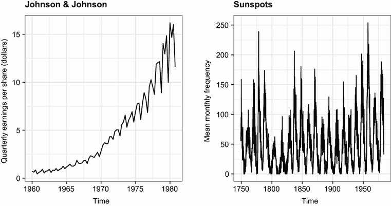

图 15.1 时间序列图：（左）1960 年至 1980 年间强生公司每股季度收益（美元），（右）从 1749 年到 1983 年记录的每月平均相对太阳黑子数

时间序列数据的研究涉及两个基本问题：发生了什么（描述），接下来会发生什么（预测）？对于强生公司的数据，你可能想知道，

+   强生公司的股价随时间变化吗？

+   存在季度效应吗？股价在一年中是否以规律的方式上升和下降？

+   你能预测未来的股价，并且准确度如何？

对于太阳黑子数据，你可能想知道，

+   哪些统计模型最能描述太阳黑子活动？

+   哪些模型比其他模型更适合数据？

+   在特定时间点的太阳黑子数量是否可预测，如果是的话，准确度如何？

准确预测股价的能力对我的（希望是）早期退休到热带岛屿上是有相关性的，而预测太阳黑子活动的能力则与我在该岛屿上的手机信号接收有关。

预测时间序列的未来值，或称为*预测*，是人类的一项基本活动，对时间序列数据的研究在现实世界中有着重要的应用。经济学家使用时间序列数据来理解和预测金融市场的变化。城市规划者使用时间序列数据来预测未来的交通需求。气候学家使用时间序列数据来研究全球气候变化。企业使用时间序列数据来预测产品需求和未来的销售。卫生官员使用时间序列数据来研究疾病的传播并预测特定地区未来病例的数量。地震学家研究时间序列数据来预测地震。在每种情况下，对历史时间序列的研究都是过程不可或缺的一部分。由于不同的方法可能对不同类型的时间序列效果最佳，因此在本章中我们将探讨许多例子。

描述时间序列数据和预测未来值的方法有很多。如果你处理时间序列数据，你会发现 R 拥有一些最全面的分析能力。本章探讨了最常见的描述和预测方法以及用于执行它们的 R 函数。表 15.1 列出了你将分析的时间序列数据。它们包含在 R 的基础安装中。这些数据集在特征和最佳拟合模型方面差异很大。

表 15.1 本章使用的数据集

| 时间序列 | 描述 |
| --- | --- |
| `AirPassengers` | 1949–1960 年每月的航空公司乘客数量 |
| `JohnsonJohnson` | 每季度强生公司每股收益 |
| `nhtemp` | 1912–1971 年康涅狄格州纽黑文的平均年气温 |
| `Nile` | 尼罗河的流量 |
| `sunspots` | 1749–1983 年每月的太阳黑子数量 |

我们将从创建和操作时间序列、描述和绘制它们以及将它们分解为水平、趋势、季节性和不规则（误差）成分的方法开始。然后我们将转向预测，从使用时间序列值加权平均的流行指数建模方法开始，用于预测未来的值。接下来，我们将考虑一组称为*自回归积分移动平均（ARIMA）模型*的预测技术，这些技术使用最近数据点之间的相关性以及最近预测误差之间的相关性来做出未来的预测。在整个过程中，我们将考虑评估模型拟合度和预测准确性的方法。本章以对这些主题了解更多资源的描述结束。

为了重现本章的分析，请确保在继续之前安装`xts`、`forecast`、`tseries`和`directlabels`包（`install.packages(c("xts", "forecast", "tseries", "directlabels"))`）。

## 15.1 在 R 中创建时间序列对象

要在 R 中处理时间序列，你必须将其放置在 *时间序列对象* 中——这是一个包含观测值和观测值日期指定的 R 结构。一旦数据在时间序列对象中，你就可以使用众多函数来操作、建模和绘制它。

R 包提供了多种用于存储时间序列的结构（参见侧边栏“R 中的时间序列对象”）。在本章中，我们将使用 `xts` 包提供的 `xts` 类。它支持规则和不规则时间序列，并具有许多用于操作时间序列数据的函数。

R 中的时间序列对象

在 R 提供的众多用于存储时间序列数据的对象中容易迷失方向。基础 R 包含 `ts` 用于存储具有规则时间间隔的单个时间序列，以及 `mts` 用于具有规则间隔的多个时间序列。`zoo` 包提供了一个可以存储不规则间隔时间序列的类，而 `xts` 包提供了一个包含更多支持函数的 `zoo` 类的超集。其他流行的格式包括 `tsibble`、`timeSeries`、`irts` 和 `tis`。幸运的是，`tsbox` 包提供了将数据框转换为这些格式以及将一个时间序列格式转换为另一个格式的函数。

要创建 `xts` 时间序列，你将使用

```
library(xts)
*myseries* <- xts(*data*, *index*)
```

其中 *`data`* 是一个数值向量，*`index`* 是一个表示值观察时间的日期向量。以下列表显示了一个示例。数据包括从 2018 年 1 月开始的两年的月度销售额。

列表 15.1 创建时间序列对象

```
library(xts)
sales <- c(18, 33, 41,  7, 34, 35, 24, 25, 24, 21, 25, 20,          
           22, 31, 40, 29, 25, 21, 22, 54, 31, 25, 26, 35)
date  <- seq(from = as.Date("2018/1/1"), 
               to = as.Date("2019/12/1"), 
               by = "month")

sales.xts <- xts(sales, date)                                           
```

`xts` 格式的时间序列对象可以使用方括号 `[]` 表示法进行子集。例如，`sales.xts["2018"]` 将返回 2018 年所有的数据。指定 `sales.xts ["2018-3/2019-5"]` 将返回从 2018 年 3 月到 2019 年 5 月所有的数据。

还有一些 `apply` 函数旨在对时间序列对象的每个不同时间段执行函数。它们对于将时间序列聚合到更大的时间段特别有用。其格式为

```
*newseries* <- apply.*period*(*x*, *FUN*, ...)
```

其中 *`period`* 可以是 `daily`、`weekly`、`monthly`、`quarterly` 或 `yearly`，*`x`* 是一个 `xts` 时间序列对象，*`FUN`* 是要应用的函数，`...` 是传递给 *`FUN`* 的参数。

例如，`quarterlies` `<-` `apply.quarterly(sales.xts,` `sum)` 将返回一个包含八个季度销售总额的时间序列。`sum` 函数可以被替换为 `mean`、`median`、`min`、`max` 或任何返回单个值的函数。

`forecast` 包中的 `autoplot()` 函数可用于将时间序列数据绘制为 `ggplot2` 图表。以下列表提供了两个示例。

列表 15.2 绘制时间序列

```
library(ggplot2)
library(forecast)
autoplot(sales.xts)                                             ❶

autoplot(sales.xts) + 
  geom_line(color="blue") +                                     ❷
  scale_x_date(date_breaks="1 months",                          ❸
               date_labels="%b %y") +
  labs(x="", y="Sales", title="Customized Time Series Plot") +
  theme_bw() +                                                  ❹
  theme(axis.text.x = element_text(angle = 90, vjust = 0.5, hjust=1),
        panel.grid.minor.x=element_blank())
```

❶ 默认图表

❷ 设置线条颜色

❸ 指定 x 轴标签

❹ 调整主题

在第一个示例中，使用 `autoplot()` 函数创建 `ggplot2` 图 ❶。图 15.2 显示了该图表。

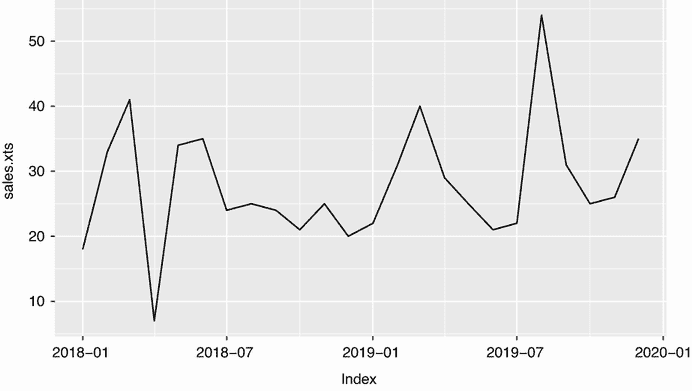

图 15.2 列表 15.1 中销售数据的时序图。这是 `autoplot()` 函数提供的默认格式。

在第二个例子中，图表被修改以使其更具吸引力。线条颜色被改为蓝色 ❷。使用 `scale_x_date()` 函数为 x 轴提供更好的标签 ❸。`data_breaks` 选项指定刻度标记之间的距离，可以取如 `"1 day"`、`"2 weeks"`、`"5 years"` 或适当的任何值。`date_labels` 选项指定标签的格式。在这里 `"%b %y"` 指定月份（3 个字母）和年份（2 位数字），中间有空格。参见第 4.6 节中的这些代码表。最后，选择了一个黑白主题，x 轴标签旋转 90 度，并抑制了垂直的次要网格线 ❹。图 15.3 显示了定制的图表。

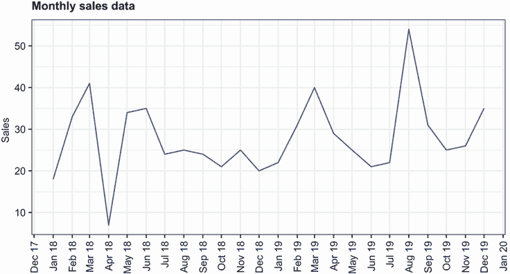

图 15.3 列表 15.1 中销售数据的时序图。该图表通过颜色、更好的标签和更干净的主题元素进行了定制。

基础 R 中附带的时间序列示例（表 15.1）实际上是 `ts` 格式，但幸运的是，本章中介绍的功能可以处理 `ts` 或 `xts` 格式的时间序列。

## 15.2 平滑和季节分解

就像分析师在尝试建模数据之前先使用描述性统计和图表来探索数据集一样，在尝试构建复杂模型之前，对时间序列进行数值和视觉描述应该是第一步。在本节中，我们将查看如何平滑时间序列以阐明其总体趋势，以及如何分解时间序列以观察任何季节性影响。

### 15.2.1 使用简单移动平均进行平滑

调查时间序列的第一步是绘制它，如列表 15.1 所示。考虑`尼罗河`时间序列。它记录了从 1871 年到 1970 年尼罗河在阿斯旺的年流量。该序列的图可以在图 15.4 的左上角面板中看到。时间序列似乎在下降，但年与年之间的变化很大。

时间序列通常具有显著的不规则或误差成分。为了在数据中辨别任何模式，你通常会想要绘制一条平滑曲线来抑制这些波动。平滑时间序列的最简单方法之一是使用简单移动平均。例如，每个数据点可以用该观测值及其前后一个观测值的平均值来代替。这被称为**中心移动平均**。中心移动平均被定义为

*S[t]* = (*Y[t-q]* + ... + *Y[t]* + ... + *Y[t+q]*)/(2*q* + 1)

其中 *S[t]* 是时间 *t* 的平滑值，*k* = 2*q* + 1 是平均的观测数。*k* 值通常选择为奇数（在这个例子中，3）。在使用中心移动平均时，不可避免地会失去序列两端的 (*k* – 1) / 2 个观测值。

R 中有几个函数可以提供简单移动平均，包括`TTR`包中的`SMA()`，`zoo`包中的`rollmean()`，以及`forecast`包中的`ma()`。在这里，你将使用`ma()`函数来平滑随 R 基础安装一起提供的`Nile`时间序列。

下一个列表中的代码使用 *k* 等于 3, 7 和 15 的值绘制了原始时间序列和平滑版本。图 15.3 显示了这些图表。

列表 15.3 简单移动平均

```
library(forecast)
library(ggplot2)

theme_set(theme_bw())
ylim <- c(min(Nile), max(Nile))

autoplot(Nile) +
  ggtitle("Raw time series") +
  scale_y_continuous(limits=ylim)

autoplot(ma(Nile, 3)) + 
  ggtitle("Simple Moving Averages (k=3)") +
  scale_y_continuous(limits=ylim)

autoplot(ma(Nile, 7)) +
  ggtitle("Simple Moving Averages (k=7)") +
  scale_y_continuous(limits=ylim)

autoplot(ma(Nile, 15)) +
  ggtitle("Simple Moving Averages (k=15)") +
  scale_y_continuous(limits=ylim)
```

随着 *k* 的增加，图表变得越来越平滑。挑战在于找到 *k* 的值，既能突出数据中的主要模式，又不会过度或不足平滑。这更多的是艺术而非科学，你可能会在确定一个值之前尝试几个 *k* 的值。从图 15.4 的图表中，确实可以看出在 1892 年至 1900 年之间河流流量有所下降。其他变化则有待解释。例如，1941 年至 1961 年之间可能存在一个小的上升趋势，但这也可能是随机变化。

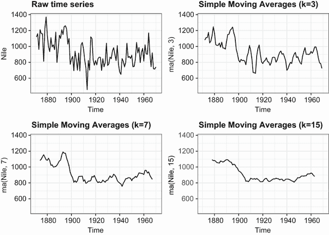

图 15.4 显示了从 1871 年至 1970 年在阿斯旺测量的尼罗河年流量时间序列（左上角）。其他图表是使用简单移动平均法在三个平滑级别（*k* = 3, 7, 和 15）上的平滑版本。

对于周期性大于 1 的时间序列数据（即具有季节性成分的数据），你将希望超越对整体趋势的描述。你可以使用季节分解来检查季节性和一般趋势。

### 15.2.2 季节分解

具有季节性方面的时间序列数据（如月度或季度数据）可以分解为趋势成分、季节成分和不规则成分。*趋势成分* 捕捉随时间变化的水平变化。*季节成分* 捕捉由于年份时间而产生的周期性效应。*不规则*（或*误差*）*成分* 捕捉趋势和季节性效应未描述的影响。

分解可以是加法或乘法。在加法模型中，各成分相加给出时间序列的值。具体来说，

*Y[t]* = 趋势[t] + 季节[t] + 不规则[t]

其中，时间 *t* 的观测值是时间 *t* 的趋势、时间 *t* 的季节性效应以及时间 *t* 的不规则效应的总和。

在乘法模型中，由以下方程给出

*Y[t]* = 趋势[t] × 季节[t] × 不规则[t]

趋势、季节和不规则影响是相乘的。图 15.5 显示了示例。

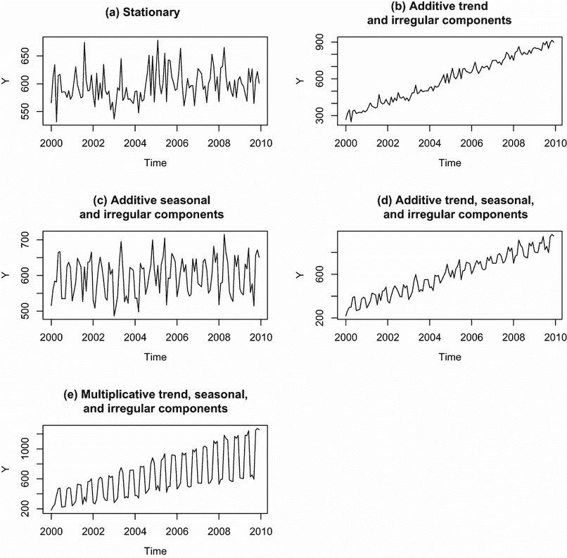

图 15.5 由不同组合的趋势、季节和不规则成分构成的时间序列示例

在第一幅图（a）中，没有趋势或季节性成分，唯一的影响是围绕给定水平的随机波动。在第二幅图（b）中，随着时间的推移存在上升趋势以及随机波动。在第三幅图（c）中，存在季节性效应和随机波动，但没有整体趋势偏离水平线。在第四幅图（d）中，所有三个成分都存在：上升趋势、季节性效应和随机波动。在最后的图（e）中，也看到了所有三个成分，但在这里它们以乘性方式结合。注意变异性与水平成正比：随着水平的增加，变异性也增加。这种基于当前序列水平的放大（或可能的衰减）强烈表明存在乘性模型。

一个例子可以使加性和乘性模型之间的区别更清晰。考虑一个记录了 10 年期间摩托车月度销售的时序。在具有加性季节效应的模型中，11 月和 12 月摩托车销量通常会增加 500 辆（由于圣诞节购物热潮），而在 1 月（销量通常会放缓）会减少 200 辆。季节性增加或减少与当前销量无关。

在具有乘性季节效应的模型中，11 月和 12 月的摩托车销量通常会增加 20%，而在 1 月会减少 10%。在乘性情况下，季节效应的影响与当前销量成正比，这与加性模型不同。在许多情况下，乘性模型更符合实际情况。

将时间序列分解为趋势、季节性和不规则成分的流行方法是使用局部加权回归的季节分解。在 R 中，可以使用 `stl()` 函数实现。其格式为

```
stl(*ts*, s.window=, t.window=)
```

其中 *`ts`* 是要分解的时间序列，`s.window` 控制季节效应随时间变化的快慢，`t.window` 控制趋势随时间变化的快慢。设置 `s.window="periodic"` 强制季节效应在年份间保持一致。只需要 `ts` 和 `s.window` 参数。有关详细信息，请参阅 `help(stl)`。

`stl()` 函数只能处理加性模型，但这并不是一个严重的限制。通过对数变换可以将乘性模型转换为加性模型：

log(*Y[t]*) = log(Trend[t] × Seasonal[t] × Irregular[t])

= log(Trend[t]) + log(Seasonal[t]) + log(Irregular[t])

将加性模型拟合到对数变换后的序列后，结果可以回变换到原始尺度。让我们来看一个例子。

时间序列 `AirPassengers` 随 R 的基本安装提供，描述了 1949 年至 1960 年之间每月国际航空公司乘客总数（以千为单位）。图 15.6 的顶部显示了数据的图表。从图中可以看出，序列的变异性随着水平的增加而增加，这表明存在乘性模型。

图 15.6 下半部分的图显示了通过对每个观测值取对数创建的时间序列。方差已稳定，对数序列看起来是加性分解的合适候选。这是使用列表 15.4 中的 `stl()` 函数完成的。

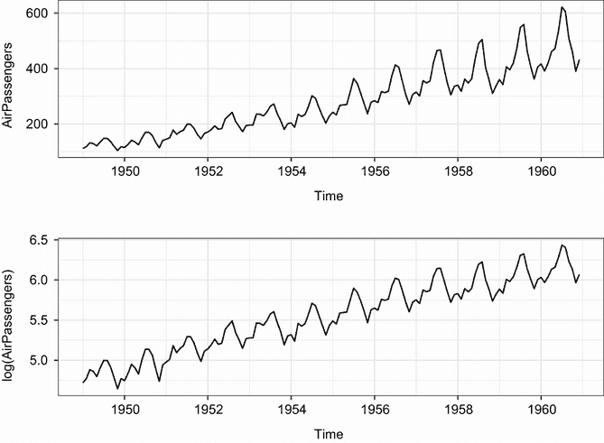

图 15.6 `AirPassengers` 时间序列图（顶部）。该时间序列包含 1949 年至 1960 年之间每月的国际航空公司乘客总数（以千为单位）。对时间序列进行对数变换（底部）可以稳定方差，并更好地拟合加性季节分解模型。

列表 15.4 使用 `stl()` 进行季节分解

```
> library(forecast)
> library(ggplot2)
> autoplot(AirPassengers)                          ❶
> lAirPassengers <- log(AirPassengers)
> autoplot(lAirPassengers, ylab="log(AirPassengers)")

> fit <- stl(lAirPassengers, s.window="period")    ❷
> autoplot(fit)

> fit$time.series                                  ❸

         seasonal trend  remainder
Jan 1949 -0.09164 4.829 -0.0192494
Feb 1949 -0.11403 4.830  0.0543448
Mar 1949  0.01587 4.831  0.0355884
Apr 1949 -0.01403 4.833  0.0404633
May 1949 -0.01502 4.835 -0.0245905
Jun 1949  0.10979 4.838 -0.0426814
... output omitted ...

> exp(fit$time.series)

         seasonal trend remainder
Jan 1949   0.9124 125.1    0.9809
Feb 1949   0.8922 125.3    1.0558
Mar 1949   1.0160 125.4    1.0362
Apr 1949   0.9861 125.6    1.0413
May 1949   0.9851 125.9    0.9757
Jun 1949   1.1160 126.2    0.9582

... output omitted ...
```

❶ 绘制时间序列图

❷ 分解时间序列

❸ 每个观测值的成分

首先，绘制并变换时间序列 ❶。执行季节分解并将其保存到名为 `fit` 的对象中 ❷。绘制结果给出图 15.7 中的图形，显示了 1949 年至 1960 年的时间序列、季节性、趋势和不规则成分。请注意，季节性成分已被约束为每年保持相同（使用 `s.window="period"` 选项）。趋势是单调递增的，季节性效应表明夏季（可能是假期期间）的乘客更多。右侧的灰色条是幅度指南——每个条代表相同的幅度。这很有用，因为每个图形的 y 轴都不同。


图 15.7 使用 `stl()` 函数对对数 `AirPassengers` 时间序列进行季节分解。时间序列（数据）被分解为季节性、趋势和不规则成分。

`stl()` 函数返回的对象包括一个名为 `time.series` 的组件，它包含每个观测值的趋势、季节和不规则部分 ❸。在这种情况下，`fit$time.series` 基于对数时间序列。`exp(fit$time .series)` 将分解转换回原始度量。检查季节性效应表明，7 月份（乘数为 1.24）的乘客数量增加了 24%，而在 11 月份（乘数为 0.80）的乘客数量减少了 20%。

`forecast` 包提供了用于可视化季节分解的额外工具。以下列表展示了创建月度图和季节性图的示例。

列表 15.5 月度和季节性图

```
library(forecast)
library(ggplot2)
library(directlabels)

ggmonthplot(AirPassengers)  +                         ❶
  labs(title="Month plot: AirPassengers",             ❶
       x="",                                          ❶
       y="Passengers (thousands)")                    ❶

p <- ggseasonplot(AirPassengers) + geom_point() +     ❷
  labs(title="Seasonal plot: AirPassengers",          ❷
       x="",                                          ❷
       y="Passengers (thousands)")                    ❷
direct.label(p)                                       ❷
```

❶ 月度图

❷ 季节性图

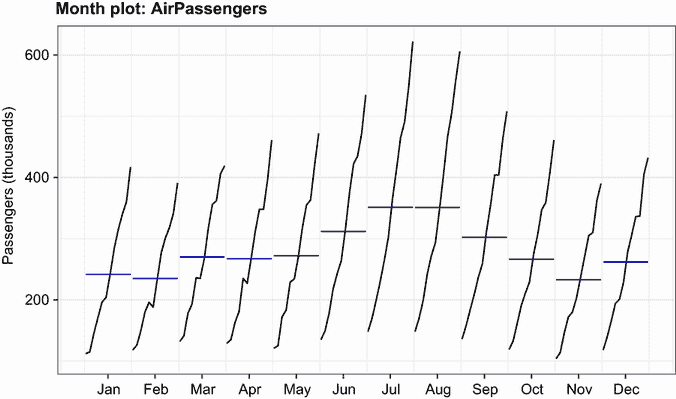

图 15.8 `AirPassengers` 时间序列的月度图。月度图显示了每个月的子序列（1949 年至 1960 年所有 1 月份的值连接，所有 2 月份的值连接，依此类推），以及每个子序列的平均值。每个月都有一个均匀递增的趋势，乘客最倾向于在 7 月和 8 月出行。

月度图（图 15.8）显示了每个月的子序列（所有 1 月份的值相连，所有 2 月份的值相连，依此类推），以及每个子序列的平均值。从这张图中可以看出，趋势在每个月都以大致均匀的方式增加。此外，7 月和 8 月是乘客数量最多的月份。

季节图（图 15.9）显示了按年份划分的子序列。再次，你看到相似的图案，每年乘客数量都在增加，并且具有相同的季节性模式。默认情况下，`ggplot2`包会为年份变量创建图例。`directlabels`包用于将年份标签直接放置在图表上，紧邻时间序列中的每条线。


图 15.9 `AirPassengers`时间序列的季节图（底部）。每个图都显示了一个逐年增加的趋势和相似的季节性模式。

注意，尽管你已经描述了时间序列，但你并没有预测任何未来的值。在下一节中，我们将考虑使用指数模型来预测超出可用数据的情况。

## 15.3 指数预测模型

指数模型是预测时间序列未来值的最流行方法之一。它们比许多其他类型的模型更简单，但它们可以在广泛的领域中提供良好的短期预测。它们在模型的时间序列组件上有所不同。一个简单的指数模型（也称为*单指数模型*）拟合一个在时间*i*处具有恒定水平和不规则成分的时间序列，但没有趋势或季节成分。一个*双指数模型*（也称为*霍尔特指数平滑*）拟合一个具有水平和趋势的时间序列。最后，一个*三指数模型*（也称为*霍尔特-温特斯指数平滑*）拟合一个具有水平、趋势和季节成分的时间序列。

指数模型可以使用`forecast`包中提供的`ets()`函数进行拟合。`ets()`函数的格式为

```
ets(*ts*, model="ZZZ") 
```

其中*`ts`*是一个时间序列，`model`由三个字母指定。第一个字母表示误差类型，第二个字母表示趋势类型，第三个字母表示季节类型。允许的字母是*A*表示加法，*M*表示乘法，*N*表示无，*Z*表示自动选择。表 15.2 显示了常见模型的示例。

表 15.2 简单、双指数和三指数预测模型拟合函数

| 类型 | 参数拟合 | 函数 |
| --- | --- | --- |
| `simple` | `level` | `ets(ts, model="ANN")` `ses(ts)` |
| `double` | `level`, `slope` | `ets(ts, model="AAN")` `holt(ts)` |
| `triple` | `level`, `slope`, `seasonal` | `ets(ts, model="AAA")` `hw(ts)` |

`ses()`、`holt()`和`hw()`函数是针对`ets()`函数的便利包装，具有预定义的默认值。首先，我们将查看最基本指数模型：简单指数平滑。

### 15.3.1 简单指数平滑

简单指数平滑使用现有时间序列值的加权平均来对未来的短期值进行预测。权重选择使得随着时间的推移，观测值对平均值的指数衰减影响。

简单指数平滑模型假设时间序列中的观测值可以描述为

*Y[t]* = 水平 + 不规则[t]

时间 *Y[t]*[+1] 的预测（称为 *1 步预测*）表示为

*Y[t]*[+1] = *c*[0]*Y[t]* + *c*[1]*Y[t]*[−1] + *c*[2]*Y[t]*[−2] + ...

其中 *c[i]* = *α*(1−*α*)^i, *t* = 0,1,2, ... 且 0 ≤ *α* ≤ 1。*c[i]* 权重之和为 1，一步预测可以看作是当前值和所有过去时间序列值的加权平均。alpha (*α*) 参数控制权重的衰减速率。alpha 越接近 1，近期观测值的权重就越大。alpha 越接近 0，过去观测值的权重就越大。alpha 的实际值通常由计算机选择以优化拟合标准。一个常见的拟合标准是实际值和预测值之间平方误差的和。以下示例将有助于阐明这些概念。

`nhtemp` 时间序列包含康涅狄格州纽黑文从 1912 年到 1971 年的平均年气温（华氏度）。图 15.10 显示了时间序列的线形图。

没有明显的趋势，并且年度数据缺乏季节成分，因此简单指数模型是一个合理的起点。使用 `ses()` 函数进行一步预测的代码如下所示。

列表 15.6 简单指数平滑

```
> library(forecast)
> fit <- ets(nhtemp, model="ANN")     ❶
> fit

ETS(A,N,N) 

Call:
 ets(y = nhtemp, model = "ANN") 

  Smoothing parameters:
    alpha = 0.1819 

  Initial states:
    l = 50.2762 

  sigma:  1.1455

     AIC     AICc      BIC 
265.9298 266.3584 272.2129 

> forecast(fit, 1)                    ❷

     Point Forecast  Lo 80  Hi 80  Lo 95  Hi 95
1972          51.87 50.402 53.338 49.625 54.115

> autoplot(forecast(fit, 1)) +
  labs(x = "Year", 
       y = expression(paste("Temperature (", degree*F,")",)),
       title = "New Haven Annual Mean Temperature")

> accuracy(fit)                       ❸

                ME  RMSE   MAE  MPE  MAPE   MASE
Training set 0.146 1.126 0.895 0.242 1.749 0.751 
```

❶ 符合模型

❷ 一步预测

❸ 打印准确度指标

`ets(mode="ANN")` 语句将简单指数模型拟合到 `nhtemp` 时间序列 ❶。`A` 表示误差是可加的，而 `NN` 表示没有趋势和季节成分。alpha（0.18）的相对较低值表明在预测中考虑了远期和近期观测值。此值自动选择以最大化模型与给定数据集的拟合度。

使用 `forecast()` 函数来预测时间序列 *k* 步的未来值。格式为 `forecast(``fit,` *`k`*`)`。此系列的一步预测为 51.9°F，95% 置信区间为 (49.6°F 至 54.1°F) ❷。图 15.10 显示了时间序列、预测值以及 80%和 95%置信区间的图示。

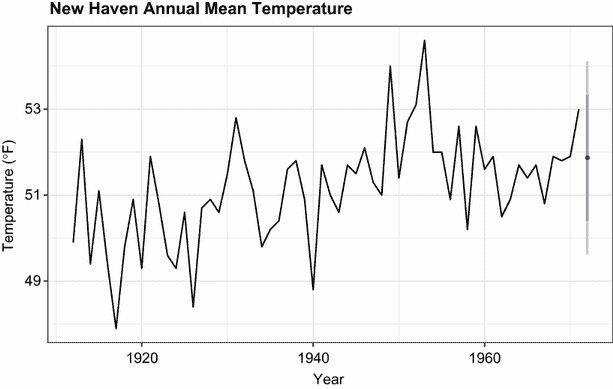

图 15.10 康涅狄格州纽黑文的平均年气温以及使用 `ets()` 函数进行的一步预测

`forecast` 包还提供了一个 `accuracy()` 函数，该函数显示时间序列预测中最常用的预测准确度指标 ❸。表 15.3 描述了每一个。*e*[t] 代表每个观察值（*Y[i]* − *Ŷ[i]*）的错误或不规则成分。

表 15.3 预测准确度指标

| 指标 | 缩写 | 定义 |
| --- | --- | --- |
| 平均误差 | ME | mean(*e[t]*) |
| 均方根误差 | RMSE | sqrt(mean(*e[t]*²)) |
| 平均绝对误差 | MAE | mean(&#124;*e[t]*&#124;) |
| 平均百分比误差 | MPE | mean(100 × *e[t]* / *Y[t]*) |
| 平均绝对百分比误差 | MAPE | mean(&#124;100 × *e[t]* / *Y[t]*&#124;) |
| 平均绝对缩放误差 | MASE | mean(&#124;*q[t]*&#124;) 其中 *q[t]* = *e[t]* / (1/(*T*–1) * sum(&#124;*y[t]* – *y[t]*[–1]&#124;))，*T* 是观察数量，求和从 *t* = 2 到 *t = T* |

平均误差和平均百分比误差可能不是很有用，因为正负误差可能会相互抵消。RMSE 给出平均平方误差的平方根，在这种情况下是 1.13°F。平均绝对百分比误差将误差报告为时间序列值的百分比。它是无单位的，可以用于比较不同时间序列的预测准确度。但它假设有一个具有真实零点的测量尺度（例如，每天乘客数量）。因为华氏尺度没有真实零点，所以在这里不能使用。平均绝对缩放误差是最新的准确度指标，用于比较不同尺度上时间序列的预测准确度。没有一种预测准确度的最佳度量。RMSE 无疑是最为人所知且最常引用的。 

简单指数平滑假设不存在趋势或季节性成分。下一节将考虑可以同时容纳这两种成分的指数模型。

### 15.3.2 Holt 和 Holt–Winters 指数平滑

Holt 指数平滑方法可以拟合具有总体水平和趋势（斜率）的时间序列。时间 *t* 的观测值模型为

*Y[t]* = 水平 + 斜率 × *t* + 不规则[t]

一个 alpha 平滑参数控制水平的指数衰减，一个 beta 平滑参数控制斜率的指数衰减。同样，每个参数的范围从 0 到 1，较大的值在计算季节性效应时给予近期观察更大的权重。

Holt–Winters 指数平滑方法可用于拟合具有总体水平、趋势和季节性成分的时间序列。在这里，模型是

*Y[t]* = 水平 + 斜率 × *t* + *s[t]* + 不规则[t]

其中 *s[t]* 表示时间 *t* 的季节性影响。除了 alpha 和 beta 参数外，一个 gamma 平滑参数控制季节性成分的指数衰减。与其他参数一样，它介于 0 到 1 之间，较大的值在计算季节性效应时给予近期观察更大的权重。

在第 15.2 节中，您将描述国际航空公司每月总客流量（以对数千为单位）的时间序列分解为加法趋势、季节性和不规则成分。让我们使用指数模型来预测未来的旅行。同样，您将使用对数值，以便加法模型适合数据。以下列表中的代码应用了 Holt-Winters 指数平滑方法来预测`AirPassengers`时间序列的下一个五个值。

列表 15.7 具有水平、斜率和季节性成分的指数平滑

```
> library(forecast)
> fit <- ets(log(AirPassengers), model="AAA")      
> fit

ETS(A,A,A) 

Call:
 ets(y = log(AirPassengers), model = "AAA") 

    Smoothing parameters:                               ❶
    alpha = 0.6975 
    beta  = 0.0031 
    gamma = 1e-04 

  Initial states:
    l = 4.7925 
    b = 0.0111 
    s = -0.1045 -0.2206 -0.0787 0.0562 0.2049 0.2149
           0.1146 -0.0081 -0.0059 0.0225 -0.1113 -0.0841

  sigma:  0.0383

    AIC    AICc     BIC 
-207.17 -202.31 -156.68 

>accuracy(fit)

                     ME    RMSE      MAE       MPE    MAPE    MASE
Training set -0.0018307 0.03607 0.027709 -0.034356 0.50791 0.22892
> pred <- forecast(fit, 5)                              ❷
> pred
         Point Forecast  Lo 80  Hi 80  Lo 95  Hi 95
Jan 1961         6.1093 6.0603 6.1584 6.0344 6.1843
Feb 1961         6.0925 6.0327 6.1524 6.0010 6.1841
Mar 1961         6.2366 6.1675 6.3057 6.1310 6.3423
Apr 1961         6.2185 6.1412 6.2958 6.1003 6.3367
May 1961         6.2267 6.1420 6.3115 6.0971 6.3564

> autoplot(pred) +
  labs(title = "Forecast for Air Travel",
       y = "Log(AirPassengers)", 
       x ="Time")

> pred$mean <- exp(pred$mean)                           ❸
> pred$lower <- exp(pred$lower)                         ❸
> pred$upper <- exp(pred$upper)                         ❸
> p <- cbind(pred$mean, pred$lower, pred$upper)
> dimnames(p)[[2]] <- c("mean", "Lo 80", "Lo 95", "Hi 80", "Hi 95")
> p                                                             

           mean  Lo 80  Lo 95  Hi 80  Hi 95
Jan 1961 450.04 428.51 417.53 472.65 485.08
Feb 1961 442.54 416.83 403.83 469.85 484.97
Mar 1961 511.13 477.01 459.88 547.69 568.10
Apr 1961 501.97 464.63 446.00 542.30 564.95
May 1961 506.10 464.97 444.57 550.87 576.15
```

❶ 平滑参数

❷ 未来预测

❸ 在原始尺度上进行预测

水平（.70）、趋势（.0004）和季节性成分（.003）的平滑参数在❶中给出。趋势的值较低（.0001）并不意味着没有斜率；它表示从早期观察中估计的斜率不需要更新。

`forecast()`函数为未来五个月生成预测❷，并在图 15.11 中绘制。由于预测是在对数尺度上，因此使用指数运算来获得原始度量的预测：乘客数量（以千为单位）❸。矩阵`pred$mean`包含点预测，矩阵`pred$lower`和`pred$upper`分别包含 80%和 95%的置信下限和上限。使用`exp()`函数将预测返回到原始尺度，并使用`cbind()`创建单个表。因此，模型预测 3 月将有 509,200 名乘客，95%置信区间为 454,900 至 570,000。

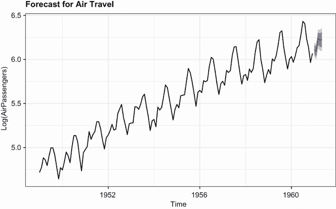

图 15.11 基于 Holt-Winters 指数平滑模型的五年预测，预测的是以千为单位的国际航空公司乘客数量的对数。数据来自`AirPassengers`时间序列。

### 15.3.3 `ets()`函数和自动预测

`ets()`函数具有额外的功能。您可以使用它来拟合具有乘法成分的指数模型，添加阻尼成分，并执行自动预测。让我们逐一考虑这些功能。

在上一节中，您将加法指数模型拟合到`AirPassengers`时间序列的对数。作为替代，您也可以将乘法模型拟合到原始数据。函数调用将是`ets(AirPassengers, model="MAM")`。趋势仍然是加法的，但季节性和不规则成分被假定为乘法的。在这种情况下使用乘法模型，准确性统计和预测值将报告在原始度量（千名乘客）上——这是一个明显的优势。

`ets()`函数还可以拟合阻尼成分。时间序列预测通常假设趋势将永远持续下去（比如房地产市场，对吗？）。阻尼成分会迫使趋势在一段时间内达到水平渐近线。在许多情况下，阻尼模型能做出更现实的预测。

最后，你可以调用`ets()`函数来自动选择最适合数据的模型。让我们将自动指数模型拟合到本章引言中描述的强生公司数据。以下列表中的代码允许软件选择一个最佳拟合模型。

列表 15.8 使用`ets()`函数进行自动指数预测

```
> library(forecast)
> fit <- ets(JohnsonJohnson)
> fit

ETS(M,M,M) 

Call:
 ets(y = JohnsonJohnson) 

    Smoothing parameters:
    alpha = 0.2776 
    beta  = 0.0636 
    gamma = 0.5867 

  Initial states:
    l = 0.6276 
    b = 0.0165 
    s = -0.2293 0.1913 -0.0074 0.0454

  sigma:  0.0921

   AIC   AICc    BIC 
163.64 166.07 185.52 

> autoplot(forecast(fit)) +
  labs(x = "Time",
       y = "Quarterly Earnings (Dollars)",
       title="Johnson and Johnson Forecasts")
```

因为没有指定模型，软件将在广泛的模型中进行搜索，以找到最小化拟合标准（默认为对数似然）的模型。选定的模型具有乘法趋势、季节性和误差成分。图 15.12 给出了图表，以及对未来八个季度的预测（在这种情况下默认为八个季度）。

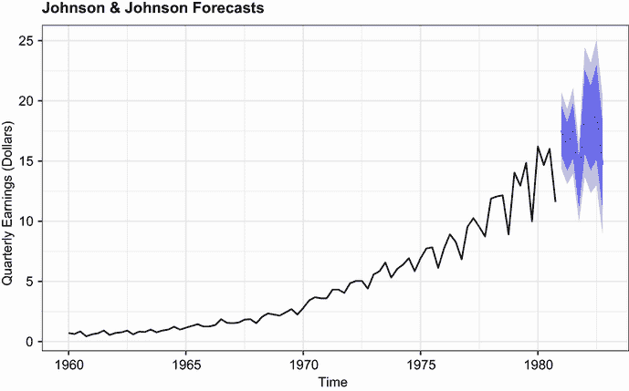

图 15.12 带趋势和季节成分的乘法指数平滑预测。预测值用虚线表示，80%和 95%的置信区间分别用浅蓝色和深蓝色表示。

如前所述，指数时间序列建模因其能在许多情况下提供良好的短期预测而受到欢迎。第二种流行的方法是 Box-Jenkins 方法，通常称为 ARIMA 模型。这些将在下一节中描述。

## 15.4 ARIMA 预测模型

在预测的**自回归积分移动平均（ARIMA）**方法中，预测值是近期实际值和近期预测误差（残差）的线性函数。ARIMA 是一种复杂的预测方法。在本节中，我们将仅讨论非季节性时间序列的 ARIMA 模型。

在描述 ARIMA 模型之前，需要定义几个术语，包括滞后、自相关、偏自相关、差分和稳定性。这些内容将在下一节中讨论。

### 15.4.1 前置概念

当你对时间序列进行**滞后**处理时，你会将其向后移动给定数量的观测值。考虑来自`尼罗河`时间序列的前几个观测值，如表 15.4 所示。滞后 0 是未移动的时间序列。滞后 1 是将时间序列向左移动一个位置。滞后 2 是将时间序列向左移动两个位置，依此类推。可以使用函数`lag(ts,k)`对时间序列进行滞后，其中`ts`是时间序列，`k`是滞后数。

表 15.4 在不同滞后下的`尼罗河`时间序列

| 滞后 | 1869 | 1870 | 1871 | 1872 | 1873 | 1874 | 1875 | ... |
| --- | --- | --- | --- | --- | --- | --- | --- | --- |
| 0 |  |  | 1120 | 1160 | 963 | 1210 | 1160 | ... |
| 1 |  | 1120 | 1160 | 963 | 1210 | 1160 | 1160 | ... |
| 2 | 1120 | 1160 | 963 | 1210 | 1160 | 1160 | 813 | ... |

*自相关*衡量时间序列中观测值之间的关系。*AC[k]*是一组观测值（*Y[t]*)与较早的*k*个周期的观测值（*Y[t−k]*）之间的相关性。因此，*AC*[1]是滞后 1 和滞后 0 时间序列之间的相关性，*AC*[2]是滞后 2 和滞后 0 时间序列之间的相关性，依此类推。绘制这些相关性（*AC*[1]，*AC*[2]，...，*AC[k]*)将产生一个*自相关函数（ACF）图*。ACF 图用于选择 ARIMA 模型的最佳参数，并评估最终模型的拟合度。

可以使用`forecast`包中的`Acf()`函数生成自相关图。其格式为`Acf(*ts*)`，其中*`ts`*是原始时间序列。`Nile`时间序列的自相关图（*k* = 1 到 18），将在稍后图 15.13 的上半部分提供。

*偏自相关*是*Y[t]*与*Y[t−k]*之间的相关性，同时消除了两者之间的所有*Y*值的影响（*Y[t]*[-1]，*Y[t]*[-2]，...，*Y[t-k]*[+1]）。对于多个*k*值，也可以绘制偏自相关。可以使用`forecast`包中的`Pacf()`函数生成 PACF 图。函数调用为`Pacf(*ts*)`，其中*`ts`*是要评估的时间序列。PACF 图也用于确定 ARIMA 模型的最合适的参数。图 15.13 的下半部分给出了`Nile`时间序列的结果。

ARIMA 模型旨在拟合*平稳*时间序列（或可以变为平稳的时间序列）。在平稳时间序列中，序列的统计属性不会随时间变化。例如，*Y[t]*的均值和方差是恒定的。此外，任何滞后*k*的自相关也不会随时间变化。

在进行 ARIMA 模型的拟合之前，可能需要将时间序列的值进行转换以实现常数方差。对数转换在这里通常很有用，正如你在 15.1.3 节中看到的。其他转换，如 8.5.2 节中描述的 Box-Cox 转换，也可能有所帮助。

由于平稳时间序列假定具有恒定的均值，因此它们不能有趋势成分。许多非平稳时间序列可以通过*差分*变为平稳。在差分中，时间序列*Y[t]*的每个值被替换为*Y[t]*[-1] – *Y[t]*。对时间序列进行一次差分可以去除线性趋势。进行第二次差分可以去除二次趋势。第三次差分可以去除三次趋势。很少需要差分超过两次。

你可以使用`diff()`函数对时间序列进行差分。其格式为`diff(*ts*, differences=*d*)`，其中*`d`*表示时间序列`ts`被差分的次数。默认值为`d=1`。`forecast`包中的`ndiffs()`函数可用于帮助确定`d`的最佳值。其格式为`ndiffs(*ts*)`。

平稳性通常通过时间序列图的可视检查来评估。如果方差不是常数，则对数据进行变换。如果有趋势，则对数据进行差分。您还可以使用称为*Augmented Dickey–Fuller (ADF**)测试的统计程序来评估平稳性的假设。在 R 中，`tseries`包中的`adf.test``()`函数执行此测试。格式为`adf.test(*ts*``)`，其中*`ts`*是要评估的时间序列。显著的结果表明平稳性。

总结来说，ACF 和 PCF 图用于确定 ARIMA 模型的参数。平稳性是一个重要的假设，变换和差分被用来帮助实现平稳性。掌握这些概念后，我们现在可以转向拟合具有自回归（AR）成分、移动平均（MA）成分或两者成分（ARMA）的模型。最后，我们将检查包含 ARMA 成分和差分以实现平稳性（积分）的 ARIMA 模型。

### 15.4.2 ARMA 和 ARIMA 模型

在阶数为 p 的自回归模型中，时间序列中的每个值都是通过前 p 个值的线性组合进行预测的

*AR*(*p*): *Y[t]* = *µ* + *β*[1]*Y[t]*[−1] + *β*[2]*Y[t]*[−2] + ... + *β[p]**Y[t−p]* + *ε[t]*

其中 *Y[t]* 是序列的给定值，*µ* 是序列的均值，*β* 是权重，*ε[t]* 是不规则成分。在阶数为 q 的移动平均模型中，时间序列中的每个值都是通过 q 个前误差值的线性组合进行预测的。在这种情况下，

*MA*(*q*): *Y[t]* = *µ* + *θ*[1]*ε[t]*[−1] + *θ*[2]*ε[t]*[−2] + ... + *θ[p]**ε[t−q]* + *ε[t]*

其中，*ε*表示预测误差，*θ*表示权重。（需要注意的是，这里描述的移动平均并不是第 15.1.2 节中描述的简单移动平均。）

结合两种方法可以得到形式为 ARMA(p, q)的模型

*Y[t]* = *µ* + *β*[1]*Y[t]*[−1] + *β*[2]*Y[t]*[−2] + ... + *β[p]**Y[t−p]* − *θ*[1]*ε[t]*[−1] − *θ*[2]*ε[t]*[−2] − ... − *θ[p]**ε[t−q]* + *ε[t]*

从过去 p 个值和 q 个残差预测时间序列的每个值。

ARIMA(p, d, q)模型是一种时间序列经过 d 次差分后的模型，预测值由前 p 个实际值和 q 个前误差值得到。预测值经过*非差分*或*积分*处理以得到最终预测。

ARIMA 建模的步骤如下：

1.  确保时间序列是平稳的。

1.  确定一个合理的模型或多个模型（p 和 q 的可能值）。

1.  拟合模型。

1.  评估模型的拟合度，包括统计假设和预测准确性。

1.  进行预测。

让我们依次应用每个步骤来拟合一个 ARIMA 模型到`Nile`时间序列。

确保时间序列是平稳的

首先，您绘制时间序列并评估其平稳性（参见列表 15.7 和图 15.13 的上半部分）。方差似乎在观察的年份中保持稳定，因此不需要转换。可能存在趋势，这得到了`ndiffs()`函数结果的支持。

列表 15.9 转换时间序列并评估平稳性

```
> library(forecast)
> library(tseries)
> autoplot(Nile)
> ndiffs(Nile)

[1] 1

> dNile <- diff(Nile)                                              
> autoplot(dNile)
> adf.test(dNile)

    Augmented Dickey-Fuller Test

data:  dNile 
Dickey-Fuller = -6.5924, Lag order = 4, p-value = 0.01
alternative hypothesis: stationary 
```

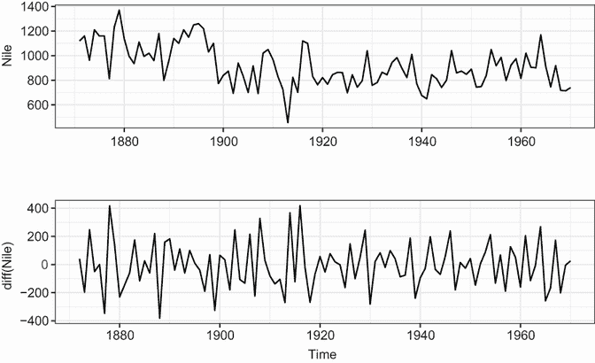

图 15.13 显示了从 1871 年到 1970 年阿斯旺尼罗河年流量的时间序列（顶部）以及一次差分后的时间序列（底部）。差分消除了原始图中明显的下降趋势。

时间序列进行了一次差分（滞后=1 是默认值）并保存为`dNile`。差分后的时间序列在图 15.13 的下半部分绘制，看起来更平稳。对差分序列应用 ADF 测试表明它现在是平稳的，因此您可以继续下一步。

确定一个或多个合理模型

根据 ACF 和 PACF 图选择可能的模型：

```
autoplot(Acf(dNile))
autoplot(Pacf(dNile))
```

图 15.14 显示了结果图。

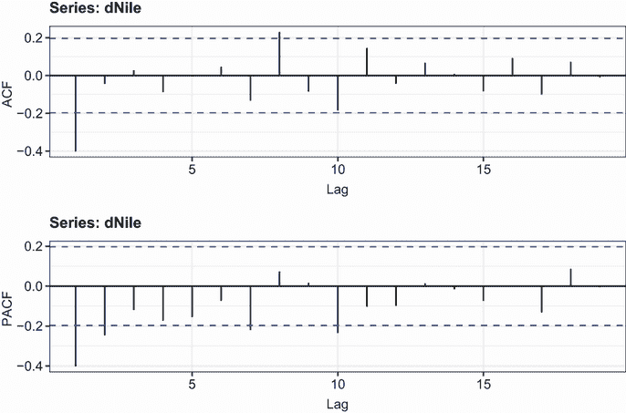

图 15.14 差分后的尼罗河时间序列的自相关和偏自相关图

目标是确定参数 p、d 和 q。您已经从上一节中知道 d = 1。您通过比较 ACF 和 PACF 图与表 15.5 中给出的指南来获取 p 和 q。

表 15.5 选择 ARIMA 模型的指南

| 模型 | ACF | PACF |
| --- | --- | --- |
| ARIMA(p, d, 0) | 逐渐衰减至零 | 滞后 p 后的零值 |
| ARIMA(0, d, q) | 滞后 q 后的零值 | 逐渐衰减至零 |
| ARIMA(p, d, q) | 逐渐衰减至零 | 逐渐衰减至零 |

表 15.5 中的结果是理论上的，实际的 ACF 和 PACF 可能不会完全匹配，但它们可以用来给出尝试的合理模型的粗略指南。对于图 15.13 中的“尼罗河”时间序列，似乎在滞后 1 处有一个大的自相关，并且随着滞后时间的增加，偏自相关逐渐衰减至零。这表明尝试 ARIMA(0, 1, 1)模型。

拟合模型

使用`Arima()`函数拟合 ARIMA 模型。格式为`Arima(*ts*, order=c(q, d, q))`。以下列表给出了将 ARIMA(0, 1, 1)模型拟合到尼罗河时间序列的结果。

列表 15.10 拟合 ARIMA 模型

```
> library(forecast)
> fit <- arima(Nile, order=c(0,1,1))                                 
> fit

Series: Nile 
ARIMA(0,1,1)                    

Coefficients:
          ma1
      -0.7329
s.e.   0.1143

sigma² estimated as 20600:  log likelihood=-632.55
AIC=1269.09   AICc=1269.22   BIC=1274.28

> accuracy(fit)

                 ME  RMSE   MAE    MPE  MAPE   MASE
Training set -11.94 142.8 112.2 -3.575 12.94 0.8089
```

注意，您将模型应用于原始时间序列。通过指定 d = 1，它为您计算一阶差分。移动平均系数（–0.73）与 AIC 一起提供。如果您拟合其他模型，AIC 可以帮助您选择哪个模型最合理。较小的 AIC 值表示更好的模型。准确度指标可以帮助您确定模型是否具有足够的准确性。这里河流水平的平均绝对百分比误差为 13%。

评估模型拟合

如果模型是合适的，残差应该是均值为零的正态分布，并且对于每个可能的滞后，自相关系数都应该为零。换句话说，残差应该是正态且独立分布的（它们之间没有关系）。可以使用以下列表中的代码评估这些假设。

列表 15.11 评估模型拟合

```
> library(ggplot2)
> df <- data.frame(resid = as.numeric(fit$residuals))   ❶
> ggplot(df, aes(sample = resid)) +                     ❷
      stat_qq() + stat_qq_line() +
      labs(title="Normal Q-Q Plot")     

> Box.test(fit$residuals, type="Ljung-Box")             ❸
    Box-Ljung test

data:  fit$residuals 
X-squared = 1.3711, df = 1, p-value = 0.2416
```

❶ 提取残差

❷ 创建 Q-Q 图

❸ 测试所有滞后阶数的自相关系数为零

首先，从 `fit` 对象中提取残差并保存到数据框中。然后使用 `qq_*` 函数生成 `Q-Q 图`（图 15.15）。正态分布的数据应该沿着这条线分布。在这种情况下，结果看起来很好。

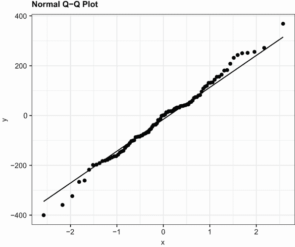

图 15.15：用于确定时间序列残差的正态性的正态 Q-Q 图。期望正态分布的值会沿着这条线分布。

`Box.test()` 函数提供了一个测试，表明所有自相关系数都为零。结果并不显著，表明自相关系数与零没有差异。这个 ARIMA 模型似乎很好地拟合了数据。

进行预测

如果模型没有满足正态残差和零自相关的假设，那么就需要修改模型、添加参数或尝试不同的方法。一旦选择了最终模型，就可以用它来预测未来的值。在下一个列表中，使用 `forecast` 包中的 `forecast()` 函数来预测三年后的值。

列表 15.12 使用 ARIMA 模型进行预测

```
> forecast(fit, 3)

     Point Forecast    Lo 80     Hi 80    Lo 95    Hi 95
1971       798.3673 614.4307  982.3040 517.0605 1079.674
1972       798.3673 607.9845  988.7502 507.2019 1089.533
1973       798.3673 601.7495  994.9851 497.6663 1099.068

> autoplot(forecast(fit, 3)) + labs(x="Year", y="Annual Flow")
```

`autoplot()` 函数用于绘制图 15.16 中的预测结果。点估计由黑色线条表示，而 80% 和 95% 的置信区间分别由深蓝色和浅蓝色带表示。

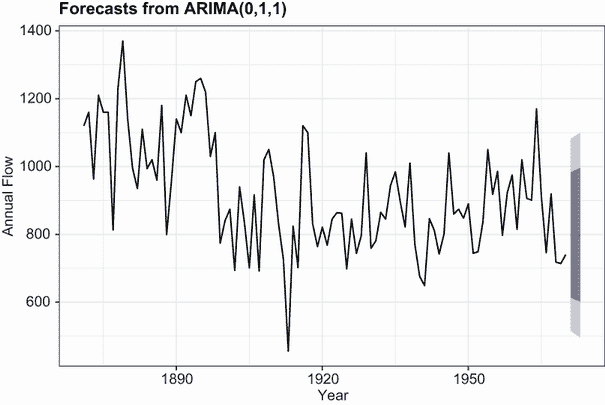

图 15.16：从拟合的 ARIMA(0,1,1) 模型对 `尼罗河` 时间序列的三年预测。黑色线条代表点估计，浅蓝色和深蓝色带分别代表 80% 和 95% 的置信区间界限。

### 15.4.3 自动 ARIMA 预测

在 15.2.3 节中，你使用了 `forecast` 包中的 `ets()` 函数来自动选择最佳指数模型。该包还提供了一个 `auto.arima()` 函数来选择最佳 ARIMA 模型。下面的列表将此方法应用于章节引言中描述的 `sunspots` 时间序列。

列表 15.13 自动 ARIMA 预测

```
> library(forecast)
> fit <- auto.arima(sunspots)
> fit
Series: sunspots 
ARIMA(2,1,2)                    
Coefficients:
       ar1     ar2    ma1    ma2
      1.35  -0.396  -1.77  0.810
s.e.  0.03   0.029   0.02  0.019

sigma² estimated as 243:  log likelihood=-11746
AIC=23501   AICc=23501   BIC=23531

> forecast(fit, 3)

         Point Forecast       Lo 80    Hi 80      Lo 95    Hi 95
Jan 1984      40.437722  20.4412613 60.43418   9.855774 71.01967
Feb 1984      41.352897  18.2795867 64.42621   6.065314 76.64048
Mar 1984      39.796425  15.2537785 64.33907   2.261686 77.33116

> accuracy(fit)
                   ME RMSE   MAE MPE MAPE MASE
Training set -0.02673 15.6 11.03 NaN  Inf 0.32 
```

该函数选择了一个 p = 2, d = 1, q = 2 的 ARIMA 模型。这些值是在大量可能的模型中使 AIC 准则最小化的值。由于序列中存在零值（这两个统计量的缺点），MPE 和 MAPE 准确度会爆炸。绘制结果和评估拟合留给你作为练习。

预测的注意事项

预测有着悠久而多样的历史，从早期的巫师预测天气到现代数据科学家预测最近选举的结果。预测是科学和人类本性的基础。

虽然这些方法在理解和预测各种现象时可能至关重要，但重要的是要记住，它们每个都涉及外推——超越数据。它们假设未来的条件将反映当前的条件。2007 年做出的金融预测假设 2008 年及以后的经济持续增长。正如我们今天所知道的那样，事情并没有完全按照这种方式发展。重大事件可以改变时间序列的趋势和模式，而且你尝试预测得越远，不确定性就越大。

## 15.5 深入学习

关于时间序列分析和预测有许多优秀的书籍。*预测：原理与实践* ([`otexts.com/fpp2`](http://otexts.com/fpp2), 2018) 是由 Rob Hyndman 和 George Athanasopoulos 编写的一本清晰简洁的在线教科书，其中包含了贯穿始终的 R 代码。我强烈推荐它。此外，Cowpertwait 和 Metcalfe (2009) 撰写了一本关于使用 R 分析时间序列的优秀文本。Shumway 和 Stoffer (2010) 提供了一种更高级的处理方法，其中也包括了 R 代码。最后，你可以查阅 CRAN 任务视图关于时间序列分析 ([`cran.r-project.org/web/views/TimeSeries.html`](http://cran.r-project.org/web/views/TimeSeries.html))，其中包含了对 R 所有时间序列能力的全面总结。

## 摘要

+   R 提供了广泛的数据结构来存储时间序列数据。基础 R 提供了用于存储一个 (`ts`) 或多个 (`mts`) 观测序列的类。`xts` 和 `zoo` 包扩展了这一功能，以包括记录在非规律间隔的观测。

+   存储为 `xts` 对象的时间序列数据可以很容易地使用方括号 `[]` 符号进行子集化，并使用 `apply.period` 函数进行聚合。

+   `forecast` 包提供了几个用于可视化探索时间序列数据的函数。`autoplot()` 函数可以用来将时间序列数据绘制为 `ggplot2` 图表。`ma()` 函数可以用来平滑时间序列中的不规则性，以突出趋势。`stl()` 函数可以用来将时间序列分解为趋势、季节性和不规则（残差）成分。

+   `forecast` 包还可以用来预测时间序列的未来值。我们介绍了两种流行的预测方法：指数模型和自回归积分移动平均（ARIMA）模型。
