# 16 聚类分析

本章涵盖

+   识别观察值的紧密子组（聚类）

+   确定存在的聚类数量

+   获得聚类的嵌套层次结构

+   获得离散的聚类

*聚类分析*是一种数据降维技术，旨在揭示数据集中观察值的子组。它允许您将大量观察值减少到更少的聚类或类型。*聚类*被定义为比其他组中的观察值更相似的观察值组。这不是一个精确的定义，这一事实导致了大量聚类方法的出现。

聚类分析在生物和行为科学、市场营销和医学研究中得到广泛应用。例如，一位心理学家可能会对抑郁患者的症状和人口统计数据进行聚类，试图揭示抑郁的亚型。希望找到这样的亚型可能会导致更具有针对性和有效的治疗方法，以及对这种疾病的更好理解。市场营销研究人员使用聚类分析作为客户细分策略。客户根据其人口统计数据和购买行为的相似性被安排到不同的群体中。随后，营销活动将针对一个或多个这些子群体进行定制。医学研究人员使用聚类分析来帮助整理从 DNA 微阵列数据中获得的基因表达模式。这有助于他们理解正常的生长和发育以及许多人类疾病的潜在原因。

最受欢迎的两种聚类方法是*层次聚类法*和*划分聚类法*。在层次聚类法中，每个观察值最初都是一个单独的聚类。然后，每次合并两个聚类，直到所有聚类合并成一个单一的聚类。在划分方法中，您指定*K*：您要寻找的聚类数量。然后，观察值被随机分成*K*组，并重新排列以形成紧密的聚类。

在这些广泛的方法中，有许多聚类算法可供选择。对于层次聚类，最受欢迎的是单链接、完全链接、平均链接、质心法和沃德法。对于划分聚类，最受欢迎的是 k-means 和基于中位数划分（PAM）。每种聚类方法都有其优缺点，我们将在后面讨论。

本章中的例子集中在食品和葡萄酒上（我怀疑我的朋友们不会感到惊讶）。层次聚类被应用于`flexclust`包中包含的`nutrient`数据集，以回答以下问题：

+   根据 5 种营养指标，27 种鱼类、家禽和肉类的相似性和差异是什么？

+   这些食品能否有意义的聚类成更少的组？

将使用分区方法评估 178 个意大利葡萄酒样品的 13 项化学分析。数据包含在`rattle`包提供的`wine`数据集中。在这里，问题是

+   数据中是否存在葡萄酒亚型？

+   如果存在，那么有多少亚型，它们的特征是什么？

事实上，葡萄酒样品代表三种品种（记录为`Type`）。这将允许你评估聚类分析恢复潜在结构的效果。

尽管聚类分析有许多方法，但它们通常遵循一系列相似的步骤。这些常见步骤在 16.1 节中描述。层次聚类在 16.3 节中描述，分区方法在 16.4 节中介绍。一些最终建议和注意事项在 16.6 节中提供。要运行本章的示例，请确保安装`cluster`、`NbClust`、`flexclust`、`fMultivar`、`ggplot2`、`ggdendro`、`factoextra`、`clusterability`和`rattle`包。`rattle`包也将在第十七章中使用。

## 16.1 聚类分析的常见步骤

与因子分析（第十四章）一样，有效的聚类分析是一个多步骤过程，有多个决策点。每个决策都可能影响结果的质量和有用性。本节描述了全面聚类分析的 11 个典型步骤：

1.  *选择合适的属性。* 第一步（也许是最重要的一步）是选择你认为可能对识别和理解数据中观察组之间差异重要的变量。例如，在抑郁症研究中，你可能想评估以下一个或多个：心理症状；身体症状；发病年龄；发作的数量、持续时间和时间；住院次数；自我护理的功能状态；社会和工作历史；当前年龄；性别；种族；社会经济地位；婚姻状况；家族医疗史；以及先前治疗反应。复杂的聚类分析无法弥补变量选择不当的缺点。

1.  *缩放数据。* 如果分析中的变量范围不同，范围最大的变量将对结果产生最大影响。这通常是不希望的，因此分析师在继续之前会缩放数据。最流行的方法是将每个变量标准化到均值为 0 和标准差为 1。其他替代方法包括将每个变量除以其最大值或减去变量的均值并除以变量的中位数绝对偏差。以下代码片段展示了这三种方法：

    ```
    df1 <- apply(mydata, 2, function(x){(x-mean(x))/sd(x)})
    df2 <- apply(mydata, 2, function(x){x/max(x)})
    df3 <- apply(mydata, 2, function(x){(x – mean(x))/mad(x)})
    ```

    在本章中，你将使用`scale()`函数将变量标准化到均值为 0 和标准差为 1。这与第一个代码片段（`df1`）等效。

1.  *筛选异常值。* 许多聚类技术对异常值敏感，这可能会扭曲获得的聚类解决方案。您可以使用`outliers`包中的函数来筛选（并删除）单变量异常值。`mvoutlier`包包含可以用来识别多变量异常值的函数。另一种选择是使用对异常值存在具有鲁棒性的聚类方法。基于中位数划分（第 16.4.2 节）是后一种方法的例子。

1.  *计算距离。* 尽管聚类算法差异很大，但它们通常需要测量要聚类的实体之间的距离。两个观测值之间最流行的距离度量是欧几里得距离，但曼哈顿、Canberra、非对称二进制、最大和 Minkowski 距离度量也是可用的（有关详细信息，请参阅`?dist`）。在本章中，始终使用欧几里得距离。计算欧几里得距离在第 16.2 节中进行了介绍。

1.  *选择聚类算法。* 接下来，您选择一种聚类数据的方法。层次聚类适用于较小的问题（例如，150 个观测值或更少）以及当需要嵌套分组层次结构时。划分方法可以处理更大的问题，但需要提前指定聚类数量。

    一旦您选择了层次或划分方法，您必须选择一个特定的聚类算法。同样，每个算法都有其优点和缺点。第 16.3 节和第 16.4 节描述了最流行的算法。您可能希望尝试多个算法，以查看结果对方法选择的鲁棒性。

1.  *获得一个或多个聚类解决方案。* 此步骤使用步骤 5 中选择的方 法。

1.  *确定存在的聚类数量。* 为了获得最终的聚类解决方案，您必须决定数据中存在多少个聚类。这是一个棘手的问题，已经提出了许多方法。通常涉及提取各种数量的聚类（例如，2 到*K*），并比较解决方案的质量。`NbClust`包中的`NbClust()`函数提供了 26 个不同的指标，以帮助您做出这个决定（巧妙地展示了这个问题是如何悬而未决的）。`NbClust`在本章中得到了广泛应用。

1.  *获得最终的聚类解决方案。* 一旦确定了聚类数量，就会执行最终的聚类以提取该数量的子组。

1.  *可视化结果。* 可视化可以帮助您确定聚类解决方案的意义和有用性。层次聚类的结果通常以树状图的形式呈现。划分结果通常使用双变量聚类图进行可视化。

1.  *解释聚类。* 一旦获得聚类解决方案，就必须解释（并可能命名）聚类。聚类中的观测值有什么共同之处？它们如何与其他聚类中的观测值不同？这一步骤通常通过为每个变量按聚类获得汇总统计来实现。对于连续数据，计算每个聚类中每个变量的均值或中位数。对于混合数据（包含分类变量的数据），汇总统计还将包括众数或类别分布。

1.  *验证结果。* 验证聚类解决方案涉及提出问题：“这些分组在某种意义上是真实的，而不是这个数据集或统计技术的独特方面的表现吗？”如果使用不同的聚类方法或不同的样本，是否会得到相同的聚类？`fpc`、`clv`和`clValid`每个包都包含用于评估聚类解决方案稳定性的函数。

由于观测值之间的距离计算是聚类分析的一个基本组成部分，因此下面将详细描述。

## 16.2 计算距离

每个聚类分析都以计算每个要聚类的实体之间的距离、相似度或邻近度开始。两个观测值之间的欧几里得距离由以下公式给出

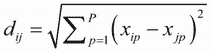

其中 *i* 和 *j* 是观测值，*P* 是变量的数量。换句话说，两个观测值之间的欧几里得距离是每个变量上平方差的和的平方根。

考虑`flexclust`包提供的`nutrient`数据集。该数据集包含 27 种肉类、鱼类和家禽的营养成分测量值。前几个观测值如下所示

```
> data(nutrient, package="flexclust")
> head(nutrient, 4)

             energy protein fat calcium iron
BEEF BRAISED    340      20  28       9  2.6
HAMBURGER       245      21  17       9  2.7
BEEF ROAST      420      15  39       7  2.0
BEEF STEAK      375      19  32       9  2.6
```

和前两个（红烧牛肉和汉堡）之间的欧几里得距离是

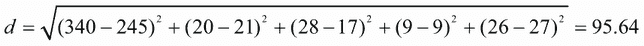

基础 R 安装中的`dist()`函数可用于计算矩阵或数据框中所有行（观测值）之间的距离。格式为`dist(``x``，method=)`，其中`x`是输入数据，默认`method="euclidean"`。该函数默认返回一个下三角矩阵，但可以使用`as.matrix()`函数使用标准括号符号访问距离。对于`nutrient`数据框，

```
> d <- dist(nutrient)
> as.matrix(d)[1:4,1:4]

             BEEF BRAISED HAMBURGER BEEF ROAST BEEF STEAK
BEEF BRAISED          0.0      95.6       80.9       35.2
HAMBURGER            95.6       0.0      176.5      130.9
BEEF ROAST           80.9     176.5        0.0       45.8
BEEF STEAK           35.2     130.9       45.8        0.0
```

较大的距离表示观测值之间的差异较大。一个观测值与自身的距离是 0。正如预期的那样，`dist()`函数提供了红烧牛肉和汉堡之间的相同距离，与手工计算相同。

混合数据类型的聚类分析

欧几里得距离通常是连续数据的距离度量选择。但如果存在其他变量类型，则需要其他相似性度量。您可以使用 `cluster` 包中的 `daisy()` 函数获取具有任何组合的二进制、名义、有序和连续属性的观测值之间的相似性矩阵。`cluster` 包中的其他函数可以使用这些相似性进行聚类分析。例如，`agnes()` 提供了聚合层次聚类，而 `pam()` 提供了基于中位数划分。

注意，`nutrient` 数据框中的距离在很大程度上受 `energy` 变量的贡献所主导，该变量的范围要大得多。缩放数据将有助于平衡每个变量的影响。在下一节中，您将应用层次聚类分析到此数据集。

## 16.3 层次聚类分析

如所述，在聚合层次聚类中，每个案例或观测值最初都是一个单独的簇。然后每次合并两个簇，直到所有簇合并成一个包含所有观测值的单个簇。算法如下：

1.  将每个观测值（行、案例）定义为簇。

1.  计算每个簇与每个其他簇之间的距离。

1.  将具有最小距离的两个簇合并。这减少了簇的数量一个。

1.  重复步骤 2 和 3，直到所有簇都合并成一个包含所有观测值的单个簇。

层次聚类算法之间的主要区别在于它们对簇距离的定义（步骤 2）。表 16.1 列出了五种最常见的层次聚类方法及其定义的两个簇之间的距离。

表 16.1 层次聚类方法

| 簇方法 | 定义两个簇之间的距离 |
| --- | --- |
| 单链接 | 一个簇中的点与另一个簇中的点的最短距离 |
| 完全链接 | 一个簇中的点与另一个簇中的点的最长距离 |
| 平均链接 | 一个簇中的每个点与另一个簇中的每个点的平均距离（也称为 UPGMA [未加权配对组平均]） |
| 质心 | 两个簇的质心（变量均值向量）之间的距离。对于单个观测值，质心是变量的值。 |
| 瓦德（Ward） | 两个簇之间所有变量的方差分析平方和的总和 |

单链聚类倾向于找到细长的、雪茄形的聚类。它也常见到一种称为*链式*的现象——不相似的观测值被合并到同一个聚类中，因为它们与它们之间的中间观测值相似。完全链聚类倾向于找到直径大致相等的紧凑聚类。它也可能对异常值敏感。平均链聚类在这两者之间提供了一个折中方案。它不太可能形成链式结构，并且对异常值不太敏感。它还倾向于将具有小方差差异的聚类合并在一起。

沃德方法倾向于将具有少量观测值的聚类合并在一起，并且倾向于产生观测值数量大致相等的聚类。它也可能对异常值敏感。由于其对聚类距离定义简单且易于理解，中心点方法提供了一个有吸引力的替代方案。它也比其他层次聚类方法对异常值不太敏感。但它可能不如平均链或沃德方法表现得好。

可以使用`hclust()`函数实现层次聚类。其格式为`hclust(*d*, method=)`，其中*`d`*是由`dist()`函数生成的距离矩阵，方法包括`"single"`、`"complete"`、`"average"`、`"centroid"`和`"ward"`。

在本节中，你将应用平均链聚类方法对第 16.2 节中引入的`nutrient`数据进行处理，以识别基于营养信息的 27 种食品类型之间的相似性、差异和分组。以下列表提供了执行聚类的代码。

列表 16.1 平均链聚类营养数据

```
data(nutrient, package="flexclust")
row.names(nutrient) <- tolower(row.names(nutrient))
nutrient.scaled <- scale(nutrient)                                  

d <- dist(nutrient.scaled)                                          

fit.average <- hclust(d, method="average")

library(ggplot2)
library(ggdendro)                          
ggdedgrogram(fit.average) + labs(title="Average Linkage Clustering")
```

首先，导入数据，并将行名设置为小写（因为我讨厌大写标签）。由于变量范围差异很大，它们被标准化为均值为 0 和标准差为 1。计算 27 种食品类型之间的欧几里得距离，并执行平均链聚类。最后，使用`ggplot2`和`ggdendro`包将结果绘制成树状图（见图 16.1）。

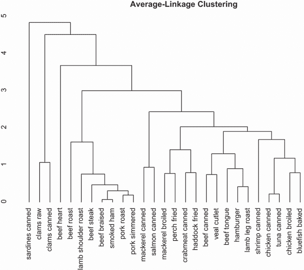

图 16.1 营养数据的平均链聚类

树状图显示了项目如何组合成聚类，并且是从下往上读取的。每个观测值最初都是它自己的聚类。然后，最接近的两个观测值（红烧牛肉和熏火腿）被合并。接下来，烤猪肉和炖猪肉被合并，然后是罐装鸡肉和罐装金枪鱼。在第四步中，红烧牛肉/熏火腿聚类和烤猪肉/炖猪肉聚类被合并（现在该聚类包含四个食品项目）。这个过程一直持续到所有观测值都被合并成一个单一的聚类。高度维度表示聚类合并的准则值。对于平均链聚类，这个准则值是每个聚类中每个点与其他聚类中每个点之间的平均距离。

如果你的目标是了解食物类型在营养方面的相似性或差异性，那么图 16.1 可能就足够了。它创建了 27 个项目中相似性/差异性的层次视图。罐装金枪鱼和鸡肉相似，并且两者与罐装蛤蜊都大相径庭。但如果最终目标是将这些食物分配到更少的（希望是有意义的）组中，则需要额外的分析来选择合适的簇数。

`NbClust` 包提供了许多指标来确定聚类分析中最佳簇数。它们之间并不保证会达成一致。事实上，它们可能不会。但可以使用这些结果作为选择可能的候选值 *K*（簇数）的指南。`NbClust()` 函数的输入包括要聚类的矩阵或数据框、要使用的距离度量以及聚类方法，以及要考虑的最小和最大簇数。它返回每个聚类指标以及每个指标提出的最佳簇数。下面的列表将此方法应用于营养数据的平均链聚类。

列表 16.2 选择簇数

```
> library(NbClust)
> library(factoextra)
> nc <- NbClust(nutrient.scaled, distance="euclidean", 
                min.nc=2, max.nc=15, method="average")
> fviz_nbclust(nc)
```

在这里，有两个标准有利于零个簇，一个标准有利于一个簇，四个标准有利于两个簇，依此类推。结果使用 `fviz_nbclust()` 函数绘制（图 16.2）。拥有最多投票数的簇数被认为是最佳簇数。在出现平局的情况下，通常会选择簇数较少的解决方案。

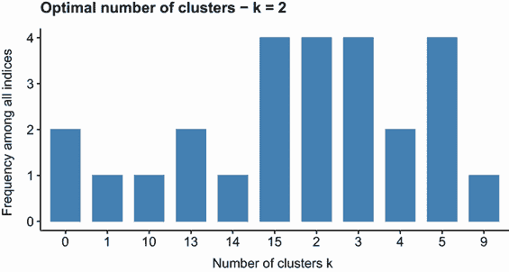

图 16.2 使用 `NbClust` 包提供的 26 个标准推荐的簇数

虽然图中建议有两个簇，但你也可以尝试 3 个、5 个和 15 个簇的解决方案，并选择最具解释意义的那个。下面的列表探讨了 5 个簇的解决方案。

列表 16.3 获取最终的簇解决方案

```
> clusters <- cutree(fit.average, k=5)                                  ❶
> table(clusters)

clusters
 1  2  3  4  5 
 7 16  1  2  1  

> nutrient.scaled$clusters <- clusters

> library(dplyr)
> profiles <- nutrient.scaled %>%                                        ❷
     group_by(clusters) %>%                                              ❷
     summarize_all(median)                                               ❷

   > profiles %>% round(3) %>% data.frame()  

  cluster energy protein    fat calcium    iron
1       1  1.310   0.000  1.379  -0.448  0.0811
2       2 -0.370   0.235 -0.487  -0.397 -0.6374
3       3 -0.468   1.646 -0.753  -0.384  2.4078
4       4 -1.481  -2.352 -1.109   0.436  2.2709
5       5 -0.271   0.706 -0.398   4.140  0.0811

> library(colorhcplot)                                                   ❸
> cl <-factor(clusters, levels=c(1:5),                                   ❸
              labels=paste("cluster", 1:5))                              ❸
> colorhcplot(fit.average, cl, hang=-1, lab.cex=.8, lwd=2,               ❸
              main="Average-Linkage Clustering\n5 Cluster Solution")     ❸
```

❶ 分配案例

❷ 描述簇

❸ 绘制结果

使用 `cutree()` 函数将树切割成 5 个簇 ❶。第一个簇有 7 个观测值，第二个簇有 16 个观测值，依此类推。然后使用 `dplyr` 函数为每个簇获取中位数轮廓 ❷。最后，重新绘制树状图，并使用 `colorhcplot` 函数来识别 5 个簇 ❸。在这里，`cl` 是一个带有簇标签的因子，`hang=-1` 将标签对齐在图的底部，`lab.cex` 控制标签的大小（这里为默认值的 80%），`lwd` 控制树状图线的宽度。图 16.3 显示了结果。如果你使用的是文本的打印版，请确保运行此代码。在灰度图中，颜色区分难以辨认。

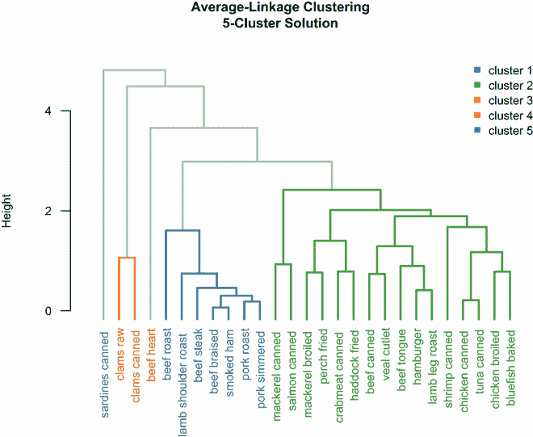

图 16.3 使用 5 簇解决方案的营养数据平均链聚类

鲨鱼形成自己的簇，其钙含量比其他食物组高得多。牛肉心也是一个单例，富含蛋白质和铁。蛤蜊簇蛋白质含量低，铁含量高。包含烤牛肉和炖猪肉的簇中的项目能量和脂肪含量高。最后，最大的组（鲭鱼到蓝鱼）铁含量相对较低。

当你预期嵌套聚类和有意义层次结构时，层次聚类特别有用。这在生物科学中通常是这种情况。但是，层次算法在贪婪的意义上，一旦一个观测值被分配到某个簇，它就不能在以后重新分配。此外，层次聚类在可能包括数百甚至数千个观测值的大样本中难以应用。分区方法在这些情况下可以很好地工作。

## 16.4 分区聚类分析

在分区方法中，观测值被分为*K*组，并重新排列以形成根据给定标准可能的最紧密的簇。本节考虑两种方法：k-means 和基于中位数（PAM）的分区。

### 16.4.1 K-means 聚类

最常见的分区方法是 k-means 聚类分析。从概念上讲，k-means 算法如下：

1.  选择*K*个质心（随机选择*K*行）。

1.  将每个数据点分配到其最近的质心。

1.  将质心重新计算为簇中所有数据点的平均值（即，质心是*p*-长度均值向量，其中*p*是变量的数量）。

1.  将数据点分配到其最近的质心。

1.  继续执行步骤 3 和 4，直到观测值不再重新分配或达到最大迭代次数（R 默认为 10）。

此方法的实现细节可能有所不同。

R 使用 Hartigan 和 Wong（1979 年）的高效算法，将观测值划分为*k*组，使得观测值到其分配的簇中心的平方和最小。这意味着在步骤 2 和 4 中，每个观测值被分配到具有最小值的簇中，

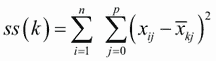

其中*k*是簇，*x[ij]*是第*i*个观测值的第*j*个变量的值，*x̄[kj]*是第*k*个簇的第*j*个变量的均值，*p*是变量的数量。

K-means 聚类方法可以处理比层次聚类方法更大的数据集。此外，观测值不会被永久性地分配到某个簇中——当这样做能改善整体解决方案时，它们会被移动。但是，使用均值意味着所有变量都必须是连续的，并且这种方法可能会受到异常值的影响。它还在存在非凸（例如，U 形）簇的情况下表现不佳。

R 中 k-means 函数的格式为`kmeans(*x, centers*)`，其中*`x`*是数值数据集（矩阵或数据框），而*`centers`*是要提取的簇的数量。该函数返回簇成员资格、质心、平方和（组内、组间、总平方和）以及簇大小。

由于 k-means 聚类分析从随机选择的 k 个质心开始，每次调用函数时都可能得到不同的解决方案。使用`set.seed()`函数以确保结果可重复。此外，这种聚类方法可能对质心的初始选择敏感。`kmeans()`函数有一个`nstart`选项，它尝试多个初始配置并报告最佳配置。例如，添加`nstart=25`生成 25 个初始配置。这种方法通常被推荐。

与层次聚类不同，k-means 聚类要求您提前指定要提取的簇的数量。同样，`NbClust`包可以用作指南。此外，k-means 解决方案中组内总平方和与簇数量之间的图表可能很有帮助。图表中的弯曲（类似于第 14.2.1 节中描述的 Scree 测试中的弯曲）可以表明合适的簇数量。

该图可以使用以下函数生成：

```
wssplot <- function(data, nc=15, seed=1234){
  require(ggplot2)
  wss <- numeric(nc)
  for (i in 1:nc){
    set.seed(seed)
    wss[i] <- sum(kmeans(data, centers=i)$withinss)
  }
  results <- data.frame(cluster=1:nc, wss=wss)
  ggplot(results, aes(x=cluster,y=wss)) +
    geom_point(color="steelblue", size=2) +
    geom_line(color="grey") +
    theme_bw() +
    labs(x="Number of Clusters",
         y="Within groups sum of squares")
}
```

`data`参数是要分析的数值数据集，`nc`是考虑的最大簇数，而`seed`是随机数种子。

让我们将 k-means 聚类应用于包含 178 个意大利葡萄酒样品的 13 个化学测量的数据集。数据最初来自 UCI 机器学习仓库([www.ics.uci.edu/~mlearn/MLRepository.html](http://www.ics.uci.edu/~mlearn/MLRepository.html))，但您将通过`rattle`包在这里访问它们。在此数据集中，观测值代表三种葡萄酒品种，如第一个变量（`Type`）所示。您将删除此变量，执行聚类分析，并查看您是否可以恢复已知的结构。

列表 16.4 葡萄酒数据的 k-means 聚类

```
> data(wine, package="rattle")
> library(NbClust)
> library(factoextra)
> head(wine)

  Type Alcohol Malic  Ash Alcalinity Magnesium Phenols Flavanoids
1    1   14.23  1.71 2.43       15.6       127    2.80       3.06
2    1   13.20  1.78 2.14       11.2       100    2.65       2.76
3    1   13.16  2.36 2.67       18.6       101    2.80       3.24
4    1   14.37  1.95 2.50       16.8       113    3.85       3.49
5    1   13.24  2.59 2.87       21.0       118    2.80       2.69
6    1   14.20  1.76 2.45       15.2       112    3.27       3.39
  Nonflavanoids Proanthocyanins Color  Hue Dilution Proline
1          0.28            2.29  5.64 1.04     3.92    1065
2          0.26            1.28  4.38 1.05     3.40    1050
3          0.30            2.81  5.68 1.03     3.17    1185
4          0.24            2.18  7.80 0.86     3.45    1480
5          0.39            1.82  4.32 1.04     2.93     735
6          0.34            1.97  6.75 1.05     2.85    1450

> df <- scale(wine[-1])                                     ❶
> head(df)

  Alcohol Malic   Ash Alcalinity Magnesium Phenols Flavanoids
1    1.51 -0.56  0.23      -1.17      1.91    0.81       1.03
2    0.25 -0.50 -0.83      -2.48      0.02    0.57       0.73
3    0.20  0.02  1.11      -0.27      0.09    0.81       1.21
4    1.69 -0.35  0.49      -0.81      0.93    2.48       1.46
5    0.29  0.23  1.84       0.45      1.28    0.81       0.66
6    1.48 -0.52  0.30      -1.29      0.86    1.56       1.36
  Nonflavanoids Proanthocyanins Color   Hue Dilution Proline
1         -0.66            1.22  0.25  0.36     1.84    1.01
2         -0.82           -0.54 -0.29  0.40     1.11    0.96
3         -0.50            2.13  0.27  0.32     0.79    1.39
4         -0.98            1.03  1.18 -0.43     1.18    2.33
5          0.23            0.40 -0.32  0.36     0.45   -0.04
6         -0.18            0.66  0.73  0.40     0.34    2.23

> wssplot(df)                                                 ❷
> set.seed(1234)                                              ❷
> nc <- NbClust(df, min.nc=2, max.nc=15, method="kmeans")     ❷
> fviz_nbclust(nc)                                            ❷

> set.seed(1234)
> fit.km <- kmeans(df, 3, nstart=25)                          ❸
> fit.km$size

[1] 62 65 51

> fit.km$centers                                               

  Alcohol Malic   Ash Alcalinity Magnesium Phenols Flavanoids Nonflavanoids
1    0.83 -0.30  0.36      -0.61     0.576   0.883      0.975        -0.561
2   -0.92 -0.39 -0.49       0.17    -0.490  -0.076      0.021        -0.033
3    0.16  0.87  0.19       0.52    -0.075  -0.977     -1.212         0.724
  Proanthocyanins Color   Hue Dilution Proline
1           0.579  0.17  0.47     0.78    1.12
2           0.058 -0.90  0.46     0.27   -0.75
3          -0.778  0.94 -1.16    -1.29   -0.41

> aggregate(wine[-1], by=list(cluster=fit.km$cluster), mean)

  cluster Alcohol Malic Ash Alcalinity Magnesium Phenols Flavanoids
1       1      14   1.8 2.4         17       106     2.8        3.0
2       2      12   1.6 2.2         20        88     2.2        2.0
3       3      13   3.3 2.4         21        97     1.6        0.7
  Nonflavanoids Proanthocyanins Color  Hue Dilution Proline
1          0.29             1.9   5.4 1.07      3.2    1072
2          0.35             1.6   2.9 1.04      2.8     495
3          0.47             1.1   7.3 0.67      1.7     620
```

❶ 标准化数据

❷ 确定簇的数量

❸ 执行 k-means 聚类分析

由于变量范围不同，它们在聚类之前需要进行标准化 ❶。接下来，使用`wssplot()`和`NbClust()`函数确定簇的数量 ❷。图 16.4 表明，当从一到三个簇移动时，组内平方和有明显的下降。在三个簇之后，这种下降趋势减弱，表明三个簇的解决方案可能适合数据。在图 16.5 中，`NbClust`包提供的 23 个标准中有 19 个建议三个簇的解决方案。请注意，并非所有 30 个标准都可以用于每个数据集。

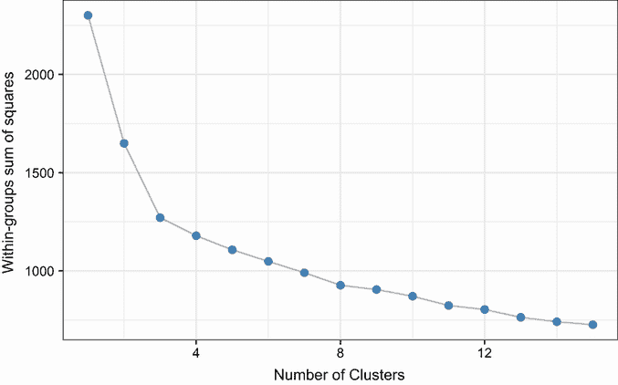

图 16.4 绘制组内平方和与提取簇数的关系图。从一到三个簇（之后减少很少）的急剧下降表明了三簇解决方案。

使用`kmeans()`函数获得最终的簇解决方案，并打印簇中心点❸。因为函数提供的中心点基于标准化数据，所以使用`aggregate()`函数以及簇成员资格来确定原始度量中每个簇的变量均值。


图 16.5 使用`NbClust`包提供的 26 个标准推荐簇数

比较簇的最简单方法是通过簇轮廓图。以下列表继续了列表 16.4 中的示例。

列表 16.5 簇轮廓图

```
library(ggplot2)
library(tidyr)
means <- as.data.frame(fit.km$centers)                                ❶
means$cluster <- 1:nrow(means)                                        ❶

plotdata <- gather(means, key="variable", value="value", -cluster)    ❷

ggplot(plotdata,                                                      ❸
       aes(x=variable,
           y=value,
           fill=variable,
           group=cluster)) +
  geom_bar(stat="identity") +
  geom_hline(yintercept=0) +
  facet_wrap(~cluster) +
  theme_bw() +
  theme(axis.text.x=element_text(angle=90, vjust=0),
        legend.position="none") +
  labs(x="", y="Standardized scores",
       title = "Mean Cluster Profiles")
```

❶ 准备均值轮廓

❷ 将数据转换为长格式

❸ 将轮廓绘制为分面条形图

首先，我们得到标准化变量上的簇均值并添加一个表示簇成员资格的变量❶。然后，我们将这个宽格式数据框转换为长格式（宽到长格式转换在第 5.5.2 节中描述）❷。最后，我们将轮廓绘制为分面条形图❸。图 16.6 显示了结果。平均簇轮廓有助于您了解使每个簇独特的东西。例如，与簇 2 和簇 4 相比，簇 1 在酒精、酚类、原花青素和脯氨酸上的平均得分较高。

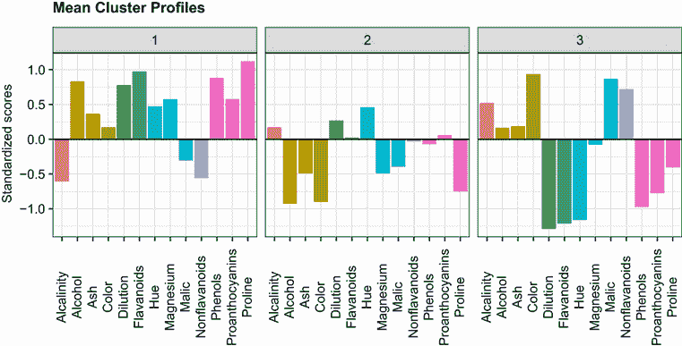

图 16.6 标准化数据中每个簇的均值轮廓。此图表有助于识别每个簇的独特特征。

另一种可视化簇分析结果的方法是双变量簇图。该图通过将每个观测值（酒）的坐标绘制在由 13 个检测变量得出的前两个主成分上创建。 （主成分在第十四章中描述。）每个点的颜色和形状标识其簇成员资格。点标签代表数据中每款酒行的编号。此外，每个簇周围都围绕着可以包含该簇所有点的最小椭圆。

可以使用`factoextra`包中的`fviz_cluster()`函数创建双变量簇图：

```
library(factoextra) 
fviz_cluster(fit.km, data=df)
```

图 16.7 显示了图表。我们可以看到簇 1 和簇 3 最不相似。酒 4 和酒 19 相似，而酒 4 和酒 171 非常不同。

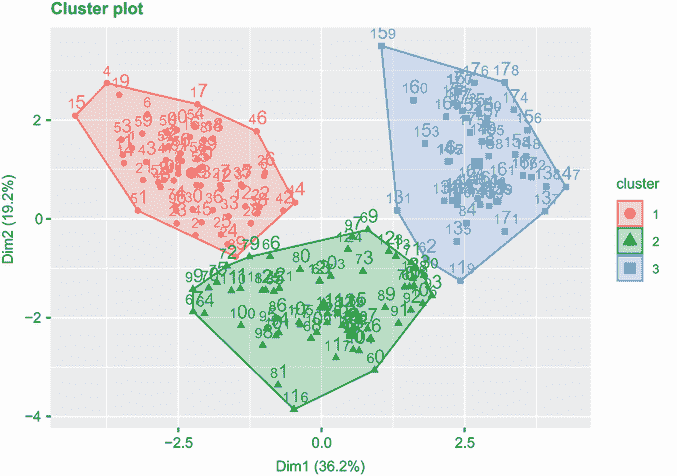

图 16.7 将 178 种酒分为 3 组的簇图。每种酒都绘制在数据的第一个和第二个主成分上。这些图表可以帮助我们看到酒与酒之间以及簇与簇之间的相似性/差异性。

簇分析通常是一种无监督技术，因为我们没有试图预测的输出变量。然而，在葡萄酒示例中，数据集中实际上有三个葡萄酒品种（`Type`）。

k-means 聚类如何揭示`Type`变量中包含的数据的实际结构？`Type`（葡萄酒品种）和聚类成员资格的交叉表如下所示

```
> ct.km <- table(wine$Type, fit.km$cluster)
> ct.km   
     1  2  3
  1 59  0  0
  2  3 65  3
  3  0  0 48
```

您可以使用`flexclust`包提供的调整后的兰德指数来量化类型和聚类之间的一致性。

```
> library(flexclust)
> randIndex(ct.km)
[1] 0.897
```

调整后的兰德指数提供了两个分区之间一致性的度量，考虑了偶然性。它介于-1（无一致性）到 1（完全一致性）之间。葡萄酒品种类型与聚类解决方案之间的一致性为 0.9。不错——我们喝点酒如何？

### 16.4.2 基于中位数的聚类

由于它基于均值，k-means 聚类方法可能对异常值敏感。基于中位数的聚类（PAM）提供了一种更稳健的解决方案。PAM 不是使用质心（变量均值的向量）来表示每个聚类，而是通过其最具代表性的观测值（称为*中位数*）来识别每个聚类。与 k-means 使用欧几里得距离不同，PAM 可以基于任何距离度量。因此，它可以适应混合数据类型，并且不仅限于连续变量。

PAM 算法如下：

1.  随机选择*K*个观测值（每个称为中位数）。

1.  计算每个观测值与每个中位数之间的距离/不相似度。

1.  将每个观测值分配到其最近的中位数。

1.  计算每个观测值与其中位数之间的距离之和（总成本）。

1.  选择一个不是中位数的点，并将其与其中位数交换。

1.  将每个点重新分配到其最近的中位数。

1.  计算总成本。

1.  如果这个总成本更小，则保留新点作为中位数。

1.  重复步骤 5-8，直到中位数不再改变。

在[PAM 方法中潜在数学的好的、工作过的例子可以在[`en.wikipedia.org/wiki/k-medoids`](http://en.wikipedia.org/wiki/k-medoids)找到（我通常不引用维基百科，但这是一个很好的例子）。

您可以使用`cluster`包中的`pam()`函数进行基于中位数聚类。格式为`pam(*x*, *k*, metric="euclidean", stand=FALSE)`，其中*`x`*是一个数据矩阵或数据框，*`k`*是聚类数量，`metric`是使用的距离/不相似度度量类型，而`stand`是一个逻辑值，表示在计算此度量之前是否应对变量进行标准化。在以下列表中，PAM 应用于葡萄酒数据。

列表 16.6 葡萄酒数据的基于中位数的聚类

```
> library(cluster)
> set.seed(1234)
> fit.pam <- pam(wine[-1], k=3, stand=TRUE)          ❶
> fit.pam$medoids                                    ❷

     Alcohol Malic  Ash Alcalinity Magnesium Phenols Flavanoids
[1,]    13.5  1.81 2.41       20.5       100    2.70       2.98
[2,]    12.2  1.73 2.12       19.0        80    1.65       2.03
[3,]    13.4  3.91 2.48       23.0       102    1.80       0.75
     Nonflavanoids Proanthocyanins Color  Hue Dilution Proline
[1,]          0.26            1.86   5.1 1.04     3.47     920
[2,]          0.37            1.63   3.4 1.00     3.17     510
[3,]          0.43            1.41   7.3 0.70     1.56     750
```

❶ 标准化聚类数据

❷ 打印中位数

注意，中位数是包含在`wine`数据集中的实际观测值。在这种情况下，它们是观测值 36、107 和 175，并且它们已被选中以代表三个聚类。

还要注意，在这个例子中，PAM 的表现不如 k-means 好：

```
> ct.pam <- table(wine$Type, fit.pam$clustering)

     1  2  3
  1 59  0  0
  2 16 53  2
  3  0  1 47

> randIndex(ct.pam)
[1] 0.699
```

调整后的兰德指数已从 0.9（k-means）降至 0.7。创建聚类轮廓图和双变量聚类图留作练习。

## 16.5 避免不存在的聚类

在我完成这次讨论之前，需要提醒一点。聚类分析是一种旨在识别数据集中凝聚子群的方法。它在这方面做得非常好。事实上，它太好了，甚至可以在不存在聚类的地方找到聚类。

考虑以下代码：

```
library(fMultivar)
library(ggplot2)
set.seed(1234)
df <- rnorm2d(1000, rho=.5)
df <- as.data.frame(df)
ggplot(df, aes(x=V1, y=V2)) + 
  geom_point(alpha=.3) + theme_minimal() + 
  labs(title="Bivariate Normal Distribution with rho=0.5")
```

`fMultivar`包中的`rnorm2d()`函数用于从相关系数为 0.5 的双变量正态分布中抽取 1,000 个观测值。图 16.8 显示了生成的图形。显然，这些数据中没有聚类。

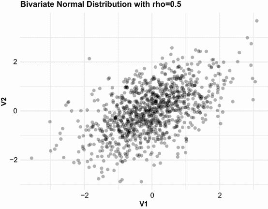

图 16.8 双变量正态数据（n = 1000）。这些数据中没有聚类。

然后使用`wssplot()`和`NbClust()`函数来确定存在的聚类数量：

```
wssplot(df)
library(NbClust)
library(factoextra)
nc <- NbClust(df, min.nc=2, max.nc=15, method="kmeans")
fviz_nbclust(nc)
```

图 16.9 和 16.10 展示了结果。

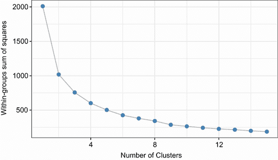

图 16.9 双变量正态数据中组内平方和与 k-means 聚类数量的关系图

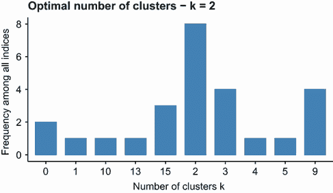

图 16.10 `NbClust`包中根据标准推荐的用于双变量正态数据的聚类数量。建议有两个聚类。

两种方法都表明至少有两个聚类。如果你使用 k-means 进行两聚类分析，

```
library(ggplot2)
fit <- kmeans(df, 2)
df$cluster <- factor(fit$cluster)
ggplot(data=df, aes(x=V1, y=V2, color=cluster, shape=cluster)) +  
       theme_minimal() +
       geom_point(alpha=.5) + 
       ggtitle("Clustering of Bivariate Normal Data")
```

你会得到图 16.11 中显示的两个聚类图。

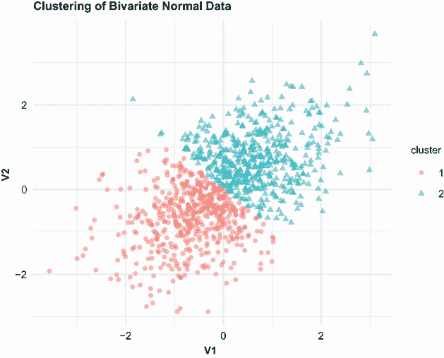

图 16.11 双变量正态数据的 K-means 聚类分析，提取出两个聚类。请注意，聚类是对数据的任意划分。

显然，这种划分是人为的。这里没有真实的聚类。你如何避免这种错误？虽然这不是万无一失的，但我发现两种方法是有帮助的。第一种是`clusterability`包提供的 DIP 测试：

```
> library(clusterability)
> clusterabilitytest(df[-3], "dip")

Null Hypothesis: number of modes = 1
Alternative Hypothesis: number of modes > 1
p-value: 0.9655 
Dip statistic: 0.00823
```

`df[-3]`从数据中删除了因子变量（聚类成员）。零假设是只有一个聚类（模态）。由于 p > .05，我们不能拒绝这个假设。数据不支持聚类结构。

另一种方法使用由`NbClust`报告的立方聚类准则（CCC）。CCC 通常有助于揭示不存在结构的情况。代码如下：

```
CCC = nc$All.index[, 4]
k <- length(CCC)
plotdata <- data.frame(CCC = CCC, k = seq_len(k))
ggplot(plotdata, aes(x=k, y=CCC)) +
  geom_point() + geom_line() +
  theme_minimal() +
  scale_x_continuous(breaks=seq_len(k)) +
  labs(x="Number of Clusters")
```

生成的图形显示在图 16.12 中。当两个或更多聚类的 CCC 值都是负数且递减时，分布通常是单峰的。

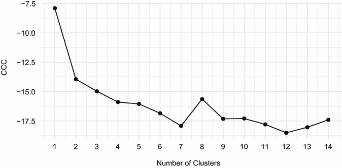

图 16.12 双变量正态数据的立方聚类准则图。它正确地表明不存在聚类。

聚类分析（或你对它的解释）能够找到错误聚类的能力使得聚类分析的验证步骤变得重要。如果你试图识别在某种意义上真实的聚类（而不是一个方便的划分），确保结果稳健且可重复。尝试不同的聚类方法，并使用新的样本重复研究结果。如果相同的聚类始终被恢复，你可以更有信心地相信结果。

## 16.6 进一步探讨

聚类分析是一个广泛的主题，R 语言目前提供了应用这一方法的最全面的功能之一。要了解更多关于这些功能的信息，请参阅 CRAN 任务视图中的聚类分析与有限混合模型（[`cran.r-project.org/web/views/Cluster.html`](http://cran.r-project.org/web/views/Cluster.html)）。此外，Tan、Steinbach 和 Kumar（2006）有一本关于数据挖掘技术的优秀书籍，其中包括一个关于聚类分析的清晰章节，您可以免费下载（[www-users.cs.umn.edu/~kumar/dmbook/ch8.pdf](http://www-users.cs.umn.edu/~kumar/dmbook/ch8.pdf)）。最后，Everitt、Landau、Leese 和 Stahl（2011）编写了一本关于这个主题的实用且备受推崇的教科书。

## 摘要

+   聚类分析是将观测值排列成紧密群体的常见方法。

+   由于我们对“聚类”或“聚类之间的距离”没有统一的定义，因此已经开发了许多聚类方法。

+   聚类分析中最受欢迎的两个类别是层次聚类和划分聚类。每个类别中都有许多聚类方法。没有一种方法在所有情况下都是最好的。

+   在确定数据集中聚类数量时，也没有一种最佳方法。尝试几种不同的方法并选择最有意义或最实用的方法可能是有价值的。

+   聚类分析可以揭示是否存在聚类！如果您的目标是将数据划分为方便的、紧密的群体（例如，客户细分），这可能就足够了。然而，如果您正在寻求揭示具有理论意义的自然发生的群体（例如，基于症状和病史的抑郁症亚型），那么通过用新数据重复验证您的发现是很重要的。
