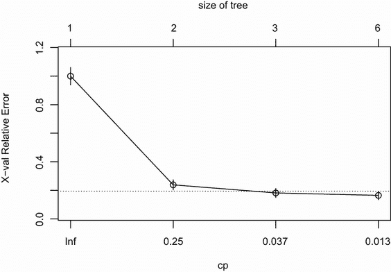
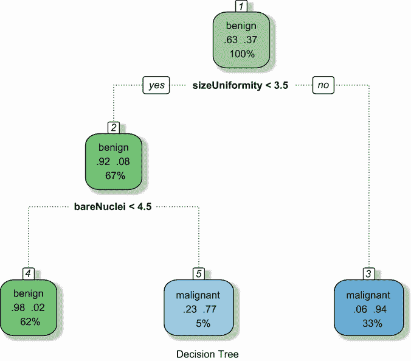
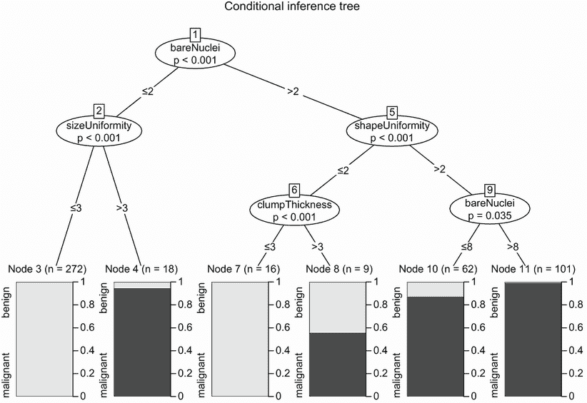
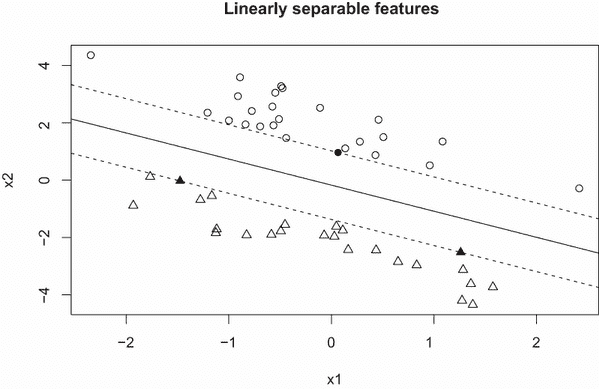
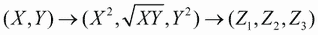
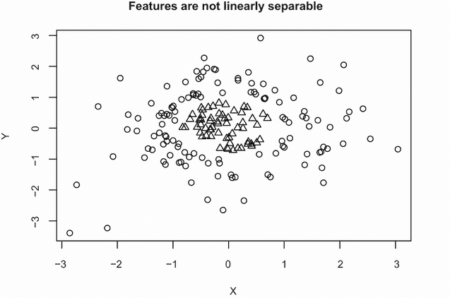
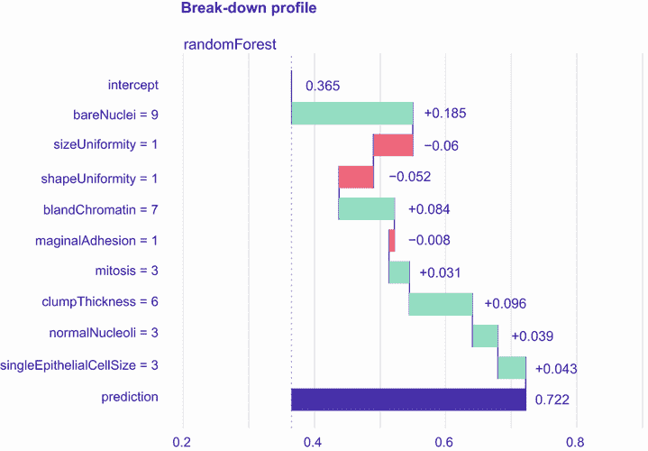
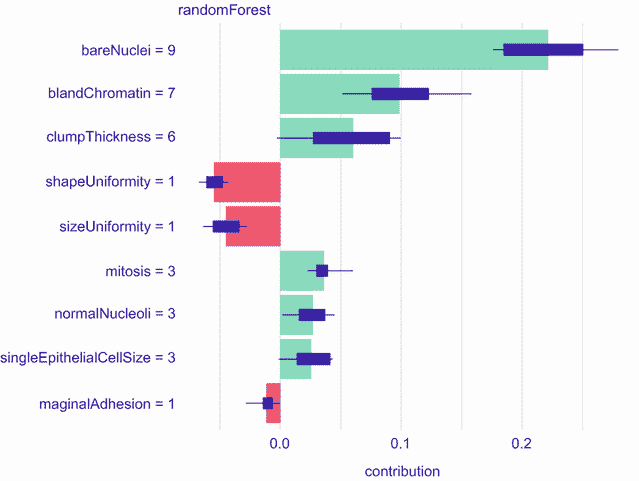

# 17 分类

本章涵盖

+   使用决策树进行分类

+   构建随机森林分类器

+   创建支持向量机

+   评估分类精度

+   理解复杂模型

数据分析师经常需要从一组预测变量中预测一个分类结果。一些例子包括

+   根据个人的人口统计和财务历史预测个人是否会偿还贷款

+   根据患者的症状和生命体征判断一个 ER 患者是否正在经历心脏病发作

+   根据关键词、图像、超文本、标题信息和来源判断一封电子邮件是否为垃圾邮件

这些案例中的每一个都涉及从一组预测变量（也称为*特征*）中预测一个二元分类结果（良好信用风险/不良信用风险；心脏病发作/无心脏病发作；垃圾邮件/非垃圾邮件）。目标是找到一种准确的方法将新案例分类到两个组之一。

监督机器学习领域提供了许多用于预测分类结果的分类方法，包括逻辑回归、决策树、随机森林、支持向量机和人工神经网络。前四种在本章中讨论。人工神经网络超出了本书的范围。参见 Ciaburro 和 Venkateswaran（2017）以及 Chollet 和 Allaire（2018）以了解更多相关信息。

监督学习从包含预测变量和结果值的观察值集合开始。然后，数据集被分为训练样本和测试样本。使用训练样本中的数据开发一个预测模型，并使用测试样本中的数据测试其准确性。需要这两个样本，因为分类技术最大化给定数据集的预测。如果使用生成模型的数据来评估其有效性，估计将过于乐观。通过将训练样本上开发的分类规则应用于单独的测试样本，可以获得更现实的准确性估计。一旦创建了有效的预测模型，就可以使用它来预测只有预测变量已知的情况下的结果。

在本章中，您将使用`rpart`、`rattle`和`partykit`包来创建和可视化决策树；使用`randomForest`包来拟合随机森林；以及使用`e1071`包来构建支持向量机。逻辑回归将通过基础 R 安装中的`glm()`函数进行拟合。在开始之前，请确保安装必要的包：

```
pkgs <- c("rpart", "rattle", "partykit", 
          "randomForest", "e1071")
install.packages(pkgs, depend=TRUE)
```

本章中使用的首要示例来自威斯康星州乳腺癌数据，该数据最初发布在 UCI 机器学习库中。目标是开发一个模型，从细针穿刺组织抽吸（从皮肤下肿块或团块中用细空心针取出的组织样本）的特征来预测患者是否患有乳腺癌。

## 17.1 准备数据

威斯康星州乳腺癌数据集作为逗号分隔的文本文件可在 UCI 机器学习服务器上获得（[`archive.ics.uci.edu/ml`](http://archive.ics.uci.edu/ml)）。该数据集包含 699 个细针穿刺样本，其中 458 个（65.5%）为良性，241 个（34.5%）为恶性。数据集包含 11 个变量，文件中不包含变量名。16 个样本有缺失数据，并在文本文件中以问号（?）编码。

变量如下：

+   ID

+   块状厚度

+   细胞大小均匀性

+   细胞形状均匀性

+   边缘粘附

+   单个上皮细胞大小

+   无核裸露

+   稀疏染色质

+   正常核仁

+   有丝分裂

+   类别

第一个变量是一个 ID 变量（你将删除它），最后一个变量（类别）包含结果（编码为`2=良性`，`4=恶性`）。你还将排除包含缺失值的观测值。

对于每个样本，记录了之前发现与恶性相关的九个细胞学特征。这些变量中的每一个都从 1（最接近良性）评分到 10（最不典型）。但没有任何一个预测因子可以单独区分良性和恶性样本。挑战在于找到一组分类规则，可以用来从这些九个细胞特征的某些组合中准确预测恶性。有关详细信息，请参阅 Mangasarian 和 Wolberg（1990）。

在以下列表中，包含数据的逗号分隔的文本文件从 UCI 存储库下载，并随机分为训练样本（70%）和测试样本（30%）。

列表 17.1 准备乳腺癌数据

```
loc <- "http://archive.ics.uci.edu/ml/machine-learning-databases"
ds  <- "breast-cancer-wisconsin/breast-cancer-wisconsin.data"
url <- paste(loc, ds, sep="/")

breast <- read.table(url, sep=",", header=FALSE, na.strings="?")
names(breast) <- c("ID", "clumpThickness", "sizeUniformity",
                   "shapeUniformity", "maginalAdhesion", 
                   "singleEpithelialCellSize", "bareNuclei", 
                   "blandChromatin", "normalNucleoli", "mitosis", "class")

df <- breast[-1]
df$class <- factor(df$class, levels=c(2,4), 
                   labels=c("benign", "malignant"))
df <- na.omit(df)

set.seed(1234)
index <- sample(nrow(df), 0.7*nrow(df))
train <- df[index,]
test <- df[-index,]
table(train$class)
table(test$class)
```

训练样本有 478 个案例（302 个良性，176 个恶性），测试样本有 205 个案例（142 个良性，63 个恶性）。

训练样本将用于创建分类方案，使用逻辑回归、决策树、条件决策树、随机森林和支撑向量机。测试样本将用于评估这些方案的有效性。通过在整个章节中使用相同的示例，你可以比较每种方法的结果。

## 17.2 逻辑回归

*逻辑回归*是一种广义线性模型，常用于从一组数值变量中预测二元结果（有关详细信息，请参阅第 13.2 节）。在基础 R 安装中使用的`glm()`函数用于拟合模型。分类预测因子（因子）会自动替换为一组虚拟编码变量。威斯康星州乳腺癌数据中的所有预测因子都是数值的，因此不需要虚拟编码。下一个列表提供了数据集的逻辑回归分析。

列表 17.2 使用`glm()`进行逻辑回归

```
> fit.logit <- glm(class~., data=train, family=binomial())   ❶
> summary(fit.logit)                                         ❷

Call:
glm(formula = class ~ ., family = binomial(), data = train)

Deviance Residuals: 
    Min       1Q   Median       3Q      Max  
-3.6141  -0.1204  -0.0744   0.0236   2.1845  

Coefficients:
                         Estimate Std. Error z value Pr(>|z|)    
(Intercept)              -9.68650    1.29722  -7.467 8.20e-14 ***
clumpThickness            0.48002    0.15244   3.149  0.00164 ** 
sizeUniformity            0.05643    0.29272   0.193  0.84714    
shapeUniformity           0.13180    0.31643   0.417  0.67703    
maginalAdhesion           0.40721    0.14038   2.901  0.00372 ** 
singleEpithelialCellSize -0.03274    0.18095  -0.181  0.85643    
bareNuclei                0.44744    0.11176   4.004 6.24e-05 ***
blandChromatin            0.48257    0.19220   2.511  0.01205 *  
normalNucleoli            0.23550    0.12903   1.825  0.06798 .  
mitosis                   0.66184    0.28785   2.299  0.02149 *  
---
Signif. codes:  0 ‘***’ 0.001 ‘**’ 0.01 ‘*’ 0.05 ‘.’ 0.1 ‘ ’ 1

> prob <- predict(fit.logit, test, type="response")           ❸
> logit.pred <- factor(prob > .5, levels=c(FALSE, TRUE),      ❸
                       labels=c("benign", "malignant"))       ❸
> logit.perf <- table(test$class, logit.pred,                 ❹
                      dnn=c("Actual", "Predicted"))           ❹
> logit.perf

           Predicted
Actual      benign malignant
  benign       140         2
  malignant      3        60
```

❶ 拟合逻辑回归

❷ 检验模型

❸ 对新案例进行分类

❹ 评估预测准确性

首先，使用`class`作为因变量，其余变量作为预测变量，拟合一个逻辑回归模型 ❶。该模型基于训练数据框中的案例。接下来显示模型的系数 ❷。第 13.2 节提供了解释逻辑模型系数的指南。

接下来，使用训练数据集上开发的预测方程对测试数据集中的案例进行分类。默认情况下，`predict()`函数预测恶性结果的 log odds。通过使用`type="response"`选项，返回获得恶性分类的概率而不是 log odds。在下一条线中，概率大于 0.5 的案例被分类为恶性组，而概率小于或等于 0.5 的案例被分类为良性。

最后，打印出实际状态和预测状态（称为混淆矩阵）的交叉表 ❹。它显示 140 个良性案例被分类为良性，60 个恶性案例被分类为恶性。

在测试样本中，正确分类的案例总数（也称为准确率）为（140 + 60）/ 205 或 98%。在 17.6 节中更详细地讨论了评估分类方案准确性的统计方法。

在继续之前，请注意，有三个预测变量（`sizeUniformity`、`shapeUniformit`y 和`singleEpithelialCellSize`）的系数在 p < .10 水平上与零没有差异。对于具有非显著系数的预测变量，你将如何处理？如果有的话。

在预测上下文中，通常从最终模型中删除此类变量是有用的。当大量非信息性预测变量向系统中添加噪声时，这一点尤为重要。

在这种情况下，可以使用逐步逻辑回归生成一个变量更少的较小模型。通过添加或删除预测变量以获得具有较小 AIC 值的模型。在当前上下文中，你可以使用

```
logit.fit.reduced <- step(fit.logit)
```

以获得一个更简约的模型。简化后的模型排除了之前提到的三个变量。当用于预测测试数据集中的结果时，这个简化模型表现同样出色。试一试。

我们接下来要考虑的方法涉及决策树或分类树的创建。

## 17.3 决策树

*决策树*在数据挖掘领域很受欢迎。它们涉及在预测变量上创建一系列二元分割，以创建一个可以用于将新观测值分类为两组之一的树。在本节中，我们将探讨两种类型的决策树：经典树和条件推断树。

### 17.3.1 经典决策树

构建*经典决策树*的过程从二元结果变量（在本例中为良性/恶性）和一组预测变量（九项细胞学测量）开始。算法如下：

1.  选择将数据分为两组的最佳预测变量，使得两组的输出纯度（同质性）最大化（即在一个组中尽可能多的良性病例和在另一个组中的恶性病例）。如果预测变量是连续的，选择一个分割点，以最大化两组的纯度。如果预测变量是分类的（在本例中不适用），将类别组合起来，以获得具有最大纯度的两组。

1.  将数据分为这两个组，并对每个子组继续进行这个过程。

1.  重复步骤 1 和 2，直到子组包含少于最小观察数或没有分割可以降低超过指定阈值的纯度。

    最终集合中的子组被称为终端节点。每个终端节点根据该节点样本中输出最频繁的值被分类为输出的一类或另一类。

1.  要对案例进行分类，将其沿树向下运行到终端节点，并分配在步骤 3 中分配的模态输出值。

不幸的是，这个过程往往会产生一个过大且过度拟合的树。因此，新的案例分类效果不佳。为了补偿，你可以通过选择具有最低 10 折交叉验证预测误差的树来修剪树。然后，这个修剪后的树将用于未来的预测。

在 R 中，可以使用`rpart`包中的`rpart()`和`prune()`函数来生长和修剪决策树。以下列表创建了一个用于将细胞数据分类为良性或恶性的决策树。

列表 17.3 使用`rpart()`创建经典决策树

```
> library(rpart)
> dtree <- rpart(class ~ ., data=train, method="class",        ❶
                 parms=list(split="information"))              ❶
> dtree$cptable

          CP nsplit  rel error    xerror       xstd
1 0.79545455      0 1.00000000 1.0000000 0.05991467
2 0.07954545      1 0.20454545 0.3068182 0.03932359
3 0.01704545      2 0.12500000 0.1590909 0.02917149
4 0.01000000      5 0.07386364 0.1704545 0.03012819

> plotcp(dtree)

> dtree.pruned <- prune(dtree, cp=.01705)                      ❷

> library(rattle)
> fancyRpartPlot(dtree.pruned,  sub="Classification Tree")

> dtree.pred <- predict(dtree.pruned, test, type="class")      ❸
> dtree.perf <- table(test$class, dtree.pred, 
                      dnn=c("Actual", "Predicted"))
> dtree.perf
           Predicted
Actual      benign malignant
  benign       136         6
  malignant      3        60
```

❶ 生长树

❷ 修剪树

❸ 对新案例进行分类

首先，使用`rpart()`函数❶生长树。你可以使用`print(dtree)`和`summary(dtree)`来检查拟合的模型（此处未显示）。树可能太大，需要修剪。

要选择最终的树大小，检查由`rpart()`返回的列表中的`cptable`组件。它包含有关各种树大小的预测误差的数据。复杂性参数（`cp`）用于惩罚较大的树。树的大小由分支分割的数量（`nsplit`）定义。具有 n 个分割的树有 n + 1 个终端节点。`rel`误差列包含给定大小的树在训练样本中的误差率。交叉验证误差（`xerror`）基于 10 折交叉验证（也使用训练样本）。`xstd`列包含交叉验证误差的标准误差。

`plotcp()`函数绘制交叉验证误差与复杂性参数（见图 17.1）的关系。对于最终树大小的一个好选择是具有在最小交叉验证误差值一个标准误差范围内的交叉验证误差的最小树。



图 17.1 复杂度参数与交叉验证误差的关系。虚线是标准差规则的上限（0.16 + 0.03 = 0.19）。该图表明应选择线下最左侧的 `cp` 值对应的树。

最小交叉验证误差为 0.16，标准误差为 0.03。在这种情况下，选择交叉验证误差在 0.16 ± 0.03（即介于 0.13 和 0.19 之间）的最小树。查看列表 17.3 中的 `cptable` 表，具有两个分割（交叉验证误差 = 0.16）的树符合这一要求。等效地，您可以选择图 17.1 中线下最大复杂度参数对应的树大小。结果再次表明，具有两个分割（三个终端节点）的树。

`prune()` 函数使用复杂度参数来将树裁剪到所需的大小。它接受完整的树，并根据所需的复杂度参数剪掉最不重要的分割。根据前面的讨论，我们将使用 `prune (dtree, cp=0.01705)`，它返回一个具有所需大小 ❷ 的树。该函数返回复杂度参数低于指定 `cp` 值的最大树。

rattle 包中的 `fancyRpartPlot()` 函数用于绘制最终决策树的吸引人图表（见图 17.2）。此函数有几个选项（有关详细信息，请参阅 `?fancyRpartPlot`）。`type=2` 选项（默认）在每个节点下方绘制分割标签。此外，还显示了每个类的比例以及每个节点中的观测值百分比。要分类一个观测值，从树的顶部开始，如果条件为真则移动到左侧分支，否则移动到右侧。继续沿着树向下移动，直到遇到终端节点。使用节点的标签对观测值进行分类。



图 17.2 用于预测癌症状态的常规（裁剪）决策树。从树的顶部开始，如果条件为真则向左移动，否则向右移动。当一个观测值遇到终端节点时，对其进行分类。每个节点包含该节点中类的概率以及样本的百分比。

最后，使用 `predict()` 函数对测试样本中的每个观测值进行分类 ❸。提供了实际状态与预测状态之间的交叉表。测试样本的整体准确率为 96%。请注意，决策树可能会偏向于选择具有许多级别或许多缺失值的预测变量。

### 17.3.2 条件推断树

在继续讨论随机森林之前，让我们看看传统决策树的一个重要变体，称为条件推断树。条件推断树与传统树类似，但变量和分割是根据显著性测试而不是纯度/同质性度量来选择的。显著性测试是置换测试（在第十二章中讨论）。

在这种情况下，算法如下：

1.  计算每个预测变量与结果变量之间关系的 p 值。

1.  选择 p 值最低的预测变量。

1.  探索所选预测变量和因变量上所有可能的二元分割（使用置换检验）并选择最显著的分割。

1.  将数据分为这两组，并对每个子组继续进行过程。

1.  继续直到分割不再显著或达到最小节点大小。

`party`包中的`ctree()`函数提供了条件推断树。在下一段代码中，为乳腺癌数据生成了一个条件推断树。

列表 17.4 使用`ctree()`创建条件推断树

```
library(partykit)
fit.ctree <- ctree(class~., data=train)
plot(fit.ctree, main="Conditional Inference Tree",
     gp=gpar(fontsize=8))

> ctree.pred <- predict(fit.ctree, test, type="response")
> ctree.perf <- table(test$class, ctree.pred, 
                      dnn=c("Actual", "Predicted"))
> ctree.perf

          Predicted
Actual      benign malignant
  benign       138         4
  malignant      2        61
```

注意，条件推断树不需要剪枝，并且该过程相对自动化。此外，`partykit`包提供了吸引人的绘图选项。图 17.3 绘制了条件推断树。每个节点的阴影区域代表该节点中恶性案例的比例。



图 17.3 乳腺癌数据的条件推断树

以类似图 17.3 的图形显示 rpart()树

如果您使用`rpart()`创建经典决策树，但希望使用类似图 17.3 的图形显示结果树，`partykit`包可以提供帮助。您可以使用语句`plot(as.party(an.rpart.tree))`创建所需的图形。例如，尝试使用列表 17.3 中创建的`dtree.pruned`对象创建类似图 17.3 的图形，并将结果与图 17.2 中展示的图形进行比较。

传统方法和条件方法生成的决策树可能存在显著差异。在当前示例中，它们的准确性相似（96%对 97%），但树结构相当不同。在下文中，将生成并组合大量决策树以将案例分类到不同的组别。

## 17.4 随机森林

随机森林是一种监督学习的集成学习方法。开发了多个预测模型，并将结果汇总以提高分类率。您可以在 Leo Breiman 和 Adele Cutler 撰写的[`mng.bz/7Nul`](http://mng.bz/7Nul)找到关于随机森林的全面介绍。

随机森林的算法涉及对案例和变量进行采样以创建大量决策树。每个案例由每个决策树进行分类。然后使用该案例最常见的分类作为结果。

假设*N*是训练样本中的案例数量，*M*是变量数量。然后算法如下：

1.  通过从训练集中有放回地采样*N*个案例来生成大量决策树。

1.  在每个节点采样*m < M*个变量。这些变量被认为是该节点分割的候选变量。值*m*对每个节点相同。

1.  不进行剪枝，完整地生成每棵树（最小节点大小设置为 1）。

1.  终端节点根据该节点中案例的众数分配给一个类别。

1.  通过将新案例发送到所有树并采取投票的方式进行分类——多数决定。

通过使用在构建树时未选择的案例进行分类来获得袋外（OOB）错误估计。当没有测试样本时，这是一个优点。随机森林也提供变量重要性的自然度量，您将看到这一点。

随机森林是通过`randomForest`包中的`randomForest()`函数生成的。默认的树的数量是 500，默认在每个节点上抽取的变量数量是`sqrt(M)`，最小节点大小是 1。

下面的列表提供了预测乳腺癌数据中恶性肿瘤状态的代码和结果。

列表 17.5 随机森林

```
> library(randomForest)
> set.seed(1234)
> fit.forest <- randomForest(class~., data=train,      ❶
                             importance=TRUE)          ❶
> fit.forest

Call:
 randomForest(formula = class ~ ., data = train, importance = TRUE) 
               Type of random forest: classification
                     Number of trees: 500
No. of variables tried at each split: 3

        OOB estimate of  error rate: 2.93%
Confusion matrix:
          benign malignant class.error
benign       293         9  0.02980132
malignant      5       171  0.02840909

> randomForest::importance(fit.forest, type=2)         ❷

                         MeanDecreaseGini
clumpThickness                   9.794852
sizeUniformity                  58.635963
shapeUniformity                 49.754466
maginalAdhesion                  8.373530
singleEpithelialCellSize        16.814313
bareNuclei                      36.621347
blandChromatin                  25.179804
normalNucleoli                  14.177153
mitosis                          2.015803

> forest.pred <- predict(fit.forest, test)             ❸
> forest.perf <- table(test$class, forest.pred,        ❸
                       dnn=c("Actual", "Predicted"))   ❸
> forest.perf

           Predicted
Actual      benign malignant
  benign       140         2
  malignant      3        60
```

❶ 生成森林

❷ 确定变量重要性

❸ 分类新案例

首先，使用`randomForest()`函数通过从训练样本中重复抽取 489 个观测值以及在每个树的每个节点上抽取 3 个变量来生成 500 棵传统的决策树❶。

随机森林可以通过`information=TRUE`选项提供变量重要性的自然度量，并通过`importance()`函数打印出来❷。`rattle`和`randomForest`包都有一个名为`importance()`的函数。由于我们在本章中加载了这两个包，因此在代码中使用`randomForest::importance()`以确保调用正确的函数。由`type=2`选项指定的相对重要性度量是从该变量分割中平均所有树的节点纯度（异质性）的总减少量。节点纯度用基尼系数来衡量。`sizeUniformity`是最重要的变量，而`mitosis`是最不重要的。

最后，使用随机森林对测试样本进行分类，并计算预测准确性❸。请注意，测试样本中缺失值的案例不会被分类。预测准确性（总体为 98%）非常出色。

虽然`randomForest`包提供基于传统决策树的森林，但`party`包中的`cforest()`函数可以用来生成基于条件推断树的随机森林。如果预测变量高度相关，使用条件推断树的随机森林可能提供更好的预测。

与其他分类方法相比，随机森林通常非常准确。此外，它们可以处理大型问题（许多观测值和变量）、训练集中大量缺失数据，以及变量数量远大于观测值数量的情况。提供 OOB 错误率和变量重要性度量也是显著的优点。

一个显著的缺点是理解分类规则（有 500 棵树！）并将其传达给他人很困难。此外，你需要存储整个森林来对新案例进行分类。

随机森林是一个*黑盒*模型。预测值进入，准确的预测结果出来，但很难理解盒子里（模型）发生了什么。我们将在第 17.7 节中解决这个问题。

我们将要考虑的最终分类模型是支持向量机。

## 17.5 支持向量机

*支持向量机（SVMs）*是一组监督机器学习模型，可用于分类和回归。它们目前很受欢迎，部分原因是它们在开发准确预测模型方面的成功，部分原因是支撑该方法的优雅数学。我们将专注于使用 SVMs 进行二元分类。

支持向量机（SVMs）寻求在多维空间中分离两个类别的最优超平面。超平面被选择以最大化两个类别最近点之间的*间隔*。间隔边界上的点被称为*支持向量*（它们有助于定义间隔），间隔的中间是分离超平面。

对于一个*N*-维空间（即，有*N*个预测变量），最优超平面（也称为*线性决策表面*）有*N* - 1 个维度。如果有两个变量，表面是一条线。对于三个变量，表面是一个平面。对于 10 个变量，表面是一个 9 维超平面。试图想象它会让你头疼。

考虑图 17.4 中所示的两个维度的例子。圆圈和三角形代表两组。*间隔*是间隙，由两条虚线之间的距离表示。虚线上的点（实心圆圈和三角形）是支持向量。在二维情况下，最优超平面是间隙中间的黑线。在这个理想化的例子中，两组是线性可分的——直线可以完全分离两组而不出错。



图 17.4 展示了两组线性可分的两组分类问题。分离超平面由实心黑线指示。间隔是线到两侧虚线的距离。实心圆圈和三角形是支持向量。

使用二次规划来识别最优超平面，以在约束条件下优化间隔，即一侧的数据点具有+1 的输出值，另一侧的数据具有-1 的输出值。如果数据点几乎可分（不是所有点都在一侧或另一侧），则优化中添加一个惩罚项来考虑错误，并产生*软间隔*。

但是数据可能是根本非线性的。在图 17.5 的例子中，没有任何一条线能够正确地分离圆和三角形。支持向量机（SVMs）使用核函数将数据转换到更高维度的空间，希望它们将变得更加线性可分。想象一下将图 17.5 中的数据以这种方式转换，使得圆从页面上抬起。一种方法是将二维数据转换到三维空间，使用





图 17.5 展示了两个组非线性可分的二组分类问题。这些组不能通过超平面（线）来分离。

然后，你可以使用一张刚性纸片（即在现在是三维空间中的二维平面）将三角形和圆分开。

支持向量机的数学非常复杂，超出了本书的范围。Statnikov, Aliferis, Hardin, 和 Guyon (2011) 提供了一个清晰且直观的 SVM 介绍，它深入到了相当多的概念细节，而没有陷入高等数学的泥潭。

在 R 中，可以使用`kernlab`包中的`ksvm()`函数和`e1071`包中的`svm()`函数来使用 SVMs。前者更强大，但后者使用起来更简单。下一个列表中的例子使用了后者（简单是好的）来为威斯康星乳腺癌数据开发 SVM。

列表 17.6 支持向量机

```
> library(e1071)
> set.seed(1234)
> fit.svm <- svm(class~., data=train)
> fit.svm

Call:
svm(formula = class ~ ., data = train)

Parameters:
   SVM-Type:  C-classification 
 SVM-Kernel:  radial 
       cost:  1 

Number of Support Vectors:  84

> svm.pred <- predict(fit.svm, test)
> svm.perf <- table(test$class, 
                    svm.pred, dnn=c("Actual", "Predicted"))
> svm.perf

            Predicted
Actual      benign malignant
  benign       138         4
  malignant      0        63
```

由于具有较大方差的预测变量通常对 SVMs 的发展有更大的影响，`svm()`函数默认情况下在拟合模型之前将每个变量缩放到均值为 0 和标准差为 1。正如你所见，预测精度（99%）非常好。

### 17.5.1 调整 SVM

默认情况下，`svm()`函数使用*径向基函数*（RBF）将样本映射到更高维度的空间。RBF 核通常是一个很好的选择，因为它是一个非线性映射，可以处理类标签和预测变量之间的非线性关系。

当使用 RBF 核拟合 SVM 时，有两个参数可以影响结果：*gamma*和*cost*。Gamma 是一个核参数，它控制着分离超平面的形状。较大的 gamma 值通常会导致更多的支持向量。Gamma 也可以被视为一个参数，它控制着训练样本*达到*的范围，较大的值意味着远，较小的值意味着近。Gamma 必须大于零。

成本参数表示犯错误的代价。较大的值会严重惩罚错误，导致更复杂的分类边界。训练样本中的误分类将更少，但过拟合可能导致在新样本中的预测能力较差。较小的值会导致更平的分类边界，但可能导致欠拟合。与 gamma 一样，成本总是正的。

默认情况下，`svm()`函数将 gamma 设置为 1 /（预测因子数量）并将 cost 设置为 1。但不同的 gamma 和 cost 组合可能会导致更有效的模型。您可以尝试通过逐个调整参数值来拟合 SVM，但网格搜索更有效。您可以使用`tune.svm()`函数为每个参数指定一个值范围。`tune.svm()`拟合每个值的组合并报告每个的性能。下一个列表提供了一个示例。

列表 17.7 调整 RBF 支持向量机

```
> set.seed(1234)
> tuned <- tune.svm(class~., data=train,                       ❶
                    gamma=10^(-6:1),                           ❶
                    cost=10^(-10:10))                          ❶
> tuned                                                        ❷

Parameter tuning of ‘svm’:

- sampling method: 10-fold cross validation 

- best parameters:
 gamma cost
  0.01    1

- best performance: 0.03355496

> fit.svm <- svm(class~., data=train, gamma=.01, cost=1)       ❸
> svm.pred <- predict(fit.svm, na.omit(test))                  ❹
> svm.perf <- table(na.omit(test)$class,                       ❹
                    svm.pred, dnn=c("Actual", "Predicted"))    ❹
> svm.perf                                                     ❹

           Predicted
Actual      benign malignant
  benign       139         3
  malignant      1        62
```

❶ 改变参数

❷ 打印最佳模型

❸ 使用这些参数拟合模型

❹ 评估交叉验证性能

首先，使用 RBF 核和变化的 gamma 和 cost 值 ❶ 拟合一个 SVM 模型。指定了 8 个 gamma 值（从 0.000001 到 10）和 21 个 cost 值（从 0.0000000001 到 100000000）。总共拟合并比较了 168 个模型（8 × 21）。在训练样本中具有最少 10 折交叉验证错误的模型具有 gamma = 0.01 和 cost = 1。

使用这些参数值，一个新的支持向量机（SVM）被拟合到训练样本 ❸。然后使用该模型在测试样本中预测结果 ❹，并显示错误数量。调整模型 ❷ 对错误数量的影响几乎可以忽略不计。对于这个例子来说，这并不令人惊讶。默认参数值（cost = 1，gamma = 0.111）与调整后的值（cost = 1，gamma = 0.01）非常相似。在许多情况下，调整 SVM 参数将导致更大的收益。

如所述，SVM 之所以受欢迎，是因为它们在许多情况下都表现良好。它们还可以处理变量数量远大于观测数量的情况。这使得它们在生物医学领域非常受欢迎，在典型的 DNA 微阵列研究中收集的变量数量可能比可用案例数量大一个或两个数量级。

支持向量机的一个缺点是，与随机森林一样，产生的分类规则难以理解和传达。同样，它们基本上是一个黑盒。此外，当从大型训练样本构建模型时，SVM 的扩展性不如随机森林。但一旦构建了一个成功的模型，对新观测的分类扩展性相当好。

## 17.6 选择最佳预测解

在第 17.4 节至第 17.5 节中，使用几种监督机器学习技术将细针穿刺样本分类为恶性或良性。哪种方法最准确？为了回答这个问题，我们需要在二元分类的上下文中定义术语 *准确*：

+   最常报告的统计量是 *准确率*，即分类器正确率的频率。尽管信息量很大，但准确率本身是不够的。还需要额外的信息来评估分类方案的有效性。

+   考虑一套将个人分类为精神分裂症或非精神分裂症的规则。精神分裂症是一种罕见的疾病，在普通人群中患病率约为 1%。如果你将所有人分类为非精神分裂症，你将有 99%的时间是正确的。但这不是一个好的分类器，因为它还会将每个精神分裂症患者错误地分类为非精神分裂症患者。除了准确性之外，你还应该问这些问题：

    +   正确识别的精神分裂症患者占多少百分比？

    +   正确识别的非精神分裂症患者占多少百分比？

    +   如果一个人被分类为精神分裂症，这种分类正确的可能性有多大？

    +   如果一个人被分类为非精神分裂症，这种分类正确的可能性有多大？

这些问题涉及分类器的灵敏度、特异性、阳性预测力和阴性预测力。每个都在表 17.1 中定义。

表 17.1 预测准确度指标

| 统计量 | 解释 |
| --- | --- |
| 灵敏度 | 当真实结果为阳性时获得阳性分类的概率（也称为真正率或召回率） |
| 特异性 | 当真实结果为阴性时获得阴性分类的概率（也称为真正率） |
| 阳性预测值 | 具有阳性分类的观察结果被正确识别为阳性的概率（也称为精确度） |
| 阴性预测值 | 具有阴性分类的观察结果被正确识别为阴性的概率 |
| 准确率 | 正确识别的观察结果比例（也称为 ACC） |

以下列表提供了一个用于计算这些统计数据的函数。

列表 17.8 评估二元分类准确度的函数

```
performance <- function(table, n=2){
  if(!all(dim(table) == c(2,2))) 
      stop("Must be a 2 x 2 table")
  tn = table[1,1]                                            ❶
  fp = table[1,2]                                            ❶
  fn = table[2,1]                                            ❶
  tp = table[2,2]                                            ❶
  sensitivity = tp/(tp+fn)                                   ❷
  specificity = tn/(tn+fp)                                   ❷
  ppp = tp/(tp+fp)                                           ❷
  npp = tn/(tn+fn)                                           ❷
  hitrate = (tp+tn)/(tp+tn+fp+fn)                            ❷
  result <- paste("Sensitivity = ", round(sensitivity, n) ,  ❸
      "\nSpecificity = ", round(specificity, n),             ❸
      "\nPositive Predictive Value = ", round(ppp, n),       ❸
      "\nNegative Predictive Value = ", round(npp, n),       ❸
      "\nAccuracy = ", round(hitrate, n), "\n", sep="")      ❸
  cat(result)                                                ❸
}
```

❶ 提取频率

❷ 计算统计数据

❸ 打印结果

`performance()` 函数接受一个包含真实结果（行）和预测结果（列）的表，并返回五个准确度指标。首先，提取了*真正负值*（良性组织被识别为良性）、*假阳性*（良性组织被识别为恶性）、*假阴性*（恶性组织被识别为良性）和*真正阳性*（恶性组织被识别为恶性）的数量 ❶。接下来，使用这些计数来计算灵敏度、特异性、阳性预测值和阴性预测值以及准确度 ❷。最后，格式化并打印结果 ❸。

在以下列表中，`performance()` 函数被应用于本章开发的五个分类器中的每一个。

列表 17.9 乳腺癌数据分类器的性能

```
> performance(logit.perf)
Sensitivity = 0.95
Specificity = 0.99
Positive Predictive Value = 0.97
Negative Predictive Value = 0.98
Accuracy = 0.98

> performance(dtree.perf)
Sensitivity = 0.95
Specificity = 0.96
Positive Predictive Value = 0.91
Negative Predictive Value = 0.98
Accuracy = 0.96

> performance(ctree.perf)
Sensitivity = 0.97
Specificity = 0.97
Positive Predictive Value = 0.94
Negative Predictive Value = 0.99
Accuracy = 0.97

> performance(forest.perf)
Sensitivity = 0.95
Specificity = 0.99
Positive Predictive Value = 0.97
Negative Predictive Value = 0.98
Accuracy = 0.98

> performance(svm.perf)
Sensitivity = 0.98
Specificity = 0.98
Positive Predictive Value = 0.95
Negative Predictive Value = 0.99
Accuracy = 0.98
```

这些分类器（逻辑回归、传统决策树、条件推断树、随机森林和支持向量机）在每个准确度指标上都表现出色。这并不总是如此！

在这个特定实例中，奖项似乎授予了支持向量机模型（尽管差异如此之小，它们可能是由偶然造成的）。对于 SVM 模型，98%的恶性肿瘤被正确识别（灵敏度），98%的良性样本被正确识别（特异性），总体正确分类的百分比是 98%（准确率）。恶性肿瘤的诊断在 95%的时间内是正确的（阳性预测值），良性诊断在 99%的时间内是正确的（阴性预测值）。对于癌症的诊断，特异性（正确识别为恶性肿瘤的恶性肿瘤样本比例）尤为重要。

尽管这超出了本章的范围，但通常可以通过以特异性换取灵敏度或反之来提高分类系统。在逻辑回归模型中，`predict()`用于估计一个案例属于恶性肿瘤组的概率。如果概率大于 0.5，该案例将被分配到该组。这个 0.5 值被称为**阈值**或**截止值**。如果你改变这个阈值，你可以在牺牲特异性的情况下提高分类模型的灵敏度。`predict()`还可以为决策树、随机森林和 SVM 生成概率（尽管语法因方法而异）。

通常使用**接收者操作特征**（ROC）曲线来评估改变阈值值的影响。ROC 曲线绘制了灵敏度与特异性的对比图，针对一系列的阈值值。然后，你可以选择一个在给定问题中灵敏度与特异性最佳平衡的阈值。许多 R 包可以生成 ROC 曲线，包括`ROCR`和`pROC`。这些包中的分析函数可以帮助你为特定场景选择最佳阈值值，或者比较不同分类算法生成的 ROC 曲线，以选择最有效的方法。欲了解更多信息，请参阅 Kuhn 和 Johnson（2013）。Fawcett（2005）提供了更深入的讨论。

## 17.7 理解黑盒预测

分类模型用于做出具有重大人类后果的实际工作决策。想象一下，你申请了银行贷款并被拒绝，你想要了解原因。如果决策是基于逻辑回归或分类树模型，原因可以通过查看前者的模型系数或后者的决策树来确定。但如果分类是基于随机森林、支持向量机模型或人工神经网络模型呢？直到最近，答案还是“因为计算机说了这样”，这是一个非常令人不满意的答案！

近年来，有一种趋势是使用称为*可解释人工智能*（XAI，[`ema.drwhy.ai`](http://ema.drwhy.ai)）的方法和技术来理解黑盒模型。XAI 的目标是更好地理解黑盒模型在一般情况下（全局理解）以及在进行个别预测时（局部理解）是如何工作的。

考虑一个名叫 Alex 的患者。Alex 的活检产生了以下实验室值：

```
    bareNuclei = 9,
    sizeUniformity = 1,    
    shapeUniformity = 1, 
    blandChromatin = 7, 
    maginalAdhesion = 1, 
    mitosis = 3,
    normalNucleoli = 3,
    clumpThickness = 6,
    singleEpithelialCellSize = 3
```

将这些值通过第 17.4 节中开发的随机森林模型运行，得到恶性预测（概率为 0.658）。在本节的剩余部分，我们将使用 XAI 技术来探索我们的随机森林模型是如何产生这种诊断的。我们将使用`DALEX`包，所以在继续之前请确保安装它（`install.packages("DALEX"`)）。

### 17.7.1 分解图

我们的目标是将 Alex 的预测分数划分为对最终分类（恶性概率为 0.658）的独特贡献。为了实现这一点，我们将使用*分解值*：

1.  使用训练样本，计算所有观察到的平均预测响应值（在本例中为恶性概率）（0.365）。将其称为截距。

1.  对于所有`bareNuclei`等于`9`的观察值，计算平均预测响应（0.544）。在这种情况下，`bareNuclei`的贡献是 0.544 - 0.365 = +0.179。

1.  对于所有`bareNuclei`等于`9`且`sizeUniformity`等于`1`的观察值，计算平均预测响应（0.476）。`sizeUniformity`的贡献是 0.476 - 0.544 = -0.068。

1.  对于所有`bareNuclei`等于`9`、`sizeUniformity`等于`1`、`shapeUniformity`等于`1`的观察值，计算平均预测响应（0.42）。`shapeUniformity`的贡献是-0.05。

1.  继续进行，直到你包括了观察值的所有预测值。个别预测值的贡献将汇总为该案例的模型预测。正贡献增加恶性诊断的可能性。负贡献降低这种可能性。贡献的大小评估了变量对最终预测的影响。

以下列表提供了计算分解值的代码，图 17.6 显示了分解图。

列表 17.10 使用分解图理解黑盒预测

```
> library(DALEX)

> alex <- data.frame(                                                 ❶
        bareNuclei = 9,                                               ❶
        sizeUniformity = 1,                                           ❶
        shapeUniformity = 1,                                          ❶
        blandChromatin = 7,                                           ❶
        maginalAdhesion = 1,                                          ❶
        mitosis = 3,                                                  ❶
        normalNucleoli = 3,                                           ❶
        clumpThickness = 6,                                           ❶
        singleEpithelialCellSize = 3                                  ❶
    )

> predict(fit.forest, alex, type="prob")                             ❷

  benign malignant
1  0.278     0.722

set.seed(1234)                                                        ❸
explainer_rf_malignant <-                                             ❸
  explain(fit.forest, data = train,  y = train$class == "malignant",  ❸
  predict_function = function(m, x) predict(m, x, type = "prob")[,2]) ❸

rf_pparts <- predict_parts(explainer=explainer_rf_malignant,          ❹
                           new_observation = alex,                    ❹
                           type = "break_down")                       ❹

plot(rf_pparts)                                                       ❹
```

❶ 探索的观察值

❷ 预测该观察值的结局

❸ 构建解释器对象

❹ 生成分解图

在加载`DALEX`包后，感兴趣的案例以数据框的形式输入❶。`predict()`函数将案例通过随机森林运行并产生预测。由于`type="prob"`，返回良性结果和恶性结果的概率❷。接下来，创建一个`DALEX explainer`对象❸。该对象以随机森林模型、训练数据、结果变量以及用于预测结果的功能作为参数。在这里，我们指定我们想要预测恶性类别。使用预测函数中的`[,2]`返回仅恶性概率。最后，我们使用`explainer`对象和要解释的观测值生成分解图❹。



图 17.6 展示了某个人随机森林预测的分解图。恶性活检的平均预测概率为 0.365。根据这个个体的得分，预测概率为 0.722。由于这个概率大于 0.5，预测结果是活检代表恶性。也可以看到每个预测值对这一个体的个体贡献。绿色条表示对预测结果的正面贡献，而红色条表示对预测结果的负面贡献。

观察图 17.6，可以看到对于 Alex 来说，`bareNuclei` `=` `9` 和 `clumpThickness` `=` `6` 对恶性诊断有重大贡献。`sizeUniformity` `=` `1` 和 `shapeUniformity` `=` `1` 的得分降低了细胞为恶性的概率。考虑所有九个预测值，导致恶性概率为 0.658。由于 0.658 > 0.50，随机森林模型将 Alex 的样本分类为恶性。

### 17.7.2 绘制 Shapley 值

分解图对于理解个体从黑盒模型获得特定预测的原因非常有帮助。然而，请注意分解是顺序相关的。如果两个或多个预测变量之间存在交互效应，不同变量顺序将得到不同的分解结果。

*Shapley 加性解释*或*SHAP*值通过计算许多预测变量排序的分解贡献并平均每个变量的结果来绕过对顺序的依赖。继续列表 17.10 中的示例，

```
set.seed(1234)
rf_pparts = predict_parts(explainer = explainer_rf_malignant, 
                          new_observation = alex, 
                          type = "shap")
plot(rf_pparts)
```

产生图 17.7 的图。



图 17.7 展示了某个人随机森林预测的 SHAP 值图

箱线图显示了不同变量排序下变量的分解贡献范围。条形表示平均分解值。较长的条形表示对个体预测的影响更大。正（绿色）条形表示对恶性诊断的贡献，而负（红色）条形表示对良性诊断的贡献。

讨论中的 XAI 方法是无模型特定的—they 可以与任何机器学习方法一起使用，包括本章中涵盖的方法。《DALEX》包提供了许多其他此类统计信息，值得一看。此外，*谁不喜欢 DALEX？（双关语！）*

## 17.8 深入学习

使用机器学习技术构建预测模型是一个复杂、迭代的过程。常见的步骤包括

1.  *数据拆分*—可用数据被分割成训练集和测试集。

1.  *数据预处理*—选择预测变量，并可能进行转换。例如，支持向量机通常与标准化预测变量工作得最好。高度相关的变量可能被组合成复合变量或被删除。缺失值必须被估计或删除。

1.  *模型构建*—开发了许多可能的候选预测模型。大多数模型都会有需要调整的超参数。超参数是控制学习过程的模型参数，通过试错法进行选择。分类树中的复杂性参数、随机森林中分割的候选变量数量，以及支持向量机中的成本和 gamma 参数都是例子。您会调整这些参数，并选择导致预测性和鲁棒性最强的模型。

1.  *模型比较*—在拟合一系列模型之后，它们的性能会被比较，并选择一个最终模型。

1.  *模型发布*—一旦选择了最终模型，它就被用来进行未来的预测。由于环境可能会变化，因此重要的是要持续评估模型随时间的变化的有效性。

由于机器学习技术存在于许多不同的包中，并且使用不同的语法，任务进一步复杂化。为了简化工作流程，已经开发了综合或元包。这些包作为其他包的包装器，为构建预测模型提供了简化和一致的接口。学习这些方法之一可以极大地简化构建有效预测系统的工作。

最受欢迎的三种方法分别是`caret`包、`mlr3`框架和`tidymodels`框架（框架由几个相互关联的包组成）。`caret`包（[`topepo.github.io/caret`](http://topepo.github.io/caret)）可能是最成熟的包，支持超过 230 种机器学习算法。`mlr3`框架（[`mlr3.mlr-org.com/`](https://mlr3.mlr-org.com/)）结构高度严谨，对面向对象程序员有吸引力。`tidymodels`框架（[`www.tidymodels.org/`](https://www.tidymodels.org/)）是最新的，也许是最灵活的。由于它是由负责`caret`包的同一个人创建的，我怀疑它最终会取代`caret`包。如果你打算用 R 进行机器学习，我建议你选择这些框架之一，并深入研究。你选择哪个取决于个人喜好。

要了解更多关于 R 中支持预测和分类的函数，请查看 CRAN 任务视图中的机器学习和统计学习（[`mng.bz/I1Lm`](http://mng.bz/I1Lm)）。其他好的资源包括 Kuhn 和 Johnson（2013 年）、Forte（2015 年）、Lanz（2015 年）和 Torgo（2017 年）的书籍。

## 摘要

+   数据科学中的一个常见任务是预测二元分类结果（通过/不通过；成功/失败；生存/死亡；良性/恶性），这些预测对个人可能产生现实世界的后果。

+   预测模型可以从相对简单（逻辑回归、分类树）到极其复杂（随机森林、支持向量机、人工神经网络）不等。

+   模型通常具有超参数（控制学习过程的参数），这些参数必须通过试错来调整。

+   预测模型的有效性是通过使用性能指标如准确率、灵敏度、特异性、阳性预测力和阴性预测力来评估的。

+   已经开发出探索高度复杂的黑盒模型的新技术。

+   开发预测模型的过程涉及众多迭代步骤，这些步骤可以通过使用综合包或框架，如`caret`、`mlr2`或`tidymodels`来简化。
