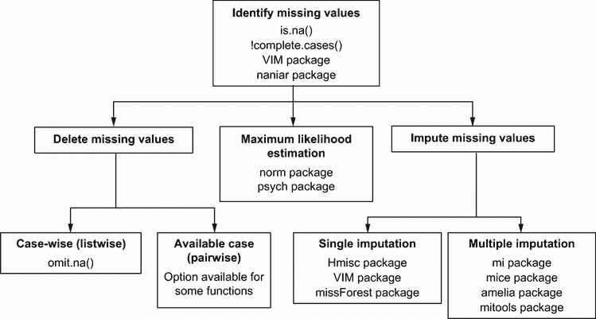
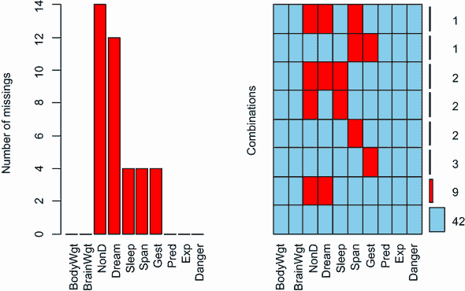
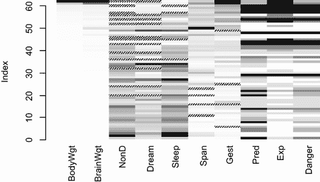
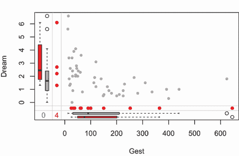

# 18 缺失数据的先进方法

本章涵盖

+   识别缺失数据

+   可视化缺失数据模式

+   删除缺失值

+   填充缺失值

在前面的章节中，我们专注于分析完整的数据集（即没有缺失值的数据集）。尽管这样做有助于简化统计和图形方法的展示，但在现实世界中，缺失数据无处不在。

在某些方面，缺失数据的影响是一个我们大多数人希望避免的主题。统计学书籍可能不会提及它，或者可能将讨论限制在几段之内。统计软件包提供使用可能不是最佳方法的自动处理缺失数据。尽管大多数数据分析（至少在社会科学领域）都涉及缺失数据，但这个主题在期刊文章的方法和结果部分很少被提及。鉴于缺失值出现的频率以及它们的存在可能使研究结果无效的程度，可以说这个主题在专业书籍和课程之外没有得到足够的关注。

数据可能因为许多原因而缺失。调查参与者可能忘记回答一个或多个问题，拒绝回答敏感问题，或者因疲劳而未能完成一个漫长的问卷。研究参与者可能错过预约或提前退出研究。记录设备可能故障，互联网连接可能丢失，或者数据可能被错误编码。分析师甚至可能计划某些数据缺失。例如，为了提高研究效率或降低成本，您可能选择不收集所有参与者的所有数据。最后，数据可能因您永远无法确定的原因而丢失。

不幸的是，大多数统计方法都假设您正在处理完整矩阵、向量和数据框。在大多数情况下，您必须在解决导致您收集数据的具体问题之前消除缺失数据。您可以通过删除具有缺失数据的案例或用合理的替代值替换缺失数据来消除缺失数据。在两种情况下，最终结果都是一个没有缺失值的数据集。

在本章中，我们将探讨处理缺失数据的传统和现代方法。我们将主要使用`VIM`、`mice`和`missForest`软件包。命令`install.packages(c("VIM", "mice", "missForest"))`将下载并安装它们。

为了激发讨论，我们将查看`VIM`包中提供的哺乳动物睡眠数据集（`sleep`）（不要与描述药物对睡眠影响的`sleep`数据集混淆，该数据集包含在基本安装中）。数据来自 Allison 和 Chichetti（1976）的研究，该研究考察了 62 种哺乳动物睡眠与生态和体质变量之间的关系。作者们对为什么动物的睡眠需求从一种物种到另一种物种会有所不同感兴趣。睡眠变量作为因变量，而生态和体质变量作为自变量或预测变量。

睡眠变量包括梦境睡眠的长度（`Dream`）、非梦境睡眠（`NonD`）以及它们的总和（`Sleep`）。体质变量包括体重（以千克计，`BodyWgt`）、脑重（以克计，`BrainWgt`）、寿命（以年计，`Span`）和妊娠时间（以天计，`Gest`）。生态变量包括物种被猎食的程度（`Pred`）、睡眠期间暴露的程度（`Exp`）以及它们面临的总体危险（`Danger`）。生态变量是在 1（低）到 5（高）的五点评分量表上测量的。

在他们的原始文章中，Allison 和 Chichetti 将他们的分析限制在具有完整数据的物种上。我们将更进一步，使用多重插补方法分析所有 62 个案例。

## 18.1 处理缺失数据的步骤

如果你刚开始研究缺失数据，你会发现自己面前有一系列令人眼花缭乱的方法、批评和方法论。这个领域的经典文本是 Little 和 Rubin（2002）。在 Allison（2001）、Schafer 和 Graham（2002）、Enders（2010）以及 Schlomer、Bauman 和 Card（2010）中可以找到优秀的、易于理解的综述。一种全面的方法通常包括以下步骤：

1.  识别缺失数据。

1.  检查缺失数据的原因。

1.  删除包含缺失数据的案例或用合理的替代数据值替换（插补）缺失值。

不幸的是，识别缺失数据通常是唯一明确的步骤。了解数据为何缺失取决于你对生成数据的过程的理解。决定如何处理缺失值将取决于你对哪些程序将产生最可靠和准确的结果的估计。

缺失数据的分类系统

统计学家通常将缺失数据分为三种类型。这些类型通常用概率术语描述，但基本思想是直接的。我们将使用睡眠研究中梦境的测量（其中 12 个动物有缺失值）依次说明每种类型：

+   *完全随机缺失*——如果一个变量的缺失数据与任何其他观测或未观测变量无关，那么这些数据就是完全随机缺失（MCAR）。如果这 12 只动物梦境睡眠缺失没有系统性原因，那么这些数据被认为是 MCAR。请注意，如果每个有缺失数据的变量都是 MCAR，你可以认为完整案例是从更大的数据集中抽取的简单随机样本。

+   *随机缺失*——如果一个变量的缺失数据与其它的观测变量相关，但与其自身的未观测值无关，那么这些数据就是随机缺失（MAR）。例如，如果体重较轻的动物更有可能缺失梦境睡眠的数据（可能是因为观察较小的动物更困难），并且“缺失性”与动物花在梦境中的时间无关，那么这些数据被认为是 MAR。在这种情况下，一旦控制了体重，梦境睡眠数据的缺失与否就是随机的。

+   *非随机缺失*——如果一个变量的缺失数据既不是 MCAR 也不是 MAR，那么这些数据就不是随机缺失（NMAR）。例如，如果花较少时间做梦的动物也更有可能缺失梦境值（可能是因为测量较短的持续时间更困难），那么这些数据被认为是 NMAR。

大多数处理缺失数据的方法都假设数据要么是 MCAR（完全随机缺失）要么是 MAR（随机缺失）。在这种情况下，你可以忽略产生缺失数据的机制，并且在替换或删除缺失数据后，直接对感兴趣的关系进行建模。

对于 NMAR 数据，正确分析可能很困难。当数据是 NMAR 时，你必须同时建模产生缺失值的机制以及感兴趣的关系。（分析 NMAR 数据的方法包括使用选择模型和模式混合。NMAR 数据的分析可能很复杂，超出了本书的范围。）



图 18.1 处理不完整数据的方法，以及支持它们的 R 包

处理缺失数据的方法有很多，并且不能保证它们会产生相同的结果。图 18.1 描述了用于处理不完整数据的一系列方法以及支持它们的 R 包。

对缺失数据方法的全面回顾需要一本书来阐述（Enders [2010] 是一个很好的例子）。在本章中，我们将回顾探索缺失值模式的方法，并重点关注处理不完整数据的四种最流行方法：理性方法、列表删除、单次插补和多次插补。我们将以对其他方法的简要讨论结束，包括在特殊情况下有用的那些方法。

## 18.2 识别缺失值

首先，让我们回顾第 3.5 节中介绍的材料，并在此基础上进行扩展。R 使用符号`NA`（不可用）表示缺失值，使用符号`NaN`（非数字）表示不可能的值。此外，符号`Inf`和`-Inf`分别表示正无穷和负无穷。函数`is.na()`、`is.nan()`和`is.infinite()`可以分别用来识别缺失、不可能和无限值。每个函数返回`TRUE`或`FALSE`。表 18.1 给出了示例。

表 18.1 `is.na()`、`is.nan()`和`is.infinite()`函数的返回值示例

| `x` | `is.na(x)` | `is.nan(x)` | `is.infinite(x)` |
| --- | --- | --- | --- |
| `x <- NA` | `TRUE` | `FALSE` | `FALSE` |
| `x <- 0 / 0` | `TRUE` | `TRUE` | `FALSE` |
| `x <- 1 / 0` | `FALSE` | `FALSE` | `TRUE` |

这些函数返回一个与它的参数大小相同的对象，如果元素是正在测试的类型，则每个元素被替换为`TRUE`，否则为`FALSE`。例如，设`y <- c(1, 2, 3, NA)`。那么`is.na(y)`将返回向量`c(FALSE, FALSE, FALSE, TRUE)`。

函数`complete.cases()`可以用来识别矩阵或数据框中不包含缺失值的行。它返回一个逻辑向量，对于包含完整案例的每一行返回`TRUE`，对于有缺失值的每一行返回`FALSE`。

让我们将此应用于睡眠数据集：

```
# load the dataset
data(sleep, package="VIM")

# list the rows that do not have missing values
sleep[complete.cases(sleep),]

# list the rows that have one or more missing values
sleep[!complete.cases(sleep),]
```

检查输出结果显示，有 42 个案例数据完整，20 个案例有一个或多个缺失值。

因为逻辑值`TRUE`和`FALSE`等同于数值 1 和 0，所以`sum()`和`mean()`函数可以用来获取有关缺失数据的有用信息。考虑以下内容：

```
> sum(is.na(sleep$Dream))
[1] 12
> mean(is.na(sleep$Dream))
[1] 0.19
> mean(!complete.cases(sleep))
[1] 0.32
```

结果表明，变量`Dream`有 12 个值缺失。在这个变量上，19%的案例有缺失值。此外，数据集中 32%的案例有一个或多个缺失值。

在识别缺失值时有两个需要注意的事项。首先，`complete.cases()`函数只识别`NA`和`NaN`为缺失值。无限值（`Inf`和`–Inf`）被视为有效值。其次，你必须使用缺失值函数，如本节中所述，来识别 R 数据对象中的缺失值。逻辑比较如`myvar == NA`永远不会为真。

现在你已经知道了如何通过编程方式识别缺失值，让我们看看帮助探索缺失数据发生可能模式的工具。

## 18.3 探索缺失值模式

在决定如何处理缺失数据之前，确定哪些变量有缺失值、缺失的数量以及缺失的组合将非常有用。在本节中，我们将回顾探索缺失值模式的各种表格、图形和相关性方法。最终，你想要了解数据缺失的原因。这个答案将影响你如何进行进一步的分析。

### 18.3.1 可视化缺失值

`mice` 包中的 `md.pattern()` 函数在矩阵或数据框中生成缺失数据模式的表格。此外，它还以图形的形式绘制这个表格。将此函数应用于 `sleep` 数据集，生成以下列表和图 18.2 中的图形。

列表 18.1 使用 `md.pattern()` 的缺失值模式

```
> library(mice)
> data(sleep, package="VIM")
> md.pattern(sleep, rotate.names=TRUE)
   BodyWgt BrainWgt Pred Exp Danger Sleep Span Gest Dream NonD   
42       1        1    1   1      1     1    1    1     1    1  0
 2       1        1    1   1      1     1    0    1     1    1  1
 3       1        1    1   1      1     1    1    0     1    1  1
 9       1        1    1   1      1     1    1    1     0    0  2
 2       1        1    1   1      1     0    1    1     1    0  2
 1       1        1    1   1      1     1    0    0     1    1  2
 2       1        1    1   1      1     0    1    1     0    0  3
 1       1        1    1   1      1     1    0    1     0    0  3
         0        0    0   0      0     4    4    4    12   14 38
```

表格主体中的 1 和 0 表示缺失值模式，其中 0 表示给定列变量缺失值，1 表示非缺失值。第一行描述了 *无缺失值* 的模式（所有元素都是 1）。第二行描述了 *除了 Span 外无缺失值* 的模式。第一列表示每个缺失数据模式中的案例数量，最后一列表示每个模式中存在缺失值的变量数量。在这里，您可以看到有 42 个没有缺失数据的案例，2 个案例仅缺失 `Span`。有 9 个案例同时缺失 `NonD` 和 `Dream` 值。该数据集总共有 (42 × 0) + (2 × 1) + ... + (1 × 3) = 38 个缺失值。最后一行给出了每个变量的总缺失值数。

虽然来自 `md.pattern()` 函数的表格输出很紧凑，但我经常发现通过视觉方式更容易识别模式。在图 18.2 中，每一行代表一个模式。深蓝色表示存在值，而浅红色表示缺失值。左侧的数字表示模式中的案例数量，右侧的数字表示模式中缺失变量的数量，底部的数字表示每个变量的缺失值数量。在这里，您可以看到有 42 个没有缺失数据的案例，2 个案例仅缺失 `Span`。有 9 个案例同时缺失 `NonD` 和 `Dream` 值。该数据集总共有 (42 × 0) + (2 × 1) + ... + (1 × 3) = 38 个缺失值。最后一行给出了每个变量的总缺失值数。


图 18.2 由 `md.pattern()` 函数总结的缺失值模式。每一行代表缺失（浅红色）和非缺失（深蓝色）数据的一个模式。

`VIM` 包提供了许多用于可视化数据集中缺失值模式的函数。在这里，我们将查看其中三个最有用的：`aggr()`、`matrixplot()` 和 `marginplot()`。

`aggr()` 函数单独为每个变量以及每个变量的组合绘制缺失值的数量。它为图 18.2 提供了一个很好的替代方案。例如，以下代码

```
library("VIM")
aggr(sleep, prop=FALSE, numbers=TRUE)
```

生成图 18.3 的图形。



图 18.3 `aggr()` 生成的睡眠数据集的缺失值模式图

您可以看到变量 `NonD` 有最多的缺失值（14 个），并且有两种哺乳动物缺失 `NonD`、`Dream` 和 `Sleep` 分数。四十二种哺乳动物没有缺失数据。

语句 `aggr(sleep, prop=TRUE, numbers=TRUE)` 生成相同的图表，但显示的是比例而不是计数。选项 `numbers=FALSE`（默认值）抑制了数字标签。请注意，随着数据集中变量数量的增加，此图表的标签可能会严重变形。你可以通过手动减小标签大小来修复此问题。包括参数 `cex.lab=``n`，`cex.axis=``n`，和 `cex.number=``n`（其中 `n` 是小于 1 的数字）将分别缩小轴、变量和数字标签的大小。

`matrixplot()` 函数生成一个显示每个案例数据的图表。图 18.4 展示了使用 `matrixplot(sleep, sort="BodyWgt")` 创建的图形。在这里，数值数据被缩放到区间 [0, 1]，并以灰度颜色表示，较浅的颜色代表较小的值，较深的颜色代表较大的值。默认情况下，缺失值用红色表示。请注意，在图 18.4 中，红色已被手工替换为交叉线，以便在灰度下查看缺失值。图 18.4 中的行按 `BodyWgt` 排序。



图 18.4 展示了 `sleep` 数据集中按案例（行）实际和缺失值的矩阵图。矩阵按 `BodyWgt` 排序。

`marginplot()` 函数在两个变量之间生成散点图，并在图表的边缘显示有关缺失值的信息。考虑梦境睡眠量和哺乳动物妊娠长度之间的关系。以下语句

```
marginplot(sleep[c("Gest","Dream")], pch=20, 
           col=c("darkgray", "red", "blue"))
```

生成图 18.5 中的图形。`pch` 和 `col` 参数是可选的，它们提供了对绘图符号和颜色的控制。



图 18.5 展示了梦境睡眠量和妊娠长度之间的散点图，边缘包含缺失数据的信息

图形主体显示了 `Gest` 和 `Dream` 之间的散点图（基于两个变量的完整案例）。在左侧边缘，箱线图显示了具有（深灰色）和没有（红色）`Gest` 值的哺乳动物的 `Dream` 分布。（注意，在灰度图中，红色是较深的色调。）四个红色点代表缺失 `Gest` 得分的哺乳动物的 `Dream` 值。在底部边缘，`Gest` 和 `Dream` 的角色被反转。你可以看到妊娠长度和梦境睡眠之间存在负相关关系，并且对于缺失妊娠得分的哺乳动物，梦境睡眠往往较高。同时缺失两个变量值的观测数以蓝色打印在两个边缘的交叉点（左下角）。

`VIM` 包含许多图表，可以帮助你理解缺失数据在数据集中的作用，并且值得探索。有生成散点图、箱线图、直方图、散点图矩阵、平行图、地毯图和包含缺失值信息的气泡图的函数。

### 18.3.2 使用相关系数探索缺失值

在我们继续之前，还有一种值得注意的方法。你可以在数据集中用编码为`1`表示缺失和`0`表示存在的指示变量替换数据。得到的矩阵有时被称为影子矩阵。将这些指示变量相互之间以及与原始（观测）变量进行相关分析可以帮助你看到哪些变量倾向于同时缺失，以及一个变量的*缺失性*与其他变量的值之间的关系。

考虑以下代码：

```
x <- as.data.frame(abs(is.na(sleep)))
```

数据框`x`的元素如果是`sleep`对应元素缺失则为`1`，否则为`0`。你可以通过查看每个的前几行来看到这一点：

```
> head(sleep, n=5)
   BodyWgt BrainWgt NonD Dream Sleep Span Gest Pred Exp Danger
1 6654.000   5712.0   NA    NA   3.3 38.6  645    3   5      3
2    1.000      6.6  6.3   2.0   8.3  4.5   42    3   1      3
3    3.385     44.5   NA    NA  12.5 14.0   60    1   1      1
4    0.920      5.7   NA    NA  16.5   NA   25    5   2      3
5 2547.000   4603.0  2.1   1.8   3.9 69.0  624    3   5      4

> head(x, n=5)
  BodyWgt BrainWgt NonD Dream Sleep Span Gest Pred Exp Danger
1       0        0    1     1     0    0    0    0   0      0
2       0        0    0     0     0    0    0    0   0      0
3       0        0    1     1     0    0    0    0   0      0
4       0        0    1     1     0    1    0    0   0      0
5       0        0    0     0     0    0    0    0   0      0
```

以下声明

```
y <- x[which(apply(x,2,sum)>0)]
```

提取具有一些（但不是全部）缺失值的变量，并且

```
cor(y)
```

给出这些指示变量之间的相关系数：

```
        NonD  Dream  Sleep   Span   Gest
NonD   1.000  0.907  0.486  0.015 -0.142
Dream  0.907  1.000  0.204  0.038 -0.129
Sleep  0.486  0.204  1.000 -0.069 -0.069
Span   0.015  0.038 -0.069  1.000  0.198
Gest  -0.142 -0.129 -0.069  0.198  1.000
```

在这里，你可以看到`Dream`和`NonD`倾向于同时缺失（r = 0.91）。在较小的程度上，`Sleep`和`NonD`也倾向于同时缺失（r = 0.49），以及`Sleep`和`Dream`也倾向于同时缺失（r = 0.20）。

最后，你可以查看一个变量中的缺失值与其他变量的观测值之间的关系：

```
> cor(sleep, y, use="pairwise.complete.obs")
           NonD  Dream   Sleep   Span   Gest
BodyWgt   0.227  0.223  0.0017 -0.058 -0.054
BrainWgt  0.179  0.163  0.0079 -0.079 -0.073
NonD         NA     NA      NA -0.043 -0.046
Dream    -0.189     NA -0.1890  0.117  0.228
Sleep    -0.080 -0.080      NA  0.096  0.040
Span      0.083  0.060  0.0052     NA -0.065
Gest      0.202  0.051  0.1597 -0.175     NA
Pred      0.048 -0.068  0.2025  0.023 -0.201
Exp       0.245  0.127  0.2608 -0.193 -0.193
Danger    0.065 -0.067  0.2089 -0.067 -0.204
Warning message:
In cor(sleep, y, use = "pairwise.complete.obs") :
  the standard deviation is zero
```

在这个相关矩阵中，行是观测变量，列是表示缺失性的指示变量。你可以忽略相关矩阵中的警告信息和`NA`值；它们是我们方法的艺术品。

从相关矩阵的第一列中，你可以看到非做梦睡眠分数更有可能缺失于体重较高的哺乳动物（r = 0.227）、妊娠期（r = 0.202）和睡眠暴露（r = 0.245）。其他列以类似方式读取。这个表中的相关性都不是特别大或引人注目，这表明数据与 MCAR 偏差很小，可能是 MAR。

注意，你永远不能排除数据是非缺失完全随机（NMAR）的可能性，因为你不知道缺失数据的值是什么。例如，你不知道哺乳动物做梦的数量与这个变量值缺失的概率之间是否存在关系。在没有强有力的外部证据的情况下，我们通常假设数据要么是完全随机缺失（MCAR）要么是随机缺失（MAR）。

## 18.4 理解缺失数据的原因和影响

你可以确定缺失数据的数量、分布和模式，以评估导致缺失数据的潜在机制以及缺失数据对你回答实质性问题的能力的影响。特别是，你想要回答以下问题：

+   缺失数据占数据的百分比是多少？

+   缺失数据是否集中在少数几个变量中或广泛分布？

+   缺失值看起来是否是随机的？

+   缺失数据彼此之间或与观测数据的相关性是否表明存在产生缺失值的可能机制？

这些问题的答案有助于确定哪些统计方法最适合分析你的数据。例如，如果缺失数据集中在几个相对不重要的变量中，你可能能够删除这些变量并继续正常分析。如果少量数据（比如说，少于 10%）在数据集中随机分布（MCAR），你可能能够将分析限制在具有完整数据的案例上，并仍然得到可靠和有效的结果。如果你可以假设数据是 MCAR 或 MAR，你可能能够应用多重插补方法来得出有效的结论。如果数据是 NMAR，你可以转向专门的方法，收集新的数据，或者选择一个更容易且更有回报的职业。

这里有一些例子：

+   在一项最近使用纸质问卷的调查中，我发现几个项目倾向于同时缺失。很明显，这些项目聚集在一起是因为参与者没有意识到问卷的第三页有背面——背面包含了这些项目。在这种情况下，数据可以考虑为 MCAR。

+   在另一项研究中，一个教育变量在全球领导风格调查中经常缺失。调查发现，欧洲参与者更有可能留空这一项。结果证明，某些国家的参与者认为这些类别没有意义。在这种情况下，数据最可能是 MAR。

+   最后，我参与了一项关于抑郁症的研究，其中老年患者比年轻患者更有可能省略描述抑郁情绪的项目。访谈显示，老年患者不愿意承认这些症状，因为这违反了他们关于“保持坚强”的价值观念。不幸的是，还发现严重抑郁的患者更有可能省略这些项目，因为感到绝望和注意力难以集中。在这种情况下，必须将数据视为 NMAR。

正如你所见，识别模式只是第一步。你需要将你对研究主题和数据收集过程的理解应用于确定缺失值的来源。

现在我们已经考虑了缺失数据的来源和影响，让我们看看标准统计方法如何被调整以适应它们。我们将关注四种流行的方法：一种用于恢复数据的有理方法，一种涉及删除缺失数据的传统方法，一种用于插补单个缺失值的方法，以及一种使用模拟来考虑缺失数据对结论影响的方法。在这个过程中，我们将简要介绍专门情况的方法和已经过时应该被淘汰的方法。目标将保持不变：尽可能准确地回答导致你收集数据的实质性问题，考虑到信息不完整的情况。

## 18.5 处理不完整数据的理性方法

在理性方法中，你使用变量之间的数学或逻辑关系来尝试填补或恢复缺失值。一些例子将有助于阐明这种方法。

在`sleep`数据集中，变量`Sleep`是`Dream`和`NonD`变量的总和。如果你知道一种哺乳动物的任意两个得分，你就可以推导出第三个得分。因此，如果某些观测值缺失了三个变量中的一个，你可以通过加法或减法恢复缺失的信息。

作为第二个例子，考虑关注代际群体（例如，沉默的一代、早期婴儿潮一代、晚期婴儿潮一代、X 一代、千禧一代）之间工作/生活平衡差异的研究，其中群体是根据他们的出生年份定义的。参与者被要求提供他们的出生日期和年龄。如果出生日期缺失，你可以通过知道他们的年龄和完成调查的日期来恢复他们的出生年份（因此他们的代际群体）。

使用逻辑关系恢复缺失数据的一个例子来自一系列领导力研究，其中参与者被问及他们是否是管理者（是/否）以及他们直接下属的数量（整数）。如果他们留空管理者问题但表明他们有一个或多个直接下属，那么推断他们是管理者是合理的。

作为最后的例子，我经常参与性别研究，比较男性和女性的领导风格和有效性。参与者完成包括他们的名字（名和姓）、他们的性别以及他们领导方法和影响的详细评估的调查。如果参与者留空性别问题，我必须估算值以将他们包括在研究中。在一项最近对 66,000 名管理者的研究中，11,000 名（17%）缺失性别值。

为了解决这个问题，我采用了以下理性过程。首先，我将名字和性别进行交叉制表。一些名字与男性相关联，一些与女性相关联，还有一些与两者都相关。例如，*William*出现了 417 次，并且总是男性。相反，名字*Chris*出现了 237 次，但有时是男性（86%）有时是女性（14%）。如果一个名字在数据集中出现了超过 20 次，并且总是与男性或女性相关联（但从不与两者都相关），我假设这个名字代表单一性别。我使用这个假设为特定性别的名字创建了一个性别查找表。通过使用这个查找表为缺失性别值的参与者，我能够恢复 7,000 个案例（63%的缺失响应）。

理性方法通常需要创造力、周到以及一定程度的数据管理技能。数据恢复可能是精确的（如睡眠示例所示）或近似的（如性别示例所示）。在下一节中，我们将探讨通过删除观测值来创建完整数据集的方法。

## 18.6 删除缺失数据

处理缺失数据最常见的方法是简单地删除它们。这通常涉及删除具有大量缺失数据的变量（列），然后删除包含任何剩余变量（列表删除）缺失数据的观测值。一个不太常见的选择是仅删除特定分析中涉及的缺失数据（例如，成对删除）。每种方法将在下面进行描述。

### 18.6.1 完整案例分析（列表删除）

在完整案例分析中，只有包含每个变量有效数据值的观测值被保留用于进一步分析。实际上，这涉及到删除任何包含一个或多个缺失值的行，也被称为*列表删除*、*案例删除*或*逐个删除*。大多数流行的统计软件包将列表删除作为处理缺失数据的默认方法。事实上，它如此普遍，以至于许多执行回归或方差分析等分析的分析师甚至可能没有意识到存在一个*缺失值问题*需要解决！

可以使用`complete.cases()`函数来保存没有缺失数据的矩阵或数据框的案例（行）：

```
newdata <- mydata[complete.cases(mydata),]
```

同样的结果可以使用`na.omit`函数实现：

```
newdata <- na.omit(mydata)
```

在这两个语句中，在结果保存到`newdata`之前，会从`mydata`中删除任何缺失数据的行。

假设你对睡眠研究中变量的相关性感兴趣。应用列表删除，你会在计算相关性之前删除所有带有缺失数据的哺乳动物：

```
> options(digits=1)
> cor(na.omit(sleep))
         BodyWgt BrainWgt NonD Dream Sleep  Span  Gest  Pred  Exp Danger
BodyWgt     1.00     0.96 -0.4 -0.07  -0.3  0.47  0.71  0.10  0.4   0.26
BrainWgt    0.96     1.00 -0.4 -0.07  -0.3  0.63  0.73 -0.02  0.3   0.15
NonD       -0.39    -0.39  1.0  0.52   1.0 -0.37 -0.61 -0.35 -0.6  -0.53
Dream      -0.07    -0.07  0.5  1.00   0.7 -0.27 -0.41 -0.40 -0.5  -0.57
Sleep      -0.34    -0.34  1.0  0.72   1.0 -0.38 -0.61 -0.40 -0.6  -0.60
Span        0.47     0.63 -0.4 -0.27  -0.4  1.00  0.65 -0.17  0.3   0.01
Gest        0.71     0.73 -0.6 -0.41  -0.6  0.65  1.00  0.09  0.6   0.31
Pred        0.10    -0.02 -0.4 -0.40  -0.4 -0.17  0.09  1.00  0.6   0.93
Exp         0.41     0.32 -0.6 -0.50  -0.6  0.32  0.57  0.63  1.0   0.79
Danger      0.26     0.15 -0.5 -0.57  -0.6  0.01  0.31  0.93  0.8   1.00
The correlations in this table are based solely on the 42 mammals that have 
complete data on all variables. (Note that the statement cor(sleep, use="complete.obs") 
would have produced the same results.) 
```

如果你想要研究寿命和妊娠期长度对梦境睡眠量的影响，你可以使用列表删除的线性回归：

```
> fit <- lm(Dream ~ Span + Gest, data=na.omit(sleep))
> summary(fit)

Call:
lm(formula = Dream ~ Span + Gest, data = na.omit(sleep))

Residuals:
   Min     1Q Median     3Q    Max 
-2.333 -0.915 -0.221  0.382  4.183 

Coefficients:
             Estimate Std. Error t value Pr(>|t|)    
(Intercept)  2.480122   0.298476    8.31  3.7e-10 ***
Span        -0.000472   0.013130   -0.04    0.971    
Gest        -0.004394   0.002081   -2.11    0.041 *  
---
Signif. codes:  0 ‘***’ 0.001 ‘**’ 0.01 ‘*’ 0.05 ‘.’ 0.1 ‘ ‘ 1 

Residual standard error: 1 on 39 degrees of freedom
Multiple R-squared: 0.167,      Adjusted R-squared: 0.125 
F-statistic: 3.92 on 2 and 39 DF,  p-value: 0.0282 
```

在这里，你可以看到，对于妊娠期较短的哺乳动物来说，它们的梦境睡眠时间更长（在控制寿命的情况下），而当控制妊娠期时，寿命与梦境睡眠无关。该分析基于 42 个完整数据案例。

在上一个例子中，如果将`data=na.omit(sleep)`替换为`data=sleep`会发生什么？像许多 R 函数一样，`lm()`使用的是有限制的列表删除定义。在这种情况下，任何在函数拟合的变量（例如，梦境、寿命和妊娠期）上存在缺失数据的案例都会被删除。分析将基于 42 个案例。

列表删除假设数据是 MCAR（即，完整观测值是完整数据集的随机子样本）。在当前例子中，我们假设使用的 42 只哺乳动物是收集到的 62 只哺乳动物的随机子样本。在 MCAR 假设被违反到一定程度时，得到的回归参数将会存在偏差。删除所有带有缺失数据的观测值也会通过减少可用样本量来降低统计功效。在当前例子中，列表删除将样本量减少了 32%。

### 18.6.2 可用案例分析（成对删除）

*成对* *删除* 通常被认为是处理具有缺失值的数据集时的另一种选择。在成对删除中，只有当观测值缺失了特定分析中涉及的变量数据时，才会删除观测值。考虑以下代码：

```
> cor(sleep, use="pairwise.complete.obs")
         BodyWgt BrainWgt NonD Dream Sleep  Span Gest  Pred  Exp Danger
BodyWgt     1.00     0.93 -0.4  -0.1  -0.3  0.30  0.7  0.06  0.3   0.13
BrainWgt    0.93     1.00 -0.4  -0.1  -0.4  0.51  0.7  0.03  0.4   0.15
NonD       -0.38    -0.37  1.0   0.5   1.0 -0.38 -0.6 -0.32 -0.5  -0.48
Dream      -0.11    -0.11  0.5   1.0   0.7 -0.30 -0.5 -0.45 -0.5  -0.58
Sleep      -0.31    -0.36  1.0   0.7   1.0 -0.41 -0.6 -0.40 -0.6  -0.59
Span        0.30     0.51 -0.4  -0.3  -0.4  1.00  0.6 -0.10  0.4   0.06
Gest        0.65     0.75 -0.6  -0.5  -0.6  0.61  1.0  0.20  0.6   0.38
Pred        0.06     0.03 -0.3  -0.4  -0.4 -0.10  0.2  1.00  0.6   0.92
Exp         0.34     0.37 -0.5  -0.5  -0.6  0.36  0.6  0.62  1.0   0.79
Danger      0.13     0.15 -0.5  -0.6  -0.6  0.06  0.4  0.92  0.8   1.00
```

在这个例子中，任何两个变量之间的相关性都是基于这两个变量的所有可用观测值（忽略其他变量）。`BodyWgt` 和 `BrainWgt` 之间的相关性是基于所有 62 只哺乳动物（这两个变量都有数据的哺乳动物数量）。`Dream` 和 `BodyWgt` 之间的相关性是基于 50 只哺乳动物，而 `Dream` 和 `NonD` 之间的相关性是基于 48 只哺乳动物。

虽然成对删除看起来使用了所有可用数据，但实际上每个计算都是基于数据的不同子集。这可能导致扭曲和难以解释的结果。我建议避免这种方法。

接下来，我们将考虑一种采用整个数据集（包括缺失数据的案例）的方法。

## 18.7 单一填补

在 *单一填补* 中，每个缺失值都替换为一个合理的替代值（即一个合理的猜测）。在本节中，我们将介绍三种方法，并描述何时使用（或不使用）每种方法。

### 18.7.1 简单填补

在 *简单填补* 中，一个变量的缺失值被替换为一个单一值（例如，均值、中位数或众数）。使用均值替换，你可以用非缺失值的均值 1.972 替换 `Dream` 变量上的每个缺失值。

简单填补的一个优点是它解决了缺失值问题，而没有减少可用于分析的数据样本量。由于简单填补简单易行，因此它变得相当流行。然而，对于非完全随机缺失（MCAR）的数据，它会产生有偏的结果。如果缺失的数据量适中到较大，简单填补可能会低估标准误差，扭曲变量之间的相关性，并在统计测试中产生错误的 p 值。我建议避免在大多数缺失值问题上使用这种方法。

### 18.7.2 K-最近邻填补

*k-最近邻填补* 的理念很简单。对于一个有一个或多个缺失值的观测值，找到最相似但具有这些值的观测值，并使用这些案例来进行填补。

例如，考虑以下来自 `sleep` 数据框的观测值：

```
BodyWgt BrainWgt NonD Dream Sleep Span Gest Pred Exp Danger
   1.41     17.5  4.8   1.3   6.1   34   NA    1   2      1
```

这个观测值在妊娠变量（`Gest`）上有缺失值。为了填补这个缺失值，你可以

1.  根据其他九个变量，在数据框中找到最接近（最相似）的 *k* 个观测值。

1.  对这些 *k* 个观测值上的 `Gest` 值进行汇总。例如，取 *k* 个 `Gest` 值的平均值。

1.  用这个汇总值替换缺失值。

这些步骤将重复应用于每个包含缺失值的观测值。

要使用这种方法，必须回答三个问题。我们应该如何定义最近邻？我们应该使用多少个最近邻？我们应该如何汇总值？

`VIM` 包中的 `kNN()` 函数执行 k 近邻插补。默认设置如下：

+   最近邻被定义为与目标观测值具有最小 Gower 距离（Kowarik 和 Templ，2016）的案例。与第十六章中描述的欧几里得距离不同，Gower 距离可以用于包含定量和分类变量的数据。定义最近邻时使用所有可用变量。

+   对于每个具有缺失值的观测值，确定五个最近邻。

+   定量缺失值的汇总值是 *k* 个最近邻值的中间值。对于分类缺失值，使用众数（最频繁出现的类别）。

每个这些默认值都可以由用户修改。有关详细信息，请参阅 `help(kNN)`。

以下列出 `sleep` 数据框的 `kNN` 插补应用。

列表 18.2 睡眠数据框的 K 近邻插补

```
> library(VIM)
> head(sleep)

   BodyWgt BrainWgt NonD Dream Sleep Span Gest Pred Exp Danger
1 6654.000   5712.0   NA    NA   3.3 38.6  645    3   5      3
2    1.000      6.6  6.3   2.0   8.3  4.5   42    3   1      3
3    3.385     44.5   NA    NA  12.5 14.0   60    1   1      1
4    0.920      5.7   NA    NA  16.5   NA   25    5   2      3
5 2547.000   4603.0  2.1   1.8   3.9 69.0  624    3   5      4
6   10.550    179.5  9.1   0.7   9.8 27.0  180    4   4      4

> sleep_imp <- kNN(sleep, imp_var=FALSE)

> head(sleep_imp)

   BodyWgt BrainWgt NonD Dream Sleep Span Gest Pred Exp Danger
1 6654.000   5712.0  3.2   0.8   3.3 38.6  645    3   5      3
2    1.000      6.6  6.3   2.0   8.3  4.5   42    3   1      3
3    3.385     44.5 12.8   2.4  12.5 14.0   60    1   1      1
4    0.920      5.7 10.4   2.4  16.5  3.2   25    5   2      3
5 2547.000   4603.0  2.1   1.8   3.9 69.0  624    3   5      4
6   10.550    179.5  9.1   0.7   9.8 27.0  180    4   4      4
```

在 `sleep_imp` 数据框中，所有缺失值都已用插补值替换。默认情况下，`kNN()` 函数会在数据框中添加 10 个新变量（`BodyWgt_imp`，`BrainWgt_imp`，...，`Danger_imp`），用 `TRUE/FALSE` 编码来指示哪些值已被插补。设置 `var_imp=FALSE` 会抑制这些附加变量。

`kNN` 插补是小型到中等规模数据集（例如，< 1000 个观测值）的一个优秀选项。由于需要在数据框中的每个缺失数据观测值与其他所有观测值之间计算距离，因此它不适合较大的问题。在这种情况下，下面描述的方法可能非常有效。

### 18.7.3 missForest

对于更大的 `数据集`，可以使用随机森林（第十七章）来插补缺失值。如果你有 p 个变量 *X*[1]，*X*[2]，...，*X[p]*)，步骤如下：

1.  使用均值替换每个定量变量的缺失值。使用众数替换每个分类变量的缺失值。跟踪缺失值的位置。

1.  返回变量 *X*[1] 的缺失数据。创建一个没有此变量缺失值的案例训练数据集。使用训练集，构建随机森林模型（第十七章）来预测 *X*[1]。使用该模型为具有缺失 *X*[1] 值的案例插补 *X*[1]。

1.  对变量 *X*[2] 通过 *X[p]* 重复步骤 2。

1.  重复步骤 2 和 3，直到插补值的变化不超过指定的量。

实际上执行这些操作比描述它们要容易！`missForest` 包中的 `missForest()` 函数可以用来。使用 `sleep` 数据框，以下列出代码。

列表 18.3 睡眠数据框的随机森林插补

```
> library(missForest)
> set.seed(1234)
> sleep_imp <- missForest(sleep)$ximp

  missForest iteration 1 in progress...done!
  missForest iteration 2 in progress...done!
  missForest iteration 3 in progress...done!
  missForest iteration 4 in progress...done!
  missForest iteration 5 in progress...done!
  missForest iteration 6 in progress...done!

> head(sleep_imp)
   BodyWgt BrainWgt      NonD  Dream Sleep   Span Gest Pred Exp Danger
1 6654.000   5712.0  3.391857 1.1825   3.3 38.600  645    3   5      3
2    1.000      6.6  6.300000 2.0000   8.3  4.500   42    3   1      3
3    3.385     44.5 10.758000 2.4300  12.5 14.000   60    1   1      1
4    0.920      5.7 11.572000 2.7020  16.5  7.843   25    5   2      3
5 2547.000   4603.0  2.100000 1.8000   3.9 69.000  624    3   5      4
6   10.550    179.5  9.100000 0.7000   9.8 27.000  180    4   4      4
```

设置了一个随机数种子，以确保结果可重复。在这种情况下，在插补值稳定之前，需要对数据框进行六次迭代。

与`kNN()`函数类似，`missForest()`函数可以处理定量和分类数据。随机森林方法需要中等或大型数据集（例如，500 个以上案例）以避免过拟合的问题。对于较小的数据集，`kNN`方法往往更有效。

如果假设检验是分析的重点，那么使用一种考虑缺失值引入的不确定性的插补方法是个好主意。多重插补就是这样一种方法。

## 18.8 多重插补

*多重* *插补*（MI）提供了一种基于重复模拟的缺失值处理方法。MI 通常是复杂缺失值问题的首选方法。在 MI 中，从具有缺失值的存在数据集中生成一组完整的数据集（通常是 3 到 10 个）。蒙特卡洛方法用于填充每个模拟数据集中的缺失数据。对每个模拟数据集应用标准统计方法，并将结果合并，以提供考虑缺失值引入的不确定性的估计结果和置信区间。R 中有良好的实现，例如`Amelia`、`mice`和`mi`包。

在本节中，我们将重点关注`mice`（通过链式方程的多变量插补）包提供的方法。为了理解`mice`包的工作原理，请考虑图 18.6 中的示意图。


图 18.6 应用`mice`方法对缺失数据进行多重插补的步骤

`mice()`函数从缺失数据的数据框开始，返回一个包含多个完整数据集的对象（默认为五个）。每个完整数据集是通过在原始数据框中插补缺失数据创建的。插补有一个随机成分，因此每个完整数据集略有不同。然后使用`with()`函数依次对每个完整数据集应用统计模型（例如，线性或广义线性模型）。最后，`pool()`函数将单独分析的结果合并为单个结果集。这个最终模型中的标准误差和 p 值正确地反映了缺失值和多重插补产生的不确定性。

`mice()`函数是如何插补缺失值的？

缺失值通过*Gibbs 抽样*进行插补。默认情况下，每个有缺失值的变量都是根据数据集中所有其他变量进行预测的。这些预测方程用于插补缺失数据的可能值。该过程会迭代，直到在缺失值上达到收敛。对于每个变量，你可以选择预测模型的格式（称为*基本插补方法*）以及进入它的变量。

默认情况下，预测均值匹配用于替换连续变量的缺失数据，而对于目标变量是 *二元的*（具有两个水平的因子）或 *多分类的*（具有超过两个水平的因子），分别使用逻辑回归或多项逻辑回归。其他基本插补方法包括贝叶斯线性回归、判别函数分析、两级正态插补和从观测值中进行随机抽样。您也可以提供自己的方法。

基于 `mice` 包的分析通常符合以下结构：

```
library(mice)
imp <- mice(*data, m*)
fit <- with(imp, *analysis*)
pooled <- pool(fit)
summary(pooled)
```

其中

+   `data` 是一个包含缺失值的矩阵或数据框。

+   `imp` 是一个包含 *m* 个插补数据集的列表对象，以及有关如何进行插补的信息。默认情况下，*m* = 5。

+   `analysis` 是一个公式对象，指定要对每个 *m* 个插补数据集应用哪种统计分析。例如，`lm()` 用于线性回归模型，`glm()` 用于广义线性模型，`gam()` 用于广义加性模型。括号内的公式给出了 `~` 左侧的响应变量和右侧的预测变量（由 `+` 符号分隔）。

+   `fit` 是一个包含 *m* 个单独统计分析结果的列表对象。

+   `pooled` 是一个包含这些 *m* 个统计分析平均结果的列表对象。

让我们将多重插补应用于 `sleep` 数据集。您将重复第 18.6 节的分析，但这次使用所有 62 种哺乳动物。将随机数生成器的种子值设置为 1,234，以便您的结果将与以下结果匹配：

```
> library(mice)
> data(sleep, package="VIM")
> imp <- mice(sleep, seed=1234)

 [...output deleted to save space...]

> fit <- with(imp, lm(Dream ~ Span + Gest))
> pooled <- pool(fit)
> summary(pooled)
         term estimate std.error statistic   df  p.value
1 (Intercept)  2.59669   0.24861    10.445 52.0 2.29e-14
2        Span -0.00399   0.01169    -0.342 55.6 7.34e-01
3        Gest -0.00432   0.00146    -2.961 55.2 4.52e-03
```

在这里，您可以看到 `Span` 的回归系数并不显著（p ≅ 0.07），而 `Gest` 的系数在 p < 0.01 水平上是显著的。如果您将这些结果与第 18.6 节中产生的完整案例分析结果进行比较，您会发现在这种情况下您会得出相同的结论。在控制生命周期的条件下，妊娠长度与梦境睡眠量之间存在（统计上）显著的负相关关系。尽管完整案例分析是基于具有完整数据的 42 种哺乳动物，但当前分析是基于从完整的 62 种哺乳动物中收集的信息。

您可以通过查看 `imp` 对象的子组件来查看插补。例如，

```
> imp$imp$Dream
     1   2   3   4   5
1  0.0 0.5 0.5 0.5 0.3
3  0.5 1.4 1.5 1.5 1.3
4  3.6 4.1 3.1 4.1 2.7
14 0.3 1.0 0.5 0.0 0.0
24 3.6 0.8 1.4 1.4 0.9
26 2.4 0.5 3.9 3.4 1.2
30 2.6 0.8 2.4 2.2 3.1
31 0.6 1.3 1.2 1.8 2.1
47 1.3 1.8 1.8 1.8 3.9
53 0.5 0.5 0.6 0.5 0.3
55 2.6 3.6 2.4 1.8 0.5
62 1.5 3.4 3.9 3.4 2.2
```

显示了 12 种哺乳动物中 `Dream` 变量缺失数据的 5 个插补值。审查这些矩阵有助于您确定插补值是否合理。睡眠长度为负值可能会让您感到惊讶（或噩梦）。

您可以通过 `complete()` 函数查看每个 *m* 个插补数据集。格式是

```
complete(imp, action=#) 
```

其中 `#` 指定了 *m* 个合成的完整数据集之一。例如，

```
> dataset3 <- complete(imp, action=3)
> dataset3
    BodyWgt BrainWgt NonD Dream Sleep  Span  Gest Pred Exp Danger
1  6654.000  5712.00  3.2   0.5   3.3  38.6 645.0    3   5      3
2     1.000     6.60  6.3   2.0   8.3   4.5  42.0    3   1      3
3     3.385    44.50 11.0   1.5  12.5  14.0  60.0    1   1      1
4     0.920     5.70 13.2   3.1  16.5   7.0  25.0    5   2      3
5  2547.000  4603.00  2.1   1.8   3.9  69.0 624.0    3   5      4
6    10.550   179.50  9.1   0.7   9.8  27.0 180.0    4   4      4
[...output deleted to save space...]
```

显示了由多重插补过程创建的五个完整数据集中的第三个。

由于篇幅限制，我们只简要考虑了`mice`包中提供的 MI 实现。`mi`和`Amelia`包也包含有价值的方法。如果你对缺失数据的多重插补方法感兴趣，我推荐以下资源：

+   由 Martijn W. Heymans 和 Iris Eekhout 编写的在线书籍《使用 SPSS 和(R)Studio 的缺失数据应用分析》([`bookdown.org/mwheymans/bookmi/`](https://bookdown.org/mwheymans/bookmi/))

+   van Buuren 和 Groothuis-Oudshoorn（2010）以及 Yu-Sung、Gelman、Hill 和 Yajima（2010）的文章

+   “Amelia II: 缺失数据程序” ([`gking.harvard.edu/amelia`](http://gking.harvard.edu/amelia))

每个都可以帮助你加强和扩展对这个重要但未充分利用的方法论的理解。

## 18.9 缺失数据的其他方法

R 支持处理缺失数据的其他几种方法。尽管这些方法不像前面描述的方法那样广泛适用，但表 18.2 中描述的包提供了在特定情况下可能有用的函数。

表 18.2 处理缺失数据的专用方法

| 包 | 描述 |
| --- | --- |
| `norm` | 多变量正态数据缺失值的最大似然估计 |
| `cat` | 分析具有缺失值的分类变量数据集 |
| `longitudinalData` | 包括用于填充缺失时间序列值的插值例程等实用函数 |
| `kmi` | Kaplan-Meier 多重插补，用于带有缺失数据的生存分析 |
| `mix` | 混合分类和连续数据的多重插补 |
| `pan` | 多变量面板或聚类数据的多重插补 |

请参阅 CRAN 缺失数据任务视图([`cran.r-project.org/web/views/MissingData.html`](https://cran.r-project.org/web/views/MissingData.html))，以了解 R 提供的所有方法的综述。

## 摘要

+   统计方法需要完整的数据集，但大多数现实世界的数据都包含缺失值。

+   `VIM`和`mice`包中的函数可用于探索数据集中缺失值的分布。

+   列删除是处理缺失值最流行的方法，并且是许多统计程序的默认方法。如果删除大量数据，可能会导致功效损失。

+   `kNN`和`missForest`是填充缺失值的优秀方法。前者适用于中小型数据集，而后者适用于大型数据集。

+   多重插补通过模拟来处理缺失值给统计推断问题带来的不确定性。

+   除非缺失数据量非常小，否则通常应避免简单的插补（例如，均值替换）和成对删除。
