# 19 高级图表

本章涵盖

+   自定义 `ggplot2` 图表

+   添加注释

+   将多个图表组合成单个图表

+   创建交互式图表

在 R 中创建图表有许多方法。我们专注于 `ggplot2` 的使用，因为它具有一致的语法、灵活性和全面性。`ggplot2` 包在第四章中介绍，涵盖了 Geoms、缩放、分面和标题。在第六章中，我们创建了条形图、饼图、树状图、直方图、核密度图、箱线和小提琴图以及点图。第八章和第九章涵盖了回归和方差分析模型的图形。第十一章讨论了散点图、散点图矩阵、气泡图、折线图、相关图和马赛克图。其他章节涵盖了可视化当前主题的图表。

本章将继续介绍 `ggplot2`，但重点是自定义——创建一个精确满足您需求的图表。图表有助于您发现模式并描述趋势、关系、差异、组成和数据的分布。自定义 `ggplot2` 图表的主要原因是增强您探索数据或向他人传达发现的能力。次要目标是满足组织或出版商的外观和感觉要求。

在本章中，我们将探讨使用 `ggplot2` 缩放函数来自定义坐标轴和颜色。我们将使用 `theme()` 函数来自定义图表的整体外观和感觉，包括文本、图例、网格线和绘图背景的显示。我们将使用 Geoms 来添加注释，例如参考线和标签。此外，还将使用 `patchwork` 包将多个图表组合成一个完整的图表。最后，将使用 `plotly` 包将静态的 `ggplot2` 图表转换为交互式网络图形，让您更全面地探索数据。

`ggplot2` 包提供了大量自定义图表元素的选择。仅 `theme()` 函数就有超过 90 个参数！在这里，我们将重点关注最常用的函数和参数。如果您正在以灰度阅读本章，我鼓励您运行代码，以便您可以看到彩色图表。使用简单的数据集，这样您可以专注于代码本身。

到目前为止，您应该已经安装了 `ggplot2` 和 `dplyr` 包。在继续之前，您还需要几个额外的包，包括用于数据的 `ISLR` 和 `gapminder`，以及用于增强图形的 `ggrepel`、`showtext`、`patchwork` 和 `plotly`。您可以使用 `install.packages(c("ISLR", "gapminder", "scales", "showtext", "ggrepel", "patchwork", "plotly"))` 安装它们。

## 19.1 修改缩放

`ggplot2` 中的尺度函数控制变量值到特定绘图特性的映射。例如，`scale_x_continuous()` 函数创建了一个将定量变量的值映射到 *x*-轴上位置的映射。`scale_color_discrete()` 函数创建了一个将分类变量的值与颜色值之间的映射。在本节中，您将使用尺度函数来自定义图表的轴和绘图颜色。

### 19.1.1 自定义轴

在 `ggplot2` 中，图表中的 *x*-轴和 *y*-轴由 `scale_x_*` 和 `scale_y_*` 函数控制，其中 `*` 指定尺度的类型。表 19.1 列出了最常见的函数。自定义这些轴的主要原因是使数据更容易阅读或使趋势更明显。

表 19.1 指定轴尺度的函数

| 函数 | 描述 |
| --- | --- |
| `scale_x_continuous`, scale_y_continuous | 连续数据的尺度 |
| `scale_x_binned, scale_y_binned` | 对连续数据进行分箱的尺度 |
| `scale_x_discrete,scale_y_discrete` | 对离散（分类）数据的尺度 |
| `scale_x_log10, scale_y_log10` | 对数尺度（基数为 10）上的连续数据尺度 |
| `scale_x_date, scale_y_date` | 日期数据的尺度。其他变体包括日期时间和时间。 |

自定义连续变量的轴

在第一个例子中，我们将使用 `mtcars` 数据框，这是一个包含 32 辆汽车特征的数据库集。`mtcars` 数据框包含在基础 R 中。让我们绘制以 1000 磅为单位的汽车重量 (`wt`) 与燃油效率 (`mpg`) 的关系图：

```
library(ggplot2)
ggplot(data = mtcars, aes(x = wt, y = mpg)) +
  geom_point() +
  labs(title = "Fuel efficiency by car weight") 
```

图 19.1 显示了图表。默认情况下，主要刻度有标签。对于 `mpg`，这些刻度在 10 到 35 之间以 5 点间隔出现。小刻度在主要刻度之间均匀分布，但没有标签。

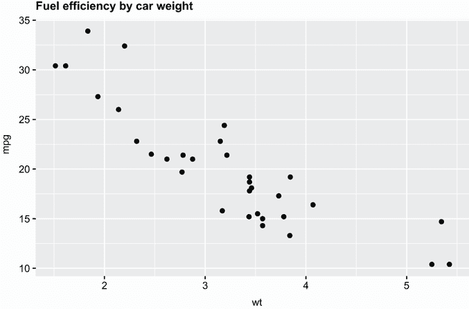

图 19.1 默认的 `ggplot2` 散点图，显示 `mtcars` 数据集中的 32 辆汽车每加仑英里数（1000 磅）与汽车重量之间的关系

在这个图中，最重的汽车的重量是多少？第三轻的汽车的 `mpg` 是多少？从这些轴上确定值需要一些工作。我们可能想要调整 *x*-轴和 *y*-轴，以便更容易从图中读取值。

由于 `wt` 和 `mpg` 是连续变量，我们将使用 `scale_x_continuous()` 和 `scale_y_continuous()` 函数来修改轴。表 19.2 列出了这些函数的常见选项。

表 19.2 一些常见的 `scale_*_continuous` 选项

| 参数 | 描述 |
| --- | --- |
| `name` | 尺度的名称。与使用 `labs(x = , y = )` 函数相同。 |
| `breaks` | 主要刻度标记位置的数值向量。主要刻度自动标记，除非被 `labels` 选项覆盖。使用 `NULL` 来抑制刻度。 |
| `minor_breaks` | 小刻度标记的位置的数值向量。小刻度没有标签。使用 `NULL` 来抑制小刻度。 |
| `n.breaks` | 整数，指导主要断点的数量。该数值被视为建议。函数可能会根据需要调整此数值以确保吸引人的断点标签。 |
| `labels` | 字符向量，提供替代断点标签（必须与断点长度相同） |
| `limits` | 长度为 2 的数值向量，给出最小和最大值 |
| `position` | 轴放置（对于*y*轴为左/右，对于*x*轴为上/下） |

让我们进行以下更改。对于重量，

+   将轴标签为“重量（1000 磅）。”

+   将刻度范围设置为 1.5 到 5.5。

+   使用 10 个主要断点。

+   抑制次要断点。

对于每加仑英里数，

+   将轴标签为“每加仑英里数。”

+   将刻度范围设置为 10 到 35。

+   在 10、15、20、25、30 和 35 处放置主要断点。

+   在每加仑间隔处放置次要断点。

下面的列表给出了代码。

列表 19.1 使用定制轴绘制燃油效率与汽车重量关系图

```
library(ggplot2)
ggplot(mtcars, aes(x = wt, y = mpg)) + 
  geom_point() +
  scale_x_continuous(name = "Weight (1000 lbs.)",   ❶
                     n.breaks = 10,                 ❶
                     minor_breaks = NULL,           ❶
                     limits = c(1.5, 5.5)) +        ❶
  scale_y_continuous(name = "Miles per gallon",     ❷
                     breaks = seq(10, 35, 5),       ❷
                     minor_breaks = seq(10, 35, 1), ❷
                     limits = c(10, 35)) +          ❷
  labs(title = "Fuel efficiency by car weight")
```

❶ 修改*x*轴

❷ 修改*y*轴

图 19.2 显示了新的图表。我们可以看到最重的汽车大约有 5.5 吨，第三轻的汽车每加仑获得 34 英里。请注意，您为`wt`指定了 10 个主要断点，但图表只有 9 个。`n.breaks`参数被视为建议。如果它提供了更好的标签，则参数可能被替换为接近的数值。我们将在稍后继续使用此图表。

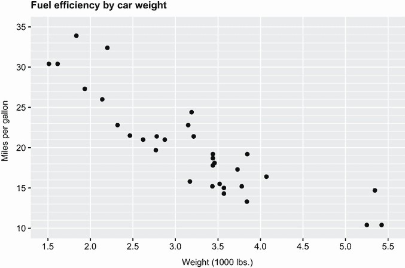

图 19.2 `ggplot2`根据汽车重量（1000 磅）绘制的每加仑英里数散点图，已修改 x 轴和 y 轴。现在更容易读取点的值。

为分类变量定制轴

之前的例子涉及为连续变量定制轴。在下一个例子中，您将定制分类变量的轴。数据来自`ISLR`包中的`Wage`数据框。该数据框包含 2011 年在美国中西部地区收集的 3000 名男性工人的工资和人口统计信息。让我们绘制此样本中种族与教育之间的关系。代码如下

```
library(ISLR)
library(ggplot2)
ggplot(Wage, aes(race, fill = education)) +
  geom_bar(position = "fill") +
  labs(title = "Participant Education by Race")
```

和图 19.3 显示了图表。

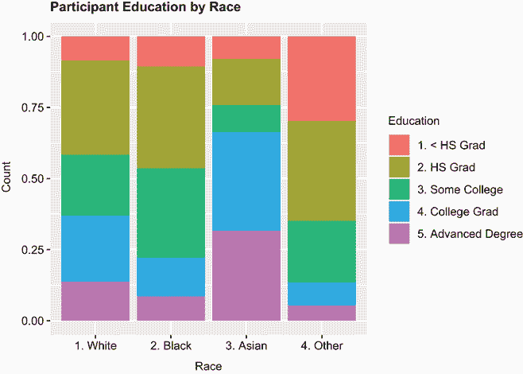

图 19.3 2011 年 3000 名中西部男性工人按种族划分的教育样本

注意，比赛和教育标签上的编号实际上是在数据中编码的：

```
> head(Wage[c("race", "education")], 4)
           race       education
231655 1\. White    1\. < HS Grad
86582  1\. White 4\. College Grad
161300 1\. White 3\. Some College
155159 3\. Asian 4\. College Grad
```

我们可以通过删除种族类别标签上的数字（它们不是有序类别）、在*y*轴上使用百分比格式、使用更好的刻度标签以及按百分比重新排序种族类别（优先级更高）来改进图表。您还可能希望删除“种族：其他”类别，因为该群体的组成是未知的。

修改分类变量的刻度涉及使用`scale_*_discrete()`函数。表 19.3 列出了常见选项。您可以使用`limits`参数（和/或省略）对离散值进行排序，并使用`labels`参数更改它们的标签。

表 19.3 一些常见的 `scale_*_discrete` 选项

| 参数 | 描述 |
| --- | --- |
| `name` | 尺度名称。与使用 `labs(x = , y = )` 函数相同。 |
| `breaks` | 一个包含刻度的字符向量 |
| `limits` | 一个定义刻度值及其顺序的字符向量 |
| `labels` | 一个字符向量，给出标签（长度必须与 breaks 相同）。使用 `labels=abbreviate` 将缩短长标签。 |
| `position` | 轴放置（对于 *y*-轴是左/右，对于 *x*-轴是上/下） |

以下列表给出了修订后的代码，图 19.4 展示了图表。

列表 19.2 按种族划分的教育绘图，具有自定义轴

```
library(ISLR)
library(ggplot2)
library(scales)
ggplot(Wage, aes(race, fill=education)) +
  geom_bar(position="fill") +
  scale_x_discrete(name = "",                                       ❶
                   limits = c("3\. Asian", "1\. White", "2\. Black"),  ❶
                   labels = c("Asian", "White", "Black")) +         ❶
  scale_y_continuous(name = "Percent",                              ❷
                     label = percent_format(accuracy=2),            ❷
                     n.breaks=10) +                                 ❷
  labs(title="Participant Education by Race")
```

❶ 修改 *x*-轴

❷ 修改 *y*-轴

水平轴表示一个分类变量，因此它使用 `scale_x_discrete()` 函数进行自定义。使用 `limits` 对比赛类别进行重新排序，并使用 `labels` 进行重新标记。其他类别通过在这些规范中省略而被从图中省略。通过将名称设置为 "" 来删除轴标题。

垂直轴表示一个数值变量，因此它使用 `scale_y_continuous()` 函数进行自定义。该函数用于修改轴标题和更改轴标签。`scales` 包中的 `percent_format()` 函数重新格式化轴标签为百分比。`accuracy=2` 参数指定每个百分比打印的显著数字位数。

`scales` 包在格式化轴方面非常有用。有格式化货币值、日期、百分比、逗号、科学记数法等选项。有关详细信息，请参阅 [`scales.r-lib.org/`](https://scales.r-lib.org/)。`ggh4x` 和 `ggprism` 包提供了额外的自定义轴功能，包括对主刻度和副刻度的更多自定义。

在前面的示例中，教育被表示为一个离散的颜色刻度。我们将考虑自定义颜色。

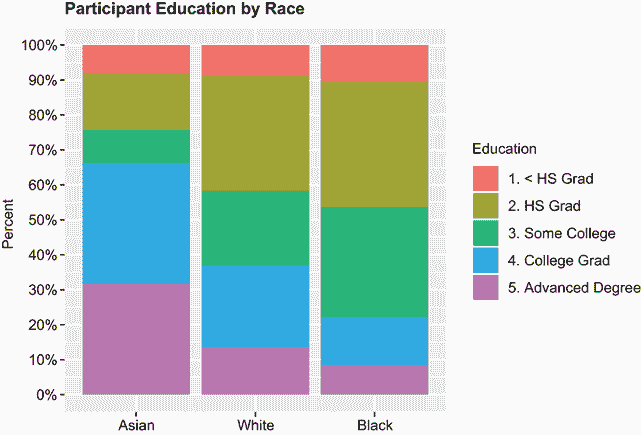

图 19.4 2011 年 3000 名中大西洋地区男性工人的参与教育按种族划分。种族类别已重新排列和重新标记。其他类别已被省略。*x*-轴标签已被省略，*y*-轴现在格式化为百分比。

### 19.1.2 自定义颜色

`ggplot2` 包提供了将分类和数值变量映射到颜色方案的功能。表 19.4 描述了这些函数。`scale_color_*()` 函数用于点、线、边框和文本。`scale_fill_*()` 函数用于具有面积的对象，如矩形和椭圆。

调色板可以是**顺序的**、**发散的**或**定性的**。顺序调色板用于将颜色映射到单调的数值变量。发散调色板用于具有有意义的中点或零点的数值变量。它是两个共享中值端点的顺序调色板。例如，发散调色板通常用于表示相关系数的值（见第 11.3 节）。定性的颜色标尺将分类变量的值映射到离散颜色。

表 19.4 指定颜色尺度的函数

| 函数 | 描述 |
| --- | --- |
| `scale_color_gradient()``scale_fill_gradient()` | 连续变量的渐变色标尺。指定`low`颜色和`high`颜色。使用`*_gradient2()`版本来指定`low`、`mid`和`high`颜色。 |
| `scale_color_steps()``scale_fill_steps()` | 连续变量的分箱渐变色标尺。指定`low`颜色和`high`颜色。使用`*_steps2()`版本来指定`low`、`mid`和`high`颜色。 |
| `scale_color_brewer()``scale_fill_brewer()` | 来自 ColorBrewer（[`colorbrewer2.org`](https://colorbrewer2.org)）的顺序、发散和定性颜色方案。主要参数是`palette=`。查看`?scale_color_brewer`以获取调色板列表。 |
| `scale_color_grey()``scale_fill_gray()` | 顺序灰色颜色标尺。可选参数是`start`（低端的灰色值）和`end`（高端的灰色值）。默认值分别为 0.2 和 0.8。 |
| `scale_color_manual()``scale_fill_manual()` | 通过在值参数中指定颜色向量来为离散变量创建自己的颜色标尺。 |
| `scale_color_virdis_*``scale_fill_virdis_*` | 来自`viridisLite`包的 Viridis 颜色标尺。旨在被具有常见形式色盲的观众所感知，并且黑白打印效果良好。使用`*_d`表示离散，`*_c`表示连续，`*_b`表示分箱标尺。例如，`scale_fill_virdis_d()`将提供对离散变量的安全颜色填充。`option`参数提供四种颜色方案变化（`"inferno"`、`"plasma"`、`"viridis"`（默认）和`"cividis"`）。 |

连续颜色调色板

让我们看看将连续定量变量映射到颜色调色板的示例。在图 19.1 中，燃油效率被绘制在汽车重量上。我们将通过将发动机排量映射到点颜色来向图表中添加第三个变量。由于发动机排量是一个数值变量，你创建一个颜色渐变来表示其值。以下列表展示了几个可能性。

列表 19.3 连续变量的颜色渐变

```
library(ggplot2)
p <- ggplot(mtcars, aes(x=wt, y=mpg, color=disp)) +
  geom_point(shape=19, size=3) +
  scale_x_continuous(name = "Weight (1000 lbs.)",
                     n.breaks = 10,
                     minor_breaks = NULL,
                     limits=c(1.5, 5.5)) +
  scale_y_continuous(name = "Miles per gallon",
                     breaks = seq(10, 35, 5),
                     minor_breaks = seq(10, 35, 1),
                     limits = c(10, 35))

p + ggtitle("A. Default color gradient")

p + scale_color_gradient(low="grey", high="black") +
  ggtitle("B. Greyscale gradient")

p + scale_color_gradient(low="red", high="blue") +
  ggtitle("C. Red-blue color gradient")

p + scale_color_steps(low="red", high="blue") +
  ggtitle("D. Red-blue binned color Gradient")

p + scale_color_steps2(low="red", mid="white", high="blue",
                                   midpoint=median(mtcars$disp)) +
  ggtitle("E. Red-white-blue binned gradient")

p + scale_color_viridis_c(direction = -1) +
  ggtitle("F. Viridis color gradient")
```

代码创建图 19.5 中的图表。`ggtitle()`函数等同于本书其他地方使用的`labs(title=)`。如果你正在阅读本书的灰度版本，请确保亲自运行代码，以便你能欣赏到颜色变化。

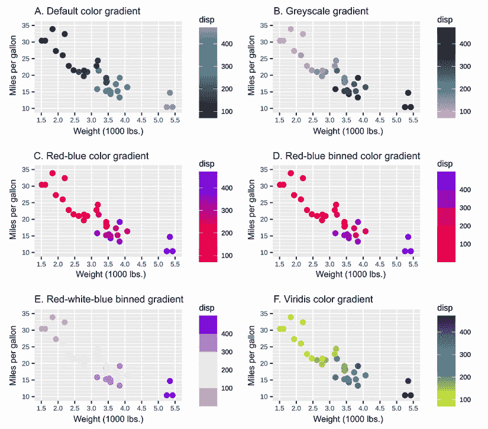

图 19.5 展示了汽车重量与燃油效率的关系图。颜色用于表示发动机排量。展示了六种配色方案。A 是默认方案。B 是灰度。C 和 D 从红色到蓝色渐变，但 D 被分成了五个离散颜色。E 从红色到白色（中位数）到蓝色渐变。F 使用了 Viridis 颜色方案。在每个图表中，发动机排量随着汽车重量的增加而增加，油耗降低。

图 A 使用了`ggplot2`的默认颜色。图 B 显示了灰度图。图 C 和 D 使用红色到蓝色的渐变。分箱颜色渐变将连续渐变分成离散值（通常是五个）。图 E 展示了发散颜色渐变，从红色（低）到白色（中点）到蓝色（高）。最后，图 F 展示了 Viridis 颜色渐变。图 F 中的`direction` `=` `-1`选项反转了颜色锚点，导致更大的发动机排量对应更深的颜色。

定性颜色调色板

下面的列表展示了定性颜色方案。在这里`education`是映射到离散颜色的分类变量。图 19.6 提供了结果图表。

列表 19.4 分类变量的颜色方案

```
library(ISLR)
library(ggplot2)
p <- ggplot(Wage, aes(race, fill=education)) +
  geom_bar(position="fill") +
  scale_y_continuous("Percent", label=scales::percent_format(accuracy=2),
                     n.breaks=10) +
  scale_x_discrete("",
                   limits=c("3\. Asian", "1\. White", "2\. Black"),
                   labels=c("Asian", "White", "Black"))

p + ggtitle("A. Default colors")

p + scale_fill_brewer(palette="Set2") +
     ggtitle("B. ColorBrewer Set2 palette")

p + scale_fill_viridis_d() +
  ggtitle("C. Viridis color scheme")

p + scale_fill_manual(values=c("gold4", "orange2", "deepskyblue3", 
                               "brown2", "yellowgreen")) +
  ggtitle("D. Manual color selection")
```

图 A 使用了`ggplot2`的默认颜色。图 B 使用了 ColorBrewer 的定性调色板 Set2。其他定性 ColorBrewer 调色板包括 Accent、Dark2、Paired、Pastel1、Pastel2、Set1 和 Set3。图 C 展示了默认的 Viridis 离散方案。最后，图 D 展示了手动方案，证明我自己挑选颜色是不合适的。

R 包为`ggplot2`图表提供了广泛的各种颜色调色板。Emil Hvitfeldt 创建了一个综合的仓库在[`github.com/Emil Hvitfeldt/r-color-palettes`](https://github.com/EmilHvitfeldt/r-color-palettes)（最后统计有近 600 种！）！选择您认为吸引人且能最有效地传达信息的方案。读者能否轻松地看到您试图强调的关系、差异、趋势、组成或异常？

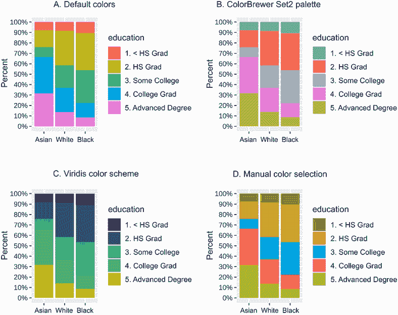

图 19.6 展示了 2011 年 3000 名中大西洋地区男性工人的种族参与教育情况。显示了四种不同的配色方案。A 是默认方案。B 和 C 是预设的配色方案。在 D 中，颜色由用户指定。

## 19.2 修改主题

`ggplot2 theme()`函数允许您自定义图表的非数据组件。该函数的帮助文档`(?theme)`描述了用于修改图表标题、标签、字体、背景、网格线和图例的参数。

例如，在以下代码中

```
ggplot(mtcars, aes(x = wt, y = mpg)) +
  geom_point()+ 
  theme(axis.title = element_text(size = 14, color = "blue"))
```

`theme()`函数以 14 点蓝色字体渲染*x*轴和*y*轴的标题。函数通常用于提供`theme`参数的值（见表 19.5）。

表 19.5 主题元素

| 函数 | 描述 |
| --- | --- |
| `element_blank()` | 空白元素（用于移除文本、线条等）。 |
| `element_rect()` | 指定矩形特征。参数包括`fill`、`color`、`size`和`linetype`。最后三个与边框相关。 |
| `element_line()` | 指定线条特征。参数包括`color`、`size`、`linetype`、`lineend`（`"round"`、`"butt"`、`"square"`）和`arrow`（使用`grid::arrow()`函数创建）。 |
| `element_text()` | 指定文本特征。参数包括`family`（字体家族）、`face`（`"plain"`、`"italic"`、`"bold"`、`"bold.italic"`）、`size`（以磅为单位的文本大小）、`hjust`（[0,1]中的水平对齐）、`vjust`（[0,1]中的垂直对齐）、`angle`（以度为单位的角）和`color`。 |

首先，我们将查看一些预配置的主题，这些主题可以同时更改多个元素，以提供一致的外观和感觉。然后我们将深入了解自定义单个主题元素。 

### 19.2.1 预包装主题

`ggplot2`包包含八个预配置的主题，可以通过`theme_*()`函数应用于`ggplot2`图形。列表 19.5 和图 19.7 展示了其中四个最受欢迎的。`theme_grey()`函数是默认主题，而`theme_void()`创建了一个完全空的主题。

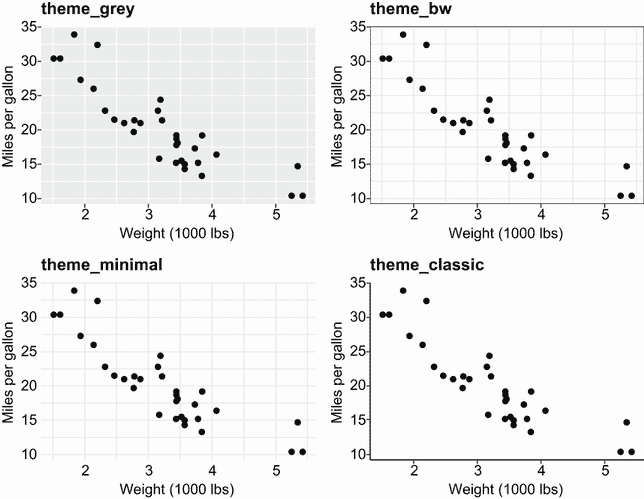

图 19.7 四个预配置主题的示例。默认情况下，`ggplot2`使用`theme_grey()`。

列表 19.5 四个预配置`ggplot2`主题的演示

```
library(ggplot2)
p <- ggplot(data = mtcars, aes(x = wt, y = mpg)) +
  geom_point() +
  labs(x = "Weight (1000 lbs)",
       y = "Miles per gallon")

p + theme_grey() + labs(title = "theme_grey")  
p + theme_bw() + labs(title = "theme_bw")  
p + theme_minimal() + labs(title = "theme_minimal")  
p + theme_classic() + labs(title = "theme_classic")
```

`ggthemes`、`hbrthemes`、`xaringanthemer`、`tgamtheme`、`cowplot`、`tvthemes`和`ggdark`包提供了额外的主题。每个都可以从 CRAN 获取。此外，一些组织为员工提供预配置的主题，以确保报告和演示文稿的外观一致。

除了预配置的主题外，您还可以修改单个主题元素。在以下章节中，您将使用主题参数来自定义字体、图例和其他图形元素。

### 19.2.2 自定义字体

使用排版来帮助传达意义，同时不会分散或混淆读者的注意力（见[`mng.bz/5Z1q`](http://mng.bz/5Z1q)）。例如，Google 的 Roboto 和 Lora 字体通常被推荐用于清晰度。基础 R 具有有限的本地字体处理能力。`showtext`包大大扩展了这些能力，允许您向图形添加系统字体和 Google Fonts。

步骤是

1.  加载本地和/或 Google 字体。

1.  将`showtext`设置为输出图形设备。

1.  在`ggplot2`的`theme()`函数中指定字体。

当考虑本地字体时，位置、数量和类型在计算机之间有很大差异。要使用除 R 默认字体之外的本地字体，您需要知道系统上字体文件的名称和位置。目前支持包括 TrueType 字体（*.ttf, *.ttc）和 OpenType 字体（*.otf）在内的格式。

`font_paths()` 函数列出了字体文件的位置，而 `font_files()` 列出了字体文件及其特性。列表 19.6 提供了一个简短的函数，用于在您的本地系统上定位字体文件。在这里，该函数用于定位 Comic Sans MS 字体的字体文件。由于结果取决于您的系统（我在使用 Windows PC），您的结果可能会有所不同。

列表 19.6 定位本地字体文件

```
> findfont <- function(x){
    suppressMessages(require(showtext))
    suppressMessages(require(dplyr))
    filter(font_files(), grepl(x, family, ignore.case=TRUE)) %>%
      select(path, file, family, face)
   }

> findfont("comic")

                path        file        family        face
1 C:/Windows/Fonts   comic.ttf Comic Sans MS     Regular
2 C:/Windows/Fonts comicbd.ttf Comic Sans MS        Bold
3 C:/Windows/Fonts  comici.ttf Comic Sans MS      Italic
4 C:/Windows/Fonts  comicz.ttf Comic Sans MS Bold Italic
```

一旦定位了本地字体文件，请使用 `font_add()` 将它们加载。例如，在我的机器上

```
font_add("comic", regular = "comic.ttf", 
          bold = "comicbd.ttf", italic="comici.ttf")
```

将 Comic Sans MS 字体在 R 中以任意名称“comic”提供。

要加载 Google 字体 ([`fonts.google.com/`](https://fonts.google.com/))，请使用以下语句

```
font_add_google(name, family)
```

其中 `name` 是 Google 字体的名称，而 `family` 是您将在后续代码中使用的任意名称。例如，

```
font_add_google("Schoolbell", "bell")
```

在名称 *bell* 下加载了 Schoolbell Google 字体。

一旦加载了字体，`showtext_auto()` 语句将 `showtext` 设置为新图形的输出设备。

最后，使用 `theme()` 函数来指示图表的哪些元素将使用哪些字体。表 19.6 列出了与文本相关的主题参数。您可以使用 `element_text()` 指定字体家族、外观、大小、颜色和方向。

表 19.6 `theme()` 与文本相关的参数

| 参数 | 描述 |
| --- | --- |
| `axis.title, axis.title.x, axis.title.y` | 轴标题 |
| `axis.text` 与 `axis.title` 相同的变体 | 轴上的刻度标签 |
| `legend.text, legend.title` | 图例项标签和图例标题 |
| `plot.title, plot.subtitle, plot.caption` | 图表标题、副标题和说明 |
| `strip.text, strip.text.x, strip.text.y` | 分面标签 |

以下列表演示了使用来自我的机器的两个本地字体（Comic Sans MS 和 Caveat）和两个 Google 字体（Schoolbell 和 Gochi Hand）自定义`ggplot2`图表。图 19.8 显示了该图表。

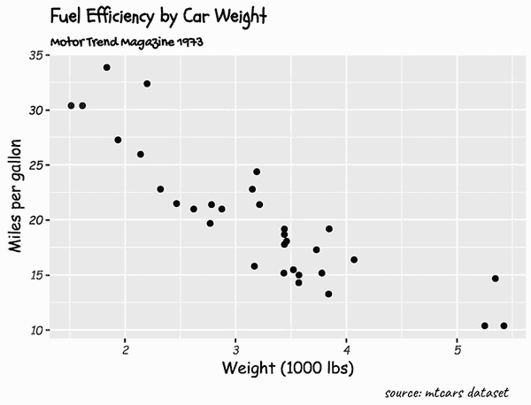

图 19.8 展示了使用多种字体的图表（标题使用 Schoolbell，副标题使用 Gochi Hand，来源使用 Caveat，轴标题和文本使用 Comic Sans MS）

列表 19.7 在`ggplot2`图表中自定义字体

```
library(ggplot2)
library(showtext)

font_add("comic", regular = "comic.ttf",                             ❶
         bold = "comicbd.ttf", italic="comici.ttf")                  ❶
font_add("caveat", regular = "caveat-regular.ttf",                   ❶
         bold = "caveat-bold.ttf")                                   ❶

font_add_google("Schoolbell", "bell")                                ❷
font_add_google("Gochi Hand", "gochi")                               ❷

showtext_auto()                                                      ❸

ggplot(data = mtcars, aes(x = wt, y = mpg)) +
  geom_point() +
  labs(title = "Fuel Efficiency by Car Weight",
       subtitle = "Motor Trend Magazine 1973",
       caption = "source: mtcars dataset",
       x = "Weight (1000 lbs)",
       y = "Miles per gallon") +

   theme(plot.title    = element_text(family = "bell", size=14),    ❹
         plot.subtitle = element_text(family = "gochi"),            ❹
         plot.caption  = element_text(family = "caveat", size=15),  ❹
         axis.title    = element_text(family = "comic"),            ❹
         axis.text     = element_text(family = "comic",             ❹
                                      face="italic", size=8))       ❹
```

❶ 加载本地字体

❷ 加载 Google 字体

❸ 使用 showtext 作为图形设备

❹ 指定图表字体

图 19.8 展示了生成的图表，该图表仅用于演示目的。在单个图表中使用多种字体往往会分散注意力，并削弱图表旨在传达的信息。选择一种或两种最能突出信息的字体，并坚持使用。一个有用的起点是 Tiffany France 的*为您的数据可视化选择字体* ([`mng.bz/nrY5`](http://mng.bz/nrY5))。

### 19.2.3 自定义图例

`ggplot2`包在变量映射到颜色、填充、形状、线型或大小（基本上是不涉及位置尺度的任何缩放）时创建图例。您可以使用表 19.7 中的`theme()`参数修改图例的外观。

最常用的参数是 `legend.position`。将参数设置为 `top`、`right`（默认）、`bottom` 或 `left` 允许您将图例放置在图的任何一边。或者，一个包含两个元素的数值向量（*x*、*y*）将图例放置在 *x* 轴和 *y* 轴上，其中 *x* 坐标范围从 0-左到 1-右，*y* 坐标范围从 0-底到 1-顶。

表 19.7 与绘图图例相关的 `theme()` 参数

| 参数 | 描述 |
| --- | --- |
| `legend.background, legend.key` | 图例和图例键（符号）的背景。使用 `element_rect()` 指定。 |
| `legend.title, legend.text` | 图例标题和文本的文本特征。使用 `element_text()` 指定值。 |
| `legend.position` | 图例的位置。值是 `"none"`、`"left"`、`"right"`、`"bottom"`、`"top"` 或两个元素的数值向量（每个介于 0-左/底和 1-右/顶之间）。 |
| `legend.justification` | 如果 `legend.position` 使用一个包含两个元素的数值向量设置，`legend.justification` 提供图例内的 *锚点*，作为一个包含两个元素的向量。例如，如果 `legend.position` `= c(1, 1)` 且 `legend.justification` `= c(1, 1)`，则锚点是图例的右下角。此锚点放置在图的右上角。 |
| `legend.direction` | 图例方向为 `“horizontal”` 或 `“vertical”` |
| `legend.title.align, legend.text.align` | 图例标题和文本的对齐方式（从 0-左到 1-右的数字）。 |

让我们为 `mtcars` 数据框创建一个散点图。将 `wt` 放在 *x* 轴上，`mpg` 放在 *y* 轴上，并根据发动机气缸数对点进行着色。使用表 19.7，通过以下方式自定义图表：

+   将图例放置在图的右上角

+   为图例命名“圆柱体”

+   水平列出图例类别而不是垂直列出

+   将图例背景设置为浅灰色并移除键元素（彩色符号）周围的背景

+   在图例周围放置白色边框

以下列表提供了代码，图 19.9 显示了生成的图表。

列出 19.8 自定义图例

```
library(ggplot2)
ggplot(mtcars, aes(wt, mpg, color = factor(cyl))) +
         geom_point(size=3) +
  scale_color_discrete(name="Cylinders") +
  labs(title = "Fuel Efficiency for 32 Automobiles",
       x = "Weight (1000 lbs)",
       y = "Miles per gallon") +
  theme(legend.position = c(.95, .95),
        legend.justification = c(1, 1),
        legend.background = element_rect(fill = "lightgrey",
                                         color = "white",
                                         size = 1),
        legend.key = element_blank(),
        legend.direction = "horizontal")
```

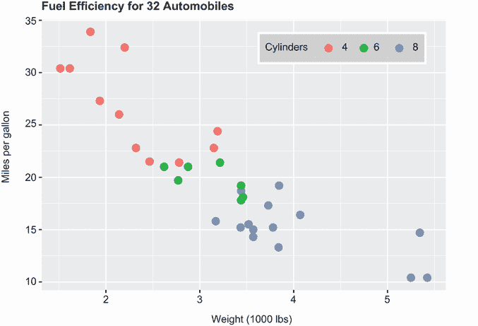

图 19.9 带有自定义图例的图表。图例的右上角放置在图的左上角。图例水平打印，带有灰色背景、实线白色边框和标题。

再次，这个图表是为了演示目的提供的。如果它放在右侧并垂直（在这种情况下是默认设置），实际上更容易将图例与图表相关联。参见 *数据可视化标准* ([`mng.bz/6m15`](http://mng.bz/6m15)) 以获取有关图例格式的建议。

### 19.2.4 自定义绘图区域

表 19.8 中的 `theme()` 参数允许您自定义绘图区域。最常见的变化是背景颜色和主网格线和副网格线。列表 19.9 演示了为分面散点图自定义绘图区域许多功能的示例。图 19.10 展示了结果图。

表 19.8 与绘图区域相关的 `theme()` 参数

| 参数 | 描述 |
| --- | --- |
| `plot.background` | 整个图的背景。使用 `element_rect()` 指定。 |
| `plot.margin` | 整个图周围的边距。使用 `units()` 函数和大小指定顶部、右侧、底部和左侧边距。 |
| `panel.background` | 绘图区域的背景。使用 `element_rect()` 指定。 |
| `strip.background` | 分面条标签的背景 |
| `panel.grid, panel.grid.major, panel.grid.minor, panel.grid.major.x panel.grid.major.y panel.grid.minor.x panel.grid.minor.y` | 网格线、主网格线、副网格线，或特定主网格线或副网格线。使用 `element_line()` 指定。 |
| `axis.line, axis.line.x, axis.line.y, axis.line.x.top, axis.line.x.bottom, axis.line.y.left, axis.line.y.right` | 轴上的线条（`axis.line`），每个平面的线条（`axis.line.x`，`axis.line.y`），或每个轴的单独线条（`axis.line.x.bottom`等）。使用 `element_line()` 指定。 |

列表 19.9 自定义绘图区域

```
library(ggplot2)
mtcars$am <- factor(mtcars$am, labels = c("Automatic", "Manual")) 
ggplot(data=mtcars, aes(x = disp, y = mpg)) +                     
  geom_point(aes(color=factor(cyl)), size=2) +                      ❶
  geom_smooth(method="lm", formula = y ~ x + I(x²),                ❷
              linetype="dotted", se=FALSE) +
  scale_color_discrete("Number of cylinders") +
  facet_wrap(~am, ncol=2) +                                         ❸
  labs(title = "Mileage, transmission type, and number of cylinders",
       x = "Engine displacement (cu. in.)",
       y = "Miles per gallon") +
  theme_bw() +                                                      ❹
  theme(strip.background = element_rect(fill = "white"),            ❺
        panel.grid.major = element_line(color="lightgrey"),
        panel.grid.minor = element_line(color="lightgrey",
                                        linetype="dashed"),
        axis.ticks = element_blank(),
        legend.position = "top",
        legend.key = element_blank())
```

❶ 分组散点图

❷ 拟合线

❸ 分面

❹ 设置黑白主题

❺ 修改主题

代码创建了一个图，其中发动机排量（`disp`）位于*x*轴上，每加仑英里数（`mpg`）位于*y*轴上。气缸数（`cyl`）和变速器类型（`am`）最初编码为数值，但转换为因子以进行绘图。对于`cyl`，转换为因子确保每个气缸数只有一个颜色。对于`am`，这提供了比 0 和 1 更好的标签。

创建了一个带有放大点的散点图，按气缸数着色❶。然后添加了一个最佳拟合的二次曲线❷。二次拟合线允许一条有弯曲的线（见第 8.2.3 节）。然后添加了每个变速器类型的分面图❸。

为了修改主题，我们首先使用 `theme_bw()`❹，然后使用 `theme()` 函数❺进行修改。条带背景色设置为白色。主网格线设置为实线浅灰色，副网格线设置为虚线浅灰色。轴刻度标记被移除。最后，图例放置在图的顶部，图例键（符号）具有空白背景。

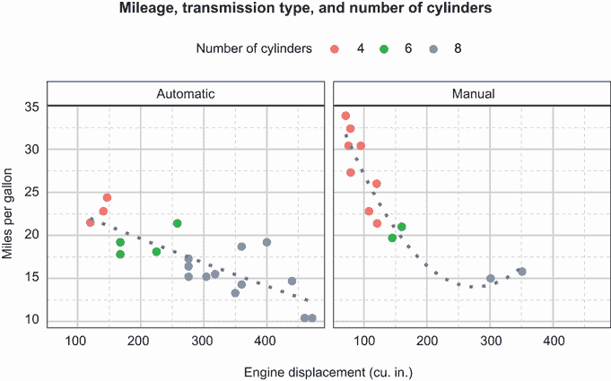

图 19.10 带拟合线的分面散点图。最终主题基于黑白主题的修改版本。

## 19.3 添加注释

*注释*允许您向图中添加更多信息，使读者更容易识别关系、分布或异常观察。最常见的注释是参考线和文本标签。添加这些注释的函数列在表 19.9 中。

表 19.9 添加注释的函数

| 函数 | 描述 |
| --- | --- |
| `geom_text, geom_label` | `geom_text()` 向图表添加文本。`geom_label()` 类似，但会在文本周围绘制矩形。 |
| `geom_text_repel, geom_label_repel` | 这些是来自 `ggrepel` 包的函数。它们与 `geom_text()` 和 `geom_label()` 类似，但可以避免文本重叠。 |
| `geom_hline, geom_vline, geom_abline` | 添加水平、垂直和对角参考线 |
| `geom_rect` | 向图中添加矩形。用于突出显示绘图中的区域。 |

标记点

在图 19.1 中，我们绘制了汽车重量 (`wt`) 与燃油效率 (`mpg`) 之间的关系。然而，读者无法确定哪些点代表哪些汽车，除非参考原始数据集。以下列表将此信息添加到图表中。图 19.11 显示了图表。

列表 19.10 标记点的散点图

```
library(ggplot2)
ggplot(data = mtcars, aes(x = wt, y = mpg)) +
  geom_point(color = "steelblue") +
  geom_text(label = row.names(mtcars)) +
  labs(title = "Fuel efficiency by car weight",
       x = "Weight (1000 lbs)",
       y = "Miles per gallon")
```

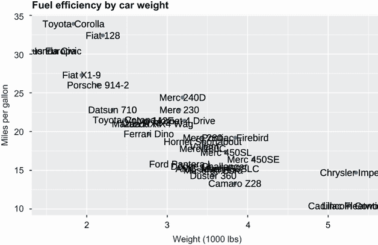

图 19.11 汽车重量与每加仑英里数的散点图。点用汽车名称标记。

由于文本重叠，生成的图表难以阅读。`ggrepel` 包通过重新定位文本标签以避免重叠来解决这个问题。我们将使用此包来标记点并重新创建图表。此外，我们还将添加一条参考线和标签，指示中位数每加仑英里数。以下列表提供了代码，图 19.12 显示了图表。

列表 19.11 使用 `ggrepel` 标记点的散点图

```
library(ggplot2)
library(ggrepel)
ggplot(data = mtcars, aes(x= wt, y = mpg)) +
  geom_point(color = "steelblue") +
  geom_hline(yintercept = median(mtcars$mpg),               ❶
             linetype = "dashed",                           ❶
             color = "steelblue") +                         ❶
  geom_label(x = 5.2, y = 20.5,                             ❷
             label = "median MPG",                          ❷
             color = "white",                               ❷
             fill = "steelblue",                            ❷
             size = 3) +                                    ❷
  geom_text_repel(label = row.names(mtcars), size = 3) +    ❸
  labs(title = "Fuel efficiency by car weight",
       x = "Weight (1000 lbs)",
       y = "Miles per gallon")
```

❶ 参考线

❷ 参考线标签

❸ 点标签

参考线指示哪些汽车高于或低于中位数每加仑英里数 ❶。该线使用 `geom_label` ❷ 标记。正确放置线标签 (*x*, *y*) 需要一些实验。最后，使用 `geom_text_repel()` 函数标记点 ❸。标签的大小也从默认的 4 减小到 3。此图表更容易阅读和理解。

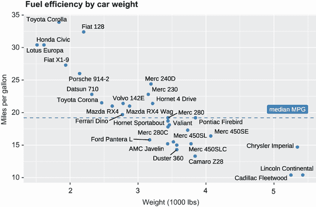

图 19.12 汽车重量与每加仑英里数的散点图。点用汽车名称标记。`ggrepel` 包已用于重新定位标签以避免文本重叠。此外，还添加了一条参考线和标签。

标记条形图

可以向条形图添加标签以阐明分类变量的分布或堆叠条形图的组成。向每个条形添加百分比标签是一个两步过程。首先，计算每个条形的百分比。然后使用这些百分比直接创建条形图，并通过 `geom_text()` 函数添加标签。以下列表显示了此过程。图 19.13 显示了图表。

列表 19.12 向条形图添加百分比标签

```
library(ggplot2)
library(dplyr)
library(ISLR)

plotdata <- Wage %>%                                          ❶
  group_by(race) %>%                                          ❶
  summarize(n = n()) %>%                                      ❶
  mutate(pct = n / sum(n),                                    ❶
         lbls = scales::percent(pct),                         ❶
         race = factor(race, labels = c("White", "Black",     ❶
                                        "Asian", "Other")))   ❶

plotdata

## # A tibble: 4 x 4
##   race         n    pct lbl  
##   <fct>    <int>  <dbl> <chr>
## 1 1\. White  2480 0.827  82.7%
## 2 2\. Black   293 0.0977 9.8% 
## 3 3\. Asian   190 0.0633 6.3% 
## 4 4\. Other    37 0.0123 1.2%

ggplot(data=plotdata, aes(x=race, y=pct)) +
  geom_bar(stat = "identity", fill="steelblue") +             ❷
  geom_text(aes(label = lbls),                                ❸
            vjust = -0.5,                                     ❸
            size = 3) +                                       ❸
  labs(title = "Participants by Race",
       x = "", 
       y="Percent") +
  theme_minimal()
```

❶ 计算百分比

❷ 添加条形

❸ 添加条形标签

每个种族类别的百分比是计算出来的 ❶，并使用`scales`包中的`percent()`函数创建格式化的标签（`lbls`）。然后使用这些汇总数据创建条形图 ❷。`geom_bar()`函数中的`stat` `=` `"identity"`选项告诉`ggplot2`使用提供的*y*-值（条形高度），而不是计算它们。然后使用`geom_text()`函数打印条形标签 ❸。`vjust` `=` `-0.5`参数将文本略微抬高于条形上方。

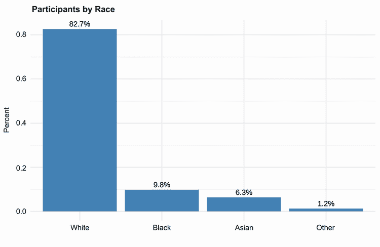

图 19.13 带有百分比标签的简单条形图

你也可以在堆叠条形图中添加百分比标签。在下面的列表中，图 19.4 中的填充条形图被复制并添加了百分比标签。图 19.14 显示了最终的图形。

列表 19.13 向堆叠（填充）条形图添加百分比标签

```
library(ggplot2)
library(dplyr)
library(ISLR)

plotdata <- Wage %>%                                             ❶
  group_by(race, education) %>%                                  ❶
  summarize(n = n()) %>%                                         ❶
  mutate(pct = n/sum(n),                                         ❶
         lbl = scales::percent(pct))                             ❶

ggplot(plotdata, aes(x=race, y=pct, fill=education)) +
  geom_bar(stat = "identity", 
           position="fill", 
           color="lightgrey") +
  scale_y_continuous("Percent",                                  ❷
                     label=scales::percent_format(accuracy=2),   ❷
                     n.breaks=10) +                              ❷
  scale_x_discrete("",                                           ❷
                   limits=c("3\. Asian", "1\. White", "2\. Black"), ❷
                   labels=c("Asian", "White", "Black")) +        ❷
  geom_text(aes(label = lbl),                                    ❸
            size=3,                                              ❸
            position = position_stack(vjust = 0.5)) +            ❸
  labs(title="Participant Education by Race",
       fill = "Education") +
  theme_minimal() +                                              ❹
  theme(panel.grid.major.x=element_blank())                      ❹
```

❶ 计算百分比

❷ 自定义 y 轴和 x 轴

❸ 添加百分比标签

❹ 自定义主题

这段代码与之前的代码类似。根据教育组合计算每个种族的百分比 ❶，并使用这些百分比生成条形图。*x*-轴和*y*-轴被自定义以匹配列表 19.2 ❷。接下来，使用`geom_text()`函数添加百分比标签 ❸。`position_stack()`函数确保每个堆叠段的百分比放置正确。最后，指定了图形和填充标题，并选择了一个没有*x*-轴网格线的最小主题 ❹（它们不需要）。

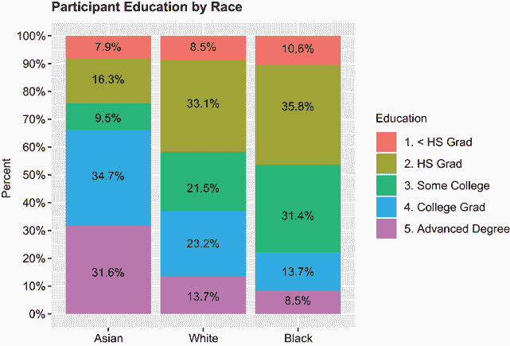

图 19.14 带有百分比标签的堆叠（填充）条形图

突出细节

一个最终的例子展示了如何使用注释在复杂图表中突出信息。`gapminder`包中的`gapminder`数据框包含了从 1952 年到 2002 年每 5 年记录的 142 个国家的平均年度预期寿命。柬埔寨的预期寿命与其他亚洲国家在这组数据中差异很大。让我们创建一个突出这些差异的图表。列表 19.14 提供了代码，图 19.15 显示了结果。

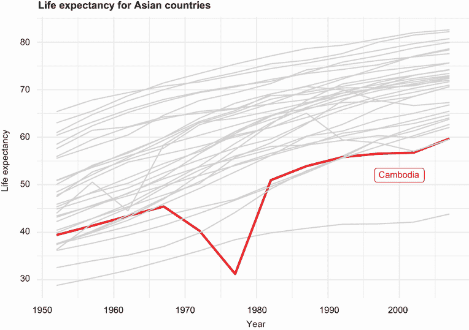

图 19.15 33 个亚洲国家的平均预期寿命趋势。柬埔寨的趋势被突出显示。尽管每个国家的趋势都是积极的，但柬埔寨在 1967 年到 1977 年之间有急剧下降。

列表 19.14 突出众多趋势中的一个

```
library(ggplot2)
library(dplyr)
library(gapminder)
plotdata <- gapminder %>%
  filter(continent == "Asia")                          ❶

plotdata$highlight <- ifelse(plotdata$country %in%      ❷
                             c("Cambodia"), "y", "n")   ❷

ggplot(plotdata, aes(x = year, y = lifeExp,             ❸
                     group = country,                   ❸
                     size = highlight,                  ❸
                     color = highlight)) +              ❸
  scale_color_manual(values=c("lightgrey", "red")) +    ❸
  scale_size_manual(values=c(.5, 1)) +                  ❸
  geom_line() +                                         ❸
  geom_label(x=2000, y= 52, label="Cambodia",           ❹
             color="red", size=3) +                     ❹
  labs(title="Life expectancy for Asian countries",
       x="Year",
       y="Life expectancy") +
  theme_minimal() +                                        
  theme(legend.position="none",
        text=element_text(size=10))
```

❶ 筛选亚洲国家

❷ 为柬埔寨创建指标变量

❸ 可视化突出柬埔寨

❹ 添加注释标签

首先，数据被子集化，只包括亚洲国家 ❶。接下来，创建了一个二元变量来表示柬埔寨与其他国家 ❷。寿命预期与年份作图，并为每个国家绘制一条单独的线 ❸。柬埔寨的线比其他国家的线粗，颜色为红色。所有其他国家的线都为浅灰色。为柬埔寨的线添加了一个标签 ❹。最后，指定了图形和坐标轴标签，并添加了一个最小主题。图例（大小、颜色）被抑制（不需要），基本文本大小减小。

观察图形，可以清楚地看出每个国家的平均寿命预期都有所增加。但柬埔寨的趋势相当不同，在 1967 年至 1977 年之间有一个显著的下降。这很可能是由于波尔布特和红色高棉在那个时期实施的种族灭绝。

## 19.4 组合图形

将相关的 `ggplot2` 图形组合成一个整体的图形，通常有助于强调关系和差异。我在创建文本中的几个图形时使用了这种方法（例如，见图 19.7）。`patchwork` 包提供了一种简单而强大的语言来组合图形。要使用它，将每个 `ggplot2` 图形保存为一个对象。然后使用竖线（`|`）运算符水平组合图形，使用正斜杠（`/`）运算符垂直组合图形。您可以使用括号 `()` 创建图形的子组。图 19.16 展示了各种图形排列方式。

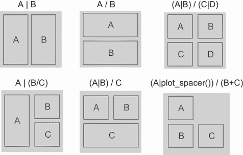

图 19.16 `patchwork` 包提供了一套简单的算术符号，用于在单个图形中排列多个图形。

让我们从 `mtcars` 数据框中创建几个与 `mpg` 相关的图形，并将它们组合成一个单一的图形。以下列表给出了代码，图 19.17 显示了该图形。

列表 19.15 使用 `patchwork` 包组合图形

```
library(ggplot2)
library(patchwork)

p1 <- ggplot(mtcars, aes(disp, mpg)) +                       ❶
  geom_point() +                                             ❶
  labs(x="Engine displacement",                              ❶
       y="Miles per gallon")                                 ❶

p2 <- ggplot(mtcars, aes(factor(cyl), mpg)) +                ❶
  geom_boxplot() +                                           ❶
  labs(x="Number of cylinders",                              ❶
       y="Miles per gallon")                                 ❶

p3 <- ggplot(mtcars, aes(mpg)) +                             ❶
  geom_histogram(bins=8, fill="darkgrey", color="white") +   ❶
  labs(x = "Miles per gallon",                               ❶
       y = "Frequency")                                      ❶

(p1 | p2) / p3 +                                             ❷
  plot_annotation(title = 'Fuel Efficiency Data') &          ❷
  theme_minimal() +                                          ❷
  theme(axis.title = element_text(size=8),                   ❷
        axis.text = element_text(size=8))                    ❷
```

❶ 创建了三个图形。

❷ 图形被组合成一个单一的图形。

创建了三个单独的图形，并保存为 `p1`、`p2` 和 `p3` ❶。代码 `(p1| p2)/p3` 表示前两个图形应放置在第一行，第三个图形应占据整个第二行 ❷。

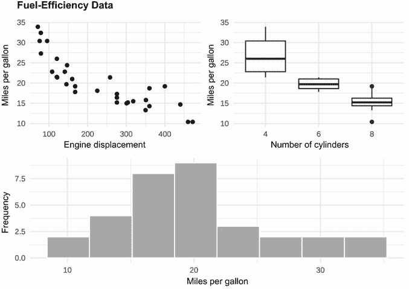

图 19.17 使用 patchwork 包将三个 `ggplot2` 图形组合成一个图形。

生成的图形也是一个 `ggplot2` 图形，可以进行编辑。`plot_annotation()` 函数为组合图形添加了一个标题（而不是为子图之一添加）。最后，修改了主题。注意使用连字符（`&`）来添加主题元素。如果您使用了加号（`+`），则更改只会应用于最后一个子图（`p3`）。`&` 符号表示主题函数应该应用于每个子图（`p1`、`p2` 和 `p3`）。

`patchwork` 包有许多其他选项。要了解更多信息，请参阅包参考网站([`patchwork.data-imaginist.com/`](https://patchwork.data-imaginist.com/))。

## 19.5 制作交互式图形

除了少数例外，本书中的图表都是静态图像。创建交互式图表有几个原因。它们允许你专注于有趣的结果，并调用附加信息来理解模式、趋势和异常观察。此外，它们通常比静态图表更具吸引力。

R 中有几个包可以用来创建交互式可视化，包括`leaflet`、`rbokeh`、`rCharts`、`highlighter`和`plotly`。在本节中，我们将重点关注`plotly`。

*Plotly R 开源绘图库* ([`plotly.com/r/`](https://plotly.com/r/))可以用来创建高端交互式可视化。一个关键优势是它能够将静态`ggplot2`图表转换为交互式网络图形。

使用`plotly`包创建交互式图表是一个简单的两步过程。首先，将`ggplot2`图表保存为一个对象。然后将该对象传递给`ggplotly()`函数。

在列表 19.16 中，使用`ggplot2`创建了一个每加仑英里数与发动机排量之间的散点图。点被着色以表示发动机气缸数。然后，将图表传递给`plotly`包中的`ggplotly()`函数，生成一个基于网页的交互式可视化。图 19.18 提供了一个截图。

列表 19.16 将`ggplot2`图表转换为交互式`plotly`图表

```
library(ggplot2)
library(plotly)
mtcars$cyl <- factor(mtcars$cyl)
mtcars$name <- row.names(mtcars)

p <- ggplot(mtcars, aes(x = disp, y= mpg, color = cyl)) +
  geom_point()
ggplotly(p)
```

当你将鼠标悬停在图表上时，图表右上角将出现一个工具栏，允许你缩放、平移、选择区域、下载图像等（见图 19.19）。此外，当鼠标光标移动到图表区域时，将弹出工具提示。默认情况下，工具提示显示用于创建图表的变量值（在本例中为`disp`、`mpg`和`cyl`）。此外，点击图例中的键（符号）可以切换数据的开和关。这允许你轻松地关注数据的子集。

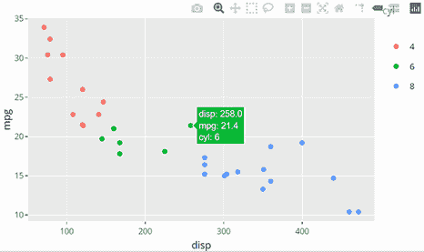

图 19.18 从静态`ggplot2`图表创建的`plotly`交互式网络图形的截图

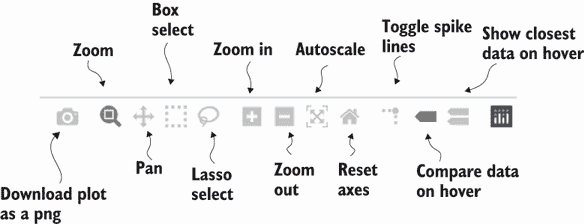

图 19.19 `plotly`图表工具栏。理解这些工具的最简单方法是逐一尝试。

有两种简单的方法可以自定义工具提示。你可以在`ggplot aes()`函数中包含`label1` `=` `var1`、`label2` `=` `var2`等，以向工具提示中添加额外的变量。例如，

```
p <- ggplot(mtcars, aes(x = disp, y= mpg, color = cyl, 
                        label1 = gear, label2 = am))) +
  geom_point()
ggplotly(p)
```

将创建一个包含`disp`、`mpg`、`cyl`、`gear`和`am`的工具提示。

或者，你可以使用`aes()`函数中的非官方`text`参数来从任意文本字符串构建工具提示。以下列表提供了一个示例，图 19.20 提供了结果的截图。

列表 19.17 定制`plotly`工具提示

```
library(ggplot2)
library(plotly)
mtcars$cyl <- factor(mtcars$cyl)
mtcars$name <- row.names(mtcars)

p <- ggplot(mtcars,
            aes(x = disp, y=mpg, color=cyl,
                text = paste(name, "\n",
                             "mpg:", mpg, "\n",
                             "disp:", disp, "\n",
                             "cyl:", cyl, "\n",
                             "gear:", gear))) +
  geom_point()
ggplotly(p, tooltip=c("text"))
```

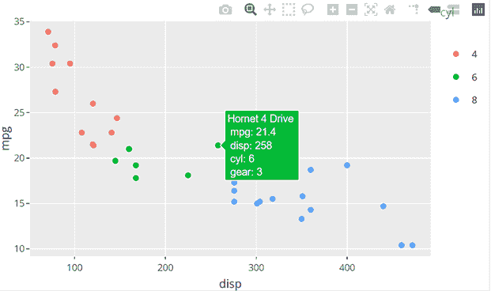

图 19.20 从`ggplot2`代码中创建的具有自定义工具提示的交互式`plotly`图表的截图

`text` 方法让你对提示信息有极大的控制权。你甚至可以在文本字符串中包含 HTML 标记，从而进一步自定义文本输出。

本章介绍了自定义 `ggplot2` 图表的各种方法。请记住，自定义的目标是增强你对数据的洞察力，并改善这些洞察力与他人的沟通。任何偏离这些目标的添加到图表中的元素都只是装饰（也称为图表垃圾）。始终尝试避免图表垃圾！请参阅 *数据可视化标准* ([`xdgov.github.io/data-design-standards/`](https://xdgov.github.io/data-design-standards/)) 获取更多建议。

## 摘要

+   `ggplot2` 的缩放函数将变量值映射到图表的视觉方面。它们特别适用于自定义坐标轴和颜色调色板。

+   `ggplot2 theme()` 函数控制图表的非数据元素。它用于自定义字体、图例、网格线和绘图背景的外观。

+   `ggplot2 geom` 函数通过添加有用的信息（如参考线和标签）来注释图表很有用。

+   使用 `patchwork` 包可以将两个或多个图表合并为单个图表。

+   几乎任何 `ggplot2` 图表都可以使用 `plotly` 包从静态图像转换为交互式网络图形。
