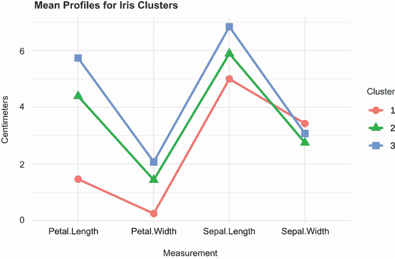
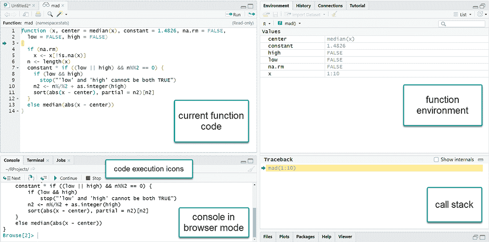
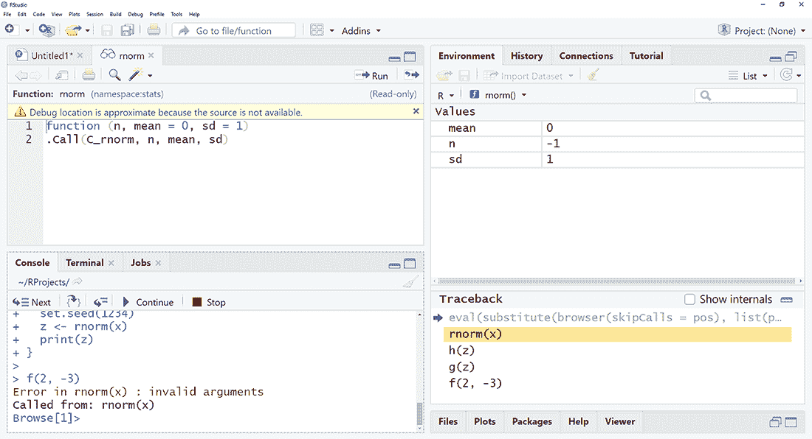

# 20 高级编程

本章涵盖了

+   深入了解 R 语言

+   使用 R 的面向对象编程特性创建通用函数

+   调整代码以提高运行效率

+   查找和纠正编程错误

前几章介绍了对应用程序开发重要的话题，包括数据类型（第 2.2 节）、控制流（第 5.4 节）和函数创建（第 5.5 节）。本章将从更高级和更详细的视角回顾 R 作为编程语言的这些方面。到本章结束时，您将更好地了解 R 语言的工作方式，这将帮助您创建自己的函数，最终，您的自己的包。

在详细讨论函数创建的细节之前，包括作用域和环境的作用，我们将先回顾对象、数据类型和控制流。本章介绍了 R 的面向对象编程方法，并讨论了通用函数的创建。最后，我们将介绍编写高效代码生成和调试应用程序的技巧。掌握这些主题将帮助您理解他人应用程序中的代码，并帮助您创建新的应用程序。在第二十二章中，您将有机会从头到尾创建一个有用的包，以将这些技能付诸实践。

## 20.1 语言回顾

R 是一种面向对象、函数式、数组式编程语言，其中对象是特殊的数据结构，存储在 RAM 中，并通过名称或符号访问。对象的名称由大写和小写字母、数字 0-9、点号和下划线组成。名称区分大小写，不能以数字开头，点号被视为普通字符，没有特殊含义。

与 C 和 C++等语言不同，你无法直接访问内存位置。数据、函数以及几乎所有可以存储和命名的其他内容都是对象。此外，名称和符号本身也是可以被操作的对象。所有对象在程序执行期间都存储在 RAM 中，这对分析大规模数据集有重大影响。

每个对象都有属性：描述对象特征的元信息。可以使用`attributes()`函数列出属性，并使用`attr()`函数设置属性。一个关键属性是对象的类。R 函数使用有关对象类信息来确定如何处理对象。对象的类可以使用`class()`函数读取和设置。本章和下一章将给出一些示例。

### 20.1.1 数据类型

有两种基本数据类型：原子向量和通用向量。原子向量是只包含单一数据类型的数组。通用向量，也称为列表，是原子向量的集合。列表是递归的，因为它们也可以包含其他列表。本节将详细考虑这两种类型。

与许多其他编程语言不同，您不需要声明对象的类型或为其分配空间。类型从对象的内部内容隐式确定，大小根据对象包含的类型和元素数量自动增长或缩小。

原子向量

原子向量是包含单一数据类型（逻辑、实数、复数、字符或原始）的数组。例如，以下每个都是一维原子向量：

```
passed <- c(TRUE, TRUE, FALSE, TRUE)
ages <- c(15, 18, 25, 14, 19)
cmplxNums <- c(1+2i, 0+1i, 39+3i, 12+2i)
names <- c("Bob", "Ted", "Carol", "Alice")
```

类型为 *raw* 的向量包含原始字节，这里不做讨论。

许多 R 数据类型都是具有特殊属性的原子向量。例如，R 没有标量类型。标量是一个只有一个元素的原子向量。因此，`k <- 2` 是 `k <- c(2)` 的简写。

矩阵是一个具有维度属性 `dim` 的原子向量，该属性包含两个元素（行数和列数）。例如，从一个一维数值向量 `x` 开始：

```
> x <- c(1,2,3,4,5,6,7,8)
> class(x)
[1] "numeric"
> print(x)
{1] 1 2 3 4 5 6 7 8
```

然后添加一个 `dim` 属性：

```
> attr(x, "dim") <- c(2,4)
```

对象 `x` 现在是一个 2 × 3 的 `matrix` 类矩阵：

```
> print(x)
     [,1] [,2] [,3] [,4]
[1,]    1    3    5    7
[2,]    2    4    6    8

> class(x)
[1] "matrix" "array"
> attributes(x)
$dim
[1] 2 2
```

可以通过添加 `dimnames` 属性来附加行和列名：

```
> attr(x, "dimnames") <- list(c("A1", "A2"), 
                                 c("B1", "B2", "B3", "B4"))
> print(x)
   B1 B2 B3 B4
A1  1  3  5  7
A2  2  4  6  8
```

最后，可以通过移除 `dim` 属性将矩阵返回为一维向量：

```
> attr(x, "dim") <- NULL 
> class(x)
[1] "numeric"
> print(x)
[1] 1 2 3 4 5 6 7 8 
```

数组是一个具有 `dim` 属性的原子向量，该属性包含三个或更多元素。同样，您使用 `dim` 属性设置维度，并可以使用 `dimnames` 属性附加标签。与一维向量一样，矩阵和数组可以是逻辑、数值、字符、复数或原始类型。但您不能在单个矩阵或数组中混合类型。

`attr()` 函数允许您创建任意属性并将它们与一个对象关联。属性存储有关对象的信息，并且可以被函数用来确定它们如何被处理。

有许多用于设置属性的专用函数，包括 `dim()`、`dimnames()`、`names()`、`row.names()`、`class()` 和 `tsp()`。后者用于创建时间序列对象。这些专用函数对可以设置的值有限制。除非您正在创建自定义属性，否则始终使用这些专用函数是个好主意。它们的限制和它们产生的错误消息使编码错误的可能性降低，并且更明显。

泛型向量或列表

*列表* 是原子向量和/或其他列表的集合。数据框是列表的一种特殊类型，其中集合中的每个原子向量具有相同的长度。考虑随 base R 安装一起提供的 `iris` 数据框。它描述了在 150 棵植物上进行的四个物理测量，以及它们的物种（setosa、versicolor 或 virginica）：

```
> head(iris)
  Sepal.Length Sepal.Width Petal.Length Petal.Width Species
1          5.1         3.5          1.4         0.2  setosa
2          4.9         3.0          1.4         0.2  setosa
3          4.7         3.2          1.3         0.2  setosa
4          4.6         3.1          1.5         0.2  setosa
5          5.0         3.6          1.4         0.2  setosa
6          5.4         3.9          1.7         0.4  setosa
```

这个数据框实际上是一个包含五个原子向量的列表。它有一个`names`属性（变量名称的字符向量），一个`row.names`属性（标识单个植物的数值向量），以及一个值为`"data.frame"`的类属性。每个向量代表数据框中的一列（变量）。这可以通过使用`unclass()`函数打印数据框并使用`attributes()`函数获取属性来轻松看到：

```
unclass(iris)
attributes(iris)
```

为了节省空间，这里省略了输出。

理解列表非常重要，因为 R 函数经常将它们作为值返回。让我们看看使用第十六章中提到的聚类分析技术的一个例子。聚类分析使用一系列方法来识别观察值自然发生的分组。

让我们将 k-means 聚类分析（第 16.4.1 节）应用于`iris`数据。假设数据中存在三个聚类，观察观察值（行）是如何分组的。我们将忽略物种变量，仅使用每棵植物的物理测量值来形成聚类。所需的代码是

```
set.seed(1234)
fit <- kmeans(iris[1:4], 3)
```

对象`fit`包含哪些信息？`kmeans``()`函数的帮助页面表明该函数返回一个包含七个组件的列表。`str()`函数显示对象的结构，`unclass()`函数可以用来直接检查对象的内容。`length()`函数指示对象包含多少个组件，`names()`函数提供这些组件的名称。您可以使用`attributes()`函数来检查对象的属性。这里探讨了`kmeans``()`返回的对象的内容：

```
  > names(fit)
[1] "cluster"      "centers"      "totss"        "withinss"    
[5] "tot.withinss" "betweenss"    "size"         "iter"        
[9] "ifault" 

> unclass(fit)
$cluster
  [1] 1 1 1 1 1 1 1 1 1 1 1 1 1 1 1 1 1 1 1 1 1 1 1 1 1 1 1 1
 [29] 1 1 1 1 1 1 1 1 1 1 1 1 1 1 1 1 1 1 1 1 1 1 2 2 3 2 2 2
 [57] 2 2 2 2 2 2 2 2 2 2 2 2 2 2 2 2 2 2 2 2 2 3 2 2 2 2 2 2
 [85] 2 2 2 2 2 2 2 2 2 2 2 2 2 2 2 2 3 2 3 3 3 3 2 3 3 3 3 3
[113] 3 2 2 3 3 3 3 2 3 2 3 2 3 3 2 2 3 3 3 3 3 2 3 3 3 3 2 3
[141] 3 3 2 3 3 3 2 3 3 2

$centers
  Sepal.Length Sepal.Width Petal.Length Petal.Width
1        5.006       3.428        1.462       0.246
2        5.902       2.748        4.394       1.434
3        6.850       3.074        5.742       2.071

$totss
[1] 681.4

$withinss
[1] 15.15 39.82 23.88

$tot.withinss
[1] 78.85

$betweenss
[1] 602.5

$size
[1] 50 62 38

$iter
[1] 2

$ifault
[1] 0
```

执行`sapply(fit,` `class)`返回对象中每个组件的类：

```
> sapply(fit, class)
     cluster      centers        totss     withinss tot.withinss 
   "integer"     "matrix"    "numeric"    "numeric"    "numeric" 
   betweenss         size         iter       ifault 
   "numeric"    "integer"    "integer"    "integer" 
```

在这个例子中，`cluster`是一个包含聚类成员资格的整数向量，`centers`是一个包含聚类质心（每个聚类的每个变量的均值）的矩阵。`size`组件是一个包含每个三个聚类的植物数量的整数向量。要了解其他组件，请参阅`help(``kmeans``)`中的值部分。

索引

学习如何提取列表中的信息是 R 编程的关键技能。任何数据对象的元素都可以通过索引来提取。在深入探讨列表之前，让我们看看如何从原子向量中提取元素。

元素是通过使用`*object*[*index*]`来提取的，其中`*object*`是向量，`index`是一个整数向量。如果原子向量的元素已经被命名，`index`也可以是一个包含这些名称的字符向量。请注意，在 R 中，索引从 1 开始，而不是像许多其他语言中的 0。

这里有一个例子，使用这种方法对一个没有命名的原子向量进行操作：

```
> x <- c(20, 30, 40)
> x[3]
[1] 40
> x[c(2,3)]
[1] 30 40
```

对于具有命名元素的原子向量，您可以使用

```
> x <- c(A=20, B=30, C=40)
> x[c(2,3)]
 B  C 
30 40 
> x[c("B", "C")]
 B  C 
30 40
```

对于列表，可以使用`*object*[index*]`提取组件（原子向量或其他列表），其中`index`是一个整数向量。如果组件有名称，可以使用名称字符向量。

继续使用 k-means 的例子，

```
>fit[c(2, 7)]
$centers
  Sepal.Length Sepal.Width Petal.Length Petal.Width
1     5.006000    3.428000     1.462000    0.246000
2     5.901613    2.748387     4.393548    1.433871
3     6.850000    3.073684     5.742105    2.071053

$size
[1] 50 62 38
```

返回一个包含两个组件的列表（聚类均值和聚类大小）。每个组件都包含一个矩阵。

重要的是要注意，使用单括号从列表中提取子集始终返回一个列表。例如，

```
>fit[2]
$centers
  Sepal.Length Sepal.Width Petal.Length Petal.Width
1     5.006000    3.428000     1.462000    0.246000
2     5.901613    2.748387     4.393548    1.433871
3     6.850000    3.073684     5.742105    2.071053
```

返回一个包含一个组件的列表，而不是矩阵。要提取组件的*内容*，请使用`object[[index]]`。例如，

```
> fit[[2]]
  Sepal.Length Sepal.Width Petal.Length Petal.Width
1        5.006       3.428        1.462       0.246
2        5.902       2.748        4.394       1.434
3        6.850       3.074        5.742       2.071
```

返回一个矩阵。这个区别可能很重要，取决于你对结果的处理方式。如果你想将结果传递给需要一个矩阵作为输入的函数，请使用双括号表示法。

要提取单个命名组件的内容，可以使用 `$` 符号。在这种情况下，`object[["name"]]` 和 `object$name` 是等效的：

```
> fit$centers
  Sepal.Length Sepal.Width Petal.Length Petal.Width
1        5.006       3.428        1.462       0.246
2        5.902       2.748        4.394       1.434
3        6.850       3.074        5.742       2.071
```

这也解释了为什么 `$` 符号与数据框一起使用。考虑 `iris` 数据框。数据框是列表的特殊情况，其中每个变量都表示为一个组件。例如，`iris$Sepal.Length` 等同于 `iris[["Sepal .Length"]]`，并返回花瓣长度的 150 元素向量。

可以组合符号来获取组件内的元素。例如，

```
> fit[[2]][1, ]
Sepal.Length  Sepal.Width Petal.Length  Petal.Width 
       5.006        3.428        1.462        0.246
```

提取 `fit` 的第二个组件（均值的矩阵）并返回第一行（每个变量的第一个聚类的均值）。在最终方括号后面的逗号后的空白表示返回所有四列。

通过提取函数返回的列表的组件和元素，你可以进一步处理结果。例如，要使用线形图绘制聚类中心，可以使用以下列表中的代码。

列表 20.1 从 k-means 聚类分析中绘制聚类中心

```
> set.seed(1234)
> fit <- kmeans(iris[1:4], 3)                                    ❶
> means <- fit$center                                            ❶
> means <- as.data.frame(means)                                  ❶
> means$cluster <- row.names(means)                              ❶

> library(tidyr)                                                 ❷
> plotdata <- gather(means,                                      ❷
                     key="variable",                             ❷
                     value="value",                              ❷
                     -cluster)                                   ❷
> names(plotdata) <- c("Cluster", "Measurement", "Centimeters")  ❷
> head(plotdata)

  Cluster  Measurement Centimeters
1       1 Sepal.Length       5.006
2       2 Sepal.Length       5.902
3       3 Sepal.Length       6.850
4       1  Sepal.Width       3.428
5       2  Sepal.Width       2.748
6       3  Sepal.Width       3.074

library(ggplot2)                                                 ❸
ggplot(data=plotdata,                                            ❸
       aes(x=Measurement, y=Centimeters, group=Cluster)) +       ❸
       geom_point(size=3, aes(shape=Cluster, color=Cluster)) +   ❸
       geom_line(size=1, aes(color=Cluster)) +                   ❸
       labs(title="Mean Profiles for Iris Clusters") +           ❸
       theme_minimal()                                           ❸
```

❶ 获取聚类均值

❷ 将数据重塑为长格式

❸ 绘制线形图

首先，提取聚类中心的矩阵（行是聚类，列是变量均值）并将其转换为数据框。添加聚类编号作为附加变量 ❶。然后使用`tidyr`包（见第 5.5.2 节）将数据框重塑为长格式 ❷。最后，使用`ggplot2`包绘制数据 ❸。图 20.1 显示了生成的图形。



图 20.1 使用 k-means 聚类从 `iris` 数据集中提取的三个聚类的中心（均值）的图形

这种类型的图形是可能的，因为所有绘制的变量都有相同的测量单位（厘米）。如果聚类分析涉及不同尺度的变量，必须在绘图之前标准化数据，并在 y 轴上标注为标准化分数等。有关详细信息，请参阅第 16.1 节。

现在你可以用结构表示数据并解包结果，让我们看看流程控制。

### 20.1.2 控制结构

当 R 解释器处理代码时，它是按顺序逐行读取的。如果一行不是一个完整的语句，它将读取额外的行，直到可以构造出一个完整的语句。例如，如果你想要计算 3 + 2 + 5，

```
> 3 + 2 + 5
[1] 10
```

将会工作。所以也会

```
> 3 + 2 + 
  5
[1] 10
```

第一行末尾的 `+` 符号表示该语句尚未完成。但是

```
> 3 + 2
[1] 5
> + 5
[1] 5
```

明显是不行的，因为 3 + 2 被解释为一个完整的语句。

有时，你需要非顺序地处理代码。你可能想要有条件地执行代码或重复一个或多个语句多次。本节描述了三个在编写函数时特别有用的控制流函数：`for`、`if` 和 `ifelse`。

for 循环

`for()` 函数允许你重复执行一个语句。其语法是

```
for(var in seq){
     statements
}
```

其中 `var` 是一个变量名，`seq` 是一个计算结果为向量的表达式。如果只有一个语句，大括号是可选的：

```
> for(i in 1:5) print(1:i)
[1] 1
[1] 1 2
[1] 1 2 3
[1] 1 2 3 4
[1] 1 2 3 4 5

> for(i in 5:1)print(1:i)
[1] 1 2 3 4 5
[1] 1 2 3 4
[1] 1 2 3
[1] 1 2
[1] 1
```

注意，`var` 在函数退出后仍然存在。这里，`i` 等于 1。

在前面的例子中，`seq` 参数是一个数值向量。它也可以是一个字符向量。例如，

```
> vars <- c("mpg", "disp", "hp", "wt")
> for(i in vars) hist(mtcars[[i]])
```

将创建四个直方图。

if() 和 else

`if()` 函数允许你有条件地执行语句。`if()` 构造的语法是

```
if(condition){
    statements
} else {
    statements
}
```

条件应该是一个单元素逻辑向量（`TRUE` 或 `FALSE`）并且不能缺失（`NA`）。`else` 部分是可选的。如果只有一个语句，大括号也是可选的。

例如，考虑以下代码片段：

```
if(interactive()){
    plot(x, y)
} else {
    png("myplot.png")
    plot(x, y)
    dev.off()
}
```

如果代码正在交互式运行，`interactive()` 函数返回 `TRUE`，并将图形发送到屏幕。否则，图形将保存到磁盘。你将在第二十二章中广泛使用 `if()` 函数。

ifelse()

`ifelse()` 函数是 `if()` 的向量化版本。向量化允许函数在不进行显式循环的情况下处理对象。`ifelse()` 的格式是

```
ifelse(test, yes, no)
```

其中 `test` 是已被强制转换为逻辑模式的对象，`yes` 为 `test` 的真元素返回值，`no` 为 `test` 的假元素返回值。

假设你有一个从涉及六个统计测试的统计分析中提取的 p 值向量，并且你想要标记在 p < .05 水平上显著的测试。这可以通过以下代码实现：

```
> pvalues <- c(.0867, .0018, .0054, .1572, .0183, .5386)
> results <- ifelse(pvalues <.05, "Significant", "Not Significant")
> results

[1] "Not Significant" "Significant"     "Significant"    
[4] "Not Significant" "Significant"     "Not Significant"
```

`ifelse()` 函数遍历 `pvalues` 向量，并返回一个包含值 `"Significant"` 或 `"Not Significant"` 的字符向量，具体取决于 `pvalues` 的对应元素是否大于 .05。

可以通过使用显式循环达到相同的结果

```
pvalues <- c(.0867, .0018, .0054, .1572, .0183, .5386)
results <- vector(mode="character", length=length(pvalues))
for(i in 1:length(pvalues)){
  if (pvalues[i] < .05) results[i] <- "Significant" 
  else results[i] <- "Not Significant"
}
```

向量化版本更快更高效。

还有其他控制结构，包括 `while`、`repeat` 和 `switch`，但这里介绍的是最常用的。现在你已经有了数据结构和控制结构，我们可以讨论创建函数。

### 20.1.3 创建函数

几乎 R 中的所有内容都是一个函数。甚至像`+`、`-`、`/`和`*`这样的算术运算符实际上也是函数。例如，`2` `+` `2`等价于`"+"(2,` `2)`。本节描述函数语法。第 20.2 节检查作用域。

函数语法

函数的语法是

```
functionname <- function(parameters){
                         statements
                         return(value)
}
```

如果有多个参数，它们之间用逗号分隔。

参数可以通过关键字、位置或两者同时传递。此外，参数可以有默认值。考虑以下函数：

```
f <- function(x, y, z=1){
    result <- x + (2*y) + (3*z)
    return(result)
}

> f(2,3,4)
[1] 20
> f(2,3)
[1] 11
> f(x=2, y=3)
[1] 11
> f(z=4, y=2, 3)
[1] 19
```

在第一种情况下，参数是通过位置传递的（`x` `=` `2,` `y` `=` `3,` `z` `=` `4`）。在第二种情况下，参数是通过位置传递的，而`z`默认为 1。在第三种情况下，参数是通过关键字传递的，而`z`再次默认为 1。在最后一种情况下，`y`和`z`是通过关键字传递的，而`x`被认为是第一个未明确指定的参数（`x=3`）。这也表明通过关键字传递的参数可以以任何顺序出现。

参数是可选的，但即使没有传递值，也必须包含括号。`return()`函数返回函数产生的对象。它也是可选的，如果它缺失，则返回函数中最后一条语句的结果。

你可以使用`args()`函数查看参数名称和默认值：

```
> args(f)
  function (x, y, z = 1) 
  NULL
```

`args()`函数是为交互式查看设计的。如果你需要以编程方式获取参数名称和默认值，请使用`formals()`函数，它返回包含必要信息的列表。

参数是通过值传递，而不是通过引用传递。考虑以下函数声明：

```
result <- lm(height ~ weight, data=women)
```

数据集`women`不是直接访问的。会创建一个副本并将其传递给函数。如果`women`数据集非常大，RAM 可能会迅速耗尽。当你处理*大数据*问题时，这可能会成为一个问题，你可能需要使用特殊技术（见附录 F）。

对象作用域

R 中对象的作用域（如何将名称解析为内容）很复杂。在典型情况下，

+   在任何函数外部创建的对象是全局的（可以在任何函数中解析）。在函数内部创建的对象是局部的（仅限于函数内部可用）。

+   局部对象在函数执行结束时会被丢弃。只有通过`return()`函数（或使用像`<<-`这样的运算符）返回的对象在函数执行完成后才能访问。

+   全局对象可以在函数内部访问（读取），但不能修改（再次，除非使用`<<-`运算符）。

+   通过参数传递给函数的对象不会被函数修改。传递的是对象的副本，而不是对象本身。

这里有一个简单的例子：

```
> x <- 2
> y <- 3
> z <- 4
> f <- function(w){
         z <- 2
         x <- w*y*z
         return(x)
 }
> f(x)
[1] 12
> x
[1] 2
> y
[1] 3
> z
[1] 4
```

在这个例子中，`x`的副本被传递给函数`f``()`，但原始对象没有被修改。`y`的值是从环境中获得的。尽管`z`存在于环境中，但函数中设置的值被使用，并且不会改变环境中的值。

要更好地理解作用域规则，我们需要讨论环境。

## 20.2 与环境一起工作

在 R 中，一个*环境*由一个框架和封装组成。一个*框架*是一组符号值对（对象名称及其内容），而一个*封装*是指向一个封装环境的指针。封装环境也称为*父环境*。R 允许你在语言内部操作环境，从而实现对作用域和函数与数据的细粒度控制。

在交互式会话中，当你第一次看到 R 提示符时，你处于全局环境。你可以使用`new.env()`函数创建一个新的环境，并使用`assign()`函数在该环境中创建赋值。可以使用`get()`函数从环境中检索对象值。环境是允许你控制对象作用域的数据结构（你也可以将它们视为存储对象的地方）。以下是一个例子：

```
> x <- 5
> myenv <- new.env()
> assign("x", "Homer", env=myenv)
> ls()
[1] "myenv" "x"       
> ls(myenv)
[1] "x" 
> x
[1] 5
> get("x", env=myenv)
[1] "Homer"
```

一个名为`x`的对象存在于全局环境中，其值为`5`。另一个也称为`x`的对象存在于`myenv`环境中，其值为`"Homer"`。使用单独的环境可以防止这两个对象混淆。

除了使用`assign()`和`get()`函数外，你还可以使用`$`符号。例如，

```
> myenv <- new.env()
> myenv$x <- "Homer"
> myenv$x
[1] "Homer"
```

产生相同的结果。

`parent.env()`函数显示父环境。继续上面的例子，`myenv`的父环境是全局环境：

```
> parent.env(myenv)
<environment: R_GlobalEnv>
```

全局环境的父环境是空环境。有关详细信息，请参阅`help(environment)`。

因为函数是对象，它们也有环境。这在考虑*函数闭包*（包含它们创建时存在的状态的函数）时很重要。考虑一个由另一个函数创建的函数：

```
trim <- function(p){
    trimit <- function(x){
      n <- length(x)
      lo <- floor(n*p) + 1
      hi <- n + 1 - lo
      x <- sort.int(x, partial = unique(c(lo, hi)))[lo:hi]
    }
    trimit
}
```

`trim(p)`函数返回一个函数，该函数从向量中裁剪掉*p*百分比的最高和最低值：

```
> x <- 1:10
> trim10pct <- trim(.1)
> y <- trim10pct(x)
> y
[1] 2 3 4 5 6 7 8 9
> trim20pct <- trim(.2)
> y <- trim20pct(x)
> y
  [1] 3 4 5 6 7 8
```

这之所以有效，是因为*p*的值在`trimit()`函数的环境中，并且与函数一起保存：

```
> ls(environment(trim10pct))
[1] "p"      "trimit"
> get("p", env=environment(trim10pct))
[1] 0.1
```

这里的教训是，在 R 中，函数包括它们创建时环境中的对象。这一事实有助于解释以下行为：

```
> makeFunction <- function(k){
    f <- function(x){
      print(x + k)
    }
  }

> g <- makeFunction(10)
> g(4)
[1] 14
> k <- 2
> g(5)
[1] 15
```

`g()`函数无论全局环境中的`k`值是多少，都使用`k=10`，因为当函数创建时`k`等于 10。同样，你可以通过以下方式看到这一点：

```
> ls(environment(g))
[1] "f" "k"
> environment(g)$k
[1] 10
```

通常，对象的值是从其局部环境获得的。如果对象在其局部环境中找不到，R 将在父环境中搜索，然后是父父环境，依此类推，直到找到对象。如果 R 达到空环境但仍未找到对象，它将抛出一个错误。这称为*词法作用域*。

要了解更多关于环境和词法作用域的信息，请参阅 Christopher Bare 的“R 中的环境”([`mng.bz/uPYM`](http://mng.bz/uPYM)) 和 Darren Wilkinson 的“R 中的词法作用域和函数闭包”([`mng.bz/R286`](http://mng.bz/R286))。

## 20.3 非标准评估

R 有一个默认的方法来决定何时以及如何评估表达式。考虑以下示例。创建一个名为 `mystats` 的函数：

```
mystats <- function(data, x){
   x <- data[[x]]
   c(n=length(x), mean=mean(x), sd=sd(x))
  }
```

接下来，调用函数而不引用传递给 `x` 的值：

```
> mystats(mtcars, mpg)

 Error in (function(x, i, exact) if (is.matrix(i)) as.matrix(x)[[i]] else .subset2(x,  : object 'mpg' not found 
```

R 是贪婪的。一旦你将表达式（名称或函数）用作函数的参数，R 就会尝试对其进行评估。你得到错误是因为 R 尝试查找名称 `mpg`，但未在工作区（在这种情况下是全局环境）中找到它。

如果你引用传递给 `x` 的值，函数将成功运行。字符串字面量将直接传递（无需查找）：

```
> mystats(mtcars, "mpg")
        n      mean        sd 
32.000000 20.090625  6.026948 
```

这是 R 的默认行为，被称为 *标准评估（SE**）*。

但如果你真的喜欢第一种调用函数的方式？在这种情况下，你可以按如下方式修改函数：

```
mystats <- function(data, x){
   x <- as.character(substitute(x))
   x <- data[[x]]
   c(n=length(x), mean=mean(x), sd=sd(x))
  }
```

`substitute()` 函数传递对象名称而不对其进行评估。然后通过 `as.character()` 将名称转换为字符串。现在两者

```
> mystats(mtcars, mpg)
        n      mean        sd 
32.000000 20.090625  6.026948 
```

和

```
> mystats(mtcars, "mpg")
        n      mean        sd 
32.000000 20.090625  6.026948 
```

运行！这被称为 *非标准评估（NSE）*。`library()` 函数使用 NSE，这就是为什么 `library(ggplot2)` 和 `library("ggplot2")` 都可以工作。

为什么使用 NSE 而不是 SE？这基本上归结为易用性。以下两个语句是等价的。

```
df <- mtcars[mtcars$mpg < 20 & mtcars$carb==4, 
             c("disp", "hp", "drat", "wt")]

df <- subset(mtcars, mpg < 20 & carb == 4, disp:wt)
```

第一个语句使用 SE，而第二个语句使用 NSE。第二个语句更容易输入，可能也更容易阅读。但为了使用户更容易使用，程序员在创建函数时必须更加努力。

基础 R 有几个函数用于控制表达式何时以及如何被评估。Tidyverse 包如 `dplyr`、`tidyr` 和 `ggplot2` 使用它们自己的 NSE 版本，称为 *tidy evaluation*。如果你想在你的函数中包含 tidyverse 的函数，你必须使用 `rlang` 包自动提供的工具。

特别是，你可以使用 `enquo()` 和 `!!` 来引用和取消引用参数。例如，

```
myscatterplot <- function(data, x, y){
  require(ggplot2)
  x <- enquo(x)
  y <- enquo(y)
  ggplot(data, aes(!!x, !!y)) + geom_point() + geom_smooth()
}

   myscatterplot(mtcars, wt, mpg)
```

运行正常。试一试。

对于多个参数，使用 `enquos()` 和 `!!!` 来引用和取消引用传递给 `...` 的值。三个点是一个占位符，用于表示传递给函数的一个或多个参数（名称或表达式）：

```
mycorr <- function(data, ..., digits=2){
  require(dplyr)
  vars <- enquos(...)
  data %>% select(!!!vars) %>% cor() %>% round(digits) 
}

mycorr(mtcars, mpg, wt, disp, hp)
```

`rlang` 的最新版本提供了快捷方式。之前的函数也可以写成如下形式

```
myscatterplot <- function(data, x, y){
  require(ggplot2)
  ggplot(data, aes({{x}}, {{y}})) + geom_point() + geom_smooth()
}

mycorr <- function(data, ..., digits=2){
  require(dplyr)
  data %>% select(...) %>% cor() %>% round(digits) 
}
```

两对花括号和三点符号消除了显式使用 `enquo()` 和 `enquos()` 的需要，但它们不会与 `rlang` 0.4.0 之前的版本一起工作。

R 语言赋予程序员对代码如何以及何时被评估的相当大的控制权。但是，权力越大，责任也越大（并且眼睛后面会有一种钝痛感）。非线性结构方程模型（NSE）是一个非常复杂的话题，本节仅简要介绍了在编写自己的函数时经常遇到的一些元素。要了解更多信息，请参阅 Brodie Gaslam 的讨论（[www.brodieg.com/2020/05/05/on-nse/](http://www.brodieg.com/2020/05/05/on-nse/））和 Hadley Wickham 的讨论（[`adv-r.hadley.nz`](http://adv-r.hadley.nz)）。

## 20.4 面向对象编程

R 语言是一种基于通用函数使用的面向对象编程（OOP）语言。每个对象都有一个类属性，用于确定当将对象的副本传递给通用函数（如`print()`、`plot()`或`summary()`）时运行什么代码。

R 语言有几种面向对象编程（OOP）模型，包括 S3、S4、RC 和 R6。S3 模型较老，更简单，结构更少。S4 模型较新，结构更复杂。两者都包含在基础 R 语言中。S3 方法更容易使用，并且 R 语言中的大多数应用都使用这种模型。在本节中，我们将重点关注 S3 模型，并在最后简要讨论其局限性和 S4 如何尝试解决这些问题。RC 和 R6 使用较少，这里不做介绍。

### 20.4.1 通用函数

R 语言使用对象的类来确定在调用通用函数时要采取什么行动。考虑以下代码：

```
summary(women)
fit <- lm(weight ~ height, data=women)
summary(fit)
```

在第一种情况下，`summary()`函数为数据框`women`中的每个变量生成描述性统计量。在第二种情况下，`summary()`生成线性回归模型的描述。这是如何发生的？

让我们看看`summary()`的代码：

```
> summary
function (object, ...) UseMethod("summary")
```

现在让我们看看`women`数据框和`fit`对象的类：

```
> class(women)
[1] "data.frame"
> class(fit)
[1] "lm"
```

函数`call` `summary(women)`如果存在，将执行函数`summary.data.frame(women)`，否则执行`summary.default(women)`。同样，`summary(fit)`如果存在，将执行函数`summary.lm(fit)`，否则执行`summary.default(fit)`。`UseMethod()`函数将对象调度到具有与对象类匹配扩展的通用函数。

要列出所有可用的 S3 通用函数，请使用`methods()`函数：

```
> methods(summary)
 [1] summary.aov             summary.aovlist        
 [3] summary.aspell*         summary.connection     
 [5] summary.data.frame      summary.Date           
 [7] summary.default         summary.ecdf*          
                 ...output omitted...  
[31] summary.table           summary.tukeysmooth*   
[33] summary.wmc*           

   Non-visible functions are asterisked
```

返回的函数数量取决于您在计算机上安装的包。在我的计算机上，已经为 33 个类定义了单独的`summary()`函数！

您可以通过不使用括号（`summary.data.frame`，`summary.lm`和`summary .default`）输入函数名来查看前一个示例中函数的代码。不可见函数（方法列表中带有星号的函数）不能这样查看。在这种情况下，您可以使用`getAnywhere()`函数来查看它们的代码。要查看`summary.ecdf()`的代码，请输入`getAnywhere(summary.ecdf)`。查看现有代码是获取您自己函数灵感的好方法。

你已经看到了 `numeric`、`matrix`、`data.frame`、`array`、`lm`、`glm` 和 `table` 等类，但对象的类可以是任何任意字符串。此外，通用函数不必是 `print()`、`plot()` 或 `summary()`。任何函数都可以是通用的。以下列表定义了一个名为 `mymethod()` 的通用函数。

列表 20.2 一个任意通用函数的示例

```
> mymethod <- function(x, ...) UseMethod("mymethod")       ❶
> mymethod.a <- function(x) print("Using A")               ❶
> mymethod.b <- function(x) print("Using B")               ❶
> mymethod.default <- function(x) print("Using Default")   ❶

> x <- 1:5  
> y <- 6:10
> z <- 10:15
> class(x) <- "a"                                          ❷
> class(y) <- "b"                                          ❷

> mymethod(x)                                              ❸
[1] "Using A"                                              ❸
> mymethod(y)                                              ❸
[1] "Using B"                                              ❸
> mymethod(z)                                              ❸
[1] "Using Default"                                        ❸

> class(z) <- c("a", "b")                                  ❹
> mymethod(z)                                              ❹
[1] "Using A"                                              ❹

> class(z) <- c("c", "a", "b")                             ❺
> mymethod(z)                                              ❺
[1] "Using A"                                              ❺
```

❶ 定义一个通用函数

❷ 将类分配给对象

❸ 将通用函数应用于对象

❹ 将通用函数应用于具有两个类的对象

❺ 通用函数对类 "c" 没有默认值

在这个例子中，为类 `a` 和 `b` 的对象定义了 `mymethod()` 通用函数。还定义了一个 `default()` 函数 ❶。然后定义了对象 `x`、`y` 和 `z`，并将一个类分配给 `x` 和 `y` ❷。接下来，将 `mymethod()` 应用到每个对象上，并调用适当的函数 ❸。对于对象 `z` 使用默认方法，因为该对象具有 `integer` 类，且没有定义 `mymethod.integer()` 函数。

一个对象可以被分配到多个类中（例如，建筑、住宅和商业）。R 如何在这种情况下确定调用哪个通用函数？当 `z` 被分配两个类 ❹ 时，第一个类用于确定调用哪个通用函数。在最后的例子 ❺ 中，没有 `mymethod.c()` 函数，所以使用下一个类（`a`）。R 从左到右搜索类列表，寻找第一个可用的通用函数。

### 20.4.2 S3 模型的局限性

S3 对象模型的主要局限性是任何类都可以分配给任何对象。没有完整性检查。在下一个例子中，数据框 `women` 被分配了 `lm` 类，这是不合理的，会导致错误：

```
> class(women) <- "lm"
> summary(women)
Error in if (p == 0) { : argument is of length zero
```

S4 面向对象模型更加正式和严谨，旨在避免 S3 方法非结构化方法带来的困难。在 S4 方法中，类被定义为包含特定类型信息的抽象对象（即类型变量）。对象和方法构造形式上定义，并强制执行规则。但使用 S4 模型进行编程更为复杂和受限。要了解更多关于 S4 面向对象模型的信息，请参阅 Chistophe Genolini 所著的《（并非如此）简短的 S4 介绍》（[`mng.bz/1VkD`](http://mng.bz/1VkD)）。

## 20.5 编写高效的代码

在程序员中有一句话：“一个高级用户会花一个小时调整他们的代码，使其运行快一秒。” R 是一种敏捷的语言，大多数 R 用户不必担心编写高效的代码。使你的代码运行更快的最简单方法是增强你的硬件（RAM、处理器速度等）。一般来说，编写易于理解和维护的代码比优化其速度更重要。但在处理大型数据集或高度重复的任务时，速度可能成为一个问题。

几种编码技术可以帮助使你的程序更高效：

+   只读取你需要的数据。

+   在可能的情况下使用向量化而不是循环。

+   创建正确大小的对象，而不是反复调整大小。

+   使用并行化处理重复的独立任务。

让我们逐一查看每个部分。

### 20.5.1 高效的数据输入

当导入数据时，只读取你需要的数据，尽可能向导入函数提供更多信息。另外，尽可能选择优化的函数。

假设你想要从一个包含大量变量和行的逗号分隔文本文件中访问三个数值变量（年龄、身高、体重）、两个字符变量（种族、性别）和一个日期变量（出生日期）。`read.csv`（基础 R）、`fread`（`data.table` 包）和 `read_csv`（`readr` 包）函数都可以完成这项工作，但后两者在处理大型文件时速度要快得多。

此外，你可以通过仅选择必要的变量并指定它们的类型（这样函数就不必花费时间猜测）来加快你的代码速度。例如，

```
library(readr)
mydata <- read_csv(mytextfile,
                 col_types=cols_only(age="i", height="d", weight="d",
                                     race="c", sex="c", dob="D"))
```

将会比

```
mydata <- read_csv(mytextfile)
```

单独。在这里 `i=整数`，`d=双精度浮点数`，`c=字符`，`D=日期`。参见 `?read`_csv 获取其他变量类型的信息。

### 20.5.2 向量化

在可能的情况下使用向量化而不是循环。在这里，*向量化*意味着使用设计为以高度优化的方式处理向量的 R 函数。基安装中的示例包括 `ifelse()`、`colSums()`、`colMeans()`、`rowSums()` 和 `rowMeans()`。`matrixStats` 包提供了许多额外计算的优化函数，包括计数、总和、乘积、集中趋势和离散度度量、分位数、排名和分箱。`dplyr` 和 `data.table` 等包也提供了高度优化的函数。

考虑一个有 100 万行和 10 列的矩阵。让我们使用循环和 `colSums()` 函数再次计算列和。首先，创建矩阵：

```
set.seed(1234)
mymatrix <- matrix(rnorm(10000000), ncol=10)
```

接下来，创建一个名为 `accum``()` 的函数，该函数使用 `for` 循环来获取列和：

```
accum <- function(x){
   sums <- numeric(ncol(x))
   for (i in 1:ncol(x)){
        for(j in 1:nrow(x)){
            sums[i] <- sums[i] + x[j,i]
        }
   }
}
```

`system.time()` 函数可以用来确定运行函数所需的 CPU 和实际时间：

```
> system.time(accum(mymatrix))
   user  system elapsed 
  25.67    0.01   25.75 
```

使用 `colSums()` 函数计算相同的和

```
> system.time(colSums(mymatrix))
     user  system elapsed 
   0.02    0.00    0.02 
```

在我的机器上，向量化函数运行速度比之前快了超过 1,200 倍。你的结果可能会有所不同。

### 20.5.3 正确地设置对象大小

初始化对象到它们所需的最终大小并填充值比从较小的对象开始并追加值来增长对象更有效率。假设你有一个包含 100,000 个数值的向量 `x`。你想要得到一个包含这些值的平方的向量 `y`：

```
> set.seed(1234)
> k <- 100000
  > x <- rnorm(k)
```

一种方法如下：

```
>  y <- 0
>  system.time(for (i in 1:length(x)) y[i] <- x[i]²)
   user  system elapsed 
  10.03    0.00   10.03 
```

`y` 开始是一个包含一个元素的向量，并增长到包含 `x` 的平方值的 100,000 个元素的向量。在我的机器上大约需要 10 秒。

如果你首先将 `y` 初始化为一个包含 100,000 个元素的向量，

```
>  y <- numeric(length=k)
>  system.time(for (i in 1:k) y[i] <- x[i]²)
   user  system elapsed 
   0.23    0.00    0.24 
```

相同的计算不到一秒钟即可完成。您避免了 R 不断调整对象大小所花费的大量时间。

如果您使用向量化，

```
> y <- numeric(length=k)
> system.time(y <- x²)
   user  system elapsed 
      0       0       0
```

该过程甚至更快。请注意，指数、加法、乘法等操作都是向量化函数。

### 20.5.4 并行化

*并行化*涉及将任务分成块，同时在两个或更多核心上同时运行这些块，并合并结果。这些核心可能位于同一台计算机上，也可能位于集群中不同的机器上。需要重复独立执行数值密集型函数的任务可能从并行化中受益。这包括许多蒙特卡洛方法，包括自助法。

R 中的许多包支持并行化（参见 Dirk Eddelbuettel 的“CRAN 任务视图：使用 R 进行高性能和并行计算”，[`mng.bz/65sT`](http://mng.bz/65sT)）。在本节中，您将使用`foreach`和`doParallel`包来查看单台计算机上的并行化。`foreach`包支持`foreach`循环结构（遍历集合中的元素）并简化了并行执行循环。`doParallel`包为`foreach`包提供并行后端。

在主成分分析和因子分析中，一个关键步骤是确定从数据中提取适当数量的成分或因子（参见第 14.2.1 节）。一种方法涉及反复对具有与原始数据相同行数和列数的随机数据导出的相关矩阵进行特征值分析。以下列表显示了分析，它比较了并行和非并行版本。要执行此代码，您需要安装这两个包。

列表 20.3 使用`foreach`和`doParallel`进行并行化

```
> library(foreach)                                         ❶
> library(doParallel)                                      ❶
> registerDoParallel(cores=detectCores())                  ❶

> eig <- function(n, p){                                   ❷
             x <- matrix(rnorm(100000), ncol=100)          ❷
             r <- cor(x)                                   ❷
             eigen(r)$values                               ❷
  }                                                        ❷

> n <- 1000000 
> p <- 100
> k <- 500

> system.time(                                             ❸
    x <- foreach(i=1:k, .combine=rbind) %do% eig(n, p)     ❸
   )                                                       ❸

    user  system elapsed 
   10.97    0.14   11.11

> system.time(                                             ❹
     x <- foreach(i=1:k, .combine=rbind) %dopar% eig(n, p) ❹
   )                                                       ❹

   user  system elapsed 
   0.22    0.05    4.24
```

❶ 加载包并注册核心数

❷ 定义函数

❸ 正常执行

❹ 并行执行

首先，加载了包，并注册了核心数（在我的机器上是四个）❶。接下来，定义了用于特征值分析的函数❷。在这里，分析了 100,000 × 100 个随机数据矩阵。使用`foreach`和`%do%`执行了 500 次`eig()`函数❸。`%do%`运算符按顺序运行函数，`.combine=rbind`选项将结果作为行追加到对象`x`中。最后，使用`%dopar%`运算符并行运行该函数❹。在这种情况下，并行执行比顺序执行快约 2.5 倍。

在此示例中，`eig()`函数的每次迭代都是数值密集型的，不需要访问其他迭代，也不涉及磁盘 I/O。这是从并行化中受益最大的那种情况。并行化的缺点是它可能会使代码的可移植性降低——没有保证其他人会有与您相同的硬件配置。

本节中描述的四个效率度量可以帮助解决日常编码问题。但它们在帮助你处理真正的大型数据集（例如，那些在太字节范围内的数据集）方面只能走这么远。当你处理 *大型* 数据集时，需要使用附录 F 中描述的方法。

定位瓶颈

“为什么我的代码运行这么慢？” R 提供了用于分析程序以识别最耗时函数的工具。将需要分析的代码放在 `Rprof()` 和 `Rprof(NULL)` 之间。然后执行 `summaryRprof()` 以获取每个函数执行时间的摘要。有关详细信息，请参阅 `?Rprof` 和 `?summaryRprof`。

Rstudio 也可以分析你的代码。从 RStudio 的分析菜单中选择 *开始分析*，运行你的代码，完成后点击红色 *停止分析* 按钮。结果会以表格和图形的形式展示。

当程序无法执行或给出无意义的结果时，效率就变得微不足道了。接下来将考虑揭示编程错误的方法。

## 20.6 调试

*调试* 是寻找和减少程序中错误或缺陷数量的过程。如果程序一开始就能正常工作那将是极好的。如果独角兽住在我的邻居家那也会很棒。但在除了最简单的程序之外的所有程序中，都会发生错误。确定这些错误的原因并修复它们是耗时的。在本节中，我们将探讨常见的错误来源以及可以帮助揭示错误的工具。

### 20.6.1 常见错误来源

以下是一些在 R 中函数失败的一些常见原因：

+   对象名称拼写错误，或者对象不存在。

+   函数调用中的一个或多个参数指定不当。这可能发生在参数名称拼写错误、省略了必需的参数、参数值类型错误（例如，需要一个列表时却提供了一个向量），或者参数值输入顺序错误（当省略了参数名称时）。

+   对象的内容不是用户预期的。特别是，错误通常是由于传递了 `NULL` 或包含 `NaN` 或 `NA` 值的对象给无法处理这些值的函数而引起的。

第三个原因比你想象的更常见。这是由于 R 对错误和警告的简洁处理方式导致的。

考虑以下示例。对于基础安装中的 `mtcars` 数据集，你想要为变量 `am`（变速类型）提供一个更具信息量的标题和标签。接下来，你想要比较自动变速汽车和手动变速汽车的油耗：

```
> mtcars$Transmission <- factor(mtcars$a, 
                                levels=c(1,2), 
                                labels=c("Automatic", "Manual"))
> aov(mpg ~ Transmission, data=mtcars)
Error in `contrasts<-`(`*tmp*`, value = contr.funs[1 + isOF[nn]]) : 
  contrasts can be applied only to factors with 2 or more levels
```

哎呀！（尴尬，但这就是我说的。）发生了什么？

你没有收到“对象 xxx 未找到”的错误，所以你可能没有拼写函数、数据框或变量名。让我们看看传递给 `aov()` 函数的数据：

```
> head(mtcars[c("mpg", "Transmission")])
                   mpg Transmission
Mazda RX4         21.0    Automatic
Mazda RX4 Wag     21.0    Automatic
Datsun 710        22.8    Automatic
Hornet 4 Drive    21.4         <NA>
Hornet Sportabout 18.7         <NA>
Valiant           18.1         <NA>

> table(mtcars$Transmission)

Automatic    Manual 
       13         0
```

没有手动变速的汽车。回顾原始数据集，变量 `am` 被编码为 `0=自动`，`1=手动`（而不是 `1=自动`，`2=手动`）。

`factor()` 函数愉快地完成了您的要求，没有警告或错误。它将所有手动变速的汽车设置为自动变速，所有自动变速的汽车设置为缺失。由于只有一个组可用，方差分析失败了。确认函数的每个输入都包含预期的数据可以为您节省数小时的令人沮丧的侦探工作。

### 20.6.2 调试工具

虽然检查对象名称、函数参数和函数输入可以揭示许多错误来源，但有时您必须深入了解函数及其调用函数的内部工作原理。在这些情况下，R 伴随的内部调试器可能很有用。表 20.1 列出了一些有用的调试函数。

表 20.1 内置调试函数

| 函数 | 操作 |
| --- | --- |
| `debug()` | 标记函数为调试 |
| `undebug()` | 取消标记函数为调试 |
| `browser()` | 允许逐行执行函数的执行。在调试过程中，输入 `n` 或按 Enter 键执行当前语句并进入下一行。输入 `c` 继续执行到函数的末尾而不逐行执行。输入 `where` 显示调用堆栈，而 `Q` 立即停止执行并跳转到顶层。其他 R 命令如 `ls()`、`print()` 和赋值语句也可以在调试器提示符下提交。 |
| `trace()` | 修改函数以允许临时插入调试代码 |
| `untrace()` | 取消跟踪并删除临时代码 |
| `traceback()` | 打印导致最后一个未捕获错误的函数调用序列 |

`debug()` 函数将函数标记为调试。当函数执行时，会调用 `browser()` 函数，允许您逐行执行函数的执行。`undebug()` 函数关闭此功能，允许函数正常执行。您可以使用 `trace()` 函数临时将调试代码插入到函数中。这在调试无法直接编辑的基函数和 CRAN 贡献函数时特别有用。

如果一个函数调用其他函数，确定错误发生的位置可能很困难。在这种情况下，错误发生后立即执行 `traceback()` 函数将列出导致错误的函数调用序列。最后一个调用是产生错误的调用。

让我们看看一个例子。`mad()` 函数计算数值向量的中值绝对偏差。您将使用 `debug()` 来探索这个函数的工作方式。以下列表显示了调试会话。

列表 20.4 一个示例调试会话

```
> args(mad)                                          ❶
function (x, center = median(x), constant = 1.4826, 
    na.rm = FALSE, low = FALSE, high = FALSE) 
NULL

> debug(mad)                                         ❷
> mad(1:10)

debugging in: mad(x)
debug: {
    if (na.rm) 
        x <- x[!is.na(x)]
    n <- length(x)
    constant * if ((low || high) && n%%2 == 0) {
        if (low && high) 
            stop("'low' and 'high' cannot be both TRUE")
        n2 <- n%/%2 + as.integer(high)
        sort(abs(x - center), partial = n2)[n2]
    }
    else median(abs(x - center))
} 

Browse[2]> ls()                                      ❸
[1] "center"   "constant" "high"     "low"      "na.rm"    "x"       

Browse[2]> center
[1] 5.5

Browse[2]> constant
[1] 1.4826

Browse[2]> na.rm
[1] FALSE

Browse[2]> x
 [1]  1  2  3  4  5  6  7  8  9 10  

Browse[2]> n                                         ❹
debug: if (na.rm) x <- x[!is.na(x)]

Browse[2]> n
debug: n <- length(x)

Browse[2]> n
debug: constant * if ((low || high) && n%%2 == 0) {
    if (low && high) 
        stop("'low' and 'high' cannot be both TRUE")
    n2 <- n%/%2 + as.integer(high)
    sort(abs(x - center), partial = n2)[n2]
} else median(abs(x - center))

Browse[2]> print(n)                                           
[1] 10

Browse[2]> where
where 1: mad(x)

Browse[2]> c                                         ❺
exiting from: mad(x)
[1] 3.7065

> undebug(mad)
```

❶ 查看形式参数

❷ 设置要调试的函数

❸ 列出对象

❹ 单步执行代码

❺ 恢复连续执行

首先，使用 `arg()` 函数显示 `mad()` 函数的参数名称和默认值 ❶。然后使用 `debug(mad)` 设置调试标志 ❷。现在，每次调用 `mad()` 时，都会执行 `browser()` 函数，允许您逐行遍历函数。

当调用 `mad()` 时，会话进入 `browser()` 模式。函数的代码被列出但不会执行。此外，提示符更改为 `Browse[n]>`，其中 `n` 表示 *浏览器级别*。该数字随着每次递归调用而递增。

在 `browser()` 模式下，可以执行其他 R 命令。例如，`ls()` 列出函数执行过程中给定点的存在对象 ❸。键入对象名称将显示其内容。如果对象名称为 `n`、`c` 或 `Q`，您必须使用 `print(n)`、`print(c)` 或 `print(Q)` 来查看其内容。您可以通过键入赋值语句来更改对象值。

通过键入字母 `n` 或按 Return 或 Enter 键，您可以逐行执行函数中的语句 ❹。`where` 语句指示您在正在执行的函数调用栈中的位置。对于单个函数，这并不很有趣，但如果您有调用其他函数的函数，它可能很有帮助。

键入 `c` 将退出单步模式并执行当前函数的剩余部分 ❺。键入 `Q` 将退出函数并返回到 R 提示符。

`debug()` 函数在您有循环并想查看值如何变化时很有用。您还可以直接在代码中嵌入 `browser()` 函数以帮助定位问题。假设您有一个变量 `X`，它应该永远不会是负数。添加以下代码

```
if (X < 0) browser()
```

允许您在问题发生时探索函数的当前状态。当函数足够调试后，您可以移除额外的代码。（我最初写了“完全调试”，但这几乎从未发生，所以我将其改为“足够调试”，以反映程序员的现实。）

### 20.6.3 支持调试的会话选项

当您有调用函数的函数时，两个会话选项可以帮助调试。通常，当 R 遇到错误时，它会打印错误消息并退出函数。设置 `options(error=traceback)` 会在错误发生时立即打印调用栈（导致错误的函数调用序列）。这可以帮助您确定哪个函数生成了错误。

设置 `options(error=recover)` 也会在发生错误时打印调用栈。此外，它会提示您从列表中选择一个函数，然后在相应的环境中调用 `browser()`。键入 `c` 将您返回到列表，而键入 `0` 则退出回到 R 提示符。

使用这个`recover()`模式让你可以探索从调用函数序列中选择的任何函数中的任何对象的内容。通过选择性地查看对象的内容，你通常可以确定问题的来源。要返回 R 的默认状态，设置`options(error=NULL)`。下一个列表显示了一个玩具示例。

列表 20.5 使用`recover()`的示例调试会话

```
f <- function(x, y){                        ❶
       z <- x + y                           ❶
       g(z)                                 ❶
}                                           ❶
g <- function(x){                           ❶
       z <- round(x)                        ❶
       h(z)                                 ❶
}                                           ❶
h <- function(x){                           ❶
       set.seed(1234)                       ❶
       z <- rnorm(x)                        ❶
       print(z)                             ❶
}                                           ❶
> options(error=recover)
> f(2,3)
[1] -1.207  0.277  1.084 -2.346  0.429
> f(2, -3)                                  ❷
Error in rnorm(x) : invalid arguments

Enter a frame number, or 0 to exit   

1: f(2, -3)
2: #3: g(z)
3: #3: h(z)
4: #3: rnorm(x)

Selection: 4                                ❸
Called from: rnorm(x)

Browse[1]> ls()
[1] "mean" "n"    "sd"  

Browse[1]> mean
[1] 0

Browse[1]> print(n)
[1] -1

Browse[1]> c

Enter a frame number, or 0 to exit   
1: f(2, -3)
2: #3: g(z)
3: #3: h(z)
4: #3: rnorm(x)

Selection: 3                                ❹
Called from: h(z)

Browse[1]> ls()
[1] "x"

Browse[1]> x
[1] -1
Browse[1]> c

Enter a frame number, or 0 to exit   

1: f(2, -3)
2: #3: g(z)
3: #3: h(z)
4: #3: rnorm(x)

Selection: 2                                ❺
Called from: g(z)

Browse[1]> ls()
[1] "x" "z"

Browse[1]> x
[1] -1

Browse[1]> z
[1] -1

Browse[1]> c

Enter a frame number, or 0 to exit   

1: f(2, -3)
2: #3: g(z)
3: #3: h(z)
4: #3: rnorm(x)

Selection: 1                               ❻
Called from: f(2, -3)

Browse[1]> ls()
[1] "x" "y" "z"

Browse[1]> x
[1] 2

Browse[1]> y
[1] -3

Browse[1]> z
[1] -1

Browse[1]> print(f)
function(x, y){
     z <- x + y
     g(z)
}
Browse[1]> c

Enter a frame number, or 0 to exit   

1: f(2, -3)
2: #3: g(z)
3: #3: h(z)
4: #3: rnorm(x)

Selection: 0  

> options(error=NULL) 
```

❶ 创建函数

❷ 输入导致错误的值

❸ 检查`rnorm()`

❹ 检查`h(z)`

❺ 检查`g(z)`

❻ 检查`f(2, -3)`

代码首先创建了一系列函数。函数`f()`调用函数`g()`。函数`g()`调用函数`h()`。执行`f(2, 3)`没有问题，但`f(2, -3)`会抛出错误。由于设置了`options(error=recover)`，交互式会话立即进入恢复模式。函数调用堆栈被列出，你可以选择在`browser()`模式下检查哪个函数。

输入`4`将你移动到`rnorm()`函数中，其中`ls()`列出对象；你可以看到`n`等于`-1`，这在`rnorm()`中是不允许的。这显然是问题所在，但要看到`n`如何变成-1，你需要向上查看调用堆栈。

输入`c`返回菜单，输入`3`将你移动到`h(z)`函数中，其中`x`等于`-1`。输入`c`和`2`将你移动到`g(z)`函数中。在这里，`x`和`z`都是-1。最后，向上移动到`f(2, -3)`函数，可以看到`z`是-1，因为`x`等于`2`且`y`等于`-3`。

注意到使用`print()`来查看函数代码。当你调试的不是自己编写的代码时，这很有用。通常，你可以输入函数名来查看代码。在这个例子中，`f`是浏览器模式中的一个保留词，表示“完成当前循环或函数的执行”；这里显式使用`print()`函数来避免这个特殊含义。

最后，按`c`键返回菜单，按`0`键返回正常的 R 提示符。或者，在任何时候输入`Q`键也可以返回 R 提示符。

要了解更多关于一般调试和特定于恢复模式的调试信息，请参阅 Roger Peng 的出色文章“R 交互式调试工具简介”（[`mng.bz/GPR6`](http://mng.bz/GPR6)）。

### 20.6.4 使用 RStudio 的视觉调试器

除了前面描述的工具之外，RStudio 还提供了与前面章节中材料平行的视觉调试支持。

首先，让我们调试基础 R 中的`mad()`函数。

```
> debug(mad)
> mad(1:10)
```

RStudio 界面发生变化（见图 20.2）。



图 20.2 在 RStudio 中可视化调试`mad()`函数

上左窗格显示当前函数。一个绿色箭头指示当前行。上右窗格显示函数环境中的对象及其在当前行的值。随着您执行函数的每一行，这些值将发生变化。右下窗格显示调用栈。由于只有一个函数，这并不有趣。最后，左下窗格显示浏览器模式的控制台。这是您将花费大部分时间的地方。

您可以在控制台窗口的浏览器提示符中输入前两个部分中的每个命令。或者，您也可以点击此窗格顶部的代码执行图标（见图 20.2）。从左到右，它们将

+   执行下一行代码

+   进入当前函数调用

+   执行当前函数或循环的剩余部分

+   继续执行直到下一个断点（此处未涉及）

+   退出调试模式

以这种方式，您可以逐步执行函数并观察每行代码执行后的情况。

接下来，让我们调试列表 20.5 中的代码。

```
f <- function(x, y){                            
       z <- x + y
       g(z)
}
g <- function(x){
       z <- round(x)
       h(z)
}
h <- function(x){
       set.seed(1234)
       z <- rnorm(x)
       print(z)
}
> options(error=recover)
> f(2,-3)
```

界面将变为类似于图 20.3 的样子。

上左窗格显示的函数是引发错误的函数。由于函数会调用其他函数，因此调用栈现在变得有趣。通过点击函数的调用栈窗口（右下窗格），您可以查看每个函数中的代码、它们的调用顺序以及它们传递的值。当函数在回溯列表中高亮显示时，其对象的值将在右上窗格的环境窗口中显示。这样，您可以观察函数调用和值传递的过程，直到错误发生。

要了解更多关于 RStudio 可视化调试器的信息，请参阅文章“使用 RStudio IDE 调试”([`mng.bz/4M65`](http://mng.bz/4M65))和视频“R 调试简介”([`mng.bz/Q2R1`](http://mng.bz/Q2R1))。



图 20.3 在 RStudio 中可视化查看调用栈。函数 `f(2,-3)` 调用 `g(z)`，它又调用 `h(z)`，然后调用 `rnorm(x)`，这是错误发生的地方。您可以通过点击回溯面板中的适当行来查看每个函数及其值。

## 20.7 进一步学习

关于 R 的高级编程，有多个优秀的信息来源。R 语言定义（[`mng.bz/U4Cm`](http://mng.bz/U4Cm)）是一个很好的起点。“R 和 S-PLUS 中的框架、环境和作用域”由 John Fox 撰写（[`mng.bz/gxw8`](http://mng.bz/gxw8)），是一篇很好的文章，可以帮助你更好地理解作用域。“R 搜索和查找内容”由 Suraj Gupta 撰写（[`mng.bz/2o5B`](http://mng.bz/2o5B)），是一篇博客文章，可以帮助你理解标题所暗示的内容。要了解更多关于高效编码的信息，请参阅 Noam Ross 撰写的“FasteR! HigheR! StrongeR!—A Guide to Speeding Up R Code for Busy People”（[`mng.bz/Iq3i`](http://mng.bz/Iq3i)）。最后，两本书非常有帮助。*高级 R* 由 Hadley Wickham 撰写（[`adv-r.hadley.nz/`](https://adv-r.hadley.nz/)）和 *R Programming for Bioinformatics*（Chapman & Hall，2009）由 Robert Gentleman 撰写，是程序员想要深入了解的全面且易于理解的文本。我强烈推荐它们给任何想要成为更有效的 R 编程人员。

## 摘要

+   R 有丰富的数据结构，包括原子和泛型向量。学习如何从中提取信息是有效 R 编程的关键技能。

+   每个 R 对象都有一个类和可选的属性。

+   控制结构如 `for()` 和 `if()/else()` 允许你条件性地和非顺序地执行代码。

+   环境提供了一种查找对象名称及其内容的机制。它们提供了对名称和函数作用域的精细控制。

+   R 有几个面向对象编程的系统。其中，S3 系统是最常见的。

+   非标准评估（nonstandard evaluation）允许程序员自定义表达式如何以及何时被评估。

+   加速代码的两种方法是矢量化（vectorization）和并行处理（parallel processing）。对代码进行性能分析可以帮助你找到速度瓶颈。

+   R 有丰富的调试工具。RStudio 提供了这些工具的图形界面。它们共同使得查找逻辑和编码错误变得更加容易（但很少容易！）。
