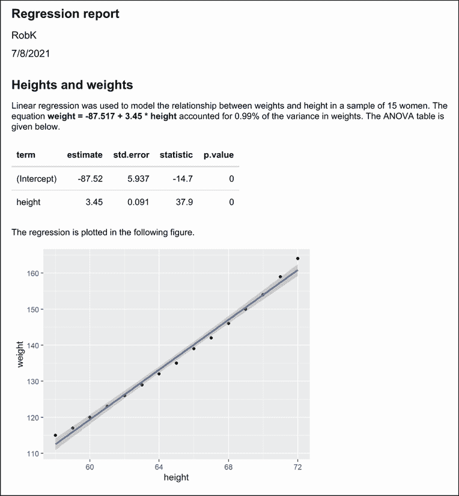
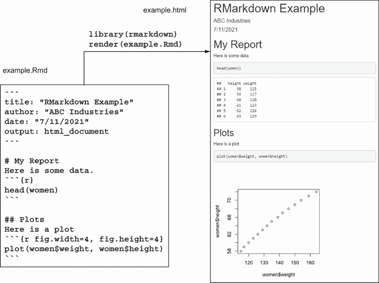
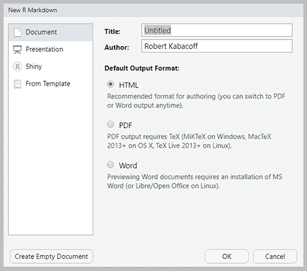
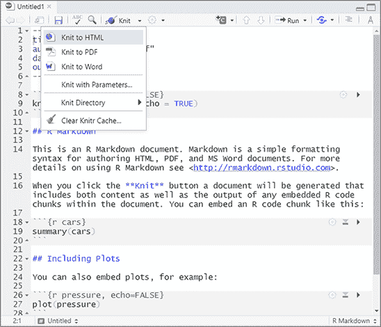
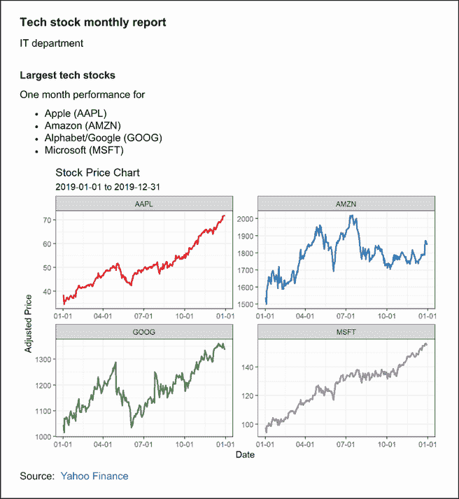

# 21 创建动态报告

本章涵盖

+   将结果发布到网络上

+   将 R 结果整合到 Microsoft Word 或 Open Document 报告中

+   创建动态报告，其中更改数据会更改报告

+   使用 R、Markdown 和 LaTeX 创建可发布的文档

+   避免常见的 R Markdown 错误

在前面的章节中，您已经访问了数据，清理了数据，描述了其特征，建立了模型，并可视化了结果。下一步是

1.  放松一下，也许可以去迪士尼世界。

1.  将结果传达给他人。

如果您选择了 1，请带上我。如果您选择了 2，欢迎来到现实世界。

研究并不随着最后的数据分析或图表的完成而结束。您几乎总是需要将结果传达给他人。这意味着将分析整合到某种类型的报告中。

有三种常见的报告场景。在第一种情况下，您创建的报告包括您的代码和结果，这样您就可以记住六个月前做了什么。从单一的综合文档中重建所做的工作比从一系列相关文件中更容易。

在第二种情况下，您必须为教师、主管、客户、政府机构、互联网受众或期刊编辑生成报告。清晰度和吸引力很重要，而且报告可能只需要创建一次。

在第三种情况下，您需要定期生成特定类型的报告。这可能是一份关于产品或资源使用的月度报告，一份周度财务分析，或者每小时更新的网站流量报告。在任何情况下，数据都会变化，但分析和报告的结构保持不变。

将 R 输出整合到报告中的方法之一是运行分析，将每个图表和文本表格剪切并粘贴到文字处理文档中，并重新格式化结果。这种方法通常耗时、效率低下且令人沮丧。尽管 R 创建了最先进的图形，但其文本输出却非常落后——使用空格对齐列的单倍间距文本表。重新格式化它们并非易事。而且如果数据发生变化，您将不得不再次完成整个流程！

考虑到这些限制，您可能会觉得 R 对您不起作用。别担心。（好吧，有点担心——这是一种重要的生存机制。）R 提供了一种优雅的解决方案，使用一种名为 *R Markdown* 的标记语言将 R 代码和结果整合到报告中（[`rmarkdown.rstudio.com`](https://rmarkdown.rstudio.com)）。此外，数据可以与报告绑定，以便更改数据会更改报告。这些动态报告可以保存为

+   网页

+   Microsoft Word 文档

+   Open Document 文件

+   Beamer、HTML5 和 PowerPoint 幻灯片

+   可发布的 PDF 或 PostScript 文档

例如，假设你正在使用回归分析来研究一组女性体重和身高的关系。R Markdown 允许你获取由`lm()`函数生成的等宽输出：

```
> lm(weight ~ height, data=women)

Call:
lm(formula = weight ~ height, data = women)

Residuals:
    Min      1Q  Median      3Q     Max 
-1.7333 -1.1333 -0.3833  0.7417  3.1167 

Coefficients:
             Estimate Std. Error t value Pr(>|t|)    
(Intercept) -87.51667    5.93694  -14.74 1.71e-09 ***
height        3.45000    0.09114   37.85 1.09e-14 ***
---
Signif. codes:  0 '***' 0.001 '**' 0.01 '*' 0.05 '.' 0.1 ' ' 1
Residual standard error: 1.525 on 13 degrees of freedom
Multiple R-squared:  0.991,     Adjusted R-squared:  0.9903 
F-statistic:  1433 on 1 and 13 DF,  p-value: 1.091e-14
```

并将其转换为如图 21.1 所示的网页。在本章中，你将学习如何做到这一点。



图 21.1 回归分析保存到网页

动态文档和可重复研究

学术界内部正在兴起一股支持*可重复研究*的强大运动。可重复研究的目的是通过包括必要的数据和软件代码来促进科学发现的复制，这些代码用于在报告它们的出版物中重现发现。这允许读者自己验证发现，并为他们自己提供在自身工作中更直接地建立结果的机会。本章描述的技术，包括将数据和源代码嵌入文档中，直接支持这一努力。

## 21.1 报告的模板方法

本章采用模板方法来生成报告。报告从一个包含报告文本、格式化语法和 R 代码块的模板文件开始。

模板文件被处理，R 代码被执行，应用了格式化语法，并生成了一份报告。不同的选项控制了 R 输出在报告中的包含方式。图 21.2 展示了使用 R Markdown 模板创建网页的一个简单示例。



图 21.2 从包含 Markdown 语法、报告文本和 R 代码块的文本文件创建网页

模板文件（example.Rmd）是一个包含四个组件的纯文本文件：

+   *元数据*—元数据（称为 YAML 标题）由一对三个短横线（---）括起来，包含有关文档和所需输出的信息。

+   *报告文本*—任何解释性短语和文本。在这里，报告文本是“我的报告”、“这里有一些数据”、“图表”和“这里有一个图表”。

+   *格式化语法*—控制报告格式的标签。在这个文件中，Markdown 标签用于格式化结果。Markdown 是一种简单的标记语言，可以用来将纯文本文件转换为结构有效的 HTML 或 XHTML。第一行中的井号`#`不是一个注释。它产生一个一级标题。`##`产生一个二级标题，以此类推。

+   *R 代码*—要执行的 R 语句。在 R Markdown 文档中，R 代码块被```` ```{r} ````和```` ``` ````包围。第一个代码块列出数据集的前六行，第二个代码块生成一个散点图。在这个例子中，代码和结果都输出到报告中，但选项允许你控制每个代码块打印的内容。

模板文件被传递到`rmarkdown`包中的`render()`函数，并创建了一个名为 example.html 的网页。该网页包含报告文本和 R 结果。

本章的示例基于描述性统计、回归和方差分析问题。它们都不代表数据的完整分析。本章的目标是学习如何将 R 结果纳入各种类型的报告中。

根据您开始时使用的模板文件以及用于处理它的函数，可以创建不同的报告格式（HTML 网页、Microsoft Word 文档、OpenOffice Writer 文档、PDF 报告、文章、幻灯片和书籍）。报告是动态的，这意味着更改数据和重新处理模板文件将产生一个新的报告。

## 21.2 使用 R 和 R Markdown 创建报告

在本节中，您将使用 `rmarkdown` 包来创建由 Markdown 语法和 R 代码生成的文档。当文档被处理时，R 代码将被执行，输出将被格式化并嵌入到最终的文档中。您可以使用这种方法生成各种格式的报告。以下是步骤：

1.  安装 `rmarkdown` 包 (`install.packages("rmarkdown")`)。这将安装包括 `knitr` 在内的几个其他包。如果您使用的是 RStudio 的最新版本，您可以跳过此步骤，因为您已经拥有了必要的包。

1.  安装 Pandoc ([`johnmacfarlane.net/pandoc/`](http://johnmacfarlane.net/pandoc/))，这是一个免费的应用程序，适用于 Windows、macOS 和 Linux。它可以将文件从一种标记格式转换为另一种格式。再次提醒，RStudio 用户可以跳过此步骤。

1.  如果您想创建 PDF 文档，请安装 LaTeX 编译器，它可以将 LaTeX 文档转换为高质量的排版 PDF 文档。完整的安装包括 Windows 的 MiKTeX ([www.miktex.org](http://www.miktex.org))、Mac 的 MacTeX ([`tug.org/mactex`](http://tug.org/mactex)) 和 Linux 的 TeX Live ([www.tug.org/texlive](http://www.tug.org/texlive))。我推荐一个轻量级的跨平台安装，称为 TinyTex ([`yihui.org/tinytex`](http://yihui.org/tinytex))。要安装它，请运行

    `install.packages("tinytex")`

    `tinytex::install_tinytex()`

1.  虽然这不是强制性的，但安装 `broom` 包 (`install.packages("broom")`) 是一个好主意。该包中的 `tidy()` 函数可以将超过 135 个 R 统计函数的结果导出到数据框中，以便包含在报告中。查看 `methods(tidy)` 以查看它可以输出的对象的综合列表。

1.  最后，安装 `kableExtra` (`install.packages("kableExtra")`)。`knitr` 包中的 `kable` 函数可以将矩阵或数据框转换为 LaTeX 或 HTML 表格，以便包含在报告中。`kableExtra` 包包括用于样式化表格输出的函数。

软件设置完成后，您就可以开始了。

要使用 Markdown 语法在文档中包含 R 输出（值、表格、图形），首先创建一个包含

+   YAML 标头

+   报告文本

+   Markdown 语法

+   R 代码块（由分隔符包围的 R 代码）

文本文件应具有 .Rmd 扩展名。

列表 22.1 展示了一个示例文件（命名为 women.Rmd）。要生成 HTML 文档，使用以下命令处理此文件

```
library(rmarkdown)
render("women.Rmd")
```

或点击 RStudio Knit 按钮。图 21.1 显示了结果。

列表 21.1 women.Rmd：一个嵌入 R 代码的 R Markdown 模板

```
---                                                              ❶
title: "Regression Report"                                       ❶
author: "RobK"                                                   ❶
date: "7/8/2021"                                                 ❶
output: html_document                                            ❶
---                                                              ❶

# Heights and weights                                            ❷

```{r echo = FALSE}                                              ❸

options(digits=3)                                                ❸

n    <- nrow(women)                                              ❸

fit  <- lm(weight ~ height, data=women)                          ❸

sfit <- summary(fit)                                             ❸

b    <- coefficients(fit)                                        ❸

```                                                              ❸

Linear regression was used to model the relationship between 
weights and height in a sample of `r n` women. The equation      ❹
**weight = `r b[1]` +  `r b[2]` * height**                       ❹
accounted for `r round(sfit$r.squared,2)`% of the variance       ❹
in weights. The ANOVA table is given below.

```{r echo=FALSE}                                                ❺

library(broom)                                                   ❺

library(knitr)                                                   ❺

library(kableExtra)                                              ❺

results <- tidy(fit)                                             ❺

tbl <- kable(results)                                            ❺

kable_styling(tbl, "striped", full_width=FALSE, position="left") ❺

```                                                              ❺

The regression is plotted in the following figure.

```{r fig.width=5, fig.height=4}

library(ggplot2)

ggplot(data=women, aes(x=height, y=weight)) +

    geom_point() + geom_smooth(method="lm", formula=y~x)

```
```

❶ YAML 标题

❷ 二级标题

❸ R 代码块

❹ R 内联代码

❺ 格式化结果表格

报告以 YAML 标题 ❶ 开始，指示标题、作者、日期和输出格式。日期是硬编码的。要动态插入当前日期，将 `"7/8/2021"` 替换为 ``"`r Sys.Date()`"``（包括双引号）。在 YAML 标题中，只需要输出字段。表 21.1 列出了最常见的输出选项。完整的列表可在 RStudio ([`rmarkdown.rstudio.com/lesson-9.html`](https://rmarkdown.rstudio.com/lesson-9.html)) 中找到。

表 21.1 R Markdown 文档输出选项

| 输出选项 | 描述 |
| --- | --- |
| `html_document` | HTML 文档 |
| `pdf_document` | PDF 文档 |
| `word_document` | Microsoft Word 文档 |
| `odt_document` | Open Document Text 文档 |
| `rtf_document` | 富文本文档 |

接下来是第一级标题 ❷。它指示“身高和体重”应以大号粗体字打印。表 21.2 展示了其他 Markdown 语法的示例。

表 21.2 Markdown 代码及其生成的输出

| Markdown 语法 | 生成的 HTML 输出 |
| --- | --- |
| `# Heading 1``## Heading 2``...``###### Heading 6` | `<h1>Heading 1</h1>``<h2>Heading 2</h2>``...``<h6>Heading 6</h6>` |
| 文本之间有一或多个空白行 | 将文本分隔成段落 |
| 行尾有两个或多个空格 | 添加换行符 |
| `*I mean it*` | `<em>I mean it</em>` |
| `**I really mean it**` | `<strong>I really mean it</strong>` |
| `* item 1``* item 2` | `<ul>``<li> item 1 </li>``<li> item 2 </li>``</ul>` |
| `1\. item 1``2\. item 2` | `<ol>``<li> item 1 </li>``<li> item 2 </li>``</ol>` |
| `[Google](http://google.com)` | `<a href="http://google.com">Google</a>` |
| `` | `` |
| `\newpage` | 分页符——开始新的一页。（这是`rmarkdown`识别的 LaTeX 命令。） |

接下来是一个 R 代码块❸。Markdown 文档中的 R 代码由```` ```{r options} ````和```` ``` ````分隔。当文件被处理时，R 代码将被执行，并将结果插入。`echo=FALSE`选项将代码从输出中省略。表 21.3 列出了代码块选项。

表 21.3 代码块选项

| 选项 | 描述 |
| --- | --- |
| `echo` | 是否在输出中包含 R 源代码 `(TRUE)` 或不包含 `(FALSE)` |
| `results` | 是否输出原始结果 `(asis)` 或隐藏结果 `(hide)` |
| `warning` | 是否在输出中包含警告 `(TRUE)` 或不包含 `(FALSE)` |
| `message` | 是否在输出中包含信息性消息 `(TRUE)` 或不包含 `(FALSE)` |
| `error` | 是否在输出中包含错误消息 `(TRUE)` 或不包含 `(FALSE)` |
| `cache` | 保存结果，并且只有当代码发生变化时才重新运行代码块 |
| `fig.width` | 图形的宽度（英寸） |
| `fig.height` | 图形的宽度（英寸） |

简单的 R 输出（数字或字符串）也可以直接放置在报告文本中。内联 R 代码允许您自定义单个句子中的文本。内联代码放置在`` `r ``和`` ` ``标签之间。在回归示例中，样本大小、预测方程和 R 平方值嵌入在第一段❹中。

下一个 R 代码块创建了一个格式良好的 ANOVA 表❺。`tidy()`函数来自`broom`包，将回归结果导出为数据框（tibble）。`kable()`函数来自`knitr`包，将此数据框转换为 HTML 代码，`kable_styling()`函数来自`kableExtra`包，设置表格宽度和对齐方式，并添加颜色条纹。有关其他格式选项，请参阅`help(kable_ styling)`。

`kable()`和`kable_styling()`函数简单易用。R 中有几个包可以创建更复杂的表格并提供更多的样式选项。这些包括`xtable`、`expss`、`gt`、`huxtable`、`flextable`、`pixiedust`和`stargaze`r。每个包都有其优缺点（请参阅[`mng.bz/aKy9`](http://mng.bz/aKy9)和[`mng.bz/gxO8`](http://mng.bz/gxO8)以获取讨论）。使用最适合您需求的包。

R Markdown 文件的最后一部分打印出结果的`ggplot2`图形。图形大小设置为 5 英寸宽和 4 英寸高。默认为 7 英寸宽和 5 英寸高。

使用 RStudio 创建和处理 R Markdown 文档

RStudio 使得从 Markdown 文档中渲染报告变得特别容易。

如果你从 GUI 菜单中选择文件 > 新建文件 > R Markdown，你会看到下面的对话框。



在 RStudio 中创建新 R Markdown 文档的对话框

选择您想要生成的报告类型，RStudio 将为您创建一个骨架文件。使用您的文本和代码编辑它，然后从 Knit 下拉列表中选择渲染选项。就是这样！



从 R Markdown 文档生成 HTML、PDF 或 Word 报告的下拉菜单

Markdown 语法便于快速创建简单的文档。要了解更多关于 Markdown 的信息，请选择 HELP > Markdown 快速参考，或访问 Pandoc Markdown 参考页面 ([`mng.bz/0r8E`](http://mng.bz/0r8E))。

如果您想创建复杂的文档，如出版物质量的文章和书籍，那么您可能需要考虑使用 LaTeX 作为您的标记语言。在下一节中，您将使用 LaTeX 和 `knitr` 包来创建高质量的排版文档。

## 21.3 使用 R 和 LaTeX 创建报告

LaTeX 是一个用于高质量排版的文档准备系统，它对 Windows、macOS 和 Linux 平台免费提供。LaTeX 允许您创建美观、复杂的多部分文档，并且只需更改几行代码，就可以将一种类型的文档（如文章）转换为另一种类型的文档（如报告）。这是一款功能极其强大的软件，因此具有相当大的学习曲线。

如果您不熟悉 LaTeX，您可能想在继续之前阅读 Tobias Oetiker、Hubert Partl、Irene Hyna 和 Elisabeth Schlegl 所著的《LaTeX 2e 不那么简短的介绍》([`tobi.oetiker.ch/lshort/lshort.pdf`](https://tobi.oetiker.ch/lshort/lshort.pdf)) 或印度 TEX 用户组的《LaTeX 教程：入门》([`mng.bz/2c0O`](http://mng.bz/2c0O))。这门语言绝对值得学习，但要掌握它需要一些时间和耐心。一旦您熟悉了 LaTeX，创建动态报告就是一个简单的过程。

`knitr` 包允许您使用与之前创建网页类似的技术在 LaTeX 文档中嵌入 R 代码。如果您已安装 `rmarkdown` 或使用 RStudio，您已经拥有 `knitr`。如果没有，现在安装它（`install.packages("knitr")`）。此外，您还需要一个 LaTeX 编译器；有关详细信息，请参阅第 21.2 节。

在本节中，您将创建一个报告，描述患者对各种药物的反应，使用 `multcomp` 包中的数据。如果您在第九章中没有安装它，请确保在继续之前运行 `install.packages("multcomp")`。

要使用 R 和 LaTeX 生成报告，您首先创建一个扩展名为 .Rnw 的文本文件，其中包含报告文本、LaTeX 标记代码和 R 代码块。列表 21.2 提供了一个示例。每个 R 代码块以分隔符 `<<options>>=` 开始，以分隔符 `@` 结束。表 21.3 列出了代码块选项。使用 `\Sexpr{R code}` 语法包含内联 R 代码。当 R 代码被评估时，数字或字符串将被插入到文本中的该位置。

然后文件将由 `knit2pdf()` 函数进行处理：

```
library(knitr)
knit2pdf("drugs.Rnw") 
```

或者通过在 RStudio 中按编译 PDF 按钮。在此步骤中，R 代码块被处理，并且根据选项，用 LaTeX 格式的 R 代码和输出替换。默认情况下，`knit("drugs.Rnw")` 输入文件 drugs.Rnw 并输出文件 drugs.tex。然后，.tex 文件通过 LaTeX 编译器运行，创建一个 PDF 文件。图 21.3 显示了生成的 PDF 文档。

列表 21.2 drugs.Rnw：一个嵌入 R 代码的 LaTeX 模板

```
\documentclass[11pt]{article}
\title{Sample Report}
\author{Robert I. Kabacoff, Ph.D.}
\usepackage{float}
\usepackage[top=.5in, bottom=.5in, left=1in, right=1in]{geometry}
\begin{document}
\maketitle
<<echo=FALSE, results='hide', message=FALSE>>=
library(multcomp)
library(dplyr)
library(xtable)
library(ggplot2)
df <- cholesterol
@

\section{Results}

Cholesterol reduction was assessed in a study 
that randomized \Sexpr{nrow(df)} patients 
to one of \Sexpr{length(unique(df$trt))} treatments. 
Summary statistics are provided in 
Table \ref{table:descriptives}.

<<echo=FALSE, results='asis'>>=
descTable <- df %>%
  group_by(trt) %>%
  summarize(N = n(),
            Mean = mean(response, na.rm=TRUE),
            SD = sd(response, na.rm=TRUE)) %>%
  rename(Treatment = trt)
print(xtable(descTable, caption = "Descriptive statistics 
for each treatment group", label = "table:descriptives"), 
caption.placement = "top", include.rownames = FALSE)
@

The analysis of variance is provided in Table \ref{table:anova}.

<<echo=FALSE, results='asis'>>=
fit <- aov(response ~ trt, data=df)
print(xtable(fit, caption = "Analysis of variance",
             label = "table:anova"), caption.placement = "top")
@

\noindent and group distributions are plotted in Figure \ref{figure:tukey}.

\begin{figure}[H]\label{figure:tukey}
\begin{center}

<<echo=FALSE, fig.width=4, fig.height=3>>=
  ggplot(df, aes(x=trt, y=response )) +
    geom_boxplot() +
    labs(y = "Response", x="Treatment") +
    theme_bw()
@

\caption{Distribution of response times by treatment.}
\end{center}
\end{figure}
\end{document}
```

`knitr` 包在 [`yihui.name/knitr`](http://yihui.name/knitr) 和 Yihui Xie 的书籍 *使用 R 和 knitr 创建动态文档*（Chapman & Hall，2013）中有文档说明。要了解更多关于 LaTeX 的信息，请查看前面提到的教程并访问 [www.latex-project.org](https://www.latex-project.org/)。

### 21.3.1 创建参数化报告

您可以在运行时向报告传递参数，这样您就可以自定义输出，而无需更改 R Markdown 模板。参数在带有 `params` 关键字的 YAML 标题中的部分定义。您使用 `$` 符号在代码的主体中访问参数值。


图 21.3 文件 drugs.Rnw 通过 `knit2pdf()` 函数处理，生成排版的 PDF 文档（drugs.pdf）。

考虑以下列表中的参数化报告。此 R Markdown 文档从雅虎财经 ([`finance.yahoo.com/`](https://finance.yahoo.com/)) 下载四家大型科技股（苹果、亚马逊、谷歌和微软）的股票价格，并使用 `ggplot2` 进行绘图（见图 21.4）。



图 21.4 从列表 21.3 中的参数化 R Markdown 文件生成的动态报告

默认情况下，代码报告了从文件编织时间起过去 30 天的股票表现。报告使用 `tidyquant` 包获取股票价格，因此在编织文档之前安装它 (`install.packages("tidyquant")`)。

列表 21.3 带参数的 R Markdown 报告（techstocks.Rmd）

```
---
title: "Tech Stock Monthly Report"
author: "IT Department"
output: html_document
params:                                      ❶
  enddate: !r Sys.Date()                     ❶
  startdate: !r Sys.Date() - 30              ❶

---
## Largest tech stocks

One month performance for

- Apple (AAPL)  
- Amazon (AMZN)  
- Alphabet/Google (GOOG)  
- Microsoft (MSFT)

```{r, echo=FALSE, message=FALSE}

library(tidyquant)

library(ggplot2)

tickers = c("AAPL", "MSFT", "AMZN", "GOOG")

prices <- tq_get(tickers,                    ❷

                from = params$startdate,    ❷

                to = params$enddate,        ❷

                get = "stock.prices")       ❷

ggplot(prices, aes(x=date, y=adjusted, color=symbol)) +

geom_line(size=1) + facet_wrap(~symbol, scale="free") +

theme_bw() +

theme(legend.position="none") +

scale_x_date(date_labels="%m-%d") +

scale_color_brewer(palette="Set1") +

labs(title="股票价格图表",

    subtitle = paste(params$startdate, "至", params$enddate),

    x = "日期",

    y="调整价格")

```
Source: [Yahoo Finance](https://finance.yahoo.com/)
```

❶ 定义参数值

❷ 使用参数值获取股票报价

参数 `enddate` 和 `startdate` 在 YAML 标题中定义 ❶。您可以硬编码这些值，或者使用 `!r` 包含评估为所需值的 R 代码。在此，`enddate` 设置为当前日期，`startdate` 设置为 30 天前。

当代码运行时，`tidyquant` 包中的 `tq_get()` 函数会下载由 `params$startdate` 和 `params$enddate` 定义的日期范围内的每日股票价格（符号、日期、开盘价、最高价、最低价、收盘价、成交量、调整后价格）❷。然后使用 `ggplot2` 进行绘图。

你可以通过向 `render` 函数提供一个值列表来在运行时覆盖参数值。例如，

```
render("techstocks.Rmd", params=list(startdate="2021-01-01",
                                     enddate="2019-01-31"))
```

将绘制 2019 年 1 月的每日股票表现。或者，如果你运行 `render("techstocks.Rmd",` `params="ask")`(或者在 RStudio 中点击 Knit > Knit with parameters...)，你将被提示输入 `startdate` 和 `enddate` 的值。你提供的值将覆盖默认值。包括参数值给你的报告增加了额外的交互性。要了解更多信息，请参阅 Yihui Xie、J.J Allaire 和 Garret Grolemund 的书籍 *R Markdown: The Definitive Guide*（Chapman & Hall，2019）的第 15.3 节。在线版本可在 [`bookdown.org/yihui/rmarkdown/`](https://bookdown.org/yihui/rmarkdown/) 找到。

## 21.4 避免常见的 R Markdown 问题

R Markdown 是在 R 中创建动态和吸引人的报告的强大工具。但有一些简单的常见错误需要避免（见表 21.4）。

表 21.4 修正常见的 R Markdown 错误

| 规则 | 正确 | 错误 |
| --- | --- | --- |
| YAML 标题中的缩进很重要。只有缩进子字段。 | `---``title: "Tech Stock Monthly Report"``author: "IT Department"``output: html_document``params:``enddate: 2019-01-31``startdate: 2019-01-01``---` | `---``title: "Tech Stock Monthly Report"``author: "IT Department"``output: html_document``params:``enddate: 2019-01-31``startdate: 2019-01-01``---` |
| 在标题标记后放置一个空格。 | # 这是一个一级标题。 | #This is a level one heading. |
| 列表应该由空行开头和结尾，并且星号标记后应该有一个空格。可选地，R 代码块可以标记，但每个标记必须是唯一的。 | `Here is a list`* `item one`* `item two````` ```{r anova1} ````R code```` ``` ```````` ```{r anova2} ````R code```` ``` ```` | `Here is a list`*`item one`*`item two````` ```{r anova} ````R code```` ``` ```````` ```{r anova} ````R code```` ``` ```` |
| 你不能在 R 代码块中安装包。 | 在 R Markdown 文档外部安装 `ggplot2`。然后使用```` ```r{} `````library(ggplot2)````` ``` ```` | ```` ```r{} `````install.packages(ggplot2)``library(ggplot2)````` ``` ```` |

在渲染 R Markdown 文档时发生的错误可能比简单 R 代码中的错误更难调试。如果你确保每个 R 代码块独立运行，并且你小心避免上述列出的错误，事情应该会进行得更顺利。

在继续之前，还有另一个话题要提一下。这更多的是关于低效而不是真正的错误。假设你创建了一个 R Markdown 文档，其中包含介绍性文本和一个执行耗时分析的 R 代码块。如果你编辑文本并重新编译文档，即使结果没有变化，你也会重新运行 R 代码。

为了避免这种情况，你可以缓存 R 代码块的结果。添加 R 代码块的 `option` `cache` `=` `TRUE` 将结果保存到文件夹中，并且只有在 R 代码本身发生变化时，代码才会在未来重新运行。如果代码没有变化，将插入保存的结果。请注意这里——缓存不会捕捉到基础数据的变化，只会捕捉到代码本身的变化。如果你更改了数据但未更改数据文件名，代码将不会重新运行。在这种情况下，你可以添加代码块的选项 `cache.extra` `=` `file.mtime(``mydatafile``)`，其中 `mydatafile` 是数据集的路径。如果数据文件的时间戳已更改，代码块将重新运行。

## 21.5 进一步探索

在本章中，你已经看到了几种将 R 结果纳入报告的方法。报告是动态的，因为更改数据和重新处理代码会导致报告更新。此外，可以通过传递参数来修改报告。你学习了创建网页、排版文档、Open Document Format 报告和 Microsoft Word 文档的方法。

本章中描述的模板方法有几个优点。通过将执行统计分析所需的代码直接嵌入到报告模板中，你可以确切地看到结果是如何计算的。六个月之后，你可以轻松地看到当时做了什么。你还可以修改统计分析或添加新数据，并立即以最小的努力重新生成报告。此外，你避免了剪切和粘贴以及重新格式化结果的需要。这本身就是值得的。

本章中提到的模板在意义上是静态的，即它们的结构是固定的。尽管这里没有涉及，你也可以使用这些方法来创建各种专家报告系统。例如，R 代码块的结果可以依赖于提交的数据。如果提交了数值变量，可以生成散点图矩阵。或者，如果提交了分类变量，可以生成马赛克图。以类似的方式，生成的解释性文本可以依赖于分析的结果。使用 R 的 `if/then` 构造和文本编辑函数，如 `grep` 和 `substr`，可以创造出无穷无尽的可定制性。基本上，你将模板写入临时位置，并在编织之前通过代码进行编辑。你可以使用这种方法创建一个复杂的专家系统。

要了解更多关于 R Markdown 的信息，请参阅 Yihui Xie、Christophe Dervieux 和 Emily Riederer 编著的 *R Markdown 烹饪书* ([`bookdown.org/yihui/rmarkdown-cookbook/`](https://bookdown.org/yihui/rmarkdown-cookbook/))，Yihui Xie、J.J Allaire 和 Garret Grolemund 编著的 *R Markdown: The Definitive Guide* ([`bookdown.org/yihui/rmarkdown/`](https://bookdown.org/yihui/rmarkdown/))，以及 RStudio 的 *R Markdown* 网站 ([`rmarkdown.rstudio.com/`](https://rmarkdown.rstudio.com/))。

## 摘要

+   R Markdown 可以用来创建结合文本、代码和输出的吸引人的报告。

+   报告可以输出为 HTML、Word、Open Document、RTF 和 PDF 格式。

+   R Markdown 文档可以进行参数化，允许你在运行时传递参数给代码，从而创建更动态的报告。

+   可以使用 LaTeX 标记语言来生成高度定制的复杂报告。学习曲线可能很陡峭。

+   R Markdown（以及 LaTeX）模板方法可以用来促进研究可重复性、支持文档编写并增强结果沟通。
