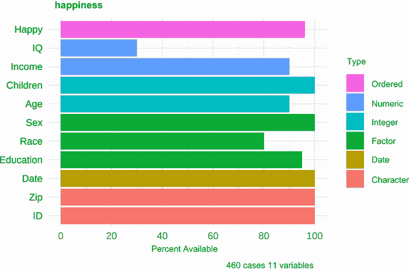
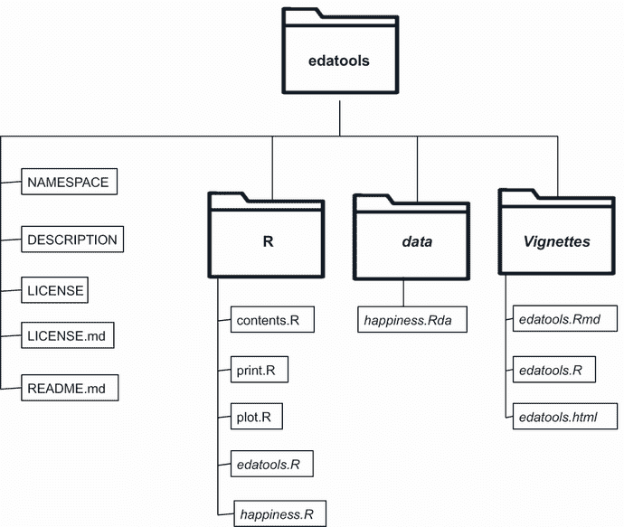
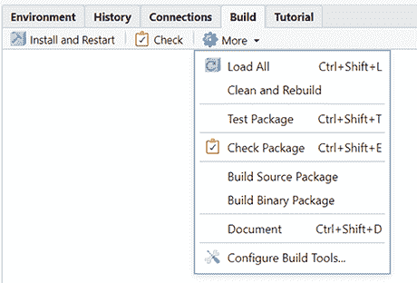
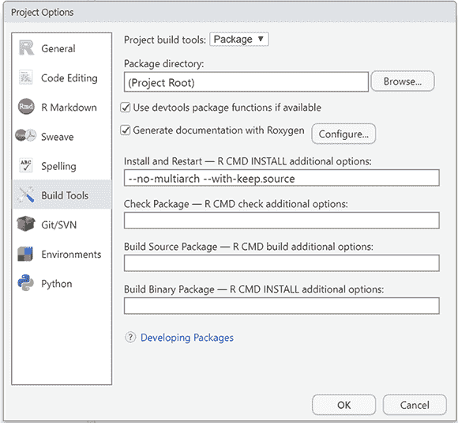
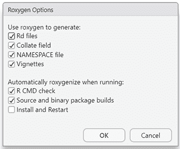
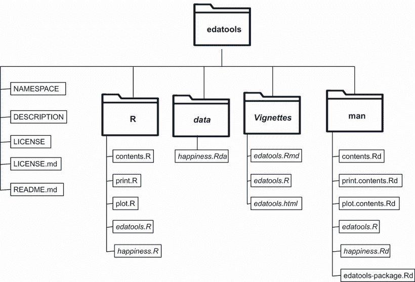
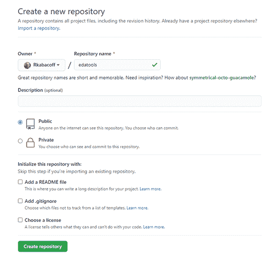
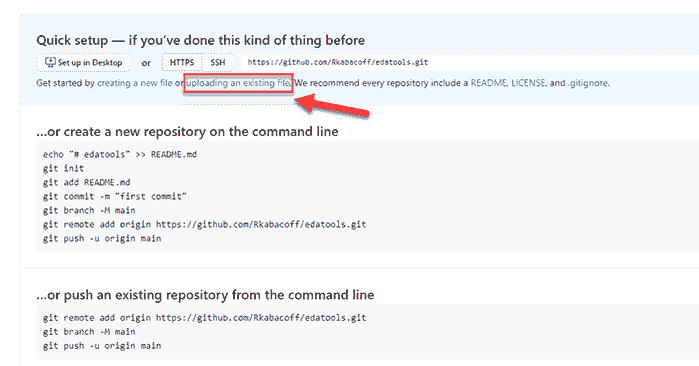
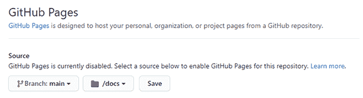

# 22 创建软件包

本章涵盖

+   创建软件包的函数

+   添加软件包文档

+   构建软件包并与他人共享

在前面的章节中，你通过使用其他人提供的函数来完成大多数任务。这些函数来自基础 R 安装中的软件包或从 CRAN 下载的贡献软件包。

安装一个新的软件包扩展了 R 的功能。例如，安装 `mice` 软件包为你提供了处理缺失数据的新方法。安装 `ggplot2` 软件包为你提供了数据可视化的新方法。R 中许多最强大的功能都来自贡献软件包。

从技术上来说，一个软件包只是一个由函数、文档和数据以标准化格式保存的集合。软件包允许你以定义良好且完全文档化的方式组织你的函数，并便于与他人共享你的程序。

你可能想要创建软件包的几个原因：

+   使一组常用函数易于访问，并提供如何使用它们的文档。

+   创建一组示例和数据集，可以分发给课堂上的学生。

+   创建一个程序（一组相互关联的函数），可以用来解决一个重要的分析问题（例如，填补缺失值）。

+   通过组织研究数据、分析代码和文档到一个便携和标准化的格式来促进研究可重复性。

创建一个有用的软件包也是向他人介绍自己并回馈 R 社区的好方法。软件包可以直接共享或通过在线仓库如 CRAN 和 GitHub 进行共享。

在本章中，你将有机会从头到尾开发一个软件包。到本章结束时，你将能够构建自己的 R 软件包（并享受这种成就带来的自豪感和炫耀的权利）。

你将要开发的软件包名为 `edatools`。它提供了描述数据框内容的函数。这些函数故意设计得简单，这样你就可以专注于创建软件包的过程，而不会陷入代码细节。在第 22.1 节中，你将对 `edatools` 软件包进行测试。然后在第 22.2 节中，你将从零开始构建软件包的副本。

## 22.1 edatools 软件包

*探索性数据分析（EDA**）* 是一种通过描述数据的特征来理解数据的方法，这些特征通过统计摘要和可视化来展示。`edatools` 软件包是名为 `qacBase` 的综合 EDA 软件包的一个小子集（*[`rkabacoff.github.io/qacBase`](http://rkabacoff.github.io/qacBase)*）。

`edatools` 包包含描述和可视化数据框内容的函数。该包还包含一个名为 `happiness` 的数据集，其中包含 460 位个人对关于生活满意度的调查的回应。调查描述了个人对陈述“我大多数时间都很快乐”的同意程度评级，以及如收入、教育、性别、种族和子女数量等人口统计变量。评级采用从 *强烈不同意* 到 *强烈同意* 的 6 点量表。数据是虚构的，包含在内以使用户能够在一个包含多种类型变量和每个变量不同缺失数据级别的数据框中进行实验。

您可以使用以下代码安装 `edatools` 包：

```
if(!require(remotes)) install.packages("remotes")
remotes::install_github("rkabacoff/edatools")
```

这将从 `GitHub` 下载包并将其安装到您的默认 R 库中。

`edatools` 包有一个主要函数 `contents()`，用于收集有关数据框的信息，以及 `print()` 和 `plot()` 函数用于显示结果。以下列表展示了这些函数，图 22.1 提供了相应的图表。

列表 22.1 使用 `edatools` 包描述数据框

```
> library(edatools)
> help(contents)
> df_info <- contents(happiness)
> df_info

Data frame: happiness 
460 observations and 11 variables
size: 0.1 Mb 
 pos   varname      type n_unique n_miss pct_miss
   1       ID* character      460      0    0.000
   2      Date      Date       12      0    0.000
   3       Sex    factor        2      0    0.000
   4      Race    factor        8     92    0.200
   5       Age   integer       73     46    0.100
   6 Education    factor       13     23    0.050
   7    Income   numeric      415     46    0.100
   8        IQ   numeric       45    322    0.700
   9       Zip character       10      0    0.000
  10  Children   integer       11      0    0.000
  11     Happy   ordered        6     18    0.039

> plot(df_info)
```



图 22.1 描述 `happiness` 数据框内容的图表。有 11 个变量，`IQ` 变量的 70%数据缺失，`Race` 变量的 20%数据缺失。数据框包含 6 种不同的数据类型（有序因子、数值、整数等）。

打印输出列出了变量的数量和观测值数量以及数据框的大小（以兆字节为单位）。显示每个变量在数据框中的位置、名称、类型、唯一值的数量以及缺失值的数量和百分比。可以作为唯一标识符的变量（每行都有一个唯一值）被标记。图表按类型排列并按颜色编码变量，条形图的长度表示可用于分析的案例百分比。

从表格和图表中，您可以看到数据框有 11 个变量和 460 个观测值。它占用 0.1 兆字节的 RAM。`ID` 是一个唯一标识符，数据中有 10 个邮政编码，`IQ` 数据的 70%缺失。正如预期的那样，幸福评级（`happy`）是一个有序因子，有六个水平。您还能看到什么？

下一节描述了构建 R 包的一般步骤。在接下来的几节中，您将按顺序逐步构建 `edatools` 包。

## 22.2 创建包

创建 R 包曾经是一项艰巨的任务，仅限于一小部分经过高度训练的 R 专业人士（包括秘密握手）。随着用户友好型开发工具的出现，这个过程变得更加直接。然而，它仍然是一个详细的多步骤过程。步骤如下

1.  安装开发工具。

1.  创建一个包项目。

1.  添加函数。

1.  添加函数文档。

1.  添加一个一般帮助文件。

1.  添加样本数据和样本数据文档。

1.  添加一个示例文档。

1.  编辑 DESCRIPTION 文件。

1.  构建并安装包。

步骤 5-7 是可选的，但良好的开发实践。以下各节将依次介绍每个步骤。你也可以从 http://rkabacoff.com/RiA/edatools.zip 下载成品，以节省一些输入时间。

### 22.2.1 安装开发工具

在本章中，我假设你在构建包时使用的是 RStudio。此外，还有一些你想要安装的支持包。首先，使用以下命令安装`devtools`、`usethis`和`roxygen2`包：`install.packages(c("devtools", "usethis", "roxygen2"), depend=TRUE)`。`devtools`和`usethis`包包含简化并自动化包开发的函数。`roxygen2`包简化了包文档的创建。

剩余的软件是特定情况的：

+   包文档通常是 HTML 格式。如果你想以 PDF 格式创建文档（例如，手册和/或 vignettes），你需要安装 LaTeX，一个高质量的排版系统。有几种软件发行版可供选择。我推荐 TinyTex（[`yihui.org/tinytex/`](https://yihui.org/tinytex/)），这是一个轻量级、跨平台的发行版。你可以使用以下代码安装它：

    ```
    install.packages("tinytex")
    tinytex::install_tinytex()
    ```

+   `pkgdown`包将帮助你为你的包创建一个网站。这是第 22.3.4 节中描述的可选步骤。

+   最后，如果你在 Windows 平台上，并且打算构建包含 C、C++或 Fortran 代码的 R 包，你需要安装 Rtools.exe（[`cran.r-project.org/bin/windows/Rtools`](http://cran.r-project.org/bin/windows/Rtools)）。安装说明在下载页面提供。macOS 和 Linux 用户已经拥有了必要的工具。虽然我在第 22.4 节中简要描述了外部编译代码的使用，但我们在这本书中不会使用它。

### 22.2.2 创建包项目

一旦你有了必要的工具，下一步就是创建一个包项目。当你运行以下代码时

```
library(usethis)
create_package("edatools")
```

使用`create_project()`函数创建的 RStudio 项目具有图 22.2 所示的文件夹结构。你将自动进入该项目，当前工作目录设置为`edatools`文件夹。


图 22.2 `edatools`项目文件夹的内容，由`create_project()`函数创建

函数代码将放在 R 文件夹中。其他重要的文件是 DESCRIPTION 和 NAMESPACE 文件。我们将在后面的章节中讨论它们。`.gitignore`、`.Rbuildignore`和`edatools.Rproj`是支持文件，允许你自定义包创建过程的一些方面。你可以保持它们不变。

### 22.2.3 编写包函数

`edatools`包由三个函数组成：`contents()`、`print .contents()`和`plot.contents()`。第一个是主要函数，用于收集有关数据框的信息，其他的是用于打印和绘图结果的 S3 面向对象泛型函数（见第 20.4.1 节）。

函数代码文件放置在 22.2.2 节中创建的 R 文件夹中。将每个函数放置在单独的以.R 扩展名的文本文件中是个好主意。这并不是严格必要的，但它使得组织工作更加容易。此外，函数名称和文件名称不需要匹配，但再次强调，这是良好的编码实践。每个文件都有一个包含以字符`#`开头的注释集的头信息。R 解释器会忽略这些行，但你会使用`roxygen2`包将这些注释转换为你的包文档。这些头注释将在 22.2.4 节中讨论。

列表 22.2 至 22.4 提供了文件。

收集数据框信息

contents.R 文本文件中的`contents()`函数描述了一个数据框，并将结果保存到一个列表中。函数调用为`contents(data)`，其中`data`是工作环境中数据框的名称。

列表 22.2 contents.R 文件的内容

```
#' @title Description of a data frame
#' @description
#' \code{contents} provides describes the contents 
#' of a data frame.
#'
#' @param data a data frame.
#'
#' @importFrom utils object.size
#'
#' @return a list with 4 components:
#' \describe{
#' \item{dfname}{name of data frame}
#' \item{nrow}{number of rows}
#' \item{ncol}{number of columns}
#' \item{size}{size of the data frame in bytes}
#' \item{varinfo}{data frame of overall dataset characteristics}
#' }
#'
#' @details
#' For each variable in a data frame, \code{contents} describes
#' the position, type, number of unique values, number of missing
#' values, and percent of missing values.
#'
#' @seealso \link{print.contents}, \link{plot.contents}
#'
#' @export
#'
#' @examples
#' df_info <- contents(happiness)
#' df_info
#' plot(df_info)

contents <- function(data){

  if(!(is.data.frame(data))){                              ❶
    stop("You need to input a data frame")                 ❶
  }

  dataname <- deparse(substitute(data))                    ❷

  size <- object.size(data)                                ❸

  varnames <- colnames(data)                               ❹
  colnames <- c("pos", "variable", "type", "n_unique",     ❹
                "n_miss", "pct_miss")                      ❹
  pos = seq_along(data)                                    ❹
  varname <- colnames(data)                                ❹
  type = sapply(data, function(x)class(x)[1])              ❹
  n_unique = sapply(data, function(x)length(unique(x)))    ❹
  n_miss = sapply(data, function(x)sum(is.na(x)))          ❹
  pct_miss = n_miss/nrow(data)                             ❹
  varinfo <- data.frame(                                   ❹
    pos, varname, type, n_unique, n_miss, pct_miss         ❹
  )                                                        ❹

  results <- list(dfname=dataname, size=size,              ❺
                  nrow=nrow(data), ncol=ncol(data),        ❺
                  varinfo=varinfo)                         ❺
  class(results) <- c("contents", "list")                  ❺
  return(results)                                          ❺
}                                                          ❺
```

❶ 检查输入

❷ 保存数据框名称

❸ 获取数据框大小

❹ 收集变量信息

❺ 返回结果

当函数被调用时，它会检查输入是否为数据框。如果不是，将生成错误❶。接下来，将数据框的名称记录为文本❷，并将数据框的大小记录为字节❸。对于每个变量，记录并保存其位置、名称、类型、唯一值的数量以及缺失值的数量和百分比，并将这些信息保存到一个名为`varinfo`的数据框中❹。最后，将结果打包并作为列表返回❺。列表包含五个组件，这些组件在表 22.1 中进行了总结。此外，将列表的类设置为`c("contents", "list")`。这是创建用于处理结果的泛型函数的关键步骤。

表 22.1 `contents()`函数返回的列表对象

| 组件 | 描述 |
| --- | --- |
| `dfname` | 数据框的名称 |
| `size` | 数据框的大小 |
| `nrow` | 行数 |
| `ncol` | 列数 |
| `varinfo` | 包含变量信息的数据框（位置、名称、类型、唯一值的数量以及缺失值的数量和百分比） |

虽然列表提供了所需的所有信息，但你很少直接访问其组件。相反，你会创建通用的`print()`和`plot()`函数，以更简洁和更有意义的方式呈现这些信息。我们将在下一节中考虑这些通用函数。

打印和绘图函数

任何广度上的分析函数通常都带有通用的`print()`和`summary()`函数。`print()`提供了关于对象的基本或原始信息，而`summary()`提供了更详细或处理过的（总结的）信息。当在给定上下文中绘制图形有意义时，通常会包括`plot()`函数。你只需要这个包的`print`和`plot`函数。

根据第 20.4.1 节中描述的 S3 OOP 指南，如果一个对象具有类属性 `"foo"`，那么 `print(x)` 将执行 `print.foo(x)`（如果存在）或 `print .default(x)`。对于 `plot()` 也是如此。因为 `contents()` 函数返回一个类为 `"contents"` 的对象，你需要定义 `print .contents``()` 和 `plot.contents()` 函数。以下列表给出了 `print.contents()` 函数。

列表 22.3 print.R 文件的内容

```
#' @title Description of a data frame
#'
#' @description
#' \code{print.contents} prints a concise description of a data frame.
#'
#' @param x an object of class \code{contents}.
#' @param digits number of significant digits to use for percentages.
#' @param ... additional arguments passed to the print function.
#'
#' @return NULL
#' @method print contents
#' @export
#'
#' @examples
#' df_info <- contents(happiness)
#' print(df_info, digits=4)

print.contents <- function(x, digits=2, ...){

  if (!inherits(x, "contents"))                                 ❶
    stop("Object must be of class 'contents'")                  ❶

  cat("Data frame:", x$dfname, "\n")                            ❷
  cat(x$nrow, "observations and", x$ncol, "variables\n")
  x$varinfo$varname <- ifelse(x$varinfo$n_unique == x$nrow,     ❸
                              paste0(x$varinfo$varname, "*"),   ❸
                              x$varinfo$varname)
  cat("size:",  format(x$size, units="Mb"), "\n")               ❹
  print(x$varinfo, digits=digits, row.names=FALSE, ...)         ❺
}
```

❶ 检查输入

❷ 打印标题

❸ 识别唯一标识符

❹ 打印数据框大小

❺ 打印变量信息

首先，函数检查输入是否具有类"`contents`" ❶。接下来，打印出包含数据框名称、变量数量和观测数量的标题 ❷。如果某一列中的唯一值数量等于观测数量，则该变量唯一标识每个案例。这样的变量在其名称后带有星号 (*) ❸。接下来，打印出数据框的大小（以兆字节为单位） ❹。最后，打印出变量信息的表格 ❺。

最后一个函数 `plot``()`，通过水平 `ggplot2` 条形图可视化 `contents()` 函数返回的结果。以下列表显示了代码。

列表 22.4 plot.R 文件的内容

```
#' @title Visualize a data frame
#'
#' @description
#' \code{plot.contents} visualizes the variables in a data frame.
#'
#' @details
#' For each variable, the plot displays
#' \itemize{
#'   \item{type (\code{numeric},
#'               \code{integer},
#'               \code{factor},
#'               \code{ordered factor},
#'               \code{logical}, or \code{date})}
#'   \item{percent of available (and missing) cases}
#' }
#' Variables are sorted by type and the total number of variables
#' and cases are printed in the caption.
#'
#' @param x an object of class \code{contents}.
#' @param ... additional arguments (not currently used).
#'
#' @import ggplot2
#' @importFrom stats reorder
#' @method plot contents
#' @export
#' @return a \code{ggplot2} graph
#' @seealso See \link{contents}.
#' @examples
#' df_info <- contents(happiness)
#' plot(df_info)

plot.contents <- function(x, ...){
  if (!inherits(x, "contents"))                                    ❶
    stop("Object must be of class 'contents'")                     ❶

  classes <- x$varinfo$type                                        ❷

  pct_n <-  100 *(1 - x$varinfo$pct_miss)                          ❷

  df <- data.frame(var = x$varinfo$varname,                        ❷
                   classes = classes,                              ❷
                   pct_n = pct_n,                                  ❷
                   classes_n = as.numeric(as.factor(classes)))     ❷

  ggplot(df,                                                       ❸
         aes(x=reorder(var, classes_n),
             y=pct_n, 
             fill=classes)) +
    geom_bar(stat="identity") +
    labs(x="", y="Percent Available",
         title=x$dfname,
         caption=paste(x$nrow, "cases",
                        x$ncol, "variables"),
         fill="Type") +
    guides(fill = guide_legend(reverse=TRUE)) +                    ❹
    scale_y_continuous(breaks=seq(0, 100, 20)) +
    coord_flip() +                                                 ❺
    theme_minimal()
}
```

❶ 检查输入

❷ 生成要绘制的图形数据

❸ 绘制条形图

❹ 反转图例顺序

❺ 反转 x 轴和 y 轴

再次，你检查传递给函数的对象类别 ❶。接下来，变量名称、类别和非缺失数据的百分比被整理成一个数据框。每个变量的类别被附加为一个数字，用于在绘图时按类型对变量进行排序 ❷。数据以条形图的形式绘制 ❸，图例的顺序被反转，以便颜色垂直对齐条形 ❹。最后，x 轴和 y 轴被翻转，从而得到一个水平条形图 ❺。当你有很多变量或变量名称很长时，水平条形图可以帮助避免标签重叠。

### 22.2.4 添加函数文档

每个 R 包都遵循相同的强制文档指南。包中的每个函数都必须以相同的方式使用 LaTeX 进行文档化。每个函数都放置在一个单独的 .R 文件中，该函数的文档（用 LaTeX 编写）放置在一个 .Rd 文件中。.R 和 .Rd 文件都是文本文件。

这种方法有两个限制。首先，文档存储在与它描述的函数分开的地方。如果你更改了函数代码，你必须找到文档并对其进行更改。其次，用户必须学习 LaTeX。如果你认为 R 的学习曲线很陡峭，那么等你开始使用 LaTeX 时会更陡峭！

`roxygen2` 包可以显著简化文档的创建。您在每个.R 文件的开头放置注释，这些注释将作为函数的文档。这些注释以字符`#'`开头，并使用一组简单的标记标签（称为*roclets*）。表 22.2 列出了常见标签。R 解释器将这些行视为注释并忽略它们。但是当文件由`roxygen2`处理时，以`#'`开头的行将用于自动生成 LaTeX (.Rd) 文档文件。

表 22.2 与 `roxygen2` 一起使用的标签

| 标签 | 描述 |
| --- | --- |
| `@title` | 函数标题 |
| `@description` | 一行函数描述 |
| `@details` | 多行函数描述（第一行后缩进） |
| `@parm` | 函数参数 |
| `@export` | 使此函数对您的包用户可用 |
| `@import` | 从一个包中导入所有函数以供自己的包函数使用 |
| `@importFrom` | 选择性地从包中导入函数以供自己的包函数使用 |
| `@return` | 函数返回的值 |
| `@author` | 作者和联系地址 |
| `@examples` | 使用该函数的示例 |
| `@note` | 关于函数操作的任何说明 |
| `@references` | 关于函数使用的方法的参考文献 |
| `@seealso` | 链接到相关函数 |

除了表 22.2 中的标签外，还有一些标记元素在创建文档时很有用：

+   `\code{*text*}`以代码字体打印文本。

+   `\link{*function*}`生成一个超文本链接，以帮助另一个 R 函数。

+   `\href{*URL*}{*text*}`添加一个超链接。

+   `\item{*text*}`可用于生成项目符号列表。

列表 22.2 中 `contents()` 函数的 `roxygen2` 注释在列表 22.5 中重现。首先，指定函数的标题和描述 ❶。接下来，描述参数 ❷。标签可以按任何顺序出现。

列表 22.5 `roxygen2` 对 `contents()` 函数的注释

```
#' @title Description of a data frame                              ❶
#'                                                                 ❶
#' @description                                                    ❶
#' \code{contents} provides describes the contents                 ❶
#' of a data frame.                                                ❶
#'
#' @param data a data frame.                                       ❷
#'
#' @importFrom utils object.size                                   ❸
#'
#' @return a list with 4 components:                               ❹
#' \describe{                                                      ❹
#' \item{dfname}{name of data frame}                               ❹
#' \item{nrow}{number of rows}                                     ❹
#' \item{ncol}{number of columns}                                  ❹
#' \item{size}{size of the data frame in bytes}                    ❹
#' \item{varinfo}{data frame of overall dataset characteristics}   ❹
#' }
#'
#' @details
#' For each variable in a data frame, \code{contents} describes
#' the position, type, number of unique values, number of missing
#' values, and percent of missing values.
#'
#' @seealso \link{print.contents}, \link{plot.contents}                
#'
#' @export                                                         ❺
#'
#' @examples
#' df_info <- contents(happiness)
#' df_info
#' plot(df_info)
```

❶ 标题和描述

❷ 参数

❸ 导入函数

❹ 返回值

❺ 导出函数

`@importFrom` 标签表示此函数使用 `utils` 包中的 `object.size()` 函数 ❸。当您想从给定包中使一组有限的函数可用时使用 `@importFrom`。使用 `@import` 函数使包中的所有函数都可用。例如，`plot.contents()` 函数使用 `@import ggplot2` 标签使所有 `ggplot2` 函数对该函数可用。

`@return` 标签表示函数返回的内容（在本例中是一个列表）。它将出现在帮助文档的 `Value` 标题下。使用 `@details` 提供有关函数的更多信息。`@seealso` 标签提供对其他感兴趣函数的超链接。`@export` 标签使函数对用户可用 ❺。如果你省略它，函数仍然可以被包中的其他函数访问，但不能直接从命令行调用。对于不应该由用户直接调用的函数，应省略 `@export` 标签。

最后，`@examples` 标签允许你包含一个或多个演示函数的示例。请注意，这些示例应该能正常工作！否则，用 `\dontrun{}` 标记代码包围示例代码。例如，使用

```
@examples
\dontrun{
contents(prettyflowers)
} 
```

如果没有名为 `prettyflowers` 的数据框。由于代码被 `\dontrun{}` 包围，它不会抛出错误。`\dontrun{}` 标记通常用于示例需要很长时间才能运行的情况。

### 22.2.5 添加一个通用的帮助文件（可选）

通过为每个函数添加 `roxygen2` 注释，在文档和构建步骤（第 22.3 节）期间生成帮助文件。当包安装并加载时，输入 `?contents` 或 `help(contents)` 将会显示该函数的帮助文件。但包名称本身没有帮助信息。换句话说，`help(edatools)` 将会失败。

用户如何知道哪些包函数可用？一种方法是通过输入 `help(package="edatools")`，但你可以通过添加另一个文件到文档中使其更容易。将文件 `edatools.R`（列表 22.6）添加到 R 文件夹中。

列表 22.6 `edatools.R` 文件的内容

```
#' @title Functions for exploring the contents of a data frame.
#'
#' @details
#' edatools provides tools for exploring the variables in
#' a data frame.
#'
#' @docType package
#' @name edatools-package
#' @aliases edatools
NULL
... this file must end with a blank line after the NULL...
```

注意，此文件的最后一行必须是空的。当包构建时，调用 `help(edatools)` 将会生成一个包含可点击链接到函数索引的包描述。

### 22.2.6 添加样本数据到包中（可选）

当你创建一个包时，包括一个或多个可以用来演示其函数的数据集是一个好主意。对于 `edatools` 包，你将添加 `happiness` 数据框。它包含六种类型的变量以及每个变量不同数量的缺失数据。

要将数据框添加到包中，首先将其放置在内存中。以下代码将 `happiness` 数据框加载到全局环境中：

```
load(url("http://rkabacoff.com/RiA/happiness.rdata"))
```

接下来，运行

```
library(usethis)
use_data(happiness)
```

这将创建一个名为 data 的文件夹（如果不存在），并将 `happiness` 数据框作为名为 happiness.rda 的压缩 .rda 文件放入其中。

你还需要创建一个 .R 文件来记录数据框。以下列表给出了代码。

列表 22.7 `happiness.R` 文件的内容

```
#' @title Happiness Dataset
#'
#' @description
#' A data frame containing a happiness survey and demographic data.
#' This data are fictitious.
#'
#' @source
#' The data were randomly generated using functions from the
#' \href{https://cran.r-project.org/web/packages/wakefield/index.html}{wakefield}
#' package.
#'
#' @format A data frame with 460 rows and 11 variables:
#' \describe{
#'   \item{\code{ID}}{character. A unique identifier.}
#'   \item{\code{Date}}{date. Date of the interview.}
#'   \item{\code{Sex}}{factor. Sex coded as \code{Male} or \code{Female}.}
#'   \item{\code{Race}}{factor. Race coded as an 8-level factor.}
#'   \item{\code{Age}}{integer. Age in years.}
#'   \item{\code{Education}}{factor. Education coded as a 13-level factor.}
#'   \item{\code{Income}}{double. Annual income in US dollars.}
#'   \item{\code{IQ}}{double. Adult intelligence quotient. This
#'   variable has a large amount of missing data.}
#'   \item{\code{Zip}}{character. USPS Zip code.}
#'   \item{\code{Children}}{integer. Number of children.}
#'   \item{\code{Happy}}{factor. Agreement with the statement
#'   "I am happy most of the time", coded as \code{Strongly Disagree} ,
#'   \code{Disagree}, \code{Neutral}, \code{Agree}, or
#'   \code{Strongly Agree}.}
#' }
"happiness"
```

注意，列表 22.7 中的代码完全由注释组成。将其放置在 R 文件夹中与函数代码文件一起。

### 22.2.7 添加一个示例文章（可选）

如果你包含一篇简要的文章来描述其功能和用途，人们更有可能使用你的包。要创建一个示例文章，运行

```
library(usethis)
use_vignette("edatools", "Introduction to edatools")
```

这将创建一个名为 vignettes 的文件夹（如果不存在），并在其中放置一个名为 edatools.Rmd 的 RMarkdown 模板文件。它还会在 RStudio 中打开文件以供编辑。第 21.2 节描述了编辑 RMarkdown 文档。以下列表显示了完成的文档。

列表 22.8 `edatools` 文档

```
---
title: "Introduction to edatools"
output: rmarkdown::html_vignette
vignette: >
  %\VignetteIndexEntry{Introduction to edatools}
  %\VignetteEngine{knitr::rmarkdown}
  %\VignetteEncoding{UTF-8}
---

```{r, include = FALSE}

knitr::opts_chunk$set(

collapse = TRUE,

comment = "#>"

)

```

The `edatools` package is a demonstration project for learning how to 
build an R package. It comes from chapter 22 of [R in Action (3rd ed.)](https://www.manning.com/books/r-in-action-third-edition).

The package has one main function for describing a data frame, and two generic functions.

```{r example}

library(edatools)

df_info <- contents(happiness)

print(df_info, digits=3)

plot(df_info)

```
```

当包安装后，用户可以使用 `vignette` `("edatools")` 访问文档。

### 22.2.8 编辑 DESCRIPTION 文件

每个包都有一个包含元数据（如包标题、版本、作者、许可和包依赖）的 DESCRIPTION 文件。当你在 22.2.2 节中调用 `build_package("edatools")` 时，该文件会自动创建。`usethis` 包的其他函数将向 DESCRIPTION 文件添加更多信息。

首先，指出你的包运行所需的贡献包。`edatools` 包依赖于 `ggplot2` 包来运行。执行

```
library(usethis)
use_package("ggplot2")
```

将此要求添加到 DESCRIPTION 文件中。如果你有多个依赖项，你可以多次调用此命令。你不需要指定任何基础 R 包。当 `edtools` 安装时，如果缺少所需的贡献包，它们也会被安装。

接下来，指出包发布的许可协议。常见的许可类型包括 MIT、GPL-2 和 GPL-3。请参阅 [www.r-project.org/Licenses](http://www.r-project.org/Licenses) 了解许可描述。我们将使用 MIT 许可，它基本上意味着你可以对这种 AS IS 软件做任何你想做的事情，只要保留版权声明。输入

```
use_mit_license("*your name here*")
```

在控制台中添加许可到你的包。

最后，手动编辑 DESCRIPTION 文件。由于它是一个简单的文本文件，你可以在 RStudio 或任何文本编辑器中编辑它。以下列表给出了 DESCRIPTION 文件的最终版本。

列表 22.9 DESCRIPTION 文件内容

```
Package: edatools
Title: Functions for Exploratory Data Analysis
Version: 0.0.0.9000
Authors@R: 
    person(given = "Robert",
           family = "Kabacoff",
           role = c("aut", "cre"),
           email = "rkabacoff@wesleyan.edu")
Description: This package contains functions for
    exploratory data analysis. It is a demonstration
    package for the book R in Action (3rd ed.).
License: MIT + file LICENSE
Encoding: UTF-8
LazyData: true
Roxygen: list(markdown = TRUE)
RoxygenNote: 7.1.1
Depends: 
    R (>= 2.10)
Imports: 
    ggplot2
Suggests: 
    rmarkdown,
    knitr
VignetteBuilder: knitr
```

你需要编辑的唯一字段是 `Title`、`Version`、`Authors@R` 和 `Description`。`Title` 应该是单行句型。`Version` 号码由你决定。约定是 *`major.minor.patch.dev`*。请参阅 [`r-pkgs.org/release.html`](https://r-pkgs.org/release.html) 了解详细信息。

在 `Authors@R:` 部分，指定每个贡献者和他们的角色。在这里，我输入了我的名字，并表明我是一个完整作者（`"auth"`）和包维护者（`"cre"`）。当然，当你创建自己的包时，不要使用我的名字（除非这个包真的很优秀！）请参阅 [`mng.bz/eMlP`](http://mng.bz/eMlP) 了解参与者角色。

`描述:`部分可以跨越多行，但必须在第一行之后缩进。`LazyData:` `yes`语句表示该包中的数据集（在本例中为`happiness`）应在包加载时即可使用。如果设置为`no`，则用户必须使用`data(happiness)`来访问数据集。

### 22.2.9 构建和安装包

终于到了构建包的时候了。（真的，我保证。）此时，你的包应该具有图 22.3 中描述的结构。斜体文件夹和文件是可选的。（注意，plot.R 和 print.R 文件仅因为`edatools`包包含专门的打印和绘图函数而必需。）



图 22.3 在构建步骤之前`edatools`包的文件和文件夹结构。斜体文件夹和文件是可选的。

RStudio 有一个用于构建包的构建选项卡（见图 22.4）。点击更多下拉菜单并选择配置构建工具。这将弹出图 22.5 中的对话框。确保两个选项都已勾选。然后点击配置按钮以弹出 Roxygen 选项对话框。确保前六个选项已勾选（见图 22.6）。



图 22.4 RStudio 构建选项卡。使用此选项卡上的选项创建包文档、构建和安装完成的包。



图 22.5 项目选项对话框。确保两个复选框都已勾选。



图 22.6 `Roxygen`选项对话框。确保前六个选项已勾选。

现在有两个简单的步骤。首先，通过选择更多 > 文档（或 Ctrl+Shift+D）来构建文档。这将把.R 文件中的`roxygen2`注释转换为 LaTeX 帮助文件（以.Rd 结尾）。.Rd 文件放置在名为 man（意为手册）的文件夹中。文档命令还会向 DESCRIPTION 文件和 NAMESPACE 文件添加信息。

下面的列表给出了生成的 NAMESPACE 文件，该文件控制了函数的可见性。所有函数都直接对包用户可用，还是有些函数被其他函数内部使用？在当前情况下，所有函数都对用户可用。它还使贡献包中的函数对您的包可用。在这种情况下，`object.size()`、`reorder()`和所有`ggplot2`函数都可以调用。要了解更多关于命名空间的信息，请参阅[`adv-r.had.co.nz/Namespaces.html`](http://adv-r.had.co.nz/Namespaces.html)。

列表 22.10 NAMESPACE 文件内容

```
# Generated by roxygen2: do not edit by hand

S3method(plot,contents)
S3method(print,contents)
export(contents)
import(ggplot2)
importFrom(stats,reorder)
importFrom(utils,object.size)
```

接下来，点击安装和重启按钮。这将构建包，将其安装到你的 R 本地库中，并将其加载到会话中。此时，你的包将具有图 22.7 中描述的文件结构。恭喜，你的包现在可以使用了！

我的 vignette 在哪里？

如果您在软件包中添加了 vignette，并遵循本节中的说明，您将看不到 vignette。为什么？因为默认情况下，“安装和重启”按钮不会构建 vignette。由于这可能是一个耗时的过程，所以假设开发者不会希望在每次重新构建软件包时都这样做。当您构建一个*源代码包*（第 22.2.9 节）时，vignette 将被构建并添加到其中。要在您的系统上查看它，请从源代码包安装软件包（包选项卡 > 安装 > 从包存档文件安装）。或者，您可以运行以下代码：

```
library(devtools)
build_vignettes()
install(build_vignettes=TRUE)
```



图 22.7 运行“文档和安装及重启”后的软件包结构。再次说明，可选文件和文件夹以斜体显示。

在继续之前，您应该检查软件包中可能存在的问题。在“构建”选项卡上点击“检查”按钮会对软件包进行广泛的完整性检查。在与其他人共享软件包之前运行这些检查是个好主意。如果您发现任何错误，请纠正它们，重新编写文档（如果文档已更改），并重新构建软件包。

## 22.3 分享您的软件包

一旦您创建了一个有用的软件包，您可能希望与他人分享它。有几种常见的 R 软件包分发方法，包括以下这些：

+   分发源代码或二进制包文件

+   将软件包提交到 CRAN

+   在 GitHub 上托管软件包

+   创建一个软件包网站

在本节中，我们将逐一查看。

### 22.3.1 分发源代码包文件

您可以将您的软件包打包成一个单一的压缩文件，通过电子邮件或云服务发送给他人。在“构建”选项卡上，点击更多 > 构建源代码包。这将在一个名为 edatools 的文件夹之上创建一个源代码包文件。在这个例子中，edatools_0.0.0.90000.tar.gz 将出现在 edatools 文件夹的一级目录上。文件名中的版本号是从 DESCRIPTION 文件中获取的。现在，软件包已经是一个可以发送给他人或提交给 CRAN 的格式。

收件人可以通过“包”选项卡选择安装，并指定从包存档文件安装。或者，他们可以使用以下代码

```
install.packages(choose.files(), repos = NULL, type="source")
```

这将弹出一个对话框，允许他们选择源代码包。

如果您已安装 LaTeX 发行版（第 22.2.1 节），您还可以为您的软件包创建 PDF 手册。运行

```
library(devtools)
build_manual() 
```

在控制台中，并在父目录中创建 PDF 手册。

### 22.3.2 提交到 CRAN

综合 R 档案网络（CRAN）是分发贡献软件包的主要服务。今天早上，计数为 17,788，但这个数字已经过时了。要将您的软件包贡献给 CRAN，请遵循以下四个步骤：

1.  阅读 CRAN 仓库政策([`cran.r-project.org/web/packages/policies.html`](http://cran.r-project.org/web/packages/policies.html)).

1.  确保软件包通过所有检查，没有错误或警告（构建选项卡 > 检查）。否则，软件包将被拒绝。

1.  创建一个源包文件（见第 22.3.1 节）。

1.  提交包。要通过网页表单提交，请使用[`cran.r-project.org/submit.html`](http://cran.r-project.org/submit.html)上的提交表单。你将收到一封自动确认电子邮件，需要接受。

    但请不要上传你刚刚创建的`edatools`包到 CRAN。你现在有了创建自己包的工具。

### 22.3.3 在 GitHub 上托管

许多包开发者即使在 CRAN 上发布了包，也会在 GitHub 上托管他们的包（[`www.github.com`](http://www.github.com)）。GitHub 是一个流行的 Git 仓库托管服务，拥有许多附加功能。托管包在 GitHub 上有几个很好的理由：

+   你的包可能还没有准备好进入主流（即，它还没有完全开发）。

+   你希望允许其他人与你一起工作在包上或给你反馈和建议。

+   你希望将生产版本托管在 CRAN 上，将当前开发版本托管在 GitHub 上。

+   你希望在开发过程中使用 Git 版本控制。（很好，但不是必需的。）

在 GitHub 上托管你的包对个人和组织都是免费的。

要在 GitHub 上托管包，首先在你的包中添加一个 REAME.md 文件。在控制台输入

```
library(usethis)
use_readme_md()
```

这将在编辑器中放置一个名为 README.md 的文本文件。该文件使用类似于 RMarkdown 的简单 Markdown 语言。在 RStudio 中，你可以通过帮助>Markdown 快速参考来获取详细信息。以下列表显示了`edatools`包的 README.md 文件。

列表 22.11 README.md 文件的内容

```
# edatools

This is a demonstration package for the book [R in Action (3rd ed.)]
(https://www.manning.com/books/r-in-action-third-edition).
It contains functions for exploratory data analysis.

## Installation

You can install this package with the following code:

``` r

if(!require(remotes)){

install.packages("remotes")

}

remotes::install_github("rkabacoff/edatools")

```

## Example

This is a basic example which shows you how to describe a data frame:

``` r

library(edatools)

df_info<- contents(happiness)

df_info

plot(df_info)

```
```

保存文件，你就可以在 GitHub 上托管包了。

要托管包，

1.  注册账户并登录。

1.  点击“新建”以创建一个新的仓库。在下一页，给它起一个与你的包相同的名字（见图 22.8）。使用默认选项并点击“创建仓库”。

    

    图 22.8 GitHub 创建新仓库页面。输入包名并点击创建仓库。

1.  在下一页，选择“上传现有文件”。这个选项可能很难看到（见图 22.9）。请注意，这假设你想要直接上传包文件。如果你使用 Git 版本控制，过程将不同。有关 Happy Git and GitHub 的用户详情（[`happygitwithr.com/`](https://happygitwithr.com/)）。

1.  在下一页，上传你的包文件夹的内容（包中的文件和文件夹，而不是包文件夹本身）。点击页面底部的“提交更改”按钮。不要忘记这一步，否则文件将不会显示。

1.  给每个人分配 URL（[`github.com/youraccountname/packagename`](https://github.com/youraccountname/packagename)）。



图 22.9 GitHub 快速设置或新建仓库页面。选择上传现有文件。

你可以在 [`github.com/Rkabacoff/edatools`](https://github.com/Rkabacoff/edatools) 查看关于 `edatools` 软件包的 GitHub 仓库。

### 22.3.4 创建一个软件包网站

专门的网站可以是一个很好的推广和支持您软件包的方式。您可以使用 `pkgdown` 软件包（[`pkgdown.r-lib.org/`](https://pkgdown.r-lib.org/)）创建这样的网站。在软件包项目中，输入

```
library(pkgdown)
build_site()
```

在控制台中。这将为您项目添加一个名为 docs 的文件夹，其中包含创建网站所需的 HTML、层叠样式表和 JavaScript 文件。只需将这些文件放在 Web 服务器上，就可以使您的软件包网站可用。

GitHub Pages 为您的项目提供免费的网站。只需将 docs 文件夹上传到您的 GitHub 软件包仓库（第 22.3.3 节）。转到仓库设置，点击 GitHub Pages 链接。对于源，选择 main、/docs，然后保存（见图 22.10）。您的网站现在可在 [`youraccountname.github.io/packagename`](https://youraccountname.github.io/) 上访问。



图 22.10 GitHub Pages 设置页面

`edatools` 软件包网站是 [`rkabacoff.github.io/edatools`](https://rkabacoff.github.io/edatools)（图 22.11）。


图 22.11 基于 GitHub Pages 的 `edatools` 网站

注意，REAME.md 文件的内容提供了主页的文本。`edatools` 演示文档链接到了“入门”标签。每个函数都在“参考”标签中进行了描述和演示。

在构建网站之前，通过编辑 docs 文件夹中的 _pkgdown.yml 文件，可以轻松地自定义您的网站。有关详细信息，请参阅“自定义您的网站”([`mng.bz/pJw2`](http://mng.bz/pJw2))。

## 22.4 进一步学习

在本章中，用于创建 `edtools` 软件包的所有代码都是 R 代码。实际上，大多数软件包都包含完全用 R 编写的代码。但您也可以从 R 中调用编译后的 C、C++、Fortran 和 Java 代码。外部代码通常在这样做可以提高执行速度或作者希望在 R 代码中使用现有的外部库时包含。

包含编译后的外部代码有几种方法。有用的基础 R 函数包括 `.C()`、`.Fortran()`、`.External()` 和 `.Call()`。还有一些软件包被编写来简化这个过程，包括 `inline`（C、C++、Fortran）、`Rcpp`（C++）和 `rJava`（Java）。将外部编译代码添加到 R 软件包超出了本书的范围。请参阅 [`r-pkgs.org/src.html`](https://r-pkgs.org/src.html) 了解更多信息。

有许多优秀的资源可以帮助你学习更多关于开发 R 包的知识。“Writing R Extensions”由 R 核心团队编写([`cran.r-project.org/doc/manuals/r-release/R-exts.html`](https://cran.r-project.org/doc/manuals/r-release/R-exts.html))是关于这个主题的原始文本。Hadley Wickham 和 Jenny Bryan 的《R Packages》([`r-pkgs.org/`](https://r-pkgs.org/))包含大量信息，并且可以在网上免费获取。Cosima Meyer 和 Dennis Hammershmidt 提供了一篇关于“如何在 CRAN 上编写和发布你的 R 包”的全面博客文章([`mng.bz/O14o`](http://mng.bz/O14o))。

R 包是组织你常用函数、开发完整应用程序以及与他人分享你结果的绝佳方式。在这个可重复研究的时代，它也可以是捆绑一个大型项目所有数据和代码的绝佳方式。在本章中，你从头到尾创建了一个完整的 R 包。尽管一开始包看起来很复杂，但一旦掌握了流程，创建它们就变得相当简单。现在，开始工作吧！并且记住，享受这个过程！

## 摘要

+   R 包是一组以标准化格式保存的函数、文档和数据。

+   R 包可以用来简化对常用函数的访问、解决复杂的分析问题、与他人共享代码和数据，并为 R 社区做出贡献。

+   开发一个包是一个多步骤的过程。例如`devtools`、`usethis`和`roxygen2`这样的包可以简化这一过程。

+   步骤包括创建包项目、编写函数和文档、构建和安装包，以及将包分发给他人。

+   可以通过分发源代码或二进制包文件、提交到 CRAN 以及/或托管在 GitHub 上来与他人共享包。

+   你可以使用`pkgdown`包和 GitHub 页面轻松创建一个支持你的包的网站。它也可以成为你数据科学组合的一部分。
